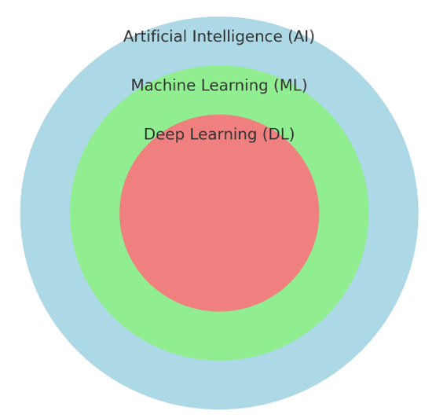

##  01 : 강의 소개(실습환경 준비), AI의 정의와 역사

## 2024년 10대 전략기술 트렌트

<출처:https://www.gartner.com/en/articles/gartner-top-10-strategic-technology-trends-for-2024>

|Year|Trend 1|Trend 2|Trend 3|Trend 4|Trend 5|Trend 6|Trend 7|Trend 8|Trend 9|Trend 10|
|:---:|:---:|:---:|:---:|:---:|:---:|:---:|:---:|:---:|:---:|:---:|
|2024|Democratized Generative AI|AI Trust, Risk, and Security Mgmt|Sustainable Technology|Platform Engineering|AI-Augmented Development|Industry Cloud Platforms|Intelligent Applications|Augmented-Connected Workforce|Continuous Threat Exposure Mgmt|Machine Customers|
|2023|Sustainability|Generative AI|Privacy-Enhancing Computation|Cloud-Native Platforms|Composable Applications|Decision Intelligence|Hyperautomation|Autonomic Systems|AI Engineering|Distributed Enterprise|
|2022|Data Fabric|Cybersecurity Mesh|Privacy-Enhancing Computation|Cloud-Native Platforms|Composable Applications|Decision Intelligence|Hyperautomation|Autonomic Systems|AI Engineering|Distributed Enterprise|
|2021|Internet of Behaviors|Total Experience (TX)|Privacy-Enhancing Computation|Distributed Cloud|Anywhere Operations|Cybersecurity Mesh|Intelligent Composable Business|AI Engineering|Hyperautomation|Anywhere Operations|
|2020|Hyperautomation|Multi-experience|Democratization of Expertise|Human Augmentation|Transparency and Traceability|AI Security|Distributed Cloud|Practical Blockchain|AI-Driven Development|Autonomous Things|
|2019|Autonomous Things|Augmented Analytics|AI-Driven Development|Digital Twins|Empowered Edge|Smart Spaces|Immersive Experience|Digital Ethics and Privacy|Quantum Computing|Augmented Reality|
|2018|AI Foundation|Intelligent Apps and Analytics|Intelligent Things|Digital Twins|Cloud to the Edge|Conversational Platforms|Immersive Experience|Blockchain|Event-Driven|Continuous Adaptive Risk and Trust|
|2017|Intelligent Apps|Intelligent Things|Digital Twins|Blockchain|Mesh App and Service Arch|Digital Technology Platforms|Immersive Experience|Adaptive Security Architecture|Advanced System Architecture|Through Silicon Via|
|2016|The Device Mesh|Ambient User Experience|3D-Printing Materials|Information of Everything|Advanced System Architecture|Mesh App and Service Arch|Ambient User Experience|Internet of Things|The Ambient User Experience|Smart Dust|
|2015|Computing Everywhere|Internet of Things|3D Printing|Advanced, Pervasive, and Invisible Analytics|Context-Rich Systems|Smart Machines|Cloud/Client Computing|Software-Defined Applications|Web-Scale IT|Risk-Based Security and Self-Protection|
|2014|Internet of Things|Cloud Computing|Big Data|Cloud-Based|Cloud Services|Big Data|Business Intelligence|Mobile Cloud|Social Software and Collaboration|Mobile Devices|
|2013|Mobile|Mobile Applications|Cloud|Cloud Computing|Cloud Services|Cloud|Business Intelligence|Virtualization|Virtualization|Cloud|
|2012|Business Analytics|App and Service Architecture|Advanced Analytics|Cloud Services|Big Data Analytics|Virtualization|Cloud Computing|Data Integration|Advanced Analytics|Data Integration|
|2011|Social Software and Collaboration|Social Media Analytics|Cloud Services|Mobile Device Management|Cloud Computing|Cloud Native|Business Intelligence|Business Process Management|IoT|Business Intelligence|
|2010|Cloud Computing|Big Data|Mobile Device Deployment|Business Intelligence|Business Intelligence|Cloud Native|Mobile Devices|Business Process Management|IoT|Data Integration|
|2009|Virtualization|Cloud/Client Computing|Software-Defined Networking|Mobile Cloud|Cloud Infrastructure Services|Edge Computing|IoT|Advanced System Architecture|Advanced Analytics|IoT|
|2008|Web-Scale IT|Edge Computing|Context-Rich Systems|Social Networks|Mobile Device Management|Cloud Services|Cloud Infrastructure Service|Mobile Devices|IoT|Application Security|
|2007|Service-Oriented Architecture|Social Networks|Business Process Management|Cloud Infrastructure Services|Cloud Services|IoT|Application Security|Automation|Big Data|Data Integration|
|2006|Application Infrastructure|Contextual Services|IoT|IT Service Management|Automation|Application Infrastructure|Data Integration|Application Infrastructure|Big Data Analytics|Application Infrastructure|
|2005|Automated IT|IT Asset Management|Mobile Device Management|Analytics|Enterprise Mobility Management|Analytics-Driven Business Intelligence|Big Data|Business Process Management|Big Data Analytics|Business Process Management|

|년도|트렌드 1|트렌드 2|트렌드 3|트렌드 4|트렌드 5|트렌드 6|트렌드 7|트렌드 8|트렌드 9|트렌드 10|
|:---:|:---:|:---:|:---:|:---:|:---:|:---:|:---:|:---:|:---:|:---:|
|2024|민주화된 생성 AI|AI 신뢰, 위험 및 보안 관리 (AI TRiSM)|지속 가능한 기술|플랫폼 엔지니어링|AI 증강 개발|산업 클라우드 플랫폼|지능형 애플리케이션|증강 연결된 인력|지속적 위협 노출 관리 (CTEM)|기계 고객|
|2023|지속 가능성|생성 AI|프라이버시 강화 컴퓨팅|클라우드 네이티브 플랫폼|컴포저블 애플리케이션|의사 결정 지능|하이퍼 자동화|자동화 시스템|AI 엔지니어링|분산 엔터프라이즈|
|2022|데이터 패브릭|사이버 보안 메쉬|프라이버시 강화 컴퓨팅|클라우드 네이티브 플랫폼|컴포저블 애플리케이션|의사 결정 지능|하이퍼 자동화|자가 관리 시스템|AI 엔지니어링|분산 엔터프라이즈|
|2021|행동 인터넷|총체적 경험 (TX)|프라이버시 강화 컴퓨팅|분산 클라우드|어디서나 운영|사이버 보안 메쉬|지능형 컴포저블 비즈니스|AI 엔지니어링|하이퍼 자동화|어디서나 운영|
|2020|하이퍼 자동화|다중 경험|전문성 민주화|인간 증강|투명성과 추적 가능성|AI 보안|분산 클라우드|실용적인 블록체인|AI 주도 개발|자율 시스템|
|2019|자율 시스템|증강 분석|AI 주도 개발|디지털 트윈|엣지 컴퓨팅|몰입형 경험|스마트 공간|디지털 윤리 및 프라이버시|양자 컴퓨팅|증강 현실|
|2018|AI 기반|지능형 애플리케이션 및 분석|지능형 사물|디지털 트윈|엣지로의 클라우드|대화형 플랫폼|몰입형 경험|블록체인|이벤트 기반|지속적 적응 위험 및 신뢰|
|2017|지능형 애플리케이션|지능형 사물|디지털 트윈|블록체인|대화형 시스템|메쉬 애플리케이션 및 서비스 아키텍처|디지털 기술 플랫폼|적응형 보안 아키텍처|고급 시스템 아키텍처|실리콘 비아|
|2016|장치 메쉬|주변 사용자 경험|3D 프린팅 재료|모든 것의 정보|고급 시스템 아키텍처|메쉬 애플리케이션 및 서비스 아키텍처|자율 에이전트|사물 인터넷|주변 사용자 경험|스마트 더스트|
|2015|컴퓨팅 모든 곳|사물 인터넷|3D 프린팅|고급, 널리 퍼지고 투명한 분석|컨텍스트 풍부한 시스템|스마트 머신|클라우드/클라이언트 컴퓨팅|소프트웨어 정의 애플리케이션 및 인프라|웹 규모 IT|위험 기반 보안 및 자기 보호|
|2014|사물 인터넷|클라우드 컴퓨팅|빅 데이터|클라우드 기반|클라우드 서비스|빅 데이터|비즈니스 인텔리전스|모바일 클라우드|소셜 소프트웨어와 협업|모바일 디바이스|
|2013|모바일|모바일 애플리케이션|클라우드|클라우드 컴퓨팅|클라우드 서비스|클라우드|비즈니스 인텔리전스|가상화|가상화|클라우드|
|2012|비즈니스 분석|앱 및 서비스 아키텍처|고급 분석|클라우드 서비스|빅 데이터 분석|가상화|클라우드 컴퓨팅|데이터 통합|고급 분석|데이터 통합|
|2011|소셜 소프트웨어와 협업|소셜 미디어 분석|클라우드 서비스|모바일 기기 관리|클라우드 컴퓨팅|클라우드 네이티브|비즈니스 인텔리전스|비즈니스 프로세스 관리|IoT|비즈니스 인텔리전스|
|2010|클라우드 컴퓨팅|빅 데이터|모바일 디바이스 배포|비즈니스 인텔리전스|비즈니스 인텔리전스|클라우드 네이티브|모바일 디바이스|비즈니스 프로세스 관리|IoT|데이터 통합|
|2009|가상화|클라우드/클라이언트 컴퓨팅|소프트웨어 정의 네트워크|모바일 클라우드|클라우드 인프라 서비스|엣지 컴퓨팅|IoT|고급 시스템 아키텍처|고급 분석|IoT|
|2008|웹 스케일 IT|엣지 컴퓨팅|컨텍스트 리치 시스템|소셜 네트워크|모바일 기기 관리|클라우드 서비스|클라우드 인프라 서비스|모바일 디바이스|IoT|애플리케이션 보안|
|2007|서비스 지향 아키텍처|소셜 네트워크|비즈니스 프로세스 관리|클라우드 인프라 서비스|클라우드 서비스|IoT|애플리케이션 보안|자동화|빅 데이터|데이터 통합|
|2006|애플리케이션 인프라|컨텍스트 서비스|IoT|IT 서비스 관리|자동화|애플리케이션 인프라|데이터 통합|애플리케이션 인프라|빅 데이터 분석|애플리케이션 인프라|
|2005|자동화된 IT|IT 자산 관리|모바일 기기 관리|분석|엔터프라이즈 모빌리티 관리|분석 기반 비즈니스 인텔리전스|빅 데이터|비즈니스 프로세스 관리|빅 데이터 분석|비즈니스 프로세스 관리|

## ChatGPT가 그린 AI 이미지

## 파이썬 패키지 설치

파이썬은 세 개의 주요 운영 체제인 마이크로소프트 윈도(Microsoft Windows), macOS, 리눅스(Linux)에서 사용할 수 있습니다. 파이썬 공식 웹 사이트(https://www.python.org)에서 문서와 설치 파일을 내려받을 수 있습니다

책은 파이썬 3.7.2 버전과 그 이상에 맞추어져 있습니다. 현재 파이썬 3의 최신 버전을 사용하는 것이 좋습니다.
일부 코드는 파이썬 2.7과 호환될 수 있지만 파이썬 2.7의 공식 지원이 2019년 말에 끝났기 때문에 상당수의 오픈 소스 라이브러리는 이미 파이썬 2.7에 대한 지원을 중단했습니다(https://python3statement.org/). 따라서 파이썬 3.7 또는 그 이상을 사용하는 것이 매우 권장됩니다.

**노트**

다음 명령으로 현재 파이썬 버전을 확인할 수 있습니다.

    $ python -V

예를 들면 다음과 같이 출력됩니다.

    Python 3.7.1 :: Continuum Analytics, Inc.

#### pip

책에서 사용할 패키지는 pip 설치 프로그램으로 설치할 수 있습니다. 이 프로그램은 파이썬 3.3
버전부터 파이썬 표준 라이브러리에 포함되었습니다. 자세한 pip 설명은 온라인 문서(https://
docs.python.org/3/installing/index.html)를 참고하세요.

파이썬을 설치하고 난 후 터미널(Terminal)에서 pip 명령으로 필요한 파이썬 패키지를 설치할 수
있습니다:

    pip install SomePackage

(`SomePackage`는 numpy, pandas, matplotlib, scikit-learn 등이 될 수 있습니다)

설치한 패키지를 업데이트할 때는 `--upgrade` 옵션을 사용합니다:

    pip install SomePackage --upgrade

#### 아나콘다

과학 컴퓨팅을 위해서는 컨티넘 애널리틱스(Continuum Analytics)의 아나콘다(Anaconda) 파이썬 배포판을 권장합니다. 아나콘다는 상업적 목
적을 포함하여 무료로 사용할 수 있고 기업이 사용하기 충분한 수준의 파이썬 배포판입니다. 데이
터 과학, 수학, 공학용 파이썬 필수 패키지들을 모두 포함하고 있으며 주요 운영 체제를 모두 지원
합니다. 아나콘다 설치 파일은 https://www.anaconda.com/download/에서 내려받을 수 있
습니다. 간단한 아나콘다 안내는 온라인 문서(https://docs.anaconda.com/anaconda/userguide/
getting-started/)를 참고하세요.

아나콘다를 설치한 후 다음 명령으로 필요한 파이썬 패키지를 설치할 수 있습니다:

    conda install SomePackage

설치한 패키지를 업데이트할 때는 다음 명령을 사용합니다:

    conda update SomePackage

책 전반에 걸쳐 데이터를 저장하고 조작하는 데 넘파이 다차원 배열을 주로 사용합니다. 이따금
판다스(Pandas)도 사용합니다. 판다스는 넘파이 위에 구축된 라이브러리고 테이블 형태의 데이터
를 아주 쉽게 다룰 수 있는 고수준 도구를 제공합니다. 종종 정량적인 데이터를 시각화하면
이해하는 데 매우 도움이 됩니다. 이를 위해 많은 옵션을 제공하는 맷플롯립(Matplotlib) 라이
브러리를 사용하겠습니다.

#### 핵심 패키지

책에서 사용하는 주요 파이썬 패키지 버전은 다음과 같습니다. 여러분 컴퓨터에 설치된 패키지와
버전이 동일하거나 더 높은지 확인하세요. 예제 코드를 정상적으로 실행하려면 버전을 맞추는 것
이 좋습니다:

- [NumPy](http://www.numpy.org) >= 1.18.5
- [SciPy](http://www.scipy.org) >= 1.4.1
- [scikit-learn](http://scikit-learn.org/stable/) >= 0.23.2
- [matplotlib](http://matplotlib.org) >= 3.1.1
- [pandas](http://pandas.pydata.org) >= 1.0.4
- [TensorFlow](https://www.tensorflow.org) >= 2.3.0

## 파이썬/주피터 노트북

어떤 독자들은 `.ipynb` 코드 파일에 무엇인지 모를 수 있습니다. 이 파일은 IPython 노트북입니다. 이 책의 코드는 평범한 파이썬 `.py` 스크립트 대신에 IPython 노트북에 담겨 있습니다. IPython 노트북이 데이터 분석 프로젝트에 안성맞춤이기 때문입니다! IPython 노트북을 사용하면 한 곳에서 모든 것을 처리할 수 있습니다. 코드, 코드를 실행한 결과, 그래프, 막다운(markdown)과 LaTeX 문법을을 지원하는 문서까지 가능합니다!

**노트:**  "IPython 노트북"은 최근에 "[주피터(Jupyter) 노트북](http://jupyter.org)"으로 바뀌었습니다. 주피터는 파이썬 외에도 줄리아(Julia), R 등의 다른 언어를 지원하는 프로젝트입니다. 파이썬 사용자에게는 달라지는 것이 없습니다. 이름만 바뀌었을 뿐입니다("IPython 노트북" 대신 "주피터 노트북"이라고 부릅니다).

주피터 노트북은 pip를 사용해 설치할 수 있습니다.

    $ pip install jupyter notebook

또는 아나콘다나 미니콘다를 설치했다면 콘다를 사용할 수 있습니다:

    $ conda install jupyter notebook

주피터 노트북을 열려면 먼저 코드가 있는 디렉토리로 이동합니다. 예를 들어:

    $ cd ~/code/python-machine-learning-book

그다음 `jupyter notebook`을 실행합니다.

    $ jupyter notebook

주피터가 기본 브라우저를 실행합니다(일반적으로 [http://localhost:8888/](http://localhost:8888/)에서 실행됩니다). 이제 주피터 메뉴에서 원하는 노트북을 선택해 열 수 있습니다.

주피터 노트북에 대한 더 자세한 내용은 [주피터 초보자 가이드](http://jupyter-notebook-beginner-guide.readthedocs.org/en/latest/what_is_jupyter.html)와 [주피터 노트북 기본사항](https://jupyter-notebook.readthedocs.io/en/stable/examples/Notebook/Notebook%20Basics.html)을 참고하세요.

## 주피터 랩

또 다른 주피터 노트북 환경인 주피터 랩(Jupyter Lab)이 2018년에 릴리스되었습니다. 동일한 `.ipynb` 파일을 다룰 수 있지만 브라우저 인터페이스에서 추가적인 기능을 제공합니다. 주피터 노트북과 주피터 랩 중 어느 것을 사용해도 괜찮습니다.

주피터 랩은 다음과 같이 설치할 수 있습니다.

    $ conda install -c conda-forge jupyterlab

주피터 노트북과 비슷하게 실행하려면 다음 명령을 실행합니다.

    $ jupyter lab

이 명령을 커맨드 라인 터미널에서 실행하면 브라우저에서 주피터 랩 세션을 시작합니다. 주피터 랩에 대한 더 자세한 정보는 [공식 문서](https://jupyterlab.readthedocs.io/en/stable/)를 참고하세요.
