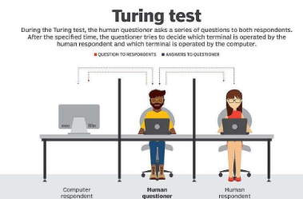
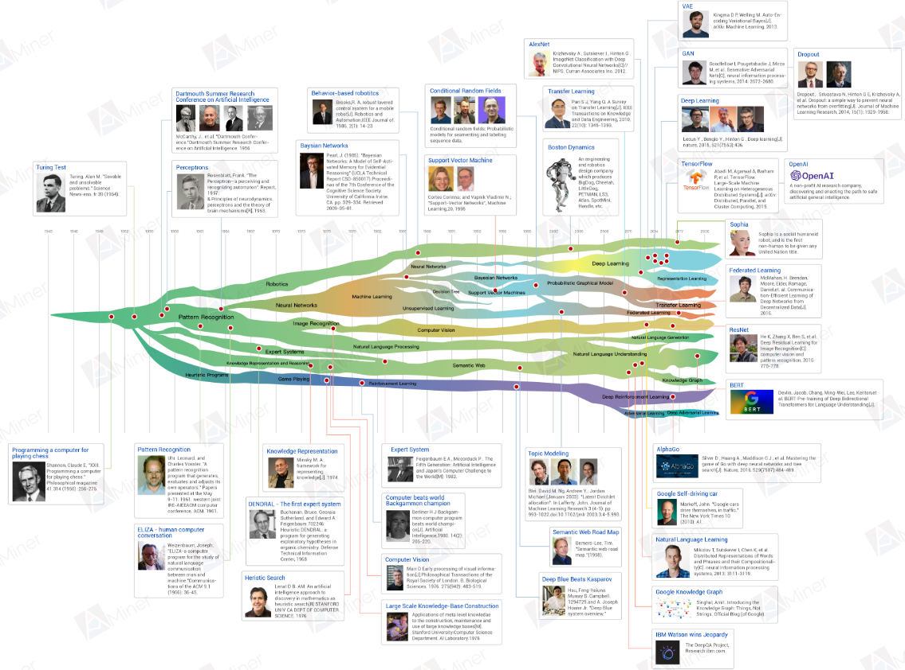
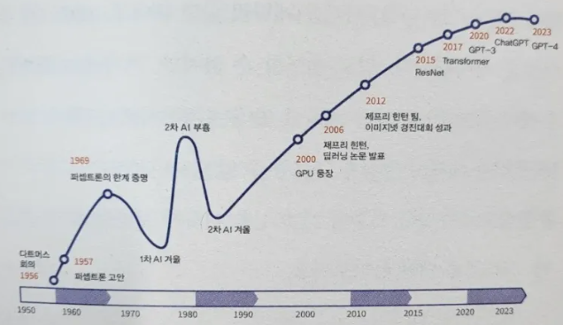
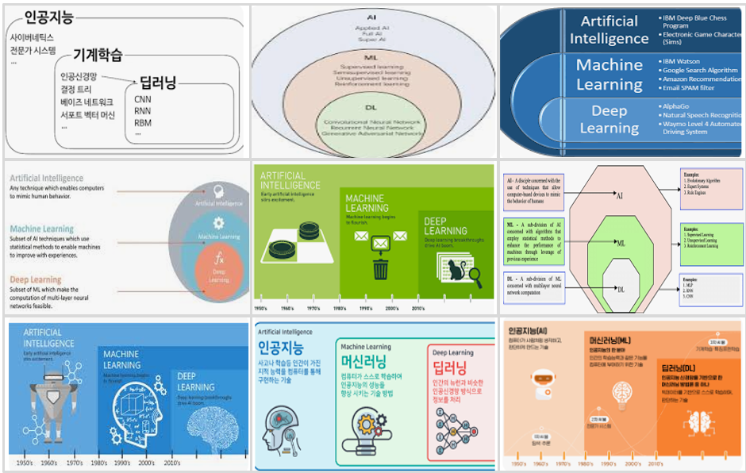
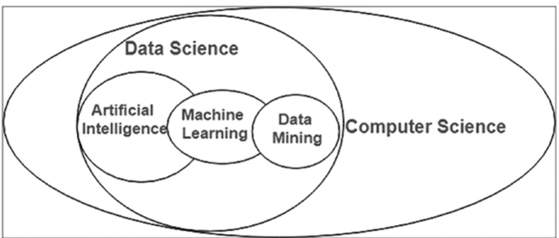
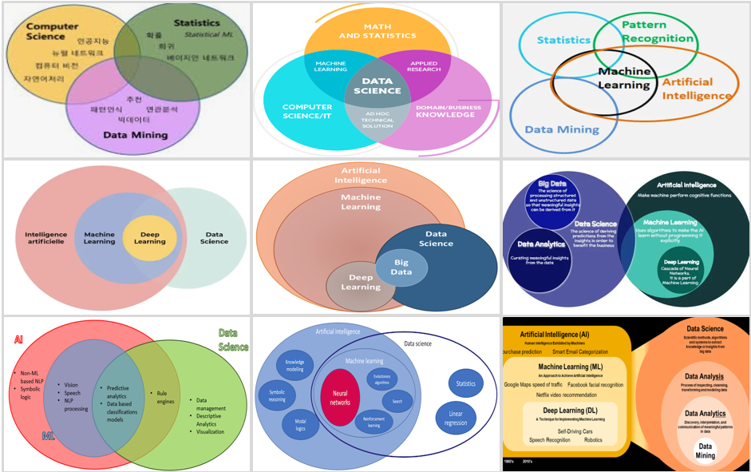
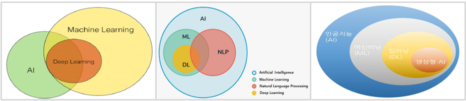
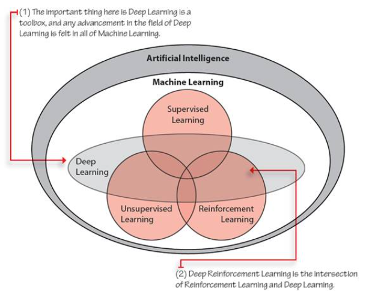
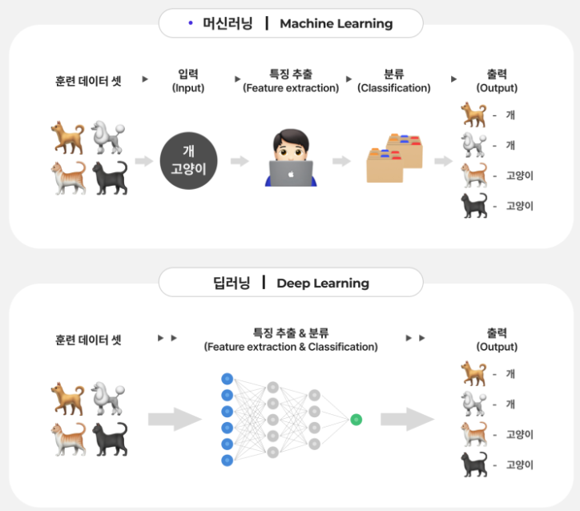

#  01 : 강의 소개(실습환경 준비), AI의 정의와 역사

---
	 ▣ 2024년 10대 전략기술 트렌트
	 ▣ AI의 역사
	 ▣ AI의 정의
	 ▣ AI의 정의(최근 IT기업)
	 ▣ AI의 유형
	 ▣ AI의 활용 분야
  	 ▣ AI, ML, DL
  	 ▣ 실습 준비
---

# ▣ 2024년 10대 전략기술 트렌트

 (출처) Gartner 홈페이지(https://www.gartner.com/en/articles/gartner-top-10-strategic-technology-trends-for-2024)
<!--

-->

## 최근 10년간 10대 전략기술

<!--
|Year|Trend 1|Trend 2|Trend 3|Trend 4|Trend 5|Trend 6|Trend 7|Trend 8|Trend 9|Trend 10|
|:---:|:---:|:---:|:---:|:---:|:---:|:---:|:---:|:---:|:---:|:---:|
|2024|Democratized Generative AI|AI Trust, Risk, and Security Mgmt|Sustainable Technology|Platform Engineering|AI-Augmented Development|Industry Cloud Platforms|Intelligent Applications|Augmented-Connected Workforce|Continuous Threat Exposure Mgmt|Machine Customers|
|2023|Sustainability|Generative AI|Privacy-Enhancing Computation|Cloud-Native Platforms|Composable Applications|Decision Intelligence|Hyperautomation|Autonomic Systems|AI Engineering|Distributed Enterprise|
|2022|Data Fabric|Cybersecurity Mesh|Privacy-Enhancing Computation|Cloud-Native Platforms|Composable Applications|Decision Intelligence|Hyperautomation|Autonomic Systems|AI Engineering|Distributed Enterprise|
|2021|Internet of Behaviors|Total Experience (TX)|Privacy-Enhancing Computation|Distributed Cloud|Anywhere Operations|Cybersecurity Mesh|Intelligent Composable Business|AI Engineering|Hyperautomation|Anywhere Operations|
|2020|Hyperautomation|Multi-experience|Democratization of Expertise|Human Augmentation|Transparency and Traceability|AI Security|Distributed Cloud|Practical Blockchain|AI-Driven Development|Autonomous Things|
|2019|Autonomous Things|Augmented Analytics|AI-Driven Development|Digital Twins|Empowered Edge|Smart Spaces|Immersive Experience|Digital Ethics and Privacy|Quantum Computing|Augmented Reality|
|2018|AI Foundation|Intelligent Apps and Analytics|Intelligent Things|Digital Twins|Cloud to the Edge|Conversational Platforms|Immersive Experience|Blockchain|Event-Driven|Continuous Adaptive Risk and Trust|
|2017|Intelligent Apps|Intelligent Things|Digital Twins|Blockchain|Mesh App and Service Arch|Digital Technology Platforms|Immersive Experience|Adaptive Security Architecture|Advanced System Architecture|Through Silicon Via|
|2016|The Device Mesh|Ambient User Experience|3D-Printing Materials|Information of Everything|Advanced System Architecture|Mesh App and Service Arch|Ambient User Experience|Internet of Things|The Ambient User Experience|Smart Dust|
|2015|Computing Everywhere|Internet of Things|3D Printing|Advanced, Pervasive, and Invisible Analytics|Context-Rich Systems|Smart Machines|Cloud/Client Computing|Software-Defined Applications|Web-Scale IT|Risk-Based Security and Self-Protection|
|2014|Internet of Things|Cloud Computing|Big Data|Cloud-Based|Cloud Services|Big Data|Business Intelligence|Mobile Cloud|Social Software and Collaboration|Mobile Devices|
|2013|Mobile|Mobile Applications|Cloud|Cloud Computing|Cloud Services|Cloud|Business Intelligence|Virtualization|Virtualization|Cloud|
|2012|Business Analytics|App and Service Architecture|Advanced Analytics|Cloud Services|Big Data Analytics|Virtualization|Cloud Computing|Data Integration|Advanced Analytics|Data Integration|
|2011|Social Software and Collaboration|Social Media Analytics|Cloud Services|Mobile Device Management|Cloud Computing|Cloud Native|Business Intelligence|Business Process Management|IoT|Business Intelligence|
|2010|Cloud Computing|Big Data|Mobile Device Deployment|Business Intelligence|Business Intelligence|Cloud Native|Mobile Devices|Business Process Management|IoT|Data Integration|
|2009|Virtualization|Cloud/Client Computing|Software-Defined Networking|Mobile Cloud|Cloud Infrastructure Services|Edge Computing|IoT|Advanced System Architecture|Advanced Analytics|IoT|
|2008|Web-Scale IT|Edge Computing|Context-Rich Systems|Social Networks|Mobile Device Management|Cloud Services|Cloud Infrastructure Service|Mobile Devices|IoT|Application Security|
|2007|Service-Oriented Architecture|Social Networks|Business Process Management|Cloud Infrastructure Services|Cloud Services|IoT|Application Security|Automation|Big Data|Data Integration|
|2006|Application Infrastructure|Contextual Services|IoT|IT Service Management|Automation|Application Infrastructure|Data Integration|Application Infrastructure|Big Data Analytics|Application Infrastructure|
|2005|Automated IT|IT Asset Management|Mobile Device Management|Analytics|Enterprise Mobility Management|Analytics-Driven Business Intelligence|Big Data|Business Process Management|Big Data Analytics|Business Process Management|

|년도|트렌드 1|트렌드 2|트렌드 3|트렌드 4|트렌드 5|트렌드 6|트렌드 7|트렌드 8|트렌드 9|트렌드 10|
|:---:|:---:|:---:|:---:|:---:|:---:|:---:|:---:|:---:|:---:|:---:|
|2024|민주화된 생성 AI|AI 신뢰, 위험 및 보안 관리 (AI TRiSM)|지속 가능한 기술|플랫폼 엔지니어링|AI 증강 개발|산업 클라우드 플랫폼|지능형 애플리케이션|증강 연결된 인력|지속적 위협 노출 관리 (CTEM)|기계 고객|
|2023|지속 가능성|생성 AI|프라이버시 강화 컴퓨팅|클라우드 네이티브 플랫폼|컴포저블 애플리케이션|의사 결정 지능|하이퍼 자동화|자동화 시스템|AI 엔지니어링|분산 엔터프라이즈|
|2022|데이터 패브릭|사이버 보안 메쉬|프라이버시 강화 컴퓨팅|클라우드 네이티브 플랫폼|컴포저블 애플리케이션|의사 결정 지능|하이퍼 자동화|자가 관리 시스템|AI 엔지니어링|분산 엔터프라이즈|
|2021|행동 인터넷|총체적 경험 (TX)|프라이버시 강화 컴퓨팅|분산 클라우드|어디서나 운영|사이버 보안 메쉬|지능형 컴포저블 비즈니스|AI 엔지니어링|하이퍼 자동화|어디서나 운영|
|2020|하이퍼 자동화|다중 경험|전문성 민주화|인간 증강|투명성과 추적 가능성|AI 보안|분산 클라우드|실용적인 블록체인|AI 주도 개발|자율 시스템|
|2019|자율 시스템|증강 분석|AI 주도 개발|디지털 트윈|엣지 컴퓨팅|몰입형 경험|스마트 공간|디지털 윤리 및 프라이버시|양자 컴퓨팅|증강 현실|
|2018|AI 기반|지능형 애플리케이션 및 분석|지능형 사물|디지털 트윈|엣지로의 클라우드|대화형 플랫폼|몰입형 경험|블록체인|이벤트 기반|지속적 적응 위험 및 신뢰|
|2017|지능형 애플리케이션|지능형 사물|디지털 트윈|블록체인|대화형 시스템|메쉬 애플리케이션 및 서비스 아키텍처|디지털 기술 플랫폼|적응형 보안 아키텍처|고급 시스템 아키텍처|실리콘 비아|
|2016|장치 메쉬|주변 사용자 경험|3D 프린팅 재료|모든 것의 정보|고급 시스템 아키텍처|메쉬 애플리케이션 및 서비스 아키텍처|자율 에이전트|사물 인터넷|주변 사용자 경험|스마트 더스트|
|2015|컴퓨팅 모든 곳|사물 인터넷|3D 프린팅|고급, 널리 퍼지고 투명한 분석|컨텍스트 풍부한 시스템|스마트 머신|클라우드/클라이언트 컴퓨팅|소프트웨어 정의 애플리케이션 및 인프라|웹 규모 IT|위험 기반 보안 및 자기 보호|
|2014|사물 인터넷|클라우드 컴퓨팅|빅 데이터|클라우드 기반|클라우드 서비스|빅 데이터|비즈니스 인텔리전스|모바일 클라우드|소셜 소프트웨어와 협업|모바일 디바이스|
|2013|모바일|모바일 애플리케이션|클라우드|클라우드 컴퓨팅|클라우드 서비스|클라우드|비즈니스 인텔리전스|가상화|가상화|클라우드|
|2012|비즈니스 분석|앱 및 서비스 아키텍처|고급 분석|클라우드 서비스|빅 데이터 분석|가상화|클라우드 컴퓨팅|데이터 통합|고급 분석|데이터 통합|
|2011|소셜 소프트웨어와 협업|소셜 미디어 분석|클라우드 서비스|모바일 기기 관리|클라우드 컴퓨팅|클라우드 네이티브|비즈니스 인텔리전스|비즈니스 프로세스 관리|IoT|비즈니스 인텔리전스|
|2010|클라우드 컴퓨팅|빅 데이터|모바일 디바이스 배포|비즈니스 인텔리전스|비즈니스 인텔리전스|클라우드 네이티브|모바일 디바이스|비즈니스 프로세스 관리|IoT|데이터 통합|
|2009|가상화|클라우드/클라이언트 컴퓨팅|소프트웨어 정의 네트워크|모바일 클라우드|클라우드 인프라 서비스|엣지 컴퓨팅|IoT|고급 시스템 아키텍처|고급 분석|IoT|
|2008|웹 스케일 IT|엣지 컴퓨팅|컨텍스트 리치 시스템|소셜 네트워크|모바일 기기 관리|클라우드 서비스|클라우드 인프라 서비스|모바일 디바이스|IoT|애플리케이션 보안|
|2007|서비스 지향 아키텍처|소셜 네트워크|비즈니스 프로세스 관리|클라우드 인프라 서비스|클라우드 서비스|IoT|애플리케이션 보안|자동화|빅 데이터|데이터 통합|
|2006|애플리케이션 인프라|컨텍스트 서비스|IoT|IT 서비스 관리|자동화|애플리케이션 인프라|데이터 통합|애플리케이션 인프라|빅 데이터 분석|애플리케이션 인프라|
|2005|자동화된 IT|IT 자산 관리|모바일 기기 관리|분석|엔터프라이즈 모빌리티 관리|분석 기반 비즈니스 인텔리전스|빅 데이터|비즈니스 프로세스 관리|빅 데이터 분석|비즈니스 프로세스 관리|
-->

## 2024년, Hyper Cycle for Emerging Technologies

 
가트너가 2024년 Hype Cycle for Emerging Technologies 보고서를 통해 주목해야 할 25가지의 혁신 기술을 발표했다. 이 기술들은 ①자율형 AI, ②개발자 생산성, ③총체적 경험, ④인간 중심의 보안 및 개인정보 보호 프로그램 등 네 가지 주요 트렌드로 분류된다. 
 
**①자율형 AI:** AI의 빠른 발전으로 인해 인간의 감독을 최소화하면서, 스스로 작동하고 개선하며 복잡한 환경에서도 효과적인 의사 결정을 내릴 수 있는 자율형 AI 시스템이 탄생했다. 인간이 할 수 있는 모든 작업을 수행할 수 있는 이러한 첨단 AI 시스템은 공상 과학에서 현실로 다가오고 있다. 이 기술에는 다중 에이전트 시스템, 대규모 행동 모델, 기계 고객, 휴머노이드 작업 로봇, 자율 에이전트, 강화 학습 등이 포함된다. 
**②개발자 생산성 향상:** 개발자 생산성은 코드를 빠르게 작성하는 것 이상의 의미를 갖는다. 이는 개발자의 효과적인 커뮤니케이션과 협업, 집중력, 만족도 등에 영향을 받는다. 개발자의 생산성을 향상시키는 신기술로는 AI 증강 소프트웨어 엔지니어링, 클라우드 네이티브, 깃옵스, 내부 개발자 포털, 프롬프트 엔지니어링, 웹어셈블리 등이 있다. 
**③총체적 경험을 통한 역량 강화:** 총체적 경험은 고객 경험, 직원 경험, 다중 경험, 사용자 경험을 서로 연결해 우수한 공유 경험을 창출하는 전략이다. 신뢰도, 만족도, 충성도, 지지도 향상을 목표로 기술을 사용해 중요한 상호 작용을 해결하고 고객과 직원 모두의 역량을 강화한다. 평가 대상 기술에는 디지털 트윈, 공간 컴퓨팅, 슈퍼앱, 6G 등이 포함된다. 
**④인간 중심의 보안 및 개인정보보호 제공:** 기업은 상호 신뢰의 문화를 조성하고 팀 간에 공유된 위험을 인식하는 보안 및 개인정보 보호 기술을 사용해 더욱 탄력적인 조직으로 거듭날 수 있다. 인간 중심 보안 및 개인정보 보호를 지원하는 떠오르는 기술로는 AI 트리즘, 사이버 보안 메시 아키텍처, 디지털 면역 시스템, 허위 정보 보안, 연합 머신러닝, 동형 암호가 있다. 
 (출처) https://github.com/YangGuiBee/ML/blob/main/TextBook-01/Hype_Cycle_for_Emerg_tech.pdf

  

## 2024년, Hyper Cycle for AI

 
 (출처) https://github.com/YangGuiBee/ML/blob/main/TextBook-01/Hype_Cycle_for_AI.pdf

   

---

# ▣ AI의 역사

  

## 1. AI의 태동기 (~ 1955년)  										
**1936년:** 앨런 튜링(Alan Turing, 1912~1954)은 "On Computable Numbers, with an Application to the Entscheidungsproblem (https://github.com/YangGuiBee/ML/blob/main/TextBook-01/TuringFullText.pdf) " 논문을 통해 계산할 수 있는 것과 없는 것을 구분하여, 어떤 문제들은 컴퓨터(또는 기계)가 풀 수 있지만, 어떤 문제들은 아무리 노력해도 풀 수 없다는 것을 증명한 연구로 튜링 머신 이론과 노이만형 컴퓨터에 있어서 이론적 토대를 제시하고 수십 년간 컴퓨터 과학과 인공지능 분야에서 이루어진 모든 연구의 기반이 됨 
**1946년:** 세계 최초의 범용 디지털 컴퓨터(애니악) 탄생 
**1943년:** 워런 맥컬록(Warren McCulloch)과 월터 피츠(Walter Pitts)는  "A Logical Calculus of the Ideas Immanent in Nervous Activity" (https://github.com/YangGuiBee/ML/blob/main/TextBook-01/McCulloch_Pitts.pdf) 논문을 통해 신경망 모델의 기초를 마련. 신경망의 수학적 모델을 제안. 신경세포(뉴런)를 이진(binary) 장치로 모델링하여 입력 신호가 일정한 임계값을 넘으면 뉴런이 활성화되어 출력을 생성하고, 그렇지 않으면 비활성 상태로 남는다는 뉴런의 "발화" 메커니즘을 설명한 것으로, 현재의 퍼셉트론(Perceptron) 개념의 기초가 됨 	
**1950년:** 앨런 튜링(Alan Turing)은 클로드 섀넌(Claude Shannon)과 함께 철학 저널 '마인드(Mind)'에 "기계가 생각할 수 있는가?(https://github.com/YangGuiBee/ML/blob/main/TextBook-01/Computing%20Machinery%20and%20Intelligence.pdf)"라는 주제의 논문을 발표하고, 튜링 테스트라는 '기계가 생각하는 것이 가능한가?'라는 명제로 기계의 답이 얼마나 인간다운지 평가한 실험을 발표 

<a href="https://ko.wikipedia.org/wiki/%ED%8A%9C%EB%A7%81_%ED%85%8C%EC%8A%A4%ED%8A%B8" target="_blank">튜링테스트의 개념</a>

   

## 2. 데이터 기반 분석 (1956년 ~ 1960년대)  

**1956년:** <ins>다트머스 회의(Dartmouth Conference)</ins>에서 '인공지능'이라는 용어가 처음 사용되었으며, 인공지능 연구의 출발점으로 간주. 존 매카시(John McCarthy), 마빈 민스키(Marvin Minsky), 클로드 섀넌(Claude Shannon) 등이 참석하여 AI의 가능성과 기계가 인간처럼 지능적 작업을 수행할 수 있는 가능성에 대해 논의. 앨런 뉴웰(Allen Newell)과 허버트 사이먼(Herbert A. Simon)은 "The Logic Theory Machine: A Complex Information Processing System" (https://github.com/YangGuiBee/ML/blob/main/TextBook-01/logictheorymachine.pdf) 논문에서 인간의 사고를 모방하는 기계의 가능성에 대해 논의하며, 논리적 이론을 증명할 수 있는 '논리 이론가(The Logic Theorist)'라는 컴퓨터 프로그램을 개발함으로써 AI 연구의 초기 단계에서 중요한 기여였으며, 이 논문은 인공지능의 문제 해결 능력과 알고리즘의 효율성에 대한 논의를 포함. 
 
**1957년:** 프랭크 로젠블렛(Frank Rosenblatt)은 <ins>퍼셉트론(Perceptron)</ins> 이라는 초기 신경망 모델을 개발. 퍼셉트론은 간단한 형태의 기계 학습 모델로, 패턴 인식 문제를 해결할 수 있는 가능성을 보여줌.퍼셉트론은 패턴 인식을 위한 학습 알고리즘을 포함하고 있으며, 입력 데이터에 대한 가중치를 조정하여 학습하고, 이후의 다층 신경망과 딥러닝의 기초가 되는 개념을 제공. 
 <a href="https://wikidocs.net/24958" target="_blank">딥러닝을 이용한 자연어처리 입문(Perceptron)</a> 
 <a href="https://imjuno.tistory.com/entry/Perceptron-MLP" target="_blank">Perceptron 개념</a>  
**1958년:** 존 매카시는 리스프(LISP: https://ko.wikipedia.org/wiki/%EB%A6%AC%EC%8A%A4%ED%94%84) 이라는 프로그래밍 언어를 개발함으로써 인공지능 연구에서 중요한 역할을 했으며, 기호 처리(symbolic processing)에 적합한 언어로 널리 사용. 				
**1959년:** 사무엘 기계학습을 이용한 체커게임 개발 
**1960년:** 제임스 얼 캐벗(James Allen)은 자연어 이해의 기초를 마련 
**1961년:** 레너드 메릭 어(Leonard Merrick Uhr)와 찰스 M 보슬러(Charles M Vossler)는 생성, 평가 및 조정하는 패턴 인식 프로그램 자체 운영자(Own Operators)에 의한 패턴 인식 논문에서 기계학습 또는 자기 조직화 프로세스를 사용하여 패턴 인식 프로그램을 설계하려는 시도를 설명하고 최초의 기계학습 프로그램을 개발 
**1964년:** 대니얼 보브로(Daniel Bobrow)는 컴퓨터 문제 해결 시스템을 위한 자연어 입력(Natural Language Input for a Computer Problem Solving System)을 출간 
**1965년:** 자데 퍼지이론 발표 
**1966년:** MIT의 컴퓨터 과학자인 조셉 바이젠바움(Joseph Weizenbaum)은 ACM에 "ELIZA, a Computer Program for the Study of Human-Computer Natural Language Communication"이라는 논문에서 엘리자(ELIZA)라는 프로그램을 통해 인간과 컴퓨터가 어느 정도의 자연어 대화를 할 수 있게 되는 방법을 설명하고 임상 치료 중인 정신과 의사를 모방하기 위해 최초의 챗봇인 EZZA를 개발 
**1968년:** 공간탐색 알고리즘 A 발표 
**1969년:** 마빈 민스키(Marvin Minsky)와 세이무어 페퍼트(Seymour Papert)는 "Perceptrons: an introduction to computing geometry" 책 (https://direct.mit.edu/books/monograph/3132/PerceptronsAn-Introduction-to-Computational) 을 ​​통해 선형모델인 퍼셉트론이 간단한 비선형인 배타적-or(XOR) 함수를 학습할 수 없으므로 아무리 오랫동안 학습시키더라도 퍼셉트론이 그러한 함수를 학습하는 것이 이론적으로 불가능하다는 퍼셉트론의 한계를 증명 

   	

## 3. 첫번째 AI겨울 (1970년대) 
**1971년:** 제임스 라이트힐(James Lighthill)경은 대영제국의 과학 연구회의 위임을 받아 '영국 인공지능 연구 현황'에 대한 보고서를 작성하게 된다. 이 보고서에서 그는 현재의 인공지능 기술이 '폭발적 조합의 증가' 문제에 제대로 대처할 수 없다는 점을 들어 AI 연구에서 중요한 결과는커녕, 의미 있는 결과조차 찾지 못해서 'AI'라는 별도의 과학 분야는 필요 없다고 주장. 다트머스 컨퍼런스가 끝나고, 많은 과학자들이 연구에 돌입했지만, 인간에게 쉬운 글자 읽기와 그림 인식 같은 기능을 구현하는 것이 어려웠다. 그 당시에는 컴퓨터의 성능과 하드웨어도 성능이 충분하지 않았고, 기대와 달리 연구 성과가 낮아 투자가 적어지게 되어 재정적 어려움과 함께 인공지능 연구에 대한 비판이 나오기 시작되면서 당시 신경망에 대한 모든 연구가 중단되고 첫 번째 AI 겨울이 도래 
**1972년:** 인공지능 언어 Prolog 탄생 
**1973년:** 라트힐 보고서 
**1974년:** 웨어보스의 "오류 역전파 알고리즘" 논문 발표 
**1980년:** 존 설(John Searle)이라는 철학자가 학술지 『Behavioral and Brain Sciences』에 발표한 「Minds, brains, and programs」라는 논문에서 튜링 테스트를 통해 기계의 인공지능 여부를 판정할 수 없음을 논증 

   
											
## 4. 전문가 시스템의 부상과 상업화 (1980년대) 											
**1980년대:** AI 연구는 특정 분야의 지식을 기반으로 문제를 해결하는 <ins>전문가 시스템(Expert Systems)</ins>이 부상함. 예컨대, 컴퓨터 구성의 자동화를 위한 XCON(eXpert CONfigurer), 법률 분야의 루카스(LUCAS), 생명과학 및 의학 분야의 세이백(SEYBAC) 등이 상업적으로도 성공. 
**1983년:** 정통 AI(Tradition AI) 연구의 중심이 문제 해결에서 지식 표현과 추론으로 이동. 이 시기에 조지프 와이젠바움(Joseph Weizenbaum)의 엘리자(ELIZA)와 같은 프로그램이 인기. 
**1986년:** 제프리 힌튼(Geoffrey Hinton), David Rumelhart, Ronald Williams는 역전파 알고리즘(backpropagation algorithm)을 제안하여 <ins>다층 퍼셉트론 (Multilayer Perceptron, MLP)</ins>의 학습을 가능하게 했다. 입력층과 출력층 사이에 특징분석기인 은닉층(hidden layers)을 하나 이상 구성함으로써 퍼셉트론의 한계를 극복한 신경망의 학습방법의 발전으로 딥러닝 기술의 기초가 됨 

   											
											
## 5. 두 번째 AI 겨울 (1987년 ~ 1993년) 								

**1987년:** Lisp 머신의 시장 붕괴, UCI Machine Learning Repository 데이터 공개서비스 시작 
**1990년대:** 전문가 시스템의 한계(유연성 부족, 지식베이스의 유지비용, 응용의 제한성) 등과 AI의 발전속도 문제(자연어 처리의 한계, 컴퓨팅 파워와 데이터의 부족, 추론과 학습의 한계) 등으로 인해 또 다시 자금 지원이 감소함에 따라 AI 연구는 실질적인 성과를 내는 데 어려움을 겪는 '두 번째 AI 겨울'. 
**1991년:** Python 탄생 
**1993년:** R 탄생 
			
   
								
## 6. 인공신경망 연구 (1993년 ~ 2000년) 								

**1997년:** 순환신경망의 일종인 LSTM 발표, IBM 딥블루가 세계 체스 챔피언 카스파로에게 승 
**1998년:** 르쿤 컨볼루션 신경망의 실용적 학습 알고리즘 제안, 메시 "빅데이터" 용어 사용 
**1999년:** 소니 애완로봇 AIBO 시판 

   

## 7. 머신러닝과 딥러닝의 발전 (2000년 ~) 											
**2000년:** 엔비디아(NVIDIA)는 컴퓨터 시스템에서 그래픽 연산을 빠르게 처리하여 결과값을 모니터에 출력하는 연산 장치인 GPU(Graphic Processing Unit)를 최초로 출시, 컴퓨터 비전 패키지 OpenCV 공개 
**2004년:** 제1회 그랜드 챌린지(고속도로 자율주행) 
**2006년:** 컴퓨터 성능의 향상과 대량의 데이터, 그리고 새로운 알고리즘의 발전으로 인해 AI 연구가 재조명되고, 제프리 힌튼(Geoffrey Hinton)은 딥러닝 논문 "A Fast Learning Algorithm for Deep Belief Nets"  (https://github.com/YangGuiBee/ML/blob/main/TextBook-01/fastnc.pdf) 을 발표 	
**2007년:** GPU 프로그램 라이브러리(CUDA) 공개, 사이킷런(Scikit-Learn) 최초 공개 			
**2009년:** 딥러닝 패키지(Theano) 서비스 개시 
**2010년:** 스탠포드의 Fei-Fei Li 그룹에서 수백만 개의 레이블이 지정된 이미지를 포함하는 이미지넷(Imagenet) 이라는 대규모 데이터베이스 게시, 마이크로소프트 동작 인식 카메라 키넥트(Kinect) 시판 
**2012년:** 제프리 힌튼(Geoffrey Hinton)은 알렉스 크리제브스키(Alex Krizhevsky), 일리아 수츠케버(Ilya Sutskever)와 함께 이미지넷이 주최하는 대규모 시각 인식 챌린지(LSVRC)에서 GPU를 기반으로 기존 오류율을 절반으로 16%로 줄임. 이 시기에 자율주행차, 음성 인식, 자연어 처리 등의 분야에서 혁신적인 성과. 

**2014년:** 딥러닝 패키지(Caffe) 서비스 개시, 유진 구스트만(블라디미르 베셀로프, 유진 뎀첸코, 세르게이 울라센 등이 개발한 프로그램)이 튜링 테스트’를 통과한 첫 사례 
**2015년:** 클라우스 슈밥 "제4차 산업혁명" 언급, OpenAI 창립, 딥러닝 패키지(TensorFlow) 서비스 개시, ResNet이 사람보다 이미지 분류를 더욱 잘 수행 
**2016년:** AlphaGo과 이세돌9단 바둑 대결 4:1로 승, 딥러닝 패키지(PyTorch, Keras) 서비스 개시 
**2017년:** AlphaGo Zero가 AlphaGo를 100:0으로 승, 구글 Teachable Machine 공개, Transformer 모델 등장 
**2018년:** GPT/BERT 생성형 인공지능 등장, GPT(GPT-1) : 117m 파라미터 (학습데이터 4.5GB), 인공지능이 그린 초상화(에드몽 벨라미)가 경매 시장에서 432,500달러에 판매 
**2019년:** GPT-2 : 1,500m 파라미터 (학습데이터 40GB), 알프 스타 스타크래프르에서 그랜드마스터 수준 달성 
**2020년:** 대규모 언어 모델(GPT-3) 등장, GPT-3 : 175,000m 파라미터 (학습데이터 570GB), 제약회사 엑센시아 : 인공지능이 개발한 후보 신약의 1상 시험 시작 
**2021년:** AlphaFold, 딥마인드 단백질 접힘을 거의 완벽히 예측, OpenAI : 그림 인공지능 DALL·E 출시 
**2022년:** 그림 인공지능 미드저니(Midjourney) 출시, Stability AI 오픈소스 라이선스 그림 인공지능 모델인 Stable diffusion 출시, OpenAI 대화형 인공지능 ChatGPT  초기베타 출시, GPT-3.5 미국 변호사 시험(Uniform Bar Exam)에서 213점(400점 만점)을 받아 하위 10% 
**2023년:** 마이크로소프트 : 대화형 인공지능 Bing chat 출시, 구글 대화형 인공지능 Bard 출시, GPT-4 미국 변호사 시험(Uniform Bar Exam)에서 298점(400점 만점)을 받아 상위 10%로 통과, 인공지능 ‘특이점’ 돌파 이슈 	
**2024년:** 구글 'Bard' 리브랜딩한 제미나이(Gemini) 출시, Open AI 동영상 생성 인공지능 소라(Sora) 공개, 오픈AI(챗GPT) 주간 사용자 2억명, 메타(라마) 월 사용자 4억명 돌파, 사카나 AI, 과학연구 자율수행하는 'AI 에이전트' 공개, 챗GPT가 튜링 테스트를 통과하지 못한 이유..."사람보다 탁월한 게 문제"(https://www.aitimes.com/news/articleView.html?idxno=159449)

   

## 【AI 역사 요약】

<!--

-->
 (출처) Deep Learning 101 - Part 1: History and Background (http://beamlab.org/deeplearning/2017/02/23/deep_learning_101_part1.html)

  

(동영상) https://originalfileserver.aminer.cn/sys/aminer/history/AI-history-1.mp4
 
(출처) https://www.aminer.org/ai-history
 
(참고문헌) Jie Tang et al., "Extraction and Mining of Academic Social Networks" : https://github.com/YangGuiBee/ML/blob/main/TextBook-01/KDD08-Tang-et-al-ArnetMiner.pdf

   

 
(출처) 박태웅의「AI강의」(한빛비즈, 2023)

  

(출처) SAS(https://www.sas.com/ko_kr/insights/analytics/what-is-artificial-intelligence.html)
 

  

---

# ▣ AI의 정의

## 1950년, 앨런 튜링 (Alan Turing)
정의 : "인공지능은 **컴퓨터가 사람처럼 대화하고 문제를 해결할 수 있는 능력**을 의미한다." 
논문 : "Computing Machinery and Intelligence" 
설명 : 터링은 "기계가 인간처럼 생각하고 인식할 수 있는가?"와 관련하여 인공지능의 가능성을 논의하며, 기계가 인간처럼 생각할 수 있는지를 평가하기 위한 **"튜링 테스트"** 를 제안하여 AI의 철학적 기반을 다지는 중요한 작업으로 평가 

   

## 1955년, 스튜어트 러셀과 피터 노빅 (Stuart Russell and Peter Norvig)
정의 : "인공지능은 **인간의 지능적 행동을 모방하여 인간과 유사하게 학습하고, 추론하며, 적응할 수 있는 시스템을 만드는 연구**이다." 
도서 : "Artificial Intelligence: A Modern Approach" 
설명 : 이들은 AI를 지능적 에이전트를 연구하는 학문으로 정의하며, 학습과 적응의 중요성을 강조 

   

## 1956년, 존 매카시 (John McCarthy)
정의 : "인공지능은 **지능적인 행동을 수행하는 기계를 설계하고, 이들이 사람처럼 사고하고 배우는 시스템을 만드는 과학과 공학**이다." 
회의 : 다트머스 회의에서  "인공지능"이라는 용어를 처음 제안 
설명 : 이 회의는 AI 출발점으로 여겨지며, 매카시는 AI를 광범위하게 정의하면서 인간처럼 사고하고 배우는 기계를 만드는 것이 목표 

   

## 1956년, 앨런 뉴웰과 허버트 사이먼 (Allen Newell and Herbert A. Simon)
정의 : "인공지능은 **컴퓨터 프로그램이 목표를 달성하기 위해 필요한 논리적, 수학적 과정을 자동으로 수행할 수 있게 하는 능력**이다." 
회의 : 다트머스 회의에서 로직 이론가(The Logic Theorist) 발표 
설명 : 뉴웰과 사이먼은 인공지능 연구 초기 단계에서 인간의 문제 해결 능력을 컴퓨터로 재현하는 데 중점을 두고 정의를 내렸으며, 이들은 AI의 창시자로 널리 인정받고 있으며, 그들의 작업은 AI의 인지 과학적 접근의 기초를 마련 

   

## 1956년, 마빈 민스키 (Marvin Minsky)
정의 : "인공지능은 **인간처럼 사고할 수 있는 기계를 만드는 과학**이다." 
회의 : 다트머스 회의에서 발표 
설명 : 민스키는 AI 연구의 선구자로, 인간 지능을 모방하는 기계를 만드는 과학으로 AI를 정의하고 MIT에서 AI 연구실을 설립하며, AI의 발전에 중요한 역할 

   

## 1978년, 리처드 벨만 (Richard Bellman) : 인간적인 사고
정의 : "인공지능은 **복잡한 목적을 달성하기 위해 환경과의 상호작용을 통해 지능적 결정을 내리는 자동화된 의사결정 시스템**이다." 
논문 : "An Introduction to Artificial Intelligence: Can Computers Think?" 
설명 : 벨만은 AI를 환경과의 상호작용을 통해 복잡한 문제를 해결하는 자동화 시스템으로 정의했으며, 이는 동적 프로그래밍과 제어 이론에서 그의 업적과 연결. 

   

## 1992년, 파트릭 윈스턴 (Patrick Winston) : 합리적인 사고
정의 : "인공지능은 **컴퓨터가 인간의 지능적인 행위를 모방할 수 있도록 하는 알고리즘과 시스템을 연구하는 학문**이다." 
도서 : "Artificial Intelligence" 
설명 : MIT의 AI 연구원인 파트릭 윈스턴은 AI를 인간지능을 모방하는 알고리즘과 시스템을 연구하는 학문으로 정의했으며 그의 저서는 AI 교육에 널리 사용 

   

## 1994년, 리치와 나이트 (Rich & Knight)
정의 : "인공지능은 **현재는 인간이 더 잘하는 일을 컴퓨터가 수행하도록 만드는 방법에 대한 연구**이다." 
도서 : "Artificial Intelligence" 
설명 : 이 정의는 인공지능의 목표를 인간의 지능적 행동을 모방하거나 재현하기 위해 인간의 인지적 기능을 기계로 구현하는 것에 중점을 두고 있으며, 인공지능 연구의 주요 목표 중 하나인 기계가 인간처럼 학습하고, 추론하며, 문제를 해결하는 능력을 가지도록 만드는 것과 일치. 

   

## 1998년, 레이 커즈와일 (Ray Kurzweil) : 인간적인 행위
정의 : "인공지능은 **인간의 지적 능력을 확장하거나 이를 초월하는 능력을 가진 기계나 프로그램을 만드는 것**이다." 
도서 : "The Age of Spiritual Machines" 
설명 : 커즈와일은 AI를 인간 지능의 확장으로 보면서 궁극적으로는 인간 지능을 초월하는 강한 인공지능을 예측했으며, 기술적 특이점을 통해 AI가 인간의 모든 지적 활동을 수행할 수 있을 것이라고 주장. 

   

## 1998년, 데이비드 풀 (David Poole) : 합리적인 행위
정의 : "인공지능은 **확률적 추론을 통해 불확실한 상황에서 결정을 내리고, 지능적인 행동을 구현하는 시스템을 연구하는 학문**이다." 
도서 :  "Computational Intelligence: A Logical Approach" 
설명 : 풀은 AI를 불확실한 상황에서의 추론 능력으로 정의하며, 확률적 추론과 불확실한 데이터에서의 지능적 행동을 강조했으며, 이 정의는 AI의 논리적 접근과 확률적 방법론을 결합한 점에서 중요. 

   

## 2018년, 앤드류 응(Andrew Ng)
정의 : "인공지능은 **새로운 전력(電力)으로 광범위한 문제를 해결하고 다양한 산업에 혁신을 일으킬 수 있는 범용 기술**이다." 
발표 : MIT 테크놀로지 리뷰(MIT Technology Review)
설명 : 인공지능이 전기처럼 광범위한 영향을 미칠 것이라는 비유를 통해 인공지능의 중요성과 잠재력을 설명했으며, 이 비유는 이후로도 여러 강연과 글에서 반복적으로 사용. 

 

|구분| 정의(종류)|
|---|---|
|인간적인 사고|인간의 사고, 그리고 의사결정, 문제풀기, 학습 등의 활동에 연관시킬 수 있는 활동들(인지과학)|
|합리적인 사고|인지와 추론 행위를 가능하게 하는 계산의 연구(삼단논법 논리학)|
|인간적인 행위|사람이 지능적으로 수행해야 하는 기능을 수행하는 기계의 제작을 위한 기술(자연어처리,지식표현,자동추론,컴퓨터시각,로봇공학,기계학습 등)|
|합리적인 행위|지능적 에이전트와 설계에 관한 계산지능 연구(알파고)|

  

---

# ▣ AI의 정의(최근 IT기업)

## 위키백과 :
인공지능(人工智能, 영어: artificial intelligence, AI)은 **인간의 학습능력, 추론능력, 지각능력을 인공적으로 구현하려는 컴퓨터 과학의 세부분야 중 하나**로 정보공학 분야에 있어 하나의 인프라 기술. 인간을 포함한 동물이 갖고 있는 지능 즉, 자연 지능(natural intelligence)과는 다른 개념. 인간의 지능을 모방한 기능을 갖춘 컴퓨터 시스템이며, 인간의 지능을 기계 등에 인공적으로 시연(구현)한 것. 일반적으로 범용 컴퓨터에 적용한다고 가정. 이 용어는 또한 그와 같은 지능을 만들 수 있는 방법론이나 실현 가능성 등을 연구하는 과학 기술 분야를 지칭 
https://ko.wikipedia.org/wiki/%EC%9D%B8%EA%B3%B5%EC%A7%80%EB%8A%A5

## Hewlett Packard Enterprise :
광의의 AI(인공 지능)란 **기계 또는 시스템에서 표시하는 인간과 같은 모든 행동을 의미**. AI의 기본 형식에서 컴퓨터는 과거의 유사한 행동 사례를 통해 얻은 광범위한 데이터를 사용하여 인간의 행동을 ‘모방’하도록 프로그래밍 됨. 고양이와 새의 차이를 인식하는 것부터 제조 시설에서 복잡한 활동을 수행하는 것에 이르기까지 다양 
https://www.hpe.com/kr/ko/what-is/artificial-intelligence.html

## AWS : 
인공 지능(AI)은 **학습, 창조, 이미지 인식 등과 같이 주로 인간 지능과 연결된 인지 문제를 해결하는 데 주력하는 컴퓨터 공학 분야**. 현대 조직은 스마트 센서, 사람이 생성한 콘텐츠, 모니터링 도구, 시스템 로그와 같은 다양한 소스에서 대량의 데이터를 수집. AI의 목표는 데이터에서 의미를 도출하는 자기 학습 시스템을 만드는 것. 그러면 AI는 그 지식을 인간과 같은 방식으로 새로운 문제를 해결하는 데 적용. 예를 들어 AI 기술은 사람의 대화에 의미 있게 반응하고, 독창적인 이미지와 텍스트를 만들고, 실시간 데이터 입력을 기반으로 결정. 조직은 애플리케이션에 AI 기능을 통합하여 비즈니스 프로세스를 최적화하고 고객 경험을 개선하며 혁신을 가속화 
https://aws.amazon.com/ko/what-is/artificial-intelligence/

## Google Cloud :
인공지능은 일반적으로 **인간 지능이 필요하거나 인간이 분석할 수 있는 범위를 벗어난 대규모 데이터를 포함하는 방식으로 추론, 학습 및 행동할 수 있는 컴퓨터와 머신을 빌드하는 과학 분야**. AI는 컴퓨터 공학, 데이터 분석 및 통계, 하드웨어 및 소프트웨어 엔지니어링, 언어학, 신경 과학은 물론 철학과 심리학 등 다양한 학문을 포괄하는 광범위한 분야. 비즈니스의 운영 수준에서 AI는 주로 머신러닝과 딥 러닝을 기반으로 하는 기술로, 데이터 분석, 예측 및 예상, 객체 분류, 자연어 처리, 추천, 지능형 데이터 검색 등에 사용 
https://cloud.google.com/learn/what-is-artificial-intelligence?hl=ko

## IBK :
인공지능은 **컴퓨터 과학과 강력한 데이터 세트를 결합하여 문제 해결을 가능하게 하는 분야**. 인공지능과 함께 자주 언급되는 머신 러닝, 딥 러닝 등의 하위 분야도 여기에 포함됨. 이러한 분야는 입력 데이터를 기반으로 예측 또는 분류를 수행하는 전문 시스템을 만들려는 AI 알고리즘으로 구성 
https://www.ibm.com/kr-ko/topics/artificial-intelligence

 

	인공지능(Artificial Intelligence, AI)은 동적인 컴퓨팅환경에 내장된 알고리즘을 생성 및 적용하여
 	인간의 지능을 모방하는 기초 지능으로, 인간처럼 사고하고 행동하는 컴퓨터를 만드는 것.
  	인공지능은 데이터 분석, 패턴 인식, 예측 학습 등 다양한 분야에서 변화

	인공지능의 특징은 
	(1)자동화(프로세스를 자동화하고 독립적으로 작업함으로써 사람이 하던 반복적인 작업을 제거),
	(2)정확/신속(인간보다 더 많은 정보를 빠르게 처리하고, 데이터 간의 규칙을	발견),
	(3)연구/개발의 가속화(많은 데이터를 분석할 수 있는 기능을 통해 새로운 분야의 연구와 개발)

  

---

# ▣ AI의 유형
 (출처) https://azure.microsoft.com/ko-kr/resources/cloud-computing-dictionary/what-is-artificial-intelligence#%EC%9D%98%EB%A3%8C-%EB%8D%B0%EC%9D%B4%ED%84%B0-%EB%B6%84%EC%84%9D
 
## 인공 단순지능(단순 AI, 약 AI)
인공 단순 지능(“약한 AI”라고도 함)은 단순하게 정의된 작업을 인간보다 잘 수행하는 컴퓨터 시스템의 능력을 지칭. 단순 AI는 인간이 지금까지 도달한 가장 높은 수준의 AI 개발이며, 무인 자동차와 개인 디지털 도우미를 비롯하여 실생활에서 볼 수 있는 모든 AI의 예가 이 범주에 포함. 이는 AI가 실시간으로 자체적인 사고를 하는 것처럼 보이지만 실제로는 여러 단순 프로세스를 조정하고 미리 결정된 프레임워크 내에서 의사 결정을 내리기 때문이며, AI의 “사고”는 의식이나 감정을 포함하지 않음. IBM의 왓슨, 아마존의 알렉사, 구글의 알파고 등

## 인공 일반지능(일반 AI, 강 AI)
“강력한 AI” 또는 “인간 수준 AI”라고도 하는 인공 일반 지능은 모든 지적 작업에서 인간을 능가하는 컴퓨터 시스템의 능력을 지칭. 로봇이 의식적 사고를 하고 자체적 동기에 따라 행동하는 영화 속의 AI 유형. 이론적으로 일반 AI를 갖춘 컴퓨터 시스템은 매우 복잡한 문제를 해결할 수 있고, 불확실한 상황에서 판단을 적용할 수 있으며, 사전 지식을 현재 추론에 통합할 수 있음. 또한 인간과 동등한 창의력과 상상력을 발휘할 수 있으며 단순 AI보다 훨씬 더 광범위한 작업을 수행할 수 있음. 영화 속에 등장하는 인공지능 로봇(현실에서는 미개발)

## ASI(인공 슈퍼지능)
인공 슈퍼지능을 갖춘 컴퓨터 시스템은 과학적 창의성, 통념 및 사회적 기술 등 거의 모든 분야에서 인간을 능가하는 능력을 얻게 됨

  

---

# ▣ AI의 활용 분야

 
범정부 역량을 결집하여 AI 시대 미래 비전과 전략을 담은 ‘AI 국가전략’을 발표 
경제·사회 전반의 혁신을 위한 3대 분야 9대 전략, 100대 실행과제 제시 
AI를 통해 경제효과 최대455조원 창출, 삶의 질 세계 10위 도약(~2030) 
▶ AI 반도체 세계 1위, 전국 단위 AI 거점화 등 세계를 선도하는 AI 생태계 조성 
▶ 전 생애·모든 직군에 걸친 AI교육 실시 및 세계 최고의 AI인재 양성 
▶ 현 전자정부를 차세대 지능형 정부로 대전환하여 국민 체감도 향상 
▶ 사회보험 확대 등 일자리 안전망 확충 및 AI 윤리 정립으로 사람 중심 AI 실현 
 (정부보도자료) https://github.com/YangGuiBee/ML/blob/main/TextBook-01/AI20191217.pdf
 
 (AI 국가전략) https://github.com/YangGuiBee/ML/blob/main/TextBook-01/AI_Strategy.pdf
 

### 개인과 가정
스마트 스피커 
스마트 미터 
스마트 가전 **+스마트 전등** 
스마트 난방 **+스마트 냉방** 
안심 홈지키미 **+자동 신고** 
건강관리 에이전트 
맞춤형 엔터테인먼트 
개인 가상비서 
가사 도우미 로봇 

### 교육
스마트 학교 
맞춤형 학습 
인공지능 튜터 **+교안 작성** 
학습 성과관리 
최적교수법 결정 
이력관리와 진로예측 
공정평가시스템 **+스마트 입학관리** 
학업격차 해소 **+원격 학습관리** 
가상협력 학습 

### 의료
원격 진단지원 **+독거환자 관리 스마트 CCTV** 
스마트 환자상담 
질병 및 수명예측 
개인 의료정보 분석 **+개인별 체질 분석** 
병리진단 및 치료법 제안 **+전국 병의원 연계** 
신약 개발지원 
인공 장기 
수술지원 로봇 
간호지원 로봇 **+감염병환자 무인 간호** 

### 국방
지능형 정찰과 감시 **+스마트 CCTV**  
사이버전 공격과 방어 
정보전 지원 
전투작전 수립 지원 
워게임 모의 훈련 
자율형 무기 및 운송 수단 **+드론**  
무기결함 자동진단 **+무인 정비** 
로봇 전투병 
지능형 군수보급 

### 도시
지능형 치안 
지능형 도로관리 
개인맞춤형 대중교통 
맞춤형 공공정보 서비스 
스마트 에너지 관리 
스마트 주택, 빌딩 
환경(대기, 수질) 관리 
폐기물 및 재활용품 관리 
지능형 도시계획 

### 금융
맞춤형 금융서비스 
지능형 신용관리 
지능형 자산관리 
무인 고객상담 **+24시간 온라인 챗봇** 
투자예측 및 자동 트레이드 
이상거래 탐지 **+제어, 빅데이터 로그분석** 
법규정 준수관리 
기업 재무 위험관리 
전자지갑 및 전자화폐 **+24시간 글로벌 실시간 자금이체** 

### 교통
자율형 무인자동차 
지능형 교통흐름 관리 
친환경 연료절감 장치 
자동 고장진단 및 정비 
자동 사고탐지 및 예측 
차량 공유와 스마트 배차 
스마트 주차장 
스마트 드론 택시 
지능형 철도, 선박, 항공 

### 물류
물류관리 및 회계 자동화 
공급망 예측 및 최적화 
시장조사와 가격결정 
물류창고 로봇 
자율형 배송시스템 
운송경로 최적화 
지능형 재고관리 및 주문 
지능형 제품 분류 포장 
드론 택배 

### 공장
산업용 증강현실 
IoT 센서와 컴퓨터 비전 **+ 스마트 팩토리, 스마트 팜** 
지능형 제조 로봇 
산업안전 모니터링 
기계 장애진단 및 자동수리 
제품 공정 최적화 
고객맞춤형 제품 설계 
지능형 기계협업 
친환경 에너지 절감 

### 보안
지능형 위협식별 
능동형 침입탐지시스템 
개인정보 침해 모니터링 
지능형 생체인식 
사이버범죄 예측 및 경고 
지적재산권, 산업기밀 보호 
유해 콘텐츠 필터링 
경비 로봇 **+ 지능형 CCTV** 
로봇 윤리 위반 탐지 

### 음악, 미술
인공지능 화가 
인공지능 작곡가 
인공지능 소설가, 시인 **+ 영화와 연극 시나리오, 콘티 작가** 
맞춤형 큐레이션 **+ 박물관 등 해설 홀로그램 또는 로봇** 
작품복원 시스템 
진품감별 시스템 **+ 표절 감별** 
로봇 연주자 **+ 로봇 지휘자** 
3D 프린팅 조형물 
다차원 디지털 아트 

### 영화, 공연, 스포츠
관객 트렌드 분석 **+ 추천** 
가상현실, 증강현실 극장 
특수효과 제작 
공연환경 최적화 
시나리오 기반 세트 배치 
공연 및 경기 일정 최적화 
선수 능력 분석 **+ 상대선수 능력 및 과거경기 분석** 
맞춤형 훈련 및 체력관리 
가상 훈련환경 

### 관광
맞춤형 여행정보 제공 
지능형 여행일정 설계 
자동 예약 시스템 
가상현실, 증강현실 여행 
자동 통역, 번역 
위치기반 위험탐지 
여행자 성향 분석 **+ 추천** 
관광 연계상품 개발 지원 **+ 위치정보에 따른 산업 연계** 
접대, 서빙 로봇 **+ 가이드 해설**  

   

---

# ▣ AI,ML,DL

## 【ChatGPT가 그린 AI 이미지】

 

## 【AI 구성도】
 
 

## 【Computer Science > Data Science】

 
(출처) https://ebrary.net/190208/health/relationship_data_mining_machine_learning_artificial_intelligence
 

 

## 【Machine Learning 구성변화】

 

## 【Machine Learning】

 
(출처) https://wikidocs.net/175429

## 【ML vs DL】

 
(출처) https://www.codestates.com/blog/content/%EB%A8%B8%EC%8B%A0%EB%9F%AC%EB%8B%9D-%EB%94%A5%EB%9F%AC%EB%8B%9D%EA%B0%9C%EB%85%90

 

	DL(Deep Learning)
	
	(1) ANN(Artificial Neural Network)
	기존의 생물학적 신경망에서 영감을 얻어 만들어진 알고리즘
	입력, 출력 사이 연결된 뉴런 계층으로 구성된 기본적인 인공 신경망
	입력된 데이터에서 특징을 학습하고 분류 작업 진행
	시간의 연속성이 있는 데이터를 처리하는 시계열 데이터 처리가 어려움
	
	(2) ‍RNN(Recurrent Neural Network)
	이전 상태를 입력으로 받고 출력으로 데이터를 내보내면서 순환되는 신경망
	시계열 데이터같이 입력 순서나 시간이 반영되어야 하는 문제들에 적합
	문장 생성, 기계 번역 등의 작업에 적용됨
	과거의 정보를 현재에서 활용
	
	(3) CNN(Convolution Neural Network)
	입력 데이터에 커널을 적용하여 이미지의 특징을 추출
	추출한 이미지의 특징은 다중 신경망을 다시 거쳐 요약되어 출력으로 사용
	주로 이미지 처리에 사용되는 알고리즘
	다양한 연산을 통해 공간적인 구조를 파악하고, 이미지의 특징을 활용해서 정확하게 예측

  

---

# ▣ 실습 준비
3강에서 추가 설명 예정.

### 【구글 코랩】

구글 계정으로 로그인하여 https://colab.research.google.com/?hl=ko 에서 [새노트]로 시작 
본 강의 중에는 구글 코랩으로 실습을 시연할 예정인 바, 이하 설치는 선택사항임

### 【아나콘다】

아나콘다는 데이터 과학, 수학, 공학용 파이썬 필수 패키지들을 모두 포함하고 있으며, 주요 운영 체제를 모두 지원 
아나콘다 설치 파일 다운로드 : https://www.anaconda.com/download/
 간단한 아나콘다 안내는 온라인 문서(https://docs.anaconda.com/anaconda/userguide/getting-started/) 참고  

	#아나콘다를 설치한 후 다음 명령으로 필요한 파이썬 패키지를 설치
	conda install SomePackage
	#설치한 패키지를 업데이트할 때는 다음 명령을 사용
	conda update SomePackage
	#SomePackage명에는 아래와 같이 핵심 패키지명을 각각 입력 
 	- [NumPy](http://www.numpy.org) >= 1.18.5
 	- [SciPy](http://www.scipy.org) >= 1.4.1
 	- [scikit-learn](http://scikit-learn.org/stable/) >= 0.23.2
 	- [matplotlib](http://matplotlib.org) >= 3.1.1
 	- [pandas](http://pandas.pydata.org) >= 1.0.4
 	- [TensorFlow](https://www.tensorflow.org) >= 2.3.0

