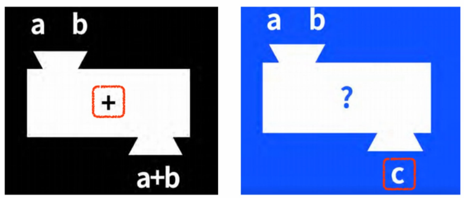
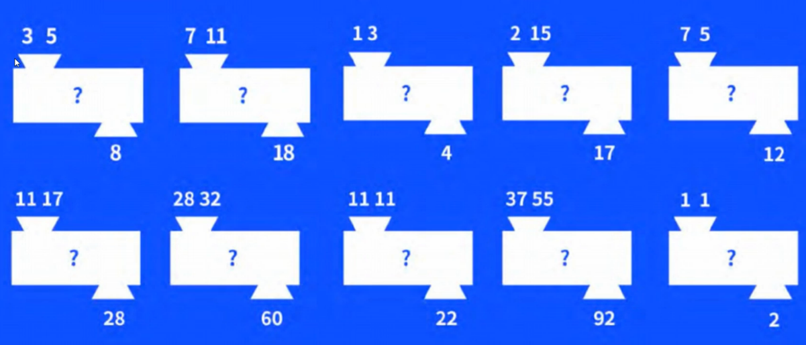
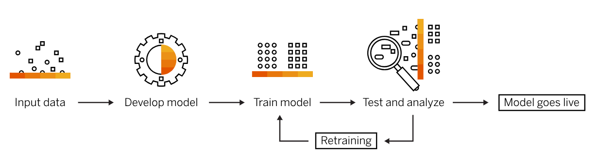

#  02 : ML의 정의와 절차, 학습방법과 모델

---
	 ▣ ML의 정의
	 ▣ ML의 절차
	 ▣ ML의 학습 방법
	 ▣ ML의 학습별 알고리즘	 
  	 ▣ ML의 모델 평가
	 ▣ ML의 최적화 기법    	 
---

## ▣ ML의 정의

### □ 1959년, Arthur Samuel (아서 새뮤얼)
정의 : "컴퓨터에 **명시적으로 프로그래밍되지 않고도 학습할 수 있는 능력을 부여**하는 연구 분야." 
표현 : "Field of study that gives computers the ability to learn without being explicitly programmed." 
설명 : 기계학습이라는 용어는 IBM 직원이자 컴퓨터 게임 및 인공 지능 분야의 선구자인 아서 새뮤얼이 처음 사용하였으며, 머신러닝이 기존의 명시적 프로그래밍 방식과 어떻게 다른지를 설명하면서 컴퓨터가 데이터를 통해 스스로 학습할 수 있는 능력을 강조 

### □ 1983년, Herbert A. Simon (허버트 사이먼)
정의 : "학습은 시스템이 **주어진 작업에 대해 이전보다 더 나은 성능**을 보일 때 발생한다." 
표현 : "Learning is any process by which a system improves performance from experience." 
설명 : 경험을 통한 성능 향상을 학습의 핵심으로 보았습니다. 이 정의는 특히 시스템이 경험을 통해 지속적으로 개선되는 과정을 강조 

### □ 1997년, Tom M. Mitchell (톰 미첼) 
정의 : "컴퓨터 프로그램이 경험(E)에서 학습하며, 작업(T)과 성능측정(P)과 관련하여 성능이 향상되었다면, 그 프로그램은 작업(T)에 대해 경험(E)로부터 학습한 것." 
표현 : "A computer program is said to learn from experience EEE with respect to some task TTT and performance measure PPP, if its performance on TTT, as measured by PPP, improves with experience EEE." 
설명 : "Machine Learning" 저서에서 학습의 세 가지 주요 요소(작업, 경험, 성능 측정)를 통해 머신러닝의 핵심 개념을 체계적으로 설명 

### □ 2004년, Ethem Alpaydin (에텀 알파이딘)
정의 : "머신러닝은 **데이터에서 패턴을 찾고, 이를 바탕으로 예측을 수행할 수 있는 알고리즘의 설계와 연구**."
표현 : "Machine learning is the study of algorithms that learn from data and make predictions."
설명 : "Introduction to Machine Learning" 저서에서 머신러닝의 예측 기능에 중점을 두며, 데이터에서 패턴을 발견하고 이를 기반으로 예측하는 과정의 중요성을 강조

### □ 2008년, Andrew Ng (앤드류 응)
정의 : "머신러닝은 **명시적으로 프로그래밍하지 않고 컴퓨터가 행동하는 방식을 학습**하는 학문이다." 
표현 : "Machine learning is the field of study that enables computers to learn from data without being explicitly programmed." 
설명 : "Stanford Machine Learning" 강의에서 데이터 기반 학습과 자율 학습 능력의 중요성을 강조하며, 현대의 대규모 데이터와 복잡한 문제를 해결하는 머신러닝의 필요성을 반영 

### □  2012년, Kevin P. Murphy (케빈 머피)
정의 : "머신러닝은 **데이터를 사용하여 예측 모델을 학습**하는 데 중점을 둔 컴퓨터 과학의 하위 분야이다." 
표현 : "Machine learning is a subfield of computer science that focuses on the development of algorithms that can learn from and make predictions on data." 
설명 : "Machine Learning: A Probabilistic Perspective" 저서에서 머신러닝의 이론적 연구와 실질적인 예측 모델의 개발을 강조 

### □  2016년, Joel Grus (조엘 그루스)
정의 : "머신러닝은 **데이터를 이용해 명시적으로 프로그래밍하지 않고도 작업을 수행할 수 있는 모델을 만드는 과정**이다." 
표현 : "Machine learning is the subfield of computer science that gives computers the ability to learn without explicitly being programmed." 
설명 : "Data Science from Scratch" 저서에서 전통적인 프로그래밍과 구별되는, 데이터에 기반한 학습과 의사결정의 자동화 도구로 정의하고 머신러닝의 본질은 데이터를 통해 패턴을 학습하고, 이를 활용해 예측하거나 분류 등의 작업을 수행  

---

### 배경  
현실세계의 복잡한 업무와 규칙을 구현하기 위한 매우 복잡하고 방대한 코드 
수시로 변하는 업무환경, 정책, 사용자 성향에 따른 어플리케이션 구현의 어려움 
많은 자원과 비용을 통해서 구현된 어플리케이션의 예측 정확성 문제 

### 정리   
머신러닝은 인공지능의 하위 집합으로  
명시적으로 프로그래밍하지 않고  
많은 양의 데이터를 제공하여 많은 '경험'을 쌓으면서 
시스템이 자율적으로 학습하고 개선할 수 있게 하는 것. 

---
  

### 【ML 개념】

 

## ▣ ML의 절차

 
(출처) https://www.sap.com/korea/products/artificial-intelligence/what-is-machine-learning.html
  
머신러닝은 다양한 알고리즘 기법을 적용하는 여러 유형의 머신러닝 모델로 구성 
데이터의 특성과 원하는 결과에 따라 지도, 비지도, 준지도, 강화 등 학습모델 중 하나를 적용 
사용 중인 데이터 세트와 원하는 결과에 따라 각 모델 내에서 하나 이상의 알고리즘 기법을 적용 
머신러닝 알고리즘은 기본적으로 사물 분류, 패턴 발견, 결과 예측, 정보 기반 의사결정 등을 수행하도록 설계 
알고리즘은 하나씩 사용할 수도 있고 복잡하고 예측불가능한 데이터의는 정확도를 극대화하기 위해 여러 알고리즘을 결합도 가능 

 

### 【ML 용어】
 
**Sample** (샘플, 인스턴스, 관측치, 데이터셋) 
**Feature** (특성, 속성, 측정치, 차원, 입력, 변수) 
**Label** (레이블, 타깃, 출력, 반응변수, 정답, 목표값) 
 
<ins>model(모델) :</ins> 머신러닝이 찾은 규칙의 수학적 표현(수식), 학습 또는 훈련데이터로 학습된 머신러닝 알고리즘 
<ins>모델의 규칙 :</ins> 가중치와 절편 
<ins>규칙을 찾는 과정 :</ins> 모델을 통해서 훈련 또는 학습을 진행하면서 손실함수를 통해 규칙을 수정하는 과정 
<ins>손실함수(비용함수) :</ins> 예측값과 실제값의 차이로 모델의 규칙을 수정하는 기준이 되는 함수 
<ins>최적화 알고리즘 :</ins> 손실함수의 값을 최솟값에 수렴하도록 하는 효율적인 방법 

   

## ▣ ML의 학습 방법
 

### (1) 지도 학습 (Supervised Learning, SL)
 
지도 학습 알고리즘에서는 예시를 통해 머신을 훈련합니다. 지도 학습 모델은 '입력', '출력' 데이터 쌍으로 구성되며, 원하는 값으로 출력 레이블을 지정할 수 있습니다. 예를 들어 머신을 데이지꽃과 팬지꽃의 차이를 식별할 수 있도록 훈련하려고 합니다. 하나의 이진 입력 데이터 쌍에는 데이지꽃의 이미지와 팬지꽃의 이미지가 모두 포함됩니다. 해당 특정 쌍에 원하는 결과는 데이지꽃을 선택하는 것이기 때문에, 이것이 올바른 결과로서 사전 식별됩니다.
시스템은 알고리즘을 통해 시간에 따라 이 훈련 데이터를 모두 컴파일한 다음 상관관계가 있는 유사성, 차이점, 기타 논리 지점을 결정하기 시작하며, 이 작업은 데이지꽃인지 팬지꽃인지 묻는 질문에 대한 답을 스스로 예측할 수 있을 때까지 계속됩니다. 이는 어린 아이에게 일련의 문제를 정답 키와 함께 준 다음, 그들이 한 작업을 보여주고 논리를 설명하도록 하는 것과 같습니다. 지도형 학습 모델은 제품 추천 엔진이나 교통량 분석 앱(예: 하루 중 다른 시간대에 가장 빠른 이동 경로를 예측하는 Waze) 등 일상생활의 다양한 분야에서 사용됩니다.

 

### (2) 비지도 학습 (Unsupervised Learning, UL)
비지도 학습 모델에는 정답 키가 없습니다. 머신이 입력 데이터(대부분 레이블이 없는 비정형 데이터)를 학습한 다음 관련성이 있고 액세스 가능한 데이터를 모두 사용해 패턴과 상관관계를 인식하기 시작합니다. 비지도 학습은 사람이 세상을 관찰하는 방식을 기반으로 다양하게 모델링됩니다. 사람은 직관과 경험에 의존해 사물을 그룹화합니다. 어떤 사물에 대해 경험하는 예시의 수가 많을수록 그것을 분류하고 인식하는 능력이 더욱더 정확해집니다. 머신에 있어서 '경험'은 '이용 가능한 입력 데이터의 양'입니다. 비지도 학습 모델이 사용되는 대표적인 예는 안면 인식, 유전자 서열 분석, 시장 조사, 사이버 보안 등입니다.

  

###  (준지도 학습) (Semi-supervised learning)
모든 데이터가 시스템에 입력되기 전에 정형화되고 레이블이 지정되어 있다면 더할 나위 없이 완벽할 것입니다. 그러나 실제에서는 이러한 일이 불가능하기 때문에, 대량의 원시 비정형 데이터를 처리해야 하는 경우 준지도 학습은 유효한 해결책이 될 수 있습니다. 이 모델은 소량의 레이블이 지정된 데이터를 입력해 레이블이 없는 데이터 세트를 증강합니다. 이 모델의 핵심은 레이블이 지정된 데이터를 통해 시스템이 학습을 시작하게 하며, 학습 속도와 정확성을 상당한 수준으로 개선하도록 하는 것입니다. 준지도 학습 알고리즘은 레이블이 지정된 데이터를 분석해 레이블이 없는 데이터에 적용 가능한 상관관계가 있는 속성을 찾도록 머신을 훈련합니다.
그러나 이 모델에는 이 MIT 대학출판사 보고서에서 자세히 다룬 것과 같이 시스템이 레이블이 지정된 데이터에 포함된 결함까지 학습해 복제할 위험이 있습니다. 준지도 학습을 가장 성공적으로 활용하는 회사에서는 선진사례 프로토콜을 구축하고 있습니다. 준지도 학습은 음성 및 언어 분석, 복잡한 의료 연구(예: 단백질 분류), 상위레벨 부정행위 감지에 사용됩니다.

  

### (3) 강화학습 (Reinforcement Learning, EL)
 
지도형 학습에서는 머신에 정답 키를 제공해 모든 올바른 결과 중에서 상관관계를 찾아 학습하도록 합니다. 강화학습 모델에서는 정답 키는 제공되지 않지만 일련의 허용 가능한 행동, 규칙, 잠재적 최종 상태가 입력됩니다. 알고리즘의 원하는 목표가 고정되어 있거나 양자택일인 경우 머신은 예시를 통해 학습할 수 있습니다. 그러나 원하는 목표가 변동 가능한 경우에는 경험과 보상을 통해 학습해야 합니다. 강화학습 모델에서 '보상'은 숫자이며, 시스템에서 수집하려는 항목으로 알고리즘에 프로그래밍됩니다.
이 모델은 여러 면에서 사람에게 체스 게임을 하는 법을 가르치는 것과 유사합니다. 체스 말이 이동할 수 있는 경우를 모두 보여주는 것은 불가능하며, 그 대신 규칙을 설명해주고 연습을 통해 기술을 습득하도록 합니다. 보상은 게임을 이기는 것뿐 아니라 상대방의 말을 획득하는 형태로 이루어집니다. 강화학습 적용 분야에는 온라인 광고 구매자의 자동 가격 입찰, 컴퓨터 게임 개발, 고위험 주식 시장 거래 등이 있습니다.

   

## ▣ ML의 학습별 알고리즘

### (1) 지도 학습 (Supervised Learning, SL) : 회귀, 분류
#### (1-1) 회귀 (regression) 
 - 선형 회귀 (Linear Regression) 
 - 다항 회귀 (Polynomial Regression) 
 - 릿지 회귀 (Ridge Regression) 
 - 라쏘 회귀 (Lasso Regression) 
 - 엘라스틱넷 회귀 (Elastic Net Regression) 
 - 서포트 벡터 회귀 (Support Vector Regression, SVR) 
 - 결정 트리 회귀 (Decision Tree Regression) 
 - 랜덤 포레스트 회귀 (Random Forest Regression) 

#### (1-2) 분류 (classification) 
 - 로지스틱 회귀 (Logistic Regression) 
 - 서포트 벡터 분류 (Support Vector Classification, SVC) 
 - 결정 트리 분류 (Decision Tree Classification) 
 - 랜덤 포레스트 분류 (Random Forest Classification) 
 - k-최근접 이웃 (k-Nearest Neighbors, k-NN) 
 - 나이브 베이즈 (Naive Bayes) 
 - XGBoost (Extreme Gradient Boosting) 

### (2) 비지도 학습 (Unsupervised Learning, UL) : 군집화, 차원축소
#### (2-1) 군집화 (Clustering) 
 - k-평균 클러스터링 (k-Means Clustering) 
 - 계층적 클러스터링 (Hierarchical Clustering) 
 - DBSCAN (Density-Based Spatial Clustering of Applications with Noise) 
 - 가우시안 혼합 모델 (Gaussian Mixture Model, GMM) 

#### (2-2) 연관 규칙 (Association Rule) 
 - 주성분 분석 (Principal Component Analysis, PCA) 
 - FP Growth
 - 이클렛 (Eclat), 
 - 어프라이어리 (Apriori)
 
#### (2-3) 차원 축소 (Dimensionality Reduction) 
 - 주성분 분석 (Principal Component Analysis, PCA) 
 - 독립 성분 분석 (Independent Component Analysis, ICA) 
 - 자기 조직화 지도 (Self-Organizing Maps, SOM) 
 - 오토인코더 (Autoencoders)  
 - 잠재 의미 분석 (Latent Semantic Analysis, LSA) 
 - 특이값 분해 (Singular Value Decomposition, SVD) 
 - 잠재 디리클레 할당 (Latent Dirichlet Allocation, LDA) 
 - t-distributed Stochastic Neighbor Embedding (t-SNE) 

### (3) 강화 학습 (Reinforcement Learning, RL) 
 - Q-learning 
 - Deep Q-Network (DQN) 
 - State-Action-Reward-State-Action (SARSA) 
 - 유전 알고리즘 (Genetic Algorithm) 
 - Asynchronous Advantage Actor-Critic (A3C)  

### (4) 앙상블 학습 (Ensemble Learning, EL) 
 - 스태킹 (Stacking) 
 - 배깅 (Bagging, Bootstrap aggregating) 
 - 부스팅 (Boosting) 

   
   
## ▣ ML의 모델 평가
 - 교차 검증 
 - 혼동 행렬 
 - 정확도 
 - 정밀도, 재현율 (Precision, Recall) 
 - F1-Score 
 - ROC 곡선 
 - AUC 

   

## ▣ ML의 최적화 기법
 - 과적합 방지 
 - 정규화 (L1, L2) 
 - 드롭아웃 
 - 조기 종료 
 - 하이퍼파라미터 튜닝 
 - Grid Search 
 - Random Search 
 - Bayesian Optimization 

