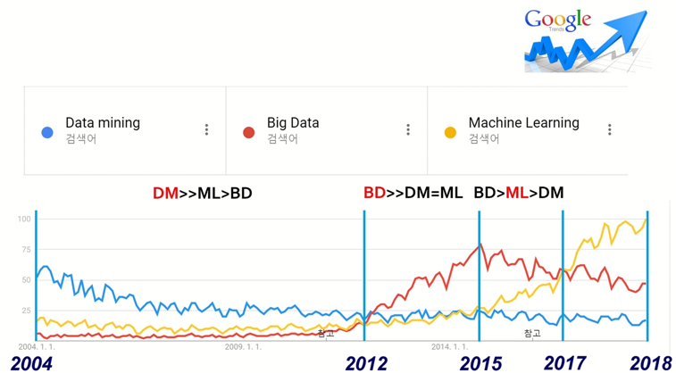
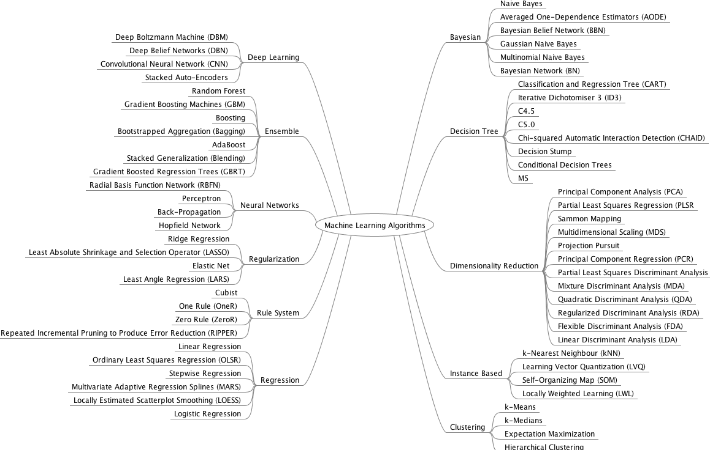
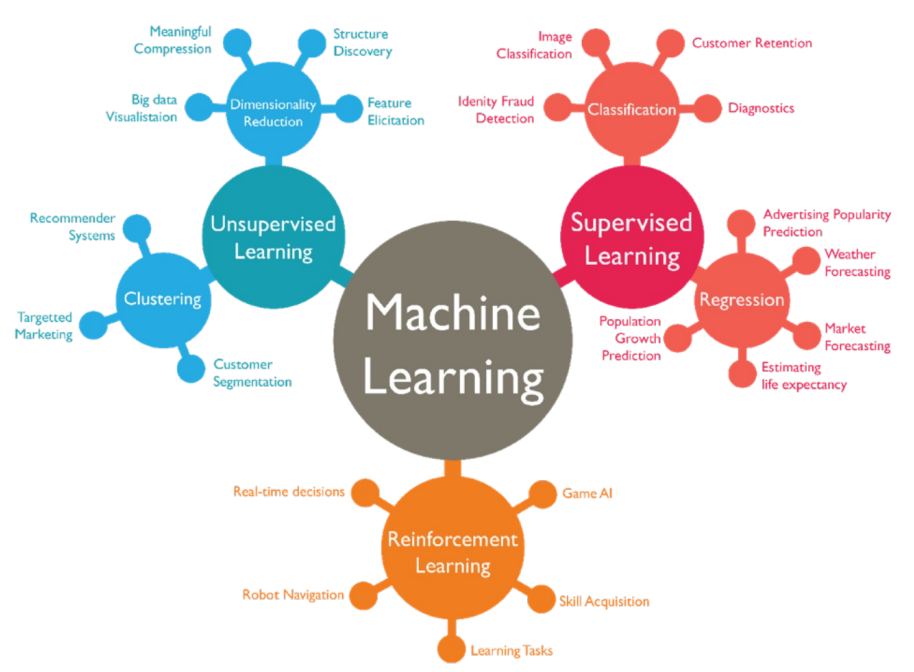
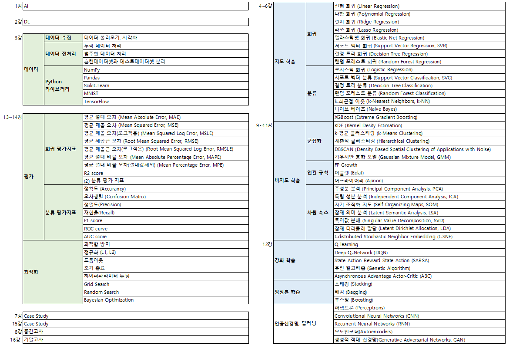

#  02 : ML의 정의와 절차, 학습방법과 모델

---
	 ▣ ML의 정의
	 ▣ ML의 절차
	 ▣ ML의 구분
	 ▣ ML의 학습별 알고리즘	 
  	 ▣ ML의 모델 평가
	 ▣ ML의 최적화 기법  	 
---

 
현재까지 검색추가 : https://trends.google.com/trends/explore?date=2004-01-01%202024-09-06&q=Data%20Mining,Big%20Data,Machine%20Learning&hl=ko
  
딥러닝 검색추가 : https://trends.google.com/trends/explore?date=2004-01-01%202024-09-06&q=Data%20Mining,Big%20Data,Machine%20Learning,Deep%20Learning&hl=ko
  

# ▣ ML의 정의

## 1959년, Arthur Samuel (아서 새뮤얼)
정의 : "컴퓨터에 **명시적으로 프로그래밍되지 않고도 학습할 수 있는 능력을 부여**하는 연구 분야." 
표현 : "Field of study that gives computers the ability to learn without being explicitly programmed." 
설명 : 기계학습이라는 용어는 IBM 직원이자 컴퓨터 게임 및 인공 지능 분야의 선구자인 아서 새뮤얼이 처음 사용하였으며, 머신러닝이 기존의 명시적 프로그래밍 방식과 어떻게 다른지를 설명하면서 컴퓨터가 데이터를 통해 스스로 학습할 수 있는 능력을 강조 

## 1983년, Herbert A. Simon (허버트 사이먼)
정의 : "학습은 시스템이 **주어진 작업에 대해 이전보다 더 나은 성능**을 보일 때 발생한다." 
표현 : "Learning is any process by which a system improves performance from experience." 
설명 : 경험을 통한 성능 향상을 학습의 핵심으로 보았습니다. 이 정의는 특히 시스템이 경험을 통해 지속적으로 개선되는 과정을 강조 

## 1997년, Tom M. Mitchell (톰 미첼) 
정의 : "컴퓨터 프로그램이 경험(E)에서 학습하며, 작업(T)과 성능측정(P)과 관련하여 성능이 향상되었다면, 그 프로그램은 작업(T)에 대해 경험(E)로부터 학습한 것." 
표현 : "A computer program is said to learn from experience EEE with respect to some task TTT and performance measure PPP, if its performance on TTT, as measured by PPP, improves with experience EEE." 
설명 : "Machine Learning" 저서에서 학습의 세 가지 주요 요소(작업, 경험, 성능 측정)를 통해 머신러닝의 핵심 개념을 체계적으로 설명 

## 2004년, Ethem Alpaydin (에텀 알파이딘)
정의 : "머신러닝은 **데이터에서 패턴을 찾고, 이를 바탕으로 예측을 수행할 수 있는 알고리즘의 설계와 연구**."
표현 : "Machine learning is the study of algorithms that learn from data and make predictions."
설명 : "Introduction to Machine Learning" 저서에서 머신러닝의 예측 기능에 중점을 두며, 데이터에서 패턴을 발견하고 이를 기반으로 예측하는 과정의 중요성을 강조

## 2008년, Andrew Ng (앤드류 응)
정의 : "머신러닝은 **명시적으로 프로그래밍하지 않고 컴퓨터가 행동하는 방식을 학습**하는 학문이다." 
표현 : "Machine learning is the field of study that enables computers to learn from data without being explicitly programmed." 
설명 : "Stanford Machine Learning" 강의에서 데이터 기반 학습과 자율 학습 능력의 중요성을 강조하며, 현대의 대규모 데이터와 복잡한 문제를 해결하는 머신러닝의 필요성을 반영 

## 2012년, Kevin P. Murphy (케빈 머피)
정의 : "머신러닝은 **데이터를 사용하여 예측 모델을 학습**하는 데 중점을 둔 컴퓨터 과학의 하위 분야이다." 
표현 : "Machine learning is a subfield of computer science that focuses on the development of algorithms that can learn from and make predictions on data." 
설명 : "Machine Learning: A Probabilistic Perspective" 저서에서 머신러닝의 이론적 연구와 실질적인 예측 모델의 개발을 강조 

## 2016년, Joel Grus (조엘 그루스)
정의 : "머신러닝은 **데이터를 이용해 명시적으로 프로그래밍하지 않고도 작업을 수행할 수 있는 모델을 만드는 과정**이다." 
표현 : "Machine learning is the subfield of computer science that gives computers the ability to learn without explicitly being programmed." 
설명 : "Data Science from Scratch" 저서에서 전통적인 프로그래밍과 구별되는, 데이터에 기반한 학습과 의사결정의 자동화 도구로 정의하고 머신러닝의 본질은 데이터를 통해 패턴을 학습하고, 이를 활용해 예측하거나 분류 등의 작업을 수행  

---

## 배경  
현실세계의 복잡한 업무와 규칙을 구현하기 위한 매우 복잡하고 방대한 코드 
수시로 변하는 업무환경, 정책, 사용자 성향에 따른 어플리케이션 구현의 어려움 
많은 자원과 비용을 통해서 구현된 어플리케이션의 예측 정확성 문제 

## 정리   
머신러닝은 인공지능의 하위 집합으로  
명시적으로 프로그래밍하지 않고  
많은 양의 데이터를 제공하여 많은 '경험'을 쌓으면서 
시스템이 자율적으로 학습하고 개선할 수 있게 하는 것. 

---
  

## 【ML 개념】

 

# ▣ ML의 절차

 
(출처) https://www.sap.com/korea/products/artificial-intelligence/what-is-machine-learning.html
  
머신러닝은 다양한 알고리즘 기법을 적용하는 여러 유형의 머신러닝 모델로 구성 
데이터의 특성과 원하는 결과에 따라 지도, 비지도, 준지도, 강화 등 학습모델 중 하나를 적용 
사용 중인 데이터 세트와 원하는 결과에 따라 각 모델 내에서 하나 이상의 알고리즘 기법을 적용 
머신러닝 알고리즘은 기본적으로 사물 분류, 패턴 발견, 결과 예측, 정보 기반 의사결정 등을 수행하도록 설계 
알고리즘은 하나씩 사용할 수도 있고 복잡하고 예측불가능한 데이터의는 정확도를 극대화하기 위해 여러 알고리즘을 결합도 가능 

---
## 【ML 수행 8단계 절차】

### 데이터 처리 : (3강)
(1) 데이터를 불러온다 
(2) 데이터를 확인한다(시각화) 
(3) 데이터를 전처리한다 

### 모델 학습 : 지도학습(4-6강), 비지도학습(9-11강), 강화학습(12강)
(4) 머신러닝 알고리즘에 적합한 형태로 데이터를 준비한다 
(5) 머신러닝 알고리즘에 적용한다 

### 평가, 개선 : (13-14강)
(6) 머신러닝 알고리즘을 평가한다 
(7) 머신러닝 알고리즘을 개선한다 
(8) 원하는 결과가 나올때까지 (1~7)을 반복한다.

---

## 【ML 용어】
 
**Sample** (샘플, 인스턴스, 관측치, 데이터셋) 
**Feature** (특성, 속성, 측정치, 차원, 컬럼, 입력, 변수, 문제) **X**  
**Label** (레이블, 타깃, 출력, 반응변수, 목표값, 답) **Y**  
 

 
 
model(모델) : 머신러닝이 찾은 규칙의 수학적 표현(수식), 학습 또는 훈련데이터로 학습된 머신러닝 알고리즘 
모델의 규칙 : 가중치와 절편 
규칙을 찾는 과정 : 모델을 통해서 훈련 또는 학습을 진행하면서 손실함수를 통해 규칙을 수정하는 과정 
손실함수(비용함수) : 예측값과 실제값의 차이로 모델의 규칙을 수정하는 기준이 되는 함수 
최적화 알고리즘 : 손실함수의 값을 최솟값에 수렴하도록 하는 효율적인 방법 
차원축소 : feature의 수를 줄이기, 압축
분류 : 단일값
회귀 : 연속값(ex.주가, 매출 예측)
train, val → training set / test → test set
Train Dataset : 훈련/학습 데이터셋
Validation Dataset : 검증 데이터셋, 중간 확인용
Test Dataset : 평가 데이터셋, 마지막에 모델의 성능을 측정(한번만 사용, 두번이상 사용하면 검증 데이터셋, 학습 할 때 미적용)

   

# ▣ ML의 구분

 출처 : https://favouriteblog.com/essential-cheat-sheets-for-machine-learning-python-and-maths/

 

 출처 : https://medium.com/marketing-and-entrepreneurship/10-companies-using-machine-learning-in-cool-ways-887c25f913c3

 

 

## (1) 지도 학습 (Supervised Learning, SL)
 
지도 학습 알고리즘에서는 답이 포함된 예시를 통해 머신을 훈련한다. 지도 학습 모델은 '입력', '출력' 데이터 쌍으로 구성되며, 원하는 값으로 출력 레이블을 지정할 수 있다. 예를 들어 머신을 데이지꽃과 팬지꽃의 차이를 식별할 수 있도록 훈련하려고 한다. 하나의 이진 입력 데이터 쌍에는 데이지꽃의 이미지와 팬지꽃의 이미지가 모두 포함된다. 해당 특정 쌍에 원하는 결과는 데이지꽃을 선택하는 것이기 때문에, 이것이 올바른 결과로서 사전 식별된다.
시스템은 알고리즘을 통해 시간에 따라 이 훈련 데이터를 모두 컴파일한 다음 상관관계가 있는 유사성, 차이점, 기타 논리 지점을 결정하기 시작하며, 이 작업은 데이지꽃인지 팬지꽃인지 묻는 질문에 대한 답을 스스로 예측할 수 있을 때까지 계속된다. 이는 어린 아이에게 일련의 문제를 정답 키와 함께 준 다음, 그들이 한 작업을 보여주고 논리를 설명하도록 하는 것과 같은 원리이다. 지도형 학습 모델은 제품 추천 엔진이나 교통량 분석 앱(예: 하루 중 다른 시간대에 가장 빠른 이동 경로를 예측하는 Waze( https://www.waze.com/ko/live-map/) ) 등 일상생활의 다양한 분야에서 사용된다.

 

## (2) 비지도 학습 (Unsupervised Learning, UL)
비지도 학습 모델에는 정답 키가 없다. 머신이 입력 데이터(대부분 레이블이 없는 비정형 데이터)를 학습한 다음 관련성이 있고 액세스 가능한 데이터를 모두 사용해 패턴과 상관관계를 인식하기 시작한다. 비지도 학습은 사람이 세상을 관찰하는 방식을 기반으로 다양하게 모델링 된다. 사람은 직관과 경험에 의존해 사물을 그룹화 하는데, 어떤 사물에 대해 경험하는 예시의 수가 많을수록 그것을 분류하고 인식하는 능력이 더욱더 정확해진다. 머신에 있어서 '경험'은 '이용 가능한 입력 데이터의 양'이 된다. 비지도 학습 모델이 사용되는 대표적인 예는 안면 인식, 유전자 서열 분석, 시장 조사, 사이버 보안 등이 있다.

  

##  (준지도 학습) (Semi-supervised learning)
모든 데이터가 시스템에 입력되기 전에 정형화되고 레이블이 지정되어 있다면 더할 나위 없이 완벽할 것이다. 그러나 실제에서는 이러한 일이 불가능하기 때문에, 대량의 원시 비정형 데이터를 처리해야 하는 경우 준지도 학습은 유효한 해결책이 될 수 있다. 이 모델은 소량의 레이블이 지정된 데이터를 입력해 레이블이 없는 데이터 세트를 증강한다. 이 모델의 핵심은 레이블이 지정된 데이터를 통해 시스템이 학습을 시작하게 하며, 학습 속도와 정확성을 상당한 수준으로 개선하도록 하는 것이다. 준지도 학습 알고리즘은 레이블이 지정된 데이터를 분석해 레이블이 없는 데이터에 적용 가능한 상관관계가 있는 속성을 찾도록 머신을 훈련한다. 그러나 이 모델에는 시스템이 레이블이 지정된 데이터에 포함된 결함까지 학습해 복제할 위험이 있으므로 모범사례에 대한 프로토콜 구축이 필요하다. 준지도 학습은 음성 및 언어 분석, 단백질 분류와 같이 복잡한 의료 연구, 상위레벨 부정행위 감지 등에 사용된다.

  

## (3) 강화학습 (Reinforcement Learning, EL)
 
Environment : 소프트에어 시뮬레이션, Agent : 모델 
지도형 학습에서는 머신에 정답 키를 제공해 모든 올바른 결과 중에서 상관관계를 찾아 학습하도록 하는데, 강화학습 모델에서는 정답 키는 제공되지 않지만 일련의 허용 가능한 행동, 규칙, 잠재적 최종 상태가 입력된다. 알고리즘의 원하는 목표가 고정되어 있거나 양자택일인 경우 머신은 예시를 통해 학습할 수 있다. 그러나 원하는 목표가 변동 가능한 경우에는 경험과 보상을 통해 학습해야 한다. 강화학습 모델에서 '보상'은 숫자이며, 시스템에서 수집하려는 항목으로 알고리즘에 프로그래밍된다. 예컨대, 사람에게 체스 게임을 하는 법을 가르치는 경우와 같이, 체스 말이 이동할 수 있는 경우를 모두 보여주는 것은 불가능하지만 규칙을 설명해주고 연습을 통해 기술을 습득하도록 하는 것이다. 보상은 게임을 이기는 것뿐 아니라 상대방의 말을 획득하는 형태로 이루어진다. 강화학습 적용 분야에는 온라인 광고 구매자의 자동 가격 입찰, 컴퓨터 게임 개발, 고위험 주식 시장 거래 등이 있다.

   

# ▣ ML의 학습별 알고리즘

## (1) 지도 학습 (Supervised Learning, SL) : 회귀, 분류
### (1-1) 회귀 (regression) 
 
X(입력값) : 예측 변수(특성) vs Y(출력값) : 반응 변수(타깃) 

회귀분석은 종속변수가 “급여” 혹은 “가중치”와 같이 실수 (real number) 또는 연속형 변수 (continuous variable)인 경우에 적용된다. 회귀의 목표는 연속형 변수의 값을 예측하는 것이다. 예를 들어, 임금 예측 문제를 고려해 본다면, 이때의 분석 목표는 교육 수준, 경력, 산업, 직책, 지역 등 다양한 요인을 고려하여 근로자의 임금을 예측하는 것이다. 이때 필요한 데이터는 다수의 근로자에 대한 과거 데이터로, 각 근로자의 상세 정보는 독립변수의 역할을 하며 임금은 종속변수의 역할을 한다. SL 모델은 이 과거 데이터를 통해 훈련되어, 주어진 독립변수에서 종속변수로의 매핑을 학습한다. 훈련이 완료된 후에는, 모델은 제공된 상세 정보를 기반으로 근로자의 임금을 예측하는 데 활용된다. 이를 통한 분석 결과는 기업의 경쟁력 있는 급여 수준을 설정하거나 다른 그룹간의 임금 공정성을 분석하는 등의 다양한 목적으로 사용될 수 있다. 

 **선형 회귀 (Linear Regression)**  
 **다항 회귀 (Polynomial Regression)**  
 **릿지 회귀 (Ridge Regression)**  
 **라쏘 회귀 (Lasso Regression)**  
 **엘라스틱넷 회귀 (Elastic Net Regression)**  
 **서포트 벡터 회귀 (Support Vector Regression, SVR)**  
 **결정 트리 회귀 (Decision Tree Regression)**  
 **랜덤 포레스트 회귀 (Random Forest Regression)**  

### (1-2) 분류 (classification) 
 
 
이진 분류(binary classification) vs 다중 분류(multiclass classification) 
양성 클래스(positive class) / 음성 클래스(negative class) 
결정 경계(decision boundary) 

분류는 출력 변수가 “Yes” 또는 “No”와 같은 이진법 적인 카테고리일 경우에 활용된다. 주 목적은 데이터를 사전에 지정된 클래스로 분류하는 것이다. 예컨대, 은행이 대출 신청자의 대출 채무 불이행 여부를 예측하는 신용 점수 시스템을 가지고 있다면, 이때 독립변수는 신청자의 개인적 특징인 소득, 신용 이력, 나이, 고용 상태 등이 될 수 있으며, 종속변수는 채무 불이행의 여부 등의 이진 결과가 된다. 이 분류 모델에서의 목표는 입력된 개인의 특징을 기반으로 채무 불이행 가능성을 최대한 정확하게 예측하는 매핑을 학습하는 것이며, 이 모델은 새로운 신청자를 분류하는 데 도움이 된다. 물론, 위의 분석에 포함된 독립변수가 반드시 외생적이라는 보장은 없다. 대부분의 변수들, 예를 들어 교육 수준은 내생적인 변수일 수 있다. 그러나 간단한 지도학습 분석에서는 이를 독립변수로 가정한다. 

 **로지스틱 회귀 (Logistic Regression)**  
 **서포트 벡터 분류 (Support Vector Classification, SVC)**  
 **결정 트리 분류 (Decision Tree Classification)**  
 **랜덤 포레스트 분류 (Random Forest Classification)**  
 **k-최근접 이웃 (k-Nearest Neighbors, k-NN)**  
 **나이브 베이즈 (Naive Bayes)**  
 **XGBoost (Extreme Gradient Boosting)**  

 

## (2) 비지도 학습 (Unsupervised Learning, UL) : 군집화, 차원축소
### (2-1) 군집화 (Clustering) 
 
 

클러스터링은 특정 기준에 따라 서로 유사한 데이터 관찰값을 그룹화하는 방법이다. 이를 통해, 우리는 데이터를 클러스터로 분할하여 동일한 클러스터 내의 데이터가 다른 클러스터 내의 데이터보다 더 유사하도록 할 수 있다. 예컨대, 고객 세분화 (segmentation) 문제는 그룹별로 최적화된 마케팅 전략을 구현하기 위해 클러스터링이 활용된다. 소비자들의 연령, 소득, 소비 습관 등 다양한 요인에 따라 소비자를 그룹화하는 문제는 비지도 학습의 전형적인 적용 사례이다. 결과적으로, 하나의 그룹은 대량 구매를 드물게 하는 고소득 중년의 소비자로 구성되고, 다른 그룹은 소량 구매는 자주 하지만 젊은 저소득 소비자로 구성될 수 있다. 

 **KDE (Kernel Desity Estimation)**  
 **k-평균 클러스터링 (k-Means Clustering)**  
 **계층적 클러스터링 (Hierarchical Clustering)**  
 **DBSCAN (Density-Based Spatial Clustering of Applications with Noise)**  
 **가우시안 혼합 모델 (Gaussian Mixture Model, GMM)**  

### (2-2) 연관 규칙 (Association Rule) 
연관 규칙 학습은 대량의 데이터베이스에서 항목 집합 간의 관계나 연관성을 찾는 방법이다. 주로 시장 바구니 분석에 사용되며, 함께 구매되는 상품 간의 연관성을 찾는 것이 목적이다. 예를 들면, 식료품점에서 고객의 구매 이력을 연관 규칙 학습을 통해 분석하면, 빵과 버터를 함께 구매하는 고객이 우유도 함께 구매하는 경향이 있다는 사실을 찾아낼 수 있다. 이러한 규칙은 제품의 효율적인 배치, 고객의 동선 조정, 특정 제품 추천 등에 활용될 수 있다. 

 **FP Growth**  
 **이클렛 (Eclat)**   
 **어프라이어리 (Apriori)**  
 
### (2-3) 차원 축소 (Dimensionality Reduction) 
 
 
차원 축소는 가능한 한 많은 정보를 보존하면서 데이터에서 사용되는 변수의 수를 줄이는 방법이다. 고차원 데이터는 계산 복잡성과 차원의 저주 문제로 인해 분석이 어려울 수 있다. 따라서 차원 축소를 통해 고차원 데이터를 저차원 공간으로 표현하면 분석이 용이해집니다. 차원 축소는 수백 개의 잠재적 독립변수가 있는 기업의 미래 주가 예측 문제 등에서 활용될 수 있습니다. 예측 변수에는 회사의 과거 주가, 거래량, 매출, 수익, 비용, 그리고 GDP 성장률, 실업률, 인플레이션율, 금리 등의 거시경제 변수가 포함될 수 있습니다. 이러한 변수들은 주가와 관련성이 있을 수 있으며, 모든 변수들을 직접 사용하면 다중 공선성 문제가 발생할 수 있습니다. 따라서 PCA 등의 차원 축소 방법을 활용하여 고차원의 예측 변수를 저차원의 주성분으로 변환하여 주가 예측에 활용할 수 있습니다. 이를 통해 다중 공선성, 차원의 저주, 과적합 등의 문제를 방지할 수 있습니다. 비지도학습의 결과는 입력 데이터의 품질과 관련성, 사용된 알고리즘의 매개변수 선택, 그리고 결과 해석에 의존합니다. 따라서 이 결과는 확정적이지 않으며, 인과적인 통찰력을 제공하지 않습니다.  

 **주성분 분석 (Principal Component Analysis, PCA)**  
 **독립 성분 분석 (Independent Component Analysis, ICA)**  
 **자기 조직화 지도 (Self-Organizing Maps, SOM)**   
 **잠재 의미 분석 (Latent Semantic Analysis, LSA)**  
 **특이값 분해 (Singular Value Decomposition, SVD)**  
 **잠재 디리클레 할당 (Latent Dirichlet Allocation, LDA)**  
 **t-distributed Stochastic Neighbor Embedding (t-SNE)**  

 

## (3) 강화 학습 (Reinforcement Learning, RL) 
강화학습은 학습하는 주체(모델)가 주어진 환경에서 보상을 최대화하기 위해 어떤 행동을 취해야 할지 스스로 결정하는 방법을 학습하는 머신러닝의 한 분야이다. 지도학습과는 다르게 정답 레이블(종속변수)이 제공되지 않으며, 대신 학습하는 주체는 행동의 결과로부터 학습해서 이를 통해 받는 보상(또는 처벌)에 따라 행동 전략인 정책(policy)을 조정한다. 강화학습에서 학습하는 주체는 어떤 행동을 취해야 할지 지시를 받지 않고, 어떤 행동을 시도하여 가장 많은 보상을 얻을 수 있는지 스스로 학습해야 한다. 이에 따라, 학습하는 주체의 행동은 이후 받게 될 데이터에 영향을 미치며, 이로 인해 능동적인 학습의 형태를 가지게 된다. 따라서, 강화학습의 핵심은 어떤 행동이 더 큰 보상을 주는지에 대한 탐험(exploration)과 이미 알고 있는 행동을 고수하는 착취(exploitation) 사이의 균형을 찾는 것이다. 실제 강화학습의 적용 예로는 우버(Uber)나 리프트(Lyft)와 같은 승차 공유 회사에서 동적 가격 전략을 결정하는 경우를 들 수 있다. 이러한 강화학습 환경에서 기업은 매 시간 단위마다 현재 상태(state(t))를 수신하고, 행동(action)을 선택하며, 보상(reward)을 얻고, 새로운 상태(state(t+1))로 전환한다. 상태는 시간, 요일, 수요, 공급, 날씨 등의 다양한 요인들에 의해 결정되며, 행동은 기업이 설정하는 가격 정책이다. 그리고 보상은 선택된 가격과 수요에 의해 직접적으로 영향을 받는 수익이다. 기업은 강화학습을 통해 누적 보상을 최대화하는 정책, 즉 상태에서 행동으로의 매핑을 학습할 수 있다. 다양한 가격 전략을 탐색하면서, 가장 높은 보상을 얻을 수 있는 전략을 활용하는 방법을 시간이 지남에 따라 학습한다. 예를 들어, 비가 오는 날에 가격을 높이는 것이 더 높은 수익을 가져온다는 사실을 발견할 수 있습니다. 

 **Q-learning**  
 **Deep Q-Network (DQN)**  
 **State-Action-Reward-State-Action (SARSA)**  
 **유전 알고리즘 (Genetic Algorithm)**  
 **Asynchronous Advantage Actor-Critic (A3C)**   

 

## (4) 앙상블 학습 (Ensemble Learning, EL) 
앙상블 학습은 여러 모델을 동시에 훈련시켜 동일한 문제를 해결하고, 이들을 결합하여 더 우수한 결과를 도출하는 기계학습의 패러다임이다. 앙상블 학습의 기본 가정은 개별적으로는 성능이 떨어지는 모델들이 적절히 결합될 경우, 보다 정확하고 뛰어난 모델을 구축할 수 있다는 것이다. 앙상블 학습은 과적합, 편향, 분산 등의 문제를 완화하는 데 도움을 주며, 여러 모델을 구축하고 이를 통합함으로써 개별 모델의 오류를 보정하여 전체적으로 개별 모델보다 더 뛰어난 성능을 달성할 수 있다.  

 **스태킹 (Stacking)**  
 **배깅 (Bagging)**  
 **부스팅 (Boosting)**  

 

## (5) 인공신경망(Artificial Neural Networks, ANN), 심층학습 (Deep Learning, DL) 
인공신경망(ANNs)은 인간의 뇌 구조에서 영감을 받아 만들어진 계산 모델로 상호 연결된 인공 뉴런 집합으로 구성되며, 연결주의적 계산 방법을 통해 정보를 처리한다. 이는 인간처럼 경험을 통해 학습하고 성능을 개선할 수 있으며, 심층학습(Deep Learning)은 이러한 인공신경망을 보다 깊게 쌓아 복잡한 패턴과 구조를 모델링하는 발전된 형태이다. 

 **퍼셉트론 (Perceptrons)**  
 **Convolutional Neural Networks (CNN)**  
 **Recurrent Neural Networks (RNN)**  
 **오토인코더(Autoencoders)**  
 **생성적 적대 신경망(Generative Adversarial Networks, GAN)**  

  
   
# ▣ ML의 모델 평가
## (1) 회귀 평가 지표
 **평균 절대 오차 (Mean Absolute Error, MAE)**   
 **평균 제곱 오차 (Mean Squared Error, MSE)**   
 **평균 제곱 오차(로그적용) (Mean Squared Log Error, MSLE)**  
 **평균 제곱근 오차 (Root Mean Squared Error, RMSE)**   
 **평균 제곱근 오차(로그적용) (Root Mean Squared Log Error, RMSLE)**  
 **평균 절대 비율 오차 (Mean Absolute Percentage Error, MAPE)**   
 **평균 절대 비율 오차(절대값제외) (Mean Percentage Error, MPE)**  
 **R2 score**  

  
 
## (2) 분류 평가 지표
 **정확도 (Accurancy)**   
 **오차행렬 (Confusion Matrix)**   
 **정밀도(Precision)**   
 **재현율(Recall)**   
 **F1 score**   
 **ROC curve**   
 **AUC score**   

   

# ▣ ML의 최적화 기법
 - 과적합 방지 
 - 정규화 (L1, L2) 
 - 드롭아웃 
 - 조기 종료 
 - 하이퍼파라미터 튜닝 
 - Grid Search 
 - Random Search 
 - Bayesian Optimization 

  
## 【ML 강의 구성】

   

