#  02 : Data Management
---
	 ▣ 실습 준비
  	 ▣ 데이터 수집
	 ▣ 데이터 전처리	 
	 ▣ 데이터셋 분리  	  
  	 ▣ Python 라이브러리	
---

# ▣ 실습 준비

### 【구글 코랩】
구글 계정으로 로그인하여 https://colab.research.google.com/?hl=ko 에서 [새노트]로 시작 

 

### 【아나콘다】
아나콘다는 데이터 과학, 수학, 공학용 파이썬 필수 패키지들을 모두 포함하고 있으며, 주요 운영 체제를 모두 지원 
아나콘다 설치 파일 다운로드 : https://www.anaconda.com/download/
 아나콘다 설치 안내 : https://wikidocs.net/254434
 아나콘다 안내(공식문서) :  https://docs.anaconda.com/anaconda/userguide/getting-started/
  

---

# ▣ 데이터 수집
전통적인 데이터 분석을 위한 데이터 수집은 크게 세 단계로 진행된다.  
첫 번째는 현업 사용자의 요청에 따라 여러 가지 데이터 소스에서 데이터를 추출(Extract)한다.  
두 번째는 대상 데이터 시스템 및 해당 시스템의 다른 데이터와 통합할 수 있도록 정보의 구조를 변경하는 변환(Transform) 과정을 거친다.  
마지막으로 세 번째 단계는 데이터 스토리지 시스템에 적재(Load)하는 방식으로 진행된다.  
데이터 수집은 가장 많은 시간이 소요되며 방법에 따라 최종 결과물이 크게 달라지기도 한다. 
데이터 수집은 <ins>머신러닝 절차(분석 문제 정의 → 데이터 수집 → 탐색적 데이터 분석(EDA) → 피처 엔지니어링 → 예측 모델 개발 → 서비스 적용)</ins> 중에서  
분석 문제 정의 다음의 단계이며, 이 단계에서는 정의한 문제를 해결하기 위한 데이터들을 수집하는 단계이다. 어떤 데이터를 수집하느냐에 따라 문제 해결을 위한 접근 방식이 달라지며, 이것은 데이터의 유형도 신경써야할 필요가 있다. 머신러닝 프로젝트에서 두 번째 단계인 '데이터 수집'은 분석의 기반이 되는 데이터를 확보하는 과정으로 다음과 같은 5가지 단계로 이루어진다. 

## (1) 원시 데이터 수집
중요도에 비해 관심을 덜 받는 경우가 많지만 데이터 수집은 우수한 알고리즘을 얻기 위한 첫 걸음이다. 일반적으로 대량의 데이터 집합을 사용하는 단순한 모델이 소량의 데이터 집합을 사용하는 진보된 모델보다 성능이 더 우수하다.  
 
## (2) 데이터 마트 생성
데이터 마트는 특정 주제나 부서에 초점을 맞춘 작은 규모의 데이터 웨어하우스를 의미하며, 이 단계에서는 필요한 데이터를 특정 주제나 목적에 맞게 분류하거나 구성한다. 이를 통해 필요한 데이터를 효율적으로 관리하고 사용할 수 있다. 예컨대, '고객 만족도'라는 주제는 고객 ID, 구매 이력, 제품 리뷰, 고객 서비스 이력 등을 포함하는 데이터 마트를 생성한다. 
 
## (3) 데이터 정합성 평가
수집된 데이터의 질을 평가하는 과정으로 데이터의 정확성, 일관성, 완전성, 신뢰성 등을 검토하고, 이상치나 결측치, 중복 값 등이 있는지 확인한다. 이를 통해 데이터의 정합성을 보장하고, 분석의 신뢰성을 높일 수 있다. 예컨대, 고객 ID의 중복, 제품 리뷰의 결측치, 구매 이력의 이상치 등을 확인하고, 이를 수정하거나 제거하여 데이터의 정합성을 보장한다.  
 
## (4) 데이터 취합
여러 출처에서 수집된 데이터를 하나의 데이터 세트로 합치는 과정으로 동일한 개체나 사건을 나타내는 데이터가 일관된 방식으로 표현되고 연결되어야야만 이를 통해 통합된 정보를 제공하고, 분석의 효율성을 높일 수 있다. 예컨대, 구매 이력 데이터, 제품 리뷰 데이터, 고객 서비스 이력 데이터 등을 고객 ID를 기준으로 합친다. 
 
## (5) 데이터 표준화
서로 다른 소스에서 수집된 데이터는 종종 다른 형식이나 구조로 저장되어 있는 경우는 단계에서는 모든 데이터를 일관된 포맷으로 변환하여, 분석이나 처리가 쉽도록 한다.예컨대, 일자 데이터가 '년-월-일' 형식으로 저장된 곳도 있고, '월/일/년' 형식으로 저장된 곳도 있다면, 이를 일관된 형식으로 통일시킨다. “Garbage in, garbage out”라는 말이 있듯이, 무의미한 데이터가 들어오면 나가는 데이터도 무의미하다. 데이터의 출처에 따라 부가적인 포맷과 표준화가 필요할 수 있으며, 고품질의 대량의 데이터 집합이라도 해도 데이터 포맷이 잘못되면 힘을 발휘할 수 없다. 이 점은 여러 출처의 데이터를 집계할 때 특히 유의해야 한다. 
이렇게 데이터 수집 단계를 통해 필요한 데이터를 효과적으로 확보하고, 그 데이터의 질을 보장하고, 데이터를 적절하게 관리하고 사용할 수 있으며, 이 단계를 잘 수행하면, 그 이후의 분석 과정에서 좀 더 정확하고 효율적인 결과를 얻을 수 있다다. 이렇게 데이터 수집 단계를 거친 후에는, 데이터의 질을 보장하고, 필요한 정보를 효율적으로 제공하는 '탐색적 데이터 분석(EDA)', '피처 엔지니어링', '예측 모델 개발', '서비스 적용' 등의 작업을 진행할 수 있다. 

---

**open data repository**
 
캘리포니아 대학교 어바인(UC Irvine)이 1987년에 개설한 머신러닝 연구·교육용 대표 공개 데이터셋 저장소 https://archive.ics.uci.edu/
 
Google이 2017년 인수한 데이터 과학·머신러닝 문제를 대회 형태로 공개해 전세계 인재의 집단지성으로 최고의 예측 모델을 찾는 커뮤니티 https://www.kaggle.com/datasets
 
https://registry.opendata.aws/
 

**meta portal**
 
http://dataportals.org/
 
http://opendatamonitor.eu/
 
http://quandl.com/

**DataSet**
 
https://en.wikipedia.org/wiki/List_of_datasets_for_machine-learning_research
 
https://www.quora.com/Where-can-I-find-large-datasets-open-to-the-public
 
https://www.reddit.com/r/datasets/
 
머신러닝 데이터셋(dataset) 사이트 40가지 모음 : https://kr.appen.com/blog/best-datasets/
 
Mushrooms Classification https://www.kaggle.com/uciml/mushroom-classification
 
Medical Costs Personal Dataset https://www.kaggle.com/mirichoi0218/insurance/data
 
Wine Classification(Red & White wine Dataset) https://www.kaggle.com/numberswithkartik/red-white-wine-dataset 

---

# ▣ 데이터 전처리
데이터 전처리는 기존의 데이터를 머신러닝 알고리즘에 알맞은 데이터로 바꾸는 과정이다. 이 전처리 과정은 모델이 생성된 이후에도 예측하고자 하는 새로운 데이터에도 적용할 수 있는 과정으로 전처리 과정을 통해 더욱더 모델 학습의 성능을 높일 수 있다. 데이터 전처리는 Data Cleaning, Data Encoding, Data Transform, Feature Scaling, ML Pipeline 등 5개의 과정으로 수행한다. 

## (1) Data Cleaning
대부분의 머신러닝 알고리즘은 Missing feature, 즉 누락된 데이터가 있을 때, 제대로 역할을 하지 못한다. 그래서 먼저 Missing feature에 대해 처리해주어야 한다. 

	불필요한 누락 데이터 제거(처리) : pandas의 dropna() 
	학습에 방해가 되는 연관성 없는 전체 속성(특정 행 또는 열의 라벨) 제거 : pandas의 drop() 
	누락 데이터에 0, 평균값, 중간값으로 채우기 : pandas의 fillna(), scikit-learn의 Imputer() 
 
## (2) Data Encoding
수집된 데이터는 컴퓨팅 학습을 위해서 기존 데이터 세트에 텍스트가 있는 경우 이것을 숫자형 데이터로 인코딩(Encoding)이 필요하다. 인코딩에는 레이블 인코딩(Label Encoding)과 원핫 인코딩(One-hot Encoding)을 통해 범주형 데이터를 수치형 데이터로 변환이 필요하다. 
 
**레이블 인코딩 :** 각 카테고리를 숫자로 대응시켜서 변환한다. 예컨대, "red", "green", "blue"라는 3개의 카테고리가 있다면 "red"를 1로, "green"을 2로, "blue"를 3으로 변환하는 것이다. 이 방법은 간단하고 직관적이지만, 각 카테고리가 가지는 값의 크기 차이가 있을 경우 예측 결과에 영향을 미칠 수 있다. 텍스트를 숫자로 인코딩하는 메소드로는 Pandas에서 제공하는 factorize()와 OrdinalEncoder()이 있으며, sklearn.preprocessing.LabelEncoder를 사용할 수도 있다. 
**원핫 인코딩 :** 각 카테고리를 벡터 형태로 변환한다. 예컨대, "red", "green", "blue"라는 3개의 카테고리가 있다면 "red"는 [1, 0, 0], "green"은 [0, 1, 0], "blue"는 [0, 0, 1]로 변환하는 것이다. 이 방법은 각 카테고리를 독립적인 변수로 취급하기 때문에 각 카테고리가 가지는 값의 크기 차이를 고려하지 않기 때문에 범주형 변수의 카테고리가 많을수록 차원이 커지는 단점이 있지만, 예측 결과에 영향을 미치는 위험이 적다. 따라서, 레이블 인코딩은 카테고리가 서열을 가지는 경우(예: "bad", "average", "good")나 카테고리의 수가 적을 경우에 사용하고, 원핫 인코딩은 카테고리의 수가 많을 경우에 사용한다. 원핫 인코딩 메소드로는 OneHotEncoder()가 있다. 

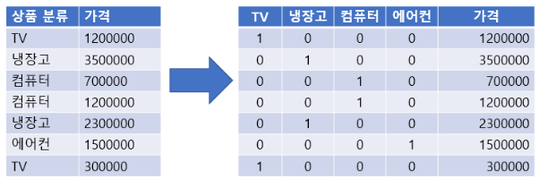

**sklearn.preprocessing.LabelEncoder**

(소스코드)

	import numpy as np                                   # 수치 계산을 위한 numpy 라이브러리 불러오기
	from sklearn.preprocessing import LabelEncoder       # 문자열 라벨을 숫자로 변환하기 위한 LabelEncoder 불러오기

	# 원본 데이터
	items = ['TV','냉장고','컴퓨터', '컴퓨터','냉장고','에어컨', 'TV'] # 상품 분류(카테고리형 데이터)
	prices = [1200000, 3500000, 700000, 1200000, 2300000, 1500000, 300000] # 각 상품의 가격 데이터

	# 1단계: Label Encoding
	le = LabelEncoder()                                  # LabelEncoder 객체 생성
 	le.fit(items)                                        # items 리스트의 고유한 클래스들을 학습시킴	
  
 	print("고유 클래스:", le.classes_)                    # LabelEncoder가 학습한 실제 클래스 이름(고유값 리스트) 출력	
 	print("인코딩 결과:", le.transform(items))            # 학습된 클래스 기준으로 각 항목을 정수 인덱스로 변환 출력
  	print("역변환:",      le.inverse_transform([2,0,1,1,0,3,2]))

(실행결과)

	고유 클래스: ['TV' '냉장고' '에어컨' '컴퓨터']
	인코딩 결과: [0 1 3 3 1 2 0]
	역변환: ['에어컨' 'TV' '냉장고' '냉장고' 'TV' '컴퓨터' '에어컨']

**sklearn.preprocessing.OneHotEncoder**

(소스코드)

	import numpy as np									# 수치 계산을 위한 numpy 라이브러리 불러오기
 	import pandas as pd								    # 데이터 분석 및 처리용 라이브러리 pandas를 불러오
	from sklearn.preprocessing import OneHotEncoder		# 범주형 데이터를 원-핫 인코딩하기 위한 OneHotEncoder 불러오기

	# 원본 데이터
	items = ['TV','냉장고','컴퓨터', '컴퓨터','냉장고','에어컨', 'TV']	# 상품 분류(카테고리형 데이터)
	prices = [1200000, 3500000, 700000, 1200000, 2300000, 1500000, 300000] # 각 상품에 대응하는 가격 데이터

	# 2단계: One-Hot Encoding (버전에 따라 다름)
	try:
    	ohe = OneHotEncoder(sparse=False)			# 구버전 sklearn(≤1.1)에서는 sparse=False 사용
	except TypeError:
    	ohe = OneHotEncoder(sparse_output=False)	# 최신 sklearn(≥1.2)에서는 sparse_output=False 사용

	labels_reshaped = labels.reshape(-1,1)			# 라벨 인코딩 결과(labels)를 2차원 배열로 변환(OneHotEncoder 입력형식 맞추기)
	onehot = ohe.fit_transform(labels_reshaped)		# OneHotEncoder를 학습시키고 변환 실행 → 원-핫 인코딩 결과 생성
	print("One-Hot 결과:\n", onehot)				# 원-핫 인코딩된 2차원 배열 출력

	# 3단계: DataFrame으로 보기 좋게 정리
	df = pd.DataFrame(onehot, columns=le.classes_)	# 인코딩된 결과를 DataFrame으로 변환, 컬럼명은 원래 클래스 이름 사용
	df["가격"] = prices								# 가격 데이터를 새로운 열로 추가
	print("\n최종 데이터프레임:\n", df)				# 최종 DataFrame 출력

(실행결과)

	One-Hot 결과:
 	[[1. 0. 0. 0.]
 	[0. 1. 0. 0.]
 	[0. 0. 0. 1.]
 	[0. 0. 0. 1.]
 	[0. 1. 0. 0.]
 	[0. 0. 1. 0.]
 	[1. 0. 0. 0.]]
	
	최종 데이터프레임:
     	TV  냉장고  에어컨  컴퓨터       가격
	0  1.0  0.0  0.0  0.0  1200000
	1  0.0  1.0  0.0  0.0  3500000
	2  0.0  0.0  0.0  1.0   700000
	3  0.0  0.0  0.0  1.0  1200000
	4  0.0  1.0  0.0  0.0  2300000
	5  0.0  0.0  1.0  0.0  1500000
	6  1.0  0.0  0.0  0.0   300000

**pandas만으로 Label Encoding + One-Hot Encoding**

(소스코드)

	import pandas as pd   # 데이터 분석 및 처리용 라이브러리 pandas 불러오기

	# 원본 데이터
	items = ['TV','냉장고','컴퓨터', '컴퓨터','냉장고','에어컨', 'TV']   # 상품 분류
	prices = [1200000, 3500000, 700000, 1200000, 2300000, 1500000, 300000]  # 가격 데이터

	# DataFrame 생성
	df = pd.DataFrame({
	    "상품": items,
	    "가격": prices
	})

	# 1단계: Label Encoding (pandas의 factorize 사용)
	df["상품_Label"] = pd.factorize(df["상품"])[0]   # 각 고유 클래스에 정수값 부여
	print("Label Encoding 결과:\n", df[["상품","상품_Label"]])
 
	# 2단계: One-Hot Encoding (pandas의 get_dummies 사용) → 숫자(0/1)로 강제
	try:
    	df_onehot = pd.get_dummies(df, columns=["상품"], dtype=int)  # pandas 1.5+에서 권장
	except TypeError:
    	df_onehot = pd.get_dummies(df, columns=["상품"])              # 구버전 호환
    	dummy_cols = [c for c in df_onehot.columns if c.startswith("상품_")]
    	df_onehot[dummy_cols] = df_onehot[dummy_cols].astype(int)
 
	print("\nOne-Hot 결과 DataFrame:\n", df_onehot)

(실행결과)

	Label Encoding 결과:
     	상품  상품_Label
	0   TV         0
	1  냉장고         1
	2  컴퓨터         2
	3  컴퓨터         2
	4  냉장고         1
	5  에어컨         3
	6   TV         0

	One-Hot 결과 DataFrame:
         가격  상품_Label  상품_TV  상품_냉장고  상품_에어컨  상품_컴퓨터
	0  1200000         0      1       0       0       0
	1  3500000         1      0       1       0       0
	2   700000         2      0       0       0       1
	3  1200000         2      0       0       0       1
	4  2300000         1      0       1       0       0
	5  1500000         3      0       0       1       0
	6   300000         0      1       0       0       0

## (3) Data Transform
Scikit-learn에서는 다양한 데이터 변환기(Transformer)들을 제공하는데, 이를 이용하여 커스텀 변환기를 만들 수 있다.

**fit()** : 입력받은 데이터에 특정 알고리즘 또는 전처리를 적용하는 메서드를 통해 변환기에 알맞는 파라미터를 생성 
**transform()** : fit()을 통해 생성된 파라미터를 통해서 모델을 적용시켜 데이터 세트를 알맞게 변환시키는 메소드 
**fit_transform()** : 같은 데이터 세트를 사용하여 fit과 transform을 한 번에 하는 메서드 
 	

## (4) Feature Scaling
일반적인 ML 알고리즘들은 아주 다양한 범위의 숫자형 데이터를 학습시킨다면 제대로 성능을 보여주지 못한다. 예컨대, 특정 데이터의 범위가 -500~39,320이라면 아주 다양한 데이터가 존재한다. 이러한 상태에서는 제대로 된 학습을 잘하지 못한다. 이를 방지하기 위해서 숫자형 데이터의 범위를 줄여주는 방법을 사용한다. 

**Min-Max Scaling (Normalization)** : 최소와 최대를 확인하여 이 값들을 모두 지정한 범위(대체로 0과 1 사이)의 상대적인 값으로 변환, Scikit-learn에서는 MinMaxScaler(feature_range, copy) class를 제공 
**Standardization** : 특정 범위에 값을 바인딩하지 않음으로써 특이점(이상점)의 영향을 제거, Scikit-learn에서는 StandardScaler() 클래스를 제공 

## (5) ML Pipeline
매번 데이터 정제마다 위와 같은 순서를 반복하기 싫다면, Pipeline이라는 방식을 사용하면 된다. Pipeline은 Data Processing Component들의 순서를 정의해놓은 것이다. 데이터 변환을 조작하고 적용하는 방법으로 각각의 컴포넌트들과 교류하며 사용하고 ML 워크플로우의 자동화를 지원한다. Scikit-Learn에서는 Pipeline Class를 제공하는데, 이것은 데이터 변환 단계의 순서를 정리하고 만들기 쉽다. 
### ML Pipeline의 일반적인 구성 
① 데이터 수집 및 로딩 (Data Collection and Loading) : 데이터를 수집하고, 모델링에 적합한 형태로 로드하는 단계(CSV 파일, 데이터베이스, API 등에서 데이터 로드) 
② 데이터 전처리 (Data Preprocessing) : 결측값 처리, 중복 제거, 이상치 탐지, 데이터 클리닝 등 텍스트나 범주형 데이터를 수치화하거나 표준화하는 변환 
③ 특성 엔지니어링 (Feature Engineering) : 데이터를 모델링에 적합한 특성(feature)으로 변환(특성 선택, 특성 생성, 차원 축소, 스케일링, 인코딩) 
④ 모델 학습 (Model Training) : 준비된 데이터를 사용하여 머신러닝 알고리즘을 훈련시키는 과정으로 다양한 하이퍼파라미터 조정을 통해 최적의 모델을 도출 
⑤ 모델 검증 (Model Validation) : 교차 검증, 평가 지표(Accuracy, Precision, Recall, F1 등) 활용하여 훈련된 모델의 성능을 평가 
⑥ 모델 테스트 (Model Testing) : 학습에 사용되지 않은 독립된 데이터셋으로 모델의 일반화 성능을 평가 
⑦ 모델 배포 (Model Deployment) : 최종 모델을 서비스나 애플리케이션에 배포하여 실제 데이터를 처리하도록 설정 
⑧ 모니터링 및 유지보수 (Monitoring and Maintenance) : 모델 성능을 지속적으로 모니터링하고 필요 시 재학습 및 업데이트를 수행 

   

---

# ▣ 데이터셋 분리
데이터를 적절히 포맷했고 품질을 확인했고 모든 관련 특성을 확보했다면, 이제 머신러닝을 위해 데이터 분할이 필요하다. 분할은 수집된 데이터를 훈련 데이터와 검정데이터 
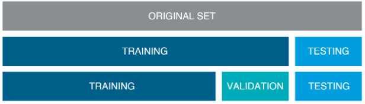
 
분할의 단계는 총 3단계로 나누어 볼 수 있다.  
1 단계 : training과 test데이터로 분리한다. 
2 단계 : training데이터를 training과 validation으로 분리한다. 
3 단계 : training데이터로 모델을 만들고 validation데이터로 검증한다. 만족시 해당모델을 train과 validation데이터를 합쳐서 학습을 시킨후 test데이터를 넣어 확인한다. 

데이터 셋의 비중은 정해진 것은 아니나 보통 Training set : Validation set : Test sets = 60 : 20 : 20 으로 설정한다. 
한번의 학습으로 완전하게 모델을 학습시키기 어렵기 때문에, 다르게 튜닝된 여러 모델들을 학습한 후 어떤모델이 잘 학습되었는지 검증셋으로 검증하고 모델을 선택하는 과정이 필요하다. 이렇게 훈련/검증세트로 좋은 모델을 만들어 낸 후 최종적으로 테스트세트에는 단 한번의 예측테스트를 진행한다. 결과가 마음에 들지 않아도 또 수정하게되면 테스트 세트에 과적합되어 일반화의 성능이 떨어지게 된다. 훈련데이터는 모델을 Fit하는데 사용하며, 검증데이터트 예측 모델을 선택하기 위해 모델의 예측오류를 측정할 때 사용한다. 테스터데이터는 일반화 오류를 평가하기 위해 마지막에 단 한번만 사용해야한다. 이때 테스트 데이터는 한번도 공개된적 없는 데이터이어야 한다. 

## (1) 훈련 데이터(Training set)
모델을 학습하는데 사용된다. Training set으로 모델을 만든 뒤 동일한 데이터로 성능을 평가해보기도 하지만, 이는 cheating이 되기 때문에 유효한 평가는 아니다. 마치 모의고사와 동일한 수능 문제지를 만들어 대입 점수를 매기는 것과 같다. Training set은 Test set이 아닌 나머지 데이터 set을 의미하기도 하며, Training set 내에서 또 다시 쪼갠 Validation set이 아닌 나머지 데이터 set을 의미하기도 한다. 문맥상 Test set과 구분하기 위해 사용되는지, Validation과 구분하기 위해 사용되는지를 확인해야 한다. 
 
## (2) 테스트 데이터(Test set)
validation set으로 사용할 모델이 결정 된 후, 마지막으로 딱 한번 해당 모델의 예상되는 성능을 측정하기 위해 사용된다. 이미 validation set은 여러 모델에 반복적으로 사용되었고 그중 운 좋게 성능이 보다 더 뛰어난 것으로 측정되어 모델이 선택되었을 가능성이 있다. 때문에 이러한 오차를 줄이기 위해 한 번도 사용해본 적 없는 test set을 사용하여 최종 모델의 성능을 측정하게 된다. 
 
## (3) 검정 데이터(Validation set) 
여러 모델들 각각에 적용되어 성능을 측정하며, 최종 모델을 선정하기 위해 사용된다. 반면 test set은 최종 모델에 대해 단 한번 성능을 측정하며, 앞으로 기대되는 성능을 예측하기 위해 사용된다. Training set으로 모델들을 만든 뒤, validation set으로 최종 모델을 선택하게 된다. 최종 모델의 예상되는 성능을 보기 위해 test set을 사용하여 마지막으로 성능을 평가한다. 그 뒤 실제 사용하기 전에는 쪼개서 사용하였던 training set, validation set, test set 을 모두 합쳐 다시 모델을 training 하여 최종 모델을 만든다. 기존 training set만을 사용하였던 모델의 파라미터와 구조는 그대로 사용하지만, 전체 데이터를 사용하여 다시 학습시킴으로써 모델이 조금 더 튜닝되도록 만든다. 혹은 data modeling을 진행하는 동안 새로운 데이터를 계속 축적하는 방법도 있다. 최종 모델이 결정되었을 때 새로 축적된 data를 test data로 사용하여 성능평가를 할 수도 있다. 

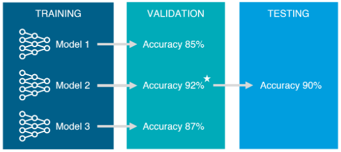

(소스코드)

 	import pandas as pd
	from sklearn.model_selection import train_test_split
	
	# 예시 데이터프레임 생성 (실제 데이터프레임이 이미 있다고 가정)
	# 예시: df = pd.DataFrame({'feature': [1, 2, 3, 4, 5, 6, 7, 8, 9, 10], 'target': [0, 1, 0, 1, 0, 1, 0, 1, 0, 1]})
	# 아래 예시 데이터프레임은 실행 가능성을 위해 추가됨
	
	# 데이터프레임 생성
	df = pd.DataFrame({
	    'feature': range(1, 11),  # 1~10까지의 숫자
	    'target': [0, 1] * 5      # 0과 1이 반복되는 타겟값
	})
	
	# 단일 피처를 2차원 배열로 변환
	X = df[['feature']]  # X는 2차원 데이터프레임으로, [[ ]]를 사용하여 2차원으로 생성
	y = df['target']     # y는 1차원 Series
	
	# train-test 분리
 	# 전체 데이터에서 80%를 학습 데이터로, 20%를 테스트 데이터로 분리
  	# random_state=42 : 설정하지 않거나 'None'으로 설정시, 매번 다른 결과를 생성
   	# shuffle=True : split 하기 전에 데이터를 섞을지 여부(default는 True)
    	# stratify=y : target으로 지정하면 각 class 비율을 train/validation으로 유지. 한쪽에 쏠림 분배방지(default는 None)
	X_train, X_test, y_train, y_test = train_test_split(X, y, test_size=0.2, shuffle=True, stratify=y,random_state=42)
	
	# train-validation 분리
 	# 학습 데이터에서 75%를 최종 학습 데이터로, 25%를 검증 데이터로 분리
	X2_train, X2_val, y2_train, y2_val = train_test_split(X_train, y_train, test_size=0.25, random_state=42)
	
	# 각 데이터 세트의 크기를 출력
	print(f"전체 데이터 크기: {len(df)}")
	print(f"학습 데이터 크기 (Train): {len(X_train)}")
	print(f"테스트 데이터 크기 (Test): {len(X_test)}")
 	print(f"검증을 제외한 학습 데이터 크기 (Train-Validation): {len(X2_train)}")
 	print(f"검증 데이터 크기 (Validation): {len(X2_val)}")
	
	# 데이터 분할 비율 확인
	print(f"\n학습 데이터 비율: {len(X2_train) / len(df):.2f}")
	print(f"테스트 데이터 비율: {len(X_test) / len(df):.2f}")
 	print(f"검증 데이터 비율: {len(X2_val) / len(df):.2f}")

(실행결과)

	전체 데이터 크기: 10
	학습 데이터 크기 (Train): 8
	테스트 데이터 크기 (Test): 2
	검증을 제외한 학습 데이터 크기 (Train-Validation): 6
	검증 데이터 크기 (Validation): 2
	
	학습 데이터 비율: 0.60
	테스트 데이터 비율: 0.20
	검증 데이터 비율: 0.20

  

## 【ML 예제】

붓꽃 데이터(Iris Dataset)는 Setosa, Virginica, Versicolor 3개의 붓꽃 품종을 구분해내는 것을 목적으로 만들어졌으며, 머신러닝을 경험해볼 수 있는 아주 간단한 장난감 데이터(toy data set)이다.  

## (1) 전통적인 프로그래밍(Traditional Programming)
 - 데이터 수집: 붓꽃 품종에 관련된 많은 데이터를 수집한다. 
 - 변수 가공: 붓꽃 품종은 '꽃잎(Petal)의 길이'와 '꽃받침(Sepal)의 길이'로 구분 할 수 있다는 변수를 알아낸다. 
 - 로직 정의: 꽃받침의 길이가 몇cm 이상이면 Versicolor, 이하면 Setosa라는 여러 세트의 rule들을 정의하여 모델을 만든다. 
 - 모델 평가: 데이터를 모델에 넣어 정확도가 어느정도 인지 확인해본다. 

## (2) 머신러닝(Machine Learning)
 - 데이터 수집: 붓꽃 품종에 관련된 많은 데이터를 수집한다. 
 - 변수 가공: 붓꽃 품종은 '꽃잎의 길이'와 '꽃받침의 길이'로 구분할 수 있다는 변수를 알아낸 뒤 해당 변수의 데이터를 잘 정리한다. 
 - 모델 학습: Decision Tree, SVM 등 다양한 알고리즘에 데이터만을 입력해보며 적합한 모델을 생성한다. 
 - 모델 평가: 학습에 사용되지 않은 데이터를 최종 모델에 넣어 정확도가 어느정도 인지 확인해본다. 

## (3) 딥러닝(Deep Learning)
 - 데이터 수집: 붓꽃 품종에 관련된 많은 이미지 데이터를 수집한다. 
 - 변수 가공: 변수(feature)는 모델에서 자동 생성된다. 
 - 모델 학습: 이미지 데이터를 입력하여 다양한 네트워크를 구성해보고 적합한 모델을 생성한다. 
 - 모델 평가: 학습에 사용되지 않은 이미지 데이터를 최종 모델에 넣어 정확도가 어느 정도 인지 확인해본다. 
 

(소스코드)
	
	from sklearn import datasets
	import matplotlib.pyplot as plt

 	#Iris 데이터셋 로드
	iris = datasets.load_iris()

  	# 데이터 그리드로 표시
	df = pd.DataFrame(iris.data, columns=iris.feature_names)
	df["target"] = iris.target
	df["class"] = pd.Categorical.from_codes(iris.target, iris.target_names)
 	display_dataframe_to_user("Iris Dataset (table)", df) 

	#서브플롯 생성
	fig, ax = plt.subplots()

	#산점도 그리기
	scatter = ax.scatter(iris.data[:, 0], iris.data[:, 1], c=iris.target, cmap=plt.cm.Set1)

	#축 레이블 설정
	ax.set(xlabel=iris.feature_names[0], ylabel=iris.feature_names[1])

	#고유한 클래스 타겟과 그에 해당하는 명칭 얻기
	handles, _ = scatter.legend_elements()
	labels = iris.target_names

	#범례 추가: 클래스 코드 대신 명칭 표시
	ax.legend(handles, labels, loc="lower right", title="Classes")

	#그래프 표시
	plt.show()

(데이터)

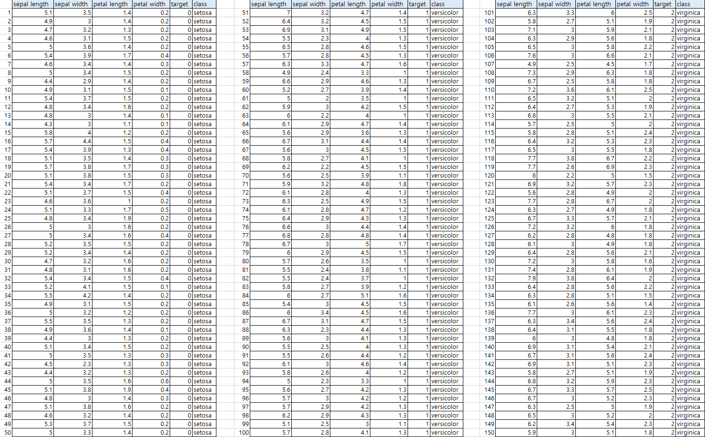

(실행결과)

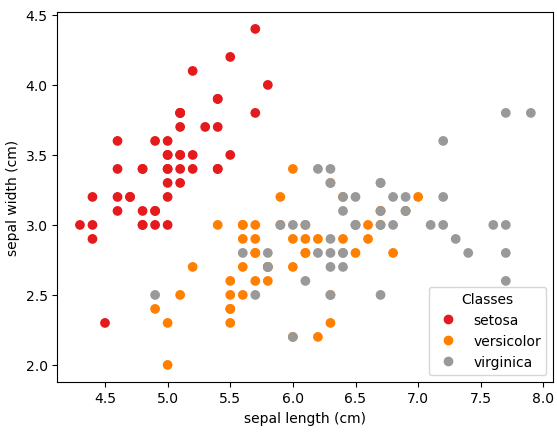

 

---

# ▣ Python 라이브러리
파이썬 전세계 점유율(티오베 지수) : https://www.tiobe.com/tiobe-index/
 
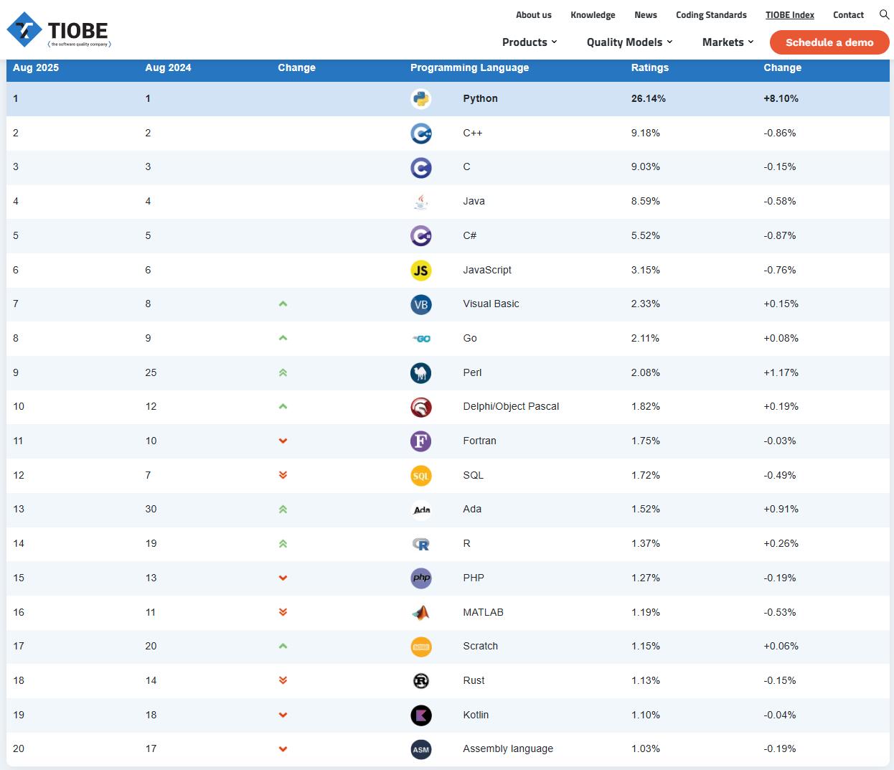
 
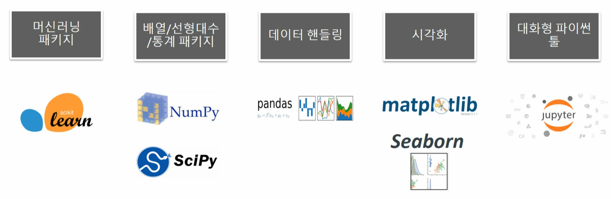
 
파이썬 자습서 : https://docs.python.org/ko/3/tutorial/
 
점프투파이썬 : https://wikidocs.net/book/1

  

## 【NumPy】
행렬이나 일반적으로 대규모 다차원 배열을 쉽게 처리할 수 있도록 지원하는 파이썬의 라이브러리 
NumPy는 데이터 구조 외에도 수치 계산을 위해 효율적으로 구현된 기능을 제공 
NumPy 공식문서 : https://numpy.org/doc/stable/user/whatisnumpy.html
 NumPy 실습 : http://ml-ko.kr/homl2/tools_numpy.html

**numpy.ipynb 실습**

	numpy.array() : ndarray 배열 생성
	numpy.array().shape : 행렬 형태 정보
	numpy.array().ndim : 차원 정보
	type(numpy.array()) : 행렬의 타입
	numpy.array().dtype : 행렬의 데이터 타입
	numpy.array().astype : 행렬의 데이터 타입 변경, 
	numpy.arrange() : 행렬 데이터 초기값 생성
	numpy.zeros() : 기본값 0으로 채우기
	numpy.ones() : 기본값 1로 채우기
	ndarray.shape : 차원과 크기 변경
	numpy.sort() : 행렬내 정렬(내림차순 [::-1], row방향 axis=0, column방향 axis=1)
	numpy.argsort() : 정렬 행렬의 원본 행렬 인덱스를 ndarray로 반환
	numpy.dot() : 선형대수 연산(행렬내적)
	numpy.transpose() : 선형대수 연산(전치행렬)

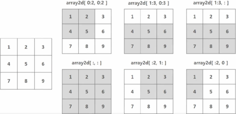

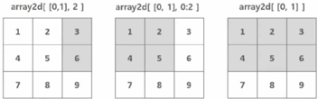

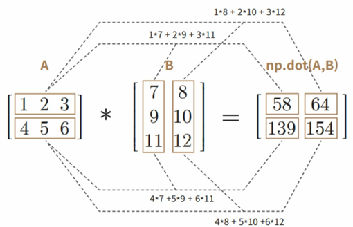

 

## 【Pandas】
데이터 조작 및 분석을 위한 파이썬 프로그래밍 언어 용으로 작성된 소프트웨어 라이브러리 
숫자 테이블과 시계열을 조작하기 위한 데이터 구조와 연산을 제공 
Pandas란 이름은 한 개인에 대해 여러 기간 동안 관찰을 한다는 데이터 세트에 대한 계량 경제학 용어인 "패널 데이터"에서 파생 
또한 "Python 데이터 분석"이라는 문구 자체에서 따온 것이기도 하다. 
Wes McKinney는 2007년부터 2010년까지 연구원으로 있을 때 AQR Capital에서 pandas를 만들기 시작했다. 
Pandas 공식문서 : https://pandas.pydata.org/pandas-docs/stable/getting_started/index.html
 사용현황 : https://www.datacamp.com/blog/top-data-science-tools

**pandas.ipynb 실습**

	객체명 = pandas.read_csv('파일명')
	display(객체명) #객체명만 적거나 print(객체명)만 적어도 됨
	객체명.head() #5개만 조회
	객체명.tail() #5개만 조회
	pandas.set_option('display.max_rows', 1000)
	pandas.set_option('display.max_colwidth', 100)
	pandas.set_option('display.max_columns', 100)
	pandas.DataFrame()
	객체명.shape : DataFrame의 행(Row)와 열(Column) 크기
	객체명.colums
	객체명.index
	객체명.values : DataFrame의 값(numpy로 변환)
	객체명.info() : DataFrame내의 컬럼명, 데이터 타입, Null건수, 데이터 건수 정보
	객체명.describe() : 데이터값들의 평균,표준편차,4분위 분포도
	객체명['특성명'].value_counts() : 개별 데이터값의 건수, 디폴트는 dropna=True 
	객체명['특성명'].value_counts(dropna=False)) : null값도 표시
	객체명=객체명.drop('특성명', axis=1(0은 row삭제), inplace=False)
	indexes = 객체명.index
	객체명.reset_index(inplace=False)
	객체명.iloc[:, -1]) : 처음부터 마지막 컬럼까지
	객체명.iloc[:, :-1]) : 처음부터 마지막 컬럼 전까지
	객체명.sort_values(by=['특성명'], ascending=True)
	객체명.count() : null값은 제외
	객체명.mean() : average 대신 사용
	객체명.sum()
	객체명.groupby(by='특성명')
	객체명.groupby('특성명').agg([max, min])
	객체명.isna() : 모든 컬럼에 대하여 True(1)/False(0) 출력
	객체명.isna().sum() : 모든 컬럼에 대하여 널값의 수를 출력
	객체명['특성명'].fillna('채울값')
	객체명['특성명'].unique() : 해당 컬럼내 고유값의 수
	객체명['특성명'].replace() : 값 변경
	객체명['특성명'].apply(lamda 입력값 : 함수)
	객체명['특성명'].apply(lamda 입력값 : '출력값' if 입력값 조건식 else '또다른 출력값')

 

## 【Matplotlib】
Python 프로그래밍 언어 및 수학적 확장 NumPy 라이브러리를 활용한 플로팅 라이브러리 
Tkinter , wxPython , Qt 또는 GTK 와 같은 범용 GUI 툴킷을 사용하여 애플리케이션에 플롯을 포함 하기 위한 객체 지향 API를 제공  
Matplotlib 공식문서 : https://matplotlib.org/stable/
 
Matplotlib 가이드 : https://wikidocs.net/92071

 

## 【Scikit-Learn】
Scikit-learn(이전 명칭: scikits.learn, sklearn)은 파이썬 프로그래밍 언어용 자유 소프트웨어 기계 학습 라이브러리 
다양한 분류, 회귀, 그리고 서포트 벡터 머신, 랜덤 포레스트, 그라디언트 부스팅, k-평균, DBSCAN을 포함한 클러스터링 알고리즘 
파이썬의 수치 및 과학 라이브러리 NumPy 및 SciPy와 함께 운용되도록 설계 
Scikit-learn 공식문서 : https://scikit-learn.org/stable/user_guide.html
 
SciPy 공식문서 : https://docs.scipy.org/doc/scipy/
 
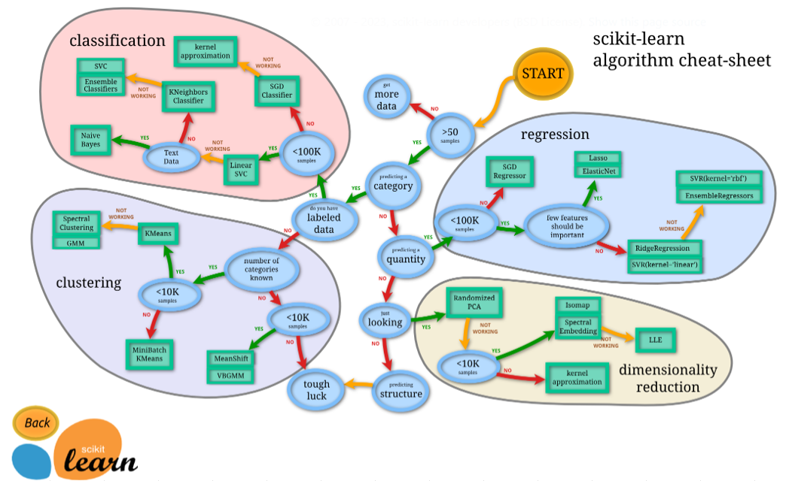

 Scikit-learn 모델 선정절차 : https://scikit-learn.org/1.3/tutorial/machine_learning_map/index.html 
Scikit-learn 모델 선정절차(확대가능 map) : https://scikit-learn.org/stable/machine_learning_map.html

 

## 【MNIST】
MNIST(Modified National Institute of Standards and Technology database)는 손으로 쓴 숫자들로 이루어진 대형 데이터베이스 
다양한 화상처리시스템과 기계학습 분야의 트레이닝 및 테스트에 널리 사용 
MNIST 데이터베이스는 60,000개의 트레이닝 이미지와 10,000개의 테스트 이미지를 포함 
MNIST 사용가이드 : https://guide.ncloud-docs.com/docs/tensorflow-tensorflow-1-3

 

## 【TensorFlow】
머신러닝 및 인공 지능을 위한 무료 오픈소스 소프트웨어 라이브러리 
다양한 작업에 사용할 수 있지만 특히 심층 신경망의 교육 및 추론에 중점 
연구 및 생산에서 Google의 내부 사용을 위해 Google Brain 팀에서 개발 
TensorFlow는 Python, JavaScript, C++ 및 Java 등 다양한 프로그래밍 언어와 많은 분야의 다양한 애플리케이션에서 쉽게 사용가능 
TensorFlow 공식문서 : https://www.tensorflow.org/?hl=ko

 

## 【Kaggle】
2010년 설립된 예측모델 및 분석 대회 플랫폼으로 2017년 3월 구글에 인수됨 
기업 및 단체에서 데이터와 해결과제를 등록하면, 데이터 과학자들이 이를 해결하는 모델을 개발하고 경쟁 
Kaggle은 전 세계 데이터 사이언티스트들이 데이터를 분석할 수 있도록 대회를 개최하고, 분석 내용을 토론할 수 있는 커뮤니티를 제공하는 플랫폼 
데이터분석 대회 뿐 아니라 데이터분석을 위한 데이터 셋, 파이썬, R 기반 개발 환경, 초보 데이터 분석가를 위한 무료 강의 등 다양한 기능 제공 
Kaggle 공식사이트 : https://www.kaggle.com/
Kaggle 가이드 : https://wikidocs.net/86304
 

  

## 【ML 알고리즘/모델】

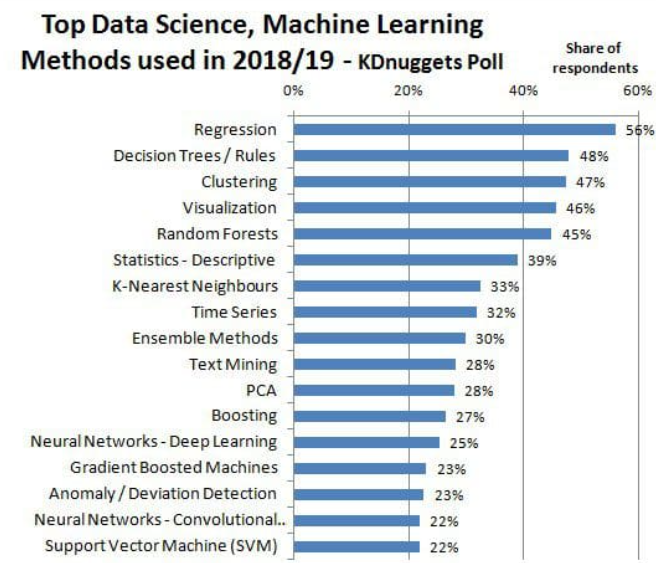

 

출처 : https://www.kdnuggets.com/2019/04/top-data-science-machine-learning-methods-2018-2019.html

 

## Top 10 Machine Learning Algorithms in 2025(Sunil Ray, 2025.4.28)
 1. Linear Regression 
2. Logistic Regression 
3. Decision Tree 
4. Support Vector Machines (SVM) 
5. Naive Bayes 
6. K-Nearest Neighbors (KNN) 
7. K-Means 
8. Random Forest 
9. Dimensionality Reduction Algorithms 
10. Gradient Boosting Algorithms 
출처 : https://www.analyticsvidhya.com/blog/2017/09/common-machine-learning-algorithms/
 

## 10 Machine Learning Algorithms to Know in 2025(Coursera, 2025.5.21)
 1. Linear regression 
2. Logistic regression 
3. Naive Bayes 
4. Decision tree 
5. Random forest 
6. K-nearest neighbor (KNN) 
7. K-means 
8. Support vector machine (SVM) 
9. Apriori 
10. Gradient boosting       
출처 : https://www.coursera.org/articles/machine-learning-algorithms?msockid=0197f0fd39fb68c821f1e42d38db69bd

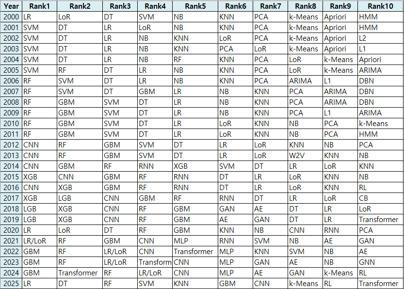
 

2000 - 2009: 공식 Top10 조사는 없으며, 통상적인 교과서·산업계 사용 알고리즘을 기반으로 정리 
2010 - 2019: KDnuggets Polls, Kaggle Competition Results 등에서 반복 언급된 알고리즘 기준으로 정리 
2020 - 2023: Kaggle Machine Learning & Data Science Survey (각 연도 공식 설문 결과) 기반 
2024 - 2025: Kaggle Survey 2023 추세 + State of AI Report 등 최신 업계 보고서를 종합한 추정 
 
LR : Linear Regression 
LoR : Logistic Regression 
DT : Decision Trees 
SVM : Support Vector Machine 
NB : Naive Bayes 
KNN : K-Nearest Neighbors 
PCA : Principal Component Analysis 
Apriori : Association Rules 
HMM : Hidden Markov Models 
GBM : Gradient Boosting Machines 
RNN : Recurrent Neural Networks 
CNN : Convolutional Neural Networks 
MLP : Multi-layer Perceptron 
GAN : Generative Adversarial Networks 
RL : Reinforcement Learning 
 

---

Anaconda 다운로드 : https://www.anaconda.com/download
 

	import sklearn
 	import pandas as pd
	import numpy as np
	import matplotlib.pyplot
	import seaborn
	import xgboost
	import lightgbm
   
	print(sklearn.__version__)
 	print(xgboost.__version__)
  	print(lightgbm.__version__)
 

Scikit Learn 업데이트(1.0.2) : Anaconda Prompt(관리자권한) 

	# scikit -learn 최신버전 설치
	$ pip install -U scikit -learn
 	# scikit -learn 교재버전 고정
 	$ pip install -U scikit -learn==1.0.2

XGBoost 설치 : Anaconda Prompt(관리자권한) 
  
  	# xgboost 설치
 	$ conda install -c anaconda py-xgboost

LightGBM 업데이트(3.3.2) : Anaconda Prompt(관리자권한) 

	$ pip install lightgbm==3.3.2

 
Visual Studio 다운로드 : https://visualstudio.microsoft.com/ko/downloads/  
도구 - 빌드도구 - C++ 데스크톱

---
