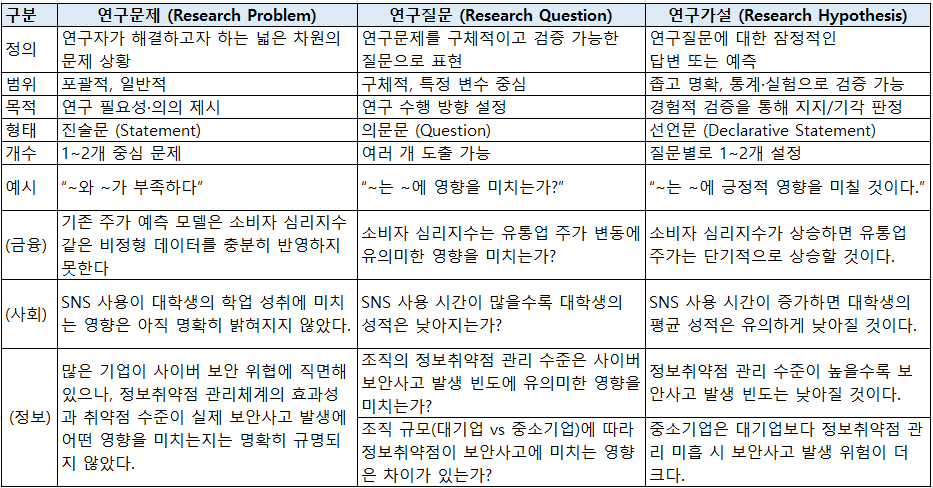
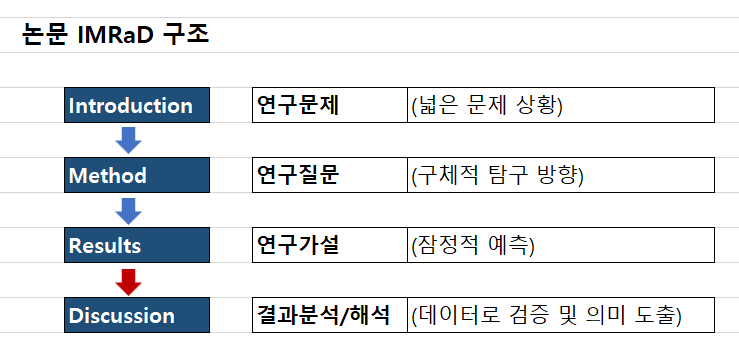
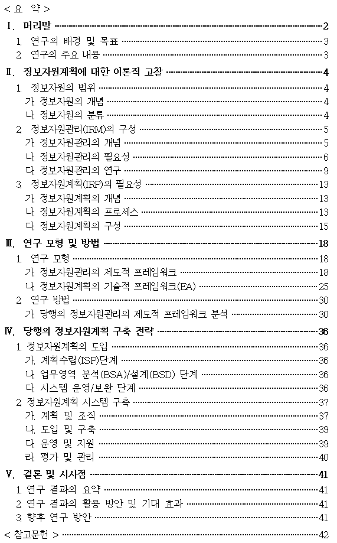
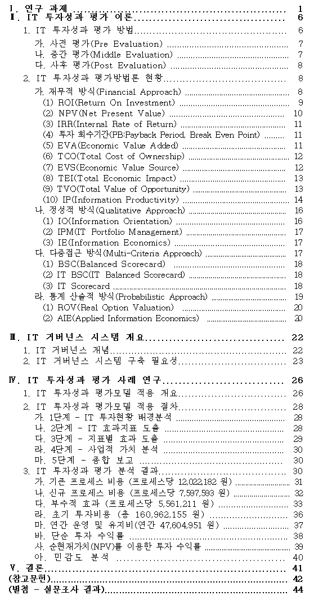
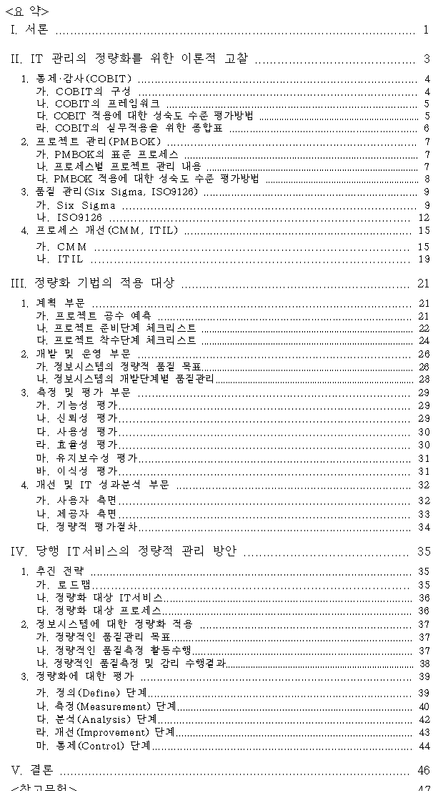
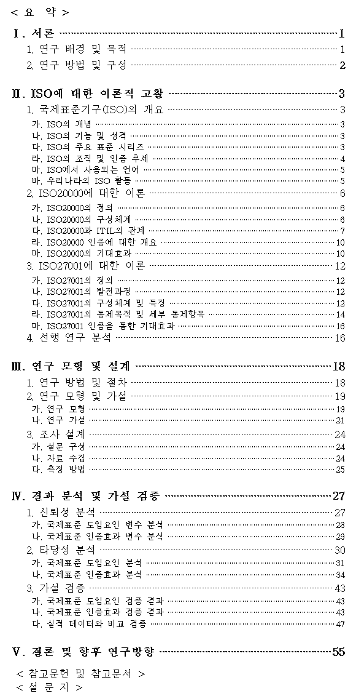
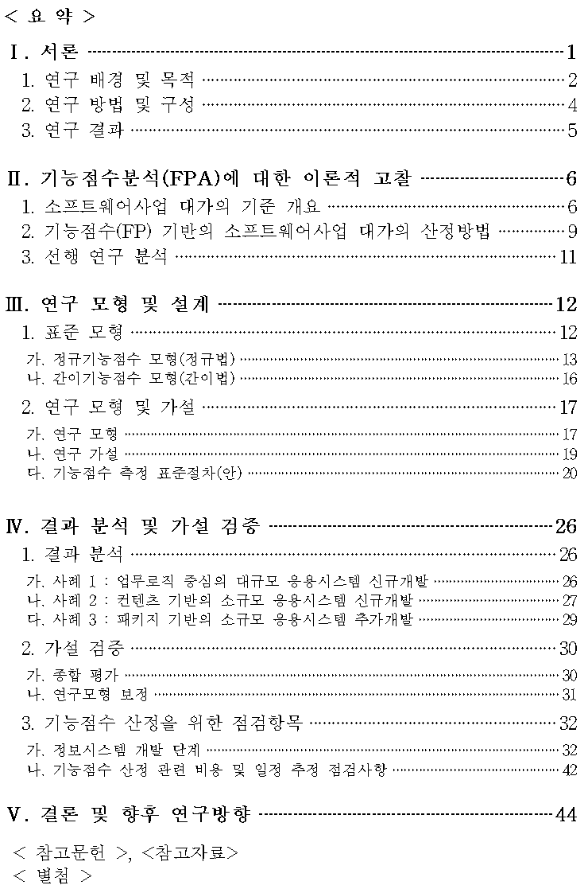
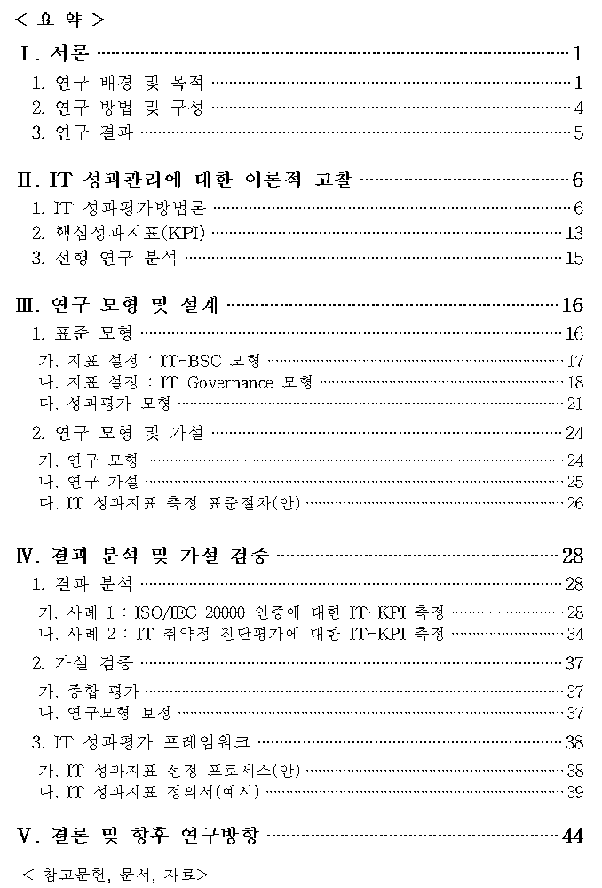
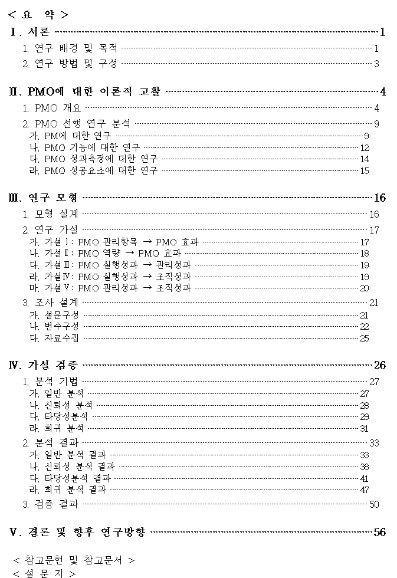
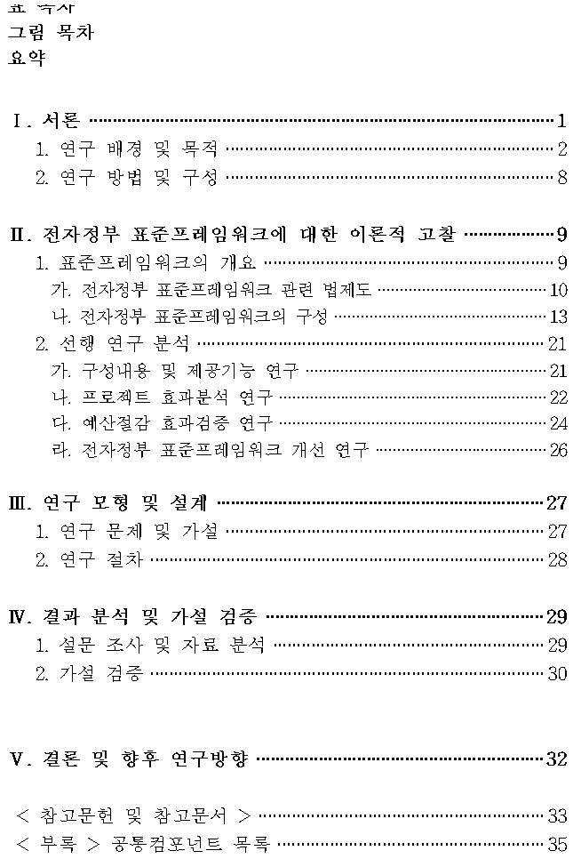

#  03 : Research Methodology 
---
	1. 연구의 개요
	2. 연구 문제(Research Problem), 연구 질문(Research Question), 연구가설(Research Hypothesis)
	3. 선행 연구(문헌 연구)
	4. 연구 설계(Research Design) 
	5. 연구 데이터
	6. 연구 결과 분석과 해석
	7. 연구 보고 및 논문 작성
---

# 1. 연구의 개요

 

## 1.1. 연구의 정의
새로운 지식·이론·기술을 창출하거나 기존 것을 개선하기 위한 체계적이고 반복 가능한 과정 
AI 기술을 활용해 현실의 문제를 해결하는 체계적인 과정  

	(1) 사전적 정의 (언어학적 관점)
	어떤 현상이나 사실을 체계적으로 탐구하여 새로운 지식이나 이론을 얻는 일
	Research: re-(다시, 반복) + search(탐색, 찾다) → “끊임없는 탐구와 재탐색의 과정.”

	(2) 철학적 정의 (인식론적 관점)
	아리스토텔레스적 전통: 지식은 원인(Why)을 밝히는 과정에서 얻어진다. → 연구는 사물의 본질을 이해하려는 시도
	칸트: 연구는 경험과 이성의 종합을 통해 새로운 진리를 탐구하는 행위.
	현대 과학철학 (포퍼, 쿤): 연구는 가설-반증의 과정이며, 패러다임 전환을 통해 진보한다.

	(3) 과학적 정의 (방법론적 관점)
	연구는 체계적이고 검증 가능한 과정
	문제 제기 → 가설 설정 → 자료 수집 → 분석 → 결론 도출
	재현 가능성과 검증 가능성(replicability & falsifiability)을 핵심 가치로 삼는다.

	(4) 실천적 정의 (사회·산업적 관점)
	정책·산업 문제 해결 도구: 데이터를 기반으로 의사결정을 지원하고 사회적 가치를 창출
	혁신의 원천: 신기술 개발, 프로세스 개선, 새로운 서비스 창출
	예: AI 연구 = 단순히 알고리즘 제안이 아니라 금융, 의료, 교통 등 실제 문제 해결로 이어져야 함

	(5) 교육적 정의 (연구자 개인의 관점)
	연구는 지적 성장과 학문적 성숙의 과정
	대학원생에게 연구는 “내 관심사 → 질문 → 데이터/이론 검증 → 학문 공동체와 소통”의 경험을 제공
	자기 정체성과 전문성을 확립하는 과정

	(6) 현대적/데이터 기반 정의
	데이터 과학 시대의 연구는 전통적 방법론에 빅데이터·AI·머신러닝을 결합하는 것
	연구는 문제를 정의하고, 데이터에서 패턴을 찾아, 재현 가능한 지식으로 환원하는 것

 

## 1.2. 연구의 목적
(1) 학문적 기여: 새로운 이론(알고리즘/모델) 제시, 기존 이론의 확장, 기존 이론의 한계점 극복 
(2) 실용적 기여: 정책 수립, 산업/사회 문제 해결 및 효율성(AI, 데이터 과학 기술을 통한 효율성·정확성 개선) 증대 
(3) 개인적 기여: 연구자로서의 정체성 확립, 학문 공동체와의 소통 및 협업 능력 배양 

 

## 1.3. 연구의 핵심
단순히 새로운 것을 만드는 것을 넘어, 이 연구가 왜 필요한지, 어떤 가치를 창출할지 명확히 정의하는 것이 중요 
아이디어(문제 인식) → 설계(방법론) → 수행(데이터·실험) → 결과(분석) → 기여(학문·사회) 

 

## 1.4. 연구의 성격
(1) 탐구적 성격: 새로운 질문 발굴 
(2) 검증적 성격: 가설을 데이터·실험으로 입증 
(3) 응용적 성격: 실제 문제 해결에 기여 

 

## 1.5. 연구의 특성
(1) 실험적: 이론적 증명뿐 아니라 실제 데이터로 모델을 구현하고 성능을 평가하는 과정이 필수적 
(2) 반복적: 가설 설정 → 실험 → 결과 분석 → 가설 재수립의 반복을 통해 최적의 결과를 도출 

 

## 1.6. AI/ML 시대의 연구
전통적 연구방법론 + 데이터 기반 접근(Data-driven research)의 결합 
예: 자연어처리 모델을 활용한 사회 현상 분석 

 

## 1.7. 연구자
(1) 연구자세: 호기심, 비판적 사고, 끈기, 객관성 유지, 열린 마음 
(2) 연구윤리: 표절 금지, 데이터 조작·조작된 결과 해석 금지, 연구 결과의 투명한 공유 
(3) 연구책임: 연구자는 기술 개발의 윤리적 책임과 사회적 영향에 대한 책임을 인식 
예: 데이터 편향성(Bias): 학습 데이터에 인종, 성별 등의 편향이 포함되면 모델의 결과에도 편향이 나타날 수 있는 바, 이를 인지하고 해결 방안을 모색 
예: AI의 사회적 영향: AI 기술이 사회에 미칠 긍정적/부정적 영향을 예측하고, 부정적 영향을 최소화하기 위한 노력이 필요 

 

---

# 1. 연구 문제(Research Problem), 연구 질문(Research Question), 연구가설 (Research Hypothesis)

 
(1) 연구문제: 넓은 차원의 문제 상황 
(2) 연구질문: 문제를 연구자가 실제로 탐구하고 답할 수 있게 만든 질문 
(3) 연구가설: 질문에 대한 잠정적 답변(예측) 

 

## 2.1 연구 문제의 중요성 : 연구자가 해결하고자 하는 넓은 차원의 문제 상황
(1) 연구의 출발점: 잘못된 문제 정의는 연구 전체를 흔들 수 있음(좋은 연구문제가 50%의 성공을 좌우) 
(2) 연구 문제는 연구의 방향성, 방법론, 결과 해석 방식을 결정 

 

## 2.2 좋은 연구문제의 조건
(1) 명확성(Clarity): 애매하거나 모호하지 않아야 함 : 해결하려는 문제, 사용 데이터, 기대하는 성과를 구체화 
(2) 연구 가능성(Feasibility): 시간, 자원, 데이터, 연구자의 능력 안에서 수행 가능해야 함 
(3) 의의(Significance): 학문적/실무적 기여 가능성이 있어야 함 
(4) 독창성(Originality): 기존 연구에서 다루지 않은 새로운 질문 포함 
(5) 검증 가능성(Testability): 경험적 자료나 논리적 분석을 통해 입증할 수 있어야 함 

 

## 2.3 연구질문
연구자가 답하고자 하는 핵심 질문으로 연구문제를 구체적으로 풀어낸 명확하고 답할 수 있는 질문 
좋은 RQ는 “왜(Why), 어떻게(How), 무엇(What)”의 형태 
예: “소비자 심리지수는 특정 산업군 주가에 유의미한 영향을 미치는가?” 

 

## 2.4 가설설정 : 연구 질문에 대한 잠정적 답변(예측)
가설 = 독립변수(원인) → 종속변수(결과) 관계의 형태 
예: “소비자 심리지수가 상승하면 유통업 주가는 단기적으로 상승할 것이다.” 

 

## 2.5 가설조건
(1) 명확하고 단일한 주장일 것 
(2) 검증 가능한 형태일 것 
(3) 반증 가능(falsifiable)해야 함 (포퍼의 과학철학) 

 

---

# 3. 선행 연구(문헌연구)

 

## 3.1. 선행연구의 목적
(1) 연구분야의 최신동향과 주요이슈 파악: 내가 연구하려는 주제가 지금까지 어떻게 연구되어 왔는지 확인, 연구 분야의 지도(map)를 그리는 과정 
(2) 중복 연구 방지: 기존 연구에서 이미 답한 질문을 반복하지 않기 위함(내 연구의 독창성 및 차별점 명확화) 
(3) 연구의 차별성 확보: 기존 연구의 한계점, 미흡한 부분을 기반으로 연구문제를 발전 
(4) 연구 설계의 토대: 이론적 틀(Framework), 변수 선정, 방법론 선택의 근거 제공 

 

## 3.2. 선행연구의 접근방법
(1) 체계적 분석: 관련 논문, 특허 등을 연도별, 주제별로 분류하여 분석 
(2) 비판적 접근: '이 논문은 어떤 한계가 있는가?', '어떻게 개선할 수 있는가?'와 같은 질문을 통해 연구 아이디어 발굴 

 

## 3.3 선행연구 수행절차: 검색 → 정리 → 분류 → 분석 → 연구공백 도출
(1) 검색 도구 활용 
학술 데이터베이스: Google Scholar, Scopus, Web of Science, DBpia, RISS 
키워드 검색 전략: 주요 개념(핵심 키워드), 동의어, Boolean 연산자(AND/OR/NOT) 활용 
(2) 관련 연구 정리 
논문, 학술지, 보고서, 학위논문, 학술회의 자료 등 
연구 목적·방법·결과·한계를 중심으로 요약 
(3) 체계적 분류 
연도별, 주제별, 방법론별로 정리 
표 또는 맵핑(mapping) 기법 활용 
(4) 비교 및 분석 
공통점과 차이점 파악 
반복되는 주제와 연구 공백(Research Gap) 도출 

 

## 3.4 선행연구 유의사항
(1) 비판적 시각 유지 : 단순 요약이 아니라 “무엇이 강점이고 무엇이 부족한가” 평가 
(2) 최신성 확보 : 3~5년 이내 최신 논문 중심, 고전 연구는 배경 설명용 
(3) 대표성 고려 : 영향력 있는 저널·컨퍼런스 논문 포함 (Impact Factor, Citation 기준) 
(4) 연구공백(Research Gap) 찾기 : 기존 연구가 다루지 않은 분야, 연구 대상·방법·데이터의 한계, 상충되는 결과(Conflict Results) → 새로운 연구 필요성 

 

---

# 4. 연구 설계(Research Design)
연구 문제와 연구 질문을 해결하기 위한 체계적 절차와 전략 

 

## 4.1 연구 설계의 유형
(1) 접근 방식에 따른 구분 
정성적 연구(Qualitative): 현상 이해, 인터뷰·사례 연구, 주관적 의미 탐구 
정량적 연구(Quantitative): 수치 기반 검증, 통계·실험, 가설 검증 
혼합 연구(Mixed Methods): 정성 + 정량 결합 → 보완적 시각 제공 
(2) 방법론적 유형 
실험 연구(Experiment): 변수 간 인과관계 검증 (통제 집단/실험 집단) 
조사 연구(Survey): 설문, 인터뷰 → 태도·행동 패턴 분석 
사례 연구(Case Study): 특정 사례 깊이 분석 (기업, 제도, 사건) 
데이터 기반 연구(Data-driven): 대규모 데이터 분석, AI/ML 활용 

 

## 4.2 연구 절차 설계
(1) 연구 변수 정의 : 독립변수(원인), 종속변수(결과), 통제변수(외부 영향 차단) 
예: 정보취약점 관리 수준(독립변수) → 보안사고 발생 빈도(종속변수), 기업 규모, 산업군, IT 투자 수준(통제변수) 
(2) 연구 대상 및 표본(Sample) 선정 : 모집단(Population) 정의 → 표본 추출 방법(random, stratified, convenience) 
(3) 데이터 수집 방법 : 1차 데이터(실험, 설문, 관찰), 2차 데이터(기존 데이터셋, 공공 데이터, 기업 자료) 
(4) 분석 방법 선택 : 통계 분석 (회귀, 분산분석), 머신러닝(분류, 예측), 내용분석(정성적) 

 

## 4.3 연구 타당성과 신뢰성 확보
(1) 내적 타당성 (Internal Validity) : 연구 결과가 독립변수의 영향 때문임을 보장하는 정도 → 통제 집단 사용, 혼란변수 제거 
(2) 외적 타당성 (External Validity) : 결과를 다른 상황/집단에 일반화할 수 있는 정도 → 다양한 표본, 현실성 있는 상황 설계 
(3) 신뢰성 (Reliability) : 동일 조건에서 반복 연구 시 같은 결과 도출 가능성 → 측정 도구의 일관성 확보, 반복 검증 

 

---

# 5. 연구 데이터

 

## 5.1 데이터의 유형
(1) 정성적 데이터(Qualitative): 텍스트, 인터뷰, 관찰 기록 
(2) 정량적 데이터(Quantitative): 숫자, 계량화된 측정값 
(3) 구조화 데이터: DB, 엑셀, 센서 값 
(4) 비구조화 데이터: 텍스트, 이미지, 로그 데이터, SNS 글 

 

## 5.2 데이터의 출처
(1) 1차 데이터(Primary Data): 연구자가 직접 수집 (실험, 설문, 인터뷰 등) 
(2) 2차 데이터(Secondary Data): 기존 데이터 활용 (공공 데이터, 통계청, Kaggle, UCI 등) 
(3) 빅데이터/오픈데이터: API, 로그 데이터, 금융·의료·산업 데이터셋 

 

## 5.3 데이터의 수집
(1) 표본 추출: 단순무작위, 층화추출, 편의추출 
(2) 데이터 규모와 품질 고려 

 

## 5.4 데이터의 전처리
(1) 결측치 처리: 삭제, 평균 대체, 다중 대체법(Multiple Imputation) 
(2) 이상치(outlier) 탐지: 통계적 방법, 머신러닝 기반 방법 
(3) 정규화/표준화: 변수 스케일 맞추기 (z-score, min-max scaling) 
(4) 변수 변환: 로그 변환, 더미 변수 생성 
(5) 레이블링/인코딩: 범주형 → 수치형 (Label Encoding, One-Hot Encoding) 
(6) 정규화: 데이터 스케일을 통일하여 모델 학습 효율 증대 
(7) 데이터 증강 (Data Augmentation): 이미지 회전, 뒤집기 등으로 데이터 다양성을 확보하여 모델 일반화 능력 향상 

 

## 5.5 데이터의 분석방법론
(1) 통계적 기법 
기초 통계: 기술통계, 상관관계 분석 
추론 통계: 회귀분석, 분산분석(ANOVA), 요인분석 
가설 검정: t-test, 카이제곱 검정, z-test 
(2) 머신러닝/AI 기법 
지도학습: 회귀(Linear/Logistic), 분류(SVM, Random Forest, Neural Network) 
비지도학습: 군집분석(K-means, Hierarchical Clustering), 차원 축소(PCA) 
딥러닝 응용: 이미지·텍스트 분석 (CNN, RNN, Transformer) 
(3) 연구 설계와의 연계 
연구 질문이 “인과관계 검증” → 통계적 기법(회귀분석, 실험 디자인) 
연구 질문이 “예측” → 머신러닝 기법(랜덤포레스트, XGBoost, 신경망) 
연구 질문이 “패턴 탐색” → 비지도학습 기법(클러스터링, 연관규칙 분석) 

 

## 5.6 데이터 사례
(1) 금융 데이터 연구 
연구질문: “소비자 심리지수가 주가에 영향을 미치는가?” 
데이터: 한국은행 CSI 지수 + 코스피 주가 
방법론: 다중회귀분석, 시계열 예측(ARIMA vs LSTM) 
(2) 정보보안 연구 
연구질문: “정보취약점 관리 수준은 보안사고 발생 가능성에 영향을 미치는가?” 
데이터: 기업 보안 로그, 침해사고 통계 
방법론: 로지스틱 회귀, 랜덤포레스트 

 

---

# 6. 연구 결과 분석과 해석

 

## 6.1 연구 결과 제시
(1) 데이터 시각화 
표(Table): 숫자·비교 강조 
그래프(Figure): 추세·관계 강조 (막대그래프, 선그래프, 산점도, 히트맵 등) 
통계 검정 결과: 회귀분석 계수, 유의확률(p-value), 설명력(R²) 
(2) 핵심 지표 제시 
정확도(Accuracy), 정밀도(Precision), 재현율(Recall), F1 Score (ML 연구) 
회귀분석 결과: β 계수, 신뢰구간, p-value 
시계열 연구: 예측 오차(MAPE, RMSE) 

 

## 6.2 결과분석 및 의미도출
(1) 연구 질문/가설과의 연결 
단순히 “수치 결과”를 제시하는 게 아니라 → “이 결과가 연구 질문에 어떤 답을 주는가?” 연결 
예: “소비자 심리지수 계수가 양(+)이고 통계적으로 유의 → 가설 H1 지지 → 심리지수가 주가 상승에 기여” 
(2) 이론적 의미 
기존 이론과 비교 (일치/불일치 여부 확인) 
새로운 이론적 기여 제시 가능성 
(3) 실무적 의미 
정책, 기업 전략, 사회적 시사점 제시 
예: 보안 연구라면 “정보취약점 관리 체계 강화가 실제 사고 예방으로 이어진다”라는 실무적 제언 가능 

 

## 6.3 해석
(1) 가설이 지지되면 → 연구질문에 대한 답을 제시 → 연구문제 해결에 기여 
(2) 가설이 기각되면 → 새로운 연구문제/질문 도출의 출발점 

 

## 6.4 해석시 유의사항
(1) 통계적 유의성과 실제적 중요성 구분 : p < 0.05라 해도 효과 크기가 작으면 실제 의미는 제한적 
(2) 과잉 해석 금지 : 상관관계 ≠ 인과관계, 데이터 범위/표본 제한 고려 필요 
(3) 한계점 인식 : 표본 크기, 데이터 품질, 방법론적 제약을 솔직하게 인정 
(4) 후속 연구 제안 : 연구의 한계에서 새로운 연구 문제 제시 가능 

 

---

# 7. 연구 보고 및 논문 작성

 

## 7.1 논문 표준 구조 (IMRaD)

 
(1) I (Introduction): 연구문제·연구질문 제시, 연구 필요성 설명 
(2) M (Method): 연구 설계, 데이터, 분석 방법론 상세 기술 
(3) R (Results): 핵심 결과 제시 (표·그래프, 검증 지표 포함) 
(4) D (Discussion): 결과 해석, 기존 연구와의 비교, 한계 및 시사점 

 

## 7.2 작성 원칙
(1) 명확성: 간결하고 일관된 용어 사용 
(2) 논리성: 문제 → 질문 → 가설 → 결과 → 해석이 자연스럽게 이어져야 함 
(3) 객관성: 결과는 사실로, 해석은 근거 기반으로 작성 
(4) 가독성: 소제목, 표/그림, 번호 매김 활용 

 

## 7.3 인용, 참고문헌
(1) 인용 방식 
APA 스타일: (홍길동, 2023) 
IEEE 스타일: [1], [2] 번호 기반 
(2) 참고문헌 관리 도구 
EndNote, Mendeley, Zotero → 논문 작성 시 자동 인용/참고문헌 생성 

---

**내부 논문**

	2005, 당행의 정보자원계획(IRP : Information Resource Planning) 구축 전략
	2006, IT 투자성과 평가모델 개발 연구 :  IT 거버넌스 시스템 구축에 적용
	2007, SOA를 활용한 정보시스템의 운영 효율성 제고 방안
 		: 당행 정보시스템에 서비스지향 아키텍처 도입을 고려하기 위한 실질적 연구(실무2등)
	2008, 효율적인 서비스 지원을 위한 IT 관리의 정량화 방안
 		: 당행 정보시스템 개발 및 운영에 대해 정량화 기법 적용을 위한 실질적 연구
	2009, 국제표준(ISO) 인증이 업무 생산성과 안정성에 미치는 효과 분석
 		: ISO20000과 ISO27001을 중심으로(실무1등)
	2010, 기능점수분석(FPA)을 활용한 당행의 정보시스템 개발사업 규모산정 기법 연구(실무3등)
	2011, 당행의 IT성과지표 도출 및 측정에 관한 연구
	2014, 정보시스템 개발 프로젝트의 성공요인과 PMO역량과의 상관관계 분석(3등)
	2018, 전자정부 표준프레임워크 기반의 정보시스템 구축에 대한 실증적인 연구

**외부 논문 등**

	2007.6, 웹2.0 기반의 웹서비스 사례연구, 인터넷정보학회지 게재
	2010.7, ITSM 기반의 IT Governance, 2010 itSMF & ISACA 통합 컨퍼런스 발표  
	2012.4, ISO20000 인증에 대한 정량적인 효과분석, 한국품질경영학회 2012년 춘계학술대회 발표
	2014.7, 클라우드 컴퓨팅이 IT서비스 관리에 미치는 영향에 관한 연구, 산업통상자원부 게재
	2017.8, 정보시스템 구축 프로젝트의 성공요인과 감리와의 상관관계 분석모형 연구, 건국대 석사논문
	2021.2, IT융합에 대한 조직의 인식과 CEO의 추진의지가 조직의 IT활용 및 경영성과에 미치는 영향연구
 		:  CIO 조절효과를 중심으로, 한국IT정책경영학회논문지
	2021.4, ERP시스템 도입유형이 기업의 ITSW 활용에 미치는 영향에 관한 실증연구, 한국IT서비스학회지,
	2021.8, 공공 금융기관의 클라우드 기반 ERP 활성화방안
 		: 전주기적 관리를 접목한 TOE 수정모형을 중심으로, 서울과학기술대 정책학 박사학위논문

---

**(1) 2005, 당행의 정보자원계획(IRP : Information Resource Planning) 구축 전략**
 

   

---

**(2) 2006, IT 투자성과 평가모델 개발 연구 :  IT 거버넌스 시스템 구축에 적용**
 

   

---

**(3) 2007, SOA를 활용한 정보시스템의 운영 효율성 제고 방안 : 당행 정보시스템에 서비스지향 아키텍처 도입을 고려하기 위한 실질적 연구(실무2등)**
 

   

---

**(4) 2008, 효율적인 서비스 지원을 위한 IT 관리의 정량화 방안 : 당행 정보시스템 개발 및 운영에 대해 정량화 기법 적용을 위한 실질적 연구**
 

   

---

**(5) 2009, 국제표준(ISO) 인증이 업무 생산성과 안정성에 미치는 효과 분석 : ISO20000과 ISO27001을 중심으로(실무1등)**
 

   

---

**(6) 2010, 기능점수분석(FPA)을 활용한 당행의 정보시스템 개발사업 규모산정 기법 연구(실무3등)**
 

   

---

**(7) 2011, 당행의 IT성과지표 도출 및 측정에 관한 연구**
 

   

---

**(8) 2014, 정보시스템 개발 프로젝트의 성공요인과 PMO역량과의 상관관계 분석(3등)**
 

   

---

**(9) 2018, 전자정부 표준프레임워크 기반의 정보시스템 구축에 대한 실증적인 연구**
 

   

---

	
