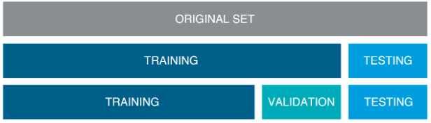
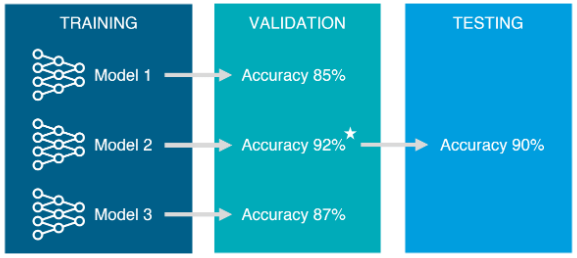

#  03 : Data Collection, Data Processing : Python, 라이브러리(NumPy, Pandas, Scikit-Learn, MNIST, TensorFlow...)
---
	 ▣ 데이터 수집
	 ▣ 데이터 전처리	 
	 ▣ 데이터셋 분리  	  
  	 ▣ Python 라이브러리	
---

## ▣ 데이터 수집

데이터 수집은 머신러닝 절차(분석 문제 정의 → 데이터 수집 → 탐색적 데이터 분석(EDA) → 피처 엔지니어링 → 예측 모델 개발 → 서비스 적용) 중 분석 문제 정의 다음의 단계이며, 이 단계에서는 정의한 문제를 해결하기 위한 데이터들을 수집하는 단계이다. 어떤 데이터를 수집하느냐에 따라 문제 해결을 위한 접근 방식이 달라지며, 이것은 데이터의 유형도 신경써야할 필요가 있다. 머신러닝 프로젝트에서 두 번째 단계인 '데이터 수집'은 분석의 기반이 되는 데이터를 확보하는 과정으로 다음과 같은 5가지 단계로 이루어진다. 

**(1) 원시 데이터 수집 :** 중요도에 비해 관심을 덜 받는 경우가 많지만 데이터 수집은 우수한 알고리즘을 얻기 위한 첫 걸음이다. 일반적으로 대량의 데이터 집합을 사용하는 단순한 모델이 소량의 데이터 집합을 사용하는 진보된 모델보다 성능이 더 우수하다.  
 
**(2) 데이터 마트 생성 :** 데이터 마트는 특정 주제나 부서에 초점을 맞춘 작은 규모의 데이터 웨어하우스를 의미하며, 이 단계에서는 필요한 데이터를 특정 주제나 목적에 맞게 분류하거나 구성한다. 이를 통해 필요한 데이터를 효율적으로 관리하고 사용할 수 있다. 예컨대, '고객 만족도'라는 주제는 고객 ID, 구매 이력, 제품 리뷰, 고객 서비스 이력 등을 포함하는 데이터 마트를 생성한다. 
 
**(3) 데이터 정합성 평가 :** 수집된 데이터의 질을 평가하는 과정으로 데이터의 정확성, 일관성, 완전성, 신뢰성 등을 검토하고, 이상치나 결측치, 중복 값 등이 있는지 확인한다. 이를 통해 데이터의 정합성을 보장하고, 분석의 신뢰성을 높일 수 있다. 예컨대, 고객 ID의 중복, 제품 리뷰의 결측치, 구매 이력의 이상치 등을 확인하고, 이를 수정하거나 제거하여 데이터의 정합성을 보장한다.  
 
**(4) 데이터 취합 :** 여러 출처에서 수집된 데이터를 하나의 데이터 세트로 합치는 과정으로 동일한 개체나 사건을 나타내는 데이터가 일관된 방식으로 표현되고 연결되어야야만 이를 통해 통합된 정보를 제공하고, 분석의 효율성을 높일 수 있다. 예컨대, 구매 이력 데이터, 제품 리뷰 데이터, 고객 서비스 이력 데이터 등을 고객 ID를 기준으로 합친다. 
 
**(5) 데이터 표준화 :** 서로 다른 소스에서 수집된 데이터는 종종 다른 형식이나 구조로 저장되어 있는 경우는 단계에서는 모든 데이터를 일관된 포맷으로 변환하여, 분석이나 처리가 쉽도록 한다.예컨대, 일자 데이터가 '년-월-일' 형식으로 저장된 곳도 있고, '월/일/년' 형식으로 저장된 곳도 있다면, 이를 일관된 형식으로 통일시킨다. “Garbage in, garbage out”라는 말이 있듯이, 무의미한 데이터가 들어오면 나가는 데이터도 무의미하다. 데이터의 출처에 따라 부가적인 포맷과 표준화가 필요할 수 있으며, 고품질의 대량의 데이터 집합이라도 해도 데이터 포맷이 잘못되면 힘을 발휘할 수 없다. 이 점은 여러 출처의 데이터를 집계할 때 특히 유의해야 한다. 
 
이렇게 데이터 수집 단계를 통해 필요한 데이터를 효과적으로 확보하고, 그 데이터의 질을 보장하고, 데이터를 적절하게 관리하고 사용할 수 있으며, 이 단계를 잘 수행하면, 그 이후의 분석 과정에서 좀 더 정확하고 효율적인 결과를 얻을 수 있다다. 이렇게 데이터 수집 단계를 거친 후에는, 데이터의 질을 보장하고, 필요한 정보를 효율적으로 제공하는 '탐색적 데이터 분석(EDA)', '피처 엔지니어링', '예측 모델 개발', '서비스 적용' 등의 작업을 진행할 수 있다. 

머신러닝 데이터셋(dataset) 사이트 40가지 모음 : https://kr.appen.com/blog/best-datasets/
 
Mushrooms Classification https://www.kaggle.com/uciml/mushroom-classification
 
Medical Costs Personal Dataset https://www.kaggle.com/mirichoi0218/insurance/data
 
Wine Classification(Red & White wine Dataset) https://www.kaggle.com/numberswithkartik/red-white-wine-dataset 

  

## ▣ 데이터 전처리
데이터 전처리는 기존의 데이터를 머신러닝 알고리즘에 알맞은 데이터로 바꾸는 과정이다. 이 전처리 과정은 모델이 생성된 이후에도 예측하고자 하는 새로운 데이터에도 적용할 수 있는 과정으로 전처리 과정을 통해 더욱더 모델 학습의 성능을 높일 수 있다. 데이터 전처리는 Data Cleaning, Handling Text and Categorical Attributes, Custom Transformers, Feature Scaling, Transformation Pipelines등 5개의 과정으로 수행한다. 

### (1) Data Cleaning
대부분의 머신러닝 알고리즘은 Missing feature, 즉 누락된 데이터가 있을 때, 제대로 역할을 하지 못한다. 그래서 먼저 Missing feature에 대해 처리해주어야 한다. 

 불필요 데이터 제거(처리) 
 
 	dropna() : pandas에서 제공하는 누락 데이터를 제거하는 함수
   	Na/NaN과 같은 누락 데이터를 제거
	axis: 파라미터 값으로 0을 주면 행 제거, 1을 주면 열 제거(default값은 0)
	subset: array, 특정 feature를 지정하여 해당 Feature의 누락 데이터 제거

 전체 속성 제거 : 연관성 없는 feature의 경우, 학습에 방해가 될 수 있기 때문에 제거 
 
   	drop() : pandas에서 제공하는 특정 데이터 열(또는 행)을 제거하는 함수   
	특정 행 또는 열의 라벨(데이터)들을 제거
	labels: 제거할 데이터를 지정하는 파라미터
	axis: 파라미터 값으로 0을 주면 행 제거, 1을 주면 열 제거(default값은 0)

 누락 데이터에 특정 값을 지정 : zero(0으로 채우기), the mean(평균값으로 채우기), the median(중간값으로 채우기) 등 
 
 	fillna() : pandas에서 제공하는 누락 데이터에 특정 값을 채우는 함수 
   	특정 메서드를 지정하여 Na/NaN값을 채우기
	value: scalar, dict, series or dataframe, value 등 구멍을 메우기 위한 값

 scikit-learn에서 제공하는 클래스 
 
 	Imputer() class   
	missing_values: int or 'NaN'
	strategy: 'median'(중앙값), 'mean'(평균값), 'most_frequent'(최빈값)
	axis: 0(columns), 1(rows)

사용법 

	# Imputer Class 선언, 채우고자 하는 값을 함께 정의
 	from sklearn.preprocessing import Imputer
 	imputer = Imputer(strategy='median')

	# fit() 함수를 사용하여 기존 데이터의 누락 데이터에 채워야 할 값을 imputer 객체에 훈련
 	imputer.fit(dataset)
	
	# transform() 함수를 사용하여 기존 데이터의 누락 데이터를 변환합니다.
 	X = imputer.transform(dataset)

### (2) Handling Text and Categorical Attributes
수집된 데이터는 컴퓨팅 학습을 위해서 기존 데이터 세트에 텍스트가 있는 경우 이것을 숫자형 데이터로 인코딩(Encoding)이 필요하다. 인코딩에는 레이블 인코딩(Label Encoding)과 원핫 인코딩(One-hot Encoding)을 통해 범주형 데이터를 수치형 데이터로 변환이 필요하다. 
**레이블 인코딩 :** 각 카테고리를 숫자로 대응시켜서 변환한다. 예컨대, "red", "green", "blue"라는 3개의 카테고리가 있다면 "red"를 1로, "green"을 2로, "blue"를 3으로 변환하는 것이다. 이 방법은 간단하고 직관적이지만, 각 카테고리가 가지는 값의 크기 차이가 있을 경우 예측 결과에 영향을 미칠 수 있다. 텍스트를 숫자로 인코딩하는 메소드로는 Pandas에서 제공하는 factorize()와 OrdinalEncoder()이 있으며, sklearn.preprocessing.LabelEncoder를 사용할 수도 있다. 
 
**원핫 인코딩 :** 각 카테고리를 벡터 형태로 변환한다. 예컨대, "red", "green", "blue"라는 3개의 카테고리가 있다면 "red"는 [1, 0, 0], "green"은 [0, 1, 0], "blue"는 [0, 0, 1]로 변환하는 것이다. 이 방법은 각 카테고리를 독립적인 변수로 취급하기 때문에 각 카테고리가 가지는 값의 크기 차이를 고려하지 않기 때문에 범주형 변수의 카테고리가 많을수록 차원이 커지는 단점이 있지만, 예측 결과에 영향을 미치는 위험이 적다. 
따라서, 레이블 인코딩은 카테고리가 서열을 가지는 경우(예: "bad", "average", "good")나 카테고리의 수가 적을 경우에 사용하고, 원핫 인코딩은 카테고리의 수가 많을 경우에 사용한다. 원핫 인코딩 메소드로는 OneHotEncoder()가 있다. 

예제로 사용할 데이터 

	>>> housing_cat = housing[["ocean_proximity"]]
	>>> housing_cat.head(10)
        	ocean_proximity
  	17606       <1H OCEAN
  	18632       <1H OCEAN
  	14650      NEAR OCEAN
  	3230           INLAND
  	3555        <1H OCEAN
  	19480          INLAND
  	8879        <1H OCEAN
  	13685          INLAND
  	4937        <1H OCEAN
  	4861        <1H OCEAN
  	>>> housing_categories
  	Index(['<1H OCEAN', 'INLAND', 'ISLAND', 'NEAR BAY', 'NEAR OCEAN'],
        dtype='object')

**factorize()**  

	#Pandas에서 제공하는 메서드로서, 숫자형 또는 카테고리형으로 인코딩을 해주는 함수
	#여러 개의 카테고리형 input feature들을 인코딩
	#파라미터 = values: a 1-D array, factorization전의 배열
	#	   sort: bool, default False, 관계를 유지하면서 unipue 한 카테고리 label을 준비
	#Returns = labels: ndarray, 인코딩된 결과를 배열로 리턴
	#          uniques: ndarray, 카테고리를 배열로 리턴
 
 	housing_cat_encoded, housing_categories = housing_cat.factorize()
  	[0 0 1 2 0 2 0 2 0 0 2 2 0 2 2 0 3 2 2 2 0]

**OrdinalEncoder()**  

	#Scikit-learn에서 제공하는 factorize 역할의 클래스
	#OrdinalEncoder객체를 생성해서, inputer와 비슷한 방식으로 사용
 	#대신, fit_transform() 메서드를 사용하여, fit과 transform을 한 번에 제공
  	
  	from sklearn.preprocessing import OrdinalEncoder 
  	ordinal_encoder = OrdinalEncoder()
  	housing_cat_encoded = ordinal_encoder.fit_transform(housing_cat)**
	
  	> housing_cat_encoded[:10] 
  	> array([[0.],
  	> 
  	> 
  	>      [0.],
  	>      [4.],
  	>      [1.],
  	>      [0.],
  	>      [1.],
  	>      [0.],
  	>      [1.],
  	>      [0.],
  	>      [0.]])
  	>

위의 factorize()와 OrdinalEncoder()와 같은 카테고리형 텍스트를 단순히 순서에 맞게 숫자형으로 바꾸어주는 방법은 문제점이 있다. 예컨대, 위의 함수들을 사용해서 변환시키면 <1H OCEAN변수는 0이고, NEAR OCEAN변수는 4입니다. 각각 변수들은 0~4까지 있는데, 1 같은 경우 0과 비슷하다고 ML알고리즘은 판단할 수 있다. 실제로는 비슷하지 않지만, 알고리즘은 숫자에 의미를 두어 거리를 판단하게 되는 경우가 생긴다. 이를 방지하기 위해서 나온 것인 One-Hot Encoder.

**OneHotEncoding()**  

	#Scikit-learn에서 제공하는 클래스로, 카테고리형 특징들을 one-hot 숫자형 배열로 인코딩해주는 클래스
	#오직 하나로 해당되는 부분만 1(Hot)로, 나머지는 0(Cold)으로 바꾸는 방법
  	
  	from sklearn.preprocessing import OneHotEncoder
  	cat_encoder = OneHotEncoder() 
  	> housing_cat_1hot = cat_encoder.fit_transform(housing_cat) 
  	> housing_cat_1hot
  	> <16512x5 sparse matrix of type '<class 'numpy.float64'>'
  	> with 16512 stored elements in Compressed Sparse Row format>
	
  	>>> housing_cat_1hot.toarray()
  	array([[1., 0., 0., 0., 0.],
         	[1., 0., 0., 0., 0.],
         	[0., 0., 0., 0., 1.],
         	...,
         	[0., 1., 0., 0., 0.],
         	[1., 0., 0., 0., 0.],
         	[0., 0., 0., 1., 0.]])

**sklearn.preprocessing.LabelEncoder**

	#fit(): 어떻게 변환할 지 학습
	#transform(): 문자열를 숫자로 변환
	#fit_transform(): 학습과 변환을 한번에 처리
	#inverse_transform():숫자를 문자열로 변환
	#classes_ : 인코딩한 클래스 조회
	
	import numpy as np
	from sklearn.preprocessing import LabelEncoder
 
	items = ['TV','TV','냉장고','컴퓨터','냉장고','컴퓨터', '에어콘']
	le = LabelEncoder()
	le.fit(items) 
	label = le.transform(items)
	
	print(label, type(label))
	# ==> [0 0 1 3 1 3 2] <class 'numpy.ndarray'>
	print(le.classes_)
	# ==> ['TV' '냉장고' '에어콘' '컴퓨터']

	d = {
    	'item':items,
    	'cnt':np.arange(8)
	}
	df = pd.DataFrame(d)
	df.info()
	
	items[..., np.newaxis]
	# ==> array([['TV'],
	#       ['냉장고'],
	#       ['컴퓨터'],
	#       ['컴퓨터'],
	#       ['냉장고'],
	#       ['에어콘'],
	#       ['에어콘'],
	#       ['선풍기']], dtype='<U3')

	from sklearn.preprocessing import OneHotEncoder
	ohe = OneHotEncoder()
	ohe.fit(items[..., np.newaxis])
	ohv = ohe.transform(items[..., np.newaxis])
	ohv, type(ohv)
	ohv.toarray()
	# ==> array([[1., 0., 0., 0., 0.],
	#       [0., 1., 0., 0., 0.],
	#       [0., 0., 0., 0., 1.],
	#       [0., 0., 0., 0., 1.],
	#       [0., 1., 0., 0., 0.],
	#       [0., 0., 0., 1., 0.],
	#       [0., 0., 0., 1., 0.],
	#       [0., 0., 1., 0., 0.]])

	from sklearn.preprocessing import OneHotEncoder
	ohe = OneHotEncoder(sparse=False)
	ohe.fit(items[..., np.newaxis])
	ohv = ohe.transform(items[..., np.newaxis])
	ohv, type(ohv)
	pd.DataFrame(ohv, columns=ohe.get_feature_names())

### (3) Custom Transformers
Scikit-learn에서는 다양한 데이터 변환기(Transformer)들을 제공하는데, 이를 이용하여 커스텀 변환기를 만들 수 있다.

**fit()**

	x: input data
	x라는 데이터에 특정 알고리즘 또는 전처리를 적용하는 메서드
 	이를 통해 변환기에 알맞는 파라미터를 생성

**transform()**

	x: input data
	fit()을 통해 생성된 파라미터를 통해서 모델을 적용시켜 데이터 세트를 알맞게 변환시키는 메소드

**fit_transform()**

	#같은 데이터 세트를 사용하여 fit과 transform을 한 번에 하는 메서드
 	#아래 코드는 rooms_per_household, population_per_household 두 변수의 데이터를 생성하는 코드로
        #fit함수 작성을 통해 데이터 세트를 받아서 객체를 return 하고, 
	#transform을 통해 데이터 세트를 실질적으로 변환(생성)
 
  	from sklearn.base import BaseEstimator, TransformerMixin
	rooms_ix, bedrooms_ix, population_ix, households_ix = 3, 4, 5, 6

 	class CombinedAttributesAdder(BaseEstimator, TransformerMixin):
      		def __init__(self, add_bedrooms_per_room = True): # no *args or **kargs
          		self.add_bedrooms_per_room = add_bedrooms_per_room
      		def fit(self, X, y=None):
          	   return self  # nothing else to do
      		def transform(self, X, y=None):
          	   rooms_per_household = X[:, rooms_ix] / X[:, households_ix]
          	population_per_household = X[:, population_ix] / X[:, households_ix]
          	if self.add_bedrooms_per_room:
		   bedrooms_per_room = X[:, bedrooms_ix] / X[:, rooms_ix]
              	   return np.c_[X, rooms_per_household, population_per_household,
			bedrooms_per_room]
          	else:
                  return np.c_[X, rooms_per_household, population_per_household]
	
  	attr_adder = CombinedAttributesAdder(add_bedrooms_per_room=False)
  	housing_extra_attribs = attr_adder.transform(housing.values)

### (4) Feature Scaling
일반적인 ML 알고리즘들은 아주 다양한 범위의 숫자형 데이터를 학습시킨다면 제대로 성능을 보여주지 못한다. 예컨대, 특정 데이터의 범위가 -500~39,320이라면 아주 다양한 데이터가 존재한다. 이러한 상태에서는 제대로 된 학습을 잘하지 못한다. 이를 방지하기 위해서 숫자형 데이터의 범위를 줄여주는 방법을 사용한다.

**Min-Max Scaling (Normalization)**

	#최솟값과 최댓값을 확인하여 이 값들을 모두 지정한 범위(대체로 0과 1 사이)의 상대적인 값으로 변환
	#특정 범위를 지정하면 해당 범위 안으로 바인딩
	#Scikit-learn에서는 MinMaxScaler(feature_range, copy) class를 제공
	#feature_range: tuple(min, max), default=(0, 1), 변환하고자 하는 데이터의 변환 지정 범위
	#copy: Boolean, 변환 이전의 값들을 복사해 둘 것인지에 대한 여부
 
 	from sklearn.preprocessing import MinMaxScaler

  	a = [[10, 2, 1], [9, 2, 1], [8, 2, 1], [6, 2, 5], [2, 8, 10]]
  	scaler = MinMaxScaler(feature_range=(0,1))
  	a = scaler.fit_transform(a)
  	>>> print(a)
	 [ [1.    0.     0.]
		[0.875    0.    0.]
      		[0.75    0.    0.]
      		[0.5    0.    0.44444444]
      		[0.    1.    1.]]

**Standardization**

	#특정 범위에 값을 바인딩하지 않는다.
	#특정 알고리즘(ex. Neural Network)에서는 사용되지 않는 방식
	#특이점(이상점)의 영향이 적다
	#Scikit-learn에서는 StandardScaler() 클래스를 제공
 	
  	from sklearn.preprocessing import StandardScaler
	
  	a = [[10, 2, 1], [9, 2, 1], [8, 2, 1], [6, 2, 5], [2, 8, 10]]
  	scaler = StandardScaler()
  	a = scaler.fit_transform(a)
  	>>> print(a)
  	[ [1.06066017    -0.5     -0.73130714]
      	[0.70710678    -0.5    -0.73130714]
      	[0.35355339    -0.5    -0.73130714]
      	[0.35355339    -0.5    0.39378077]
      	[-1.76776695    2.    1.80014064]]

### (5) ML Pipeline
위의 데이터 전처리 방식들은 아주 다양한 컴포넌트들로 이루어져 있다. 매번 데이터 정제마다 같은 순서를 반복하기 싫다면, Pipeline이라는 방식을 사용하면 된다. Pipeline은 Data Processing Component들의 순서를 정의해놓은 것이다. 데이터 변환을 조작하고 적용하는 방법으로 각각의 컴포넌트들과 교류하며 사용하고 ML 워크플로우의 자동화를 지원한다. Scikit-Learn에서는 Pipeline Class를 제공하는데, 이것은 데이터 변환 단계의 순서를 정리하고 만들기 쉽다.

**Parameter**

	#steps: list, list of tuple
	#마지막에 사용되는 estimator는 반드시 데이터 변환 단계를 필요로 한다. (fit_transform이 포함되어야 함)
  
  	from sklearn.pipeline import Pipeline
  	from sklearn.preprocessing import StandardScaler
	
  	num_pipeline = Pipeline([
          ('imputer', SimpleImputer(strategy="median")),
          ('attribs_adder', CombinedAttributesAdder()),
          ('std_scaler', StandardScaler()),
      	])

  	housing_num_tr = num_pipeline.fit_transform(housing_num)

위의 코드에서, Pipleline클래스에 imputer, 특성 추가, StandardScaler()를 모두 선언하여 데이터가 해당 순서에 맞춰 진행되도록 하는 코드입니다.

https://davinci-ai.tistory.com/15
https://ysyblog.tistory.com/71

   

## ▣ 데이터셋 분리
데이터를 적절히 포맷했고 품질을 확인했고 모든 관련 특성을 확보했다면, 이제 머신러닝을 위해 데이터 분할이 필요하다. 분할은 수집된 데이터를 훈련 데이터와 검정데이터 

 
분할의 단계는 총 3단계로 나누어 볼 수 있다.  
1 단계 : training과 test데이터로 분리한다. 
2 단계 : training데이터를 training과 validation으로 분리한다. 
3 단계 : training데이터로 모델을 만들고 validation데이터로 검증한다. 만족시 해당모델을 train과 validation데이터를 합쳐서 학습을 시킨후 test데이터를 넣어 확인한다. 

데이터 셋의 비중은 정해진 것은 아니나 보통 Training set : Validation set : Test sets = 60 : 20 : 20 으로 설정한다. 
한번의 학습으로 완전하게 모델을 학습시키기 어렵기 때문에, 다르게 튜닝된 여러 모델들을 학습한 후 어떤모델이 잘 학습되었는지 검증셋으로 검증하고 모델을 선택하는 과정이 필요하다. 이렇게 훈련/검증세트로 좋은 모델을 만들어 낸 후 최종적으로 테스트세트에는 단 한번의 예측테스트를 진행한다. 결과가 마음에 들지 않아도 또 수정하게되면 테스트 세트에 과적합되어 일반화의 성능이 떨어지게 된다. 훈련데이터는 모델을 Fit하는데 사용하며, 검증데이터트 예측 모델을 선택하기 위해 모델의 예측오류를 측정할 때 사용한다. 테스터데이터는 일반화 오류를 평가하기 위해 마지막에 단 한번만 사용해야한다. 이때 테스트 데이터는 한번도 공개된적 없는 데이터이어야 한다. 

**훈련 데이터(Training set) :** 모델을 학습하는데 사용된다. Training set으로 모델을 만든 뒤 동일한 데이터로 성능을 평가해보기도 하지만, 이는 cheating이 되기 때문에 유효한 평가는 아니다. 마치 모의고사와 동일한 수능 문제지를 만들어 대입 점수를 매기는 것과 같다. Training set은 Test set이 아닌 나머지 데이터 set을 의미하기도 하며, Training set 내에서 또 다시 쪼갠 Validation set이 아닌 나머지 데이터 set을 의미하기도 한다. 문맥상 Test set과 구분하기 위해 사용되는지, Validation과 구분하기 위해 사용되는지를 확인해야 한다. 
**테스트 데이터(Test set) :** validation set으로 사용할 모델이 결정 된 후, 마지막으로 딱 한번 해당 모델의 예상되는 성능을 측정하기 위해 사용된다. 이미 validation set은 여러 모델에 반복적으로 사용되었고 그중 운 좋게 성능이 보다 더 뛰어난 것으로 측정되어 모델이 선택되었을 가능성이 있다. 때문에 이러한 오차를 줄이기 위해 한 번도 사용해본 적 없는 test set을 사용하여 최종 모델의 성능을 측정하게 된다. 
**검정 데이터(Validation set) :** 여러 모델들 각각에 적용되어 성능을 측정하며, 최종 모델을 선정하기 위해 사용된다. 반면 test set은 최종 모델에 대해 단 한번 성능을 측정하며, 앞으로 기대되는 성능을 예측하기 위해 사용된다. Training set으로 모델들을 만든 뒤, validation set으로 최종 모델을 선택하게 된다. 최종 모델의 예상되는 성능을 보기 위해 test set을 사용하여 마지막으로 성능을 평가한다. 그 뒤 실제 사용하기 전에는 쪼개서 사용하였던 training set, validation set, test set 을 모두 합쳐 다시 모델을 training 하여 최종 모델을 만든다. 기존 training set만을 사용하였던 모델의 파라미터와 구조는 그대로 사용하지만, 전체 데이터를 사용하여 다시 학습시킴으로써 모델이 조금 더 튜닝되도록 만든다. 혹은 data modeling을 진행하는 동안 새로운 데이터를 계속 축적하는 방법도 있다. 최종 모델이 결정되었을 때 새로 축적된 data를 test data로 사용하여 성능평가를 할 수도 있다. 

(소스코드)
 

 	import pandas as pd
	from sklearn.model_selection import train_test_split
	
	# 예시 데이터프레임 생성 (실제 데이터프레임이 이미 있다고 가정)
	# 예시: df = pd.DataFrame({'feature': [1, 2, 3, 4, 5, 6, 7, 8, 9, 10], 'target': [0, 1, 0, 1, 0, 1, 0, 1, 0, 1]})
	# 아래 예시 데이터프레임은 실행 가능성을 위해 추가됨
	
	# 데이터프레임 생성
	df = pd.DataFrame({
	    'feature': range(1, 11),  # 1~10까지의 숫자
	    'target': [0, 1] * 5      # 0과 1이 반복되는 타겟값
	})
	
	# 단일 피처를 2차원 배열로 변환
	X = df[['feature']]  # X는 2차원 데이터프레임으로, [[ ]]를 사용하여 2차원으로 생성
	y = df['target']     # y는 1차원 Series
	
	# train-test 분리
 	# 전체 데이터에서 80%를 학습 데이터로, 20%를 테스트 데이터로 분리
  	# random_state=42 : 설정하지 않거나 'None'으로 설정시, 매번 다른 결과를 생성
   	# shuffle=True : split 하기 전에 데이터를 섞을지 여부(default는 True)
    	# stratify=y : target으로 지정하면 각 class 비율을 train/validation으로 유지. 한쪽에 쏠림 분배방지(default는 None)
	X_train, X_test, y_train, y_test = train_test_split(X, y, test_size=0.2, shuffle=True, stratify=y,random_state=42)
	
	# train-validation 분리
 	# 학습 데이터에서 75%를 최종 학습 데이터로, 25%를 검증 데이터로 분리
	X2_train, X2_val, y2_train, y2_val = train_test_split(X_train, y_train, test_size=0.25, random_state=42)
	
	# 각 데이터 세트의 크기를 출력
	print(f"전체 데이터 크기: {len(df)}")
	print(f"학습 데이터 크기 (Train): {len(X_train)}")
	print(f"테스트 데이터 크기 (Test): {len(X_test)}")
 	print(f"검증을 제외한 학습 데이터 크기 (Train-Validation): {len(X2_train)}")
 	print(f"검증 데이터 크기 (Validation): {len(X2_val)}")
	
	# 데이터 분할 비율 확인
	print(f"\n학습 데이터 비율: {len(X2_train) / len(df):.2f}")
	print(f"테스트 데이터 비율: {len(X_test) / len(df):.2f}")
 	print(f"검증 데이터 비율: {len(X2_val) / len(df):.2f}")

(실행결과)
 

	전체 데이터 크기: 10
	학습 데이터 크기 (Train): 8
	테스트 데이터 크기 (Test): 2
	검증을 제외한 학습 데이터 크기 (Train-Validation): 6
	검증 데이터 크기 (Validation): 2
	
	학습 데이터 비율: 0.60
	테스트 데이터 비율: 0.20
	검증 데이터 비율: 0.20

 
   

붓꽃 데이터(Iris Dataset)는 Setosa, Virginica, Versicolor 3개의 붓꽃 품종을 구분해내는 것을 목적으로 만들어졌으며, 머신러닝을 경험해볼 수 있는 아주 간단한 장난감 데이터(toy data set)이다.  

**전통적인 프로그래밍(Traditional Programming)**  
(1) 데이터 수집: 붓꽃 품종에 관련된 많은 데이터를 수집한다. 
(2) 변수 가공: 붓꽃 품종은 '꽃잎(Petal)의 길이'와 '꽃받침(Sepal)의 길이'로 구분 할 수 있다는 변수를 알아낸다. 
(3) 로직 정의: 전문가에게 부탁하거나 본인이 분석하여 꽃받침의 길이가 몇cm 이상이면 Versicolor, 이하면 Setosa라는 여러 세트의 rule들을 정의하여 모델을 만든다. 
(4) 모델 평가: 데이터를 모델에 넣어 정확도가 어느정도 인지 확인해본다. 

**머신러닝(Machine Learning)**  
(1) 데이터 수집: 붓꽃 품종에 관련된 많은 데이터를 수집한다. 
(2) 변수 가공: 붓꽃 품종은 '꽃잎의 길이'와 '꽃받침의 길이'로 구분할 수 있다는 변수를 알아낸 뒤 해당 변수의 데이터를 잘 정리한다. 
(3) 모델 학습: Decision Tree, SVM 등 다양한 알고리즘에 데이터만을 입력해보며 적합한 모델을 생성한다. 
(4) 모델 평가: 학습에 사용되지 않은 데이터를 최종 모델에 넣어 정확도가 어느정도 인지 확인해본다. 

**딥러닝(Deep Learning)**  
(1) 데이터 수집: 붓꽃 품종에 관련된 많은 이미지 데이터를 수집한다. 
(2) 변수 가공: 변수(feature)는 모델에서 자동 생성된다. 
(3) 모델 학습: 이미지 데이터를 입력하여 다양한 네트워크를 구성해보고 적합한 모델을 생성한다. 
(4) 모델 평가: 학습에 사용되지 않은 이미지 데이터를 최종 모델에 넣어 정확도가 어느 정도 인지 확인해본다. 

	import matplotlib.pyplot as plt
	from pandas import DataFrame
	from sklearn import datasets, svm, metrics
	from sklearn.model_selection import train_test_split
	
	# 8x8 Images of digits
	digits = datasets.load_digits()
	
	images_and_labels = list(zip(digits.images, digits.target))
	
	# Plot sample images
	_, axes = plt.subplots(1, 4)
	for ax, (image, label) in zip(axes[:], images_and_labels[:4]):
    		ax.set_axis_off()
    		ax.imshow(image, cmap=plt.cm.gray_r, interpolation='nearest')
    		ax.set_title('Training: %i' % label)
	
	print('---------Sample---------')
	plt.show()
	
	# flattened to (samples, feature) matrix:
	n_samples = len(digits.images)
	data = digits.images.reshape((n_samples, -1))
	
	# Split data into train, valid and test subsets
	X_train, X_test, y_train, y_test = train_test_split(data, digits.target, test_size=0.2, random_state=1)
	X_train, X_val, y_train, y_val = train_test_split(X_train, y_train, test_size=0.2, random_state=1)
	
	gmm_list = [0.1, 0.01, 0.001]
	score_list = []
	
	# Validation
	for gmm in gmm_list:
    		# Support vector classifier
    		classifier = svm.SVC(gamma=gmm)
    		classifier.fit(X_train, y_train)
	
    		# Score with validation set
    		predicted = classifier.predict(X_val)
    		score = metrics.accuracy_score(predicted, y_val)
    		score_list.append(score)
    		result = list(map(list, zip(gmm_list, score_list)))
    		result_df = DataFrame(result,columns=['gamma', 'score'])
	
	print('-------Validation-------')
	print(result_df)
	print('')
	print('----------Test----------')
	
	# Test
	best_gmm = result_df.iloc[result_df['score'].argmax()]['gamma']
	classifier = svm.SVC(gamma=best_gmm)
	classifier.fit(X_train, y_train)
	predicted = classifier.predict(X_test)
	test_score = metrics.accuracy_score(predicted, y_test)
	
	print('Test Score :', test_score)

https://velog.io/@ljs7463/%EB%A8%B8%EC%8B%A0%EB%9F%AC%EB%8B%9D-%ED%95%99%EC%8A%B5%EC%9D%84-%EC%9C%84%ED%95%9C-%EB%8D%B0%EC%9D%B4%ED%84%B0%EC%85%8B-%EB%B6%84%EB%A6%ACtraintestvalidation

## ▣ Python 라이브러리

### 【NumPy】
행렬이나 일반적으로 대규모 다차원 배열을 쉽게 처리할 수 있도록 지원하는 파이썬의 라이브러리 
NumPy는 데이터 구조 외에도 수치 계산을 위해 효율적으로 구현된 기능을 제공 
NumPy 공식문서 : https://numpy.org/doc/stable/user/whatisnumpy.html

 

### 【Pandas】
데이터 조작 및 분석을 위한 파이썬 프로그래밍 언어 용으로 작성된 소프트웨어 라이브러리 
숫자 테이블과 시계열을 조작하기 위한 데이터 구조와 연산을 제공 
Pandas란 이름은 한 개인에 대해 여러 기간 동안 관찰을 한다는 데이터 세트에 대한 계량 경제학 용어인 "패널 데이터"에서 파생 
또한 "Python 데이터 분석"이라는 문구 자체에서 따온 것이기도 하다. 
Wes McKinney는 2007년부터 2010년까지 연구원으로 있을 때 AQR Capital에서 pandas를 만들기 시작했다. 
Pandas 공식문서 : https://pandas.pydata.org/pandas-docs/stable/getting_started/index.html

 

### 【Scikit-Learn】
Scikit-learn(이전 명칭: scikits.learn, sklearn)은 파이썬 프로그래밍 언어용 자유 소프트웨어 기계 학습 라이브러리 
다양한 분류, 회귀, 그리고 서포트 벡터 머신, 랜덤 포레스트, 그라디언트 부스팅, k-평균, DBSCAN을 포함한 클러스터링 알고리즘 
파이썬의 수치 및 과학 라이브러리 NumPy 및 SciPy와 함께 운용되도록 설계 
Scikit-learn 공식문서 : https://scikit-learn.org/stable/user_guide.html
 
SciPy 공식문서 : https://docs.scipy.org/doc/scipy/

 

### 【MNIST】
MNIST(Modified National Institute of Standards and Technology database)는 손으로 쓴 숫자들로 이루어진 대형 데이터베이스 
다양한 화상처리시스템과 기계학습 분야의 트레이닝 및 테스트에 널리 사용 
MNIST 데이터베이스는 60,000개의 트레이닝 이미지와 10,000개의 테스트 이미지를 포함 
MNIST 사용가이드 : https://guide.ncloud-docs.com/docs/tensorflow-tensorflow-1-3

 

### 【TensorFlow】
머신러닝 및 인공 지능을 위한 무료 오픈소스 소프트웨어 라이브러리 
다양한 작업에 사용할 수 있지만 특히 심층 신경망의 교육 및 추론에 중점 
연구 및 생산에서 Google의 내부 사용을 위해 Google Brain 팀에서 개발 
TensorFlow는 Python, JavaScript, C++ 및 Java 등 다양한 프로그래밍 언어와 많은 분야의 다양한 애플리케이션에서 쉽게 사용가능 
TensorFlow 공식문서 : https://www.tensorflow.org/?hl=ko

 

### 【Matplotlib】
Python 프로그래밍 언어 및 수학적 확장 NumPy 라이브러리를 활용한 플로팅 라이브러리 
Tkinter , wxPython , Qt 또는 GTK 와 같은 범용 GUI 툴킷을 사용하여 애플리케이션에 플롯을 포함 하기 위한 객체 지향 API를 제공  
Matplotlib 공식문서 : https://matplotlib.org/stable/
 
Matplotlib 가이드 : https://wikidocs.net/92071

   

