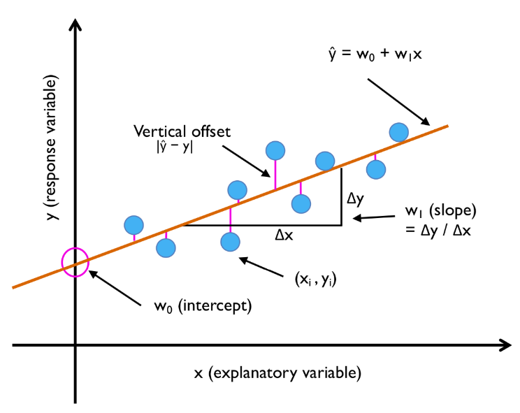
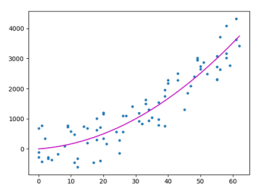

#  04 : 지도 학습 (Supervised Learning, SL) : 회귀 (regression)

---

	[1] 선형 회귀 (Linear Regression)
	[2] 다항 회귀 (Polynomial Regression)
	[3] 릿지 회귀 (Ridge Regression)
	[4] 라쏘 회귀 (Lasso Regression)
	[5] 엘라스틱넷 회귀 (Elastic Net Regression)
	  
---

지도 학습은 회귀(Regression)와 분류(Classification)로 구분하는데, 
그 차이는 회귀 모델은 예측값으로 연속적인 값을 출력하고, 분류 모델은 예측값으로 이산적인 값을 출력.  
예를 들어, 도미와 빙어의 길이와 무게 데이터를 통해 도미 여부를 식별하는 것은 분류,  
도미의 길이 데이터를 통해 도미의 무게를 예측하는 것은 회귀

 

# [1] 선형 회귀 (Linear Regression)
종속변수 y와 독립변수(설명변수) X와의 선형 상관 관계를 모델링하는 회귀 
독립변수(설명변수) X가 2개 이상인 회귀는 다중선형회귀 (Multiple  Linear Regression) 
 

출처 : https://savannahar68.medium.com/getting-started-with-regression-a39aca03b75f
 

 
출처 : https://blog.csdn.net/Amy_mm/article/details/79989722

 

# [2] 다항 회귀 (Polynomial Regression)
독립변수와 종속변수가 선형관계가 아닌 비선형 회귀(Non-linear Regression) 
직선이 아닌 곡선 형태의 관계의 경우, 독립변수에 제곱이나 로그(log) 등을 취해 보면서 적합한 비선형 모델을 찾아낸다 

 

	입력데이터의 Feature들이 너무 많은 경우(Feature수에 비해 관측치 수가 적은 경우) 과적합이 발생
	→ 
	(해결방안1) 데이터를 더 수집하거나 불필요한 Features들을 제거
	(해결방안2) 가중치(회귀계수)에 페널티 값을 적용하는 규제(Regularization)를 통해 
 	            Feature들에 곱해지는 가중치가 커지지 않도록 제한

 

# [3] 릿지 회귀 (Ridge Regression)
최소제곱추정치(OLS)가 편향되지 않더라도 분산이 커서 관측값이 실제값에서 크게 벗어나는 다중공선성(multicollinearity)이 발생할 경우, 회귀 분석 추정치에 치우침 정도를 추가하여 표준오차를 줄이기 위해 사용 
모델의 설명력에 기여하지 못하는 독립변수의 회귀계수 크기를 0에 근접하도록 축소시키는 회귀 
L2-norm 페널티항을 통해 일반 선형회귀 모델에 페널티를 부과하는 방법으로 회귀계수를 축소 
(L2 norm : 실제값과 예측값의 오차의 제곱의 합)

 

# [4] 라쏘 회귀 (Lasso Regression)
릿지회귀모델과 다르게 설명력에 기여하지 못하는 독립변수의 회귀계수를 0으로 만드는 회귀 
L1-norm 패널티항으로 회귀모델에 패널티를 부과함으로써 회귀계수를 축소 
(L1 norm : 실제값과 예측값의 오차의 절대값의 합)

 

# [5] 엘라스틱넷 회귀 (Elastic Net Regression)
릿지와 라쏘의 결합 
L1-norm 과 L2-norm을 모두 이용하여 패널티를 부과하여 회귀모델을 생성 

 

 
출처 : https://savannahar68.medium.com/getting-started-with-regression-a39aca03b75f

