#  04 : 비지도 학습 (Unsupervised Learning, UL) : 시각화

---

	[1] Matplotlib
	https://matplotlib.org/stable/api/_as_gen/matplotlib.pyplot.plot.html

	[2] Seaborn
	https://seaborn.pydata.org/tutorial.html

 	[3] Orange3
  	https://orangedatamining.com/docs/
   	https://orangedatamining.com/download/

---

# [1]~[2] Python : Matplotlib, Seaborn

	1. 선 그래프(Line Plot)
	2. 산점도(Scatter Plot)
	3. 막대 그래프(Bar Plot)
	4. 히스토그램(Histogram)
	5. 박스 플롯(Box Plot)
	6. 파이 차트(Pie Chart)
	7. 히트맵(Heatmap)
	8. 누적 막대 그래프(Stacked Bar Plot)
	9. 면적 그래프(Area Plot)
	10. 꺾은선 그래프(Step Plot)
	11. 버블 차트(Bubble Plot)
	12. 도넛 차트(Donut Chart)
	13. 바이올린 플롯(Violin Plot)
	14. 밀도 플롯(Kernel Density Estimate, KDE)
	15. 시계열 플롯(Time Series Plot)
	16. 3D 그래프(3D Plot)
   
---  

 

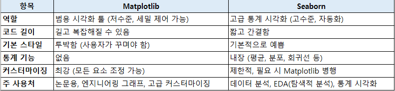
  
▣  Seaborn에서 직접 지원하지 않는 그래프 (Matplotlib 필요) 
파이 차트 (pie chart) 
3D 그래프 (3D surface, wireframe, contour 등) 
극좌표 플롯 (polar plot, radar chart 등) 
애니메이션 그래프 (FuncAnimation 같은 동적 시각화) 
아주 특수한 커스터마이즈 (세밀한 눈금 조정, 축 위치 변경, 복잡한 주석 등) 

 

▣  Matplotlib만으로도 가능하지만 Seaborn을 쓰는 이유 
예쁜 기본 스타일 
EDA(탐색적 데이터 분석) 효율(통계 기능 내장 → 코드 간결성, Pandas DataFrame 친화적 → 코드 가독성) 

 

▣  Seaborn이 강한 부분 
분포 확인: histplot, kdeplot, distplot 
범주형 비교: boxplot, violinplot, barplot, countplot 
상관관계: heatmap, pairplot, jointplot, scatterplot 
회귀 분석: lmplot, regplot 

 

▣ 소스코드(공통 준비) 

	import pandas as pd	
 	import matplotlib.pyplot as plt
	import seaborn as sns

	# GitHub의 CSV 파일을 불러오기
	titanic_df = pd.read_csv('https://raw.githubusercontent.com/YangGuiBee/ML/main/TextBook-04/titanic_train.csv')
 	# (CSV 불러오기 다른방법) GitHub의 CSV 파일을 나의 구글코랩에 불러와서 실행하는 경우는 다음과 같이 불러온후 소스작성
	# from google.colab import files
	# uploaded = files.upload()

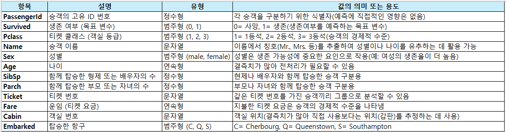

# 1. 선 그래프 (Line Plot)
머신러닝에서 선 그래프는 변수의 변화 추세를 가장 직관적으로 보여주는 방식. 대표적으로 학습 곡선, 검증 성능의 변화, 하이퍼파라미터 변화에 따른 성능 변화와 같은 연속적 흐름을 표현하는 용도로 사용. 여러 모델을 비교할 때도 동일 축에서 선을 겹쳐 그리면 성능 추세 비교가 쉬운 편임. 다만 선으로 연결되면 '연속성'이 암묵적으로 전제되므로, x축 값이 범주형인데 선으로 연결하면 해석 오류 가능성 존재. 
▣ 용도: 시간에 따른 데이터의 변화를 시각화. 연속적인 변화를 나타낼 때 유용 
▣ 특징: 각 데이터 포인트를 선으로 연결하여 시계열 데이터나 연속적인 값을 시각화 
▣ 예시(주로 사용되는 분야): 주식 시장, 기온 변화, 판매 추이 등 
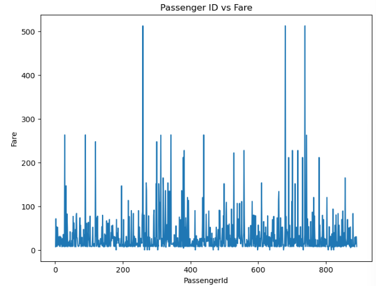

▣ 소스코드(Matplotlib) 

	plt.figure(figsize=(8, 6))
	plt.plot(titanic_df['PassengerId'], titanic_df['Fare'])
	plt.title('Passenger ID vs Fare')
	plt.xlabel('Passenger ID')
	plt.ylabel('Fare')
	plt.show()

▣ 소스코드(seaborn+Matplotlib) 

	plt.figure(figsize=(8, 6))
	sns.lineplot(x='PassengerId', y='Fare', data=titanic_df)
	plt.title('Passenger ID vs Fare')
	plt.show()

▣ 소스코드(seaborn) 

	sns.set(rc={'figure.figsize':(8, 6)}) 
	sns.lineplot(x='PassengerId', y='Fare', data=titanic_df).set(title='Passenger ID vs Fare')

 

# 2. 산점도 (Scatter Plot)
산점도는 두 변수 간 관계와 클러스터/분리 가능성을 파악하는 데 유용함. 표준화나 로그 변환 등의 데이터 전처리 전후의 분포 변화, 타깃과 특징의 관계, 예측값과 실제값 관계(회귀), 잔차 패턴 확인 등에 널리 사용함. 분류 문제에서는 클래스별 색상을 달리해 결정 경계가 분리 가능한지 감각적으로 보여주기 좋음. 고차원 데이터는 2D 산점도로 직접 표현이 어려우므로 PCA/t-SNE/UMAP 같은 차원축소 결과를 산점도로 시각화하여 사용함. 
▣ 용도: 두 변수 간의 관계를 시각화하여 상관관계, 클러스터 등을 탐지 
▣ 특징: 각 점이 하나의 데이터 포인트를 나타냄. 두 변수 간의 관계를 나타낼 때 사용 
▣ 예시(주로 사용되는 분야): 키와 몸무게의 관계, 시험 점수와 공부 시간 등 
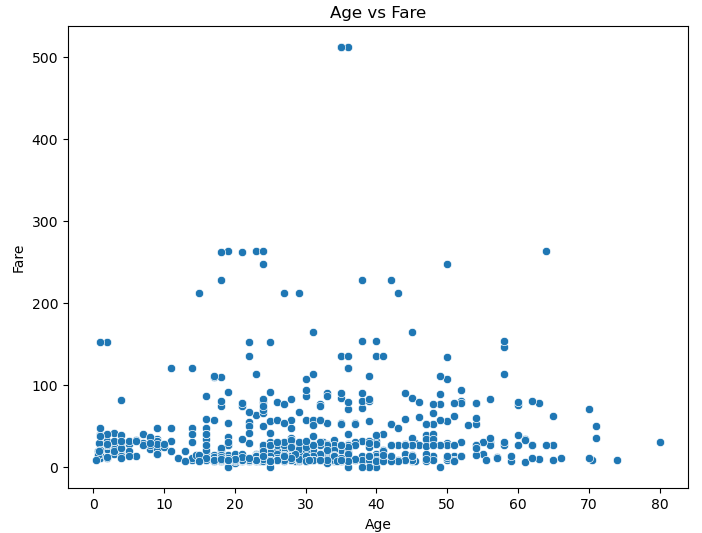

▣ 소스코드(Matplotlib) 

	plt.figure(figsize=(8, 6))
	plt.scatter(titanic_df['Age'], titanic_df['Fare'])
	plt.title('Age vs Fare')
	plt.xlabel('Age')
	plt.ylabel('Fare')
	plt.show()

▣ 소스코드(seaborn+Matplotlib) 

	plt.figure(figsize=(8, 6))
	sns.scatterplot(x='Age', y='Fare', data=titanic_df)
	plt.title('Age vs Fare')
	plt.show()

▣ 소스코드(seaborn) 

	sns.set(rc={'figure.figsize':(8, 6)})
	sns.scatterplot(x='Age', y='Fare', data=titanic_df).set(title='Age vs Fare')

 

# 3. 막대 그래프 (Bar Plot)
막대 그래프는 모델/방법 간 성능 비교를 명확히 전달하는 용도에 적합함. 예를 들어 모델별 F1, AUC, 정확도 비교, 전처리 방법별 성능 비교, 데이터셋별 성능 비교 같은 비교 프레임에 사용함. 교차검증을 수행했다면 평균 성능에 오차막대(표준편차, 신뢰구간)를 함께 표시하는 방식이 보고서 품질을 항상시킬 수 있음. 범주가 너무 많으면 가독성이 급격히 떨어지므로 상위 항목만 표시하거나 수평 막대 형태로 전환하는 방식이 적절함. 
▣ 용도: 범주형 데이터의 크기를 비교할 때 사용 
▣ 특징: 각 범주에 해당하는 값의 크기를 막대로 표현 
▣ 예시(주로 사용되는 분야): 제품 판매량, 국가별 인구, 분기별 매출 등 
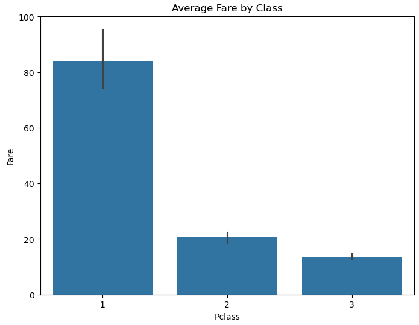

▣ 소스코드(Matplotlib) 

	titanic_df.groupby('Pclass')['Fare'].mean().plot(kind='bar')
	plt.title('Average Fare by Class')
	plt.xlabel('Class')
	plt.ylabel('Average Fare')
	plt.show()

▣ 소스코드(seaborn+Matplotlib) 

	plt.figure(figsize=(8, 6))
	sns.barplot(x='Pclass', y='Fare', data=titanic_df)
	plt.title('Average Fare by Class')
	plt.show()

▣ 소스코드(seaborn) 

	sns.set(rc={'figure.figsize':(8, 6)})
	sns.barplot(x='Pclass', y='Fare', data=titanic_df).set(title='Average Fare by Class')

 

# 4. 히스토그램 (Histogram)
히스토그램은 단일 변수의 분포를 확인하는 기본 도구임. 머신러닝에서는 입력 피처의 치우침, 이상치, 다봉분포 여부, 클래스별 분포 차이(클래스 조건부 분포) 확인에 활용함. 또한 예측 확률의 분포(분류)나 오차 분포(회귀) 확인에도 유용함. "히스토그램 = 데이터를 bin 단위로 묶어 빈도를 시각화한 것"으로 bin 설정에 따라 모양이 크게 달라지므로 bin 수를 바꿔가며 안정적으로 해석 가능한지 점검하는 습관이 필요함. 
▣ 용도: 데이터의 분포를 나타냄 
▣ 특징: 구간을 나눠 데이터가 해당 구간에 얼마나 분포했는지를 막대로 시각화 
▣ 예시(주로 사용되는 분야): 시험 점수 분포, 키 분포, 상품 가격 분포 등 
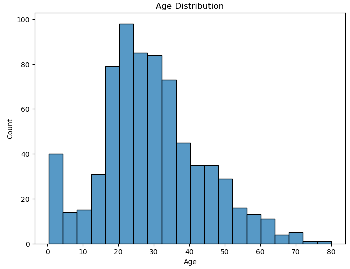

▣ 소스코드(Matplotlib) 

	plt.figure(figsize=(8, 6))
	plt.hist(titanic_df['Age'], bins=20)
	plt.title('Age Distribution')
	plt.xlabel('Age')
	plt.ylabel('Frequency')
	plt.show()

▣ 소스코드(seaborn+Matplotlib) 

	plt.figure(figsize=(8, 6))
	sns.histplot(titanic_df['Age'], bins=20)
	plt.title('Age Distribution')
	plt.show()

▣ 소스코드(seaborn) 

	sns.set(rc={'figure.figsize':(8, 6)})
	sns.histplot(titanic_df['Age'], bins=20).set(title='Age Distribution')

 

# 5. 박스 플롯 (Box Plot)
박스 플롯은 분포를 중앙값, 사분위, 이상치로 요약하는 시각화임. 머신러닝에서는 (1) 클래스별 피처 분포 비교, (2) 교차검증 fold별 성능 분포 비교, (3) 여러 실험 반복(run) 결과의 분산 비교 등에 효과적임. 특히 “평균 성능만 제시”하면 성능의 안정성이 감춰지므로, 박스 플롯으로 모델의 변동성을 보여주면 연구 설득력이 상승할 수 있음. 
▣ 용도: 데이터의 중앙값, 사분위 범위, 이상값 등을 시각화 
▣ 특징: 데이터 분포의 전반적인 모습을 요약하여 보여줌 
▣ 예시(주로 사용되는 분야): 시험 점수 분포, 주식 가격 변동 범위 등  
(1) 박스(Box): 데이터의 중간 50% 구간 (사분위 범위, IQR : InterQuartile Range) 
박스 아래쪽: 제1사분위(Q1, 25%) 
박스 위쪽: 제3사분위(Q3, 75%) 
박스 안 가로선: 중앙값(Median, 50%) 
(2) 수염(Whisker): 사분위 범위에서 ± 1.5 IQR 안에 들어오는 값 
이 범위 내의 최소값~최대값 표시 
(3) 동그라미(Outlier): 수염 밖에 있는 값 (극단치) 
 

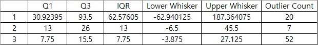

 

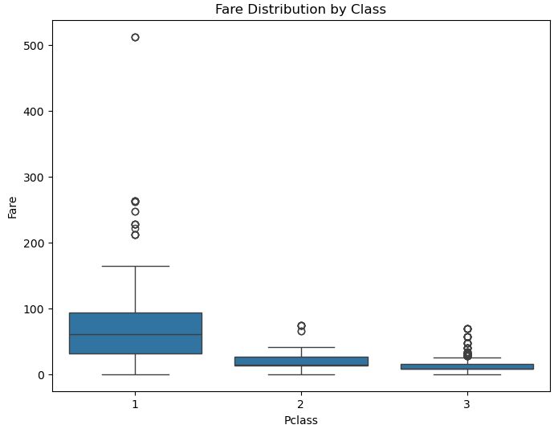

▣ 소스코드(Matplotlib) 

	plt.figure(figsize=(8, 6))
	plt.boxplot([titanic_df[titanic_df['Pclass'] == i]['Fare'] for i in range(1, 4)])
	plt.title('Fare Distribution by Class')
	plt.xlabel('Class')
	plt.ylabel('Fare')
	plt.xticks([1, 2, 3], ['1st Class', '2nd Class', '3rd Class'])
	plt.show()

▣ 소스코드(seaborn+Matplotlib) 

	plt.figure(figsize=(8, 6))
	sns.boxplot(x='Pclass', y='Fare', data=titanic_df)
	plt.title('Fare Distribution by Class')
	plt.show()

▣ 소스코드(seaborn) 

	sns.set(rc={'figure.figsize':(8, 6)})
	sns.boxplot(x='Pclass', y='Fare', data=titanic_df).set(title='Fare Distribution by Class')
 
 

# 6. 파이 차트 (Pie Chart)
파이 차트는 비율을 보여주는 도구로 항목의 개수가 적은 단순 비율에서 유용함. 클래스 비율(불균형)이나 데이터 구성비를 보여줄 때 사용 가능하나 항목이 많아지면 비교가 어려움. 대부분의 경우 막대 그래프(Countplot)나 누적 막대가 더 명확한 대안임. 
▣ 용도: 범주형 데이터의 비율을 시각화 
▣ 특징: 원을 여러 조각으로 나누어 각 범주의 비율을 시각화 
▣ 예시(주로 사용되는 분야): 시장 점유율, 설문조사 결과 비율 등 
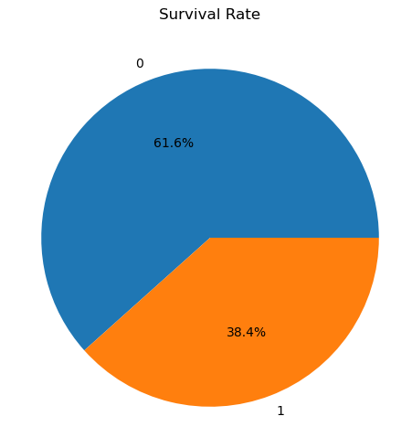

▣ 소스코드(Matplotlib) 

	plt.figure(figsize=(6, 6))
	titanic_df['Survived'].value_counts().plot(kind='pie', autopct='%1.1f%%')
	plt.title('Survival Rate')
	plt.ylabel('')
	plt.show()

▣ 소스코드(seaborn) 

	# Seaborn은 파이 차트를 직접 제공하지 않으므로 Matplotlib 사용

 

# 7. 히트맵 (Heatmap)
히트맵은 행렬 형태의 값을 색으로 표현하는 방식임. 머신러닝에서는 (1) 상관행렬, (2) 혼동행렬, (3) 그리드서치 결과(하이퍼파라미터 조합별 성능), (4) 어텐션 맵/특성 중요도 행렬 등에 핵심적으로 활용됨. 색상 스케일 선택이 해석에 큰 영향을 주므로, 0 중심(발산형 colormap)인지, 최소~최대(연속형)인지 목적에 맞춘 스케일 설계가 중요. 
▣ 용도: 매트릭스 형태의 데이터를 색상으로 표현 
▣ 특징: 값의 크기를 색상으로 시각화 
▣ 예시(주로 사용되는 분야): 상관 행렬, 웹사이트 클릭 패턴, 신경망 가중치 시각화 등 
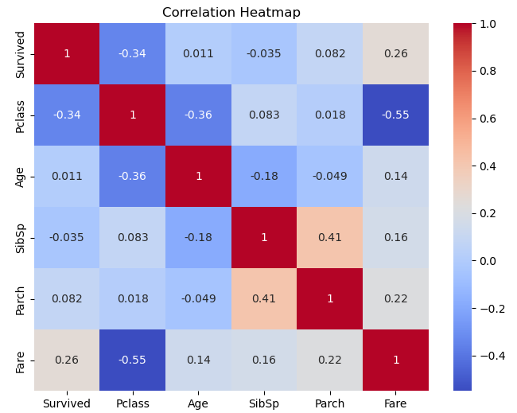

▣ 소스코드(Matplotlib) 

	# Matplotlib에서는 Seaborn이 제공하는 히트맵을 사용

▣ 소스코드(seaborn+Matplotlib) 

	# 상관 관계에 사용할 숫자형 열을 명시적으로 선택 (예: 생존 여부, 클래스, 나이, 형제/배우자 수, 부모/자녀 수, 요금)
	numeric_cols = titanic_df[['Survived', 'Pclass', 'Age', 'SibSp', 'Parch', 'Fare']]

	# 결측값 처리 (Age 등의 열에 결측값이 있으므로 이를 0으로 채움)
	numeric_cols = numeric_cols.fillna(0)

	# 상관 관계 계산
	corr = numeric_cols.corr()

	# 상관 관계 히트맵 그리기
	plt.figure(figsize=(8, 6))
	sns.heatmap(corr, annot=True, cmap='coolwarm')
	plt.title('Correlation Heatmap')
	plt.show()

 ▣ 소스코드(seaborn) 

 	# Numeric columns 선택 및 결측치 처리
	numeric_cols = titanic_df[['Survived', 'Pclass', 'Age', 'SibSp', 'Parch', 'Fare']].fillna(0)

	# 상관 행렬 계산
	corr = numeric_cols.corr()

	# Seaborn 스타일 및 크기 설정
	sns.set(rc={'figure.figsize':(8, 6)})

	# 히트맵 생성
	sns.heatmap(corr, annot=True, cmap='coolwarm').set(title='Correlation Heatmap')
 
 

# 8. 누적 막대 그래프 (Stacked Bar Plot)
누적 막대는 '전체 대비 구성비'와 '절대량'을 동시에 보여줄 수 있음. 머신러닝에서는 (1) 클래스별 오류 구성(예: FP/FN 비중), (2) 데이터셋별 클래스 분포 비교, (3) 파이프라인 단계별 시간/비용 분해(전처리/학습/추론 시간) 등을 표현하는 데 적합함. 다만 누적 구조에서는 중간 구성요소 비교가 어렵기 때문에, 목적이 구성비라면 100% 누적 막대가 더 명확한 경우가 많음.
 
▣ 용도: 여러 범주에 대한 값을 하나의 막대 안에서 누적으로 표시 
▣ 특징: 각 막대가 여러 값을 포함하여 누적 합계를 보여줌 
▣ 예시(주로 사용되는 분야): 여러 제품의 누적 판매량, 다양한 소득 그룹의 누적 비율 등 
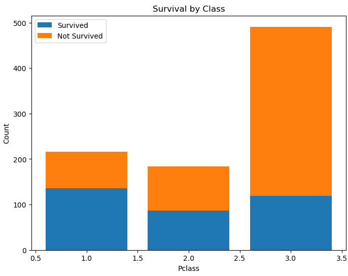

▣ 소스코드(Matplotlib) 

	survived = titanic_df[titanic_df['Survived'] == 1]['Pclass'].value_counts().sort_index()
	not_survived = titanic_df[titanic_df['Survived'] == 0]['Pclass'].value_counts().sort_index()
	plt.figure(figsize=(8, 6))
	plt.bar(survived.index, survived, label='Survived')
	plt.bar(not_survived.index, not_survived, bottom=survived, label='Not Survived')
	plt.title('Survival by Class')
	plt.xlabel('Pclass')
	plt.ylabel('Count')
	plt.legend()
	plt.show()

▣ 소스코드(seaborn) 

	# Seaborn에서는 누적 막대 그래프를 기본적으로 지원하지 않음. Matplotlib 사용.

 

# 9. 면적 그래프 (Area Plot)
면적 그래프는 선 그래프에 면적을 채운 형태로, 누적 추세나 비중 변화를 강조하는 데 유리함. 머신러닝에서는 (1) 시간에 따른 클래스 비율 변화(스트리밍 데이터), (2) 시간에 따른 오류 유형 비중 변화, (3) 여러 지표의 누적 기여도 변화 등을 표현할 수 있음. 하지만 면적은 시각적 과장이 생길 수 있어, 비교 정확성이 중요한 실험 결과에는 선/막대가 더 적절한 경우도 많음. 
▣ 용도: 선 그래프와 유사하지만, 선 아래 영역을 색으로 채움 
▣ 특징: 누적된 값을 시각적으로 강조하는 데 사용 
▣ 예시(주로 사용되는 분야): 누적 판매량, 에너지 소비 등 
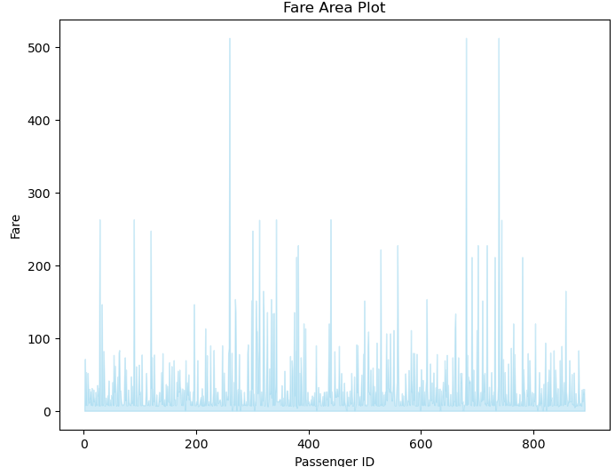

▣ 소스코드(Matplotlib) 

	plt.figure(figsize=(8, 6))
	plt.fill_between(titanic_df['PassengerId'], titanic_df['Fare'], color="skyblue", alpha=0.4)
	plt.title('Fare Area Plot')
	plt.xlabel('Passenger ID')
	plt.ylabel('Fare')
	plt.show()

▣ 소스코드(seaborn) 

	# Seaborn에서는 면적 그래프를 지원하지 않음. Matplotlib 사용.

 

# 10. 꺾은선 그래프 (Step Plot)
스텝 플롯은 값이 구간별로 일정하다가 순간적으로 변하는 형태를 보여줌. 머신러닝에서는 (1) 의사결정나무의 분할에 따른 예측 함수 형태, (2) 학습률 스케줄(스텝 디케이), (3) 임계값을 바꿀 때의 지표 변화처럼 불연속 변화가 자연스러운 상황에서 의미가 큼. 연속 변화를 스텝으로 그리면 정보가 손실될 수 있어 사용 맥락이 중요함. 
▣ 용도: 계단식 변화가 있는 데이터를 시각화 
▣ 특징: 데이터가 단계적으로 변할 때 사용. 일반적인 선 그래프와는 달리 직선이 아닌 단계별 변화 
▣ 예시(주로 사용되는 분야): 단계를 두고 변하는 데이터, 예를 들어 온도 조절 시스템의 변화 등 
 
**Y축은 특정 운임값(Fare)에 대한 누적된 승객 수로 최종적으로 891명(전체 승객 수)까지의 누적분포를 보여줌** 
 
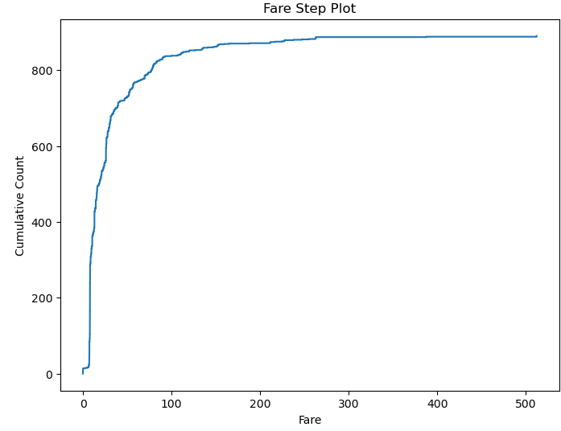

▣ 소스코드(Matplotlib) 

	plt.figure(figsize=(8, 6))
	plt.step(titanic_df['Fare'].sort_values(), range(len(titanic_df)), where='mid')
	plt.title('Fare Step Plot')
	plt.xlabel('Fare')
	plt.ylabel('Cumulative Count')
	plt.show()

▣ 소스코드(seaborn) 

	# Seaborn에서는 꺾은선 그래프를 직접 지원하지 않으므로 Matplotlib 사용

 

# 11. 버블 차트 (Bubble Plot)
버블 차트는 산점도에 '크기'를 추가해 3개 변수를 동시에 표현하는 방식임. 머신러닝에서는 (1) 모델 비교에서 x축=성능, y축=추론시간, 버블크기=모델 파라미터 수 또는 메모리 사용량, (2) 데이터 포인트 중요도(가중치) 표현 같은 응용이 가능함. 크기는 사람 눈에 비선형적으로 인식되므로, 범례와 스케일 설명이 없으면 오해 가능성 존재. 
▣ 용도: 산점도에 추가적인 변수를 시각화할 때 사용. 점의 크기가 추가 변수의 값을 나타냄 
▣ 특징: 각 점의 크기로 세 번째 변수를 나타내어 데이터를 시각화 
▣ 예시(주로 사용되는 분야): 도시의 위치(좌표)와 인구 크기를 나타낼 때 사용, 데이터 군집을 분석할 때 유용 
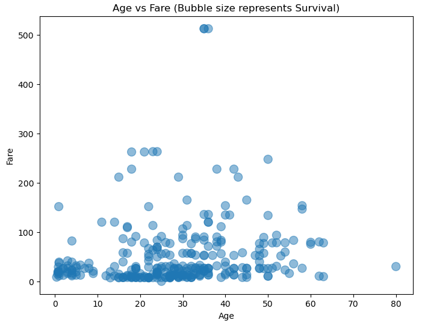

▣ 소스코드(Matplotlib) 

	plt.figure(figsize=(8, 6))
	plt.scatter(titanic_df['Age'], titanic_df['Fare'], s=titanic_df['Survived'] * 100, alpha=0.5)
	plt.title('Age vs Fare (Bubble size represents Survival)')
	plt.xlabel('Age')
	plt.ylabel('Fare')
	plt.show()

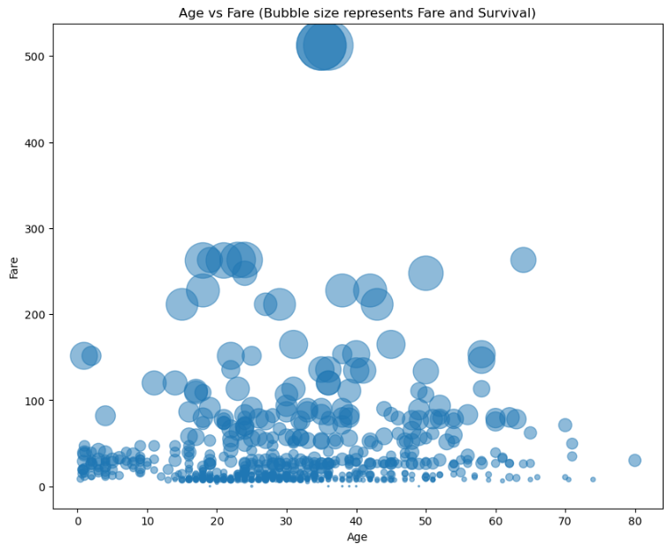

	plt.figure(figsize=(10, 8))

	# Fare 값을 기본으로 하되, 생존한 승객(Survived=1)의 경우 크기를 더 크게 함
	bubble_size = (titanic_df['Fare'] + 1) * (titanic_df['Survived'] + 1) * 2  # 스케일링을 2배로 축소

	plt.scatter(titanic_df['Age'], titanic_df['Fare'], s=bubble_size, alpha=0.5) # 크기를 Fare와 Survived로 설정
	plt.title('Age vs Fare (Bubble size represents Fare and Survival)')
	plt.xlabel('Age')
	plt.ylabel('Fare')
	plt.show()

▣ 소스코드(seaborn) 

	# Seaborn에서는 버블 차트를 직접 지원하지 않으므로 Matplotlib 사용

 

# 12. 도넛 차트 (Donut Chart)
도넛 차트는 파이 차트의 변형으로, 중앙에 텍스트(전체 수, 핵심 지표)를 넣기 쉬움. 머신러닝에서는 '데이터 구성비'나 '라벨 분포' 같은 단순 요약에 제한적으로 사용 가능함. 다만 해석성은 막대보다 떨어지는 편이므로 보고서에서는 정보 전달 목적이 분명할 때만 사용 권장. 
▣ 용도: 파이 차트의 변형으로, 중앙이 비어 있어 시각적으로 차이를 제공 
▣ 특징: 파이 차트와 유사하지만, 중앙에 공백이 추가되어 비율을 강조하거나 다른 정보를 삽입하는 데 사용됨 
▣ 예시(주로 사용되는 분야): 시장 점유율, 각 부서별 비율 등을 파이 차트보다 시각적으로 깔끔하게 보여줌 
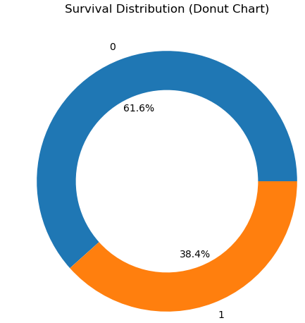

▣ 소스코드(Matplotlib) 

	plt.figure(figsize=(6, 6))
	titanic_df['Survived'].value_counts().plot(kind='pie', autopct='%1.1f%%', wedgeprops={'width': 0.3})
	plt.title('Survival Distribution (Donut Chart)')
	plt.ylabel('')
	plt.show()

▣ 소스코드(seaborn) 

	# Seaborn에서는 도넛 차트를 직접 지원하지 않으므로 Matplotlib 사용

 

# 13. 바이올린 플롯 (Violin Plot)
바이올린 플롯은 박스 플롯에 분포의 밀도 형태를 결합한 시각화임. 머신러닝에서 특히 유용한 경우는 (1) 클래스별 특징값 분포의 미묘한 차이를 보여줄 때, (2) 모델별 교차검증 성능 분포의 형태(비대칭, 다봉)를 드러낼 때임. 표본 수가 적으면 밀도 추정이 불안정해 모양이 왜곡될 수 있어, 표본 규모와 함께 제시하는 것이 바람직. 
▣ 용도: 데이터의 분포와 밀도를 시각화하며, 박스 플롯보다 데이터의 분포를 더 자세하게 보여줌 
▣ 특징: 데이터의 밀도를 나타내는 커널 밀도 추정과 박스 플롯을 결합한 그래프 
▣ 예시(주로 사용되는 분야): 그룹별 데이터의 분포 차이를 비교할 때, 예를 들어 학생의 성적 분포 등을 비교할 때 사용 
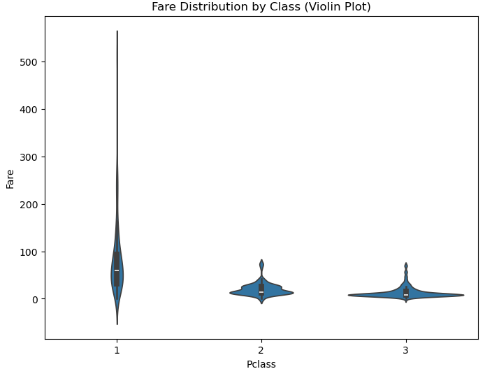

▣ 소스코드(Matplotlib) 

	# Matplotlib에서는 직접 바이올린 플롯을 지원하지 않으므로 Seaborn 사용

▣ 소스코드(seaborn+Matplotlib) 

	plt.figure(figsize=(8, 6))
	sns.violinplot(x='Pclass', y='Fare', data=titanic_df)
	plt.title('Fare Distribution by Class (Violin Plot)')
	plt.xlabel('Pclass')
	plt.ylabel('Fare')
	plt.show()

▣ 소스코드(seaborn) 

	sns.set(rc={'figure.figsize':(8, 6)})

	sns.violinplot(x='Pclass', y='Fare', data=titanic_df).set(
    	title='Fare Distribution by Class (Violin Plot)', xlabel='Pclass', ylabel='Fare')

 

# 14. 밀도 플롯 (Kernel Density Estimate, KDE)
KDE는 분포를 부드럽게 추정해 표현하는 방식임. 머신러닝에서는 (1) 전처리 전후 분포 변화, (2) 클래스별 분포 겹침 정도, (3) 예측확률 분포와 교정(Calibration）문제 징후 확인에 유용함. 대역폭(bandwidth) 선택에 따라 과도하게 매끈해지거나 들쭉날쭉해질 수 있으므로, 히스토그램과 함께 제시하면 해석 안정성이 높아지는 편임. 
▣ 용도: 데이터의 확률 밀도를 시각화하는 데 사용됨 
▣ 특징: 히스토그램과 유사하지만, 데이터를 부드럽게 연결하여 연속적인 분포를 보여줌 
▣ 예시(주로 사용되는 분야): 다양한 데이터의 분포를 시각화할 때, 예를 들어 고객들의 연령대별 분포를 나타낼 때 사용 
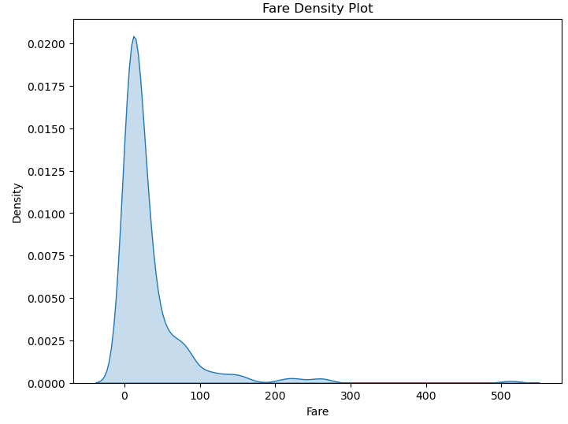

▣ 소스코드(Matplotlib) 

	# Matplotlib에서 KDE는 지원하지 않으므로 Seaborn 사용

▣ 소스코드(seaborn+Matplotlib) 

	plt.figure(figsize=(8, 6))
	sns.kdeplot(titanic_df['Fare'], fill=True)
	plt.title('Fare Density Plot')
	plt.xlabel('Fare')
	plt.show()

▣ 소스코드(seaborn) 

	sns.set(rc={'figure.figsize':(8, 6)})

	sns.kdeplot(titanic_df['Fare'], fill=True).set(
    	title='Fare Density Plot', xlabel='Fare')

 

# 15. 시계열 플롯 (Time Series Plot)
시계열 플롯은 시간 축을 중심으로 한 추세/계절성/이상치 탐지에 사용함. 머신러닝에서는 시계열 예측 모델의 결과 비교(실제 vs 예측), 잔차의 시간적 구조, 데이터 드리프트의 징후(시간에 따른 입력분포 변화)를 보여주는 데 매우 중요함. 시계열은 훈련/검증 분할이 시간 순서를 따라야 하므로, 시각화에서 분할 경계를 표시하면 실험 설계의 타당성을 전달하기 쉬움. 
▣ 용도: 시간에 따른 데이터의 변화를 시각화 
▣ 특징: x축은 시간, y축은 시간에 따라 변화하는 값을 시각화 
▣ 예시(주로 사용되는 분야): 주식 시장의 변동, 기후 변화, 판매량 변화 등 
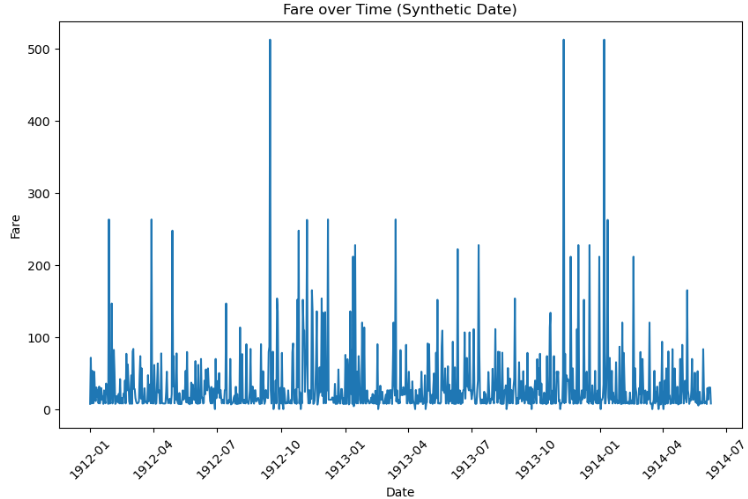

▣ 소스코드(Matplotlib) 

	# 가상의 날짜 열 추가 (예: '1912-01-01'부터 시작하여 승객 ID 순서대로 하루씩 증가)
	titanic_df['Date'] = pd.date_range(start='1912-01-01', periods=len(titanic_df), freq='D')

	plt.figure(figsize=(10, 6))
	plt.plot(titanic_df['Date'], titanic_df['Fare'])
	plt.title('Fare over Time (Synthetic Date)')
	plt.xlabel('Date')
	plt.ylabel('Fare')
	plt.xticks(rotation=45)  # x축 라벨 회전
	plt.show()

 

▣ 소스코드(seaborn+Matplotlib) 

	plt.figure(figsize=(10, 6))
	sns.lineplot(x='Date', y='Fare', data=titanic_df)
	plt.title('Fare over Time (Synthetic Date)')
	plt.xlabel('Date')
	plt.ylabel('Fare')
	plt.xticks(rotation=45)  # x축 라벨 회전
	plt.show()

▣ 소스코드(seaborn) 

	sns.set(rc={'figure.figsize':(10, 6)})
	plot = sns.lineplot(x='Date', y='Fare', data=titanic_df)
	plot.set(title='Fare over Time (Synthetic Date)', xlabel='Date', ylabel='Fare')
	plot.set_xticklabels(plot.get_xticklabels(), rotation=45)

 

# 16. 3D 그래프 (3D Plot)
3D 플롯은 세 변수를 공간에 올려 표현하지만, 보고서에서는 가독성과 재현성 문제로 제한적으로 권장되는 편임. 머신러닝에서 3D가 유용한 경우는 (1) 하이퍼파라미터 2개에 대한 성능 표면(서피스), (2) 저차원(3D) 임베딩 시각화 같은 상황임. 다만 정적인 논문/보고서에서는 회전이 불가능하므로, 3D 대신 2D 등고선(contour) + 히트맵이 더 명료한 경우가 많음. 
▣ 용도: 3차원 데이터를 시각화 
▣ 특징: 3차원 공간에서 데이터를 시각화할 수 있으며, 점, 선 또는 표면으로 나타낼 수 있음 
▣ 예시(주로 사용되는 분야): 지리적 데이터의 시각화, 과학적 데이터 분석 등 
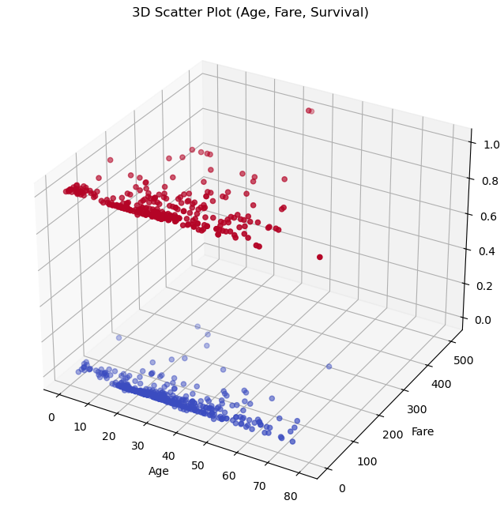

▣ 소스코드(Matplotlib) 

	from mpl_toolkits.mplot3d import Axes3D
	fig = plt.figure(figsize=(10, 8))
	ax = fig.add_subplot(111, projection='3d')
	ax.scatter(titanic_df['Age'], titanic_df['Fare'], titanic_df['Survived'], c=titanic_df['Survived'], 
 		cmap='coolwarm')
	ax.set_xlabel('Age')
	ax.set_ylabel('Fare')
	ax.set_zlabel('Survived')
	plt.title('3D Scatter Plot (Age, Fare, Survival)')
	plt.show()

▣ 소스코드(seaborn) 

	# Seaborn에서는 3D 그래프를 지원하지 않으므로 Matplotlib 사용

 

---

	17. 혼동행렬 (Confusion Matrix Heatmap)
	18. ROC 곡선 / PR 곡선 (ROC Curve / Precision–Recall Curve)
	19. 캘리브레이션 플롯 (Calibration Curve / Reliability Diagram)
	20. 잔차 플롯 / Q-Q 플롯 (Residual Plot / Q-Q Plot)
	21. 학습 곡선 / 검증 곡선 (Learning Curve / Validation Curve)
	22. 특성 중요도 플롯 (Feature Importance)
	23. SHAP 요약 플롯 / 의존 플롯 (SHAP Summary / Dependence Plot)
	24. 부분의존도(PDP) / ICE 플롯 (Partial Dependence / Individual Conditional Expectation)
	25. 차원축소 임베딩 산점도 (PCA / t-SNE / UMAP Scatter)
	26. 결정경계 시각화 (Decision Boundary Plot)

---

▣ 공통 소스코드

	# =============================================================================
	# 필요한 라이브러리 임포트
	# =============================================================================
	
	import numpy as np          # 수치 연산 라이브러리 (배열, 행렬 연산 등)
	import pandas as pd         # 데이터프레임 기반 데이터 처리 라이브러리
	import matplotlib.pyplot as plt  # 기본 시각화 라이브러리
	import seaborn as sns       # matplotlib 기반 고수준 통계 시각화 라이브러리
	
	# sklearn.model_selection: 데이터 분할 및 교차 검증 관련 유틸리티
	from sklearn.model_selection import train_test_split, StratifiedKFold
	#   - train_test_split : 데이터를 학습/테스트 세트로 분리
	#   - StratifiedKFold  : 클래스 비율을 유지하며 K-Fold 교차 검증 수행
	
	# sklearn.compose: 여러 전처리 변환기를 컬럼 단위로 조합
	from sklearn.compose import ColumnTransformer
	#   - ColumnTransformer: 수치형/범주형 등 컬럼별로 다른 전처리를 병렬 적용
	
	# sklearn.pipeline: 전처리 + 모델을 하나의 흐름으로 연결
	from sklearn.pipeline import Pipeline
	#   - Pipeline: 여러 변환 단계를 순서대로 묶어 일관된 fit/predict 인터페이스 제공
	
	# sklearn.preprocessing: 데이터 인코딩 및 정규화
	from sklearn.preprocessing import OneHotEncoder, StandardScaler
	#   - OneHotEncoder  : 범주형 변수를 0/1 이진 벡터로 변환
	#   - StandardScaler : 수치형 변수를 평균 0, 표준편차 1로 표준화
	
	# sklearn.impute: 결측값 처리
	from sklearn.impute import SimpleImputer
	#   - SimpleImputer: 결측값을 특정 통계값(평균/중앙값/최빈값 등)으로 대체
	
	# sklearn.linear_model: 선형 기반 분류 모델
	from sklearn.linear_model import LogisticRegression
	#   - LogisticRegression: 이진/다중 분류를 위한 로지스틱 회귀 모델
	
	# sklearn.ensemble: 앙상블 기반 모델 (분류 + 회귀)
	from sklearn.ensemble import RandomForestClassifier
	#   - RandomForestClassifier: 다수의 결정 트리를 앙상블한 랜덤 포레스트 분류기
	
	# sklearn.metrics: 모델 평가 지표 모음
	from sklearn.metrics import (
	    confusion_matrix,           # 실제 vs 예측 클래스의 혼동 행렬
	    roc_curve,                  # ROC 곡선용 FPR/TPR 계산
	    auc,                        # ROC 곡선의 면적(AUC) 계산
	    precision_recall_curve,     # Precision-Recall 곡선 계산
	    average_precision_score     # PR 곡선의 평균 정밀도(AP) 계산
	)
	
	# sklearn.calibration: 확률 보정 관련 도구
	from sklearn.calibration import calibration_curve, CalibratedClassifierCV
	#   - calibration_curve      : 예측 확률과 실제 빈도를 비교하는 보정 곡선
	#   - CalibratedClassifierCV : 교차 검증 기반으로 모델의 예측 확률을 보정
	
	# sklearn.model_selection (추가): 학습 곡선 및 검증 곡선
	from sklearn.model_selection import learning_curve, validation_curve
	#   - learning_curve   : 학습 데이터 크기에 따른 성능 변화 시각화용
	#   - validation_curve : 특정 하이퍼파라미터 범위에 따른 성능 변화 시각화용
	
	# sklearn.inspection: 모델 해석 도구
	from sklearn.inspection import permutation_importance, PartialDependenceDisplay
	#   - permutation_importance    : 각 특성을 무작위로 섞었을 때 성능 하락 정도로 중요도 측정
	#   - PartialDependenceDisplay  : 특정 특성이 예측에 미치는 평균적인 영향(PDP) 시각화
	
	# sklearn.decomposition / sklearn.manifold: 차원 축소 도구
	from sklearn.decomposition import PCA   # 주성분 분석 - 선형 차원 축소
	from sklearn.manifold import TSNE       # t-SNE - 비선형 차원 축소 (고차원 데이터 시각화)
	
	# 회귀 잔차 및 Q-Q 플롯용 (분류 문제의 보조 분석에 활용)
	from sklearn.ensemble import RandomForestRegressor  # 랜덤 포레스트 회귀 모델
	from sklearn.metrics import mean_squared_error      # 회귀 평가 지표: 평균 제곱 오차(MSE)
	from scipy import stats  # 과학 계산 라이브러리: 통계 검정, Q-Q 플롯 등에 사용
	
	# =============================================================================
	# 1) 데이터 로드
	# =============================================================================
	
	# GitHub에 공개된 타이타닉 학습 데이터 CSV 파일의 URL
	url = "https://raw.githubusercontent.com/YangGuiBee/ML/main/TextBook-04/titanic_train.csv"
	
	# URL에서 CSV를 직접 읽어 pandas DataFrame으로 저장
	df = pd.read_csv(url)
	
	# =============================================================================
	# 2) 분류(생존 Survived)용 데이터 구성
	# =============================================================================
	
	# 예측 대상(레이블) 컬럼명 지정: 생존 여부 (0 = 사망, 1 = 생존)
	target = "Survived"
	
	# 모델 학습에 사용할 입력 특성(feature) 컬럼 목록
	features = ["Pclass", "Sex", "Age", "SibSp", "Parch", "Fare", "Embarked"]
	#   - Pclass   : 객실 등급 (1/2/3등석)
	#   - Sex      : 성별 (male/female)
	#   - Age      : 나이
	#   - SibSp    : 함께 탑승한 형제/배우자 수
	#   - Parch    : 함께 탑승한 부모/자녀 수
	#   - Fare     : 운임 요금
	#   - Embarked : 탑승 항구 (C/Q/S)
	
	# 입력 특성 행렬 X와 레이블 벡터 y 생성
	X = df[features]               # 선택한 특성 컬럼만 추출
	y = df[target].astype(int)     # 생존 여부를 정수형(0/1)으로 변환
	
	# 학습/테스트 데이터 분리
	X_train, X_test, y_train, y_test = train_test_split(
	    X, y,
	    test_size=0.25,     # 전체 데이터의 25%를 테스트 세트로 할당
	    random_state=42,    # 재현 가능한 결과를 위한 난수 시드 고정
	    stratify=y          # 클래스 비율(생존/사망)을 학습/테스트 세트에서 동일하게 유지
	)
	
	# 수치형 특성 컬럼 목록 (중앙값 대체 + 표준화 전처리 적용 대상)
	num_features = ["Pclass", "Age", "SibSp", "Parch", "Fare"]
	
	# 범주형 특성 컬럼 목록 (최빈값 대체 + 원-핫 인코딩 전처리 적용 대상)
	cat_features = ["Sex", "Embarked"]
	
	# --- 수치형 특성 전처리 파이프라인 ---
	num_pipe = Pipeline([
	    ("imputer", SimpleImputer(strategy="median")),  # 결측값을 중앙값으로 대체 (이상치에 강건)
	    ("scaler",  StandardScaler())                   # 평균 0, 표준편차 1로 표준화
	])
	
	# --- 범주형 특성 전처리 파이프라인 ---
	cat_pipe = Pipeline([
	    ("imputer", SimpleImputer(strategy="most_frequent")),  # 결측값을 최빈값으로 대체
	    ("oh",      OneHotEncoder(handle_unknown="ignore"))    # 원-핫 인코딩 (학습 시 미등장 범주는 무시)
	])
	
	# --- 수치형 + 범주형 파이프라인을 컬럼별로 결합 ---
	preprocess = ColumnTransformer([
	    ("num", num_pipe, num_features),  # num_features 컬럼에 수치형 파이프라인 적용
	    ("cat", cat_pipe, cat_features)   # cat_features 컬럼에 범주형 파이프라인 적용
	])
	
	# =============================================================================
	# 모델 정의: 로지스틱 회귀 & 랜덤 포레스트
	#   - 로지스틱 회귀  : 예측 확률이 잘 보정되어 캘리브레이션 분석에 적합
	#   - 랜덤 포레스트  : 특성 중요도 및 SHAP 분석에 적합
	# =============================================================================
	
	# 로지스틱 회귀 파이프라인: 전처리 → 로지스틱 회귀 모델
	clf_lr = Pipeline([
	    ("prep",  preprocess),                          # 위에서 정의한 전처리 변환기
	    ("model", LogisticRegression(max_iter=2000))    # 최대 반복 횟수 2000회 (수렴 보장)
	])
	
	# 랜덤 포레스트 파이프라인: 전처리 → 랜덤 포레스트 분류기
	clf_rf = Pipeline([
	    ("prep",  preprocess),                                              # 동일한 전처리 변환기
	    ("model", RandomForestClassifier(n_estimators=300, random_state=42))
	    #   - n_estimators=300 : 300개의 결정 트리를 앙상블
	    #   - random_state=42  : 재현 가능한 결과를 위한 난수 시드 고정
	])
	
	# --- 모델 학습 ---
	clf_lr.fit(X_train, y_train)  # 로지스틱 회귀: 학습 데이터로 전처리 + 모델 파라미터 학습
	clf_rf.fit(X_train, y_train)  # 랜덤 포레스트: 학습 데이터로 전처리 + 300개 트리 학습
	
	# --- 예측 ---
	y_pred_lr  = clf_lr.predict(X_test)         # 로지스틱 회귀: 테스트 세트에 대한 클래스 예측 (0 또는 1)
	y_proba_lr = clf_lr.predict_proba(X_test)[:, 1]
	# predict_proba: 각 샘플의 클래스별 확률 반환 → [:, 1]로 생존(1) 클래스의 확률만 추출
	
	y_pred_rf  = clf_rf.predict(X_test)         # 랜덤 포레스트: 테스트 세트에 대한 클래스 예측
	y_proba_rf = clf_rf.predict_proba(X_test)[:, 1]
	# 랜덤 포레스트도 동일하게 생존 클래스의 예측 확률만 추출
	
	# =============================================================================
	# 3) 원-핫 인코딩 이후 최종 특성명 추출
	# =============================================================================
	
	def get_feature_names(pipeline: Pipeline):
	    """
	    Pipeline 객체에서 전처리 후 최종 특성명 리스트를 반환하는 함수.
	
	    Parameters
	    ----------
	    pipeline : sklearn.pipeline.Pipeline
	        'prep' 단계에 ColumnTransformer가 포함된 파이프라인
	
	    Returns
	    -------
	    list of str
	        수치형 특성명 + 원-핫 인코딩된 범주형 특성명의 결합 리스트
	        예: ['Pclass', 'Age', ..., 'Sex_female', 'Sex_male', 'Embarked_C', ...]
	    """
	
	    # 파이프라인에서 'prep' 이름으로 등록된 ColumnTransformer 추출
	    prep = pipeline.named_steps["prep"]
	
	    # ColumnTransformer 내 'cat' 변환기(cat_pipe) → 그 안의 'oh'(OneHotEncoder) 추출
	    oh = prep.named_transformers_["cat"].named_steps["oh"]
	
	    # OneHotEncoder가 학습 후 생성한 범주형 특성명 목록 추출
	    # get_feature_names_out()은 'Sex_female', 'Sex_male', 'Embarked_C' 등의 형태로 반환
	    cat_names = list(oh.get_feature_names_out(cat_features))
	
	    # 수치형 특성명(그대로 유지) + 원-핫 인코딩된 범주형 특성명을 합쳐서 반환
	    return num_features + cat_names
	
	# 랜덤 포레스트 파이프라인 기준으로 최종 특성명 리스트 생성
	# (로지스틱 회귀와 랜덤 포레스트는 동일한 전처리를 사용하므로 특성명이 동일)
	

# 17. 혼동행렬 (Confusion Matrix Heatmap)
모델이 '생존(1)'이라고 예측했는데 실제로 '사망(0)'했는지, 혹은 그 반대인지를 표 형태로 나타낸 것입니다. 숫자로만 보면 헷갈리니 히트맵(Heatmap)을 입혀 어디서 실수가 잦은지 한눈에 파악 
▣ 용도: 분류 모델의 성능(TP, FP, FN, TN)을 구체적으로 파악할 때 사용 
▣ 특징: 정답과 오답의 종류를 구분해 주므로 Accuracy(정확도)가 높은데도 특정 클래스만 못 맞히는 문제를 잡아낼 수 있음 
▣ 예시: 암 진단(오진율 확인), 스팸 메일 분류 등 

▣ 소스코드 (Seaborn):

	Python
	import pandas as pd
	import seaborn as sns
	import matplotlib.pyplot as plt
	from sklearn.model_selection import train_test_split
	from sklearn.ensemble import RandomForestClassifier
	from sklearn.metrics import confusion_matrix

	# 데이터 로드 및 전처리
	df = pd.read_csv('https://raw.githubusercontent.com/YangGuiBee/ML/main/TextBook-04/titanic_train.csv')
	df = df.dropna(subset=['Age', 'Embarked'])
	X = pd.get_dummies(df[['Pclass', 'Sex', 'Age', 'Fare']], drop_first=True)
	y = df['Survived']
	X_train, X_test, y_train, y_test = train_test_split(X, y, test_size=0.2, random_state=42)

	# 모델 학습 및 예측
	model = RandomForestClassifier().fit(X_train, y_train)
	y_pred = model.predict(X_test)

	# 시각화
	cm = confusion_matrix(y_test, y_pred)
	sns.heatmap(cm, annot=True, fmt='d', cmap='Blues', xticklabels=['Dead', 'Survived'], yticklabels=['Dead', 'Survived'])
	plt.xlabel('Predicted')
	plt.ylabel('Actual')
	plt.title('Confusion Matrix')
	plt.show()

# 18. ROC 곡선 / PR 곡선 (ROC Curve / Precision–Recall Curve)
# 19. 캘리브레이션 플롯 (Calibration Curve / Reliability Diagram)
# 20. 잔차 플롯 / Q-Q 플롯 (Residual Plot / Q-Q Plot)
# 21. 학습 곡선 / 검증 곡선 (Learning Curve / Validation Curve)
# 22. 특성 중요도 플롯 (Feature Importance)
# 23. SHAP 요약 플롯 / 의존 플롯 (SHAP Summary / Dependence Plot)
# 24. 부분의존도(PDP) / ICE 플롯 (Partial Dependence / Individual Conditional Expectation)
# 25. 차원축소 임베딩 산점도 (PCA / t-SNE / UMAP Scatter)
# 26. 결정경계 시각화 (Decision Boundary Plot)

---

# [3] Orange3

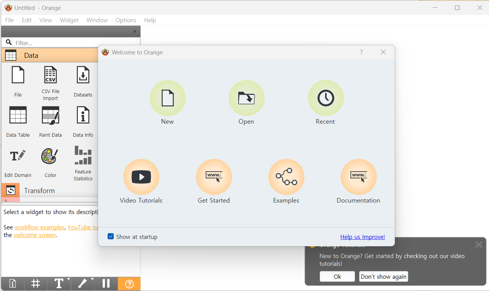

 

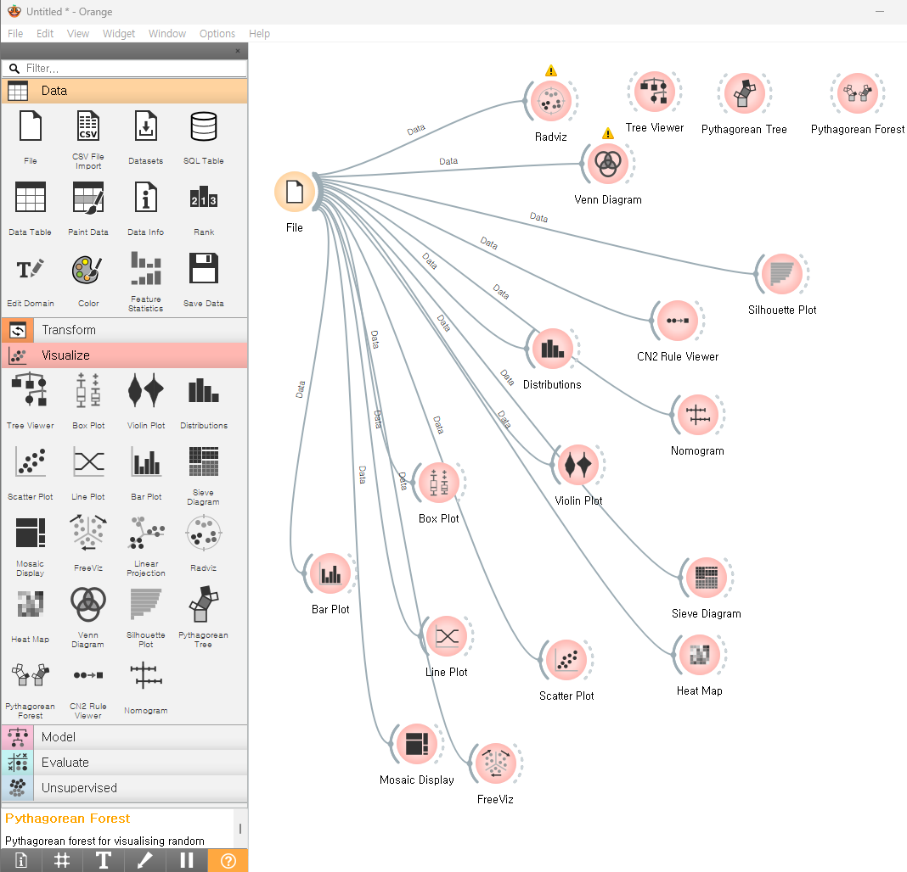

## [3-1] Orange3
▣ 개념: 데이터 분석 및 시각화 도구로, Python 기반의 오픈소스 소프트웨어로 시각적 워크플로우로 구성되어 있어 초보자도 쉽게 사용할 수 있으며, 다양한 머신러닝 모델과 데이터 시각화 기능을 제공 
▣ 주요 적용 분야: 교육용 머신러닝 실습, 데이터 분석, 시각화, 예측 모델링 
▣ 설치파일 다운로드 주소: Orange3 다운로드 
▣ 적용 가능한 머신러닝 모델: 분류, 회귀, 클러스터링, 연관 규칙, 텍스트 마이닝 
▣ 기타: 다양한 데이터 시각화 위젯과 데이터 마이닝 기능을 제공하여 학습용으로 인기가 높다. 특히 Python과의 호환성이 좋아 커스터마이징이 가능 

## [3-2] Weka(Waikato Environment for Knowledge Analysis)
▣ 개념: 뉴질랜드 Waikato대학에서 개발된 데이터마이닝 및 머신러닝용 오픈소스 소프트웨어로 직관적인 GUI를 통해 다양한 데이터 전처리, 분류, 회귀, 클러스터링, 연관 규칙 등을 실행 
▣ 주요 적용 분야: 데이터 마이닝 교육, 데이터 분석, 연구 및 실습 
▣ 적용 가능한 머신러닝 모델: 분류(의사결정트리, Naive Bayes 등), 회귀, 클러스터링(K-평균 등), 연관 규칙 
▣ 기타: WEKA는 특히 학계와 교육에서 많이 사용되며, .arff 형식의 파일을 주로 사용 

## [3-3] ELKI(Environment for Developing KDD-Applications Supported by Index-Structures)
▣ 개념: 클러스터링 및 이상 탐지와 같은 비지도 학습에 특화된 데이터 마이닝 소프트웨어로 GUI는 지원하지 않으며, 데이터 마이닝 연구자들이 새로운 알고리즘을 개발하고 실험 
▣ 주요 적용 분야: 비지도 학습, 클러스터링, 이상 탐지 연구 
▣ 적용 가능한 머신러닝 모델: 클러스터링(DBSCAN, OPTICS 등), 이상 탐지 
▣ 기타: ELKI는 GUI가 없고 명령줄에서 실행하는 방식으로, 주로 연구 및 개발 용도로 많이 사용 

## [3-4] KNIME(Konstanz Information Miner)
▣ 개념: 워크플로우 기반의 데이터 분석 및 머신러닝 도구로 다양한 데이터 소스와 연결하여 복잡한 분석 파이프라인을 시각적으로 구성 
▣ 주요 적용 분야: 데이터 분석, 빅데이터 처리, 비즈니스 인텔리전스, 바이오인포매틱스 
▣ 적용 가능한 머신러닝 모델: 분류, 회귀, 클러스터링, 연관 규칙, 딥러닝 (TensorFlow, Keras 연동 가능) 
▣ 기타: KNIME은 워크플로우 형태로 시각화되며, 데이터 전처리, 변환, 모델링, 평가까지 한 번에 진행할 수 있는 다양한 노드를 제공 

## [3-5] MOA(Massive Online Analysis)
▣ 개념: 스트리밍 데이터 마이닝을 위해 설계된 도구로 실시간 데이터 흐름을 처리하는 데 적합. Weka와 함께 사용할 수 있으며, 대규모 데이터에 대한 머신러닝 및 데이터 마이닝에 특화 
▣ 주요 적용 분야: 실시간 데이터 분석, 스트리밍 데이터 마이닝, 이상 탐지 
▣ 적용 가능한 머신러닝 모델: 스트리밍 분류, 회귀, 클러스터링 (Hoeffding 트리, Naive Bayes 등) 
▣ 기타: 스트리밍 데이터에 대한 분석이 가능하여 IoT, 실시간 시스템에 적합 

## [3-6] Neural Designer
▣ 개념: 딥러닝과 머신러닝 모델을 구축할 수 있는 GUI 기반 소프트웨어로, 주로 산업용으로 설계. 고성능 예측 모델을 만들기 위해 GPU 가속을 지원 
▣ 주요 적용 분야: 딥러닝, 예측 모델링, 금융, 헬스케어, 제조업 
▣ 적용 가능한 머신러닝 모델: 신경망 모델, 회귀, 분류 
▣ 기타: 상업용 소프트웨어이며, 고성능 연산을 위한 GPU 가속을 지원합니다. 시각화 및 분석 기능이 강력하며, 직관적인 인터페이스를 제공합니다. 

## [3-7] RapidMiner
▣ 개념: 비즈니스와 연구용으로 널리 사용되는 GUI 기반의 데이터 분석 도구로, 데이터 전처리, 모델링, 평가 및 배포까지 모든 분석 단계를 시각적 워크플로우로 제공 
▣ 주요 적용 분야: 비즈니스 분석, 금융, 마케팅, 제조업 
▣ 적용 가능한 머신러닝 모델: 분류, 회귀, 클러스터링, 딥러닝, 텍스트 분석 
▣ 기타: 상업용 소프트웨어로 강력한 분석 기능을 제공하며, 사용자가 쉽게 사용할 수 있는 직관적인 UI 

## [3-8] DataRobot
▣ 개념: 자동화된 머신러닝(AutoML) 플랫폼으로, 데이터 전처리, 모델 선택, 하이퍼파라미터 최적화를 자동화하여 사용자가 쉽게 머신러닝 모델 개발이 가능 
▣ 주요 적용 분야: 비즈니스 분석, 예측 모델링, 금융, 헬스케어 
▣ 적용 가능한 모델: 분류, 회귀, 시계열 예측 등 
▣ 기타: 유료 상업용 서비스로, AutoML을 통해 다양한 머신러닝 모델을 자동으로 생성, 평가, 배포 가능 

## [3-9] Azure Machine Learning Studio
▣ 개념: Microsoft의 클라우드 기반 머신러닝 플랫폼으로, 직관적인 드래그 앤 드롭 인터페이스를 제공하여 모델을 쉽게 구축 가능 
▣ 주요 적용 분야: 비즈니스 분석, 데이터 과학, 예측 모델링 
▣ 적용 가능한 모델: 분류, 회귀, 클러스터링, 딥러닝 등 
▣ 기타: Microsoft Azure의 클라우드 리소스를 활용하며, 대규모 데이터 처리가 가능하고 유료로 제공 

## [3-10] IBM Watson Studio
▣ 개념: IBM의 데이터 과학 및 AI 플랫폼으로, 데이터 준비, 모델링, 배포 등을 통합하여 제공하는 머신러닝 도구 
▣ 주요 적용 분야: 비즈니스 인텔리전스, 데이터 과학, 머신러닝 연구 
▣ 적용 가능한 모델: 분류, 회귀, 클러스터링, 시계열 예측, 딥러닝 등 
▣ 기타: AutoAI 기능을 통해 자동으로 머신러닝 모델을 생성하며, 상업용으로 제공 

## [3-11] Google AutoML
▣ 개념: Google Cloud의 머신러닝 플랫폼으로, AutoML 기능을 통해 사용자 친화적인 인터페이스로 고성능 모델을 자동 생성 가능 
▣ 주요 적용 분야: 이미지 분류, 텍스트 분석, 예측 모델링 
▣ 적용 가능한 모델: 이미지 분류, NLP 모델, 테이블 데이터 분류 및 회귀 등 
▣ 기타: Google의 AI 기술을 활용한 고성능 모델을 자동으로 구축하며, 클라우드 기반으로 제공 

## [3-12] H2O.ai
▣ 개념: 오픈소스 AutoML 플랫폼으로, H2O Driverless AI와 같은 GUI 기반의 머신러닝 도구를 통해 사용자 친화적인 모델 학습 환경을 제공 
▣ 주요 적용 분야: 금융, 보험, 헬스케어, 제조업 
▣ 적용 가능한 모델: 분류, 회귀, 시계열 분석, 클러스터링 
▣ 기타: 커뮤니티 버전은 무료로 사용할 수 있으며, 상업용 드라이버리스 AI 솔루션도 제공 

## [3-13] TIBCO Spotfire
▣ 개념: 데이터 시각화 및 분석 플랫폼으로, 머신러닝과 데이터 시각화를 결합하여 비즈니스 인사이트를 제공 
▣ 주요 적용 분야: 비즈니스 인텔리전스, 예측 분석, 데이터 시각화 
▣ 적용 가능한 모델: 분류, 회귀, 클러스터링 
▣ 기타: 데이터 시각화와 통합된 머신러닝 기능을 제공하며, 상업용으로 제공 

## [3-14] JMP
▣ 개념: SAS의 통계 소프트웨어로, 직관적인 인터페이스를 통해 데이터 분석, 시각화, 머신러닝 모델링을 제공 
▣ 주요 적용 분야: 통계 분석, 실험 설계, 품질 관리, 예측 분석 
▣ 적용 가능한 모델: 분류, 회귀, 클러스터링, 시계열 분석 
▣ 기타: 통계적 실험 설계와 데이터 시각화에 특화되어 있으며, 상업용 소프트웨어 

---

<!--
# [1] Matplotlib
https://matplotlib.org/stable/api/_as_gen/matplotlib.pyplot.plot.html

	import matplotlib.pyplot as plt

	plt.hist(titanic_df['Age'])
	titanic_df['Age'].hist()

 

# [2] Seaborn
https://seaborn.pydata.org/tutorial.html

	import seaborn as sns

	sns.distplot(titanic_df['Age'], bins=10)
	sns.histplot(titanic_df['Age'], kde=True)
	sns.countplot(x='Pclass', data=titanic_df)

	sns.barplot(x='Pclass', y='Age', data=titanic_df)
	sns.barplot(x='Pclass', y='Survived', data=titanic_df)
	sns.barplot(x='Pclass', y='Survived', data=titanic_df, ci=None, color='green')
	sns.barplot(x='Pclass', y='Survived', data=titanic_df, ci=None, estimator=sum)
	sns.barplot(x='Pclass', y='Sex', data=titanic_df)
	sns.barplot(x='Pclass', y='Age', hue='Sex', data=titanic_df)
	sns.barplot(x='Pclass', y='Survived', hue='Sex', data=titanic_df)

	sns.violinplot(y='Age', data=titanic_df)
	sns.violinplot(x='Pclass', y='Age', data=titanic_df)
	sns.violinplot(x='Sex', y='Age', data=titanic_df)

	cat_columns = ['Survived', 'Pclass', 'Sex', 'Age_cat']
	fig, axs = plt.subplots(nrows=1, ncols=len(cat_columns), figsize=(16, 4))

	sns.boxplot(y='Age', data=titanic_df)
	sns.boxplot(x='Pclass', y='Age', data=titanic_df)

	sns.scatterplot(x='Age', y='Fare', data=titanic_df)
	sns.scatterplot(x='Age', y='Fare', data=titanic_df, hue='Pclass')
	sns.scatterplot(x='Age', y='Fare', data=titanic_df, hue='Pclass', style ='Survived')
	sns.scatterplot(x='Age', y='Fare', data=titanic_df, hue='Survived')

	sns.heatmap(corr, annot=True, fmt='.1f',  linewidths=0.5, cmap='YlGnBu')

 
-->

