#  05 : 비지도 학습(Unsupervised Learning, UL) : 군집화(Clustering)

---

	[1] Partitioning-Based Clustering : 데이터셋을 사전에 정의된 클러스터 개수로 분할하며, 각 클러스터에 데이터를 배정하고 이를 반복적으로 최적화하는 방식
	[1-1] K-means : 각 클러스터의 중심(centroid)을 기준으로 데이터를 분할
	[1-2] K-medoids : K-means와 유사하지만 클러스터의 중심으로 평균값 대신 데이터 포인트 중 하나를 대표로 선택
	[1-3] K-modes : 범주형 데이터에 특화된 K-means 변형
	[1-4] PAM(Partitioning Around Medoids) : K-medoids의 대표적인 구현으로 각 클러스터 중심을 데이터를 대표하는 데이터 포인트로 설정하고 중심을 이동하며 클러스터링
	[1-5] CLARANS(Clustering Large Applications based on RANdomized Search) : PAM의 개선 알고리즘으로, 랜덤 샘플링을 통해 클러스터링
	[1-6] CLARA(Clustering LARge Applications) : PAM을 대규모 데이터셋에 적용하기 위해 샘플링 기반으로 클러스터링
	[1-7] FCM(Fuzzy C-means) : 퍼지 클러스터링으로 중첩 클러스터에서 유연하게 적용

	[2] Hierarchical-Based Clustering : 데이터의 계층적 구조를 바탕으로 클러스터링
	[2-1] BIRCH(Balanced Iterative Reducing and Clustering using Hierarchies) : 데이터 압축을 활용. CF(Clustering Feature) 트리라는 데이터 구조를 통해 클러스터링
	[2-2] CURE(Clustering Using Representatives) : 각 클러스터를 여러 대표 포인트로 요약하여 클러스터링
	[2-3] ROCK(Robust Clustering using Links) : 데이터 포인트 간의 연결 수(링크 수)를 바탕으로 클러스터
	[2-4] Chameleon : 클러스터 간의 내부 및 외부 관계를 모두 고려하여 클러스터링
 	[2-5] Hierarchical Clustering(Agglomerative / Divisive) : 상향식(Agglomerative)은 각 데이터 포인트에서 시작하여 점차 합쳐가는 방식, 하향식(Divisive)은 전체에서 시작하여 점차 분할.
	
	[3] Density-Based Clustering : 데이터의 밀도에 따라 클러스터를 형성
	[3-1] DBSCAN(Density-Based Spatial Clustering of Applications with Noise) : 주어진 반경 내에 특정 수 이상의 포인트가 있는 경우 이를 클러스터의 일부로 간주하여 연결된 고밀도 지역을 클러스터로 형성	
	[3-2] OPTICS(Ordering Points To Identify the Clustering Structure) : DBSCAN과 유사하나, 클러스터의 밀도가 변동하는 데이터에 대해 더 유연하게 클러스터링
	[3-3] DBCLASD(Distribution Based Clustering of Large Spatial Databases) : 고밀도 구역을 우선적으로 클러스터링하는 밀도 기반 클러스터링 알고리즘으로, 대규모 공간 데이터베이스에 적합
	[3-4] DENCLUE(DENsity-based CLUstEring) : 밀도를 가우시안 커널로 모델링하여, 밀도 함수의 국소적 극대값을 중심으로 클러스터를 형성
 	[3-5] Mean-Shift Clustering : 데이터 공간에서 각 포인트가 데이터의 밀도가 높은 방향으로 이동하여 수렴할 때까지 반복하여 클러스터링

 	[4] Grid-Based Clustering : 데이터 공간을 격자(grid)로 나누고 각 격자의 특성을 바탕으로 클러스터를 형성
	[4-1] Wave-Cluster : 웨이블렛 변환(주파수 분석 도구로, 시간이나 공간에서 신호의 국소적인 변화를 포착)을 사용하여 데이터의 밀도를 측정하고, 고밀도 지역을 클러스터로 분류
	[4-2] STING(Statistical Information Grid-based method) : 데이터 공간을 계층적 격자로 나누고, 각 격자의 통계 정보를 바탕으로 클러스터
	[4-3] CLIQUE(CLustering In QUEst) : 데이터 공간을 격자화하고, 밀도가 높은 격자들을 클러스터
	[4-4] OptiGrid : 데이터 분포를 기준으로 최적의 격자를 생성하고, 이를 바탕으로 클러스터링

	[5] Model-Based Clustering : 각 모델은 데이터의 특성과 요구사항에 따라, EM과 GMM은 확률적 모델링, COBWEB과 CLASSIT는 계층적 구조, SOM은 고차원 데이터를 저차원으로 표현하거나 시각화할 때 유용
	[5-1] EM(Expectation-Maximization) : 데이터의 숨겨진 변수(클러스터 레이블)에 대한 확률 분포를 최적화
	[5-2] COBWEB : 트리 구조를 사용하여 점진적으로 클러스터를 생성
	[5-3] CLASSIT : COBWEB의 변형으로 연속적인 수치 데이터를 다루는 데 초점
	[5-4] SOMs(Self-Organizing Maps) : 인공신경망의 일종으로 고차원 데이터를 저차원으로 표현
 	[5-5] GMM(Gaussian Mixture Model) : 여러 개의 정규 분포를 통해 데이터를 모델링하는 혼합 모델(EM 알고리즘을 사용하여 파라미터를 최적화)

	[6] Graph-Based Clustering : 그래프 기반 접근법을 사용하여 데이터의 유사성을 활용
	[6-1] Spectral Clustering : 비선형 데이터의 그래프 표현을 통해 데이터의 연결성을 기반으로 클러스터링
	[6-2] Affinity Propagation : 데이터 포인트 간의 "유사도"와 "우선도"에 따라 클러스터의 중심점(대표 포인트)을 자동으로 선택

---  

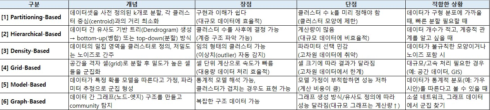

https://scikit-learn.org/stable/unsupervised_learning.html
 

### 군집화(Clustering)이란?
데이터 포인트들을 별개의 군집으로 그룹화하는 것 
유사성이 높은 데이터들을 동일한 그룹으로 분류하고 서로다른 군집들이 상이성을 가지도록 그룹화 
군집화 활용분야 : 고객, 시장, 상품, 경제 및 사회활동 등의 세분화(Segmentation) → 이미지 식별, 이상검출 등 

 

---

# [1-1] k-Means
▣ 정의 : 데이터를 K개의 군집으로 나누고 각 군집의 중심점(centroid)을 군집 내 데이터 포인트들의 평균으로 정의하여 각 데이터의 포인트와 군집 중심간의 거리(유클리디안 기준)를 반복적으로 계산하여 할당하는 군집화 알고리즘 
▣ 필요성 : 데이터를 그룹화하여 숨겨진 패턴을 발견하는 데 유용 
▣ 장점 : 구현이 쉽고 간단하고 계산속도가 빠르며, 대규모 데이터셋에 적합(일반적인 군집하에서 가장많이 활용) 
▣ 단점 : 군집의 개수(K)를 사전에 정의해야 하며, 구형 군집이 아니거나 이상치(outliers)가 있을 경우 성능 저하(거리기반 알고리즘으로 속성의 수가 많을 경우 군집의 정확도가 떨어지는 단점을 보완하기 위해 PCA로 차원축소 필요) 
▣ 응용분야 : 고객 세분화, 이미지 분할, 추천 시스템 
▣ 모델식 : 𝐾는 군집의 개수, $𝐶_𝑖$는 i번째 군집, $𝜇_𝑖$는 i번째 군집의 중심, 𝑥는 데이터 포인트 
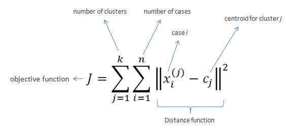
 출처 : https://www.saedsayad.com/clustering_kmeans.htm 

	from sklearn.cluster import KMeans  # KMeans 군집화 알고리즘을 사용하기 위해 sklearn의 cluster 모듈에서 KMeans 클래스를 임포트
	from sklearn.datasets import load_iris  # 예제 데이터로 iris 데이터셋을 불러오기 위해 sklearn의 datasets 모듈에서 load_iris 함수를 임포트
	from sklearn.metrics import silhouette_score, accuracy_score  # Silhouette Score와 Accuracy 계산을 위해 임포트
	import matplotlib.pyplot as plt  # 데이터를 시각화하기 위해 matplotlib의 pyplot 모듈을 plt로 임포트
	import numpy as np  # 배열 계산을 위해 numpy를 임포트
	from scipy.stats import mode  # Accuracy 계산 시 군집과 실제 라벨을 매핑하기 위해 mode 함수를 임포트
	
	# 데이터 로드
	iris = load_iris()  # load_iris 함수를 호출하여 iris 데이터셋을 로드하고, 이를 iris 변수에 저장
	X = iris.data  # iris 데이터셋의 속성값(피처)들만 X에 저장(shape: [150, 4])
	true_labels = iris.target  # 실제 라벨을 저장
	
	# K-Means 알고리즘 적용
	kmeans = KMeans(n_clusters=3, random_state=0)  # KMeans 객체를 생성하고, n_clusters=3으로 군집의 개수를 설정
	kmeans.fit(X)  # KMeans 알고리즘을 사용하여 X 데이터셋에 대해 군집화를 수행하고, 각 데이터 포인트의 군집을 학습
	labels = kmeans.labels_  # 학습 후, 각 데이터 포인트가 속하는 군집의 레이블을 labels에 저장
	
	# Silhouette Score 계산
	silhouette_avg = silhouette_score(X, labels)  # Silhouette Score 계산
	print(f"Silhouette Score: {silhouette_avg:.3f}")
	
	# Accuracy 계산 (군집 레이블과 실제 레이블을 매칭하여 정확도 계산)
	mapped_labels = np.zeros_like(labels)
	for i in np.unique(labels):
	    mask = (labels == i)
	    mapped_labels[mask] = mode(true_labels[mask])[0]
	
	accuracy = accuracy_score(true_labels, mapped_labels)
	print(f"Accuracy: {accuracy:.3f}")
	
	# 시각화
	plt.scatter(X[:, 0], X[:, 1], c=labels, cmap='viridis', s=50)  # X[:, 0] 모든행의 첫번째 열을 X좌표, X[:, 1] 모든행의 두번째 열을 Y좌표로 산점도 그리기
	plt.scatter(kmeans.cluster_centers_[:, 0], kmeans.cluster_centers_[:, 1], c='red', marker='X', s=200, label='Centroids')  # 군집 중심을 'X'로 표시
	plt.title("K-Means Clustering on Iris Dataset")  # 그래프의 제목을 설정
	plt.xlabel("Feature 1")  # X축 레이블을 'Feature 1'로 설정
	plt.ylabel("Feature 2")  # Y축 레이블을 'Feature 2'로 설정
	plt.legend()
	plt.show()  # 그래프를 화면에 출력

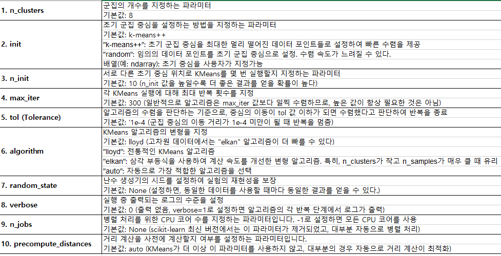

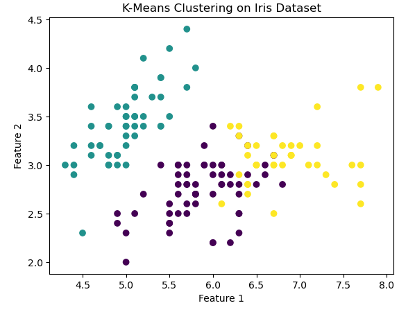

 

## 군집화 알고리즘의 평가 방법(Elbow, Silhouette)
**▣ Elbow :** 군집 수를 결정하기 위한 시각적 방법으로 군집 수를 변화시키면서 각 군집 수에 따른 관성(Inertia), 즉 군집 내 SSE(Sum of Squared Errors) 또는 WCSS(Within-Cluster Sum of Squares) 값을 계산(군집의 개수가 증가할수록 각 군집이 더 작아지고, 데이터 포인트들이 군집 중심에 더 가까워지기 때문에 WCSS이 감소하며, 군집 수를 계속 증가시키다 보면, 어느 순간부터 오차가 크게 줄어들지 않는 구간이 나타나는데 이때의 군집 수를 최적의 군집 수로 선택) 

	import matplotlib.pyplot as plt  # 데이터 시각화를 위한 matplotlib 라이브러리 import
	from sklearn.datasets import load_iris  # iris 데이터셋을 로드하기 위한 모듈 import
	from sklearn.cluster import KMeans  # KMeans 군집화 알고리즘을 사용하기 위한 모듈 import

	# 데이터 로드
	iris = load_iris()  # iris 데이터셋 로드
	data = iris.data  # iris 데이터셋에서 입력 데이터(features) 추출

	# 엘보 기법을 사용한 최적의 군집 수 찾기
	wcss = []  # 각 군집 수에 대한 WCSS 값을 저장할 리스트 초기화
	for k in range(1, 5):  # 군집 수를 1부터 10까지 변경하며 반복
    	kmeans = KMeans(n_clusters=k, init='k-means++', random_state=42)  # k개의 군집을 가지는 KMeans 모델 생성
    	kmeans.fit(data)  # KMeans 모델을 데이터에 학습시킴
    	wcss.append(kmeans.inertia_)  # 학습된 모델의 관성 값(WCSS)을 리스트에 추가

	# 그래프 시각화
	plt.plot(range(1, 5), wcss, marker='o')  # 군집 수에 따른 WCSS 값을 선 그래프로 시각화
	plt.title('Elbow Method')  # 그래프 제목 설정
	plt.xlabel('Number of clusters')  # x축 레이블 설정
	plt.ylabel('WCSS')  # y축 레이블 설정
	plt.show()  # 그래프 출력

 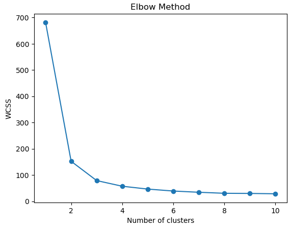

	import numpy as np
	import matplotlib.pyplot as plt
	from sklearn.datasets import load_iris
	from sklearn.cluster import KMeans
	from sklearn.metrics import silhouette_score, accuracy_score
	import pandas as pd
	import seaborn as sns
	from scipy.stats import mode

	# 데이터 로드
	iris = load_iris()
	data = iris.data
	true_labels = iris.target

	# K-means 클러스터링 (군집 수를 2로 설정)
	kmeans = KMeans(n_clusters=2, init='k-means++', random_state=42)
	predicted_labels = kmeans.fit_predict(data)

	# Silhouette Score 계산
	silhouette_avg = silhouette_score(data, predicted_labels)
	print(f"Silhouette Score: {silhouette_avg:.3f}")

	# Accuracy 계산 (군집 레이블과 실제 레이블을 매핑하여 정확도 계산)
	mapped_labels = np.zeros_like(predicted_labels)
	for i in range(2):  # 각 군집에 대해 반복
    		mask = (predicted_labels == i)
    		mapped_labels[mask] = mode(true_labels[mask])[0]

	accuracy = accuracy_score(true_labels, mapped_labels)
	print(f"Accuracy: {accuracy:.3f}")

	# 데이터프레임으로 변환하여 클러스터 레이블 추가
	df = pd.DataFrame(data, columns=iris.feature_names)
	df['Cluster'] = predicted_labels  # 예측된 군집 레이블 추가

	# 시각화 (첫 번째와 두 번째 피처 사용)
	plt.figure(figsize=(10, 5))
	sns.scatterplot(x=iris.feature_names[0], y=iris.feature_names[1], hue='Cluster', data=df, palette='viridis', s=100)
	plt.title("K-means Clustering on Iris Dataset (n_clusters=2)")
	plt.xlabel(iris.feature_names[0])  # 첫 번째 피처 (sepal length)
	plt.ylabel(iris.feature_names[1])  # 두 번째 피처 (sepal width)
	plt.legend(title='Cluster')
	plt.show()

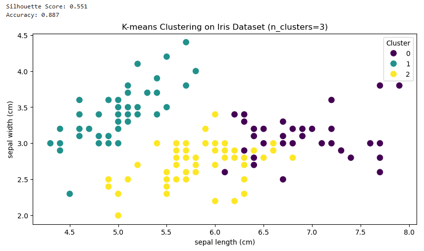

**▣ Silhouette :** 각 군집 간의 거리가 얼마나 효율적으로 분리되어 응집력있게 군집화되었는지를 평가하는 지표. 각 데이터 포인트에 대해 실루엣 계수(Silhouette Coefficient)를 계산하며, 이 값은 데이터 포인트가 자신의 군집에 얼마나 잘 속해 있는지를 나타냄 

	import matplotlib.pyplot as plt
	import numpy as np
	from sklearn.datasets import load_iris
	from sklearn.cluster import KMeans
	from sklearn.metrics import silhouette_score, accuracy_score
	from scipy.stats import mode

	# 데이터 로드
	iris = load_iris()
	data = iris.data
	true_labels = iris.target

	# 실루엣 분석 및 정확도를 통한 최적의 군집 수 찾기
	silhouette_scores = []
	accuracies = []

	for k in range(2, 11):  # 군집 수는 최소 2개 이상이어야 실루엣 점수를 계산할 수 있음
		kmeans = KMeans(n_clusters=k, init='k-means++', random_state=42)
		predicted_labels = kmeans.fit_predict(data)
    
    		# Silhouette Score 계산
    		silhouette = silhouette_score(data, predicted_labels)
    		silhouette_scores.append(silhouette)
    
    		# Accuracy 계산 (군집 레이블과 실제 레이블을 매핑하여 정확도 계산)
    		mapped_labels = np.zeros_like(predicted_labels)
    		for i in range(k):
			mask = (predicted_labels == i)
			mapped_labels[mask] = mode(true_labels[mask])[0]
    
    		accuracy = accuracy_score(true_labels, mapped_labels)
    		accuracies.append(accuracy)

	# 실루엣 점수 그래프 시각화
	plt.figure(figsize=(12, 5))

	plt.subplot(1, 2, 1)
	plt.plot(range(2, 11), silhouette_scores, marker='o')
	plt.title('Silhouette Analysis')
	plt.xlabel('Number of clusters')
	plt.ylabel('Silhouette Score')

	# 정확도 그래프 시각화
	plt.subplot(1, 2, 2)
	plt.plot(range(2, 11), accuracies, marker='o', color='orange')
	plt.title('Accuracy by Number of Clusters')
	plt.xlabel('Number of clusters')
	plt.ylabel('Accuracy')
	plt.tight_layout()
	plt.show()

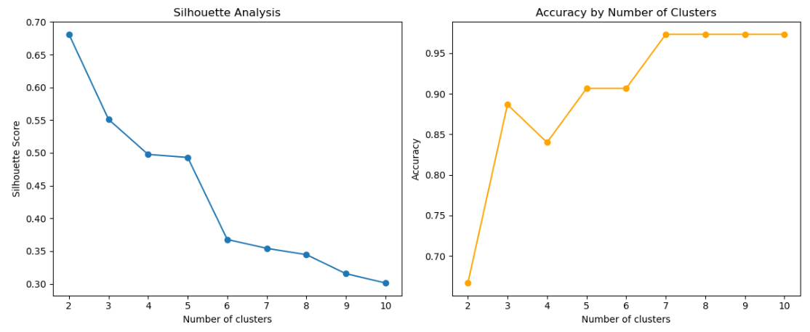
 

# [1-2] K-medoids
▣ 정의: K-means와 유사하지만, 각 군집의 중심을 군집내 가장 중앙에 위치한 실제 데이터 포인트(medoid)로 설정함으로써 이상치(outlier)에 더 강하다. 
▣ 필요성: 이상치가 많은 데이터나 노이즈가 있는 데이터에서 K-means의 단점을 보완하여 안정적인 군집화를 제공 
▣ 장점: K-means에 비해 이상치에 덜 민감하고, 군집 중심이 실제 데이터 포인트이기 때문에 해석이 용이 
▣ 단점: 계산(유클리디안 거리 뿐 아니라 맨허튼 거리, 민코프스키 거리 등 사용가능)에 따라 복잡하고 느릴 가능성이 있으며, 비구형 군집을 잘 분류하지 못함 
▣ 응용분야: 의료 데이터 분석, 범주형 데이터가 포함된 고객 세분화 
▣ 모델식: K-medoids는 각 군집의 중심으로 가장 대표적인 포인트(medoid)를 선택하여 군집 내 데이터와의 총 비유사도를 최소화 
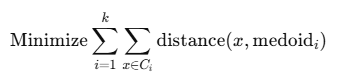

	import numpy as np
	from sklearn.datasets import load_iris
	from sklearn.metrics import silhouette_score, accuracy_score
	from scipy.spatial.distance import cdist
	import pandas as pd
	import matplotlib.pyplot as plt
	import seaborn as sns
	from scipy.stats import mode
	
	class KMedoids:
	    def __init__(self, n_clusters=3, max_iter=300, random_state=None):
	        self.n_clusters = n_clusters
	        self.max_iter = max_iter
	        self.random_state = random_state
	
	    def fit_predict(self, X):
	        if self.random_state:
	            np.random.seed(self.random_state)
	
	        # 1. 초기 메도이드를 랜덤으로 선택
	        medoids = np.random.choice(len(X), self.n_clusters, replace=False)
	
	        for _ in range(self.max_iter):
	            # 각 데이터 포인트와 메도이드 간 거리 계산
	            distances = cdist(X, X[medoids], metric='euclidean')
	            labels = np.argmin(distances, axis=1)
	
	            # 새로운 메도이드 계산
	            new_medoids = np.copy(medoids)
	            for i in range(self.n_clusters):
	                cluster_points = np.where(labels == i)[0]
	                intra_cluster_distances = cdist(X[cluster_points], X[cluster_points], metric='euclidean').sum(axis=1)
	                new_medoids[i] = cluster_points[np.argmin(intra_cluster_distances)]
	
	            # 메도이드가 변하지 않으면 종료
	            if np.array_equal(medoids, new_medoids):
	                break
	            medoids = new_medoids
	
	        self.labels_ = labels
	        self.medoids_ = X[medoids]
	        return self.labels_
	
	# Iris 데이터셋 로드
	iris = load_iris()
	data = iris.data
	true_labels = iris.target
	
	# KMedoids 알고리즘 적용
	kmedoids = KMedoids(n_clusters=3, random_state=0)
	clusters = kmedoids.fit_predict(data)
	
	# 데이터프레임으로 변환하여 시각화 준비
	df = pd.DataFrame(data, columns=iris.feature_names)
	df['Cluster'] = clusters  # 군집화 결과 추가
	
	# Silhouette Score 계산
	silhouette_avg = silhouette_score(data, clusters)
	print(f"Silhouette Score: {silhouette_avg:.3f}")
	
	# Accuracy 계산 (군집 레이블과 실제 레이블을 매칭하여 정확도 계산)
	mapped_labels = np.zeros_like(clusters)
	for i in np.unique(clusters):
	    mask = (clusters == i)
	    mapped_labels[mask] = mode(true_labels[mask])[0]
	
	accuracy = accuracy_score(true_labels, mapped_labels)
	print(f"Accuracy: {accuracy:.3f}")
	
	# 시각화
	plt.figure(figsize=(10, 5))
	sns.scatterplot(x=df.iloc[:, 0], y=df.iloc[:, 1], hue='Cluster', data=df, palette='viridis', s=100)
	plt.scatter(kmedoids.medoids_[:, 0], kmedoids.medoids_[:, 1], c='red', marker='X', s=200, label='Medoids')
	plt.title("K-medoids Clustering on Iris Dataset")
	plt.xlabel(iris.feature_names[0])  # X축: 첫 번째 특징
	plt.ylabel(iris.feature_names[1])  # Y축: 두 번째 특징
	plt.legend(title='Cluster')
	plt.show()

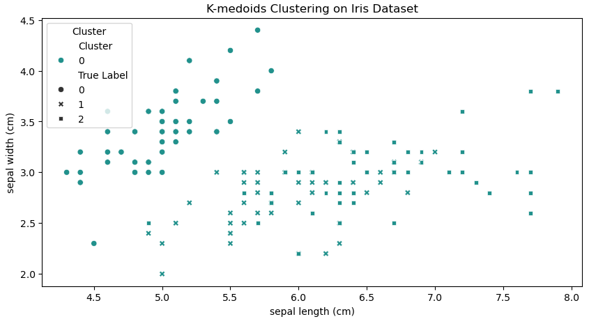
 

# [1-3] K-modes
▣ 정의: 범주형 데이터를 클러스터링하기 위해 설계된 알고리즘으로, 각 군집의 중심은 최빈값(mode)으로 결정 
▣ 필요성: 범주형 데이터를 군집화하는 데 유용하며, 일반적인 K-means와는 다른 접근 방식이 필요 
▣ 장점: 범주형 데이터에 특화되어 있으며, K-means와 유사하게 빠르게 계산 
▣ 단점: 범주형이 아닌 수치형 데이터에는 부적합하며, K 값을 사전에 설정해야 함 
▣ 응용분야: 설문 데이터 분석, 고객 세분화에서 범주형 특성을 포함한 군집화 
▣ 모델식: 범주형 데이터의 유사도를 측정하기 위해 헴밍 거리(Hamming distance)를 사용(군집의 중심은 각 속성의 최빈값으로 설정)

	import numpy as np
	from sklearn.datasets import load_iris
	from sklearn.metrics import silhouette_score, accuracy_score
	import pandas as pd
	import matplotlib.pyplot as plt
	import seaborn as sns
	from scipy.stats import mode
	
	class SimpleKModes:
	    def __init__(self, n_clusters=3, max_iter=100, random_state=None):
	        self.n_clusters = n_clusters
	        self.max_iter = max_iter
	        self.random_state = random_state
	
	    def fit_predict(self, X):
	        if self.random_state:
	            np.random.seed(self.random_state)
	        
	        # 초기 클러스터 중심을 무작위로 선택
	        centers = X.sample(n=self.n_clusters, random_state=self.random_state).to_numpy()
	        
	        for _ in range(self.max_iter):
	            # 각 데이터 포인트와 중심 간 일치하지 않는 항목 수로 거리 계산
	            distances = np.array([[np.sum(x != center) for center in centers] for x in X.to_numpy()])
	            labels = np.argmin(distances, axis=1)
	            
	            # 각 클러스터에 대해 새로운 중심 계산
	            new_centers = np.array([
	                X[labels == i].mode().iloc[0].to_numpy() if len(X[labels == i]) > 0 else centers[i]
	                for i in range(self.n_clusters)
	            ])
	            
	            # 중심이 변하지 않으면 수렴
	            if np.array_equal(centers, new_centers):
	                break
	            centers = new_centers
	
	        self.labels_ = labels
	        self.centers_ = centers
	        return labels
	
	# Iris 데이터셋 로드
	iris = load_iris()
	data = pd.DataFrame(iris.data, columns=iris.feature_names)
	true_labels = iris.target
	
	# 데이터를 범주형으로 변환 (Low, Medium, High)
	data_cat = data.apply(lambda x: pd.cut(x, bins=3, labels=["Low", "Medium", "High"]))
	
	# 범주형 데이터를 숫자로 인코딩
	data_encoded = data_cat.apply(lambda x: x.cat.codes)
	
	# Simple K-Modes 클러스터링 적용
	simple_kmodes = SimpleKModes(n_clusters=3, max_iter=100, random_state=0)
	clusters = simple_kmodes.fit_predict(data_encoded)
	
	# 군집화 결과 추가
	data["Cluster"] = clusters  # 원본 데이터에 군집화 결과를 추가
	
	# Silhouette Score 계산
	silhouette_avg = silhouette_score(data_encoded, clusters)
	print(f"Silhouette Score: {silhouette_avg:.3f}")
	
	# Accuracy 계산 (군집 레이블과 실제 레이블을 매칭하여 정확도 계산)
	mapped_labels = np.zeros_like(clusters)
	for i in np.unique(clusters):
	    mask = (clusters == i)
	    mapped_labels[mask] = mode(true_labels[mask])[0]
	
	accuracy = accuracy_score(true_labels, mapped_labels)
	print(f"Accuracy: {accuracy:.3f}")
	
	# 시각화 (첫 번째와 두 번째 피처 사용)
	plt.figure(figsize=(10, 5))
	sns.scatterplot(x=data.iloc[:, 0], y=data.iloc[:, 1], hue="Cluster", data=data, palette="viridis", s=100)
	plt.title("Simple K-Modes Clustering on Iris Dataset (First 2 Features)")
	plt.xlabel(iris.feature_names[0])  # 첫 번째 피처 (sepal length)
	plt.ylabel(iris.feature_names[1])  # 두 번째 피처 (sepal width)
	plt.legend(title="Cluster")
	plt.show()

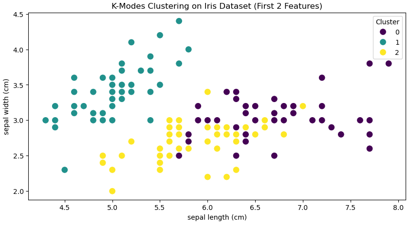
 

# [1-4] PAM(Partitioning Around Medoids)
▣ 정의: K-medoids 접근법을 구현하는 탐욕적 알고리즘으로 각 군집에서 가장 최적의 Medoid를 반복적으로 찾는다 
▣ 필요성: 이상치가 많은 데이터셋에서도 안정적인 군집화를 수행할 수 있음 
▣ 장점: K-means에 비해 이상치에 덜 민감하며 다양한 거리 측정 방법을 사용할 수 있음 
▣ 단점: 대규모 데이터에서 계산 비용이 높고 군집 수(K)를 사전에 지정해야 함 
▣ 응용분야: 범주형 데이터를 포함한 고객 세분화, 의료 데이터 분석 
▣ 모델식: PAM은 각 군집의 중심으로 가장 대표적인 medoid를 선택하여 군집 내 비유사도를 최소화 

	import numpy as np
	from sklearn.datasets import load_iris
	from sklearn.metrics import silhouette_score, accuracy_score
	from scipy.spatial.distance import cdist
	import pandas as pd
	import matplotlib.pyplot as plt
	import seaborn as sns
	from scipy.stats import mode
	
	class PAM:
	    def __init__(self, n_clusters=3, max_iter=300, random_state=None):
	        self.n_clusters = n_clusters
	        self.max_iter = max_iter
	        self.random_state = random_state
	
	    def fit_predict(self, X):
	        if self.random_state:
	            np.random.seed(self.random_state)
	        
	        # 1. 초기 메도이드 선택 (랜덤 샘플링)
	        medoids = np.random.choice(len(X), self.n_clusters, replace=False)
	        
	        for _ in range(self.max_iter):
	            # 각 포인트와 모든 메도이드 간 거리 계산
	            distances = cdist(X, X[medoids], metric='euclidean')
	            labels = np.argmin(distances, axis=1)
	            
	            # 새로운 메도이드 계산
	            new_medoids = np.copy(medoids)
	            for i in range(self.n_clusters):
	                # 현재 군집에 속한 데이터 포인트의 인덱스 추출
	                cluster_points = np.where(labels == i)[0]
	                
	                # 군집 내 데이터 포인트 간 거리의 총합이 최소가 되는 포인트를 메도이드로 설정
	                intra_cluster_distances = cdist(X[cluster_points], X[cluster_points], metric='euclidean').sum(axis=1)
	                new_medoids[i] = cluster_points[np.argmin(intra_cluster_distances)]
	            
	            # 메도이드가 변화가 없으면 종료
	            if np.array_equal(medoids, new_medoids):
	                break
	            medoids = new_medoids
	        
	        self.labels_ = labels
	        self.medoids_ = medoids
	        return self.labels_
	
	# Iris 데이터셋 로드
	iris = load_iris()
	data = pd.DataFrame(iris.data, columns=iris.feature_names)
	true_labels = iris.target
	
	# PAM 알고리즘 적용 (군집 수: 3)
	pam = PAM(n_clusters=3, random_state=0)
	clusters = pam.fit_predict(iris.data)  # 데이터에 맞춰 군집화 수행
	
	# 군집화 결과를 데이터프레임에 추가
	data['Cluster'] = clusters  # 각 데이터 포인트의 군집 레이블 추가
	
	# Silhouette Score 계산
	silhouette_avg = silhouette_score(iris.data, clusters)
	print(f"Silhouette Score: {silhouette_avg:.3f}")
	
	# Accuracy 계산 (군집 레이블과 실제 레이블을 매칭하여 정확도 계산)
	mapped_labels = np.zeros_like(clusters)
	for i in np.unique(clusters):
	    mask = (clusters == i)
	    mapped_labels[mask] = mode(true_labels[mask])[0]
	
	accuracy = accuracy_score(true_labels, mapped_labels)
	print(f"Accuracy: {accuracy:.3f}")
	
	# 시각화 (첫 번째와 두 번째 피처 사용)
	plt.figure(figsize=(10, 5))
	sns.scatterplot(x=data.iloc[:, 0], y=data.iloc[:, 1], hue='Cluster', data=data, palette='viridis', s=100)
	plt.scatter(iris.data[pam.medoids_, 0], iris.data[pam.medoids_, 1], c='red', marker='X', s=200, label='Medoids')
	plt.title("PAM (Partitioning Around Medoids) Clustering on Iris Dataset")
	plt.xlabel(iris.feature_names[0])  # 첫 번째 피처 (sepal length)
	plt.ylabel(iris.feature_names[1])  # 두 번째 피처 (sepal width)
	plt.legend(title='Cluster')
	plt.show()
	
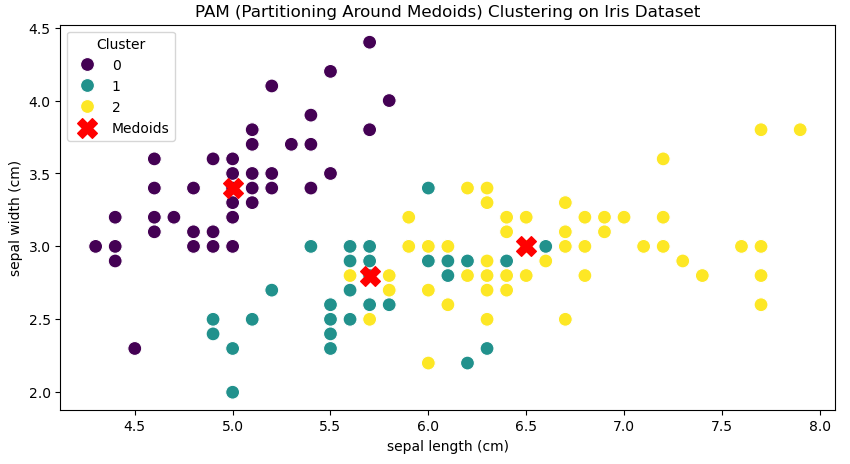
 

# [1-5] CLARANS(Clustering Large Applications based on RANdomized Search)
▣ 정의: PAM(PAM과 K-medoids)의 확장판으로, 대규모 데이터셋에 효율적인 군집화를 제공하기 위해 랜덤화된 탐색 방식을 사용하는 알고리즘. PAM의 전체 데이터셋 탐색 방식 대신 샘플링과 랜덤 선택을 통해 최적의 medoid를 찾는다 
▣ 필요성: PAM의 느린 성능을 보완하여 대규모 데이터에서도 빠르게 클러스터링을 수행할 수 있도록 설계 
▣ 장점: 대규모 데이터셋에 적용할 수 있으며, PAM보다 훨씬 효율적이며, 랜덤 탐색 방식을 통해 최적의 medoid를 빠르게 검색 
▣ 단점: 랜덤화된 탐색을 사용하기 때문에 실행 결과가 매번 다를 수 있으며, PAM과 동일하게 군집 수(K)를 사전에 지정해야 함 
▣ 응용분야: 대규모 고객 세분화, 금융 데이터 분석, 대규모 이미지 및 문서 분류 
▣ 모델식: 전체 데이터셋에서 일부를 랜덤하게 샘플링하여 최적의 medoid를 찾는 방식으로, 기존 PAM의 개념을 대규모 데이터셋에 맞게 확장. 이를 통해 데이터 탐색 과정을 줄이고 효율성을 강화 

	import numpy as np
	from sklearn.datasets import load_iris
	from sklearn.metrics import silhouette_score, accuracy_score
	from scipy.spatial.distance import cdist
	import pandas as pd
	import matplotlib.pyplot as plt
	import seaborn as sns
	from scipy.stats import mode
	
	class CLARANS:
	    def __init__(self, n_clusters=3, numlocal=5, maxneighbor=10, random_state=None):
	        self.n_clusters = n_clusters
	        self.numlocal = numlocal  # 랜덤 초기화 반복 횟수
	        self.maxneighbor = maxneighbor  # 각 초기화 당 랜덤 탐색 이웃 수
	        self.random_state = random_state
	
	    def fit_predict(self, X):
	        if self.random_state:
	            np.random.seed(self.random_state)
	        
	        best_medoids = None
	        best_score = float('inf')
	        labels = None
	
	        # numlocal번의 랜덤 초기화 반복
	        for _ in range(self.numlocal):
	            # 초기 메도이드 랜덤 선택
	            medoids = np.random.choice(len(X), self.n_clusters, replace=False)
	            current_score = self._calculate_total_cost(X, medoids)
	
	            improved = True
	            while improved:
	                improved = False
	                # maxneighbor 번 만큼 랜덤으로 이웃 탐색
	                for _ in range(self.maxneighbor):
	                    # 현재 메도이드 중 하나와 비메도이드 중 하나를 교환
	                    new_medoids = np.copy(medoids)
	                    non_medoids = [i for i in range(len(X)) if i not in medoids]
	                    new_medoids[np.random.randint(0, self.n_clusters)] = np.random.choice(non_medoids)
	                    
	                    # 새로운 메도이드 셋으로 비용 계산
	                    new_score = self._calculate_total_cost(X, new_medoids)
	                    if new_score < current_score:
	                        medoids = new_medoids
	                        current_score = new_score
	                        improved = True
	                        break
	            
	            # 최적의 메도이드 셋 업데이트
	            if current_score < best_score:
	                best_medoids = medoids
	                best_score = current_score
	                labels = np.argmin(cdist(X, X[best_medoids]), axis=1)
	
	        self.medoids_ = best_medoids
	        self.labels_ = labels
	        return self.labels_
	
	    def _calculate_total_cost(self, X, medoids):
	        # 메도이드 셋에 대한 총 비용(거리 합계) 계산
	        distances = cdist(X, X[medoids], metric='euclidean')
	        return np.sum(np.min(distances, axis=1))
	
	# Iris 데이터셋 로드
	iris = load_iris()
	data = pd.DataFrame(iris.data, columns=iris.feature_names)
	true_labels = iris.target
	
	# CLARANS 알고리즘 적용 (군집 수: 3)
	clarans = CLARANS(n_clusters=3, numlocal=5, maxneighbor=10, random_state=0)
	clusters = clarans.fit_predict(iris.data)  # 데이터에 맞춰 군집화 수행
	
	# 군집화 결과를 데이터프레임에 추가
	data['Cluster'] = clusters  # 각 데이터 포인트의 군집 레이블 추가
	
	# Silhouette Score 계산
	silhouette_avg = silhouette_score(iris.data, clusters)
	print(f"Silhouette Score: {silhouette_avg:.3f}")
	
	# Accuracy 계산 (군집 레이블과 실제 레이블을 매칭하여 정확도 계산)
	mapped_labels = np.zeros_like(clusters)
	for i in np.unique(clusters):
	    mask = (clusters == i)
	    mapped_labels[mask] = mode(true_labels[mask])[0]
	
	accuracy = accuracy_score(true_labels, mapped_labels)
	print(f"Accuracy: {accuracy:.3f}")
	
	# 시각화 (첫 번째와 두 번째 피처 사용)
	plt.figure(figsize=(10, 5))
	sns.scatterplot(x=data.iloc[:, 0], y=data.iloc[:, 1], hue='Cluster', data=data, palette='viridis', s=100)
	plt.scatter(iris.data[clarans.medoids_, 0], iris.data[clarans.medoids_, 1], c='red', marker='X', s=200, label='Medoids')
	plt.title("CLARANS Clustering on Iris Dataset")
	plt.xlabel(iris.feature_names[0])  # 첫 번째 피처 (sepal length)
	plt.ylabel(iris.feature_names[1])  # 두 번째 피처 (sepal width)
	plt.legend(title='Cluster')
	plt.show()

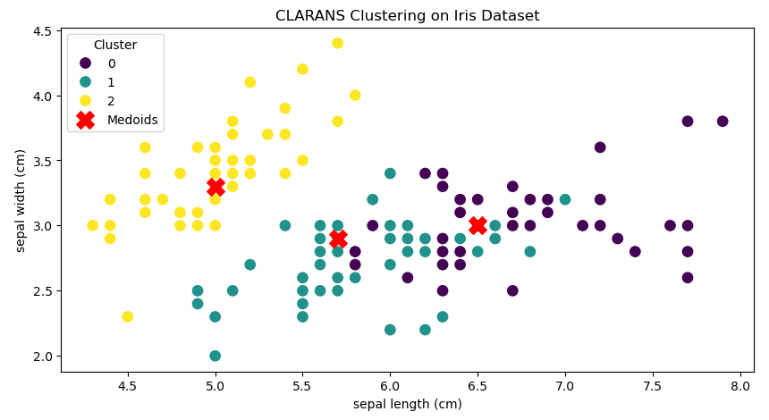
 

# [1-6] CLARA(Clustering LARge Applications)
▣ 정의: PAM을 대규모 데이터에 적용할 수 있도록 확장한 알고리즘으로, 데이터의 일부 샘플을 사용하여 군집화를 수행하는 데, 여러 번의 샘플링을 통해 가장 안정적인 medoid를 선택 
▣ 필요성: PAM의 높은 계산 비용을 줄이고자 개발되어 대규모 데이터셋에서도 빠르게 군집화를 수행 
▣ 장점: PAM보다 계산이 효율적이며, 대규모 데이터셋에 적합하며, 표본 기반 접근 방식을 통해 메모리와 시간 효율적 
▣ 단점: 샘플링을 통해 결과의 신뢰도가 낮아질 수 있으며, 전체 데이터셋을 반영하지 못할 가능성. 군집 수(K)를 사전에 지정해야 함 
▣ 응용분야: 대규모 고객 데이터의 군집화, 생물학적 데이터 분석, 시장 조사 데이터의 분석 및 군집화 
▣ 모델식: 데이터셋에서 일부 샘플을 선택하여 PAM을 적용하고, 여러 번 반복 수행하여 최적의 medoid를 찾는다 

	import numpy as np	
	from sklearn.datasets import load_iris
	from sklearn.metrics import silhouette_score, accuracy_score
	from scipy.spatial.distance import cdist
	import pandas as pd
	import matplotlib.pyplot as plt
	import seaborn as sns
	from scipy.stats import mode
	
	class CLARA:
	    def __init__(self, n_clusters=3, n_samples=25, numlocal=5, max_iter=300, random_state=None):
	        self.n_clusters = n_clusters
	        self.n_samples = n_samples  # 각 샘플의 크기
	        self.numlocal = numlocal    # PAM 반복 횟수
	        self.max_iter = max_iter    # 최대 반복 횟수
	        self.random_state = random_state
	
	    def fit_predict(self, X):
	        if self.random_state:
	            np.random.seed(self.random_state)
	
	        best_medoids = None
	        best_score = float('inf')
	        best_labels = None
	
	        # numlocal 번의 샘플링 반복
	        for _ in range(self.numlocal):
	            # 데이터에서 무작위로 샘플링
	            sample_indices = np.random.choice(len(X), self.n_samples, replace=False)
	            sample = X[sample_indices]
	
	            # PAM을 샘플에 적용하여 최적의 메도이드 찾기
	            medoids = self._initialize_medoids(sample)
	            for _ in range(self.max_iter):
	                distances = cdist(sample, sample[medoids], metric='euclidean')
	                labels = np.argmin(distances, axis=1)
	                
	                new_medoids = np.copy(medoids)
	                for i in range(self.n_clusters):
	                    cluster_points = np.where(labels == i)[0]
	                    intra_cluster_distances = cdist(sample[cluster_points], sample[cluster_points], metric='euclidean').sum(axis=1)
	                    new_medoids[i] = cluster_points[np.argmin(intra_cluster_distances)]
	
	                if np.array_equal(medoids, new_medoids):
	                    break
	                medoids = new_medoids
	
	            # 전체 데이터에 대한 비용 계산
	            full_distances = cdist(X, sample[medoids], metric='euclidean')
	            full_score = np.sum(np.min(full_distances, axis=1))
	
	            # 더 나은 메도이드 셋이 발견되면 갱신
	            if full_score < best_score:
	                best_medoids = medoids
	                best_score = full_score
	                best_labels = np.argmin(full_distances, axis=1)
	
	        self.medoids_ = sample[best_medoids]  # 최적의 메도이드를 전체 데이터셋에서 인덱싱
	        self.labels_ = best_labels
	        return self.labels_
	
	    def _initialize_medoids(self, X):
	        return np.random.choice(len(X), self.n_clusters, replace=False)
	
	# Iris 데이터셋 로드
	iris = load_iris()
	data = pd.DataFrame(iris.data, columns=iris.feature_names)
	true_labels = iris.target
	
	# CLARA 알고리즘 적용 (군집 수: 3)
	clara = CLARA(n_clusters=3, n_samples=30, numlocal=5, max_iter=300, random_state=0)
	clusters = clara.fit_predict(iris.data)  # 전체 데이터에 대해 군집화 수행
	
	# 군집화 결과를 데이터프레임에 추가
	data['Cluster'] = clusters  # 각 데이터 포인트의 군집 레이블 추가
	
	# Silhouette Score 계산
	silhouette_avg = silhouette_score(iris.data, clusters)
	print(f"Silhouette Score: {silhouette_avg:.3f}")
	
	# Accuracy 계산 (군집 레이블과 실제 레이블을 매칭하여 정확도 계산)
	mapped_labels = np.zeros_like(clusters)
	for i in np.unique(clusters):
	    mask = (clusters == i)
	    mapped_labels[mask] = mode(true_labels[mask])[0]
	
	accuracy = accuracy_score(true_labels, mapped_labels)
	print(f"Accuracy: {accuracy:.3f}")
	
	# 시각화 (첫 번째와 두 번째 피처 사용)
	plt.figure(figsize=(10, 5))
	sns.scatterplot(x=data.iloc[:, 0], y=data.iloc[:, 1], hue='Cluster', data=data, palette='viridis', s=100)
	plt.scatter(clara.medoids_[:, 0], clara.medoids_[:, 1], c='red', marker='X', s=200, label='Medoids')
	plt.title("CLARA Clustering on Iris Dataset")
	plt.xlabel(iris.feature_names[0])  # 첫 번째 피처 (sepal length)
	plt.ylabel(iris.feature_names[1])  # 두 번째 피처 (sepal width)
	plt.legend(title='Cluster')
	plt.show()
	
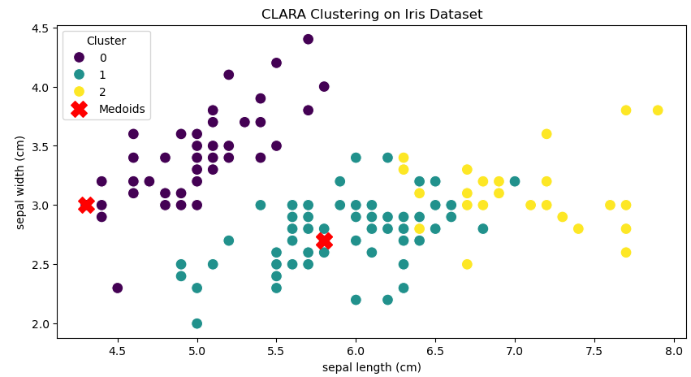
 

# [1-7] FCM(Fuzzy C-means) 
▣ 정의: 소프트 군집화 방법으로 각 데이터 포인트가 여러 군집에 속할 수 있으며, 군집 소속 확률을 계산하여 군집을 형성. 데이터가 명확하게 구분되지 않을 때 유용 
▣ 필요성: 데이터가 명확히 구분되지 않는 경우, 각 데이터가 여러 군집에 소속될 수 있도록 허용하여 더욱 유연한 군집화를 제공 
▣ 장점: 데이터를 여러 군집에 걸쳐 소속시킬 수 있어 유연한 군집화가 가능하며 군집 경계가 모호한 데이터에 적합 
▣ 단점: 이상치에 민감하고 초기 중심 설정에 따라 결과가 달라질 수 있으며, 군집 개수와 퍼지 지수(m)를 미리 설정해야 함 
▣ 응용분야: 이미지 분할 및 패턴 인식, 생물학에서 유전자 데이터 군집화, 고객 세분화와 같은 마케팅 분야 
▣ 모델식: 각 데이터 포인트가 군집에 속할 확률(소속도, membership value)을 계산하여 군집화함. 이때 각 군집의 중심과 데이터 포인트 사이의 거리의 역수에 따라 소속도가 결정되며, 목적 함수를 최소화 함. 여기서 $𝑢_{𝑖𝑗}$는 데이터 포인트 $𝑥_𝑖$가 군집 $𝑐_𝑗$에 속할 확률이며, 𝑚은 퍼지 지수로, 군집의 경계를 조정하는 역할을 수행 
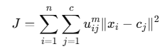

	import numpy as np
	from sklearn.datasets import load_iris
	from sklearn.metrics import silhouette_score, accuracy_score
	import pandas as pd
	import matplotlib.pyplot as plt
	import seaborn as sns
	from scipy.stats import mode
	
	class FCM:
	    def __init__(self, n_clusters=3, m=2.0, max_iter=300, error=1e-5, random_state=None):
	        self.n_clusters = n_clusters
	        self.m = m
	        self.max_iter = max_iter
	        self.error = error
	        self.random_state = random_state
	
	    def initialize_membership(self, n_samples):
	        if self.random_state:
	            np.random.seed(self.random_state)
	        U = np.random.rand(n_samples, self.n_clusters)
	        U = U / np.sum(U, axis=1, keepdims=True)
	        return U
	
	    def update_centers(self, X, U):
	        um = U ** self.m
	        return (um.T @ X) / np.sum(um.T, axis=1, keepdims=True)
	
	    def update_membership(self, X, centers):
	        dist = np.linalg.norm(X[:, np.newaxis] - centers, axis=2)
	        dist = np.fmax(dist, np.finfo(np.float64).eps)
	        inv_dist = dist ** (- 2 / (self.m - 1))
	        return inv_dist / np.sum(inv_dist, axis=1, keepdims=True)
	
	    def fit(self, X):
	        n_samples = X.shape[0]
	        U = self.initialize_membership(n_samples)
	
	        for _ in range(self.max_iter):
	            U_old = U.copy()
	            centers = self.update_centers(X, U)
	            U = self.update_membership(X, centers)
	            if np.linalg.norm(U - U_old) < self.error:
	                break
	
	        self.centers = centers
	        self.u = U
	        self.labels_ = np.argmax(U, axis=1)
	        return self
	
	    def predict(self, X):
	        return np.argmax(self.update_membership(X, self.centers), axis=1)
	
	# Iris 데이터셋 로드
	iris = load_iris()
	data = iris.data
	true_labels = iris.target
	
	# FCM 알고리즘 적용
	fcm = FCM(n_clusters=3, m=2.0, max_iter=300, random_state=0)
	fcm.fit(data)
	
	# 각 데이터 포인트의 군집 소속도 (멤버십) 및 군집 레이블 예측
	fcm_labels = fcm.labels_
	membership_matrix = fcm.u
	
	# 데이터프레임으로 변환하여 시각화 준비
	df = pd.DataFrame(data, columns=iris.feature_names)
	df['Cluster'] = fcm_labels
	df['Membership 1'] = membership_matrix[:, 0]
	df['Membership 2'] = membership_matrix[:, 1]
	df['Membership 3'] = membership_matrix[:, 2]
	
	# Silhouette Score 계산
	silhouette_avg = silhouette_score(data, fcm_labels)
	print(f"Silhouette Score: {silhouette_avg:.3f}")
	
	# Accuracy 계산 (군집 레이블과 실제 레이블을 매칭하여 정확도 계산)
	mapped_labels = np.zeros_like(fcm_labels)
	for i in np.unique(fcm_labels):
	    mask = (fcm_labels == i)
	    mapped_labels[mask] = mode(true_labels[mask])[0]
	
	accuracy = accuracy_score(true_labels, mapped_labels)
	print(f"Accuracy: {accuracy:.3f}")
	
	# 시각화 (첫 번째와 두 번째 피처 사용)
	plt.figure(figsize=(10, 5))
	sns.scatterplot(x=df.iloc[:, 0], y=df.iloc[:, 1], hue='Cluster', data=df, palette='viridis', s=100)
	plt.scatter(fcm.centers[:, 0], fcm.centers[:, 1], c='red', marker='X', s=200, label='Centers')
	plt.title("Fuzzy C-means (FCM) Clustering on Iris Dataset")
	plt.xlabel(iris.feature_names[0])  # 첫 번째 피처 (sepal length)
	plt.ylabel(iris.feature_names[1])  # 두 번째 피처 (sepal width)
	plt.legend(title='Cluster')
	plt.show()
                                                                          
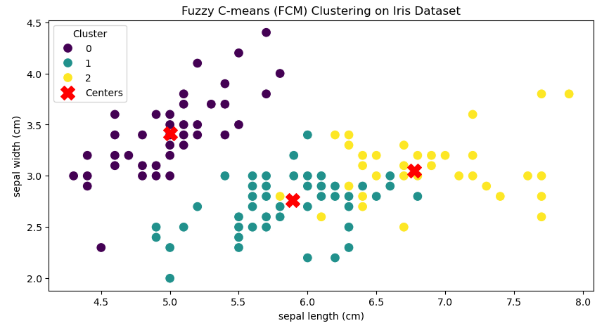
 

---

# [2-1] BIRCH(Balanced Iterative Reducing and Clustering using Hierarchies)
▣ 정의: 대규모 데이터를 효율적으로 군집화할 수 있는 계층적 클러스터링 알고리즘으로, 메모리 사용량을 줄이기 위해 데이터를 압축하는 방식으로 클러스터링을 수행. BIRCH는 데이터를 클러스터링 피처(Clustering Feature, CF) 트리 구조로 유지하여 효율적으로 군집을 형성 
▣ 필요성: 대규모 데이터에서 효율적으로 군집화할 수 있으며, 메모리를 절약하면서도 효과적인 계층적 군집화가 필요할 때 유용 
▣ 장점: 메모리를 절약하면서 대규모 데이터를 처리할 수 있으며 다른 계층적 알고리즘보다 속도가 빠르며, 데이터를 압축하여 군집화 과정을 단순화할 수 있음 
▣ 단점: 군집의 밀도가 고르게 분포된 경우에 더 잘 작동하며, 밀도가 불균일한 경우 성능이 저하될 수 있으며, 초기 매개변수 설정에 따라 성능이 크게 영향을 받을 수 있음 
▣ 응용분야: 대규모 이미지 데이터 군집화, 소셜 네트워크 데이터 분석, 데이터 스트리밍 환경에서 실시간 군집화 
▣ 모델식: 클러스터링 피처(CF)를 사용하여 데이터를 압축하고 계층적으로 군집화(여기서  𝑁은 클러스터의 데이터 포인트 개수, 𝐿𝑆는 각 데이터 포인트의 합계, 𝑆𝑆는 각 데이터 포인트의 제곱 합계이며, 이를 통해 각 클러스터의 중심과 분산을 효율적으로 계산) 
𝐶𝐹 = (𝑁,𝐿𝑆,𝑆𝑆)

	from sklearn.datasets import load_iris
	from sklearn.cluster import Birch
	import pandas as pd
	import matplotlib.pyplot as plt
	import seaborn as sns
	
	# Iris 데이터셋 로드
	iris = load_iris()
	data = iris.data
	
	# BIRCH 알고리즘 적용 (군집 수: 3)
	birch = Birch(n_clusters=3, threshold=0.5, branching_factor=50)
	birch.fit(data)
	labels = birch.predict(data)
	
	# 데이터프레임으로 변환하여 시각화 준비
	df = pd.DataFrame(data, columns=iris.feature_names)
	df['Cluster'] = labels  # 각 포인트의 군집 라벨
	
	# 시각화 (첫 번째와 두 번째 피처 사용)
	plt.figure(figsize=(10, 5))
	sns.scatterplot(x=df.iloc[:, 0], y=df.iloc[:, 1], hue='Cluster', data=df, palette='viridis', s=100)
	plt.title("BIRCH Clustering on Iris Dataset")
	plt.xlabel(iris.feature_names[0])  # 첫 번째 피처 (sepal length)
	plt.ylabel(iris.feature_names[1])  # 두 번째 피처 (sepal width)
	plt.legend(title='Cluster')
	plt.show()

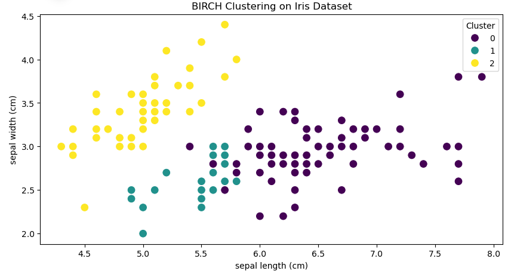
 

# [2-2] CURE(Clustering Using Representatives)
▣ 정의: 군집을 형성할 때 각 군집의 대표 포인트를 사용하여 다양한 모양과 크기의 군집을 잘 처리할 수 있도록 설계된 계층적 군집화 알고리즘. 군집의 대표 포인트들은 군집 내에서 멀리 떨어진 여러 위치에 배치되어 전체 군집의 분포를 나타냄 
▣ 필요성: 군집의 형태나 크기가 다양한 데이터에서 군집을 보다 정확하게 구분할 수 있도록 지원 
▣ 장점: 다양한 형태와 크기의 군집을 효과적으로 탐지할 수 있으며, 노이즈에 강하고 이상치의 영향을 적게 받음 
▣ 단점: 대규모 데이터에서는 계산 비용이 높고, 군집 내 대표 포인트의 개수와 축소 비율 등의 매개변수 설정이 필요 
▣ 응용분야: 지리적 데이터 분석, 대규모 네트워크 데이터에서 커뮤니티 탐색, 유전자 데이터의 군집화 
▣ 모델식: 각 군집의 대표 포인트를 지정하고, 이를 기반으로 다른 군집과의 거리를 계산하여 군집을 형성. 군집 내의 대표 포인트들은 군집 중심에서 일정 비율로 축소되며, 여러 개의 대표 포인트를 통해 군집의 분포를 표현 

	import numpy as np
	from sklearn.datasets import load_iris
	from sklearn.cluster import AgglomerativeClustering
	from sklearn.metrics import silhouette_score, accuracy_score
	import matplotlib.pyplot as plt
	import seaborn as sns
	import pandas as pd
	from scipy.spatial.distance import cdist
	from scipy.stats import mode
	
	# 간단한 CURE 알고리즘 구현
	class CURE:
	    def __init__(self, n_clusters=3, n_representatives=5, shrink_factor=0.5):
	        self.n_clusters = n_clusters
	        self.n_representatives = n_representatives
	        self.shrink_factor = shrink_factor
	        self.labels_ = None
	    
	    def fit_predict(self, X):
	        # 초기 군집 설정 (각 포인트가 하나의 군집)
	        n_samples = X.shape[0]
	        clusters = [[i] for i in range(n_samples)]
	        cluster_centers = [X[i] for i in range(n_samples)]
	        
	        # 계층적 군집화 과정
	        while len(clusters) > self.n_clusters:
	            # 각 군집에서 대표 포인트 샘플링
	            representative_points = [self._get_representatives(X[cluster]) for cluster in clusters]
	            
	            # 군집 간 최소 거리 계산
	            distances = cdist(np.vstack(representative_points), np.vstack(representative_points), metric='euclidean')
	            np.fill_diagonal(distances, np.inf)
	            min_idx = np.unravel_index(np.argmin(distances), distances.shape)
	            cluster_a, cluster_b = min_idx[0] // self.n_representatives, min_idx[1] // self.n_representatives
	            
	            # 군집 병합
	            clusters[cluster_a].extend(clusters[cluster_b])
	            clusters.pop(cluster_b)
	            
	            # 병합된 군집의 중심 업데이트
	            new_representative = self._get_representatives(X[clusters[cluster_a]])
	            cluster_centers[cluster_a] = new_representative
	            cluster_centers.pop(cluster_b)
	        
	        # 최종 군집 레이블 생성
	        self.labels_ = np.empty(n_samples, dtype=int)
	        for cluster_id, cluster in enumerate(clusters):
	            for index in cluster:
	                self.labels_[index] = cluster_id
	                
	        return self.labels_
	    
	    def _get_representatives(self, cluster_points):
	        # 군집에서 대표 포인트를 샘플링하고 축소
	        center = np.mean(cluster_points, axis=0)
	        distances = cdist(cluster_points, [center], metric='euclidean').flatten()
	        representative_indices = np.argsort(distances)[:self.n_representatives]
	        representatives = cluster_points[representative_indices]
	        return center + self.shrink_factor * (representatives - center)
	
	# Iris 데이터셋 로드
	iris = load_iris()
	data = iris.data
	true_labels = iris.target
	
	# CURE 알고리즘 적용
	cure = CURE(n_clusters=3, n_representatives=5, shrink_factor=0.5)
	predicted_labels = cure.fit_predict(data)
	
	# 데이터프레임으로 변환하여 시각화 준비
	df = pd.DataFrame(data, columns=iris.feature_names)
	df['Cluster'] = predicted_labels
	
	# Silhouette Score 계산
	silhouette_avg = silhouette_score(data, predicted_labels)
	print(f"Silhouette Score: {silhouette_avg:.3f}")
	
	# Accuracy 계산 (군집 레이블과 실제 레이블을 매칭하여 정확도 계산)
	mapped_labels = np.zeros_like(predicted_labels)
	for i in np.unique(predicted_labels):
	    mask = (predicted_labels == i)
	    mapped_labels[mask] = mode(true_labels[mask])[0]
	
	accuracy = accuracy_score(true_labels, mapped_labels)
	print(f"Accuracy: {accuracy:.3f}")
	
	# 시각화 (첫 번째와 두 번째 피처 사용)
	plt.figure(figsize=(10, 5))
	sns.scatterplot(x=df.iloc[:, 0], y=df.iloc[:, 1], hue='Cluster', data=df, palette='viridis', s=100)
	plt.title("CURE Clustering on Iris Dataset")
	plt.xlabel(iris.feature_names[0])  # 첫 번째 피처 (sepal length)
	plt.ylabel(iris.feature_names[1])  # 두 번째 피처 (sepal width)
	plt.legend(title='Cluster')
	plt.show()
 
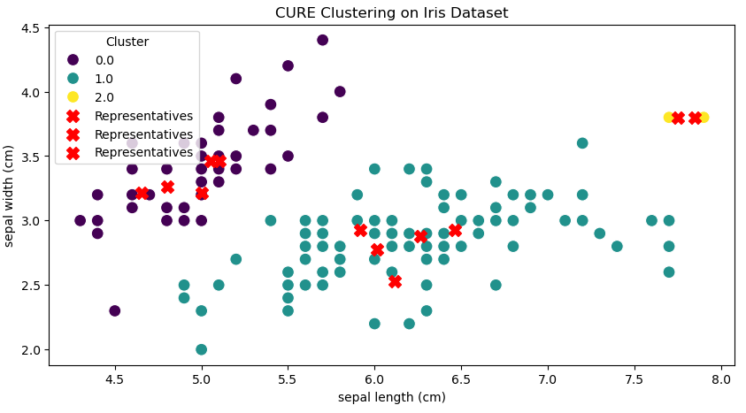
 

# [2-3] ROCK(Robust Clustering using Links)
▣ 정의: 범주형 데이터에서 유사한 항목을 군집화하는 데 최적화된 계층적 군집화 알고리즘으로 각 데이터 포인트 간의 연결(link)을 기반으로 군집의 밀도를 측정하여 군집을 형성 
▣ 필요성: 범주형 데이터와 같이 명확한 거리 계산이 어려운 경우, 데이터 간의 연결 수를 기반으로 군집화를 수행하는 데 유용 
▣ 장점: 범주형 데이터에 특화되어 있어, 범주형 특성을 잘 반영한 군집화를 수행하고 밀도가 높은 군집을 잘 탐지할 수 있음 
▣ 단점: 계산 비용이 높아 대규모 데이터셋에는 적합하지 않으며, 거리 계산보다 연결 기반 군집화가 복잡 
▣ 응용분야: 추천 시스템, 문서 분류 및 텍스트 마이닝, 범주형 속성이 많은 데이터의 군집화 
▣ 모델식: 데이터 포인트 간의 연결을 기반으로 군집을 형성하며, 연결의 개수를 기반으로 군집 간의 유사성을 측정하여 군집화 

	import numpy as np
	from sklearn.datasets import load_iris
	from sklearn.neighbors import kneighbors_graph
	from sklearn.cluster import AgglomerativeClustering
	from sklearn.metrics import silhouette_score, accuracy_score
	import matplotlib.pyplot as plt
	import seaborn as sns
	import pandas as pd
	from scipy.stats import mode
	
	# Iris 데이터셋 로드
	iris = load_iris()
	data = iris.data
	true_labels = iris.target
	
	# 1단계: K-최근접 이웃 그래프 생성 (유사도 링크 기반 생성)
	n_neighbors = 10
	knn_graph = kneighbors_graph(data, n_neighbors=n_neighbors, mode='connectivity', include_self=False)
	
	# 2단계: Agglomerative Clustering을 통해 유사도 링크 기반으로 군집화
	rock_clustering = AgglomerativeClustering(n_clusters=3, connectivity=knn_graph, linkage='average')
	predicted_labels = rock_clustering.fit_predict(data)
	
	# 데이터프레임으로 변환하여 시각화 준비
	df = pd.DataFrame(data, columns=iris.feature_names)
	df['Cluster'] = predicted_labels
	
	# Silhouette Score 계산
	silhouette_avg = silhouette_score(data, predicted_labels)
	print(f"Silhouette Score: {silhouette_avg:.3f}")
	
	# Accuracy 계산 (군집 레이블과 실제 레이블을 매칭하여 정확도 계산)
	mapped_labels = np.zeros_like(predicted_labels)
	for i in np.unique(predicted_labels):
	    mask = (predicted_labels == i)
	    mapped_labels[mask] = mode(true_labels[mask])[0]
	
	accuracy = accuracy_score(true_labels, mapped_labels)
	print(f"Accuracy: {accuracy:.3f}")
	
	# 시각화 (첫 번째와 두 번째 피처 사용)
	plt.figure(figsize=(10, 5))
	sns.scatterplot(x=df.iloc[:, 0], y=df.iloc[:, 1], hue='Cluster', data=df, palette='viridis', s=100)
	plt.title("ROCK Clustering (Approximation) on Iris Dataset")
	plt.xlabel(iris.feature_names[0])  # 첫 번째 피처 (sepal length)
	plt.ylabel(iris.feature_names[1])  # 두 번째 피처 (sepal width)
	plt.legend(title='Cluster')
	plt.show()

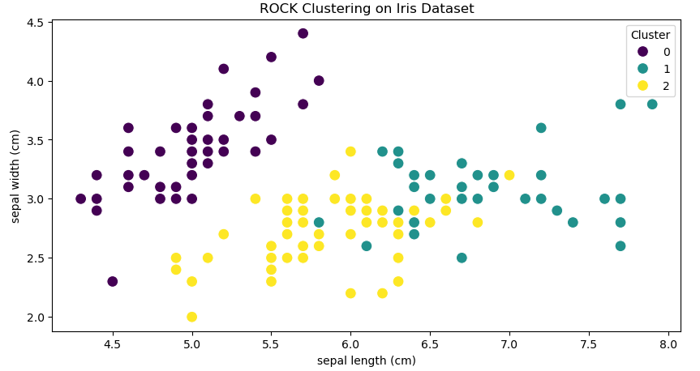
 

# [2-4] Chameleon
▣ 정의: 데이터의 지역적 밀도와 모양을 고려하여 유사성을 계산하여 군집을 형성하는 계층적 군집화 알고리즘으로 군집을 나누는 초기 분할과 동적 병합 단계 등 2단계로 구성 
▣ 필요성: 다양한 모양과 밀도의 군집이 있는 데이터에서 군집화를 수행할 때 유용 
▣ 장점: 군집의 밀도와 모양을 고려하여 다양한 군집 구조를 잘 탐지할 수 있으며 다른 계층적 군집화보다 유연한 군집화를 제공 
▣ 단점: 계산 비용이 매우 높으며, 대규모 데이터셋에서는 실행이 어려울 수 있으며 초기 클러스터링과 병합 기준을 설정하는 것이 어렵다 
▣ 응용분야: 소셜 네트워크에서 커뮤니티 탐색, 비정형 데이터 분석, 웹 문서 분류 
▣ 모델식: 두 단계로 군집을 형성하는데 첫째, 데이터를 작은 초기 군집으로 나누고, 둘째, 유사한 군집을 동적으로 병합하여 최종 군집을 형성 

	import numpy as np
	from sklearn.datasets import load_iris
	from sklearn.neighbors import kneighbors_graph
	from sklearn.cluster import AgglomerativeClustering, DBSCAN
	from sklearn.metrics import silhouette_score, accuracy_score
	import matplotlib.pyplot as plt
	import seaborn as sns
	import pandas as pd
	from scipy.stats import mode
	
	# Iris 데이터셋 로드
	iris = load_iris()
	data = iris.data
	true_labels = iris.target
	
	# 1단계: K-최근접 이웃 그래프 생성
	n_neighbors = 10
	knn_graph = kneighbors_graph(data, n_neighbors=n_neighbors, include_self=False)
	
	# 2단계: 초기 군집화 - 그래프 기반의 계층적 군집화 수행
	initial_clustering = AgglomerativeClustering(n_clusters=10, connectivity=knn_graph, linkage='average')
	initial_labels = initial_clustering.fit_predict(data)
	
	# 3단계: 군집 병합 - DBSCAN을 사용하여 작은 군집을 밀도 기반으로 병합
	# AgglomerativeClustering으로 생성된 초기 군집들을 DBSCAN으로 다시 병합
	data_with_initial_labels = pd.DataFrame(data)
	data_with_initial_labels['initial_cluster'] = initial_labels
	
	# 각 초기 군집을 DBSCAN을 통해 병합
	dbscan = DBSCAN(eps=0.5, min_samples=5)
	final_labels = dbscan.fit_predict(data)
	
	# 데이터프레임으로 변환하여 시각화 준비
	df = pd.DataFrame(data, columns=iris.feature_names)
	df['Cluster'] = final_labels
	
	# Silhouette Score 계산 (노이즈 데이터는 제외)
	valid_points = final_labels != -1  # 노이즈가 아닌 포인트만 선택
	if np.sum(valid_points) > 1:
	    silhouette_avg = silhouette_score(data[valid_points], final_labels[valid_points])
	    print(f"Silhouette Score: {silhouette_avg:.3f}")
	else:
	    print("Silhouette Score: Not enough valid points for calculation.")
	
	# Accuracy 계산 (군집 레이블과 실제 레이블을 매칭하여 정확도 계산)
	mapped_labels = np.zeros_like(final_labels)
	for i in np.unique(final_labels):
	    mask = (final_labels == i)
	    if np.any(mask):  # 군집에 속하는 포인트가 있을 때만 계산
	        mapped_labels[mask] = mode(true_labels[mask])[0]
	
	accuracy = accuracy_score(true_labels[valid_points], mapped_labels[valid_points])
	print(f"Accuracy: {accuracy:.3f}")
	
	# 시각화 (첫 번째와 두 번째 피처 사용)
	plt.figure(figsize=(10, 5))
	sns.scatterplot(x=df.iloc[:, 0], y=df.iloc[:, 1], hue='Cluster', data=df, palette='viridis', s=100)
	plt.title("Chameleon Clustering (Approximation) on Iris Dataset")
	plt.xlabel(iris.feature_names[0])  # 첫 번째 피처 (sepal length)
	plt.ylabel(iris.feature_names[1])  # 두 번째 피처 (sepal width)
	plt.legend(title='Cluster')
	plt.show()

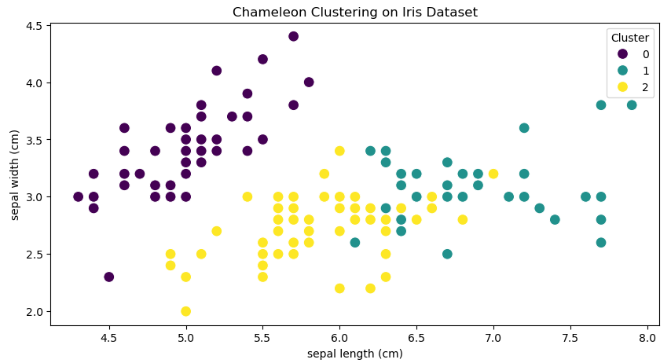
 

# [2-5] Hierarchical Clustering(Agglomerative / Divisive)
▣ 정의 : 데이터를 병합(bottom-up)하거나 분할(top-down)하여 계층적인 군집 구조를 만드는 방법 
▣ 필요성 : 군집의 개수를 사전에 정할 필요 없이 계층적 관계를 파악할 때 사용 
▣ 장점 : 군집 수를 미리 정할 필요 없으며, 덴드로그램(dendrogram)을 통한 군집 분석 가능 
▣ 단점 : 계산 복잡도가 높으며, 초기 병합 또는 분할 결정이 최종 결과에 영향을 줄 수 있음 
▣ 응용분야 : 계통수 분석, 텍스트 및 문서 분류  
▣ 모델식 : $𝐶_𝑖$와 $𝐶_𝑗$는 각각 두 군집이고, 𝑑(𝑥,𝑦)는 두 데이터 포인트 𝑥와 𝑦 간의 거리 
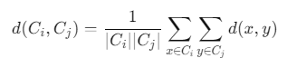

	#(Agglomerative)
	import numpy as np
	from sklearn.datasets import load_iris
	from sklearn.cluster import KMeans
	from sklearn.metrics import silhouette_score, accuracy_score
	import matplotlib.pyplot as plt
	import seaborn as sns
	import pandas as pd
	from scipy.stats import mode
	
	# Divisive Clustering 함수
	def divisive_clustering(data, num_clusters):
	    clusters = {0: data}  # 초기 전체 데이터를 하나의 큰 군집으로 설정
	    current_cluster_id = 0
	    
	    while len(clusters) < num_clusters:
	        # 가장 큰 군집 선택
	        largest_cluster_id = max(clusters, key=lambda k: len(clusters[k]))
	        largest_cluster_data = clusters[largest_cluster_id]
	        
	        # 해당 군집을 두 개로 분할
	        kmeans = KMeans(n_clusters=2, random_state=0).fit(largest_cluster_data)
	        labels = kmeans.labels_
	        
	        # 새로운 군집에 데이터 할당
	        new_cluster_id = max(clusters.keys()) + 1
	        clusters[largest_cluster_id] = largest_cluster_data[labels == 0]
	        clusters[new_cluster_id] = largest_cluster_data[labels == 1]
	        
	        # 클러스터 ID 증가
	        current_cluster_id += 1
	    
	    # 최종 군집 레이블 생성
	    predicted_labels = np.zeros(data.shape[0], dtype=int)
	    for cluster_id, cluster_data in clusters.items():
	        for idx in range(data.shape[0]):
	            if data[idx] in cluster_data:
	                predicted_labels[idx] = cluster_id
	                
	    return predicted_labels
	
	# Iris 데이터셋 로드
	iris = load_iris()
	data = iris.data
	true_labels = iris.target
	
	# Divisive Clustering 실행
	num_clusters = 3
	predicted_labels = divisive_clustering(data, num_clusters)
	
	# 데이터프레임으로 변환하여 시각화 준비
	df = pd.DataFrame(data, columns=iris.feature_names)
	df['Cluster'] = predicted_labels
	
	# Silhouette Score 계산
	silhouette_avg = silhouette_score(data, predicted_labels)
	print(f"Silhouette Score: {silhouette_avg:.3f}")
	
	# Accuracy 계산 (군집 레이블과 실제 레이블을 매칭하여 정확도 계산)
	mapped_labels = np.zeros_like(predicted_labels)
	for i in range(num_clusters):
	    mask = (predicted_labels == i)
	    mapped_labels[mask] = mode(true_labels[mask])[0]
	
	accuracy = accuracy_score(true_labels, mapped_labels)
	print(f"Accuracy: {accuracy:.3f}")
	
	# 시각화 (첫 번째와 두 번째 피처 사용)
	plt.figure(figsize=(10, 5))
	sns.scatterplot(x=df.iloc[:, 0], y=df.iloc[:, 1], hue='Cluster', data=df, palette='viridis', s=100)
	plt.title("Divisive Hierarchical Clustering on Iris Dataset")
	plt.xlabel(iris.feature_names[0])  # 첫 번째 피처 (sepal length)
	plt.ylabel(iris.feature_names[1])  # 두 번째 피처 (sepal width)
	plt.legend(title='Cluster')
	plt.show()

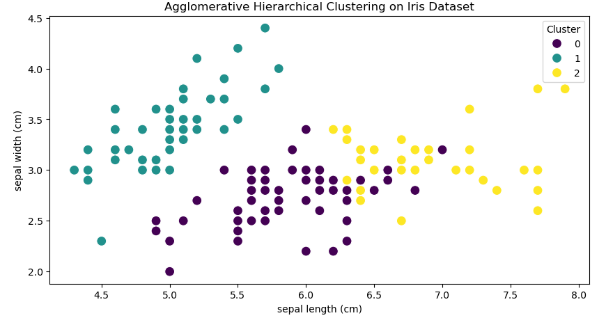

	#(Divisive)
 	import numpy as np
	from sklearn.datasets import load_iris
	from sklearn.cluster import KMeans
	from sklearn.metrics import silhouette_score, accuracy_score
	import matplotlib.pyplot as plt
	import seaborn as sns
	import pandas as pd
	from scipy.stats import mode
	
	# Divisive Clustering 함수
	def divisive_clustering(data, num_clusters):
	    clusters = {0: data}  # 초기 전체 데이터를 하나의 큰 군집으로 설정
	    current_cluster_id = 0
	    
	    while len(clusters) < num_clusters:
	        # 가장 큰 군집 선택
	        largest_cluster_id = max(clusters, key=lambda k: len(clusters[k]))
	        largest_cluster_data = clusters[largest_cluster_id]
	        
	        # 해당 군집을 두 개로 분할
	        kmeans = KMeans(n_clusters=2, random_state=0).fit(largest_cluster_data)
	        labels = kmeans.labels_
	        
	        # 새로운 군집에 데이터 할당
	        new_cluster_id = max(clusters.keys()) + 1
	        clusters[largest_cluster_id] = largest_cluster_data[labels == 0]
	        clusters[new_cluster_id] = largest_cluster_data[labels == 1]
	        
	        # 클러스터 ID 증가
	        current_cluster_id += 1
	    
	    # 최종 군집 레이블 생성
	    predicted_labels = np.zeros(data.shape[0], dtype=int)
	    for cluster_id, cluster_data in clusters.items():
	        for idx in range(data.shape[0]):
	            if data[idx] in cluster_data:
	                predicted_labels[idx] = cluster_id
	                
	    return predicted_labels
	
	# Iris 데이터셋 로드
	iris = load_iris()
	data = iris.data
	true_labels = iris.target
	
	# Divisive Clustering 실행
	num_clusters = 3
	predicted_labels = divisive_clustering(data, num_clusters)
	
	# 데이터프레임으로 변환하여 시각화 준비
	df = pd.DataFrame(data, columns=iris.feature_names)
	df['Cluster'] = predicted_labels
	
	# Silhouette Score 계산
	silhouette_avg = silhouette_score(data, predicted_labels)
	print(f"Silhouette Score: {silhouette_avg:.3f}")
	
	# Accuracy 계산 (군집 레이블과 실제 레이블을 매칭하여 정확도 계산)
	mapped_labels = np.zeros_like(predicted_labels)
	for i in range(num_clusters):
	    mask = (predicted_labels == i)
	    mapped_labels[mask] = mode(true_labels[mask])[0]
	
	accuracy = accuracy_score(true_labels, mapped_labels)
	print(f"Accuracy: {accuracy:.3f}")
	
	# 시각화 (첫 번째와 두 번째 피처 사용)
	plt.figure(figsize=(10, 5))
	sns.scatterplot(x=df.iloc[:, 0], y=df.iloc[:, 1], hue='Cluster', data=df, palette='viridis', s=100)
	plt.title("Divisive Hierarchical Clustering on Iris Dataset")
	plt.xlabel(iris.feature_names[0])  # 첫 번째 피처 (sepal length)
	plt.ylabel(iris.feature_names[1])  # 두 번째 피처 (sepal width)
	plt.legend(title='Cluster')
	plt.show()

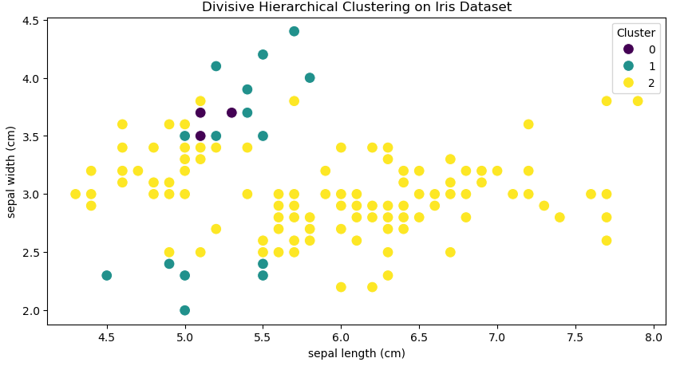
 

▣ 덴드로그램(dendrogram) : 나무(tree) 모양의 도식으로, 계층적 군집화의 결과를 시각화하는 데 사용된다. 이 그래프는 각 데이터 포인트가 병합되거나 분할되는 과정을 계층 구조로 표현하며, 군집 간의 관계를 직관적으로 이해할 수 있도록 도와준다.  
덴드로그램의 구조는 다음과 같다: 
(1) 각 데이터 포인트는 맨 아래에서 개별 노드로 시작 : 덴드로그램에서 각 데이터 포인트는 맨 아래에 위치한 개별 노드로 시작. 이 단계에서는 각각의 데이터가 하나의 군집을 이루고 있다. 
(2) 데이터 포인트들이 병합 : 계층적 군집화의 과정에서 유사한 데이터 포인트끼리 순차적으로 병합되며, 병합되는 과정이 덴드로그램에서 상위로 올라가면서 두 노드가 연결되는 형태로 시각화 된다. 
(3) 병합된 군집이 다시 다른 군집과 병합 : 유사한 군집끼리 계속 병합되며 점점 더 큰 군집을 형성하게 된다. 덴드로그램의 상단으로 갈수록 더 큰 군집이 병합된 결과를 나타내며, 결국 모든 데이터가 하나의 군집으로 병합된다. 
(4) 군집 간의 거리 정보: 덴드로그램에서 두 군집이 병합된 높이(수직 축)는 그 두 군집 사이의 유사도 또는 거리를 나타낸다. 즉, 병합된 높이가 클수록 두 군집 간의 거리가 더 멀었다는 것을 의미합니다. 이는 데이터를 나누거나 군집을 형성하는 데 있어 중요한 기준이 된다. 
덴드로그램의 장점은 다음과 같다: 
(1) 군집의 개수 선택이 유연 : 덴드로그램을 통해 데이터가 어떻게 군집화되었는지 시각적으로 확인한 후, 임의의 높이에서 선을 그어 군집의 개수를 선택할 수 있다. 특정 높이에서 덴드로그램을 자르면 그 높이 기준으로 몇 개의 군집이 형성되는지를 알 수 있으며 이로 인해 군집의 개수를 미리 결정하지 않고도 군집을 형성할 수 있다. 예를 들어, 덴드로그램에서 각 군집 간의 유사도가 높지 않다고 판단되는 지점에서 잘라내면 다수의 작은 군집이 만들어질 수 있고, 반대로 유사도가 높다고 판단되는 지점에서 자르면 소수의 큰 군집이 형성될 수 있다. 
(2) 군집 간의 유사도 및 계층 구조 파악 : 덴드로그램은 단순히 군집을 나누는 것 이상으로 군집 간의 유사도와 계층적 관계를 직관적으로 보여준다. 이를 통해 두 군집이 병합되는 시점과 그 군집들이 다른 군집들과 얼마나 유사한지를 파악하고 이 정보를 바탕으로 군집화 결과를 더욱 상세하게 해석할 수 있다. 
(3) 다양한 수준에서 군집 분석 가능 : 덴드로그램을 활용하면 데이터셋을 다양한 수준에서 분석할 수 있다. 특정 높이에서 군집을 잘라내면 더 큰 군집을 형성할 수 있고, 더 낮은 높이에서는 세부적인 군집을 식별함으로써 다단계 군집 분석을 가능하게 한다. 
(4) 군집의 구조적 관계 시각화 : 덴드로그램을 통해 데이터를 계층적으로 군집화한 결과를 시각적으로 확인함으로써 데이터가 점진적으로 어떻게 병합되는지, 그리고 군집화가 특정 기준에 따라 어떻게 변하는지를 쉽게 이해할 수 있다. 

	from scipy.cluster.hierarchy import dendrogram, linkage
	from sklearn.datasets import load_iris
	import matplotlib.pyplot as plt

	# 데이터 로드
	iris = load_iris()
	X = iris.data

	# 계층적 군집화 수행
	Z = linkage(X, 'ward')  # ward: 최소분산 기준 병합

	# 덴드로그램 시각화
	plt.figure(figsize=(10, 5))
	dendrogram(Z)
	plt.title("Hierarchical Clustering Dendrogram")
	plt.xlabel("Sample Index")
	plt.ylabel("Distance")
	plt.show()

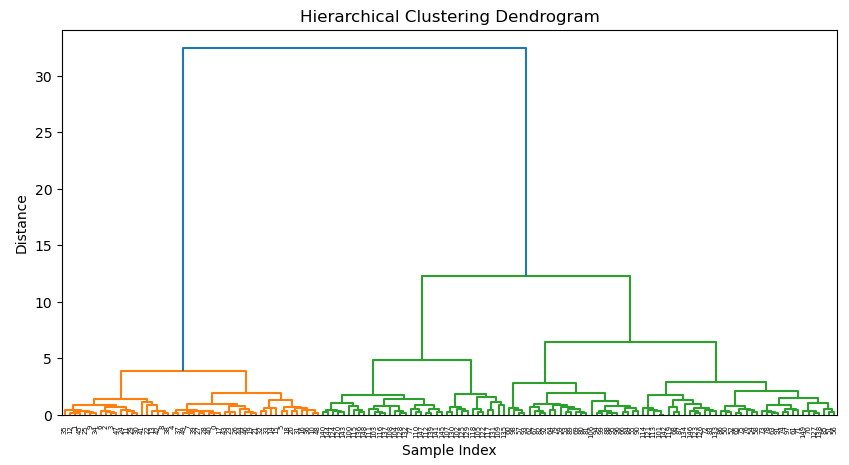
 

---

# [3-1] DBSCAN(Density-Based Spatial Clustering of Applications with Noise)
▣ 정의 : 밀도가 높은 영역을 군집으로 묶고, 밀도가 낮은 점들은 노이즈로 간주하는 밀도 기반 군집화 알고리즘 
▣ 필요성 : 다양한 밀도의 데이터 군집화 및 이상치 탐지에 유용 
▣ 장점 : 군집의 개수를 사전 설정할 필요 없으며, 이상치(outliers)를 자연스럽게 처리 가능 
▣ 단점 : 적절한 파라미터(Epsilon(ε) : Cluster를 구성하는 최소의 거리, Min Points(MinPts): Cluster를 구성시 필요한 최소 데이터 포인트 수) 설정이 필요하며, 밀도가 균일하지 않은 데이터에 부적합 
▣ 응용분야 : 이상 탐지, 지리적 데이터 분석 
▣ 모델식: 각 점에서 반경 𝜖 내에 있는 점들이 미리 정의된 MinPts 보다 많으면 그 점을 중심으로 군집을 형성 
▣ 동작 과정:  
(1) 데이터 중에 임의의 포인트를 선택 
(2) 선택한 데이터와 Epsilon 거리 내에 있는 모든 데이터 포인트를 찾음 
(3) 주변에 있는 데이터 포인트 갯수가 Min Points 이상이면, 해당 포인트를 중심으로 하는 Cluster를 생성 
(4) 어떠한 포인트가 생성한 Cluster 안에 존재하는 다른 점 중에 다른 Cluster의 중심이 되는 데이터 포인트가 존재한다면 두 Cluster는 하나의 Cluster로 간주 
(5) 1~4번을 모든 포인트에 대해서 반복. 어느 Cluster에도 포함되지 않는 데이터 포인트는 이상치로 처리 

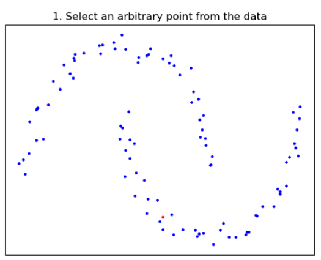
 
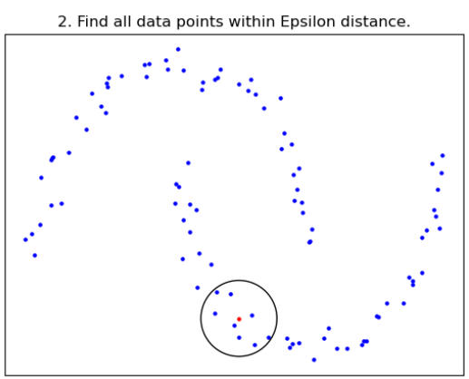
 
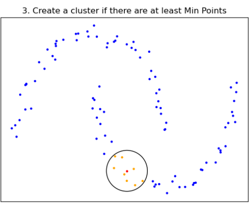
 
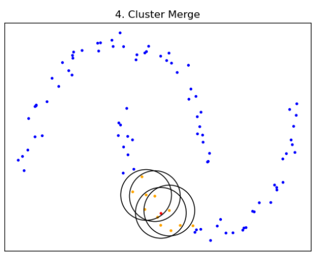
 
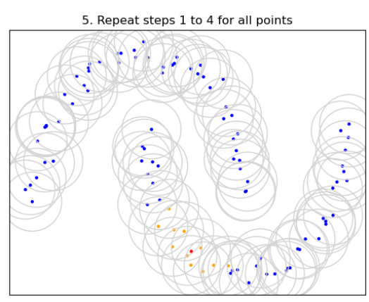
 
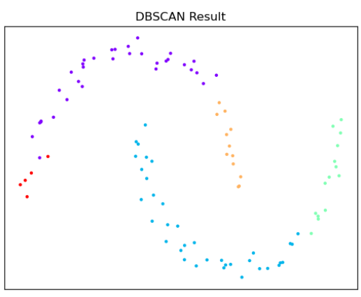
 

	import numpy as np
	from sklearn.datasets import load_iris
	from sklearn.cluster import DBSCAN
	from sklearn.metrics import silhouette_score, accuracy_score
	import matplotlib.pyplot as plt
	import seaborn as sns
	import pandas as pd
	from scipy.stats import mode
	
	# Iris 데이터셋 로드
	iris = load_iris()
	data = iris.data
	true_labels = iris.target
	
	# DBSCAN 알고리즘 적용
	dbscan = DBSCAN(eps=0.5, min_samples=5)
	predicted_labels = dbscan.fit_predict(data)
	
	# 데이터프레임으로 변환하여 시각화 준비
	df = pd.DataFrame(data, columns=iris.feature_names)
	df['Cluster'] = predicted_labels
	
	# Silhouette Score 계산 (노이즈 데이터는 제외)
	valid_points = predicted_labels != -1  # 노이즈가 아닌 포인트만 선택
	if np.sum(valid_points) > 1:
	    silhouette_avg = silhouette_score(data[valid_points], predicted_labels[valid_points])
	    print(f"Silhouette Score: {silhouette_avg:.3f}")
	else:
	    print("Silhouette Score: Not enough valid points for calculation.")
	
	# Accuracy 계산 (군집 레이블과 실제 레이블을 매칭하여 정확도 계산)
	mapped_labels = np.zeros_like(predicted_labels)
	for i in np.unique(predicted_labels):
	    mask = (predicted_labels == i)
	    if np.any(mask):  # 군집에 속하는 포인트가 있을 때만 계산
	        mapped_labels[mask] = mode(true_labels[mask])[0]
	
	accuracy = accuracy_score(true_labels[valid_points], mapped_labels[valid_points])
	print(f"Accuracy: {accuracy:.3f}")
	
	# 시각화 (첫 번째와 두 번째 피처 사용)
	plt.figure(figsize=(10, 5))
	sns.scatterplot(x=df.iloc[:, 0], y=df.iloc[:, 1], hue='Cluster', data=df, palette='viridis', s=100)
	plt.title("DBSCAN Clustering on Iris Dataset")
	plt.xlabel(iris.feature_names[0])  # 첫 번째 피처 (sepal length)
	plt.ylabel(iris.feature_names[1])  # 두 번째 피처 (sepal width)
	plt.legend(title='Cluster')
	plt.show()

 

# [3-2] OPTICS(Ordering Points To Identify the Clustering Structure)
▣ 정의 : 밀도 기반 군집화(DBSCAN)의 확장으로, 여러 밀도 수준에서 데이터의 군집 구조를 식별할 수 있도록 밀도가 다른 군집을 유연하게 찾기 위해 도달 가능 거리(reachability distance)를 사용하는 알고리즘 
▣ 필요성 : 다양한 밀도를 가진 데이터에서 군집을 찾아내고 이상치(outliers)를 처리할 때 유용 
▣ 장점 : DBSCAN과 유사하게 이상치를 감지할 수 있으며, 여러 밀도 수준에서 군집을 식별 가능 
▣ 단점 : 계산 시간이 오래 걸릴 수 있으며, 적절한 매개변수 설정이 어려울 수 있음 
▣ 응용분야 : 지리적 데이터 분석, 이상치 탐지 
▣ 모델식 : DBSCAN과 유사하게 밀도 기반 접근을 따르며, 각 데이터 포인트의 reachability-distance와 core-distance를 기반으로 군집구조 형성 

	import numpy as np
	from sklearn.datasets import load_iris
	from sklearn.cluster import OPTICS
	from sklearn.metrics import silhouette_score, accuracy_score
	import matplotlib.pyplot as plt
	import seaborn as sns
	import pandas as pd
	from scipy.stats import mode
	
	# Iris 데이터셋 로드
	iris = load_iris()
	data = iris.data
	true_labels = iris.target
	
	# OPTICS 알고리즘 적용
	optics = OPTICS(min_samples=5, xi=0.05, min_cluster_size=0.1)
	predicted_labels = optics.fit_predict(data)
	
	# 데이터프레임으로 변환하여 시각화 준비
	df = pd.DataFrame(data, columns=iris.feature_names)
	df['Cluster'] = predicted_labels
	
	# Silhouette Score 계산 (노이즈 데이터는 제외)
	valid_points = predicted_labels != -1
	if np.sum(valid_points) > 1:
	    silhouette_avg = silhouette_score(data[valid_points], predicted_labels[valid_points])
	    print(f"Silhouette Score: {silhouette_avg:.3f}")
	else:
	    print("Silhouette Score: Not enough valid points for calculation.")
	
	# Accuracy 계산 (군집 레이블과 실제 레이블을 매칭하여 정확도 계산)
	mapped_labels = np.zeros_like(predicted_labels)
	for i in np.unique(predicted_labels):
	    mask = (predicted_labels == i)
	    mapped_labels[mask] = mode(true_labels[mask])[0]
	
	accuracy = accuracy_score(true_labels[valid_points], mapped_labels[valid_points])
	print(f"Accuracy: {accuracy:.3f}")
	
	# 시각화 (첫 번째와 두 번째 피처 사용)
	plt.figure(figsize=(10, 5))
	sns.scatterplot(x=df.iloc[:, 0], y=df.iloc[:, 1], hue='Cluster', data=df, palette='viridis', s=100)
	plt.title("OPTICS Clustering on Iris Dataset")
	plt.xlabel(iris.feature_names[0])  # 첫 번째 피처 (sepal length)
	plt.ylabel(iris.feature_names[1])  # 두 번째 피처 (sepal width)
	plt.legend(title='Cluster')
	plt.show()

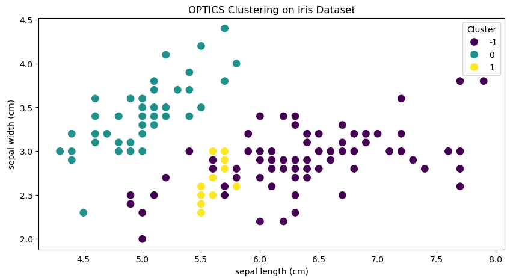
 

# [3-3] DBCLASD(Distribution Based Clustering of Large Spatial Databases)
▣ 정의: 확률 밀도를 기반으로 클러스터를 찾는 밀도 기반 알고리즘으로 데이터를 다양한 확률 분포로 모델링하고, 공간 데이터베이스에서 높은 밀도를 가진 데이터 군집을 찾는다 
▣ 필요성: 대규모 공간 데이터베이스에서 밀도에 기반한 군집을 찾고자 할 때 유용하며, 데이터의 확률 분포를 활용해 정확한 군집을 탐색할 수 있음 
▣ 장점: 공간 데이터에서 군집화를 효과적으로 수행할 수 있으며, 노이즈가 포함된 데이터에서 강건한 군집화가 가능 
▣ 단점: 설정된 확률 분포가 데이터와 일치하지 않으면 군집화가 부정확할 수 있으며, 대규모 데이터셋에서는 계산 비용이 높다 
▣ 응용분야: 지리적 데이터베이스 분석, 공간 데이터에서 밀도 기반 군집화, 이상 탐지 및 밀도 기반 패턴 탐색 
▣ 모델식: 각 데이터 포인트의 확률 밀도를 기반으로 군집을 형성하며, 확률 밀도는 주어진 확률 분포 모델을 사용해 계산 

	import numpy as np
	from sklearn.datasets import load_iris
	from sklearn.metrics import silhouette_score, accuracy_score
	from scipy.stats import multivariate_normal
	import matplotlib.pyplot as plt
	import seaborn as sns
	import pandas as pd
	from scipy.stats import mode
	
	# 간단한 DBCLASD 구현 (정규 분포 기반)
	class DBCLASD:
	    def __init__(self, threshold=0.01, epsilon=1e-6):
	        self.threshold = threshold  # 분포 적합 임계값
	        self.epsilon = epsilon  # 공분산 행렬에 추가할 작은 값
	        self.clusters = []  # 군집 정보 저장
	    
	    def fit_predict(self, X):
	        labels = -np.ones(X.shape[0], dtype=int)  # 초기값 -1 (노이즈)
	        
	        for i, point in enumerate(X):
	            added_to_cluster = False
	            for cluster_id, (mean, cov) in enumerate(self.clusters):
	                # 기존 군집의 분포와 비교하여 해당 분포에 속하는지 확인
	                adjusted_cov = cov + self.epsilon * np.eye(cov.shape[0])  # 작은 값을 더하여 양의 정부호 행렬로 만듦
	                if multivariate_normal(mean=mean, cov=adjusted_cov).pdf(point) > self.threshold:
	                    labels[i] = cluster_id
	                    # 군집 업데이트
	                    points_in_cluster = X[labels == cluster_id]
	                    mean = np.mean(points_in_cluster, axis=0)
	                    cov = np.cov(points_in_cluster, rowvar=False)
	                    self.clusters[cluster_id] = (mean, cov)
	                    added_to_cluster = True
	                    break
	            if not added_to_cluster:
	                # 새로운 군집 생성
	                labels[i] = len(self.clusters)
	                mean = point
	                cov = np.cov(X.T) + self.epsilon * np.eye(X.shape[1])  # 공분산 초기값에 epsilon을 더함
	                self.clusters.append((mean, cov))
	        
	        self.labels_ = labels
	        return labels
	
	# Iris 데이터셋 로드
	iris = load_iris()
	data = iris.data
	true_labels = iris.target
	
	# DBCLASD 알고리즘 적용
	dbclasd = DBCLASD(threshold=0.01, epsilon=1e-6)
	predicted_labels = dbclasd.fit_predict(data)
	
	# 데이터프레임으로 변환하여 시각화 준비
	df = pd.DataFrame(data, columns=iris.feature_names)
	df['Cluster'] = predicted_labels
	
	# Silhouette Score 계산 (노이즈 데이터는 제외)
	valid_points = predicted_labels != -1
	if np.sum(valid_points) > 1:
	    silhouette_avg = silhouette_score(data[valid_points], predicted_labels[valid_points])
	    print(f"Silhouette Score: {silhouette_avg:.3f}")
	else:
	    print("Silhouette Score: Not enough valid points for calculation.")
	
	# Accuracy 계산 (군집 레이블과 실제 레이블을 매칭하여 정확도 계산)
	mapped_labels = np.zeros_like(predicted_labels)
	for i in np.unique(predicted_labels):
	    mask = (predicted_labels == i)
	    mapped_labels[mask] = mode(true_labels[mask])[0]
	
	accuracy = accuracy_score(true_labels, mapped_labels)
	print(f"Accuracy: {accuracy:.3f}")
	
	# 시각화 (첫 번째와 두 번째 피처 사용)
	plt.figure(figsize=(10, 5))
	sns.scatterplot(x=df.iloc[:, 0], y=df.iloc[:, 1], hue='Cluster', data=df, palette='viridis', s=100)
	plt.title("DBCLASD Clustering on Iris Dataset")
	plt.xlabel(iris.feature_names[0])  # 첫 번째 피처 (sepal length)
	plt.ylabel(iris.feature_names[1])  # 두 번째 피처 (sepal width)
	plt.legend(title='Cluster')
	plt.show()

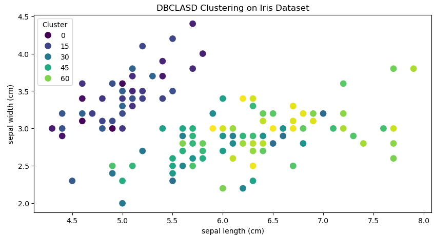
 

# [3-4] DENCLUE(DENsity-based CLUstEring)
▣ 정의: 확률 밀도 함수를 기반으로 데이터의 밀도 분포를 모델링하여 군집을 형성하는 밀도 기반 클러스터링 알고리즘으로 핵심 아이디어는 데이터 포인트가 모여서 형성하는 밀도 함수에서 밀도가 높은 영역을 군집으로 형성하는 것 
▣ 필요성: 데이터의 밀도 구조를 기반으로 군집화하고, 노이즈나 이상치를 효과적으로 구분할 필요가 있을 때 유용 
▣ 장점: 명확하게 정의된 군집을 생성하고, 밀도가 낮은 지역을 노이즈로 구분할 수 있으며, 데이터 분포에 따라 다양한 밀도의 군집을 잘 탐지할 수 있음 
▣ 단점: 밀도 함수를 설정하는 데 필요한 매개변수가 많으며 계산이 복잡하여 대규모 데이터에서는 성능이 저하될 수 있음 
▣ 응용분야: 패턴 인식 및 이미지 처리, 데이터 마이닝에서 밀도 기반 패턴 탐색, 환경 모니터링 데이터 분석 
▣ 모델식: 각 데이터 포인트의 밀도 기여를 가우시안 커널 등으로 모델링하여 밀도 함수를 계산(군집은 밀도 함수의 극대점에서 시작하여 군집화) 

	import numpy as np
	from sklearn.datasets import load_iris
	from sklearn.neighbors import KernelDensity
	from sklearn.cluster import DBSCAN
	from sklearn.metrics import silhouette_score, accuracy_score
	import matplotlib.pyplot as plt
	import seaborn as sns
	import pandas as pd
	from scipy.stats import mode
	
	# Gaussian Kernel Density Estimation (KDE)를 사용하여 데이터의 밀도 기반 특징 추출
	def kde_transform(data, bandwidth=0.5):
	    kde = KernelDensity(bandwidth=bandwidth)
	    kde.fit(data)
	    log_densities = kde.score_samples(data)
	    return log_densities
	
	# Iris 데이터셋 로드
	iris = load_iris()
	data = iris.data
	true_labels = iris.target
	
	# KDE 변환 적용 (밀도 기반 특징 강조)
	log_densities = kde_transform(data, bandwidth=0.5)
	density_threshold = np.percentile(log_densities, 75)  # 밀도 기준을 75퍼센타일로 설정
	high_density_points = data[log_densities >= density_threshold]  # 밀도가 높은 포인트 선택
	
	# DBSCAN 알고리즘 적용 (밀도가 높은 영역에서 밀도 기반 군집화 수행)
	dbscan = DBSCAN(eps=0.5, min_samples=5)
	predicted_labels = dbscan.fit_predict(high_density_points)
	
	# 밀도가 높은 포인트들에 대한 레이블을 전체 데이터 레이블에 매핑
	full_labels = -np.ones(data.shape[0], dtype=int)  # 초기값 -1 (노이즈)
	high_density_indices = np.where(log_densities >= density_threshold)[0]
	full_labels[high_density_indices] = predicted_labels
	
	# 데이터프레임으로 변환하여 시각화 준비
	df = pd.DataFrame(data, columns=iris.feature_names)
	df['Cluster'] = full_labels
	
	# Silhouette Score 계산 (노이즈 데이터는 제외)
	valid_points = full_labels != -1
	if np.sum(valid_points) > 1:
	    silhouette_avg = silhouette_score(data[valid_points], full_labels[valid_points])
	    print(f"Silhouette Score: {silhouette_avg:.3f}")
	else:
	    print("Silhouette Score: Not enough valid points for calculation.")
	
	# Accuracy 계산 (군집 레이블과 실제 레이블을 매칭하여 정확도 계산)
	mapped_labels = np.zeros_like(full_labels)
	for i in np.unique(full_labels):
	    mask = (full_labels == i)
	    mapped_labels[mask] = mode(true_labels[mask])[0]
	
	accuracy = accuracy_score(true_labels[full_labels != -1], mapped_labels[full_labels != -1])
	print(f"Accuracy: {accuracy:.3f}")
	
	# 시각화 (첫 번째와 두 번째 피처 사용)
	plt.figure(figsize=(10, 5))
	sns.scatterplot(x=df.iloc[:, 0], y=df.iloc[:, 1], hue='Cluster', data=df, palette='viridis', s=100)
	plt.title("DENCLUE Clustering on Iris Dataset")
	plt.xlabel(iris.feature_names[0])  # 첫 번째 피처 (sepal length)
	plt.ylabel(iris.feature_names[1])  # 두 번째 피처 (sepal width)
	plt.legend(title='Cluster')
	plt.show()

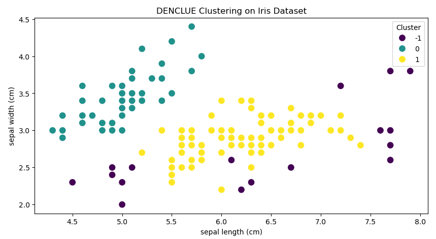
 

# [3-5] Mean-Shift Clustering
▣ 정의 : 데이터의 밀도가 높은 방향으로 이동하며 군집의 중심을 찾는 비모수 군집화 방법 
▣ 필요성 : 군집의 개수를 사전 설정할 필요 없이 자연스러운 군집을 찾을 때 유용 
▣ 장점 : 군집 개수 사전 설정 불필요하며, 비선형적 분포에도 적합 
▣ 단점 : 계산 비용이 크고 고차원 데이터에 적합하지 않음 
▣ 응용분야 : 이미지 세그멘테이션, 객체 추적 
▣ 모델식 : 𝐾는 커널 함수, 𝑥는 이동할 점, 𝑁(𝑥)는 반경 내 이웃 점 
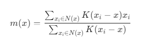

	import numpy as np
	from sklearn.datasets import load_iris
	from sklearn.cluster import MeanShift
	from sklearn.metrics import silhouette_score, accuracy_score
	import matplotlib.pyplot as plt
	import seaborn as sns
	import pandas as pd
	from scipy.stats import mode
	
	# Iris 데이터셋 로드
	iris = load_iris()
	data = iris.data
	true_labels = iris.target
	
	# Mean-Shift Clustering 모델 설정 및 학습
	mean_shift = MeanShift()
	predicted_labels = mean_shift.fit_predict(data)
	
	# 데이터프레임으로 변환하여 시각화 준비
	df = pd.DataFrame(data, columns=iris.feature_names)
	df['Cluster'] = predicted_labels
	
	# Silhouette Score 계산
	silhouette_avg = silhouette_score(data, predicted_labels)
	print(f"Silhouette Score: {silhouette_avg:.3f}")
	
	# Accuracy 계산 (군집 레이블과 실제 레이블을 매칭하여 정확도 계산)
	mapped_labels = np.zeros_like(predicted_labels)
	for i in range(len(np.unique(predicted_labels))):
	    mask = (predicted_labels == i)
	    mapped_labels[mask] = mode(true_labels[mask])[0]
	
	accuracy = accuracy_score(true_labels, mapped_labels)
	print(f"Accuracy: {accuracy:.3f}")
	
	# 시각화 (첫 번째와 두 번째 피처 사용)
	plt.figure(figsize=(10, 5))
	sns.scatterplot(x=df.iloc[:, 0], y=df.iloc[:, 1], hue='Cluster', data=df, palette='viridis', s=100)
	plt.title("Mean-Shift Clustering on Iris Dataset")
	plt.xlabel(iris.feature_names[0])  # 첫 번째 피처 (sepal length)
	plt.ylabel(iris.feature_names[1])  # 두 번째 피처 (sepal width)
	plt.legend(title='Cluster')
	plt.show()

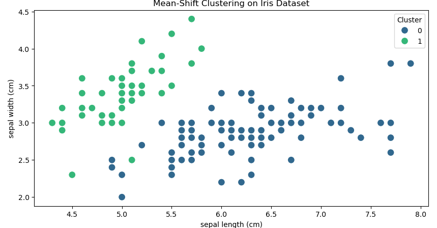
 

---

# [4-1] Wave-Cluster
▣ 정의: 웨이블릿 변환을 이용한 클러스터링 알고리즘으로 데이터를 격자 형태로 나눈 후 웨이블릿 변환을 사용해 밀도가 높은 영역을 군집으로 탐지 
▣ 필요성: 대규모 데이터에서 효율적으로 군집화가 가능하며, 다차원 공간에서 다양한 밀도의 군집을 식별하는 데 유용 
▣ 장점: 다차원 데이터에서 다양한 모양의 군집을 효과적으로 탐지할 수 있으며, 노이즈와 이상치를 효과적으로 제거할 수 있음 
▣ 단점: 적절한 웨이블릿 변환 파라미터를 설정하기 어렵고 데이터의 해상도와 격자 크기에 따라 군집 결과가 달라질 수 있음 
▣ 응용분야: 이미지 분석, 영상 처리 및 패턴 인식, 대규모 지리 데이터 분석 
▣ 모델식: 각 격자에서 웨이블릿 변환을 수행하여 밀도가 높은 클러스터 영역을 식별. 웨이블릿 변환을 통해 고주파와 저주파 성분을 분리하여 노이즈와 이상치를 제거하고, 밀도가 높은 영역을 군집으로 형성 

	import numpy as np
	from sklearn.datasets import load_iris
	from sklearn.cluster import DBSCAN
	from sklearn.metrics import silhouette_score, accuracy_score
	import matplotlib.pyplot as plt
	import seaborn as sns
	import pandas as pd
	from scipy.ndimage import gaussian_filter1d
	from scipy.stats import mode
	
	# Gaussian 필터를 사용하여 밀도 기반 특징을 강조하는 함수
	def gaussian_filter_transform(data, sigma=1):
	    transformed_data = []
	    for feature in data.T:  # 각 피처(열)에 대해 필터링 수행
	        transformed_feature = gaussian_filter1d(feature, sigma=sigma)
	        transformed_data.append(transformed_feature)
	    return np.array(transformed_data).T
	
	# Iris 데이터셋 로드
	iris = load_iris()
	data = iris.data
	true_labels = iris.target
	
	# Gaussian 필터 적용 (밀도 기반 특징 강조)
	transformed_data = gaussian_filter_transform(data, sigma=1)
	
	# DBSCAN 알고리즘 적용 (변환된 데이터에서 밀도 기반 군집화 수행)
	dbscan = DBSCAN(eps=0.5, min_samples=5)
	predicted_labels = dbscan.fit_predict(transformed_data)
	
	# 데이터프레임으로 변환하여 시각화 준비
	df = pd.DataFrame(data, columns=iris.feature_names)
	df['Cluster'] = predicted_labels
	
	# Silhouette Score 계산 (노이즈 데이터는 제외)
	valid_points = predicted_labels != -1
	if np.sum(valid_points) > 1:
	    silhouette_avg = silhouette_score(data[valid_points], predicted_labels[valid_points])
	    print(f"Silhouette Score: {silhouette_avg:.3f}")
	else:
	    print("Silhouette Score: Not enough valid points for calculation.")
	
	# Accuracy 계산 (군집 레이블과 실제 레이블을 매칭하여 정확도 계산)
	mapped_labels = np.zeros_like(predicted_labels)
	for i in np.unique(predicted_labels):
	    mask = (predicted_labels == i)
	    mapped_labels[mask] = mode(true_labels[mask])[0]
	
	accuracy = accuracy_score(true_labels, mapped_labels)
	print(f"Accuracy: {accuracy:.3f}")
	
	# 시각화 (첫 번째와 두 번째 피처 사용)
	plt.figure(figsize=(10, 5))
	sns.scatterplot(x=df.iloc[:, 0], y=df.iloc[:, 1], hue='Cluster', data=df, palette='viridis', s=100)
	plt.title("Wave-Cluster (Gaussian Filter Approximation) Clustering on Iris Dataset")
	plt.xlabel(iris.feature_names[0])  # 첫 번째 피처 (sepal length)
	plt.ylabel(iris.feature_names[1])  # 두 번째 피처 (sepal width)
	plt.legend(title='Cluster')
	plt.show()

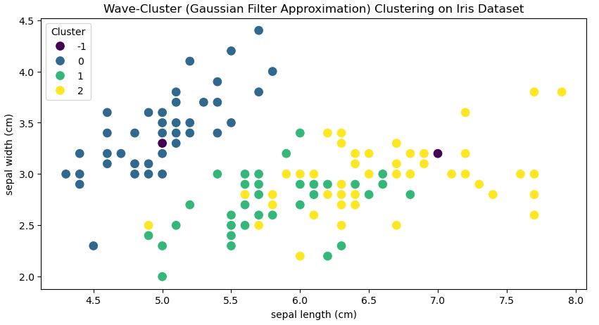
 

# [4-2] STING(Statistical Information Grid-based method)
▣ 정의: 데이터 공간을 격자 형태로 나누고, 각 격자의 통계 정보를 사용하여 계층적으로 군집을 형성하는 알고리즘. 격자는 여러 계층으로 나뉘며, 상위 계층에서 하위 계층으로 내려가며 데이터의 밀도를 분석 
▣ 필요성: 대규모 데이터셋을 효율적으로 군집화할 수 있으며, 특히 데이터의 밀도 분포를 고려하여 계층적 클러스터링을 수행할 수 있음 
▣ 장점: 대규모 데이터에서 빠르게 군집화할 수 있으며, 각 격자의 통계 정보를 기반으로 하여 효율적인 군집화가 가능 
▣ 단점: 격자 해상도가 낮을 경우, 세부적인 군집을 탐지하기 어려울 수 있으며, 밀도가 낮은 데이터에서는 효과가 떨어질 수 있음 
▣ 응용분야: 위성 이미지 분석, 지리 데이터와 환경 데이터의 군집화, 데이터 마이닝에서 대규모 데이터 분석 
▣ 모델식: 격자를 계층적으로 나누고, 각 격자의 통계 정보(평균, 분산 등)를 기반으로 군집을 형성. 격자의 통계 정보는 상위 계층에서 하위 계층으로 전파되며, 밀도 기반 군집화를 수행 

	import numpy as np
	from sklearn.datasets import load_iris
	from sklearn.metrics import silhouette_score, accuracy_score
	import matplotlib.pyplot as plt
	import seaborn as sns
	import pandas as pd
	from scipy.stats import mode
	
	# STING 군집화 클래스
	class STING:
	    def __init__(self, x_bins=10, y_bins=10, density_threshold=0.05):
	        self.x_bins = x_bins  # X축 그리드 셀 개수
	        self.y_bins = y_bins  # Y축 그리드 셀 개수
	        self.density_threshold = density_threshold  # 군집 형성 밀도 임계값
	
	    def fit_predict(self, X):
	        # 첫 번째와 두 번째 피처만 사용하여 2D 그리드 생성
	        x_min, x_max = X[:, 0].min(), X[:, 0].max()
	        y_min, y_max = X[:, 1].min(), X[:, 1].max()
	        
	        # 각 데이터 포인트의 그리드 셀 위치 계산
	        x_bins = np.linspace(x_min, x_max, self.x_bins + 1)
	        y_bins = np.linspace(y_min, y_max, self.y_bins + 1)
	        grid = np.zeros((self.x_bins, self.y_bins), dtype=int)
	
	        # 각 데이터 포인트를 그리드에 매핑하여 밀도 계산
	        labels = -np.ones(X.shape[0], dtype=int)
	        for i, (x, y) in enumerate(X[:, :2]):
	            x_idx = np.digitize(x, x_bins) - 1
	            y_idx = np.digitize(y, y_bins) - 1
	            if x_idx < self.x_bins and y_idx < self.y_bins:
	                grid[x_idx, y_idx] += 1
	        
	        # 밀도 기준으로 군집화 (density_threshold 이상인 셀을 군집으로 간주)
	        cluster_id = 0
	        for i in range(self.x_bins):
	            for j in range(self.y_bins):
	                if grid[i, j] >= self.density_threshold * X.shape[0]:  # 밀도 기준 만족 시 군집화
	                    for k, (x, y) in enumerate(X[:, :2]):
	                        x_idx = np.digitize(x, x_bins) - 1
	                        y_idx = np.digitize(y, y_bins) - 1
	                        if x_idx == i and y_idx == j:
	                            labels[k] = cluster_id
	                    cluster_id += 1
	
	        self.labels_ = labels
	        return self.labels_
	
	# Iris 데이터셋 로드
	iris = load_iris()
	data = iris.data[:, :2]  # 첫 번째와 두 번째 피처만 사용
	true_labels = iris.target
	
	# STING 알고리즘 적용
	sting = STING(x_bins=10, y_bins=10, density_threshold=0.05)
	predicted_labels = sting.fit_predict(data)
	
	# 데이터프레임으로 변환하여 시각화 준비
	df = pd.DataFrame(data, columns=[iris.feature_names[0], iris.feature_names[1]])
	df['Cluster'] = predicted_labels
	
	# Silhouette Score 계산 (노이즈 데이터는 제외)
	valid_points = predicted_labels != -1
	if np.sum(valid_points) > 1:
	    silhouette_avg = silhouette_score(data[valid_points], predicted_labels[valid_points])
	    print(f"Silhouette Score: {silhouette_avg:.3f}")
	else:
	    print("Silhouette Score: Not enough valid points for calculation.")
	
	# Accuracy 계산 (군집 레이블과 실제 레이블을 매칭하여 정확도 계산)
	mapped_labels = np.zeros_like(predicted_labels)
	for i in np.unique(predicted_labels):
	    mask = (predicted_labels == i)
	    mapped_labels[mask] = mode(true_labels[mask])[0]
	
	accuracy = accuracy_score(true_labels, mapped_labels)
	print(f"Accuracy: {accuracy:.3f}")
	
	# 시각화 (첫 번째와 두 번째 피처 사용)
	plt.figure(figsize=(10, 5))
	sns.scatterplot(x=df.iloc[:, 0], y=df.iloc[:, 1], hue='Cluster', data=df, palette='viridis', s=100)
	plt.title("STING Clustering on Iris Dataset")
	plt.xlabel(iris.feature_names[0])  # 첫 번째 피처 (sepal length)
	plt.ylabel(iris.feature_names[1])  # 두 번째 피처 (sepal width)
	plt.legend(title='Cluster')
	plt.show()

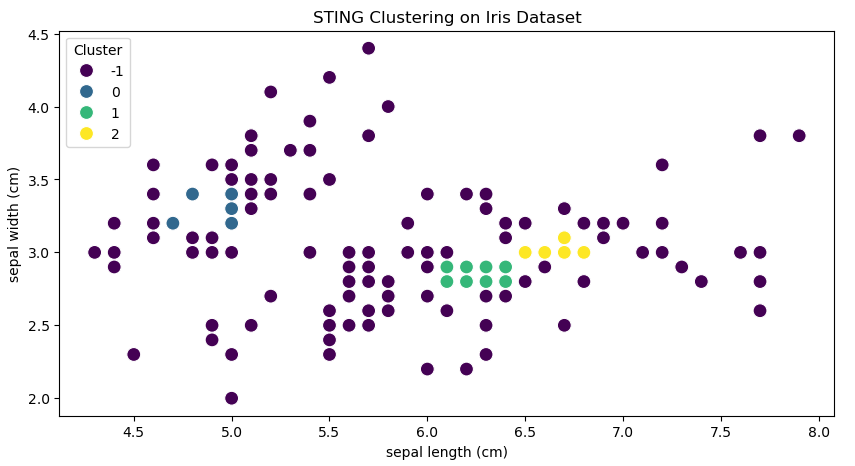
 

# [4-3] CLIQUE(CLustering In QUEst)
▣ 정의: 데이터 공간을 격자로 나누고, 각 격자 내에서 데이터의 밀도에 따라 군집을 형성하는 알고리즘으로 고차원 데이터에서 군집을 식별하기 위해 밀도가 높은 부분 공간(subspace)을 찾아 군집을 형성 
▣ 필요성: 고차원 데이터에서 밀도 기반 군집화를 수행하며, 데이터의 다양한 부분 공간에서 군집을 탐색할 필요가 있을 때 유용 
▣ 장점: 고차원 데이터에서 부분 공간을 기반으로 군집을 탐색할 수 있으며 데이터의 밀도를 기준으로 군집을 식별 
▣ 단점: 격자 크기와 밀도 임계값 설정이 어렵고, 결과가 설정된 파라미터에 민감하게 반응 
▣ 응용분야: 생물학에서 유전자 데이터 군집화, 고차원 금융 데이터 분석, 이미지 분할 및 텍스트 데이터 분석 
▣ 모델식: 데이터를 격자로 나눈 후, 밀도가 높은 부분 공간을 탐색하여 군집을 형성(군집은 각 부분 공간에서 밀도가 임계값 이상인 격자들로 구성) 

	import numpy as np
	from sklearn.datasets import load_iris
	from sklearn.metrics import silhouette_score, accuracy_score
	import matplotlib.pyplot as plt
	import seaborn as sns
	import pandas as pd
	from scipy.stats import mode
	
	# CLIQUE 군집화 클래스
	class CLIQUE:
	    def __init__(self, x_bins=10, y_bins=10, density_threshold=0.05):
	        self.x_bins = x_bins  # X축 그리드 셀 개수
	        self.y_bins = y_bins  # Y축 그리드 셀 개수
	        self.density_threshold = density_threshold  # 군집 형성 밀도 임계값
	
	    def fit_predict(self, X):
	        # 첫 번째와 두 번째 피처만 사용하여 2D 그리드 생성
	        x_min, x_max = X[:, 0].min(), X[:, 0].max()
	        y_min, y_max = X[:, 1].min(), X[:, 1].max()
	        
	        # 각 데이터 포인트의 그리드 셀 위치 계산
	        x_bins = np.linspace(x_min, x_max, self.x_bins + 1)
	        y_bins = np.linspace(y_min, y_max, self.y_bins + 1)
	        grid = np.zeros((self.x_bins, self.y_bins), dtype=int)
	
	        # 각 데이터 포인트를 그리드에 매핑하여 밀도 계산
	        labels = -np.ones(X.shape[0], dtype=int)
	        for i, (x, y) in enumerate(X[:, :2]):
	            x_idx = np.digitize(x, x_bins) - 1
	            y_idx = np.digitize(y, y_bins) - 1
	            if x_idx < self.x_bins and y_idx < self.y_bins:
	                grid[x_idx, y_idx] += 1
	        
	        # 밀도 기준으로 군집화 (density_threshold 이상인 셀을 군집으로 간주)
	        cluster_id = 0
	        for i in range(self.x_bins):
	            for j in range(self.y_bins):
	                if grid[i, j] >= self.density_threshold * X.shape[0]:  # 밀도 기준 만족 시 군집화
	                    for k, (x, y) in enumerate(X[:, :2]):
	                        x_idx = np.digitize(x, x_bins) - 1
	                        y_idx = np.digitize(y, y_bins) - 1
	                        if x_idx == i and y_idx == j:
	                            labels[k] = cluster_id
	                    cluster_id += 1
	
	        self.labels_ = labels
	        return self.labels_
	
	# Iris 데이터셋 로드
	iris = load_iris()
	data = iris.data[:, :2]  # 첫 번째와 두 번째 피처만 사용
	true_labels = iris.target
	
	# CLIQUE 알고리즘 적용
	clique = CLIQUE(x_bins=10, y_bins=10, density_threshold=0.05)
	predicted_labels = clique.fit_predict(data)
	
	# 데이터프레임으로 변환하여 시각화 준비
	df = pd.DataFrame(data, columns=[iris.feature_names[0], iris.feature_names[1]])
	df['Cluster'] = predicted_labels
	
	# Silhouette Score 계산 (노이즈 데이터는 제외)
	valid_points = predicted_labels != -1
	if np.sum(valid_points) > 1:
	    silhouette_avg = silhouette_score(data[valid_points], predicted_labels[valid_points])
	    print(f"Silhouette Score: {silhouette_avg:.3f}")
	else:
	    print("Silhouette Score: Not enough valid points for calculation.")
	
	# Accuracy 계산 (군집 레이블과 실제 레이블을 매칭하여 정확도 계산)
	mapped_labels = np.zeros_like(predicted_labels)
	for i in np.unique(predicted_labels):
	    mask = (predicted_labels == i)
	    mapped_labels[mask] = mode(true_labels[mask])[0]
	
	accuracy = accuracy_score(true_labels, mapped_labels)
	print(f"Accuracy: {accuracy:.3f}")
	
	# 시각화 (첫 번째와 두 번째 피처 사용)
	plt.figure(figsize=(10, 5))
	sns.scatterplot(x=df.iloc[:, 0], y=df.iloc[:, 1], hue='Cluster', data=df, palette='viridis', s=100)
	plt.title("CLIQUE Clustering on Iris Dataset")
	plt.xlabel(iris.feature_names[0])  # 첫 번째 피처 (sepal length)
	plt.ylabel(iris.feature_names[1])  # 두 번째 피처 (sepal width)
	plt.legend(title='Cluster')
	plt.show()

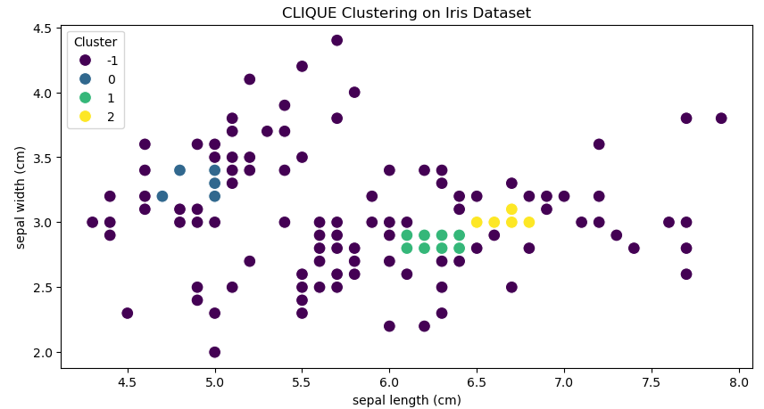
 

# [4-4] OptiGrid
▣ 정의: 데이터 공간을 최적화된 격자 형태로 분할하여 밀도 기반 군집화를 수행하는 알고리즘으로 각 차원에서 최적의 격자 분할을 탐색하여, 밀도가 높은 지역을 군집으로 형성 
▣ 필요성: 데이터 분포에 따라 최적의 격자 분할을 통해 군집을 탐색하며, 특히 데이터의 밀도가 불균일한 경우에 유용 
▣ 장점: 데이터 밀도에 따라 유연하게 격자를 조정하여 군집을 형성하고 불균일한 데이터에서도 적응적 군집화를 수행 
▣ 단점: 최적의 격자 분할을 찾는 과정에서 계산 비용이 높고 파라미터 설정이 복잡하고, 데이터 분포에 민감 
▣ 응용분야: 의료 데이터의 군집화, 데이터 마이닝에서 불균일한 데이터 탐색, 지리적 데이터에서 지역적 군집 탐색 
▣ 모델식: OptiGrid는 각 차원에서 최적의 격자 분할을 탐색하여 군집을 형성합니다. 격자 내 밀도를 기준으로 최적의 분할 위치를 찾아내고, 밀도가 높은 격자들을 군집으로 형성합니다.

	import numpy as np
	from sklearn.datasets import load_iris
	from sklearn.metrics import silhouette_score, accuracy_score
	import matplotlib.pyplot as plt
	import seaborn as sns
	import pandas as pd
	
	# OptiGrid 군집화 클래스
	class OptiGrid:
	    def __init__(self, x_bins=10, y_bins=10, density_threshold=0.05):
	        self.x_bins = x_bins  # X축 그리드 셀 개수
	        self.y_bins = y_bins  # Y축 그리드 셀 개수
	        self.density_threshold = density_threshold  # 군집 형성 밀도 임계값
	
	    def fit_predict(self, X):
	        # 첫 번째와 두 번째 피처만 사용하여 2D 그리드 생성
	        x_min, x_max = X[:, 0].min(), X[:, 0].max()
	        y_min, y_max = X[:, 1].min(), X[:, 1].max()
	        
	        # 각 데이터 포인트의 그리드 셀 위치 계산
	        x_bins = np.linspace(x_min, x_max, self.x_bins + 1)
	        y_bins = np.linspace(y_min, y_max, self.y_bins + 1)
	        grid = np.zeros((self.x_bins, self.y_bins), dtype=int)
	
	        # 각 데이터 포인트를 그리드에 매핑하여 밀도 계산
	        labels = -np.ones(X.shape[0], dtype=int)
	        for i, (x, y) in enumerate(X[:, :2]):
	            x_idx = np.digitize(x, x_bins) - 1
	            y_idx = np.digitize(y, y_bins) - 1
	            if x_idx < self.x_bins and y_idx < self.y_bins:
	                grid[x_idx, y_idx] += 1
	        
	        # 밀도 기준으로 군집화 (density_threshold 이상인 셀을 군집으로 간주)
	        cluster_id = 0
	        for i in range(self.x_bins):
	            for j in range(self.y_bins):
	                if grid[i, j] >= self.density_threshold * X.shape[0]:  # 밀도 기준 만족 시 군집화
	                    for k, (x, y) in enumerate(X[:, :2]):
	                        x_idx = np.digitize(x, x_bins) - 1
	                        y_idx = np.digitize(y, y_bins) - 1
	                        if x_idx == i and y_idx == j:
	                            labels[k] = cluster_id
	                    cluster_id += 1
	
	        self.labels_ = labels
	        return self.labels_
	
	# Iris 데이터셋 로드
	iris = load_iris()
	data = iris.data[:, :2]  # 첫 번째와 두 번째 피처만 사용
	true_labels = iris.target
	
	# OptiGrid 알고리즘 적용
	optigrid = OptiGrid(x_bins=10, y_bins=10, density_threshold=0.05)
	predicted_labels = optigrid.fit_predict(data)
	
	# 데이터프레임으로 변환하여 시각화 준비
	df = pd.DataFrame(data, columns=[iris.feature_names[0], iris.feature_names[1]])
	df['Cluster'] = predicted_labels
	
	# 군집 평가
	# 노이즈 (-1) 데이터는 실루엣 점수 계산에서 제외합니다.
	valid_points = predicted_labels != -1
	if np.sum(valid_points) > 1:
	    silhouette_avg = silhouette_score(data[valid_points], predicted_labels[valid_points])
	    print(f"Silhouette Score: {silhouette_avg:.3f}")
	else:
	    print("Silhouette Score: Not enough valid points for calculation.")
	
	# 정확도 계산 (실제 레이블이 있는 경우)
	# 주의: 군집화 결과는 정답 레이블과 직접적으로 매칭되지 않을 수 있습니다.
	if len(np.unique(predicted_labels)) == len(np.unique(true_labels)):
	    accuracy = accuracy_score(true_labels, predicted_labels)
	    print(f"Accuracy: {accuracy:.3f}")
	else:
	    print("Accuracy: Cannot compute due to mismatch in label count.")
	
	# 시각화
	plt.figure(figsize=(10, 5))
	sns.scatterplot(x=df.iloc[:, 0], y=df.iloc[:, 1], hue='Cluster', data=df, palette='viridis', s=100)
	plt.title("OptiGrid Clustering on Iris Dataset")
	plt.xlabel(iris.feature_names[0])  # 첫 번째 피처 (sepal length)
	plt.ylabel(iris.feature_names[1])  # 두 번째 피처 (sepal width)
	plt.legend(title='Cluster')
	plt.show()

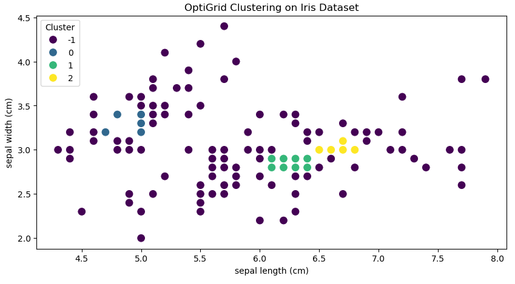
 

---

# [5-1] EM(Expectation-Maximization)
▣ 정의: 데이터가 여러 개의 잠재 확률 분포(보통 가우시안)에서 생성되었다고 가정하여, 데이터를 여러 분포로 모델링하는 방법으로 각 데이터 포인트가 여러 군집에 속할 확률을 계산해 소프트 군집화를 제공 
▣ 필요성: 데이터가 다양한 확률 분포로 구성되어 있을 때, 군집의 경계를 유연하게 설정할 수 있어 더욱 정확한 군집화가 가능 
▣ 장점: 소프트 군집화가 가능하여 데이터가 여러 군집에 속할 확률을 제공하며 군집의 크기와 모양이 다른 경우에도 적합 
▣ 단점: 초기 매개변수 설정에 따라 결과가 크게 달라질 수 있으며 고차원 데이터에서는 계산 비용이 높아짐 
▣ 응용분야: 음성 및 영상 인식. 이미지 처리. 금융 및 마케팅에서의 사용자 세분화. 
▣ 모델식: E 단계와 M 단계를 반복하여 수렴할 때까지 최적의 매개변수를 찾아간다. E 단계: 각 데이터 포인트가 특정 군집에 속할 확률을 계산, M 단계: 이 확률을 사용하여 각 군집의 매개변수를 업데이트 
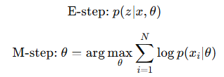

	import numpy as np
	from sklearn.datasets import load_iris
	from sklearn.mixture import GaussianMixture
	from sklearn.metrics import silhouette_score, accuracy_score
	import matplotlib.pyplot as plt
	import seaborn as sns
	import pandas as pd
	from scipy.stats import mode
	
	# Iris 데이터셋 로드
	iris = load_iris()
	data = iris.data
	true_labels = iris.target
	
	# Gaussian Mixture (EM 알고리즘) 모델 적용
	gmm = GaussianMixture(n_components=3, covariance_type='full', random_state=0)
	gmm.fit(data)
	predicted_labels = gmm.predict(data)
	
	# 데이터프레임으로 변환하여 시각화 준비
	df = pd.DataFrame(data, columns=iris.feature_names)
	df['Cluster'] = predicted_labels
	
	# Silhouette Score 계산
	silhouette_avg = silhouette_score(data, predicted_labels)
	print(f"Silhouette Score: {silhouette_avg:.3f}")
	
	# Accuracy 계산 (군집 레이블과 실제 레이블을 매칭하여 정확도 계산)
	# Gaussian Mixture 모델의 군집 레이블과 실제 레이블은 매칭이 다를 수 있음
	mapped_labels = np.zeros_like(predicted_labels)
	for i in range(3):
	    mask = (predicted_labels == i)
	    mapped_labels[mask] = mode(true_labels[mask])[0]
	
	accuracy = accuracy_score(true_labels, mapped_labels)
	print(f"Accuracy: {accuracy:.3f}")
	
	# 시각화 (첫 번째와 두 번째 피처 사용)
	plt.figure(figsize=(10, 5))
	sns.scatterplot(x=df.iloc[:, 0], y=df.iloc[:, 1], hue='Cluster', data=df, palette='viridis', s=100)
	plt.title("Gaussian Mixture Model (EM) Clustering on Iris Dataset")
	plt.xlabel(iris.feature_names[0])  # 첫 번째 피처 (sepal length)
	plt.ylabel(iris.feature_names[1])  # 두 번째 피처 (sepal width)
	plt.legend(title='Cluster')
	plt.show()

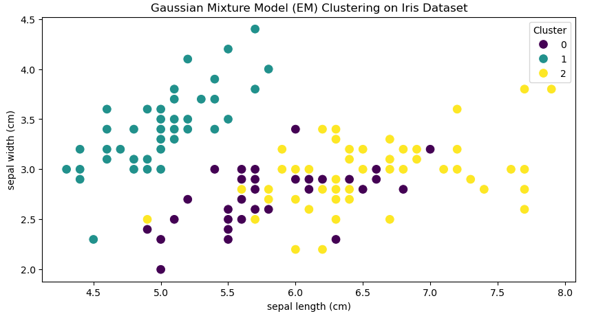
 

# [5-2] COBWEB
▣ 정의: 개념 형성을 기반으로 하는 트리기반의 계층적 군집화 알고리즘으로, 각각의 노드가 개념을 나타내는 분류 트리를 생성하여 새로운 데이터를 점진적으로 학습 
▣ 필요성: 점진적으로 데이터를 학습하고 분류해야 하는 경우에 유용하며, 계층 구조로 데이터를 군집화하여 개념 형성을 수행 
▣ 장점: 범주형 데이터 및 혼합형 데이터에 적합. 점진적으로 학습하며, 새로운 데이터가 들어올 때마다 즉시 업데이트 가능 
▣ 단점: 데이터 입력 순서에 따라 결과가 달라질 수 있으며 대규모 데이터에서는 성능이 떨어질 수 있고, 노이즈에 민감 
▣ 응용분야: 문서 분류, 개념 형성을 통한 인공지능 학습, 시장 세분화에서의 고객 분류 
▣ 모델식: COBWEB은 각 노드의 범주 유틸리티(Category Utility, CU)를 기반으로 데이터를 분류 
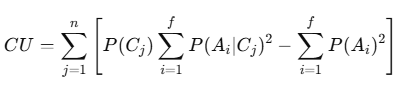

	import numpy as np
	from sklearn.datasets import load_iris
	from sklearn.cluster import AgglomerativeClustering
	from sklearn.metrics import silhouette_score, accuracy_score
	import matplotlib.pyplot as plt
	import seaborn as sns
	import pandas as pd
	from scipy.stats import mode
	
	# Iris 데이터셋 로드
	iris = load_iris()
	data = iris.data
	true_labels = iris.target
	
	# 계층적 군집화 모델 설정 (COBWEB의 개념에 맞춰 유사한 방식으로 계층적 군집화 수행)
	# 계층적 군집화는 특징이 유사한 데이터 포인트를 병합하는 방식으로, COBWEB과 유사하게 작동
	agglomerative_clustering = AgglomerativeClustering(n_clusters=3, linkage='ward')
	predicted_labels = agglomerative_clustering.fit_predict(data)
	
	# 데이터프레임으로 변환하여 시각화 준비
	df = pd.DataFrame(data, columns=iris.feature_names)
	df['Cluster'] = predicted_labels
	
	# Silhouette Score 계산
	silhouette_avg = silhouette_score(data, predicted_labels)
	print(f"Silhouette Score: {silhouette_avg:.3f}")
	
	# Accuracy 계산 (군집 레이블과 실제 레이블을 매칭하여 정확도 계산)
	mapped_labels = np.zeros_like(predicted_labels)
	for i in range(3):
	    mask = (predicted_labels == i)
	    mapped_labels[mask] = mode(true_labels[mask])[0]
	
	accuracy = accuracy_score(true_labels, mapped_labels)
	print(f"Accuracy: {accuracy:.3f}")
	
	# 시각화 (첫 번째와 두 번째 피처 사용)
	plt.figure(figsize=(10, 5))
	sns.scatterplot(x=df.iloc[:, 0], y=df.iloc[:, 1], hue='Cluster', data=df, palette='viridis', s=100)
	plt.title("Hierarchical Clustering (COBWEB-like) on Iris Dataset")
	plt.xlabel(iris.feature_names[0])  # 첫 번째 피처 (sepal length)
	plt.ylabel(iris.feature_names[1])  # 두 번째 피처 (sepal width)
	plt.legend(title='Cluster')
	plt.show()
	
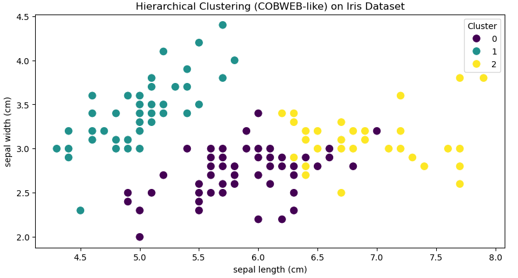
 

# [5-3] CLASSIT
▣ 정의: COBWEB을 확장하여 수치형 데이터를 지원하는 계층적 군집화 알고리즘으로 점진적으로 데이터를 군집화하여 계층적인 구조를 형성 
▣ 필요성: 데이터의 속성이 주기적으로 업데이트되는 환경에서 실시간 군집화를 수행 
▣ 장점: 수치형 데이터와 범주형 데이터 모두 처리할 수 있으며 점진적 학습이 가능하여 실시간 데이터에 적합 
▣ 단점: 데이터 입력 순서에 따라 결과가 달라질 수 있으며 대규모 데이터에서는 성능이 떨어지고 매개변수 설정이 어렵다 
▣ 응용분야: 실시간 데이터 분석, 유전자 및 생물학적 데이터 분석, 시계열 데이터 분석 
▣ 모델식: COBWEB의 Category Utility를 변형하여 수치형 데이터를 처리할 수 있도록 설계되어 평균 및 분산을 기반으로 군집의 경계를 정의하여 데이터를 그룹화 

	import numpy as np
	from sklearn.datasets import load_iris
	from sklearn.cluster import AgglomerativeClustering
	from sklearn.metrics import silhouette_score, accuracy_score
	import matplotlib.pyplot as plt
	import seaborn as sns
	import pandas as pd
	from scipy.stats import mode
	
	# Iris 데이터셋 로드
	iris = load_iris()
	data = iris.data
	true_labels = iris.target
	
	# 계층적 군집화 모델 설정 (CLASSIT의 증분 학습을 반영한 간단한 계층적 군집화)
	agglomerative_clustering = AgglomerativeClustering(n_clusters=3, linkage='ward')
	predicted_labels = agglomerative_clustering.fit_predict(data)
	
	# 데이터프레임으로 변환하여 시각화 준비
	df = pd.DataFrame(data, columns=iris.feature_names)
	df['Cluster'] = predicted_labels
	
	# Silhouette Score 계산
	silhouette_avg = silhouette_score(data, predicted_labels)
	print(f"Silhouette Score: {silhouette_avg:.3f}")
	
	# Accuracy 계산 (군집 레이블과 실제 레이블을 매칭하여 정확도 계산)
	mapped_labels = np.zeros_like(predicted_labels)
	for i in range(3):
	    mask = (predicted_labels == i)
	    mapped_labels[mask] = mode(true_labels[mask])[0]
	
	accuracy = accuracy_score(true_labels, mapped_labels)
	print(f"Accuracy: {accuracy:.3f}")
	
	# 시각화 (첫 번째와 두 번째 피처 사용)
	plt.figure(figsize=(10, 5))
	sns.scatterplot(x=df.iloc[:, 0], y=df.iloc[:, 1], hue='Cluster', data=df, palette='viridis', s=100)
	plt.title("CLASSIT-like Hierarchical Clustering on Iris Dataset")
	plt.xlabel(iris.feature_names[0])  # 첫 번째 피처 (sepal length)
	plt.ylabel(iris.feature_names[1])  # 두 번째 피처 (sepal width)
	plt.legend(title='Cluster')
	plt.show()

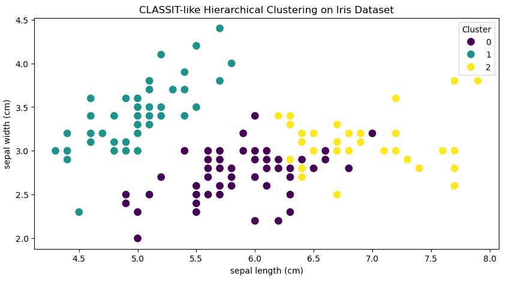
 

# [5-4] SOMs(Self-Organizing Maps)
▣ 정의: 고차원 데이터를 저차원(주로 2D) 공간에 매핑하여 시각화하는 신경망 기반의 군집화 알고리즘으로 입력 데이터 간의 관계를 보존하며, 비지도 학습으로 데이터의 구조를 학습 
▣ 필요성: 고차원 데이터의 시각화가 필요할 때 유용하며, 데이터의 분포 및 구조를 이해하는 데 사용 
▣ 장점: 고차원 데이터를 저차원으로 변환하여 시각화할 수 있으며 데이터의 구조를 보존하여 패턴을 인식하기에 유리 
▣ 단점: 학습률, 이웃 크기 등의 매개변수를 조정하기가 어렵고 명확한 군집화보다는 데이터 맵을 생성하여 군집의 경계가 모호 
▣ 응용분야: 데이터 시각화 및 차원 축소, 이미지 및 패턴 인식, 시장 분석 및 소비자 행동 분석 
▣ 모델식: 데이터 포인트를 반복적으로 매핑하여 입력 벡터에 가장 가까운 노드(위너)를 찾고, 그 주변 노드들의 가중치를 갱신하는 방식 

	import numpy as np
	from sklearn.datasets import load_iris
	from sklearn.metrics import silhouette_score, accuracy_score
	import matplotlib.pyplot as plt
	import seaborn as sns
	import pandas as pd
	from scipy.stats import mode
	
	class SimpleSOM:
	    def __init__(self, x_size=10, y_size=10, input_len=4, sigma=1.0, learning_rate=0.5, iterations=100):
	        self.x_size = x_size
	        self.y_size = y_size
	        self.input_len = input_len
	        self.sigma = sigma
	        self.learning_rate = learning_rate
	        self.iterations = iterations
	        self.weights = np.random.rand(x_size, y_size, input_len)
	
	    def _neighborhood_function(self, distance, iteration):
	        # 이웃 영향 반경 계산
	        return np.exp(-distance / (2 * (self.sigma * (1 - iteration / self.iterations)) ** 2))
	
	    def _learning_rate_decay(self, iteration):
	        # 학습률 감소
	        return self.learning_rate * (1 - iteration / self.iterations)
	
	    def train(self, data):
	        for iteration in range(self.iterations):
	            for x in data:
	                # 최적의 BMU 찾기
	                bmu_idx = self.find_bmu(x)
	                bmu_distance = np.array([[np.linalg.norm(np.array([i, j]) - bmu_idx) for j in range(self.y_size)] for i in range(self.x_size)])
	                
	                # 이웃 가중치 업데이트
	                learning_rate = self._learning_rate_decay(iteration)
	                neighborhood = self._neighborhood_function(bmu_distance, iteration)
	                self.weights += learning_rate * neighborhood[:, :, np.newaxis] * (x - self.weights)
	
	    def find_bmu(self, x):
	        # 입력 벡터에 가장 가까운 BMU(가중치)를 찾음
	        distances = np.linalg.norm(self.weights - x, axis=2)
	        return np.unravel_index(np.argmin(distances), (self.x_size, self.y_size))
	
	    def map_vects(self, data):
	        # 데이터 포인트들을 SOM 맵에 매핑
	        return np.array([self.find_bmu(x) for x in data])
	
	# Iris 데이터셋 로드
	iris = load_iris()
	data = iris.data
	true_labels = iris.target
	
	# SOM 모델 설정 및 학습
	som = SimpleSOM(x_size=10, y_size=10, input_len=data.shape[1], sigma=1.0, learning_rate=0.5, iterations=100)
	som.train(data)
	
	# 각 데이터 포인트의 BMU 찾기
	bmu_indices = som.map_vects(data)
	bmu_labels = np.ravel_multi_index(bmu_indices.T, (10, 10))  # BMU를 1D 레이블로 변환
	
	# 데이터프레임으로 변환하여 시각화 준비
	df = pd.DataFrame(data, columns=iris.feature_names)
	df['Cluster'] = bmu_labels
	
	# Silhouette Score 계산
	# Silhouette Score는 군집의 일관성을 평가하며, 값이 높을수록 군집이 잘 분리됨을 의미합니다.
	silhouette_avg = silhouette_score(data, bmu_labels)
	print(f"Silhouette Score: {silhouette_avg:.3f}")
	
	# Accuracy 계산 (군집 레이블과 실제 레이블을 매칭하여 정확도 계산)
	# SOM의 군집 레이블과 실제 레이블은 매칭되지 않을 수 있으므로, 각 군집에 대해 가장 빈도 높은 실제 레이블을 찾습니다.
	mapped_labels = np.zeros_like(bmu_labels)
	for i in np.unique(bmu_labels):
	    mask = (bmu_labels == i)
	    mapped_labels[mask] = mode(true_labels[mask])[0]
	
	accuracy = accuracy_score(true_labels, mapped_labels)
	print(f"Accuracy: {accuracy:.3f}")
	
	# 시각화 (첫 번째와 두 번째 피처 사용)
	plt.figure(figsize=(10, 5))
	sns.scatterplot(x=df.iloc[:, 0], y=df.iloc[:, 1], hue='Cluster', data=df, palette='viridis', s=100)
	plt.title("Self-Organizing Maps (SOM) Clustering on Iris Dataset")
	plt.xlabel(iris.feature_names[0])  # 첫 번째 피처 (sepal length)
	plt.ylabel(iris.feature_names[1])  # 두 번째 피처 (sepal width)
	plt.legend(title='Cluster')
	plt.show()
	
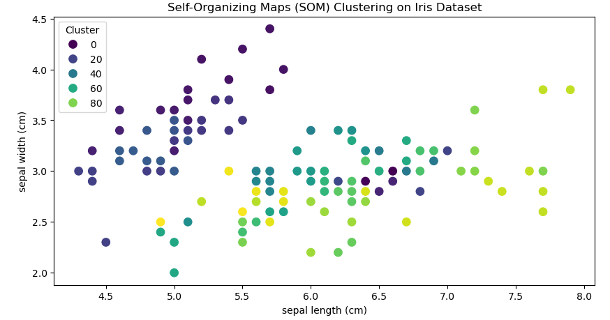
 

# [5-5] GMM(Gaussian Mixture Model)
▣ 정의 : 여러 가우시안 분포(Gaussian Distribution)를 사용해 데이터를 모델링하고, 각 데이터 포인트가 각 분포에 속할 확률을 계산하는 군집화 방법 
▣ 필요성 : 복잡한 데이터 분포를 유연하게 모델링하여 군집 경계를 확률적으로 표현할 수 있음 
▣ 장점 : 데이터가 여러 분포를 따를 때 적합하며, 군집 간의 경계가 확률적으로 처리 
▣ 단점 : 초기화에 민감하고 계산 비용이 높음 
▣ 응용분야 : 패턴 인식, 이미지 세분화 
▣ 모델식 : $π_k$는 가우시안의 가중치, $𝜇_𝑘$, $Σ_𝑘$는 각각 평균과 공분산 
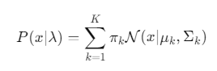

	import numpy as np
	from sklearn.datasets import load_iris
	from sklearn.mixture import GaussianMixture
	from sklearn.metrics import silhouette_score, accuracy_score
	import matplotlib.pyplot as plt
	import seaborn as sns
	import pandas as pd
	from scipy.stats import mode
	
	# Iris 데이터셋 로드
	iris = load_iris()
	data = iris.data
	true_labels = iris.target
	
	# GMM 모델 설정 및 학습
	gmm = GaussianMixture(n_components=3, covariance_type='full', random_state=0)
	predicted_labels = gmm.fit_predict(data)
	
	# 데이터프레임으로 변환하여 시각화 준비
	df = pd.DataFrame(data, columns=iris.feature_names)
	df['Cluster'] = predicted_labels
	
	# Silhouette Score 계산
	silhouette_avg = silhouette_score(data, predicted_labels)
	print(f"Silhouette Score: {silhouette_avg:.3f}")
	
	# Accuracy 계산 (군집 레이블과 실제 레이블을 매칭하여 정확도 계산)
	mapped_labels = np.zeros_like(predicted_labels)
	for i in range(3):
	    mask = (predicted_labels == i)
	    mapped_labels[mask] = mode(true_labels[mask])[0]
	
	accuracy = accuracy_score(true_labels, mapped_labels)
	print(f"Accuracy: {accuracy:.3f}")
	
	# 시각화 (첫 번째와 두 번째 피처 사용)
	plt.figure(figsize=(10, 5))
	sns.scatterplot(x=df.iloc[:, 0], y=df.iloc[:, 1], hue='Cluster', data=df, palette='viridis', s=100)
	plt.title("Gaussian Mixture Model (GMM) Clustering on Iris Dataset")
	plt.xlabel(iris.feature_names[0])  # 첫 번째 피처 (sepal length)
	plt.ylabel(iris.feature_names[1])  # 두 번째 피처 (sepal width)
	plt.legend(title='Cluster')
	plt.show()

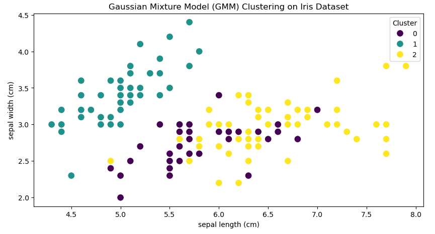
 

---

# [6-1] Spectral Clustering
▣ 정의 : 그래프 이론을 기반으로 데이터의 유사도 행렬(Similarity Matrix)을 사용해 저차원 공간에서 군집을 찾는 알고리즘 
▣ 필요성 : 복잡한 구조를 가진 데이터에서 비선형적인 경계를 정의할 수 있는 군집화 방법이 필요할 때 유용 
▣ 장점 : 비선형적인 데이터에도 유용하며, 전통적인 군집화 알고리즘보다 복잡한 데이터 구조 처리 가능 
▣ 단점 : 유사도 행렬을 계산해야 하므로 메모리 사용량이 크고, 대규모 데이터에 비효율적 
▣ 응용분야 : 이미지 분할, 네트워크 분석 
▣ 모델식 : 𝐿은 라플라시안 행렬, 𝐷는 대각 행렬(각 노드의 차수), 𝐴는 인접 행렬(이 라플라시안 행렬의 고유벡터를 사용해 데이터를 군집화) 
$𝐿=𝐷−𝐴$ 

	import numpy as np
	from sklearn.datasets import load_iris
	from sklearn.cluster import SpectralClustering
	from sklearn.metrics import silhouette_score, accuracy_score
	import matplotlib.pyplot as plt
	import seaborn as sns
	import pandas as pd
	from scipy.stats import mode
	
	# Iris 데이터셋 로드
	iris = load_iris()
	data = iris.data
	true_labels = iris.target
	
	# Spectral Clustering 모델 설정 및 학습
	spectral_clustering = SpectralClustering(n_clusters=3, affinity='nearest_neighbors', random_state=0)
	predicted_labels = spectral_clustering.fit_predict(data)
	
	# 데이터프레임으로 변환하여 시각화 준비
	df = pd.DataFrame(data, columns=iris.feature_names)
	df['Cluster'] = predicted_labels
	
	# Silhouette Score 계산
	silhouette_avg = silhouette_score(data, predicted_labels)
	print(f"Silhouette Score: {silhouette_avg:.3f}")
	
	# Accuracy 계산 (군집 레이블과 실제 레이블을 매핑하여 정확도 계산)
	mapped_labels = np.zeros_like(predicted_labels)
	for i in range(3):
	    mask = (predicted_labels == i)
	    mapped_labels[mask] = mode(true_labels[mask])[0]
	
	accuracy = accuracy_score(true_labels, mapped_labels)
	print(f"Accuracy: {accuracy:.3f}")
	
	# 시각화 (첫 번째와 두 번째 피처 사용)
	plt.figure(figsize=(10, 5))
	sns.scatterplot(x=df.iloc[:, 0], y=df.iloc[:, 1], hue='Cluster', data=df, palette='viridis', s=100)
	plt.title("Spectral Clustering on Iris Dataset")
	plt.xlabel(iris.feature_names[0])  # 첫 번째 피처 (sepal length)
	plt.ylabel(iris.feature_names[1])  # 두 번째 피처 (sepal width)
	plt.legend(title='Cluster')
	plt.show()

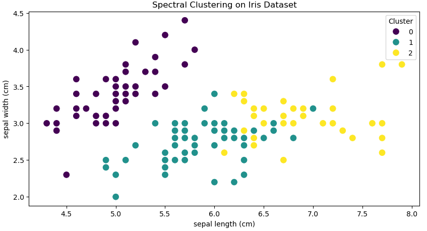
 

# [6-2] 친화도 전파(Affinity Propagation)
▣ 정의 : 데이터 간의 유사도(similarity) 행렬을 사용해 가장 적합한 중심(exemplar)을 선택하여 군집을 형성하는 알고리즘 
▣ 필요성 : 군집의 개수를 미리 정할 필요 없이 데이터의 유사도에 기반해 자연스럽게 군집을 찾을 수 있음 
▣ 장점 : 군집 개수를 사전에 정의할 필요 없으며, 유사도에 기반한 군집화로 군집 경계가 더 명확할 수 있음 
▣ 단점 : 계산 비용이 크고 큰 데이터셋에서는 느릴 수 있음 
▣ 응용분야 : 이미지 분할, 문서 분류 
▣ 모델식: 각 데이터 포인트 간의 유사도 𝑠(𝑖,𝑘)와 책임 𝑟(𝑖,𝑘), 가용도 𝑎(𝑖,𝑘)를 반복적으로 계산해 중심점을 결정 
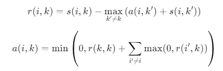

	import numpy as np
	from sklearn.datasets import load_iris
	from sklearn.cluster import AffinityPropagation
	from sklearn.metrics import silhouette_score, accuracy_score
	import matplotlib.pyplot as plt
	import seaborn as sns
	import pandas as pd
	from scipy.stats import mode
	
	# Iris 데이터셋 로드
	iris = load_iris()
	data = iris.data
	true_labels = iris.target
	
	# Affinity Propagation 모델 설정 및 학습
	affinity_propagation = AffinityPropagation(random_state=0)
	predicted_labels = affinity_propagation.fit_predict(data)
	
	# 데이터프레임으로 변환하여 시각화 준비
	df = pd.DataFrame(data, columns=iris.feature_names)
	df['Cluster'] = predicted_labels
	
	# Silhouette Score 계산
	silhouette_avg = silhouette_score(data, predicted_labels)
	print(f"Silhouette Score: {silhouette_avg:.3f}")
	
	# Accuracy 계산 (군집 레이블과 실제 레이블을 매핑하여 정확도 계산)
	mapped_labels = np.zeros_like(predicted_labels)
	for i in range(len(np.unique(predicted_labels))):
	    mask = (predicted_labels == i)
	    mapped_labels[mask] = mode(true_labels[mask])[0]
	
	accuracy = accuracy_score(true_labels, mapped_labels)
	print(f"Accuracy: {accuracy:.3f}")
	
	# 시각화 (첫 번째와 두 번째 피처 사용)
	plt.figure(figsize=(10, 5))
	sns.scatterplot(x=df.iloc[:, 0], y=df.iloc[:, 1], hue='Cluster', data=df, palette='viridis', s=100)
	plt.title("Affinity Propagation Clustering on Iris Dataset")
	plt.xlabel(iris.feature_names[0])  # 첫 번째 피처 (sepal length)
	plt.ylabel(iris.feature_names[1])  # 두 번째 피처 (sepal width)
	plt.legend(title='Cluster')
	plt.show()

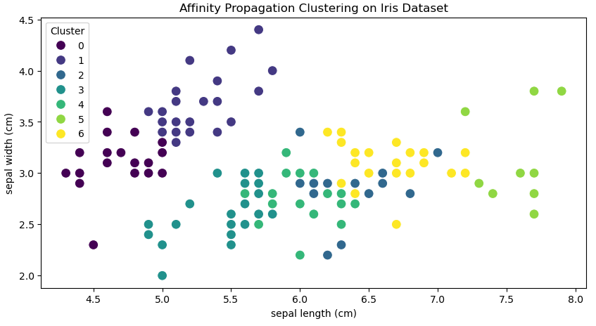
 

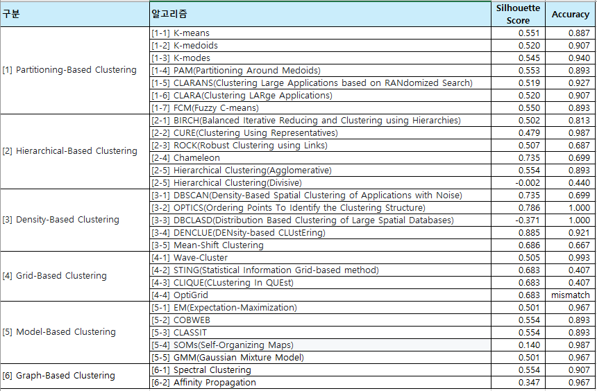
 

**군집화 알고리즘 비교(scikit-learn)** 
https://scikit-learn.org/stable/auto_examples/cluster/plot_cluster_comparison.html#sphx-glr-auto-examples-cluster-plot-cluster-comparison-py%20%EC%B6%9C%EC%B2%98:%20https://rfriend.tistory.com/587%20[R,%20Python%20%EB%B6%84%EC%84%9D%EA%B3%BC%20%ED%94%84%EB%A1%9C%EA%B7%B8%EB%9E%98%EB%B0%8D%EC%9D%98%20%EC%B9%9C%EA%B5%AC%20(by%20R%20Friend):%ED%8B%B0%EC%8A%A4%ED%86%A0%EB%A6%AC]

