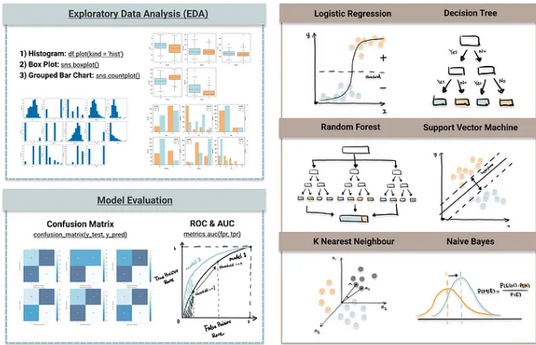
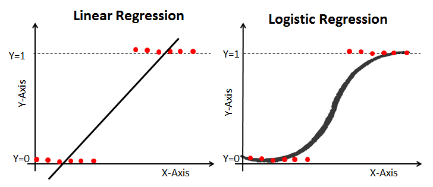
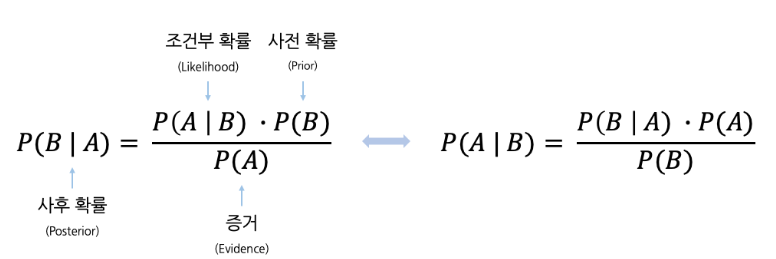

#  05 : 지도 학습 (Supervised Learning, SL) : 분류 (classification)

---

	[1] 경사하강법 기반 알고리즘 : Logistic Regression

	[2] 확률 기반 알고리즘 : Naive Bayes Classifier

	[3] 거리 기반 알고리즘 
		[3-1] K-Nearest Neighbor Classification → 6강
		[3-2] Support Vector Machine Classification → 6강

	[4] 트리기반 알고리즘
		[4-1] Decision Tree Classification → 6강
		[4-2] Random Forest Classification → 6강
		[4-3] 앙상블 기반 :  
  		      AdaBoost, Gradient Boosting Tree (GBT), lightGBM, XGBoost, CatBoost → 12강
  
---

	k-최근접 이웃 분류(k-Nearest Neighbors Classification) → 분류+회귀
	서포트 벡터 분류 (Support Vector Classification, SVC) → 분류+회귀
	결정 트리 분류 (Decision Tree Classification) → 분류+회귀
	랜덤 포레스트 분류 (Random Forest Classification) → 분류+회귀

---

 출처 : https://towardsdatascience.com/top-machine-learning-algorithms-for-classification-2197870ff501

 

# [1] 로지스틱 회귀 (Logistic Regression)
▣ 가이드 : https://scikit-learn.org/stable/modules/linear_model.html#logistic-regression 
▣ API : https://scikit-learn.org/stable/modules/generated/sklearn.linear_model.LogisticRegression.html  

▣ 정의 : 데이터가 어떤 범주에 속할 확률을 0에서 1 사이의 값으로 예측하고 그 확률에 따라 가능성이 더 높은 범주에 속하는 것으로 분류해 주는 지도 학습 알고리즘. 이름에 Regression이 들어가지만 Sigmoid 함수를 활용한 이진분류에 해당하며, 선형 회귀는 특정 예측 값을 반환하지만 sigmoid 함수를 활용하면 특정 값을 기점으로 0 또는 1 값을 반환하는 분류 모델이라고 할 수 있다. 선형회귀분석과 비슷한데 Y값이 확률로 되어 있기 때문에 하한, 상한이 [0, 1] 사이로 정해져 있으며, 특정 threshold 값을 기준으로 삼아서 예측된 확률 값이 threshold 이상인 것과 미만인 것으로 분류를 하는 식이다.  
▣ 장점
 - 간편성 : 로지스틱 회귀 모델은 다른 ML 기법보다 수학적으로 덜 복잡하여 팀원 중 누구라도 심층적인 ML 전문 지식을 없이 구현 
 - 속도 : 로지스틱 회귀 모델에는 메모리 및 처리 성능과 같은 계산 용량이 덜 필요하기 때문에 대량의 데이터를 고속으로 처리할 수 있으므로 ML 프로젝트를 시작하는 조직이 성과를 빠르게 실현하는 데 이상적 
 - 유연성 : 로지스틱 회귀 분석을 사용하면 두 개 이상의 유한한 결과가 있는 질문에 대한 답을 찾을 수 있으며, 데이터를 전처리하는 데에도 사용할 수 있다. 예컨대 로지스틱 회귀를 사용하여 은행 거래와 같이 값의 범위가 넓은 데이터를 더 작고 유한한 값 범위로 정렬하고 그런 다음 보다 정확한 분석을 위해 다른 ML 기법을 사용하여 이 작은 데이터 세트를 처리 
 - 가시성 : 로지스틱 회귀 분석을 사용할 경우 다른 데이터 분석 기법을 사용할 때보다, 개발자에게 내부 소프트웨어 프로세스에 대한 더 높은 가시성이 제공되며, 계산이 덜 복잡하기 때문에 문제 해결 및 오류 수정도 용이함 

▣ 유형
 - 이항 로지스틱 회귀 : 이항 로지스틱 회귀 분석은 가능한 결과가 두 개뿐인 바이너리 분류 문제에 적합하다. 종속 변수는 예, 아니요 또는 0과 1과 같은 두 개의 값만 가질 수 있다. 로지스틱 함수가 0과 1 사이의 값 범위로 계산되더라도 이항 회귀 모델에서는 답을 가장 가까운 값으로 반올림/반내림한다. 일반적으로 0.5 미만의 답은 0으로 반내림되고 0.5보다 큰 답은 1로 반올림되므로 로지스틱 함수는 이항 결과를 반환하게 된다.
 - 다항 로지스틱 회귀 : 다항 회귀 분석은 결과의 수가 유한하다는 전제 하에, 3개 이상의 결과를 가질 수 있는 문제를 분석할 수 있다. 예컨대 인구 데이터를 기반으로 주택 가격이 25%, 50%, 75% 또는 100% 중 어떤 비율로 상승할지 예측할 수 있지만, 주택의 정확한 가격을 예측할 수는 없다. 다항 로지스틱 회귀 분석은 결과 값을 0과 1 사이의 다른 값에 매핑하는 방식으로 작동한다. 로지스틱 함수는 0.1, 0.11, 0.12 등 연속된 데이터의 범위를 반환할 수 있으므로, 다항 회귀 분석에서는 출력값을 가능한 가장 가까운 값으로 그룹화한다.
 - 서수 로지스틱 회귀 : 서수 로지스틱 회귀 분석 또는 순서형 로짓 모델은 숫자가 실제 값이 아닌 순위를 나타내는 문제를 풀기 위한 특수한 유형의 다항 회귀 분석이다. 예를 들어 서수 회귀 분석을 사용하여 고객이 1년 동안 구매한 품목 수 등의 숫자 값을 기준으로, 서비스를 나쁨, 양호, 좋음 또는 우수 등급으로 평가하도록 요청하는 설문 조사 질문의 답을 예측할 수 있다.

▣ 활용분야
 - 제조 : 로지스틱 회귀 분석을 사용하여 기계류의 부품 고장 확률을 추정한 다음 이 추정치를 기반으로 유지 보수 일정을 계획하여 향후 고장 발생을 최소화 
 - 의료 : 의학 연구원들은 환자의 질병 발생 가능성을 예측하여 예방 진료와 치료를 계획하는데 이때 가족력이나 유전자가 질병에 미치는 영향을 비교하는 데 로지스틱 회귀 모델을 사용  
 - 금융 : 금융 거래에서 사기 행위를 분석하고 대출 신청 및 보험 신청 건의 위험도를 평가해야 하는데 이러한 문제에는 고위험이거나 저위험이거나, 사기이거나 사기가 아닌 것과 같은 명확한 결과가 있기 때문에 로지스틱 회귀 모델에 적합   
 - 마케팅 : 온라인 광고 도구는 로지스틱 회귀 모델을 사용하여 사용자가 광고를 클릭할지 여부를 예측한 결과를 활용하여 마케터는 다양한 단어와 이미지에 대한 사용자의 반응을 분석하고 고객이 관심을 가질 만한 효과적인 광고 제작 

▣ 회귀식 

$0 ≤ P(y=1 | X) = p(성공확률) ≤ 1$ 

$0 ≤ Odds = 성공확률/실패확률​ = p/(1−p​) ≤ ∞$ 

$−∞ ≤ log(Odds) = log(p/(1−p​)) ≤ ∞$ 

만일 종속변수가 0일 확률을 $P(y=0|x)$라고 한다면, 이를 구하는 식은 다음과 같다. 
$LogOdds = log(\frac{P(y=0|x)}{1-P(y=0|x)}) = \beta_0 + \sum_{j=1}^{p}\beta_j x_j$ 

$log−odds$로부터 특정 범주에 속할 확률을 얻기 위해  $log−odds$의 식을 $P(Y=0|x)$에 대해서 다시 정리하면, 
$P(y=0|x) = \frac{exp(\beta_0 + \displaystyle\sum_{j=1}^{p}\beta_jx_j)}{1+exp(\beta_0 + \displaystyle\sum_{j=1}^{p}\beta_jx_j)}$ 

$z = \beta_0 + \displaystyle\sum_{j=1}^{p}\beta_jx_j$ 라고 한다면, 식은 보다 간결하게 표현된다. 
$P(y=0|x) = \frac{1}{1+exp(-z)}$

오즈비(odds ratio)는 베르누이 시도에서 1이 나올 확률 θ(x)와 0이 나올 확률 1−θ(x)의 비율(ratio)을 의미한다. 
$odds ratio = \frac{ \theta (x) }{1 - \theta (x)}$  

0부터 1사이의 값만 가지는 확률값인 θ(x)를 오즈비로 변환하면 0부터 양의 무한대까지의 값을 가질 수 있다. 오즈비를 로그변환한 것이 위에서 언급한 Logit function이다. 이로써 로지트 함수의 값은 로그변환에 의해 음의 무한대 (−∞)부터 양의 무한대(∞)까지의 값을 가질 수 있다. 
$y = logit(odds ratio) = log ( \frac{ \theta (x) }{ 1 - \theta (x) } )$  

로지스틱함수(Logistic function)은 로지트 함수의 역함수이다. 즉 음의 무한대부터 양의 무한대 까지의 값을 가지는 입력변수를 0부터 1사이의 값을 가지는 출력변수로 변환한 것이다. 
$\text{logitstic}(z) = \sigma(z) = \dfrac{1}{1+\exp{(-z)}}$  

	import pandas as pd
	from sklearn.datasets import load_iris
	from sklearn.linear_model import LogisticRegression

	# Iris 데이터 로드
	iris = load_iris()
	X, y = iris.data, iris.target

	# Feature 데이터와 Target 데이터를 DataFrame으로 변환
 	# 0: setosa, 1: versicolor, 2: virginica
	df = pd.DataFrame(data=X, columns=iris.feature_names)
	df['target'] = y	
	print(df)

	# Logistic Regression 모델 반복 훈련
	clf = LogisticRegression(random_state=0, max_iter=200).fit(X, y)

	# 예측
	predictions = clf.predict(X[:2, :])
	probabilities = clf.predict_proba(X[:2, :])
	score = clf.score(X, y)

	# 예측 결과 출력
	print("Predictions: ", predictions)
	print("Probabilities: ", probabilities)
	print("Model Score: ", score)

 

# [2] 나이브 베이즈 (Naive Bayes)
▣ 가이드 : https://scikit-learn.org/stable/modules/naive_bayes.html 

▣ 정의 
 - 베이즈 정리 : 사건의 확률과 추가정보를 고려했을때 확률의 변화 
 - 나이브 베이지안 알고리즘 : 사전확률을 통해 특징값이 제공하는 증거를 기반으로 사후확률을 예측(순진하고 때로는 잘못된 가정에도 불구하고 우수한 성능을 보임) 

▣ 장점 
 - 간단하고, 빠르며, 정확하다. 
 - computation cost가 작아서 실행속도가 빠르다. 
 - 큰 데이터셋에 적합하다. 
 - 연속형보다 이산형 데이터에서 성능이 좋다. 
 - Multiple class 예측을 위해서도 사용할 수 있다. 

▣ 단점 
 - feature 간의 독립성(feature간에 서로 상관관계 無)이어야 하므로 실생활에서 바로 적용하기는 곤란 

▣ 유형 
 - **가우시안 나이브 베이즈(Gaussian Naive Bayes, GaussianNB) :** 연속적인 값을 지닌 데이터를 처리 할때, 전형적으로 각 클래스의 연속적인 값들이 가우스 분포를 따른다고 가정한다. 
$P(x_i \mid y) = \frac{1}{\sqrt{2\pi\sigma^2_y}} \exp\left(-\frac{(x_i - \mu_y)^2}{2\sigma^2_y}\right)$ 

	from sklearn.datasets import load_iris
	from sklearn.model_selection import train_test_split
	from sklearn.naive_bayes import GaussianNB
	
	#Iris 데이터셋 로드
	X, y = load_iris(return_X_y=True)

	#원 데이터셋의 크기 출력
	print(f"Total number of data points in the dataset: {X.shape[0]}")

	#학습용 데이터와 테스트용 데이터로 나누기
	X_train, X_test, y_train, y_test = train_test_split(X, y, test_size=0.5, random_state=0)

	#Gaussian Naive Bayes 모델 생성 및 학습
	gnb = GaussianNB()
	y_pred = gnb.fit(X_train, y_train).predict(X_test)

	#오분류된 데이터의 개수 출력
	mislabeled_points = (y_test != y_pred).sum()
	print("Number of mislabeled points out of a total %d points: %d" 
      	% (X_test.shape[0], mislabeled_points))

	#정확도 계산 및 출력
	accuracy = (X_test.shape[0] - mislabeled_points) / X_test.shape[0]
	print(f"Accuracy: {accuracy:.4f}")

 
 - **다항 나이브 베이즈(Multinomial Naive Bayes, MultinomialNB) :** 하나의 문서에서 단어의 출현을 나타내는 이벤트를 가지고 문서 분류를 하는데 사용되는 이벤트 모델이다. 
  <!-- $\hat{\theta}_{yi} = \frac{N_{yi} + \alpha}{N_y + \alpha n}$  -->
   
 
 - **베르누이 나이브 베이즈(Bernoulli Naive Bayes, Bernoulli NB) :** 다변량 베르누이 분포에 따라 분포된 데이터에 대한 나이브 베이즈 학습 및 분류 알고리즘으로, 특성들은 입력들을 설명하는 독립적인 부울 값(이진 변수)이다. 
$P(x_i \mid y) = P(x_i = 1 \mid y) x_i + (1 - P(x_i = 1 \mid y)) (1 - x_i)$ 

 - **보완 나이브 베이즈(Complement Naive Bayes, CNB) :** 불균형 데이터 세트에 특히 적합한 표준 다항 나이브 베이즈(MNB) 알고리즘의 변형 

 - **범주형 나이브 베이즈(Categorical Naive Bayes, CategoricalNB) :** 범주적으로 분포된 데이터에 대한 범주적 나이브 베이즈 알고리즘을 구현하고, 인덱스로 설명되는 각 기능이 고유한 범주형 분포를 갖는다. 

▣ 활용분야 
 - 스팸메일 필터와 같은 테스트 분류기 
 - 컴퓨터 네트워크에서 침입이나 비정상행위 탐지 
 - 일련의 관찰된 증상을 통한 의학적 질병의 진단 

▣ 회귀식  

 

