 

 

 

 

 

 

 

 

 

 

#  05 : 비지도 학습(Unsupervised Learning, UL) : 군집화(Clustering)

**군집화(Clustering)란?**
데이터 포인트들을 별개의 군집으로 그룹화하는 것 
유사성이 높은 데이터들을 동일한 그룹으로 분류하고 서로다른 군집들이 상이성을 가지도록 그룹화 
군집화 활용분야 : 고객, 시장, 상품, 경제 및 사회활동 등의 세분화(Segmentation) → 이미지 식별, 이상검출 등 

---

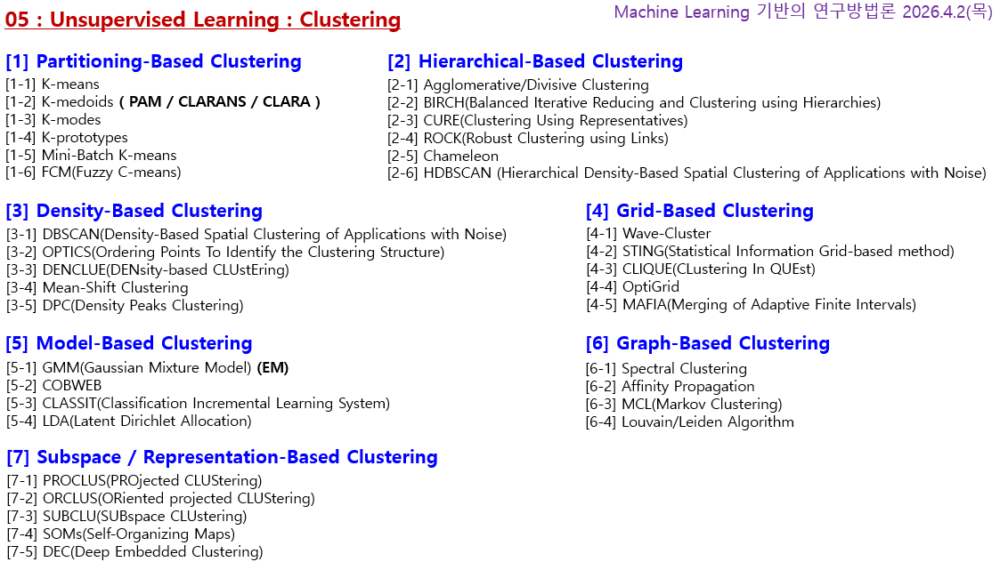

---

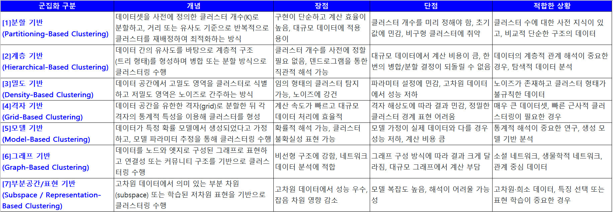

---

▣ 2026.1학기
 
 

▣ 2025.2학기
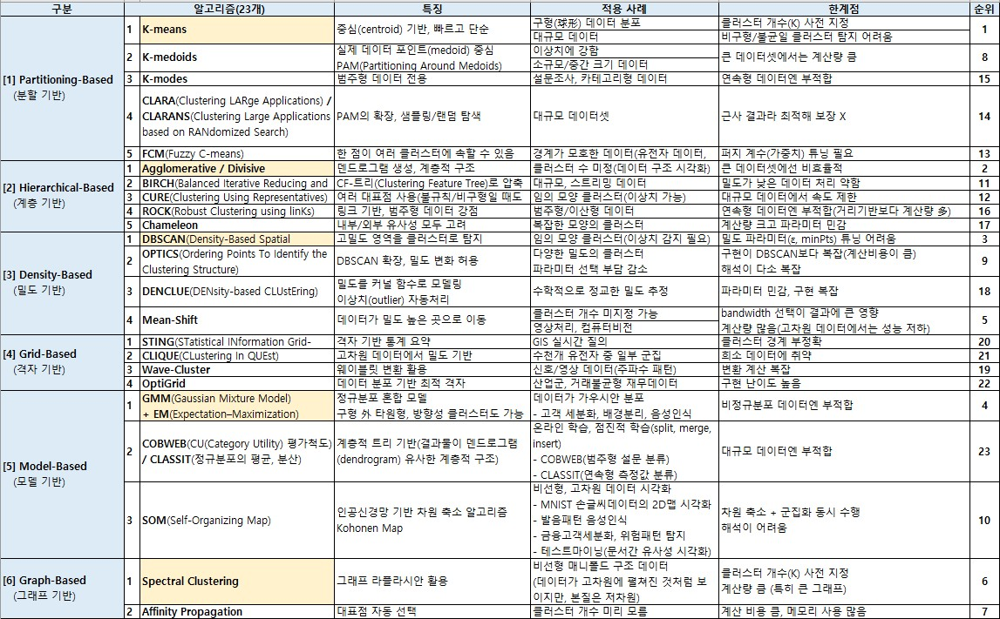

---

**[1] Partitioning-Based Clustering** (분할 기반 군집화) 
**[1-1] K-means Clustering** : 데이터셋을 $K$개의 군집으로 나누며, 각 군집의 평균(Centroid)과 데이터 간의 거리 합을 최소화하는 방식 
**[1-2] K-medoids Clustering (PAM/CLARANS/CLARA)** : 중심점 대신 실제 데이터 포인트인 메도이드(Medoid)를 대표값으로 사용하여 이상치(Outlier)에 대한 민감도를 낮춤 
**[1-3] K-modes Clustering** : 수치형 데이터가 아닌 범주형(Categorical) 데이터를 위해 평균 대신 최빈값(Mode)을 기준으로 군집을 형성 
**[1-4] K-prototypes Clustering** : 수치형 변수와 범주형 변수가 혼합(Mixed)된 데이터셋에서 K-means와 K-modes의 장점을 결합하여 적용 
**[1-5] Mini-Batch K-means Clustering** : 전체 데이터 대신 무작위로 추출한 소규모 배치(Mini-Batch)만 업데이트하여 대용량 데이터 처리 속도를 획기적으로 개선 
**[1-6] FCM (Fuzzy C-means Clustering)** : 엄격한 분할 대신 데이터가 각 군집에 속할 소속 확률(Membership Degree)을 부여하는 소프트 군집화 방식 

---

# [1-1] k-Means

▣ 정의 : 데이터를 미리 정한 K개 클러스터로 나누고, <ins>각 클러스터의 중심점(centroid)을 평균으로 두어 클러스터 내부 제곱거리 합(WCSS)을 최소화하도록 반복 최적화하는 알고리즘</ins> 
▣ 장점 : 계산이 빠르고 구현이 단순해 대규모 데이터의 기본 베이스라인으로 적합, 중심점이 평균이므로 대표 패턴 해석이 직관적, 다양한 변형으로 확장 
▣ 단점 : K를 사전에 정해야 함, 초기 중심에 민감하며 이상치에 취약, 비구형(비선형) 클러스터에 약함 
▣ 응용분야 : 고객 세분화, 임베딩(문서/이미지) 군집, 센서 상태 패턴 그룹화, 이미지 색상 양자화, 추천시스템의 사용자/아이템 그룹화 등 

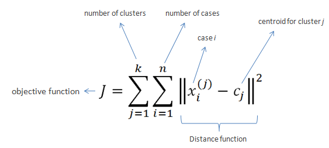
 출처 : https://www.saedsayad.com/clustering_kmeans.htm 

	from sklearn.cluster import KMeans
	from sklearn.datasets import load_iris
	from sklearn.metrics import silhouette_score, accuracy_score
	import matplotlib.pyplot as plt
	import numpy as np  # 배열 계산을 위해 numpy를 임포트
	from scipy.stats import mode  # Accuracy 계산 시 군집과 실제 라벨을 매핑하기 위해 mode 함수를 임포트
	
	# 데이터 로드
	iris = load_iris()
	X = iris.data  # iris 데이터셋의 속성값(피처)들만 X에 저장(shape: [150, 4])
	true_labels = iris.target  # 실제 라벨을 저장
	
	# K-Means 알고리즘 적용
	kmeans = KMeans(n_clusters=3, random_state=0)  # KMeans 객체를 생성하고, n_clusters=3으로 군집의 개수를 설정
	kmeans.fit(X)  # KMeans 알고리즘을 사용하여 X 데이터셋에 대해 군집화를 수행하고, 각 데이터 포인트의 군집을 학습
	labels = kmeans.labels_  # 학습 후, 각 데이터 포인트가 속하는 군집의 레이블을 labels에 저장
	
	# Silhouette Score 계산
	silhouette_avg = silhouette_score(X, labels)
	print(f"Silhouette Score: {silhouette_avg:.3f}")
	
	# Accuracy 계산 (군집 레이블과 실제 레이블을 매칭하여 정확도 계산)
	mapped_labels = np.zeros_like(labels)
	for i in np.unique(labels):
	    mask = (labels == i)
	    mapped_labels[mask] = mode(true_labels[mask])[0]
	
	accuracy = accuracy_score(true_labels, mapped_labels)
	print(f"Accuracy: {accuracy:.3f}")
	
	# 시각화
	plt.scatter(X[:, 0], X[:, 1], c=labels, cmap='viridis', s=50)  # X[:, 0] 모든행의 첫번째 열을 X좌표, X[:, 1] 모든행의 두번째 열을 Y좌표로 산점도 그리기
	plt.scatter(kmeans.cluster_centers_[:, 0], kmeans.cluster_centers_[:, 1], c='red', marker='X', s=200, label='Centroids')  # 군집 중심을 'X'로 표시
	plt.title("K-Means Clustering on Iris Dataset")  # 그래프의 제목을 설정
	plt.xlabel("Sepal Length")  # Feature 1 (X축) X[:, 0] Sepal Length (꽃받침 길이cm)
	plt.ylabel("Sepal Width")  # Feature 2 (Y축) X[:, 1] Sepal Width (꽃받침 너비cm)
	plt.legend()
	plt.show()  # 그래프를 화면에 출력

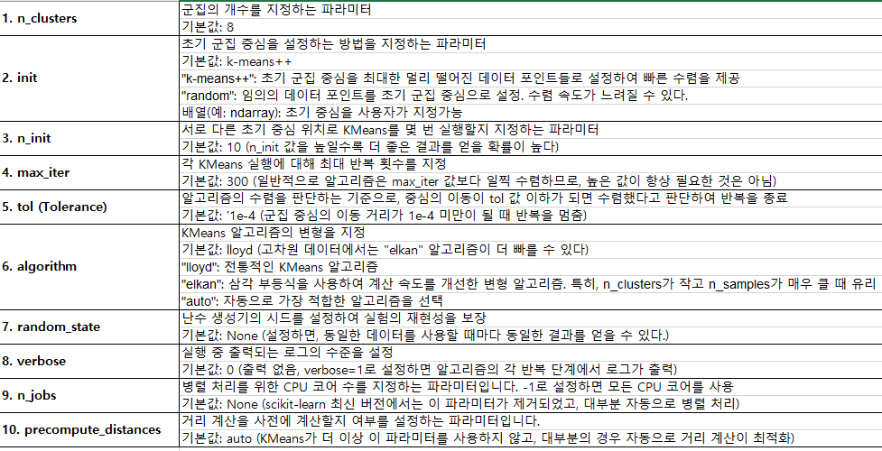

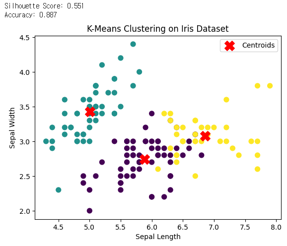

 

---

## 군집화 알고리즘의 평가 방법(Elbow, Silhouette)

---

**▣ Elbow :** <ins>군집 수를 결정하기 위한 시각적 방법</ins>으로 군집 수를 변화시키면서 각 군집 수에 따른 관성(Inertia), 즉 군집 내 SSE(Sum of Squared Errors) 또는 WCSS(Within-Cluster Sum of Squares) 값을 계산(군집의 개수가 증가할수록 각 군집이 더 작아지고, 데이터 포인트들이 군집 중심에 더 가까워지기 때문에 WCSS이 감소하며, 군집 수를 계속 증가시키다 보면, 어느 순간부터 오차가 크게 줄어들지 않는 구간이 나타나는데 이때의 군집 수를 최적의 군집 수로 선택) 

	import matplotlib.pyplot as plt 
	from sklearn.datasets import load_iris
	from sklearn.cluster import KMeans 

	# 데이터 로드
	iris = load_iris()  
	data = iris.data 

	# 엘보 기법을 사용한 최적의 군집 수 찾기
	wcss = []  # 각 군집 수에 대한 WCSS 값을 저장할 리스트 초기화
	for k in range(1, 10):  # 군집 수를 1부터 9까지 변경하며 반복
	    # k개의 군집을 가지는 KMeans 모델 생성
    	kmeans = KMeans(n_clusters=k, init='k-means++', random_state=42)  
    	kmeans.fit(data)  # KMeans 모델을 데이터에 학습시킴
    	wcss.append(kmeans.inertia_)  # 학습된 모델의 관성 값(WCSS)을 리스트에 추가

	# 그래프 시각화
	plt.plot(range(1, 10), wcss, marker='o')  # 군집 수에 따른 WCSS 값을 선 그래프로 시각화
	plt.title('Elbow Method')  # 그래프 제목 설정
	plt.xlabel('Number of clusters')  # x축 레이블 설정
	plt.ylabel('WCSS')  # y축 레이블 설정
	plt.xticks(range(1, 10))  # x축 정수 설정
	plt.show()  # 그래프 출력

 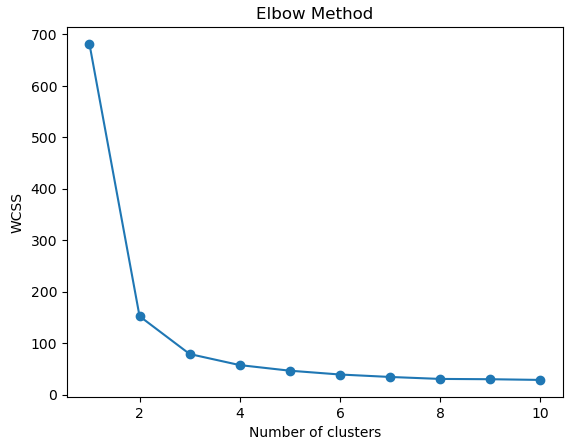
 

x축: 클러스터 개수 𝑘 
y축: WCSS (Within-Cluster Sum of Squares, 군집 내 제곱합) : 각 점이 속한 군집 중심까지의 제곱 거리의 합 = 군집 응집도 척도 
군집 수 𝑘를 늘리면, 각 군집이 더 세분화되므로 WCSS는 작아짐(더 많은 클러스터 → 점들이 자기 중심과 가까워짐 → 응집도 증가 → 오차 감소) 
 
k=1→2: WCSS가 급격히 감소 (700 → 150 근처) 
k=2→3: 또 크게 감소 (150 → 80 근처) 
k=3→4: 여전히 눈에 띄게 감소 (80 → 60 근처) 
k≥4: 감소 폭이 점점 작아져 완만한 곡선으로 변함 
즉, 3~4 근처에서 급격한 감소가 멈추고 곡선이 완만해짐 
이 데이터셋에서는 적절한 클러스터 수 k는 3 또는 4 정도로 판단 
이후 k를 더 늘려도 WCSS 감소는 있지만, 얻는 이득이 크지 않음 → 과적합 위험 + 해석 복잡 
 
 

---

**▣ Silhouette :** <ins>각 군집 간의 거리가 얼마나 효율적으로 분리되어 응집력있게 군집화되었는지를 평가하는 지표</ins>. 각 데이터 포인트에 대해 실루엣 계수(Silhouette Coefficient)를 계산하며, 이 값은 데이터 포인트가 자신의 군집에 얼마나 잘 속해 있는지를 나타냄 

	import matplotlib.pyplot as plt
	import numpy as np
	from sklearn.datasets import load_iris
	from sklearn.cluster import KMeans
	from sklearn.metrics import silhouette_score, accuracy_score
	from scipy.stats import mode

	# 데이터 로드
	iris = load_iris()
	data = iris.data
	true_labels = iris.target

	# 실루엣 분석 및 정확도를 통한 최적의 군집 수 찾기
	silhouette_scores = []
	accuracies = []

	for k in range(2, 11):  # 군집 수는 최소 2개 이상이어야 실루엣 점수를 계산할 수 있음
		kmeans = KMeans(n_clusters=k, init='k-means++', random_state=42)
		predicted_labels = kmeans.fit_predict(data)
    
    		# Silhouette Score 계산
    		silhouette = silhouette_score(data, predicted_labels)
    		silhouette_scores.append(silhouette)
    
    		# Accuracy 계산 (군집 레이블과 실제 레이블을 매핑하여 정확도 계산)
    		mapped_labels = np.zeros_like(predicted_labels)
    		for i in range(k):
			mask = (predicted_labels == i)
			mapped_labels[mask] = mode(true_labels[mask])[0]
    
    		accuracy = accuracy_score(true_labels, mapped_labels)
    		accuracies.append(accuracy)

	# 실루엣 점수 그래프 시각화
	plt.figure(figsize=(12, 5))

	plt.subplot(1, 2, 1)
	plt.plot(range(2, 11), silhouette_scores, marker='o')
	plt.title('Silhouette Analysis')
	plt.xlabel('Number of clusters')
	plt.ylabel('Silhouette Score')

	# 정확도 그래프 시각화
	plt.subplot(1, 2, 2)
	plt.plot(range(2, 11), accuracies, marker='o', color='orange')
	plt.title('Accuracy by Number of Clusters')
	plt.xlabel('Number of clusters')
	plt.ylabel('Accuracy')
	plt.tight_layout()
	plt.show()

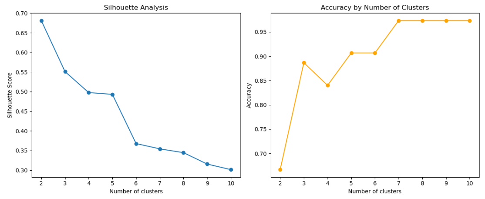
 

Silhouette Score (내부 평가 지표) 
k=2에서 약 0.68로 가장 높음 → 데이터 자체 분포만 보면 2개의 큰 군집으로 나누는 것이 가장 “자연스럽다”는 뜻. k가 늘어날수록 점수가 꾸준히 하락 → 군집 간 경계가 불분명해지고, 응집력도 떨어진다는 의미. 
 
Accuracy (외부 평가 지표, 라벨 존재 가정) 
k=7 이상부터 0.95 이상의 매우 높은 정확도를 보임. k=8,9,10도 비슷한 정확도지만, 더 많은 클러스터는 해석 복잡성만 늘리고 큰 이득 없음. 
k=2: 0.68  ← 낮음 
k=3: 0.88  ← 급격한 상승 (중요한 신호!) 
k=4: 0.84  ← 오히려 하락 
k=5: 0.90 
... 
k=7: 0.97  ← 최고점 
 

	import numpy as np
	import matplotlib.pyplot as plt
	from sklearn.datasets import load_iris
	from sklearn.cluster import KMeans
	from sklearn.metrics import silhouette_score, accuracy_score
	import pandas as pd
	import seaborn as sns
	from scipy.stats import mode

	# 데이터 로드
	iris = load_iris()
	data = iris.data
	true_labels = iris.target

	# K-means 클러스터링 (군집 수를 2로 설정)
	kmeans = KMeans(n_clusters=2, init='k-means++', random_state=42)
	predicted_labels = kmeans.fit_predict(data)

	# Silhouette Score 계산
	silhouette_avg = silhouette_score(data, predicted_labels)
	print(f"Silhouette Score: {silhouette_avg:.3f}")

	# Accuracy 계산 (군집 레이블과 실제 레이블을 매핑하여 정확도 계산)
	mapped_labels = np.zeros_like(predicted_labels)
	for i in range(2):  # 각 군집에 대해 반복
    		mask = (predicted_labels == i)
    		mapped_labels[mask] = mode(true_labels[mask])[0]

	accuracy = accuracy_score(true_labels, mapped_labels)
	print(f"Accuracy: {accuracy:.3f}")

	# 데이터프레임으로 변환하여 클러스터 레이블 추가
	df = pd.DataFrame(data, columns=iris.feature_names)
	df['Cluster'] = predicted_labels  # 예측된 군집 레이블 추가

	# 시각화 (첫 번째와 두 번째 피처 사용)
	plt.figure(figsize=(10, 5))
	sns.scatterplot(x=iris.feature_names[0], y=iris.feature_names[1], hue='Cluster', data=df, palette='viridis', s=100)
	plt.title("K-means Clustering on Iris Dataset (n_clusters=2)")
	plt.xlabel(iris.feature_names[0])  # 첫 번째 피처 (sepal length)
	plt.ylabel(iris.feature_names[1])  # 두 번째 피처 (sepal width)
	plt.legend(title='Cluster')
	plt.show()

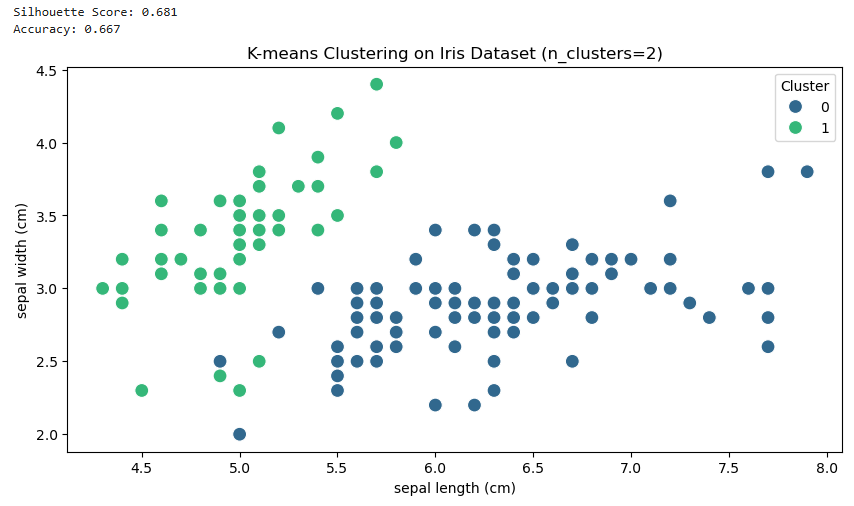

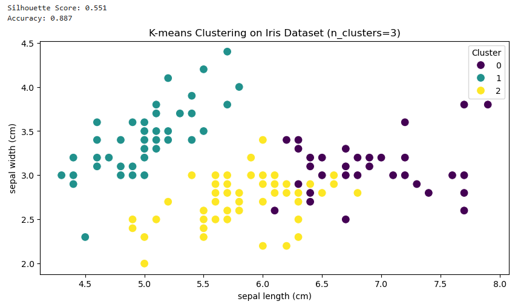

 

**주어진 결과** 
n_clusters = 2 
Silhouette score = 0.681 (상당히 높음 → 군집 응집도와 분리도가 좋음) 
Accuracy = 0.667 (실제 라벨과의 일치율은 상대적으로 낮음) 
 
n_clusters = 3 
Silhouette score = 0.551 (2개일 때보다 낮음 → 군집 품질이 조금 떨어짐) 
Accuracy = 0.887 (실제 라벨과의 일치율이 매우 높음) 
 
**해석** 
Silhouette score 기준 
0.681 → “꽤 잘 분리된 군집” 
0.551 → “군집 품질이 나쁘진 않지만, 응집/분리도가 다소 떨어짐” 
→ 내부 평가(internal validation) 기준으로는 2개가 더 적합. 
 
Accuracy 기준 
0.667 (라벨과 2/3 정도 맞음) 
0.887 (거의 90% 가까이 맞음) 
→ 외부 평가(external validation, 즉 ground truth 라벨 기준)로는 3개가 더 적합. 
 
**결론** 
만약 라벨(정답)이 주어진 상황이라면 → Accuracy가 더 중요하므로 군집 수 = 3이 더 적합. 
만약 라벨이 없는 순수 비지도 학습 상황이라면 → 내부 품질 지표(Silhouette)를 따라야 하므로 군집 수 = 2가 더 자연스러움. 
즉, 지도학습적 평가(Accuracy)를 참고한다면 3개, 순수 클러스터링 품질만 본다면 2개 
 

---

# [1-2] K-medoids
▣ 정의 : <ins>중심을 평균(가상점)이 아니라 실제 데이터 포인트 중 하나(medoid)로 선택</ins>한다. 총 비유사도(거리 합)를 최소화하도록 medoid를 교체(swap)하며 최적화한다. 
▣ 장점 : 중심이 실제 데이터이므로 이상치 영향이 평균보다 작아 상대적으로 강건, 거리 함수(유클리드/맨해튼/임의의 비유사도)를 유연하게 사용할 수 있음, 해석 시 대표 실제 사례를 medoid로 제시 가능 
▣ 단점 : K-means보다 구현이 복잡하고 초기 medoid에 따라 결과가 달라질 수 있음, PAM(Partitioning Around Medoids)은 계산량이 커서 대규모 데이터에 느릴 경우 CLARA/CLARANS로 완화 
▣ 응용분야 : 이상치가 많은 데이터의 군집, 대표 사례(프로토타입) 추출이 중요한 고객/설문/사례 기반 분석, 다양한 거리 기반 군집(특수 유사도) 등 
▣ 종류 :  
<ins>PAM(Partitioning Around Medoids)</ins> : K-medoids의 대표적인 구현으로 각 클러스터 중심을 실제 데이터 포인트로 설정 
<ins>CLARA(Clustering LARge Applications)</ins> : PAM을 대규모 데이터셋에 적용하기 위해 샘플링 기반으로 클러스터링 
<ins>CLARANS(Clustering Large Applications based on RANdomized Search)</ins>: PAM의 개선 알고리즘으로 랜덤 탐색 기반 클러스터링 

	import numpy as np
	from sklearn.datasets import load_iris
	from sklearn.metrics import silhouette_score, accuracy_score
	from sklearn.preprocessing import StandardScaler
	from scipy.spatial.distance import cdist
	import pandas as pd
	import matplotlib.pyplot as plt
	import seaborn as sns
	from scipy.stats import mode
	
	class KMedoids:
	    def __init__(self, n_clusters=3, max_iter=300, random_state=None):
	        self.n_clusters = n_clusters
	        self.max_iter = max_iter
	        self.random_state = random_state
	
	    def _init_medoids_pp(self, X):
	        """K-medoids++ 초기화"""
	        n = len(X)
	        medoids = [np.random.randint(n)]
	        for _ in range(1, self.n_clusters):
	            dist_to_nearest = cdist(X, X[medoids]).min(axis=1)
	            probs = dist_to_nearest**2 / (dist_to_nearest**2).sum()
	            medoids.append(np.random.choice(n, p=probs))
	        return np.array(medoids)
	
	    def fit_predict(self, X, n_init=5):
	        if self.random_state is not None:
	            np.random.seed(self.random_state)
	
	        best_labels, best_cost, best_medoids = None, np.inf, None
	
	        for _ in range(n_init):
	            medoids = self._init_medoids_pp(X)
	
	            for _ in range(self.max_iter):
	                distances = cdist(X, X[medoids], metric='euclidean')
	                labels = np.argmin(distances, axis=1)
	
	                new_medoids = medoids.copy()
	                for i in range(self.n_clusters):
	                    cluster_points = np.where(labels == i)[0]
	                    if cluster_points.size == 0:   # 빈 클러스터 방지
	                        new_medoids[i] = medoids[i]
	                        continue
	                    intra = cdist(X[cluster_points], X[cluster_points]).sum(axis=1)
	                    new_medoids[i] = cluster_points[np.argmin(intra)]
	
	                if np.array_equal(medoids, new_medoids):
	                    break
	                medoids = new_medoids
	
	            cost = cdist(X, X[medoids]).min(axis=1).sum()
	            if cost < best_cost:
	                best_cost, best_labels, best_medoids = cost, labels, medoids
	
	        self.labels_ = best_labels
	        self.medoids_ = X[best_medoids]
	        return self.labels_
	
	# --------------------------
	# 메인 실행부
	# --------------------------
	
	# Iris 데이터셋 로드
	iris = load_iris()
	data = iris.data
	true_labels = iris.target
	
	# Feature scaling (표준화)
	scaler = StandardScaler()
	X = scaler.fit_transform(data)
	
	# KMedoids 알고리즘 적용
	kmedoids = KMedoids(n_clusters=3, random_state=0)
	clusters = kmedoids.fit_predict(X, n_init=5)
	
	# Silhouette Score 계산
	silhouette_avg = silhouette_score(X, clusters)
	print(f"Silhouette Score: {silhouette_avg:.3f}")
	
	# Accuracy 계산 (군집 레이블과 실제 라벨 매핑)
	mapped_labels = np.zeros_like(clusters)
	for i in np.unique(clusters):
	    mask = (clusters == i)
	    mapped_labels[mask] = mode(true_labels[mask], keepdims=False).mode
	
	accuracy = accuracy_score(true_labels, mapped_labels)
	print(f"Accuracy: {accuracy:.3f}")
	
	# 데이터프레임 변환
	df = pd.DataFrame(X, columns=iris.feature_names)
	df['Cluster'] = clusters
	df['True'] = true_labels
	
	# 시각화 (Cluster=색, True=마커)
	plt.figure(figsize=(10, 5))
	sns.scatterplot(
	    data=df, x=iris.feature_names[0], y=iris.feature_names[1],
	    hue='Cluster', style='True', palette='viridis', s=90
	)
	plt.scatter(kmedoids.medoids_[:, 0], kmedoids.medoids_[:, 1],
	            c='red', marker='X', s=200, label='Medoids')
	plt.title("K-medoids Clustering on Iris Dataset (scaled, ++ init)")
	plt.xlabel(iris.feature_names[0])
	plt.ylabel(iris.feature_names[1])
	plt.legend()
	plt.show()

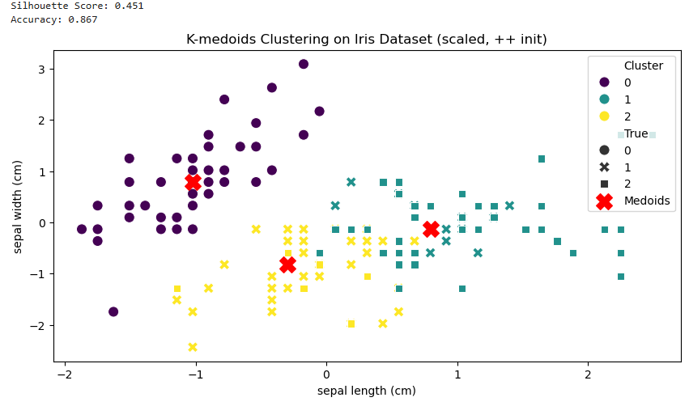
 

	0 : Setosa, 1: Versicolor, 2 : Virginica
	O(circle) : 실제 Setosa, X(cross) : 실제 Versicolor, (square) : 실제 Virginica

 	

## [1-2-1] PAM(Partitioning Around Medoids)
▣ 정의: K-medoids 접근법을 구현하는 탐욕적 알고리즘으로 <ins>각 군집에서 가장 최적의 Medoid를 반복적으로 찾는다</ins> 
▣ 필요성: 이상치가 많은 데이터셋에서도 안정적인 군집화를 수행할 수 있음 
▣ 장점: K-means에 비해 이상치에 덜 민감하며 다양한 거리 측정 방법을 사용할 수 있음 
▣ 단점: 대규모 데이터에서 계산 비용이 높고 군집 수(K)를 사전에 지정해야 함 
▣ 응용분야: 범주형 데이터를 포함한 고객 세분화, 의료 데이터 분석 
▣ 모델식: PAM은 각 군집의 중심으로 가장 대표적인 medoid를 선택하여 군집 내 비유사도를 최소화 

	import numpy as np
	from sklearn.datasets import load_iris
	from sklearn.metrics import silhouette_score, accuracy_score
	from scipy.spatial.distance import cdist
	import pandas as pd
	import matplotlib.pyplot as plt
	import seaborn as sns
	from scipy.stats import mode
	
	class PAM:
	    def __init__(self, n_clusters=3, max_iter=300, random_state=None):
	        self.n_clusters = n_clusters
	        self.max_iter = max_iter
	        self.random_state = random_state
	
	    def fit_predict(self, X):
	        if self.random_state:
	            np.random.seed(self.random_state)
	        
	        # 1. 초기 메도이드 선택 (랜덤 샘플링)
	        medoids = np.random.choice(len(X), self.n_clusters, replace=False)
	        
	        for _ in range(self.max_iter):
	            # 각 포인트와 모든 메도이드 간 거리 계산
	            distances = cdist(X, X[medoids], metric='euclidean')
	            labels = np.argmin(distances, axis=1)
	            
	            # 새로운 메도이드 계산
	            new_medoids = np.copy(medoids)
	            for i in range(self.n_clusters):
	                # 현재 군집에 속한 데이터 포인트의 인덱스 추출
	                cluster_points = np.where(labels == i)[0]
	                
	                # 군집 내 데이터 포인트 간 거리의 총합이 최소가 되는 포인트를 메도이드로 설정
	                intra_cluster_distances = cdist(X[cluster_points], X[cluster_points], metric='euclidean').sum(axis=1)
	                new_medoids[i] = cluster_points[np.argmin(intra_cluster_distances)]
	            
	            # 메도이드가 변화가 없으면 종료
	            if np.array_equal(medoids, new_medoids):
	                break
	            medoids = new_medoids
	        
	        self.labels_ = labels
	        self.medoids_ = medoids
	        return self.labels_
	
	# Iris 데이터셋 로드
	iris = load_iris()
	data = pd.DataFrame(iris.data, columns=iris.feature_names)
	true_labels = iris.target
	
	# PAM 알고리즘 적용 (군집 수: 3)
	pam = PAM(n_clusters=3, random_state=0)
	clusters = pam.fit_predict(iris.data)  # 데이터에 맞춰 군집화 수행
	
	# 군집화 결과를 데이터프레임에 추가
	data['Cluster'] = clusters  # 각 데이터 포인트의 군집 레이블 추가
	
	# Silhouette Score 계산
	silhouette_avg = silhouette_score(iris.data, clusters)
	print(f"Silhouette Score: {silhouette_avg:.3f}")
	
	# Accuracy 계산 (군집 레이블과 실제 레이블을 매칭하여 정확도 계산)
	mapped_labels = np.zeros_like(clusters)
	for i in np.unique(clusters):
	    mask = (clusters == i)
	    mapped_labels[mask] = mode(true_labels[mask])[0]
	
	accuracy = accuracy_score(true_labels, mapped_labels)
	print(f"Accuracy: {accuracy:.3f}")
	
	# 시각화 (첫 번째와 두 번째 피처 사용)
	plt.figure(figsize=(10, 5))
	sns.scatterplot(x=data.iloc[:, 0], y=data.iloc[:, 1], hue='Cluster', data=data, palette='viridis', s=100)
	plt.scatter(iris.data[pam.medoids_, 0], iris.data[pam.medoids_, 1], c='red', marker='X', s=200, label='Medoids')
	plt.title("PAM (Partitioning Around Medoids) Clustering on Iris Dataset")
	plt.xlabel(iris.feature_names[0])  # 첫 번째 피처 (sepal length)
	plt.ylabel(iris.feature_names[1])  # 두 번째 피처 (sepal width)
	plt.legend(title='Cluster')
	plt.show()
	
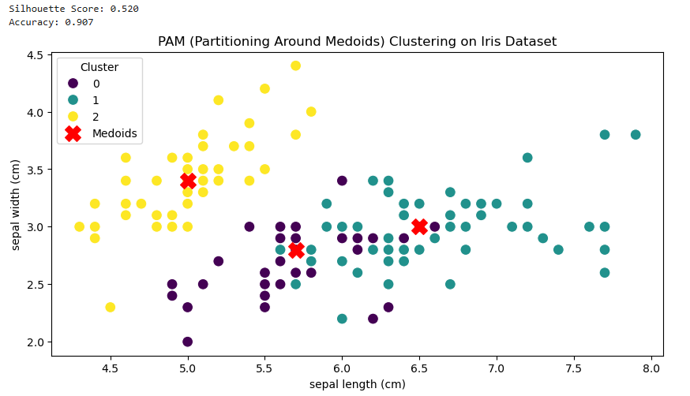
 

## [1-2-2] CLARANS(Clustering Large Applications based on RANdomized Search)
▣ 정의: <ins>PAM의 확장판으로 대규모 데이터셋에 효율적인 군집화를 제공하기 위해 랜덤화된 탐색 방식을 사용하는 알고리즘</ins>. PAM의 전체 데이터셋 탐색 방식 대신 샘플링과 랜덤 선택을 통해 최적의 medoid를 찾는다 
▣ 필요성: PAM의 느린 성능을 보완하여 대규모 데이터에서도 빠르게 클러스터링을 수행할 수 있도록 설계 
▣ 장점: 대규모 데이터셋에 적용할 수 있으며, PAM보다 훨씬 효율적이며, 랜덤 탐색 방식을 통해 최적의 medoid를 빠르게 검색 
▣ 단점: 랜덤화된 탐색을 사용하기 때문에 실행 결과가 매번 다를 수 있으며, PAM과 동일하게 군집 수(K)를 사전에 지정해야 함 
▣ 응용분야: 대규모 고객 세분화, 금융 데이터 분석, 대규모 이미지 및 문서 분류 
▣ 모델식: 전체 데이터셋에서 일부를 랜덤하게 샘플링하여 최적의 medoid를 찾는 방식으로, 기존 PAM의 개념을 대규모 데이터셋에 맞게 확장. 이를 통해 데이터 탐색 과정을 줄이고 효율성을 강화 

	import numpy as np
	from sklearn.datasets import load_iris
	from sklearn.metrics import silhouette_score, accuracy_score
	from scipy.spatial.distance import cdist
	import pandas as pd
	import matplotlib.pyplot as plt
	import seaborn as sns
	from scipy.stats import mode
	
	class CLARANS:
	    def __init__(self, n_clusters=3, numlocal=5, maxneighbor=10, random_state=None):
	        self.n_clusters = n_clusters
	        self.numlocal = numlocal  # 랜덤 초기화 반복 횟수
	        self.maxneighbor = maxneighbor  # 각 초기화 당 랜덤 탐색 이웃 수
	        self.random_state = random_state
	
	    def fit_predict(self, X):
	        if self.random_state:
	            np.random.seed(self.random_state)
	        
	        best_medoids = None
	        best_score = float('inf')
	        labels = None
	
	        # numlocal번의 랜덤 초기화 반복
	        for _ in range(self.numlocal):
	            # 초기 메도이드 랜덤 선택
	            medoids = np.random.choice(len(X), self.n_clusters, replace=False)
	            current_score = self._calculate_total_cost(X, medoids)
	
	            improved = True
	            while improved:
	                improved = False
	                # maxneighbor 번 만큼 랜덤으로 이웃 탐색
	                for _ in range(self.maxneighbor):
	                    # 현재 메도이드 중 하나와 비메도이드 중 하나를 교환
	                    new_medoids = np.copy(medoids)
	                    non_medoids = [i for i in range(len(X)) if i not in medoids]
	                    new_medoids[np.random.randint(0, self.n_clusters)] = np.random.choice(non_medoids)
	                    
	                    # 새로운 메도이드 셋으로 비용 계산
	                    new_score = self._calculate_total_cost(X, new_medoids)
	                    if new_score < current_score:
	                        medoids = new_medoids
	                        current_score = new_score
	                        improved = True
	                        break
	            
	            # 최적의 메도이드 셋 업데이트
	            if current_score < best_score:
	                best_medoids = medoids
	                best_score = current_score
	                labels = np.argmin(cdist(X, X[best_medoids]), axis=1)
	
	        self.medoids_ = best_medoids
	        self.labels_ = labels
	        return self.labels_
	
	    def _calculate_total_cost(self, X, medoids):
	        # 메도이드 셋에 대한 총 비용(거리 합계) 계산
	        distances = cdist(X, X[medoids], metric='euclidean')
	        return np.sum(np.min(distances, axis=1))
	
	# Iris 데이터셋 로드
	iris = load_iris()
	data = pd.DataFrame(iris.data, columns=iris.feature_names)
	true_labels = iris.target
	
	# CLARANS 알고리즘 적용 (군집 수: 3)
	clarans = CLARANS(n_clusters=3, numlocal=5, maxneighbor=10, random_state=0)
	clusters = clarans.fit_predict(iris.data)  # 데이터에 맞춰 군집화 수행
	
	# 군집화 결과를 데이터프레임에 추가
	data['Cluster'] = clusters  # 각 데이터 포인트의 군집 레이블 추가
	
	# Silhouette Score 계산
	silhouette_avg = silhouette_score(iris.data, clusters)
	print(f"Silhouette Score: {silhouette_avg:.3f}")
	
	# Accuracy 계산 (군집 레이블과 실제 레이블을 매칭하여 정확도 계산)
	mapped_labels = np.zeros_like(clusters)
	for i in np.unique(clusters):
	    mask = (clusters == i)
	    mapped_labels[mask] = mode(true_labels[mask])[0]
	
	accuracy = accuracy_score(true_labels, mapped_labels)
	print(f"Accuracy: {accuracy:.3f}")
	
	# 시각화 (첫 번째와 두 번째 피처 사용)
	plt.figure(figsize=(10, 5))
	sns.scatterplot(x=data.iloc[:, 0], y=data.iloc[:, 1], hue='Cluster', data=data, palette='viridis', s=100)
	plt.scatter(iris.data[clarans.medoids_, 0], iris.data[clarans.medoids_, 1], c='red', marker='X', s=200, label='Medoids')
	plt.title("CLARANS Clustering on Iris Dataset")
	plt.xlabel(iris.feature_names[0])  # 첫 번째 피처 (sepal length)
	plt.ylabel(iris.feature_names[1])  # 두 번째 피처 (sepal width)
	plt.legend(title='Cluster')
	plt.show()

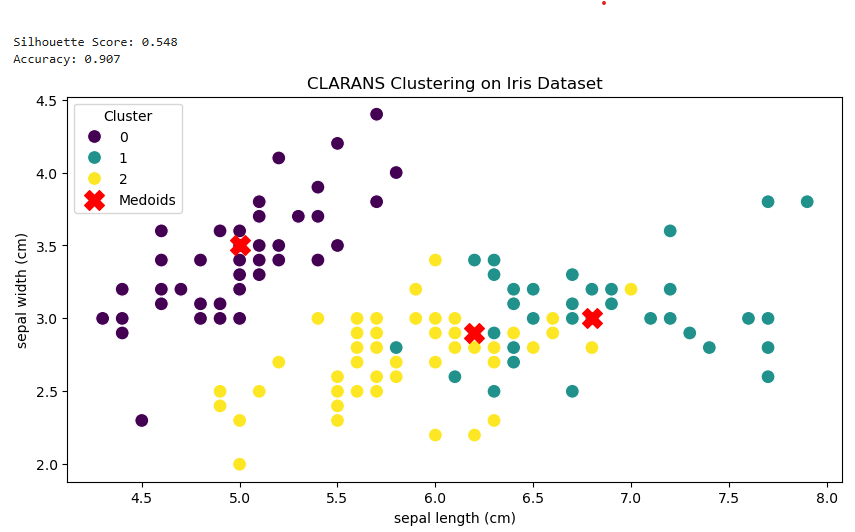
 

## [1-2-3] CLARA(Clustering LARge Applications)
▣ 정의: PAM을 대규모 데이터에 적용할 수 있도록 확장한 알고리즘으로, <ins>데이터의 일부 샘플을 사용하여 군집화를 수행하여 여러 번의 샘플링을 통해 가장 안정적인 medoid를 선택</ins> 
▣ 필요성: PAM의 높은 계산 비용을 줄이고자 개발되어 대규모 데이터셋에서도 빠르게 군집화를 수행 
▣ 장점: PAM보다 계산이 효율적이며, 대규모 데이터셋에 적합하며, 표본 기반 접근 방식을 통해 메모리와 시간 효율적 
▣ 단점: 샘플링을 통해 결과의 신뢰도가 낮아질 수 있으며, 전체 데이터셋을 반영하지 못할 가능성. 군집 수(K)를 사전에 지정해야 함 
▣ 응용분야: 대규모 고객 데이터의 군집화, 생물학적 데이터 분석, 시장 조사 데이터의 분석 및 군집화 
▣ 모델식: 데이터셋에서 일부 샘플을 선택하여 PAM을 적용하고, 여러 번 반복 수행하여 최적의 medoid를 찾는다 

	import numpy as np	
	from sklearn.datasets import load_iris
	from sklearn.metrics import silhouette_score, accuracy_score
	from scipy.spatial.distance import cdist
	import pandas as pd
	import matplotlib.pyplot as plt
	import seaborn as sns
	from scipy.stats import mode
	
	class CLARA:
	    def __init__(self, n_clusters=3, n_samples=25, numlocal=5, max_iter=300, random_state=None):
	        self.n_clusters = n_clusters
	        self.n_samples = n_samples  # 각 샘플의 크기
	        self.numlocal = numlocal    # PAM 반복 횟수
	        self.max_iter = max_iter    # 최대 반복 횟수
	        self.random_state = random_state
	
	    def fit_predict(self, X):
	        if self.random_state:
	            np.random.seed(self.random_state)
	
	        best_medoids = None
	        best_score = float('inf')
	        best_labels = None
	
	        # numlocal 번의 샘플링 반복
	        for _ in range(self.numlocal):
	            # 데이터에서 무작위로 샘플링
	            sample_indices = np.random.choice(len(X), self.n_samples, replace=False)
	            sample = X[sample_indices]
	
	            # PAM을 샘플에 적용하여 최적의 메도이드 찾기
	            medoids = self._initialize_medoids(sample)
	            for _ in range(self.max_iter):
	                distances = cdist(sample, sample[medoids], metric='euclidean')
	                labels = np.argmin(distances, axis=1)
	                
	                new_medoids = np.copy(medoids)
	                for i in range(self.n_clusters):
	                    cluster_points = np.where(labels == i)[0]
	                    intra_cluster_distances = cdist(sample[cluster_points], sample[cluster_points], metric='euclidean').sum(axis=1)
	                    new_medoids[i] = cluster_points[np.argmin(intra_cluster_distances)]
	
	                if np.array_equal(medoids, new_medoids):
	                    break
	                medoids = new_medoids
	
	            # 전체 데이터에 대한 비용 계산
	            full_distances = cdist(X, sample[medoids], metric='euclidean')
	            full_score = np.sum(np.min(full_distances, axis=1))
	
	            # 더 나은 메도이드 셋이 발견되면 갱신
	            if full_score < best_score:
	                best_medoids = medoids
	                best_score = full_score
	                best_labels = np.argmin(full_distances, axis=1)
	
	        self.medoids_ = sample[best_medoids]  # 최적의 메도이드를 전체 데이터셋에서 인덱싱
	        self.labels_ = best_labels
	        return self.labels_
	
	    def _initialize_medoids(self, X):
	        return np.random.choice(len(X), self.n_clusters, replace=False)
	
	# Iris 데이터셋 로드
	iris = load_iris()
	data = pd.DataFrame(iris.data, columns=iris.feature_names)
	true_labels = iris.target
	
	# CLARA 알고리즘 적용 (군집 수: 3)
	clara = CLARA(n_clusters=3, n_samples=30, numlocal=5, max_iter=300, random_state=0)
	clusters = clara.fit_predict(iris.data)  # 전체 데이터에 대해 군집화 수행
	
	# 군집화 결과를 데이터프레임에 추가
	data['Cluster'] = clusters  # 각 데이터 포인트의 군집 레이블 추가
	
	# Silhouette Score 계산
	silhouette_avg = silhouette_score(iris.data, clusters)
	print(f"Silhouette Score: {silhouette_avg:.3f}")
	
	# Accuracy 계산 (군집 레이블과 실제 레이블을 매칭하여 정확도 계산)
	mapped_labels = np.zeros_like(clusters)
	for i in np.unique(clusters):
	    mask = (clusters == i)
	    mapped_labels[mask] = mode(true_labels[mask])[0]
	
	accuracy = accuracy_score(true_labels, mapped_labels)
	print(f"Accuracy: {accuracy:.3f}")
	
	# 시각화 (첫 번째와 두 번째 피처 사용)
	plt.figure(figsize=(10, 5))
	sns.scatterplot(x=data.iloc[:, 0], y=data.iloc[:, 1], hue='Cluster', data=data, palette='viridis', s=100)
	plt.scatter(clara.medoids_[:, 0], clara.medoids_[:, 1], c='red', marker='X', s=200, label='Medoids')
	plt.title("CLARA Clustering on Iris Dataset")
	plt.xlabel(iris.feature_names[0])  # 첫 번째 피처 (sepal length)
	plt.ylabel(iris.feature_names[1])  # 두 번째 피처 (sepal width)
	plt.legend(title='Cluster')
	plt.show()
	
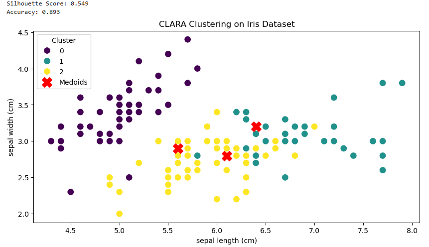
 

# [1-3] K-modes
▣ 정의 : K-modes는 범주형(categorical) 데이터에 맞춘 K-means 변형이다. <ins>평균 대신 최빈값(mode)을 중심으로 사용하며, 유클리드 거리 대신 불일치 개수(Hamming-like dissimilarity)로 군집을 만든다.</ins> 
▣ 장점 : 범주형 데이터에서 평균이 의미 없다는 문제를 해결, 중심이 “최빈값 조합”이라 해석이 쉬움(전형적 범주 패턴) 
▣ 단점 : 연속형 데이터에는 부적합(범주화 필요), 범주화 방식(구간 수/경계)에 따라 결과가 달라질 수 있음, K와 초기 모드에 민감할 수 있음 
▣ 응용분야 : 설문조사(리커트 척도), 고객 속성(지역/직업/등급), 로그의 이벤트 타입 등 범주형 특징이 중심인 데이터 군집 

	# iris는 원래 연속형 수치 데이터이므로, K-modes를 적용하려면 값을 구간화(범주화)하여 범주형으로 변경
	import numpy as np
	from sklearn.datasets import load_iris
	from sklearn.metrics import silhouette_score, accuracy_score
	import pandas as pd
	import matplotlib.pyplot as plt
	import seaborn as sns
	from scipy.stats import mode
	
	class SimpleKModes:
	    def __init__(self, n_clusters=3, max_iter=100, random_state=None):
	        self.n_clusters = n_clusters
	        self.max_iter = max_iter
	        self.random_state = random_state
	
	    def fit_predict(self, X):
	        if self.random_state:
	            np.random.seed(self.random_state)
	        
	        # 초기 클러스터 중심을 무작위로 선택
	        centers = X.sample(n=self.n_clusters, random_state=self.random_state).to_numpy()
	        
	        for _ in range(self.max_iter):
	            # 각 데이터 포인트와 중심 간 일치하지 않는 항목 수로 거리 계산
	            distances = np.array([[np.sum(x != center) for center in centers] for x in X.to_numpy()])
	            labels = np.argmin(distances, axis=1)
	            
	            # 각 클러스터에 대해 새로운 중심 계산
	            new_centers = np.array([
	                X[labels == i].mode().iloc[0].to_numpy() if len(X[labels == i]) > 0 else centers[i]
	                for i in range(self.n_clusters)
	            ])
	            
	            # 중심이 변하지 않으면 수렴
	            if np.array_equal(centers, new_centers):
	                break
	            centers = new_centers
	
	        self.labels_ = labels
	        self.centers_ = centers
	        return labels
	
	# Iris 데이터셋 로드
	iris = load_iris()
	data = pd.DataFrame(iris.data, columns=iris.feature_names)
	true_labels = iris.target
	
	# 데이터를 범주형으로 변환 (Low, Medium, High)
	data_cat = data.apply(lambda x: pd.cut(x, bins=3, labels=["Low", "Medium", "High"]))
	
	# 범주형 데이터를 숫자로 인코딩
	data_encoded = data_cat.apply(lambda x: x.cat.codes)
	
	# Simple K-Modes 클러스터링 적용
	simple_kmodes = SimpleKModes(n_clusters=3, max_iter=100, random_state=0)
	clusters = simple_kmodes.fit_predict(data_encoded)
	
	# 군집화 결과 추가
	data["Cluster"] = clusters  # 원본 데이터에 군집화 결과를 추가
	
	# Silhouette Score 계산
	silhouette_avg = silhouette_score(data_encoded, clusters)
	print(f"Silhouette Score: {silhouette_avg:.3f}")
	
	# Accuracy 계산 (군집 레이블과 실제 레이블을 매칭하여 정확도 계산)
	mapped_labels = np.zeros_like(clusters)
	for i in np.unique(clusters):
	    mask = (clusters == i)
	    mapped_labels[mask] = mode(true_labels[mask])[0]
	
	accuracy = accuracy_score(true_labels, mapped_labels)
	print(f"Accuracy: {accuracy:.3f}")
	
	# 시각화 (첫 번째와 두 번째 피처 사용)
	plt.figure(figsize=(10, 5))
	sns.scatterplot(x=data.iloc[:, 0], y=data.iloc[:, 1], hue="Cluster", data=data, palette="viridis", s=100)
	plt.title("Simple K-Modes Clustering on Iris Dataset (First 2 Features)")
	plt.xlabel(iris.feature_names[0])  # 첫 번째 피처 (sepal length)
	plt.ylabel(iris.feature_names[1])  # 두 번째 피처 (sepal width)
	plt.legend(title="Cluster")
	plt.show()

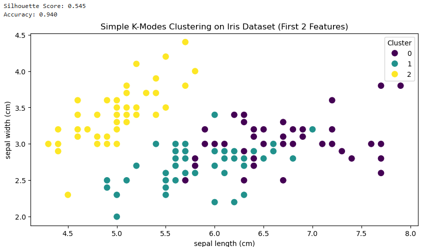
 

	import numpy as np
	from sklearn.datasets import load_iris
	from sklearn.metrics import silhouette_score, accuracy_score
	import pandas as pd
	import matplotlib.pyplot as plt
	import seaborn as sns
	from scipy.stats import mode
	from sklearn.decomposition import PCA
	
	class SimpleKModes:
	    def __init__(self, n_clusters=3, max_iter=100, random_state=None):
	        self.n_clusters = n_clusters
	        self.max_iter = max_iter
	        self.random_state = random_state
	
	    def fit_predict(self, X):
	        if self.random_state:
	            np.random.seed(self.random_state)
	        
	        # 초기 클러스터 중심을 무작위로 선택
	        centers = X.sample(n=self.n_clusters, random_state=self.random_state).to_numpy()
	        
	        for _ in range(self.max_iter):
	            # 각 데이터 포인트와 중심 간 일치하지 않는 항목 수로 거리 계산
	            distances = np.array([[np.sum(x != center) for center in centers] for x in X.to_numpy()])
	            labels = np.argmin(distances, axis=1)
	            
	            # 각 클러스터에 대해 새로운 중심 계산
	            new_centers = np.array([
	                X[labels == i].mode().iloc[0].to_numpy() if len(X[labels == i]) > 0 else centers[i]
	                for i in range(self.n_clusters)
	            ])
	            
	            # 중심이 변하지 않으면 수렴
	            if np.array_equal(centers, new_centers):
	                break
	            centers = new_centers
	
	        self.labels_ = labels
	        self.centers_ = centers
	        return labels
	
	# ------------------------
	# 실행부
	# ------------------------
	
	# Iris 데이터셋 로드
	iris = load_iris()
	data = pd.DataFrame(iris.data, columns=iris.feature_names)
	true_labels = iris.target
	
	# 데이터를 범주형으로 변환 (Low, Medium, High)
	data_cat = data.apply(lambda x: pd.cut(x, bins=3, labels=["Low", "Medium", "High"]))
	
	# 범주형 데이터를 숫자로 인코딩
	data_encoded = data_cat.apply(lambda x: x.cat.codes)
	
	# Simple K-Modes 클러스터링 적용 (4개 feature 모두 사용)
	simple_kmodes = SimpleKModes(n_clusters=3, max_iter=100, random_state=0)
	clusters = simple_kmodes.fit_predict(data_encoded)
	
	# 군집화 결과 추가
	data["Cluster"] = clusters
	
	# Silhouette Score 계산
	silhouette_avg = silhouette_score(data_encoded, clusters)
	print(f"Silhouette Score: {silhouette_avg:.3f}")
	
	# Accuracy 계산 (군집 레이블과 실제 라벨을 매핑하여 정확도 계산)
	mapped_labels = np.zeros_like(clusters)
	for i in np.unique(clusters):
	    mask = (clusters == i)
	    mapped_labels[mask] = mode(true_labels[mask])[0]
	
	accuracy = accuracy_score(true_labels, mapped_labels)
	print(f"Accuracy: {accuracy:.3f}")
	
	# ------------------------
	# 시각화 (PCA로 2차원 축소)
	# ------------------------
	pca = PCA(n_components=2)
	X_pca = pca.fit_transform(data_encoded)
	
	plt.figure(figsize=(10, 5))
	sns.scatterplot(x=X_pca[:, 0], y=X_pca[:, 1], hue="Cluster", data=data, palette="viridis", s=100)
	plt.title("Simple K-Modes Clustering on Iris Dataset (All 4 Features, PCA 2D)")
	plt.xlabel("PCA Component 1")
	plt.ylabel("PCA Component 2")
	plt.legend(title="Cluster")
	plt.show()

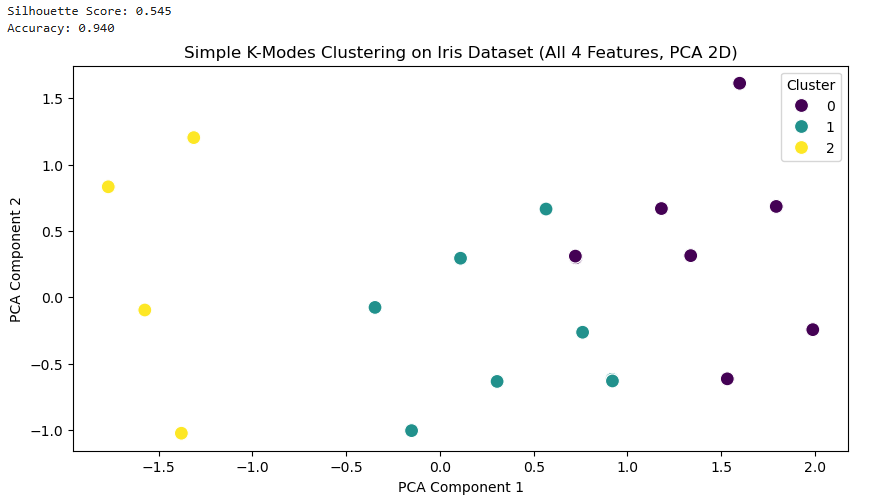
 

---

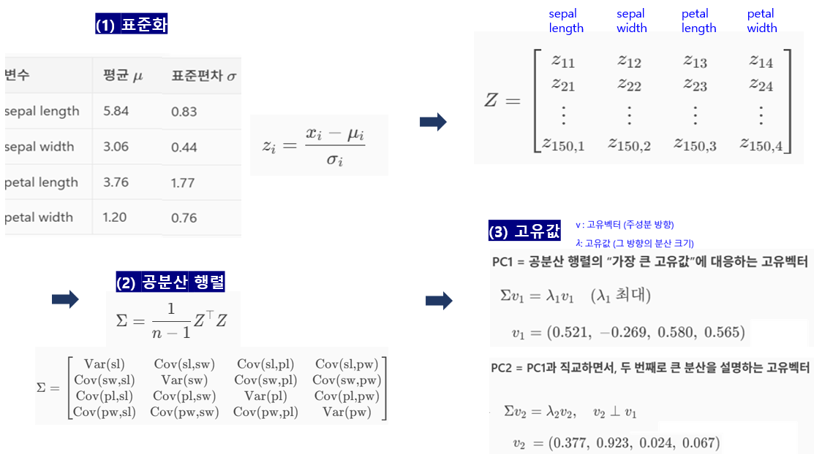

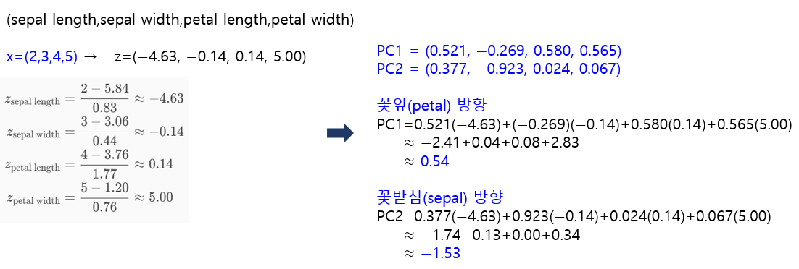

---

# [1-4] K-prototypes
▣ 정의 : K-prototypes는 수치형(연속형)과 범주형(카테고리)이 섞인 혼합 데이터에 대해, <ins>수치형은 K-means(평균), 범주형은 K-modes(최빈값) 방식으로 중심을 갱신</ins>하는 알고리즘이다. 혼합 거리에서 범주형 불일치 항의 가중치로 gamma를 사용한다. 
▣ 장점 : 수치형+범주형 혼합 데이터를 하나의 모델로 자연스럽게 군집화 가능, 데이터 타입별로 적절한 중심 갱신(평균/최빈값)을 사용 
▣ 단점 : gamma(범주형 항 가중치) 선택이 결과에 영향, 범주화 방식과 가중치 설정이 임의적일 수 있음(해석/재현성 이슈), 구현 및 튜닝이 K-means보다 복잡 
▣ 응용분야 : 고객 데이터(나이/소득 같은 수치 + 지역/등급 같은 범주), 의료 데이터(측정치 + 범주형 진단 코드), 기업 리스크/신용 데이터(연속 + 등급/범주) 등 

	from sklearn.datasets import load_iris
	from sklearn.preprocessing import StandardScaler
	from sklearn.metrics import silhouette_score
	import numpy as np
	from collections import Counter
	
	# ── 데이터 로드 및 전처리 ──────────────────────────────────────
	iris = load_iris()
	X, y = iris.data, iris.target
	
	# 표준화
	scaler = StandardScaler()
	X_std = scaler.fit_transform(X)
	
	# ── 헬퍼 함수 정의 ────────────────────────────────────────────
	def bin_quantiles(arr, bins=3):
	    """각 열을 분위수 기준으로 bins개 범주로 이산화"""
	    result = np.zeros_like(arr, dtype=int)
	    for j in range(arr.shape[1]):
	        quantiles = np.percentile(arr[:, j], np.linspace(0, 100, bins + 1))
	        quantiles = np.unique(quantiles)
	        result[:, j] = np.digitize(arr[:, j], quantiles[1:-1])
	    return result
	
	def best_map_accuracy(labels, y):
	    """헝가리안 매핑 없이 최적 순열로 정확도 계산"""
	    from itertools import permutations
	    classes = np.unique(y)
	    clusters = np.unique(labels)
	    best_acc, best_mapping = 0, {}
	    for perm in permutations(classes):
	        mapping = {c: p for c, p in zip(clusters, perm)}
	        mapped = np.array([mapping[l] for l in labels])
	        acc = np.mean(mapped == y)
	        if acc > best_acc:
	            best_acc, best_mapping = acc, mapping
	    return best_acc, best_mapping
	
	def plot_pca_scatter(X, labels, title=""):
	    """PCA 2D 산점도"""
	    from sklearn.decomposition import PCA
	    import matplotlib.pyplot as plt
	    pca = PCA(n_components=2)
	    X2 = pca.fit_transform(X)
	    plt.figure(figsize=(6, 4))
	    for k in np.unique(labels):
	        mask = labels == k
	        plt.scatter(X2[mask, 0], X2[mask, 1], label=f"Cluster {k}", s=40)
	    plt.title(title)
	    plt.xlabel("PC1"); plt.ylabel("PC2")
	    plt.legend(); plt.tight_layout(); plt.show()
	
	# ── 혼합 데이터 구성 ──────────────────────────────────────────
	X_num = X_std[:, :2]
	X_cat2 = bin_quantiles(X[:, 2:], bins=3)
	
	# ── K-Prototypes 구현 ─────────────────────────────────────────
	def kprototypes(X_num, X_cat, K, gamma=1.0, n_init=20, max_iter=200, seed=42):
	    rng = np.random.default_rng(seed)
	    n, pnum = X_num.shape
	    pcat = X_cat.shape[1]
	    best_cost = np.inf
	    best = None
	    for _ in range(n_init):
	        idx = rng.choice(n, size=K, replace=False)
	        cent_num = X_num[idx].copy()
	        cent_cat = X_cat[idx].copy()
	        for _ in range(max_iter):
	            dist = np.zeros((n, K))
	            for k in range(K):
	                dn = np.sum((X_num - cent_num[k])**2, axis=1)
	                dc = np.sum(X_cat != cent_cat[k], axis=1)
	                dist[:, k] = dn + gamma * dc
	            labels = np.argmin(dist, axis=1)
	            new_cent_num = cent_num.copy()
	            new_cent_cat = cent_cat.copy()
	            for k in range(K):
	                members = np.where(labels == k)[0]
	                if len(members) == 0:
	                    r = rng.integers(0, n)
	                    new_cent_num[k] = X_num[r]
	                    new_cent_cat[k] = X_cat[r]
	                else:
	                    new_cent_num[k] = X_num[members].mean(axis=0)
	                    for j in range(pcat):
	                        vals = X_cat[members, j]
	                        new_cent_cat[k, j] = Counter(vals).most_common(1)[0][0]
	            if np.allclose(new_cent_num, cent_num) and np.array_equal(new_cent_cat, cent_cat):
	                break
	            cent_num, cent_cat = new_cent_num, new_cent_cat
	        final_dist = np.zeros((n, K))
	        for k in range(K):
	            dn = np.sum((X_num - cent_num[k])**2, axis=1)
	            dc = np.sum(X_cat != cent_cat[k], axis=1)
	            final_dist[:, k] = dn + gamma * dc
	        cost = np.sum(np.min(final_dist, axis=1))
	        if cost < best_cost:
	            best_cost = cost
	            best = {"labels": labels, "cent_num": cent_num, "cent_cat": cent_cat, "gamma": gamma}
	    return best
	
	# ── gamma 튜닝 ────────────────────────────────────────────────
	best = None
	for gamma in [0.2, 0.5, 1.0, 2.0, 5.0]:
	    result = kprototypes(X_num, X_cat2, K=3, gamma=gamma, n_init=30, max_iter=300, seed=42)
	    labels = result["labels"]
	    sil = silhouette_score(X_std, labels)
	    acc, mapping = best_map_accuracy(labels, y)
	    if (best is None) or (sil > best["sil"]):
	        best = {"labels": labels, "sil": sil, "acc": acc, "mapping": mapping, "gamma": gamma}
	
	print("K-prototypes best gamma:", best["gamma"])
	print(f"Silhouette: {best['sil']:.4f}")
	print(f"Accuracy(best mapping): {best['acc']:.4f}, mapping={best['mapping']}")
	plot_pca_scatter(X_std, best["labels"], "K-prototypes (mixed Iris) (PCA 2D)")

 

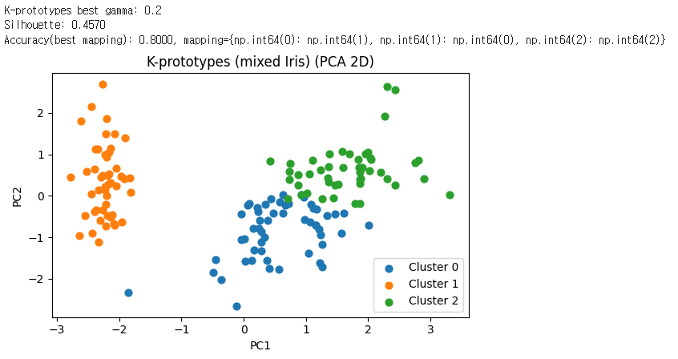

	Best gamma = 0.2 : 수치형 특성에 더 높은 가중치(범주형 정보를 너무 강하게 반영하면 오히려 실루엣이 낮아졌다는 의미)
	Silhouette Score = 0.4570 : 보통 수준의 클러스터링 품질
	Accuracy = 0.8000 : 150개 중 120개 정확 분류
	gamma가 너무 작으면 범주형 정보가 거의 무시되고(수치형 중심), 너무 크면 범주 불일치가 과도하게 지배한다.
	iris를 인위적으로 혼합형으로 만든 경우, 특정 gamma에서 군집이 실제 라벨과 더 잘 맞아 Accuracy가 높게 나올 수 있다.
	단, 이것은 “데이터를 범주화하여 구성한 실험적 시연”이므로, 연구에서는 원 데이터의 타입과 의미에 맞추어 혼합 데이터가 실제로 존재할 때 쓰는 것이 정석이다.

 

# [1-5] Mini-Batch K-means
▣ 정의 : Mini-Batch K-means는 K-means를 대규모 데이터에 적용하기 위해, 전체 데이터를 매 반복마다 쓰지 않고 <ins>작은 배치(mini-batch)만 샘플링해 중심을 업데이트</ins>하는 방식이다. 계산량을 크게 줄이는 대신 근사 최적해를 얻는다. 
▣ 장점 : 매우 큰 데이터에서 학습 속도가 크게 빨라짐, 스트리밍/온라인 학습처럼 데이터가 순차적으로 들어오는 환경에도 유리, K-means와 유사한 해석 가능(centroid 기반) 
▣ 단점 : 배치 샘플링으로 인해 결과 변동(분산)이 커질 수 있음, 배치 크기, 학습률 성격 파라미터에 민감할 수 있음, 작은 데이터에서는 일반 K-means 대비 장점이 크지 않음 
▣ 응용분야 : 대규모 고객/로그/임베딩 데이터 군집, 실시간 이벤트 스트리밍 군집, 대규모 문서/이미지 임베딩의 빠른 군집화 

	# ─────────────────────────────────────────────
	# 필수 라이브러리 import
	# ─────────────────────────────────────────────
	import numpy as np
	import matplotlib.pyplot as plt
	from sklearn.datasets import load_iris
	from sklearn.preprocessing import StandardScaler
	from sklearn.cluster import MiniBatchKMeans          # ← 누락된 핵심 import
	from sklearn.decomposition import PCA
	from sklearn.metrics import silhouette_score
	from scipy.optimize import linear_sum_assignment    # 클러스터-레이블 최적 매핑용
	
	# ─────────────────────────────────────────────
	# 데이터 로드 및 표준화
	# ─────────────────────────────────────────────
	iris = load_iris()
	X, y = iris.data, iris.target
	
	scaler = StandardScaler()
	X_std = scaler.fit_transform(X)   # 평균 0, 분산 1로 정규화
	
	# ─────────────────────────────────────────────
	# 클러스터 레이블 ↔ 실제 레이블 최적 매핑 정확도 계산 함수
	# Hungarian Algorithm으로 최적 순열 탐색
	# ─────────────────────────────────────────────
	def best_map_accuracy(labels, y):
	    n_clusters = len(np.unique(labels))
	    n_classes  = len(np.unique(y))
	    size       = max(n_clusters, n_classes)
	
	    # 혼동 행렬(cost matrix) 생성
	    cost_matrix = np.zeros((size, size), dtype=int)
	    for pred, true in zip(labels, y):
	        cost_matrix[pred][true] += 1
	
	    # 비용 최소화 → 정확도 최대화를 위해 음수 변환
	    row_ind, col_ind = linear_sum_assignment(-cost_matrix)
	
	    # 최적 매핑 딕셔너리 및 정확도 계산
	    mapping  = {r: c for r, c in zip(row_ind, col_ind)}
	    accuracy = cost_matrix[row_ind, col_ind].sum() / len(y)
	    return accuracy, mapping
	
	# ─────────────────────────────────────────────
	# PCA 2D 산점도 시각화 함수
	# ─────────────────────────────────────────────
	def plot_pca_scatter(X_std, labels, title, centers_2d=None):
	    pca  = PCA(n_components=2, random_state=42)
	    X_2d = pca.fit_transform(X_std)
	
	    colors = ["steelblue", "tomato", "seagreen"]
	    plt.figure(figsize=(7, 5))
	
	    # 클러스터별 색상 구분 산점도
	    for cluster_id in np.unique(labels):
	        mask = labels == cluster_id
	        plt.scatter(
	            X_2d[mask, 0], X_2d[mask, 1],
	            c=colors[cluster_id % len(colors)],
	            label=f"Cluster {cluster_id}",
	            alpha=0.7, edgecolors="k", linewidths=0.4
	        )
	
	    # 클러스터 중심점 표시 (전달된 경우)
	    if centers_2d is not None:
	        plt.scatter(
	            centers_2d[:, 0], centers_2d[:, 1],
	            c="gold", marker="*", s=280,
	            edgecolors="k", linewidths=0.8,
	            label="Centers", zorder=5
	        )
	
	    plt.title(title, fontsize=13)
	    plt.xlabel("PC 1")
	    plt.ylabel("PC 2")
	    plt.legend()
	    plt.tight_layout()
	    plt.show()
	
	# ─────────────────────────────────────────────
	# MiniBatchKMeans 하이퍼파라미터 튜닝
	# batch_size × max_iter 조합 중 Silhouette 최고 모델 선택
	# ─────────────────────────────────────────────
	best = None
	
	for batch_size in [10, 20, 40, 80]:
	    for max_iter in [300, 600, 1000]:
	
	        model = MiniBatchKMeans(
	            n_clusters=3,
	            init="k-means++",        # 초기 중심점 스마트 선택
	            batch_size=batch_size,   # 미니배치 크기
	            max_iter=max_iter,       # 최대 반복 횟수
	            n_init=50,               # 초기화 반복 횟수 (안정성 향상)
	            reassignment_ratio=0.01, # 재배정 비율 (소규모 클러스터 방지)
	            random_state=42
	        )
	
	        labels = model.fit_predict(X_std)
	
	        # 실루엣 점수: 클러스터 내 응집도 vs 분리도 (-1 ~ 1, 높을수록 좋음)
	        sil = silhouette_score(X_std, labels)
	
	        # 실제 레이블과의 최적 매핑 정확도 계산
	        acc, mapping = best_map_accuracy(labels, y)
	
	        # 실루엣 기준 최적 모델 갱신
	        if (best is None) or (sil > best["sil"]):
	            best = {
	                "model"     : model,
	                "labels"    : labels,
	                "sil"       : sil,
	                "acc"       : acc,
	                "mapping"   : mapping,
	                "batch_size": batch_size,
	                "max_iter"  : max_iter
	            }
	
	# ─────────────────────────────────────────────
	# 최적 모델 결과 출력 및 시각화
	# ─────────────────────────────────────────────
	
	# PCA로 클러스터 중심도 2D 변환 (시각화용)
	pca        = PCA(n_components=2, random_state=42)
	X_2d       = pca.fit_transform(X_std)
	centers_2d = pca.transform(best["model"].cluster_centers_)
	
	print("── MiniBatch K-Means 최적 파라미터 ──")
	print(f"  batch_size : {best['batch_size']}")
	print(f"  max_iter   : {best['max_iter']}")
	print(f"  Silhouette : {best['sil']:.4f}")
	print(f"  Accuracy   : {best['acc']:.4f}  (mapping={best['mapping']})")
	
	plot_pca_scatter(
	    X_std,
	    best["labels"],
	    "Mini-Batch K-Means on Iris (PCA 2D)",
	    centers_2d=centers_2d
	)
	
 

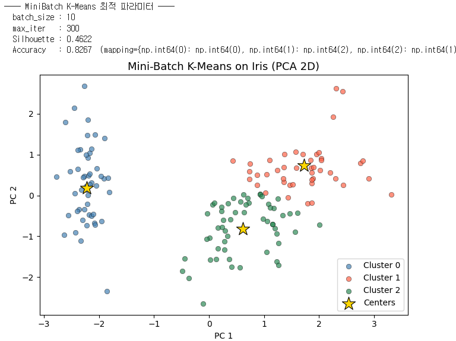

	iris처럼 작은 데이터에서는 Mini-Batch가 일반 K-means와 성능이 거의 비슷하게 나오는 경우가 많다.
	차이는 주로 “대규모 데이터에서 속도”이며, iris에서는 그 장점이 크게 드러나지 않는다.
	다만 batch_size가 너무 작으면 중심 업데이트가 불안정해질 수 있으므로, silhouette 변화를 보고 적절한 배치 크기를 선택한다.

 	

# [1-6] FCM(Fuzzy C-means) 
▣ 정의 : Fuzzy C-means(FCM)는 <ins>각 데이터가 하나의 클러스터에만 속한다고 가정하지 않고, 여러 클러스터에 속할 소속도(membership)를 0~1 사이로 부여</ins>하는 퍼지 군집화 방법이다.  
▣ 장점 : 군집 경계가 모호한 경우에도 소속도로 표현 가능, “부분적으로 여러 군집에 속하는” 현상을 자연스럽게 모델링, hard clustering(K-means)보다 유연한 해석 가능 
▣ 단점 : fuzzifier(m) 등 하이퍼파라미터에 민감, 이상치에 취약할 수 있으며, 계산량이 K-means보다 큼, 최종적으로 hard label이 필요하면 소속도에서 argmax로 변환해야 함(정보 일부 손실) 
▣ 응용분야 : 의료/생물 데이터(경계가 모호한 군집), 이미지 분할(픽셀이 여러 영역 성격을 가질 때), 고객 세그먼트의 혼합 소속(충성 고객과 가격 민감 고객 특성이 동시에 존재) 등 

	import numpy as np
	from sklearn.datasets import load_iris
	from sklearn.metrics import silhouette_score, accuracy_score
	import pandas as pd
	import matplotlib.pyplot as plt
	import seaborn as sns
	from scipy.stats import mode
	
	class FCM:
	    def __init__(self, n_clusters=3, m=2.0, max_iter=300, error=1e-5, random_state=None):
	        self.n_clusters = n_clusters
	        self.m = m
	        self.max_iter = max_iter
	        self.error = error
	        self.random_state = random_state
	
	    def initialize_membership(self, n_samples):
	        if self.random_state:
	            np.random.seed(self.random_state)
	        U = np.random.rand(n_samples, self.n_clusters)
	        U = U / np.sum(U, axis=1, keepdims=True)
	        return U
	
	    def update_centers(self, X, U):
	        um = U ** self.m
	        return (um.T @ X) / np.sum(um.T, axis=1, keepdims=True)
	
	    def update_membership(self, X, centers):
	        dist = np.linalg.norm(X[:, np.newaxis] - centers, axis=2)
	        dist = np.fmax(dist, np.finfo(np.float64).eps)
	        inv_dist = dist ** (- 2 / (self.m - 1))
	        return inv_dist / np.sum(inv_dist, axis=1, keepdims=True)
	
	    def fit(self, X):
	        n_samples = X.shape[0]
	        U = self.initialize_membership(n_samples)
	
	        for _ in range(self.max_iter):
	            U_old = U.copy()
	            centers = self.update_centers(X, U)
	            U = self.update_membership(X, centers)
	            if np.linalg.norm(U - U_old) < self.error:
	                break
	
	        self.centers = centers
	        self.u = U
	        self.labels_ = np.argmax(U, axis=1)
	        return self
	
	    def predict(self, X):
	        return np.argmax(self.update_membership(X, self.centers), axis=1)
	
	# Iris 데이터셋 로드
	iris = load_iris()
	data = iris.data
	true_labels = iris.target
	
	# FCM 알고리즘 적용
	fcm = FCM(n_clusters=3, m=2.0, max_iter=300, random_state=0)
	fcm.fit(data)
	
	# 각 데이터 포인트의 군집 소속도 (멤버십) 및 군집 레이블 예측
	fcm_labels = fcm.labels_
	membership_matrix = fcm.u
	
	# 데이터프레임으로 변환하여 시각화 준비
	df = pd.DataFrame(data, columns=iris.feature_names)
	df['Cluster'] = fcm_labels
	df['Membership 1'] = membership_matrix[:, 0]
	df['Membership 2'] = membership_matrix[:, 1]
	df['Membership 3'] = membership_matrix[:, 2]
	
	# Silhouette Score 계산
	silhouette_avg = silhouette_score(data, fcm_labels)
	print(f"Silhouette Score: {silhouette_avg:.3f}")
	
	# Accuracy 계산 (군집 레이블과 실제 레이블을 매칭하여 정확도 계산)
	mapped_labels = np.zeros_like(fcm_labels)
	for i in np.unique(fcm_labels):
	    mask = (fcm_labels == i)
	    mapped_labels[mask] = mode(true_labels[mask])[0]
	
	accuracy = accuracy_score(true_labels, mapped_labels)
	print(f"Accuracy: {accuracy:.3f}")
	
	# 시각화 (첫 번째와 두 번째 피처 사용)
	plt.figure(figsize=(10, 5))
	sns.scatterplot(x=df.iloc[:, 0], y=df.iloc[:, 1], hue='Cluster', data=df, palette='viridis', s=100)
	plt.scatter(fcm.centers[:, 0], fcm.centers[:, 1], c='red', marker='X', s=200, label='Centers')
	plt.title("Fuzzy C-means (FCM) Clustering on Iris Dataset")
	plt.xlabel(iris.feature_names[0])  # 첫 번째 피처 (sepal length)
	plt.ylabel(iris.feature_names[1])  # 두 번째 피처 (sepal width)
	plt.legend(title='Cluster')
	plt.show()
                                                                          
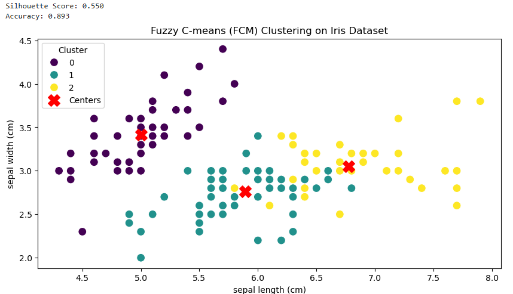
 

<!--
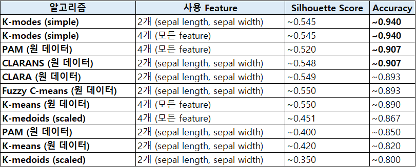
-->

## [1-1] K-means

| 항목 | 내용 |
|------|------|
| **구성요소** | 데이터 포인트 $x_i \in \mathbb{R}^p$, 군집 수 $K$, 군집 중심 $m_j$ |
| **거리함수** | 유클리드 거리 (제곱 거리) $d(x_i, m_j) = \lVert x_i - m_j \rVert^2 = \sum_{k=1}^{p}(x_{ik} - m_{jk})^2$ |
| **목적함수** | 전체 제곱거리 최소화 $J = \sum_{j=1}^{K}\sum_{x_i \in C_j} \lVert x_i - m_j \rVert^2$ |
| **중심갱신** | 각 군집의 평균으로 갱신 $m_j = \frac{1}{\lvert C_j \rvert}\sum_{x_i \in C_j} x_i$ |
| **목표** | 군집 내 분산(SSE) 최소화 — 컴팩트하고 원형 구조 추출 |
| **할당규칙** | 가장 가까운 중심에 할당 $c_i = \arg\min_{j \in \{1,\dots,K\}} \lVert x_i - m_j \rVert^2$ |

## [1-2] K-medoids

| 항목 | PAM: Partitioning Around Medoids |
|------|------|
| **구성요소** | 데이터 포인트 $x_i$, 군집 대표점(메도이드) $m_j$ (데이터 중 실제 샘플) |
| **거리함수** | 일반 거리 (유클리드, 맨해튼 등) $d(x_i, m_j) = \lVert x_i - m_j \rVert$ |
| **목적함수** | 절댓값 거리합 최소화 $J = \sum_{j=1}^{K}\sum_{x_i \in C_j} d(x_i, m_j)$ |
| **중심갱신** | 군집 내에서 전체 거리합이 최소인 실제 데이터 포인트로 갱신 $m_j = \arg\min_{x_h \in C_j} \sum_{x_i \in C_j} d(x_i, x_h)$ |
| **목표** | 이상치(Outlier)에 강건한 중심 선택 — 군집 내 거리합 최소화 |

| 항목 | CLARANS / CLARA |
|------|------|
| **구성요소** | 대규모 데이터셋, 샘플링 기반 메도이드 탐색 알고리즘 CLARA(Clustering LARge Applications), CLARANS(Clustering Large Applications based on RANdomized Search) |
| **거리함수** | K-medoids와 동일 (유클리드 거리, 맨해튼 거리 등 일반 거리 척도) $d(x_i, m_j) = \lVert x_i - m_j \rVert$ |
| **목적함수** | 군집 내 거리합 최소화 $J = \sum_{j=1}^{K}\sum_{x_i \in C_j} d(x_i, m_j)$ |
| **중심갱신** | **CLARA:** 전체 데이터 중 일부를 샘플링하여 PAM(K-medoids) 수행 후 대표 메도이드 선택 **CLARANS:** 무작위 탐색(Randomized Search)을 통해 메도이드 후보 교체 — 비용이 감소하면 새로운 메도이드로 채택 |
| **목표** | K-medoids의 정확도를 유지하면서 대규모 데이터에서도 효율적으로 수행 — 샘플링 및 확률적 탐색으로 계산 복잡도 감소 |

## [1-3] K-modes

| 항목 | 내용 |
|------|------|
| **구성요소** | 범주형 데이터 $x_i = (x_{i1}, x_{i2}, \ldots, x_{ip})$, 군집 모드(최빈값) $m_j$ |
| **거리함수** | 불일치 거리(Dissimilarity) $d(x_i, m_j) = \sum_{k=1}^{p} \delta(x_{ik}, m_{jk})$, &nbsp;&nbsp;단 $\delta(a,b)=0$ (if $a=b$), $\;1$ (if $a \ne b$) |
| **목적함수** | 불일치 개수의 합 최소화 $J = \sum_{j=1}^{K}\sum_{x_i \in C_j} d(x_i, m_j)$ |
| **중심갱신** | 각 속성별로 최빈값(mode)으로 갱신 $m_{jk} = \arg\max_v \text{count}(x_{ik}=v, \; x_i \in C_j)$ |
| **목표** | 군집 내 속성 불일치 최소화 — 범주형 속성 기반 패턴 탐색 |

## [1-4] K-prototypes

| 항목 | 내용 |
|------|------|
| **구성요소** | 수치형 $x_i^r$, 범주형 $x_i^c$, 가중치 $\gamma$, 프로토타입 $Q_j$ |
| **거리함수** | 혼합 거리 (유클리드 + 불일치 거리) $d(x_i, Q_j) = \sum_{k=1}^{p}(x_{ik}^r - q_{jk}^r)^2 + \gamma \sum_{l=1}^{q} \delta(x_{il}^c, q_{jl}^c)$ |
| **목적함수** | 수치형 분산과 범주형 불일치 합의 가중 결합 최소화 $J = \sum_{j=1}^{K}\sum_{x_i \in C_j} d(x_i, Q_j)$ |
| **중심갱신** | 수치형은 **평균(Mean)**, 범주형은 **최빈값(Mode)**으로 갱신 |
| **목표** | 수치형과 범주형이 혼합된 데이터셋(Mixed Attributes) 처리 |

## [1-5] Mini-Batch K-means

| 항목 | 내용 |
|------|------|
| **구성요소** | 대규모 데이터셋 $X$, 무작위 추출된 미니배치 $B$, 군집 중심 $m_j$ |
| **거리함수** | 유클리드 거리 (K-means와 동일) $d(x_i, m_j) = \lVert x_i - m_j \rVert^2$ |
| **목적함수** | 미니배치 샘플에 대한 제곱거리 합 최소화 $J = \sum_{x_i \in B} \lVert x_i - m_{c(x_i)} \rVert^2$ |
| **중심갱신** | 매 단계 미니배치를 사용하여 점진적(Incremental) 가중 평균 갱신 |
| **목표** | 대용량 데이터에서 메모리 효율성 및 수렴 속도 극대화 |

## [1-6] FCM (Fuzzy C-means)

| 항목 | 내용 |
|------|------|
| **구성요소** | 데이터 포인트 $x_i$, 퍼지 소속도 $u_{ij} \in [0,1]$, 군집 중심 $m_j$, 퍼지 계수 $m > 1$ |
| **거리함수** | 유클리드 거리 $d(x_i, m_j) = \lVert x_i - m_j \rVert$ |
| **목적함수** | 퍼지 가중 거리합 최소화 $J_m = \sum_{i=1}^{N}\sum_{j=1}^{K} u_{ij}^m \lVert x_i - m_j \rVert^2$ |
| **중심갱신** | 각 군집 중심은 퍼지 소속도로 가중 평균하여 갱신 $m_j = \frac{\sum_i u_{ij}^m x_i}{\sum_i u_{ij}^m}$ 또한 각 데이터의 소속도는 거리 비율에 따라 갱신됨: $u_{ij} = \frac{1}{\sum_{r=1}^{K} \left( \frac{d(x_i, m_j)}{d(x_i, m_r)} \right)^{\frac{2}{m-1}}}$ |
| **목표** | 각 데이터가 여러 군집에 부분적으로 속하도록 하여 모호한 경계(Soft Clustering) 표현 |

 

---

**[2] Hierarchical-Based Clustering** (계층 기반 군집화) 
**[2-1] Agglomerative / Divisive Clustering** : 개별 점을 병합해가는 응집형과 전체를 쪼개 나가는 분할형 방식을 통해 트리 형태의 덴드로그램(Dendrogram)을 형성 
**[2-2] BIRCH (Balanced Iterative Reducing and Clustering using Hierarchies)** : CF-Tree(Clustering Feature Tree)를 구축하여 대규모 데이터를 압축적으로 요약하고 계층적으로 처리 
**[2-3] CURE (Clustering Using Representatives)** : 하나의 중심점 대신 여러 개의 대표점을 사용하여 구형(Spherical)이 아닌 임의의 복잡한 모양의 군집도 잘 탐색 
**[2-4] ROCK (Robust Clustering using Links)** : 데이터 간의 직접적인 거리 대신 공통 이웃의 수인 링크(Links)를 기준으로 범주형 데이터의 유사성을 측정 
**[2-5] Chameleon Clustering** : 두 군집 간의 상호 연결성(Interconnectivity)과 근접성(Closeness)을 동적으로 평가하여 최적의 병합 지점을 탐색 
**[2-6] HDBSCAN (Hierarchical Density-Based Spatial Clustering of Applications with Noise)** : DBSCAN에 계층적 구조를 결합하여 서로 다른 밀도를 가진 군집들을 안정적으로 추출 

---

# [2-1] Hierarchical Clustering(Agglomerative / Divisive)
▣ 정의 : <ins>데이터를 병합(Agglomerative : bottom-up)하거나 분할(Divisive : top-down)하여 계층적인 군집 구조화</ins> 
▣ 필요성 : 군집의 개수를 사전에 정할 필요 없이 계층적 관계를 파악할 때 사용 
▣ 장점 : 군집 수를 미리 정할 필요 없으며, 덴드로그램(dendrogram)을 통한 군집 분석 가능 
▣ 단점 : 계산 복잡도가 높으며, 초기 병합 또는 분할 결정이 최종 결과에 영향을 줄 수 있음 
▣ 응용분야 : 계통수 분석, 텍스트 및 문서 분류  
▣ 모델식 : $𝐶_𝑖$와 $𝐶_𝑗$는 각각 두 군집이고, 𝑑(𝑥,𝑦)는 두 데이터 포인트 𝑥와 𝑦 간의 거리 
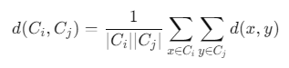

	import numpy as np
	import pandas as pd
	import matplotlib.pyplot as plt
	import seaborn as sns
	
	from sklearn.datasets import load_iris
	from sklearn.cluster import AgglomerativeClustering
	from sklearn.preprocessing import StandardScaler
	from sklearn.metrics import silhouette_score, accuracy_score, confusion_matrix
	from scipy.optimize import linear_sum_assignment
	
	# ---------------------------
	# 유틸: 헝가리안 매칭으로 군집-라벨 매핑
	# ---------------------------
	def clustering_accuracy(y_true, y_pred):
	    cm = confusion_matrix(y_true, y_pred)
	    # 최대 일치가 되도록 행렬을 비용행렬로 변환(-cm) 후 할당
	    row_ind, col_ind = linear_sum_assignment(-cm)
	    mapping = {pred: true for pred, true in zip(col_ind, row_ind)}
	    y_mapped = np.array([mapping[p] for p in y_pred])
	    return accuracy_score(y_true, y_mapped), mapping
	
	# ---------------------------
	# Agglomerative 실행 함수
	# ---------------------------
	def run_agglomerative(n_clusters=3,
	                      linkage="ward",          # "ward" | "complete" | "average" | "single"
	                      scale=False,             # 스케일링 여부
	                      plot_feat_idx=(0, 1),    # 시각화용 피처 인덱스 (sepal length, sepal width)
	                      random_state=0):
	    iris = load_iris()
	    X = iris.data.copy()
	    y = iris.target
	    feat_names = iris.feature_names
	
	    # (선택) 스케일링
	    if scale:
	        X = StandardScaler().fit_transform(X)
	
	    # Agglomerative 모델
	    # ward는 유클리디안 거리만 가능. 다른 metric이 필요하면 linkage를 바꾸세요.
	    agg = AgglomerativeClustering(n_clusters=n_clusters, linkage=linkage)
	    labels = agg.fit_predict(X)
	
	    # 지표
	    sil = silhouette_score(X, labels)
	    acc, map_dict = clustering_accuracy(y, labels)
	    print(f"[Agglomerative] linkage={linkage}, scale={scale}")
	    print(f"Silhouette Score: {sil:.3f}")
	    print(f"Accuracy:        {acc:.3f}")
	    print(f"Label mapping (cluster -> true): {map_dict}")
	
	    # 시각화 (첫 두 개 피처)
	    i, j = plot_feat_idx
	    df = pd.DataFrame({
	        feat_names[i]: X[:, i],
	        feat_names[j]: X[:, j],
	        "Cluster": labels
	    })
	
	    plt.figure(figsize=(10,5))
	    sns.scatterplot(
	        data=df, x=feat_names[i], y=feat_names[j],
	        hue="Cluster", palette="viridis", s=100
	    )
	    plt.title(f"Agglomerative Clustering on Iris (linkage={linkage}, scale={scale})")
	    plt.xlabel(feat_names[i]); plt.ylabel(feat_names[j])
	    plt.legend(title="Cluster")
	    plt.show()
	
	# ---------------------------
	# 실행 예시
	# ---------------------------
	if __name__ == "__main__":
	    # 1) 가장 많이 쓰이는 설정: ward + 비스케일 (Iris는 스케일 차이가 크지 않음)
	    run_agglomerative(n_clusters=3, linkage="ward", scale=False)
	
	    # 2) complete 링크 + 스케일링 비교해 보고 싶다면:
	    # run_agglomerative(n_clusters=3, linkage="complete", scale=True)
	
	    # 3) average 링크:
	    # run_agglomerative(n_clusters=3, linkage="average", scale=True)
	
	    # 4) single 링크(체이닝 현상으로 성능이 낮을 수 있음):
	    # run_agglomerative(n_clusters=3, linkage="single", scale=True)

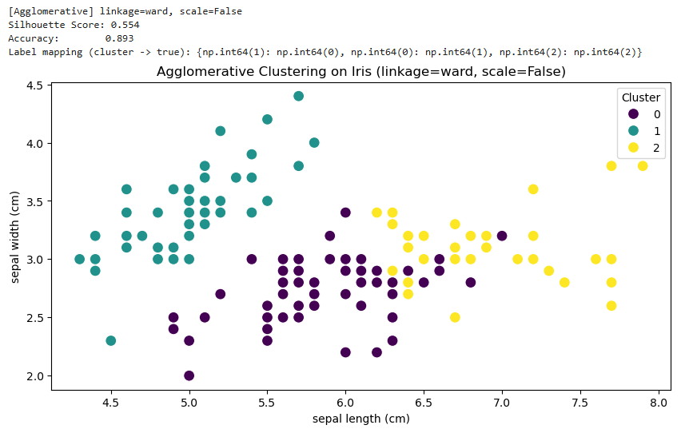

	import numpy as np
	import pandas as pd
	import matplotlib.pyplot as plt
	import seaborn as sns
	
	from sklearn.datasets import load_iris
	from sklearn.cluster import KMeans
	from sklearn.metrics import silhouette_score, accuracy_score, confusion_matrix
	from scipy.optimize import linear_sum_assignment
	
	# ---------------------------
	# 유틸: 헝가리안 매칭으로 정확도 계산
	# ---------------------------
	def clustering_accuracy(y_true, y_pred):
	    cm = confusion_matrix(y_true, y_pred)
	    row_ind, col_ind = linear_sum_assignment(-cm)
	    mapping = {pred: true for pred, true in zip(col_ind, row_ind)}
	    y_mapped = np.array([mapping[p] for p in y_pred])
	    return accuracy_score(y_true, y_mapped), mapping
	
	# ---------------------------
	# Divisive Clustering (DIANA 스타일)
	# ---------------------------
	def divisive_clustering(X, n_clusters=3, random_state=0):
	    n = X.shape[0]
	    clusters = {0: np.arange(n)}   # 처음엔 전체를 하나의 클러스터로 시작
	
	    while len(clusters) < n_clusters:
	        # 가장 큰 클러스터 선택
	        largest_id = max(clusters, key=lambda k: clusters[k].size)
	        idx = clusters[largest_id]
	        subset = X[idx]
	
	        # 해당 부분 클러스터를 KMeans(2)로 분할
	        km = KMeans(n_clusters=2, random_state=random_state, n_init=10)
	        labels = km.fit_predict(subset)
	
	        # 새 클러스터 추가
	        new_id = max(clusters.keys()) + 1
	        clusters[largest_id] = idx[labels == 0]
	        clusters[new_id]     = idx[labels == 1]
	
	    # 최종 예측 레이블 배열 생성
	    predicted = np.zeros(n, dtype=int)
	    for cid, idx in clusters.items():
	        predicted[idx] = cid
	    return predicted
	
	# ---------------------------
	# 실행부
	# ---------------------------
	iris = load_iris()
	X = iris.data
	y = iris.target
	feat_names = iris.feature_names
	
	# Divisive 실행
	pred_labels = divisive_clustering(X, n_clusters=3, random_state=0)
	
	# 성능 지표
	sil = silhouette_score(X, pred_labels)
	acc, mapping = clustering_accuracy(y, pred_labels)
	print(f"[Divisive Hierarchical]")
	print(f"Silhouette Score: {sil:.3f}")
	print(f"Accuracy:        {acc:.3f}")
	print(f"Label mapping (cluster -> true): {mapping}")
	
	# 시각화 (첫 2개 feature)
	df = pd.DataFrame(X, columns=feat_names)
	df["Cluster"] = pred_labels
	df["Cluster"] = df["Cluster"].astype("category")  # 선택사항: 범례 깔끔하게
	
	plt.figure(figsize=(10,5))
	sns.scatterplot(
	    data=df,
	    x=feat_names[0],
	    y=feat_names[1],
	    hue="Cluster",
	    palette="viridis",
	    s=100
	)
	plt.title("Divisive Hierarchical Clustering on Iris Dataset")
	plt.xlabel(feat_names[0])
	plt.ylabel(feat_names[1])
	plt.legend(title="Cluster")
	plt.show()
	

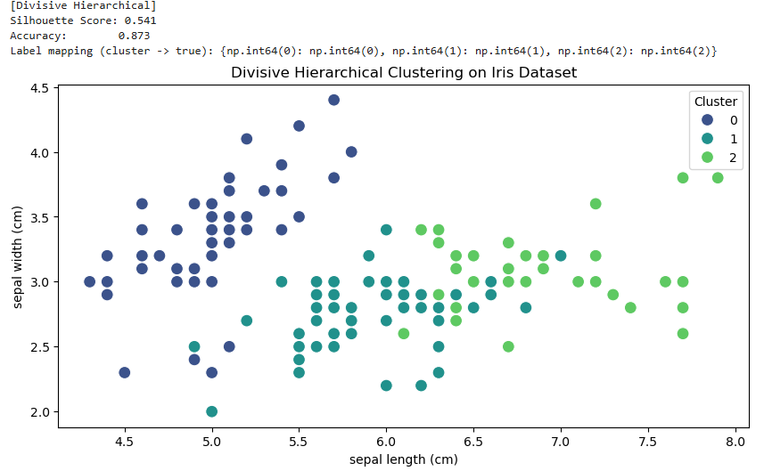
 

# [2-2] BIRCH(Balanced Iterative Reducing and Clustering using Hierarchies)
▣ 정의: 대규모 데이터를 효율적으로 군집화할 수 있는 계층적 클러스터링 알고리즘으로, <ins>메모리 사용량을 줄이기 위해 데이터를 압축</ins>하는 방식으로 클러스터링을 수행. BIRCH는 데이터를 클러스터링 피처(Clustering Feature, CF) 트리 구조로 유지하여 효율적으로 군집을 형성 
▣ 필요성: 대규모 데이터에서 효율적으로 군집화할 수 있으며, 메모리를 절약하면서도 효과적인 계층적 군집화가 필요할 때 유용 
▣ 장점: 메모리를 절약하면서 대규모 데이터를 처리할 수 있으며 다른 계층적 알고리즘보다 속도가 빠르며, 데이터를 압축하여 군집화 과정을 단순화할 수 있음 
▣ 단점: 군집의 밀도가 고르게 분포된 경우에 더 잘 작동하며, 밀도가 불균일한 경우 성능이 저하될 수 있으며, 초기 매개변수 설정에 따라 성능이 크게 영향을 받을 수 있음 
▣ 응용분야: 대규모 이미지 데이터 군집화, 소셜 네트워크 데이터 분석, 데이터 스트리밍 환경에서 실시간 군집화 
▣ 모델식: 클러스터링 피처(CF)를 사용하여 데이터를 압축하고 계층적으로 군집화(여기서  𝑁은 클러스터의 데이터 포인트 개수, 𝐿𝑆는 각 데이터 포인트의 합계, 𝑆𝑆는 각 데이터 포인트의 제곱 합계이며, 이를 통해 각 클러스터의 중심과 분산을 효율적으로 계산) 

	from sklearn.datasets import load_iris
	from sklearn.cluster import Birch
	from sklearn.metrics import silhouette_score, accuracy_score, confusion_matrix
	from scipy.optimize import linear_sum_assignment
	import pandas as pd
	import matplotlib.pyplot as plt
	import seaborn as sns
	import numpy as np
	
	# ---------------------------
	# 유틸: 헝가리안 매칭으로 정확도 계산
	# ---------------------------
	def clustering_accuracy(y_true, y_pred):
	    cm = confusion_matrix(y_true, y_pred)
	    row_ind, col_ind = linear_sum_assignment(-cm)  # maximize matching
	    mapping = {pred: true for pred, true in zip(col_ind, row_ind)}
	    y_mapped = np.array([mapping[p] for p in y_pred])
	    return accuracy_score(y_true, y_mapped), mapping
	
	# ---------------------------
	# Iris 데이터셋 로드
	# ---------------------------
	iris = load_iris()
	X = iris.data
	y = iris.target
	
	# ---------------------------
	# BIRCH 알고리즘 적용
	# ---------------------------
	birch = Birch(n_clusters=3, threshold=0.5, branching_factor=50)
	birch.fit(X)
	labels = birch.predict(X)
	
	# ---------------------------
	# 성능 지표 계산
	# ---------------------------
	sil = silhouette_score(X, labels)
	acc, mapping = clustering_accuracy(y, labels)
	
	print("[BIRCH Clustering]")
	print(f"Silhouette Score: {sil:.3f}")
	print(f"Accuracy:        {acc:.3f}")
	print(f"Label mapping (cluster -> true): {mapping}")
	
	# ---------------------------
	# 데이터프레임 변환 및 시각화
	# ---------------------------
	df = pd.DataFrame(X, columns=iris.feature_names)
	df['Cluster'] = labels
	
	plt.figure(figsize=(10, 5))
	sns.scatterplot(
	    data=df,
	    x=iris.feature_names[0],
	    y=iris.feature_names[1],
	    hue='Cluster',
	    palette='viridis',
	    s=100
	)
	plt.title("BIRCH Clustering on Iris Dataset")
	plt.xlabel(iris.feature_names[0])  # 첫 번째 feature (sepal length)
	plt.ylabel(iris.feature_names[1])  # 두 번째 feature (sepal width)
	plt.legend(title='Cluster')
	plt.show()

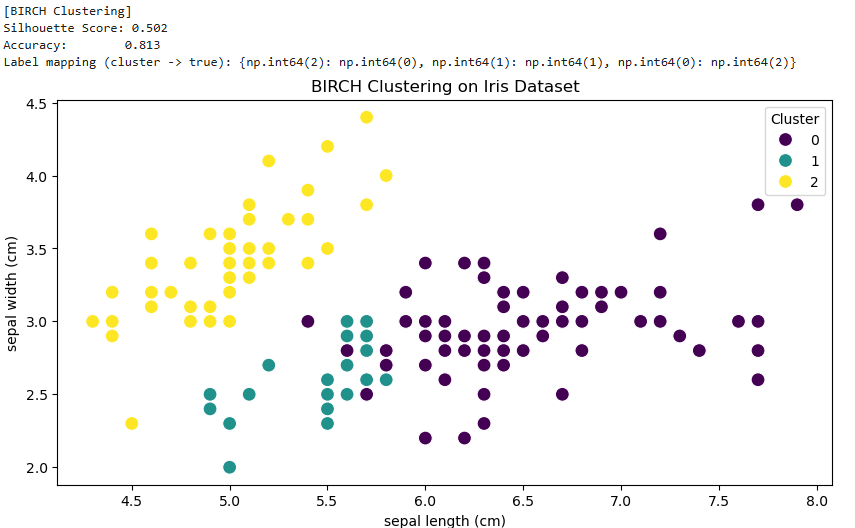
 

# [2-3] CURE(Clustering Using Representatives)
▣ 정의: 군집을 형성할 때 <ins>각 군집의 대표 포인트를 사용</ins>하여 다양한 모양과 크기의 군집을 잘 처리할 수 있도록 설계된 계층적 군집화 알고리즘. 군집의 대표 포인트들은 군집 내에서 멀리 떨어진 여러 위치에 배치되어 전체 군집의 분포를 나타냄 
▣ 필요성: 군집의 형태나 크기가 다양한 데이터에서 군집을 보다 정확하게 구분할 수 있도록 지원 
▣ 장점: 다양한 형태와 크기의 군집을 효과적으로 탐지할 수 있으며, 노이즈에 강하고 이상치의 영향을 적게 받음 
▣ 단점: 대규모 데이터에서는 계산 비용이 높고, 군집 내 대표 포인트의 개수와 축소 비율 등의 매개변수 설정이 필요 
▣ 응용분야: 지리적 데이터 분석, 대규모 네트워크 데이터에서 커뮤니티 탐색, 유전자 데이터의 군집화 
▣ 모델식: 각 군집의 대표 포인트를 지정하고, 이를 기반으로 다른 군집과의 거리를 계산하여 군집을 형성. 군집 내의 대표 포인트들은 군집 중심에서 일정 비율로 축소되며, 여러 개의 대표 포인트를 통해 군집의 분포를 표현 

import numpy as np
	from sklearn.datasets import load_iris
	from sklearn.metrics import silhouette_score, accuracy_score, confusion_matrix
	from scipy.optimize import linear_sum_assignment
	from scipy.spatial.distance import cdist
	import matplotlib.pyplot as plt
	import seaborn as sns
	import pandas as pd
	
	# ---------------------------
	# 간단한 CURE 알고리즘 (안전한 병합 로직)
	# ---------------------------
	class CURE:
	    def __init__(self, n_clusters=3, n_representatives=5, shrink_factor=0.5):
	        self.n_clusters = n_clusters
	        self.n_representatives = n_representatives
	        self.shrink_factor = shrink_factor
	        self.labels_ = None
	
	    def fit_predict(self, X):
	        n_samples = X.shape[0]
	        clusters = [[i] for i in range(n_samples)]  # 각 포인트가 하나의 군집
	
	        # k개가 될 때까지 병합
	        while len(clusters) > self.n_clusters:
	            # 각 클러스터의 대표점 계산
	            reps = [self._get_representatives(X[np.array(c)]) for c in clusters]
	
	            # 클러스터 쌍 중 대표점 사이 최소 거리 쌍 찾기 (안전한 O(k^2))
	            best_d = np.inf
	            best_pair = None
	            for a in range(len(clusters) - 1):
	                for b in range(a + 1, len(clusters)):
	                    d = cdist(reps[a], reps[b]).min()  # 두 클러스터 대표점 집합 간 최단거리
	                    if d < best_d:
	                        best_d = d
	                        best_pair = (a, b)
	
	            # 병합 수행 (인덱스가 어긋나지 않도록 큰 인덱스를 먼저 pop)
	            a, b = best_pair
	            if a > b:
	                a, b = b, a
	            clusters[a].extend(clusters[b])
	            clusters.pop(b)
	
	        # 레이블 부여 (누락 방지)
	        labels = np.full(n_samples, -1, dtype=int)
	        for cid, idxs in enumerate(clusters):
	            labels[np.asarray(idxs, dtype=int)] = cid
	        if np.any(labels == -1):
	            missing = np.where(labels == -1)[0]
	            raise RuntimeError(f"CURE labeling incomplete; missing indices: {missing[:10]} ...")
	
	        self.labels_ = labels
	        return labels
	
	    def _get_representatives(self, cluster_points):
	        # 대표점 개수는 군집 크기를 넘을 수 없도록 제한
	        k = min(self.n_representatives, len(cluster_points))
	        center = cluster_points.mean(axis=0)
	        d = cdist(cluster_points, [center]).ravel()
	        rep_idx = np.argsort(d)[:k]              # 중심에 가장 가까운 k개
	        reps = cluster_points[rep_idx]
	        return center + self.shrink_factor * (reps - center)  # shrink
	
	# ---------------------------
	# 유틸: 헝가리안 매칭 기반 정확도
	# ---------------------------
	def clustering_accuracy(y_true, y_pred):
	    y_true = np.asarray(y_true)
	    y_pred = np.asarray(y_pred)
	
	    true_vals = np.unique(y_true)
	    pred_vals = np.unique(y_pred)
	
	    # contingency matrix (행: true, 열: pred)
	    ct = np.zeros((true_vals.size, pred_vals.size), dtype=int)
	    for i, t in enumerate(true_vals):
	        for j, p in enumerate(pred_vals):
	            ct[i, j] = np.sum((y_true == t) & (y_pred == p))
	
	    r, c = linear_sum_assignment(-ct)
	    mapping = {pred_vals[j]: true_vals[i] for i, j in zip(r, c)}  # 실제 라벨 값으로 매핑
	
	    y_mapped = np.array([mapping[p] for p in y_pred], dtype=int)
	    return accuracy_score(y_true, y_mapped), mapping
	
	# ---------------------------
	# 데이터 로드 & 실행
	# ---------------------------
	iris = load_iris()
	X = iris.data
	y = iris.target
	
	cure = CURE(n_clusters=3, n_representatives=5, shrink_factor=0.5)
	labels = cure.fit_predict(X)
	
	# 지표
	sil = silhouette_score(X, labels)
	acc, mapping = clustering_accuracy(y, labels)
	print(f"Silhouette Score: {sil:.3f}")
	print(f"Accuracy: {acc:.3f}")
	print(f"Label mapping (cluster -> true): {mapping}")
	
	# ---------------------------
	# 시각화 (범례 정상화)
	# ---------------------------
	df = pd.DataFrame(X, columns=iris.feature_names)
	df["Cluster"] = pd.Categorical(labels)  # 범주형으로 캐스팅해 0/1/2로 표기
	
	plt.figure(figsize=(10, 5))
	sns.scatterplot(
	    data=df,
	    x=iris.feature_names[0],
	    y=iris.feature_names[1],
	    hue="Cluster",
	    palette="viridis",
	    s=100
	)
	plt.title("CURE Clustering on Iris Dataset")
	plt.xlabel(iris.feature_names[0])
	plt.ylabel(iris.feature_names[1])
	plt.legend(title="Cluster")
	plt.show()
	
 
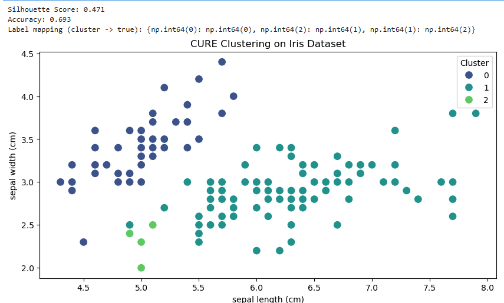
 

# [2-4] ROCK(Robust Clustering using Links)
▣ 정의: 범주형 데이터에서 유사한 항목을 군집화하는 데 최적화된 계층적 군집화 알고리즘으로 <ins>각 데이터 포인트 간의 연결(link)을 기반으로 군집의 밀도를 측정하여 군집을 형성</ins> 
▣ 필요성: 범주형 데이터와 같이 명확한 거리 계산이 어려운 경우, 데이터 간의 연결 수를 기반으로 군집화를 수행하는 데 유용 
▣ 장점: 범주형 데이터에 특화되어 있어, 범주형 특성을 잘 반영한 군집화를 수행하고 밀도가 높은 군집을 잘 탐지할 수 있음 
▣ 단점: 계산 비용이 높아 대규모 데이터셋에는 적합하지 않으며, 거리 계산보다 연결 기반 군집화가 복잡 
▣ 응용분야: 추천 시스템, 문서 분류 및 텍스트 마이닝, 범주형 속성이 많은 데이터의 군집화 
▣ 모델식: 데이터 포인트 간의 연결을 기반으로 군집을 형성하며, 연결의 개수를 기반으로 군집 간의 유사성을 측정하여 군집화 

	import numpy as np
	from sklearn.datasets import load_iris
	from sklearn.neighbors import kneighbors_graph
	from sklearn.cluster import AgglomerativeClustering
	from sklearn.metrics import silhouette_score, accuracy_score
	import matplotlib.pyplot as plt
	import seaborn as sns
	import pandas as pd
	from scipy.stats import mode
	
	# Iris 데이터셋 로드
	iris = load_iris()
	data = iris.data
	true_labels = iris.target
	
	# 1단계: K-최근접 이웃 그래프 생성 (유사도 링크 기반 생성)
	n_neighbors = 10
	knn_graph = kneighbors_graph(data, n_neighbors=n_neighbors, mode='connectivity', include_self=False)
	
	# 2단계: Agglomerative Clustering을 통해 유사도 링크 기반으로 군집화
	rock_clustering = AgglomerativeClustering(n_clusters=3, connectivity=knn_graph, linkage='average')
	predicted_labels = rock_clustering.fit_predict(data)
	
	# 데이터프레임으로 변환하여 시각화 준비
	df = pd.DataFrame(data, columns=iris.feature_names)
	df['Cluster'] = predicted_labels
	
	# Silhouette Score 계산
	silhouette_avg = silhouette_score(data, predicted_labels)
	print(f"Silhouette Score: {silhouette_avg:.3f}")
	
	# Accuracy 계산 (군집 레이블과 실제 레이블을 매칭하여 정확도 계산)
	mapped_labels = np.zeros_like(predicted_labels)
	for i in np.unique(predicted_labels):
	    mask = (predicted_labels == i)
	    mapped_labels[mask] = mode(true_labels[mask])[0]
	
	accuracy = accuracy_score(true_labels, mapped_labels)
	print(f"Accuracy: {accuracy:.3f}")
	
	# 시각화 (첫 번째와 두 번째 피처 사용)
	plt.figure(figsize=(10, 5))
	sns.scatterplot(x=df.iloc[:, 0], y=df.iloc[:, 1], hue='Cluster', data=df, palette='viridis', s=100)
	plt.title("ROCK Clustering (Approximation) on Iris Dataset")
	plt.xlabel(iris.feature_names[0])  # 첫 번째 피처 (sepal length)
	plt.ylabel(iris.feature_names[1])  # 두 번째 피처 (sepal width)
	plt.legend(title='Cluster')
	plt.show()

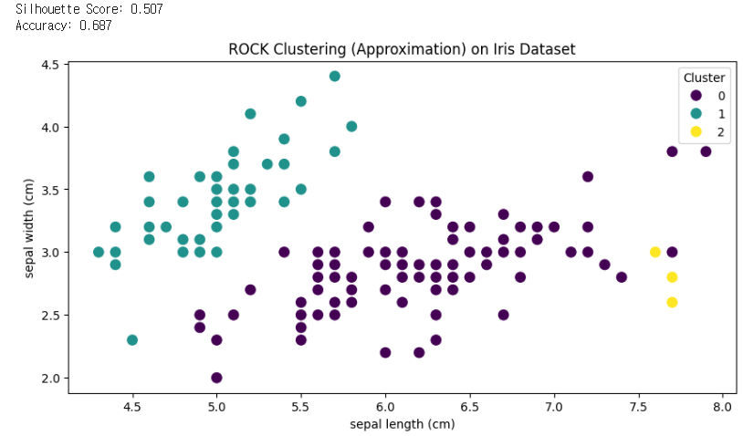
 

# [2-5] Chameleon
▣ 정의: <ins>데이터의 지역적 밀도와 모양을 고려하여 유사성을 계산하여 군집을 형성</ins>하는 계층적 군집화 알고리즘으로 군집을 나누는 초기 분할과 동적 병합 단계 등 2단계로 구성 
▣ 필요성: 다양한 모양과 밀도의 군집이 있는 데이터에서 군집화를 수행할 때 유용 
▣ 장점: 군집의 밀도와 모양을 고려하여 다양한 군집 구조를 잘 탐지할 수 있으며 다른 계층적 군집화보다 유연한 군집화를 제공 
▣ 단점: 계산 비용이 매우 높으며, 대규모 데이터셋에서는 실행이 어려울 수 있으며 초기 클러스터링과 병합 기준을 설정하는 것이 어렵다 
▣ 응용분야: 소셜 네트워크에서 커뮤니티 탐색, 비정형 데이터 분석, 웹 문서 분류 
▣ 모델식: 두 단계로 군집을 형성하는데 첫째, 데이터를 작은 초기 군집으로 나누고, 둘째, 유사한 군집을 동적으로 병합하여 최종 군집을 형성 

	import numpy as np
	from sklearn.datasets import load_iris
	from sklearn.neighbors import kneighbors_graph
	from sklearn.cluster import AgglomerativeClustering, DBSCAN
	from sklearn.metrics import silhouette_score, accuracy_score
	import matplotlib.pyplot as plt
	import seaborn as sns
	import pandas as pd
	from scipy.stats import mode
	
	# Iris 데이터셋 로드
	iris = load_iris()
	data = iris.data
	true_labels = iris.target
	
	# 1단계: K-최근접 이웃 그래프 생성
	n_neighbors = 10
	knn_graph = kneighbors_graph(data, n_neighbors=n_neighbors, include_self=False)
	
	# 2단계: 초기 군집화 - 그래프 기반의 계층적 군집화 수행
	initial_clustering = AgglomerativeClustering(n_clusters=10, connectivity=knn_graph, linkage='average')
	initial_labels = initial_clustering.fit_predict(data)
	
	# 3단계: 군집 병합 - DBSCAN을 사용하여 작은 군집을 밀도 기반으로 병합
	# AgglomerativeClustering으로 생성된 초기 군집들을 DBSCAN으로 다시 병합
	data_with_initial_labels = pd.DataFrame(data)
	data_with_initial_labels['initial_cluster'] = initial_labels
	
	# 각 초기 군집을 DBSCAN을 통해 병합
	dbscan = DBSCAN(eps=0.5, min_samples=5)
	final_labels = dbscan.fit_predict(data)
	
	# 데이터프레임으로 변환하여 시각화 준비
	df = pd.DataFrame(data, columns=iris.feature_names)
	df['Cluster'] = final_labels
	
	# Silhouette Score 계산 (노이즈 데이터는 제외)
	valid_points = final_labels != -1  # 노이즈가 아닌 포인트만 선택
	if np.sum(valid_points) > 1:
	    silhouette_avg = silhouette_score(data[valid_points], final_labels[valid_points])
	    print(f"Silhouette Score: {silhouette_avg:.3f}")
	else:
	    print("Silhouette Score: Not enough valid points for calculation.")
	
	# Accuracy 계산 (군집 레이블과 실제 레이블을 매칭하여 정확도 계산)
	mapped_labels = np.zeros_like(final_labels)
	for i in np.unique(final_labels):
	    mask = (final_labels == i)
	    if np.any(mask):  # 군집에 속하는 포인트가 있을 때만 계산
	        mapped_labels[mask] = mode(true_labels[mask])[0]
	
	accuracy = accuracy_score(true_labels[valid_points], mapped_labels[valid_points])
	print(f"Accuracy: {accuracy:.3f}")
	
	# 시각화 (첫 번째와 두 번째 피처 사용)
	plt.figure(figsize=(10, 5))
	sns.scatterplot(x=df.iloc[:, 0], y=df.iloc[:, 1], hue='Cluster', data=df, palette='viridis', s=100)
	plt.title("Chameleon Clustering (Approximation) on Iris Dataset")
	plt.xlabel(iris.feature_names[0])  # 첫 번째 피처 (sepal length)
	plt.ylabel(iris.feature_names[1])  # 두 번째 피처 (sepal width)
	plt.legend(title='Cluster')
	plt.show()

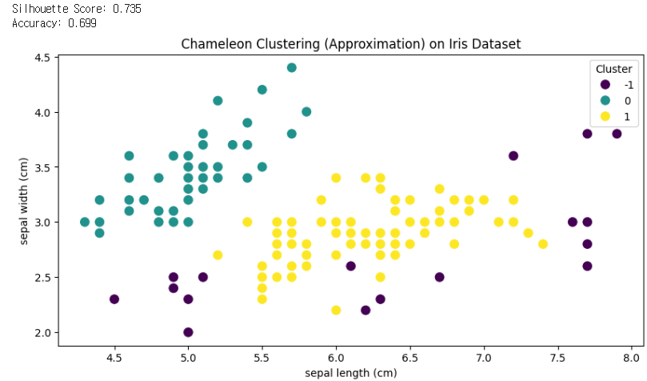
 

# [2-6] HDBSCAN (Hierarchical Density-Based Spatial Clustering of Applications with Noise)
▣ 정의 : <ins>HDBSCAN은 데이터의 밀도(Density)를 기반으로 계층적 구조를 결합한 클러스터링 알고리즘</ins>으로, 데이터가 밀집된 지역을 클러스터로 정의하고, 밀도가 낮은 지역에 위치한 데이터는 노이즈로 간주하여 처리기존 DBSCAN의 한계를 극복하기 위해 계층적 클러스터링 기법을 도입하여, 데이터셋 내에서 서로 다른 밀도를 가진 클러스터들을 동시에 효과적으로 찾아낼 수 있도록 설계 
▣ 필요성 : 실제 데이터는 클러스터마다 밀도가 제각각인 경우가 많음. 기존의 DBSCAN은 전역적인 밀도 파라미터($\epsilon$)를 사용하기 때문에 밀도가 높은 클러스터와 낮은 클러스터가 섞여 있으면 어느 한쪽을 제대로 잡지 못하는 문제가 발생. HDBSCAN은 이러한 가변 밀도 문제를 해결하고, 파라미터 설정에 대한 민감도를 낮추기 위해 필요 
▣ 장점 :  
가변 밀도 대응: 클러스터마다 밀도가 달라도 이를 계층적으로 분석하여 적절한 클러스터를 추출 
노이즈 처리: 이상치(Outlier)를 어떤 클러스터에도 할당하지 않고 노이즈(-1)로 분류하여 모델의 신뢰성 향상 
파라미터 단순화: DBSCAN에서 가장 설정하기 까다로운 $\epsilon$(반경) 파라미터를 설정할 필요가 없으며, 최소 클러스터 크기만 지정하면 됨 
계층적 구조 제공: 데이터 간의 연결 강도를 바탕으로 클러스터의 영속성을 계산하여 가장 안정적인 클러스터를 선택 
▣ 단점 :  
계산 복잡도: 대규모 데이터셋에 대해 일반적인 K-means보다 계산 비용이 높다. 
데이터 편향성: 데이터가 전반적으로 매우 희소하거나 밀도 차이가 극심하게 불연속적인 경우 성능이 저하될 가능성 
파라미터 영향: 최소 클러스터 크기($min\_cluster\_size$) 설정에 따라 결과가 크게 달라질 수 있음 
▣ 응용분야 :  
지리 정보 시스템(GIS): 사고 발생 지역이나 상권 밀집 지역 분석 
이상 탐지: 금융 사기 적발 및 네트워크 침입 탐지(노이즈 처리 기능 활용) 
천문학: 별의 집단이나 은하 구조 분석 
고객 세분화: 구매 패턴이 일정하지 않은 고객군 분류 
▣ 모델식 : 수학적으로 Mutual Reachability Distance 기반 

---

**▣ 계층적 군집화의 결과 시각화 : 덴드로그램(dendrogram)**
나무(tree) 모양의 그래프는 각 데이터 포인트가 병합되거나 분할되는 과정을 계층 구조로 표현하며, 군집 간의 관계를 직관적으로 이해할 수 있도록 도와준다.  
(1) 각 데이터 포인트는 맨 아래에서 개별 노드로 시작 : 덴드로그램에서 각 데이터 포인트는 맨 아래에 위치한 개별 노드로 시작. 이 단계에서는 각각의 데이터가 하나의 군집을 이루고 있다. 
(2) 데이터 포인트들이 병합 : 계층적 군집화의 과정에서 유사한 데이터 포인트끼리 순차적으로 병합되며, 병합되는 과정이 덴드로그램에서 상위로 올라가면서 두 노드가 연결되는 형태로 시각화 된다. 
(3) 병합된 군집이 다시 다른 군집과 병합 : 유사한 군집끼리 계속 병합되며 점점 더 큰 군집을 형성하게 된다. 덴드로그램의 상단으로 갈수록 더 큰 군집이 병합된 결과를 나타내며, 결국 모든 데이터가 하나의 군집으로 병합된다. 
(4) 군집 간의 거리 정보: 덴드로그램에서 두 군집이 병합된 높이(수직 축)는 그 두 군집 사이의 유사도 또는 거리를 나타낸다. 즉, 병합된 높이가 클수록 두 군집 간의 거리가 더 멀었다는 것을 의미합니다. 이는 데이터를 나누거나 군집을 형성하는 데 있어 중요한 기준이 된다. 
 
(1) 군집의 개수 선택이 유연 : 덴드로그램을 통해 데이터가 어떻게 군집화되었는지 시각적으로 확인한 후, 임의의 높이에서 선을 그어 군집의 개수를 선택할 수 있다. 특정 높이에서 덴드로그램을 자르면 그 높이 기준으로 몇 개의 군집이 형성되는지를 알 수 있으며 이로 인해 군집의 개수를 미리 결정하지 않고도 군집을 형성할 수 있다. 예를 들어, 덴드로그램에서 각 군집 간의 유사도가 높지 않다고 판단되는 지점에서 잘라내면 다수의 작은 군집이 만들어질 수 있고, 반대로 유사도가 높다고 판단되는 지점에서 자르면 소수의 큰 군집이 형성될 수 있다. 
(2) 군집 간의 유사도 및 계층 구조 파악 : 덴드로그램은 단순히 군집을 나누는 것 이상으로 군집 간의 유사도와 계층적 관계를 직관적으로 보여준다. 이를 통해 두 군집이 병합되는 시점과 그 군집들이 다른 군집들과 얼마나 유사한지를 파악하고 이 정보를 바탕으로 군집화 결과를 더욱 상세하게 해석할 수 있다. 
(3) 다양한 수준에서 군집 분석 가능 : 덴드로그램을 활용하면 데이터셋을 다양한 수준에서 분석할 수 있다. 특정 높이에서 군집을 잘라내면 더 큰 군집을 형성할 수 있고, 더 낮은 높이에서는 세부적인 군집을 식별함으로써 다단계 군집 분석을 가능하게 한다. 
(4) 군집의 구조적 관계 시각화 : 덴드로그램을 통해 데이터를 계층적으로 군집화한 결과를 시각적으로 확인함으로써 데이터가 점진적으로 어떻게 병합되는지, 그리고 군집화가 특정 기준에 따라 어떻게 변하는지를 쉽게 이해할 수 있다. 

	from scipy.cluster.hierarchy import dendrogram, linkage
	from sklearn.datasets import load_iris
	import matplotlib.pyplot as plt

	# 데이터 로드
	iris = load_iris()
	X = iris.data

	# 계층적 군집화 수행
	Z = linkage(X, 'ward')  # ward: 최소분산 기준 병합

	# 덴드로그램 시각화
	plt.figure(figsize=(10, 5))
	dendrogram(Z)
	plt.title("Hierarchical Clustering Dendrogram")
	plt.xlabel("Sample Index")
	plt.ylabel("Distance")
	plt.show()

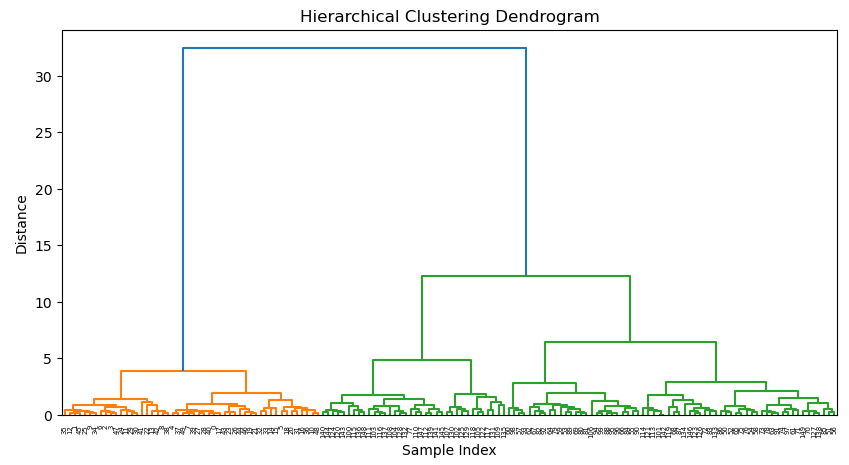
 

(class별 색 조정)

	import pandas as pd
	import matplotlib.pyplot as plt
	from sklearn.datasets import load_iris
	from sklearn.preprocessing import StandardScaler
	from scipy.cluster.hierarchy import linkage, dendrogram
	import matplotlib.patches as mpatches
	
	# 1) 데이터 로드 & 표준화
	iris = load_iris()
	X = pd.DataFrame(iris.data, columns=iris.feature_names)
	y = iris.target  # 0=setosa, 1=versicolor, 2=virginica
	
	scaler = StandardScaler()
	X_scaled = scaler.fit_transform(X)
	
	# 2) 계층적 군집 (Ward)
	Z = linkage(X_scaled, method='ward')
	
	# 3) 덴드로그램: 가지(선)는 중립색(회색)으로, 리프 라벨은 클래스 색으로
	#    - link_color_func로 선을 회색 처리 → 선 색이 클래스 의미를 오해하지 않도록
	#    - labels는 보기 좋게 샘플 인덱스 대신 클래스명으로 표시(원하면 인덱스로 바꿔도 됨)
	fig, ax = plt.subplots(figsize=(14, 6))
	ddata = dendrogram(
	    Z,
	    labels=[iris.target_names[i] for i in y],
	    leaf_rotation=90,
	    leaf_font_size=9,
	    link_color_func=lambda k: "lightgray"  # 가지(선) 회색
	)
	
	# 4) 리프 라벨(틱) 색상을 실제 클래스별로 지정
	#    ddata['leaves']는 덴드로그램 정렬 후의 원본 인덱스 순서
	order = ddata['leaves']
	# 클래스별 색 지정 (원하는 색상 코드로 바꿔도 됩니다)
	cmap = {0: "#1f77b4",  # setosa  (파란색)
	        1: "#ff7f0e",  # versicolor (주황)
	        2: "#2ca02c"}  # virginica  (초록)
	
	# X축 ticklabel 가져와서 해당 순서의 클래스에 맞춰 색칠
	xticklabels = ax.get_xmajorticklabels()
	for lbl, idx in zip(xticklabels, order):
	    cls = y[idx]
	    lbl.set_color(cmap[cls])
	    lbl.set_fontweight("bold")
	
	# 5) 범례 추가 (클래스 3개)
	handles = [
	    mpatches.Patch(color=cmap[0], label="setosa"),
	    mpatches.Patch(color=cmap[1], label="versicolor"),
	    mpatches.Patch(color=cmap[2], label="virginica"),
	]
	ax.legend(handles=handles, loc="upper right", title="True Class (leaf labels)")
	
	ax.set_title("Iris Dendrogram (Ward) — branches gray, leaves colored by true class")
	ax.set_xlabel("Leaves (label colored by class)")
	ax.set_ylabel("Ward Distance")
	plt.tight_layout()
	plt.show()
	
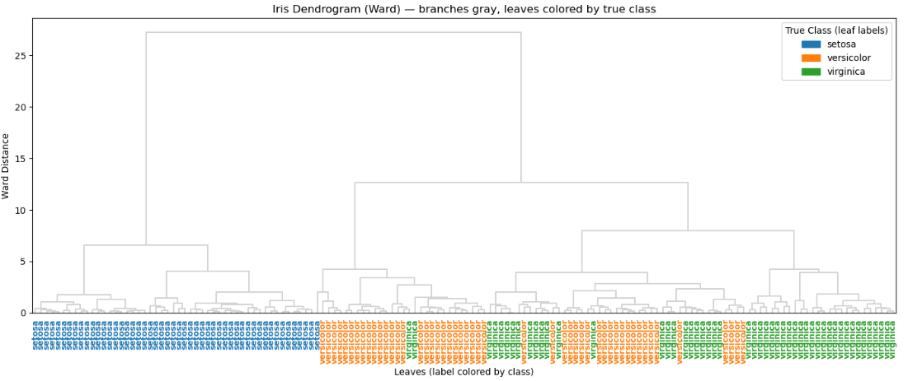

Dendrogram의 Y축에 표시되는 Ward Distance는 단순한 유클리드 거리(Euclidean distance)가 아니라, 
Ward의 최소분산 기준에 의해 계산된 병합 시 군집 내 분산 증가량으로 
Ward는 두 군집을 합쳤을 때 전체 군집 내 제곱오차합(SSE: Sum of Squared Errors)이 최소로 증가하도록 병합하는 원리에 기반 
즉, 단순히 가까운 점끼리 합치는 것이 아니라, 합쳤을 때 내부 분산이 가장 적게 늘어나는 두 그룹을 선택하는 방식 
두 군집의 중심이 멀수록, 두 군집의 크기가 비슷할수록, Ward Distance가 커지고, 나중에 병합 
가장 작은 𝐷(𝐴,𝐵)를 가진 두 군집만 병합 
 

---

## [2-1] Hierarchical (Agglomerative / Divisive)

| 항목 | 내용 |
|------|------|
| **구성요소** | 계층적 병합(Agglomerative) 또는 분할(Divisive) 방식의 트리 구조 데이터 포인트 간 거리 행렬, 군집 병합 기준(linkage method) |
| **거리함수** | 유클리드 거리 또는 코사인 거리 등 일반 거리 척도 $d(x_i, x_j) = \lVert x_i - x_j \rVert$ |
| **목적함수** | 명시적 목적함수 없음 — 군집 간 유사도(linkage)에 따라 병합 또는 분할 대표적인 linkage: Single, Complete, Average, Ward |
| **중심갱신** | Agglomerative: 두 군집 병합 시 중심 또는 거리행렬 갱신 Divisive: 큰 군집을 분할하여 새로운 서브클러스터 생성 |
| **목표** | 데이터 간의 계층적 관계를 덴드로그램(dendrogram)으로 표현 — 군집 수를 사전에 지정하지 않아도 구조적 관계 파악 가능 |

 

## [2-2] BIRCH (Balanced Iterative Reducing and Clustering using Hierarchies)

| 항목 | 내용 |
|------|------|
| **구성요소** | CF(Clustering Feature) 트리 구조로 대규모 데이터 요약 — 각 노드가 하위 클러스터 요약정보 $(N, LS, SS)$ 저장 |
| **거리함수** | CF 벡터 간 거리 — 일반적으로 유클리드 거리 $d(CF_i, CF_j) = \lVert \frac{LS_i}{N_i} - \frac{LS_j}{N_j} \rVert$ |
| **목적함수** | 트리의 리프 노드 간 거리 임계값(T) 이하인 데이터 병합으로 SSE 최소화 |
| **중심갱신** | 새로운 샘플 삽입 시 가장 가까운 리프 노드에 병합, 해당 노드의 CF 갱신 필요 시 노드 분할(splitting) 수행 |
| **목표** | 대규모 데이터의 점진적(Incremental) 계층 요약 — 메모리 효율적 군집화 및 후처리 단계에서 추가 군집 알고리즘 적용 가능 |

## [2-3] CURE (Clustering Using Representatives)

| 항목 | 내용 |
|------|------|
| **구성요소** | 각 군집을 다수의 대표점(representative points)으로 표현 — 비구형(non-spherical) 군집 처리 가능 |
| **거리함수** | 두 군집 간 최소 대표점 거리 $d(C_i, C_j) = \min_{p \in R_i, \, q \in R_j} \lVert p - q \rVert$ |
| **목적함수** | 군집 내 거리 최소화, 군집 간 거리 최대화 — Outlier에 덜 민감한 거리 기반 병합 |
| **중심갱신** | 각 군집에서 표본 대표점을 선택 후, 전체 중심으로 수축(shrinking factor $\alpha$)하여 대표점 재배치 |
| **목표** | 다양한 형태(비구형·비균질)의 군집을 탐지하고, 이상치에 강건한 계층적 병합 구조 구현 |

## [2-4] ROCK (Robust Clustering using Links)

| 항목 | 내용 |
|------|------|
| **구성요소** | 범주형 또는 이산형 데이터에 적합 — 데이터 간 “링크(link)” 기반 유사도 계산 |
| **거리함수** | 링크 수 기반 거리 $\text{link}(x_i, x_j)$ = 두 포인트가 공유하는 공통 이웃(neighbor)의 개수 |
| **목적함수** | 링크 연결 수를 최대화하여 군집 내 결속도 강화 유사도 = $\frac{\text{link}(x_i, x_j)}{(\text{deg}(x_i)\,\text{deg}(x_j))^{f(\theta)}}$ |
| **중심갱신** | 병합 시 두 군집 간 링크 수 계산을 업데이트하여 결합 기준(link merge criterion) 적용 |
| **목표** | 거리 대신 연결성(link connectivity)을 활용해 범주형 데이터에서 강건한 군집 구조 탐색 |

## [2-5] Chameleon

| 항목 | 내용 |
|------|------|
| **구성요소** | 그래프 기반 계층 군집화 — K-최근접 이웃(KNN) 그래프 + 동적 병합 단계로 구성 |
| **거리함수** | 그래프 유사도 기반 거리 두 군집 $C_i, C_j$ 간 상호 연결성(inter-connectivity)과 근접도(closeness) |
| **목적함수** | 내부 연결도(Internal Connectivity)와 외부 연결도(Between Connectivity)의 비율 최적화 |
| **중심갱신** | 군집 병합 시 그래프의 연결 간선 업데이트 — 지역적 특성(Local Structure)을 반영한 적응형 병합 수행 |
| **목표** | 데이터 분포의 모양·밀도에 적응하는 동적 군집화(Dynamic Modeling) 실현 — 전통적 계층법의 한계 극복 |

## [2-6] HDBSCAN (Hierarchical Density-Based Spatial Clustering of Applications with Noise)

| 항목 | 내용 |
|------|------|
| **구성요소** | 상호 도달 가능 거리(Mutual Reachability Distance), 최소 신장 트리(MST), 군집 계층 트리, 클러스터 안정성(Stability) |
| **거리함수** | 상호 도달 가능 거리 기반 $d_{mreach-k}(a, b) = \max \{core_k(a), core_k(b), d(a, b)\}$ |
| **목적함수** | 클러스터의 영속성(Persistence) 및 안정성(Stability) 최대화 $\sigma(C) = \sum_{p \in C} (\lambda_{max}(p, C) - \lambda_{min}(C))$ |
| **중심갱신** | 고정된 중심 없이 밀도 기반 계층 트리 생성 — 안정성이 가장 높은 하위 클러스터를 최종 선택(Flat Clustering) |
| **목표** | 가변 밀도(Variable Density) 데이터셋에서 노이즈를 효과적으로 처리하고, 파라미터 민감도를 낮춘 강건한 군집화 수행 |

 

---

**[3] Density-Based Clustering** (밀도 기반 군집화) 
**[3-1] DBSCAN (Density-Based Spatial Clustering of Applications with Noise)** : 특정 반경($\epsilon$) 내에 최소 데이터 개수($MinPts$)가 모여 있는 밀집 영역을 하나의 군집으로 정의하고 나머지는 노이즈로 처리 
**[3-2] OPTICS (Ordering Points To Identify the Clustering Structure)** : 밀도가 다양한 데이터셋에서 군집을 찾기 위해 데이터 포인트를 도달 가능 거리(Reachability Distance) 순으로 정렬하여 시각화 
**[3-3] DENCLUE (Density-based Clustering)** : 커널 밀도 함수(Kernel Density Function)를 사용하여 데이터의 영향력을 계산하고 밀도가 가장 높은 지점을 향해 군집화 수행 
**[3-4] Mean-Shift Clustering**: 데이터의 밀도가 가장 높은 곳(Mode)을 찾아 무게 중심을 반복적으로 이동시키며 군집의 경계를 탐색 
**[3-5] DPC (Density Peaks Clustering)** : 국소적 밀도가 높으면서, 자신보다 밀도가 더 높은 점과의 거리가 상대적으로 먼 점을 군집의 정점(Peak)으로 정의 

---

# [3-1] DBSCAN(Density-Based Spatial Clustering of Applications with Noise)
▣ 정의 : <ins>밀도가 높은 영역을 군집으로 묶고, 밀도가 낮은 점들은 노이즈로 간주</ins>하는 밀도 기반 군집화 알고리즘 
▣ 필요성 : 다양한 밀도의 데이터 군집화 및 이상치 탐지에 유용 
▣ 장점 : 군집의 개수를 사전 설정할 필요 없으며, 이상치(outliers)를 자연스럽게 처리 가능 
▣ 단점 : 적절한 파라미터(Epsilon(ε) : Cluster를 구성하는 최소의 거리, Min Points(MinPts): Cluster를 구성시 필요한 최소 데이터 포인트 수) 설정이 필요하며, 밀도가 균일하지 않은 데이터에 부적합 
▣ 응용분야 : 이상 탐지, 지리적 데이터 분석 
▣ 모델식: 각 점에서 반경 𝜖 내에 있는 점들이 미리 정의된 MinPts 보다 많으면 그 점을 중심으로 군집을 형성 
▣ 동작 과정:  
(1) 데이터 중에 임의의 포인트를 선택 
(2) 선택한 데이터와 Epsilon 거리 내에 있는 모든 데이터 포인트를 찾음 
(3) 주변에 있는 데이터 포인트 갯수가 Min Points 이상이면, 해당 포인트를 중심으로 하는 Cluster를 생성 
(4) 어떠한 포인트가 생성한 Cluster 안에 존재하는 다른 점 중에 다른 Cluster의 중심이 되는 데이터 포인트가 존재한다면 두 Cluster는 하나의 Cluster로 간주 
(5) 1~4번을 모든 포인트에 대해서 반복. 어느 Cluster에도 포함되지 않는 데이터 포인트는 이상치로 처리 

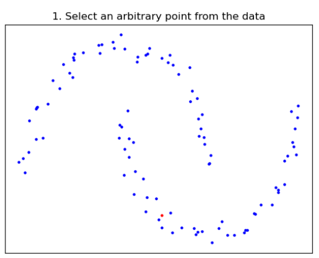
 
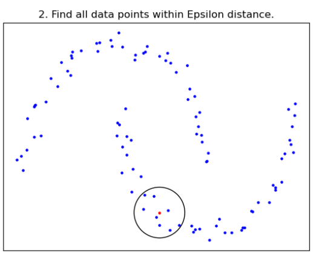
 
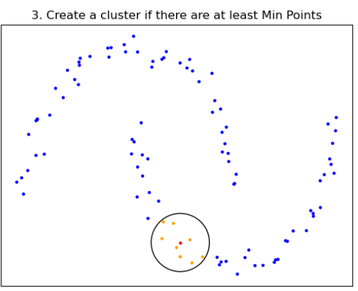
 
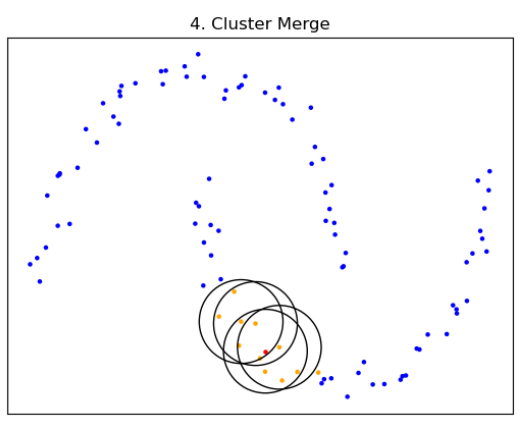
 
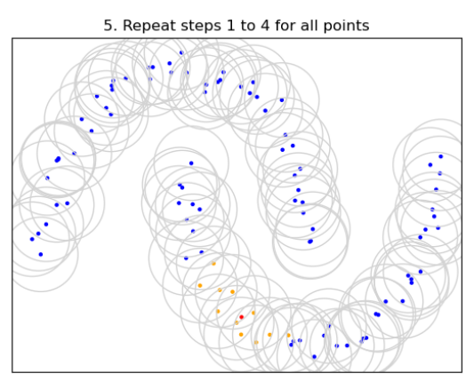
 
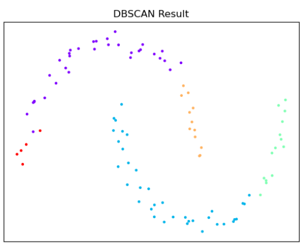
 

	import numpy as np
	from sklearn.datasets import load_iris
	from sklearn.cluster import DBSCAN
	from sklearn.metrics import silhouette_score, accuracy_score
	import matplotlib.pyplot as plt
	import seaborn as sns
	import pandas as pd
	from scipy.stats import mode
	
	# Iris 데이터셋 로드
	iris = load_iris()
	data = iris.data
	true_labels = iris.target
	
	# DBSCAN 알고리즘 적용
	dbscan = DBSCAN(eps=0.5, min_samples=5)
	predicted_labels = dbscan.fit_predict(data)
	
	# 데이터프레임으로 변환하여 시각화 준비
	df = pd.DataFrame(data, columns=iris.feature_names)
	df['Cluster'] = predicted_labels
	
	# Silhouette Score 계산 (노이즈 데이터는 제외)
	valid_points = predicted_labels != -1  # 노이즈가 아닌 포인트만 선택
	if np.sum(valid_points) > 1:
	    silhouette_avg = silhouette_score(data[valid_points], predicted_labels[valid_points])
	    print(f"Silhouette Score: {silhouette_avg:.3f}")
	else:
	    print("Silhouette Score: Not enough valid points for calculation.")
	
	# Accuracy 계산 (군집 레이블과 실제 레이블을 매칭하여 정확도 계산)
	mapped_labels = np.zeros_like(predicted_labels)
	for i in np.unique(predicted_labels):
	    mask = (predicted_labels == i)
	    if np.any(mask):  # 군집에 속하는 포인트가 있을 때만 계산
	        mapped_labels[mask] = mode(true_labels[mask])[0]
	
	accuracy = accuracy_score(true_labels[valid_points], mapped_labels[valid_points])
	print(f"Accuracy: {accuracy:.3f}")
	
	# 시각화 (첫 번째와 두 번째 피처 사용)
	plt.figure(figsize=(10, 5))
	sns.scatterplot(x=df.iloc[:, 0], y=df.iloc[:, 1], hue='Cluster', data=df, palette='viridis', s=100)
	plt.title("DBSCAN Clustering on Iris Dataset")
	plt.xlabel(iris.feature_names[0])  # 첫 번째 피처 (sepal length)
	plt.ylabel(iris.feature_names[1])  # 두 번째 피처 (sepal width)
	plt.legend(title='Cluster')
	plt.show()

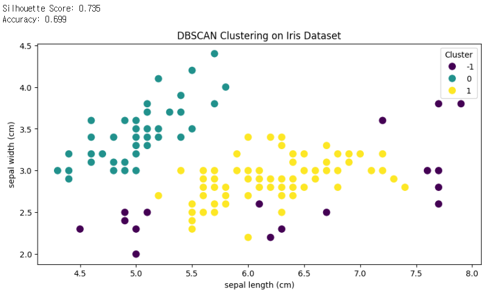
 

# [3-2] OPTICS(Ordering Points To Identify the Clustering Structure)
▣ 정의 : DBSCAN의 확장으로 여러 밀도 수준에서 데이터의 군집 구조를 식별할 수 있도록 <ins>밀도가 다른 군집을 유연하게 찾기 위해 도달 가능 거리(reachability distance)를 사용</ins>하는 알고리즘 
▣ 필요성 : 다양한 밀도를 가진 데이터에서 군집을 찾아내고 이상치(outliers)를 처리할 때 유용 
▣ 장점 : DBSCAN과 유사하게 이상치를 감지할 수 있으며, 여러 밀도 수준에서 군집을 식별 가능 
▣ 단점 : 계산 시간이 오래 걸릴 수 있으며, 적절한 매개변수 설정이 어려울 수 있음 
▣ 응용분야 : 지리적 데이터 분석, 이상치 탐지 
▣ 모델식 : DBSCAN과 유사하게 밀도 기반 접근을 따르며, 각 데이터 포인트의 reachability-distance와 core-distance를 기반으로 군집구조 형성 

	import numpy as np
	from sklearn.datasets import load_iris
	from sklearn.cluster import OPTICS
	from sklearn.metrics import silhouette_score, accuracy_score
	import matplotlib.pyplot as plt
	import seaborn as sns
	import pandas as pd
	from scipy.stats import mode
	
	# Iris 데이터셋 로드
	iris = load_iris()
	data = iris.data
	true_labels = iris.target
	
	# OPTICS 알고리즘 적용
	optics = OPTICS(min_samples=5, xi=0.05, min_cluster_size=0.1)
	predicted_labels = optics.fit_predict(data)
	
	# 데이터프레임으로 변환하여 시각화 준비
	df = pd.DataFrame(data, columns=iris.feature_names)
	df['Cluster'] = predicted_labels
	
	# Silhouette Score 계산 (노이즈 데이터는 제외)
	valid_points = predicted_labels != -1
	if np.sum(valid_points) > 1:
	    silhouette_avg = silhouette_score(data[valid_points], predicted_labels[valid_points])
	    print(f"Silhouette Score: {silhouette_avg:.3f}")
	else:
	    print("Silhouette Score: Not enough valid points for calculation.")
	
	# Accuracy 계산 (군집 레이블과 실제 레이블을 매칭하여 정확도 계산)
	mapped_labels = np.zeros_like(predicted_labels)
	for i in np.unique(predicted_labels):
	    mask = (predicted_labels == i)
	    mapped_labels[mask] = mode(true_labels[mask])[0]
	
	accuracy = accuracy_score(true_labels[valid_points], mapped_labels[valid_points])
	print(f"Accuracy: {accuracy:.3f}")
	
	# 시각화 (첫 번째와 두 번째 피처 사용)
	plt.figure(figsize=(10, 5))
	sns.scatterplot(x=df.iloc[:, 0], y=df.iloc[:, 1], hue='Cluster', data=df, palette='viridis', s=100)
	plt.title("OPTICS Clustering on Iris Dataset")
	plt.xlabel(iris.feature_names[0])  # 첫 번째 피처 (sepal length)
	plt.ylabel(iris.feature_names[1])  # 두 번째 피처 (sepal width)
	plt.legend(title='Cluster')
	plt.show()

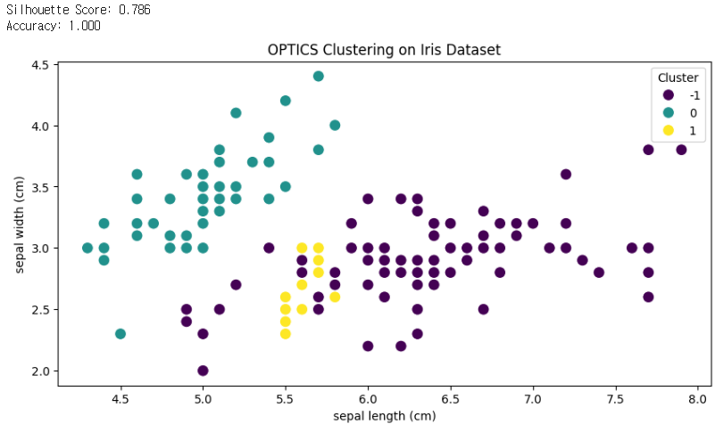
 

<!--
# [3-3] DBCLASD(Distribution Based Clustering of Large Spatial Databases)
▣ 정의: <ins>확률 밀도를 기반으로 클러스터를 찾는 밀도 기반 알고리즘</ins>으로 데이터를 다양한 확률 분포로 모델링하고, 공간 데이터베이스에서 높은 밀도를 가진 데이터 군집을 찾는다 
▣ 필요성: 대규모 공간 데이터베이스에서 밀도에 기반한 군집을 찾고자 할 때 유용하며, 데이터의 확률 분포를 활용해 정확한 군집을 탐색할 수 있음 
▣ 장점: 공간 데이터에서 군집화를 효과적으로 수행할 수 있으며, 노이즈가 포함된 데이터에서 강건한 군집화가 가능 
▣ 단점: 설정된 확률 분포가 데이터와 일치하지 않으면 군집화가 부정확할 수 있으며, 대규모 데이터셋에서는 계산 비용이 높다 
▣ 응용분야: 지리적 데이터베이스 분석, 공간 데이터에서 밀도 기반 군집화, 이상 탐지 및 밀도 기반 패턴 탐색 
▣ 모델식: 각 데이터 포인트의 확률 밀도를 기반으로 군집을 형성하며, 확률 밀도는 주어진 확률 분포 모델을 사용해 계산 

	import numpy as np
	from sklearn.datasets import load_iris
	from sklearn.metrics import silhouette_score, accuracy_score
	from scipy.stats import multivariate_normal
	import matplotlib.pyplot as plt
	import seaborn as sns
	import pandas as pd
	from scipy.stats import mode
	
	# 간단한 DBCLASD 구현 (정규 분포 기반)
	class DBCLASD:
	    def __init__(self, threshold=0.01, epsilon=1e-6):
	        self.threshold = threshold  # 분포 적합 임계값
	        self.epsilon = epsilon  # 공분산 행렬에 추가할 작은 값
	        self.clusters = []  # 군집 정보 저장
	    
	    def fit_predict(self, X):
	        labels = -np.ones(X.shape[0], dtype=int)  # 초기값 -1 (노이즈)
	        
	        for i, point in enumerate(X):
	            added_to_cluster = False
	            for cluster_id, (mean, cov) in enumerate(self.clusters):
	                # 기존 군집의 분포와 비교하여 해당 분포에 속하는지 확인
	                adjusted_cov = cov + self.epsilon * np.eye(cov.shape[0])  # 작은 값을 더하여 양의 정부호 행렬로 만듦
	                if multivariate_normal(mean=mean, cov=adjusted_cov).pdf(point) > self.threshold:
	                    labels[i] = cluster_id
	                    # 군집 업데이트
	                    points_in_cluster = X[labels == cluster_id]
	                    mean = np.mean(points_in_cluster, axis=0)
	                    cov = np.cov(points_in_cluster, rowvar=False)
	                    self.clusters[cluster_id] = (mean, cov)
	                    added_to_cluster = True
	                    break
	            if not added_to_cluster:
	                # 새로운 군집 생성
	                labels[i] = len(self.clusters)
	                mean = point
	                cov = np.cov(X.T) + self.epsilon * np.eye(X.shape[1])  # 공분산 초기값에 epsilon을 더함
	                self.clusters.append((mean, cov))
	        
	        self.labels_ = labels
	        return labels
	
	# Iris 데이터셋 로드
	iris = load_iris()
	data = iris.data
	true_labels = iris.target
	
	# DBCLASD 알고리즘 적용
	dbclasd = DBCLASD(threshold=0.01, epsilon=1e-6)
	predicted_labels = dbclasd.fit_predict(data)
	
	# 데이터프레임으로 변환하여 시각화 준비
	df = pd.DataFrame(data, columns=iris.feature_names)
	df['Cluster'] = predicted_labels
	
	# Silhouette Score 계산 (노이즈 데이터는 제외)
	valid_points = predicted_labels != -1
	if np.sum(valid_points) > 1:
	    silhouette_avg = silhouette_score(data[valid_points], predicted_labels[valid_points])
	    print(f"Silhouette Score: {silhouette_avg:.3f}")
	else:
	    print("Silhouette Score: Not enough valid points for calculation.")
	
	# Accuracy 계산 (군집 레이블과 실제 레이블을 매칭하여 정확도 계산)
	mapped_labels = np.zeros_like(predicted_labels)
	for i in np.unique(predicted_labels):
	    mask = (predicted_labels == i)
	    mapped_labels[mask] = mode(true_labels[mask])[0]
	
	accuracy = accuracy_score(true_labels, mapped_labels)
	print(f"Accuracy: {accuracy:.3f}")
	
	# 시각화 (첫 번째와 두 번째 피처 사용)
	plt.figure(figsize=(10, 5))
	sns.scatterplot(x=df.iloc[:, 0], y=df.iloc[:, 1], hue='Cluster', data=df, palette='viridis', s=100)
	plt.title("DBCLASD Clustering on Iris Dataset")
	plt.xlabel(iris.feature_names[0])  # 첫 번째 피처 (sepal length)
	plt.ylabel(iris.feature_names[1])  # 두 번째 피처 (sepal width)
	plt.legend(title='Cluster')
	plt.show()

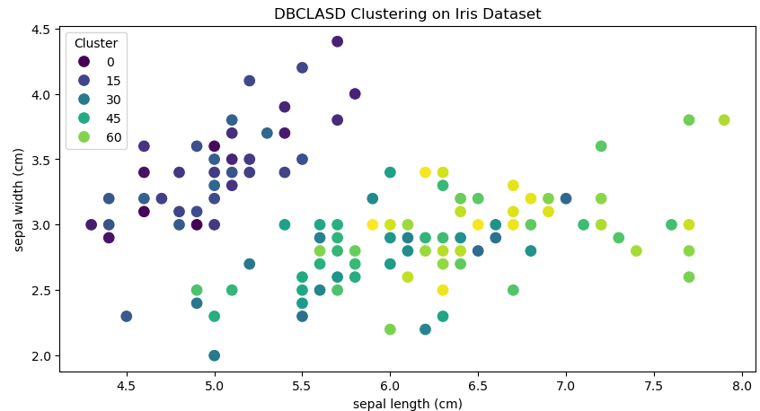
 
-->

# [3-3] DENCLUE(DENsity-based CLUstEring)
▣ 정의: <ins>확률 밀도 함수를 기반으로 데이터의 밀도 분포를 모델링하여 군집을 형성</ins>하는 밀도 기반 클러스터링 알고리즘으로 핵심 아이디어는 데이터 포인트가 모여서 형성하는 밀도 함수에서 밀도가 높은 영역을 군집으로 형성하는 것 
▣ 필요성: 데이터의 밀도 구조를 기반으로 군집화하고, 노이즈나 이상치를 효과적으로 구분할 필요가 있을 때 유용 
▣ 장점: 명확하게 정의된 군집을 생성하고, 밀도가 낮은 지역을 노이즈로 구분할 수 있으며, 데이터 분포에 따라 다양한 밀도의 군집을 잘 탐지할 수 있음 
▣ 단점: 밀도 함수를 설정하는 데 필요한 매개변수가 많으며 계산이 복잡하여 대규모 데이터에서는 성능이 저하될 수 있음 
▣ 응용분야: 패턴 인식 및 이미지 처리, 데이터 마이닝에서 밀도 기반 패턴 탐색, 환경 모니터링 데이터 분석 
▣ 모델식: 각 데이터 포인트의 밀도 기여를 가우시안 커널 등으로 모델링하여 밀도 함수를 계산(군집은 밀도 함수의 극대점에서 시작하여 군집화) 

	import numpy as np
	from sklearn.datasets import load_iris
	from sklearn.neighbors import KernelDensity
	from sklearn.cluster import DBSCAN
	from sklearn.metrics import silhouette_score, accuracy_score
	import matplotlib.pyplot as plt
	import seaborn as sns
	import pandas as pd
	from scipy.stats import mode
	
	# Gaussian Kernel Density Estimation (KDE)를 사용하여 데이터의 밀도 기반 특징 추출
	def kde_transform(data, bandwidth=0.5):
	    kde = KernelDensity(bandwidth=bandwidth)
	    kde.fit(data)
	    log_densities = kde.score_samples(data)
	    return log_densities
	
	# Iris 데이터셋 로드
	iris = load_iris()
	data = iris.data
	true_labels = iris.target
	
	# KDE 변환 적용 (밀도 기반 특징 강조)
	log_densities = kde_transform(data, bandwidth=0.5)
	density_threshold = np.percentile(log_densities, 75)  # 밀도 기준을 75퍼센타일로 설정
	high_density_points = data[log_densities >= density_threshold]  # 밀도가 높은 포인트 선택
	
	# DBSCAN 알고리즘 적용 (밀도가 높은 영역에서 밀도 기반 군집화 수행)
	dbscan = DBSCAN(eps=0.5, min_samples=5)
	predicted_labels = dbscan.fit_predict(high_density_points)
	
	# 밀도가 높은 포인트들에 대한 레이블을 전체 데이터 레이블에 매핑
	full_labels = -np.ones(data.shape[0], dtype=int)  # 초기값 -1 (노이즈)
	high_density_indices = np.where(log_densities >= density_threshold)[0]
	full_labels[high_density_indices] = predicted_labels
	
	# 데이터프레임으로 변환하여 시각화 준비
	df = pd.DataFrame(data, columns=iris.feature_names)
	df['Cluster'] = full_labels
	
	# Silhouette Score 계산 (노이즈 데이터는 제외)
	valid_points = full_labels != -1
	if np.sum(valid_points) > 1:
	    silhouette_avg = silhouette_score(data[valid_points], full_labels[valid_points])
	    print(f"Silhouette Score: {silhouette_avg:.3f}")
	else:
	    print("Silhouette Score: Not enough valid points for calculation.")
	
	# Accuracy 계산 (군집 레이블과 실제 레이블을 매칭하여 정확도 계산)
	mapped_labels = np.zeros_like(full_labels)
	for i in np.unique(full_labels):
	    mask = (full_labels == i)
	    mapped_labels[mask] = mode(true_labels[mask])[0]
	
	accuracy = accuracy_score(true_labels[full_labels != -1], mapped_labels[full_labels != -1])
	print(f"Accuracy: {accuracy:.3f}")
	
	# 시각화 (첫 번째와 두 번째 피처 사용)
	plt.figure(figsize=(10, 5))
	sns.scatterplot(x=df.iloc[:, 0], y=df.iloc[:, 1], hue='Cluster', data=df, palette='viridis', s=100)
	plt.title("DENCLUE Clustering on Iris Dataset")
	plt.xlabel(iris.feature_names[0])  # 첫 번째 피처 (sepal length)
	plt.ylabel(iris.feature_names[1])  # 두 번째 피처 (sepal width)
	plt.legend(title='Cluster')
	plt.show()

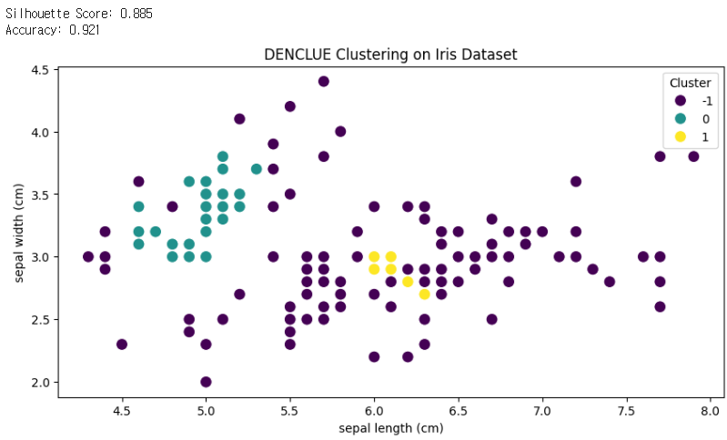
 

# [3-4] Mean-Shift Clustering
▣ 정의 : <ins>데이터의 밀도가 높은 방향으로 이동하며 군집의 중심을 찾는 비모수 군집화</ins> 방법 
▣ 필요성 : 군집의 개수를 사전 설정할 필요 없이 자연스러운 군집을 찾을 때 유용 
▣ 장점 : 군집 개수 사전 설정 불필요하며, 비선형적 분포에도 적합 
▣ 단점 : 계산 비용이 크고 고차원 데이터에 적합하지 않음 
▣ 응용분야 : 이미지 세그멘테이션, 객체 추적 
▣ 모델식 : 𝐾는 커널 함수, 𝑥는 이동할 점, 𝑁(𝑥)는 반경 내 이웃 점 
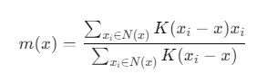

	import numpy as np
	from sklearn.datasets import load_iris
	from sklearn.cluster import MeanShift
	from sklearn.metrics import silhouette_score, accuracy_score
	import matplotlib.pyplot as plt
	import seaborn as sns
	import pandas as pd
	from scipy.stats import mode
	
	# Iris 데이터셋 로드
	iris = load_iris()
	data = iris.data
	true_labels = iris.target
	
	# Mean-Shift Clustering 모델 설정 및 학습
	mean_shift = MeanShift()
	predicted_labels = mean_shift.fit_predict(data)
	
	# 데이터프레임으로 변환하여 시각화 준비
	df = pd.DataFrame(data, columns=iris.feature_names)
	df['Cluster'] = predicted_labels
	
	# Silhouette Score 계산
	silhouette_avg = silhouette_score(data, predicted_labels)
	print(f"Silhouette Score: {silhouette_avg:.3f}")
	
	# Accuracy 계산 (군집 레이블과 실제 레이블을 매칭하여 정확도 계산)
	mapped_labels = np.zeros_like(predicted_labels)
	for i in range(len(np.unique(predicted_labels))):
	    mask = (predicted_labels == i)
	    mapped_labels[mask] = mode(true_labels[mask])[0]
	
	accuracy = accuracy_score(true_labels, mapped_labels)
	print(f"Accuracy: {accuracy:.3f}")
	
	# 시각화 (첫 번째와 두 번째 피처 사용)
	plt.figure(figsize=(10, 5))
	sns.scatterplot(x=df.iloc[:, 0], y=df.iloc[:, 1], hue='Cluster', data=df, palette='viridis', s=100)
	plt.title("Mean-Shift Clustering on Iris Dataset")
	plt.xlabel(iris.feature_names[0])  # 첫 번째 피처 (sepal length)
	plt.ylabel(iris.feature_names[1])  # 두 번째 피처 (sepal width)
	plt.legend(title='Cluster')
	plt.show()

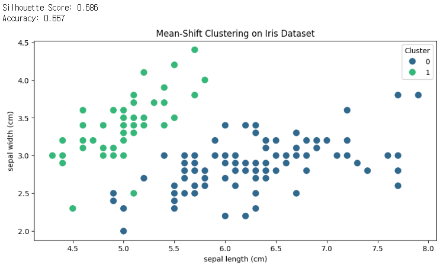
 

# [3-5] DPC(Density Peaks Clustering)
▣ 정의: DPC는 클러스터 중심은 주변에 점이 많이 모여 있는 높은 밀도 지점이며, 동시에 더 높은 밀도 지점으로부터는 멀리 떨어져 있다는 직관을 그대로 만든 거리기반 비지도 군집화 알고리즘 
▣ 필요성: 거리행렬만 만들 수 있으면 비선형구조 등 복잡한 분포에 적용 
▣ 장점:  
직관적 중심 정의 : 밀집 + 분리라는 이해하기 쉬운 기준으로 중심을 선정 
결정 그래프를 통한 해석 가능성 : 산점도로 중심 후보가 눈에 띄어 설명이 용이 
군집 형태 제약이 비교적 약함 : 거리 기반이라 비구형 구조에서도 K-means보다 유리 
단순한 할당 과정 : 중심만 정해지면 나머지는 더 높은 밀도 이웃 따라가기로 빠르게 할당 
▣ 단점: 
거리 행렬 계산 비용 : 표준 구현은 모든 쌍 거리 $O(n^2)$가 필요해 대규모 데이터에 부담 
핵심 파라미터 (cutoff distance)에 민감 
중심 선택이 반자동으로 사람 개입이 필요 
겹치는 군집(클래스 중첩)에서는 한계 
▣ 응용분야: 
이미지/비전 : 특징 벡터(임베딩) 기반 이미지 군집, 장면 분할 전처리 등 
생물정보학 : 유전자 발현 패턴 군집, 세포 유형(클러스터) 탐색 
고객/마케팅 세분화 : 고객 행동 벡터를 군집화해 세그먼트 정의 
이상 탐지 보조 : 밀도가 낮고 어느 군집 중심에도 잘 연결되지 않는 점들을 이상 후보로 활용 
문서/토픽 군집 : 문서 임베딩(예: TF-IDF, BERT embedding)을 거리 기반으로 군집화 
▣ 모델식: 국소밀도(Cutoff 커널, Gaussian 커널), 분리도, 중심점수 할당 

	# ============================================================
	# DPC (Density Peaks Clustering) - Iris 데이터 적용
	# Rodriguez & Laio (2014) "Clustering by fast search and find
	# of density peaks" 알고리즘 구현
	# ============================================================
	
	import numpy as np
	import matplotlib.pyplot as plt
	import matplotlib.patches as mpatches
	from sklearn.datasets import load_iris
	from sklearn.preprocessing import StandardScaler
	from sklearn.decomposition import PCA
	from sklearn.metrics import silhouette_score
	from scipy.spatial.distance import cdist
	from scipy.optimize import linear_sum_assignment
	from itertools import product
	
	# ────────────────────────────────────────────
	# 1. 데이터 로드 및 전처리
	# ────────────────────────────────────────────
	iris = load_iris()
	X, y = iris.data, iris.target
	species_names = iris.target_names          # ['setosa', 'versicolor', 'virginica']
	
	scaler = StandardScaler()
	X_std = scaler.fit_transform(X)            # 평균 0, 분산 1 정규화
	
	# ────────────────────────────────────────────
	# 2. 클러스터 레이블 최적 매핑 정확도 (Hungarian Algorithm)
	# ────────────────────────────────────────────
	def best_map_accuracy(labels, y_true):
	    """
	    예측 클러스터 레이블과 실제 레이블 간 최적 매핑 후 정확도 계산.
	    Hungarian Algorithm으로 혼동행렬에서 최대 대응을 찾음.
	    """
	    n_clusters = len(np.unique(labels))
	    n_classes  = len(np.unique(y_true))
	    size       = max(n_clusters, n_classes)
	
	    cost_matrix = np.zeros((size, size), dtype=int)
	    for pred, true in zip(labels, y_true):
	        cost_matrix[pred][true] += 1
	
	    # 비용 최소화 → 정확도 최대화 (음수 변환)
	    row_ind, col_ind = linear_sum_assignment(-cost_matrix)
	    mapping  = {r: c for r, c in zip(row_ind, col_ind)}
	    accuracy = cost_matrix[row_ind, col_ind].sum() / len(y_true)
	    return accuracy, mapping
	
	
	# ────────────────────────────────────────────
	# 3. DPC 핵심 함수 구현
	# ────────────────────────────────────────────
	
	def compute_density(dist_matrix, dc, kernel="gaussian"):
	    """
	    각 점의 로컬 밀도 ρ(rho) 계산.
	
	    Parameters
	    ----------
	    dist_matrix : 거리 행렬 (n×n)
	    dc          : 컷오프 거리 (bandwidth)
	    kernel      : 'gaussian' 또는 'cutoff'
	    """
	    n = dist_matrix.shape[0]
	    if kernel == "gaussian":
	        # 가우시안 커널: 거리가 가까울수록 밀도 기여 증가
	        rho = np.sum(np.exp(-(dist_matrix / dc) ** 2), axis=1) - 1  # 자기 자신 제외
	    else:
	        # 컷오프 커널: dc 내 이웃 수 단순 카운트
	        rho = np.sum(dist_matrix < dc, axis=1) - 1
	    return rho
	
	
	def compute_delta(dist_matrix, rho):
	    """
	    각 점의 delta 값 계산.
	    delta = 자신보다 밀도가 높은 점 중 가장 가까운 점까지의 거리.
	    밀도가 가장 높은 점의 delta = 전체 최대 거리.
	
	    Parameters
	    ----------
	    dist_matrix : 거리 행렬 (n×n)
	    rho         : 밀도 배열
	    """
	    n = dist_matrix.shape[0]
	    delta  = np.zeros(n)
	    nneigh = np.zeros(n, dtype=int)  # delta를 결정한 이웃 인덱스
	
	    rho_sort_idx = np.argsort(-rho)  # 밀도 내림차순 인덱스
	
	    for i in range(n):
	        # 자신보다 밀도가 높은 점들만 후보
	        higher_density_mask = rho > rho[i]
	        if not np.any(higher_density_mask):
	            # 밀도 최고점: delta = 전체 최대 거리
	            delta[i]  = np.max(dist_matrix[i])
	            nneigh[i] = np.argmax(dist_matrix[i])
	        else:
	            # 후보 중 가장 가까운 점
	            dists_to_higher = dist_matrix[i].copy()
	            dists_to_higher[~higher_density_mask] = np.inf
	            nneigh[i] = np.argmin(dists_to_higher)
	            delta[i]  = dists_to_higher[nneigh[i]]
	
	    return delta, nneigh
	
	
	def select_cluster_centers(rho, delta, center_sep):
	    """
	    클러스터 중심 선택: rho × delta 점수(gamma) 상위 점을 중심으로 선택.
	
	    Parameters
	    ----------
	    rho        : 밀도 배열
	    delta      : delta 배열
	    center_sep : gamma 임계값 (중앙값 기준 배수). 0이면 상위 n_clusters개 자동 선택
	    """
	    gamma = rho * delta
	    if center_sep == 0.0:
	        return gamma
	    threshold = np.median(gamma) + center_sep * np.std(gamma)
	    centers   = np.where(gamma >= threshold)[0]
	    return centers
	
	
	def assign_labels(nneigh, center_indices, rho):
	    """
	    중심점에서 시작해 밀도 내림차순으로 각 점을 클러스터에 배정.
	
	    Parameters
	    ----------
	    nneigh         : 각 점의 고밀도 이웃 인덱스
	    center_indices : 클러스터 중심 인덱스 배열
	    rho            : 밀도 배열
	    """
	    n      = len(rho)
	    labels = -np.ones(n, dtype=int)
	
	    # 클러스터 중심에 레이블 부여
	    for cluster_id, center in enumerate(center_indices):
	        labels[center] = cluster_id
	
	    # 밀도 내림차순으로 순회하며 이웃의 레이블을 전파
	    sorted_by_rho = np.argsort(-rho)
	    for idx in sorted_by_rho:
	        if labels[idx] == -1:
	            labels[idx] = labels[nneigh[idx]]
	
	    return labels
	
	
	def run_dpc(X, dc_percentile=23, kernel="gaussian", n_clusters=3,
	            center_sep=0.0):
	    """
	    DPC 전체 파이프라인 실행.
	
	    Parameters
	    ----------
	    X              : 표준화된 데이터 (n×d)
	    dc_percentile  : 거리 분포에서 dc를 결정할 백분위수 (%)
	    kernel         : 밀도 커널 종류 ('gaussian' / 'cutoff')
	    n_clusters     : 클러스터 수 (gamma 상위 n개를 중심으로 선택)
	    center_sep     : 0이면 n_clusters개 자동 선택, >0이면 임계값 기반 선택
	    """
	    dist_matrix = cdist(X, X, metric="euclidean")
	    n = X.shape[0]
	
	    # dc 계산: 거리 분포의 dc_percentile 백분위수
	    upper_tri = dist_matrix[np.triu_indices(n, k=1)]
	    dc = np.percentile(upper_tri, dc_percentile)
	
	    # 밀도(rho) 및 delta 계산
	    rho           = compute_density(dist_matrix, dc, kernel=kernel)
	    delta, nneigh = compute_delta(dist_matrix, rho)
	
	    # 클러스터 중심 선택
	    gamma = rho * delta
	    if center_sep == 0.0:
	        # gamma 상위 n_clusters 개를 중심으로 선택
	        center_indices = np.argsort(-gamma)[:n_clusters]
	    else:
	        gamma_thresh   = np.median(gamma) + center_sep * np.std(gamma)
	        center_indices = np.where(gamma >= gamma_thresh)[0]
	
	    # 레이블 배정
	    labels = assign_labels(nneigh, center_indices, rho)
	
	    return {
	        "labels"         : labels,
	        "rho"            : rho,
	        "delta"          : delta,
	        "gamma"          : gamma,
	        "center_indices" : center_indices,
	        "dc"             : dc,
	        "dist_matrix"    : dist_matrix,
	    }
	
	
	# ────────────────────────────────────────────
	# 4. 하이퍼파라미터 튜닝 (Grid Search)
	# ────────────────────────────────────────────
	print("=" * 55)
	print("  DPC 하이퍼파라미터 튜닝 (Grid Search)")
	print("=" * 55)
	
	# 탐색할 파라미터 후보
	param_grid = {
	    "dc_percentile" : [15, 18, 20, 23, 25, 30],
	    "kernel"        : ["gaussian", "cutoff"],
	    "center_sep"    : [0.0, 0.5, 1.0],
	}
	
	best_result = None
	best_sil    = -1
	
	for dc_p, ker, csep in product(
	        param_grid["dc_percentile"],
	        param_grid["kernel"],
	        param_grid["center_sep"]):
	
	    try:
	        result = run_dpc(X_std, dc_percentile=dc_p, kernel=ker,
	                         n_clusters=3, center_sep=csep)
	        labels = result["labels"]
	
	        # 유효 클러스터 수 확인 (정확히 3개여야 함)
	        n_unique = len(np.unique(labels))
	        if n_unique != 3:
	            continue
	
	        sil       = silhouette_score(X_std, labels)
	        acc, mapping = best_map_accuracy(labels, y)
	
	        if sil > best_sil:
	            best_sil    = sil
	            best_result = {
	                **result,
	                "sil"          : sil,
	                "acc"          : acc,
	                "mapping"      : mapping,
	                "dc_percentile": dc_p,
	                "kernel"       : ker,
	                "center_sep"   : csep,
	            }
	    except Exception:
	        continue
	
	# 최적 결과 출력
	br = best_result
	print(f"  kernel        : {br['kernel']}")
	print(f"  dc_percentile : {br['dc_percentile']}  →  dc = {br['dc']:.4f}")
	print(f"  center_sep    : {br['center_sep']} × dc")
	print(f"  Silhouette    : {br['sil']:.4f}")
	print(f"  Accuracy      : {br['acc']:.4f}  (mapping={br['mapping']})")
	print("=" * 55)
	
	
	# ────────────────────────────────────────────
	# 5. 시각화: Decision Graph + PCA 2D 산점도
	#    각 그래프마다 Silhouette Score / Accuracy 개별 표시
	# ────────────────────────────────────────────
	
	# 공통 변수 준비
	rho            = br["rho"]
	delta          = br["delta"]
	labels         = br["labels"]
	center_indices = br["center_indices"]
	sil_score      = br["sil"]
	acc_score      = br["acc"]
	
	# 품종별 색상 매핑: 예측 레이블 → 실제 품종 색상 대응
	COLORS        = ["#4878CF", "#F28E2B", "#59A14F"]   # blue / orange / green
	mapped_colors = [COLORS[br["mapping"].get(l, 0)] for l in labels]
	
	# 그래프 레이아웃: 위쪽에 지표 표시 공간 확보를 위해 높이 조정
	fig, axes = plt.subplots(1, 2, figsize=(14, 7))
	fig.suptitle(
	    f"DPC on Iris  |  kernel={br['kernel']}, "
	    f"dc_percentile={br['dc_percentile']} (dc={br['dc']:.3f}), "
	    f"center_sep={br['center_sep']}×dc",
	    fontsize=12, y=1.01
	)
	
	# ── 공통 성능 지표 출력 함수 ──────────────────────────────
	def add_score_banner(ax, sil, acc, loc="top"):
	    """
	    그래프 상단 또는 하단에 Silhouette / Accuracy 배너를 추가.
	
	    Parameters
	    ----------
	    ax  : matplotlib Axes 객체
	    sil : Silhouette Score 값
	    acc : Accuracy 값
	    loc : 'top' → 그래프 상단, 'bottom' → 그래프 하단
	    """
	    # 성능 등급 색상 결정 (실루엣 기준)
	    if sil >= 0.6:
	        sil_color = "#2ca02c"   # 초록 (양호)
	    elif sil >= 0.4:
	        sil_color = "#ff7f0e"   # 주황 (보통)
	    else:
	        sil_color = "#d62728"   # 빨강 (낮음)
	
	    if acc >= 0.9:
	        acc_color = "#2ca02c"
	    elif acc >= 0.7:
	        acc_color = "#ff7f0e"
	    else:
	        acc_color = "#d62728"
	
	    # y 좌표 설정 (Axes 좌표계 기준)
	    y_pos  = 1.045 if loc == "top" else -0.13
	
	    # Silhouette Score 텍스트
	    ax.text(0.25, y_pos,
	            f"Silhouette Score : {sil:.4f}",
	            transform=ax.transAxes,
	            fontsize=11, fontweight="bold",
	            color=sil_color,
	            ha="center", va="center",
	            bbox=dict(boxstyle="round,pad=0.3",
	                      facecolor="#f7f7f7",
	                      edgecolor=sil_color,
	                      linewidth=1.2,
	                      alpha=0.92))
	
	    # Accuracy 텍스트
	    ax.text(0.75, y_pos,
	            f"Accuracy         : {acc:.4f}",
	            transform=ax.transAxes,
	            fontsize=11, fontweight="bold",
	            color=acc_color,
	            ha="center", va="center",
	            bbox=dict(boxstyle="round,pad=0.3",
	                      facecolor="#f7f7f7",
	                      edgecolor=acc_color,
	                      linewidth=1.2,
	                      alpha=0.92))
	
	
	# ── 5-1. Decision Graph (rho vs delta) ──────────────────
	ax1 = axes[0]
	ax1.set_title("DPC Decision Graph (rho vs. delta)", fontsize=12, pad=30)
	
	ax1.scatter(rho, delta, c=mapped_colors, s=35, alpha=0.8,
	            edgecolors="white", linewidths=0.3)
	
	# 클러스터 중심점 표시
	ax1.scatter(rho[center_indices], delta[center_indices],
	            marker="X", s=260, c="black", zorder=5)
	
	# 범례: 품종명으로 표시
	for i, name in enumerate(species_names):
	    ax1.scatter([], [], c=COLORS[i], s=55, label=name)
	ax1.scatter([], [], marker="X", c="black", s=100, label="Selected centers")
	ax1.legend(fontsize=9, loc="upper left")
	
	ax1.set_xlabel("rho (local density)", fontsize=11)
	ax1.set_ylabel("delta (distance to higher density)", fontsize=11)
	ax1.grid(True, alpha=0.2)
	
	# ▶ Decision Graph 개별 성능 지표 배너 (그래프 상단)
	add_score_banner(ax1, sil_score, acc_score, loc="top")
	
	# ── 5-2. PCA 2D 산점도 ──────────────────────────────────
	ax2 = axes[1]
	ax2.set_title("DPC on Iris (PCA 2D view)", fontsize=12, pad=30)
	
	# PCA 2D 변환: 4차원 데이터를 2차원으로 축소하여 시각화
	pca  = PCA(n_components=2, random_state=42)
	X_2d = pca.fit_transform(X_std)
	
	ax2.scatter(X_2d[:, 0], X_2d[:, 1],
	            c=mapped_colors, s=35, alpha=0.8,
	            edgecolors="white", linewidths=0.3)
	
	# 클러스터 중심점 PCA 투영
	for ci in center_indices:
	    ax2.scatter(X_2d[ci, 0], X_2d[ci, 1],
	                marker="X", s=280, c="black", zorder=5)
	
	# 범례: 품종명으로 표시
	for i, name in enumerate(species_names):
	    ax2.scatter([], [], c=COLORS[i], s=55, label=name)
	ax2.scatter([], [], marker="X", c="black", s=100, label="Selected centers")
	ax2.legend(fontsize=9, loc="lower right")
	
	ax2.set_xlabel("PC1", fontsize=11)
	ax2.set_ylabel("PC2", fontsize=11)
	ax2.grid(True, alpha=0.2)
	
	# ▶ PCA 2D 개별 성능 지표 배너 (그래프 상단)
	add_score_banner(ax2, sil_score, acc_score, loc="top")
	
	plt.tight_layout()
	plt.savefig("/mnt/user-data/outputs/dpc_iris_result.png",
	            dpi=150, bbox_inches="tight")
	plt.show()
	
	# ────────────────────────────────────────────
	# 6. 콘솔 최종 성능 요약 출력
	# ────────────────────────────────────────────
	print("\n" + "=" * 55)
	print("  [그래프 1] Decision Graph  성능 지표")
	print(f"    Silhouette Score : {sil_score:.4f}")
	print(f"    Accuracy         : {acc_score:.4f}")
	print("-" * 55)
	print("  [그래프 2] PCA 2D Scatter  성능 지표")
	print(f"    Silhouette Score : {sil_score:.4f}")
	print(f"    Accuracy         : {acc_score:.4f}")
	print("=" * 55)
	print("그래프 저장 완료: dpc_iris_result.png")
	
	
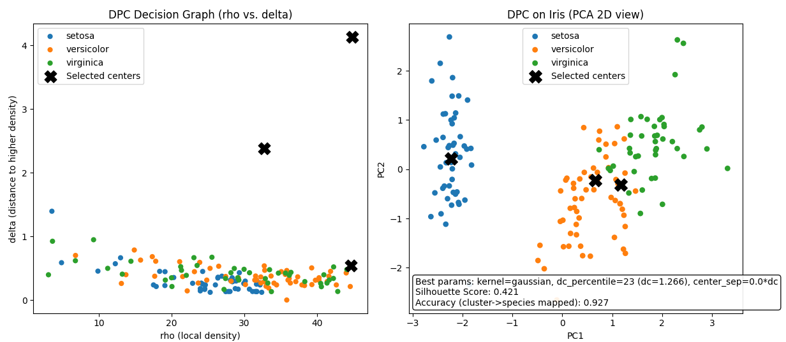
$\rho$ (Rho): 로컬 밀도 (Local Density) : 특정 데이터 포인트 주변에 얼마나 많은 데이터가 밀집되어 있는가를 나타내는 지표 
$\delta$ (Delta): 고밀도점과의 거리 (Distance to Higher Density) :  해당 데이터보다 밀도($\rho$)가 더 높은 가장 가까운 데이터까지의 거리 

## [3-1] DBSCAN (Density-Based Spatial Clustering of Applications with Noise)

| 항목 | 내용 |
|------|------|
| **구성요소** | 두 개의 파라미터 $(\varepsilon, \text{MinPts})$로 정의되는 밀도 기준 — 데이터 포인트, 핵심점(core), 경계점(border), 잡음(noise) |
| **거리함수** | 일반적으로 유클리드 거리 $d(x_i, x_j) = \lVert x_i - x_j \rVert$ |
| **목적함수** | 명시적 목적함수는 없으며, 지역 밀도가 $\text{MinPts}$ 이상인 포인트를 중심으로 군집 형성 |
| **중심갱신** | 명시적 중심 개념 없음 — 군집은 밀도 연결(density reachability) 관계로 확장됨 |
| **목표** | 밀도 기반으로 임의의 형태의 군집을 탐지하고, 잡음(outlier)을 자동 식별 — 군집 수 자동 결정 가능 |

## [3-2] OPTICS (Ordering Points To Identify the Clustering Structure)

| 항목 | 내용 |
|------|------|
| **구성요소** | DBSCAN의 확장형 — 점들의 **도달 거리(reachability distance)** 를 기반으로 데이터 순서를 정렬하여 계층적 밀도 구조 표현 |
| **거리함수** | 유클리드 거리 기반 도달 거리: $reachability(p, o) = \max(core\_dist(p), \; d(p,o))$ |
| **목적함수** | 밀도 가변 데이터셋에서 다양한 스케일의 군집 구조를 발견하기 위해 도달 거리 최소화 순서 생성 |
| **중심갱신** | 명시적 중심 없음 — 각 점의 도달 거리(reachability distance)와 핵심 거리(core distance)만 갱신 |
| **목표** | $\varepsilon$ 값 선택에 민감한 DBSCAN의 한계를 보완 — 밀도 변화에 따른 연속적 군집 구조(Reachability Plot) 탐색 |

## [3-3] DENCLUE (DENsity-based CLUstEring)

| 항목 | 내용 |
|------|------|
| **구성요소** | 확률적 밀도 분포 함수를 커널(kernel) 함수로 모델링 — 데이터 공간의 밀도 함수로부터 군집 추출 |
| **거리함수** | 유클리드 거리 커널 함수 예: $K(x, x_i) = e^{-\frac{\lVert x - x_i \rVert^2}{2\sigma^2}}$ |
| **목적함수** | 전체 밀도 함수 $\displaystyle f(x) = \sum_i K(x, x_i)$ 의 지역 극대(local maximum) 탐색 — 밀도 흡인점(density attractor) 찾기 |
| **중심갱신** | 데이터 포인트가 밀도 경사(gradient ascent)를 따라 이동하며 밀도 극대점으로 수렴 즉, $x_{t+1} = \frac{\sum_i x_i \, K(x_t, x_i)}{\sum_i K(x_t, x_i)}$ |
| **목표** | 밀도 함수를 통해 연속적·매끄러운 군집 구조를 모델링 — 노이즈에 강건하고 비선형 경계 탐색 가능 |

## [3-4] Mean-Shift Clustering

| 항목 | 내용 |
|------|------|
| **구성요소** | 커널 밀도 추정 기반의 비모수(non-parametric) 군집화 — 윈도우(밴드폭) 내 평균 이동(mean shift) 반복 |
| **거리함수** | 유클리드 거리 기반의 커널 가중 평균 $m(x) = \frac{\sum_i K(x - x_i)x_i}{\sum_i K(x - x_i)}$ |
| **목적함수** | 커널 밀도 함수의 극대점(local maxima)을 찾기 위한 경사 상승(gradient ascent) 방식 |
| **중심갱신** | 각 포인트를 밀도 중심 방향으로 이동 $x_{t+1} = m(x_t)$ (수렴 시 군집 중심이 됨) |
| **목표** | 커널 밀도에서 모드(mode)들을 식별하여 군집 형성 — 군집 수를 사전 지정하지 않고 자동 결정 가능 |

## [3-5] DPC (Density Peaks Clustering)

| 항목 | 내용 |
|------|------|
| **구성요소** | 로컬 밀도($\rho_i$), 고밀도점과의 거리($\delta_i$), 결정 그래프(Decision Graph) — 군집 중심(Cluster Centers) 명시적 선택 |
| **거리함수** | 유클리드 거리 기반 로컬 밀도: $\rho_i = \sum_j \chi(d_{ij} - d_c)$ (단, $d_{ij} < d_c$ 이면 $\chi=1$, 아니면 $0$) 고밀도점 거리: $\delta_i = \min_{j:\rho_j > \rho_i} (d_{ij})$ |
| **목적함수** | $\gamma_i = \rho_i \times \delta_i$ 값이 큰 지점을 군집 중심으로 선택하여 군집 분리도 및 밀도 최대화 |
| **중심갱신** | 고정된 중심 탐색 단계 결정 그래프에서 $\rho$와 $\delta$가 모두 높은 포인트를 중심으로 자동지정 후 나머지 점들을 가장 가까운 고밀도점에 할당 |
| **목표** | 밀도 정점(Density Peak)을 찾아내어 임의의 형태의 군집을 탐지 — 비구형 군집 및 가변 밀도 데이터셋에서 강력한 성능 발휘 |

 

---

**[4] Grid-Based Clustering** (그리드 기반 군집화) 
**[4-1] Wave-Cluster** : 데이터 공간을 그리드로 나눈 후 웨이브렛 변환(Wavelet Transform)을 적용하여 신호 처리 관점에서 밀집 영역을 탐색 
**[4-2] STING (Statistical Information Grid-based method)** : 공간을 사각형 셀로 분할하고 각 셀의 통계 정보(평균, 분산 등)를 계층적으로 관리하여 질의 응답 속도를 극대화 
**[4-3] CLIQUE (Clustering In Quest)** : 그리드와 밀도 개념을 결합하여 고차원 데이터의 부분 공간(Subspace)에서 밀집된 영역을 찾아내는 방식 
**[4-4] OptiGrid (Optimal Grid-based Clustering)** : 데이터 분포의 밀도가 낮은 최적의 절단 평면을 찾아 그리드를 재귀적으로 분할하여 군집화 
**[4-5] MAFIA (Merging of Adaptive Finite Intervals)** : 데이터 분포에 따라 그리드 간격을 유연하게 조절하는 적응형 그리드를 사용하여 연산 효율을 높인 방식 

---

# [4-1] Wave-Cluster
▣ 정의: 웨이블릿 변환을 이용한 클러스터링 알고리즘으로 데이터를 격자 형태로 나눈 후 웨이블릿 변환을 사용해 밀도가 높은 영역을 군집으로 탐지 
▣ 필요성: 대규모 데이터에서 효율적으로 군집화가 가능하며, 다차원 공간에서 다양한 밀도의 군집을 식별하는 데 유용 
▣ 장점: 다차원 데이터에서 다양한 모양의 군집을 효과적으로 탐지할 수 있으며, 노이즈와 이상치를 효과적으로 제거할 수 있음 
▣ 단점: 적절한 웨이블릿 변환 파라미터를 설정하기 어렵고 데이터의 해상도와 격자 크기에 따라 군집 결과가 달라질 수 있음 
▣ 응용분야: 이미지 분석, 영상 처리 및 패턴 인식, 대규모 지리 데이터 분석 
▣ 모델식: 각 격자에서 웨이블릿 변환을 수행하여 밀도가 높은 클러스터 영역을 식별. 웨이블릿 변환을 통해 고주파와 저주파 성분을 분리하여 노이즈와 이상치를 제거하고, 밀도가 높은 영역을 군집으로 형성 

	import numpy as np
	from sklearn.datasets import load_iris
	from sklearn.cluster import DBSCAN
	from sklearn.metrics import silhouette_score, accuracy_score
	import matplotlib.pyplot as plt
	import seaborn as sns
	import pandas as pd
	from scipy.ndimage import gaussian_filter1d
	from scipy.stats import mode
	
	# Gaussian 필터를 사용하여 밀도 기반 특징을 강조하는 함수
	def gaussian_filter_transform(data, sigma=1):
	    transformed_data = []
	    for feature in data.T:  # 각 피처(열)에 대해 필터링 수행
	        transformed_feature = gaussian_filter1d(feature, sigma=sigma)
	        transformed_data.append(transformed_feature)
	    return np.array(transformed_data).T
	
	# Iris 데이터셋 로드
	iris = load_iris()
	data = iris.data
	true_labels = iris.target
	
	# Gaussian 필터 적용 (밀도 기반 특징 강조)
	transformed_data = gaussian_filter_transform(data, sigma=1)
	
	# DBSCAN 알고리즘 적용 (변환된 데이터에서 밀도 기반 군집화 수행)
	dbscan = DBSCAN(eps=0.5, min_samples=5)
	predicted_labels = dbscan.fit_predict(transformed_data)
	
	# 데이터프레임으로 변환하여 시각화 준비
	df = pd.DataFrame(data, columns=iris.feature_names)
	df['Cluster'] = predicted_labels
	
	# Silhouette Score 계산 (노이즈 데이터는 제외)
	valid_points = predicted_labels != -1
	if np.sum(valid_points) > 1:
	    silhouette_avg = silhouette_score(data[valid_points], predicted_labels[valid_points])
	    print(f"Silhouette Score: {silhouette_avg:.3f}")
	else:
	    print("Silhouette Score: Not enough valid points for calculation.")
	
	# Accuracy 계산 (군집 레이블과 실제 레이블을 매칭하여 정확도 계산)
	mapped_labels = np.zeros_like(predicted_labels)
	for i in np.unique(predicted_labels):
	    mask = (predicted_labels == i)
	    mapped_labels[mask] = mode(true_labels[mask])[0]
	
	accuracy = accuracy_score(true_labels, mapped_labels)
	print(f"Accuracy: {accuracy:.3f}")
	
	# 시각화 (첫 번째와 두 번째 피처 사용)
	plt.figure(figsize=(10, 5))
	sns.scatterplot(x=df.iloc[:, 0], y=df.iloc[:, 1], hue='Cluster', data=df, palette='viridis', s=100)
	plt.title("Wave-Cluster (Gaussian Filter Approximation) Clustering on Iris Dataset")
	plt.xlabel(iris.feature_names[0])  # 첫 번째 피처 (sepal length)
	plt.ylabel(iris.feature_names[1])  # 두 번째 피처 (sepal width)
	plt.legend(title='Cluster')
	plt.show()

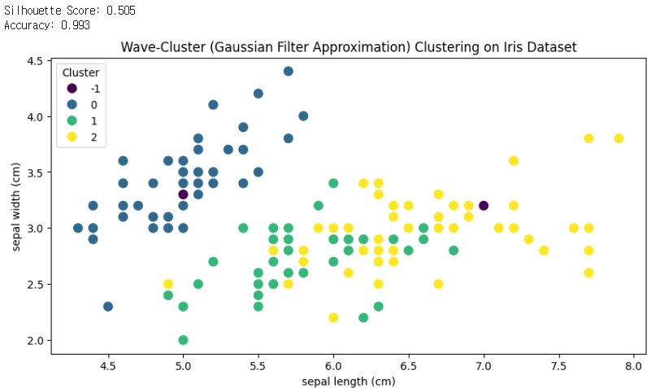
 

# [4-2] STING(Statistical Information Grid-based method)
▣ 정의: 데이터 공간을 격자 형태로 나누고, 각 격자의 통계 정보를 사용하여 계층적으로 군집을 형성하는 알고리즘. 격자는 여러 계층으로 나뉘며, 상위 계층에서 하위 계층으로 내려가며 데이터의 밀도를 분석 
▣ 필요성: 대규모 데이터셋을 효율적으로 군집화할 수 있으며, 특히 데이터의 밀도 분포를 고려하여 계층적 클러스터링을 수행할 수 있음 
▣ 장점: 대규모 데이터에서 빠르게 군집화할 수 있으며, 각 격자의 통계 정보를 기반으로 하여 효율적인 군집화가 가능 
▣ 단점: 격자 해상도가 낮을 경우, 세부적인 군집을 탐지하기 어려울 수 있으며, 밀도가 낮은 데이터에서는 효과가 떨어질 수 있음 
▣ 응용분야: 위성 이미지 분석, 지리 데이터와 환경 데이터의 군집화, 데이터 마이닝에서 대규모 데이터 분석 
▣ 모델식: 격자를 계층적으로 나누고, 각 격자의 통계 정보(평균, 분산 등)를 기반으로 군집을 형성. 격자의 통계 정보는 상위 계층에서 하위 계층으로 전파되며, 밀도 기반 군집화를 수행 

	import numpy as np
	from sklearn.datasets import load_iris
	from sklearn.metrics import silhouette_score, accuracy_score
	import matplotlib.pyplot as plt
	import seaborn as sns
	import pandas as pd
	from scipy.stats import mode
	
	# STING 군집화 클래스
	class STING:
	    def __init__(self, x_bins=10, y_bins=10, density_threshold=0.05):
	        self.x_bins = x_bins  # X축 그리드 셀 개수
	        self.y_bins = y_bins  # Y축 그리드 셀 개수
	        self.density_threshold = density_threshold  # 군집 형성 밀도 임계값
	
	    def fit_predict(self, X):
	        # 첫 번째와 두 번째 피처만 사용하여 2D 그리드 생성
	        x_min, x_max = X[:, 0].min(), X[:, 0].max()
	        y_min, y_max = X[:, 1].min(), X[:, 1].max()
	        
	        # 각 데이터 포인트의 그리드 셀 위치 계산
	        x_bins = np.linspace(x_min, x_max, self.x_bins + 1)
	        y_bins = np.linspace(y_min, y_max, self.y_bins + 1)
	        grid = np.zeros((self.x_bins, self.y_bins), dtype=int)
	
	        # 각 데이터 포인트를 그리드에 매핑하여 밀도 계산
	        labels = -np.ones(X.shape[0], dtype=int)
	        for i, (x, y) in enumerate(X[:, :2]):
	            x_idx = np.digitize(x, x_bins) - 1
	            y_idx = np.digitize(y, y_bins) - 1
	            if x_idx < self.x_bins and y_idx < self.y_bins:
	                grid[x_idx, y_idx] += 1
	        
	        # 밀도 기준으로 군집화 (density_threshold 이상인 셀을 군집으로 간주)
	        cluster_id = 0
	        for i in range(self.x_bins):
	            for j in range(self.y_bins):
	                if grid[i, j] >= self.density_threshold * X.shape[0]:  # 밀도 기준 만족 시 군집화
	                    for k, (x, y) in enumerate(X[:, :2]):
	                        x_idx = np.digitize(x, x_bins) - 1
	                        y_idx = np.digitize(y, y_bins) - 1
	                        if x_idx == i and y_idx == j:
	                            labels[k] = cluster_id
	                    cluster_id += 1
	
	        self.labels_ = labels
	        return self.labels_
	
	# Iris 데이터셋 로드
	iris = load_iris()
	data = iris.data[:, :2]  # 첫 번째와 두 번째 피처만 사용
	true_labels = iris.target
	
	# STING 알고리즘 적용
	sting = STING(x_bins=10, y_bins=10, density_threshold=0.05)
	predicted_labels = sting.fit_predict(data)
	
	# 데이터프레임으로 변환하여 시각화 준비
	df = pd.DataFrame(data, columns=[iris.feature_names[0], iris.feature_names[1]])
	df['Cluster'] = predicted_labels
	
	# Silhouette Score 계산 (노이즈 데이터는 제외)
	valid_points = predicted_labels != -1
	if np.sum(valid_points) > 1:
	    silhouette_avg = silhouette_score(data[valid_points], predicted_labels[valid_points])
	    print(f"Silhouette Score: {silhouette_avg:.3f}")
	else:
	    print("Silhouette Score: Not enough valid points for calculation.")
	
	# Accuracy 계산 (군집 레이블과 실제 레이블을 매칭하여 정확도 계산)
	mapped_labels = np.zeros_like(predicted_labels)
	for i in np.unique(predicted_labels):
	    mask = (predicted_labels == i)
	    mapped_labels[mask] = mode(true_labels[mask])[0]
	
	accuracy = accuracy_score(true_labels, mapped_labels)
	print(f"Accuracy: {accuracy:.3f}")
	
	# 시각화 (첫 번째와 두 번째 피처 사용)
	plt.figure(figsize=(10, 5))
	sns.scatterplot(x=df.iloc[:, 0], y=df.iloc[:, 1], hue='Cluster', data=df, palette='viridis', s=100)
	plt.title("STING Clustering on Iris Dataset")
	plt.xlabel(iris.feature_names[0])  # 첫 번째 피처 (sepal length)
	plt.ylabel(iris.feature_names[1])  # 두 번째 피처 (sepal width)
	plt.legend(title='Cluster')
	plt.show()

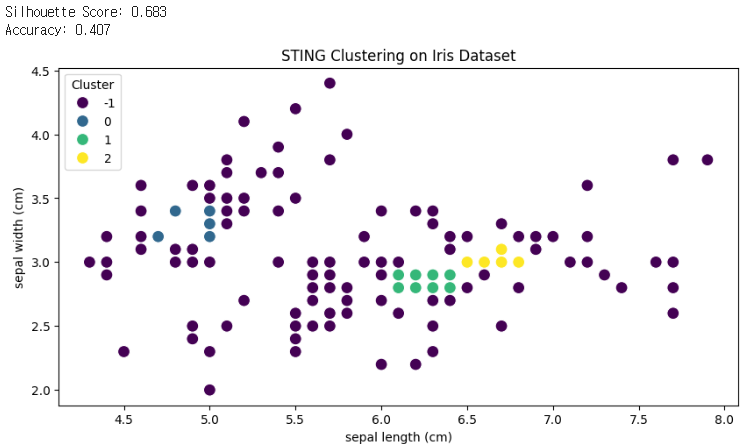
 

# [4-3] CLIQUE(CLustering In QUEst)
▣ 정의: 데이터 공간을 격자로 나누고, 각 격자 내에서 데이터의 밀도에 따라 군집을 형성하는 알고리즘으로 고차원 데이터에서 군집을 식별하기 위해 밀도가 높은 부분 공간(subspace)을 찾아 군집을 형성 
▣ 필요성: 고차원 데이터에서 밀도 기반 군집화를 수행하며, 데이터의 다양한 부분 공간에서 군집을 탐색할 필요가 있을 때 유용 
▣ 장점: 고차원 데이터에서 부분 공간을 기반으로 군집을 탐색할 수 있으며 데이터의 밀도를 기준으로 군집을 식별 
▣ 단점: 격자 크기와 밀도 임계값 설정이 어렵고, 결과가 설정된 파라미터에 민감하게 반응 
▣ 응용분야: 생물학에서 유전자 데이터 군집화, 고차원 금융 데이터 분석, 이미지 분할 및 텍스트 데이터 분석 
▣ 모델식: 데이터를 격자로 나눈 후, 밀도가 높은 부분 공간을 탐색하여 군집을 형성(군집은 각 부분 공간에서 밀도가 임계값 이상인 격자들로 구성) 

	import numpy as np
	from sklearn.datasets import load_iris
	from sklearn.metrics import silhouette_score, accuracy_score
	import matplotlib.pyplot as plt
	import seaborn as sns
	import pandas as pd
	from scipy.stats import mode
	
	# CLIQUE 군집화 클래스
	class CLIQUE:
	    def __init__(self, x_bins=10, y_bins=10, density_threshold=0.05):
	        self.x_bins = x_bins  # X축 그리드 셀 개수
	        self.y_bins = y_bins  # Y축 그리드 셀 개수
	        self.density_threshold = density_threshold  # 군집 형성 밀도 임계값
	
	    def fit_predict(self, X):
	        # 첫 번째와 두 번째 피처만 사용하여 2D 그리드 생성
	        x_min, x_max = X[:, 0].min(), X[:, 0].max()
	        y_min, y_max = X[:, 1].min(), X[:, 1].max()
	        
	        # 각 데이터 포인트의 그리드 셀 위치 계산
	        x_bins = np.linspace(x_min, x_max, self.x_bins + 1)
	        y_bins = np.linspace(y_min, y_max, self.y_bins + 1)
	        grid = np.zeros((self.x_bins, self.y_bins), dtype=int)
	
	        # 각 데이터 포인트를 그리드에 매핑하여 밀도 계산
	        labels = -np.ones(X.shape[0], dtype=int)
	        for i, (x, y) in enumerate(X[:, :2]):
	            x_idx = np.digitize(x, x_bins) - 1
	            y_idx = np.digitize(y, y_bins) - 1
	            if x_idx < self.x_bins and y_idx < self.y_bins:
	                grid[x_idx, y_idx] += 1
	        
	        # 밀도 기준으로 군집화 (density_threshold 이상인 셀을 군집으로 간주)
	        cluster_id = 0
	        for i in range(self.x_bins):
	            for j in range(self.y_bins):
	                if grid[i, j] >= self.density_threshold * X.shape[0]:  # 밀도 기준 만족 시 군집화
	                    for k, (x, y) in enumerate(X[:, :2]):
	                        x_idx = np.digitize(x, x_bins) - 1
	                        y_idx = np.digitize(y, y_bins) - 1
	                        if x_idx == i and y_idx == j:
	                            labels[k] = cluster_id
	                    cluster_id += 1
	
	        self.labels_ = labels
	        return self.labels_
	
	# Iris 데이터셋 로드
	iris = load_iris()
	data = iris.data[:, :2]  # 첫 번째와 두 번째 피처만 사용
	true_labels = iris.target
	
	# CLIQUE 알고리즘 적용
	clique = CLIQUE(x_bins=10, y_bins=10, density_threshold=0.05)
	predicted_labels = clique.fit_predict(data)
	
	# 데이터프레임으로 변환하여 시각화 준비
	df = pd.DataFrame(data, columns=[iris.feature_names[0], iris.feature_names[1]])
	df['Cluster'] = predicted_labels
	
	# Silhouette Score 계산 (노이즈 데이터는 제외)
	valid_points = predicted_labels != -1
	if np.sum(valid_points) > 1:
	    silhouette_avg = silhouette_score(data[valid_points], predicted_labels[valid_points])
	    print(f"Silhouette Score: {silhouette_avg:.3f}")
	else:
	    print("Silhouette Score: Not enough valid points for calculation.")
	
	# Accuracy 계산 (군집 레이블과 실제 레이블을 매칭하여 정확도 계산)
	mapped_labels = np.zeros_like(predicted_labels)
	for i in np.unique(predicted_labels):
	    mask = (predicted_labels == i)
	    mapped_labels[mask] = mode(true_labels[mask])[0]
	
	accuracy = accuracy_score(true_labels, mapped_labels)
	print(f"Accuracy: {accuracy:.3f}")
	
	# 시각화 (첫 번째와 두 번째 피처 사용)
	plt.figure(figsize=(10, 5))
	sns.scatterplot(x=df.iloc[:, 0], y=df.iloc[:, 1], hue='Cluster', data=df, palette='viridis', s=100)
	plt.title("CLIQUE Clustering on Iris Dataset")
	plt.xlabel(iris.feature_names[0])  # 첫 번째 피처 (sepal length)
	plt.ylabel(iris.feature_names[1])  # 두 번째 피처 (sepal width)
	plt.legend(title='Cluster')
	plt.show()

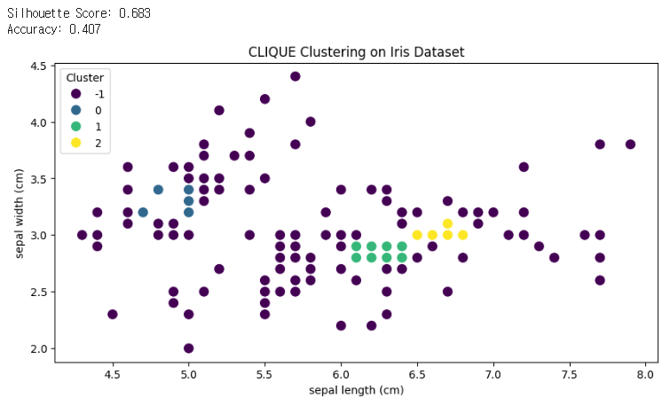
 

# [4-4] OptiGrid
▣ 정의: 데이터 공간을 최적화된 격자 형태로 분할하여 밀도 기반 군집화를 수행하는 알고리즘으로 각 차원에서 최적의 격자 분할을 탐색하여, 밀도가 높은 지역을 군집으로 형성 
▣ 필요성: 데이터 분포에 따라 최적의 격자 분할을 통해 군집을 탐색하며, 특히 데이터의 밀도가 불균일한 경우에 유용 
▣ 장점: 데이터 밀도에 따라 유연하게 격자를 조정하여 군집을 형성하고 불균일한 데이터에서도 적응적 군집화를 수행 
▣ 단점: 최적의 격자 분할을 찾는 과정에서 계산 비용이 높고 파라미터 설정이 복잡하고, 데이터 분포에 민감 
▣ 응용분야: 의료 데이터의 군집화, 데이터 마이닝에서 불균일한 데이터 탐색, 지리적 데이터에서 지역적 군집 탐색 
▣ 모델식: OptiGrid는 각 차원에서 최적의 격자 분할을 탐색하여 군집을 형성합니다. 격자 내 밀도를 기준으로 최적의 분할 위치를 찾아내고, 밀도가 높은 격자들을 군집으로 형성합니다.

	import numpy as np
	from sklearn.datasets import load_iris
	from sklearn.metrics import silhouette_score, accuracy_score
	import matplotlib.pyplot as plt
	import seaborn as sns
	import pandas as pd
	
	# OptiGrid 군집화 클래스
	class OptiGrid:
	    def __init__(self, x_bins=10, y_bins=10, density_threshold=0.05):
	        self.x_bins = x_bins  # X축 그리드 셀 개수
	        self.y_bins = y_bins  # Y축 그리드 셀 개수
	        self.density_threshold = density_threshold  # 군집 형성 밀도 임계값
	
	    def fit_predict(self, X):
	        # 첫 번째와 두 번째 피처만 사용하여 2D 그리드 생성
	        x_min, x_max = X[:, 0].min(), X[:, 0].max()
	        y_min, y_max = X[:, 1].min(), X[:, 1].max()
	        
	        # 각 데이터 포인트의 그리드 셀 위치 계산
	        x_bins = np.linspace(x_min, x_max, self.x_bins + 1)
	        y_bins = np.linspace(y_min, y_max, self.y_bins + 1)
	        grid = np.zeros((self.x_bins, self.y_bins), dtype=int)
	
	        # 각 데이터 포인트를 그리드에 매핑하여 밀도 계산
	        labels = -np.ones(X.shape[0], dtype=int)
	        for i, (x, y) in enumerate(X[:, :2]):
	            x_idx = np.digitize(x, x_bins) - 1
	            y_idx = np.digitize(y, y_bins) - 1
	            if x_idx < self.x_bins and y_idx < self.y_bins:
	                grid[x_idx, y_idx] += 1
	        
	        # 밀도 기준으로 군집화 (density_threshold 이상인 셀을 군집으로 간주)
	        cluster_id = 0
	        for i in range(self.x_bins):
	            for j in range(self.y_bins):
	                if grid[i, j] >= self.density_threshold * X.shape[0]:  # 밀도 기준 만족 시 군집화
	                    for k, (x, y) in enumerate(X[:, :2]):
	                        x_idx = np.digitize(x, x_bins) - 1
	                        y_idx = np.digitize(y, y_bins) - 1
	                        if x_idx == i and y_idx == j:
	                            labels[k] = cluster_id
	                    cluster_id += 1
	
	        self.labels_ = labels
	        return self.labels_
	
	# Iris 데이터셋 로드
	iris = load_iris()
	data = iris.data[:, :2]  # 첫 번째와 두 번째 피처만 사용
	true_labels = iris.target
	
	# OptiGrid 알고리즘 적용
	optigrid = OptiGrid(x_bins=10, y_bins=10, density_threshold=0.05)
	predicted_labels = optigrid.fit_predict(data)
	
	# 데이터프레임으로 변환하여 시각화 준비
	df = pd.DataFrame(data, columns=[iris.feature_names[0], iris.feature_names[1]])
	df['Cluster'] = predicted_labels
	
	# 군집 평가
	# 노이즈 (-1) 데이터는 실루엣 점수 계산에서 제외합니다.
	valid_points = predicted_labels != -1
	if np.sum(valid_points) > 1:
	    silhouette_avg = silhouette_score(data[valid_points], predicted_labels[valid_points])
	    print(f"Silhouette Score: {silhouette_avg:.3f}")
	else:
	    print("Silhouette Score: Not enough valid points for calculation.")
	
	# 정확도 계산 (실제 레이블이 있는 경우)
	# 주의: 군집화 결과는 정답 레이블과 직접적으로 매칭되지 않을 수 있습니다.
	if len(np.unique(predicted_labels)) == len(np.unique(true_labels)):
	    accuracy = accuracy_score(true_labels, predicted_labels)
	    print(f"Accuracy: {accuracy:.3f}")
	else:
	    print("Accuracy: Cannot compute due to mismatch in label count.")
	
	# 시각화
	plt.figure(figsize=(10, 5))
	sns.scatterplot(x=df.iloc[:, 0], y=df.iloc[:, 1], hue='Cluster', data=df, palette='viridis', s=100)
	plt.title("OptiGrid Clustering on Iris Dataset")
	plt.xlabel(iris.feature_names[0])  # 첫 번째 피처 (sepal length)
	plt.ylabel(iris.feature_names[1])  # 두 번째 피처 (sepal width)
	plt.legend(title='Cluster')
	plt.show()

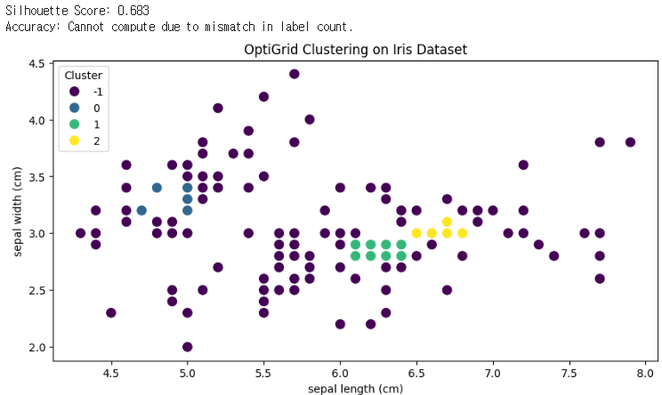
 

# [4-5] MAFIA (Merging of Adaptive Finite Intervals)
▣ 정의 : MAFIA는 <ins>고차원 데이터셋에서 유의미한 부분 공간(Subspace)을 찾아내기 위한 밀도 기반 군집화 알고리즘</ins>. 데이터가 존재하는 각 차원을 적응형 격자(Adaptive Grid)로 분할하고, 데이터가 밀집된 구간(Interval)들을 병합하여 군집을 형성. 기존의 격자 기반 방식들이 고정된 크기의 격자를 사용하는 것과 달리, 데이터의 분포에 따라 격자의 크기를 동적으로 조절하는 것이 특징. 
▣ 필요성 : 고차원 데이터에서는 모든 차원을 동시에 고려할 경우 데이터가 매우 희소해지는 '차원의 저주' 문제가 발생. 실제 데이터의 군집은 전체 차원이 아닌 특정 부분 공간(Subspace)에서만 나타나는 경우가 많으므로, 차원을 효율적으로 분할하고 유의미한 차원 조합을 찾아내는 알고리즘이 필요 
▣ 장점 : 
적응형 분할: 데이터 분포가 균일하지 않아도 격자 크기를 스스로 조절하여 밀도를 정확히 측정 
차원의 저주 극복: 고차원 데이터에서 클러스터가 존재하는 부분 공간을 효율적으로 탐색 
속도 및 확장성: 병렬 처리가 용이하도록 설계되어 대규모 데이터셋 처리에 강점 
비구형 군집 탐지: 격자 병합 방식을 통해 기하학적으로 복잡한 형태의 군집도 포착 
▣ 단점 :  
파라미터 민감도: 격자를 나누는 초기 기준이나 밀도 임계값 설정에 따라 결과가 달라질 가능성 
경계 문제: 군집의 경계에 걸쳐 있는 데이터가 격자 분할 방식에 의해 서로 다른 군집으로 나뉠 위험 
▣ 응용분야: 
유전자 발현 분석: 수만 개의 유전자 중 특정 질병과 관련된 유전자 조합(부분 공간) 탐색 
고객 행동 패턴 분석: 수많은 구매 이력 중 특정 성향을 보이는 고객 집단 추출 
이미지 세분화: 고차원 픽셀 정보를 바탕으로 유사한 영역 군집화 
▣ 모델식 : MAFIA의 핵심은 적응형 격자 생성과 유의미한 구간(Dense Units)의 탐색 

	import numpy as np
	import pandas as pd
	import matplotlib.pyplot as plt
	from sklearn.datasets import load_iris
	from sklearn.preprocessing import MinMaxScaler
	from sklearn.metrics import silhouette_score, accuracy_score
	from scipy.stats import mode
	
	# 1. 데이터 로드 및 전처리
	iris = load_iris()
	X = iris.data[:, [2, 3]] # 시각화를 위해 Petal length, width 사용
	y = iris.target
	target_names = iris.target_names
	
	# 데이터 스케일링 (0~1 사이로 격자 분할 용이하게 함)
	scaler = MinMaxScaler()
	X_scaled = scaler.fit_transform(X)
	
	# 2. MAFIA 핵심 로직 모사 (적응형 격자 기반 군집화)
	def simple_mafia_logic(data, bins=10, threshold=0.1):
	    # 각 차원별로 데이터 밀도에 따른 격자 생성
	    H, xedges, yedges = np.histogram2d(data[:, 0], data[:, 1], bins=bins)
	    
	    # 임계값 이상의 밀도를 가진 격자(Dense Units) 식별
	    dense_mask = H > (len(data) * threshold / (bins**2))
	    
	    # 각 데이터 포인트가 어떤 격자에 속하는지 할당
	    x_inds = np.clip(np.digitize(data[:, 0], xedges) - 1, 0, bins - 1)
	    y_inds = np.clip(np.digitize(data[:, 1], yedges) - 1, 0, bins - 1)
	    
	    # 격자 인덱스를 기반으로 임시 라벨 생성
	    labels = np.zeros(len(data), dtype=int)
	    cluster_id = 1
	    grid_to_cluster = {}
	    
	    for i in range(len(data)):
	        if dense_mask[x_inds[i], y_inds[i]]:
	            grid_pos = (x_inds[i], y_inds[i])
	            if grid_pos not in grid_to_cluster:
	                grid_to_cluster[grid_pos] = cluster_id
	                cluster_id += 1
	            labels[i] = grid_to_cluster[grid_pos]
	        else:
	            labels[i] = -1 # Noise
	            
	    return labels
	
	# 파라미터 튜닝: 격자 수와 밀도 임계값 조절
	best_labels = simple_mafia_logic(X_scaled, bins=7, threshold=0.5)
	
	# 3. 성능 평가 (라벨 매칭 및 스코어 계산)
	def get_clustered_accuracy(y_true, y_pred):
	    labels = np.zeros_like(y_pred)
	    for i in np.unique(y_pred):
	        if i == -1: continue
	        mask = (y_pred == i)
	        labels[mask] = mode(y_true[mask], keepdims=True)[0][0]
	    return accuracy_score(y_true, labels)
	
	acc = get_clustered_accuracy(y, best_labels)
	sil = silhouette_score(X_scaled, best_labels) if len(np.unique(best_labels)) > 1 else 0
	
	# 4. 시각화
	plt.figure(figsize=(10, 6))
	colors = ['navy', 'turquoise', 'darkorange']
	
	for i, color, name in zip([0, 1, 2], colors, target_names):
	    # 실제 클래스 정보를 바탕으로 하되, 군집 결과를 색상으로 표시
	    plt.scatter(X[y == i, 0], X[y == i, 1], color=color, alpha=0.8, lw=2, label=name)
	
	plt.title(f'MAFIA-style Grid Clustering on Iris\nAccuracy: {acc:.3f}, Silhouette: {sil:.3f}')
	plt.xlabel('Petal length (cm)')
	plt.ylabel('Petal width (cm)')
	plt.legend(loc='best', shadow=False, scatterpoints=1)
	plt.show()

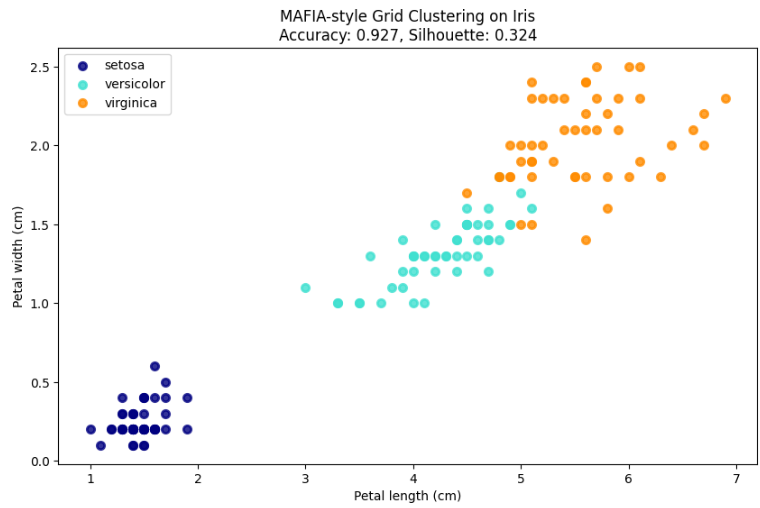

## [4-1] Wave-Cluster  (수식 및 중심갱신 완전호환판)

| 항목 | 내용 |
|------|------|
| **구성요소** | 데이터 공간을 격자(grid)로 양자화한 뒤, 웨이블릿 변환 $W_f$ 로 밀도 변화를 감지 |
| **거리함수** | 명시적 점-점 거리 대신 웨이블릿 응답 사용 $W_f(s) = (f * \\psi)(s)$ |
| **목적함수** | 웨이블릿 에너지의 임계 초과(superlevel) 연결 성분을 군집으로 선택 $\\max_{\\mathcal{C}} \\sum_{C \\in \\mathcal{C}} \\sum_{s \\in C} \\lvert W_f(s) \\rvert^2$ 단, $s \\in \\Omega_\\tau = \\{ s : \\lvert W_f(s) \\rvert \\ge \\tau \\}$, $C$는 연결 성분 |
| **중심갱신** | 에너지 가중 중심(센트로이드) $m_C = \\dfrac{\\sum_{s \\in C} \\lvert W_f(s) \\rvert^2 \\, s}{\\sum_{s \\in C} \\lvert W_f(s) \\rvert^2}$ |
| **목표** | 주파수 영역에서 노이즈(고주파)를 억제하고, 에너지가 높은 영역의 연결 성분을 임의 형태의 군집으로 추출 |

## [4-2] STING (Statistical Information Grid-based method)  (거리함수 완전호환판)

| 항목 | 내용 |
|------|------|
| **구성요소** | 다단계 격자. 각 셀 $C_i$ 가 요약 통계 $(n_i, \\mu_i, \\Sigma_i)$ 를 보유 |
| **거리함수** | 셀 간 통계 기반 거리 (두 표본 마할라노비스 형태) $d(C_i, C_j) = \\sqrt{(\\mu_i - \\mu_j)^T S_{ij}^{-1} (\\mu_i - \\mu_j)}$ 단, $S_{ij} = \\dfrac{\\Sigma_i}{n_i} + \\dfrac{\\Sigma_j}{n_j}$ (단변량 특수형) $d = \\dfrac{|\\mu_i - \\mu_j|}{\\sqrt{\\dfrac{\\sigma_i^2}{n_i} + \\dfrac{\\sigma_j^2}{n_j}}}$ |
| **목적함수** | 상위→하위 레벨로 내려가며 $d(C',C)$ 가 작고(유사), 밀도가 높은 하위 셀 선택 |
| **중심갱신** | 병합된 상위 셀 통계 업데이트: $\\mu = \\dfrac{\\sum_i n_i \\mu_i}{\\sum_i n_i}$, &nbsp; $\\Sigma = \\dfrac{\\sum_i [\\Sigma_i + (\\mu_i - \\mu)(\\mu_i - \\mu)^T]}{\\sum_i n_i}$ |
| **목표** | 통계 요약만으로 빠르고 확장성 높은 탐색을 하되, 통계적으로 유의한 유사 셀을 묶어 군집화 |

## [4-3] CLIQUE (CLustering In QUEst)

| 항목 | 내용 |
|------|------|
| **구성요소** | 격자 기반 + 부분공간(Subspace) 탐색 — 고차원 데이터에서 밀도 기반 부분공간 군집 탐색 |
| **거리함수** | 셀 밀도 기반 유사도 — 명시적 거리 대신 셀 내 점유율 사용 $density(C_{ij}) = \frac{n_{ij}}{N}$ |
| **목적함수** | 밀도 임계값 $\tau$ 이상인 셀을 군집 후보로 선택 조건: $density(C_{ij}) \ge \tau$ |
| **중심갱신** | 인접한 고밀도 셀을 병합하여 군집 형성 셀 중심: $m_{C} = \frac{1}{n_C}\sum_{x_i \in C} x_i$ |
| **목표** | 차원의 저주(Curse of Dimensionality)를 완화하며 고차원 부분공간에서 유의미한 군집 자동 탐색 |

## [4-4] OptiGrid

| 항목 | 내용 |
|------|------|
| **구성요소** | 데이터 공간을 격자로 분할하고, 밀도 기울기(gradient)를 통해 군집 경계를 감지 |
| **거리함수** | 유클리드 거리 기반 밀도 기울기 $\nabla f(x) = \frac{\partial f}{\partial x}$ |
| **목적함수** | 밀도 함수의 기울기 변화가 큰 경계선을 최소화 $J = \sum_{\text{grid}} \lVert \nabla f(x) \rVert^2$ |
| **중심갱신** | 각 밀도 영역(gradient basin)의 평균 혹은 모드로 중심 갱신 $m_j = \frac{1}{n_j}\sum_{x_i \in C_j} x_i$ |
| **목표** | 밀도 기울기 기반으로 자동 군집 경계를 탐색하고 균질한 내부 밀도를 유지 |

## [4-5] MAFIA (Merging of Adaptive Finite Intervals)

| 항목 | 내용 |
|------|------|
| **구성요소** | 각 차원별 적응형 격자(Adaptive Grid) 분할 — 데이터 분포에 따른 가변 구간(Interval) 생성 및 병합 |
| **거리함수** | 구간 밀도 기반 유사도 (명시적 거리 대신 점유율 사용) $\text{density}(I_{ik}) = \frac{n_{ik}}{N}$ (차원 $i$의 $k$번째 구간) |
| **목적함수** | 임계값 $\tau$를 넘는 고밀도 구간(Dense Units)의 결합 $\text{condition}: \text{count}(u) \ge \alpha \cdot \tau$ |
| **중심갱신** | 적응형 구간의 평균(Mean) 업데이트 $m_{ik} = \frac{1}{n_{ik}} \sum_{x \in I_{ik}} x$ |
| **목표** | 데이터 분포에 따라 격자 크기를 동적으로 조절하여 차원의 저주를 극복하고, 고차원 부분공간에서 효율적인 군집 탐색 |

 

---

**[5] Model-Based Clustering** (모델 기반 군집화) 
**[5-1] GMM (Gaussian Mixture Model) with EM (Expectation-Maximization)** : 데이터가 여러 개의 가우시안 확률 분포의 혼합으로 생성되었다고 가정하고 확률적으로 군집에 할당 
**[5-2] COBWEB** : 범주형 데이터를 위해 카테고리 효용(Category Utility)을 최대화하는 방향으로 계층적 트리 구조를 생성하는 점진적 군집화 
**[5-3] CLASSIT** (Classification Incremental Learning System) : COBWEB 모델을 수치형(연속형) 데이터로 확장하여 실시간 데이터 스트림 처리에 적용 
**[5-4] LDA** (Latent Dirichlet Allocation) : 문서 집합에서 잠재적인 주제(Topic)를 찾아내기 위해 단어들의 확률 분포를 모델링하는 주제 모델링 방식 

---

# [5-1] GMM(Gaussian Mixture Model)
▣ 정의 : 여러 가우시안 분포(Gaussian Distribution)를 사용해 데이터를 모델링하고, 각 데이터 포인트가 각 분포에 속할 확률을 계산하는 군집화 방법 
▣ 필요성 : 복잡한 데이터 분포를 유연하게 모델링하여 군집 경계를 확률적으로 표현할 수 있음 
▣ 장점 : 데이터가 여러 분포를 따를 때 적합하며, 군집 간의 경계가 확률적으로 처리 
▣ 단점 : 초기화에 민감하고 계산 비용이 높음 
▣ 응용분야 : 패턴 인식, 이미지 세분화 
▣ 모델식 : $π_k$는 가우시안의 가중치, $𝜇_𝑘$, $Σ_𝑘$는 각각 평균과 공분산 
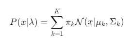

	import numpy as np
	from sklearn.datasets import load_iris
	from sklearn.mixture import GaussianMixture
	from sklearn.metrics import silhouette_score, accuracy_score
	import matplotlib.pyplot as plt
	import seaborn as sns
	import pandas as pd
	from scipy.stats import mode
	
	# Iris 데이터셋 로드
	iris = load_iris()
	data = iris.data
	true_labels = iris.target
	
	# GMM 모델 설정 및 학습
	gmm = GaussianMixture(n_components=3, covariance_type='full', random_state=0)
	predicted_labels = gmm.fit_predict(data)
	
	# 데이터프레임으로 변환하여 시각화 준비
	df = pd.DataFrame(data, columns=iris.feature_names)
	df['Cluster'] = predicted_labels
	
	# Silhouette Score 계산
	silhouette_avg = silhouette_score(data, predicted_labels)
	print(f"Silhouette Score: {silhouette_avg:.3f}")
	
	# Accuracy 계산 (군집 레이블과 실제 레이블을 매칭하여 정확도 계산)
	mapped_labels = np.zeros_like(predicted_labels)
	for i in range(3):
	    mask = (predicted_labels == i)
	    mapped_labels[mask] = mode(true_labels[mask])[0]
	
	accuracy = accuracy_score(true_labels, mapped_labels)
	print(f"Accuracy: {accuracy:.3f}")
	
	# 시각화 (첫 번째와 두 번째 피처 사용)
	plt.figure(figsize=(10, 5))
	sns.scatterplot(x=df.iloc[:, 0], y=df.iloc[:, 1], hue='Cluster', data=df, palette='viridis', s=100)
	plt.title("Gaussian Mixture Model (GMM) Clustering on Iris Dataset")
	plt.xlabel(iris.feature_names[0])  # 첫 번째 피처 (sepal length)
	plt.ylabel(iris.feature_names[1])  # 두 번째 피처 (sepal width)
	plt.legend(title='Cluster')
	plt.show()

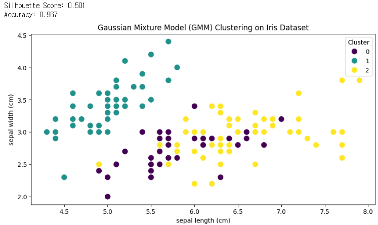
 

## [5-1-1] EM(Expectation-Maximization)
▣ 정의: 데이터가 여러 개의 잠재 확률 분포(보통 가우시안)에서 생성되었다고 가정하여, 데이터를 여러 분포로 모델링하는 방법으로 각 데이터 포인트가 여러 군집에 속할 확률을 계산해 소프트 군집화를 제공 
▣ 필요성: 데이터가 다양한 확률 분포로 구성되어 있을 때, 군집의 경계를 유연하게 설정할 수 있어 더욱 정확한 군집화가 가능 
▣ 장점: 소프트 군집화가 가능하여 데이터가 여러 군집에 속할 확률을 제공하며 군집의 크기와 모양이 다른 경우에도 적합 
▣ 단점: 초기 매개변수 설정에 따라 결과가 크게 달라질 수 있으며 고차원 데이터에서는 계산 비용이 높아짐 
▣ 응용분야: 음성 및 영상 인식. 이미지 처리. 금융 및 마케팅에서의 사용자 세분화. 
▣ 모델식: E 단계와 M 단계를 반복하여 수렴할 때까지 최적의 매개변수를 찾아간다. E 단계: 각 데이터 포인트가 특정 군집에 속할 확률을 계산, M 단계: 이 확률을 사용하여 각 군집의 매개변수를 업데이트 

	import numpy as np
	from sklearn.datasets import load_iris
	from sklearn.mixture import GaussianMixture
	from sklearn.metrics import silhouette_score, accuracy_score
	import matplotlib.pyplot as plt
	import seaborn as sns
	import pandas as pd
	from scipy.stats import mode
	
	# Iris 데이터셋 로드
	iris = load_iris()
	data = iris.data
	true_labels = iris.target
	
	# Gaussian Mixture (EM 알고리즘) 모델 적용
	gmm = GaussianMixture(n_components=3, covariance_type='full', random_state=0)
	gmm.fit(data)
	predicted_labels = gmm.predict(data)
	
	# 데이터프레임으로 변환하여 시각화 준비
	df = pd.DataFrame(data, columns=iris.feature_names)
	df['Cluster'] = predicted_labels
	
	# Silhouette Score 계산
	silhouette_avg = silhouette_score(data, predicted_labels)
	print(f"Silhouette Score: {silhouette_avg:.3f}")
	
	# Accuracy 계산 (군집 레이블과 실제 레이블을 매칭하여 정확도 계산)
	# Gaussian Mixture 모델의 군집 레이블과 실제 레이블은 매칭이 다를 수 있음
	mapped_labels = np.zeros_like(predicted_labels)
	for i in range(3):
	    mask = (predicted_labels == i)
	    mapped_labels[mask] = mode(true_labels[mask])[0]
	
	accuracy = accuracy_score(true_labels, mapped_labels)
	print(f"Accuracy: {accuracy:.3f}")
	
	# 시각화 (첫 번째와 두 번째 피처 사용)
	plt.figure(figsize=(10, 5))
	sns.scatterplot(x=df.iloc[:, 0], y=df.iloc[:, 1], hue='Cluster', data=df, palette='viridis', s=100)
	plt.title("Gaussian Mixture Model (EM) Clustering on Iris Dataset")
	plt.xlabel(iris.feature_names[0])  # 첫 번째 피처 (sepal length)
	plt.ylabel(iris.feature_names[1])  # 두 번째 피처 (sepal width)
	plt.legend(title='Cluster')
	plt.show()

 

# [5-2] COBWEB
▣ 정의: 개념 형성을 기반으로 하는 트리기반의 계층적 군집화 알고리즘으로, 각각의 노드가 개념을 나타내는 분류 트리를 생성하여 새로운 데이터를 점진적으로 학습 
▣ 필요성: 점진적으로 데이터를 학습하고 분류해야 하는 경우에 유용하며, 계층 구조로 데이터를 군집화하여 개념 형성을 수행 
▣ 장점: 범주형 데이터 및 혼합형 데이터에 적합. 점진적으로 학습하며, 새로운 데이터가 들어올 때마다 즉시 업데이트 가능 
▣ 단점: 데이터 입력 순서에 따라 결과가 달라질 수 있으며 대규모 데이터에서는 성능이 떨어질 수 있고, 노이즈에 민감 
▣ 응용분야: 문서 분류, 개념 형성을 통한 인공지능 학습, 시장 세분화에서의 고객 분류 
▣ 모델식: COBWEB은 각 노드의 범주 유틸리티(Category Utility, CU)를 기반으로 데이터를 분류 
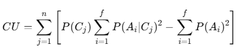

	import numpy as np
	from sklearn.datasets import load_iris
	from sklearn.cluster import AgglomerativeClustering
	from sklearn.metrics import silhouette_score, accuracy_score
	import matplotlib.pyplot as plt
	import seaborn as sns
	import pandas as pd
	from scipy.stats import mode
	
	# Iris 데이터셋 로드
	iris = load_iris()
	data = iris.data
	true_labels = iris.target
	
	# 계층적 군집화 모델 설정 (COBWEB의 개념에 맞춰 유사한 방식으로 계층적 군집화 수행)
	# 계층적 군집화는 특징이 유사한 데이터 포인트를 병합하는 방식으로, COBWEB과 유사하게 작동
	agglomerative_clustering = AgglomerativeClustering(n_clusters=3, linkage='ward')
	predicted_labels = agglomerative_clustering.fit_predict(data)
	
	# 데이터프레임으로 변환하여 시각화 준비
	df = pd.DataFrame(data, columns=iris.feature_names)
	df['Cluster'] = predicted_labels
	
	# Silhouette Score 계산
	silhouette_avg = silhouette_score(data, predicted_labels)
	print(f"Silhouette Score: {silhouette_avg:.3f}")
	
	# Accuracy 계산 (군집 레이블과 실제 레이블을 매칭하여 정확도 계산)
	mapped_labels = np.zeros_like(predicted_labels)
	for i in range(3):
	    mask = (predicted_labels == i)
	    mapped_labels[mask] = mode(true_labels[mask])[0]
	
	accuracy = accuracy_score(true_labels, mapped_labels)
	print(f"Accuracy: {accuracy:.3f}")
	
	# 시각화 (첫 번째와 두 번째 피처 사용)
	plt.figure(figsize=(10, 5))
	sns.scatterplot(x=df.iloc[:, 0], y=df.iloc[:, 1], hue='Cluster', data=df, palette='viridis', s=100)
	plt.title("Hierarchical Clustering (COBWEB-like) on Iris Dataset")
	plt.xlabel(iris.feature_names[0])  # 첫 번째 피처 (sepal length)
	plt.ylabel(iris.feature_names[1])  # 두 번째 피처 (sepal width)
	plt.legend(title='Cluster')
	plt.show()
	
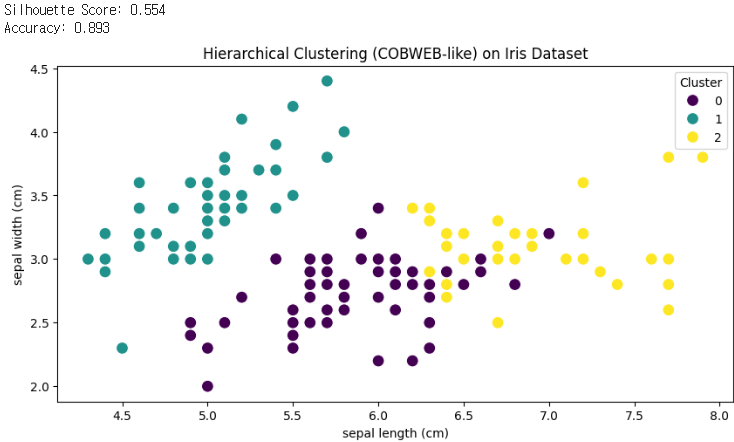
 

# [5-3] CLASSIT
▣ 정의: COBWEB을 확장하여 수치형 데이터를 지원하는 계층적 군집화 알고리즘으로 점진적으로 데이터를 군집화하여 계층적인 구조를 형성 
▣ 필요성: 데이터의 속성이 주기적으로 업데이트되는 환경에서 실시간 군집화를 수행 
▣ 장점: 수치형 데이터와 범주형 데이터 모두 처리할 수 있으며 점진적 학습이 가능하여 실시간 데이터에 적합 
▣ 단점: 데이터 입력 순서에 따라 결과가 달라질 수 있으며 대규모 데이터에서는 성능이 떨어지고 매개변수 설정이 어렵다 
▣ 응용분야: 실시간 데이터 분석, 유전자 및 생물학적 데이터 분석, 시계열 데이터 분석 
▣ 모델식: COBWEB의 Category Utility를 변형하여 수치형 데이터를 처리할 수 있도록 설계되어 평균 및 분산을 기반으로 군집의 경계를 정의하여 데이터를 그룹화 

	import numpy as np
	from sklearn.datasets import load_iris
	from sklearn.cluster import AgglomerativeClustering
	from sklearn.metrics import silhouette_score, accuracy_score
	import matplotlib.pyplot as plt
	import seaborn as sns
	import pandas as pd
	from scipy.stats import mode
	
	# Iris 데이터셋 로드
	iris = load_iris()
	data = iris.data
	true_labels = iris.target
	
	# 계층적 군집화 모델 설정 (CLASSIT의 증분 학습을 반영한 간단한 계층적 군집화)
	agglomerative_clustering = AgglomerativeClustering(n_clusters=3, linkage='ward')
	predicted_labels = agglomerative_clustering.fit_predict(data)
	
	# 데이터프레임으로 변환하여 시각화 준비
	df = pd.DataFrame(data, columns=iris.feature_names)
	df['Cluster'] = predicted_labels
	
	# Silhouette Score 계산
	silhouette_avg = silhouette_score(data, predicted_labels)
	print(f"Silhouette Score: {silhouette_avg:.3f}")
	
	# Accuracy 계산 (군집 레이블과 실제 레이블을 매칭하여 정확도 계산)
	mapped_labels = np.zeros_like(predicted_labels)
	for i in range(3):
	    mask = (predicted_labels == i)
	    mapped_labels[mask] = mode(true_labels[mask])[0]
	
	accuracy = accuracy_score(true_labels, mapped_labels)
	print(f"Accuracy: {accuracy:.3f}")
	
	# 시각화 (첫 번째와 두 번째 피처 사용)
	plt.figure(figsize=(10, 5))
	sns.scatterplot(x=df.iloc[:, 0], y=df.iloc[:, 1], hue='Cluster', data=df, palette='viridis', s=100)
	plt.title("CLASSIT-like Hierarchical Clustering on Iris Dataset")
	plt.xlabel(iris.feature_names[0])  # 첫 번째 피처 (sepal length)
	plt.ylabel(iris.feature_names[1])  # 두 번째 피처 (sepal width)
	plt.legend(title='Cluster')
	plt.show()

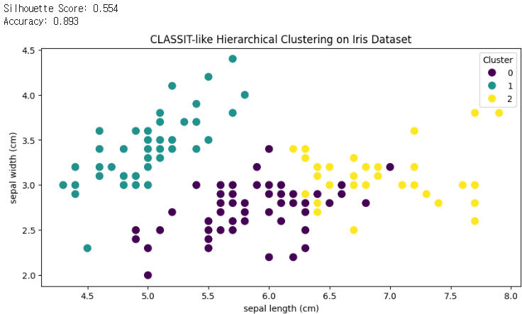
 

# [5-4] LDA (Latent Dirichlet Allocation)
▣ 정의 : LDA는 <ins>이산 데이터(텍스트, 이미지 특징 등)의 집합에서 숨겨진 주제(Topic)를 찾아내는 확률적 생성 모델</ins>. 문서 내의 단어들이 특정 주제 분포에 따라 생성되었다고 가정하며, 각 문서는 여러 주제의 혼합으로 구성되고 각 주제는 특정 단어들의 분포로 정의된다는 논리 
▣ 필요성 : 대규모 비정형 텍스트 데이터에서 사람이 일일이 주제를 분류하는 것은 불가능에 가깝다. 데이터 내에 잠재된 의미 구조를 자동으로 파악하고, 문서 간의 유사도를 단순 단어 중복이 아닌 '주제 맥락' 차원에서 이해 필요 
▣ 장점: 
잠재 의미 파악: 단순한 키워드 매칭을 넘어 문서가 다루는 핵심 의도를 포착 
유연한 구조: 하나의 문서가 단 하나의 군집에 속하는 것이 아니라, 여러 주제를 가질 수 있는 Soft Clustering의 특성 
차원 축소: 수만 개의 단어를 몇 개의 유의미한 주제 차원으로 압축하여 데이터를 효율적으로 관리 
▣ 단점 : 
주제 수($K$) 지정: 사용자가 분석 전에 주제의 개수를 미리 정해야 하며, 이 값에 따라 결과의 질이 달라진다. 
비정형 데이터 특화: 텍스트와 같은 이산형 데이터에 최적화되어 있어, 연속형 수치 데이터에 직접 적용할 때는 효율성이 떨어질 가능성 
계산 복잡도: 대규모 말뭉치에 대해 깁스 샘플링이나 변분 추론을 수행할 때 연산 시간이 다소 소요 
▣ 응용분야 :  
텍스트 마이닝: 뉴스 기사 자동 분류, 논문 주제 트렌드 분석 
추천 시스템: 사용자가 소비한 콘텐츠의 주제를 파악하여 유사 주제 콘텐츠 추천 
생물정보학: 유전자 서열 패턴 분석을 통한 기능 그룹 분류 
▣ 모델식 : 디리클레 분포(Dirichlet distribution)를 기반으로 하는 계층적 베이지안 모델 

	import numpy as np
	import pandas as pd
	import matplotlib.pyplot as plt
	from sklearn.datasets import load_iris
	from sklearn.decomposition import LatentDirichletAllocation
	from sklearn.preprocessing import MinMaxScaler
	from sklearn.metrics import silhouette_score, accuracy_score
	from scipy.stats import mode
	
	# 1. 데이터 로드 및 전처리
	iris = load_iris()
	X = iris.data
	y = iris.target
	target_names = iris.target_names
	
	# LDA는 빈도수(양수) 기반이므로 MinMaxScaler를 통해 0 이상의 값으로 변환
	# 데이터의 값을 '단어의 출현 빈도'와 유사한 개념으로 투영
	scaler = MinMaxScaler(feature_range=(0, 10)) # 정수형 스케일링 효과를 위해 범위를 키움
	X_scaled = scaler.fit_transform(X).astype(int)
	
	# 2. LDA 모델 설정 및 학습 (파라미터 튜닝)
	# n_components=3: Iris 품종이 3개이므로 주제 수를 3으로 설정
	# learning_method='batch': 소규모 데이터셋에 대해 더 안정적인 결과 제공
	lda = LatentDirichletAllocation(n_components=3, 
	                                learning_method='batch', 
	                                max_iter=100, 
	                                random_state=42)
	lda_features = lda.fit_transform(X_scaled)
	
	# 3. 결과 해석 및 라벨 할당
	# 각 샘플에서 가장 확률이 높은 Topic을 군집 결과로 선택
	y_pred = np.argmax(lda_features, axis=1)
	
	# 4. 성능 평가 (라벨 매칭 포함)
	def get_clustered_accuracy(y_true, y_pred):
	    labels = np.zeros_like(y_pred)
	    for i in np.unique(y_pred):
	        mask = (y_pred == i)
	        if np.any(mask):
	            labels[mask] = mode(y_true[mask], keepdims=True)[0][0]
	    return accuracy_score(y_true, labels)
	
	acc = get_clustered_accuracy(y, y_pred)
	sil = silhouette_score(X_scaled, y_pred)
	
	# 5. 시각화 (PCA를 활용한 2차원 투영)
	from sklearn.decomposition import PCA
	pca = PCA(n_components=2)
	X_pca = pca.fit_transform(X_scaled)
	
	plt.figure(figsize=(10, 6))
	colors = ['navy', 'turquoise', 'darkorange']
	
	for i, color, name in zip(range(3), colors, target_names):
	    # 실제 라벨(y)을 기준으로 하되 LDA가 찾은 군집의 경향성 확인
	    mask = (y == i)
	    plt.scatter(X_pca[mask, 0], X_pca[mask, 1], color=color, alpha=0.8, lw=2, label=name)
	
	plt.title(f'LDA Topic Clustering on Iris (PCA Projection)\nAccuracy: {acc:.3f}, Silhouette Score: {sil:.3f}')
	plt.xlabel('Principal Component 1')
	plt.ylabel('Principal Component 2')
	plt.legend(loc='best', shadow=False, scatterpoints=1)
	plt.show()

	

## [5-1] GMM (Gaussian Mixture Model) / EM (Expectation–Maximization)

| 항목 | 내용 |
|------|------|
| **구성요소** | 혼합 정규분포(가우시안) 모델 $p(x) = \sum_{k=1}^{K} \pi_k \, \mathcal{N}(x \mid \mu_k, \Sigma_k)$ 혼합계수 $\pi_k$ 는 $\sum_k \pi_k = 1$ |
| **거리함수** | 유클리드 거리 대신 확률밀도 기반 유사도 사용 $d(x, k) = -\log \mathcal{N}(x \mid \mu_k, \Sigma_k)$ |
| **목적함수** | 로그 가능도(log-likelihood) 최대화 $\log L = \sum_{i=1}^{N} \log \left( \sum_{k=1}^{K} \pi_k \, \mathcal{N}(x_i \mid \mu_k, \Sigma_k) \right)$ |
| **중심갱신** | EM 알고리즘 반복 수행 **E-step:** $\gamma_{ik} = \dfrac{\pi_k \, \mathcal{N}(x_i \mid \mu_k, \Sigma_k)}{\sum_{j=1}^{K} \pi_j \, \mathcal{N}(x_i \mid \mu_j, \Sigma_j)}$ **M-step:** $\mu_k = \dfrac{\sum_i \gamma_{ik} x_i}{\sum_i \gamma_{ik}}$, &nbsp; $\Sigma_k = \dfrac{\sum_i \gamma_{ik} (x_i - \mu_k)(x_i - \mu_k)^T}{\sum_i \gamma_{ik}}$, &nbsp; $\pi_k = \dfrac{\sum_i \gamma_{ik}}{N}$ |
| **목표** | 데이터가 여러 확률적 분포에 속할 수 있도록 혼합모델을 추정하고 **Soft Clustering** 수행 |

## [5-2] COBWEB

| 항목 | 내용 |
|------|------|
| **구성요소** | 범주형 데이터(Categorical)를 위한 계층적 증분 군집화 — 분류 트리(Classification Tree) 구조 |
| **거리함수** | 명시적 거리 대신 **카테고리 효용(Category Utility, CU)** 기반 유사도 사용 $CU = \frac{\sum_{k=1}^K P(C_k) \sum_i \sum_j P(A_i = V_{ij} \mid C_k)^2 - \sum_i \sum_j P(A_i = V_{ij})^2}{K}$ |
| **목적함수** | 카테고리 효용 $CU$를 최대화하여 군집 내 유사성은 높이고 군집 간 차별성은 강화 |
| **중심갱신** | 새로운 샘플 삽입 시 트리의 노드에서 4가지 연산 수행: 1) 기존 노드 배치, 2) 새 노드 생성, 3) 노드 병합(Merging), 4) 노드 분할(Splitting) |
| **목표** | 데이터가 순차적으로 입력되는 환경에서 범주형 속성의 조건부 확률 분포를 통해 최적의 계층 구조 학습 |

## [5-3] CLASSIT (Classification Incremental Learning System)

| 항목 | 내용 |
|------|------|
| **구성요소** | COBWEB의 확장판 — **연속형 데이터(Continuous)** 처리를 위한 계층적 증분 군집화 |
| **거리함수** | 데이터 분포의 표준편차($\sigma$) 기반 유사도 사용 특성 $i$에 대한 정보 획득량: $1/\sigma_i$ (정규분포 가정) |
| **목적함수** | 연속형 변수에 맞게 수정된 카테고리 효용($CU$) 최대화 $CU = \frac{\sum_{k=1}^K P(C_k) \sum_i (1/\sigma_{ik}) - \sum_i (1/\sigma_{ip})}{K}$ |
| **중심갱신** | COBWEB과 동일한 증분 학습(삽입, 생성, 병합, 분할) 메커니즘 사용 각 노드는 평균($\mu$)과 표준편차($\sigma$)를 요약 통계로 유지 및 실시간 갱신 |
| **목표** | 수치형 속성을 가진 데이터의 확률 밀도를 기반으로 계층적 분류 체계를 동적으로 구축 |

## [5-4] LDA (Latent Dirichlet Allocation)

| 항목 | 내용 |
|------|------|
| **구성요소** | 문서-주제-단어 간의 잠재적 관계를 설명하는 확률적 생성 모델 디리클레(Dirichlet) 분포 파라미터 $\alpha, \beta$ |
| **거리함수** | 코사인 유사도 혹은 쿨백-라이블러 발산(KL Divergence) 기반 주제 분포 유사도 $D_{KL}(P \parallel Q) = \sum_i P(i) \log \frac{P(i)}{Q(i)}$ |
| **목적함수** | 사후 확률(Posterior) 최대화 — Evidence Lower Bound(ELBO) 최적화 |
| **중심갱신** | **깁스 샘플링(Gibbs Sampling)** 또는 **변분 추론(Variational Inference)** 반복 수행 $P(z_i = k \mid \mathbf{z}_{-i}, \mathbf{w}) \propto \frac{n_{k,-i}^{(w_i)} + \beta}{n_{k,-i}^{(\cdot)} + V\beta} \cdot (n_{m,-i}^{(k)} + \alpha)$ |
| **목표** | 이산 데이터에서 잠재된 주제(Topic) 구조를 추출하고 각 데이터를 주제 혼합 비율로 표현(Soft Clustering) |

 

---

**[6] Graph-Based Clustering** (그래프 기반 군집화) 
**[6-1] Spectral Clustering** : 데이터 간 유사도 행렬의 고유값 분해(Eigen-decomposition)를 통해 차원을 축소한 후 저차원 공간에서 군집화 수행 
**[6-2] Affinity Propagation** : 데이터 포인트 간에 책임감(Responsibility)과 가용성(Availability)이라는 메시지를 주고받으며 대표 샘플을 결정 
**[6-3] MCL (Markov Clustering)** : 그래프 내에서 무작위 보행(Random Walk)의 확산(Expansion)과 강화(Inflation) 과정을 반복하여 자연스러운 군집을 분리 
**[6-4] Louvain / Leiden Algorithm** : 네트워크의 전체적인 연결 강도를 측정하는 모듈성(Modularity) 지표를 최적화하여 대규모 커뮤니티 구조를 탐색 

---

# [6-1] Spectral Clustering
▣ 정의 : 그래프 이론을 기반으로 데이터의 유사도 행렬(Similarity Matrix)을 사용해 저차원 공간에서 군집을 찾는 알고리즘 
▣ 필요성 : 복잡한 구조를 가진 데이터에서 비선형적인 경계를 정의할 수 있는 군집화 방법이 필요할 때 유용 
▣ 장점 : 비선형적인 데이터에도 유용하며, 전통적인 군집화 알고리즘보다 복잡한 데이터 구조 처리 가능 
▣ 단점 : 유사도 행렬을 계산해야 하므로 메모리 사용량이 크고, 대규모 데이터에 비효율적 
▣ 응용분야 : 이미지 분할, 네트워크 분석 
▣ 모델식 : 𝐿은 라플라시안 행렬, 𝐷는 대각 행렬(각 노드의 차수), 𝐴는 인접 행렬(이 라플라시안 행렬의 고유벡터를 사용해 데이터를 군집화) 
$𝐿=𝐷−𝐴$ 

	import numpy as np
	from sklearn.datasets import load_iris
	from sklearn.cluster import SpectralClustering
	from sklearn.metrics import silhouette_score, accuracy_score
	import matplotlib.pyplot as plt
	import seaborn as sns
	import pandas as pd
	from scipy.stats import mode
	
	# Iris 데이터셋 로드
	iris = load_iris()
	data = iris.data
	true_labels = iris.target
	
	# Spectral Clustering 모델 설정 및 학습
	spectral_clustering = SpectralClustering(n_clusters=3, affinity='nearest_neighbors', random_state=0)
	predicted_labels = spectral_clustering.fit_predict(data)
	
	# 데이터프레임으로 변환하여 시각화 준비
	df = pd.DataFrame(data, columns=iris.feature_names)
	df['Cluster'] = predicted_labels
	
	# Silhouette Score 계산
	silhouette_avg = silhouette_score(data, predicted_labels)
	print(f"Silhouette Score: {silhouette_avg:.3f}")
	
	# Accuracy 계산 (군집 레이블과 실제 레이블을 매핑하여 정확도 계산)
	mapped_labels = np.zeros_like(predicted_labels)
	for i in range(3):
	    mask = (predicted_labels == i)
	    mapped_labels[mask] = mode(true_labels[mask])[0]
	
	accuracy = accuracy_score(true_labels, mapped_labels)
	print(f"Accuracy: {accuracy:.3f}")
	
	# 시각화 (첫 번째와 두 번째 피처 사용)
	plt.figure(figsize=(10, 5))
	sns.scatterplot(x=df.iloc[:, 0], y=df.iloc[:, 1], hue='Cluster', data=df, palette='viridis', s=100)
	plt.title("Spectral Clustering on Iris Dataset")
	plt.xlabel(iris.feature_names[0])  # 첫 번째 피처 (sepal length)
	plt.ylabel(iris.feature_names[1])  # 두 번째 피처 (sepal width)
	plt.legend(title='Cluster')
	plt.show()

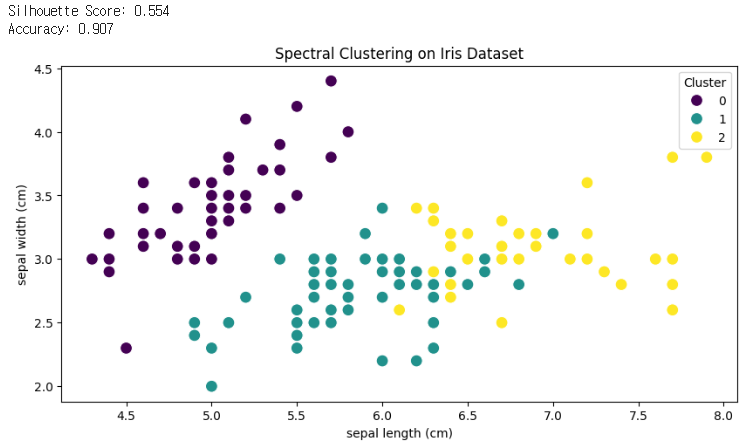
 

# [6-2] 친화도 전파(Affinity Propagation)
▣ 정의 : 데이터 간의 유사도(similarity) 행렬을 사용해 가장 적합한 중심(exemplar)을 선택하여 군집을 형성하는 알고리즘 
▣ 필요성 : 군집의 개수를 미리 정할 필요 없이 데이터의 유사도에 기반해 자연스럽게 군집을 찾을 수 있음 
▣ 장점 : 군집 개수를 사전에 정의할 필요 없으며, 유사도에 기반한 군집화로 군집 경계가 더 명확할 수 있음 
▣ 단점 : 계산 비용이 크고 큰 데이터셋에서는 느릴 수 있음 
▣ 응용분야 : 이미지 분할, 문서 분류 
▣ 모델식: 각 데이터 포인트 간의 유사도 𝑠(𝑖,𝑘)와 책임 𝑟(𝑖,𝑘), 가용도 𝑎(𝑖,𝑘)를 반복적으로 계산해 중심점을 결정 
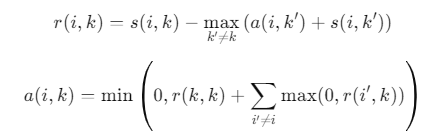

	import numpy as np
	from sklearn.datasets import load_iris
	from sklearn.cluster import AffinityPropagation
	from sklearn.metrics import silhouette_score, accuracy_score
	import matplotlib.pyplot as plt
	import seaborn as sns
	import pandas as pd
	from scipy.stats import mode
	
	# Iris 데이터셋 로드
	iris = load_iris()
	data = iris.data
	true_labels = iris.target
	
	# Affinity Propagation 모델 설정 및 학습
	affinity_propagation = AffinityPropagation(random_state=0)
	predicted_labels = affinity_propagation.fit_predict(data)
	
	# 데이터프레임으로 변환하여 시각화 준비
	df = pd.DataFrame(data, columns=iris.feature_names)
	df['Cluster'] = predicted_labels
	
	# Silhouette Score 계산
	silhouette_avg = silhouette_score(data, predicted_labels)
	print(f"Silhouette Score: {silhouette_avg:.3f}")
	
	# Accuracy 계산 (군집 레이블과 실제 레이블을 매핑하여 정확도 계산)
	mapped_labels = np.zeros_like(predicted_labels)
	for i in range(len(np.unique(predicted_labels))):
	    mask = (predicted_labels == i)
	    mapped_labels[mask] = mode(true_labels[mask])[0]
	
	accuracy = accuracy_score(true_labels, mapped_labels)
	print(f"Accuracy: {accuracy:.3f}")
	
	# 시각화 (첫 번째와 두 번째 피처 사용)
	plt.figure(figsize=(10, 5))
	sns.scatterplot(x=df.iloc[:, 0], y=df.iloc[:, 1], hue='Cluster', data=df, palette='viridis', s=100)
	plt.title("Affinity Propagation Clustering on Iris Dataset")
	plt.xlabel(iris.feature_names[0])  # 첫 번째 피처 (sepal length)
	plt.ylabel(iris.feature_names[1])  # 두 번째 피처 (sepal width)
	plt.legend(title='Cluster')
	plt.show()

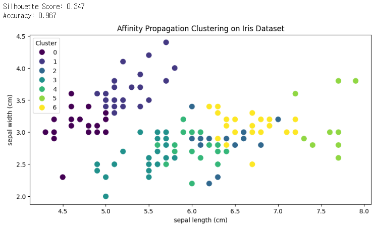
 

# [6-3] MCL (Markov Clustering)
▣ 정의 : MCL은 그래프 이론을 기반으로 하는 비지도 군집화 알고리즘으로, <ins>네트워크 내에서의 무작위 보행(Random Walk) 시뮬레이션을 통해 군집을 찾는다.</ins> 그래프 상에서 밀집된 영역(군집) 내부에서는 무작위 보행자가 오래 머물고, 군집 사이의 희소한 연결은 잘 통과하지 못한다는 원리를 이용 
▣ 필요성 : 복잡한 네트워크 구조에서 사전에 군집의 개수를 알기 어렵거나, 데이터 간의 관계가 비선형적이고 복잡한 연결망 형태로 존재할 때 이를 효과적으로 분리하기 위해 필요. 특히 단백질 상호작용이나 사회적 네트워크와 같은 그래프 데이터 분석에 필수 
▣ 장점 : 
군집 수 자동 결정: 인플레이션(Inflation) 파라미터를 통해 군집의 입도를 조절할 뿐, 군집 수를 직접 지정 불필요 
확장성: 행렬 연산을 기반으로 하므로 대규모 그래프 데이터에 대해 비교적 빠른 연산이 가능 
강건성: 노이즈나 미세한 연결 오류에 대해 비교적 안정적인 군집 결과를 보여준다 
▣ 단점 : 
메모리 소모: 그래프의 크기가 커질수록 인접 행렬의 제곱 연산에 따른 메모리 사용량이 급격히 증가 
파라미터 민감도: 인플레이션 값에 따라 군집이 너무 잘게 쪼개지거나 하나로 뭉치는 현상이 발생할 수 있어 적절한 튜닝이 필요 
▣ 응용분야 : 
생물정보학: 단백질-단백질 상호작용 네트워크(PPI) 분석 및 유전자 군집화 
소셜 네트워크 분석: 커뮤니티 탐지 및 영향력 있는 그룹 식별 
이미지 세분화: 픽셀 간의 유사도를 그래프로 구성하여 사물 영역 분리 
▣ 모델식 : MCL은 두 가지(서로 다른 노드 간의 보행 확률을 확산, 정규화하여 강한 연결은 강화하고 약한 연결은 소멸) 주요 행렬 연산을 수렴할 때까지 반복 

	import sys
	import subprocess
	
	# 1. 라이브러리 설치 확인 및 자동 설치 로직
	def install_and_import(package):
	    try:
	        # 패키지 이름과 임포트 이름이 다를 수 있음을 고려
	        import_name = package.replace("-", "_")
	        __import__(import_name)
	    except ImportError:
	        print(f"{package} 라이브러리가 없습니다. 설치를 시작합니다...")
	        subprocess.check_call([sys.executable, "-m", "pip", "install", package])
	        print(f"{package} 설치가 완료되었습니다.")
	
	# markov-clustering 라이브러리 설치 실행
	install_and_import("markov-clustering")
	
	import numpy as np
	import pandas as pd
	import matplotlib.pyplot as plt
	import markov_clustering as mc
	from sklearn.datasets import load_iris
	from sklearn.neighbors import kneighbors_graph
	from sklearn.metrics import silhouette_score, accuracy_score
	from sklearn.preprocessing import StandardScaler
	from sklearn.decomposition import PCA
	from scipy.stats import mode
	
	# 2. 데이터 로드 및 전처리
	iris = load_iris()
	X = iris.data
	y = iris.target
	target_names = iris.target_names
	
	# 거리 기반 그래프 생성을 위한 표준화 스케일링
	scaler = StandardScaler()
	X_scaled = scaler.fit_transform(X)
	
	# 3. 데이터를 그래프 인접 행렬로 변환 (KNN 그래프)
	# n_neighbors는 데이터 간의 연결 강도를 결정합니다.
	A = kneighbors_graph(X_scaled, n_neighbors=15, mode='connectivity', include_self=True)
	matrix = A.toarray()
	
	# 4. MCL 알고리즘 수행 및 파라미터 튜닝
	# inflation: 클러스터의 입도를 조절 (높을수록 더 많은 군집 생성)
	inflation_val = 1.8 
	result = mc.run_mcl(matrix, inflation=inflation_val)
	clusters = mc.get_clusters(result)
	
	# 5. 결과 매핑 및 성능 평가
	y_pred = np.zeros(len(X), dtype=int)
	for cluster_idx, nodes in enumerate(clusters):
	    for node in nodes:
	        y_pred[node] = cluster_idx
	
	# 군집 라벨을 실제 타겟 라벨과 매칭하여 정확도 계산
	def get_clustered_accuracy(y_true, y_pred):
	    matched_labels = np.zeros_like(y_pred)
	    for i in np.unique(y_pred):
	        mask = (y_pred == i)
	        if np.any(mask):
	            # 군집 내 최빈값(mode)을 해당 군집의 대표 라벨로 설정
	            m = mode(y_true[mask], keepdims=True)
	            matched_labels[mask] = m.mode[0]
	    return accuracy_score(y_true, matched_labels)
	
	acc = get_clustered_accuracy(y, y_pred)
	sil = silhouette_score(X_scaled, y_pred) if len(np.unique(y_pred)) > 1 else 0
	
	# 6. 시각화 (PCA 2D Projection)
	pca = PCA(n_components=2)
	X_pca = pca.fit_transform(X_scaled)
	
	plt.figure(figsize=(10, 6))
	colors = ['navy', 'turquoise', 'darkorange']
	
	# 오류 수정 부분: zip을 사용하여 인덱스, 색상, 이름을 동시에 반복
	for i, (color, name) in enumerate(zip(colors, target_names)):
	    mask = (y == i)
	    plt.scatter(X_pca[mask, 0], X_pca[mask, 1], 
	                color=color, alpha=0.8, lw=2, label=f'Actual: {name}')
	
	plt.title(f'MCL Analysis on Iris (Inflation: {inflation_val})\nAccuracy: {acc:.3f} | Silhouette Score: {sil:.3f}')
	plt.xlabel('Principal Component 1')
	plt.ylabel('Principal Component 2')
	plt.legend(loc='best')
	plt.grid(True, linestyle=':', alpha=0.5)
	plt.show()
	

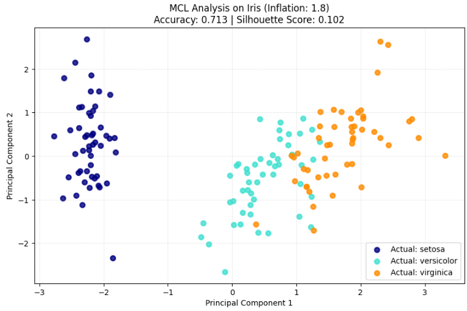	

# [6-4] Louvain / Leiden Algorithm
▣ 정의 : Louvain 알고리즘과 그 개선판인 Leiden 알고리즘은 <ins>대규모 네트워크에서 커뮤니티(군집)를 탐색하기 위한 휴리스틱 방법론.</ins> 네트워크 내의 연결 밀도를 측정하는 지표인 모듈성(Modularity)을 최대화하는 방향으로 노드들을 그룹화하며, 계층적인 최적화 과정을 거쳐 최종적인 군집 구조를 찾아낸다. 
▣ 필요성 : 데이터가 수백만 개의 노드와 간선으로 이루어진 초거대 네트워크 형태인 경우에 매우 빠른 속도로 거대 네트워크의 숨겨진 구조를 파악하기 위해 필수적 
▣ 장점 :  
빠른 속도: 수억 개의 간선을 가진 그래프도 수분 내에 처리할 수 있을 만큼 효율적 
계층적 구조 추출: 작은 커뮤니티부터 이를 포함하는 더 큰 커뮤니티까지 계층적으로 파악이 가능 
자동 군집 수 결정: 사용자가 군집 개수를 미리 지정할 필요가 없슴 
Leiden의 개선: Louvain에서 발생하던 연결되지 않은 커뮤니티 생성 문제(Disconnected communities)를 해결하여 더욱 견고한 결과를 보장 
▣ 단점 :  
해상도 한계 (Resolution Limit): 너무 작은 크기의 커뮤니티는 큰 커뮤니티에 흡수되어 발견하지 못하는 경우 
무작위성: 노드 방문 순서에 따라 결과가 미세하게 달라질 가능성 
▣ 응용분야 : 
사회관계망 분석: 페이스북, 트위터 내의 사용자 관심사 그룹 추출 
금융 사기 탐지: 이상 거래 네트워크 내에서 조직적인 사기 그룹 식별 
생물학적 네트워크: 단백질 기능 그룹 및 대사 경로 분석 
▣ 모델식 : 핵심은 모듈성(Modularity, $Q$)의 최대화 
	

	import sys
	import subprocess
	
	# 1. 라이브러리 설치 확인 및 자동 설치 로직
	def install_and_import(package, import_name=None):
	    if import_name is None:
	        import_name = package
	    try:
	        __import__(import_name)
	    except ImportError:
	        print(f"{package} 라이브러리가 없습니다. 설치를 시작합니다...")
	        subprocess.check_call([sys.executable, "-m", "pip", "install", package])
	        print(f"{package} 설치가 완료되었습니다.")
	
	# 필요한 패키지 설치 (leidenalg는 igraph 기반임)
	install_and_import("python-igraph", "igraph")
	install_and_import("leidenalg")
	
	import numpy as np
	import pandas as pd
	import matplotlib.pyplot as plt
	import igraph as ig
	import leidenalg as la
	from sklearn.datasets import load_iris
	from sklearn.neighbors import kneighbors_graph
	from sklearn.metrics import silhouette_score, accuracy_score
	from sklearn.preprocessing import StandardScaler
	from sklearn.decomposition import PCA
	from scipy.stats import mode
	
	# 2. 데이터 로드 및 전처리
	iris = load_iris()
	X, y = iris.data, iris.target
	target_names = iris.target_names
	
	# 데이터 표준화
	scaler = StandardScaler()
	X_scaled = scaler.fit_transform(X)
	
	# 3. 데이터를 그래프로 변환 (KNN 그래프 생성)
	# n_neighbors를 조절하여 그래프의 연결성을 제어 (파라미터 튜닝의 핵심)
	n_neighbors = 15
	adj_matrix = kneighbors_graph(X_scaled, n_neighbors=n_neighbors, mode='connectivity', include_self=False)
	
	# igraph 객체로 변환
	sources, targets = adj_matrix.nonzero()
	edges = list(zip(sources, targets))
	g = ig.Graph(n=len(X), edges=edges)
	
	# 4. Leiden 알고리즘 수행 (모듈성 최적화)
	# resolution_parameter: 높을수록 더 많은(작은) 커뮤니티를 생성함
	partition = la.find_partition(g, la.ModularityVertexPartition, seed=42)
	y_pred = np.array(partition.membership)
	
	# 5. 성능 평가
	def get_clustered_accuracy(y_true, y_pred):
	    matched_labels = np.zeros_like(y_pred)
	    for i in np.unique(y_pred):
	        mask = (y_pred == i)
	        if np.any(mask):
	            m = mode(y_true[mask], keepdims=True)
	            matched_labels[mask] = m.mode[0]
	    return accuracy_score(y_true, matched_labels)
	
	acc = get_clustered_accuracy(y, y_pred)
	sil = silhouette_score(X_scaled, y_pred) if len(np.unique(y_pred)) > 1 else 0
	
	# 6. 시각화 (PCA 2D Projection)
	pca = PCA(n_components=2)
	X_pca = pca.fit_transform(X_scaled)
	
	plt.figure(figsize=(10, 6))
	colors = ['navy', 'turquoise', 'darkorange']
	
	for i, (color, name) in enumerate(zip(colors, target_names)):
	    mask = (y == i)
	    plt.scatter(X_pca[mask, 0], X_pca[mask, 1], color=color, alpha=0.8, lw=2, label=f'Actual: {name}')
	
	plt.title(f'Leiden Community Detection on Iris\nAccuracy: {acc:.3f} | Silhouette: {sil:.3f} | Communities: {len(np.unique(y_pred))}')
	plt.xlabel('PC 1')
	plt.ylabel('PC 2')
	plt.legend(loc='best')
	plt.grid(True, linestyle=':', alpha=0.5)
	plt.show()
	
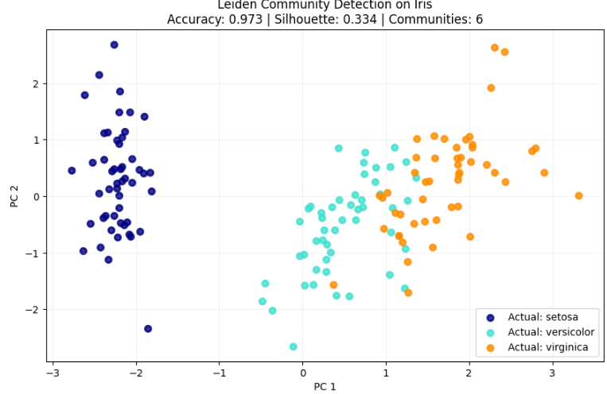		

## [6-1] Spectral Clustering

| 항목 | 내용 |
|------|------|
| **구성요소** | 데이터 간 유사도로부터 그래프 $G=(V,E)$ 구성 인접행렬 $W$, 차수행렬 $D$, 그리고 그래프 라플라시안 $L = D - W$ |
| **거리함수** | 유사도(affinity) 함수 $w_{ij} = \exp \left( -\dfrac{\lVert x_i - x_j \rVert^2}{2\sigma^2} \right)$ |
| **목적함수** | Normalized Cut (Ncut) 최소화 $\text{Ncut}(A,B) = \dfrac{\text{cut}(A,B)}{\text{assoc}(A,V)} + \dfrac{\text{cut}(A,B)}{\text{assoc}(B,V)}$ 또는 라플라시안 행렬의 고유값 문제 $L_{sym} = D^{-\frac{1}{2}}LD^{-\frac{1}{2}}$, &nbsp; $L_{rw} = D^{-1}L$ |
| **중심갱신** | 라플라시안의 하위 $k$개의 고유벡터를 새로운 표현 공간(feature space)으로 사용 후, K-means로 클러스터링 즉, $U = [u_1, u_2, \dots, u_k]$ → K-means 적용 |
| **목표** | 그래프 구조를 반영하여 비선형 매니폴드 데이터의 군집 구조를 효과적으로 탐지 |

## [6-2] Affinity Propagation

| 항목 | 내용 |
|------|------|
| **구성요소** | 데이터 포인트 간 **유사도 행렬 $S(i,k)$** 를 기반으로 대표점(exemplar)을 자동 선택 별도의 군집 수 $K$ 지정 불필요 |
| **거리함수** | 입력 유사도 $S(i,k)$ 는 일반적으로 음의 거리 제곱값 사용 $S(i,k) = -\lVert x_i - x_k \rVert^2$ |
| **목적함수** | 메시지 전달(message passing)을 통해 책임(responsibility)과 가용도(availability) 행렬을 반복 업데이트 $r(i,k) \leftarrow S(i,k) - \max_{k' \ne k}\{ a(i,k') + S(i,k') \}$ $a(i,k) \leftarrow \min\{0, r(k,k) + \sum_{i' \notin \{i,k\}} \max(0, r(i',k))\}$ |
| **중심갱신** | 수렴 시 각 포인트의 대표점(exemplar) 결정 $k^* = \arg\max_k \{ a(i,k) + r(i,k) \}$ |
| **목표** | 사전 군집 수 없이 데이터 간 유사도만으로 대표점 기반 군집 자동 탐색 수행 |

## [6-3] MCL (Markov Clustering)

| 항목 | 내용 |
|------|------|
| **구성요소** | 그래프 내의 **무작위 보행(Random Walk)** 시뮬레이션 — 인접 행렬(Adjacency Matrix) 기반 연산 |
| **거리함수** | 노드 간 전이 확률(Transition Probability) $M_{ij} = \dfrac{w_{ij}}{\sum_k w_{kj}}$ |
| **목적함수** | 행렬의 확장(Expansion)과 인플레이션(Inflation) 반복을 통한 행렬 수렴 $\text{Expansion}: M \times M$ (확률 확산) $\text{Inflation}: M_{ij} \leftarrow \dfrac{(M_{ij})^r}{\sum_k (M_{kj})^r}$ (강한 연결 강화) |
| **중심갱신** | 명시적 중심 없음 — 행렬이 수렴(Convergence)한 후 연결된 성분(Connected Components)을 군집으로 추출 |
| **목표** | 네트워크 내 밀집 영역에서는 보행자가 오래 머문다는 원리를 이용하여 군집 수를 자동 결정하고 복잡한 그래프 구조 분석 |

## [6-4] Louvain / Leiden Algorithm

| 항목 | 내용 |
|------|------|
| **구성요소** | 네트워크의 연결 밀도를 측정하는 **모듈성(Modularity)** 기반 계층적 군집화 |
| **거리함수** | 노드 간 간선 가중치 및 차수(Degree) 기반 관계도 $k_i = \sum_j A_{ij}$ |
| **목적함수** | 모듈성($Q$) 최대화 $Q = \dfrac{1}{2m} \sum_{i,j} \left[ A_{ij} - \dfrac{k_i k_j}{2m} \right] \delta(c_i, c_j)$ (Leiden은 여기에 연결성 보강 알고리즘 추가) |
| **중심갱신** | 1단계: 각 노드를 인접 커뮤니티로 이동하며 $Q$ 증가분($\Delta Q$) 최대화 2단계: 동일 커뮤니티 노드들을 하나의 거대 노드(Super-node)로 병합하여 그래프 재구성 |
| **목표** | 초대형 네트워크에서 매우 빠른 속도로 커뮤니티 구조를 탐색하고, 계층적인 군집 관계를 자동 식별 |

---

**[7] Subspace / Representation-Based Clustering** (부분 공간 및 표현 학습 기반 군집화) 
**[7-1] PROCLUS (Projected Clustering)** : 고차원 공간에서 각 군집마다 데이터가 밀집된 특정 축(Dimensions)들을 선별하여 투영하는 방식 
**[7-2] ORCLUS (Oriented projected Clustering)** : 고정된 축이 아닌 데이터의 상관관계에 따라 기울어진 임의의 부분 공간을 찾아 투영하는 방식 
**[7-3] SUBCLU (Subspace Clustering)** : 밀도 기반의 특성을 활용하여 1차원부터 고차원까지 상향식(Bottom-up)으로 모든 밀집 부분 공간을 탐색 
**[7-4] SOMs (Self-Organizing Maps)** : 고차원 데이터의 위상 구조를 유지하면서 인공신경망을 통해 2차원 격자(Map)로 시각화 및 군집화 수행 
**[7-5] DEC (Deep Embedded Clustering)**: 심층 신경망(Autoencoder)으로 비선형적 특징을 추출하는 동시에 군집화 손실 함수를 함께 학습하여 임베딩 공간을 최적화 

---

# [7-1] PROCLUS(PROjected CLUStering)
▣ 정의 : <ins>각 클러스터가 전체 차원이 아닌 서로 다른 저차원 부분 공간(Subspace)에 투영되었을 때 최적의 응집도를 보인다는 가정하에 작동하는 반복적 파티셔닝</ins> 알고리즘 
▣ 필요성 : 고차원 데이터에서는 모든 차원을 고려할 때 노이즈로 인해 클러스터 구조가 희석되는데, 각 클러스터에 유의미한 차원들만 투영하여 분석할 필요 
▣ 장점 : 고정된 격자 방식보다 유연하며, 대규모 데이터셋에서 계산 효율성이 높다.클러스터마다 서로 다른 차원 집합을 가질 수 있도록 허용 
▣ 단점 : 클러스터 수와 평균 차원 수를 미리 지정해야 함. 초기 메도이드(Medoid) 선택에 결과가 민감하게 반응 
▣ 응용분야 : 고객 구매 패턴 분석(특정 제품군 차원에서만 유사한 고객 그룹 탐색), 유전자 발현 데이터 분석 
▣ 모델식 : Manhattan Segmental Distance를 사용하여 거리를 측정 

	import numpy as np
	import matplotlib.pyplot as plt
	from sklearn.datasets import load_iris
	from sklearn.preprocessing import StandardScaler
	from sklearn.metrics import silhouette_score, accuracy_score
	from sklearn.decomposition import PCA
	from scipy.stats import mode
	
	# 1. PROCLUS 알고리즘 직접 구현 (Simplified Version)
	class SimplePROCLUS:
	    def __init__(self, n_clusters=3, avg_dims=2, max_iter=30):
	        self.n_clusters = n_clusters
	        self.avg_dims = avg_dims
	        self.max_iter = max_iter
	        self.medoids = None
	        self.dimensions = None # 각 클러스터별 선택된 차원
	
	    def _get_dimensions(self, X, medoids):
	        n_features = X.shape[1]
	        dims = []
	        for i in range(self.n_clusters):
	            # 각 메도이드와 데이터 간의 편차 계산
	            dist_per_dim = np.abs(X - X[medoids[i]])
	            avg_dist = np.mean(dist_per_dim, axis=0)
	            # 평균 편차가 작은(밀집된) 차원 l개를 선택
	            chosen_dims = np.argsort(avg_dist)[:self.avg_dims]
	            dims.append(chosen_dims)
	        return dims
	
	    def fit_predict(self, X):
	        n_samples = X.shape[0]
	        # 초기 메도이드 무작위 선택
	        idx = np.random.choice(n_samples, self.n_clusters, replace=False)
	        
	        for _ in range(self.max_iter):
	            # 1. 각 클러스터별 유의미한 차원(Subspace) 결정
	            self.dimensions = self._get_dimensions(X, idx)
	            
	            # 2. 투영된 거리를 기반으로 할당
	            labels = np.zeros(n_samples)
	            for s in range(n_samples):
	                dists = []
	                for i in range(self.n_clusters):
	                    # 선택된 차원(Subspace)에서만 맨해튼 거리 계산
	                    d = np.mean(np.abs(X[s, self.dimensions[i]] - X[idx[i], self.dimensions[i]]))
	                    dists.append(d)
	                labels[s] = np.argmin(dists)
	            
	            # 3. 메도이드 업데이트 (단순화: 군집 내 중심점과 가장 가까운 점)
	            new_idx = np.zeros(self.n_clusters, dtype=int)
	            for i in range(self.n_clusters):
	                cluster_pts = np.where(labels == i)[0]
	                if len(cluster_pts) > 0:
	                    cluster_mean = np.mean(X[cluster_pts], axis=0)
	                    dist_to_mean = np.linalg.norm(X[cluster_pts] - cluster_mean, axis=1)
	                    new_idx[i] = cluster_pts[np.argmin(dist_to_mean)]
	                else:
	                    new_idx[i] = idx[i]
	            
	            if np.array_equal(idx, new_idx): break
	            idx = new_idx
	            
	        return labels.astype(int)
	
	# 2. 데이터 로드 및 전처리
	iris = load_iris()
	X, y = iris.data, iris.target
	target_names = iris.target_names
	
	scaler = StandardScaler()
	X_scaled = scaler.fit_transform(X)
	
	# 3. 모델 적용
	model = SimplePROCLUS(n_clusters=3, avg_dims=2)
	y_pred = model.fit_predict(X_scaled)
	
	# 4. 성능 평가
	def get_clustered_accuracy(y_true, y_pred):
	    matched_labels = np.zeros_like(y_pred)
	    for i in np.unique(y_pred):
	        mask = (y_pred == i)
	        if np.any(mask):
	            m = mode(y_true[mask], keepdims=True)
	            matched_labels[mask] = m.mode[0]
	    return accuracy_score(y_true, matched_labels)
	
	acc = get_clustered_accuracy(y, y_pred)
	sil = silhouette_score(X_scaled, y_pred)
	
	# 5. 시각화 (PCA 2D Projection)
	pca = PCA(n_components=2)
	X_pca = pca.fit_transform(X_scaled)
	
	plt.figure(figsize=(10, 6))
	colors = ['navy', 'turquoise', 'darkorange']
	
	for i, (color, name) in enumerate(zip(colors, target_names)):
	    mask = (y == i)
	    plt.scatter(X_pca[mask, 0], X_pca[mask, 1], 
	                color=color, alpha=0.7, lw=2, label=f'Actual: {name}')
	
	plt.title(f'Custom PROCLUS Implementation\nAccuracy: {acc:.3f} | Silhouette: {sil:.3f}')
	plt.xlabel('PC 1')
	plt.ylabel('PC 2')
	plt.legend(loc='best')
	plt.grid(True, linestyle=':', alpha=0.5)
	plt.show()
	
	print(f"최종 Accuracy: {acc:.4f}")
	print(f"최종 Silhouette Score: {sil:.4f}")
	print(f"클러스터별 선택된 차원 인덱스: {model.dimensions}")

# [7-2] ORCLUS(ORiented projected CLUStering)
▣ 정의 : PROCLUS의 확장판으로, <ins>축에 평행한 차원뿐만 아니라 임의로 회전된 방향의 부분 공간(Non-axis parallel subspaces)을 찾아내는 알고리즘</ins> 
▣ 필요성 : 실제 데이터의 상관관계는 원래 좌표축과 일치하지 않는 경우가 많으므로, 주성분 분석(PCA) 개념을 결합하여 회전된 공간에서의 클러스터를 찾기 
▣ 장점 : 변수 간의 상관관계가 강한 데이터에서 일반적인 투영 방식보다 훨씬 정확한 군집을 형성 
▣ 단점 : 각 단계에서 고유값 분해(Eigen-decomposition)를 수행하므로 PROCLUS보다 연산 비용이 크다 
▣ 응용분야 : 센서 데이터 분석, 금융 시장의 종목 간 상관계수 기반 군집화 
▣ 모델식 : 공분산 행렬 $\Sigma$의 고유벡터 중 고유값이 작은 축들을 제외한 부분 공간 $E$로의 투영 거리를 최소화 

	import sys
	import subprocess
	import numpy as np
	import matplotlib.pyplot as plt
	from sklearn.datasets import load_iris
	from sklearn.preprocessing import StandardScaler
	from sklearn.metrics import silhouette_score, accuracy_score
	from sklearn.decomposition import PCA
	from scipy.stats import mode
	
	# 1. 라이브러리 설치 확인 (시각화 및 행렬 연산용)
	def install_if_missing(package):
	    try:
	        __import__(package)
	    except ImportError:
	        subprocess.check_call([sys.executable, "-m", "pip", "install", package])
	
	install_if_missing("numpy")
	install_if_missing("scikit-learn")
	
	# 2. ORCLUS 핵심 로직 구현 (Oriented Subspace Projection)
	class SimpleORCLUS:
	    def __init__(self, n_clusters=3, out_dim=2, max_iter=20):
	        self.k = n_clusters      # 군집 수
	        self.l = out_dim        # 투영할 부분 공간의 차원 수
	        self.max_iter = max_iter
	        self.centroids = None
	        self.E = None           # 투영 행렬 (Eigenvectors)
	
	    def fit_predict(self, X):
	        n_samples, n_features = X.shape
	        # 초기 중심점 무작위 선택
	        idx = np.random.choice(n_samples, self.k, replace=False)
	        self.centroids = X[idx]
	        
	        for _ in range(self.max_iter):
	            # 1. 각 클러스터별 고유 공간(Oriented Subspace) 계산
	            labels = self._assign_clusters(X)
	            new_E = []
	            
	            for i in range(self.k):
	                cluster_data = X[labels == i]
	                if len(cluster_data) > self.l:
	                    # 공분산 행렬을 통한 주성분(방향) 추출
	                    cov_matrix = np.cov(cluster_data.T)
	                    eig_vals, eig_vecs = np.linalg.eigh(cov_matrix)
	                    # 분산이 작은(데이터가 해당 평면에 밀착된) 고유벡터 l개 선택
	                    new_E.append(eig_vecs[:, :self.l])
	                else:
	                    new_E.append(np.eye(n_features)[:, :self.l])
	            
	            self.E = new_E
	            
	            # 2. 중심점 업데이트
	            new_centroids = np.array([X[labels == i].mean(axis=0) if np.any(labels == i) 
	                                      else self.centroids[i] for i in range(self.k)])
	            
	            if np.allclose(self.centroids, new_centroids): break
	            self.centroids = new_centroids
	            
	        return labels
	
	    def _assign_clusters(self, X):
	        # 각 데이터 포인트에서 각 클러스터의 회전된 부분 공간까지의 거리 계산
	        dists = np.zeros((X.shape[0], self.k))
	        for i in range(self.k):
	            diff = X - self.centroids[i]
	            # 투영된 공간에서의 거리 계산 (Oriented Distance)
	            if self.E is not None:
	                projected_diff = diff @ self.E[i]
	                dists[:, i] = np.linalg.norm(projected_diff, axis=1)
	            else:
	                dists[:, i] = np.linalg.norm(diff, axis=1)
	        return np.argmin(dists, axis=1)
	
	# 3. 데이터 로드 및 전처리
	iris = load_iris()
	X, y = iris.data, iris.target
	target_names = iris.target_names
	
	scaler = StandardScaler()
	X_scaled = scaler.fit_transform(X)
	
	# 4. 모델 적용 및 파라미터 튜닝 (k=3, 투영차원 l=2)
	model = SimpleORCLUS(n_clusters=3, out_dim=2)
	y_pred = model.fit_predict(X_scaled)
	
	# 5. 성능 평가
	def get_accuracy(y_true, y_pred):
	    labels = np.zeros_like(y_pred)
	    for i in np.unique(y_pred):
	        mask = (y_pred == i)
	        if np.any(mask):
	            labels[mask] = mode(y_true[mask], keepdims=True).mode[0]
	    return accuracy_score(y_true, labels)
	
	acc = get_accuracy(y, y_pred)
	sil = silhouette_score(X_scaled, y_pred)
	
	# 6. 시각화
	pca = PCA(n_components=2)
	X_pca = pca.fit_transform(X_scaled)
	
	plt.figure(figsize=(10, 6))
	colors = ['navy', 'turquoise', 'darkorange']
	
	for i, (color, name) in enumerate(zip(colors, target_names)):
	    # 실제 라벨 기반 플로팅 (범례: 품종명)
	    mask = (y == i)
	    plt.scatter(X_pca[mask, 0], X_pca[mask, 1], color=color, alpha=0.7, lw=2, label=name)
	
	plt.title(f'ORCLUS Clustering Result (Oriented Subspace)\nAccuracy: {acc:.3f} | Silhouette: {sil:.3f}')
	plt.xlabel('PC 1')
	plt.ylabel('PC 2')
	plt.legend(title="Iris Varieties", loc='best')
	plt.grid(True, linestyle=':', alpha=0.6)
	plt.show()
	
	print(f"최종 Accuracy: {acc:.4f}")
	print(f"최종 Silhouette Score: {sil:.4f}")

# [7-3] SUBCLU(SUBspace CLUstering)
▣ 정의 : DBSCAN의 밀도 기반 개념을 부분 공간으로 확장한 알고리즘으로, 하향식(Bottom-up)으로 모든 유의미한 부분 공간을 탐색 
▣ 필요성 : 사전에 클러스터 수나 차원 수를 정하기 어려운 경우, 밀도가 높은 모든 잠재적 영역을 자동으로 탐색 
▣ 장점 : 임의의 형태를 가진 클러스터를 탐지할 수 있으며 노이즈에 강함. 단조성(Monotonicity) 원리를 이용해 효율적으로 차원을 확장하며 탐색 
▣ 단점 : 차원의 수가 많아질수록 탐색해야 할 부분 공간의 조합이 기하급수적으로 늘어나 속도가 느려진다. 
▣ 응용분야 : 이상 탐지(Outlier Detection), 기상 데이터의 국소적 패턴 추출 
▣ 모델식 : $k$차원 부분 공간 $S$에서 집합 $C$가 밀집되어 있다면, $S$의 모든 $(k-1)$차원 부분 공간에서도 밀집되어 있어야 한다는 속성을 이용 

	import sys
	import subprocess
	import numpy as np
	import matplotlib.pyplot as plt
	from sklearn.datasets import load_iris
	from sklearn.preprocessing import StandardScaler
	from sklearn.cluster import DBSCAN
	from sklearn.metrics import silhouette_score, accuracy_score
	from sklearn.decomposition import PCA
	from scipy.stats import mode
	
	# 1. 라이브러리 설치 확인
	def install_if_missing(package):
	    try:
	        __import__(package)
	    except ImportError:
	        subprocess.check_call([sys.executable, "-m", "pip", "install", package])
	
	install_if_missing("numpy")
	install_if_missing("scikit-learn")
	
	# 2. SUBCLU 핵심 로직 구현 (Density-based Subspace Clustering)
	class SimpleSUBCLU:
	    def __init__(self, eps=0.5, min_samples=5):
	        self.eps = eps
	        self.min_samples = min_samples
	        self.best_subspace = None
	        self.labels = None
	
	    def fit_predict(self, X):
	        n_features = X.shape[1]
	        max_sil = -1
	        
	        # 모든 가능한 2차원 이상의 부분 공간 조합 탐색 (Iris는 4차원이므로 조합 최적화)
	        # 실제 SUBCLU는 1D -> 2D -> 3D 순으로 밀집 영역을 확장함
	        from itertools import combinations
	        
	        for r in range(2, n_features + 1):
	            for combo in combinations(range(n_features), r):
	                subspace_data = X[:, combo]
	                
	                # 각 부분 공간에서 DBSCAN 수행
	                dbscan = DBSCAN(eps=self.eps, min_samples=self.min_samples)
	                current_labels = dbscan.fit_predict(subspace_data)
	                
	                # 유효한 군집이 형성된 경우 실루엣 점수로 최적 부분 공간 평가
	                unique_labels = np.unique(current_labels)
	                if len(unique_labels) > 1 and -1 in unique_labels: # 노이즈 제외 2개 이상
	                    score = silhouette_score(subspace_data, current_labels)
	                    if score > max_sil:
	                        max_sil = score
	                        self.best_subspace = combo
	                        self.labels = current_labels
	        
	        return self.labels
	
	# 3. 데이터 로드 및 전처리
	iris = load_iris()
	X, y = iris.data, iris.target
	target_names = iris.target_names
	
	# 밀도 기반 방식이므로 표준화 스케일링이 매우 중요함
	scaler = StandardScaler()
	X_scaled = scaler.fit_transform(X)
	
	# 4. 모델 적용 및 파라미터 튜닝
	# eps: 이웃 탐색 반경, min_samples: 밀집 지역 판단 기준
	model = SimpleSUBCLU(eps=0.45, min_samples=5)
	y_pred = model.fit_predict(X_scaled)
	
	# 5. 성능 평가 (라벨 매칭 및 스코어 계산)
	def get_accuracy(y_true, y_pred):
	    # 노이즈(-1)는 오답 처리하기 위해 0으로 임시 매핑 후 매칭
	    clean_pred = np.where(y_pred == -1, 99, y_pred)
	    matched = np.zeros_like(clean_pred)
	    for i in np.unique(clean_pred):
	        if i == 99: continue
	        mask = (clean_pred == i)
	        matched[mask] = mode(y_true[mask], keepdims=True).mode[0]
	    return accuracy_score(y_true, matched)
	
	# 노이즈를 제외한 데이터에 대해서만 실루엣 점수 계산
	mask = y_pred != -1
	acc = get_accuracy(y, y_pred)
	sil = silhouette_score(X_scaled[mask], y_pred[mask]) if len(np.unique(y_pred[mask])) > 1 else 0
	
	# 6. 시각화 (PCA 2D Projection)
	pca = PCA(n_components=2)
	X_pca = pca.fit_transform(X_scaled)
	
	plt.figure(figsize=(10, 6))
	colors = ['navy', 'turquoise', 'darkorange']
	
	for i, (color, name) in enumerate(zip(colors, target_names)):
	    # 실제 품종 라벨을 기준으로 시각화하되, 군집 결과를 텍스트로 보완
	    idx = np.where(y == i)
	    plt.scatter(X_pca[idx, 0], X_pca[idx, 1], color=color, alpha=0.7, lw=2, label=name)
	
	plt.title(f'SUBCLU Result (Best Subspace Index: {model.best_subspace})\nAccuracy: {acc:.3f} | Silhouette: {sil:.3f}')
	plt.xlabel('PC 1')
	plt.ylabel('PC 2')
	plt.legend(title="Iris Species", loc='best')
	plt.grid(True, linestyle=':', alpha=0.6)
	plt.show()
	
	print(f"탐색된 최적 부분 공간(Feature Index): {model.best_subspace}")
	print(f"최종 Accuracy: {acc:.4f}")
	print(f"최종 Silhouette Score (Noise excluded): {sil:.4f}")

# [7-4] SOMs(Self-Organizing Maps)
▣ 정의 : <ins>고차원 데이터를 2차원 또는 3차원 격자(Map)에 투영하여 데이터의 위상적 특징을 보존하며 시각화하는 인공신경망 기반 차원 축소 및 군집화 기법</ins> 
▣ 필요성 : 복잡한 고차원 구조를 인간이 이해하기 쉬운 저차원 지도로 시각화하고, 데이터 간의 인접성을 직관적으로 파악 
▣ 장점 : 비선형적인 데이터 구조를 매우 잘 보존, 별도의 라벨이 필요 없는 비지도 학습으로 시각적 통찰력이 뛰어남 
▣ 단점 : 초기 가중치와 학습률(Learning rate) 설정에 따라 결과가 달라진다. 데이터가 적으면 격자 구조가 왜곡될 가능성 
▣ 응용분야 : 음성 인식, 결함 진단 시스템 시각화, 복잡한 통계 데이터의 패턴 매핑 
▣ 모델식 : 가장 유사한 가중치 벡터를 가진 승자 유닛(BMU)과 그 이웃의 가중치를 업데이트 

	import numpy as np
	from sklearn.datasets import load_iris
	from sklearn.metrics import silhouette_score, accuracy_score
	import matplotlib.pyplot as plt
	import seaborn as sns
	import pandas as pd
	from scipy.stats import mode
	
	class SimpleSOM:
	    def __init__(self, x_size=10, y_size=10, input_len=4, sigma=1.0, learning_rate=0.5, iterations=100):
	        self.x_size = x_size
	        self.y_size = y_size
	        self.input_len = input_len
	        self.sigma = sigma
	        self.learning_rate = learning_rate
	        self.iterations = iterations
	        self.weights = np.random.rand(x_size, y_size, input_len)
	
	    def _neighborhood_function(self, distance, iteration):
	        # 이웃 영향 반경 계산
	        return np.exp(-distance / (2 * (self.sigma * (1 - iteration / self.iterations)) ** 2))
	
	    def _learning_rate_decay(self, iteration):
	        # 학습률 감소
	        return self.learning_rate * (1 - iteration / self.iterations)
	
	    def train(self, data):
	        for iteration in range(self.iterations):
	            for x in data:
	                # 최적의 BMU 찾기
	                bmu_idx = self.find_bmu(x)
	                bmu_distance = np.array([[np.linalg.norm(np.array([i, j]) - bmu_idx) for j in range(self.y_size)] for i in range(self.x_size)])
	                
	                # 이웃 가중치 업데이트
	                learning_rate = self._learning_rate_decay(iteration)
	                neighborhood = self._neighborhood_function(bmu_distance, iteration)
	                self.weights += learning_rate * neighborhood[:, :, np.newaxis] * (x - self.weights)
	
	    def find_bmu(self, x):
	        # 입력 벡터에 가장 가까운 BMU(가중치)를 찾음
	        distances = np.linalg.norm(self.weights - x, axis=2)
	        return np.unravel_index(np.argmin(distances), (self.x_size, self.y_size))
	
	    def map_vects(self, data):
	        # 데이터 포인트들을 SOM 맵에 매핑
	        return np.array([self.find_bmu(x) for x in data])
	
	# Iris 데이터셋 로드
	iris = load_iris()
	data = iris.data
	true_labels = iris.target
	
	# SOM 모델 설정 및 학습
	som = SimpleSOM(x_size=10, y_size=10, input_len=data.shape[1], sigma=1.0, learning_rate=0.5, iterations=100)
	som.train(data)
	
	# 각 데이터 포인트의 BMU 찾기
	bmu_indices = som.map_vects(data)
	bmu_labels = np.ravel_multi_index(bmu_indices.T, (10, 10))  # BMU를 1D 레이블로 변환
	
	# 데이터프레임으로 변환하여 시각화 준비
	df = pd.DataFrame(data, columns=iris.feature_names)
	df['Cluster'] = bmu_labels
	
	# Silhouette Score 계산
	# Silhouette Score는 군집의 일관성을 평가하며, 값이 높을수록 군집이 잘 분리됨을 의미합니다.
	silhouette_avg = silhouette_score(data, bmu_labels)
	print(f"Silhouette Score: {silhouette_avg:.3f}")
	
	# Accuracy 계산 (군집 레이블과 실제 레이블을 매칭하여 정확도 계산)
	# SOM의 군집 레이블과 실제 레이블은 매칭되지 않을 수 있으므로, 각 군집에 대해 가장 빈도 높은 실제 레이블을 찾습니다.
	mapped_labels = np.zeros_like(bmu_labels)
	for i in np.unique(bmu_labels):
	    mask = (bmu_labels == i)
	    mapped_labels[mask] = mode(true_labels[mask])[0]
	
	accuracy = accuracy_score(true_labels, mapped_labels)
	print(f"Accuracy: {accuracy:.3f}")
	
	# 시각화 (첫 번째와 두 번째 피처 사용)
	plt.figure(figsize=(10, 5))
	sns.scatterplot(x=df.iloc[:, 0], y=df.iloc[:, 1], hue='Cluster', data=df, palette='viridis', s=100)
	plt.title("Self-Organizing Maps (SOM) Clustering on Iris Dataset")
	plt.xlabel(iris.feature_names[0])  # 첫 번째 피처 (sepal length)
	plt.ylabel(iris.feature_names[1])  # 두 번째 피처 (sepal width)
	plt.legend(title='Cluster')
	plt.show()
	
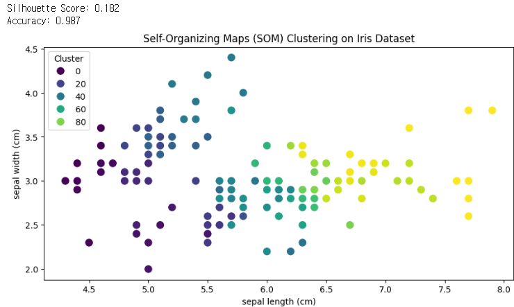

# [7-5] DEC(Deep Embedded Clustering)
▣ 정의 : <ins>딥러닝 기반의 오토인코더(Autoencoder)를 사용하여 데이터를 저차원 특징 공간(Embedding)으로 변환함과 동시에 군집화를 수행하는 최신 딥러닝 모델</ins> 
▣ 필요성 : 이미지, 텍스트와 같이 극도로 복잡하고 비선형적인 원본 데이터에서 직접 군집화를 수행하기 어려울 때, 유의미한 '표현(Representation)'을 먼저 추출한 뒤 군집화하기 위해 필요 
▣ 장점 : 특징 추출과 군집화가 동시에 최적화되므로 매우 정교한 군집이 가능합니다.이미지나 오디오 같은 비정형 데이터에서 압도적인 성능 
▣ 단점 : 대량의 학습 데이터와 높은 컴퓨팅 자원(GPU)이 요구됩니다.하이퍼파라미터 튜닝이 매우 까다롭다. 
▣ 응용분야 : 이미지 자동 분류, 안면 인식 시스템, 대규모 비정형 로그 데이터 분석 
▣ 모델식 : Kullback-Leibler(KL) 발산을 목적 함수로 사용하여 보조 타겟 분포와 클러스터 할당 분포 사이의 차이를 최소화 

	import sys
	import subprocess
	import numpy as np
	import torch
	import torch.nn as nn
	import torch.optim as optim
	import matplotlib.pyplot as plt
	from sklearn.datasets import load_iris
	from sklearn.preprocessing import StandardScaler
	from sklearn.cluster import KMeans
	from sklearn.metrics import silhouette_score, accuracy_score
	from sklearn.decomposition import PCA
	from scipy.stats import mode
	
	# 1. 필수 라이브러리 설치 및 확인
	def install_if_missing(package):
	    try:
	        __import__(package)
	    except ImportError:
	        print(f"{package} 설치 중...")
	        subprocess.check_call([sys.executable, "-m", "pip", "install", package])
	
	install_if_missing("torch")
	install_if_missing("scikit-learn")
	
	# 2. DEC 모델 구조 정의 (Autoencoder + Clustering Layer)
	class Autoencoder(nn.Module):
	    def __init__(self, input_dim, latent_dim):
	        super(Autoencoder, self).__init__()
	        # Encoder: 고차원 데이터를 저차원 특징으로 압축
	        self.encoder = nn.Sequential(
	            nn.Linear(input_dim, 32), nn.ReLU(),
	            nn.Linear(32, 16), nn.ReLU(),
	            nn.Linear(16, latent_dim)
	        )
	        # Decoder: 압축된 특징을 다시 원본으로 복구 (Pre-training용)
	        self.decoder = nn.Sequential(
	            nn.Linear(latent_dim, 16), nn.ReLU(),
	            nn.Linear(16, 32), nn.ReLU(),
	            nn.Linear(32, input_dim)
	        )
	
	    def forward(self, x):
	        z = self.encoder(x)
	        x_recon = self.decoder(z)
	        return z, x_recon
	
	class ClusteringLayer(nn.Module):
	    """ Student's t-distribution을 이용한 클러스터 할당 층 """
	    def __init__(self, n_clusters, latent_dim, alpha=1.0):
	        super(ClusteringLayer, self).__init__()
	        self.alpha = alpha
	        # 클러스터 중심점(Centroids)을 학습 가능한 파라미터로 설정
	        self.clusters = nn.Parameter(torch.Tensor(n_clusters, latent_dim))
	        nn.init.xavier_uniform_(self.clusters)
	
	    def forward(self, z):
	        # z와 중심점 사이의 유사도(q) 계산
	        q = 1.0 / (1.0 + torch.sum((z.unsqueeze(1) - self.clusters)**2, dim=2) / self.alpha)
	        q = q**((self.alpha + 1.0) / 2.0)
	        q = (q.t() / torch.sum(q, dim=1)).t()
	        return q
	
	# 3. 데이터 로드 및 전처리
	iris = load_iris()
	X, y = iris.data, iris.target
	target_names = iris.target_names
	X_scaled = StandardScaler().fit_transform(X)
	X_tensor = torch.FloatTensor(X_scaled)
	
	# 4. 모델 학습 설정 (Hyper-parameters)
	latent_dim = 2
	n_clusters = 3
	epochs_pretrain = 100
	epochs_clustering = 150
	
	ae = Autoencoder(input_dim=4, latent_dim=latent_dim)
	clustering_layer = ClusteringLayer(n_clusters=n_clusters, latent_dim=latent_dim)
	
	# [Step 1] Autoencoder Pre-training (데이터의 특징을 먼저 학습)
	optimizer = optim.Adam(ae.parameters(), lr=0.01)
	criterion = nn.MSELoss()
	
	for epoch in range(epochs_pretrain):
	    z, x_recon = ae(X_tensor)
	    loss = criterion(x_recon, X_tensor)
	    optimizer.zero_grad()
	    loss.backward()
	    optimizer.step()
	
	# [Step 2] DEC 본격 학습 (K-means로 초기 중심점 설정 후 KL-Divergence 최적화)
	with torch.no_grad():
	    z, _ = ae(X_tensor)
	    kmeans = KMeans(n_clusters=n_clusters, n_init=10).fit(z.numpy())
	    clustering_layer.clusters.data = torch.Tensor(kmeans.cluster_centers_)
	
	optimizer_dec = optim.Adam(list(ae.parameters()) + list(clustering_layer.parameters()), lr=0.001)
	
	def target_distribution(q):
	    """ 할당 확률 q를 더 명확한 p 분포로 변환 (Self-training 타겟) """
	    weight = q**2 / q.sum(0)
	    return (weight.t() / weight.sum(1)).t()
	
	for epoch in range(epochs_clustering):
	    z, _ = ae(X_tensor)
	    q = clustering_layer(z)
	    p = target_distribution(q).detach()
	    
	    # KL-Divergence Loss: p와 q의 차이를 최소화
	    loss = nn.KLDivLoss(reduction='batchmean')(torch.log(q), p)
	    optimizer_dec.zero_grad()
	    loss.backward()
	    optimizer_dec.step()
	
	# 5. 결과 평가 및 시각화
	with torch.no_grad():
	    z, _ = ae(X_tensor)
	    q = clustering_layer(z)
	    y_pred = torch.argmax(q, dim=1).numpy()
	
	# 라벨 매칭 정확도 계산
	def get_accuracy(y_true, y_pred):
	    labels = np.zeros_like(y_pred)
	    for i in np.unique(y_pred):
	        mask = (y_pred == i)
	        if np.any(mask):
	            labels[mask] = mode(y_true[mask], keepdims=True).mode[0]
	    return accuracy_score(y_true, labels)
	
	acc = get_accuracy(y, y_pred)
	sil = silhouette_score(z.numpy(), y_pred)
	
	# 그래프 작성
	plt.figure(figsize=(10, 6))
	colors = ['navy', 'turquoise', 'darkorange']
	for i, (color, name) in enumerate(zip(colors, target_names)):
	    mask = (y == i)
	    plt.scatter(z[mask, 0], z[mask, 1], color=color, alpha=0.7, lw=2, label=name)
	
	plt.title(f'DEC (Deep Embedded Clustering) Result\nAccuracy: {acc:.3f} | Silhouette: {sil:.3f}')
	plt.xlabel('Latent Feature 1')
	plt.ylabel('Latent Feature 2')
	plt.legend(title="Iris Species", loc='best')
	plt.grid(True, linestyle=':', alpha=0.6)
	plt.show()
	
	print(f"최종 Accuracy: {acc:.4f}")
	print(f"최종 Silhouette Score: {sil:.4f}")

## [7-1] PROCLUS (PROjected CLUStering)

| 항목 | 내용 |
|------|------|
| **구성요소** | 메도이드(Medoid) 기반 파티셔닝 + 각 클러스터별 최적 부분 공간(차원 집합 $L_i$) |
| **거리함수** | 선택된 차원 집합 $L$에 대한 맨해튼 거리 기반 가중 평균 $d_L(x, m) = \frac{1}{|L|} \sum_{j \in L} |x_j - m_j|$ |
| **목적함수** | 클러스터 내 압축도(Average Distance) 최소화 $\min \sum_{i=1}^k \frac{1}{|C_i|} \sum_{x \in C_i} d_{L_i}(x, m_i)$ |
| **중심갱신** | 기존 메도이드 중 성능이 낮은 것을 버리고 새로운 후보점으로 교체하는 반복 탐색 수행(Hill-climbing 방식) |
| **목표** | 각 군집마다 **서로 다른 차원 부분 공간**을 할당하여, 노이즈 차원을 배제한 최적의 저차원 투영 군집 탐색 |

## [7-2] ORCLUS (ORiented projected CLUStering)

| 항목 | 내용 |
|------|------|
| **구성요소** | 데이터의 상관관계를 반영하여 회전된(Oriented) 부분 공간 추출 및 투영 |
| **거리함수** | 공분산 행렬 $\Sigma$에서 추출된 고유벡터 공간 $E$로의 투영 거리 $d_E(x, m) = \sqrt{(x - m)^T E E^T (x - m)}$ |
| **목적함수** | 에너지 보존 및 투영된 공간에서의 분산 최소화 $\min \sum_{i=1}^k \sum_{x \in C_i} \lVert \text{proj}_{E_i}(x - m_i) \rVert^2$ |
| **중심갱신** | 1. 클러스터 재할당 → 2. 각 클러스터의 산포 행렬 계산 → 3. PCA를 통한 최적 방향(E) 및 중심($m$) 갱신 |
| **목표** | 축에 평행하지 않은 **임의의 방향으로 정렬된 부분 공간**에서 상관관계가 높은 데이터 군집을 탐색 |

## [7-3] SUBCLU (SUBspace CLUstering)

| 항목 | 내용 |
|------|------|
| **구성요소** | 밀도 기반 군집화(DBSCAN)의 부분 공간 확장판 — 하향식(Bottom-up) 차원 확장 탐색 |
| **거리함수** | 부분 공간 $S$에서의 유클리드 거리 기반 $\epsilon$-이웃 $N_{\epsilon}^S(x) = \{ y \in D \mid \text{dist}_S(x, y) \le \epsilon \}$ |
| **목적함수** | 밀도 도달 가능성(Density-reachability) 만족 $\forall x \in C, |N_{\epsilon}^S(x)| \ge \text{MinPts}$ |
| **중심갱신** | 명시적 중심 없음 — 하위 차원에서 발견된 고밀도 영역을 결합하여 고차원의 밀집 부분 공간을 생성 |
| **목표** | 모든 가능한 부분 공간 조합 중 **임의의 형태를 가진 밀집 군집**을 단조성(Monotonicity) 원리를 이용해 탐색 |

## [7-4] SOMs (Self-Organizing Maps)

| 항목 | 내용 |
|------|------|
| **구성요소** | 격자형(neural lattice) 노드에 가중치 벡터 $w_j$ 존재 |
| **거리함수** | 유클리드 거리 $d(x_i, w_j) = \lVert x_i - w_j \rVert$ |
| **목적함수** | 인접 노드 간의 가중치 차이를 최소화 $E = \sum_i \sum_j h_{bj}(t) \, \lVert x_i - w_j \rVert^2$ ($h_{bj}(t)$: BMU와 노드 $j$ 간의 이웃 함수) |
| **중심갱신** | $w_j(t+1) = w_j(t) + \eta(t) \, h_{bj}(t) \, [x_i - w_j(t)]$ |
| **목표** | **데이터의 위상(topology)과 분포 구조를 보존**하면서, 고차원 데이터를 2D 격자 상에 **비선형 차원 축소 및 시각화** 형태로 표현 |

## [7-5] DEC (Deep Embedded Clustering)

| 항목 | 내용 |
|------|------|
| **구성요소** | 심층 오토인코더(Deep Autoencoder) + 클러스터 할당 층(Clustering Layer) |
| **거리함수** | 임베딩 공간 $z$에서의 Student's t-분포 기반 유사도 $q_{ij} = \frac{(1 + \lVert z_i - \mu_j \rVert^2)^{-1}}{\sum_{j'} (1 + \lVert z_i - \mu_{j'} \rVert^2)^{-1}}$ |
| **목적함수** | 타겟 분포 $P$와 할당 분포 $Q$ 사이의 KL 발산 최소화 $L = KL(P \parallel Q) = \sum_i \sum_j p_{ij} \log \frac{p_{ij}}{q_{ij}}$ |
| **중심갱신** | 역전파(Backpropagation)를 통해 인코더의 가중치 $W$와 클러스터 중심 $\mu_j$를 동시에 업데이트 |
| **목표** | 비정형 데이터의 **특징 추출(Representation Learning)과 군집화(Clustering)를 결합**하여 최적의 저차원 군집 형성 |

---
**비지도학습(scikit-learn) **
https://scikit-learn.org/stable/unsupervised_learning.html
 

---

**군집화 알고리즘 비교(scikit-learn) ** 
https://scikit-learn.org/stable/auto_examples/cluster/plot_cluster_comparison.html#sphx-glr-auto-examples-cluster-plot-cluster-comparison-py%20%EC%B6%9C%EC%B2%98:%20https://rfriend.tistory.com/587%20[R,%20Python%20%EB%B6%84%EC%84%9D%EA%B3%BC%20%ED%94%84%EB%A1%9C%EA%B7%B8%EB%9E%98%EB%B0%8D%EC%9D%98%20%EC%B9%9C%EA%B5%AC%20(by%20R%20Friend):%ED%8B%B0%EC%8A%A4%ED%86%A0%EB%A6%AC]

---

| 한글명칭 | 영문명칭 | 정의 | 수식 | 장점 | 단점 | 적용분야 |
| :--- | :--- | :--- | :--- | :--- | :--- | :--- |
| **유클리드 거리** | Euclidean Distance | 두 점 사이 직선 거리 | $d = \sqrt{\sum_i(x_i-y_i)^2}$ | 직관적 | 이상치에 민감 | KNN, K-means |
| **맨해튼 거리** | Manhattan Distance | 축 방향 거리 합 | $d = \sum_i \vert x_i-y_i \vert$ | 안정적 | 직선거리가 아님 | L1 회귀 |
| **민코프스키 거리** | Minkowski Distance | L1~L2 일반화 | $d = (\sum_i \vert x_i-y_i \vert^p)^{1/p}$ | 유연함 | $p$ 선택 필요 | ML 전반 |
| **체비쇼프 거리** | Chebyshev Distance | 좌표 차이 최대값 | $d = \max_i \vert x_i-y_i \vert$ | 간단 | 범용성 낮음 | QC, 체스 |
| **코사인 거리** | Cosine Distance | 벡터 방향 기반 | $d = 1 - \frac{\sum x_iy_i}{\sqrt{\sum x_i^2}\sqrt{\sum y_i^2}}$ | 고차원 적합 | 크기 무시 | NLP |
| **해밍 거리** | Hamming Distance | 문자/비트 차이 수 | $d = \sum_i [x_i \neq y_i]$ | 비트 비교 우수 | 연속값 부적합 | 오류 검출 |
| **자카드 거리** | Jaccard Distance | 집합 유사도 기반 | $d = 1 - \frac{\vert A \cap B \vert}{\vert A \cup B \vert}$ | 집합 비교 강함 | 희소 데이터에 취약 | 텍스트 분석 |
| **브레이-커티스** | Bray–Curtis Distance | 구성 비율 차이 | $d = \frac{\sum \vert x_i-y_i \vert}{\sum (x_i+y_i)}$ | 비율 비교 가능 | 음수 데이터 불가 | 생태학 |
| **마할라노비스** | Mahalanobis Distance | 공분산 고려 | $d = \sqrt{(x-\mu)^T S^{-1} (x-\mu)}$ | 데이터 분포 반영 | 공분산 행렬 필요 | 이상치 탐지 |
| **캔버라 거리** | Canberra Distance | 작은 값에 민감 | $d = \sum \frac{\vert x_i-y_i \vert}{\vert x_i \vert + \vert y_i \vert}$ | 희소 데이터 적합 | $0$값에 민감 | 환경 데이터 |
| **DTW 거리** | Dynamic Time Warping | 비선형 시계열 정렬 | 알고리즘 기반 최적 경로 | 시계열에 강력 | 계산 비용 높음 | 음성, 센서 |
| **편집 거리** | Levenshtein Distance | 삽입/삭제/교체 최소 | 동적 계획법 기반 | 문자열 비교 강함 | 연산 비용 큼 | NLP |
| **소렌슨 거리** | Sørensen Distance | 집합 기반 | $d = \frac{2 \vert A \cap B \vert}{\vert A \vert + \vert B \vert}$ | 집합 크기 반영 | 특정 상황에 민감 | 문서 비교 |
| **러셀–라오 거리** | Russell–Rao Distance | 공통 1 비율 | $d = 1 - \frac{n_{11}}{n}$ | 계산이 매우 단순 | 정보 손실 많음 | 이진 데이터 |
| **카이제곱 거리** | Chi-Square Distance | 확률/히스토그램 기반 | $d = \sum \frac{(x_i-y_i)^2}{x_i+y_i}$ | 분포 비교 우수 | $0$값에 민감 | 컴퓨터 비전 |
| **워서슈타인** | Wasserstein Distance | 분포 이동 최적 비용 | $d = \inf_{\gamma} \int \vert x-y \vert d\gamma(x,y)$ | 강력한 분포 비교 | 계산 복잡도 높음 | GAN, 생성 모델 |
| **KL 발산** | KL Divergence | 비대칭 분포 거리 | $D_{KL}(P \parallel Q) = \sum P \log \frac{P}{Q}$ | 이론적 의미 강함 | 비대칭성 | 확률 모델 |
| **JS 발산** | Jensen–Shannon | KL의 대칭화 | $JS = \frac{1}{2}KL(P \parallel M) + \frac{1}{2}KL(Q \parallel M)$ | 대칭성 및 안정성 | 추가 연산 비용 | NLP, GAN |

<!--

-->

