#  06 : 비지도 학습(Unsupervised Learning, UL) : 연관규칙, 차원축소

---

## 연관 규칙(Association Rule)
 

	핵심 탐색 알고리즘
	[AR-1] Apriori : 선험적 알고리즘
	[AR-2] FP-Growth(Frequent Pattern Growth) : 빈발 패턴 성장
	[AR-3] Eclat(Equivalence Class Transformation) : 동등 클래스 변환

	규칙 확장/변형 알고리즘
	[AR-4] Multi-level Association Rules : 다계층 연관규칙
	[AR-5] Multi-dimensional Association Rules : 다차원 연관규칙

	추론/최적화 알고리즘
	[AR-6] Artificial Immune System : 인공면역시스템

	   
    [연관 규칙 알고리즘 평가방법]
    ▣ 지지도(Support) : 특정 항목 집합이 전체 거래에서 얼마나 자주 나타나는지 나타낸다.
    ▣ 신뢰도(Confidence) : A가 주어졌을 때 B가 발생할 확률
    ▣ 향상도(Lift) : A와 B가 서로 독립적으로 발생하는 경우에 비해 A가 발생했을 때 B가 발생할 가능성이 얼마나 높은지를 나타낸다.
    ▣ 레버리지(Leverage) : A와 B의 결합 빈도가 두 항목이 독립적으로 발생하는 빈도와 얼마나 차이가 나는지 나타낸다.
    ▣ Conviction(확신도) : A가 발생할 때 B가 발생하지 않을 가능성이 독립적인 경우보다 얼마나 줄어드는지를 나타낸다.
    ▣ 상관계수(Correlation Coefficient)는 두 변수 간의 관계의 강도와 방향

    

## 차원 축소(Dimensionality Reduction)
 

	전통 통계·선형 알고리즘
	[DR-1] PCA(Principal Component Analysis) : 주성분 분석	
	[DR-2] SVD(Singular Value Decomposition) : 특이값 분해
	[DR-3] ICA(Independent Component Analysis) : 독립성분 분석
	[DR-4] LDA(Linear Discriminant Analysis) : 선형판별 분석(지도학습 기반)
	[DR-5] NMF(Non-negative Matrix Factorization)  : 비음수 행렬 분해

	비선형/매니폴드 학습 알고리즘
	[DR-6] t-SNE(t-distributed Stochastic Neighbor Embedding) : t-분포 확률적 이웃 임베딩
	[DR-7] UMAP(Uniform Manifold Approximation and Projection) : 균일 매니폴드 근사적 사영
	[DR-8] Isomap : 등거리 매핑
	[DR-9] MDS(Multidimensional Scaling) : 다차원 척도

	신경망/딥러닝 알고리즘
	[DR-10] SOM(Self-Organizing Maps) : 자기 조직화
	
	
    [차원 축소 알고리즘 평가방법]
    ▣ 재구성 오류(Reconstruction Error) : 복원된 데이터와 원본 데이터 간의 평균 제곱 오차(MSE)
    ▣ 분산 유지율(Explained Variance Ratio) : 각 주성분이 설명하는 분산 비율로 데이터의 정보 손실정도 파악
    ▣ 상호 정보량(Mutual Information) :  차원 축소 전후 데이터의 정보량을 비교
    ▣ 군집 평가 지표 : Silhouette Score, Davies-Bouldin Index, 실제 레이블과 예측 레이블 비교(ARI, NMI)

**연관 규칙 추천(Assocication Rule based Recommendation) :** 빅데이터 기반의 데이터 마이닝기법 
"A를 선택하면(antecedent), B도 선택한다(Consequent)"는 규칙을 찾는다. 
 

<!--
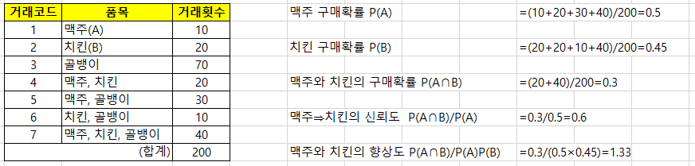
 
-->

# [AR-1] Apriori : 선험적 알고리즘

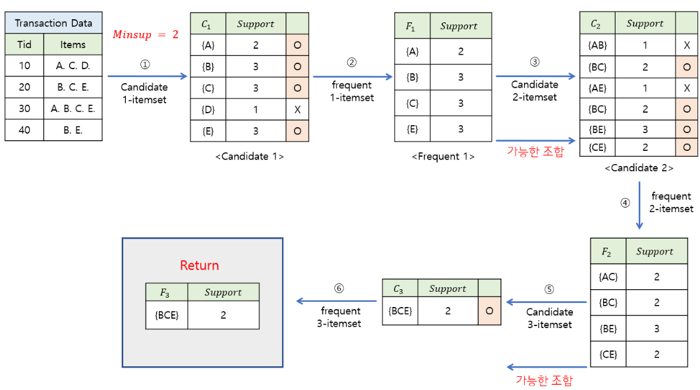
 
https://nyamin9.github.io/data_mining/Data-Mining-Pattern-3/#-31-apriori-algorithm---example  
▣ 정의 : 연관규칙 학습을 위한 고전적인 알고리즘으로, 빈발항목 집합(frequent itemsets)을 찾아내고 그 집합 간 연관성을 추출 
▣ 필요성 : 대규모 데이터에서 연관성을 발견하는 작업은 계산 비용이 높을 수 있는데, Apriori는 빈발하지 않은 항목 집합을 먼저 제거해 검색 공간을 줄여주는 방식으로 효율적인 탐색 
▣ 장점 : 간단한 구조로 이해하기 쉽고, 계산 공간을 줄이기 위한 사전 단계를 가지고 있어, 효율적인 탐색이 가능 
▣ 단점 : 대규모 데이터에서 탐색 공간이 커지면 성능이 저하되고 비효율적일 수 있으며, 매번 새로운 후보집합 생성에 따른 큰 계산비용 
▣ 응용분야 : 시장 바구니 분석(장바구니 데이터에서 자주 함께 구매되는 상품을 찾음), 추천 시스템, 웹 페이지 연결성 분석 
▣ 모델식 : 지지도(Support): 특정 항목 집합이 전체 거래에서 발생하는 빈도, 신뢰도(Confidence): 특정 항목이 발생한 경우 다른 항목이 함께 발생할 확률, 향상도(Lift): 항목 간의 상호의존성을 측정 

	import pandas as pd	
	import matplotlib.pyplot as plt
 	from mlxtend.frequent_patterns import apriori
	from itertools import combinations
	
	# 데이터셋 생성
	data = {
	    'TID': [1, 2, 3, 4, 5],
	    'milk': [1, 1, 0, 1, 0],
	    'bread': [1, 1, 1, 0, 1],
	    'butter': [0, 1, 1, 1, 1],
	}
	df = pd.DataFrame(data).set_index('TID')
	
	# 데이터 시각화
	item_counts = df.sum()
	item_counts.plot(kind='bar', color='blue')
	plt.title('Item Frequency')
	plt.xlabel('Items')
	plt.ylabel('Frequency')
	plt.show()
	
	# apriori 알고리즘 적용
	frequent_itemsets = apriori(df, min_support=0.4, use_colnames=True)
	
	# 수동으로 연관 규칙 계산
	rules = []
	for itemset in frequent_itemsets['itemsets']:
	    if len(itemset) > 1:
	        for antecedent in combinations(itemset, len(itemset) - 1):
	            antecedent = frozenset(antecedent)
	            consequent = itemset - antecedent
	            
	            # 지지도 계산
	            support = frequent_itemsets[frequent_itemsets['itemsets'] == itemset]['support'].values[0]
	            
	            # 신뢰도 계산
	            antecedent_support = frequent_itemsets[frequent_itemsets['itemsets'] == antecedent]['support'].values[0]
	            confidence = support / antecedent_support
	            
	            # 향상도 계산
	            consequent_support = frequent_itemsets[frequent_itemsets['itemsets'] == consequent]['support'].values[0]
	            lift = confidence / consequent_support
	            
	            # 규칙 저장
	            rules.append({
	                'antecedents': antecedent,
	                'consequents': consequent,
	                'support': support,
	                'confidence': confidence,
	                'lift': lift
	            })
	
	# 결과를 DataFrame으로 변환하여 출력
	rules_df = pd.DataFrame(rules)
	print("Association Rules:")
 	print(rules_df[['antecedents', 'consequents', 'support', 'confidence', 'lift']])

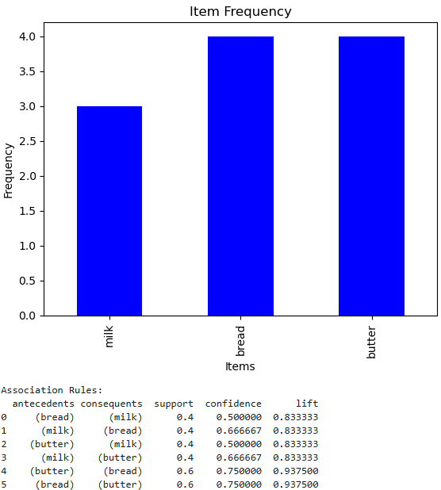
 

**지지도(support):** 규칙 전체(A∪B)가 거래에서 차지하는 비율, {butter}→{bread}: 0.6 (거래의 60%에서 butter와 bread 동시 등장) 
**신뢰도(confidence):** 선행항이 등장했을 때, 결과항이 함께 등장할 확률, {butter}→{bread}: 0.75 (butter가 있으면 75% 확률로 bread도 함께 구매) 
**향상도(lift):** 두 항목이 독립일 때 기대되는 확률 대비 함께 등장할 확률, {butter}→{bread}: 0.9375 < 1 → 독립적으로 발생할 때보다 같이 나타날 확률이 오히려 낮음 

	support ≥ 0.4: 규칙 자체는 충분히 자주 등장
	confidence ≥ 0.7: 규칙 신뢰도가 꽤 높음
	lift > 1: 긍정적 연관성으로 판단 가능

 

# [AR-2] FP-Growth(Frequent Pattern Growth) : 빈발 패턴 성장
▣ 정의: Apriori 알고리즘의 대안으로 FP-Tree(Frequent Pattern Tree)를 통해 빈발항목 집합을 생성하는 알고리즘으로, Apriori와 달리 매번 후보집합을 생성하지 않으며, 데이터의 트랜잭션을 직접 탐색하여 빈발항목 집합을 구한다. 
▣ 필요성: Apriori의 성능 문제를 해결하기 위해 고안 
▣ 장점: 메모리 효율이 높고, 대규모 데이터셋에서 빠르게 작동 
▣ 단점: FP-트리 구조를 구축하는 데 추가 메모리가 필요하며, 구현이 복잡하고 FP-Tree 생성을 위한 학습이 필요 
▣ 응용분야: 대규모 데이터 분석, 전자상거래 추천 시스템 

	import pandas as pd	
	import matplotlib.pyplot as plt
 	from mlxtend.frequent_patterns import fpgrowth
	from itertools import combinations
	
	# 데이터셋 생성
	data = {
	    'TID': [1, 2, 3, 4, 5],
	    'milk': [1, 1, 0, 1, 0],
	    'bread': [1, 1, 1, 0, 1],
	    'butter': [0, 1, 1, 1, 1],
	}
	df = pd.DataFrame(data).set_index('TID')
	
	# 데이터 시각화
	item_counts = df.sum()
	item_counts.plot(kind='bar', color='green')
	plt.title('Item Frequency (FP-Growth)')
	plt.xlabel('Items')
	plt.ylabel('Frequency')
	plt.show()
	
	# FP-Growth 알고리즘 적용
	frequent_itemsets = fpgrowth(df, min_support=0.4, use_colnames=True)
	
	# 수동으로 연관 규칙 계산
	rules = []
	for itemset in frequent_itemsets['itemsets']:
	    if len(itemset) > 1:
	        for antecedent in combinations(itemset, len(itemset) - 1):
	            antecedent = frozenset(antecedent)
	            consequent = itemset - antecedent
	            
	            # 지지도 계산
	            support = frequent_itemsets[frequent_itemsets['itemsets'] == itemset]['support'].values[0]
	            
	            # 신뢰도 계산
	            antecedent_support = frequent_itemsets[frequent_itemsets['itemsets'] == antecedent]['support'].values[0]
	            confidence = support / antecedent_support
	            
	            # 향상도 계산
	            consequent_support = frequent_itemsets[frequent_itemsets['itemsets'] == consequent]['support'].values[0]
	            lift = confidence / consequent_support
	            
	            # 규칙 저장
	            rules.append({
	                'antecedents': antecedent,
	                'consequents': consequent,
	                'support': support,
	                'confidence': confidence,
	                'lift': lift
	            })
	
	# 결과를 DataFrame으로 변환하여 출력
	rules_df = pd.DataFrame(rules)
	print("Association Rules (FP-Growth):")
	print(rules_df[['antecedents', 'consequents', 'support', 'confidence', 'lift']])

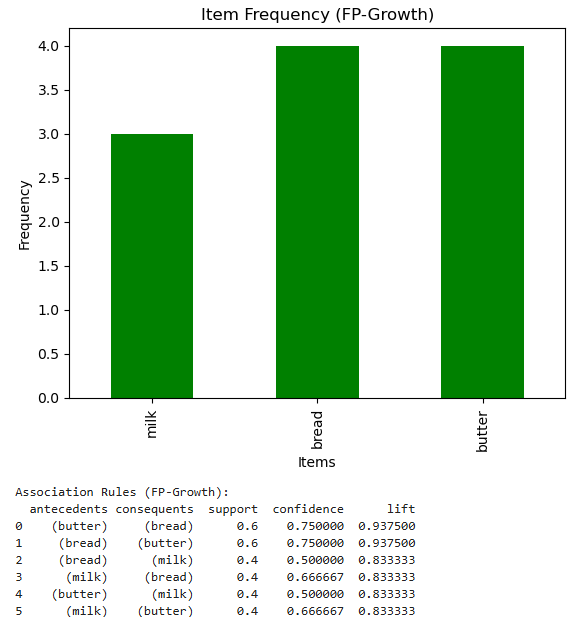   
 

# [AR-3] Eclat(Equivalence Class Transformation) : 동등 클래스 변환
  
 
chrome-extension://efaidnbmnnnibpcajpcglclefindmkaj/https://www.philippe-fournier-viger.com/COURSES/Pattern_mining/Eclat.pdf
 
노란색 빈발 집합 : 사전 정의된 최소 지지도(minimum support) 이상의 지지도를 가지는 항목의 조합  
▣ 정의: Apriori와 FP-Growth의 대안으로, 트랜잭션 간의 공통항목(교집합)을 기반으로 빈발항목을 추출하는 알고리즘 
▣ 필요성: 데이터의 수가 많아도 트랜잭션 간 교차 계산을 통해 효율적으로 연관 규칙을 도출 
▣ 장점 : 수평적 데이터 구조를 이용하여 트랜잭션 데이터에서 빈발 항목 집합을 빠르게 찾고, 저장 공간을 효율적으로 사용하며, 교차 연산을 통해 빈발 항목을 추출 
▣ 단점 : 트랜잭션 ID 집합을 계속 업데이트해야 하므로 메모리 사용이 증가할 수 있으며, 대규모 데이터셋에서는 효율성이 떨어질 수 있음 
▣ 응용분야 : 대규모 데이터에서 빈발 패턴 분석, 웹 클릭 로그 분석, 텍스트 마이닝에서 자주 나타나는 단어 조합 분석 
▣ 모델식 : 항목 집합의 지지도 계산을 위해 트랜잭션 ID 집합의 교집합을 사용하며 빈발항목 집합의 지지도를 계산할 때 교집합을 통해 빈발 항목을 찾아낸다 

	import pandas as pd
	import matplotlib.pyplot as plt
	from itertools import combinations
	
	# 데이터셋 생성
	data = {
	    'TID': [1, 2, 3, 4, 5],
	    'milk': [1, 1, 0, 1, 0],
	    'bread': [1, 1, 1, 0, 1],
	    'butter': [0, 1, 1, 1, 1],
	}
	df = pd.DataFrame(data).set_index('TID')
	
	# 데이터 시각화
	item_counts = df.sum()
	item_counts.plot(kind='bar', color='purple')
	plt.title('Item Frequency (Eclat)')
	plt.xlabel('Items')
	plt.ylabel('Frequency')
	plt.show()
	
	# Eclat 알고리즘 구현
	def eclat(data, min_support=0.4):
	    # 항목별 지지도 계산
	    itemsets = {}
	    for col in data.columns:
	        support = data[col].sum() / len(data)
	        if support >= min_support:
	            itemsets[frozenset([col])] = support
	    
	    # 두 개 이상의 항목 집합에 대해 지지도 계산
	    for length in range(2, len(data.columns) + 1):
	        for comb in combinations(data.columns, length):
	            comb_set = frozenset(comb)
	            support = (data[list(comb)].sum(axis=1) == length).mean()
	            if support >= min_support:
	                itemsets[comb_set] = support
	
	    return itemsets
	
	# Eclat 알고리즘 적용하여 빈발 항목 집합 생성
	frequent_itemsets = eclat(df, min_support=0.4)
	
	# 빈발 항목 집합에서 연관 규칙 계산
	rules = []
	for itemset, support in frequent_itemsets.items():
	    if len(itemset) > 1:
	        for antecedent in combinations(itemset, len(itemset) - 1):
	            antecedent = frozenset(antecedent)
	            consequent = itemset - antecedent
	            
	            # 신뢰도 계산
	            antecedent_support = frequent_itemsets[antecedent]
	            confidence = support / antecedent_support
	            
	            # 향상도 계산
	            consequent_support = frequent_itemsets[consequent]
	            lift = confidence / consequent_support
	            
	            # 규칙 저장
	            rules.append({
	                'antecedents': antecedent,
	                'consequents': consequent,
	                'support': support,
	                'confidence': confidence,
	                'lift': lift
	            })
	
	# 결과를 DataFrame으로 변환하여 출력
	rules_df = pd.DataFrame(rules)
	print("Association Rules (Eclat):")
	print(rules_df[['antecedents', 'consequents', 'support', 'confidence', 'lift']])
    
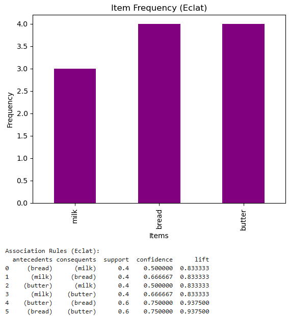
 

# [AR-4] Multi-level Association Rules : 다계층 연관규칙
▣ 정의: Apriori와 FP-Growth 확장버전으로 연관 규칙을 계층적으로 탐색하여 다중 수준에서 규칙을 생성하는 방식 
▣ 필요성: 제품 카테고리별 분석이 필요한 경우에 적합 
▣ 장점: 더 정교한 규칙을 생성 
▣ 단점: 복잡성이 증가하며, 해석이 어려워질 수 있음 
▣ 응용분야: 전자상거래, 추천 시스템, 마케팅 분석 

	import pandas as pd
	from mlxtend.frequent_patterns import apriori
	import matplotlib.pyplot as plt
	from itertools import combinations
	
	# 데이터셋 생성 (Multi-level 구조)
	data = {
	    'TID': [1, 2, 3, 4, 5],
	    'Dairy_Milk': [1, 1, 0, 1, 0],
	    'Bakery_Bread': [1, 1, 1, 0, 1],
	    'Bakery_Butter': [0, 1, 1, 1, 1]
	}
	df = pd.DataFrame(data).set_index('TID')
	
	# 상위 계층 데이터 생성
	df['Dairy'] = df['Dairy_Milk']
	df['Bakery'] = df[['Bakery_Bread', 'Bakery_Butter']].max(axis=1)
	
	# 원본 데이터 시각화
	item_counts = df[['Dairy_Milk', 'Bakery_Bread', 'Bakery_Butter']].sum()
	item_counts.plot(kind='bar', color='purple')
	plt.title('Item Frequency (Multi-level Association Rules)')
	plt.xlabel('Items')
	plt.ylabel('Frequency')
	plt.show()
	
	# 상위 계층에서 apriori 알고리즘 적용
	frequent_itemsets_upper = apriori(df[['Dairy', 'Bakery']], min_support=0.4, use_colnames=True)
	frequent_itemsets_upper['length'] = frequent_itemsets_upper['itemsets'].apply(lambda x: len(x))
	
	# 하위 계층에서 apriori 알고리즘 적용
	frequent_itemsets_lower = apriori(df[['Dairy_Milk', 'Bakery_Bread', 'Bakery_Butter']], min_support=0.4, use_colnames=True)
	frequent_itemsets_lower['length'] = frequent_itemsets_lower['itemsets'].apply(lambda x: len(x))
	
	# 연관 규칙 수동 계산
	def generate_rules(frequent_itemsets):
	    rules = []
	    for itemset in frequent_itemsets['itemsets']:
	        if len(itemset) > 1:
	            for antecedent in combinations(itemset, len(itemset) - 1):
	                antecedent = frozenset(antecedent)
	                consequent = itemset - antecedent
	                
	                # 지지도 계산
	                support = frequent_itemsets[frequent_itemsets['itemsets'] == itemset]['support'].values[0]
	                
	                # 신뢰도 계산
	                antecedent_support = frequent_itemsets[frequent_itemsets['itemsets'] == antecedent]['support'].values[0]
	                confidence = support / antecedent_support
	                
	                # 향상도 계산
	                consequent_support = frequent_itemsets[frequent_itemsets['itemsets'] == consequent]['support'].values[0]
	                lift = confidence / consequent_support
	                
	                # 규칙 저장
	                rules.append({
	                    'antecedents': antecedent,
	                    'consequents': consequent,
	                    'support': support,
	                    'confidence': confidence,
	                    'lift': lift
	                })
	    return rules
	
	# 상위 계층 연관 규칙 생성
	rules_upper = generate_rules(frequent_itemsets_upper)
	rules_df_upper = pd.DataFrame(rules_upper)
	print("Association Rules (Upper Level):")
	print(rules_df_upper[['antecedents', 'consequents', 'support', 'confidence', 'lift']])
	
	# 하위 계층 연관 규칙 생성
	rules_lower = generate_rules(frequent_itemsets_lower)
	rules_df_lower = pd.DataFrame(rules_lower)
	print("\nAssociation Rules (Lower Level):")
	print(rules_df_lower[['antecedents', 'consequents', 'support', 'confidence', 'lift']])

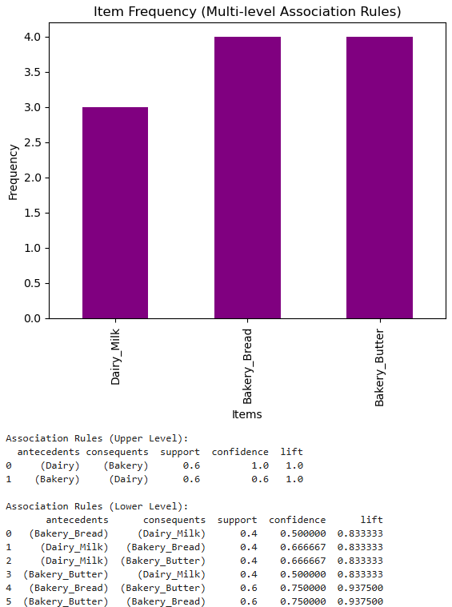
 

# [AR-5] Multi-dimensional Association Rules : 다계층 연관규칙
▣ 정의: 여러 속성을 포함하여 다양한 차원의 규칙을 생성 
▣ 필요성: 연관 규칙을 데이터의 여러 차원에 걸쳐 분석하고자 할 때 유용하며, 특정 집단에 대한 특정 패턴을 탐지하는 데 적합 
▣ 장점: 규칙의 범위를 확장할 수 있어 더 세밀한 규칙 도출 가능. 
▣ 단점: 복잡성과 해석의 어려움 
▣ 응용분야: 사용자 속성 기반 추천 시스템, 마케팅 인텔리전스 

	import pandas as pd
	from mlxtend.frequent_patterns import apriori
	import matplotlib.pyplot as plt
	from itertools import combinations
	
	# 데이터셋 생성 (Multi-dimensional 구조)
	data = {
	    'TID': [1, 2, 3, 4, 5],
	    'milk': [1, 1, 0, 1, 0],
	    'bread': [1, 1, 1, 0, 1],
	    'butter': [0, 1, 1, 1, 1],
	    'Gender_Male': [1, 0, 0, 1, 1],
	    'Gender_Female': [0, 1, 1, 0, 0],
	    'Category_Dairy': [1, 1, 0, 1, 0],
	    'Category_Bakery': [1, 1, 1, 0, 1]
	}
	df = pd.DataFrame(data).set_index('TID')
	
	# 원본 데이터 시각화
	item_counts = df[['milk', 'bread', 'butter']].sum()
	item_counts.plot(kind='bar', color='orange')
	plt.title('Item Frequency (Multi-dimensional Association Rules)')
	plt.xlabel('Items')
	plt.ylabel('Frequency')
	plt.show()
	
	# apriori 알고리즘을 사용하여 빈발 항목 집합 생성
	frequent_itemsets = apriori(df, min_support=0.4, use_colnames=True)
	frequent_itemsets['length'] = frequent_itemsets['itemsets'].apply(lambda x: len(x))
	
	# 연관 규칙 수동 계산
	def generate_rules(frequent_itemsets):
	    rules = []
	    for itemset in frequent_itemsets['itemsets']:
	        if len(itemset) > 1:
	            for antecedent in combinations(itemset, len(itemset) - 1):
	                antecedent = frozenset(antecedent)
	                consequent = itemset - antecedent
	                
	                # 지지도 계산
	                support = frequent_itemsets[frequent_itemsets['itemsets'] == itemset]['support'].values[0]
	                
	                # 신뢰도 계산
	                antecedent_support = frequent_itemsets[frequent_itemsets['itemsets'] == antecedent]['support'].values[0]
	                confidence = support / antecedent_support
	                
	                # 향상도 계산
	                consequent_support = frequent_itemsets[frequent_itemsets['itemsets'] == consequent]['support'].values[0]
	                lift = confidence / consequent_support
	                
	                # 규칙 저장
	                rules.append({
	                    'antecedents': antecedent,
	                    'consequents': consequent,
	                    'support': support,
	                    'confidence': confidence,
	                    'lift': lift
	                })
	    return rules
	
	# Multi-dimensional 연관 규칙 생성
	rules = generate_rules(frequent_itemsets)
	rules_df = pd.DataFrame(rules)
	print("Association Rules (Multi-dimensional):")
	print(rules_df[['antecedents', 'consequents', 'support', 'confidence', 'lift']])
	
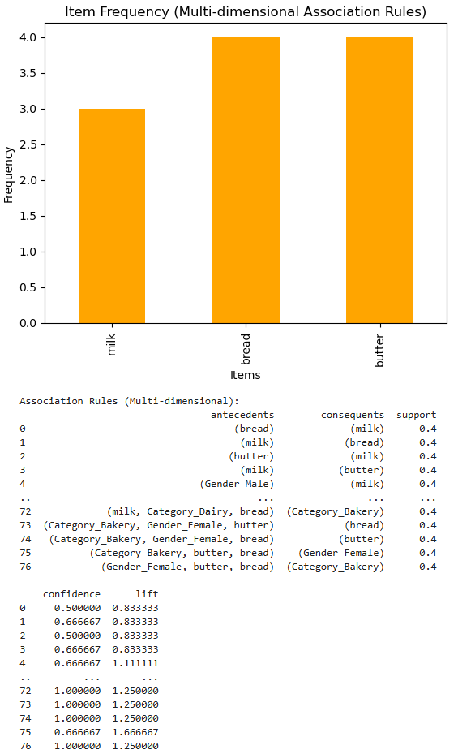
 

# [AR-6] AIS(Artificial Immune System) : 인공면역시스템
▣ 정의: 거래 데이터를 순차적으로 결합하여 빈번한 항목 집합을 찾는 초기 연관규칙 알고리즘 중 하나 
▣ 필요성: 초기 연관 규칙 연구에서 활용되었으나, 성능의 한계로 현재는 거의 사용되지 않음 
▣ 장점: 간단한 구조로 이해하기 쉽고, 복잡한 비정형 데이터에서 이상 패턴을 감지하는 데 강점 
▣ 단점: 비효율적이며, Apriori보다 성능이 떨어짐 
▣ 응용분야: 초기 연관 규칙 연구, 이상탐지 

	import pandas as pd
	import numpy as np
	import matplotlib.pyplot as plt
	
	# 데이터셋 생성
	data = {
	    'TID': [1, 2, 3, 4, 5],
	    'milk': [1, 1, 0, 1, 0],
	    'bread': [1, 1, 1, 0, 1],
	    'butter': [0, 1, 1, 1, 1],
	}
	df = pd.DataFrame(data).set_index('TID')
	
	# 데이터 시각화
	item_counts = df.sum()
	item_counts.plot(kind='bar', color='blue')
	plt.title('Item Frequency')
	plt.xlabel('Items')
	plt.ylabel('Frequency')
	plt.show()
	
	# AIS 알고리즘 설정
	population_size = 10         # 초기 항체(해) 개수
	num_generations = 10         # 반복할 세대 수
	mutation_rate = 0.1          # 돌연변이율
	selection_rate = 0.5         # 선택률
	
	# 적합도 함수 정의 (예: milk, bread, butter 구매 조합의 점수화)
	def fitness(antibody):
	    # 항체의 적합도를 milk, bread, butter의 합으로 정의
	    return antibody['milk'] * 1 + antibody['bread'] * 1.2 + antibody['butter'] * 0.8
	
	# 초기 항체(해) 생성 (milk, bread, butter 구매 유무에 따라 항체 구성)
	population = [df.sample(1, replace=True).squeeze() for _ in range(population_size)]
	fitness_scores = np.array([fitness(antibody) for antibody in population])
	
	# AIS 알고리즘 실행
	for generation in range(num_generations):
	    # 선택: 상위 selection_rate 비율의 항체만 유지
	    num_selected = int(selection_rate * population_size)
	    selected_indices = np.argsort(fitness_scores)[-num_selected:]
	    selected_population = [population[i] for i in selected_indices]
	    
	    # 복제 및 돌연변이
	    offspring = []
	    for antibody in selected_population:
	        # 복제
	        cloned = antibody.copy()
	        # 돌연변이 적용
	        for item in ['milk', 'bread', 'butter']:
	            if np.random.rand() < mutation_rate:
	                cloned[item] = 1 - cloned[item]  # 0이면 1로, 1이면 0으로 변경
	        offspring.append(cloned)
	    
	    # 새 세대 생성
	    population = offspring
	    fitness_scores = np.array([fitness(antibody) for antibody in population])
	
	# 최적의 항체 선택
	best_solution = population[np.argmax(fitness_scores)]
	best_fitness = fitness(best_solution)
	
	# 결과 출력
	print("최적의 해:", best_solution)
	print("최적의 적합도:", best_fitness)
	
	# 평가 결과 (유사 지지도, 신뢰도, 향상도)
	support = sum(best_solution) / len(best_solution)
	confidence = best_fitness / max(fitness_scores)
	lift = confidence / (support if support != 0 else 1)
	
	print("\n평가 결과:")
	print(f"지지도(Support): {support}")
	print(f"신뢰도(Confidence): {confidence}")
	print(f"향상도(Lift): {lift}")
	
	# 최종 항체 적합도 분포 시각화
	plt.plot(range(len(fitness_scores)), fitness_scores, 'bo')
	plt.xlabel("Antibody Index")
	plt.ylabel("Fitness Score")
	plt.title("AIS Antibody Fitness Distribution")
	plt.show()

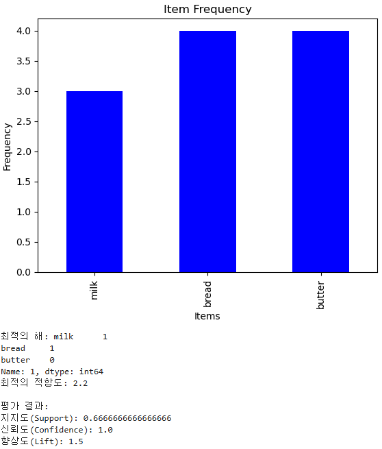
 

# 연관규칙 알고리즘 수식 요약

| 구분 | 알고리즘 | 핵심 아이디어 | 주요 수학식 (모델 함수식 역할) | 목적함수 / 평가함수 |
|------|-----------|----------------|----------------------------------|----------------------|
| **[AR-1]** | **Apriori** (선험적 알고리즘) | 단조성(Apriori Property)을 이용해 빈발 항목집합 탐색 | $Support(X)=\frac{count(X)}{N}$ $Confidence(X\Rightarrow Y)=\frac{Support(X\cup Y)}{Support(X)}$ $Lift(X\Rightarrow Y)=\frac{Support(X\cup Y)}{Support(X)\,Support(Y)}$ | $\max Support(X)$, $Confidence(X\Rightarrow Y)\ge min\_conf$ |
| **[AR-2]** | **FP-Growth** (Frequent Pattern Growth) | FP-Tree로 트랜잭션을 압축 저장 후 조건부 패턴 확장 | $FP=\{(I,Support(I))\mid Support(I)\ge min\_sup\}$ $FP(I)=\bigcup\_{i\in I}FP(\mathrm{CondBase}(i))$ | 조건부 패턴베이스를 통해 $Support\ge min\_sup$ 인 빈발패턴 효율적 탐색 |
| **[AR-3]** | **Eclat** (Equivalence Class Transformation) | TID 집합의 교집합으로 Support 계산 | $Support(X)=\left|\bigcap\_{i\in X}T(i)\right|$ (여기서 $T(i)$는 항목 $i$가 포함된 트랜잭션 ID 집합) | $\displaystyle\max\_X\left|\bigcap\_{i\in X}T(i)\right|\quad\text{s.t.}\quad\left|\bigcap\_{i\in X}T(i)\right|\ge min\_sup$ |
| **[AR-4]** | **Multi-level Association Rules** (다계층 연관규칙) | 데이터의 계층(Level) 구조 반영 | $Support\_l(X)=\frac{count\_l(X)}{N\_l}$ $Confidence\_l(X\Rightarrow Y)=\frac{Support\_l(X\cup Y)}{Support\_l(X)}$ $min\_sup\_1>min\_sup\_2>min\_sup\_3$ | 계층 수준별로 다른 $min\_support$ 조건 만족 탐색 |
| **[AR-5]** | **Multi-dimensional Association Rules** (다차원 연관규칙) | 다중 속성(Attribute) 간 연관 분석 | $Support(A\_1=a\_1,\dots,A\_k=a\_k)=\frac{count(A\_1=a\_1,\dots,A\_k=a\_k)}{N}$ $Confidence((A\_1=a\_1,\dots,A\_i=a\_i)\Rightarrow(A\_j=a\_j))=\frac{Support(A\_1=a\_1,\dots,A\_i=a\_i,A\_j=a\_j)}{Support(A\_1=a\_1,\dots,A\_i=a\_i)}$ | 다차원 속성 조합 간 연관규칙 도출 |
| **[AR-6]** | **Artificial Immune System (AIS)** (인공면역시스템) | 항원–항체 친화도(Affinity) 기반의 진화 탐색 | $Affinity(Ab,Ag)=\frac{match(Ab,Ag)}{|Ag|}$ $P(Ab\_i)=\frac{Affinity(Ab\_i,Ag)}{\sum\_jAffinity(Ab\_j,Ag)}$ $P\_{clone}=\alpha\cdot Affinity(Ab\_i,Ag)$ $P\_{mutation}=e^{-\beta\cdot Affinity(Ab\_i,Ag)}$ | $\max\_{Ab}Affinity(Ab,Ag)$ subject to $P\_{clone}$, $P\_{mutation}$ 조건 만족 |

 

# 📘 연관규칙 알고리즘 수식 요약 (GitHub 수식 이미지 최종본)

| 구분 | 알고리즘 | 핵심 아이디어 | 주요 수학식 (이미지 렌더링) | 목적함수 / 평가함수 (이미지 렌더링) |
|------|-----------|----------------|-------------------------------|----------------------|
| **[AR-1]** | **Apriori** (선험적 알고리즘) | 단조성(Apriori Property)을 이용해 빈발 항목집합 탐색 | =\frac{count(X)}{N}) =\frac{Support(X\cup%20Y)}{Support(X)}) =\frac{Support(X\cup%20Y)}{Support(X)\cdot%20Support(Y)}) | ,\;Confidence(X\Rightarrow%20Y)\ge%20min\_conf) |
| **[AR-2]** | **FP-Growth** (Frequent Pattern Growth) | FP-Tree로 트랜잭션을 압축 저장 후 조건부 패턴 확장 | )\mid%20Support(I)\ge%20min\_sup\}) =\bigcup_{i\in%20I}FP(\mathrm{CondBase}(i))) |  |
| **[AR-3]** | **Eclat** (Equivalence Class Transformation) | TID 집합의 교집합으로 Support 계산 | =\left%7C\bigcap_{i\in%20X}T(i)\right%7C) | \right%7C\;\text{s.t.}\;\left%7C\bigcap_{i\in%20X}T(i)\right%7C\ge%20min\_sup) |
| **[AR-4]** | **Multi-level Association Rules** (다계층 연관규칙) | 데이터의 계층(Level) 구조 반영 | =\frac{count\_l(X)}{N\_l}) =\frac{Support\_l(X\cup%20Y)}{Support\_l(X)})  |  |
| **[AR-5]** | **Multi-dimensional Association Rules** (다차원 연관규칙) | 다중 속성(Attribute) 간 연관 분석 | =\frac{count(A\_1=a\_1,\dots,A\_k=a\_k)}{N}) \Rightarrow(A\_j=a\_j))=\frac{Support(A\_1=a\_1,\dots,A\_i=a\_i,A\_j=a\_j)}{Support(A\_1=a\_1,\dots,A\_i=a\_i)}) |  |
| **[AR-6]** | **Artificial Immune System (AIS)** (인공면역시스템) | 항원–항체 친화도(Affinity) 기반의 진화 탐색 | =\frac{match(Ab,Ag)}{%7CAg%7C}) =\frac{Affinity(Ab\_i,Ag)}{\sum_{j}Affinity(Ab\_j,Ag)}) ) }) | ) |

---
## [연관 규칙 알고리즘 평가방법]

**▣ 지지도(Support):** 특정 항목 집합이 전체 거래에서 얼마나 자주 나타나는지 나타낸다. 
Support(A) = (거래에서 A가 발생한 횟수)/(전체 거래 수) 

**▣ 신뢰도(Confidence):** A가 주어졌을 때 B가 발생할 확률 
Confidence(A ⇒ B) = Support(A ∩ B)/Support(A) 

**▣ 향상도(Lift):** A와 B가 서로 독립적으로 발생하는 경우에 비해 A가 발생했을 때 B가 발생할 가능성이 얼마나 높은지를 나타낸다. 1이면 두 항목이 독립적, 1보다 크면 양의 상관관계, 1보다 작으면 음의 상관관계 
Lift(A ⇒ B) = Confidence(A ⇒ B)/Support(B) 

**▣ 레버리지(Leverage):** A와 B의 결합 빈도가 두 항목이 독립적으로 발생하는 빈도와 얼마나 차이가 나는지 나타낸다. 0이면 두 항목이 독립적 
Leverage(A ⇒ B) =  Support(A ∩ B) - (Support(A) × Support(B)) 

**▣ Conviction(확신도):** A가 발생할 때 B가 발생하지 않을 가능성이 독립적인 경우보다 얼마나 줄어드는지를 나타낸다. 1에 가까우면 A와 B는 서로 독립적 
Conviction(A ⇒ B) = (1-Support(B))/(1-Confidence(A ⇒ B)) 

**▣ 상관계수(Correlation Coefficient):** 0에 가까우면 두 항목 간에 상관관계가 없고, 양수나 음수로 갈수록 상관관계가 강하다. 

 

---
**차원축소의 필요성 :** 데이터에 포함된 노이즈(noise)를 제거할 때 사용하는 방법이 차원축소(dimension reduction)이다. 차원축소는 주어진 데이터의 정보손실을 최소화하면서 노이즈를 줄이는 것이 핵심이다. 차원축소를 통해 차원이 늘어날 수록 필요한 데이터가 기하급수적으로 많아지는 차원의 저주(curse of dimensionality) 문제를 해결할 수 있다. 지도학습의 대표적인 차원축소 방법은 선형판별분석(Linear Discriminant Analysis)이 있고, 비지도학습의 대표적인 차원축소 방법은 주성분분석(Principal Component Anaysis)이 있다. 

# [DR-1] PCA(Principal Component Analysis) : 주성분 분석
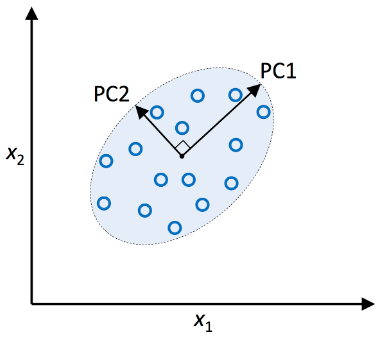
 
▣ 정의 : 데이터의 분산을 최대한 보존하면서 데이터의 주요 성분(주성분)을 찾기 위해 선형 변환을 적용하는 차원 축소 알고리즘. 여러 특성(Feature) 변수들이 통계적으로 서로 상관관계가 없도록 변환시키는 것으로 고차원 데이터를 저차원으로 변환하는 차원 축소 기법. 주성분분석은 오직 공분산행렬(convariance matrix) $\sum$ 에만 영향을 받는다.  
▣ 장점 : 정보 손실을 최소화하면서 고차원 데이터를 저차원으로 축소, 데이터의 잡음을 효과적으로 제거, 고차원 데이터를 저차원으로 변환하여 데이터의 구조를 쉽게 이해하고 분석 
▣ 단점 : 선형 변환만을 가정(커널PCA 같은 비선형 변형 기법이 필요), 각 주성분이 원래 데이터의 어떤 특성을 설명하는지 직관적으로 해석하기 어렵다. 분산에 중요한 정보가 있을 경우 이를 놓칠 수 있다. 
▣ 응용분야 : 고차원 데이터를 2D 또는 3D로 변환해 데이터의 패턴을 직관적으로 시각화, 잡음 제거, 얼굴 인식에서 얼굴 이미지의 주요 특징을 추출하여 얼굴을 효율적으로 분류 
▣ 모델식 : 주성분은 공분산 행렬의 고유값과 고유벡터를 사용하여 계산 
데이터 행렬 𝑋의 공분산 행렬 𝐶의 고유값과 고유벡터를 통해 새로운 주성분을 계산 : $C=\frac{1}{n-1}X^TX$ 
고유값 분해(v_i는 i번째 고유벡터, \lambda_i는 i번째 고유값) : $Cv_i = \lambda_iv_i$ 
▣ PCA의 절차 : 분산의 최대화: 주성분은 데이터의 분산(변동성)을 최대한 많이 설명할 수 있는 방향으로 정해진다. 데이터의 주요한 변동성을 나타내는 축을 먼저 찾고, 그 축을 기준으로 데이터를 투영한다. 직교성: 각 주성분은 서로 직교(orthogonal)해야 하는데 이는 각 주성분이 서로 상관관계가 없는 독립적인 축이라는 것을 의미한다. 
(1) 데이터 표준화 : PCA를 수행하기 전에 데이터의 스케일을 맞추기 위해 각 변수의 평균을 0으로 만들고 분산을 1로 맞추는 z-점수 정규화 과정 
(2) 공분산 행렬계산 : 공분산(두 변수가 함께 변하는 정도) 행렬 계산을 통해 데이터의 분산이 어떻게 다른 변수들과 상호작용하는지 확인 
  $Cov(X,Y)=\frac{1}{n-1}\sum_{i=1}^{n}(X_i-\overline{X})(Y_i-\overline{Y})$ 
(3) 고유값 분해(Eigenvalue Decomposition) : 공분산 행렬의 고유벡터(eigenvector)는 PCA의 주성분에 해당, 고유값(eigenvalue)은 주성분이 설명하는 분산의 양을 나타냄 
(4) 주성분 선택: 고유값이 큰 순서대로 주성분을 선택(가장 큰 고유값에 해당하는 고유벡터가 제1주성분, 그다음 고유값이 제2주성분 : 고유값이 큰 주성분일수록 데이터의 분산설명렬이 높다) 
(5) 차원 축소: 선택된 주성분을 사용해 데이터를 저차원으로 투영. 데이터의 중요한 특성(분산)을 유지하면서 불필요한 차원을 제거하여 차원을 축소 
 
 

    import numpy as np
    import matplotlib.pyplot as plt
    from sklearn.decomposition import PCA
    from sklearn.datasets import load_iris

    # 데이터 로드
    data = load_iris()
    X = data.data

    # PCA 적용
    pca = PCA(n_components=2)
    X_pca = pca.fit_transform(X)

    # 결과 시각화
    plt.scatter(X_pca[:, 0], X_pca[:, 1], c=data.target)
    plt.xlabel("Principal Component 1")
    plt.ylabel("Principal Component 2")
    plt.title("PCA on Iris Dataset")
    plt.colorbar()
    plt.show()

    # 분산 유지율 출력
    print("Explained Variance Ratio:", pca.explained_variance_ratio_)
    print("Total Variance Retained:", sum(pca.explained_variance_ratio_))

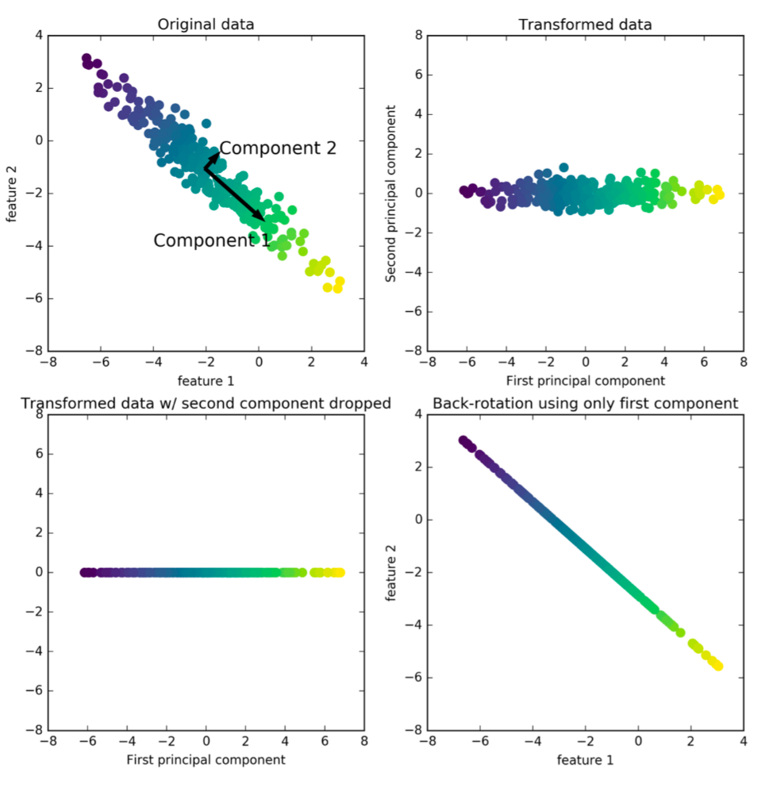
 

# [DR-2] SVD(Singular Value Decomposition) : 특이값 분해
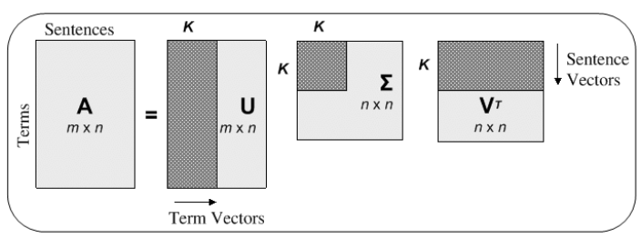
 
▣ 정의: 임의의 행렬을 세 개의 행렬로 분해하는 방식으로 행렬의 특이값과 특이벡터를 통해 행렬의 구조를 파악하고, 이를 통해 데이터의 패턴을 찾거나 압축하는 데 사용  
▣ 장점 : 정방/비정방/비대칭 행렬 등 어떤 형태의 행렬에도 적용 가능, 데이터를 저차원 공간으로 변환하면서도 중요한 패턴을 유지, 데이터에서 노이즈를 제거하여 중요한 정보만 남길 수 있음 
▣ 단점 : 특히 매우 큰 행렬의 경우 계산이 오래 걸릴 수 있으며, 분해된 행렬들이 원본 데이터와 직관적인 관계를 가지지 않기 때문에 결과를 해석하는 것이 어려울 수 있음 
▣ 응용분야 : 단어-문서 행렬의 차원 축소, 데이터 압축, 노이즈 제거, 추천 시스템, 이미지 압축  
▣ 모델식 : $X=UΣV^T$ 
𝑋는 𝑚×𝑛 크기의 원본 행렬, 𝑈는 𝑚×𝑚 크기의 좌측 직교 행렬, Σ는 𝑚×𝑛 크기의 대각 행렬로 특이값이 대각 원소로 배치, $𝑉^𝑇$는 𝑛×𝑛 크기의 우측 직교 행렬 

 

    import numpy as np
    from sklearn.decomposition import TruncatedSVD
    import matplotlib.pyplot as plt
    from sklearn.datasets import load_iris

    # 데이터 로드
    data = load_iris()
    X = data.data

    # SVD 적용
    svd = TruncatedSVD(n_components=2)
    X_svd = svd.fit_transform(X)

    # 결과 시각화
    plt.scatter(X_svd[:, 0], X_svd[:, 1], c=data.target)
    plt.xlabel("SVD Component 1")
    plt.ylabel("SVD Component 2")
    plt.title("SVD on Iris Dataset")
    plt.colorbar()
    plt.show()

    # 분산 유지율 출력
    print("Explained Variance Ratio:", svd.explained_variance_ratio_)
    print("Total Variance Retained:", sum(svd.explained_variance_ratio_))

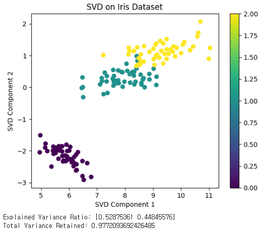
 

# [DR-3] ICA(Independent Component Analysis) : 독립성분 분석
▣ 정의 : 다변량 신호에서 통계적으로 독립적인 성분을 추출하는 비선형 차원 축소 기법. PCA는 데이터의 분산을 최대화하는 축을 찾는 반면, ICA는 신호 간의 독립성을 기반으로 성분을 찾는다. 또한 PCA는 가우시안 분포를 가정하고 데이터의 상관관계만을 이용해 차원을 축소하거나 성분을 찾는 반면, ICA는 신호들 간의 고차원적 통계적 독립성에 초점을 맞추기 때문에 더 복잡한 구조의 신호분리 문제를 해결 
▣ 필요성 : 관측된 신호가 여러 독립적인 원천 신호의 혼합으로 구성될 때 각 독립적인 신호를 복원하는 데 필요하며 특히 신호 처리 및 음성 분리에 유용 
▣ 응용분야 : 뇌파(EEG) 신호 분석, 음성 신호 분리, 이미지 처리 
▣ 장점 : 통계적으로 독립적인 신호를 분리할 수 있으며 신호 처리, 이미지 분할, 음성 분리 등에서 강력한 성능을 발휘 
▣ 단점 : 잡음에 민감하고, 원래 신호의 순서를 보장하지 않으며, 성분의 크기도 원래 신호와 다를 수 있어서 추가적인 후처리가 필요 
▣ 모델식 : 관측 데이터 𝑋=𝐴𝑆에서 𝐴는 혼합 행렬, 𝑆는 독립 성분 행렬이며, 𝐴와 𝑆를 추정하여 𝑆를 추출 
▣ 알고리즘 : 비선형성을 이용해 독립 성분을 빠르게 찾는 방법으로 신호의 비정규성을 최대화하는 방향으로 성분을 추정하는 Fast ICA과 정보 이론을 기반으로 한 방법으로, 관측된 데이터에서 정보량을 최대화하는 방식으로 독립 성분을 추정하는 Infomax ICA 

 

    import numpy as np
    from sklearn.decomposition import FastICA
    import matplotlib.pyplot as plt
    from sklearn.datasets import load_iris

    # 데이터 로드
    data = load_iris()
    X = data.data

    # ICA 적용
    ica = FastICA(n_components=2, random_state=42)
    X_ica = ica.fit_transform(X)

    # 결과 시각화
    plt.scatter(X_ica[:, 0], X_ica[:, 1], c=data.target)
    plt.xlabel("ICA Component 1")
    plt.ylabel("ICA Component 2")
    plt.title("ICA on Iris Dataset")
    plt.colorbar()
    plt.show()

  

# [DR-4] LDA(Linear Discriminant Analysis) : 선형판별 분석(지도학습 기반)
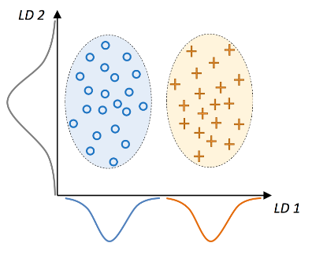
 
▣ 정의: 클래스 간 분산을 최대화하고 클래스 내 분산을 최소화하는 선형 차원 축소 기법으로 주로 지도 학습에서 사용 
▣ 필요성: 클래스 간 분리를 극대화하면서 데이터를 저차원으로 투영하여 분류 문제의 성능을 향상시키기 위해 필요 
▣ 장점: 클래스 분리를 극대화하여 분류 성능을 개선할 수 있으며, 선형 변환을 통해 효율적으로 차원을 축소 
▣ 단점: 데이터가 선형적으로 구분되지 않는 경우 성능이 저하될 수 있으며, 클래스 간 분포가 정규 분포를 따를 때 더 효과적 
▣ 응용분야: 얼굴 인식, 이미지 분류, 텍스트 분류 등 
▣ 모델식: 두 클래스 간의 분산 비율을 최대화하는 방향으로 데이터를 투영 

    from sklearn.discriminant_analysis import LinearDiscriminantAnalysis
    import matplotlib.pyplot as plt
    from sklearn.datasets import load_iris

    # 데이터 로드
    data = load_iris()
    X = data.data
    y = data.target

    # LDA 적용
    lda = LinearDiscriminantAnalysis(n_components=2)
    X_lda = lda.fit_transform(X, y)

    # 결과 시각화
    plt.scatter(X_lda[:, 0], X_lda[:, 1], c=y)
    plt.xlabel("LDA Component 1")
    plt.ylabel("LDA Component 2")
    plt.title("LDA on Iris Dataset")
    plt.colorbar()
    plt.show()

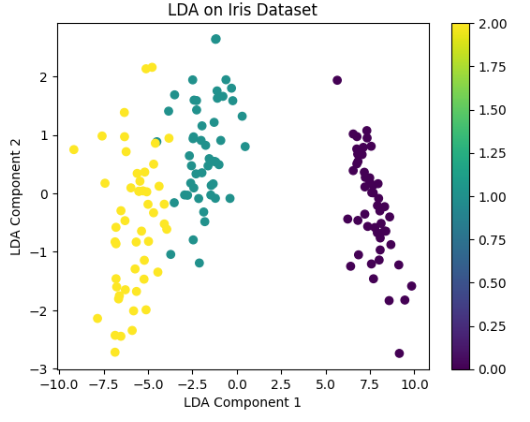
  
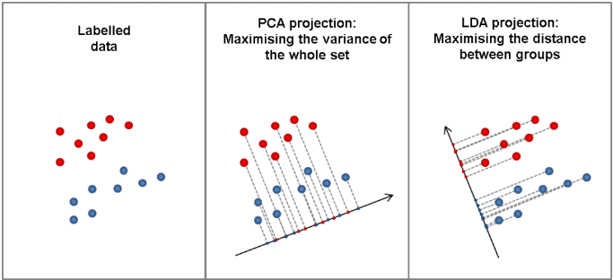
 
https://nirpyresearch.com/classification-nir-spectra-linear-discriminant-analysis-python/
 

# [DR-5] NMF(Non-negative Matrix Factorization) : 비음수 행렬 분해
▣ 정의 : 데이터를 비음수 행렬로 나타내고 이를 두 개의 비음수 행렬의 곱으로 분해하는 행렬 분해(Matrix Factorization) 기법 
▣ 필요성 : 원본 데이터를 두 개의 비음수(예: 픽셀 값, 주파수 스펙트럼, 사용자 평가 점수 등) 행렬의 곱으로 분해함으로써 비음수 데이터를 압축적으로 표현하여 중요한 구조적 특징을 발견 
▣ 장점 : 모든 요소가 비음수이므로 결과를 직관적으로 해석, 데이터의 저차원 표현을 효과적으로 학습하며, 각 데이터의 기여 요소를 명확히 구분 
▣ 단점 : 초기화 민감성, 복잡한 비선형 데이터 표현에는 부적합, 비음수 제약으로 인해 제한된 표현력, 결과의 불확실성 
▣ 응용분야 : 얼굴 인식에서 이미지 구성 요소 추출, 텍스트 마이닝, 음원 분리 및 잡음 제거, 추천 시스템, 유전자 발현 데이터의 특징 추출 및 해석 
(참고) https://angeloyeo.github.io/2020/10/15/NMF.html 

	from sklearn.decomposition import NMF
	import numpy as np
	import matplotlib.pyplot as plt
	
	# 1. 데이터 생성 (예: 문서-단어 행렬)
	V = np.array([[1, 2, 3],
	              [4, 5, 6],
	              [7, 8, 9]])
	
	# 2. NMF 모델 설정 및 학습
	model = NMF(n_components=2, init='random', random_state=42)
	W = model.fit_transform(V)
	H = model.components_
	
	# 3. 근사 행렬 계산
	V_approx = np.dot(W, H)
	
	# 4. 시각화
	fig, axs = plt.subplots(2, 2, figsize=(12, 10))
	
	# 원본 데이터 시각화
	axs[0, 0].imshow(V, cmap='viridis', aspect='auto')
	axs[0, 0].set_title("원본 행렬 (V)")
	axs[0, 0].set_xticks(range(V.shape[1]))
	axs[0, 0].set_yticks(range(V.shape[0]))
	
	# 근사 행렬 시각화
	axs[0, 1].imshow(V_approx, cmap='viridis', aspect='auto')
	axs[0, 1].set_title("근사 행렬 (V_approx)")
	axs[0, 1].set_xticks(range(V_approx.shape[1]))
	axs[0, 1].set_yticks(range(V_approx.shape[0]))
	
	# 기저 행렬 (W) 시각화
	axs[1, 0].imshow(W, cmap='viridis', aspect='auto')
	axs[1, 0].set_title("기저 행렬 (W)")
	axs[1, 0].set_xticks(range(W.shape[1]))
	axs[1, 0].set_yticks(range(W.shape[0]))
	
	# 계수 행렬 (H) 시각화
	axs[1, 1].imshow(H, cmap='viridis', aspect='auto')
	axs[1, 1].set_title("계수 행렬 (H)")
	axs[1, 1].set_xticks(range(H.shape[1]))
	axs[1, 1].set_yticks(range(H.shape[0]))
	
	# 레이아웃 정리
	plt.tight_layout()
	plt.show()
	
	# 5. 출력 결과
	print("원본 행렬 (V):")
	print(V)
	
	print("\n기저 행렬 (W):")
	print(W)
	
	print("\n계수 행렬 (H):")
	print(H)
	
	print("\n근사 행렬 (V_approx):")
	print(V_approx)
	
 

	원본 행렬 (V): 원래의 데이터 행렬로, NMF를 수행하기 전에 입력된 값
	[[1 2 3]
 	[4 5 6]
 	[7 8 9]]

	기저 행렬 (W): 행렬 𝑉의 행(데이터 포인트)을 저차원 잠재 공간에서 표현
	[[2.41498468 0.        ]
 	[4.83219981 0.36423119]
 	[7.24871414 0.72880911]]

	계수 행렬 (H): 각 열(특성)을 잠재 변수의 조합으로 표현
	[[0.41443612 0.82883423 1.24166579]
 	[5.48294704 2.73290582 0.        ]]

	근사 행렬 (V_approx): NMF를 통해 원본 행렬 𝑉를 근사한 결과
	[[1.00085688 2.00162196 2.99860386]
 	[3.99969848 5.00050215 5.99997718]
 	[7.00015069 7.99974905 9.00048035]]
 

$𝑉[0,0]=1, 𝑉_{approx}[0,0] = 1.00085688$ : 오차는 약 0.0009 
$𝑉[1,2]=6, 𝑉_{approx}[1,2]=5.99997718$ : 오차는 약 0.00002 

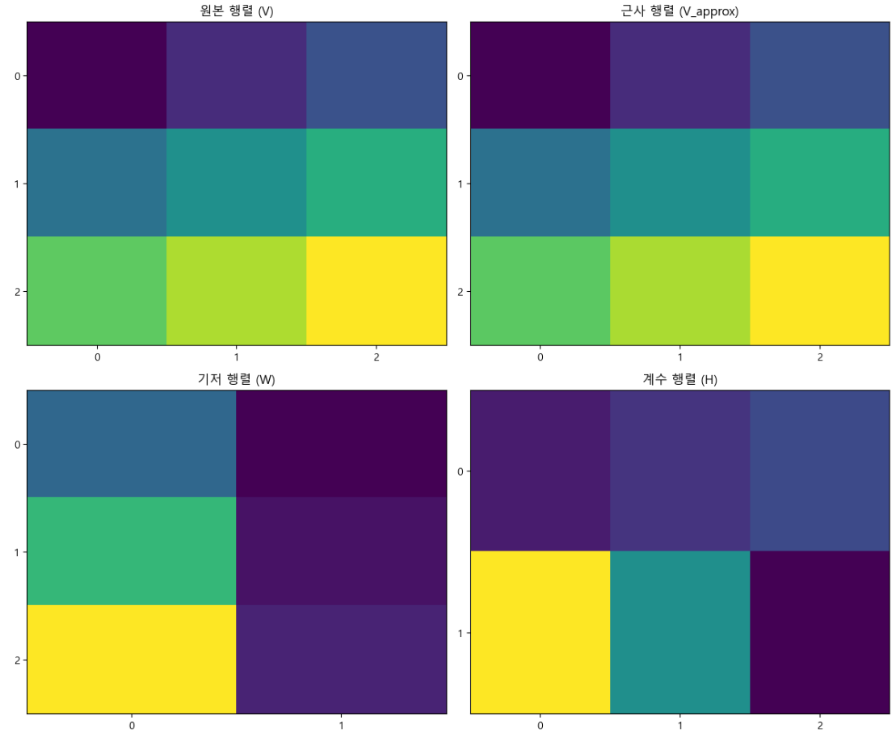
  
원본 행렬 (𝑉)의 크기: 3×3 → 𝑚=3, 𝑛=3 (데이터 포인트 3개, 특성 3개) 
기저 행렬 (𝑊)의 크기: 3×2 → 𝑚=3, 𝑘=2 (3개의 데이터 포인트를 2개의 잠재 요인으로 표현) 
계수 행렬 (𝐻)의 크기: 2×3 → 𝑘=2, 𝑛=3 (2개의 잠재 요인을 3개의 특성으로 표현) 
 

# [DR-6] t-SNE(t-distributed Stochastic Neighbor Embedding) : t-분포 확률적 이웃 임베딩
▣ 정의: 고차원 데이터의 국소 구조를 잘 보존하여 저차원으로 투영하는 비선형 차원 축소 알고리즘 
▣ 필요성: 데이터의 클러스터 구조를 유지한 채 저차원으로 투영하여 데이터 간의 관계를 시각적으로 파악하기 위해 사용 
▣ 장점 : 고차원 데이터의 군집 구조를 잘 반영하여 데이터의 숨겨진 패턴을 시각적으로 잘 드러내고, 비선형 구조를 가진 데이터에서도 효과적으로 작동 
▣ 단점 : 데이터 포인트 수가 많아질수록 계산 시간이 급격히 증가하고, 초기 매개변수(예: σ 값 및 학습률)에 민감하게 반응  
▣ 응용 분야 : 이미지 데이터, 텍스트 데이터, 유전자 표현 데이터 등의 시각화, 클러스터링 분석, 데이터 전처리, 신경망 모델의 중간 출력을 시각화 
▣ 모델식: 고차원 데이터의 유사도와 저차원 데이터의 유사도 분포를 맞추기 위해 코스트 함수 𝐾𝐿(𝑝∥𝑞)를 최소화 

 

    import matplotlib.pyplot as plt
    from sklearn.manifold import TSNE
    from sklearn.datasets import load_iris

    # 데이터 로드
    data = load_iris()
    X = data.data

    # t-SNE 적용
    tsne = TSNE(n_components=2, random_state=42)
    X_tsne = tsne.fit_transform(X)

    # 결과 시각화
    plt.scatter(X_tsne[:, 0], X_tsne[:, 1], c=data.target)
    plt.xlabel("t-SNE Component 1")
    plt.ylabel("t-SNE Component 2")
    plt.title("t-SNE on Iris Dataset")
    plt.colorbar()
    plt.show()

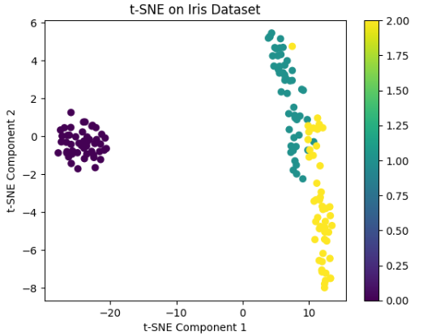
 

# [DR-7] UMAP(Uniform Manifold Approximation and Projection) : 균일 매니폴드 근사적 사영
▣ 정의: 데이터의 국소 구조와 전역 구조를 동시에 보존하면서 저차원으로 투영하는 비선형 차원 축소 알고리즘 
▣ 필요성: 고차원 데이터를 저차원에서 시각화하면서 데이터의 전체적 및 국소적 관계를 동시에 보존하기 위해 사용 
▣ 장점: t-SNE보다 계산이 빠르고, 대규모 데이터에서도 잘 작동, 데이터의 전역적 및 국소적 구조를 동시에 보존 
▣ 단점: 일부 매개변수 조정이 필요하며, 결과가 매개변수에 민감할 수 있음 
▣ 응용분야: 대용량 데이터 시각화, 생물정보학, 텍스트 분석 등 
▣ 모델식: 이론적으로는 리만 거리와 초구 면적 개념을 이용하여 데이터의 근접성을 유지하면서 고차원에서 저차원으로 투영 

    !pip install umap-learn
    import umap
    import matplotlib.pyplot as plt
    from sklearn.datasets import load_iris

    # 데이터 로드
    data = load_iris()
    X = data.data

    # UMAP 적용
    umap_model = umap.UMAP(n_components=2, random_state=42)
    X_umap = umap_model.fit_transform(X)

    # 결과 시각화
    plt.scatter(X_umap[:, 0], X_umap[:, 1], c=data.target)
    plt.xlabel("UMAP Component 1")
    plt.ylabel("UMAP Component 2")
    plt.title("UMAP on Iris Dataset")
    plt.colorbar()
    plt.show()

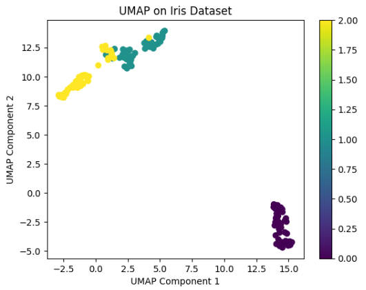
 

# [DR-8] Isomap : 등거리 매핑
▣ 정의: 데이터의 기하학적 구조를 보존하여 고차원 데이터를 저차원으로 투영하는 비선형 차원 축소 기법 
▣ 필요성: 비선형적인 데이터 구조를 저차원에서도 유지하며 시각화할 때 유용 
▣ 장점: 고차원 데이터의 매니폴드(저차원 다양체) 구조를 잘 보존하며, 국소적인 거리 정보를 기반으로 데이터의 구조를 유지 
▣ 단점: 데이터가 고차원에서 매니폴드 구조를 형성하지 않는 경우 효과적이지 않으며, 계산 비용이 높아 대용량 데이터에는 부적합 
▣ 응용분야: 시각화, 이미지 및 텍스트 데이터 분석, 생물정보학 
▣ 모델식: 근접 그래프와 다차원 척도를 결합하여 비선형 구조를 보존 

    from sklearn.manifold import Isomap
    import matplotlib.pyplot as plt
    from sklearn.datasets import load_iris

    # 데이터 로드
    data = load_iris()
    X = data.data

    # Isomap 적용
    isomap = Isomap(n_components=2)
    X_isomap = isomap.fit_transform(X)

    # 결과 시각화
    plt.scatter(X_isomap[:, 0], X_isomap[:, 1], c=data.target)
    plt.xlabel("Isomap Component 1")
    plt.ylabel("Isomap Component 2")
    plt.title("Isomap on Iris Dataset")
    plt.colorbar()
    plt.show()

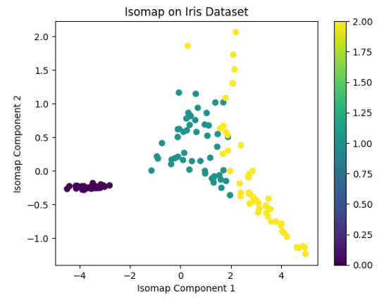
 

# [DR-9] MDS(Multidimensional Scaling) : 다차원 척도
▣ 정의: MDS는 고차원 데이터 포인트 간의 거리를 보존하며 저차원으로 투영하는 차원 축소 기법 
▣ 필요성: 데이터의 유사성 또는 거리 정보를 저차원에서도 유지하여 시각화하기 위해 사용 
▣ 장점: 거리 정보를 보존하므로 데이터의 기하학적 관계를 잘 유지하며, 비선형 구조를 일부 보존 
▣ 단점: 계산 비용이 높고, 대용량 데이터에는 적합하지 않으며, 초기화에 민감하여 결과가 다를 수 있음 
▣ 응용분야: 심리학, 생물정보학, 마케팅 데이터 분석 등 
▣ 모델식: 데이터 포인트 간의 거리 행렬을 유지하며 저차원에서 구성 

    from sklearn.manifold import MDS
    import matplotlib.pyplot as plt
    from sklearn.datasets import load_iris

    # 데이터 로드
    data = load_iris()
    X = data.data

    # MDS 적용
    mds = MDS(n_components=2, random_state=42)
    X_mds = mds.fit_transform(X)

    # 결과 시각화
    plt.scatter(X_mds[:, 0], X_mds[:, 1], c=data.target)
    plt.xlabel("MDS Component 1")
    plt.ylabel("MDS Component 2")
    plt.title("MDS on Iris Dataset")
    plt.colorbar()
    plt.show()

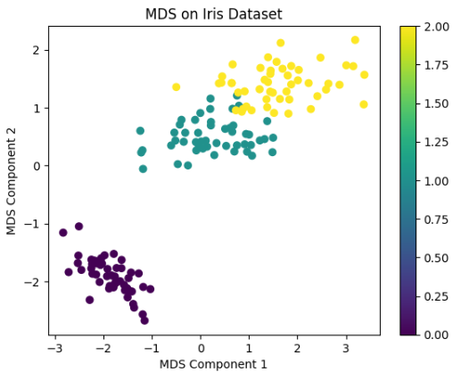
 

# [DR-10] SOM(Self-Organizing Maps) : 자기 조직화
▣ 정의 : 고차원의 데이터를 저차원(일반적으로 2차원) 공간으로 투영하여 데이터의 구조를 시각화하는 데 사용. PCA는 선형 변환을 통해 차원 축소를 수행하지만, SOM은 비선형 변환을 사용하여 더 복잡한 데이터 구조를 반영할 수 있으며, k-평균은 각 군집의 중심을 찾는 방식으로 군집화를 수행하는 반면, SOM은 뉴런이 격자 형태로 조직되어 있어 더 직관적인 시각화가 가능  
▣ 절차
(1) 초기화: SOM의 각 뉴런에 임의의 가중치 벡터를 할당(이 가중치 벡터는 입력 데이터와 같은 차원) 
(2) 입력 데이터 선택: 학습 과정에서 입력 데이터 벡터 하나를 무작위로 선택 
(3) 승자 뉴런(BMU, Best Matching Unit) 찾기: SOM의 모든 뉴런 중에서 현재 입력 벡터와 가장 유사한(가중치 벡터 간의 유클리드 거리로 측정) 뉴런을 찾는 경쟁 학습의 핵심 단계 
(4) 가중치 벡터 갱신: 선택된 승자 뉴런과 그 주변 이웃 뉴런들의 가중치 벡터를 조정한다. 이때, 가중치 벡터는 입력 데이터에 더 가깝게 이동  
▣ 장점 : 데이터에 대한 사전 정보가 없어도 유용하게 사용 가능, 군집의 분포나 데이터의 경향성을 직관적으로 이해, 입력 데이터의 이웃 관계를 보존하면서 저차원으로 투영하므로 원래 데이터의 공간적 관계를 유지  
▣ 단점 : 학습률과 이웃 크기 등 여러 파라미터를 적절히 설정해야 하며, 대규모 데이터 학습에 비효율적, 변환된 맵을 해석하는 것이 PCA 등의 선형 변환보다 더 어려움  
▣ 응용분야 : 이미지 분석, 문서 분류, 음성 인식, 생물정보학 
▣ 모델식 : 뉴런의 위치 𝑟와 입력 벡터 𝑥 간의 거리 함수로 클러스터를 형성(𝜂(𝑡)는 학습률, ℎ(𝑡)는 이웃 함수) 
$W(t+1)=W(t)+\theta(t)\cdot\eta(t)\cdot(X-W(t))$ 

    !pip install minisom

    from minisom import MiniSom
    import numpy as np
    import matplotlib.pyplot as plt
    from sklearn.datasets import load_iris
    from sklearn.preprocessing import MinMaxScaler

    # 데이터 로드 및 정규화
    data = load_iris()
    X = data.data
    scaler = MinMaxScaler()
    X_scaled = scaler.fit_transform(X)

    # SOM 초기화 및 학습
    som = MiniSom(x=10, y=10, input_len=4, sigma=1.0, learning_rate=0.5, random_seed=42)
    som.train_random(X_scaled, 100)  # 100회 반복 학습

    # SOM 시각화
    plt.figure(figsize=(10, 10))
    for i, x in enumerate(X_scaled):
        w = som.winner(x)
        plt.text(w[0] + 0.5, w[1] + 0.5, str(data.target[i]),
        color=plt.cm.rainbow(data.target[i] / 2.0),
        fontdict={'weight': 'bold', 'size': 11})

    plt.title("SOM Clustering of Iris Data")
    plt.xlim([0, 10])
    plt.ylim([0, 10])
    plt.grid()
    plt.show()

  

---
## [차원 축소 알고리즘 평가방법]

**▣ 재구성 오류(Reconstruction Error) :** 차원 축소된 데이터를 원본 차원으로 복원하여 복원된 데이터와 원본 데이터 간의 평균 제곱 오차(MSE)를 통해 재구성 오류를 계산 

    from sklearn.datasets import load_iris
    from sklearn.decomposition import PCA
    from sklearn.metrics import mean_squared_error

    # 데이터 로드 : Iris 데이터셋을 로드하여 입력 데이터(X)를 준비
    data = load_iris()
    X = data.data  # 입력 데이터 (특성)

    # PCA를 사용하여 주성분 개수를 2개로 설정하여 데이터를 2차원으로 축소
    pca = PCA(n_components=2)
    X_reduced = pca.fit_transform(X)  # 차원 축소된 데이터

    # 재구성 오류 계산 : 차원 축소된 데이터를 원래 차원으로 복원하고 원본 데이터와의 평균 제곱 오차(MSE)를 계산
    X_reconstructed = pca.inverse_transform(X_reduced)  # 차원 축소 후 복원된 데이터
    reconstruction_error = mean_squared_error(X, X_reconstructed)  # 재구성 오류 계산
    print(f"Reconstruction Error (MSE): {reconstruction_error:.3f}")

 

**▣ 분산 유지율(Explained Variance Ratio) :** 각 주성분이 설명하는 분산 비율을 통해 데이터의 정보 손실 정도를 파악

    from sklearn.datasets import load_iris
    from sklearn.decomposition import PCA

    # 데이터 로드 : Iris 데이터셋을 로드하여 입력 데이터(X)를 준비합니다.
    data = load_iris()
    X = data.data  # 입력 데이터 (특성)

    # PCA를 사용하여 주성분 개수를 2개로 설정하여 데이터를 2차원으로 축소
    pca = PCA(n_components=2)
    pca.fit(X)  # PCA 학습

    # 분산 유지율 계산 : 각 주성분이 데이터의 분산을 얼마나 설명하는지 비율로 확인
    explained_variance_ratio = pca.explained_variance_ratio_
    print(f"Explained Variance Ratio per Component: {explained_variance_ratio}")
    print(f"Total Variance Retained: {sum(explained_variance_ratio):.3f}")  # 전체 분산 유지율

 

**▣ 상호 정보량(Mutual Information) :** 차원 축소 전후 데이터의 정보량을 비교

    from sklearn.datasets import load_iris
    from sklearn.decomposition import PCA
    from sklearn.cluster import KMeans
    from sklearn.metrics import adjusted_mutual_info_score, normalized_mutual_info_score

    # 데이터 로드 : Iris 데이터셋을 로드하여 입력 데이터(X)와 실제 레이블(y_true)를 준비
    data = load_iris()
    X = data.data         # 입력 데이터 (특성)
    y_true = data.target  # 실제 레이블 (클러스터링 평가 시 사용)

    # PCA를 사용하여 주성분 개수를 2개로 설정하여 데이터를 2차원으로 축소
    pca = PCA(n_components=2)
    X_reduced = pca.fit_transform(X)  # 차원 축소된 데이터

    # KMeans를 사용하여 차원 축소된 데이터에서 클러스터링을 수행 : 클러스터 개수를 3으로 설정하여 실제 클래스 수와 맞추기
    kmeans = KMeans(n_clusters=3, random_state=42)
    y_pred = kmeans.fit_predict(X_reduced)  # 클러스터링 예측 레이블

    # 4. 상호 정보량 계산
    # (1) Adjusted Mutual Information (AMI) : 실제 레이블(y_true)과 클러스터링 예측 레이블(y_pred) 간의 유사도를 측정
    ami = adjusted_mutual_info_score(y_true, y_pred)
    print(f"Adjusted Mutual Information (AMI): {ami:.3f}")

    # (2) Normalized Mutual Information (NMI) : 실제 레이블과 예측 레이블 간의 상호 정보량을 정규화하여 측정
    nmi = normalized_mutual_info_score(y_true, y_pred)
    print(f"Normalized Mutual Information (NMI): {nmi:.3f}")

 

**▣ 군집 평가 지표 :** 차원 축소 후 클러스터링을 수행하고 군집 평가 지표를 계산하여 차원 축소의 성능을 평가

    from sklearn.datasets import load_iris
    from sklearn.decomposition import PCA
    from sklearn.cluster import KMeans
    from sklearn.metrics import silhouette_score, davies_bouldin_score, adjusted_rand_score, normalized_mutual_info_score
    from sklearn.model_selection import train_test_split

    # 데이터 로드
    data = load_iris()
    X = data.data
    y_true = data.target  # 실제 레이블 (평가를 위해 사용)

    # PCA를 사용하여 차원 축소
    pca = PCA(n_components=2)
    X_reduced = pca.fit_transform(X)

    # KMeans를 사용하여 클러스터링 수행
    kmeans = KMeans(n_clusters=3, random_state=42)
    y_pred = kmeans.fit_predict(X_reduced)

    # 군집 평가 지표 계산
    # (1) Silhouette Score
    silhouette = silhouette_score(X_reduced, y_pred)
    print(f"Silhouette Score: {silhouette:.3f}")

    # (2) Davies-Bouldin Index (DBI) - 클러스터들이 얼마나 잘 분리되고 응집되어 있는지 평가(DBI가 낮을수록 클러스터링 품질이 더 좋음)
    davies_bouldin = davies_bouldin_score(X_reduced, y_pred)
    print(f"Davies-Bouldin Index: {davies_bouldin:.3f}")

    # (3) Adjusted Rand Index (ARI) - 실제 레이블과 예측 레이블 비교(클러스터링 결과와 실제 레이블 간의 일치도를 측정: 1에 가까울 수록 유사)
    ari = adjusted_rand_score(y_true, y_pred)
    print(f"Adjusted Rand Index (ARI): {ari:.3f}")

    # (4) Normalized Mutual Information (NMI) - 실제 레이블과 예측 레이블 비교(클러스터링 결과와 실제 레이블 간의 정보량의 공유 정도를 측정: 1에 가까울 수록 유사)
    nmi = normalized_mutual_info_score(y_true, y_pred)
    print(f"Normalized Mutual Information (NMI): {nmi:.3f}")

 

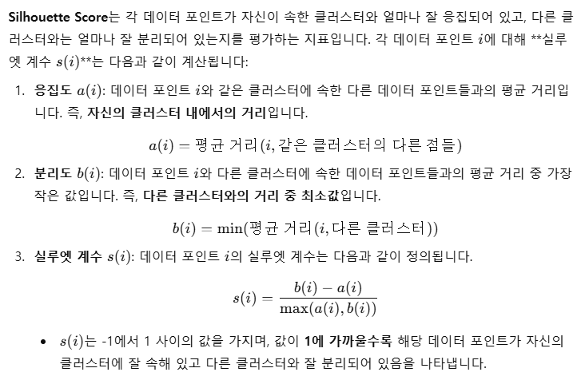

 

---

## [Q&A] t-SNE가 동심원 데이터셋을 제대로 분리하지 못하는 이유와 해결 방안
**이유** : t-SNE는 국소적 구조(Local Structure)를 보존하는 데 집중하므로 전역적 구조(Global Structure)를 놓치는 경우가 많은데, 동심원 데이터는 전역적 구조(원과 원 간의 거리)를 잘 반영해야 하기 때문에 문제가 발생 

**해결방안** 
(1) UMAP 사용: 국소적 구조와 전역적 구조를 동시에 보존 
(2) t-SNE 매개변수 튜닝: Perplexity, 학습률, 반복 횟수를 조정 
(3) PCA와 결합: 전역적 구조를 먼저 반영한 뒤 t-SNE 적용 
(4) 다른 차원 축소 기법: Kernel PCA, Spectral Embedding 등 사용 

	import os
	import matplotlib.pyplot as plt
	from matplotlib import font_manager, rc
	from sklearn.datasets import make_circles
	from sklearn.manifold import TSNE
	from sklearn.decomposition import PCA
	from umap import UMAP
	from sklearn.preprocessing import StandardScaler
	
	# Windows 환경에서 사용할 한글 폰트 설정
	font_path = 'C:/Windows/Fonts/malgun.ttf'  # Windows의 '맑은 고딕' 폰트 경로
	font_name = font_manager.FontProperties(fname=font_path).get_name()
	rc('font', family=font_name)
	
	# '-' 기호 깨짐 방지
	plt.rcParams['axes.unicode_minus'] = False
	
	# 1. 데이터 생성
	X, y = make_circles(n_samples=500, factor=0.5, noise=0.05, random_state=42)
	
	# 2. 기본 t-SNE
	tsne_basic = TSNE(n_components=2, random_state=42)
	X_tsne_basic = tsne_basic.fit_transform(X)
	
	# 2-1. UMAP 하이퍼파라미터 최적화 (기존 설정 최적화)
	umap_optimized = UMAP(n_neighbors=30, min_dist=0.05, n_components=2, random_state=42)
	X_umap_optimized = umap_optimized.fit_transform(X)
	
	# 2-2. UMAP 하이퍼파라미터 재조정 (표준화 데이터 적용)
	scaler = StandardScaler()
	X_scaled = scaler.fit_transform(X)  # 데이터 표준화
	umap_revised = UMAP(n_neighbors=20, min_dist=0.1, n_components=2, random_state=42)
	X_umap_revised = umap_revised.fit_transform(X_scaled)
	
	# 3. UMAP (기본 설정)
	umap = UMAP(n_neighbors=15, min_dist=0.1, n_components=2, random_state=42)
	X_umap = umap.fit_transform(X)
	
	# 4. t-SNE 매개변수 튜닝
	tsne_tuned = TSNE(n_components=2, perplexity=50, learning_rate=300, n_iter=5000, random_state=42)
	X_tsne_tuned = tsne_tuned.fit_transform(X)
	
	# 5. PCA + t-SNE
	pca = PCA(n_components=2)  # PCA로 차원 축소 (데이터의 차원 수 이하로 설정)
	X_pca = pca.fit_transform(X)
	tsne_pca = TSNE(n_components=2, perplexity=50, learning_rate=300, n_iter=5000, random_state=42)
	X_tsne_pca = tsne_pca.fit_transform(X_pca)
	
	# 6. 시각화
	fig, axs = plt.subplots(4, 2, figsize=(12, 20))
	
	# 원데이터 시각화
	axs[0, 0].scatter(X[:, 0], X[:, 1], c=y, cmap='viridis', s=10)
	axs[0, 0].set_title("원 데이터 (동심원)")
	
	# 기본 t-SNE
	axs[0, 1].scatter(X_tsne_basic[:, 0], X_tsne_basic[:, 1], c=y, cmap='viridis', s=10)
	axs[0, 1].set_title("기본 t-SNE")
	
	# UMAP (최적화: n_neighbors=30, min_dist=0.05)
	axs[1, 0].scatter(X_umap_optimized[:, 0], X_umap_optimized[:, 1], c=y, cmap='viridis', s=10)
	axs[1, 0].set_title("최적화된 UMAP (n_neighbors=30, min_dist=0.05)")
	
	# UMAP (재조정: n_neighbors=20, min_dist=0.1, 표준화 적용)
	axs[1, 1].scatter(X_umap_revised[:, 0], X_umap_revised[:, 1], c=y, cmap='viridis', s=10)
	axs[1, 1].set_title("UMAP (표준화, n_neighbors=20, min_dist=0.1)")
	
	# UMAP (기본 설정)
	axs[2, 0].scatter(X_umap[:, 0], X_umap[:, 1], c=y, cmap='viridis', s=10)
	axs[2, 0].set_title("UMAP (기본 설정)")
	
	# t-SNE 매개변수 튜닝
	axs[2, 1].scatter(X_tsne_tuned[:, 0], X_tsne_tuned[:, 1], c=y, cmap='viridis', s=10)
	axs[2, 1].set_title("t-SNE (매개변수 튜닝)")
	
	# PCA + t-SNE
	axs[3, 0].scatter(X_tsne_pca[:, 0], X_tsne_pca[:, 1], c=y, cmap='viridis', s=10)
	axs[3, 0].set_title("PCA + t-SNE")
	
	# 빈 플롯
	axs[3, 1].axis('off')  # 마지막 빈 플롯 제거
	
	# 레이아웃 정리
	plt.tight_layout()
	plt.show()
	
	# 7. 평가 출력 (한글로 번역)
	print("결과 분석:")
	print("1. 기본 t-SNE: 동심원의 전역 구조를 잘 보존하지 못할 수 있으며, 데이터 포인트가 섞여 나타날 가능성이 큽니다.")
	print("2. UMAP (최적화, n_neighbors=30, min_dist=0.05): 두 원의 분리가 명확하지 않으며, 전역 구조가 왜곡될 가능성이 있습니다.")
	print("3. UMAP (표준화, n_neighbors=20, min_dist=0.1): 표준화 적용으로 전역 및 국소 구조가 개선되었을 가능성이 큽니다.")
	print("4. UMAP (기본 설정): 두 원의 전역 구조 보존이 부족하며 왜곡이 발생할 수 있습니다.")
	print("5. t-SNE (매개변수 튜닝): 두 원의 전역 구조와 국소 구조를 잘 보존하며, 분리가 명확합니다.")
	print("6. PCA + t-SNE: 전역 구조와 국소 구조가 균형 있게 보존되며, 동심원의 구조를 명확히 표현합니다.")

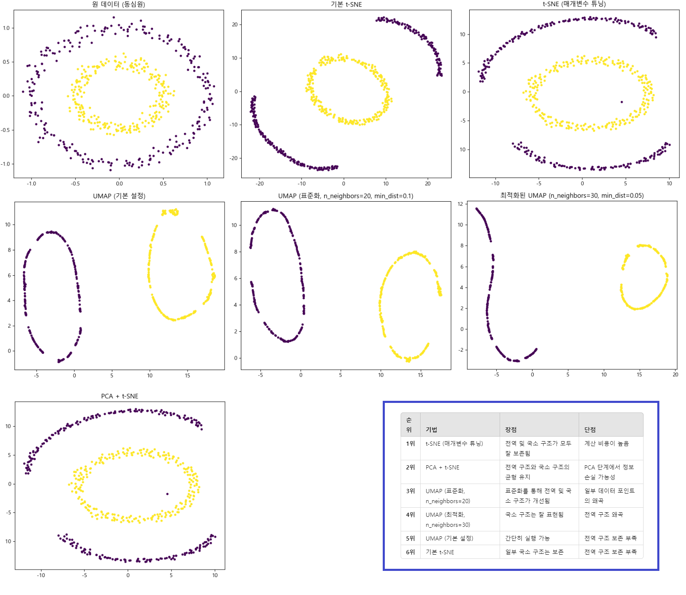

 

---

