#  06 : 비지도 학습(Unsupervised Learning, UL)
---
**1. 클러스터링 (Clustering)**  
**2. 연관 규칙 학습 (Association Rule Learning)**  
**3. 차원 축소 (Dimensionality Reduction)**  
**4. 이상치 탐지 (Anomaly/Outlier Detection)**  
**5. 밀도 추정 (Density Estimation)**  
**6. 신경망 기반 (Neural Network-based)**  
**7. 공분산 추정 (Covariance Estimation)**  
---
# 1. 클러스터링 (Clustering)
▣ 정의: 데이터 간의 유사성(Similarity)을 측정하여 비슷한 특성을 가진 데이터들끼리 그룹(군집)으로 묶는 기법. 
▣ 특징: 그룹의 수($K$)를 미리 정하거나 데이터 분포에 따라 자동으로 결정. 
▣ 대표 알고리즘: K-Means, DBSCAN, 계층적 군집 분석(Hierarchical Clustering). 
▣ 활용: 고객 세분화, 이미지 분할, 문서 분류. 
 
# 2. 연관 규칙 학습 (Association Rule Learning)
▣ 정의: 데이터셋 내의 변수들 간에 존재하는 관계(IF-THEN 규칙)를 발견하는 방법. 
▣ 특징: "A를 구매한 사람은 B도 구매한다"와 같은 항목 간의 공생 관계를 찾는다. 지지도(Support), 신뢰도(Confidence), 향상도(Lift) 지표를 사용. 
▣ 대표 알고리즘: Apriori, FP-Growth. 
▣ 활용: 장바구니 분석, 추천 시스템, 웹 로그 분석. 
 
# 3. 차원 축소 (Dimensionality Reduction)
▣ 정의: 고차원의 데이터를 정보 손실을 최소화하면서 저차원(2D, 3D 등)으로 변환하는 기법. 
▣ 특징: 변수가 너무 많아 발생하는 '차원의 저주'를 해결하고, 데이터 시각화 및 모델 성능 향상을 위해 사용. 
▣ 대표 알고리즘: PCA(주성분 분석), t-SNE, LDA. 
▣ 활용: 데이터 시각화, 노이즈 제거, 전처리. 
 
# 4. 이상치 탐지 (Anomaly/Outlier Detection)
▣ 정의: 대다수의 데이터와 비교했을 때 현저히 다른 특성을 보이는 드문 샘플을 찾아내는 기법. 
▣ 특징: '정상' 데이터의 패턴을 학습한 뒤, 이 패턴에서 벗어나는 데이터를 '이상치'로 판정. 
▣ 대표 알고리즘: Isolation Forest, Local Outlier Factor (LOF), One-Class SVM. 
▣ 활용: 금융 사기 탐지(FDS), 제조 공정 불량 탐지, 네트워크 침입 탐지. 
 
# 5. 밀도 추정 (Density Estimation)
▣ 정의: 데이터가 생성된 바탕이 되는 확률 밀도 함수(Probability Density Function)를 추정하는 기법. 
▣ 특징: 데이터가 특정 영역에 얼마나 집중되어 있는지를 수학적으로 모델링. 
▣ 대표 알고리즘: 가우시안 혼합 모델(GMM), 커널 밀도 추정(KDE). 
▣ 활용: 데이터 생성 모델링, 군집 분석의 기초 작업. 
 
# 6. 신경망 기반 (Neural Network-based)
▣ 정의: 딥러닝 구조를 활용하여 데이터의 복잡한 계층적 특징을 스스로 추출하는 방식. 
▣ 특징: 데이터를 압축했다가 복원하는 과정에서 핵심 특징(Latent Space)을 학습하거나, 데이터의 분포를 흉내 내는 가상의 데이터를 생성. 
▣ 대표 알고리즘: Autoencoder (AE), Generative Adversarial Networks (GAN). 
▣ 활용: 딥페이크, 이미지 복원, 특징 추출. 
 
# 7. 공분산 추정 (Covariance Estimation)
▣ 정의: 여러 변수 사이의 상관관계와 변동성을 나타내는 공분산 행렬을 데이터로부터 추정하는 기법. 
▣ 특징: 데이터 내 변수들이 서로 어떻게 연결되어 움직이는지 파악. 특히 데이터가 부족하거나 노이즈가 많을 때 안정적인 행렬을 얻는 것이 중요. 
▣ 대표 알고리즘: Ledoit-Wolf 추정, Graphical Lasso. 
▣ 활용: 포트폴리오 최적화(금융), 신호 처리, 마할라노비스 거리를 이용한 이상치 탐지 보조. 

---
# 1. 클러스터링 (Clustering)
**1.1 Partitioning-Based Clustering (분할 기반 클러스터링)**  
**1.2 Hierarchical Clustering (계층적 클러스터링)**  
**1.3 Density-Based Clustering (밀도 기반 클러스터링)**  
**1.4 Grid-Based Clustering (격자 기반 클러스터링)**  
**1.5 Model-Based Clustering (모델 기반 클러스터링)**  
**1.6 Graph/Spectral Clustering (그래프/스펙트럴 클러스터링)**  
**1.7 Subspace/Representation Clustering (부분공간/표현 기반 클러스터링)**  
---

## 1.1 Partitioning-Based Clustering (분할 기반 클러스터링)
▣ 정의: 데이터를 사전에 정해진 K개의 배타적인 집합으로 나누는 방식. 
▣ 특징: 계층적 방식과 달리 전체 구조를 한 번에 파악하며 계산 속도가 매우 빠름. 하지만 군집의 개수(K)를 사전에 지정해야 하며, 구형(Spherical)이 아닌 복잡한 형태의 군집 탐색에는 한계가 존재함. 
▣ 원리: 각 군집의 중심점(Centroid)을 설정하고 각 데이터를 가장 가까운 중심에 할당한 뒤, 할당된 데이터를 바탕으로 중심점을 반복적으로 갱신하여 최적의 위치를 탐색함. 
▣ 적용분야: 고객 세분화, 이미지 압축 등 데이터 분포가 비교적 균일하고 대용량인 경우에 주로 사용됨. 
<ins>[1.1.1] K-means (K-평균)</ins> 
<ins>[1.1.2] K-medoids (K-중앙점) : PAM(Partitioning Around Medoids),</ins> 
        <ins>CLARA(Clustering LARge Applications), CLARANS(Clustering Large Applications based on RANdomized Search)</ins> 
<ins>[1.1.3] K-modes (K-최빈값)</ins> 
<ins>[1.1.4] K-prototypes (K-프로토타입)</ins> 
<ins>[1.1.5] Mini-Batch K-means (미니배치 K-평균)</ins> 
<ins>[1.1.6] FCM (Fuzzy C-means) (퍼지 C-평균)</ins> 
[1.1.7] K-means++ (K-평균 ++) 
[1.1.8] PCM (Possibilistic C-means) (가능성 C-평균) 
[1.1.9] X-means (X-평균) 
[1.1.10] G-means (G-평균) 
 
## 1.2 Hierarchical Clustering (계층적 클러스터링)
▣ 정의: 데이터 간의 유사도를 바탕으로 나무 모양의 계층 구조(Dendrogram)를 형성하는 방식. 
▣ 특징: 분할 기반 방식과 달리 군집 수(K)를 사전에 정할 필요가 없으며 데이터 간의 상하 관계 파악이 용이함. 그러나 계산 복잡도가 높아 대규모 데이터셋 적용에는 무리가 있음. 
▣ 원리: 개별 데이터에서 시작해 유사한 것끼리 병합하는 상향식(Agglomerative) 또는 전체에서 시작해 나누어가는 하향식(Divisive) 방식으로 거리를 측정하여 계층을 형성함. 
▣ 적용분야: 생물 계통도 분석, 문헌 분류 등 데이터 간의 계층적 구조 파악이 중요한 연구 분야. 
<ins>[1.2.1] Agglomerative(Bottom-up)/Divisive(Top-down) Clustering  (병합적(상향식)/분할적(하향식) 클러스터링)</ins> 
<ins>[1.2.2] BIRCH (Balanced Iterative Reducing and Clustering using Hierarchies) (계층을 이용한 균형 반복 축소 클러스터링)</ins> 
<ins>[1.2.3] CURE (Clustering Using Representatives) (대표점 기반 클러스터링)</ins> 
<ins>[1.2.4] ROCK (Robust Clustering using Links) (링크 기반 강건 클러스터링)</ins> 
<ins>[1.2.5] Chameleon (카멜레온)</ins> 
<ins>[1.2.6] HDBSCAN (Hierarchical DBSCAN) (계층적 DBSCAN)</ins> 
[1.2.7] AGNES (AGglomerative NESting) (병합적 중첩) 
[1.2.8] DIANA (DIvisive ANAlysis) (분할적 분석) 
 
## 1.3 Density-Based Clustering (밀도 기반 클러스터링)
▣ 정의: 데이터가 밀집된 영역을 군집으로 간주하고, 밀도가 낮은 영역을 경계나 노이즈로 구분하는 방식. 
▣ 특징: 분할 기반 방식이 찾지 못하는 기하학적이고 복잡한 형태의 군집을 탐색 가능함. 또한 이상치(Outlier)를 노이즈로 간주하여 효과적으로 제거할 수 있는 장점이 있음. 
▣ 원리: 특정 반경 내에 최소 데이터 개수가 포함되는지 확인하여 밀집 지역을 정의하고, 이를 연결하여 군집을 확장해 나감. 
▣ 적용분야: 지리 정보 시스템(GIS) 데이터 분석, 천체 관측 데이터, 노이즈가 많은 센서 데이터 분석. 
<ins>[1.3.1] DBSCAN (Density-Based Spatial Clustering of Applications with Noise) (잡음을 포함한 밀도 기반 공간 클러스터링)</ins> 
<ins>[1.3.2] OPTICS (Ordering Points To Identify the Clustering Structure) (클러스터 구조 식별을 위한 점 순서화)</ins> 
<ins>[1.3.3] DENCLUE (DENsity-based CLUstEring) (밀도 기반 클러스터링)</ins> 
<ins>[1.3.4] Mean-Shift Clustering (평균 이동 클러스터링)</ins> 
<ins>[1.3.5] DPC (Density Peaks Clustering) (밀도 봉우리 클러스터링)</ins> 
[1.3.6] VDBSCAN (Varied Density DBSCAN) (가변 밀도 DBSCAN) 
[1.3.7] ST-DBSCAN (Spatial-Temporal DBSCAN) (시공간 DBSCAN) 
[1.3.8] ADBSCAN (Adaptive DBSCAN) (적응형 DBSCAN) 
 
## 1.4 Grid-Based Clustering (격자 기반 클러스터링)
▣ 정의: 데이터 공간을 유한한 수의 격자(Grid) 셀 구조로 분할하여 군집화를 수행하는 방식. 
▣ 특징: 연산 속도가 데이터 포인트의 개수가 아닌 격자의 개수에 의존하므로, 다른 방식들에 비해 데이터 양에 관계없이 처리 속도가 매우 빠름. 
▣ 원리: 다차원 공간을 격자로 나누고 각 격자 내 데이터의 통계 정보를 수집한 뒤, 밀도가 높은 인접 격자들을 병합하여 군집을 형성함. 
▣ 적용분야: 대규모 다차원 공간 데이터베이스 분석, 실시간 스트리밍 데이터 처리. 
<ins>[1.4.1] WaveCluster (웨이브 클러스터)</ins> 
<ins>[1.4.2] STING (STatistical INformation Grid) (통계 정보 격자)</ins> 
<ins>[1.4.3] CLIQUE (CLustering In QUEst) (탐색 기반 클러스터링)</ins> 
<ins>[1.4.4] OptiGrid (최적 격자)</ins> 
<ins>[1.4.5] MAFIA (Merging of Adaptive Finite Intervals) (적응적 유한 구간 병합)</ins> 
[1.4.6] GridClus (격자 클러스터) 
 
## 1.5 Model-Based Clustering (모델 기반 클러스터링)
▣ 정의: 데이터가 특정한 확률 분포(주로 가우시안 분포)들의 혼합으로 생성되었다고 가정하고 이를 추정하는 방식. 
▣ 특징: 데이터를 특정 군집에 확정적으로 할당하는 대신, 속할 확률을 계산하는 소프트 클러스터링(Soft Clustering)이 가능함. 수학적 근거가 명확하지만 초기 모델 설정이 중요함. 
▣ 원리: 확률 모델(예: GMM)의 파라미터를 최댓값으로 만드는 EM(Expectation-Maximization) 알고리즘을 통해 데이터 분포의 최적 파라미터를 도출함. 
▣ 적용분야: 불확실성이 포함된 고객 성향 분석, 텍스트 문서의 주제 분포 모델링. 
<ins>[1.5.1] GMM (Gaussian Mixture Model) (가우시안 혼합 모델), EM (Expectation-Maximization) (기대값 최대화 알고리즘)</ins> 
<ins>[1.5.2] COBWEB (코브웹)</ins> 
<ins>[1.5.3] CLASSIT (Classification Incremental Learning System) (분류 증분 학습 시스템)</ins> 
<ins>[1.5.4] LDA (Latent Dirichlet Allocation) for Clustering (클러스터링을 위한 잠재 디리클레 할당)</ins> 
[1.5.5] VBGM (Variational Bayesian Gaussian Mixture) (변분 베이지안 가우시안 혼합) 
[1.5.6] Bayesian Hierarchical Clustering (베이지안 계층적 클러스터링) 
[1.5.7] Mixture of von Mises-Fisher Distributions (폰 미제스-피셔 분포 혼합) 
 
## 1.6 Graph/Spectral Clustering (그래프/스펙트럴 클러스터링)
▣ 정의: 데이터 간의 관계를 그래프로 표현하고, 행렬의 고유값(Eigenvalue) 성질을 이용하여 군집화하는 방식. 
▣ 특징: 데이터 공간의 전역적 구조를 파악하는 데 유리하며, 비선형적인 구조를 가진 데이터도 저차원으로 투영하여 효과적으로 분리 가능함. 
▣ 원리: 데이터 간 유사도 행렬을 생성하고 라플라시안 행렬(Laplacian Matrix)의 고유벡터를 추출하여 차원을 축소한 뒤, 축소된 공간에서 기존 클러스터링 기법을 적용함. 
▣ 적용분야: 사회 관계망 서비스(SNS) 커뮤니티 탐지, 화합물 구조 분석, 뇌 네트워크 연결성 분석. 
<ins>[1.6.1] Spectral Clustering (Normalized Cuts) (스펙트럴 클러스터링, 정규화 컷)</ins> 
<ins>[1.6.2] Affinity Propagation (친화도 전파)</ins> 
<ins>[1.6.3] MCL (Markov Clustering Algorithm) (마르코프 클러스터링 알고리즘)</ins> 
<ins>[1.6.4] Louvain Algorithm (루뱅 알고리즘), Leiden Algorithm (라이덴 알고리즘)</ins> 
[1.6.5] Ratio Cuts (비율 컷) 
[1.6.6] Shi-Malik Algorithm (시-말릭 알고리즘) 
[1.6.7] Ng-Jordan-Weiss Algorithm (응-조던-와이스 알고리즘) 
[1.6.8] Girvan-Newman Algorithm (거반-뉴먼 알고리즘) 
[1.6.9] Infomap (인포맵) 
 
## 1.7 Subspace/Representation Clustering (부분공간/표현 기반 클러스터링)
▣ 정의: 전체 차원이 아닌 특정 부분공간(Subspace)이나 학습된 잠재 표현 공간에서 군집을 찾는 방식. 
▣ 특징: 고차원 데이터에서 발생하는 '차원의 저주' 문제를 극복하기 위해 설계됨. 특정 변수 조합에서만 나타나는 군집을 탐색할 수 있음. 
▣ 원리: 차원 축소와 군집화를 동시에 수행하거나, 데이터의 희소 표현(Sparse Representation)을 학습하여 유사한 특성을 공유하는 공간을 식별함. 
▣ 적용분야: 고차원 유전자 데이터 분석, 딥러닝 기반 이미지 표현 군집화. 
<ins>[1.7.1] PROCLUS (PROjected CLUStering) (투영 클러스터링)</ins> 
<ins>[1.7.2] ORCLUS (ORiented projected CLUStering) (방향성 투영 클러스터링)</ins> 
<ins>[1.7.3] SUBCLU (SUBspace CLUstering) (부분공간 클러스터링)</ins> 
[1.7.4] FIRES (FIlter REfinement Subspace clustering) (필터 정제 부분공간 클러스터링) 
[1.7.5] PreDeCon (Preference weighted DEnsity CONnected clustering) (선호도 가중 밀도 연결 클러스터링) 
[1.7.6] P3C (Probabilistic and Projected Clustering) (확률적 투영 클러스터링) 
[1.7.7] LRR (Low-Rank Representation) (저계수 표현) 
[1.7.8] EnSC (Elastic Net Subspace Clustering) (엘라스틱 넷 부분 공간 군집화) 
[1.7.9] Spectral Co-Clustering (스펙트럴 동시 클러스터링) 
[1.7.10] Spectral Biclustering (스펙트럴 이중 클러스터링) 
[1.7.11] Cheng and Church Algorithm (청-처치 알고리즘) 
[1.7.12] ISA (Iterative Signature Algorithm) (반복 서명 알고리즘) 
[1.7.13] OPSM (Order-Preserving Submatrix) (순서 보존 부분행렬) 
[1.7.14] Plaid Model (플래드 모델) 
[1.7.15] xMOTIFs (확장 모티프) 
[1.7.16] Bimax (바이맥스) 
[1.7.17] FABIA (Factor Analysis for Bicluster Acquisition) (바이클러스터 획득을 위한 요인 분석) 
 

---
# 2. 연관 규칙 학습 (Association Rule Learning)
**2.1 Frequent Pattern Mining (빈발 패턴 마이닝)**  
**2.2 Advanced Pattern Mining (고급 패턴 마이닝)**  
**2.3 Sequential Pattern Mining (시퀀스 패턴 마이닝)**  
**2.4 Specialized Pattern Mining (특수 패턴 마이닝)**  
---

## 2.1 Frequent Pattern Mining (빈발 패턴 마이닝)
▣ 정의: 데이터베이스에서 설정된 최소 지지도(Minimum Support) 이상의 빈도로 발생하는 아이템 집합을 찾아내는 가장 기초적인 마이닝 방식. 
▣ 특징: 연관 규칙 학습의 모태가 되는 분야로, 이후 등장하는 고급(2.2)이나 시퀀스(2.3) 마이닝의 기반 기술로 활용됨. 데이터 간의 발생 순서보다는 '함께 발생하는 조합' 자체에 집중함. 
▣ 원리: 전체 데이터셋을 스캔하여 각 아이템의 빈도를 계산하고, 지지도 임계값을 넘지 못하는 조합을 후보군에서 제거(Pruning)하며 유의미한 패턴을 확장함. 
▣ 적용분야: 대형 마트의 장바구니 분석(Market Basket Analysis), 동시 구매 상품 추천, 단순 아이템 연관성 파악. 
<ins>[2.1.1] Apriori Algorithm (선험적 알고리즘)</ins> 
<ins>[2.1.2] FP-Growth (Frequent Pattern Growth) (빈발 패턴 성장)</ins> 
<ins>[2.1.3] Eclat (Equivalence Class Transformation) (동등 클래스 변환)</ins> 
[2.1.4] FP-Tree Construction (FP-트리 구성) 
[2.1.5] SPADE (Sequential Pattern Discovery using Equivalence classes) (동등 클래스를 이용한 순차 패턴 발견) 
[2.1.6] dEclat (Diffset Eclat) (차집합 Eclat) 
[2.1.7] H-Mine (Hyper-structure Mining) (하이퍼구조 마이닝) 
[2.1.8] LCM (Linear time Closed itemset Miner) (선형 시간 폐쇄 항목집합 마이너) 
 
## 2.2 Advanced Pattern Mining (고급 패턴 마이닝)
▣ 정의: 기본적인 빈발 패턴 탐색을 넘어 데이터의 계층 구조, 다차원 속성, 또는 양적 속성을 반영하여 더 정교한 규칙을 추출하는 방식. 
▣ 특징: 단순 아이템 조합만 보는 기본 알고리즘(2.1)과 달리 데이터의 속성(시간, 장소, 가격 등)이나 범주형 계층을 고려하므로 훨씬 구체적이고 실행 가능한 통찰을 제공함. 
▣ 원리: 데이터를 속성별로 다차원 큐브 형태로 구성하거나, 상위 개념(예: 과일)에서 하위 개념(예: 사과)으로 내려가며 단계적으로 마이닝을 수행함. 
▣ 적용분야: 재고 관리 시스템의 품목 분류별 연관 분석, 인구 통계학적 특성을 결합한 타겟 마케팅. 
<ins>[2.2.1] Multi-level Association Rules (다계층 연관규칙)</ins> 
<ins>[2.2.2] Multi-dimensional Association Rules (다차원 연관규칙)</ins> 
[2.2.3] Quantitative Association Rules (정량적 연관규칙) 
[2.2.4] Fuzzy Association Rules (퍼지 연관규칙) 
[2.2.5] Spatial Association Rules (공간 연관규칙) 
[2.2.6] Temporal Association Rules (시간적 연관규칙) 
[2.2.7] Negative Association Rules (부정 연관규칙) 
[2.2.8] Rare Association Rules (희소 연관규칙) 
 
## 2.3 Sequential Pattern Mining (시퀀스 패턴 마이닝)
▣ 정의: 데이터 간의 '시간적 순서' 또는 '사건의 선후 관계'를 고려하여 발생하는 빈발 패턴을 찾아내는 방식. 
▣ 특징: 단순히 함께 발생하는 조합을 찾는 기본 마이닝(2.1)과 달리 'A 발생 후 B가 발생'하는 인과적 흐름을 포착함. 따라서 시간 흐름이 중요한 로그 데이터 분석에 필수적임. 
▣ 원리: 시간 정보가 포함된 트랜잭션에서 시퀀스 데이터베이스를 구축하고, 특정 순서를 유지하면서 반복적으로 나타나는 부분 시퀀스(Subsequence)를 탐색함. 
▣ 적용분야: 웹 브라우징 경로 분석(Clickstream Analysis), 고객의 구매 여정 추적, 질병 발생 순서 예측. 
[2.3.1] GSP (Generalized Sequential Patterns) (일반화 순차 패턴) 
[2.3.2] PrefixSpan (Prefix-projected Sequential pattern mining) (접두사 투영 순차 패턴 마이닝) 
[2.3.3] CloSpan (Closed Sequential pattern mining) (폐쇄 순차 패턴 마이닝) 
[2.3.4] BIDE (BI-Directional Extension) (양방향 확장) 
[2.3.5] SPAM (Sequential PAttern Mining) (순차 패턴 마이닝) 
[2.3.6] FreeSpan (빈발 패턴 투영 순차 패턴 마이닝) 
 
## 2.4 Specialized Pattern Mining (특수 패턴 마이닝)
▣ 정의: 그래프 구조, 시공간 데이터, 또는 데이터의 유용성(이익) 등 특정한 제약 조건이나 데이터 형태에 특화된 패턴을 탐색하는 방식. 
▣ 특징: 일반적인 텍스트나 수치형 데이터를 다루는 다른 방식들과 달리 비정형 구조(그래프)나 동적인 데이터 스트림, 또는 단순 빈도가 아닌 '가치(Utility)' 중심의 분석을 수행함. 
▣ 원리: 데이터의 구조적 특성(노드와 간선)을 유지하면서 부분 그래프를 탐색하거나, 각 아이템에 가중치(가격, 수익 등)를 부여하여 총 효용성을 계산하는 알고리즘을 적용함. 
▣ 적용분야: 화합물 분자 구조의 공통 패턴 탐색, 금융 사기 탐지(스트림 분석), 수익성 극대화를 위한 고부가가치 상품 조합 분석. 
[2.4.1] Graph Pattern Mining (그래프 패턴 마이닝) 
[2.4.2] Tree Pattern Mining (트리 패턴 마이닝) 
[2.4.3] Stream Pattern Mining (스트림 패턴 마이닝) 
[2.4.4] Episode Mining (에피소드 마이닝) 
[2.4.5] Utility Mining (효용 마이닝) 

---
# 3. 차원 축소 (Dimensionality Reduction)
**3.1 Linear Dimensionality Reduction / Matrix Factorization (선형 차원 축소 / 행렬 분해)**  
**3.2 Nonlinear Manifold Learning (비선형 매니폴드 학습)**  
**3.3 Special Purpose Dimensionality Reduction (특수 목적 차원 축소)**  
**3.4 Neural Network-based Dimensionality Reduction (신경망 기반 차원 축소)**  
---

## 3.1 Linear Dimensionality Reduction / Matrix Factorization (선형 차원 축소 / 행렬 분해)
▣ 정의: 고차원 데이터를 원본 변수들의 선형 결합을 통해 저차원 공간으로 투영하거나, 하나의 행렬을 여러 개의 행렬 곱으로 분해하는 방식. 
▣ 특징: 비선형 방식(3.2)에 비해 계산 복잡도가 낮고 결과의 해석이 상대적으로 용이함. 데이터의 전역적인 분산이나 구조를 보존하는 데 최적화되어 있으나, 복잡한 곡면 구조를 가진 데이터 처리에는 한계가 있음. 
▣ 원리: 데이터의 분산을 최대화하는 방향(주성분)을 찾거나, 원래의 행렬을 근사하는 기저 행렬과 계수 행렬을 찾아 차원을 축소함. 
▣ 적용분야: 노이즈 제거, 데이터 시각화, 특징 추출 등 가장 일반적이고 광범위한 전처리 단계. 
<ins>[3.1.1] PCA (Principal Component Analysis) (주성분 분석)</ins> 
<ins>[3.1.2] SVD (Singular Value Decomposition) (특이값 분해)</ins> 
<ins>[3.1.3] ICA (Independent Component Analysis) (독립성분 분석)</ins> 
<ins>[3.1.4] NMF (Non-negative Matrix Factorization) (비음수 행렬 분해)</ins> 
[3.1.5] Kernel PCA (커널 주성분 분석) 
[3.1.6] Incremental PCA (증분 주성분 분석) 
[3.1.7] Sparse PCA (희소 주성분 분석) 
[3.1.8] PPCA (Probabilistic PCA) (확률적 주성분 분석) 
[3.1.9] Robust PCA (강건 주성분 분석) 
[3.1.10] Truncated SVD (절단 특이값 분해) 
[3.1.11] LSA (Latent Semantic Analysis) (잠재 의미 분석) 
[3.1.12] FastICA (고속 독립성분 분석) 
[3.1.13] FA (Factor Analysis) (요인 분석) 
[3.1.14] Probabilistic Factor Analysis (확률적 요인 분석) 
[3.1.15] Sparse NMF (희소 비음수 행렬 분해) 
[3.1.16] Dictionary Learning (사전 학습) 
[3.1.17] Sparse Coding (희소 코딩) 
[3.1.18] K-SVD (K-특이값 분해) 
[3.1.19] Online Dictionary Learning (온라인 사전 학습) 
[3.1.20] Random Projection (무작위 투영) 
[3.1.21] Gaussian Random Projection (가우시안 무작위 투영) 
[3.1.22] Sparse Random Projection (희소 무작위 투영) 
 
## 3.2 Nonlinear Manifold Learning (비선형 매니폴드 학습)
▣ 정의: 고차원 공간에 복잡하게 꼬여 있거나 휘어져 있는 저차원 구조(매니폴드)를 펼쳐서 데이터를 저차원으로 투영하는 방식. 
▣ 특징: 선형 방식(3.1)으로는 분리할 수 없는 비선형 구조를 효과적으로 파악함. 데이터 포인트 간의 국소적(Local) 거리를 보존하는 데 집중하며, 데이터가 특정 기하학적 형태를 띠고 있을 때 매우 강력함. 
▣ 원리: 데이터 포인트들 사이의 근접 이웃 관계를 유지하면서, 고차원에서의 기하학적 거리를 저차원에서도 최대한 보존하도록 좌표를 재구성함. 
▣ 적용분야: 복잡한 이미지 데이터의 군집 시각화, 유전자 발현 패턴 분석 등 비선형 관계가 지배적인 고차원 데이터 분석. 
<ins>[3.2.1] t-SNE (t-distributed Stochastic Neighbor Embedding) (t-분포 확률적 이웃 임베딩)</ins> 
<ins>[3.2.2] UMAP (Uniform Manifold Approximation and Projection) (균일 매니폴드 근사 및 투영)</ins> 
<ins>[3.2.3] Isomap (Isometric Mapping) (등거리 매핑)</ins> 
<ins>[3.2.4] MDS (Multidimensional Scaling) (다차원 척도법)</ins> 
[3.2.5] Landmark Isomap (랜드마크 등거리 매핑) 
[3.2.6] LLE (Locally Linear Embedding) (지역 선형 임베딩) 
[3.2.7] MLLE (Modified LLE) (수정된 지역 선형 임베딩) 
[3.2.8] HLLE (Hessian Eigenmapping) (헤시안 고유 매핑) 
[3.2.9] LTSA (Local Tangent Space Alignment) (지역 접평면 정렬) 
[3.2.10] Metric MDS (거리 기반 다차원 척도법) 
[3.2.11] Non-metric MDS (비거리 기반 다차원 척도법) 
[3.2.12] Landmark MDS (랜드마크 다차원 척도법) 
[3.2.13] Laplacian Eigenmaps (Spectral Embedding) (라플라시안 고유맵, 스펙트럴 임베딩) 
[3.2.14] Diffusion Maps (확산 맵) 
[3.2.15] Barnes-Hut t-SNE (반스-헛 t-SNE) 
[3.2.16] Parametric t-SNE (파라메트릭 t-SNE) 
[3.2.17] Parametric UMAP (파라메트릭 UMAP) 
[3.2.18] TriMap (트라이맵) 
[3.2.19] PaCMAP (Pairwise Controlled Manifold Approximation) (쌍별 제어 매니폴드 근사) 
 
## 3.3 Special Purpose Dimensionality Reduction (특수 목적 차원 축소)
▣ 정의: 특정 도메인의 지식이나 정답 레이블(Label), 또는 다중 뷰 데이터 간의 관계를 활용하여 특수한 목적에 맞게 차원을 축소하는 방식. 
▣ 특징: 일반적인 비지도 학습 기반 차원 축소와 달리 분류 성능 극대화(지도 학습형)나 문서의 주제 추출 등 특정한 분석 목표에 최적화되어 있음. 
▣ 원리: 클래스 간 분별력을 최대화하는 축을 찾거나(LDA), 단어와 문서 간의 잠재적인 의미 관계를 확률적으로 모델링함(Topic Modeling). 
▣ 적용분야: 분류 모델 성능 향상을 위한 전처리, 대규모 텍스트 데이터의 주제 분류, 서로 다른 성격의 데이터셋(이미지-텍스트) 결합 분석. 
[3.3.1] LDA (Latent Dirichlet Allocation) - Topic Modeling (잠재 디리클레 할당 - 토픽 모델링) 
[3.3.2] pLSA (Probabilistic Latent Semantic Analysis) (확률적 잠재 의미 분석) 
[3.3.3] HDP (Hierarchical Dirichlet Process) (계층적 디리클레 프로세스) 
[3.3.4] CCA (Canonical Correlation Analysis) (정준 상관 분석) 
[3.3.5] Multi-view Learning (다중 뷰 학습) 
 
## 3.4 Neural Network-based Dimensionality Reduction (신경망 기반 차원 축소)
▣ 정의: 딥러닝 아키텍처를 활용하여 비선형적인 특징 추출과 차원 축소를 수행하는 방식. 
▣ 특징: 매니폴드 학습(3.2)보다 더 방대한 양의 데이터를 처리할 수 있으며, 학습된 모델을 통해 새로운 데이터에 대한 차원 축소(OOS, Out-of-Sample)가 매우 용이함. 생성 모델과 결합하여 데이터 복원 및 생성이 가능함. 
▣ 원리: 데이터를 압축하는 인코더(Encoder)와 다시 복원하는 디코더(Decoder)를 구성하고, 입력과 출력의 차이를 최소화하는 과정에서 잠재 공간(Latent Space)의 핵심 특징을 학습함. 
▣ 적용분야: 고해상도 이미지 특징 임베딩, 이상 탐지(Anomaly Detection), 대규모 비정형 데이터의 잠재 표현 학습. 
<ins>[3.4.1] SOM (Self-Organizing Maps) (자기조직화지도)</ins> 
[3.4.2] AE (Autoencoder) (오토인코더) 
[3.4.3] DAE (Denoising Autoencoder) (잡음 제거 오토인코더) 
[3.4.4] SAE (Sparse Autoencoder) (희소 오토인코더) 
[3.4.5] CAE (Contractive Autoencoder) (수축 오토인코더) 
[3.4.6] VAE (Variational Autoencoder) (변분 오토인코더) 
[3.4.7] β-VAE (베타-변분 오토인코더) 
[3.4.8] GSOM (Growing Self-Organizing Maps) (성장하는 자기조직화지도) 
[3.4.9] Neural Gas (뉴럴 가스) 
[3.4.10] Growing Neural Gas (성장하는 뉴럴 가스) 
[3.4.11] CPC (Contrastive Predictive Coding) (대조 예측 코딩) 

---
# 4. 이상치 탐지 (Anomaly/Outlier Detection)
**4.1 Statistical Methods (통계 기반 방법)**  
**4.2 Distance-based Methods (거리 기반 방법)**  
**4.3 Density-based Methods (밀도 기반 방법)**  
**4.4 Model-based Methods (모델 기반 방법)**  
**4.5 Ensemble Methods (앙상블 방법)**  
**4.6 Deep Learning-based Methods (딥러닝 기반 방법)**  
**4.7 Time-series Anomaly Detection (시계열 이상치 탐지)**  
**4.8 High-dimensional Outlier Detection (고차원 데이터 이상치 탐지)**  
---

## 4.1 Statistical Methods (통계 기반 방법)
▣ 정의: 데이터가 특정 확률 분포를 따른다고 가정하고, 해당 분포에서 발생 확률이 매우 낮은 데이터를 이상치로 판정하는 방식. 
▣ 특징: 데이터의 통계적 특성이 명확할 때 가장 강력하며 모델이 단순하여 연산 비용이 매우 낮음. 그러나 데이터 분포가 가정과 다를 경우 성능이 급격히 저하되는 한계가 있음. 
▣ 원리: 평균과 표준편차를 이용해 데이터의 위치를 점수화하거나(Z-Score), 가설 검정을 통해 유의 수준 밖의 관측치를 식별함. 
▣ 적용분야: 단변량 데이터의 단순 오류 제거, 공정 관리(SPC)의 임계치 설정. 
[4.1.1] Z-Score Method (Z-점수 방법) 
[4.1.2] Modified Z-Score (Median Absolute Deviation) (수정된 Z-점수, 중앙값 절대편차) 
[4.1.3] IQR (Interquartile Range) Method (사분위수 범위 방법) 
[4.1.4] Grubbs' Test (그럽스 검정) 
[4.1.5] Dixon's Q Test (딕슨 Q 검정) 
[4.1.6] Generalized ESD Test (일반화 극단 학생화 편차 검정) 
[4.1.7] Chi-Square Test (카이제곱 검정) 
[4.1.8] HBOS (Histogram-based Outlier Detection) (히스토그램 기반 이상치 탐지) 
 
## 4.2 Distance-based Methods (거리 기반 방법)
▣ 정의: 데이터 포인트 간의 거리를 측정하여 주변에 다른 데이터가 멀리 떨어져 있는 객체를 이상치로 분류하는 방식. 
▣ 특징: 통계 기반 방식(4.1)과 달리 데이터의 분포를 가정할 필요가 없음. 하지만 데이터 양이 많아질수록 모든 쌍의 거리를 계산해야 하므로 연산 복잡도가 크게 증가함. 
▣ 원리: 각 데이터 포인트에서 k개의 가장 가까운 이웃까지의 거리를 계산하여, 이 거리가 사전에 설정한 임계값보다 큰 경우를 이상치로 간주함. 
▣ 적용분야: 일반적인 다변량 데이터의 군집 외곽 포인트 탐지, 유사도가 중요한 추천 시스템의 노이즈 제거. 
[4.2.1] Euclidean Distance-based Detection (유클리드 거리 기반 탐지) 
[4.2.2] Mahalanobis Distance (마할라노비스 거리) 
[4.2.3] KNN-based Outlier Detection (K-최근접 이웃 기반 이상치 탐지) 
[4.2.4] k-th Nearest Neighbor Distance (k번째 최근접 이웃 거리) 
[4.2.5] Average KNN Distance (평균 K-최근접 이웃 거리) 
[4.2.6] LOF (Local Outlier Factor) (지역 이상치 인자) 
[4.2.7] COF (Connectivity-based Outlier Factor) (연결성 기반 이상치 인자) 
[4.2.8] INFLO (Influenced Outlierness) (영향 기반 이상치도) 
[4.2.9] LoOP (Local Outlier Probability) (지역 이상치 확률) 
 
## 4.3 Density-based Methods (밀도 기반 방법)
▣ 정의: 각 데이터 포인트 주변의 국소적 밀도를 측정하여 이웃에 비해 밀도가 현저히 낮은 데이터를 찾아내는 방식. 
▣ 특징: 거리 기반 방식(4.2)이 처리하기 힘든 '다양한 밀도를 가진 데이터셋'에서도 효과적임. 즉, 국소적인 관점에서의 상대적 이상치 탐지가 가능함. 
▣ 원리: 특정 포인트의 주변 밀도를 계산한 뒤, 해당 포인트 이웃들의 주변 밀도와 비교하여 상대적인 비율(Local Outlier Factor)을 산출함. 
▣ 적용분야: 복잡한 구조를 가진 데이터 내의 미세한 이상 징후 포착, 사기 탐지(Fraud Detection). 
[4.3.1] DBSCAN-based Outlier Detection (DBSCAN 기반 이상치 탐지) 
[4.3.2] OPTICS-based Outlier Detection (OPTICS 기반 이상치 탐지) 
[4.3.3] LDF (Local Density Factor) (지역 밀도 인자) 
[4.3.4] LOCI (Local Correlation Integral) (지역 상관 적분) 
[4.3.5] LDOF (Local Distance-based Outlier Factor) (지역 거리 기반 이상치 인자) 
[4.3.6] KDE (Kernel Density Estimation) for Outliers (이상치를 위한 커널 밀도 추정) 
[4.3.7] COF (Connectivity-based Outlier Factor) (연결성 기반 이상치 인자) 
 
## 4.4 Model-based Methods (모델 기반 방법)
▣ 정의: 정상 데이터를 설명하는 모델을 학습시키거나 데이터를 고립시키는 알고리즘을 통해 이상치를 구별하는 방식. 
▣ 특징: 밀도 기반(4.3)이나 거리 기반(4.2)에 비해 고차원 데이터 처리에 효율적이며, 특히 Isolation Forest는 대용량 데이터에서 매우 빠른 속도를 자랑함. 
▣ 원리: 데이터를 랜덤하게 분할하여 특정 데이터를 고립시키기까지 필요한 분할 횟수를 측정함. 이상치는 정상 데이터보다 쉽게 고립(짧은 경로)되는 특성을 이용함. 
▣ 적용분야: 대규모 보안 로그 분석, 네트워크 침입 탐지 시스템. 
[4.4.1] OC-SVM (One-Class SVM) (일클래스 서포트 벡터 머신) 
[4.4.2] SVDD (Support Vector Data Description) (서포트 벡터 데이터 설명) 
[4.4.3] Isolation Forest (고립 포레스트) 
[4.4.4] Extended Isolation Forest (확장 고립 포레스트) 
[4.4.5] Elliptic Envelope (Robust Covariance) (타원형 엔벨로프, 강건 공분산) 
[4.4.6] MCD (Minimum Covariance Determinant) (최소 공분산 행렬식) 
[4.4.7] GMM (Gaussian Mixture Model) for Anomaly Detection (이상치 탐지를 위한 가우시안 혼합 모델) 
[4.4.8] HMM (Hidden Markov Model) for Sequential Anomalies (순차적 이상치를 위한 은닉 마르코프 모델) 
[4.4.9] RRCF (Robust Random Cut Forest) (강건 무작위 컷 포레스트) 
 
## 4.5 Ensemble Methods (앙상블 방법)
▣ 정의: 여러 개의 이상치 탐지 모델을 결합하여 개별 모델의 편향이나 분산을 줄이고 탐지 정확도를 높이는 방식. 
▣ 특징: 단일 모델을 사용할 때보다 과적합 위험이 낮고 안정적인 성능을 보임. 다양한 알고리즘의 장점을 결합할 수 있으나 구조가 복잡해지는 단점이 있음. 
▣ 원리: 서로 다른 부분 집합이나 변수를 사용하여 여러 모델을 생성하고, 각 모델의 이상치 점수를 평균내거나 최대값을 취하는 방식으로 최종 판단함. 
▣ 적용분야: 높은 신뢰도가 요구되는 금융 거래 모니터링, 복합적인 변수가 얽힌 시스템 오류 진단. 
[4.5.1] Feature Bagging (특징 배깅) 
[4.5.2] Isolation Forest Ensemble (고립 포레스트 앙상블) 
[4.5.3] LSCP (Locally Selective Combination) (지역 선택적 조합) 
[4.5.4] AOM (Average of Maximum) (최댓값의 평균) 
[4.5.5] MOA (Maximum of Average) (평균의 최댓값) 
[4.5.6] Thresh (Threshold Sum) (임계값 합) 
[4.5.7] SUOD (Scalable Unsupervised Outlier Detection) (확장 가능한 비지도 이상치 탐지) 
 
## 4.6 Deep Learning-based Methods (딥러닝 기반 방법)
▣ 정의: 신경망을 통해 데이터의 복잡한 비선형 특징을 학습하여 정상 패턴에서 벗어난 데이터를 탐지하는 방식. 
▣ 특징: 고차원 비정형 데이터(이미지, 음성 등) 처리에 독보적임. 특징 추출과 이상 탐지를 동시에 수행할 수 있으나 학습을 위해 많은 양의 데이터와 연산 자원이 필요함. 
▣ 원리: 오토인코더를 통해 데이터를 압축 후 복원할 때, 정상 데이터는 복원 오차가 작고 이상치는 복원 오차가 크다는 원리를 주로 활용함. 
▣ 적용분야: 제조 공정의 비전 검사(이미지 결함 탐지), 복잡한 센서 신호의 이상 거동 분석. 
[4.6.1] Autoencoder-based Detection (오토인코더 기반 탐지) 
[4.6.2] VAE (Variational Autoencoder) for Anomaly Detection (이상치 탐지를 위한 변분 오토인코더) 
[4.6.3] AAE (Adversarial Autoencoder) (적대적 오토인코더) 
[4.6.4] GAN (Generative Adversarial Networks) (생성적 적대 신경망) 
[4.6.5] AnoGAN (Anomaly Detection with GAN) (GAN을 이용한 이상치 탐지) 
[4.6.6] LSTM-based Anomaly Detection (Time-series) (LSTM 기반 이상치 탐지 (시계열)) 
[4.6.7] TCN (Temporal Convolutional Networks) (시간적 합성곱 신경망) 
[4.6.8] Deep SVDD (심층 서포트 벡터 데이터 설명) 
[4.6.9] OC-NN (One-Class Neural Networks) (일클래스 신경망) 
[4.6.10] Self-Supervised Learning for Anomaly Detection (이상치 탐지를 위한 자기지도학습) 
 
## 4.7 Time-series Anomaly Detection (시계열 이상치 탐지)
▣ 정의: 시간 흐름에 따라 수집된 데이터에서 추세(Trend), 계절성(Seasonality) 등의 패턴을 벗어난 시점을 찾아내는 방식. 
▣ 특징: 데이터의 순서와 시점 간의 상관관계가 핵심이며, 특정 시점의 단기적인 급증(Spike)뿐만 아니라 장기적인 패턴의 변화를 탐지해야 함. 
▣ 원리: 과거 데이터를 바탕으로 현재 값을 예측하고, 실제 값과 예측값 사이의 잔차(Residual)가 허용 범위를 넘어서는 지점을 식별함. 
▣ 적용분야: 주가 폭락 탐지, 서버 트래픽 급증 모니터링, 심전도(ECG) 이상 신호 탐지. 
[4.7.1] Moving Average/Median (이동 평균/중앙값) 
[4.7.2] Exponential Smoothing (지수 평활) 
[4.7.3] ARIMA-based Residual Analysis (ARIMA 기반 잔차 분석) 
[4.7.4] S-H-ESD (Seasonal Hybrid ESD) (계절성 하이브리드 극단 학생화 편차) 
[4.7.5] Prophet Anomaly Detection (프로펫 이상치 탐지) 
[4.7.6] Matrix Profile (행렬 프로파일) 
[4.7.7] Discord Discovery (불일치 발견) 
 
## 4.8 High-dimensional Outlier Detection (고차원 데이터 이상치 탐지)
▣ 정의: 변수의 개수가 매우 많은 고차원 공간에서 '차원의 저주' 문제를 극복하며 이상치를 탐지하는 특화 방식. 
▣ 특징: 고차원에서는 모든 데이터 간의 거리가 멀어지는 현상이 발생하여 일반적인 거리 기반 방식(4.2)이 무력화됨. 이를 해결하기 위해 부분 공간이나 각도를 활용함. 
▣ 원리: 전체 변수 중 유의미한 변수 조합(부분 공간)을 찾거나, 데이터 포인트 간의 거리가 아닌 각도(Angle)의 분산을 측정하여 이상치를 판별함. 
▣ 적용분야: 수천 개의 변수를 가진 유전자 데이터 분석, 다변수 화학 공정의 이상 상태 감시. 
[4.8.1] Subspace Outlier Detection (부분공간 이상치 탐지) 
[4.8.2] HiCS (High-dimensional Outlier Detection) (고차원 이상치 탐지) 
[4.8.3] Feature Selection for Outlier Detection (이상치 탐지를 위한 특징 선택) 
[4.8.4] ABOD (Angle-based Outlier Detection) (각도 기반 이상치 탐지) 
[4.8.5] FastABOD (고속 각도 기반 이상치 탐지) 

---
# 5. 밀도 추정 (Density Estimation)
**5.1 Histogram-based Methods (히스토그램 기반 방법)**  
**5.2 Kernel Density Estimation (커널 밀도 추정)**  
**5.3 Parametric Methods (파라메트릭 방법)**  
**5.4 Non-parametric Methods (비파라메트릭 방법)**  
**5.5 Advanced Density Estimation (고급 밀도 추정)**  
---

## 5.1 Histogram-based Methods (히스토그램 기반 방법)
▣ 정의: 데이터 공간을 일정한 간격의 빈(Bin)으로 나누고 각 빈에 속하는 데이터의 개수를 측정하여 불연속적인 밀도를 추정하는 방식. 
▣ 특징: 가장 단순하고 직관적인 방식으로 연산 비용이 매우 낮음. 그러나 빈의 경계에서 밀도가 불연속적으로 변하며, 빈의 너비 설정에 따라 결과의 왜곡이 심하게 발생할 수 있음. 
▣ 원리: 전체 데이터 범위를 구간으로 나누어 각 구간의 높이를 해당 구간에 포함된 데이터 포인트의 빈도수에 비례하게 설정함. 
▣ 적용분야: 단변량 데이터의 대략적인 분포 확인, 실시간 데이터 스트림의 기초적인 통계 요약. 
[5.1.1] Equal-Width Histogram (등간격 히스토그램) 
[5.1.2] Equal-Frequency Histogram (등빈도 히스토그램) 
[5.1.3] Bayesian Blocks (베이지안 블록) 
[5.1.4] Adaptive Histogram (적응적 히스토그램) 
[5.1.5] Multi-dimensional Histogram (다차원 히스토그램) 
 
## 5.2 Kernel Density Estimation (커널 밀도 추정)
▣ 정의: 각 데이터 포인트에 커널 함수를 배치하고 이들을 합산하여 매끄러운(Smooth) 확률 밀도 함수를 생성하는 방식. 
▣ 특징: 히스토그램 기반 방식(5.1)의 불연속성 문제를 해결하여 부드러운 곡선 형태의 밀도를 제공함. 데이터 분포에 대한 사전 가정이 필요 없는 비파라메트릭 방식의 대표 주자임. 
▣ 원리: 개별 데이터 포인트마다 종 모양의 커널 함수를 적용하고, 전체 영역에서 이 함수들을 평균하여 누적된 밀도 값을 도출함. 
▣ 적용분야: 데이터 시각화(산점도의 밀도 표현), 이상치 탐지를 위한 임계치 설정, 통계적 가설 검정의 분포 추정. 
[5.2.1] Univariate KDE (일변량 커널 밀도 추정) 
[5.2.2] Multivariate KDE (다변량 커널 밀도 추정) 
[5.2.3] Gaussian (Normal) Kernel (가우시안/정규 커널) 
[5.2.4] Epanechnikov Kernel (에파네치니코프 커널) 
[5.2.5] Triangular Kernel (삼각 커널) 
[5.2.6] Biweight (Quartic) Kernel (바이웨이트/4차 커널) 
[5.2.7] Triweight Kernel (트라이웨이트 커널) 
[5.2.8] Cosine Kernel (코사인 커널) 
[5.2.9] Silverman's Rule of Thumb (실버만의 경험 법칙) 
[5.2.10] Scott's Rule (스콧의 법칙) 
[5.2.11] Cross-Validation (교차 검증) 
[5.2.12] Plug-in Methods (플러그인 방법) 
[5.2.13] Adaptive KDE (적응적 커널 밀도 추정) 
[5.2.14] Variable Bandwidth KDE (가변 대역폭 커널 밀도 추정) 
 
## 5.3 Parametric Methods (파라메트릭 방법)
▣ 정의: 데이터가 특정한 수학적 확률 분포(정규분포 등)를 따른다고 가정하고, 해당 분포를 결정하는 매개변수(평균, 분산 등)를 추정하는 방식. 
▣ 특징: 비파라메트릭 방식(5.4)에 비해 적은 양의 데이터로도 효율적인 추정이 가능하며 모델이 매우 간결함. 단, 실제 데이터가 가정된 분포와 다를 경우 오차가 매우 큼. 
▣ 원리: 주어진 데이터를 바탕으로 확률 모델의 우도(Likelihood)를 최대화하거나 모멘트를 일치시키는 파라미터를 계산함. 
▣ 적용분야: 정규성이 보장된 공정 데이터 분석, 경제 지표의 장기적 추세 모델링. 
[5.3.1] Variational Inference for GMM (GMM을 위한 변분 추론) 
[5.3.2] Dirichlet Process Mixture Model (디리클레 프로세스 혼합 모델) 
[5.3.3] MLE (Maximum Likelihood Estimation) (최대우도 추정) 
[5.3.4] Method of Moments (적률법) 
 
## 5.4 Non-parametric Methods (비파라메트릭 방법)
▣ 정의: 데이터의 특정 분포 형태를 사전에 가정하지 않고, 오직 주어진 데이터의 구조만을 이용하여 밀도를 직접 추정하는 방식. 
▣ 특징: 파라메트릭 방식(5.3)보다 유연하여 복잡하고 다봉형(Multimodal)인 분포도 정확하게 묘사 가능함. 다만, 추정을 위해 대규모 데이터셋이 요구되며 차원이 높아질수록 성능이 저하됨. 
▣ 원리: 특정 지점 주변의 이웃 데이터 개수를 세거나 공간을 데이터 밀도에 맞게 가변적으로 분할하여 밀도를 측정함. 
▣ 적용분야: 분포 형상을 예측하기 어려운 탐색적 데이터 분석(EDA), 기계학습의 비지도 학습 전처리. 
[5.4.1] k-Nearest Neighbors Density Estimation (k-최근접 이웃 밀도 추정) 
[5.4.2] Local Likelihood Density Estimation (지역 우도 밀도 추정) 
[5.4.3] Orthogonal Series Density Estimation (직교 급수 밀도 추정) 
 
## 5.5 Advanced Density Estimation (고급 밀도 추정)
▣ 정의: 신경망이나 복잡한 수학적 변환을 활용하여 고차원 공간의 복잡한 데이터 분포를 정교하게 모델링하는 방식. 
▣ 특징: 기존 KDE(5.2)나 비파라메트릭 방식(5.4)이 해결하지 못하는 초고차원 데이터(이미지, 음성 등)의 밀도를 효과적으로 추정함. 생성 모델과의 연관성이 매우 높음. 
▣ 원리: 단순한 분포를 복잡한 가역 변환(Reversible Transformation)을 통해 실제 데이터 분포로 변환하거나, 딥러닝 잠재 공간에서 밀도를 학습함. 
▣ 적용분야: 생성형 AI의 데이터 샘플링, 고차원 이상 탐지, 베이지안 추론을 위한 복잡한 사후 분포 근사. 
[5.5.1] Copula-based Density Estimation (코퓰라 기반 밀도 추정) 
[5.5.2] Vine Copula (바인 코퓰라) 
[5.5.3] Normalizing Flows (정규화 플로우) 
[5.5.4] Real NVP (Real-valued Non-Volume Preserving) (실수값 비부피 보존 변환) 
[5.5.5] MAF (Masked Autoregressive Flow) (마스크 자기회귀 플로우) 
[5.5.6] Neural Density Estimation (신경망 밀도 추정) 

---
# 6. 신경망 기반 비지도학습 (Neural Network-based)
**6.1 Generative Models (생성 모델)**  
**6.2 Representation Learning (표현 학습)**  
**6.3 Deep Learning-based Clustering (딥러닝 기반 클러스터링)**  
**6.4 Deep Learning-based Dimensionality Reduction (딥러닝 기반 차원 축소)**  
**6.5 Energy-Based Models (에너지 기반 모델)**  
---

## 6.1 Generative Models (생성 모델)
▣ 정의: 학습 데이터의 확률 분포를 학습하여 그와 유사한 새로운 데이터를 생성해내는 신경망 모델. 
▣ 특징: 표현 학습(6.2)이 데이터의 특징 추출에 집중하는 것과 달리, 데이터 전체의 생성 프로세스를 모델링함. 결과물의 품질과 다양성이 성능 평가의 핵심 지표임. 
▣ 원리: 잠재 변수로부터 데이터를 복원하거나(VAE), 생성자와 판별자가 서로 대립하며 정교한 데이터를 생성하도록 유도함(GAN). 최근에는 노이즈를 점진적으로 제거하는 역과정을 학습함(Diffusion). 
▣ 적용분야: 이미지 및 영상 합성, 데이터 증강(Data Augmentation), 예술 콘텐츠 생성. 
[6.1.1] RBM (Restricted Boltzmann Machine) (제한 볼츠만 머신) 
[6.1.2] CD (Contrastive Divergence) Algorithm (대조 발산 알고리즘) 
[6.1.3] PCD (Persistent Contrastive Divergence) (지속 대조 발산) 
[6.1.4] DBN (Deep Belief Networks) (심층 신념 신경망) 
[6.1.5] β-VAE (베타 변분 오토인코더) 
[6.1.6] Disentangled VAE (분리 표현 변분 오토인코더) 
[6.1.7] GAN (Generative Adversarial Networks) (생성적 적대 신경망) 
[6.1.8] DCGAN (Deep Convolutional GAN) (심층 합성곱 생성적 적대 신경망) 
[6.1.9] WGAN (Wasserstein GAN) (바서슈타인 생성적 적대 신경망) 
[6.1.10] StyleGAN (스타일 생성적 적대 신경망) 
[6.1.11] CycleGAN (사이클 생성적 적대 신경망) 
[6.1.12] Diffusion Models (확산 모델) 
[6.1.13] DDPM (Denoising Diffusion Probabilistic Models) (잡음 제거 확산 확률 모델) 
[6.1.14] Score-based Generative Models (점수 기반 생성 모델) 
 
## 6.2 Representation Learning (표현 학습)
▣ 정의: 로우 데이터(Raw Data)로부터 다운스트림 태스크(분류, 회귀 등)에 유용한 핵심 특징(Feature)을 스스로 추출하도록 학습하는 방식. 
▣ 특징: 생성 모델(6.1)처럼 데이터를 복원하는 데 목적을 두기보다, 데이터 간의 유사성과 차이점을 효과적으로 구별하는 임베딩 공간 구축에 집중함. 
▣ 원리: 데이터의 일부를 가리고 맞히거나(Masking), 같은 데이터에서 변형된 개체끼리는 가깝게, 다른 데이터와는 멀게 배치하는 대조 학습(Contrastive Learning)을 수행함. 
▣ 적용분야: 사전 학습(Pre-training) 모델 구축, 전이 학습(Transfer Learning)을 위한 특징 추출기. 
[6.2.1] Stacked Autoencoder (적층 오토인코더)
[6.2.2] DAE (Denoising Autoencoder) (잡음 제거 오토인코더) 
[6.2.3] SAE (Sparse Autoencoder) (희소 오토인코더) 
[6.2.4] CAE (Contractive Autoencoder) (수축 오토인코더) 
[6.2.5] Winner-Take-All Autoencoder (승자 독식 오토인코더) 
[6.2.6] AAE (Adversarial Autoencoder) (적대적 오토인코더) 
[6.2.7] Self-Supervised Learning (자기지도학습) 
[6.2.8] Contrastive Learning (대조 학습) 
[6.2.9] SimCLR (Simple Framework for Contrastive Learning) (대조 학습을 위한 단순 프레임워크) 
[6.2.10] MoCo (Momentum Contrast) (모멘텀 대조) 
[6.2.11] BYOL (Bootstrap Your Own Latent) (자가 잠재 부트스트랩) 
[6.2.12] SwAV (Swapped Assignment Views) (교환 할당 뷰) 
[6.2.13] Barlow Twins (바를로 트윈스) 
[6.2.14] VICReg (Variance-Invariance-Covariance Regularization) (분산-불변-공분산 정규화) 
[6.2.15] MAE (Masked Autoencoders) (마스크 오토인코더) 
[6.2.16] BERT-style Pretraining (Masked Language Modeling) (BERT 스타일 사전학습, 마스크 언어 모델링) 
 
## 6.3 Deep Learning-based Clustering (딥러닝 기반 클러스터링)
▣ 정의: 신경망을 통해 고차원 데이터를 저차원 잠재 공간으로 투영함과 동시에 최적의 군집을 할당하는 방식. 
▣ 특징: 전통적인 클러스터링(1.1~1.9)이 차원의 저주에 취약한 것과 달리, 비선형 특징 추출을 통해 복잡한 비정형 데이터에서도 명확한 군집화가 가능함. 
▣ 원리: 오토인코더 등으로 특징을 압축하면서, 잠재 공간 상의 데이터 분포가 특정 중심점(Centroid)에 뭉치도록 군집화 손실 함수(Clustering Loss)를 함께 최적화함. 
▣ 적용분야: 대규모 이미지 라이브러리 자동 분류, 복잡한 사용자 행동 패턴 그룹화. 
[6.3.1] SOM (Self-Organizing Maps) for Clustering (클러스터링을 위한 자기조직화지도) 
[6.3.2] DEC (Deep Embedded Clustering) (심층 임베디드 클러스터링) 
[6.3.3] IDEC (Improved Deep Embedded Clustering) (개선된 심층 임베디드 클러스터링) 
[6.3.4] DKM (Deep K-Means) (심층 K-평균) 
[6.3.5] SSC (Sparse Subspace Clustering) (희소 부분공간 클러스터링) 
[6.3.6] IDEC (Improved Deep Embedded Clustering) (개선된 심층 임베디드 클러스터링) 
[6.3.7] DKM (Deep K-Means) (심층 K-평균) 
[6.3.8] JULE (Joint Unsupervised Learning) (결합 비지도학습) 
[6.3.9] DAC (Deep Adaptive Clustering) (심층 적응 클러스터링) 
[6.3.10] CORL (Clustering-Oriented Representation Learning) (클러스터링 지향 표현 학습) 
[6.3.11] DCN (Deep Clustering Network) (심층 클러스터링 신경망) 
 
## 6.4 Deep Learning-based Dimensionality Reduction (딥러닝 기반 차원 축소)
▣ 정의: 고차원 입력 데이터를 정보 손실을 최소화하면서 저차원의 압축된 표현으로 변환하는 신경망 기술. 
▣ 특징: 선형 차원 축소(3.1)인 PCA 등에 비해 훨씬 복잡한 비선형 상관관계를 포착할 수 있으며, 학습된 모델을 새 데이터에 즉시 적용 가능한 확장성을 가짐. 
▣ 원리: 입력 데이터를 압축하는 인코더와 복원하는 디코더를 대칭적으로 구성하고, 입력과 출력의 차이(Reconstruction Error)를 최소화하는 과정에서 병목 지점(Bottleneck)의 차원을 제한함. 
▣ 적용분야: 고차원 데이터의 시각화 전처리, 데이터 압축 및 통신 효율화, 이상 탐지용 특징 추출. 
[6.4.1] Neural Network Embeddings (신경망 임베딩) 
[6.4.2] Graph Neural Networks for Dimensionality Reduction (차원 축소를 위한 그래프 신경망) 
 
## 6.5 Energy-Based Models (에너지 기반 모델)
▣ 정의: 데이터의 각 상태에 '에너지'라는 스칼라 값을 부여하여, 관측된 데이터에는 낮은 에너지를, 비정상 데이터에는 높은 에너지를 할당하도록 학습하는 방식. 
▣ 특징: 확률 분포를 명시적으로 계산해야 하는 생성 모델(6.1)보다 유연하며, 정규화 상수 계산 없이도 복잡한 종속 관계를 모델링할 수 있음. 
▣ 원리: 에너지 함수(Energy Function)를 정의하고, 학습 데이터의 에너지는 낮추고 그 외 지역의 에너지는 높이는 대조적 다이버전스(Contrastive Divergence) 등의 기법으로 파라미터를 조정함. 
▣ 적용분야: 협업 필터링 추천 시스템, 다변량 데이터의 결합 분포 모델링, 노이즈 제거 및 데이터 복원. 
[6.5.1] Boltzmann Machines (볼츠만 머신) 
[6.5.2] Hopfield Networks (홉필드 신경망) 
[6.5.3] Modern Hopfield Networks (현대 홉필드 신경망) 
[6.5.4] Contrastive Learning as Energy-Based Model (에너지 기반 모델로서의 대조 학습) 

---
# 7. 공분산 추정 (Covariance Estimation)
**7.1 Basic Covariance Estimation (기본 공분산 추정)**  
**7.2 Shrinkage Methods (축소 방법)**  
**7.3 Sparse Covariance Estimation (희소 공분산 추정)**  
**7.4 Robust Covariance Estimation (강건 공분산 추정)**  
**7.5 Structured Covariance Estimation (구조화된 공분산 추정)**  
**7.6 High-dimensional Covariance Estimation (고차원 공분산 추정)**  
---

## 7.1 Basic Covariance Estimation (기본 공분산 추정)
▣ 정의: 주어진 표본 데이터를 이용하여 변수 간의 선형적 상관관계를 나타내는 공분산 행렬을 직접 계산하는 방식. 
▣ 특징: 가장 단순하고 계산량이 적으나, 표본 수가 변수 개수보다 적을 경우 행렬이 특이 행렬(Singular Matrix)이 되어 역행렬을 구할 수 없는 문제가 있음. 
▣ 원리: 각 변수의 평균으로부터의 편차 곱을 합산한 뒤 표본 크기($N-1$)로 나누어 표본 공분산을 산출함. 
▣ 적용분야: 데이터 차원이 낮고 표본이 충분한 일반적인 통계 분석 및 기초 전처리. 
[7.1.1] Empirical Covariance (경험적 공분산) 
[7.1.2] Sample Covariance Matrix (표본 공분산 행렬) 
[7.1.3] Maximum Likelihood Covariance Estimation (최대우도 공분산 추정) 
 
## 7.2 Shrinkage Methods (축소 방법)
▣ 정의: 표본 공분산 행렬과 항등 행렬(Identity Matrix)과 같은 구조적 타겟 행렬을 가중 결합하여 추정치의 분산을 줄이는 방식. 
▣ 특징: 기본 추정 방식(7.1)의 불안정성을 해결하여 항상 역행렬이 존재하는 정칙 행렬(Invertible Matrix)을 보장함. 고차원 데이터에서 편향-분산 트레이드오프를 조절하는 데 탁월함. 
▣ 원리: 표본 공분산에 일정 비율의 편향을 주입하여 극단적인 고유값(Eigenvalue)을 중앙으로 수축시킴으로써 추정의 안정성을 높임. 
▣ 적용분야: 포트폴리오 최적화(Markowitz 모델), 변수 개수가 많은 금융 데이터 분석. 
[7.2.1] Ledoit-Wolf Shrinkage (르두와-울프 축소) 
[7.2.2] OAS (Oracle Approximating Shrinkage) (오라클 근사 축소) 
[7.2.3] Shrunk Covariance (축소 공분산) 
[7.2.4] Linear Shrinkage (선형 축소) 
[7.2.5] Non-linear Shrinkage (비선형 축소) 
 
## 7.3 Sparse Covariance Estimation (희소 공분산 추정)
▣ 정의: 변수 간의 관계가 대부분 0(독립)이라고 가정하고, 유의미한 관계만을 남겨 행렬 내의 많은 원소를 0으로 만드는 방식. 
▣ 특징: 고차원 데이터에서 불필요한 노이즈 관계를 제거하여 모델의 해석력을 높임. 특히 정밀도 행렬(Precision Matrix)을 추정할 때 변수 간의 조건부 독립성을 파악하기 용이함. 
▣ 원리: $L_1$ 규제화(Regularization)를 공분산 또는 정밀도 행렬 추정식에 추가하여 작은 값들을 0으로 수축시킴. 
▣ 적용분야: 유전자 조절 네트워크 분석, 뇌 연결성 지도 작성, 변수 간 인과 관계 파악. 
[7.3.1] GLASSO (Graphical Lasso) (그래프 라쏘) 
[7.3.2] Sparse Inverse Covariance Estimation (희소 역공분산 추정) 
[7.3.3] L1-Penalized Covariance Estimation (L1-페널티 공분산 추정) 
[7.3.4] Neighborhood Selection (이웃 선택) 
[7.3.5] CLIME (Constrained L1 Minimization for Inverse Matrix Estimation) (역행렬 추정을 위한 제약 L1 최소화) 
 
## 7.4 Robust Covariance Estimation (강건 공분산 추정)
▣ 정의: 데이터 내에 포함된 이상치(Outlier)나 오염된 샘플의 영향을 최소화하여 공분산을 추정하는 방식. 
▣ 특징: 일반적인 추정 방식(7.1)이 이상치에 매우 민감하여 결과가 왜곡되는 단점을 보완함. 데이터가 정규분포를 따르지 않거나 꼬리가 두꺼운 경우에도 안정적임. 
▣ 원리: 데이터 중 가장 밀집된 부분 집합만을 선택하여 공분산을 계산하거나, 극단값에 낮은 가중치를 부여하는 가중치 함수를 사용함. 
▣ 적용분야: 이상치가 포함된 공정 센서 데이터 분석, 통계적 품질 관리, 강건한 주성분 분석(Robust PCA). 
[7.4.1] MCD (Minimum Covariance Determinant) (최소 공분산 행렬식) 
[7.4.2] FastMCD (Robust Covariance) (강건 공분산, 고속 MCD) 
[7.4.3] M-Estimators (M-추정량) 
[7.4.4] Robust PCA (Robust Principal Component Analysis) (강건 주성분 분석) 
 
## 7.5 Structured Covariance Estimation (구조화된 공분산 추정)
▣ 정의: 데이터의 물리적 성질이나 도메인 지식을 바탕으로 공분산 행렬이 특정한 수학적 구조(Toeplitz, Block-diagonal 등)를 가진다고 가정하고 추정하는 방식. 
▣ 특징: 임의의 행렬을 추정하는 다른 방식들과 달리 추정해야 할 파라미터 수를 획기적으로 줄여 추정 정밀도를 높임. 
▣ 원리: 공분산 행렬의 형태를 사전에 정의된 대칭성이나 순환성 구조로 고정하고, 해당 구조 내에서 최적의 파라미터를 탐색함. 
▣ 적용분야: 시공간 데이터 분석(기상, 지계), 신호 처리의 스펙트럼 분석, 반복 측정된 임상 데이터 분석. 
[7.5.1] Block Diagonal Covariance (블록 대각 공분산) 
[7.5.2] Banded Covariance (밴드 공분산) 
[7.5.3] Toeplitz Covariance (토플리츠 공분산) 
[7.5.4] Factor Model Covariance (요인 모델 공분산) 
[7.5.5] Kronecker-structured Covariance (크로네커 구조 공분산) 
 
## 7.6 High-dimensional Covariance Estimation (고차원 공분산 추정)
▣ 정의: 변수의 수($p$)가 표본의 수($n$)보다 훨씬 많은 'Large $p$, Small $n$' 상황에서 공분산 행렬을 정확하게 추정하기 위한 특화 기법. 
▣ 특징: 차원의 저주로 인해 발생하는 고유값 왜곡 현상을 전문적으로 교정함. 축소 방법(7.2)이나 희소 방법(7.3)의 원리를 고차원 이론에 맞게 통합 및 확장한 형태임. 
▣ 원리: 랜덤 행렬 이론(Random Matrix Theory)을 적용하여 표본 고유값 분포의 편향을 보정하거나, 저차원 구조(Low-rank)와 희소 구조(Sparse)의 결합 모델을 사용함. 
▣ 적용분야: 유전체학(Genomics), 고해상도 위성 이미지 분석, 초고차원 특징 기반 머신러닝 모델링. 
[7.6.1] Regularized Covariance Estimation (정규화 공분산 추정) 
[7.6.2] Random Matrix Theory Approaches (무작위 행렬 이론 접근법) 
[7.6.3] Thresholding Methods (임계값 방법) 
[7.6.4] POET (Principal Orthogonal Complement Thresholding) (주 직교 보완 임계값) 

---

## 연관 규칙(Association Rule)

	핵심 탐색 알고리즘
	[AR-1] Apriori : 선험적 알고리즘 (1위)
	[AR-2] FP-Growth(Frequent Pattern Growth) : 빈발 패턴 성장 (2위)
	[AR-3] Eclat(Equivalence Class Transformation) : 동등 클래스 변환 (3위)

	규칙 확장/변형 알고리즘
	[AR-4] Multi-level Association Rules : 다계층 연관규칙 (4위)
	[AR-5] Multi-dimensional Association Rules : 다차원 연관규칙 (5위)

	추론/최적화 알고리즘
	[AR-6] Artificial Immune System : 인공면역시스템 (6위)

    
## 차원 축소(Dimensionality Reduction)

	전통 통계·선형 알고리즘
	[DR-1] PCA(Principal Component Analysis) : 주성분 분석 (1위)	
	[DR-2] SVD(Singular Value Decomposition) : 특이값 분해 (4위)
	[DR-3] ICA(Independent Component Analysis) : 독립성분 분석 (5위)	
	[DR-4] NMF(Non-negative Matrix Factorization)  : 비음수 행렬 분해 (6위)

	비선형/매니폴드 학습 알고리즘
	[DR-5] t-SNE(t-distributed Stochastic Neighbor Embedding) : t-분포 확률적 이웃 임베딩 (2위)
	[DR-6] UMAP(Uniform Manifold Approximation and Projection) : 균일 매니폴드 근사적 사영 (3위)
	[DR-7] Isomap : 등거리 매핑 (8위)
	[DR-8] MDS(Multidimensional Scaling) : 다차원 척도 (7위)

	신경망/딥러닝 알고리즘
	[DR-9] SOM(Self-Organizing Maps) : 자기 조직화 (9위)
	
---

**연관 규칙(Assocication Rule) :** 빅데이터 기반의 데이터 마이닝기법 
"A를 선택하면(antecedent), B도 선택한다(Consequent)"는 규칙을 찾는다. 

---

<!--
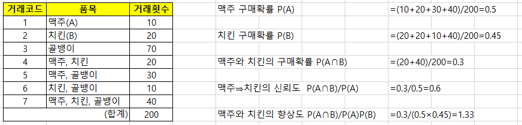
 
-->

# [AR-1] Apriori : 선험적 알고리즘

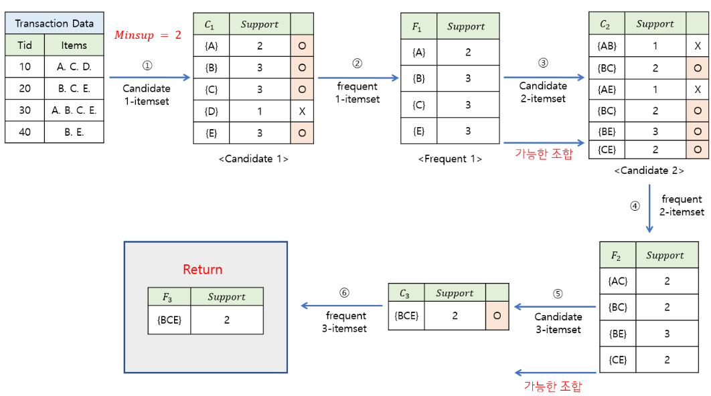
 
https://nyamin9.github.io/data_mining/Data-Mining-Pattern-3/#-31-apriori-algorithm---example  
▣ 정의 : 연관규칙 학습을 위한 고전적인 알고리즘으로, 빈발항목 집합(frequent itemsets)을 찾아내고 그 집합 간 연관성을 추출 
▣ 필요성 : 대규모 데이터에서 연관성을 발견하는 작업은 계산 비용이 높을 수 있는데, Apriori는 빈발하지 않은 항목 집합을 먼저 제거해 검색 공간을 줄여주는 방식으로 효율적인 탐색 
▣ 장점 : 간단한 구조로 이해하기 쉽고, 계산 공간을 줄이기 위한 사전 단계를 가지고 있어, 효율적인 탐색이 가능 
▣ 단점 : 대규모 데이터에서 탐색 공간이 커지면 성능이 저하되고 비효율적일 수 있으며, 매번 새로운 후보집합 생성에 따른 큰 계산비용 
▣ 응용분야 : 시장 바구니 분석(장바구니 데이터에서 자주 함께 구매되는 상품을 찾음), 추천 시스템, 웹 페이지 연결성 분석 
▣ 모델식 : 지지도(Support): 특정 항목 집합이 전체 거래에서 발생하는 빈도, 신뢰도(Confidence): 특정 항목이 발생한 경우 다른 항목이 함께 발생할 확률, 향상도(Lift): 항목 간의 상호의존성을 측정 

	import pandas as pd	
	import matplotlib.pyplot as plt
 	from mlxtend.frequent_patterns import apriori
	from itertools import combinations
	
	# 데이터셋 생성
	data = {
	    'TID': [1, 2, 3, 4, 5],
	    'milk': [1, 1, 0, 1, 0],
	    'bread': [1, 1, 1, 0, 1],
	    'butter': [0, 1, 1, 1, 1],
	}
	df = pd.DataFrame(data).set_index('TID')
	
	# 데이터 시각화
	item_counts = df.sum()
	item_counts.plot(kind='bar', color='blue')
	plt.title('Item Frequency')
	plt.xlabel('Items')
	plt.ylabel('Frequency')
	plt.show()
	
	# apriori 알고리즘 적용
	frequent_itemsets = apriori(df, min_support=0.4, use_colnames=True)
	
	# 수동으로 연관 규칙 계산
	rules = []
	for itemset in frequent_itemsets['itemsets']:
	    if len(itemset) > 1:
	        for antecedent in combinations(itemset, len(itemset) - 1):
	            antecedent = frozenset(antecedent)
	            consequent = itemset - antecedent
	            
	            # 지지도 계산
	            support = frequent_itemsets[frequent_itemsets['itemsets'] == itemset]['support'].values[0]
	            
	            # 신뢰도 계산
	            antecedent_support = frequent_itemsets[frequent_itemsets['itemsets'] == antecedent]['support'].values[0]
	            confidence = support / antecedent_support
	            
	            # 향상도 계산
	            consequent_support = frequent_itemsets[frequent_itemsets['itemsets'] == consequent]['support'].values[0]
	            lift = confidence / consequent_support
	            
	            # 규칙 저장
	            rules.append({
	                'antecedents': antecedent,
	                'consequents': consequent,
	                'support': support,
	                'confidence': confidence,
	                'lift': lift
	            })
	
	# 결과를 DataFrame으로 변환하여 출력
	rules_df = pd.DataFrame(rules)
	print("Association Rules:")
 	print(rules_df[['antecedents', 'consequents', 'support', 'confidence', 'lift']])

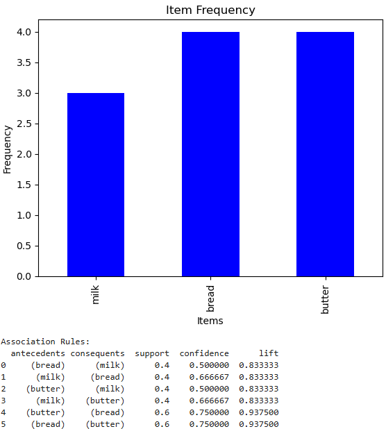
 

**지지도(support):** 규칙 전체(A∪B)가 거래에서 차지하는 비율, {butter}→{bread}: 0.6 (거래의 60%에서 butter와 bread 동시 등장) 
**신뢰도(confidence):** 선행항이 등장했을 때, 결과항이 함께 등장할 확률, {butter}→{bread}: 0.75 (butter가 있으면 75% 확률로 bread도 함께 구매) 
**향상도(lift):** 두 항목이 독립일 때 기대되는 확률 대비 함께 등장할 확률, {butter}→{bread}: 0.9375 < 1 → 독립적으로 발생할 때보다 같이 나타날 확률이 오히려 낮음 

	support ≥ 0.4: 규칙 자체는 충분히 자주 등장
	confidence ≥ 0.7: 규칙 신뢰도가 꽤 높음
	lift > 1: 긍정적 연관성으로 판단 가능

 

# [AR-2] FP-Growth(Frequent Pattern Growth) : 빈발 패턴 성장
▣ 정의: Apriori 알고리즘의 대안으로 FP-Tree(Frequent Pattern Tree)를 통해 빈발항목 집합을 생성하는 알고리즘으로, Apriori와 달리 매번 후보집합을 생성하지 않으며, 데이터의 트랜잭션을 직접 탐색하여 빈발항목 집합을 구한다. 
▣ 필요성: Apriori의 성능 문제를 해결하기 위해 고안 
▣ 장점: 메모리 효율이 높고, 대규모 데이터셋에서 빠르게 작동 
▣ 단점: FP-트리 구조를 구축하는 데 추가 메모리가 필요하며, 구현이 복잡하고 FP-Tree 생성을 위한 학습이 필요 
▣ 응용분야: 대규모 데이터 분석, 전자상거래 추천 시스템 

	import pandas as pd	
	import matplotlib.pyplot as plt
 	from mlxtend.frequent_patterns import fpgrowth
	from itertools import combinations
	
	# 데이터셋 생성
	data = {
	    'TID': [1, 2, 3, 4, 5],
	    'milk': [1, 1, 0, 1, 0],
	    'bread': [1, 1, 1, 0, 1],
	    'butter': [0, 1, 1, 1, 1],
	}
	df = pd.DataFrame(data).set_index('TID')
	
	# 데이터 시각화
	item_counts = df.sum()
	item_counts.plot(kind='bar', color='green')
	plt.title('Item Frequency (FP-Growth)')
	plt.xlabel('Items')
	plt.ylabel('Frequency')
	plt.show()
	
	# FP-Growth 알고리즘 적용
	frequent_itemsets = fpgrowth(df, min_support=0.4, use_colnames=True)
	
	# 수동으로 연관 규칙 계산
	rules = []
	for itemset in frequent_itemsets['itemsets']:
	    if len(itemset) > 1:
	        for antecedent in combinations(itemset, len(itemset) - 1):
	            antecedent = frozenset(antecedent)
	            consequent = itemset - antecedent
	            
	            # 지지도 계산
	            support = frequent_itemsets[frequent_itemsets['itemsets'] == itemset]['support'].values[0]
	            
	            # 신뢰도 계산
	            antecedent_support = frequent_itemsets[frequent_itemsets['itemsets'] == antecedent]['support'].values[0]
	            confidence = support / antecedent_support
	            
	            # 향상도 계산
	            consequent_support = frequent_itemsets[frequent_itemsets['itemsets'] == consequent]['support'].values[0]
	            lift = confidence / consequent_support
	            
	            # 규칙 저장
	            rules.append({
	                'antecedents': antecedent,
	                'consequents': consequent,
	                'support': support,
	                'confidence': confidence,
	                'lift': lift
	            })
	
	# 결과를 DataFrame으로 변환하여 출력
	rules_df = pd.DataFrame(rules)
	print("Association Rules (FP-Growth):")
	print(rules_df[['antecedents', 'consequents', 'support', 'confidence', 'lift']])

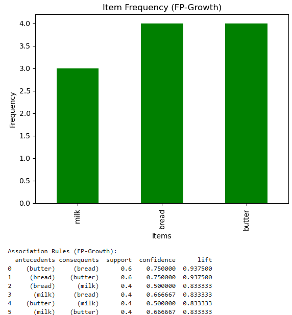   
 

# [AR-3] Eclat(Equivalence Class Transformation) : 동등 클래스 변환
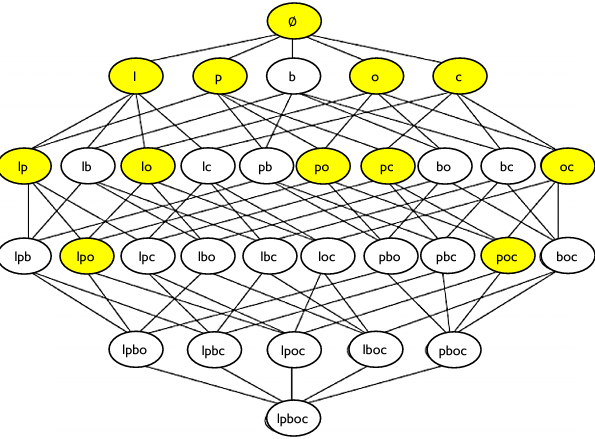  
 
chrome-extension://efaidnbmnnnibpcajpcglclefindmkaj/https://www.philippe-fournier-viger.com/COURSES/Pattern_mining/Eclat.pdf
 
노란색 빈발 집합 : 사전 정의된 최소 지지도(minimum support) 이상의 지지도를 가지는 항목의 조합  
▣ 정의: Apriori와 FP-Growth의 대안으로, 트랜잭션 간의 공통항목(교집합)을 기반으로 빈발항목을 추출하는 알고리즘 
▣ 필요성: 데이터의 수가 많아도 트랜잭션 간 교차 계산을 통해 효율적으로 연관 규칙을 도출 
▣ 장점 : 수평적 데이터 구조를 이용하여 트랜잭션 데이터에서 빈발 항목 집합을 빠르게 찾고, 저장 공간을 효율적으로 사용하며, 교차 연산을 통해 빈발 항목을 추출 
▣ 단점 : 트랜잭션 ID 집합을 계속 업데이트해야 하므로 메모리 사용이 증가할 수 있으며, 대규모 데이터셋에서는 효율성이 떨어질 수 있음 
▣ 응용분야 : 대규모 데이터에서 빈발 패턴 분석, 웹 클릭 로그 분석, 텍스트 마이닝에서 자주 나타나는 단어 조합 분석 
▣ 모델식 : 항목 집합의 지지도 계산을 위해 트랜잭션 ID 집합의 교집합을 사용하며 빈발항목 집합의 지지도를 계산할 때 교집합을 통해 빈발 항목을 찾아낸다 

	import pandas as pd
	import matplotlib.pyplot as plt
	from itertools import combinations
	
	# 데이터셋 생성
	data = {
	    'TID': [1, 2, 3, 4, 5],
	    'milk': [1, 1, 0, 1, 0],
	    'bread': [1, 1, 1, 0, 1],
	    'butter': [0, 1, 1, 1, 1],
	}
	df = pd.DataFrame(data).set_index('TID')
	
	# 데이터 시각화
	item_counts = df.sum()
	item_counts.plot(kind='bar', color='purple')
	plt.title('Item Frequency (Eclat)')
	plt.xlabel('Items')
	plt.ylabel('Frequency')
	plt.show()
	
	# Eclat 알고리즘 구현
	def eclat(data, min_support=0.4):
	    # 항목별 지지도 계산
	    itemsets = {}
	    for col in data.columns:
	        support = data[col].sum() / len(data)
	        if support >= min_support:
	            itemsets[frozenset([col])] = support
	    
	    # 두 개 이상의 항목 집합에 대해 지지도 계산
	    for length in range(2, len(data.columns) + 1):
	        for comb in combinations(data.columns, length):
	            comb_set = frozenset(comb)
	            support = (data[list(comb)].sum(axis=1) == length).mean()
	            if support >= min_support:
	                itemsets[comb_set] = support
	
	    return itemsets
	
	# Eclat 알고리즘 적용하여 빈발 항목 집합 생성
	frequent_itemsets = eclat(df, min_support=0.4)
	
	# 빈발 항목 집합에서 연관 규칙 계산
	rules = []
	for itemset, support in frequent_itemsets.items():
	    if len(itemset) > 1:
	        for antecedent in combinations(itemset, len(itemset) - 1):
	            antecedent = frozenset(antecedent)
	            consequent = itemset - antecedent
	            
	            # 신뢰도 계산
	            antecedent_support = frequent_itemsets[antecedent]
	            confidence = support / antecedent_support
	            
	            # 향상도 계산
	            consequent_support = frequent_itemsets[consequent]
	            lift = confidence / consequent_support
	            
	            # 규칙 저장
	            rules.append({
	                'antecedents': antecedent,
	                'consequents': consequent,
	                'support': support,
	                'confidence': confidence,
	                'lift': lift
	            })
	
	# 결과를 DataFrame으로 변환하여 출력
	rules_df = pd.DataFrame(rules)
	print("Association Rules (Eclat):")
	print(rules_df[['antecedents', 'consequents', 'support', 'confidence', 'lift']])
    
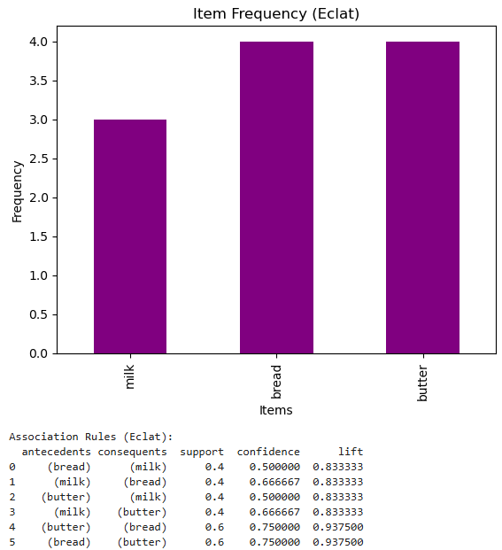
 

# [AR-4] Multi-level Association Rules : 다계층 연관규칙
▣ 정의: Apriori와 FP-Growth 확장버전으로 연관 규칙을 계층적으로 탐색하여 다중 수준에서 규칙을 생성하는 방식 
▣ 필요성: 제품 카테고리별 분석이 필요한 경우에 적합 
▣ 장점: 더 정교한 규칙을 생성 
▣ 단점: 복잡성이 증가하며, 해석이 어려워질 수 있음 
▣ 응용분야: 전자상거래, 추천 시스템, 마케팅 분석 

	import pandas as pd
	from mlxtend.frequent_patterns import apriori
	import matplotlib.pyplot as plt
	from itertools import combinations
	
	# 데이터셋 생성 (Multi-level 구조)
	data = {
	    'TID': [1, 2, 3, 4, 5],
	    'Dairy_Milk': [1, 1, 0, 1, 0],
	    'Bakery_Bread': [1, 1, 1, 0, 1],
	    'Bakery_Butter': [0, 1, 1, 1, 1]
	}
	df = pd.DataFrame(data).set_index('TID')
	
	# 상위 계층 데이터 생성
	df['Dairy'] = df['Dairy_Milk']
	df['Bakery'] = df[['Bakery_Bread', 'Bakery_Butter']].max(axis=1)
	
	# 원본 데이터 시각화
	item_counts = df[['Dairy_Milk', 'Bakery_Bread', 'Bakery_Butter']].sum()
	item_counts.plot(kind='bar', color='purple')
	plt.title('Item Frequency (Multi-level Association Rules)')
	plt.xlabel('Items')
	plt.ylabel('Frequency')
	plt.show()
	
	# 상위 계층에서 apriori 알고리즘 적용
	frequent_itemsets_upper = apriori(df[['Dairy', 'Bakery']], min_support=0.4, use_colnames=True)
	frequent_itemsets_upper['length'] = frequent_itemsets_upper['itemsets'].apply(lambda x: len(x))
	
	# 하위 계층에서 apriori 알고리즘 적용
	frequent_itemsets_lower = apriori(df[['Dairy_Milk', 'Bakery_Bread', 'Bakery_Butter']], min_support=0.4, use_colnames=True)
	frequent_itemsets_lower['length'] = frequent_itemsets_lower['itemsets'].apply(lambda x: len(x))
	
	# 연관 규칙 수동 계산
	def generate_rules(frequent_itemsets):
	    rules = []
	    for itemset in frequent_itemsets['itemsets']:
	        if len(itemset) > 1:
	            for antecedent in combinations(itemset, len(itemset) - 1):
	                antecedent = frozenset(antecedent)
	                consequent = itemset - antecedent
	                
	                # 지지도 계산
	                support = frequent_itemsets[frequent_itemsets['itemsets'] == itemset]['support'].values[0]
	                
	                # 신뢰도 계산
	                antecedent_support = frequent_itemsets[frequent_itemsets['itemsets'] == antecedent]['support'].values[0]
	                confidence = support / antecedent_support
	                
	                # 향상도 계산
	                consequent_support = frequent_itemsets[frequent_itemsets['itemsets'] == consequent]['support'].values[0]
	                lift = confidence / consequent_support
	                
	                # 규칙 저장
	                rules.append({
	                    'antecedents': antecedent,
	                    'consequents': consequent,
	                    'support': support,
	                    'confidence': confidence,
	                    'lift': lift
	                })
	    return rules
	
	# 상위 계층 연관 규칙 생성
	rules_upper = generate_rules(frequent_itemsets_upper)
	rules_df_upper = pd.DataFrame(rules_upper)
	print("Association Rules (Upper Level):")
	print(rules_df_upper[['antecedents', 'consequents', 'support', 'confidence', 'lift']])
	
	# 하위 계층 연관 규칙 생성
	rules_lower = generate_rules(frequent_itemsets_lower)
	rules_df_lower = pd.DataFrame(rules_lower)
	print("\nAssociation Rules (Lower Level):")
	print(rules_df_lower[['antecedents', 'consequents', 'support', 'confidence', 'lift']])

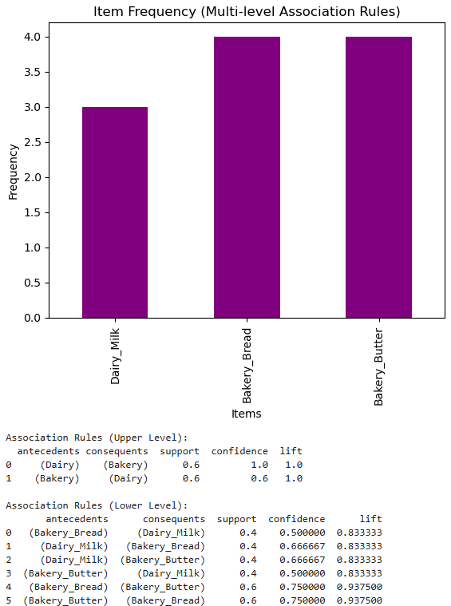
 

# [AR-5] Multi-dimensional Association Rules : 다차원 연관규칙
▣ 정의: 여러 속성을 포함하여 다양한 차원의 규칙을 생성 
▣ 필요성: 연관 규칙을 데이터의 여러 차원에 걸쳐 분석하고자 할 때 유용하며, 특정 집단에 대한 특정 패턴을 탐지하는 데 적합 
▣ 장점: 규칙의 범위를 확장할 수 있어 더 세밀한 규칙 도출 가능. 
▣ 단점: 복잡성과 해석의 어려움 
▣ 응용분야: 사용자 속성 기반 추천 시스템, 마케팅 인텔리전스 

	import pandas as pd
	from mlxtend.frequent_patterns import apriori
	import matplotlib.pyplot as plt
	from itertools import combinations
	
	# 데이터셋 생성 (Multi-dimensional 구조)
	data = {
	    'TID': [1, 2, 3, 4, 5],
	    'milk': [1, 1, 0, 1, 0],
	    'bread': [1, 1, 1, 0, 1],
	    'butter': [0, 1, 1, 1, 1],
	    'Gender_Male': [1, 0, 0, 1, 1],
	    'Gender_Female': [0, 1, 1, 0, 0],
	    'Category_Dairy': [1, 1, 0, 1, 0],
	    'Category_Bakery': [1, 1, 1, 0, 1]
	}
	df = pd.DataFrame(data).set_index('TID')
	
	# 원본 데이터 시각화
	item_counts = df[['milk', 'bread', 'butter']].sum()
	item_counts.plot(kind='bar', color='orange')
	plt.title('Item Frequency (Multi-dimensional Association Rules)')
	plt.xlabel('Items')
	plt.ylabel('Frequency')
	plt.show()
	
	# apriori 알고리즘을 사용하여 빈발 항목 집합 생성
	frequent_itemsets = apriori(df, min_support=0.4, use_colnames=True)
	frequent_itemsets['length'] = frequent_itemsets['itemsets'].apply(lambda x: len(x))
	
	# 연관 규칙 수동 계산
	def generate_rules(frequent_itemsets):
	    rules = []
	    for itemset in frequent_itemsets['itemsets']:
	        if len(itemset) > 1:
	            for antecedent in combinations(itemset, len(itemset) - 1):
	                antecedent = frozenset(antecedent)
	                consequent = itemset - antecedent
	                
	                # 지지도 계산
	                support = frequent_itemsets[frequent_itemsets['itemsets'] == itemset]['support'].values[0]
	                
	                # 신뢰도 계산
	                antecedent_support = frequent_itemsets[frequent_itemsets['itemsets'] == antecedent]['support'].values[0]
	                confidence = support / antecedent_support
	                
	                # 향상도 계산
	                consequent_support = frequent_itemsets[frequent_itemsets['itemsets'] == consequent]['support'].values[0]
	                lift = confidence / consequent_support
	                
	                # 규칙 저장
	                rules.append({
	                    'antecedents': antecedent,
	                    'consequents': consequent,
	                    'support': support,
	                    'confidence': confidence,
	                    'lift': lift
	                })
	    return rules
	
	# Multi-dimensional 연관 규칙 생성
	rules = generate_rules(frequent_itemsets)
	rules_df = pd.DataFrame(rules)
	print("Association Rules (Multi-dimensional):")
	print(rules_df[['antecedents', 'consequents', 'support', 'confidence', 'lift']])
	
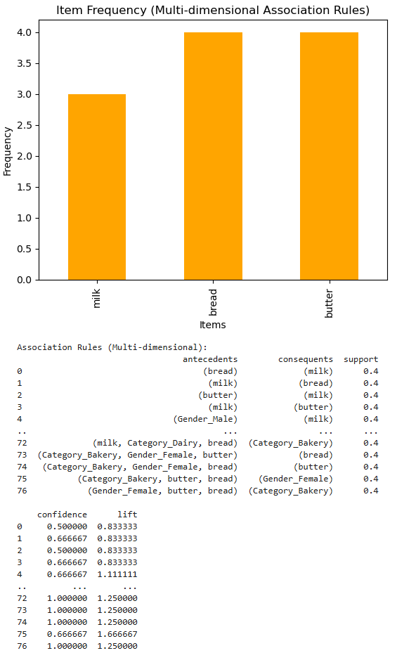
 

# [AR-6] AIS(Artificial Immune System) : 인공면역시스템
▣ 정의: 거래 데이터를 순차적으로 결합하여 빈번한 항목 집합을 찾는 초기 연관규칙 알고리즘 중 하나 
▣ 필요성: 초기 연관 규칙 연구에서 활용되었으나, 성능의 한계로 현재는 거의 사용되지 않음 
▣ 장점: 간단한 구조로 이해하기 쉽고, 복잡한 비정형 데이터에서 이상 패턴을 감지하는 데 강점 
▣ 단점: 비효율적이며, Apriori보다 성능이 떨어짐 
▣ 응용분야: 초기 연관 규칙 연구, 이상탐지 

	import pandas as pd
	import numpy as np
	import matplotlib.pyplot as plt
	
	# 데이터셋 생성
	data = {
	    'TID': [1, 2, 3, 4, 5],
	    'milk': [1, 1, 0, 1, 0],
	    'bread': [1, 1, 1, 0, 1],
	    'butter': [0, 1, 1, 1, 1],
	}
	df = pd.DataFrame(data).set_index('TID')
	
	# 데이터 시각화
	item_counts = df.sum()
	item_counts.plot(kind='bar', color='blue')
	plt.title('Item Frequency')
	plt.xlabel('Items')
	plt.ylabel('Frequency')
	plt.show()
	
	# AIS 알고리즘 설정
	population_size = 10         # 초기 항체(해) 개수
	num_generations = 10         # 반복할 세대 수
	mutation_rate = 0.1          # 돌연변이율
	selection_rate = 0.5         # 선택률
	
	# 적합도 함수 정의 (예: milk, bread, butter 구매 조합의 점수화)
	def fitness(antibody):
	    # 항체의 적합도를 milk, bread, butter의 합으로 정의
	    return antibody['milk'] * 1 + antibody['bread'] * 1.2 + antibody['butter'] * 0.8
	
	# 초기 항체(해) 생성 (milk, bread, butter 구매 유무에 따라 항체 구성)
	population = [df.sample(1, replace=True).squeeze() for _ in range(population_size)]
	fitness_scores = np.array([fitness(antibody) for antibody in population])
	
	# AIS 알고리즘 실행
	for generation in range(num_generations):
	    # 선택: 상위 selection_rate 비율의 항체만 유지
	    num_selected = int(selection_rate * population_size)
	    selected_indices = np.argsort(fitness_scores)[-num_selected:]
	    selected_population = [population[i] for i in selected_indices]
	    
	    # 복제 및 돌연변이
	    offspring = []
	    for antibody in selected_population:
	        # 복제
	        cloned = antibody.copy()
	        # 돌연변이 적용
	        for item in ['milk', 'bread', 'butter']:
	            if np.random.rand() < mutation_rate:
	                cloned[item] = 1 - cloned[item]  # 0이면 1로, 1이면 0으로 변경
	        offspring.append(cloned)
	    
	    # 새 세대 생성
	    population = offspring
	    fitness_scores = np.array([fitness(antibody) for antibody in population])
	
	# 최적의 항체 선택
	best_solution = population[np.argmax(fitness_scores)]
	best_fitness = fitness(best_solution)
	
	# 결과 출력
	print("최적의 해:", best_solution)
	print("최적의 적합도:", best_fitness)
	
	# 평가 결과 (유사 지지도, 신뢰도, 향상도)
	support = sum(best_solution) / len(best_solution)
	confidence = best_fitness / max(fitness_scores)
	lift = confidence / (support if support != 0 else 1)
	
	print("\n평가 결과:")
	print(f"지지도(Support): {support}")
	print(f"신뢰도(Confidence): {confidence}")
	print(f"향상도(Lift): {lift}")
	
	# 최종 항체 적합도 분포 시각화
	plt.plot(range(len(fitness_scores)), fitness_scores, 'bo')
	plt.xlabel("Antibody Index")
	plt.ylabel("Fitness Score")
	plt.title("AIS Antibody Fitness Distribution")
	plt.show()

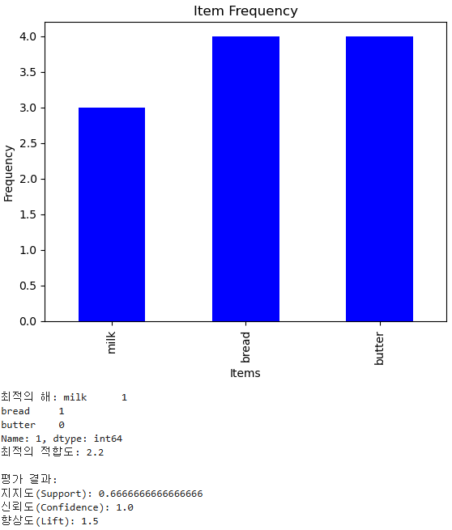
 

# 연관규칙 알고리즘 수식 요약

| 알고리즘 | 주요 수학식 | 목적함수 / 평가함수 |
|:------------------------------|:-------------------------------|:-------------------------------|
| **[1] Apriori : 선험적 알고리즘** | %3D%5Cfrac%7Bcount(X)%7D%7BN%7D) %3D%5Cfrac%7BSupport(X%5Ccup%20Y)%7D%7BSupport(X)%7D) %3D%5Cfrac%7BSupport(X%5Ccup%20Y)%7D%7BSupport(X)%5Ccdot%20Support(Y)%7D) | %2C%5Cquad%20Confidence(X%5CRightarrow%20Y)%5Cge%20min_%7Bconf%7D) |
| **[2] FP-Growth(Frequent Pattern Growth) : 빈발 패턴 성장** | %3D%5Cbigcup_%7Bi%5Cin%20I%7D%20FP(CondBase(i))%2C%5Cquad%20Support(I)%5Cge%20min_%7Bsup%7D) |  |
| **[3] Eclat(Equivalence Class Transformation) : 동등 클래스 변환** | %3D%5Cleft%7C%5Cbigcap_%7Bi%5Cin%20X%7D%20T(i)%5Cright%7C) | %5Cright%7C%5Cquad%5Ctext%7Bs.t.%7D%5Cquad%5Cleft%7C%5Cbigcap_%7Bi%5Cin%20X%7D%20T(i)%5Cright%7C%5Cge%20min_%7Bsup%7D) |
| **[4] Multi-level Association Rules : 다계층 연관규칙** | %3D%5Cfrac%7Bcount_%5Cell(X)%7D%7BN_%5Cell%7D) %3D%5Cfrac%7BSupport(X%5Ccup%20Y)%7D%7BSupport(X)%7D)  | %2C%5Cquad%20Confidence(X%5CRightarrow%20Y)%5Cge%20min_%7Bconf%2C%5Cell%7D%2C%5quad%20Support(X)%5Cge%20min_%7Bsup%7D) |
| **[5] Multi-dimensional Association Rules : 다차원 연관규칙** | %3D%5Cfrac%7Bcount(A_1%3Da_1%2C%5Cldots%2C%20A_n%3Da_n)%7D%7BN%7D) %3D%5Cfrac%7BSupport(A_1%3Da_1%2C%5Cldots%2C%20A_n%3Da_n)%7D%7BSupport(A_1%3Da_1%2C%5Cldots%2C%20A_k%3Da_k)%7D) | %2C%5quad%20Confidence%5Cge%20min_%7Bconf%7D%2C%5quad%20Support%5Cge%20min_%7Bsup%7D) |
| **[6] Artificial Immune System : 인공면역시스템** | %3D%5Cfrac%7Bmatch(Ab%2C%20Ag)%7D%7B%7CAg%7C%7D) %3D%5Cfrac%7BAffinity(Ab_i%2C%20Ag)%7D%7B%5Csum_j%20Affinity(Ab_j%2C%20Ag)%7D) ) %7D) | ) |

 

---

**차원축소(dimension reduction)의 필요성 :** 데이터에 포함된 노이즈(noise)를 제거할 때 사용하는 방법  
차원축소는 주어진 데이터의 정보손실을 최소화하면서 노이즈를 줄이는 것이 핵심 
차원이 늘어날 수록 필요한 데이터가 기하급수적으로 많아지는 차원의 저주(curse of dimensionality) 문제를 해결 
지도학습의 대표적인 차원축소 방법 : 선형판별분석(Linear Discriminant Analysis) 
비지도학습의 대표적인 차원축소 방법 : 주성분분석(Principal Component Anaysis) 

---

# [DR-1] PCA(Principal Component Analysis) : 주성분 분석
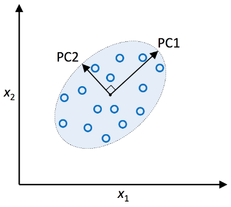
 
▣ 정의 : 데이터의 분산을 최대한 보존하면서 데이터의 주요 성분(주성분)을 찾기 위해 선형 변환을 적용하는 차원 축소 알고리즘  
여러 특성(Feature) 변수들이 통계적으로 서로 상관관계가 없도록 변환시키는 것으로 고차원 데이터를 저차원으로 변환하는 차원 축소 기법 
주성분분석은 오직 공분산행렬(convariance matrix) $\sum$ 에만 영향을 받는다.  
▣ 장점 : 정보 손실을 최소화하면서 고차원 데이터를 저차원으로 축소, 데이터의 잡음을 효과적으로 제거, 고차원 데이터를 저차원으로 변환하여 데이터의 구조를 쉽게 이해하고 분석 
▣ 단점 : 선형 변환만을 가정(커널PCA 같은 비선형 변형 기법이 필요), 각 주성분이 원래 데이터의 어떤 특성을 설명하는지 직관적으로 해석하기 어렵다. 분산에 중요한 정보가 있을 경우 이를 놓칠 수 있다. 
▣ 응용분야 : 고차원 데이터를 2D 또는 3D로 변환해 데이터의 패턴을 직관적으로 시각화, 잡음 제거, 얼굴 인식에서 얼굴 이미지의 주요 특징을 추출하여 얼굴을 효율적으로 분류 
▣ 모델식 : 주성분은 공분산 행렬의 고유값과 고유벡터를 사용하여 계산 
데이터 행렬 𝑋의 공분산 행렬 𝐶의 고유값과 고유벡터를 통해 새로운 주성분을 계산 : $C=\frac{1}{n-1}X^TX$ 
고유값 분해($v_i$는 i번째 고유벡터, $\lambda_i$는 i번째 고유값) : $Cv_i = \lambda_iv_i$ 
▣ PCA의 절차 : 분산의 최대화: 주성분은 데이터의 분산(변동성)을 최대한 많이 설명할 수 있는 방향으로 정해진다. 
데이터의 주요한 변동성을 나타내는 축을 먼저 찾고, 그 축을 기준으로 데이터를 투영한다.  
직교성: 각 주성분은 서로 직교(orthogonal)해야 하는데 이는 각 주성분이 서로 상관관계가 없는 독립적인 축이라는 것을 의미한다. 
(1) 데이터 표준화 : PCA를 수행하기 전에 데이터의 스케일을 맞추기 위해 각 변수의 평균을 0으로 만들고 분산을 1로 맞추는 z-점수 정규화 과정 
(2) 공분산 행렬계산 : 공분산(두 변수가 함께 변하는 정도) 행렬 계산을 통해 데이터의 분산이 어떻게 다른 변수들과 상호작용하는지 확인 
  $Cov(X,Y)=\frac{1}{n-1}\sum_{i=1}^{n}(X_i-\overline{X})(Y_i-\overline{Y})$ 
(3) 고유값 분해(Eigenvalue Decomposition) : 공분산 행렬의 고유벡터(eigenvector)는 PCA의 주성분에 해당, 고유값(eigenvalue)은 주성분이 설명하는 분산의 양을 나타냄 
(4) 주성분 선택: 고유값이 큰 순서대로 주성분을 선택(가장 큰 고유값에 해당하는 고유벡터가 제1주성분, 그다음 고유값이 제2주성분 : 고유값이 큰 주성분일수록 데이터의 분산설명렬이 높다) 
(5) 차원 축소: 선택된 주성분을 사용해 데이터를 저차원으로 투영. 데이터의 중요한 특성(분산)을 유지하면서 불필요한 차원을 제거하여 차원을 축소 
 
 

	# ---------------------------------------------
	# PCA(주성분 분석)를 이용해 Iris 데이터셋 시각화하기
	# ---------------------------------------------	
	# 수학 계산과 배열 처리를 위한 NumPy 라이브러리
	import numpy as np
	
	# 시각화를 위한 Matplotlib 라이브러리
	import matplotlib.pyplot as plt
	
	# PCA(Principal Component Analysis) 클래스 불러오기
	from sklearn.decomposition import PCA
	
	# Iris(붓꽃) 데이터셋 불러오기
	from sklearn.datasets import load_iris
		
	# -------------------------
	# 1. 데이터 로드 단계
	# -------------------------	
	# sklearn 내장 데이터셋 중 Iris 데이터를 로드
	data = load_iris()
	
	# 입력 변수(X): 꽃받침/꽃잎의 길이와 너비 (총 4개 특성)
	X = data.data
		
	# -------------------------
	# 2. PCA(주성분 분석) 적용 단계
	# -------------------------	
	# PCA 객체 생성: 주성분 2개로 차원 축소 설정
	pca = PCA(n_components=2)
	
	# fit_transform() : PCA 모델을 학습(fit)하고 데이터를 변환(transform)
	# 즉, 원래 4차원 데이터를 2차원으로 투영(projection)
	X_pca = pca.fit_transform(X)
		
	# -------------------------
	# 3. 결과 시각화 단계
	# -------------------------	
	# 산점도(scatter plot)로 변환된 2차원 PCA 결과 시각화
	# 각 점의 색상(c)은 데이터의 실제 품종(target)에 따라 다르게 표시
	plt.scatter(X_pca[:, 0], X_pca[:, 1], c=data.target)
	
	# X, Y축 라벨 설정
	plt.xlabel("Principal Component 1")  # 첫 번째 주성분
	plt.ylabel("Principal Component 2")  # 두 번째 주성분
	
	# 그래프 제목 설정
	plt.title("PCA on Iris Dataset")
	
	# 컬러바(colorbar): 색상에 대응되는 품종(label) 범위를 표시
	plt.colorbar()
	
	# 그래프 표시
	plt.show()
		
	# -------------------------
	# 4. PCA 성능 지표 출력 단계
	# -------------------------	
	# 각 주성분이 설명하는 분산 비율 (각 주성분의 중요도)
	print("Explained Variance Ratio:", pca.explained_variance_ratio_)
	
	# 두 주성분이 전체 데이터 분산의 몇 %를 보존하는지 합계 출력
	print("Total Variance Retained:", sum(pca.explained_variance_ratio_))

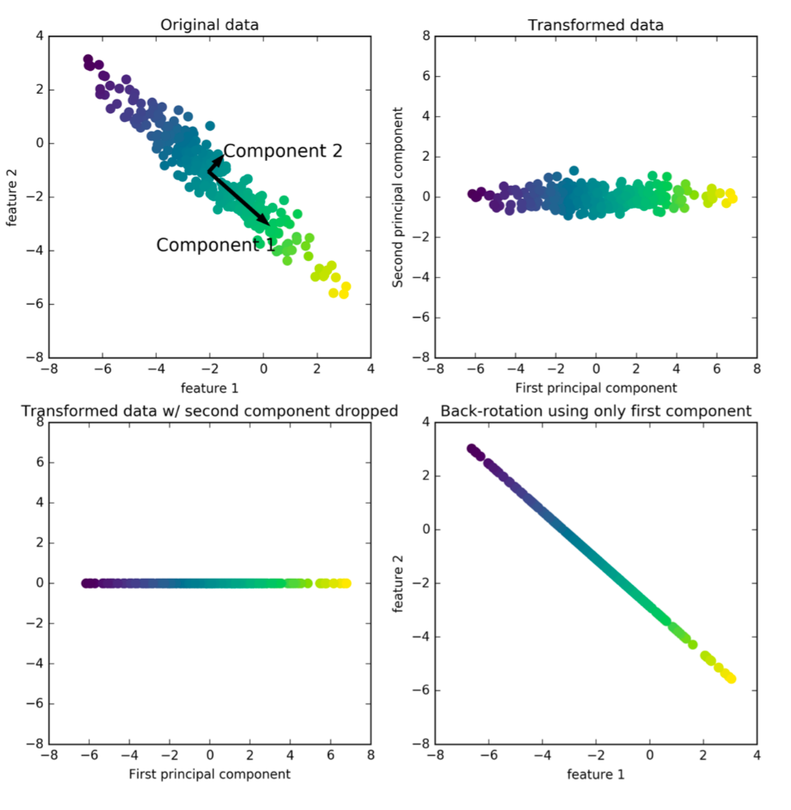
 

# [DR-2] SVD(Singular Value Decomposition) : 특이값 분해
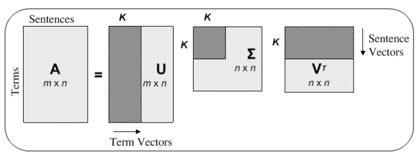
 
▣ 정의: 임의의 행렬을 세 개의 행렬로 분해하는 방식으로 행렬의 특이값과 특이벡터를 통해 행렬의 구조를 파악하고, 이를 통해 데이터의 패턴을 찾거나 압축하는 데 사용  
▣ 장점 : 정방/비정방/비대칭 행렬 등 어떤 형태의 행렬에도 적용 가능, 데이터를 저차원 공간으로 변환하면서도 중요한 패턴을 유지, 데이터에서 노이즈를 제거하여 중요한 정보만 남길 수 있음 
▣ 단점 : 특히 매우 큰 행렬의 경우 계산이 오래 걸릴 수 있으며, 분해된 행렬들이 원본 데이터와 직관적인 관계를 가지지 않기 때문에 결과를 해석하는 것이 어려울 수 있음 
▣ 응용분야 : 단어-문서 행렬의 차원 축소, 데이터 압축, 노이즈 제거, 추천 시스템, 이미지 압축  
▣ 모델식 : $X=UΣV^T$ 
𝑋는 𝑚×𝑛 크기의 원본 행렬, 𝑈는 𝑚×𝑚 크기의 좌측 직교 행렬, Σ는 𝑚×𝑛 크기의 대각 행렬로 특이값이 대각 원소로 배치, $𝑉^𝑇$는 𝑛×𝑛 크기의 우측 직교 행렬 

 

    import numpy as np
    from sklearn.decomposition import TruncatedSVD
    import matplotlib.pyplot as plt
    from sklearn.datasets import load_iris

    # 데이터 로드
    data = load_iris()
    X = data.data

    # SVD 적용
    svd = TruncatedSVD(n_components=2)
    X_svd = svd.fit_transform(X)

    # 결과 시각화
    plt.scatter(X_svd[:, 0], X_svd[:, 1], c=data.target)
    plt.xlabel("SVD Component 1")
    plt.ylabel("SVD Component 2")
    plt.title("SVD on Iris Dataset")
    plt.colorbar()
    plt.show()

    # 분산 유지율 출력
    print("Explained Variance Ratio:", svd.explained_variance_ratio_)
    print("Total Variance Retained:", sum(svd.explained_variance_ratio_))

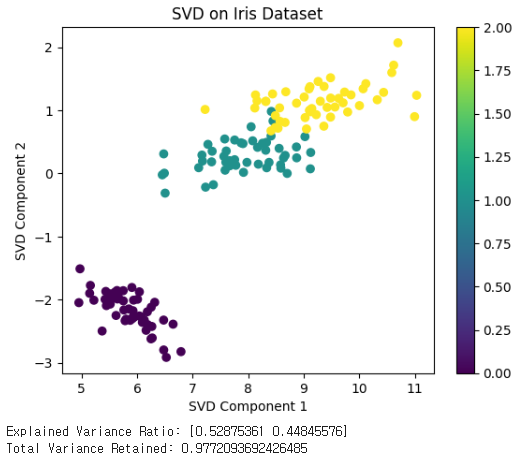
 

# [DR-3] ICA(Independent Component Analysis) : 독립성분 분석
▣ 정의 : 다변량 신호에서 통계적으로 독립적인 성분을 추출하는 비선형 차원 축소 기법 
PCA는 데이터의 분산을 최대화하는 축을 찾는 반면, ICA는 신호 간의 독립성을 기반으로 성분을 찾는다.  
PCA는 가우시안 분포를 가정하고 데이터의 상관관계만을 이용해 차원을 축소하거나 성분을 찾는 반면,  
ICA는 신호들 간의 고차원적 통계적 독립성에 초점을 맞추기 때문에 더 복잡한 구조의 신호분리 문제를 해결 
▣ 필요성 : 관측된 신호가 여러 독립적인 원천 신호의 혼합으로 구성될 때 각 독립적인 신호를 복원하는 데 필요하며 특히 신호 처리 및 음성 분리에 유용 
▣ 응용분야 : 뇌파(EEG) 신호 분석, 음성 신호 분리, 이미지 처리 
▣ 장점 : 통계적으로 독립적인 신호를 분리할 수 있으며 신호 처리, 이미지 분할, 음성 분리 등에서 강력한 성능을 발휘 
▣ 단점 : 잡음에 민감하고, 원래 신호의 순서를 보장하지 않으며, 성분의 크기도 원래 신호와 다를 수 있어서 추가적인 후처리가 필요 
▣ 모델식 : 관측 데이터 𝑋=𝐴𝑆에서 𝐴는 혼합 행렬, 𝑆는 독립 성분 행렬이며, 𝐴와 𝑆를 추정하여 𝑆를 추출 
▣ 알고리즘 : 비선형성을 이용해 독립 성분을 빠르게 찾는 방법으로 신호의 비정규성을 최대화하는 방향으로 성분을 추정하는 Fast ICA과 정보 이론을 기반으로 한 방법으로,  
관측된 데이터에서 정보량을 최대화하는 방식으로 독립 성분을 추정하는 Infomax ICA 

 

    import numpy as np
    from sklearn.decomposition import FastICA
    import matplotlib.pyplot as plt
    from sklearn.datasets import load_iris

    # 데이터 로드
    data = load_iris()
    X = data.data

    # ICA 적용
    ica = FastICA(n_components=2, random_state=42)
    X_ica = ica.fit_transform(X)

    # 결과 시각화
    plt.scatter(X_ica[:, 0], X_ica[:, 1], c=data.target)
    plt.xlabel("ICA Component 1")
    plt.ylabel("ICA Component 2")
    plt.title("ICA on Iris Dataset")
    plt.colorbar()
    plt.show()

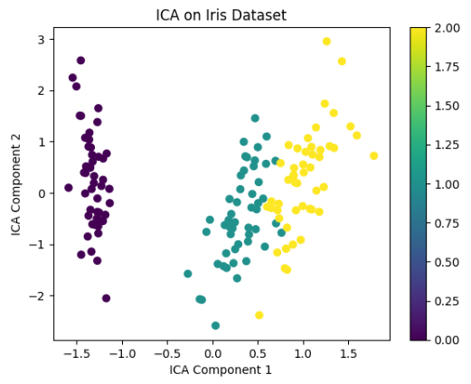
  

# [DR-4] NMF(Non-negative Matrix Factorization) : 비음수 행렬 분해
▣ 정의 : 데이터를 비음수 행렬로 나타내고 이를 두 개의 비음수 행렬의 곱으로 분해하는 행렬 분해(Matrix Factorization) 기법 
▣ 필요성 : 원본 데이터를 두 개의 비음수(예: 픽셀 값, 주파수 스펙트럼, 사용자 평가 점수 등) 행렬의 곱으로 분해함으로써 비음수 데이터를 압축적으로 표현하여 중요한 구조적 특징을 발견 
▣ 장점 : 모든 요소가 비음수이므로 결과를 직관적으로 해석, 데이터의 저차원 표현을 효과적으로 학습하며, 각 데이터의 기여 요소를 명확히 구분 
▣ 단점 : 초기화 민감성, 복잡한 비선형 데이터 표현에는 부적합, 비음수 제약으로 인해 제한된 표현력, 결과의 불확실성 
▣ 응용분야 : 얼굴 인식에서 이미지 구성 요소 추출, 텍스트 마이닝, 음원 분리 및 잡음 제거, 추천 시스템, 유전자 발현 데이터의 특징 추출 및 해석 
(참고) https://angeloyeo.github.io/2020/10/15/NMF.html 

	from sklearn.decomposition import NMF
	import numpy as np
	import matplotlib.pyplot as plt
	
	# 1. 데이터 생성 (예: 문서-단어 행렬)
	V = np.array([[1, 2, 3],
	              [4, 5, 6],
	              [7, 8, 9]])
	
	# 2. NMF 모델 설정 및 학습
	model = NMF(n_components=2, init='random', random_state=42)
	W = model.fit_transform(V)
	H = model.components_
	
	# 3. 근사 행렬 계산
	V_approx = np.dot(W, H)
	
	# 4. 시각화
	fig, axs = plt.subplots(2, 2, figsize=(12, 10))
	
	# 원본 데이터 시각화
	axs[0, 0].imshow(V, cmap='viridis', aspect='auto')
	axs[0, 0].set_title("원본 행렬 (V)")
	axs[0, 0].set_xticks(range(V.shape[1]))
	axs[0, 0].set_yticks(range(V.shape[0]))
	
	# 근사 행렬 시각화
	axs[0, 1].imshow(V_approx, cmap='viridis', aspect='auto')
	axs[0, 1].set_title("근사 행렬 (V_approx)")
	axs[0, 1].set_xticks(range(V_approx.shape[1]))
	axs[0, 1].set_yticks(range(V_approx.shape[0]))
	
	# 기저 행렬 (W) 시각화
	axs[1, 0].imshow(W, cmap='viridis', aspect='auto')
	axs[1, 0].set_title("기저 행렬 (W)")
	axs[1, 0].set_xticks(range(W.shape[1]))
	axs[1, 0].set_yticks(range(W.shape[0]))
	
	# 계수 행렬 (H) 시각화
	axs[1, 1].imshow(H, cmap='viridis', aspect='auto')
	axs[1, 1].set_title("계수 행렬 (H)")
	axs[1, 1].set_xticks(range(H.shape[1]))
	axs[1, 1].set_yticks(range(H.shape[0]))
	
	# 레이아웃 정리
	plt.tight_layout()
	plt.show()
	
	# 5. 출력 결과
	print("원본 행렬 (V):")
	print(V)
	
	print("\n기저 행렬 (W):")
	print(W)
	
	print("\n계수 행렬 (H):")
	print(H)
	
	print("\n근사 행렬 (V_approx):")
	print(V_approx)
	
 

	원본 행렬 (V): 원래의 데이터 행렬로, NMF를 수행하기 전에 입력된 값
	[[1 2 3]
 	[4 5 6]
 	[7 8 9]]

	기저 행렬 (W): 행렬 𝑉의 행(데이터 포인트)을 저차원 잠재 공간에서 표현
	[[2.41498468 0.        ]
 	[4.83219981 0.36423119]
 	[7.24871414 0.72880911]]

	계수 행렬 (H): 각 열(특성)을 잠재 변수의 조합으로 표현
	[[0.41443612 0.82883423 1.24166579]
 	[5.48294704 2.73290582 0.        ]]

	근사 행렬 (V_approx): NMF를 통해 원본 행렬 𝑉를 근사한 결과
	[[1.00085688 2.00162196 2.99860386]
 	[3.99969848 5.00050215 5.99997718]
 	[7.00015069 7.99974905 9.00048035]]
 

$𝑉[0,0]=1, 𝑉_{approx}[0,0] = 1.00085688$ : 오차는 약 0.0009 
$𝑉[1,2]=6, 𝑉_{approx}[1,2]=5.99997718$ : 오차는 약 0.00002 

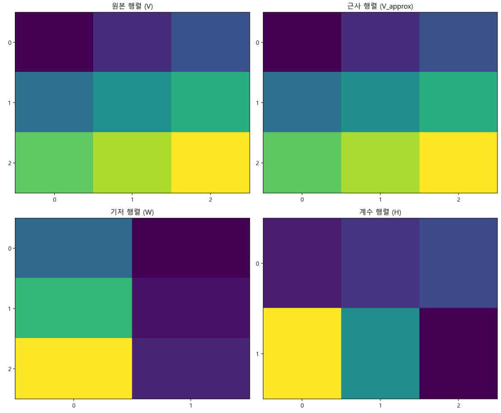
  
원본 행렬 (𝑉)의 크기: 3×3 → 𝑚=3, 𝑛=3 (데이터 포인트 3개, 특성 3개) 
근사 행렬 (𝑉_approx)의 크기: 3×3 → 𝑚=3, 𝑛=3 (원본과 유사하면 분해 성공) 
기저 행렬 (𝑊)의 크기: 3×2 → 𝑚=3, 𝑘=2 (3개의 데이터 포인트를 2개의 잠재 요인으로 표현 : 데이터의 숨겨진 구성요소) 
계수 행렬 (𝐻)의 크기: 2×3 → 𝑘=2, 𝑛=3 (2개의 잠재 요인을 3개의 특성으로 표현 : 기저의 가중) 
 

# [DR-5] t-SNE(t-distributed Stochastic Neighbor Embedding) : t-분포 확률적 이웃 임베딩
▣ 정의: 고차원 데이터의 국소 구조를 잘 보존하여 저차원으로 투영하는 비선형 차원 축소 알고리즘 
▣ 필요성: 데이터의 클러스터 구조를 유지한 상황에서 저차원으로 투영하여 데이터 간의 관계를 시각적으로 파악하기 위해 사용 
▣ 장점 : 고차원 데이터의 군집 구조를 잘 반영하여 데이터의 숨겨진 패턴을 시각적으로 잘 드러내고, 비선형 구조를 가진 데이터에서도 효과적으로 작동 
▣ 단점 : 데이터 포인트 수가 많아질수록 계산 시간이 급격히 증가하고, 초기 매개변수(예: σ 값 및 학습률)에 민감하게 반응  
▣ 응용 분야 : 이미지 데이터, 텍스트 데이터, 유전자 표현 데이터 등의 시각화, 클러스터링 분석, 데이터 전처리, 신경망 모델의 중간 출력을 시각화 
▣ 모델식: 고차원 데이터의 유사도와 저차원 데이터의 유사도 분포를 맞추기 위해 코스트 함수 𝐾𝐿(𝑝∥𝑞)를 최소화 

 

    import matplotlib.pyplot as plt
    from sklearn.manifold import TSNE
    from sklearn.datasets import load_iris

    # 데이터 로드
    data = load_iris()
    X = data.data

    # t-SNE 적용
    tsne = TSNE(n_components=2, random_state=42)
    X_tsne = tsne.fit_transform(X)

    # 결과 시각화
    plt.scatter(X_tsne[:, 0], X_tsne[:, 1], c=data.target)
    plt.xlabel("t-SNE Component 1")
    plt.ylabel("t-SNE Component 2")
    plt.title("t-SNE on Iris Dataset")
    plt.colorbar()
    plt.show()

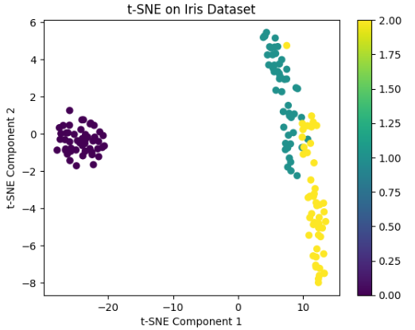
 

# [DR-6] UMAP(Uniform Manifold Approximation and Projection) : 균일 매니폴드 근사적 사영
▣ 정의: 데이터의 국소 구조와 전역 구조를 동시에 보존하면서 저차원으로 투영하는 비선형 차원 축소 알고리즘 
▣ 필요성: 고차원 데이터를 저차원에서 시각화하면서 데이터의 전체적 및 국소적 관계를 동시에 보존하기 위해 사용 
▣ 장점: t-SNE보다 계산이 빠르고, 대규모 데이터에서도 잘 작동, 데이터의 전역적 및 국소적 구조를 동시에 보존 
▣ 단점: 일부 매개변수 조정이 필요하며, 결과가 매개변수에 민감할 수 있음 
▣ 응용분야: 대용량 데이터 시각화, 생물정보학, 텍스트 분석 등 
▣ 모델식: 이론적으로는 리만 거리와 초구 면적 개념을 이용하여 데이터의 근접성을 유지하면서 고차원에서 저차원으로 투영 

    !pip install umap-learn
    import umap
    import matplotlib.pyplot as plt
    from sklearn.datasets import load_iris

    # 데이터 로드
    data = load_iris()
    X = data.data

    # UMAP 적용
    umap_model = umap.UMAP(n_components=2, random_state=42)
    X_umap = umap_model.fit_transform(X)

    # 결과 시각화
    plt.scatter(X_umap[:, 0], X_umap[:, 1], c=data.target)
    plt.xlabel("UMAP Component 1")
    plt.ylabel("UMAP Component 2")
    plt.title("UMAP on Iris Dataset")
    plt.colorbar()
    plt.show()

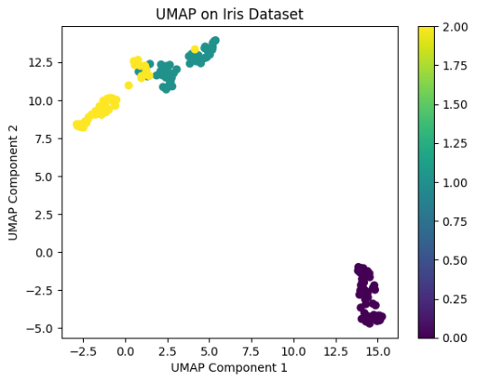
 

# [DR-7] Isomap : 등거리 매핑
▣ 정의: 데이터의 기하학적 구조를 보존하여 고차원 데이터를 저차원으로 투영하는 비선형 차원 축소 기법 
▣ 필요성: 비선형적인 데이터 구조를 저차원에서도 유지하며 시각화할 때 유용 
▣ 장점: 고차원 데이터의 매니폴드(저차원 다양체) 구조를 잘 보존하며, 국소적인 거리 정보를 기반으로 데이터의 구조를 유지 
▣ 단점: 데이터가 고차원에서 매니폴드 구조를 형성하지 않는 경우 효과적이지 않으며, 계산 비용이 높아 대용량 데이터에는 부적합 
▣ 응용분야: 시각화, 이미지 및 텍스트 데이터 분석, 생물정보학 
▣ 모델식: 근접 그래프와 다차원 척도를 결합하여 비선형 구조를 보존 

    from sklearn.manifold import Isomap
    import matplotlib.pyplot as plt
    from sklearn.datasets import load_iris

    # 데이터 로드
    data = load_iris()
    X = data.data

    # Isomap 적용
    isomap = Isomap(n_components=2)
    X_isomap = isomap.fit_transform(X)

    # 결과 시각화
    plt.scatter(X_isomap[:, 0], X_isomap[:, 1], c=data.target)
    plt.xlabel("Isomap Component 1")
    plt.ylabel("Isomap Component 2")
    plt.title("Isomap on Iris Dataset")
    plt.colorbar()
    plt.show()

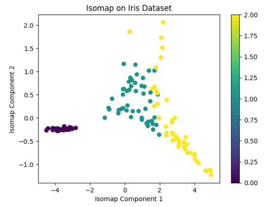
 

# [DR-8] MDS(Multidimensional Scaling) : 다차원 척도
▣ 정의: MDS는 고차원 데이터 포인트 간의 거리를 보존하며 저차원으로 투영하는 차원 축소 기법 
▣ 필요성: 데이터의 유사성 또는 거리 정보를 저차원에서도 유지하여 시각화하기 위해 사용 
▣ 장점: 거리 정보를 보존하므로 데이터의 기하학적 관계를 잘 유지하며, 비선형 구조를 일부 보존 
▣ 단점: 계산 비용이 높고, 대용량 데이터에는 적합하지 않으며, 초기화에 민감하여 결과가 다를 수 있음 
▣ 응용분야: 심리학, 생물정보학, 마케팅 데이터 분석 등 
▣ 모델식: 데이터 포인트 간의 거리 행렬을 유지하며 저차원에서 구성 

    from sklearn.manifold import MDS
    import matplotlib.pyplot as plt
    from sklearn.datasets import load_iris

    # 데이터 로드
    data = load_iris()
    X = data.data

    # MDS 적용
    mds = MDS(n_components=2, random_state=42)
    X_mds = mds.fit_transform(X)

    # 결과 시각화
    plt.scatter(X_mds[:, 0], X_mds[:, 1], c=data.target)
    plt.xlabel("MDS Component 1")
    plt.ylabel("MDS Component 2")
    plt.title("MDS on Iris Dataset")
    plt.colorbar()
    plt.show()

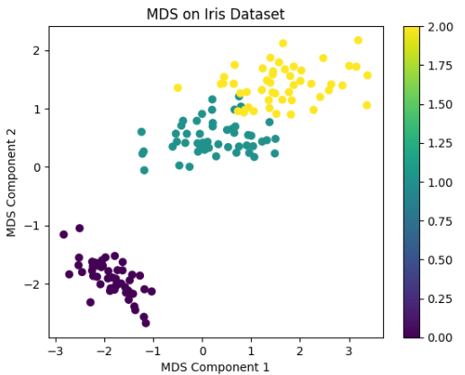
 

# [DR-9] SOM(Self-Organizing Maps) : 자기 조직화
▣ 정의 : 고차원의 데이터를 저차원(일반적으로 2차원) 공간으로 투영하여 데이터의 구조를 시각화하는 데 사용. PCA는 선형 변환을 통해 차원 축소를 수행하지만, SOM은 비선형 변환을 사용하여 더 복잡한 데이터 구조를 반영할 수 있으며, k-평균은 각 군집의 중심을 찾는 방식으로 군집화를 수행하는 반면, SOM은 뉴런이 격자 형태로 조직되어 있어 더 직관적인 시각화가 가능  
▣ 절차
(1) 초기화: SOM의 각 뉴런에 임의의 가중치 벡터를 할당(이 가중치 벡터는 입력 데이터와 같은 차원) 
(2) 입력 데이터 선택: 학습 과정에서 입력 데이터 벡터 하나를 무작위로 선택 
(3) 승자 뉴런(BMU, Best Matching Unit) 찾기: SOM의 모든 뉴런 중에서 현재 입력 벡터와 가장 유사한(가중치 벡터 간의 유클리드 거리로 측정) 뉴런을 찾는 경쟁 학습의 핵심 단계 
(4) 가중치 벡터 갱신: 선택된 승자 뉴런과 그 주변 이웃 뉴런들의 가중치 벡터를 조정한다. 이때, 가중치 벡터는 입력 데이터에 더 가깝게 이동  
▣ 장점 : 데이터에 대한 사전 정보가 없어도 유용하게 사용 가능, 군집의 분포나 데이터의 경향성을 직관적으로 이해, 입력 데이터의 이웃 관계를 보존하면서 저차원으로 투영하므로 원래 데이터의 공간적 관계를 유지  
▣ 단점 : 학습률과 이웃 크기 등 여러 파라미터를 적절히 설정해야 하며, 대규모 데이터 학습에 비효율적, 변환된 맵을 해석하는 것이 PCA 등의 선형 변환보다 더 어려움  
▣ 응용분야 : 이미지 분석, 문서 분류, 음성 인식, 생물정보학 
▣ 모델식 : 뉴런의 위치 𝑟와 입력 벡터 𝑥 간의 거리 함수로 클러스터를 형성(𝜂(𝑡)는 학습률, ℎ(𝑡)는 이웃 함수) 
$W(t+1)=W(t)+\theta(t)\cdot\eta(t)\cdot(X-W(t))$ 

    !pip install minisom

    from minisom import MiniSom
    import numpy as np
    import matplotlib.pyplot as plt
    from sklearn.datasets import load_iris
    from sklearn.preprocessing import MinMaxScaler

    # 데이터 로드 및 정규화
    data = load_iris()
    X = data.data
    scaler = MinMaxScaler()
    X_scaled = scaler.fit_transform(X)

    # SOM 초기화 및 학습
    som = MiniSom(x=10, y=10, input_len=4, sigma=1.0, learning_rate=0.5, random_seed=42)
    som.train_random(X_scaled, 100)  # 100회 반복 학습

    # SOM 시각화
    plt.figure(figsize=(10, 10))
    for i, x in enumerate(X_scaled):
        w = som.winner(x)
        plt.text(w[0] + 0.5, w[1] + 0.5, str(data.target[i]),
        color=plt.cm.rainbow(data.target[i] / 2.0),
        fontdict={'weight': 'bold', 'size': 11})

    plt.title("SOM Clustering of Iris Data")
    plt.xlim([0, 10])
    plt.ylim([0, 10])
    plt.grid()
    plt.show()

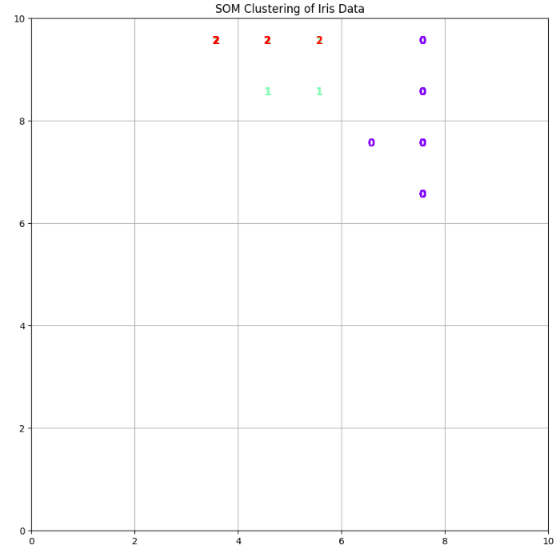
  

| 알고리즘 | 주요 수학식 | 목적함수 / 평가함수 |
|:--------------------------------------|:----------------------------------|:----------------------------------|
| **[1] PCA (Principal Component Analysis)** 주성분 분석 |  |  |
| **[2] SVD (Singular Value Decomposition)** 특이값 분해 |  |  |
| **[3] ICA (Independent Component Analysis)** 독립성분 분석 |  | ) |
| **[4] NMF (Non-negative Matrix Factorization)** 비음수 행렬 분해 |  |  |
| **[5] t-SNE (t-distributed Stochastic Neighbor Embedding)** t-분포 확률적 이웃 임베딩 | %7D%7B%5Csum_%7Bk%5Cne%20l%7D%5Cexp(-%5ClVert%20x_k-x_l%5CrVert%5E2%2F2%5Csigma_k%5E2)%7D%2C%5Cquad%20q_%7Bij%7D%3D%5Cfrac%7B(1%2B%5ClVert%20y_i-y_j%5CrVert%5E2)%5E-1%7D%7B%5Csum_%7Bk%5Cne%20l%7D(1%2B%5ClVert%20y_k-y_l%5CrVert%5E2)%5E-1%7D) | %3D%5Csum_%7Bi%5Cne%20j%7Dp_%7Bij%7D%5Clog%5Cfrac%7Bp_%7Bij%7D%7D%7Bq_%7Bij%7D%7D) |
| **[6] UMAP (Uniform Manifold Approximation and Projection)** 균일 매니폴드 근사적 사영 | -%5Crho_i%7D%7B%5Csigma_i%7D%5Cright)) | %5Clog%5Cfrac%7B1-w_%7Bij%7D%7D%7B1-%5Chat%7Bw%7D_%7Bij%7D%7D%5CBig)%5D) |
| **[7] Isomap (Isometric Mapping)** 등거리 매핑 | %3D%5Cmathrm%7BShortestPathDistance%7D(x_i%2Cx_j)) | %3D%5ClVert%20y_i-y_j%5CrVert) |
| **[8] MDS (Multidimensional Scaling)** 다차원 척도 |  | %5E2) |
| **[9] SOM (Self-Organizing Maps)** 자기 조직화 지도 |  | ) |

---

## [Q&A] t-SNE가 동심원 데이터셋을 제대로 분리하지 못하는 이유와 해결 방안
**이유** : t-SNE는 국소적 구조(Local Structure)를 보존하는 데 집중하므로 전역적 구조(Global Structure)를 놓치는 경우가 많은데, 동심원 데이터는 전역적 구조(원과 원 간의 거리)를 잘 반영해야 하기 때문에 문제가 발생 

**해결방안** 
(1) UMAP 사용: 국소적 구조와 전역적 구조를 동시에 보존 
(2) t-SNE 매개변수 튜닝: Perplexity, 학습률, 반복 횟수를 조정 
(3) PCA와 결합: 전역적 구조를 먼저 반영한 뒤 t-SNE 적용 
(4) 다른 차원 축소 기법: Kernel PCA, Spectral Embedding 등 사용 

	import os
	import matplotlib.pyplot as plt
	from matplotlib import font_manager, rc
	from sklearn.datasets import make_circles
	from sklearn.manifold import TSNE
	from sklearn.decomposition import PCA
	from umap import UMAP
	from sklearn.preprocessing import StandardScaler
	
	# Windows 환경에서 사용할 한글 폰트 설정
	font_path = 'C:/Windows/Fonts/malgun.ttf'  # Windows의 '맑은 고딕' 폰트 경로
	font_name = font_manager.FontProperties(fname=font_path).get_name()
	rc('font', family=font_name)
	
	# '-' 기호 깨짐 방지
	plt.rcParams['axes.unicode_minus'] = False
	
	# 1. 데이터 생성
	X, y = make_circles(n_samples=500, factor=0.5, noise=0.05, random_state=42)
	
	# 2. 기본 t-SNE
	tsne_basic = TSNE(n_components=2, random_state=42)
	X_tsne_basic = tsne_basic.fit_transform(X)
	
	# 2-1. UMAP 하이퍼파라미터 최적화 (기존 설정 최적화)
	umap_optimized = UMAP(n_neighbors=30, min_dist=0.05, n_components=2, random_state=42)
	X_umap_optimized = umap_optimized.fit_transform(X)
	
	# 2-2. UMAP 하이퍼파라미터 재조정 (표준화 데이터 적용)
	scaler = StandardScaler()
	X_scaled = scaler.fit_transform(X)  # 데이터 표준화
	umap_revised = UMAP(n_neighbors=20, min_dist=0.1, n_components=2, random_state=42)
	X_umap_revised = umap_revised.fit_transform(X_scaled)
	
	# 3. UMAP (기본 설정)
	umap = UMAP(n_neighbors=15, min_dist=0.1, n_components=2, random_state=42)
	X_umap = umap.fit_transform(X)
	
	# 4. t-SNE 매개변수 튜닝
	tsne_tuned = TSNE(n_components=2, perplexity=50, learning_rate=300, n_iter=5000, random_state=42)
	X_tsne_tuned = tsne_tuned.fit_transform(X)
	
	# 5. PCA + t-SNE
	pca = PCA(n_components=2)  # PCA로 차원 축소 (데이터의 차원 수 이하로 설정)
	X_pca = pca.fit_transform(X)
	tsne_pca = TSNE(n_components=2, perplexity=50, learning_rate=300, n_iter=5000, random_state=42)
	X_tsne_pca = tsne_pca.fit_transform(X_pca)
	
	# 6. 시각화
	fig, axs = plt.subplots(4, 2, figsize=(12, 20))
	
	# 원데이터 시각화
	axs[0, 0].scatter(X[:, 0], X[:, 1], c=y, cmap='viridis', s=10)
	axs[0, 0].set_title("원 데이터 (동심원)")
	
	# 기본 t-SNE
	axs[0, 1].scatter(X_tsne_basic[:, 0], X_tsne_basic[:, 1], c=y, cmap='viridis', s=10)
	axs[0, 1].set_title("기본 t-SNE")
	
	# UMAP (최적화: n_neighbors=30, min_dist=0.05)
	axs[1, 0].scatter(X_umap_optimized[:, 0], X_umap_optimized[:, 1], c=y, cmap='viridis', s=10)
	axs[1, 0].set_title("최적화된 UMAP (n_neighbors=30, min_dist=0.05)")
	
	# UMAP (재조정: n_neighbors=20, min_dist=0.1, 표준화 적용)
	axs[1, 1].scatter(X_umap_revised[:, 0], X_umap_revised[:, 1], c=y, cmap='viridis', s=10)
	axs[1, 1].set_title("UMAP (표준화, n_neighbors=20, min_dist=0.1)")
	
	# UMAP (기본 설정)
	axs[2, 0].scatter(X_umap[:, 0], X_umap[:, 1], c=y, cmap='viridis', s=10)
	axs[2, 0].set_title("UMAP (기본 설정)")
	
	# t-SNE 매개변수 튜닝
	axs[2, 1].scatter(X_tsne_tuned[:, 0], X_tsne_tuned[:, 1], c=y, cmap='viridis', s=10)
	axs[2, 1].set_title("t-SNE (매개변수 튜닝)")
	
	# PCA + t-SNE
	axs[3, 0].scatter(X_tsne_pca[:, 0], X_tsne_pca[:, 1], c=y, cmap='viridis', s=10)
	axs[3, 0].set_title("PCA + t-SNE")
	
	# 빈 플롯
	axs[3, 1].axis('off')  # 마지막 빈 플롯 제거
	
	# 레이아웃 정리
	plt.tight_layout()
	plt.show()
	
	# 7. 평가 출력 (한글로 번역)
	print("결과 분석:")
	print("1. 기본 t-SNE: 동심원의 전역 구조를 잘 보존하지 못할 수 있으며, 데이터 포인트가 섞여 나타날 가능성이 큽니다.")
	print("2. UMAP (최적화, n_neighbors=30, min_dist=0.05): 두 원의 분리가 명확하지 않으며, 전역 구조가 왜곡될 가능성이 있습니다.")
	print("3. UMAP (표준화, n_neighbors=20, min_dist=0.1): 표준화 적용으로 전역 및 국소 구조가 개선되었을 가능성이 큽니다.")
	print("4. UMAP (기본 설정): 두 원의 전역 구조 보존이 부족하며 왜곡이 발생할 수 있습니다.")
	print("5. t-SNE (매개변수 튜닝): 두 원의 전역 구조와 국소 구조를 잘 보존하며, 분리가 명확합니다.")
	print("6. PCA + t-SNE: 전역 구조와 국소 구조가 균형 있게 보존되며, 동심원의 구조를 명확히 표현합니다.")

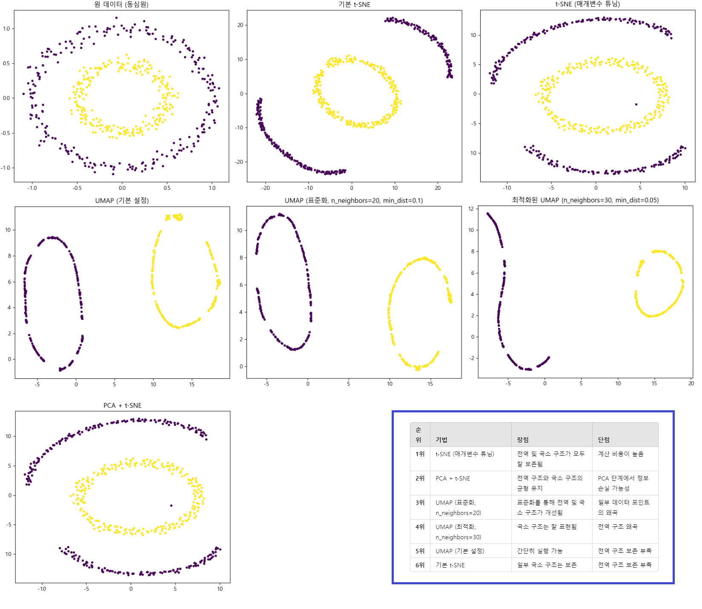

 

---

