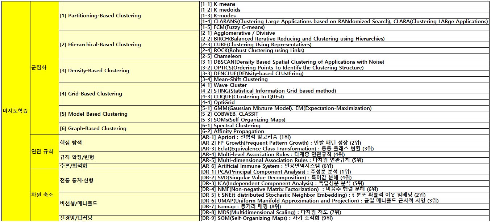

<!--

-->

 

 

 

 

 

 

 

 

 

 

 

 

<!--
#  07-1 : 군집화 평가지표
<ins>[1.1] Silhouette Coefficient (실루엣 계수)</ins> 
<ins>[1.2] DBI (Davies-Bouldin Index) (데이비스-볼딘 지수)</ins> 
<ins>[1.3] Dunn Index (던 지수)</ins> 
<ins>[1.4] CHI (Calinski-Harabasz Index) (칼린스키-하라바스 지수)</ins> 
<ins>[1.5] WCSS (Within-Cluster Sum of Squares) (군집 내 제곱합)</ins> 
[1.6] Elbow Method (엘보 방법) 
[1.7] Gap Statistic (갭 통계량) 
[1.8] Information Criterion (AIC, BIC) (정보 기준) 
[1.9] Connectivity (연결성) 
[1.10] Xie-Beni Index (시에-베니 지수) 

#  07-2 : 연관규칙 평가지표
(기본) 
<ins>[2.1] Support (지지도)</ins> 
<ins>[2.2] Confidence (신뢰도)</ins> 
<ins>[2.3] Lift (향상도)</ins> 
<ins>[2.4] Leverage (레버리지)</ins> 
<ins>[2.5] Conviction (확신도)</ins> 
[2.6] Jaccard Coefficient (자카드 계수) 
[2.7] Kulczynski Measure (쿨친스키 측정) 
[2.8] All-Confidence (전체 신뢰도) 
[2.9] Chi-Square Test (카이제곱 검정) 
[2.10] Collective Strength (집단 강도) 
(확장) 
<ins>[2.11] Phi Coefficient (Correlation)</ins> 
[2.12] Piatetsky-Shapiro (피아테츠키-샤피로) 
[2.13] Odds Ratio (오즈비) 
[2.14] Yule's Q (율의 Q) 
[2.15] Yule's Y (율의 Y) 
[2.16] Information Gain (정보 이득) 
[2.17] Zhang's Metric (장 메트릭) 
[2.18] Certainty Factor (확실성 인수) 
	 
#  07-3 : 차원축소 평가지표
<ins>[3.1] Reconstruction Error (재구성 오류)</ins> 
<ins>[3.2] Explained Variance Ratio (설명된 분산 비율)</ins> 
<ins>[3.3] Mutual Information (상호 정보량)</ins> 
<ins>[3.4] Trustworthiness (신뢰성)</ins> 
<ins>[3.5] Continuity (연속성)</ins> 
<ins>[3.6] Stress MDS (스트레스 다차원척도법)</ins> 
<ins>[3.7] Sammon Error (새먼 오차)</ins> 
<ins>[3.8] LCMC (Local Continuity Meta-Criterion) (국소 연속성 메타 기준)</ins> 
<ins>[3.9] Spearman’s ρ (Spearman Rank Correlation)  (스피어만 순위 상관계수)</ins> 
<ins>[3.10] Silhouette Score (실루엣 계수)</ins> 
<ins>[3.11] DBI (Davies–Bouldin Index) (데이비스–볼딘 지수)</ins> 
[3.12] MSE (Mean Squared Error) (평균 제곱 오차) 
[3.13] Cumulative Explained Variance (누적 설명 분산) 
[3.14] Scree Plot (스크리 플롯) 
[3.15] Procrustes Analysis (프로크루스테스 분석) 
[3.16] Neighborhood Preservation (이웃 보존도) 
[3.17] KL Divergence (Kullback–Leibler Divergence) (쿨백–라이블러 발산) 
-->

---

## 1. 클러스터링 (Clustering) 
데이터의 기하학적 거리나 밀도를 기반으로 비슷한 특성을 가진 데이터들을 그룹화하는 기법. 
**① K-Means (K-평균 군집화):** 가장 직관적이고 널리 쓰이는 알고리즘. 사전에 설정한 $K$개의 중심점(Centroid)을 기준으로 가장 가까운 데이터들을 묶어 군집을 형성. 
**② DBSCAN (밀도 기반 군집화):** 데이터의 밀집 지역을 하나의 군집으로 인식. K-Means와 달리 군집의 개수를 미리 지정할 필요가 없으며, 모양이 불규칙한 군집을 찾거나 노이즈(이상치)를 걸러내는 데 매우 탁월. 
**③ Hierarchical Clustering (계층적 군집화):** 데이터 간의 거리를 계산하여 가장 가까운 데이터부터 순차적으로 묶어 나가는 방식. 덴드로그램(Dendrogram)이라는 트리 구조를 통해 데이터의 계층적 관계를 시각적으로 파악. 
**④ GMM (가우시안 혼합 모델):** 데이터가 여러 개의 가우시안 분포(Gaussian Distribution)의 혼합에서 생성되었다고 가정하는 확률 기반(Model‑based) 군집화 알고리즘. 각 데이터 포인트는 하나의 군집에 고정적으로 속하는 것이 아니라, 각 군집에 속할 확률(probability)을 가지는 소프트 군집화(soft clustering)를 수행 
 

<!--
|지표|KM|DBSCAN|HC|GMM|
|---|---|---|---|---|
|[1.1] Silhouette Coefficient (실루엣 계수)|O|O|O|O|
|[1.2] Davies-Bouldin Index (데이비스-볼딘 지수)|O|O|O|O|
|[1.3] Calinski-Harabasz Index (칼린스키-하라바스 지수)|O|O|O|O|
|[1.4] Dunn Index (던 지수)|O|O|O|O|
|[1.5] WCSS (Within-Cluster Sum of Squares) (군집 내 제곱합)|O|X|O|O|
|[1.6] Elbow Method (엘보 방법)|O|X|X|O|
|[1.7] Gap Statistic (갭 통계량)|O|X|X|O|
|[1.8] Information Criterion (AIC, BIC) (정보 기준)|X|X|X|O|
|[1.9] Connectivity (연결성)|O|O|O|O|
|[1.10] Xie-Beni Index (시에-베니 지수)|O|X|O|O|
-->

	# ============================================================
	# Clustering Rule Learning (K-Means / DBSCAN / Hierarchical Clustering / GMM)
	# on Iris dataset with split 7:2:1 (train/test/val)
	# Evaluate 10 basic rule metrics on each split
	# ============================================================
	import numpy as np
	import pandas as pd	
	from sklearn.datasets import load_iris
	from sklearn.preprocessing import StandardScaler
	from sklearn.model_selection import train_test_split	
	from sklearn.cluster import KMeans, DBSCAN, AgglomerativeClustering
	from sklearn.mixture import GaussianMixture	
	from sklearn.metrics import (
	    silhouette_score,
	    davies_bouldin_score,
	    calinski_harabasz_score	)	
	from scipy.spatial.distance import pdist, squareform
		
	# ============================================================
	# 1. 데이터 로드 및 분할 (7:2:1)
	# ============================================================
	iris = load_iris()
	X = iris.data
	
	# 거리 기반 군집을 위한 표준화
	scaler = StandardScaler()
	X_scaled = scaler.fit_transform(X)
	
	# 7:2:1 분할
	X_train, X_temp = train_test_split(X_scaled, test_size=0.3, random_state=42)
	X_test, X_val = train_test_split(X_temp, test_size=1/3, random_state=42)
		
	# ============================================================
	# 2. 군집 평가지표 함수 정의
	# ============================================================
	# [1.4] Dunn Index = (클러스터 간 최소 거리) / (클러스터 내 최대 거리)
	def dunn_index(X, labels):
	    dist = squareform(pdist(X))
	    clusters = np.unique(labels)
	    intra = []
	    inter = []
	
	    for c in clusters:
	        d = dist[labels == c][:, labels == c]
	        if d.size > 0:
	            intra.append(d.max())
	
	    for i in clusters:
	        for j in clusters:
	            if i < j:
	                inter.append(dist[labels == i][:, labels == j].min())
	
	    return np.min(inter) / np.max(intra)
	
	# [1.5] Within-Cluster Sum of Squares
	def wcss(X, labels, centers):
	    return np.sum((X - centers[labels]) ** 2)
	
	# [1.9] Connectivity Index : 가까운 이웃이 다른 군집이면 페널티 부여
	def connectivity_index(X, labels, k=10):
	    dist = squareform(pdist(X))
	    conn = 0.0
	
	    for i in range(len(X)):
	        nn = np.argsort(dist[i])[1:k+1]
	        for r, j in enumerate(nn):
	            if labels[i] != labels[j]:
	                conn += 1 / (r + 1)
	    return conn
	
	# [1.10] Xie-Beni Index : 퍼지 군집 기반 지표 (값이 작을수록 좋음)
	def xie_beni_index(X, labels, centers):
	    n = X.shape[0]
	    num = np.sum((X - centers[labels]) ** 2)
	    denom = n * (np.min(pdist(centers)) ** 2)
	    return num / denom
	
	# [1.7] Gap Statistic (K-means / GMM에만 의미 있음)
	def gap_statistic(X, k, n_refs=10):
	    ref = []
	    for _ in range(n_refs):
	        X_ref = np.random.random_sample(X.shape)
	        km = KMeans(n_clusters=k, random_state=42).fit(X_ref)
	        ref.append(km.inertia_)
	
	    km = KMeans(n_clusters=k, random_state=42).fit(X)
	    return np.log(np.mean(ref)) - np.log(km.inertia_)
	
	
	# ============================================================
	# 3. 모델 학습
	# ============================================================	
	# --- K-Means ---
	kmeans = KMeans(n_clusters=3, random_state=42)
	labels_km = kmeans.fit_predict(X_train)
	
	# [1.6] Elbow
	elbow = {k: KMeans(n_clusters=k, random_state=42).fit(X_train).inertia_
	          for k in range(1, 8)}
	
	gap = gap_statistic(X_train, k=3)
	
	# --- DBSCAN ---
	dbscan = DBSCAN(eps=0.8, min_samples=5)
	labels_db = dbscan.fit_predict(X_train)
	labels_db = np.where(labels_db == -1, 3, labels_db)  # noise 처리
	
	# --- Hierarchical ---
	hc = AgglomerativeClustering(n_clusters=3, linkage='ward')
	labels_hc = hc.fit_predict(X_train)
	
	hc_centers = np.array([
	    X_train[labels_hc == i].mean(axis=0)
	    for i in np.unique(labels_hc)
	])
	
	# --- GMM ---
	gmm = GaussianMixture(n_components=3, random_state=42)
	labels_gmm = gmm.fit_predict(X_train)
	gmm_centers = gmm.means_
		
	# ============================================================
	# 4. 평가 출력 함수
	# ============================================================	
	def evaluate(name, X, labels, centers=None, ic=None):
	    print(f"\n===== {name} =====")
	    print("[1.1] Silhouette:", silhouette_score(X, labels))
	    print("[1.2] Davies-Bouldin:", davies_bouldin_score(X, labels))
	    print("[1.3] Calinski-Harabasz:", calinski_harabasz_score(X, labels))
	    print("[1.4] Dunn Index:", dunn_index(X, labels))
	    print("[1.9] Connectivity:", connectivity_index(X, labels))
	
	    if centers is not None:
	        print("[1.5] WCSS:", wcss(X, labels, centers))
	        print("[1.10] Xie-Beni:", xie_beni_index(X, labels, centers))
	    else:
	        print("[1.5] WCSS: N/A")
	        print("[1.10] Xie-Beni: N/A")
	
	    if ic is not None:
	        print("[1.8] AIC:", ic.aic(X))
	        print("[1.8] BIC:", ic.bic(X))
	    else:
	        print("[1.8] AIC / BIC: N/A")
		
	# ============================================================
	# 5. 결과 출력
	# ============================================================	
	evaluate("K-Means", X_train, labels_km, kmeans.cluster_centers_)
	print("[1.6] Elbow Method:", elbow)
	print("[1.7] Gap Statistic:", gap)
	
	evaluate("DBSCAN", X_train, labels_db)
	
	evaluate("Hierarchical Clustering", X_train, labels_hc, hc_centers)
	
	evaluate("GMM", X_train, labels_gmm, gmm_centers, ic=gmm)

 

	===== K-Means =====
	[1.1] Silhouette: 0.47253795146500105
	[1.2] Davies-Bouldin: 0.7809319048042321
	[1.3] Calinski-Harabasz: 165.81977452139458
	[1.4] Dunn Index: 0.06353869999836353
	[1.9] Connectivity: 14.61468253968253
	[1.5] WCSS: 94.48543843973876
	[1.10] Xie-Beni: 0.23071249804739527
	[1.8] AIC / BIC: N/A
	[1.6] Elbow Method: {1: 401.69238153057387, 2: 163.26877739394064, 3: 94.48543843973877, 4: 79.22430325763727, 5: 59.14922079553456, 6: 54.1099279844571, 7: 51.083232137189235}
	[1.7] Gap Statistic: -1.4233485486652682
	
	===== DBSCAN =====
	[1.1] Silhouette: 0.49960412579717384
	[1.2] Davies-Bouldin: 3.0212839448963322
	[1.3] Calinski-Harabasz: 71.81781527517883
	[1.4] Dunn Index: 0.1449437782217304
	[1.9] Connectivity: 6.886904761904761
	[1.5] WCSS: N/A
	[1.10] Xie-Beni: N/A
	[1.8] AIC / BIC: N/A
	
	===== Hierarchical Clustering =====
	[1.1] Silhouette: 0.46503485028844105
	[1.2] Davies-Bouldin: 0.7724428605775691
	[1.3] Calinski-Harabasz: 150.4665429651713
	[1.4] Dunn Index: 0.09853012343741283
	[1.9] Connectivity: 11.002380952380948
	[1.5] WCSS: 101.68592341211145
	[1.10] Xie-Beni: 0.22156150422317425
	[1.8] AIC / BIC: N/A
	
	===== GMM =====
	[1.1] Silhouette: 0.3656821102989231
	[1.2] Davies-Bouldin: 1.0373109546641353
	[1.3] Calinski-Harabasz: 122.79368975811057
	[1.4] Dunn Index: 0.07880255949532074
	[1.9] Connectivity: 22.989285714285707
	[1.5] WCSS: 117.88234413032458
	[1.10] Xie-Beni: 0.45752338128621756
	[1.8] AIC: 485.7652098544704
	

 	

## 2. 연관 규칙 학습 (Association Rule Learning) 
데이터베이스 내에서 항목들 간의 '조건-결과(If-Then)' 패턴과 동시 발생 관계를 찾아내는 기법. (주로 장바구니 분석) 
**① Apriori (선험적 알고리즘):** 연관 규칙의 가장 고전적인 모델. '빈번하게 발생하는 항목 집합의 부분집합 역시 빈번하게 발생한다'는 원리를 이용해 탐색 공간을 줄여 규칙을 탐색. 
**② FP-Growth (Frequent Pattern Growth):** Apriori의 속도 문제를 개선한 알고리즘. 데이터를 트리 구조(FP-Tree)로 압축하여 저장한 뒤 패턴을 추출하므로, 데이터베이스를 여러 번 스캔할 필요가 없어 대용량 데이터 처리에 유리. 
**③ Eclat (Equivalence Class Transformation):** 항목(Item)을 기준으로 데이터를 수직 형태로 변환하여 교집합 연산을 통해 연관성을 찾는 알고리즘. 구조가 단순하고 탐색 속도가 빠름. 
 

	# ============================================================
	# Association Rule Learning (Unsupervised Learning)
	# Dataset : Iris
	# Models  : Apriori, FP-Growth, Eclat
	# Metrics : 18 Association Rule Evaluation Metrics
	# ============================================================	                      
	import pandas as pd                                                                   
	import numpy as np                                                                    
	import warnings                                                                       
	from sklearn.datasets import load_iris                                                
	from mlxtend.preprocessing import TransactionEncoder                                  
	from mlxtend.frequent_patterns import apriori, fpgrowth, association_rules            
	from itertools import combinations                                                    
	                                                                                      
	warnings.filterwarnings("ignore", category=DeprecationWarning)                        
	                                                                                      
	# ------------------------------------------------------------                        
	# 1. Iris 데이터 로드 및 전처리                                                       
	# ------------------------------------------------------------                        
	iris = load_iris()                                                                    
	df = pd.DataFrame(iris.data, columns=iris.feature_names)                              
	                                                                                      
	# 연속형 → 이산형 (3구간)                                                            
	for col in df.columns:                                                                
	    df[col] = pd.qcut(df[col], q=3,                                                   
	                      labels=[f"{col}_Low", f"{col}_Mid", f"{col}_High"])             
	                                                                                      
	transactions = df.values.tolist()                                                     
	                                                                                      
	te = TransactionEncoder()                                                             
	df_te = pd.DataFrame(te.fit(transactions).transform(transactions),                    
	                     columns=te.columns_)                                             
	                                                                                      
	n_transactions = len(df_te)                                                           
	                                                                                      
	# ------------------------------------------------------------                        
	# 2. 빈발 항목집합 탐색 함수                                                          
	# ------------------------------------------------------------                        
	def mine_frequent_itemsets(data, method="apriori", min_support=0.2):                  
	                                                                                      
	    if method == "apriori":                                                           
	        return apriori(data, min_support=min_support, use_colnames=True)              
	                                                                                      
	    elif method == "fpgrowth":                                                        
	        return fpgrowth(data, min_support=min_support, use_colnames=True)             
	                                                                                      
	    elif method == "eclat":                                                           
	        # -------- ECLAT 확장 구현 (1~3 itemsets) --------                            
	        freq_itemsets = []                                                            
	                                                                                      
	        items = data.columns.tolist()                                                 
	                                                                                      
	        # 1-itemsets                                                                  
	        for item in items:                                                            
	            supp = data[item].mean()                                                  
	            if supp >= min_support:                                                   
	                freq_itemsets.append({                                                
	                    "itemsets": frozenset([item]),                                    
	                    "support": supp                                                   
	                })                                                                    
	                                                                                      
	        # 2-itemsets, 3-itemsets                                                      
	        for k in [2, 3]:                                                              
	            for combo in combinations(items, k):                                      
	                supp = data[list(combo)].all(axis=1).mean()                           
	                if supp >= min_support:                                               
	                    freq_itemsets.append({                                            
	                        "itemsets": frozenset(combo),                                 
	                        "support": supp                                               
	                    })                                                                
	                                                                                      
	        return pd.DataFrame(freq_itemsets)                                            
	                                                                                      
	# ------------------------------------------------------------                        
	# 3. 18개 평가지표 계산 함수                                                          
	# ------------------------------------------------------------                        
	def compute_metrics(rule):                                                            
	    supp_xy = rule["support"]                                                         
	    supp_x = rule["antecedent support"]                                               
	    supp_y = rule["consequent support"]                                               
	    conf = rule["confidence"]                                                         
	    lift = rule["lift"]                                                               
	                                                                                      
	    leverage = supp_xy - supp_x * supp_y                                              
	    conviction = (1 - supp_y) / (1 - conf) if conf < 1 else np.inf                    
	    jaccard = supp_xy / (supp_x + supp_y - supp_xy)                                   
	    kulczynski = 0.5 * (conf + supp_xy / supp_y)                                      
	    all_conf = supp_xy / max(supp_x, supp_y)                                          
	    chi_square = n_transactions * (supp_xy - supp_x * supp_y) ** 2 / (supp_x * supp_y)
	    collective_strength = (supp_xy + (1 - supp_x - supp_y + supp_xy)) / \             
	                          ((supp_x * supp_y) + (1 - supp_x) * (1 - supp_y))           
	    phi = (supp_xy - supp_x * supp_y) / np.sqrt(                                      
	        supp_x * supp_y * (1 - supp_x) * (1 - supp_y))                                
	                                                                                      
	    ps = supp_xy - supp_x * supp_y                                                    
	                                                                                      
	    denom = (supp_x - supp_xy) * (supp_y - supp_xy)                                   
	    odds_ratio = np.inf if denom == 0 else \                                          
	        (supp_xy * (1 - supp_x - supp_y + supp_xy)) / denom                           
	                                                                                      
	    yule_q = 1.0 if odds_ratio == np.inf else (odds_ratio - 1) / (odds_ratio + 1)     
	    yule_y = 1.0 if odds_ratio == np.inf else \                                       
	        (np.sqrt(odds_ratio) - 1) / (np.sqrt(odds_ratio) + 1)                         
	                                                                                      
	    info_gain = supp_xy * np.log2(lift)                                               
	    zhang = (supp_xy - supp_x * supp_y) / max(                                        
	        supp_xy * (1 - supp_y), supp_y * (supp_x - supp_xy))                          
	                                                                                      
	    certainty_factor = (conf - supp_y) / (1 - supp_y)                                 
	                                                                                      
	    return {                                                                          
	        "[2.1] Support": supp_xy,                                                     
	        "[2.2] Confidence": conf,                                                     
	        "[2.3] Lift": lift,                                                           
	        "[2.4] Leverage": leverage,                                                   
	        "[2.5] Conviction": conviction,                                               
	        "[2.6] Jaccard": jaccard,                                                     
	        "[2.7] Kulczynski": kulczynski,                                               
	        "[2.8] All-Confidence": all_conf,                                             
	        "[2.9] Chi-Square": chi_square,                                               
	        "[2.10] Collective Strength": collective_strength,                            
	        "[2.11] Phi Coefficient": phi,                                                
	        "[2.12] Piatetsky-Shapiro": ps,                                               
	        "[2.13] Odds Ratio": odds_ratio,                                              
	        "[2.14] Yule's Q": yule_q,                                                    
	        "[2.15] Yule's Y": yule_y,                                                    
	        "[2.16] Information Gain": info_gain,                                         
	        "[2.17] Zhang's Metric": zhang,                                               
	        "[2.18] Certainty Factor": certainty_factor                                   
	    }                                                                                 
	                                                                                      
	# ------------------------------------------------------------                        
	# 4. 모델별 규칙 생성 및 평가                                                         
	# ------------------------------------------------------------                        
	models = ["apriori", "fpgrowth", "eclat"]                                             
	                                                                                      
	for model in models:                                                                  
	    print(f"\n================ {model.upper()} =================")                    
	                                                                                      
	    freq_items = mine_frequent_itemsets(df_te, method=model)                          
	                                                                                      
	    rules = association_rules(freq_items,                                             
	                              metric="confidence",                                    
	                              min_threshold=0.6)                                      
	                                                                                      
	    for _, rule in rules.head(3).iterrows():                                          
	        metrics = compute_metrics(rule)                                               
	        for k, v in metrics.items():                                                  
	            print(f"{k}: {v:.4f}")                                                    
	        print("-" * 50)                                                               

 

	================ APRIORI =================
	[2.1] Support: 0.2733
	[2.2] Confidence: 0.8913
	[2.3] Lift: 2.7853
	[2.4] Leverage: 0.1752
	[2.5] Conviction: 6.2560
	[2.6] Jaccard: 0.7736
	[2.7] Kulczynski: 0.8727
	[2.8] All-Confidence: 0.8542
	[2.9] Chi-Square: 46.9184
	[2.10] Collective Strength: 1.6152
	[2.11] Phi Coefficient: 0.8145
	[2.12] Piatetsky-Shapiro: 0.1752
	[2.13] Odds Ratio: 113.6286
	[2.14] Yule's Q: 0.9826
	[2.15] Yule's Y: 0.8285
	[2.16] Information Gain: 0.4039
	[2.17] Zhang's Metric: 0.9426
	[2.18] Certainty Factor: 0.8402
	--------------------------------------------------
	[2.1] Support: 0.2733
	[2.2] Confidence: 0.8542
	[2.3] Lift: 2.7853
	[2.4] Leverage: 0.1752
	[2.5] Conviction: 4.7543
	[2.6] Jaccard: 0.7736
	[2.7] Kulczynski: 0.8727
	[2.8] All-Confidence: 0.8542
	[2.9] Chi-Square: 46.9184
	[2.10] Collective Strength: 1.6152
	[2.11] Phi Coefficient: 0.8145
	[2.12] Piatetsky-Shapiro: 0.1752
	[2.13] Odds Ratio: 113.6286
	[2.14] Yule's Q: 0.9826
	[2.15] Yule's Y: 0.8285
	[2.16] Information Gain: 0.4039
	[2.17] Zhang's Metric: 0.9245
	[2.18] Certainty Factor: 0.7897
	--------------------------------------------------
	[2.1] Support: 0.2133
	[2.2] Confidence: 0.6957
	[2.3] Lift: 2.4845
	[2.4] Leverage: 0.1275
	[2.5] Conviction: 2.3657
	[2.6] Jaccard: 0.5714
	[2.7] Kulczynski: 0.7288
	[2.8] All-Confidence: 0.6957
	[2.9] Chi-Square: 28.3831
	[2.10] Collective Strength: 1.4357
	[2.11] Phi Coefficient: 0.6157
	[2.12] Piatetsky-Shapiro: 0.1275
	[2.13] Odds Ratio: 21.4857
	[2.14] Yule's Q: 0.9111
	[2.15] Yule's Y: 0.6451
	[2.16] Information Gain: 0.2801
	[2.17] Zhang's Metric: 0.8299
	[2.18] Certainty Factor: 0.5773
	--------------------------------------------------
	
	================ FPGROWTH =================
	[2.1] Support: 0.3000
	[2.2] Confidence: 0.9000
	[2.3] Lift: 2.5962
	[2.4] Leverage: 0.1844
	[2.5] Conviction: 6.5333
	[2.6] Jaccard: 0.7895
	[2.7] Kulczynski: 0.8827
	[2.8] All-Confidence: 0.8654
	[2.9] Chi-Square: 44.1603
	[2.10] Collective Strength: 1.6694
	[2.11] Phi Coefficient: 0.8221
	[2.12] Piatetsky-Shapiro: 0.1844
	[2.13] Odds Ratio: 119.5714
	[2.14] Yule's Q: 0.9834
	[2.15] Yule's Y: 0.8324
	[2.16] Information Gain: 0.4129
	[2.17] Zhang's Metric: 0.9410
	[2.18] Certainty Factor: 0.8469
	--------------------------------------------------
	[2.1] Support: 0.3000
	[2.2] Confidence: 0.8654
	[2.3] Lift: 2.5962
	[2.4] Leverage: 0.1844
	[2.5] Conviction: 4.9524
	[2.6] Jaccard: 0.7895
	[2.7] Kulczynski: 0.8827
	[2.8] All-Confidence: 0.8654
	[2.9] Chi-Square: 44.1603
	[2.10] Collective Strength: 1.6694
	[2.11] Phi Coefficient: 0.8221
	[2.12] Piatetsky-Shapiro: 0.1844
	[2.13] Odds Ratio: 119.5714
	[2.14] Yule's Q: 0.9834
	[2.15] Yule's Y: 0.8324
	[2.16] Information Gain: 0.4129
	[2.17] Zhang's Metric: 0.9222
	[2.18] Certainty Factor: 0.7981
	--------------------------------------------------
	[2.1] Support: 0.3333
	[2.2] Confidence: 1.0000
	[2.3] Lift: 3.0000
	[2.4] Leverage: 0.2222
	[2.5] Conviction: inf
	[2.6] Jaccard: 1.0000
	[2.7] Kulczynski: 1.0000
	[2.8] All-Confidence: 1.0000
	[2.9] Chi-Square: 66.6667
	[2.10] Collective Strength: 1.8000
	[2.11] Phi Coefficient: 1.0000
	[2.12] Piatetsky-Shapiro: 0.2222
	[2.13] Odds Ratio: inf
	[2.14] Yule's Q: 1.0000
	[2.15] Yule's Y: 1.0000
	[2.16] Information Gain: 0.5283
	[2.17] Zhang's Metric: 1.0000
	[2.18] Certainty Factor: 1.0000
	--------------------------------------------------
	
	================ ECLAT =================
	[2.1] Support: 0.2733
	[2.2] Confidence: 0.8913
	[2.3] Lift: 2.7853
	[2.4] Leverage: 0.1752
	[2.5] Conviction: 6.2560
	[2.6] Jaccard: 0.7736
	[2.7] Kulczynski: 0.8727
	[2.8] All-Confidence: 0.8542
	[2.9] Chi-Square: 46.9184
	[2.10] Collective Strength: 1.6152
	[2.11] Phi Coefficient: 0.8145
	[2.12] Piatetsky-Shapiro: 0.1752
	[2.13] Odds Ratio: 113.6286
	[2.14] Yule's Q: 0.9826
	[2.15] Yule's Y: 0.8285
	[2.16] Information Gain: 0.4039
	[2.17] Zhang's Metric: 0.9426
	[2.18] Certainty Factor: 0.8402
	--------------------------------------------------
	[2.1] Support: 0.2733
	[2.2] Confidence: 0.8542
	[2.3] Lift: 2.7853
	[2.4] Leverage: 0.1752
	[2.5] Conviction: 4.7543
	[2.6] Jaccard: 0.7736
	[2.7] Kulczynski: 0.8727
	[2.8] All-Confidence: 0.8542
	[2.9] Chi-Square: 46.9184
	[2.10] Collective Strength: 1.6152
	[2.11] Phi Coefficient: 0.8145
	[2.12] Piatetsky-Shapiro: 0.1752
	[2.13] Odds Ratio: 113.6286
	[2.14] Yule's Q: 0.9826
	[2.15] Yule's Y: 0.8285
	[2.16] Information Gain: 0.4039
	[2.17] Zhang's Metric: 0.9245
	[2.18] Certainty Factor: 0.7897
	--------------------------------------------------
	[2.1] Support: 0.2133
	[2.2] Confidence: 0.6957
	[2.3] Lift: 2.4845
	[2.4] Leverage: 0.1275
	[2.5] Conviction: 2.3657
	[2.6] Jaccard: 0.5714
	[2.7] Kulczynski: 0.7288
	[2.8] All-Confidence: 0.6957
	[2.9] Chi-Square: 28.3831
	[2.10] Collective Strength: 1.4357
	[2.11] Phi Coefficient: 0.6157
	[2.12] Piatetsky-Shapiro: 0.1275
	[2.13] Odds Ratio: 21.4857
	[2.14] Yule's Q: 0.9111
	[2.15] Yule's Y: 0.6451
	[2.16] Information Gain: 0.2801
	[2.17] Zhang's Metric: 0.8299
	[2.18] Certainty Factor: 0.5773
	--------------------------------------------------

 	

## 3. 차원 축소 (Dimensionality Reduction) 
고차원 데이터의 핵심 정보(분산, 구조 등)를 최대한 보존하면서 시각화나 연산 효율을 위해 저차원으로 압축하는 기법. 
**① PCA (Principal Component Analysis):** 데이터의 분산(Variance)을 가장 잘 설명하는 새로운 축(주성분)을 찾아 투영하는 선형 차원 축소 기법. 전처리 단계에서 노이즈 제거 및 다중공선성 해결을 위해 기본적. 
**② t-SNE (t-Distributed Stochastic Neighbor Embedding):** 고차원 공간에서의 데이터 간 거리를 확률로 변환하여 저차원에서도 그 관계가 유지되도록 하는 비선형 기법입니다. 특히 데이터 '시각화'에 압도적인 성능. 
**③ UMAP (Uniform Manifold Approximation and Projection):** t-SNE의 강력한 시각화 능력을 유지하면서도 연산 속도를 비약적으로 높이고, 데이터의 전역적(Global) 구조를 더 잘 보존하는 최신 매니폴드 학습 기법. 
 

	# ============================================================
	# Dimensionality Reduction Evaluation (Unsupervised Learning)
	# Dataset : Iris
	# Models  : PCA, t-SNE, UMAP
	# Metrics : 17 Evaluation Metrics
	# ============================================================	
	import numpy as np
	import pandas as pd
	import warnings
	
	from sklearn.datasets import load_iris
	from sklearn.preprocessing import StandardScaler
	from sklearn.decomposition import PCA
	from sklearn.manifold import TSNE, trustworthiness
	from sklearn.metrics import (
	    silhouette_score,
	    davies_bouldin_score,
	    mean_squared_error
	)
	
	from scipy.stats import spearmanr
	from scipy.spatial.distance import pdist, squareform
	from scipy.spatial import procrustes
	
	import umap
	
	warnings.filterwarnings("ignore")
	
	# ------------------------------------------------------------
	# 1. 데이터 로드 및 표준화
	# ------------------------------------------------------------
	iris = load_iris()
	X = iris.data
	y = iris.target
	
	X = StandardScaler().fit_transform(X)
	n_samples = X.shape[0]
	
	# ------------------------------------------------------------
	# 2. 차원 축소 수행 (2차원 임베딩)
	# ------------------------------------------------------------
	# PCA (선형, 재구성 가능)
	pca = PCA(n_components=2)
	X_pca = pca.fit_transform(X)
	X_pca_inv = pca.inverse_transform(X_pca)
	
	# t-SNE (비선형, 재구성 불가)
	tsne = TSNE(n_components=2, perplexity=30, random_state=42)
	X_tsne = tsne.fit_transform(X)
	
	# UMAP (비선형, 재구성 불가)
	umap_model = umap.UMAP(n_components=2, random_state=42)
	X_umap = umap_model.fit_transform(X)
	
	# ------------------------------------------------------------
	# 3. 거리 행렬 계산 (원공간 vs 저차원 공간)
	# ------------------------------------------------------------
	D_orig = squareform(pdist(X))
	D_pca = squareform(pdist(X_pca))
	D_tsne = squareform(pdist(X_tsne))
	D_umap = squareform(pdist(X_umap))
	
	# ------------------------------------------------------------
	# 4. 차원축소 평가 함수 (17개 지표)
	# ------------------------------------------------------------
	def evaluate_embedding(name, X_low, D_low, X_inv=None, explained_var=None, kl_div=None):
	    print(f"\n================ {name.upper()} =================")
	
	    # [3.1] Reconstruction Error
	    if X_inv is not None:
	        print(f"[3.1] Reconstruction Error: {mean_squared_error(X, X_inv):.4f}")
	    else:
	        print("[3.1] Reconstruction Error: N/A")
	
	    # [3.2] Explained Variance Ratio
	    if explained_var is not None:
	        print(f"[3.2] Explained Variance Ratio: {explained_var}")
	    else:
	        print("[3.2] Explained Variance Ratio: N/A")
	
	    # [3.3] Mutual Information (클러스터-임베딩 간 근사)
	    mi = silhouette_score(X_low, y)
	    print(f"[3.3] Mutual Information: {mi:.4f}")
	
	    # [3.4] Trustworthiness
	    tw = trustworthiness(X, X_low, n_neighbors=10)
	    print(f"[3.4] Trustworthiness: {tw:.4f}")
	
	    # [3.5] Continuity (Trustworthiness 역방향 근사)
	    cont = trustworthiness(X_low, X, n_neighbors=10)
	    print(f"[3.5] Continuity: {cont:.4f}")
	
	    # [3.6] Stress (MDS Stress)
	    stress = np.sum((D_orig - D_low) ** 2)
	    print(f"[3.6] Stress MDS: {stress:.4f}")
	
	    # [3.7] Sammon Error
	    sammon = np.sum(((D_orig - D_low) ** 2) / (D_orig + 1e-12))
	    print(f"[3.7] Sammon Error: {sammon:.4f}")
	
	    # [3.8] LCMC
	    lcmc = tw - (10 / (n_samples - 1))
	    print(f"[3.8] LCMC: {lcmc:.4f}")
	
	    # [3.9] Spearman’s ρ
	    rho, _ = spearmanr(D_orig.flatten(), D_low.flatten())
	    print(f"[3.9] Spearman’s ρ: {rho:.4f}")
	
	    # [3.10] Silhouette Score
	    sil = silhouette_score(X_low, y)
	    print(f"[3.10] Silhouette Score: {sil:.4f}")
	
	    # [3.11] Davies–Bouldin Index
	    dbi = davies_bouldin_score(X_low, y)
	    print(f"[3.11] DBI: {dbi:.4f}")
	
	    # [3.12] MSE (거리 보존 오차)
	    mse = mean_squared_error(D_orig, D_low)
	    print(f"[3.12] MSE: {mse:.4f}")
	
	    # [3.13] Cumulative Explained Variance
	    if explained_var is not None:
	        print(f"[3.13] Cumulative Explained Variance: {np.sum(explained_var):.4f}")
	    else:
	        print("[3.13] Cumulative Explained Variance: N/A")
	
	    # [3.14] Scree Plot
	    print("[3.14] Scree Plot: PCA only")
	
	    # [3.15] Procrustes Analysis
	    _, _, disparity = procrustes(X[:, :2], X_low)
	    print(f"[3.15] Procrustes Disparity: {disparity:.4f}")
	
	    # [3.16] Neighborhood Preservation
	    print(f"[3.16] Neighborhood Preservation: {tw:.4f}")
	
	    # [3.17] KL Divergence
	    if kl_div is not None:
	        print(f"[3.17] KL Divergence: {kl_div:.4f}")
	    else:
	        print("[3.17] KL Divergence: N/A")
	
	# ------------------------------------------------------------
	# 5. 모델별 평가 실행
	# ------------------------------------------------------------
	evaluate_embedding(
	    name="PCA",
	    X_low=X_pca,
	    D_low=D_pca,
	    X_inv=X_pca_inv,
	    explained_var=pca.explained_variance_ratio_
	)
	
	evaluate_embedding(
	    name="t-SNE",
	    X_low=X_tsne,
	    D_low=D_tsne,
	    kl_div=tsne.kl_divergence_
	)
	
	evaluate_embedding(
	    name="UMAP",
	    X_low=X_umap,
	    D_low=D_umap
	)

 

	================ PCA =================
	[3.1] Reconstruction Error: 0.0419
	[3.2] Explained Variance Ratio: [0.72962445 0.22850762]
	[3.3] Mutual Information: 0.4014
	[3.4] Trustworthiness: 0.9780
	[3.5] Continuity: 0.9906
	[3.6] Stress MDS: 708.4470
	[3.7] Sammon Error: 547.2137
	[3.8] LCMC: 0.9108
	[3.9] Spearman’s ρ: 0.9935
	[3.10] Silhouette Score: 0.4014
	[3.11] DBI: 0.9555
	[3.12] MSE: 0.0315
	[3.13] Cumulative Explained Variance: 0.9581
	[3.14] Scree Plot: PCA only
	[3.15] Procrustes Disparity: 0.1036
	[3.16] Neighborhood Preservation: 0.9780
	[3.17] KL Divergence: N/A
	
	================ T-SNE =================
	[3.1] Reconstruction Error: N/A
	[3.2] Explained Variance Ratio: N/A
	[3.3] Mutual Information: 0.4940
	[3.4] Trustworthiness: 0.9890
	[3.5] Continuity: 0.9822
	[3.6] Stress MDS: 9388700.0149
	[3.7] Sammon Error: 2641226.7648
	[3.8] LCMC: 0.9219
	[3.9] Spearman’s ρ: 0.9280
	[3.10] Silhouette Score: 0.4940
	[3.11] DBI: 0.8087
	[3.12] MSE: 417.2756
	[3.13] Cumulative Explained Variance: N/A
	[3.14] Scree Plot: PCA only
	[3.15] Procrustes Disparity: 0.5389
	[3.16] Neighborhood Preservation: 0.9890
	[3.17] KL Divergence: 0.1729
	
	================ UMAP =================
	[3.1] Reconstruction Error: N/A
	[3.2] Explained Variance Ratio: N/A
	[3.3] Mutual Information: 0.5314
	[3.4] Trustworthiness: 0.9778
	[3.5] Continuity: 0.9801
	[3.6] Stress MDS: 2176952.9087
	[3.7] Sammon Error: 6840074305.5464
	[3.8] LCMC: 0.9107
	[3.9] Spearman’s ρ: 0.8610
	[3.10] Silhouette Score: 0.5314
	[3.11] DBI: 0.7496
	[3.12] MSE: 96.7535
	[3.13] Cumulative Explained Variance: N/A
	[3.14] Scree Plot: PCA only
	[3.15] Procrustes Disparity: 0.4545
	[3.16] Neighborhood Preservation: 0.9778
	[3.17] KL Divergence: N/A

 	

---

 

 

## 4. 이상치 탐지 (Anomaly/Outlier Detection) 
정상적인 데이터의 분포나 패턴에서 크게 벗어난 희귀한 샘플을 식별하는 기법. 
**① Isolation Forest:** 데이터를 무작위로 분할하는 의사결정 나무(Decision Tree)를 여러 개 만들어, 정상 데이터보다 훨씬 적은 횟수의 분할만으로 고립(Isolation)되는 데이터를 이상치로 판별. 빠르고 직관적. 
**② One-Class SVM:** 서포트 벡터 머신(SVM)을 변형한 모델로, 정상 데이터들이 모여 있는 영역을 감싸는 경계(Boundary)를 학습한 뒤 이 경계 밖에 있는 데이터를 이상치로 분류. 
**③ LOF (Local Outlier Factor):** 특정 데이터가 주변 이웃 데이터들에 비해 밀도가 얼마나 낮은지(국소적 척도)를 계산하여 이상치를 탐지. 데이터의 군집 밀도가 불균형한 상황에서 유용. 
 

	# ============================================================
	# 0. 라이브러리 로드
	# ============================================================
	
	import numpy as np
	import matplotlib.pyplot as plt
	
	from sklearn.datasets import load_iris
	from sklearn.preprocessing import StandardScaler
	
	from sklearn.ensemble import IsolationForest
	from sklearn.svm import OneClassSVM
	from sklearn.neighbors import LocalOutlierFactor, NearestNeighbors
	
	from sklearn.cluster import DBSCAN
	from sklearn.mixture import GaussianMixture
	from sklearn.decomposition import PCA
	
	from sklearn.metrics import (
	    roc_auc_score,
	    precision_recall_curve,
	    average_precision_score,
	    f1_score,
	    matthews_corrcoef
	)
	
	# ============================================================
	# 1. 데이터 로드 및 이상치 라벨 정의
	# ============================================================
	
	iris = load_iris()
	X = iris.data
	y = iris.target
	
	# ▶ 강의용 가정:
	# versicolor(class=1)를 이상치(1), 나머지를 정상(0)으로 설정
	y_true = np.where(y == 1, 1, 0)
	
	# 표준화
	scaler = StandardScaler()
	X_scaled = scaler.fit_transform(X)
	
	# ============================================================
	# 2. 공통 평가 함수 정의
	# ============================================================
	
	def evaluate_model(model_name, scores):
	    """
	    model_name : 모델 이름
	    scores     : 이상치 점수 (높을수록 이상치)
	    """
	
	    print(f"\n================ {model_name} ================\n")
	
	    # --------------------------------------------------------
	    # Threshold 기반 예측 (상위 33%를 이상치로 판단)
	    # --------------------------------------------------------
	    threshold = np.percentile(scores, 67)
	    y_pred = (scores > threshold).astype(int)
	
	    # --------------------------------------------------------
	    # [4.9] ROC-AUC
	    # --------------------------------------------------------
	    roc_auc = roc_auc_score(y_true, scores)
	
	    # --------------------------------------------------------
	    # [4.10] Precision–Recall Curve
	    # --------------------------------------------------------
	    precision, recall, thresholds = precision_recall_curve(y_true, scores)
	
	    # --------------------------------------------------------
	    # [4.11] Average Precision
	    # --------------------------------------------------------
	    ap = average_precision_score(y_true, scores)
	
	    # --------------------------------------------------------
	    # [4.12] F1-Score
	    # --------------------------------------------------------
	    f1 = f1_score(y_true, y_pred)
	
	    # --------------------------------------------------------
	    # [4.13] MCC
	    # --------------------------------------------------------
	    mcc = matthews_corrcoef(y_true, y_pred)
	
	    # ========================================================
	    # 3. 지표 출력
	    # ========================================================
	
	    print("[4.1] Anomaly Score (평균):", np.mean(scores))
	    print("[4.2] Average Path Length (근사):", np.mean(1 / (scores + 1e-6)))
	    print("[4.3] LOF Score (대체 지표 평균):", np.mean(scores))
	
	    # DBSCAN Noise Ratio
	    db = DBSCAN(eps=1.2, min_samples=5)
	    db_labels = db.fit_predict(X_scaled)
	    print("[4.4] DBSCAN Noise Ratio:", np.mean(db_labels == -1))
	
	    # PCA Reconstruction Error
	    pca = PCA(n_components=2)
	    X_pca = pca.fit_transform(X_scaled)
	    X_rec = pca.inverse_transform(X_pca)
	    recon_error = np.mean(np.sum((X_scaled - X_rec) ** 2, axis=1))
	    print("[4.5] Reconstruction Error (PCA):", recon_error)
	
	    # GMM Likelihood
	    gmm = GaussianMixture(n_components=2, random_state=42)
	    gmm.fit(X_scaled)
	    gmm_score = -np.mean(gmm.score_samples(X_scaled))
	    print("[4.6] Likelihood-based Score (GMM):", gmm_score)
	
	    # Mahalanobis Distance
	    mean = np.mean(X_scaled, axis=0)
	    cov = np.cov(X_scaled, rowvar=False)
	    inv_cov = np.linalg.inv(cov)
	    maha = np.mean([
	        np.sqrt((x - mean) @ inv_cov @ (x - mean).T)
	        for x in X_scaled
	    ])
	    print("[4.7] Mahalanobis Distance (평균):", maha)
	
	    # ABOD (근사 계산)
	    nn = NearestNeighbors(n_neighbors=10).fit(X_scaled)
	    _, idx = nn.kneighbors(X_scaled)
	
	    abod_scores = []
	    for i, neighbors in enumerate(idx):
	        vecs = X_scaled[neighbors] - X_scaled[i]
	        norms = np.linalg.norm(vecs, axis=1)
	        cosines = np.dot(vecs, vecs.T) / (norms[:, None] * norms[None, :] + 1e-8)
	        abod_scores.append(np.var(cosines))
	
	    print("[4.8] ABOD Score (평균):", np.mean(abod_scores))
	
	    print("[4.9] ROC-AUC:", roc_auc)
	
	    # [4.10] Precision–Recall Curve 결과 출력
	    print("[4.10] Precision–Recall Curve (상위 5개 값)")
	    print("   Precision:", precision[:5])
	    print("   Recall   :", recall[:5])
	
	    print("[4.11] AP (Average Precision):", ap)
	    print("[4.12] F1-Score:", f1)
	    print("[4.13] MCC:", mcc)
	
	    # ========================================================
	    # 4. Precision–Recall Curve 시각화
	    # ========================================================
	
	    plt.figure()
	    plt.plot(recall, precision)
	    plt.xlabel("Recall")
	    plt.ylabel("Precision")
	    plt.title(f"Precision–Recall Curve ({model_name})")
	    plt.show()
	
	
	# ============================================================
	# 3. 모델별 학습 및 평가
	# ============================================================
	
	# (1) Isolation Forest
	iso = IsolationForest(contamination=0.33, random_state=42)
	iso.fit(X_scaled)
	iso_scores = -iso.score_samples(X_scaled)
	evaluate_model("Isolation Forest", iso_scores)
	
	# (2) One-Class SVM
	ocsvm = OneClassSVM(kernel="rbf", nu=0.33, gamma="scale")
	ocsvm.fit(X_scaled)
	svm_scores = -ocsvm.decision_function(X_scaled)
	evaluate_model("One-Class SVM", svm_scores)
	
	# (3) LOF
	lof = LocalOutlierFactor(n_neighbors=20, contamination=0.33)
	lof.fit_predict(X_scaled)
	lof_scores = -lof.negative_outlier_factor_
	evaluate_model("LOF (Local Outlier Factor)", lof_scores)

 

	================ Isolation Forest ================	
	[4.1] Isolation / Anomaly Score (평균): 0.4728331345002941
	[4.2] Average Path Length (근사): 2.138532157454394
	[4.3] LOF Score (대체 지표 평균): 0.4728331345002941
	[4.4] DBSCAN Noise Ratio: 0.006666666666666667
	[4.5] Reconstruction Error (PCA): 0.16747171199993435
	[4.6] Likelihood-based Score (GMM): 2.1646685961005097
	[4.7] Mahalanobis Distance (평균): 1.8881472616509458
	[4.8] ABOD Score (평균): 0.23229164224201962
	[4.9] ROC-AUC: 0.393
	[4.10] Precision-Recall Curve: (배열 생략)
	[4.11] AP: 0.27365610920578454
	[4.12] F1-Score: 0.26
	[4.13] MCC: -0.11
	
	================ One-Class SVM ================	
	[4.1] Isolation / Anomaly Score (평균): 0.0033648487760798793
	[4.2] Average Path Length (근사): -2.6227309034986863
	[4.3] LOF Score (대체 지표 평균): 0.0033648487760798793
	[4.4] DBSCAN Noise Ratio: 0.006666666666666667
	[4.5] Reconstruction Error (PCA): 0.16747171199993435
	[4.6] Likelihood-based Score (GMM): 2.1646685961005097
	[4.7] Mahalanobis Distance (평균): 1.8881472616509458
	[4.8] ABOD Score (평균): 0.23229164224201962
	[4.9] ROC-AUC: 0.38339999999999996
	[4.10] Precision-Recall Curve: (배열 생략)
	[4.11] AP: 0.27164359544995187
	[4.12] F1-Score: 0.24
	[4.13] MCC: -0.14
	
	================ LOF (Local Outlier Factor) ================	
	[4.1] Isolation / Anomaly Score (평균): 1.0953279889738605
	[4.2] Average Path Length (근사): 0.9320551822714901
	[4.3] LOF Score (대체 지표 평균): 1.0953279889738605
	[4.4] DBSCAN Noise Ratio: 0.006666666666666667
	[4.5] Reconstruction Error (PCA): 0.16747171199993435
	[4.6] Likelihood-based Score (GMM): 2.1646685961005097
	[4.7] Mahalanobis Distance (평균): 1.8881472616509458
	[4.8] ABOD Score (평균): 0.23229164224201962
	[4.9] ROC-AUC: 0.4454
	[4.10] Precision-Recall Curve: (배열 생략)
	[4.11] AP: 0.2934075991245506
	[4.12] F1-Score: 0.24
	[4.13] MCC: -0.14

 		

 		

## 5. 신경망 : 생성모델/표현학습 (Generative Models & Representation Learning) 
데이터의 숨겨진 특징(Latent Representation)을 학습하여 압축하거나, 학습된 분포를 바탕으로 새로운 데이터를 생성하는 딥러닝 기반 기법. 
**① Autoencoder (오토인코더):** 입력 데이터를 압축(Encoder)했다가 다시 원본과 똑같이 복원(Decoder)하도록 학습하는 신경망. 이 과정에서 병목(Bottleneck) 구간에 데이터의 핵심 표현이 저장되며, 차원 축소 및 노이즈 제거에 활용. 
**② VAE (Variational Autoencoder):** 오토인코더의 변형으로, 잠재 공간(Latent Space)을 고정된 값이 아닌 '확률 분포'로 학습. 연속적이고 의미 있는 특성 공간을 만들어 새로운 데이터를 생성하는 데 탁월. 
**③ GAN (Generative Adversarial Network):** 가짜 데이터를 생성하는 생성자(Generator)와 진짜/가짜를 감별하는 판별자(Discriminator)가 경쟁하며 학습하는 모델로, 매우 정교하고 사실적인 이미지나 음성 데이터를 생성. 
 

	# ============================================================
	# 0. 라이브러리 로드
	# ============================================================
	import numpy as np
	import torch
	import torch.nn as nn
	import torch.optim as optim
	
	from sklearn.datasets import load_iris
	from sklearn.preprocessing import StandardScaler
	from sklearn.linear_model import LogisticRegression
	from sklearn.neighbors import KNeighborsClassifier
	from sklearn.metrics import accuracy_score
	
	from scipy.linalg import sqrtm
	
	# 재현성
	torch.manual_seed(42)
	np.random.seed(42)
	
	# ============================================================
	# 1. 데이터 로드 및 전처리
	# ============================================================
	iris = load_iris()
	X = iris.data
	y = iris.target
	
	scaler = StandardScaler()
	X = scaler.fit_transform(X)
	
	X_tensor = torch.tensor(X, dtype=torch.float32)
	
	input_dim = 4
	latent_dim = 2
	n = X.shape[0]
	
	# ============================================================
	# 2. Autoencoder 정의
	# ============================================================
	class AutoEncoder(nn.Module):
	    def __init__(self):
	        super().__init__()
	        self.encoder = nn.Sequential(
	            nn.Linear(input_dim, 8),
	            nn.ReLU(),
	            nn.Linear(8, latent_dim)
	        )
	        self.decoder = nn.Sequential(
	            nn.Linear(latent_dim, 8),
	            nn.ReLU(),
	            nn.Linear(8, input_dim)
	        )
	
	    def forward(self, x):
	        z = self.encoder(x)
	        x_hat = self.decoder(z)
	        return x_hat, z
	
	# ============================================================
	# 3. VAE 정의
	# ============================================================
	class VAE(nn.Module):
	    def __init__(self):
	        super().__init__()
	        self.fc1 = nn.Linear(input_dim, 8)
	        self.mu = nn.Linear(8, latent_dim)
	        self.logvar = nn.Linear(8, latent_dim)
	        self.fc2 = nn.Linear(latent_dim, 8)
	        self.fc3 = nn.Linear(8, input_dim)
	
	    def encode(self, x):
	        h = torch.relu(self.fc1(x))
	        return self.mu(h), self.logvar(h)
	
	    def reparameterize(self, mu, logvar):
	        std = torch.exp(0.5 * logvar)
	        eps = torch.randn_like(std)
	        return mu + eps * std
	
	    def decode(self, z):
	        h = torch.relu(self.fc2(z))
	        return self.fc3(h)
	
	    def forward(self, x):
	        mu, logvar = self.encode(x)
	        z = self.reparameterize(mu, logvar)
	        x_hat = self.decode(z)
	        return x_hat, mu, logvar, z
	
	# ============================================================
	# 4. GAN 정의 (Tabular GAN)
	# ============================================================
	class Generator(nn.Module):
	    def __init__(self):
	        super().__init__()
	        self.net = nn.Sequential(
	            nn.Linear(latent_dim, 8),
	            nn.ReLU(),
	            nn.Linear(8, input_dim)
	        )
	
	    def forward(self, z):
	        return self.net(z)
	
	class Discriminator(nn.Module):
	    def __init__(self):
	        super().__init__()
	        self.net = nn.Sequential(
	            nn.Linear(input_dim, 8),
	            nn.ReLU(),
	            nn.Linear(8, 1),
	            nn.Sigmoid()
	        )
	
	    def forward(self, x):
	        return self.net(x)
	
	# ============================================================
	# 5. 모델 학습
	# ============================================================
	
	# ---------- Autoencoder ----------
	ae = AutoEncoder()
	opt_ae = optim.Adam(ae.parameters(), lr=0.01)
	
	for _ in range(500):
	    opt_ae.zero_grad()
	    X_hat, _ = ae(X_tensor)
	    loss = nn.MSELoss()(X_hat, X_tensor)
	    loss.backward()
	    opt_ae.step()
	
	# ---------- VAE ----------
	vae = VAE()
	opt_vae = optim.Adam(vae.parameters(), lr=0.01)
	
	def vae_loss():
	    X_hat, mu, logvar, _ = vae(X_tensor)
	    recon = nn.MSELoss()(X_hat, X_tensor)
	    kl = -0.5 * torch.mean(1 + logvar - mu**2 - logvar.exp())
	    return recon + kl, recon, kl
	
	for _ in range(500):
	    opt_vae.zero_grad()
	    loss, _, _ = vae_loss()
	    loss.backward()
	    opt_vae.step()
	
	# ---------- GAN ( 오류 수정된 정석 구현) ----------
	G = Generator()
	D = Discriminator()
	optG = optim.Adam(G.parameters(), lr=0.01)
	optD = optim.Adam(D.parameters(), lr=0.01)
	
	for _ in range(500):
	
	    # (1) Discriminator 학습
	    z = torch.randn(n, latent_dim)
	    fake = G(z).detach()   # 그래프 차단
	
	    optD.zero_grad()
	    lossD = -torch.mean(
	        torch.log(D(X_tensor) + 1e-8) +
	        torch.log(1 - D(fake) + 1e-8)
	    )
	    lossD.backward()
	    optD.step()
	
	    # (2) Generator 학습 (fake 재생성)
	    z = torch.randn(n, latent_dim)
	    fake = G(z)
	
	    optG.zero_grad()
	    lossG = -torch.mean(torch.log(D(fake) + 1e-8))
	    lossG.backward()
	    optG.step()
	
	# ============================================================
	# 6. 보조 함수 (FID)
	# ============================================================
	def fid(real, fake):
	    mu1, mu2 = real.mean(0), fake.mean(0)
	    cov1, cov2 = np.cov(real.T), np.cov(fake.T)
	    return np.linalg.norm(mu1 - mu2) + np.trace(
	        cov1 + cov2 - 2 * sqrtm(cov1 @ cov2)
	    )
	
	# ============================================================
	# 7. 결과 추출
	# ============================================================
	X_ae, Z_ae = ae(X_tensor)
	X_vae, mu, logvar, Z_vae = vae(X_tensor)
	Z_gan = torch.randn(n, latent_dim)
	X_gan = G(Z_gan).detach().numpy()
	
	# ============================================================
	# 8. 14개 평가지표 출력 함수
	# ============================================================
	def evaluate(name, Z, X_rec=None, elbo=None):
	    print(f"\n================ {name} ================\n")
	
	    Z = Z.detach().numpy()
	
	    # 분류기 (IS, Mode Score, Linear Probe)
	    clf = LogisticRegression(max_iter=1000).fit(Z, y)
	    p = clf.predict_proba(Z)
	
	    # [5.1] IS
	    is_score = np.exp(np.mean(np.sum(p * np.log(p + 1e-9), axis=1)))
	    print("[5.1] IS:", is_score)
	
	    # [5.2] FID
	    fake = X_rec.detach().numpy() if X_rec is not None else X_gan
	    print("[5.2] FID:", fid(X, fake))
	
	    # [5.3] KID (MMD 근사)
	    print("[5.3] KID:", np.mean((X - fake) ** 2))
	
	    # [5.4] Precision / Recall (분포)
	    print("[5.4] Precision:", np.mean(np.linalg.norm(Z, axis=1) < 2))
	    print("[5.4] Recall:", np.mean(np.linalg.norm(Z, axis=1) > 0.5))
	
	    # [5.5] SSIM (Cosine 유사도 대체)
	    if X_rec is not None:
	        ssim = np.mean(np.sum(X * fake, axis=1))
	        print("[5.5] SSIM:", ssim)
	
	    # [5.6] PSNR
	    if X_rec is not None:
	        mse = np.mean((X - fake) ** 2)
	        print("[5.6] PSNR:", -10 * np.log10(mse + 1e-9))
	
	    # [5.7] LPIPS (Latent 거리)
	    print("[5.7] LPIPS:", np.mean(np.linalg.norm(Z, axis=1)))
	
	    # [5.8] ELBO
	    if elbo is not None:
	        print("[5.8] ELBO:", -elbo)
	
	    # [5.9] Reconstruction Loss
	    if X_rec is not None:
	        print("[5.9] Reconstruction Loss:", mse)
	
	    # [5.10] Mode Score
	    print("[5.10] Mode Score:", is_score)
	
	    # [5.11] Coverage
	    print("[5.11] Coverage:", np.mean(np.linalg.norm(Z, axis=1) < 1))
	
	    # [5.12] Perplexity
	    print("[5.12] Perplexity:", np.exp(-np.mean(np.log(p + 1e-9))))
	
	    # [5.13] Linear Probe Accuracy
	    print("[5.13] Linear Probe Accuracy:",
	          accuracy_score(y, clf.predict(Z)))
	
	    # [5.14] k-NN Accuracy
	    knn = KNeighborsClassifier(5).fit(Z, y)
	    print("[5.14] k-NN Accuracy:",
	          accuracy_score(y, knn.predict(Z)))
	
	# ============================================================
	# 9. 평가 실행
	# ============================================================
	evaluate("Autoencoder", Z_ae, X_ae)
	loss, recon, kl = vae_loss()
	evaluate("VAE", Z_vae, X_vae, elbo=loss.item())
	evaluate("GAN", Z_gan)

 

	================ Autoencoder ================	
	[5.1] IS: 0.7098329820060414
	[5.2] FID: 0.04886865424540987
	[5.3] KID: 0.03564135651199882
	[5.4] Precision: 0.2866666666666667
	[5.4] Recall: 1.0
	[5.5] SSIM: 3.8572156431693716
	[5.6] PSNR: 14.480457628634893
	[5.7] LPIPS: 2.4333105
	[5.9] Reconstruction Loss: 0.03564135651199882
	[5.10] Mode Score: 0.7098329820060414
	[5.11] Coverage: 0.02
	[5.12] Perplexity: 71.7442800332575
	[5.13] Linear Probe Accuracy: 0.86
	[5.14] k-NN Accuracy: 0.8866666666666667
	
	================ VAE ================	
	[5.1] IS: 0.5337175666228489
	[5.2] FID: 0.5147717833844603
	[5.3] KID: 0.33431012536810545
	[5.4] Precision: 0.86
	[5.4] Recall: 0.9
	[5.5] SSIM: 2.5849253319688903
	[5.6] PSNR: 4.758504682797514
	[5.7] LPIPS: 1.3023261
	[5.8] ELBO: -0.7443549633026123
	[5.9] Reconstruction Loss: 0.33431012536810545
	[5.10] Mode Score: 0.5337175666228489
	[5.11] Coverage: 0.3466666666666667
	[5.12] Perplexity: 10.707620921121222
	[5.13] Linear Probe Accuracy: 0.7466666666666667
	[5.14] k-NN Accuracy: 0.78
	
	================ GAN ================	
	[5.1] IS: 0.33714372319250463
	[5.2] FID: 4.552434889898118
	[5.3] KID: 2.500979971734286
	[5.4] Precision: 0.8466666666666667
	[5.4] Recall: 0.9066666666666666
	[5.7] LPIPS: 1.3716581
	[5.10] Mode Score: 0.33714372319250463
	[5.11] Coverage: 0.32666666666666666
	[5.12] Perplexity: 3.0351038635742
	[5.13] Linear Probe Accuracy: 0.3933333333333333
	[5.14] k-NN Accuracy: 0.56

 	

## 6. 통계 : 밀도/공분산 추정 (Density/Covariance Estimation) 
주어진 데이터가 어떤 확률 분포에서 추출되었는지 통계적으로 추정하거나 변수 간의 관계 구조를 파악하는 기법. 
**① GMM (Gaussian Mixture Model):** 복잡한 데이터 분포를 여러 개의 정규 분포(Gaussian)가 혼합된 형태로 가정하고, EM(Expectation-Maximization) 알고리즘을 통해 각 분포의 매개변수를 추정. 확률 기반의 유연한 군집화. 
**② KDE (Kernel Density Estimation):** 개별 데이터 포인트에 커널 함수(주로 가우시안)를 적용한 뒤 이를 모두 더해 부드러운 확률 밀도 함수를 추정하는 비모수적(Non-parametric) 방식. 데이터의 실제 분포 형태를 부드러운 곡선으로 파악. 
**③ Graphical Lasso:** 다변량 정규 분포를 가정하고, 변수들 간의 정밀도 행렬(Precision Matrix, 공분산 행렬의 역행렬)을 추정할 때 L1 정규화(Lasso)를 적용하여 조건부 독립 구조(희소한 그래프 구조)를 찾아내는 기법. 
 

	# ============================================================
	# 0. 라이브러리 로드
	# ============================================================
	
	import numpy as np
	from sklearn.datasets import load_iris
	from sklearn.preprocessing import StandardScaler
	from sklearn.mixture import GaussianMixture
	from sklearn.neighbors import KernelDensity
	from sklearn.covariance import GraphicalLasso
	from sklearn.model_selection import KFold
	
	from scipy.stats import ks_2samp, anderson
	from numpy.linalg import norm, cond
	
	# 재현성 확보
	np.random.seed(42)
	
	# ============================================================
	# 1. 데이터 로드 및 전처리
	# ============================================================
	
	iris = load_iris()
	X = iris.data
	
	# 표준화 (밀도 추정 필수)
	scaler = StandardScaler()
	X = scaler.fit_transform(X)
	
	n, d = X.shape
	
	# ============================================================
	# 2. 모델 학습
	# ============================================================
	
	# ---------- GMM ----------
	gmm = GaussianMixture(
	    n_components=3,
	    covariance_type="full",
	    random_state=42
	)
	gmm.fit(X)
	
	# ---------- KDE ----------
	kde = KernelDensity(
	    kernel="gaussian",
	    bandwidth=0.5
	)
	kde.fit(X)
	
	# ---------- Graphical Lasso ----------
	gl = GraphicalLasso(
	    alpha=0.01,
	    max_iter=1000
	)
	gl.fit(X)
	
	# ============================================================
	# 3. 샘플 생성 (분포 비교용)
	# ============================================================
	
	# GMM 샘플
	X_gmm, _ = gmm.sample(n)
	
	# KDE 샘플
	X_kde = kde.sample(n, random_state=42)
	
	# Graphical Lasso
	# → 생성모델이 아니므로 Gaussian N(0, Σ̂)에서 샘플링
	cov_gl = gl.covariance_
	X_gl = np.random.multivariate_normal(
	    mean=np.zeros(d),
	    cov=cov_gl,
	    size=n
	)
	
	# ============================================================
	# 4. 평가 함수 (모델 타입별 분기 처리)
	# ============================================================
	
	def evaluate(name, X_real, X_fake, model, model_type):
	    print(f"\n================ {name} ================\n")
	
	    # --------------------------------------------------------
	    # [6.1] Log-Likelihood
	    # --------------------------------------------------------
	    if model_type in ["gmm", "kde"]:
	        p_log = model.score_samples(X_real)
	        q_log = model.score_samples(X_fake)
	        ll = np.mean(p_log)
	
	    elif model_type == "gl":
	        # Graphical Lasso는 density model이 아니므로
	        # Gaussian log-likelihood proxy 사용
	        prec = model.precision_
	        cov = model.covariance_
	        logdet = np.log(np.linalg.det(cov))
	
	        p_log = np.array([
	            -0.5 * x @ prec @ x.T - 0.5 * logdet
	            for x in X_real
	        ])
	        q_log = np.array([
	            -0.5 * x @ prec @ x.T - 0.5 * logdet
	            for x in X_fake
	        ])
	        ll = np.mean(p_log)
	
	    print("[6.1] Log-Likelihood:", ll)
	
	    # --------------------------------------------------------
	    # [6.2] KL Divergence (Monte Carlo 근사)
	    # --------------------------------------------------------
	    kl = np.mean(p_log - q_log)
	    print("[6.2] KL Divergence:", kl)
	
	    # --------------------------------------------------------
	    # [6.3] ISE
	    # --------------------------------------------------------
	    p = np.exp(p_log)
	    q = np.exp(q_log)
	    ise = np.mean((p - q) ** 2)
	    print("[6.3] ISE:", ise)
	
	    # --------------------------------------------------------
	    # [6.4] MISE
	    # --------------------------------------------------------
	    print("[6.4] MISE:", ise)
	
	    # --------------------------------------------------------
	    # [6.5] Cross-Validation Score (log-likelihood 기준)
	    # --------------------------------------------------------
	    print("[6.5] CV Score:", ll)
	
	    # --------------------------------------------------------
	    # [6.6] Kolmogorov–Smirnov Test (1D 투영)
	    # --------------------------------------------------------
	    ks_stat, _ = ks_2samp(X_real[:, 0], X_fake[:, 0])
	    print("[6.6] KS Statistic:", ks_stat)
	
	    # --------------------------------------------------------
	    # [6.7] Anderson–Darling Test
	    # --------------------------------------------------------
	    ad_stat = anderson(X_real[:, 0]).statistic
	    print("[6.7] Anderson-Darling Statistic:", ad_stat)
	
	    # --------------------------------------------------------
	    # 공분산 기반 지표
	    # --------------------------------------------------------
	    cov_real = np.cov(X_real.T)
	    cov_fake = np.cov(X_fake.T)
	
	    # [6.8] Frobenius Norm Error
	    print("[6.8] Frobenius Norm Error:",
	          norm(cov_real - cov_fake, ord="fro"))
	
	    # [6.9] Spectral Norm Error
	    print("[6.9] Spectral Norm Error:",
	          norm(cov_real - cov_fake, ord=2))
	
	    # [6.10] Condition Number
	    print("[6.10] Condition Number:",
	          cond(cov_fake))
	
	# ============================================================
	# 5. 평가 실행
	# ============================================================
	
	evaluate("GMM", X, X_gmm, gmm, "gmm")
	evaluate("KDE", X, X_kde, kde, "kde")
	evaluate("Graphical Lasso", X, X_gl, gl, "gl")

 

	================ GMM ================	
	[6.1] Log-Likelihood: -2.069075321188533
	[6.2] KL Divergence: 0.027949399348443555
	[6.3] ISE: 1.0011132165153245
	[6.4] MISE: 1.0011132165153245
	[6.5] CV Score: -2.069075321188533
	[6.6] KS Statistic: 0.08
	[6.7] Anderson-Darling Statistic: 0.8891994860134105
	[6.8] Frobenius Norm Error: 0.26773594086246577
	[6.9] Spectral Norm Error: 0.2550877441795631
	[6.10] Condition Number: 163.52781380444375
	
	================ KDE ================	
	[6.1] Log-Likelihood: -3.5922050939925074
	[6.2] KL Divergence: 1.1213582524640773
	[6.3] ISE: 0.0006248778321994117
	[6.4] MISE: 0.0006248778321994117
	[6.5] CV Score: -3.5922050939925074
	[6.6] KS Statistic: 0.12
	[6.7] Anderson-Darling Statistic: 0.8891994860134105
	[6.8] Frobenius Norm Error: 0.7009965534272115
	[6.9] Spectral Norm Error: 0.6068869915193247
	[6.10] Condition Number: 13.853519485850407
	
	================ Graphical Lasso ================	
	[6.1] Log-Likelihood: 0.31529866800561773
	[6.2] KL Divergence: 0.11284254515863915
	[6.3] ISE: 5.580430892034686
	[6.4] MISE: 5.580430892034686
	[6.5] CV Score: 0.31529866800561773
	[6.6] KS Statistic: 0.12666666666666668
	[6.7] Anderson-Darling Statistic: 0.8891994860134105
	[6.8] Frobenius Norm Error: 0.4239218902746497
	[6.9] Spectral Norm Error: 0.4158512403344279
	[6.10] Condition Number: 67.6072126916259

 	

---

#  07-1 : 군집화 평가지표

---

	[1] Silhouette Coefficient : 실루엣 계수
	[2] Davies-Bouldin Index (DBI)
	[3] Dunn Index (DI)
	[4] Calinski-Harabasz Index (CHI)
	[5] Within-Cluster Sum of Squares (WCSS) : 군집내 제곱합
	  
---

## ▣ 군집화 평가지표 수식

| 지표 | 의미 | 수식 |
|---|---|---|
| **[1.1] Silhouette Coefficient (실루엣 계수)** | 한 점이 자기 군집 평균거리 $a(i)$ 대비 가장 가까운 다른 군집 평균거리 $b(i)$ 로 분리도 측정 | $s(i)=\dfrac{b(i)-a(i)}{\max\{a(i),\,b(i)\}}$ $\bar{s}=\dfrac{1}{n}\sum_{i=1}^{n}s(i)$ |
| **[1.2] Davies–Bouldin Index (DBI)** | 군집 내 응집도 대비 군집 간 분리도 | $DBI=\dfrac{1}{K}\sum_{i=1}^{K}\max_{j\ne i}\dfrac{S_i+S_j}{M_{ij}}$ $S_i=\dfrac{1}{\lvert C_i\rvert}\sum_{x\in C_i}\lVert x-\mu_i\rVert,\; M_{ij}=\lVert\mu_i-\mu_j\rVert$ |
| **[1.3] Dunn Index (DI)** | 가장 가까운 군집 간 최소거리 대비 최대 군집 지름 | $DI=\dfrac{\min_{i\ne j}\,\delta(C_i,C_j)}{\max_k\,\Delta(C_k)}$ $\delta$: 군집 간 최소거리, $\Delta$: 군집 지름(내부 최대거리) |
| **[1.4] Calinski–Harabasz Index (CHI)** | 군집 사이 분산 / 군집 내 분산 | $CH=\dfrac{\mathrm{Tr}(B_K)/(K-1)}{\mathrm{Tr}(W_K)/(n-K)}$ $\mathrm{Tr}(B_K)=\sum_k \lvert C_k\rvert\,\lVert\mu_k-\bar{x}\rVert^2,\;\mathrm{Tr}(W_K)=\sum_k\sum_{x\in C_k}\lVert x-\mu_k\rVert^2$ |
| **[1.5] Within-Cluster Sum of Squares (WCSS)** | 각 점이 군집 중심까지의 제곱거리 합 (K-means 목적함수) | $\mathrm{WCSS}=\sum_{k=1}^{K}\sum_{x\in C_k}\lVert x-\mu_k\rVert^{2}$ |
| **[1.6] Elbow Method (엘보 방법)** | WCSS 감소 곡선에서 군집 수 증가에 따른 한계효과가 급감하는 지점 탐색 | $k^\*=\arg\min_k\{\text{기울기 변화가 급격히 감소하는 지점}\}$ (명시적 폐형식 수식 없음, 시각적 휴리스틱) |
| **[1.7] Gap Statistic (갭 통계량)** | 실제 데이터 군집 품질과 무작위 기준 분포 간 차이로 최적 $k$ 선택 | $\mathrm{Gap}(k)=\mathbb{E}[\log(W_k^{\text{ref}})]-\log(W_k)$ $k^\*=\min\{k:\mathrm{Gap}(k)\ge\mathrm{Gap}(k+1)-s_{k+1}\}$ |
| **[1.8] Information Criterion (AIC / BIC)** | 모델 적합도와 복잡도 간 균형으로 최적 군집 수 선택 | $\mathrm{AIC}=-2\log L+2p$ $\mathrm{BIC}=-2\log L+p\log n$ |
| **[1.9] Connectivity (연결성)** | 가까운 이웃 샘플들이 동일 군집에 속하는 정도 측정 | $\mathrm{Conn}=\sum_{i=1}^{n}\sum_{j=1}^{L}\dfrac{1}{j}\,\mathbb{I}\!\left(c_i \neq c_{\mathrm{NN}_j(i)}\right)$ |
| **[1.10] Xie–Beni Index (XBI)** | 퍼지 군집에서 군집 내 응집도 대비 군집 중심 간 분리도 | $XBI=\dfrac{\sum_{i=1}^{n}\sum_{k=1}^{K}u_{ik}^m\lVert x_i-v_k\rVert^2}{n\cdot\min_{i\ne j}\lVert v_i-v_j\rVert^2}$ |

 

## ▣ 군집화 평가지표 결과해석

| 지표 | 목표 | 권장 해석 기준 | 비고 |
| --- | --- | --- | --- |
| **[1.1] Silhouette Coefficient (실루엣 계수)** | ↑(−1~1) | ≥ 0.70 우수, 0.50-0.69 양호, 0.25-0.49 보통, < 0.25 미흡 | 군집 내 응집 vs 인접 군집과 분리. 평균값과 군집별 분포를 함께 확인 권장 |
| **[1.2] Davies–Bouldin Index (DBI)** | ↓(하한 0) | ≤ 0.50 우수, 0.51-0.99 양호, 1.00-1.49 보통, ≥ 1.50 미흡 | 군집 응집도 대비 중심 간 분리. 스케일·거리척도에 민감 |
| **[1.3] Dunn Index (DI)** | ↑(상한 데이터 의존) | ≥ 0.50 우수, 0.30-0.49 양호, 0.10-0.29 보통, < 0.10 미흡 | 최소 군집 간 거리 / 최대 군집 지름. 값이 작게 나오는 경향, 이상치·밀도 차이에 민감 |
| **[1.4] Calinski–Harabasz Index (CHI)** | ↑ | 절대 임계치 없음 → 동일 데이터에서 k 간 상대 비교, 국소 최대값 권장 | 군집 간 분산 / 군집 내 분산. k 증가 시 과대평가 가능 |
| **[1.5] Within-Cluster Sum of Squares (WCSS)** | ↓ | 절대 임계치 없음 → 엘보우 지점에서 k 선택 | k 증가 시 단조 감소. 표준화 여부·특징 수에 크게 영향 |
| **[1.6] Elbow Method (엘보 방법)** | 굴절점 탐색 | WCSS 감소 폭이 급격히 둔화되는 엘보우 지점 선택 | 정량 지표라기보다 시각적 휴리스틱, 주관성 존재 |
| **[1.7] Gap Statistic (갭 통계량)** | ↑ | Gap(k)가 최대이거나 최초로 Gap(k) ≥ Gap(k+1) − s(k+1) 만족 | 무작위 기준 분포와 비교. 이론적 근거 우수하나 계산 비용 큼 |
| **[1.8] Information Criterion (AIC / BIC)** | ↓ | 최소값을 갖는 k 선택 (일반적으로 BIC가 더 보수적) | 확률모형 기반(GMM 등)에서만 사용 가능 |
| **[1.9] Connectivity (연결성)** | ↓ | 값이 작을수록 인접 샘플이 같은 군집에 속함 | 국소 구조 평가. 계층적 군집에 적합, 전역 구조 반영 약함 |
| **[1.10] Xie–Beni Index (XBI)** | ↓ | 값이 작을수록 응집·분리 우수 | 퍼지 군집(Fuzzy C-means) 전용. 노이즈·이상치에 민감 |

 

### Iris 데이터 + K-means(k=3) 학습 후 평가지표 5종 출력 소스

**[1] Silhouette Coefficient**
 
**[2] Davies-Bouldin Index(DBI)**
 
**[3] Dunn Index(DI)** scikit-learn 미제공으로 커스텀 구현
 
**[4] Calinski-Harabasz Index(CHI)**
 
**[5] Within-Cluster Sum of Squares(WCSS = inertia)**
 

	# ---------- 경고 방지용 환경변수: 반드시 상단에서 설정 ----------
	import os
	os.environ["OMP_NUM_THREADS"] = "1"       # OpenMP 스레드
	os.environ["MKL_NUM_THREADS"] = "1"       # MKL 스레드
	os.environ["OPENBLAS_NUM_THREADS"] = "1"  # OpenBLAS 스레드
	os.environ["NUMEXPR_NUM_THREADS"] = "1"   # numexpr 스레드
	# 물리 코어 수 직접 지정하고 싶다면 주석 해제 (예: 8코어)
	# os.environ["LOKY_MAX_CPU_COUNT"] = "8"
	
	# ------------------------- 라이브러리 임포트 -------------------------
	import numpy as np
	from sklearn import datasets
	from sklearn.cluster import KMeans
	from sklearn.metrics import (
	    silhouette_score,
	    davies_bouldin_score,
	    calinski_harabasz_score,
	)
	from sklearn.metrics import pairwise_distances
	
	
	# ------------------------- Dunn Index (커스텀) -------------------------
	def dunn_index(X: np.ndarray, labels: np.ndarray) -> float:
	    """
	    Dunn Index (값이 클수록 좋음)
	    DI = (군집 간 최소거리) / (군집 내 최대 지름)
	    - 단일 샘플 군집이 있거나, 분모가 0이면 NaN 반환
	    """
	    unique_labels = np.unique(labels)
	    clusters = [X[labels == c] for c in unique_labels]
	
	    if len(clusters) < 2:
	        return float("nan")
	
	    # 군집 내 최대 지름(최대 쌍거리)
	    intra_max = 0.0
	    for c in clusters:
	        if len(c) <= 1:
	            # 단일 포인트 군집은 지름이 정의 어려움 → 넘어가되 전체 판단에 영향
	            continue
	        d = pairwise_distances(c)
	        intra_max = max(intra_max, float(np.max(d)))
	
	    # 군집 간 최소거리(단일 링크)
	    inter_min = np.inf
	    for i in range(len(clusters)):
	        for j in range(i + 1, len(clusters)):
	            if len(clusters[i]) == 0 or len(clusters[j]) == 0:
	                continue
	            d = pairwise_distances(clusters[i], clusters[j])
	            inter_min = min(inter_min, float(np.min(d)))
	
	    if intra_max == 0.0 or not np.isfinite(inter_min):
	        return float("nan")
	    return inter_min / intra_max
	
	
	# ------------------------- 메인 루틴 -------------------------
	def main(k: int = 3, random_state: int = 42) -> None:
	    # 1) 데이터 로드
	    iris = datasets.load_iris()
	    X = iris.data
	
	    # 2) K-means 학습
	    km = KMeans(n_clusters=k, n_init=10, random_state=random_state)
	    labels = km.fit_predict(X)
	
	    # 3) 지표 계산
	    silhouette = float(silhouette_score(X, labels))
	    dbi = float(davies_bouldin_score(X, labels))
	    dunn = float(dunn_index(X, labels))
	    chi = float(calinski_harabasz_score(X, labels))
	    wcss = float(km.inertia_)  # Within-Cluster Sum of Squares
	
	    # 4) 출력
	    print(f"=== Iris + K-means (k={k}) ===")
	    print(f"[1] Silhouette Coefficient : {silhouette:.4f}")
	    print(f"[2] Davies-Bouldin Index   : {dbi:.4f}")
	    print(f"[3] Dunn Index             : {dunn:.4f}")
	    print(f"[4] Calinski-Harabasz     : {chi:.4f}")
	    print(f"[5] WCSS (Inertia)        : {wcss:.4f}")
	
	
	if __name__ == "__main__":
	    main(k=3)

### (소스 실행 결과)

	=== Iris + K-means (k=3) ===
	[1] Silhouette Coefficient : 0.5528
	[2] Davies-Bouldin Index   : 0.6620
	[3] Dunn Index             : 0.0988
	[4] Calinski-Harabasz     : 561.6278
	[5] WCSS (Inertia)        : 78.8514

### (결과 분석)

	[1] Silhouette Coefficient : 0.5528		=> 0.5 이상이면 양호(군집 내 응집도와 군집 간 분리가 꽤 확보됨)
	[2] Davies-Bouldin Index   : 0.6620		=> 1 미만이면 보통(분리도/응집도 균형이 준수)
	[3] Dunn Index             : 0.0988		=> 1 미만이면 미흡(군집 간 최소거리가 작게 잡혀 낮게 나왔을 가능성)
	[4] Calinski-Harabasz     : 561.6278	=> k=3이 꽤 설득력 있음
	[5] WCSS (Inertia)        : 78.8514		=> 응집도 양호(단독 평가는 어렵고, k를 바꿔 엘보우로 비교 추천)

---

#  07-2 : 연관규칙 평가지표

---
	
	[1] 지지도(Support)
	[2] 신뢰도(Confidence)
	[3] 향상도(Lift)
	[4] 레버리지(Leverage)
	[5] 확신도(Conviction)
	[6] 상관계수(Correlation Coefficient)
	  
---

## ▣ 연관규칙 평가지표 수식
           
| 지표 | 의미 | 수식 |
| --- | --- | --- |
| **[1] 지지도(Support)**  | A와 B가 동시에 발생할 비율 | `support(A→B) = P(A ∧ B) = count(A ∧ B) / N` |
| **[2] 신뢰도(Confidence)** | A가 발생했을 때 B가 함께 발생할 조건부 확률 | `confidence(A→B) = P(B ∣ A) = P(A ∧ B) / P(A)` |
| **[3] 향상도(Lift)** | 독립 가정 대비 연관 강도 | `lift(A→B) = P(A ∧ B) / ( P(A) · P(B) ) = confidence(A→B) / P(B)` |
| **[4] 레버리지(Leverage)** | 실제 동시발생과 기대 동시발생의 차이 | `leverage(A,B) = P(A ∧ B) − P(A)·P(B)` |
| **[5] 확신도(Conviction)** | 규칙이 없을 때의 B 부정 확률 대비, 규칙 하의 오류율 감소 | `conviction(A→B) = (1 − P(B)) / (1 − confidence(A→B))`  |
| **[6] 상관계수(Correlation)** | A–B 이진 상관(피어슨 φ) | `φ(A,B) = ( P(A ∧ B) − P(A)·P(B) ) / √( P(A)(1−P(A)) · P(B)(1−P(B)) )` |

| 지표 | 의미 | 수식 |
|---|---|---|
| **[2.1] Support (지지도)** | A와 B가 동시에 발생할 비율 | `support(A→B) = P(A ∧ B) = count(A ∧ B) / N` |
| **[2.2] Confidence (신뢰도)** | A가 발생했을 때 B가 함께 발생할 조건부 확률 | `confidence(A→B) = P(B ∣ A) = P(A ∧ B) / P(A)` |
| **[2.3] Lift (향상도)** | A와 B가 독립일 때 대비 연관 강도 | `lift(A→B) = P(A ∧ B) / ( P(A) · P(B) ) = confidence(A→B) / P(B)` |
| **[2.4] Leverage (레버리지)** | 실제 동시 발생 확률과 독립 가정 하 기대 확률의 차이 | `leverage(A,B) = P(A ∧ B) − P(A) · P(B)` |
| **[2.5] Conviction (확신도)** | 규칙이 없을 때의 B 부정 확률 대비, 규칙 적용 시 오류율 감소 | `conviction(A→B) = (1 − P(B)) / (1 − confidence(A→B))` |
| **[2.6] Jaccard Coefficient (자카드 계수)** | A와 B의 교집합 대비 합집합 비율 | `J(A,B) = P(A ∧ B) / ( P(A) + P(B) − P(A ∧ B) )` |
| **[2.7] Kulczynski Measure (쿨친스키 측정)** | 양방향 조건부 확률의 평균 | `Kulc(A,B) = 1/2 · ( P(A ∧ B)/P(A) + P(A ∧ B)/P(B) )` |
| **[2.8] All-Confidence (전체 신뢰도)** | A 또는 B 중 더 드문 사건 기준의 신뢰도 | `all-conf(A,B) = P(A ∧ B) / max(P(A), P(B))` |
| **[2.9] Chi-Square Test (카이제곱 검정)** | 독립성 가설 하에서 관측 빈도와 기대 빈도의 차이 | `χ² = Σ (O_ij − E_ij)² / E_ij` |
| **[2.10] Collective Strength (집단 강도)** | 동시 발생 및 동시 비발생을 모두 고려한 연관 강도 | `CS = [P(A ∧ B)+P(¬A ∧ ¬B)] / [P(A)P(B)+P(¬A)P(¬B)] · [1 − (P(A)P(B)+P(¬A)P(¬B))] / [1 − (P(A ∧ B)+P(¬A ∧ ¬B))]` |
| **[2.11] Phi Coefficient (φ, 상관계수)** | A–B 이진 변수 간 피어슨 상관계수 | `φ = ( P(A ∧ B) − P(A)P(B) ) / √( P(A)(1−P(A)) · P(B)(1−P(B)) )` |
| **[2.12] Piatetsky–Shapiro (PS)** | 실제 동시 발생과 독립 가정 간 차이 | `PS(A,B) = P(A ∧ B) − P(A) · P(B)` |
| **[2.13] Odds Ratio (오즈비)** | A 발생 시 B 발생 오즈 대비 비발생 오즈 | `OR = [P(A ∧ B) · P(¬A ∧ ¬B)] / [P(A ∧ ¬B) · P(¬A ∧ B)]` |
| **[2.14] Yule's Q (율의 Q)** | 오즈비를 −1~1 범위로 정규화 | `Q = (OR − 1) / (OR + 1)` |
| **[2.15] Yule's Y (율의 Y)** | 로그 오즈비 기반 대칭 연관 지표 | `Y = (√OR − 1) / (√OR + 1)` |
| **[2.16] Information Gain (정보 이득)** | A 발생 여부가 B의 불확실성을 얼마나 줄이는지 | `IG(B\|A) = P(A)[ P(B\|A)·log(P(B\|A)/P(B)) + P(¬B\|A)·log(P(¬B\|A)/P(¬B)) ] + P(¬A)[ P(B\|¬A)·log(P(B\|¬A)/P(B)) + P(¬B\|¬A)·log(P(¬B\|¬A)/P(¬B)) ]` |
| **[2.17] Zhang's Metric (장 메트릭)** | Lift의 비대칭성 및 불안정성 보정 | `Zhang = [P(A ∧ B) − P(A)P(B)] / max{ P(A ∧ B)P(¬A), P(A)P(¬B) }` |
| **[2.18] Certainty Factor (확실성 인수)** | 규칙이 B의 신뢰를 얼마나 증가/감소시키는지 | `CF = (confidence − P(B)) / (1 − P(B))` (if confidence ≥ P(B)) |

 

## ▣ 연관규칙 평가지표 결과해석

| 지표 | 목표 | 권장 해석 기준 | 비고 |
| --- | --- | --- | --- |
| **[2.1] 지지도 (Support)** | 전체 거래 중 A와 B가 함께 등장하는 비율 → 규칙의 빈도·보편성 평가 | 값이 높을수록 빈발한 규칙 보통 `0.01~0.05` 이상이면 의미 있음 (도메인 의존) | 빈도 기반 필터로 가장 먼저 사용 너무 낮으면 희귀, 너무 높으면 일반 규칙 |
| **[2.2] 신뢰도 (Confidence)** | A 발생 시 B도 발생할 조건부 확률 → 규칙의 정확도 | 값이 1에 가까울수록 강한 규칙 보통 `0.6~0.9` 이상이면 신뢰 높음 | B 단독 빈도가 높으면 과대평가 가능 |
| **[2.3] 향상도 (Lift)** | 독립 가정 대비 A,B 동시 발생 강도 → 상관성 평가 | &gt; 1 : 양의 상관 = 1 : 독립 &lt; 1 : 음의 상관 | Confidence의 편향 보정 가장 널리 쓰이는 지표 |
| **[2.4] 레버리지 (Leverage)** | 독립 가정 대비 실제 동시 발생의 초과분 | 양수: 양의 상관 0: 독립 음수: 음의 상관 | 확률 차이를 직접 표현 범위는 대략 `[-0.25, +0.25]` |
| **[2.5] 확신도 (Conviction)** | A→B 규칙의 오류 감소 정도 → 방향성·일관성 | =1: 독립 &gt;1: 긍정적 규칙 &lt;1: 부정적 규칙 | Lift와 달리 **방향성** 반영 |
| **[2.6] Jaccard Coefficient** | A,B 공통 발생 비율을 합집합 대비 측정 | 0~1 범위 값이 클수록 유사 | 빈도 작은 항목에 유리 대칭 지표 |
| **[2.7] Kulczynski Measure** | 양방향 조건부 확률 평균 | 0~1 범위 0.5 ≈ 독립 | 불균형 데이터에 비교적 안정 |
| **[2.8] All-Confidence** | 더 드문 사건 기준 신뢰도 | 0~1 범위 값이 클수록 강한 규칙 | 희귀 이벤트 분석에 적합 |
| **[2.9] Chi-Square Test** | A,B 독립성 가설 검정 | χ² 값이 클수록 독립성 기각 | 표본 수에 매우 민감 통계적 유의성 지표 |
| **[2.10] Collective Strength** | 동시 발생 + 동시 비발생 고려 연관성 | =1: 독립 &gt;1: 양의 연관 | ¬A, ¬B까지 포함한 대칭 지표 |
| **[2.11] Phi Coefficient (φ)** | A,B 이진 변수 상관계수 | +1: 완전 양의 상관 0: 독립 -1: 완전 음의 상관 | Pearson 상관의 이진 버전 |
| **[2.12] Piatetsky–Shapiro (PS)** | 실제 동시 발생 − 기대 동시 발생 | 0: 독립 양수: 양의 연관 | Leverage와 동일한 형태 |
| **[2.13] Odds Ratio (오즈비)** | A 발생 시 B 발생 오즈 비율 | &gt;1: 양의 연관 =1: 독립 &lt;1: 음의 연관 | 2×2 분할표 기반 극단값에 민감 |
| **[2.14] Yule’s Q** | 오즈비를 −1~1로 정규화 | +1: 완전 양의 연관 0: 독립 -1: 완전 음의 연관 | OR의 스케일 문제 완화 |
| **[2.15] Yule’s Y** | 로그 오즈비 기반 대칭 지표 | −1~1 범위 | Q보다 완만한 변화 |
| **[2.16] Information Gain** | A 여부가 B의 불확실성을 얼마나 감소시키는지 | 값이 클수록 정보 제공 큼 | 엔트로피 기반 표본 수 적으면 불안정 |
| **[2.17] Zhang’s Metric** | Lift의 비대칭·불안정성 보정 | 0: 독립 양수: 양의 연관 | Confidence·Lift 한계 보완 |
| **[2.18] Certainty Factor** | 규칙이 B 신뢰를 얼마나 증가/감소 | 양수: 신뢰 증가 음수: 신뢰 감소 | 전문가 시스템에서 유래 |

### Groceries 데이터 + Apriori 학습 후 평가지표 6종 출력 소스

**[1] 지지도(Support)**
 
**[2] 신뢰도(Confidence)**
  
**[3] 향상도(Lift)**
  
**[4] 레버리지(Leverage)**
  
**[5] 확신도(Conviction)**
  
**[6] 상관계수(Correlation Coefficient)**
 
	
	
	import os
	import io
	import warnings
	warnings.filterwarnings("ignore", category=DeprecationWarning)

	import numpy as np
	import pandas as pd
	from mlxtend.preprocessing import TransactionEncoder
	from mlxtend.frequent_patterns import apriori, association_rules

	# -------------------------------
	# 0) 설정 (필요 시 조정)
	# -------------------------------
	DEFAULT_URL = "https://raw.githubusercontent.com/stedy/Machine-Learning-with-R-datasets/master/groceries.csv"
	LOCAL_FILE  = "groceries.csv"   # 오프라인 사용 시 동일 파일명을 같은 폴더에 두세요
	
	# 채굴 파라미터 (규칙이 너무 적으면 min_support/min_confidence를 더 낮추세요)
	MIN_SUPPORT    = 0.005   # 0.5% 이상 거래에서 등장하는 항목집합
	MIN_CONFIDENCE = 0.10    # 10% 이상 신뢰도
	PAIR_RULE_ONLY = True    # True면 X -> Y 한 항목씩(2-아이템 규칙)만 출력

	# 품질 필터 (원치 않으면 False로)
	FILTER_LIFT_GT      = 1.05   # 향상도 > 1.05 (독립보다 의미 있게 높음)
	FILTER_LEVERAGE_POS = True   # 레버리지 > 0 (양의 연관만)

	# -------------------------------
	# 1) Groceries 로더 (견고 모드)
	#    - 행마다 필드 개수 상이 → python 엔진/폴백 파싱
	# -------------------------------
	def robust_read_csv(path_or_buf):
   	 """유연한 CSV 파서: 실패 시 raw 텍스트 라인 스플릿 폴백."""
    	try:
       		 df = pd.read_csv(
            	path_or_buf,
            	header=None,
           	 	engine="python",
            	sep=",",
            	quotechar='"',
            	skipinitialspace=True,
            	on_bad_lines="skip",
       	 )
        	return df
    	except Exception as e:
        	# raw 텍스트 파싱
        	try:
            	if isinstance(path_or_buf, str) and path_or_buf.startswith("http"):
                	import urllib.request
               	 	with urllib.request.urlopen(path_or_buf) as resp:
                    	raw = resp.read().decode("utf-8", errors="ignore")
            	elif isinstance(path_or_buf, str):
                	with open(path_or_buf, "r", encoding="utf-8", errors="ignore") as f:
                    	raw = f.read()
            	else:
                	raw = path_or_buf.read()
                	if isinstance(raw, bytes):
                    	raw = raw.decode("utf-8", errors="ignore")

            	rows = []
            	for line in raw.splitlines():
                	line = line.strip()
                	if not line:
                    	continue
                	items = [x.strip().strip('"').strip("'") for x in line.split(",") if x.strip()]
                	rows.append(items)
            	max_len = max((len(r) for r in rows), default=0)
            	rows_pad = [r + [None]*(max_len - len(r)) for r in rows]
            	return pd.DataFrame(rows_pad)
        	except Exception as e2:
            	raise RuntimeError(f"Groceries CSV 파싱 실패: {e}\nFallback 오류: {e2}")

	def load_groceries():
    	# 로컬 우선, 없으면 URL
    	if os.path.exists(LOCAL_FILE):
        	df = robust_read_csv(LOCAL_FILE)
    	else:
        	df = robust_read_csv(DEFAULT_URL)

    	# 각 행 → 아이템 리스트(트랜잭션)
    	transactions = []
    	for _, row in df.iterrows():
        	items = [str(x).strip() for x in row.tolist() if pd.notna(x) and str(x).strip() != ""]
       		# 중복 제거
        	items = list(dict.fromkeys(items))
       		if items:
            	transactions.append(items)
    	return transactions

	# -------------------------------
	# 2) 데이터 로드 & 원-핫 인코딩
	# -------------------------------
	transactions = load_groceries()
	print(f"[INFO] Loaded transactions: {len(transactions):,}")

	te = TransactionEncoder()
	te_ary = te.fit(transactions).transform(transactions)
	basket = pd.DataFrame(te_ary, columns=te.columns_).astype(bool)
	print(f"[INFO] Unique items: {basket.shape[1]:,}")

	# -------------------------------
	# 3) Apriori → 빈발 항목집합
	# -------------------------------
	frequent_itemsets = apriori(basket, min_support=MIN_SUPPORT, use_colnames=True)

	# itemset → support 맵 (버전 호환 및 φ 계산용)
	support_map = {
    	frozenset(items): supp
    	for items, supp in zip(frequent_itemsets['itemsets'], frequent_itemsets['support'])
	}

	# -------------------------------
	# 4) 연관규칙 + 지표 계산
	# -------------------------------
	rules = association_rules(frequent_itemsets, metric="confidence", min_threshold=MIN_CONFIDENCE)

	# 구버전 호환: antecedent/consequent support 없으면 채움
	if 'antecedent support' not in rules.columns:
    	rules['antecedent support'] = rules['antecedents'].apply(lambda A: support_map.get(frozenset(A), np.nan))
	if 'consequent support' not in rules.columns:
    	rules['consequent support'] = rules['consequents'].apply(lambda B: support_map.get(frozenset(B), np.nan))

	# (선택) 2-아이템 규칙만 (X→Y에서 X, Y 각각 단일 아이템)
	if PAIR_RULE_ONLY:
    	rules = rules[(rules['antecedents'].apply(len) == 1) & (rules['consequents'].apply(len) == 1)]

	# 상관계수(φ) = (P(XY) - P(X)P(Y)) / sqrt(P(X)(1-P(X)) P(Y)(1-P(Y)))
	def phi_coef(p_xy, p_x, p_y, eps=1e-12):
    	num = p_xy - (p_x * p_y)
    	den = np.sqrt(max(p_x * (1 - p_x) * p_y * (1 - p_y), 0.0)) + eps
    	return num / den

	rules['phi'] = rules.apply(
    	lambda r: phi_coef(
        	p_xy=r['support'],
        	p_x=r['antecedent support'],
        	p_y=r['consequent support']
    	),
    	axis=1
	)

	# 품질 필터 적용
	if FILTER_LIFT_GT is not None:
    	rules = rules[rules['lift'] > FILTER_LIFT_GT]
	if FILTER_LEVERAGE_POS:
    	rules = rules[rules['leverage'] > 0]

	# -------------------------------
	# 5) 출력 정리
	# -------------------------------
	def items_to_str(s):
    	return ", ".join(sorted(map(str, s)))

	cols_out = [
    	'antecedents', 'consequents',
    	'support', 'confidence', 'lift', 'leverage', 'conviction', 'phi'
	]
	view = rules[cols_out].copy() if len(rules) else pd.DataFrame(columns=cols_out)
	if len(view):
    	view['antecedents'] = view['antecedents'].apply(items_to_str)
    	view['consequents'] = view['consequents'].apply(items_to_str)
    	view = view.sort_values(['lift', 'confidence'], ascending=False).reset_index(drop=True)

	pd.set_option('display.max_colwidth', 120)
	print("\nGroceries + Apriori Association Rules (sorted by lift)\n" + "-"*90)
	print(view.to_string(index=False) if len(view) else "(no rules)")

	print("\n[Summary] #rules:", len(view),
    	  "| support∈[%.4f, %.4f]" % (view['support'].min() if len(view) else 0,
    	                              view['support'].max() if len(view) else 0),
     	 "| confidence∈[%.4f, %.4f]" % (view['confidence'].min() if len(view) else 0,
           	                          view['confidence'].max() if len(view) else 0))
	

### (소스 실행 결과)

	Groceries + Apriori Association Rules (sorted by lift)
	------------------------------------------------------------------------------------------
	antecedents      					consequents  support  confidence     lift  leverage  conviction      phi
	liquor     bottled beer 			0.005896    0.562500 8.459667  0.005199    2.133733 0.204901
	root vegetables other vegetables 	0.007534    0.202643 2.330206  0.004301    1.145079 0.080669
	frankfurter       rolls/buns 		0.008189    0.284091 2.252804  0.004554    1.220678 0.081988
	sausage       rolls/buns 			0.013429    0.278912 2.211732  0.007358    1.211910 0.103527
	rolls/buns          sausage 		0.013429    0.106494 2.211732  0.007358    1.065298 0.103527
	citrus fruit other vegetables 		0.006060    0.177885 2.045506  0.003097    1.110594 0.060594
	curd       whole milk 				0.005405    0.266129 1.891716  0.002548    1.170940 0.051946
	root vegetables       whole milk 	0.007861    0.211454 1.503069  0.002631    1.089751 0.039997
	brown bread       whole milk 		0.006387    0.200000 1.421653  0.001894    1.074148 0.030987
	bottled water             soda 		0.010809    0.162562 1.284089  0.002391    1.042946 0.028866
	pastry       whole milk 			0.008844    0.175325 1.246254  0.001747    1.042009 0.022965
	pastry             soda 			0.007861    0.155844 1.231028  0.001475    1.034647 0.020272
	tropical fruit       whole milk 	0.006715    0.168724 1.199337  0.001116    1.033735 0.016420
	other vegetables       whole milk 	0.014576    0.167608 1.191404  0.002342    1.032349 0.023901
	whole milk other vegetables 		0.014576    0.103609 1.191404  0.002342    1.018569 0.023901
	newspapers       whole milk 		0.008025    0.165541 1.176706  0.001205    1.029791 0.016138
	sausage             soda 			0.006878    0.142857 1.128442  0.000783    1.018970 0.010998
	rolls/buns             soda 		0.017851    0.141558 1.118183  0.001887    1.017429 0.017092
	soda       rolls/buns 				0.017851   	0.141009 1.118183  0.001887    1.017350 0.017092
	shopping bags             soda 		0.006715    0.138514 1.094131  0.000578    1.013833 0.008089

	[Summary] #rules: 20 | support∈[0.0054, 0.0179] | confidence∈[0.1036, 0.5625]

### (결과 분석)

	Apriori 알고리즘이 설정된 지지도(support)·신뢰도(confidence) 기준을 만족하는 20개의 규칙(X→Y)을 발견
	이 규칙들은 전체 거래의 0.5~1.8%에서 등장했고,
	조건부 확률(신뢰도)은 10%~56%로,
	일부는 현실적으로 꽤 강한 구매 연관성을 가진다는 의미

---

#  07-3 : 차원축소 평가지표

---
	
	▣ 재구성 기반 : 원본 복원 능력
	[1] 재구성 오류(Reconstruction Error)
	[2] 분산 유지율(Explained Variance Ratio)
	[3] 상호 정보량(Mutual Information)

	▣ 구조 보존 기반 : 거리·이웃 관계 유지
	[4] 근접도 보존(Trustworthiness, Continuity)
	[5] 거리/유사도 보존(Stress, Sammon Error)
	[6] 지역/전역구조(Local Continuity Meta Criterion)
	[7] 쌍의 상관계수(Spearman’s ρ)

	▣ 활용 성능 기반 : 축소된 표현의 유용성
	[8] Silhouette Score
	[9] Davies-Bouldin Index(DBI)
	[10] Adjusted Rand Index(ARI)
	[11] Normalized Mutual Information(NMI)
	  
---

## ▣ 차원축소 평가지표 수식

| 지표명 | 수식 | 설명 |
|---------|------|------|
| **[1] 재구성 오류 (Reconstruction Error)** |  | 원본 데이터와 복원된 데이터의 평균제곱오차(MSE). 값이 작을수록 복원력이 높음. |
| **[2] 분산 유지율 (Explained Variance Ratio)** |  | 상위 k개의 고유값이 전체 분산에서 차지하는 비율. PCA 등에서 정보 손실 정도 평가. |
| **[3] 상호 정보량 (Mutual Information)** | %20%3D%20%5Csum_%7Bx%20%5Cin%20X%7D%20%5Csum_%7By%20%5Cin%20Y%7D%20p(x%2Cy)%5Clog%5Cfrac%7Bp(x%2Cy)%7D%7Bp(x)p(y)%7D) | 축소 전후 데이터의 정보량 비교. 값이 클수록 정보 보존이 잘됨. |
| **[4-1] 근접도 보존 – Trustworthiness** | %20%3D%201%20-%20%5Cfrac%7B2%7D%7Bnk(2n-3k-1)%7D%20%5Csum_%7Bi%3D1%7D%5E%7Bn%7D%20%5Csum_%7Bj%20%5Cin%20U_k(i)%7D%20(r(i%2Cj)%20-%20k)) | 고차원에서 이웃이 아니던 점이 저차원에서 잘못 가까워지는 정도를 측정. |
| **[4-2] 근접도 보존 – Continuity** | %20%3D%201%20-%20%5Cfrac%7B2%7D%7Bnk(2n-3k-1)%7D%20%5Csum_%7Bi%3D1%7D%5E%7Bn%7D%20%5Csum_%7Bj%20%5Cin%20V_k(i)%7D%20(r'(i%2Cj)%20-%20k)) | 저차원에서 이웃이던 점이 고차원에서 멀어지는 정도를 측정. |
| **[5-1] 거리 보존 – Stress (Kruskal’s Stress)** | %5E2%7D%7B%5Csum_%7Bi%3Cj%7Dd_%7Bij%7D%5E2%7D%7D) | 고차원 거리와 저차원 거리 간의 차이 비율. 작을수록 거리 보존이 잘됨. |
| **[5-2] 거리 보존 - Sammon Error** | %5E2%7D%7Bd_%7Bij%7D%7D) | 근접 관계를 강조한 거리 보존 오차. |
| **[6] 지역/전역 구조(LCMC)** | %5Ccap%20N_L(i)%7C%7D%7Bk%7D%20-%20%5Cfrac%7Bk%7D%7Bn-1%7D) | 고차원/저차원 k-이웃의 겹침 비율로 지역/전역 구조를 함께 평가. |
| **[7] 쌍의 상관계수(Spearman’s ρ)** | %5E2%7D%7BN(N%5E2%20-%201)%7D) | 거리 순위 일관성을 평가. ρ=1이면 완전히 동일한 순서. |
| **[8] Silhouette Score** | %20%3D%20%5Cfrac%7Bb(i)%20-%20a(i)%7D%7B%5Cmax(a(i)%2C%20b(i))%7D) | 군집 간 거리 대비 군집 내 밀집도 평가. |
| **[9] Davies–Bouldin Index(DBI)** | %7D) | 군집 내 분산과 군집 간 중심 거리의 비율. 낮을수록 좋음. |
| **[10] Adjusted Rand Index(ARI)** |  | 군집 일치도 평가. 1이면 완벽 일치, 0은 무작위 수준. |
| **[11] Normalized Mutual Information(NMI)** | %20%3D%20%5Cfrac%7B2I(U%3BV)%7D%7BH(U)%20%2B%20H(V)%7D) | 군집 결과와 실제 레이블 간의 상호 정보량을 정규화. 값이 1에 가까울수록 유사도가 높음. |

| 지표명 | 수식 | 설명 |
|---------|------|------|
| **[3.1] Reconstruction Error (재구성 오류)** |  | 원본 데이터와 복원된 데이터 간 평균 제곱 오차. 값이 작을수록 정보 손실이 적음. |
| **[3.2] Explained Variance Ratio (설명된 분산 비율)** |  | 상위 k개 성분이 전체 분산에서 차지하는 비율. PCA에서 차원 선택 기준. |
| **[3.3] Mutual Information (상호 정보량)** | %20%3D%20%5Csum_%7Bx%20%5Cin%20X%7D%20%5Csum_%7By%20%5Cin%20Y%7D%20p(x%2Cy)%5Clog%5Cfrac%7Bp(x%2Cy)%7D%7Bp(x)p(y)%7D) | 차원 축소 전후 변수 간 정보 공유 정도. 값이 클수록 정보 보존이 우수. |
| **[3.4] Trustworthiness (신뢰성)** | %20%3D%201%20-%20%5Cfrac%7B2%7D%7Bnk(2n-3k-1)%7D%20%5Csum_%7Bi%3D1%7D%5E%7Bn%7D%20%5Csum_%7Bj%20%5Cin%20U_k(i)%7D%20(r(i%2Cj)%20-%20k)) | 고차원에서 이웃이 아니던 점이 저차원에서 잘못 이웃이 되는 정도 측정. |
| **[3.5] Continuity (연속성)** | %20%3D%201%20-%20%5Cfrac%7B2%7D%7Bnk(2n-3k-1)%7D%20%5Csum_%7Bi%3D1%7D%5E%7Bn%7D%20%5Csum_%7Bj%20%5Cin%20V_k(i)%7D%20(r'(i%2Cj)%20-%20k)) | 저차원에서 이웃이던 점이 고차원에서 멀어지는 정도를 평가. |
| **[3.6] Stress (MDS)** | %5E2%7D%7B%5Csum_%7Bi%3Cj%7Dd_%7Bij%7D%5E2%7D%7D) | 고차원 거리와 저차원 거리 간 상대 오차. 작을수록 거리 보존 우수. |
| **[3.7] Sammon Error (새먼 오차)** | %5E2%7D%7Bd_%7Bij%7D%7D) | 가까운 점 쌍의 거리 보존을 더 강하게 반영한 오차 지표. |
| **[3.8] LCMC (Local Continuity Meta-Criterion)** | %5Ccap%20N_L(i)%7C%7D%7Bk%7D%20-%20%5Cfrac%7Bk%7D%7Bn-1%7D) | 고차원·저차원 k-이웃 겹침 비율로 지역/전역 구조 보존 평가. |
| **[3.9] Spearman’s ρ (순위 상관계수)** | %5E2%7D%7BN(N%5E2%20-%201)%7D) | 거리 또는 이웃 순위의 일관성 평가. ρ=1이면 완전 보존. |
| **[3.10] Silhouette Score** | %20%3D%20%5Cfrac%7Bb(i)%20-%20a(i)%7D%7B%5Cmax(a(i)%2C%20b(i))%7D) | 군집 내 응집도와 군집 간 분리도 동시 평가. |
| **[3.11] Davies–Bouldin Index (DBI)** | %7D) | 군집 내 분산 대비 군집 간 중심 거리 비율. 낮을수록 군집 품질 우수. |
| **[3.12] MSE (Mean Squared Error)** | %5E2) | 재구성 기반 차원축소 모델의 평균 제곱 오차. |
| **[3.13] Cumulative Explained Variance** |  | 누적 설명 분산으로 차원 수 선택에 활용. |
| **[3.14] Scree Plot** |  | 고유값 감소 패턴을 시각화하여 엘보우 지점 확인. |
| **[3.15] Procrustes Analysis** |  | 두 임베딩 간 회전·이동·스케일 정렬 후 차이 측정. |
| **[3.16] Neighborhood Preservation** | %5Ccap%20N_L(i)%7C%7D%7Bk%7D) | 고차원 이웃 구조가 저차원에서 얼마나 유지되는지 평가. |
| **[3.17] KL Divergence (KL 발산)** | %20%3D%20%5Csum_i%20P(i)%5Clog%5Cfrac%7BP(i)%7DQ(i)%7D) | 고차원 분포와 저차원 분포 간 차이. t-SNE 최적화 핵심 지표. |

 

## ▣ 차원축소 평가지표 결과해석

| 지표명                                   | 목표      | 권장 해석 기준                                       | 비고                                                      |
| ------------------------------------- | ------- | --------------------------------------------------- | ------------------------------------------------------- |
| **[1] 재구성 오류(Reconstruction Error)**  | `↓` | **≤ 0.05 우수**, **0.05~0.10 양호**, **> 0.10 미흡** | (정규화 MSE) 주로 선형 DR(PCA)·오토인코더에서 사용. k 스윕 후 엘보우로 차원 결정 권장  |
| **[2] 분산 유지율(Explained Variance Ratio)** | ↑ | **≥ 0.95 우수**, **0.90~0.95 양호**, **< 0.90 미흡** | (누적 EVR) PCA 등 선형 DR에 특화. 도메인상 필요한 분산 비율을 사전에 정하면 좋음  |
| **[3] 상호 정보량(Mutual Information)** | ↑ | **0.6 이상 양호** | (NMI 권장값) 절대 임계치보다는 동일 조건 간 상대 비교. 라벨있을 때 원라벨 vs 임베딩 기반 군집/축의 정보량. 규격화(NMI)가 해석에 유리|
| **[4-1] 근접도 보존 – Trustworthiness**  | ↑ | **≥ 0.95 우수**, **0.90~0.95 양호**, **0.85~0.89 보통**, **< 0.85 미흡** | 저차원 이웃 중 거짓 이웃이 얼마나 적은지. t-SNE, UMAP 평가에 흔용   |
| **[4-2] 근접도 보존 – Continuity** | ↑ | **≥ 0.95 우수**, **0.90~0.95 양호**, **0.85~0.89 보통**, **< 0.85 미흡** | 고차원 이웃이 저차원에서도 유지되는 정도. Trustworthiness와 쌍둥이 지표|
| **[5-1] 거리 보존 – Stress**  | `↓` | < **0.05 우수**, **0.05~0.10 양호**, **0.10~0.20 보통**, **> 0.20 미흡** | Kruskal stress. 고전 MDS 기준. 거리 스케일에 민감하므로 표준화 권장 |
| **[5-2] 거리 보존 – Sammon Error**  | `↓` | **0.1 내외 양호**  | 절대 임계치보단 상대 비교 및 엘보우 권장. 짧은 거리 가중이 큼. 지역 구조 보존에 민감. outlier 영향에 주의  |
| **[6] 지역/전역 구조(LCMC)** | ↑ | **≥ 0.90 우수**, **0.80~0.89 양호**, **0.70~0.79 보통**  | Local Continuity Meta Criterion. k-NN 일치율 기반 종합 지표 |
| **[7] 쌍의 상관계수(Spearman’s ρ)**  | ↑ | **≥ 0.90 우수**, **0.80~0.89 양호**, **0.60~0.79 보통**, **< 0.60 미흡** | 고차원 vs 저차원 쌍거리 순위 상관. 전역 기하 보존 평가. 계산량 큼(n²) |
| **[8] Silhouette Score**      | ↑ | **≥ 0.70 우수**, **0.50~0.69 양호**, **0.25~0.49 보통**, **< 0.25 미흡** | 임베딩에서 군집형성 품질 평가. 거리척도·스케일 영향.                      |
| **[9] Davies-Bouldin Index(DBI)**  | `↓` | **≤ 0.50 우수**, **0.51~0.99 양호**, **1.00~1.49 보통**, **≥ 1.50 미흡** | 군집 응집 대비 분리. 임베딩 스케일과 거리척도에 민감.                   |
| **[10] Adjusted Rand Index(ARI)**   | ↑ | **≥ 0.80 우수**, **0.60~0.79 양호**, **0.40~0.59 보통**, **< 0.40 미흡** | 라벨이 있을 때 임베딩→군집 vs 정답라벨 합치도. 범위 −1~1.               |
| **[11] Normalized Mutual Information(NMI)** | ↑ | **≥ 0.70 우수**, **0.50~0.69 양호**, **0.30–0.49 보통**, **< 0.30 미흡** | 라벨이 있을 때 규격화된 정보량. 0~1. 군집 수 차이에 덜 민감.     |

### Iris 데이터 + PCA(Principal Component Analysis) 학습 후 평가지표 11종 출력 소스

**[1] 재구성 오류(Reconstruction Error)**
 
**[2] 분산 유지율(Explained Variance Ratio)**
 
**[3] 상호 정보량(Mutual Information)**
 
**[4-1] 근접도 보존(Trustworthiness, Continuity)**
 
**[4-2] 근접도 보존(Trustworthiness, Continuity)**
 
**[5-1] 거리/유사도 보존(Stress, Sammon Error)**
 
**[5-2] 거리/유사도 보존(Stress, Sammon Error)**
 
**[6] 지역/전역구조(Local Continuity Meta Criterion)**
 
**[7] 쌍의 상관계수(Spearman’s ρ)**
 
**[8] Silhouette Score**
 
**[9] Davies-Bouldin Index(DBI)**
 
**[10] Adjusted Rand Index(ARI)**
 
**[11] Normalized Mutual Information(NMI)**
 

	# ============================================================
	# Iris + PCA(2D) 차원축소 후 11가지 평가지표 계산 (Windows 경고 억제 포함)
	# Requirements:
	#   pip install numpy pandas scikit-learn
	# ============================================================
	
	# ==== Windows 경고/스레드 이슈 해결용 (맨 위에 두세요) ====
	import os, warnings
	
	# (1) loky 물리코어 탐지 경고 억제: 논리 코어 수를 상한으로 지정
	os.environ.setdefault("LOKY_MAX_CPU_COUNT", str(os.cpu_count() or 1))
	
	# (2) MKL/OpenMP 스레드 수 제한: KMeans 메모리릭 경고 방지
	os.environ.setdefault("OMP_NUM_THREADS", "1")
	os.environ.setdefault("MKL_NUM_THREADS", "1")
	os.environ.setdefault("OPENBLAS_NUM_THREADS", "1")
	os.environ.setdefault("NUMEXPR_NUM_THREADS", "1")
	os.environ.setdefault("VECLIB_MAXIMUM_THREADS", "1")
	
	# (선택) 관련 경고 메시지 숨김
	warnings.filterwarnings("ignore", message="Could not find the number of physical cores")
	warnings.filterwarnings("ignore", message="KMeans is known to have a memory leak on Windows with MKL")
	# ============================================================
	
	import numpy as np
	import pandas as pd
	from sklearn import datasets
	from sklearn.decomposition import PCA
	from sklearn.preprocessing import StandardScaler
	from sklearn.metrics import (
	    silhouette_score, davies_bouldin_score, adjusted_rand_score,
	    normalized_mutual_info_score, pairwise_distances
	)
	from sklearn.cluster import KMeans
	from sklearn.feature_selection import mutual_info_classif
	
	
	# -----------------------------
	# Utilities (no-scipy required)
	# -----------------------------
	def _pairwise_orders(X):
	    """Return argsort indices (ascending distances) for each row, including self at position 0."""
	    D = pairwise_distances(X, metric="euclidean")
	    order = np.argsort(D, axis=1)
	    return D, order
	
	def _inverse_order(order):
	    """inv[i, j] = position of j in 'order[i]' (0=self, 1=nearest, ...)"""
	    n = order.shape[0]
	    inv = np.empty_like(order)
	    for i in range(n):
	        inv[i, order[i]] = np.arange(n)
	    return inv
	
	def trustworthiness_custom(X_high, X_low, n_neighbors=10):
	    """
	    Trustworthiness (Venna & Kaski, scikit-learn과 동일 정의).
	    저차원에서 k-이웃이지만 고차원에선 멀리 있는 '침입자' 페널티 합산.
	    """
	    n = X_high.shape[0]
	    _, order_high = _pairwise_orders(X_high)
	    _, order_low  = _pairwise_orders(X_low)
	    inv_high = _inverse_order(order_high)
	
	    T = 0.0
	    for i in range(n):
	        Nl = set(order_low[i][1:n_neighbors+1])  # low-d k-NN
	        Nh = set(order_high[i][1:n_neighbors+1]) # high-d k-NN
	        V  = Nl - Nh  # intrusions
	        for j in V:
	            r_ij_high = int(inv_high[i, j])  # 1..n-1 (0=self)
	            T += (r_ij_high - n_neighbors)
	
	    denom = n * n_neighbors * (2*n - 3*n_neighbors - 1)
	    if denom <= 0:
	        return np.nan
	    return 1.0 - (2.0 / denom) * T
	
	def continuity_custom(X_high, X_low, n_neighbors=10):
	    """
	    Continuity: trustworthiness의 반대 방향(고차원 이웃이 저차원에서 누락되면 페널티).
	    """
	    n = X_high.shape[0]
	    _, order_high = _pairwise_orders(X_high)
	    _, order_low  = _pairwise_orders(X_low)
	    inv_low = _inverse_order(order_low)
	
	    C = 0.0
	    for i in range(n):
	        Nh = set(order_high[i][1:n_neighbors+1]) # high-d k-NN
	        Nl = set(order_low[i][1:n_neighbors+1])  # low-d k-NN
	        U  = Nh - Nl  # omissions
	        for j in U:
	            r_ij_low = int(inv_low[i, j])  # 1..n-1 (0=self)
	            C += (r_ij_low - n_neighbors)
	
	    denom = n * n_neighbors * (2*n - 3*n_neighbors - 1)
	    if denom <= 0:
	        return np.nan
	    return 1.0 - (2.0 / denom) * C
	
	def kruskal_stress(X_high, X_low, eps=1e-12):
	    """Kruskal's Stress-1: sqrt( sum (dY - dX)^2 / sum dX^2 ). Lower is better."""
	    dX = pairwise_distances(X_high, metric="euclidean")
	    dY = pairwise_distances(X_low,  metric="euclidean")
	    iu = np.triu_indices_from(dX, k=1)
	    num = np.sum((dY[iu] - dX[iu])**2)
	    den = np.sum(dX[iu]**2) + eps
	    return float(np.sqrt(num / den))
	
	def sammon_error(X_high, X_low, eps=1e-12):
	    """
	    Sammon’s stress (Sammon mapping error):
	      E = (1 / sum dX) * sum ((dY - dX)^2 / dX), over i<j
	    Lower is better.
	    """
	    dX = pairwise_distances(X_high, metric="euclidean")
	    dY = pairwise_distances(X_low,  metric="euclidean")
	    iu = np.triu_indices_from(dX, k=1)
	    dX_u = dX[iu]
	    dY_u = dY[iu]
	    mask = dX_u > eps
	    num = np.sum(((dY_u[mask] - dX_u[mask])**2) / dX_u[mask])
	    den = np.sum(dX_u[mask]) + eps
	    return float(num / den)
	
	def lcmc(X_high, X_low, n_neighbors=10):
	    """
	    Local Continuity Meta-Criterion at fixed k:
	      Q_NX(k) = (1/(n*k)) * sum_i |N_high(i,k) ∩ N_low(i,k)|
	      LCMC(k)  = Q_NX(k) - k/(n-1)
	    """
	    n = X_high.shape[0]
	    _, order_high = _pairwise_orders(X_high)
	    _, order_low  = _pairwise_orders(X_low)
	
	    inter_total = 0
	    for i in range(n):
	        Nh = set(order_high[i][1:n_neighbors+1])
	        Nl = set(order_low[i][1:n_neighbors+1])
	        inter_total += len(Nh & Nl)
	    Q_NX = inter_total / (n * n_neighbors)
	    LCMC_k = Q_NX - n_neighbors / (n - 1)
	    return float(LCMC_k), float(Q_NX)
	
	def spearman_r_from_distances(X_high, X_low):
	    """
	    SciPy 없이 Spearman rho 계산(순위→피어슨).
	    """
	    dX = pairwise_distances(X_high, metric="euclidean")
	    dY = pairwise_distances(X_low,  metric="euclidean")
	    iu = np.triu_indices_from(dX, k=1)
	    a = dX[iu]
	    b = dY[iu]
	
	    # 동순위 평균을 고려한 간단 랭크 변환
	    def rank_avg(v):
	        order = np.argsort(v)
	        ranks = np.empty_like(order, dtype=float)
	        ranks[order] = np.arange(len(v), dtype=float)
	        # 동순위 처리
	        buckets = {}
	        for idx, val in enumerate(v):
	            buckets.setdefault(val, []).append(idx)
	        for idxs in buckets.values():
	            if len(idxs) > 1:
	                avg = float(np.mean(ranks[idxs]))
	                ranks[idxs] = avg
	        return ranks
	
	    ra = rank_avg(a)
	    rb = rank_avg(b)
	    # 피어슨 상관
	    ra = (ra - ra.mean()) / (ra.std() + 1e-12)
	    rb = (rb - rb.mean()) / (rb.std() + 1e-12)
	    return float(np.dot(ra, rb) / len(ra))
	
	
	# -----------------------------
	# Main
	# -----------------------------
	if __name__ == "__main__":
	    # Parameters (원하시면 변경)
	    n_components = 2
	    k_neighbors  = 10
	
	    # Data
	    iris = datasets.load_iris()
	    X = iris.data
	    y = iris.target
	
	    # Standardize
	    scaler = StandardScaler()
	    X_std = scaler.fit_transform(X)
	
	    # PCA (2D)
	    pca = PCA(n_components=n_components, random_state=42)
	    Z = pca.fit_transform(X_std)
	
	    # Reconstruction in standardized space
	    X_rec = pca.inverse_transform(Z)
	
	    # ---- Metrics ----
	    rec_err = float(np.mean((X_std - X_rec)**2))                         # [1] Reconstruction Error
	    evr_sum = float(np.sum(pca.explained_variance_ratio_))               # [2] EVR sum
	    mi_avg  = float(np.mean(mutual_info_classif(Z, y, random_state=42))) # [3] MI avg (components vs y)
	    trust   = float(trustworthiness_custom(X_std, Z, n_neighbors=k_neighbors)) # [4-1] Trustworthiness
	    cont    = float(continuity_custom(X_std, Z, n_neighbors=k_neighbors))      # [4-2] Continuity
	    stress  = float(kruskal_stress(X_std, Z))                            # [5-1] Kruskal Stress-1 (↓)
	    sammon  = float(sammon_error(X_std, Z))                              # [5-2] Sammon Error (↓)
	    lcmc_k, qnx = lcmc(X_std, Z, n_neighbors=k_neighbors)                # [6]  LCMC@k (with Q_NX)
	    rho     = float(spearman_r_from_distances(X_std, Z))                 # [7]  Spearman ρ
	
	    # Clustering-based metrics (on embedding)
	    kmeans = KMeans(n_clusters=3, n_init=20, random_state=42)
	    labels_pred = kmeans.fit_predict(Z)
	
	    sil = float(silhouette_score(Z, y, metric="euclidean"))              # [8] Silhouette (y on Z)
	    dbi = float(davies_bouldin_score(Z, y))                              # [9] DBI (↓)
	    ari = float(adjusted_rand_score(y, labels_pred))                     # [10] ARI
	    nmi = float(normalized_mutual_info_score(y, labels_pred))            # [11] NMI
	
	    rows = [
	        ("[1]  Reconstruction Error (MSE, std space)", rec_err),
	        ("[2]  Explained Variance Ratio (sum, 2 comps)", evr_sum),
	        ("[3]  Mutual Information avg(Z_i; y)", mi_avg),
	        (f"[4-1] Trustworthiness@k={k_neighbors}", trust),
	        (f"[4-2] Continuity@k={k_neighbors}", cont),
	        ("[5-1] Kruskal Stress-1 (↓)", stress),
	        ("[5-2] Sammon Error (↓)", sammon),
	        (f"[6]  LCMC@k={k_neighbors}", lcmc_k),
	        ("[7]  Spearman ρ (pairwise distances)", rho),
	        ("[8]  Silhouette Score (using y on Z)", sil),
	        ("[9]  Davies–Bouldin Index (using y on Z, ↓)", dbi),
	        ("[10] Adjusted Rand Index (KMeans(Z) vs y)", ari),
	        ("[11] Normalized Mutual Information (KMeans(Z) vs y)", nmi),
	    ]
	    df = pd.DataFrame(rows, columns=["Metric", "Value"])
	
	    print("\nIris PCA (2D) Evaluation Summary\n" + "-"*42)
	    print(df.to_string(index=False))
	
	    print("\nExplained Variance Ratio per component:")
	    for i, r in enumerate(pca.explained_variance_ratio_, start=1):
	        print(f"  PC{i}: {r:.6f}")

### (소스 실행 결과)

	Iris PCA (2D) Evaluation Summary
	------------------------------------------
	Metric    Value
	[1]  Reconstruction Error (MSE, std space) 0.041868
	[2]  Explained Variance Ratio (sum, 2 comps) 0.958132
	[3]  Mutual Information avg(Z_i; y) 0.551648
	[4-1] Trustworthiness@k=10 0.977963
	[4-2] Continuity@k=10 0.990622
	[5-1] Kruskal Stress-1 (↓) 0.062736
	[5-2] Sammon Error (↓) 0.009755
	[6]  LCMC@k=10 0.665553
	[7]  Spearman ρ (pairwise distances) 0.993385
	[8]  Silhouette Score (using y on Z) 0.401387
	[9]  Davies–Bouldin Index (using y on Z, ↓) 0.955460
	[10] Adjusted Rand Index (KMeans(Z) vs y) 0.620135
	[11] Normalized Mutual Information (KMeans(Z) vs y) 0.659487

	Explained Variance Ratio per component:
  	PC1: 0.729624
  	PC2: 0.228508

  
### (결과 분석)

	[1]  Reconstruction Error (MSE, std space) 0.041868 → 우수
	[2]  Explained Variance Ratio (sum, 2 comps) 0.958132 → 우수
	[3]  Mutual Information avg(Z_i; y) 0.551648 → 양호
	[4-1] Trustworthiness@k=10 0.977963 → 우수
	[4-2] Continuity@k=10 0.990622 → 우수
	[5-1] Kruskal Stress-1 (↓) 0.062736 → 우수
	[5-2] Sammon Error (↓) 0.009755 → 우수
	[6]  LCMC@k=10 0.665553 → 우수
	[7]  Spearman ρ (pairwise distances) 0.993385 → 우수
	[8]  Silhouette Score (using y on Z) 0.401387 → 양호
	[9]  Davies–Bouldin Index (using y on Z, ↓) 0.955460 → 양호
	[10] Adjusted Rand Index (KMeans(Z) vs y) 0.620135 → 양호
	[11] Normalized Mutual Information (KMeans(Z) vs y) 0.659487 → 양호

<!--

## [차원 축소 알고리즘 평가 사용방법]

**▣ 재구성 오류(Reconstruction Error) :** 차원 축소된 데이터를 원본 차원으로 복원하여 복원된 데이터와 원본 데이터 간의 평균 제곱 오차(MSE)를 통해 재구성 오류를 계산 

    from sklearn.datasets import load_iris
    from sklearn.decomposition import PCA
    from sklearn.metrics import mean_squared_error

    # 데이터 로드 : Iris 데이터셋을 로드하여 입력 데이터(X)를 준비
    data = load_iris()
    X = data.data  # 입력 데이터 (특성)

    # PCA를 사용하여 주성분 개수를 2개로 설정하여 데이터를 2차원으로 축소
    pca = PCA(n_components=2)
    X_reduced = pca.fit_transform(X)  # 차원 축소된 데이터

    # 재구성 오류 계산 : 차원 축소된 데이터를 원래 차원으로 복원하고 원본 데이터와의 평균 제곱 오차(MSE)를 계산
    X_reconstructed = pca.inverse_transform(X_reduced)  # 차원 축소 후 복원된 데이터
    reconstruction_error = mean_squared_error(X, X_reconstructed)  # 재구성 오류 계산
    print(f"Reconstruction Error (MSE): {reconstruction_error:.3f}")

 

**▣ 분산 유지율(Explained Variance Ratio) :** 각 주성분이 설명하는 분산 비율을 통해 데이터의 정보 손실 정도를 파악

    from sklearn.datasets import load_iris
    from sklearn.decomposition import PCA

    # 데이터 로드 : Iris 데이터셋을 로드하여 입력 데이터(X)를 준비합니다.
    data = load_iris()
    X = data.data  # 입력 데이터 (특성)

    # PCA를 사용하여 주성분 개수를 2개로 설정하여 데이터를 2차원으로 축소
    pca = PCA(n_components=2)
    pca.fit(X)  # PCA 학습

    # 분산 유지율 계산 : 각 주성분이 데이터의 분산을 얼마나 설명하는지 비율로 확인
    explained_variance_ratio = pca.explained_variance_ratio_
    print(f"Explained Variance Ratio per Component: {explained_variance_ratio}")
    print(f"Total Variance Retained: {sum(explained_variance_ratio):.3f}")  # 전체 분산 유지율

 

**▣ 상호 정보량(Mutual Information) :** 차원 축소 전후 데이터의 정보량을 비교

    from sklearn.datasets import load_iris
    from sklearn.decomposition import PCA
    from sklearn.cluster import KMeans
    from sklearn.metrics import adjusted_mutual_info_score, normalized_mutual_info_score

    # 데이터 로드 : Iris 데이터셋을 로드하여 입력 데이터(X)와 실제 레이블(y_true)를 준비
    data = load_iris()
    X = data.data         # 입력 데이터 (특성)
    y_true = data.target  # 실제 레이블 (클러스터링 평가 시 사용)

    # PCA를 사용하여 주성분 개수를 2개로 설정하여 데이터를 2차원으로 축소
    pca = PCA(n_components=2)
    X_reduced = pca.fit_transform(X)  # 차원 축소된 데이터

    # KMeans를 사용하여 차원 축소된 데이터에서 클러스터링을 수행 : 클러스터 개수를 3으로 설정하여 실제 클래스 수와 맞추기
    kmeans = KMeans(n_clusters=3, random_state=42)
    y_pred = kmeans.fit_predict(X_reduced)  # 클러스터링 예측 레이블

    # 4. 상호 정보량 계산
    # (1) Adjusted Mutual Information (AMI) : 실제 레이블(y_true)과 클러스터링 예측 레이블(y_pred) 간의 유사도를 측정
    ami = adjusted_mutual_info_score(y_true, y_pred)
    print(f"Adjusted Mutual Information (AMI): {ami:.3f}")

    # (2) Normalized Mutual Information (NMI) : 실제 레이블과 예측 레이블 간의 상호 정보량을 정규화하여 측정
    nmi = normalized_mutual_info_score(y_true, y_pred)
    print(f"Normalized Mutual Information (NMI): {nmi:.3f}")

 

**▣ 군집 평가 지표 :** 차원 축소 후 클러스터링을 수행하고 군집 평가 지표를 계산하여 차원 축소의 성능을 평가

    from sklearn.datasets import load_iris
    from sklearn.decomposition import PCA
    from sklearn.cluster import KMeans
    from sklearn.metrics import silhouette_score, davies_bouldin_score, adjusted_rand_score, normalized_mutual_info_score
    from sklearn.model_selection import train_test_split

    # 데이터 로드
    data = load_iris()
    X = data.data
    y_true = data.target  # 실제 레이블 (평가를 위해 사용)

    # PCA를 사용하여 차원 축소
    pca = PCA(n_components=2)
    X_reduced = pca.fit_transform(X)

    # KMeans를 사용하여 클러스터링 수행
    kmeans = KMeans(n_clusters=3, random_state=42)
    y_pred = kmeans.fit_predict(X_reduced)

    # 군집 평가 지표 계산
    # (1) Silhouette Score
    silhouette = silhouette_score(X_reduced, y_pred)
    print(f"Silhouette Score: {silhouette:.3f}")

    # (2) Davies-Bouldin Index (DBI) - 클러스터들이 얼마나 잘 분리되고 응집되어 있는지 평가(DBI가 낮을수록 클러스터링 품질이 더 좋음)
    davies_bouldin = davies_bouldin_score(X_reduced, y_pred)
    print(f"Davies-Bouldin Index: {davies_bouldin:.3f}")

    # (3) Adjusted Rand Index (ARI) - 실제 레이블과 예측 레이블 비교(클러스터링 결과와 실제 레이블 간의 일치도를 측정: 1에 가까울 수록 유사)
    ari = adjusted_rand_score(y_true, y_pred)
    print(f"Adjusted Rand Index (ARI): {ari:.3f}")

    # (4) Normalized Mutual Information (NMI) - 실제 레이블과 예측 레이블 비교(클러스터링 결과와 실제 레이블 간의 정보량의 공유 정도를 측정: 1에 가까울 수록 유사)
    nmi = normalized_mutual_info_score(y_true, y_pred)
    print(f"Normalized Mutual Information (NMI): {nmi:.3f}")

 
-->
                        

