#  09 : 지도 학습 (Supervised Learning, SL) : 회귀 (regression)
**지도 학습**은 주어진 입력값($X$)에 대하여 신뢰성 있는 출력값($y$)을 출력하는 함수를  
현재 가지고 있는 데이터(학습 데이터 $X$, $y$)로부터 학습하는 과정이다. 
수식을 이용하여 표현하면, 현재 가지고 있는 학습데이터 $(X, y)$로부터 $y = f(X)$를 만족하는  
여러 함수 $f$중에서 가장 최적의(주어진 Task에 따라 달라짐) $f$를 찾는 과정이라고 할 수 있다. 
출력 변수 $y$가 최적 함수 $f$를 찾도록 지도해주는 역할을 한다고 해서 지도 학습이라고 한다. 

지도 학습은 **회귀(Regression)** 와 **분류(Classification)** 로 구분된다. 
<ins>회귀 모델은 예측값으로 연속적인 값</ins>을 출력하고, <ins>분류 모델은 예측값으로 이산적인 값</ins>을 출력한다.  

예를 들어, 
도미의 길이 데이터를 통해 도미의 무게를 예측하는 것은 회귀(출력변수 : 연속형) 
도미와 빙어의 길이와 무게 데이터를 통해 도미 여부를 식별하는 것은 분류(출력변수 : 범주형)  

---

	[1] 선형 회귀 (Linear Regression)
  
  	[2] 일반화 선형 회귀(Generalized Linear Regression, GLM)
   		[2-1] 로지스틱 회귀 (Logistic Regression) → 분류(10강)
		[2-2] 포아송 회귀 (Poisson Regression)
		[2-3] Cox의 비례위험 회귀(Cox's Proportional Hazard Regression)
     
 	[3] 다중 선형 회귀 (Multiple Linear Regression)
		[3-1] 단계적 회귀 (Stepwise Regression), 위계적 회귀 (Hierarchical Regression) 
		[3-2] 분위수 회귀 (Quantile Regression)
  
	[4] 다항 선형 회귀 (Polynomial Linear Regression)

   	[5] 정규화 (Regularized), 벌점부여 (Penalized) 선형 회귀
		[5-1] 릿지 회귀 (Ridge Regression)
		[5-2] 라쏘 회귀 (Lasso Regression)
		[5-3] 엘라스틱넷 회귀 (Elastic Net Regression)

  	[6] 비선형 회귀 (nonlinear regression)
		[6-1] 비선형 최소제곱 회귀 (Nonlinear Least Squares Regression)
		[6-2] 지수 회귀 (Exponential Regression)
		[6-3] 로그형 회귀 (Logarithmic Regression)
		[6-4] 전력 회귀 (Power Regression)
		[6-5] 시그모이드 회귀 (Sigmoid Regression)
		[6-6] 스플라인 회귀 (Spline Regression)
		[6-7] 커널 회귀 (Kernel Regression)
		[6-8] 다항식 회귀 (Polynomial Regression, High-order)
		[6-9] 로지스틱 성장 회귀 (Logistic Growth Regression)
		[6-10] 곰퍼츠 회귀 (Gompertz Regression)
		[6-11] 하이퍼볼릭 회귀 (Hyperbolic Regression)
		[6-12] 가우시안 회귀 (Gaussian Regression)
		[6-13] 볼츠만 시그모이드 회귀 (Boltzmann Sigmoidal Regression)
		[6-14] 래셔널 함수 회귀 (Rational Function Regression)
		[6-15] 구간별 회귀 (Piecewise / Segmented Regression)
		[6-16] 베이즈 비선형 회귀 (Bayesian Nonlinear Regression)
		[6-17] 신경망 회귀 (Neural Network Regression)

---
(참고)

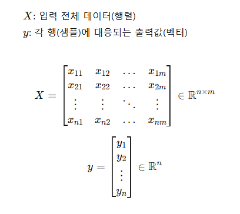

---

 

# [1] 선형 회귀 (Linear Regression)
▣ 가이드 : https://scikit-learn.org/stable/modules/linear_model.html# 
▣ API : https://scikit-learn.org/stable/modules/generated/sklearn.linear_model.LinearRegression.html 
▣ 예제 : https://scikit-learn.org/stable/auto_examples/linear_model/index.html 
종속변수(예상값) y와 독립변수(설명변수) X와의 선형 상관관계를 회귀 계수(regression coefficient)의 선형 결합으로 표현할 수 있는 모델 
'선형'은 종속변수와 독립변수의 관계가 2차원에서는 선형으로, 3차원 공간에서는 평면으로 나타난다.  

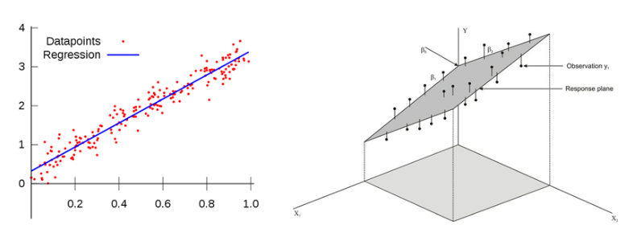

 

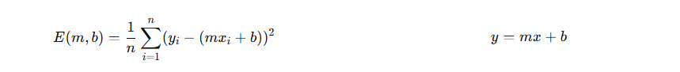

출처 : https://savannahar68.medium.com/getting-started-with-regression-a39aca03b75f
 

---
모델이 독립변수와 회귀계수에 대하여 선형인 경우 
$y = mx + b$  
$y = w_1x + w_0$  
$y_i = β_1x_i + β_0 + ϵ_i$ 
###### $y_i$ : i번째 반응변수 값, $x_i$ : i번째 설명변수 값, $β_0$ : 절편 회귀계수, $β_1$ : 기울기 회귀계수, $ϵ_i$ : i번째 측정된 $y_i$의 오차 성분 
모든 회귀계수 각각에 대해 편미분한 결과가 다른 회귀계수를 포함하지 않는 경우에도 선형모형이라고 할 수 있다. 
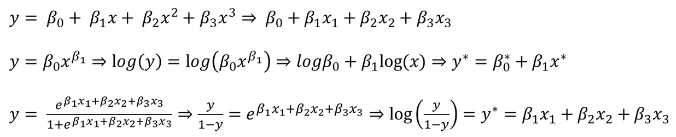
​​
 

---
선형회귀는 학습을 통해 예측값과 실제관측값의 <ins>**차이(손실)**</ins>를 최소로 하는 회귀계수($W_0$과 $W_1$)를 찾는 것 

**오차제곱합(Sum of Squared Errors, SSE)** : 예측값과 실제값의 단순 차이로 모델의 “오차(Error)” 
**잔차제곱합(Residual Sum of Squares, RSS)** : 회귀식이 데이터에 맞춰진 이후 남은 “잔차(Residual)” 
**평균제곱오차(Mean Squared Error, MSE)** : 실제값과 예측값의 오차를 제곱해서 평균낸 값 
**손실함수(Loss Function)** : 한 샘플의 예측 오차 
**비용함수(Cost Function)** : 전체 샘플의 평균 오차 

| 구분 | 영문 명칭 | 수식 | 의미 / 역할 | 관계 |
|------|------------|------|---------------|-------|
| **SSE** | *Sum of Squared Errors* |  | 개별 데이터의 오차를 **제곱 후 합산**한 값 | 가장 기본적인 형태의 “오차 총합” |
| **RSS** | *Residual Sum of Squares* |  | SSE와 동일 (단, “잔차” 관점에서 표현) |  |
| **MSE** | *Mean Squared Error* |  | 오차 제곱합을 **평균**한 값 (데이터 수에 무관하게 비교 가능) |  |
| **Loss Function** | *Per-sample Loss* |  | **개별 샘플 단위의 오차** | 한 데이터의 손실 |
| **Cost Function** | *Global Loss / Objective Function* |  | 전체 데이터의 평균 손실, **모델이 최소화하려는 목적함수** |  |

 

**최소제곱법(Ordinary Least Squares, OLS)** : 데이터에 가장 잘 맞는 직선을 찾기 위해, 
실제값과 예측값의 차이(오차=잔차)의 제곱합을 최소화하는 방식으로 회귀계수(기울기, 절편) 추정하는 방법 
OLS는 회귀분석의 기본이며, MSE 기반 비용함수의 최소화와 동일한 원리 

​ 

**경사하강법(Gradient Decent)** : 비용함수 f의 값이 줄어드는 방향으로 함수의 계수(기울기, 절편)를 일정 크기(학습량)만큼 더해나가며 f의 최소값을 찾는 최적화 기법 
모델의 오차(error)=손실(loss)를 줄이기 위해 기울기(slope)=가중치(weight)와 절편(bias, baseline)을 반복적으로 조정하는 최적화(optimization) 방법 

<!--
기울기 $Gradient(f)=∇f(x)=[ ∂f(x_0)/∂x_0, ∂f(x_1)/∂x_1,...,∂f(x_{N−1}/∂x_{N−1}]^T$
​미분 가능한 N개의 다변수 함수 f를 각 축에 대하여 편미분한 값으로, 스칼라 함수의 모든 축에 대응하는 벡터장을 생성하는 역할을 한다.
-->

                    
 
오류가 작아지는 방향으로 w값을 보정할 수 있는 해법을 구하는 방법 
(1) $W_1$, $W_0$을 임의의 값으로 설정하고 첫 비용함수의 값을 계산한다. 
(2) $W_1$, $W_0$의 값을 주어진 횟수만큼 계속 업데이트한다. 
$x_{i+1} = x_i - \alpha \frac{df}{dx}(x_i)$, $x_{i+1} = x_i - \alpha \nabla f(x_i)$ 

 , 

---

	# 선형회귀모델(LinearRegression) Scikit-Learn Package 사용
 	from sklearn.linear_model import LinearRegression
	
 	# 선형회귀모델(LinearRegression) 클래스 객체 생성
	lr = LinearRegression()
 
 	# 선형회귀모델(LinearRegression) 학습
	lr.fit(train_input, train_target)

	# 학습결과로 도출한 값 coef_ : 기울기(w1), intercept_ : 절편(w0)
	print(lr.coef_, lr.intercept_)

 	# 선형회귀모델(LinearRegression) 학습결과를 바탕으로 새로운값에 대한 예측
	print(lr.predict(([50]))

---

**(1 예제 소스)**

	# -------------------------------
	# Scikit-Learn LinearRegression 예제
	# -------------------------------
	
	import numpy as np
	import matplotlib.pyplot as plt
	from sklearn.linear_model import LinearRegression
	from sklearn.metrics import mean_squared_error, r2_score
	
	# 예제용 데이터 생성
	# y = 3x + 5 + 약간의 잡음
	np.random.seed(42)
	X = 2 * np.random.rand(100, 1)   # 입력값 (100개 샘플, 1개 특성)
	y = 3 * X + 5 + np.random.randn(100, 1)  # 타깃값
	
	# 모델 생성 및 학습
	model = LinearRegression()
	model.fit(X, y)
	
	# 학습된 모델의 계수(기울기, 절편) 출력
	print("기울기 (coef_):", model.coef_)
	print("절편 (intercept_):", model.intercept_)
	
	# 예측
	X_new = np.array([[0], [2]])     # 0과 2에서 예측
	y_pred = model.predict(X_new)
	
	# 평가
	y_hat = model.predict(X)
	mse = mean_squared_error(y, y_hat)
	r2 = r2_score(y, y_hat)
	
	print(f"MSE (평균제곱오차): {mse:.3f}")
	print(f"R² (결정계수): {r2:.3f}")
	
	# 시각화
	plt.scatter(X, y, color='blue', label='Training data')
	plt.plot(X_new, y_pred, color='red', linewidth=2, label='Regression line')
	plt.xlabel('X')
	plt.ylabel('y')
	plt.title('Linear Regression Example')
	plt.legend()
	plt.show()

 

**(1 실행 결과)**

	기울기 (coef_): [[2.77011339]]
	절편 (intercept_): [5.21509616]
	MSE (평균제곱오차): 0.807
	R² (결정계수): 0.769

 

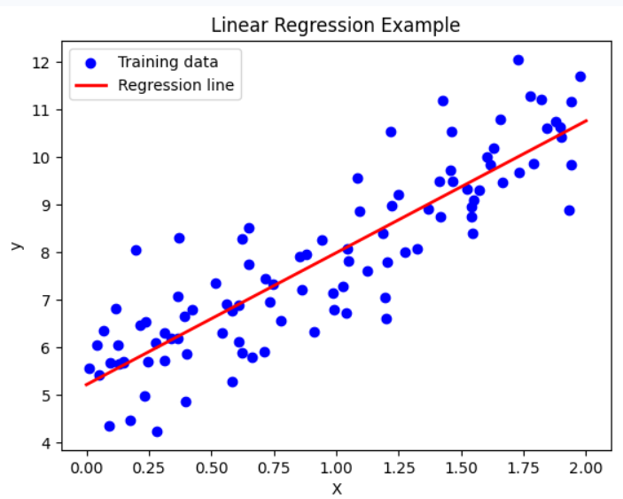

 

# [2] 일반화 선형 회귀(Generalized Linear Regression, GLM)
일반화 선형 회귀의 경우 선형성, 독립성, 등분산성, 정규성의 가정을 갖고 있지만, 종속변수가 연속형이 아니라면 대표적으로 오차항의 정규성 가정이 깨지게 되는데, 종속변수를 적절한 함수로 변화시킨 f(y)를 독립변수와 회귀계수의 선형결합으로 모형화한 것이다. 

# [2-1] 로지스틱 회귀 (Logistic Regression) → 분류(10강)
데이터가 어떤 범주에 속할 확률을 0에서 1 사이의 값으로 예측하고 그 확률에 따라 가능성이 더 높은 범주에 속하는 것으로 분류하는 지도 학습 알고리즘. 이름에 Regression이 들어가지만 Sigmoid 함수를 활용한 이진분류에 해당하며, 선형 회귀는 특정 예측 값을 반환하지만 sigmoid 함수를 활용하면 특정 값을 기점으로 0 또는 1 값을 반환하는 분류 모델이라고 할 수 있다. 선형회귀분석과 비슷한데 Y값이 확률로 되어 있기 때문에 하한, 상한이 [0, 1] 사이로 정해져 있으며, 특정 임계치(threshold)를 기준으로 삼아서 예측된 확률 값이 임계치 이상인 것과 미만인 것으로 분류한다.
 

# [2-2] 포아송 회귀 (Poisson Regression)
▣ API : https://scikit-learn.org/stable/modules/generated/sklearn.linear_model.PoissonRegressor.html 
포아송 회귀(Poisson Regression)는 발생 횟수(count data) 를 예측하기 위해 사용하는 일반화 선형 모형(GLM: Generalized Linear Model) 의 한 종류 
종속변수가 포아송 분포(Poisson Distribution)를 따르는 경우에 사용되며, 이산형 카운트 데이터를 모델링하는 데 적합하다.  
포아송 분포는 단위(한정된) 시간이나 공간에서 발생하는 평균적인 사건의 횟수(λ)를 바탕으로 특정 횟수의 사건이 발생할 확률을 설명한다.  
종속변수가 빈도변수로 0이상 정수이거나, 왜도가 크거나, 분포유형이 포아송 로그선형일 경우에 실시한다. 
참고로 평균보다 분산이 큰 경우에 적용하는 **음이항 회귀(Negative binomial regression)** 는 분산이 포아송 모델의 평균과 동일하다는 매우 제한적인 가정을 완화할 수 있다.
전통적인 음이항 회귀 모델은 포아송과 **감마(gamma regression)** 혼합 분포를 기반으로 하여 널리 사용된다.  
**포아송 확률변수 $X$의 확률밀도함수(probability mass function)** : $P(X = k; \lambda) = \frac{e^{-\lambda}\lambda^k}{k!}$ 
###### X : 사건이 발생하는 횟수를 나타내는 확률 변수, 𝑘 : 발생한 사건의 횟수(0, 1, 2, 3, ...), 𝜆 : 단위 시간 또는 공간 내에서 사건이 발생하는 평균 횟수(포아송 분포의 모수, 평균이자 분산으로 λ가 작을수록 사건이 드물게 발생하는 상황을 나타내며, λ가 클수록 사건이 자주 발생하는 상황), 𝑒 : 자연 상수 ≈2.718, 𝑘! : k의 팩토리얼로, 𝑘×(𝑘−1)×⋯×1 

**포아송 회귀 적용 사례 :** 일정 주어진 시간 동안에 방문하는 고객의 수, 일정 주어진 생산시간 동안 발생하는 불량 수, 하룻동안 발생하는 출생자 수, 어떤 시간 동안 톨게이트를 통과하는 차량의 수, 어떤 페이지에 있는 오타의 발생률, 어떤 특정 면적의 삼림에서 자라는 소나무의 수 

| 구분           | 연구사례                    | 설명                                     |
| :----------- | :---------------------- | :------------------------------------- |
| **사회·경제**    | 은행 창구 방문 고객 수           | 시간대별 고객 방문 수를 인력 배치 최적화에 활용            |
|              | 택배 물량(시간당 배송 요청 건수)     | 지역·요일·시간에 따른 물류 수요 예측                  |
|              | 지하철역 개찰구 통과 인원 수        | 교통 혼잡도 및 안전관리 예측                       |
|              | ATM 출금 건수               | 지역별 현금 수요 패턴 분석                        |
|              | SNS 게시물 업로드 수           | 이벤트 발생 전후의 활동 변화 분석                    |
|              | 콜센터 민원 유형별 전화 건수        | 특정 이슈(정책 발표·재난 등) 이후 문의량 증가 분석         |
|              | 영화관 입장객 수(시간대별)         | 상영 스케줄 및 좌석 배치 최적화                     |
|              | 관광지 입장객 수               | 기후·이벤트·요일이 방문객 수에 미치는 영향               |
| **교통·도시**    | 교차로 신호주기별 사고 건수         | 신호체계 개선을 위한 위험도 평가                     |
|              | 버스 노선별 지연 발생 횟수         | 도로 혼잡 및 기상 영향 분석                       |
|              | 택시 호출 건수                | 날씨, 시간대, 위치에 따른 택시 수요 모델링              |
|              | 도로 구간별 차량 고장 신고 수       | 도로환경(기온·습도·노면상태)과 고장률 관계 분석            |
|              | 주차위반 단속 건수              | 단속 효율성과 지역별 위반 빈도 예측                   |
| **의료·보건**    | 응급실 하루 내원 환자 수          | 계절·요일·날씨·질병유행 요인과의 관계 분석               |
|              | 하루 신규 감염자 수(예: 독감, 코로나) | 지역별 감염률 예측 및 방역정책 평가                   |
|              | 약국 하루 처방 건수             | 질병유행 및 보험제도 변화의 영향 파악                  |
|              | 의료사고 보고 건수              | 병원 규모, 진료과, 근무시간 요인 분석                 |
|              | 심근경색 발생 건수(연령대별)        | 공기오염, 기온변화와의 상관분석                      |
| **생물·환경**    | 단위면적당 곤충 개체 수           | 농약 농도·기후 요인과의 관계 분석                    |
|              | 식물 종자 발아 건수             | 토양 조건, 일조량, 수분량의 영향 평가                 |
|              | 조류 충돌 건수(유리건물 앞)        | 건물 높이, 조명 세기, 계절의 영향 분석                |
|              | 하천 구간별 어류 개체 수          | 수질오염·유속·수온 등 환경 요인 분석                  |
|              | 산불 발생 건수                | 풍속·습도·인간활동과의 관계 예측                     |
| **산업·공학**    | 제조 라인 불량 발생 건수          | 온도·습도·작업자 교대와의 상관관계 분석                 |
|              | 기계 고장 건수(일 단위)          | 예방 정비 주기 결정에 활용 (Reliability Modeling) |
|              | 서버 다운 또는 오류 발생 횟수       | 트래픽, 온도, 하드웨어 부하 등 요인 분석               |
|              | 전력 설비 이상 신호 감지 횟수       | 계절별 부하 변화와 이상률 관계 모델링                  |
|              | 로봇 센서 오작동 횟수            | 센서 온도·습도·전압변화의 영향 분석                   |
| **기상·환경재난**  | 시간당 낙뢰 횟수               | 습도·기온·대기불안정도와의 관계                      |
|              | 시간당 미세먼지 경보 발령 횟수       | 대기오염원 및 기상변수 영향 분석                     |
|              | 지역별 폭우 피해 신고 건수         | 강우량·지형·하수시설 상태와의 관계                    |
| **교육·문화·정책** | 학생의 결석일 수               | 가정환경·거리·날씨와의 관계 분석                     |
|              | 학교별 사고(상해) 건수           | 시설 노후도·안전점검 여부 영향 평가                   |
|              | 문화행사 관람객 수(시간 단위)       | 홍보 수준·기온·요일의 영향 예측                     |

 

**(2-1 예제 소스) : 은행 창구 방문 고객 수(시간대별 고객 방문 수를 인력 배치 최적화에 활용)**

	# ============================================================
	# [은행 창구 방문 고객 수 예측 - Poisson Regression 예제]
	# ============================================================
	# 목적 : 단위 시간(예: 시간대) 동안 은행 창구 방문 고객 수(count)를 예측하여 인력(창구) 배치나 영업 효율성을 최적화
	# 데이터 형태 : count data (0, 1, 2, ...)
	# 모델 : 일반화 선형모형(GLM)의 하나인 Poisson Regression (로그 링크 사용)
	# ============================================================
	
	# --------------------------
	# (1) 환경 설정 : 경고 제거 및 스레드 제한
	# --------------------------
	import os, warnings
	
	# Windows 환경에서 loky(core 관리 모듈)가 물리 코어 탐지 실패 시 경고 발생
	# → 논리 코어 수로 고정해 경고 방지
	cores = os.cpu_count() or 4
	os.environ["LOKY_MAX_CPU_COUNT"] = str(cores)
	
	# 수치 계산 라이브러리(NumPy, MKL 등)의 병렬 스레드 수 제한 (안정성 향상)
	os.environ["OMP_NUM_THREADS"] = "1"
	os.environ["MKL_NUM_THREADS"] = "1"
	os.environ["OPENBLAS_NUM_THREADS"] = "1"
	os.environ["NUMEXPR_NUM_THREADS"] = "1"
	
	# 불필요한 경고 메시지 무시 (옵션)
	warnings.filterwarnings(
	    "ignore",
	    message="Could not find the number of physical cores",
	    category=UserWarning,
	)
	
	# --------------------------
	# (2) 라이브러리 불러오기
	# --------------------------
	import numpy as np
	import pandas as pd
	from sklearn.model_selection import train_test_split
	from sklearn.preprocessing import OneHotEncoder, StandardScaler
	from sklearn.compose import ColumnTransformer
	from sklearn.pipeline import Pipeline
	from sklearn.linear_model import PoissonRegressor
	from sklearn.metrics import mean_absolute_error, mean_poisson_deviance
	
	# ============================================================
	# (3) 합성 데이터 생성 (시뮬레이션)
	# ============================================================
	# Poisson 회귀는 count 데이터를 다루므로,
	# 은행 창구의 시간대별 방문 고객 수를 가정해 샘플 데이터를 생성합니다.
	
	rng = np.random.default_rng(42)
	n = 6000  # 데이터 샘플 수
	
	# --------------------------
	# 입력 변수(설명 변수)
	# --------------------------
	hour = rng.integers(9, 18, size=n)                    # 영업시간대(9~17시)
	is_weekend = rng.integers(0, 2, size=n, endpoint=False)  # 주중(0)/주말(1)
	is_payday = rng.integers(0, 2, size=n)                # 월급날/연금날 여부
	rain = rng.integers(0, 2, size=n)                     # 강수 여부
	temp = rng.normal(20, 7, size=n)                      # 기온 (°C)
	branch = rng.choice(["Small", "Medium", "Large"], size=n, p=[0.35, 0.45, 0.20])  # 지점 규모
	
	# --------------------------
	# 각 변수별 효과 정의 (선형예측자 구성)
	# --------------------------
	# branch 규모별 baseline 효과
	branch_base = np.select(
	    [branch == "Small", branch == "Medium", branch == "Large"],
	    [0.2, 0.5, 0.9], default=0.3
	)
	
	# 시간대 효과: 11시(오전 피크), 16시(오후 피크), 12~13시는 점심 dip
	rush_morning = np.exp(-0.5 * ((hour - 11) / 1.8) ** 2)   # Gaussian 형태의 피크
	rush_afternoon = np.exp(-0.5 * ((hour - 16) / 1.8) ** 2)
	lunch_dip = -0.25 * ((hour >= 12) & (hour <= 13)).astype(float)
	
	# 온도 효과: 20°C 기준에서 벗어날수록 방문 감소
	temp_effect = -0.015 * np.abs(temp - 20)
	
	# 월급날 효과: 방문량 증가
	payday_effect = 0.55 * is_payday
	
	# 주말 효과: 방문량 감소(또는 영업하지 않음)
	weekend_effect = -0.8 * is_weekend
	
	# 강수 효과: 비 오면 감소
	rain_effect = -0.25 * rain
	
	# 상호작용 : "월급날 × 대형지점"일 때 추가 프리미엄 효과
	interaction_effect = 0.25 * (is_payday * (branch == "Large"))
	
	# --------------------------
	# 선형예측자(η) 계산 및 λ 추정
	# --------------------------
	# Poisson 회귀는 log(λ) = η = Xβ
	# 따라서 λ = exp(η)
	eta = (
	    -0.2                              # 절편(기본값)
	    + 1.1 * branch_base               # 지점 규모 효과
	    + 0.8 * rush_morning              # 오전 피크 효과
	    + 0.7 * rush_afternoon            # 오후 피크 효과
	    + lunch_dip                       # 점심시간 감소 효과
	    + payday_effect                   # 월급날 효과
	    + weekend_effect                  # 주말 효과
	    + rain_effect                     # 비 효과
	    + temp_effect                     # 기온 효과
	    + interaction_effect              # 상호작용 효과
	)
	
	lam = np.exp(eta)  # λ = exp(η) → 평균 방문률(λ는 항상 양수)
	y = rng.poisson(lam)  # 실제 방문 고객 수를 포아송 분포로부터 샘플링
	
	# 데이터프레임으로 구성
	data = pd.DataFrame({
	    "hour": hour,
	    "is_weekend": is_weekend,
	    "is_payday": is_payday,
	    "rain": rain,
	    "temp": temp,
	    "branch": branch,
	    "visits": y,  # 종속변수(타깃): 방문 고객 수
	})
	
	# ============================================================
	# (4) 데이터 분리 (Train/Test)
	# ============================================================
	X = data[["hour", "is_weekend", "is_payday", "rain", "temp", "branch"]]
	y = data["visits"]
	
	X_train, X_test, y_train, y_test = train_test_split(
	    X, y, test_size=0.25, random_state=7
	)
	
	# ============================================================
	# (5) 전처리 파이프라인 구성
	# ============================================================
	# 수치형: 표준화(StandardScaler)
	# 범주형: 원-핫 인코딩(OneHotEncoder)
	# 이진형(0/1): 그대로 통과(passthrough)
	num_features = ["hour", "temp"]
	bin_features = ["is_weekend", "is_payday", "rain"]
	cat_features = ["branch"]
	
	preprocess = ColumnTransformer(
	    transformers=[
	        ("num", StandardScaler(), num_features),
	        ("bin", "passthrough", bin_features),
	        ("cat", OneHotEncoder(drop="first", handle_unknown="ignore"), cat_features),
	    ]
	)
	
	# ============================================================
	# (6) 포아송 회귀 모델 생성 및 학습
	# ============================================================
	# Scikit-learn의 PoissonRegressor는 GLM의 log-link를 사용
	# alpha: L2 정규화 계수(너무 작으면 완전 적합, 너무 크면 과소적합)
	model = Pipeline(steps=[
	    ("prep", preprocess),
	    ("poisson", PoissonRegressor(alpha=1e-6, max_iter=1000))
	])
	
	# 모델 학습
	model.fit(X_train, y_train)
	
	# ============================================================
	# (7) 모델 평가
	# ============================================================
	# 예측값 y_pred는 λ의 추정치(예상 방문 수)
	y_pred = model.predict(X_test)
	
	# 평균절대오차 (MAE): 실제 방문수와 예측치의 절대차 평균
	mae = mean_absolute_error(y_test, y_pred)
	
	# 포아송 deviance: GLM 적합도 평가 지표 (작을수록 좋음)
	mpd = mean_poisson_deviance(y_test, y_pred)
	
	print(f"MAE: {mae:.3f}")
	print(f"Mean Poisson Deviance: {mpd:.3f}")
	
	# ============================================================
	# (8) 회귀계수 해석 (비율효과: exp(β))
	# ============================================================
	# exp(β)는 "비율(rate ratio)"로, 해당 변수가 1단위 증가할 때 λ가 몇 배로 변하는지 의미
	ohe = model.named_steps["prep"].named_transformers_["cat"]
	cat_names = ohe.get_feature_names_out(["branch"])  # ['branch_Medium','branch_Large']
	feature_names = num_features + bin_features + list(cat_names)
	
	coef = model.named_steps["poisson"].coef_
	intercept = model.named_steps["poisson"].intercept_
	
	coef_table = pd.DataFrame({
	    "feature": feature_names,
	    "beta": coef,
	    "rate_ratio (exp(beta))": np.exp(coef)
	}).round(4)
	
	print(f"\nIntercept (beta0): {intercept:.4f}  -> base rate = {np.exp(intercept):.4f}")
	print("\nCoefficients (rate ratios):")
	print(coef_table)
	
	# ------------------------------------------------------------
	# 해석 예시:
	#  - is_payday의 exp(beta)=1.9 → 월급날일 때 방문률이 약 1.9배 증가
	#  - rain의 exp(beta)=0.8 → 비 오는 날 방문률이 약 20% 감소
	#  - branch_Large의 exp(beta)=2.2 → 대형지점 방문률이 약 2.2배 높음
	# ------------------------------------------------------------
	
	# ============================================================
	# (9) 샘플 예측 (정책 시뮬레이션)
	# ============================================================
	# 특정 상황에서의 예상 방문 고객 수 예측
	sample = pd.DataFrame({
	    "hour": [16, 11, 13],
	    "is_weekend": [0, 0, 1],
	    "is_payday": [1, 0, 0],
	    "rain": [0, 1, 0],
	    "temp": [22, 18, 27],
	    "branch": ["Large", "Small", "Medium"]
	})
	
	pred = model.predict(sample)	
	print("\nSample inputs:")
	print(sample)
	print("\nPredicted visits (expected counts):")
	print(np.round(pred, 2))
	

**(2-2 실행 결과) : 은행 창구 방문 고객 수(시간대별 고객 방문 수를 인력 배치 최적화에 활용)**

	MAE: 1.196
	Mean Poisson Deviance: 1.151
	
	Intercept (beta0): 1.3971  -> base rate = 4.0436
	
	Coefficients (rate ratios):
	         feature    beta  rate_ratio (exp(beta))
	0           hour  0.0173                  1.0174
	1           temp  0.0160                  1.0161
	2     is_weekend -0.8334                  0.4346
	3      is_payday  0.6529                  1.9210
	4           rain -0.2137                  0.8076
	5  branch_Medium -0.5863                  0.5564
	6   branch_Small -0.9201                  0.3985
	
	Sample inputs:
	   hour  is_weekend  is_payday  rain  temp  branch
	0    16           0          1     0    22   Large
	1    11           0          0     1    18   Small
	2    13           1          0     0    27  Medium
	
	Predicted visits (expected counts):
	[7.96 1.28 0.99]

**(2-2 실행 결과 해석) : 은행 창구 방문 고객 수(시간대별 고객 방문 수를 인력 배치 최적화에 활용)**

	MAE: 1.196 → 평균절대오차(Mean Absolute Error)
				 실제 방문 고객수와 예측값의 평균 차이가 약 1.2명 수준(시간대별로 ±1명 내외의 오차로 예측)
	Mean Poisson Deviance: 1.151 → 포아송 분포에 기반한 적합도 지표인 포아송 손실(Deviance)
				 값이 작을수록 모델이 데이터에 잘 맞음을 의미(우수)
	
	Intercept (beta0): 1.3971  → base rate = 4.0436 → 시간대 0(표준화 후 기준) 에서 평균 방문 수가 약 4.0명/단위시간
	
	Coefficients (rate ratios):
	         feature    beta  rate_ratio (exp(beta))
	0           hour  0.0173                  1.0174 → 시간대(hour)가 1단위 증가할 때 방문률이 약 1.7% 증가
	1           temp  0.0160                  1.0161 → 기온이 1°C 오를 때 방문률이 약 1.6% 증가
	2     is_weekend -0.8334                  0.4346 → 주말(1)에는 평일 대비 방문률이 43% 수준
	3      is_payday  0.6529                  1.9210 → 월급날 또는 연금날(1)에는 평상시보다 방문률이 약 1.92배(92% 증가)
	4           rain -0.2137                  0.8076 → 비가 오는 날은 평상시보다 방문률이 약 19% 감소(1−0.8076=0.1924)
	5  branch_Medium -0.5863                  0.5564 → 중형 지점의 방문률은 대형 지점(Large 기준) 대비 약 55.6% 수준
	6   branch_Small -0.9201                  0.3985 → 소형 지점은 대형 지점 대비 방문률이 약 40% 수준(60% 감소)
	
	Sample inputs:
	   hour  is_weekend  is_payday  rain  temp  branch
	0    16           0          1     0    22   Large
	1    11           0          0     1    18   Small
	2    13           1          0     0    27  Medium
	
	Predicted visits (expected counts):
	[7.96 1.28 0.99]

|   No  | 입력 조건 요약                          |  예측 방문 수 |
| :---: | :------------------------------------- | :------------: | 
| 0 | 16시 / 주중 / 월급날 / 비X / 22°C / 대형지점  | 7.96명 | 
| 1 | 11시 / 주중 / 월급날X / 비O / 18°C / 소형지점 | 1.28명 | 
| 2 | 13시 / 주말 / 월급날X / 비X / 27°C / 중형지점 | 0.99명 | 

 

**(예제 소스) : 포아송 분포의 성질**

	# numpy 라이브러리 임포트 (수치 계산에 유용한 함수 제공)
	import numpy as np                      
	# seaborn 라이브러리 임포트 (데이터 시각화 라이브러리)
	import seaborn as sns                
	# matplotlib의 pyplot 모듈 임포트 (그래프 그리기에 사용)
	import matplotlib.pyplot as plt         
	# scipy.stats에서 poisson 모듈 임포트 (포아송 분포 관련 함수 제공)
	from scipy.stats import poisson          
	# scipy.special에서 factorial 모듈 임포트 (팩토리얼 계산을 위한 함수 제공)
	from scipy.special import factorial      
	
	# 평균이 1인 포아송 분포에서 10개의 랜덤 샘플을 생성 (이 코드는 결과를 사용하지 않음)
	poisson.rvs(mu=1, size=10)               

	# seaborn의 "BrBG" 색상 팔레트에서 6개의 색을 선택 (그래프 색상에 사용)
	pal_brbg = sns.color_palette("BrBG", 6)  
	
	# 0부터 10까지의 정수 배열 생성 (x축 값, 즉 포아송 분포에서 발생 가능한 사건의 수)
	x = np.arange(0, 11)                     

	# λ 값을 1부터 5까지 반복하여 각각의 포아송 분포 그래프를 그림
	for n_lambda in range(1, 6):             

    		# 포아송 분포의 확률 계산: P(x; λ) = (e^(-λ) * λ^x) / x!
    		y = np.exp(-n_lambda) * np.power(n_lambda, x) / factorial(x)  

    		# 계산된 확률 y값을 x값에 대해 선 그래프로 그림, 각각 다른 색 사용
    		plt.plot(x, y, color=pal_brbg[n_lambda - 1], label=f"λ = {n_lambda}")  

    		# 해당 λ에 대한 확률 값을 점으로 표시
    		plt.scatter(x, y, color=pal_brbg[n_lambda - 1])  

	# y축 라벨 설정 (확률)
	plt.ylabel("Probability")                
	# 그래프 제목 설정 (λ 값의 범위 명시)
	plt.title(f"Poisson Distribution (λ = [1, 5])")  
	# x축에 0부터 10까지의 값 표시
	plt.xticks(x)                            
	# y축에 점선 스타일의 회색 그리드 추가 (가독성 향상)
	plt.grid(axis="y", linestyle="--", color="#CCCCCC")  
	# 그래프의 범례를 오른쪽 상단에 표시
	plt.legend(loc="upper right")            
	# 그래프를 화면에 출력
	plt.show()                               

**(실행 결과) : 포아송 분포의 성질**

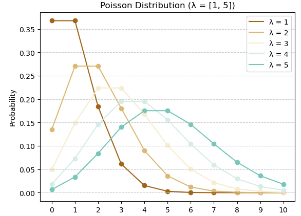

**(2-2 예제 추가설명) : 절편(β₀)**
포아송 회귀의 β₀는 모든 독립변수가 0일 때의 log(λ), 즉 기준 상태의 평균 발생률의 로그값 

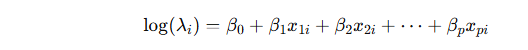

| log(λ)=β₀ | λ=exp(β₀) |             의미            |
| :-------: | :-------: | :-----------------------: |
|    –2.0   |    0.14   | 거의 방문 없음         |
|    –1.0   |    0.37   | 매우 드묾           |
|  **–0.2** |  **0.82** | 1명 미만의 기본 방문률(현실적 시작점) |
|    0.0    |    1.00   | 정확히 평균 1명 수준       |
|    +1.0   |    2.72   | 항상 붐비는 상황         |
|    +2.0   |    7.39   | 과도하게 많음(비현실적)       |

η=−0.2+0.8+0.55=1.15 ⇒ λ= $e^{1.15}$ ≈3.16 
즉, 피크타임엔 약 3명 수준이 되어 현실적 스케일(0~10명) 을 유지 

 

# [2-3] Cox의 비례위험 회귀(Cox's Proportional Hazard Regression)
Cox의 비례위험 회귀는 생존 분석(survival analysis)에서 주로 사용되는 회귀 모델 
어떤 사건(event)이 일어날 때까지의 시간을 대상으로 분석하는 통계방법으로 사건과 사건 사이의 예측 회귀 모형을 분석 
이 모델은 사건(예: 사망, 질병 발병, 기계 고장 등)이 발생할 때까지의 시간과 그 사건이 발생할 확률(위험율) 사이의 관계를 설명  
주어진 독립변수 값에 대해 위험율( $hazard ratio(log(h(t)/h_0(t)))$ )이 시간에 걸쳐 일정한 비율로 유지(두 피험자에 대해 위험율의 비율이 시간이 지나도 일정하게 유지)된다고 가정 
위험율(HR)이 1보다 크면 위험이 증가하고, 1보다 작으면 위험이 감소하는 것으로 평가 
환자가 특정 치료 후 생존할 확률을 예측, 기계 부품이 고장날 때까지의 시간을 분석, 사회학 연구에서 결혼생활이 파탄날 확률을 예측할 때 활용한다.  
만약 비례 위험 가정이 만족되지 않으면 Cox 회귀 모델의 결과가 왜곡될 수 있으므로, 이 경우에는 비례 위험 가정을 검토하거나 시간을 고려한 상호작용 변수를 추가해야 한다. 
 

| 구분          | 연구사례                       | 설명                              |
| :---------- | :------------------------- | :------------------------------ |
| **의료·임상**   | 암 환자의 전체 생존시간(OS)          | 병기, 연령, 치료 레짐에 따른 사망 위험비(HR) 추정 |
|             | 무진행 생존시간(PFS)              | 표적치료 vs 표준치료의 진행 위험 비교          |
|             | 수술 후 재발까지의 시간              | 절제연, 병리소견, 보조요법이 재발위험에 미치는 영향   |
|             | 심근경색 후 재입원까지의 시간           | 약물복용 순응도, 금연 여부, 재활 참여도의 효과     |
|             | 인공관절 수술 후 감염까지의 시간         | 수술시간, 항생제 프로토콜, 병원등급의 위험비       |
|             | 신장이식 후 이식거부 발생시간           | 면역억제제 요법/부작용과 거부반응 위험           |
|             | 당뇨병성 합병증 발생까지의 시간          | HbA1c, 혈압, 신장기능이 합병증 위험에 미치는 영향 |
|             | 중환자실 퇴원 후 사망까지의 시간         | SOFA 점수, 인공호흡기간, 합병증 유무의 HR     |
| **공중보건·역학** | 감염병 확진 후 사망까지의 시간          | 연령, 기저질환, 백신접종의 위험 차이           |
|             | 백신 접종 후 돌파감염까지의 시간         | 백신종류, 접종간격, 변이유행기의 효과           |
|             | 금연 개입 후 재흡연까지의 시간          | 상담강도, 니코틴대체요법, 스트레스 지표의 HR      |
| **제약·임상시험** | 신약 투여 후 반응 도달시간            | 바이오마커 양성/음성에 따른 반응 도달 위험        |
|             | 이상반응(AE) 발생까지의 시간          | 용량군, 동반약물, 체중/신장 보정 HR          |
|             | 치료중단(탈락)까지의 시간             | 복약편의성, 부작용 점수, 방문빈도의 영향         |
| **금융·보험**   | 대출 부도(Default)까지의 시간       | 신용점수, 소득안정성, 금리 변화의 위험비         |
|             | 보험 해지(Lapse)까지의 시간         | 보험료 인상, 채널, 고객 연령/직군의 효과        |
|             | 모기지 조기상환(Prepayment)까지의 시간 | 금리스프레드, LTV, 지역경기의 HR           |
|             | 고객 이탈(Churn)까지의 시간         | 사용빈도, 요금제 변경, 프로모션 노출의 영향       |
| **산업·신뢰성**  | 설비 고장까지의 시간(MTTF)          | 온도·진동·부하(스트레스)와 고장위험            |
|             | 반도체 소자의 수명                 | 공정변동, 패키징, 사용전류에 따른 HR          |
|             | 자동차 부품의 품질보증기간 내 고장시간      | 주행환경, 운전습관, 제조로트 효과             |
|             | 배터리 셀 성능저하 임계점 도달시간        | 충방전 프로파일, 온도, SOC 범위의 영향        |
| **IT·운영**   | 서버 장애(Outage)까지의 시간        | 트래픽 피크, 패치적용, 이중화 수준의 위험비       |
|             | 보안사고(침해) 발생까지의 시간          | 취약점 개수, 공격노출면, 패치지연의 HR         |
| **마케팅·플랫폼** | 첫 구매까지의 시간                 | 온보딩 품질, 알림빈도, 추천노출의 효과          |
|             | 재구매까지의 시간                  | 포인트/쿠폰, 배송경험, CS응답속도의 HR        |
|             | 구독 해지까지의 시간                | 가격인상, 콘텐츠 다양성, 사용시간의 영향         |
| **HR·조직**   | 퇴사(이직)까지의 시간               | 연봉수준, 승진·평가, 팀 리더십 지표의 위험비      |
| **교통·도시**   | 신호교차로 사고 재발까지의 시간          | 교통량, 기상, 단속강도의 HR               |
|             | 대중교통 지연 재발까지의 시간           | 차량노후도, 혼잡도, 운행스케줄의 영향           |

 

| 구분 | **포아송 회귀 (Poisson Regression)** | **Cox의 비례위험 회귀 (Cox’s Proportional Hazards Regression)** |
|:--|:--|:--|
| **정의** | 발생 횟수(count data)가 포아송 분포를 따른다고 가정하고, 독립변수 X가 평균 발생률(λ)에 미치는 영향을 로그 링크(log link)로 모형화하는 **일반화 선형모형(GLM)**. | 사건의 ‘발생할 시간(time-to-event)’에 초점을 두고, 시간 t에서의 위험률(hazard)을 공변량(X)의 함수로 표현하는 **생존분석(Survival Analysis)** 모형. |
| **수식** |     → 평균 사건수 |    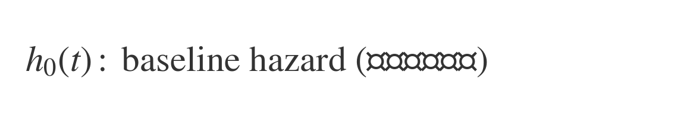 |
| **목적** | - 일정 기간·공간 내 사건 발생 횟수 예측   - 사건의 **빈도(frequency)** 나 **발생률(rate)** 을 설명   - 독립변수가 사건수에 어떤 영향을 주는지 파악 | - 사건이 **언제 발생하는지(time-to-event)** 분석   - 생존시간 분포를 모형화하고, 공변량이 **위험(hazard)** 에 미치는 영향 추정   - **중도절단(censoring)** 데이터 처리 가능 |
| **데이터** | - 종속변수: 사건의 “횟수(count)” (정수 0,1,2,...)   - 예: 1시간 동안 콜 수, 하루 교통사고 건수 | - 종속변수: 사건의 “발생시간(time)” 또는 “생존여부(event indicator)”   - 예: 사망까지 시간, 고장까지 시간 |
| **장점** | • 단순하고 계산 효율적 (GLM 기반)   • λ>0으로 자연스럽게 강제됨   • 발생률(rate) 추정이 직관적   • 로그링크(log link)로 효과 해석 용이 (`exp(β)` = 배수 효과)   • Overdispersion 시 Negative Binomial 등으로 확장 가능 | • 기저위험함수 `h₀(t)`를 명시하지 않아도 됨 (semi-parametric)   • 중도절단(censored data) 처리 가능   • 위험비(Hazard Ratio) 해석이 직관적   • 시간의존 공변량, 층화 등 확장 용이   • 생존곡선(Survival Curve) 도출 가능 |
| **단점** | • 사건 간 독립성·균등성 가정 필요 (Poisson 과정)   • Overdispersion(분산>평균) 문제 가능   • 시간요소 반영 불가 (언제 발생했는가를 설명하지 않음)   • 중도절단 데이터 처리 불가 | • 비례위험 가정(Proportional Hazards)이 항상 성립하지 않음   • 절대위험 예측보다는 상대위험비(HR)만 추정   • 생존시간이 동일한 경우 tie 처리 필요   • GLM보다 계산 복잡, 해석 어려움 |
| **해석** | `exp(β)` : 사건발생률이 변수 1단위 증가 시 몇 배로 변하는가 (**Rate Ratio**) | `exp(β)` : 변수 1단위 증가 시 위험률이 몇 배로 변하는가 (**Hazard Ratio**) |
| **사례** | **의료·보건:** 하루 응급실 내원 수, 감염 발생 건수   **교통:** 교차로 교통사고 건수   **산업공학:** 설비고장 횟수, 생산결함수   **IT:** 웹 클릭 수, API 호출 수   **금융:** 거래건수, 분당 결제수 | **의료·임상:** 생존시간, 재발·사망까지의 시간   **공중보건:** 백신 접종 후 감염까지의 시간   **산업·신뢰성:** 기계고장, 배터리 수명   **금융:** 대출 부도까지의 기간   **HR:** 직원 퇴사까지의 근속기간 |
| **핵심** | “몇 번 발생했는가?” (Count) | “언제 발생했는가?” (Time) |

 

---
# [3] 다중회귀 (Multiple Regression)
독립변수 X가 2개 이상인 회귀 
$y = w_1x_1 + w_2x_2 + ... + w_nx_n + w_0$  
$y_i = β_0 + β_1x_{i1} + β_2x_{i2} + ... + β_kx_{ik} + ϵ_i$ 
$y_i$ : i번째 관측치, $ϵ_i$ : 이때의 오차항, $x_{ij}$ : 독립변수로 known value 
$β_j$ : 추정하고자하는 값인 회귀계수로 $0≤j≤k$ 사이의 값 
N개의 샘플에 대하여 확장한 후, vector-matrix 형태로 표기하면, 
 
$e∼N(0,σ^2I_N)$ 

	import pandas as pd
	import matplotlib.pyplot as plt 
	from sklearn.model_selection import train_test_split
	from sklearn.linear_model import LinearRegression

 	# 데이터 수집
	df = pd.read_csv('https://raw.githubusercontent.com/YangGuiBee/ML/main/TextBook-04/manhattan.csv')
 	# 데이터 전처리(null겂이 많은 항목 삭제)
	df = df.drop(['neighborhood','borough','rental_id'], axis=1)
	
	X = df [['bedrooms', 'bathrooms', 'size_sqft', 'min_to_subway', 'floor',
       	'building_age_yrs', 'no_fee', 'has_roofdeck', 'has_washer_dryer',
	'has_doorman', 'has_elevator', 'has_dishwasher', 'has_patio','has_gym']]
	y = df [['rent']]       
 
 	# 데이터 구분 (학습데이터와 테스트 데이터 8:2)
	X_train, X_test, y_train, y_test = train_test_split(X,y,train_size=0.8,test_size=0.2)
 	# 선형회귀모델 객체 생성
	mlr = LinearRegression()
 	# 학습
	mlr.fit(X_train, y_train)	
  	# 평가
 	print(mlr.score(X_train, y_train))
 	# 예측
	y_predict = mlr.predict(X_test)

 	# 그래프 그리기
	plt.scatter(y_test,y_predict,alpha=0.4)
	plt.xlabel('Actual Rent')
	plt.ylabel('Predicted Rent')
	plt.title('Multiple Linear Regression')
	plt.show()

 

# [3-1] 단계적 회귀 (Stepwise Regression), 위계적 회귀 (Hierarchical Regression) 
여러 독립변수 중에서 종속변수를 가장 잘 설명하는 변수들을 선택하는 방법 

**단계적 회귀 (Stepwise Regression)** 는 독립 변수들을 자동으로 모델에 추가하거나 제거하여 최적의 모델을 탐색(변수의 추가나 제거가 통계적으로 유의미한지 여부에 따라 이루어짐) 
예를 들어, 변수를 추가할 때마다 F 통계량이유의미하게 증가하는지 확인하거나, 제거할 때마다 변수의 t 통계량이 유의미하게 감소하는지 확인  
장점: 자동으로 변수를 선택하므로 모델이 데이터에 더 잘 맞을 가능성이 있음  
**위계적 회귀 (Hierarchical Regression)** 는 독립 변수들을 미리 정의한 순서에 따라 모델에 추가하는 것으로, 
이론적으로 중요한 변수부터 시작하여 덜 중요한 변수를 차례로 추가하는 방식 
장점: 이론적 근거에 따라 변수를 추가하므로 결과 해석이 이론적으로 타당함. 

| 구분                       | **단계적 회귀 (Stepwise Regression)**                                                                  | **위계적 회귀 (Hierarchical Regression)**                                            |
| ------------------------ | ------------------------------------------------------------------------------------------------- | ------------------------------------------------------------------------------- |
| **핵심 개념**                | 통계적 기준(예: 유의확률, AIC, BIC, F-test 등)에 따라 **자동으로 변수 선택**                                            | 연구자의 이론적 근거나 가설에 따라 **단계별로 변수 투입 순서를 직접 지정**                                    |
| **변수 선택 방식**             | 자동 선택:  ① 전진 선택(Forward Selection) ② 후진 제거(Backward Elimination) ③ 단계적 선택(Stepwise: 혼합형) | 연구자 주도:  ① Block 1 → 기본통제변수 ② Block 2 → 독립변수 ③ Block 3 → 상호작용항, 매개변수 등 |
| **기준**                   | 통계적 유의성 (p-value, AIC, Adjusted R² 변화 등)                                                          | 이론적 중요도, 연구 설계상의 논리적 순서                                                         |
| **목적**                   | 모델의 **예측력** 극대화, 불필요한 변수 제거                                                                       | 변수 추가에 따른 **설명력(R² 변화량)** 및 **이론적 기여도 평가**                                      |
| **장점**                   | 자동화되어 빠르고 효율적, 다수의 후보 변수에서 최적 조합 탐색 가능                                                            | 연구자가 통제·중재효과를 검증하기 용이, 이론적 가설 검증에 적합                                            |
| **단점**                   | 데이터 의존적, 과적합 위험, 이론적 근거 부족                                                                        | 연구자 주관에 의존, 변수 투입 순서의 임의성 존재                                                    |
| **대표 활용 예시**             | 머신러닝형 회귀 모델 탐색, 데이터 기반 변수선택                                                                       | 사회과학·심리학·교육학 연구의 회귀분석 설계                                                        |
| **결과 해석 중심**             | “최적의 변수 조합”을 찾는 것                                                                                 | “각 변수 블록이 R²를 얼마나 증가시키는가”                                                       |
| **대표 라이브러리 (Python 예시)** | `statsmodels.api.OLS` + `stepwise_regression` 구현 / `sklearn.feature_selection`                    | 직접 단계별로 `add_constant` → `fit()` 반복 수행                                          |

 

# [3-2] 분위수 회귀 (Quantile Regression)
▣ API : https://scikit-learn.org/stable/modules/generated/sklearn.linear_model.QuantileRegressor.html 
반응 변수의 조건부 분위수를 모델링 할때 사용되는 선형 회귀의 확장 버전 
1) 선형 회귀 조건이 충족되지 않는 경우 
2) 오차의 분산이 큰 경우 
3) Robust한 결과를 위하여 
4) 많은 이상치의 영향을 줄이기 위하여 
5) 점 추정이 아닌 구간추정을 통해 결과의 정확도를 높이기 위하여 
6) 반응변수의 스프레드를 같이 살펴보기 위하여 
7) 회귀곡선에 대한 설득력을 높이기 위하여 

 
보통 OLS 회귀는 조건부 평균값을 모델링하는 반면 분위수 회귀는 조건부 분위수를 모델링하고 
조건부 분위수를 모델링하기 위해 Pinball loss를 사용 
기존의 조건부 평균 값 예측이 아닌 조건부 분위수 값을 예측하는 문제로 풀이 될 수 있다. 

$Q_{\tau}(y_{i}) = \beta_{0}(\tau) + \beta_{1}(\tau)x_{i1} + \cdots + \beta_{p}(\tau)x_{ip}$ 

최적의 분위수 방정식을 찾기 위한 과정은 중위수절대편차인 MAD(Median Absolute Deviation) 값을 최소화함으로써 찾을 수 있다. 
$MAD = \frac{1}{n} \sum_{i=1}^{n} \rho_{\tau}(y_{i} - (\beta_{0}(\tau) + \beta_{1}(\tau)x_{i1} +\cdots +\beta_{p}(\tau)x_{ip}))$ 
 
ρ함수는 오차의 분위수와 전체적인 부호에 따라 오차에 비대칭 가중치를 부여하는 체크 함수 
$\rho_{\tau}(u) = \tau\max(u,0) + (1-\tau)\max(-u,0)$ 
 

	import pandas as pd
	import numpy as np
	import matplotlib.pyplot as plt
	# statsmodels의 formula API에서 Quantile Regression 함수 임포트
	import statsmodels.formula.api as smf
	# sklearn 라이브러리에서 make_regression 함수 임포트 (회귀용 데이터 생성에 사용)
	from sklearn.datasets import make_regression
	from sklearn.model_selection import train_test_split
	# MSE 평가를 위한 라이브러리 추가
	from sklearn.metrics import mean_absolute_error

	# 가상의 회귀용 데이터를 생성 (10000개의 샘플, 1개의 특성, 1개의 타겟 변수)
	x, y = make_regression(n_samples=10000, n_features=1, n_informative=1, n_targets=1, random_state=42)

	# 생성된 데이터를 DataFrame으로 변환
	df = pd.DataFrame([x.reshape(-1), y.reshape(-1)]).T

	# 컬럼 이름을 'distance'와 'time'으로 설정
	df.columns = ['distance', 'time']

	# 'distance' 컬럼에 노이즈를 추가하여 변형
	df['distance'] = df['distance'].apply(lambda x: 10 + (x + np.random.normal()))

	# 'time' 컬럼에 노이즈를 추가하여 변형 (기울기가 0.2인 선형 모델을 기반으로 함)
	df['time'] = df['time'].apply(lambda x: 40 + 0.2 * (x + np.random.normal()))

	# 데이터를 훈련 세트와 테스트 세트로 나눔 (90%는 훈련, 10%는 테스트)
	train_x, test_x, train_y, test_y = train_test_split(df[['distance']], df[['time']], test_size=0.1, random_state=42)

	# 훈련 데이터와 테스트 데이터의 크기 출력
	print(train_x.shape)
	print(train_y.shape)
	print(test_x.shape)
	print(test_y.shape)

	# 모델 리스트와 예측값을 저장할 딕셔너리 초기화
	model_list = []
	pred_dict = {}

	# 0.1, 0.5, 0.9 분위수를 사용하여 Quantile Regression 모델을 훈련 및 예측
	# 0.1 분위수 : 하위 10% 지점, 0.5 분위수는 중앙값(중위수)으로 전체 데이터의 중간 지점, 0.9 분위수 : 상위 90% 지점에 해당하는 값
	for quantile in [0.1, 0.5, 0.9]:
  		# 훈련 데이터(거리와 시간)를 하나의 DataFrame으로 결합하여 초기화
  		df = pd.concat([train_x, train_y], axis=1).reset_index(drop=True)

  		# 분위수 회귀(Quantile Regression)를 수행하여 모델 피팅
  		quantile_reg = smf.quantreg('time ~ distance', df).fit(q=quantile)

  		# 테스트 데이터로 예측 수행
  		pred = quantile_reg.predict(test_x)

  		# 예측 결과를 분위수별로 저장
  		pred_dict[quantile] = pred

	# 테스트 데이터, 예측 결과, 실제 결과를 하나의 DataFrame으로 결합
	pred_df = pd.concat([test_x.reset_index(drop=True), pd.DataFrame(pred_dict).reset_index(drop=True), test_y.reset_index(drop=True)], axis=1)

	# 컬럼명 추가: distance, 0.1 분위수 예측값, 0.5 분위수 예측값, 0.9 분위수 예측값, 실제값(time)
	pred_df.columns = ['distance', 'pred_0.1', 'pred_0.5', 'pred_0.9', 'actual']

	# 평가 결과(MAE)를 출력하는 부분 추가 : 평가 결과는 0.1, 0.5, 0.9 분위수 각각에 대해 출력됨
	for quantile in [0.1, 0.5, 0.9]:
    		mae = mean_absolute_error(pred_df['actual'], pred_df[f'pred_{quantile}'])
    		print(f'Mean Absolute Error (MAE) for quantile {quantile}: {mae:.4f}')

 

---
# [4] 다항 회귀 (Polynomial Regression)
▣ 가이드 : https://scikit-learn.org/stable/modules/linear_model.html#polynomial-regression-extending-linear-models-with-basis-functions 
직선이 아닌 곡선 형태의 관계의 경우, 독립변수에 제곱이나 로그(log) 등을 취해 보면서 실시하는 모델링 
$y = w_1x_1 + w_2x_2^2 + ... + w_nx_n^n + w_0$  
 
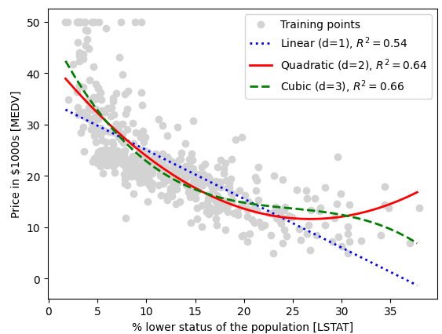

 
편향이 높으면 분산은 낮아짐 : 과소적합(Under fitting), 분산이 높으면 편향이 낮아짐 : 과대적합(Over fitting) 
  
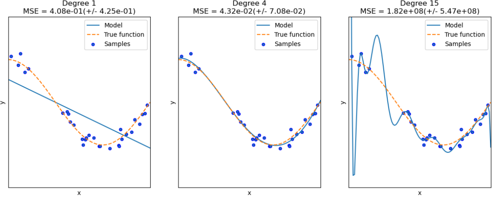

	import pandas as pd
	import numpy as np
	import matplotlib.pyplot as plt 
	from sklearn.linear_model import LinearRegression
	from sklearn.metrics import r2_score
	
	df = pd.read_csv('https://raw.githubusercontent.com/YangGuiBee/ML/main/TextBook-04/housing.data.txt',
                 header=None, sep='\s+')

	df.columns = ['CRIM','ZN','INDUS','CHAS','NOX','RM','AGE','DIS','RAD','TAX','PTRATIO','B','LSTAT','MEDV']
	df.head()
	
	X = df[['LSTAT']].values
	y = df['MEDV'].values
	
	regr = LinearRegression()

	# 이차, 삼차 다항식 특성을 만듭니다
	quadratic = PolynomialFeatures(degree=2)
	cubic = PolynomialFeatures(degree=3)
	X_quad = quadratic.fit_transform(X)
	X_cubic = cubic.fit_transform(X)

	# 학습된 모델을 그리기 위해 특성 범위를 만듭니다
	X_fit = np.arange(X.min(), X.max(), 1)[:, np.newaxis]
	
	regr = regr.fit(X, y)
	y_lin_fit = regr.predict(X_fit)
	linear_r2 = r2_score(y, regr.predict(X))
	
	regr = regr.fit(X_quad, y)
	y_quad_fit = regr.predict(quadratic.fit_transform(X_fit))
	quadratic_r2 = r2_score(y, regr.predict(X_quad))
	
	regr = regr.fit(X_cubic, y)
	y_cubic_fit = regr.predict(cubic.fit_transform(X_fit))
	cubic_r2 = r2_score(y, regr.predict(X_cubic))
		
	# 결과 그래프를 그립니다
	plt.scatter(X,y,label='Training points', color='lightgray')
	plt.plot(X_fit,y_lin_fit,label='Linear(d=1),$R^2=%.2f$' % linear_r2,color='blue',lw=2,linestyle=':')
	plt.plot(X_fit,y_quad_fit,label='Quadratic(d=2),$R^2=%.2f$' % quadratic_r2,color='red',lw=2,linestyle='-')
	plt.plot(X_fit,y_cubic_fit,label='Cubic(d=3),$R^2=%.2f$' % cubic_r2,color='green',lw=2,linestyle='--')
	plt.xlabel('% lower status of the population [LSTAT]')
	plt.ylabel('Price in $1000s [MEDV]')
	plt.legend(loc='upper right')
	plt.show()

 

	입력데이터의 Feature들이 너무 많은 경우(Feature수에 비해 관측치 수가 적은 경우) 과적합이 발생
	→ 
	(해결방안1) 데이터를 더 수집하거나 불필요한 Features들을 제거
	(해결방안2) 가중치(회귀계수)에 페널티 값을 적용하는 규제(Regularization)를 통해 
 	            Feature들에 곱해지는 가중치가 커지지 않도록 제한

 

---
# [5] 정규화 (Regularized), 벌점부여 (Penalized) 선형 회귀
규제(Regularization) : 비용함수에 alpha값으로 패널티를 부여해서 회귀계수값의 크기를 감소시켜서 과적합을 개선 
비용함수의 목표 = $Min(RSS(W) + alpha * ||W||_2^2)$

# [5-1] 릿지 회귀 (Ridge Regression)
▣ 가이드 : https://scikit-learn.org/stable/modules/linear_model.html#ridge-regression-and-classification 
▣ API : https://scikit-learn.org/stable/modules/generated/sklearn.linear_model.Ridge.html 
최소제곱추정치(OLS)가 편향되지 않더라도 분산이 커서 관측값이 실제값에서 크게 벗어나는 다중공선성(multicollinearity)이 발생할 경우, 회귀 분석 추정치에 치우침 정도를 추가하여 표준오차를 줄이기 위해 사용 
모델의 설명력에 기여하지 못하는 독립변수의 회귀계수 크기를 0에 근접하도록 축소시키는 회귀 
L2-norm 페널티항을 통해 일반 선형회귀 모델에 페널티를 부과하는 방법으로 회귀계수를 축소 
(L2 norm : 실제값과 예측값의 오차의 제곱의 합) 

	from sklearn.linear_model import Ridge
	from sklearn.metrics import mean_squared_error
	from sklearn.metrics import r2_score

	ridge = Ridge(alpha=1.0)
	ridge.fit(X_train, y_train)
	y_train_pred = ridge.predict(X_train)
	y_test_pred = ridge.predict(X_test)
	print(ridge.coef_)
	
	print('훈련 MSE: %.3f, 테스트 MSE: %.3f' % (mean_squared_error(y_train, y_train_pred),mean_squared_error(y_test, y_test_pred)))
	print('훈련 R^2: %.3f, 테스트 R^2: %.3f' % (r2_score(y_train, y_train_pred),r2_score(y_test, y_test_pred)))

 

# [5-2] 라쏘 회귀 (Lasso Regression)
▣ 가이드 : https://scikit-learn.org/stable/modules/linear_model.html#lasso 
▣ API : https://scikit-learn.org/stable/modules/generated/sklearn.linear_model.Lasso.html 
릿지회귀모델과 다르게 설명력에 기여하지 못하는 독립변수의 회귀계수를 0으로 만드는 회귀 
L1-norm 패널티항으로 회귀모델에 패널티를 부과함으로써 회귀계수를 축소 
(L1 norm : 실제값과 예측값의 오차의 절대값의 합) 

	from sklearn.linear_model import Lasso
	from sklearn.metrics import mean_squared_error
	from sklearn.metrics import r2_score
	
	lasso = Lasso(alpha=0.1)
	lasso.fit(X_train, y_train)
	y_train_pred = lasso.predict(X_train)
	y_test_pred = lasso.predict(X_test)
	print(lasso.coef_)
	
	print('훈련 MSE: %.3f, 테스트 MSE: %.3f' % (mean_squared_error(y_train, y_train_pred), mean_squared_error(y_test, y_test_pred)))
	print('훈련 R^2: %.3f, 테스트 R^2: %.3f' % (r2_score(y_train, y_train_pred),r2_score(y_test, y_test_pred)))

 

# [5-3] 엘라스틱넷 회귀 (Elastic Net Regression)
▣ 가이드 : https://scikit-learn.org/stable/modules/linear_model.html#elastic-net 
▣ API : https://scikit-learn.org/stable/modules/generated/sklearn.linear_model.ElasticNet.html 
릿지와 라쏘의 결합으로 L1규제로 Feature 수를 줄임과 동시에 L2규제로 계수값의 크기를 조정하는 패널티를 부과하여 회귀모델을 생성 

	from sklearn.linear_model import ElasticNet
	elanet = ElasticNet(alpha=1.0, l1_ratio=0.5)

 

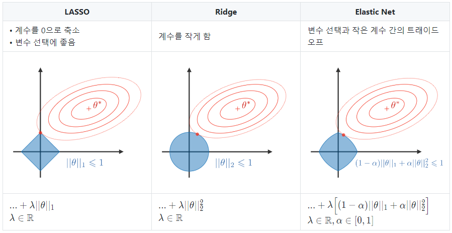
 
출처 : https://stanford.edu/~shervine/l/ko/teaching/cs-229/cheatsheet-machine-learning-tips-and-tricks

 

---

# [선형회귀모델과 경사하강법 비교 예제]

	import numpy as np
	import matplotlib.pyplot as plt
	from sklearn.linear_model import LinearRegression, SGDRegressor
	from sklearn.model_selection import train_test_split

	# 예제 데이터 생성
	np.random.seed(0)
	X = 2 * np.random.rand(100, 1)  # 0에서 2까지의 랜덤 숫자 100개 생성
	y = 4 + 3 * X + np.random.randn(100, 1)  # y = 4 + 3x + 가우시안 노이즈

	# 훈련 세트와 테스트 세트로 나누기
	X_train, X_test, y_train, y_test = train_test_split(X, y, test_size=0.2, random_state=42)

	# 기본 LinearRegression 모델 초기화 및 훈련
	linear_reg = LinearRegression()
	linear_reg.fit(X_train, y_train)

	# SGDRegressor 모델 초기화 및 훈련
	sgd_reg = SGDRegressor(max_iter=1000, tol=1e-3)
	sgd_reg.fit(X_train, y_train.ravel())  # y_train은 1D 배열로 변환

	# 모델 예측
	y_pred_linear = linear_reg.predict(X_test)
	y_pred_sgd = sgd_reg.predict(X_test)

	# 결과 시각화
	plt.figure(figsize=(12, 6))

	# Linear Regression 결과
	plt.subplot(1, 2, 1)
	plt.scatter(X_test, y_test, color='blue', label='실제값')
	plt.scatter(X_test, y_pred_linear, color='red', label='LinearRegression 예측값')
	plt.plot(X_test, y_pred_linear, color='red', linewidth=2)
	plt.title('기본 선형 회귀 모델')
	plt.xlabel('X')
	plt.ylabel('y')
	plt.legend()

	# SGDRegressor 결과
	plt.subplot(1, 2, 2)
	plt.scatter(X_test, y_test, color='blue', label='실제값')
	plt.scatter(X_test, y_pred_sgd, color='green', label='SGDRegressor 예측값')
	plt.plot(X_test, y_pred_sgd, color='green', linewidth=2)
	plt.title('SGDRegressor 모델')
	plt.xlabel('X')
	plt.ylabel('y')
	plt.legend()
	plt.tight_layout()
	plt.show()

	# 회귀 계수 및 절편 출력
	print("LinearRegression 회귀 계수:", linear_reg.coef_)
	print("LinearRegression 절편:", linear_reg.intercept_)
	print("SGDRegressor 회귀 계수:", sgd_reg.coef_)
	print("SGDRegressor 절편:", sgd_reg.intercept_)

	# R² 점수 출력
	score_linear = linear_reg.score(X_test, y_test)
	score_sgd = sgd_reg.score(X_test, y_test)

	print("LinearRegression R² 점수:", score_linear)
	print("SGDRegressor R² 점수:", score_sgd)

 

---
# [6] 비선형 회귀 (nonlinear regression)
데이터를 어떻게 변형하더라도 파라미터를 선형 결합식으로 표현할 수 없는 모델로 회귀모형에 주어진 회귀식이 모수들의 비선형함수로 나타나는 경우 선형회귀에서 회귀계수는 설명변수의 변화량에 따른 반응변수의 평균변화량으로 해석되지만, 비선형회귀에서는 각 모수가 특정한 의미를 가지게 된다. 
<!--
(1) 다항 회귀 (Polynomial Regression)
 $y = β_0 + β_1X + β_2X^2 +⋯+ β_nX^n + ϵ$

(2) 지수 회귀 (Exponential Regression)
 $y = αe^{βX} + ϵ$ 
 $ln(y) = ln(α) + βX + ϵ$

(3) 로그 회귀 (Logarithmic Regression)
 $y = α + βln(X) + ϵ$
 $∂y/∂x = β/x$

(4) 다중 회귀 (Multiple Regression)
 $y = α + β_1X_1 + β_2X_2^2 + β_3sin(X_3) + ϵ$

(5) 시그모이드 회귀 (Sigmoid Regression)
 $y = 1/(1+e^−{βX}) + ϵ$
 $ln(y/(1−y)) = βX + ϵ$

(6) 전력 회귀 (Power Regression)
 $y = αx^β + ϵ$
 $∂y/∂x = α⋅β⋅x^{β−1}$

(7) 포아송 회귀 (Poisson Regression)
 $ln(y) = α + βX + ϵ$

(8) 감마 회귀 (Gamma Regression)
 $y = αX^β + ϵ$
 $ln(y) = ln(α) + βln(X) + ϵ$

(9) 베이즈 회귀 (Bayesian Regression)
 $y = β_0 + β_1X_1 +⋯+ β_nX_n + ϵ$

(10) 스플라인 회귀 (Spline Regression)
 $y = β_iB_i(X)의 합 + ϵ$

(11) 로버스트 회귀 (Robust Regression)
 $y = β_0 + β_1X_1 +⋯+ β_nX_n + ϵ$

(12) 커널 회귀 (Kernel Regression)
 $y = α_iK(X,X_i)의 합 + ϵ$

(13) 구형 회귀 (Quadratic Regression)
 $y = β_0 + β_1x + β_2x^2 + ϵ$
 $∂y/∂x = β_1 + 2β_2x$
-->
 

| 구분 | 수식 | 곡선 형태 및 주요 적용 분야 |
|----|------|------------------------------|
| [6-1] 비선형 최소제곱 회귀 (*Nonlinear Least Squares Regression, NLS*) |  | 모든 비선형 회귀의 기본 틀 — 물리·공학·경제모형 파라미터 추정 |
| [6-2] 지수 회귀 (*Exponential Regression*) |  | 지수 성장/감쇠형 — 세균 성장, 방사능 붕괴, 수익률 감소 |
| [6-3] 로그형 회귀 (*Logarithmic Regression*) |  | 완만한 증가·감소형 (Concave/Convex) — 학습곡선, 효용함수 |
| [6-4] 전력 회귀 (*Power Regression*) |  | 거듭제곱형 (Scaling law) — 물리량 관계, 생산함수, 탄성분석 |
| [6-5] 시그모이드 회귀 (*Sigmoid Regression*) |  | S-curve (대칭형) — 확산, 포화, 학습 진전 곡선 |
| [6-6] 스플라인 회귀 (*Spline Regression*) |  | Piecewise Smooth Curve — 복잡한 곡선 근사, 경제·기하 모델 |
| [6-7] 커널 회귀 (*Kernel Regression*) |  | 부드러운 비모수 추세 — 시계열 평활화, 비선형 예측 |
| [6-8] 다항식 회귀 (*Polynomial Regression, High-order*) |  | 곡률 가변형 — 복잡한 추세 적합, 곡선 회귀 |
| [6-9] 로지스틱 성장 회귀 (*Logistic Growth Regression*) |  | S-curve (포화 성장형) — 인구·시장·바이러스 확산 모델 |
| [6-10] 곰퍼츠 회귀 (*Gompertz Regression*) |  | 비대칭 S-curve — 생물 성장, 약물 반응, 감염 전파 곡선 |
| [6-11] 하이퍼볼릭 회귀 (*Hyperbolic Regression*) |  | 포화/역비례형 — 반응 속도, 농도-효과 관계, 수율 분석 |
| [6-12] 가우시안 회귀 (*Gaussian Regression*) |  | Bell-shape (대칭형) — 분포형 반응, 최적점 탐색, 약물 농도 반응 |
| [6-13] 볼츠만 시그모이드 회귀 (*Boltzmann Sigmoidal Regression*) |  | S-curve (단계적 포화) — 물질 전이, 온도 반응, 전기신호 변화 |
| [6-14] 래셔널 함수 회귀 (*Rational Function Regression*) |  | 복합 비선형 곡선형 — 실험 데이터 근사, 제어모델 |
| [6-15] 구간별 회귀 (*Piecewise / Segmented Regression*) |  | Break-point형 — 구조적 변화 탐지, 정책효과 분석 |
| [6-16] 베이즈 비선형 회귀 (*Bayesian Nonlinear Regression*) |  | 불확실성 반영형 — 소표본 데이터, 확률적 예측 모델 |
| [6-17] 신경망 회귀 (*Neural Network Regression, MLP*) |  | Universal Approximation — 복잡한 비선형 함수 학습, 예측·제어 |

---

<!--

| 알고리즘                                      | 주된 학습 목적                                         | 핵심 아이디어                                                                              | 비고                                                   |
| ----------------------------------------- | ------------------------------------------------ | ------------------------------------------------------------------------------------ | ---------------------------------------------------- |
| **[9-1] PLS (Partial Least Squares)**           | 독립변수 (X)와 종속변수 (Y) 간 공분산을 최대화하여 예측력 높은 잠재요인을 추출  | (X, Y)의 공통된 잠재요인(latent variable)을 찾아 회귀계수를 추정                                       | (Y)가 연속형일 때 주로 사용하며, 변형형 **PLS-DA**는 범주형 (Y)에도 적용 가능 |
| **[9-2] LDA (Linear Discriminant Analysis)**    | 클래스 간 분산을 최대화하고 클래스 내 분산을 최소화하여 판별력이 높은 투영 축을 탐색 | Fisher의 판별기준 $\max_w \frac{w^T S_B w}{w^T S_W w}$을 사용하여 선형 판별 경계 형성                  | 다중 클래스 분류 차원축소에 사용, 클래스 경계가 명확할 때 우수                 |
| **[9-3] NCA (Neighborhood Component Analysis)** | 최근접이웃(kNN) 분류 정확도를 최대화하는 임베딩 공간을 학습              | 같은 클래스 샘플 간 거리를 줄이고, 다른 클래스 간 거리를 늘리는 확률적 거리학습                                       | 비선형 확장형(NNCA, MNCA) 존재, 주로 분류용으로 사용                  |
| **[9-4] CCA (Canonical Correlation Analysis)**  | 두 데이터셋(또는 feature set) 간 상관관계를 최대화               | (X, Y) 각각에 대한 선형 결합 (w, v)를 찾아 $w^T$ X와 $v^T$ Y의 상관을 극대화                             | 다중모달(이미지↔텍스트 등) 표현학습에 적합, 회귀·분류 모두 응용 가능             |
| **[9-5] Supervised PCA** | 라벨과 관련된 feature의 분산을 우선 보존 | 라벨 정보 기반 가중치를 부여한 후 PCA 수행 $(\tilde{S} = \mathrm{diag}(s(y)) S \mathrm{diag}(s(y)))$ | 일반 PCA보다 예측변수와 목표변수의 연관성 반영, 회귀·분류 모두 사용 가능          |

# [9-1] 부분 최소제곱 (Partial Least Squares, PLS)
설명변수 X 와 목표변수 Y 를 동시에 잘 설명하는 잠재요인(latent components)을 추출하고, 그 요인으로 회귀하는 방식 
(= PCA처럼 X의 분산만 보지 않고, Y와의 공분산을 극대화하는 방향으로 차원을 압축) 
PCA : X의 구조를 가장 잘 설명하는 축을 찾는다. (비지도) 
PLS : X가 Y를 가장 잘 설명하는 축을 찾는다. (지도) 

| 구분                                    | **PCA (주성분분석)**                               | **PLS (부분최소제곱)**                                        | 비고                        |
| ------------------------------------- | --------------------------------------------- | ------------------------------------------------------- | ------------------------- |
| **① 목적**       | X의 분산(variance)을 최대화하는 축(주성분)을 찾음   | X와 Y의 공분산(covariance)을 최대화하는 축(잠재요인)을 찾음  | PCA는 X 구조,  PLS는 X→Y 예측 중심 |
| **② 사용 데이터(Input)**     | 독립변수 X만 사용             | 독립변수 X와 종속변수 Y 모두 사용                                    | PLS는 지도형 차원축소 |
| **③ 출력(Output)**       | 주성분 점수(PC scores), 로딩(loading)                | 잠재요인(scores, loadings, weights), 회귀계수                   | PLS는 회귀모델까지 포함            |
| **④ 수학적 기준** | $\max_{\mathbf{w}} \text{Var}(Xw)$      | $\max_{\mathbf{w,q}} \text{Cov}(Xw, Yq)$       | 분산 vs 공분산 극대화             |
| **⑤ 차원축소 방식**     | X의 공분산 행렬 고유분해                                | X, Y의 교차공분산 구조분해                                        | PLS는 예측력 중심 축 선택          |
| **⑥ 가정 및 목적 함수 해석**                   | X 내부 구조를 요약(데이터 압축)          | X가 Y를 얼마나 잘 설명하는지 반영(예측 성능↑)           | PLS는 Y가 있기에 지도형 회귀와 연계    |
| **⑦ 결과 해석**        | 각 주성분이 X의 주요 변동방향을 설명                      | 각 잠재요인이 Y 예측에 기여한 방향을 설명                                | PLS는 VIP(변수 중요도) 계산 가능    |
| **⑧ 사용 사례**      | 탐색적 데이터 분석, 시각화, 이상치 탐지, 노이즈 제거               | 고차원 데이터 예측(화학계량, 스펙트럼, 유전자 등)   | PCA는 구조 탐색,  PLS는 예측/회귀    |
| **⑨ 학습 패러다임**                         | 비지도학습(Unsupervised)                    | 지도학습(Supervised)                                       | PLS는 회귀계열로 분류됨            |
| **⑩ 장단점 요약**   | 장점: 단순, 빠름, X 구조 해석용이 단점: Y와 무관한 방향 포함 가능 | 장점: Y 예측에 특화, 공선성 해결, VIP 해석가능 단점: 컴포넌트 수 선택, 해석 복잡 | PLS ⊃ PCA (예측지향적 확장형)     |

-->
