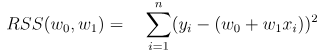

#  09 : 지도 학습 (Supervised Learning, SL) : 회귀 (regression)
**지도 학습**은 주어진 입력값($X$)에 대하여 신뢰성 있는 출력값($y$)을 출력하는 함수를  
현재 가지고 있는 데이터(학습 데이터 $X$, $y$)로부터 학습하는 과정이다. 
수식을 이용하여 표현하면, 현재 가지고 있는 학습데이터 $(X, y)$로부터 $y = f(X)$를 만족하는  
여러 함수 $f$중에서 가장 최적의(주어진 Task에 따라 달라짐) $f$를 찾는 과정이라고 할 수 있다. 
출력 변수 $y$가 최적 함수 $f$를 찾도록 지도해주는 역할을 한다고 해서 지도 학습이라고 한다. 

지도 학습은 **회귀(Regression)** 와 **분류(Classification)** 로 구분된다. 
회귀 모델은 예측값으로 연속적인 값을 출력하고, 분류 모델은 예측값으로 이산적인 값을 출력한다.  

예를 들어, 도미와 빙어의 길이와 무게 데이터를 통해 도미 여부를 식별하는 것은 분류(출력변수 : 범주형),  
도미의 길이 데이터를 통해 도미의 무게를 예측하는 것은 회귀(출력변수 : 연속형)이다. 

---

	[1] 선형 회귀 (Linear Regression)
  
  	[2] 일반화 선형 회귀(Generalized Linear Regression, GLM)
   		[2-1] 로지스틱 회귀 (Logistic Regression) → 분류(10강)
		[2-2] 포아송 회귀 (Poisson Regression)
		[2-3] Cox의 비례위험 회귀(Cox's Proportional Hazard Regression)
     
 	[3] 다중 선형 회귀 (Multiple Linear Regression)
		[3-1] 단계적 회귀 (Stepwise Regression), 위계적 회귀 (Hierarchical Regression) 
		[3-2] 분위수 회귀 (Quantile Regression)
  
	[4] 다항 선형 회귀 (Polynomial Linear Regression)

   	[5] 정규화 (Regularized), 벌점부여 (Penalized) 선형 회귀
		[5-1] 릿지 회귀 (Ridge Regression)
		[5-2] 라쏘 회귀 (Lasso Regression)
		[5-3] 엘라스틱넷 회귀 (Elastic Net Regression)

  	[6] 비선형 회귀 (nonlinear regression)

	[7] 차원축소
		[7-1] PCR(Principal Component Regression)
		[7-2] PLS(Partial Least Squares Regression)

---

 

# [1] 선형 회귀 (Linear Regression)
▣ 가이드 : https://scikit-learn.org/stable/modules/linear_model.html# 
▣ API : https://scikit-learn.org/stable/modules/generated/sklearn.linear_model.LinearRegression.html 
▣ 예제 : https://scikit-learn.org/stable/auto_examples/linear_model/index.html 
종속변수 y(예상값)과 독립변수(설명변수) X와의 선형 상관 관계를 모델링하는 회귀로 
회귀 계수(regression coefficient)를 선형 결합으로 표현할 수 있는 모델 
'선형'은 종속변수와 독립변수의 관계가 2차원에서는 선형으로, 3차원 공간에서는 평면으로 나타난다.  

 

출처 : https://savannahar68.medium.com/getting-started-with-regression-a39aca03b75f
 

---
모델이 독립변수와 회귀계수에 대하여 선형인 경우 
$y = mx + b$  
$y = w_1x + w_0$  
$y_i = β_1x_i + β_0 + ϵ_i$ 
###### $y_i$ : i번째 반응변수 값, $x_i$ : i번째 설명변수 값, $β_0$ : 절편 회귀계수, $β_1$ : 기울기 회귀계수, $ϵ_i$ : i번째 측정된 $y_i$의 오차 성분 
모든 회귀계수 각각에 대해 편미분한 결과가 다른 회귀계수를 포함하지 않는 경우에도 선형모형이라고 할 수 있다. 

​​
 

---
선형회귀는 학습을 통해 예측값과 실제관측값인 잔차 제곱들의 합인 <ins>**RSS(Residual Sum of Squares)**</ins>를 최소로 하는 회귀계수($W_0$과 $W_1$)를 찾는 것이 핵심. 

<ins>**최소제곱법(Ordinary Least Squares, OLS)**</ins> : 통계학과 머신러닝에서 가장 기본적이고 중요한 회귀분석 방법으로 
“데이터에 가장 잘 맞는 직선을 찾기 위해, 오차 제곱합이 최소가 되도록 직선의 기울기와 절편을 구하는 방법” 

​ 

**경사하강법 (Gradient Decent)**
비용 함수 f의 함숫값이 줄어드는 방향으로 함수의 계수를 일정 크기(학습량)만큼 더해나가며 f의 최솟값을 찾는 최적화 기법이다.
기울기 $Gradient(f)=∇f(x)=[ ∂f(x_0)/∂x_0, ∂f(x_1)/∂x_1,...,∂f(x_{N−1}/∂x_{N−1}]^T$
​미분 가능한 N개의 다변수 함수 f를 각 축에 대하여 편미분한 값으로, 스칼라 함수의 모든 축에 대응하는 벡터장을 생성하는 역할을 한다.
손실 함수가 조금만 복잡해져도 Global Minimum을 발견하지 못한 채 Local Minimum에 빠지기 쉽고 학습 시간이 길다.

 
오류가 작아지는 방향으로 w값을 보정할 수 있는 해법을 구하는 방법 
(1) $W_1$, $W_0$을 임의의 값으로 설정하고 첫 비용함수의 값을 계산한다. 
(2) $W_1$, $W_0$의 값을 주어진 횟수만큼 계속 업데이트한다. 
$x_{i+1} = x_i - \alpha \frac{df}{dx}(x_i)$, $x_{i+1} = x_i - \alpha \nabla f(x_i)$ 

 , 

---

	# 선형회귀모델(LinearRegression) Scikit-Learn Package 사용
 	from sklearn.linear_model import LinearRegression
	
 	# 선형회귀모델(LinearRegression) 클래스 객체 생성
	lr = LinearRegression()
 
 	# 선형회귀모델(LinearRegression) 학습
	lr.fit(train_input, train_target)

	# 학습결과로 도출한 값 coef_ : 기울기(w1), intercept_ : 절편(w0)
	print(lr.coef_, lr.intercept_)

 	# 선형회귀모델(LinearRegression) 학습결과를 바탕으로 새로운값에 대한 예측
	print(lr.predict(([50]))

---
 

# [2] 일반화 선형 회귀(Generalized Linear Regression, GLM)
일반화 선형 회귀의 경우 선형성, 독립성, 등분산성, 정규성의 가정을 갖고 있지만, 종속변수가 연속형이 아니라면 대표적으로 오차항의 정규성 가정이 깨지게 되는데, 종속변수를 적절한 함수로 변화시킨 f(y)를 독립변수와 회귀계수의 선형결합으로 모형화한 것이다. 

# [2-1] 로지스틱 회귀 (Logistic Regression) → 분류(10강)

 

# [2-2] 포아송 회귀 (Poisson Regression)
▣ API : https://scikit-learn.org/stable/modules/generated/sklearn.linear_model.PoissonRegressor.html 
종속변수가 포아송 분포(Poisson Distribution)를 따르는 경우에 사용되며, 이산형 카운트 데이터를 모델링하는 데 적합하다.  
포아송 분포는 단위(한정된) 시간이나 공간에서 발생하는 평균적인 사건의 횟수(λ)를 바탕으로 특정 횟수의 사건이 발생할 확률을 설명한다.  
종속변수가 빈도변수로 0이상 정수이거나, 왜도가 크거나, 분포유형이 포아송 로그선형일 경우에 실시한다. 
참고로 평균보다 분산이 큰 경우에 적용하는 **음이항 회귀(Negative binomial regression)** 는 분산이 포아송 모델의 평균과 동일하다는 매우 제한적인 가정을 완화할 수 있다.
전통적인 음이항 회귀 모델은 포아송과 **감마(gamma regression)** 혼합 분포를 기반으로 하여 널리 사용된다.  
**포아송 확률변수 $X$의 확률밀도함수(probability mass function)** : $P(X = k; \lambda) = \frac{e^{-\lambda}\lambda^k}{k!}$ 
###### X : 사건이 발생하는 횟수를 나타내는 확률 변수, 𝑘 : 발생한 사건의 횟수(0, 1, 2, 3, ...), 𝜆 : 단위 시간 또는 공간 내에서 사건이 발생하는 평균 횟수(포아송 분포의 모수, 평균이자 분산으로 λ가 작을수록 사건이 드물게 발생하는 상황을 나타내며, λ가 클수록 사건이 자주 발생하는 상황), 𝑒 : 자연 상수 ≈2.718, 𝑘! : k의 팩토리얼로, 𝑘×(𝑘−1)×⋯×1 

**포아송 회귀 적용 사례 :** 일정 주어진 시간 동안에 방문하는 고객의 수, 일정 주어진 생산시간 동안 발생하는 불량 수, 하룻동안 발생하는 출생자 수, 어떤 시간 동안 톨게이트를 통과하는 차량의 수, 어떤 페이지에 있는 오타의 발생률, 어떤 특정 면적의 삼림에서 자라는 소나무의 수 

 

	# numpy 라이브러리 임포트 (수치 계산에 유용한 함수 제공)
	import numpy as np                      
	# seaborn 라이브러리 임포트 (데이터 시각화 라이브러리)
	import seaborn as sns                
	# matplotlib의 pyplot 모듈 임포트 (그래프 그리기에 사용)
	import matplotlib.pyplot as plt         
	# scipy.stats에서 poisson 모듈 임포트 (포아송 분포 관련 함수 제공)
	from scipy.stats import poisson          
	# scipy.special에서 factorial 모듈 임포트 (팩토리얼 계산을 위한 함수 제공)
	from scipy.special import factorial      
	
	# 평균이 1인 포아송 분포에서 10개의 랜덤 샘플을 생성 (이 코드는 결과를 사용하지 않음)
	poisson.rvs(mu=1, size=10)               

	# seaborn의 "BrBG" 색상 팔레트에서 6개의 색을 선택 (그래프 색상에 사용)
	pal_brbg = sns.color_palette("BrBG", 6)  
	
	# 0부터 10까지의 정수 배열 생성 (x축 값, 즉 포아송 분포에서 발생 가능한 사건의 수)
	x = np.arange(0, 11)                     

	# λ 값을 1부터 5까지 반복하여 각각의 포아송 분포 그래프를 그림
	for n_lambda in range(1, 6):             

    		# 포아송 분포의 확률 계산: P(x; λ) = (e^(-λ) * λ^x) / x!
    		y = np.exp(-n_lambda) * np.power(n_lambda, x) / factorial(x)  

    		# 계산된 확률 y값을 x값에 대해 선 그래프로 그림, 각각 다른 색 사용
    		plt.plot(x, y, color=pal_brbg[n_lambda - 1], label=f"λ = {n_lambda}")  

    		# 해당 λ에 대한 확률 값을 점으로 표시
    		plt.scatter(x, y, color=pal_brbg[n_lambda - 1])  

	# y축 라벨 설정 (확률)
	plt.ylabel("Probability")                
	# 그래프 제목 설정 (λ 값의 범위 명시)
	plt.title(f"Poisson Distribution (λ = [1, 5])")  
	# x축에 0부터 10까지의 값 표시
	plt.xticks(x)                            
	# y축에 점선 스타일의 회색 그리드 추가 (가독성 향상)
	plt.grid(axis="y", linestyle="--", color="#CCCCCC")  
	# 그래프의 범례를 오른쪽 상단에 표시
	plt.legend(loc="upper right")            
	# 그래프를 화면에 출력
	plt.show()                               

 

# [2-3] Cox의 비례위험 회귀(Cox's Proportional Hazard Regression)
Cox의 비례위험 회귀는 생존 분석(survival analysis)에서 주로 사용되는 회귀 모델이다. 어떤 사건(event)이 일어날 때까지의 시간을 대상으로 분석하는 통계방법으로 사건과 사건 사이의 예측 회귀 모형을 분석한다. 이 모델은 사건(예: 사망, 질병 발병, 기계 고장 등)이 발생할 때까지의 시간과 그 사건이 발생할 확률(위험율) 사이의 관계를 설명한다. 주어진 독립변수 값에 대해 위험율($hazard ratio(log(h(t)/h_0(t)))$)이 시간에 걸쳐 일정한 비율로 유지(두 피험자에 대해 위험율의 비율이 시간이 지나도 일정하게 유지)된다고 가정한다. 위험율(HR)이 1보다 크면 위험이 증가하고, 1보다 작으면 위험이 감소하는 것으로 평가한다. 환자가 특정 치료 후 생존할 확률을 예측, 기계 부품이 고장날 때까지의 시간을 분석, 사회학 연구에서 결혼생활이 파탄날 확률을 예측할 때 활용한다. 만약 비례 위험 가정이 만족되지 않으면 Cox 회귀 모델의 결과가 왜곡될 수 있으므로, 이 경우에는 비례 위험 가정을 검토하거나 시간을 고려한 상호작용 변수를 추가해야 한다. 
 

| 구분   | 포아송 회귀                                  | Cox 회귀                                                   |
|--------|----------------------------------------------|------------------------------------------------------------|
| 목적   | 사건 발생 횟수 예측                          | 사건이 발생할 때까지의 시간과 그 사건의 위험율을 분석      |
| 데이터 | 주로 이산형(정수)                            | 생존시간과 같은 연속형                                     |
| 가정   | 포아송 분포와 로그 링크 함수                 | 비례위험                                                   |
| 사례   | 범죄율, 질병 발생률 등 사건 발생 횟수의 예측 | 환자의 생존율, 부품의 고장 시간 등 생존 분석과 관련된 문제 |

 

---
# [3] 다중회귀 (Multiple Regression)
독립변수 X가 2개 이상인 회귀 
$y = w_1x_1 + w_2x_2 + ... + w_nx_n + w_0$  
$y_i = β_0 + β_1x_{i1} + β_2x_{i2} + ... + β_kx_{ik} + ϵ_i$ 
$y_i$ : i번째 관측치, $ϵ_i$ : 이때의 오차항, $x_{ij}$ : 독립변수로 known value 
$β_j$ : 추정하고자하는 값인 회귀계수로 $0≤j≤k$ 사이의 값 
N개의 샘플에 대하여 확장한 후, vector-matrix 형태로 표기하면, 
 
$e∼N(0,σ^2I_N)$ 

	import pandas as pd
	import matplotlib.pyplot as plt 
	from sklearn.model_selection import train_test_split
	from sklearn.linear_model import LinearRegression

 	# 데이터 수집
	df = pd.read_csv('https://raw.githubusercontent.com/YangGuiBee/ML/main/TextBook-04/manhattan.csv')
 	# 데이터 전처리(null겂이 많은 항목 삭제)
	df = df.drop(['neighborhood','borough','rental_id'], axis=1)
	
	X = df [['bedrooms', 'bathrooms', 'size_sqft', 'min_to_subway', 'floor',
       	'building_age_yrs', 'no_fee', 'has_roofdeck', 'has_washer_dryer',
	'has_doorman', 'has_elevator', 'has_dishwasher', 'has_patio','has_gym']]
	y = df [['rent']]       
 
 	# 데이터 구분 (학습데이터와 테스트 데이터 8:2)
	X_train, X_test, y_train, y_test = train_test_split(X,y,train_size=0.8,test_size=0.2)
 	# 선형회귀모델 객체 생성
	mlr = LinearRegression()
 	# 학습
	mlr.fit(X_train, y_train)	
  	# 평가
 	print(mlr.score(X_train, y_train))
 	# 예측
	y_predict = mlr.predict(X_test)

 	# 그래프 그리기
	plt.scatter(y_test,y_predict,alpha=0.4)
	plt.xlabel('Actual Rent')
	plt.ylabel('Predicted Rent')
	plt.title('Multiple Linear Regression')
	plt.show()

 

# [3-1] 단계적 회귀 (Stepwise Regression), 위계적 회귀 (Hierarchical Regression) 
여러 독립변수 중에서 종속변수를 가장 잘 설명하는 변수들을 선택하는 방법 
**단계적 회귀 (Stepwise Regression)** 는 독립 변수들을 자동으로 모델에 추가하거나 제거하여 최적의 모델을 탐색(변수의 추가나 제거가 통계적으로 유의미한지 여부에 따라 이루어짐) 
예를 들어, 변수를 추가할 때마다 F 통계량이유의미하게 증가하는지 확인하거나, 제거할 때마다 변수의 t 통계량이 유의미하게 감소하는지 확인  
장점: 자동으로 변수를 선택하므로 모델이 데이터에 더 잘 맞을 가능성이 있음 
**위계적 회귀 (Hierarchical Regression)** 는 독립 변수들을 미리 정의한 순서에 따라 모델에 추가하는 것으로, 
이론적으로 중요한 변수부터 시작하여 덜 중요한 변수를 차례로 추가하는 방식 
장점: 이론적 근거에 따라 변수를 추가하므로 결과 해석이 이론적으로 타당함. 

 

# [3-2] 분위수 회귀 (Quantile Regression)
▣ API : https://scikit-learn.org/stable/modules/generated/sklearn.linear_model.QuantileRegressor.html 
반응 변수의 조건부 분위수를 모델링 할때 사용되는 선형 회귀의 확장 버전 
1) 선형 회귀 조건이 충족되지 않는 경우 
2) 오차의 분산이 큰 경우 
3) Robust한 결과를 위하여 
4) 많은 이상치의 영향을 줄이기 위하여 
5) 점 추정이 아닌 구간추정을 통해 결과의 정확도를 높이기 위하여 
6) 반응변수의 스프레드를 같이 살펴보기 위하여 
7) 회귀곡선에 대한 설득력을 높이기 위하여 

 
보통 OLS 회귀는 조건부 평균값을 모델링하는 반면 분위수 회귀는 조건부 분위수를 모델링하고 
조건부 분위수를 모델링하기 위해 Pinball loss를 사용 
기존의 조건부 평균 값 예측이 아닌 조건부 분위수 값을 예측하는 문제로 풀이 될 수 있다. 

$Q_{\tau}(y_{i}) = \beta_{0}(\tau) + \beta_{1}(\tau)x_{i1} + \cdots + \beta_{p}(\tau)x_{ip}$ 

최적의 분위수 방정식을 찾기 위한 과정은 중위수절대편차인 MAD(Median Absolute Deviation) 값을 최소화함으로써 찾을 수 있다. 
$MAD = \frac{1}{n} \sum_{i=1}^{n} \rho_{\tau}(y_{i} - (\beta_{0}(\tau) + \beta_{1}(\tau)x_{i1} +\cdots +\beta_{p}(\tau)x_{ip}))$ 
 
ρ함수는 오차의 분위수와 전체적인 부호에 따라 오차에 비대칭 가중치를 부여하는 체크 함수 
$\rho_{\tau}(u) = \tau\max(u,0) + (1-\tau)\max(-u,0)$ 
 

	import pandas as pd
	import numpy as np
	import matplotlib.pyplot as plt
	# statsmodels의 formula API에서 Quantile Regression 함수 임포트
	import statsmodels.formula.api as smf
	# sklearn 라이브러리에서 make_regression 함수 임포트 (회귀용 데이터 생성에 사용)
	from sklearn.datasets import make_regression
	from sklearn.model_selection import train_test_split
	# MSE 평가를 위한 라이브러리 추가
	from sklearn.metrics import mean_absolute_error

	# 가상의 회귀용 데이터를 생성 (10000개의 샘플, 1개의 특성, 1개의 타겟 변수)
	x, y = make_regression(n_samples=10000, n_features=1, n_informative=1, n_targets=1, random_state=42)

	# 생성된 데이터를 DataFrame으로 변환
	df = pd.DataFrame([x.reshape(-1), y.reshape(-1)]).T

	# 컬럼 이름을 'distance'와 'time'으로 설정
	df.columns = ['distance', 'time']

	# 'distance' 컬럼에 노이즈를 추가하여 변형
	df['distance'] = df['distance'].apply(lambda x: 10 + (x + np.random.normal()))

	# 'time' 컬럼에 노이즈를 추가하여 변형 (기울기가 0.2인 선형 모델을 기반으로 함)
	df['time'] = df['time'].apply(lambda x: 40 + 0.2 * (x + np.random.normal()))

	# 데이터를 훈련 세트와 테스트 세트로 나눔 (90%는 훈련, 10%는 테스트)
	train_x, test_x, train_y, test_y = train_test_split(df[['distance']], df[['time']], test_size=0.1, random_state=42)

	# 훈련 데이터와 테스트 데이터의 크기 출력
	print(train_x.shape)
	print(train_y.shape)
	print(test_x.shape)
	print(test_y.shape)

	# 모델 리스트와 예측값을 저장할 딕셔너리 초기화
	model_list = []
	pred_dict = {}

	# 0.1, 0.5, 0.9 분위수를 사용하여 Quantile Regression 모델을 훈련 및 예측
	# 0.1 분위수 : 하위 10% 지점, 0.5 분위수는 중앙값(중위수)으로 전체 데이터의 중간 지점, 0.9 분위수 : 상위 90% 지점에 해당하는 값
	for quantile in [0.1, 0.5, 0.9]:
  		# 훈련 데이터(거리와 시간)를 하나의 DataFrame으로 결합하여 초기화
  		df = pd.concat([train_x, train_y], axis=1).reset_index(drop=True)

  		# 분위수 회귀(Quantile Regression)를 수행하여 모델 피팅
  		quantile_reg = smf.quantreg('time ~ distance', df).fit(q=quantile)

  		# 테스트 데이터로 예측 수행
  		pred = quantile_reg.predict(test_x)

  		# 예측 결과를 분위수별로 저장
  		pred_dict[quantile] = pred

	# 테스트 데이터, 예측 결과, 실제 결과를 하나의 DataFrame으로 결합
	pred_df = pd.concat([test_x.reset_index(drop=True), pd.DataFrame(pred_dict).reset_index(drop=True), test_y.reset_index(drop=True)], axis=1)

	# 컬럼명 추가: distance, 0.1 분위수 예측값, 0.5 분위수 예측값, 0.9 분위수 예측값, 실제값(time)
	pred_df.columns = ['distance', 'pred_0.1', 'pred_0.5', 'pred_0.9', 'actual']

	# 평가 결과(MAE)를 출력하는 부분 추가 : 평가 결과는 0.1, 0.5, 0.9 분위수 각각에 대해 출력됨
	for quantile in [0.1, 0.5, 0.9]:
    		mae = mean_absolute_error(pred_df['actual'], pred_df[f'pred_{quantile}'])
    		print(f'Mean Absolute Error (MAE) for quantile {quantile}: {mae:.4f}')

 

---
# [4] 다항 회귀 (Polynomial Regression)
▣ 가이드 : https://scikit-learn.org/stable/modules/linear_model.html#polynomial-regression-extending-linear-models-with-basis-functions 
직선이 아닌 곡선 형태의 관계의 경우, 독립변수에 제곱이나 로그(log) 등을 취해 보면서 실시하는 모델링 
$y = w_1x_1 + w_2x_2^2 + ... + w_nx_n^n + w_0$  
 

 
편향이 높으면 분산은 낮아짐 : 과소적합(Under fitting), 분산이 높으면 편향이 낮아짐 : 과대적합(Over fitting) 
  

	import pandas as pd
	import numpy as np
	import matplotlib.pyplot as plt 
	from sklearn.linear_model import LinearRegression
	from sklearn.metrics import r2_score
	
	df = pd.read_csv('https://raw.githubusercontent.com/YangGuiBee/ML/main/TextBook-04/housing.data.txt',
                 header=None, sep='\s+')

	df.columns = ['CRIM','ZN','INDUS','CHAS','NOX','RM','AGE','DIS','RAD','TAX','PTRATIO','B','LSTAT','MEDV']
	df.head()
	
	X = df[['LSTAT']].values
	y = df['MEDV'].values
	
	regr = LinearRegression()

	# 이차, 삼차 다항식 특성을 만듭니다
	quadratic = PolynomialFeatures(degree=2)
	cubic = PolynomialFeatures(degree=3)
	X_quad = quadratic.fit_transform(X)
	X_cubic = cubic.fit_transform(X)

	# 학습된 모델을 그리기 위해 특성 범위를 만듭니다
	X_fit = np.arange(X.min(), X.max(), 1)[:, np.newaxis]
	
	regr = regr.fit(X, y)
	y_lin_fit = regr.predict(X_fit)
	linear_r2 = r2_score(y, regr.predict(X))
	
	regr = regr.fit(X_quad, y)
	y_quad_fit = regr.predict(quadratic.fit_transform(X_fit))
	quadratic_r2 = r2_score(y, regr.predict(X_quad))
	
	regr = regr.fit(X_cubic, y)
	y_cubic_fit = regr.predict(cubic.fit_transform(X_fit))
	cubic_r2 = r2_score(y, regr.predict(X_cubic))
		
	# 결과 그래프를 그립니다
	plt.scatter(X,y,label='Training points', color='lightgray')
	plt.plot(X_fit,y_lin_fit,label='Linear(d=1),$R^2=%.2f$' % linear_r2,color='blue',lw=2,linestyle=':')
	plt.plot(X_fit,y_quad_fit,label='Quadratic(d=2),$R^2=%.2f$' % quadratic_r2,color='red',lw=2,linestyle='-')
	plt.plot(X_fit,y_cubic_fit,label='Cubic(d=3),$R^2=%.2f$' % cubic_r2,color='green',lw=2,linestyle='--')
	plt.xlabel('% lower status of the population [LSTAT]')
	plt.ylabel('Price in $1000s [MEDV]')
	plt.legend(loc='upper right')
	plt.show()

 

	입력데이터의 Feature들이 너무 많은 경우(Feature수에 비해 관측치 수가 적은 경우) 과적합이 발생
	→ 
	(해결방안1) 데이터를 더 수집하거나 불필요한 Features들을 제거
	(해결방안2) 가중치(회귀계수)에 페널티 값을 적용하는 규제(Regularization)를 통해 
 	            Feature들에 곱해지는 가중치가 커지지 않도록 제한

 

---
# [5] 정규화 (Regularized), 벌점부여 (Penalized) 선형 회귀
규제(Regularization) : 비용함수에 alpha값으로 패널티를 부여해서 회귀계수값의 크기를 감소시켜서 과적합을 개선 
비용함수의 목표 = $Min(RSS(W) + alpha * ||W||_2^2)$

# [5-1] 릿지 회귀 (Ridge Regression)
▣ 가이드 : https://scikit-learn.org/stable/modules/linear_model.html#ridge-regression-and-classification 
▣ API : https://scikit-learn.org/stable/modules/generated/sklearn.linear_model.Ridge.html 
최소제곱추정치(OLS)가 편향되지 않더라도 분산이 커서 관측값이 실제값에서 크게 벗어나는 다중공선성(multicollinearity)이 발생할 경우, 회귀 분석 추정치에 치우침 정도를 추가하여 표준오차를 줄이기 위해 사용 
모델의 설명력에 기여하지 못하는 독립변수의 회귀계수 크기를 0에 근접하도록 축소시키는 회귀 
L2-norm 페널티항을 통해 일반 선형회귀 모델에 페널티를 부과하는 방법으로 회귀계수를 축소 
(L2 norm : 실제값과 예측값의 오차의 제곱의 합) 

	from sklearn.linear_model import Ridge
	from sklearn.metrics import mean_squared_error
	from sklearn.metrics import r2_score

	ridge = Ridge(alpha=1.0)
	ridge.fit(X_train, y_train)
	y_train_pred = ridge.predict(X_train)
	y_test_pred = ridge.predict(X_test)
	print(ridge.coef_)
	
	print('훈련 MSE: %.3f, 테스트 MSE: %.3f' % (mean_squared_error(y_train, y_train_pred),mean_squared_error(y_test, y_test_pred)))
	print('훈련 R^2: %.3f, 테스트 R^2: %.3f' % (r2_score(y_train, y_train_pred),r2_score(y_test, y_test_pred)))

 

# [5-2] 라쏘 회귀 (Lasso Regression)
▣ 가이드 : https://scikit-learn.org/stable/modules/linear_model.html#lasso 
▣ API : https://scikit-learn.org/stable/modules/generated/sklearn.linear_model.Lasso.html 
릿지회귀모델과 다르게 설명력에 기여하지 못하는 독립변수의 회귀계수를 0으로 만드는 회귀 
L1-norm 패널티항으로 회귀모델에 패널티를 부과함으로써 회귀계수를 축소 
(L1 norm : 실제값과 예측값의 오차의 절대값의 합) 

	from sklearn.linear_model import Lasso
	from sklearn.metrics import mean_squared_error
	from sklearn.metrics import r2_score
	
	lasso = Lasso(alpha=0.1)
	lasso.fit(X_train, y_train)
	y_train_pred = lasso.predict(X_train)
	y_test_pred = lasso.predict(X_test)
	print(lasso.coef_)
	
	print('훈련 MSE: %.3f, 테스트 MSE: %.3f' % (mean_squared_error(y_train, y_train_pred), mean_squared_error(y_test, y_test_pred)))
	print('훈련 R^2: %.3f, 테스트 R^2: %.3f' % (r2_score(y_train, y_train_pred),r2_score(y_test, y_test_pred)))

 

# [5-3] 엘라스틱넷 회귀 (Elastic Net Regression)
▣ 가이드 : https://scikit-learn.org/stable/modules/linear_model.html#elastic-net 
▣ API : https://scikit-learn.org/stable/modules/generated/sklearn.linear_model.ElasticNet.html 
릿지와 라쏘의 결합으로 L1규제로 Feature 수를 줄임과 동시에 L2규제로 계수값의 크기를 조정하는 패널티를 부과하여 회귀모델을 생성 

	from sklearn.linear_model import ElasticNet
	elanet = ElasticNet(alpha=1.0, l1_ratio=0.5)

 

 
출처 : https://stanford.edu/~shervine/l/ko/teaching/cs-229/cheatsheet-machine-learning-tips-and-tricks

 

---

# [선형회귀모델과 경사하강법 비교 예제]

	import numpy as np
	import matplotlib.pyplot as plt
	from sklearn.linear_model import LinearRegression, SGDRegressor
	from sklearn.model_selection import train_test_split

	# 예제 데이터 생성
	np.random.seed(0)
	X = 2 * np.random.rand(100, 1)  # 0에서 2까지의 랜덤 숫자 100개 생성
	y = 4 + 3 * X + np.random.randn(100, 1)  # y = 4 + 3x + 가우시안 노이즈

	# 훈련 세트와 테스트 세트로 나누기
	X_train, X_test, y_train, y_test = train_test_split(X, y, test_size=0.2, random_state=42)

	# 기본 LinearRegression 모델 초기화 및 훈련
	linear_reg = LinearRegression()
	linear_reg.fit(X_train, y_train)

	# SGDRegressor 모델 초기화 및 훈련
	sgd_reg = SGDRegressor(max_iter=1000, tol=1e-3)
	sgd_reg.fit(X_train, y_train.ravel())  # y_train은 1D 배열로 변환

	# 모델 예측
	y_pred_linear = linear_reg.predict(X_test)
	y_pred_sgd = sgd_reg.predict(X_test)

	# 결과 시각화
	plt.figure(figsize=(12, 6))

	# Linear Regression 결과
	plt.subplot(1, 2, 1)
	plt.scatter(X_test, y_test, color='blue', label='실제값')
	plt.scatter(X_test, y_pred_linear, color='red', label='LinearRegression 예측값')
	plt.plot(X_test, y_pred_linear, color='red', linewidth=2)
	plt.title('기본 선형 회귀 모델')
	plt.xlabel('X')
	plt.ylabel('y')
	plt.legend()

	# SGDRegressor 결과
	plt.subplot(1, 2, 2)
	plt.scatter(X_test, y_test, color='blue', label='실제값')
	plt.scatter(X_test, y_pred_sgd, color='green', label='SGDRegressor 예측값')
	plt.plot(X_test, y_pred_sgd, color='green', linewidth=2)
	plt.title('SGDRegressor 모델')
	plt.xlabel('X')
	plt.ylabel('y')
	plt.legend()
	plt.tight_layout()
	plt.show()

	# 회귀 계수 및 절편 출력
	print("LinearRegression 회귀 계수:", linear_reg.coef_)
	print("LinearRegression 절편:", linear_reg.intercept_)
	print("SGDRegressor 회귀 계수:", sgd_reg.coef_)
	print("SGDRegressor 절편:", sgd_reg.intercept_)

	# R² 점수 출력
	score_linear = linear_reg.score(X_test, y_test)
	score_sgd = sgd_reg.score(X_test, y_test)

	print("LinearRegression R² 점수:", score_linear)
	print("SGDRegressor R² 점수:", score_sgd)

 

---
# [6] 비선형 회귀 (nonlinear regression)
데이터를 어떻게 변형하더라도 파라미터를 선형 결합식으로 표현할 수 없는 모델로 회귀모형에 주어진 회귀식이 모수들의 비선형함수로 나타나는 경우 선형회귀에서 회귀계수는 설명변수의 변화량에 따른 반응변수의 평균변화량으로 해석되지만, 비선형회귀에서는 각 모수가 특정한 의미를 가지게 된다. 
<!--
(1) 다항 회귀 (Polynomial Regression)
 $y = β_0 + β_1X + β_2X^2 +⋯+ β_nX^n + ϵ$

(2) 지수 회귀 (Exponential Regression)
 $y = αe^{βX} + ϵ$ 
 $ln(y) = ln(α) + βX + ϵ$

(3) 로그 회귀 (Logarithmic Regression)
 $y = α + βln(X) + ϵ$
 $∂y/∂x = β/x$

(4) 다중 회귀 (Multiple Regression)
 $y = α + β_1X_1 + β_2X_2^2 + β_3sin(X_3) + ϵ$

(5) 시그모이드 회귀 (Sigmoid Regression)
 $y = 1/(1+e^−{βX}) + ϵ$
 $ln(y/(1−y)) = βX + ϵ$

(6) 전력 회귀 (Power Regression)
 $y = αx^β + ϵ$
 $∂y/∂x = α⋅β⋅x^{β−1}$

(7) 포아송 회귀 (Poisson Regression)
 $ln(y) = α + βX + ϵ$

(8) 감마 회귀 (Gamma Regression)
 $y = αX^β + ϵ$
 $ln(y) = ln(α) + βln(X) + ϵ$

(9) 베이즈 회귀 (Bayesian Regression)
 $y = β_0 + β_1X_1 +⋯+ β_nX_n + ϵ$

(10) 스플라인 회귀 (Spline Regression)
 $y = β_iB_i(X)의 합 + ϵ$

(11) 로버스트 회귀 (Robust Regression)
 $y = β_0 + β_1X_1 +⋯+ β_nX_n + ϵ$

(12) 커널 회귀 (Kernel Regression)
 $y = α_iK(X,X_i)의 합 + ϵ$

(13) 구형 회귀 (Quadratic Regression)
 $y = β_0 + β_1x + β_2x^2 + ϵ$
 $∂y/∂x = β_1 + 2β_2x$
-->
 

| 구분 | 수식 | 곡선 형태 및 주요 적용 분야 |
|----|------|------------------------------|
| [6-1] 비선형 최소제곱 회귀 (*Nonlinear Least Squares Regression, NLS*) |  | 모든 비선형 회귀의 기본 틀 — 물리·공학·경제모형 파라미터 추정 |
| [6-2] 지수 회귀 (*Exponential Regression*) |  | 지수 성장/감쇠형 — 세균 성장, 방사능 붕괴, 수익률 감소 |
| [6-3] 로그형 회귀 (*Logarithmic Regression*) |  | 완만한 증가·감소형 (Concave/Convex) — 학습곡선, 효용함수 |
| [6-4] 전력 회귀 (*Power Regression*) |  | 거듭제곱형 (Scaling law) — 물리량 관계, 생산함수, 탄성분석 |
| [6-5] 시그모이드 회귀 (*Sigmoid Regression*) |  | S-curve (대칭형) — 확산, 포화, 학습 진전 곡선 |
| [6-6] 스플라인 회귀 (*Spline Regression*) |  | Piecewise Smooth Curve — 복잡한 곡선 근사, 경제·기하 모델 |
| [6-7] 커널 회귀 (*Kernel Regression*) |  | 부드러운 비모수 추세 — 시계열 평활화, 비선형 예측 |
| [6-8] 다항식 회귀 (*Polynomial Regression, High-order*) |  | 곡률 가변형 — 복잡한 추세 적합, 곡선 회귀 |
| [6-9] 로지스틱 성장 회귀 (*Logistic Growth Regression*) |  | S-curve (포화 성장형) — 인구·시장·바이러스 확산 모델 |
| [6-10] 곰퍼츠 회귀 (*Gompertz Regression*) |  | 비대칭 S-curve — 생물 성장, 약물 반응, 감염 전파 곡선 |
| [6-11] 하이퍼볼릭 회귀 (*Hyperbolic Regression*) |  | 포화/역비례형 — 반응 속도, 농도-효과 관계, 수율 분석 |
| [6-12] 가우시안 회귀 (*Gaussian Regression*) |  | Bell-shape (대칭형) — 분포형 반응, 최적점 탐색, 약물 농도 반응 |
| [6-13] 볼츠만 시그모이드 회귀 (*Boltzmann Sigmoidal Regression*) |  | S-curve (단계적 포화) — 물질 전이, 온도 반응, 전기신호 변화 |
| [6-14] 래셔널 함수 회귀 (*Rational Function Regression*) |  | 복합 비선형 곡선형 — 실험 데이터 근사, 제어모델 |
| [6-15] 구간별 회귀 (*Piecewise / Segmented Regression*) |  | Break-point형 — 구조적 변화 탐지, 정책효과 분석 |
| [6-16] 베이즈 비선형 회귀 (*Bayesian Nonlinear Regression*) |  | 불확실성 반영형 — 소표본 데이터, 확률적 예측 모델 |
| [6-17] 신경망 회귀 (*Neural Network Regression, MLP*) |  | Universal Approximation — 복잡한 비선형 함수 학습, 예측·제어 |

---

<!--

| 알고리즘                                      | 주된 학습 목적                                         | 핵심 아이디어                                                                              | 비고                                                   |
| ----------------------------------------- | ------------------------------------------------ | ------------------------------------------------------------------------------------ | ---------------------------------------------------- |
| **[9-1] PLS (Partial Least Squares)**           | 독립변수 (X)와 종속변수 (Y) 간 공분산을 최대화하여 예측력 높은 잠재요인을 추출  | (X, Y)의 공통된 잠재요인(latent variable)을 찾아 회귀계수를 추정                                       | (Y)가 연속형일 때 주로 사용하며, 변형형 **PLS-DA**는 범주형 (Y)에도 적용 가능 |
| **[9-2] LDA (Linear Discriminant Analysis)**    | 클래스 간 분산을 최대화하고 클래스 내 분산을 최소화하여 판별력이 높은 투영 축을 탐색 | Fisher의 판별기준 $\max_w \frac{w^T S_B w}{w^T S_W w}$을 사용하여 선형 판별 경계 형성                  | 다중 클래스 분류 차원축소에 사용, 클래스 경계가 명확할 때 우수                 |
| **[9-3] NCA (Neighborhood Component Analysis)** | 최근접이웃(kNN) 분류 정확도를 최대화하는 임베딩 공간을 학습              | 같은 클래스 샘플 간 거리를 줄이고, 다른 클래스 간 거리를 늘리는 확률적 거리학습                                       | 비선형 확장형(NNCA, MNCA) 존재, 주로 분류용으로 사용                  |
| **[9-4] CCA (Canonical Correlation Analysis)**  | 두 데이터셋(또는 feature set) 간 상관관계를 최대화               | (X, Y) 각각에 대한 선형 결합 (w, v)를 찾아 $w^T$ X와 $v^T$ Y의 상관을 극대화                             | 다중모달(이미지↔텍스트 등) 표현학습에 적합, 회귀·분류 모두 응용 가능             |
| **[9-5] Supervised PCA** | 라벨과 관련된 feature의 분산을 우선 보존 | 라벨 정보 기반 가중치를 부여한 후 PCA 수행 $(\tilde{S} = \mathrm{diag}(s(y)) S \mathrm{diag}(s(y)))$ | 일반 PCA보다 예측변수와 목표변수의 연관성 반영, 회귀·분류 모두 사용 가능          |

# [9-1] 부분 최소제곱 (Partial Least Squares, PLS)
설명변수 X 와 목표변수 Y 를 동시에 잘 설명하는 잠재요인(latent components)을 추출하고, 그 요인으로 회귀하는 방식 
(= PCA처럼 X의 분산만 보지 않고, Y와의 공분산을 극대화하는 방향으로 차원을 압축) 
PCA : X의 구조를 가장 잘 설명하는 축을 찾는다. (비지도) 
PLS : X가 Y를 가장 잘 설명하는 축을 찾는다. (지도) 

| 구분                                    | **PCA (주성분분석)**                               | **PLS (부분최소제곱)**                                        | 비고                        |
| ------------------------------------- | --------------------------------------------- | ------------------------------------------------------- | ------------------------- |
| **① 목적**       | X의 분산(variance)을 최대화하는 축(주성분)을 찾음   | X와 Y의 공분산(covariance)을 최대화하는 축(잠재요인)을 찾음  | PCA는 X 구조,  PLS는 X→Y 예측 중심 |
| **② 사용 데이터(Input)**     | 독립변수 X만 사용             | 독립변수 X와 종속변수 Y 모두 사용                                    | PLS는 지도형 차원축소 |
| **③ 출력(Output)**       | 주성분 점수(PC scores), 로딩(loading)                | 잠재요인(scores, loadings, weights), 회귀계수                   | PLS는 회귀모델까지 포함            |
| **④ 수학적 기준** | $\max_{\mathbf{w}} \text{Var}(Xw)$      | $\max_{\mathbf{w,q}} \text{Cov}(Xw, Yq)$       | 분산 vs 공분산 극대화             |
| **⑤ 차원축소 방식**     | X의 공분산 행렬 고유분해                                | X, Y의 교차공분산 구조분해                                        | PLS는 예측력 중심 축 선택          |
| **⑥ 가정 및 목적 함수 해석**                   | X 내부 구조를 요약(데이터 압축)          | X가 Y를 얼마나 잘 설명하는지 반영(예측 성능↑)           | PLS는 Y가 있기에 지도형 회귀와 연계    |
| **⑦ 결과 해석**        | 각 주성분이 X의 주요 변동방향을 설명                      | 각 잠재요인이 Y 예측에 기여한 방향을 설명                                | PLS는 VIP(변수 중요도) 계산 가능    |
| **⑧ 사용 사례**      | 탐색적 데이터 분석, 시각화, 이상치 탐지, 노이즈 제거               | 고차원 데이터 예측(화학계량, 스펙트럼, 유전자 등)   | PCA는 구조 탐색,  PLS는 예측/회귀    |
| **⑨ 학습 패러다임**                         | 비지도학습(Unsupervised)                    | 지도학습(Supervised)                                       | PLS는 회귀계열로 분류됨            |
| **⑩ 장단점 요약**   | 장점: 단순, 빠름, X 구조 해석용이 단점: Y와 무관한 방향 포함 가능 | 장점: Y 예측에 특화, 공선성 해결, VIP 해석가능 단점: 컴포넌트 수 선택, 해석 복잡 | PLS ⊃ PCA (예측지향적 확장형)     |

-->
