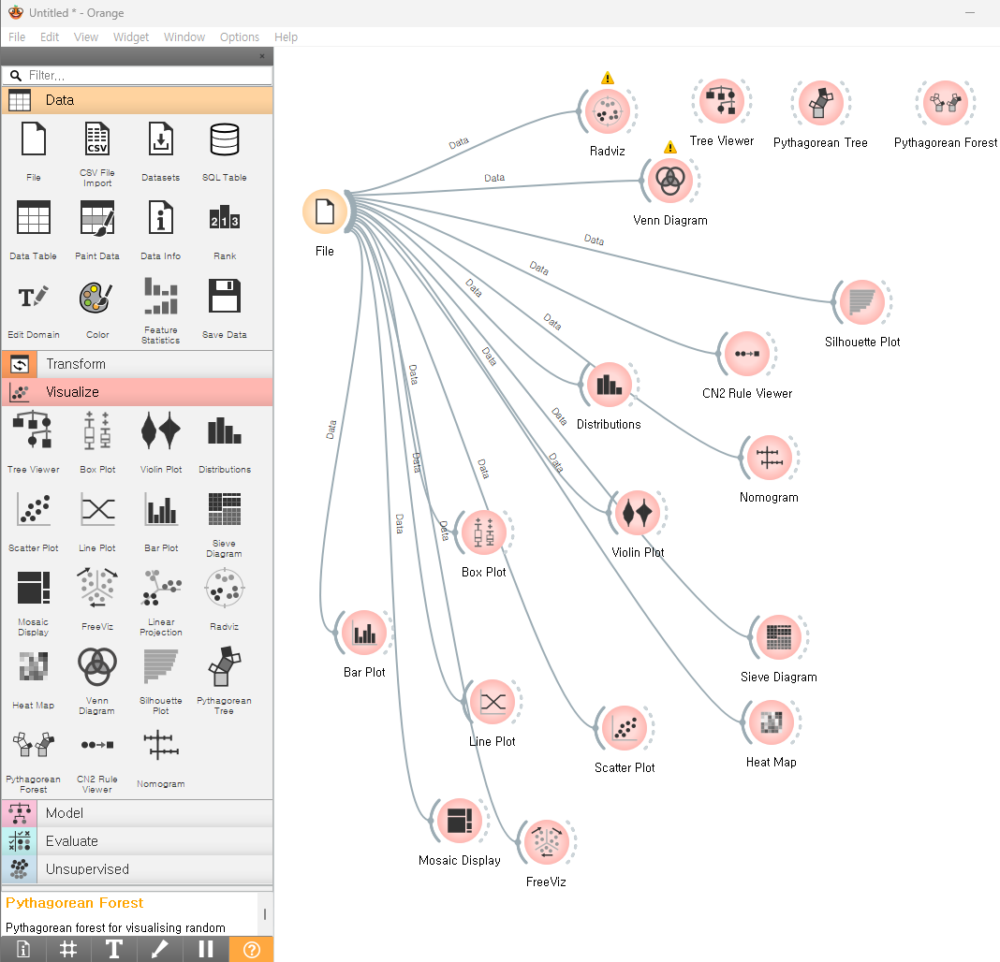

#  09 : 비지도 학습 (Unsupervised Learning, UL) : 시각화

---

	[1] Matplotlib
	https://matplotlib.org/stable/api/_as_gen/matplotlib.pyplot.plot.html

	[2] Seaborn
	https://seaborn.pydata.org/tutorial.html

 	[3] Orange3
  	https://orangedatamining.com/docs/
   	https://orangedatamining.com/download/

---

# [1]~[2] Python : Matplotlib, Seaborn

	1. 선 그래프(Line Plot)
	2. 산점도(Scatter Plot)
	3. 막대 그래프(Bar Plot)
	4. 히스토그램(Histogram)
	5. 박스 플롯(Box Plot)
	6. 파이 차트(Pie Chart)
	7. 히트맵(Heatmap)
	8. 누적 막대 그래프(Stacked Bar Plot)
	9. 면적 그래프(Area Plot)
	10. 꺾은선 그래프(Step Plot)
	11. 버블 차트(Bubble Plot)
	12. 도넛 차트(Donut Chart)
	13. 바이올린 플롯(Violin Plot)
	14. 밀도 플롯(Kernel Density Estimate, KDE)
	15. 타임 시리즈(Time Series Plot)
	16. 3D 그래프(3D Plot)
   
---  

 

▣ 소스코드(공통 준비) 

	import pandas as pd	
 	import matplotlib.pyplot as plt
	import seaborn as sns

	# GitHub의 CSV 파일을 불러오기
	titanic_df = pd.read_csv('https://raw.githubusercontent.com/YangGuiBee/ML/main/TextBook-09/titanic_train.csv')
 	# (CSV 불러오기 다른방법) GitHub의 CSV 파일을 나의 구글코랩에 불러와서 실행하는 경우는 다음과 같이 불러온후 소스작성
	# from google.colab import files
	# uploaded = files.upload()

# 1. 선 그래프 (Line Plot)
▣ 용도: 시간에 따른 데이터의 변화를 시각화. 연속적인 변화를 나타낼 때 유용 
▣ 특징: 각 데이터 포인트를 선으로 연결하여 시계열 데이터나 연속적인 값을 시각화 
▣ 예시(주로 사용되는 분야): 주식 시장, 기온 변화, 판매 추이 등 
▣ 소스코드(Matplotlib) 

	plt.figure(figsize=(8, 6))
	plt.plot(titanic_df['PassengerId'], titanic_df['Fare'])
	plt.title('Passenger ID vs Fare')
	plt.xlabel('Passenger ID')
	plt.ylabel('Fare')
	plt.show()

▣ 소스코드(seaborn) 

	plt.figure(figsize=(8, 6))
	sns.lineplot(x='PassengerId', y='Fare', data=titanic_df)
	plt.title('Passenger ID vs Fare')
	plt.show()

 

# 2. 산점도 (Scatter Plot)
▣ 용도: 두 변수 간의 관계를 시각화하여 상관관계, 클러스터 등을 탐지 
▣ 특징: 각 점이 하나의 데이터 포인트를 나타냄. 두 변수 간의 관계를 나타낼 때 사용 
▣ 예시(주로 사용되는 분야): 키와 몸무게의 관계, 시험 점수와 공부 시간 등 
▣ 소스코드(Matplotlib) 

	plt.figure(figsize=(8, 6))
	plt.scatter(titanic_df['Age'], titanic_df['Fare'])
	plt.title('Age vs Fare')
	plt.xlabel('Age')
	plt.ylabel('Fare')
	plt.show()

▣ 소스코드(seaborn) 

	plt.figure(figsize=(8, 6))
	sns.scatterplot(x='Age', y='Fare', data=titanic_df)
	plt.title('Age vs Fare')
	plt.show()

 

# 3. 막대 그래프 (Bar Plot)
▣ 용도: 범주형 데이터의 크기를 비교할 때 사용 
▣ 특징: 각 범주에 해당하는 값의 크기를 막대로 표현 
▣ 예시(주로 사용되는 분야): 제품 판매량, 국가별 인구, 분기별 매출 등 
▣ 소스코드(Matplotlib) 

	titanic_df.groupby('Pclass')['Fare'].mean().plot(kind='bar')
	plt.title('Average Fare by Class')
	plt.xlabel('Class')
	plt.ylabel('Average Fare')
	plt.show()

▣ 소스코드(seaborn) 

	plt.figure(figsize=(8, 6))
	sns.barplot(x='Pclass', y='Fare', data=titanic_df)
	plt.title('Average Fare by Class')
	plt.show()

 

# 4. 히스토그램 (Histogram)
▣ 용도: 데이터의 분포를 나타냄 
▣ 특징: 구간을 나눠 데이터가 해당 구간에 얼마나 분포했는지를 막대로 시각화 
▣ 예시(주로 사용되는 분야): 시험 점수 분포, 키 분포, 상품 가격 분포 등 
▣ 소스코드(Matplotlib) 

	plt.figure(figsize=(8, 6))
	plt.hist(titanic_df['Age'], bins=20)
	plt.title('Age Distribution')
	plt.xlabel('Age')
	plt.ylabel('Frequency')
	plt.show()

▣ 소스코드(seaborn) 

	plt.figure(figsize=(8, 6))
	sns.histplot(titanic_df['Age'], bins=20)
	plt.title('Age Distribution')
	plt.show()

 

# 5. 박스 플롯 (Box Plot)
▣ 용도: 데이터의 중앙값, 사분위 범위, 이상값 등을 시각화 
▣ 특징: 데이터 분포의 전반적인 모습을 요약하여 보여줌 
▣ 예시(주로 사용되는 분야): 시험 점수 분포, 주식 가격 변동 범위 등 
▣ 소스코드(Matplotlib) 

	plt.figure(figsize=(8, 6))
	plt.boxplot([titanic_df[titanic_df['Pclass'] == i]['Fare'] for i in range(1, 4)])
	plt.title('Fare Distribution by Class')
	plt.xlabel('Class')
	plt.ylabel('Fare')
	plt.xticks([1, 2, 3], ['1st Class', '2nd Class', '3rd Class'])
	plt.show()

▣ 소스코드(seaborn) 

	plt.figure(figsize=(8, 6))
	sns.boxplot(x='Pclass', y='Fare', data=titanic_df)
	plt.title('Fare Distribution by Class')
	plt.show()

 

# 6. 파이 차트 (Pie Chart)
▣ 용도: 범주형 데이터의 비율을 시각화 
▣ 특징: 원을 여러 조각으로 나누어 각 범주의 비율을 시각화 
▣ 예시(주로 사용되는 분야): 시장 점유율, 설문조사 결과 비율 등 
▣ 소스코드(Matplotlib) 

	plt.figure(figsize=(6, 6))
	titanic_df['Survived'].value_counts().plot(kind='pie', autopct='%1.1f%%')
	plt.title('Survival Rate')
	plt.ylabel('')
	plt.show()

▣ 소스코드(seaborn) 

	# Seaborn은 파이 차트를 직접 제공하지 않으므로 Matplotlib 사용

 

# 7. 히트맵 (Heatmap)
▣ 용도: 매트릭스 형태의 데이터를 색상으로 표현 
▣ 특징: 값의 크기를 색상으로 시각화 
▣ 예시(주로 사용되는 분야): 상관 행렬, 웹사이트 클릭 패턴, 신경망 가중치 시각화 등 
▣ 소스코드(Matplotlib) 

	# Matplotlib에서는 Seaborn이 제공하는 히트맵을 사용

▣ 소스코드(seaborn) 

	# Titanic 데이터 불러오기
	titanic_df = pd.read_csv('titanic_train.csv')

	# 상관 관계에 사용할 숫자형 열을 명시적으로 선택 (예: 생존 여부, 클래스, 나이, 형제/배우자 수, 부모/자녀 수, 요금)
	numeric_cols = titanic_df[['Survived', 'Pclass', 'Age', 'SibSp', 'Parch', 'Fare']]

	# 결측값 처리 (Age 등의 열에 결측값이 있으므로 이를 0으로 채움)
	numeric_cols = numeric_cols.fillna(0)

	# 상관 관계 계산
	corr = numeric_cols.corr()

	# 상관 관계 히트맵 그리기
	plt.figure(figsize=(8, 6))
	sns.heatmap(corr, annot=True, cmap='coolwarm')
	plt.title('Correlation Heatmap')
	plt.show()
 
 

# 8. 누적 막대 그래프 (Stacked Bar Plot)
▣ 용도: 여러 범주에 대한 값을 하나의 막대 안에서 누적으로 표시 
▣ 특징: 각 막대가 여러 값을 포함하여 누적 합계를 보여줌 
▣ 예시(주로 사용되는 분야): 여러 제품의 누적 판매량, 다양한 소득 그룹의 누적 비율 등 
▣ 소스코드(Matplotlib) 

	survived = titanic_df[titanic_df['Survived'] == 1]['Pclass'].value_counts().sort_index()
	not_survived = titanic_df[titanic_df['Survived'] == 0]['Pclass'].value_counts().sort_index()
	plt.figure(figsize=(8, 6))
	plt.bar(survived.index, survived, label='Survived')
	plt.bar(not_survived.index, not_survived, bottom=survived, label='Not Survived')
	plt.title('Survival by Class')
	plt.xlabel('Pclass')
	plt.ylabel('Count')
	plt.legend()
	plt.show()

▣ 소스코드(seaborn) 

	# Seaborn에서는 누적 막대 그래프를 기본적으로 지원하지 않음. Matplotlib 사용.

 

# 9. 면적 그래프 (Area Plot)
▣ 용도: 선 그래프와 유사하지만, 선 아래 영역을 색으로 채움 
▣ 특징: 누적된 값을 시각적으로 강조하는 데 사용 
▣ 예시(주로 사용되는 분야): 누적 판매량, 에너지 소비 등 
▣ 소스코드(Matplotlib) 

	plt.figure(figsize=(8, 6))
	plt.fill_between(titanic_df['PassengerId'], titanic_df['Fare'], color="skyblue", alpha=0.4)
	plt.title('Fare Area Plot')
	plt.xlabel('Passenger ID')
	plt.ylabel('Fare')
	plt.show()

▣ 소스코드(seaborn) 

	# Seaborn에서는 면적 그래프를 지원하지 않음. Matplotlib 사용.

 

# 10. 꺾은선 그래프 (Step Plot)
▣ 용도: 계단식 변화가 있는 데이터를 시각화 
▣ 특징: 데이터가 단계적으로 변할 때 사용. 일반적인 선 그래프와는 달리 직선이 아닌 단계별 변화 
▣ 예시(주로 사용되는 분야): 단계를 두고 변하는 데이터, 예를 들어 온도 조절 시스템의 변화 등 
▣ 소스코드(Matplotlib) 

	plt.figure(figsize=(8, 6))
	plt.step(titanic_df['Fare'].sort_values(), range(len(titanic_df)), where='mid')
	plt.title('Fare Step Plot')
	plt.xlabel('Fare')
	plt.ylabel('Cumulative Count')
	plt.show()

▣ 소스코드(seaborn) 

	# Seaborn에서는 꺾은선 그래프를 직접 지원하지 않으므로 Matplotlib 사용

 

# 11. 버블 차트 (Bubble Plot)
▣ 용도: 산점도에 추가적인 변수를 시각화할 때 사용. 점의 크기가 추가 변수의 값을 나타냄 
▣ 특징: 각 점의 크기로 세 번째 변수를 나타내어 데이터를 시각화 
▣ 예시(주로 사용되는 분야): 도시의 위치(좌표)와 인구 크기를 나타낼 때 사용, 데이터 군집을 분석할 때 유용 
▣ 소스코드(Matplotlib) 

	plt.figure(figsize=(8, 6))
	plt.scatter(titanic_df['Age'], titanic_df['Fare'], s=titanic_df['Survived'] * 100, alpha=0.5)
	plt.title('Age vs Fare (Bubble size represents Survival)')
	plt.xlabel('Age')
	plt.ylabel('Fare')
	plt.show()

▣ 소스코드(seaborn) 

	# Seaborn에서는 버블 차트를 직접 지원하지 않으므로 Matplotlib 사용

 

# 12. 도넛 차트 (Donut Chart)
▣ 용도: 파이 차트의 변형으로, 중앙이 비어 있어 시각적으로 차이를 제공 
▣ 특징: 파이 차트와 유사하지만, 중앙에 공백이 추가되어 비율을 강조하거나 다른 정보를 삽입하는 데 사용됨 
▣ 예시(주로 사용되는 분야): 시장 점유율, 각 부서별 비율 등을 파이 차트보다 시각적으로 깔끔하게 보여줌 
▣ 소스코드(Matplotlib) 

	plt.figure(figsize=(6, 6))
	titanic_df['Survived'].value_counts().plot(kind='pie', autopct='%1.1f%%', wedgeprops={'width': 0.3})
	plt.title('Survival Distribution (Donut Chart)')
	plt.ylabel('')
	plt.show()

▣ 소스코드(seaborn) 

	# Seaborn에서는 도넛 차트를 직접 지원하지 않으므로 Matplotlib 사용

 

# 13. 바이올린 플롯 (Violin Plot)
▣ 용도: 데이터의 분포와 밀도를 시각화하며, 박스 플롯보다 데이터의 분포를 더 자세하게 보여줌 
▣ 특징: 데이터의 밀도를 나타내는 커널 밀도 추정과 박스 플롯을 결합한 그래프 
▣ 예시(주로 사용되는 분야): 그룹별 데이터의 분포 차이를 비교할 때, 예를 들어 학생의 성적 분포 등을 비교할 때 사용 
▣ 소스코드(Matplotlib) 

	# Matplotlib에서는 직접 바이올린 플롯을 지원하지 않으므로 Seaborn 사용

▣ 소스코드(seaborn) 

	plt.figure(figsize=(8, 6))
	sns.violinplot(x='Pclass', y='Fare', data=titanic_df)
	plt.title('Fare Distribution by Class (Violin Plot)')
	plt.xlabel('Pclass')
	plt.ylabel('Fare')
	plt.show()

 

# 14. 밀도 플롯 (Kernel Density Estimate, KDE)
▣ 용도: 데이터의 확률 밀도를 시각화하는 데 사용됨 
▣ 특징: 히스토그램과 유사하지만, 데이터를 부드럽게 연결하여 연속적인 분포를 보여줌 
▣ 예시(주로 사용되는 분야): 다양한 데이터의 분포를 시각화할 때, 예를 들어 고객들의 연령대별 분포를 나타낼 때 사용 
▣ 소스코드(Matplotlib) 

	# Matplotlib에서 KDE는 지원하지 않으므로 Seaborn 사용

▣ 소스코드(seaborn) 

	plt.figure(figsize=(8, 6))
	sns.kdeplot(titanic_df['Fare'], shade=True)
	plt.title('Fare Density Plot')
	plt.xlabel('Fare')
	plt.show()

 

# 15. 타임 시리즈 (Time Series Plot)
▣ 용도: 시간에 따른 데이터의 변화를 시각화 
▣ 특징: x축은 시간, y축은 시간에 따라 변화하는 값을 시각화 
▣ 예시(주로 사용되는 분야): 주식 시장의 변동, 기후 변화, 판매량 변화 등 
▣ 소스코드(Matplotlib) 

	plt.figure(figsize=(8, 6))
	plt.plot(titanic_df['PassengerId'], titanic_df['Fare'])
	plt.title('Fare over Passenger ID')
	plt.xlabel('Passenger ID')
	plt.ylabel('Fare')
	plt.show()

▣ 소스코드(seaborn) 

	plt.figure(figsize=(8, 6))
	sns.lineplot(x='PassengerId', y='Fare', data=titanic_df)
	plt.title('Fare over Passenger ID')
	plt.show()

 

# 16. 3D 그래프 (3D Plot)
▣ 용도: 3차원 데이터를 시각화 
▣ 특징: 3차원 공간에서 데이터를 시각화할 수 있으며, 점, 선 또는 표면으로 나타낼 수 있음 
▣ 예시(주로 사용되는 분야): 지리적 데이터의 시각화, 과학적 데이터 분석 등 
▣ 소스코드(Matplotlib) 

	from mpl_toolkits.mplot3d import Axes3D
	fig = plt.figure(figsize=(10, 8))
	ax = fig.add_subplot(111, projection='3d')
	ax.scatter(titanic_df['Age'], titanic_df['Fare'], titanic_df['Survived'], c=titanic_df['Survived'], cmap='coolwarm')
	ax.set_xlabel('Age')
	ax.set_ylabel('Fare')
	ax.set_zlabel('Survived')
	plt.title('3D Scatter Plot (Age, Fare, Survival)')
	plt.show()

▣ 소스코드(seaborn) 

	# Seaborn에서는 3D 그래프를 지원하지 않으므로 Matplotlib 사용

 

---

# [3] Orange3

## [3-1] Orange3
▣ 개념: 데이터 분석 및 시각화 도구로, Python 기반의 오픈소스 소프트웨어로 시각적 워크플로우로 구성되어 있어 초보자도 쉽게 사용할 수 있으며, 다양한 머신러닝 모델과 데이터 시각화 기능을 제공 
▣ 주요 적용 분야: 교육용 머신러닝 실습, 데이터 분석, 시각화, 예측 모델링 
▣ 설치파일 다운로드 주소: Orange3 다운로드 
▣ 적용 가능한 머신러닝 모델: 분류, 회귀, 클러스터링, 연관 규칙, 텍스트 마이닝 
▣ 기타: 다양한 데이터 시각화 위젯과 데이터 마이닝 기능을 제공하여 학습용으로 인기가 높다. 특히 Python과의 호환성이 좋아 커스터마이징이 가능 

## [3-2] Weka(Waikato Environment for Knowledge Analysis)
▣ 개념: 뉴질랜드 Waikato대학에서 개발된 데이터마이닝 및 머신러닝용 오픈소스 소프트웨어로 직관적인 GUI를 통해 다양한 데이터 전처리, 분류, 회귀, 클러스터링, 연관 규칙 등을 실행 
▣ 주요 적용 분야: 데이터 마이닝 교육, 데이터 분석, 연구 및 실습 
▣ 적용 가능한 머신러닝 모델: 분류(의사결정트리, Naive Bayes 등), 회귀, 클러스터링(K-평균 등), 연관 규칙 
▣ 기타: WEKA는 특히 학계와 교육에서 많이 사용되며, .arff 형식의 파일을 주로 사용 

## [3-3] ELKI(Environment for Developing KDD-Applications Supported by Index-Structures)
▣ 개념: 클러스터링 및 이상 탐지와 같은 비지도 학습에 특화된 데이터 마이닝 소프트웨어로 GUI는 지원하지 않으며, 데이터 마이닝 연구자들이 새로운 알고리즘을 개발하고 실험 
▣ 주요 적용 분야: 비지도 학습, 클러스터링, 이상 탐지 연구 
▣ 적용 가능한 머신러닝 모델: 클러스터링(DBSCAN, OPTICS 등), 이상 탐지 
▣ 기타: ELKI는 GUI가 없고 명령줄에서 실행하는 방식으로, 주로 연구 및 개발 용도로 많이 사용 

## [3-4] KNIME(Konstanz Information Miner)
▣ 개념: 워크플로우 기반의 데이터 분석 및 머신러닝 도구로 다양한 데이터 소스와 연결하여 복잡한 분석 파이프라인을 시각적으로 구성 
▣ 주요 적용 분야: 데이터 분석, 빅데이터 처리, 비즈니스 인텔리전스, 바이오인포매틱스 
▣ 적용 가능한 머신러닝 모델: 분류, 회귀, 클러스터링, 연관 규칙, 딥러닝 (TensorFlow, Keras 연동 가능) 
▣ 기타: KNIME은 워크플로우 형태로 시각화되며, 데이터 전처리, 변환, 모델링, 평가까지 한 번에 진행할 수 있는 다양한 노드를 제공 

## [3-5] MOA(Massive Online Analysis)
▣ 개념: 스트리밍 데이터 마이닝을 위해 설계된 도구로 실시간 데이터 흐름을 처리하는 데 적합. Weka와 함께 사용할 수 있으며, 대규모 데이터에 대한 머신러닝 및 데이터 마이닝에 특화 
▣ 주요 적용 분야: 실시간 데이터 분석, 스트리밍 데이터 마이닝, 이상 탐지 
▣ 적용 가능한 머신러닝 모델: 스트리밍 분류, 회귀, 클러스터링 (Hoeffding 트리, Naive Bayes 등) 
▣ 기타: 스트리밍 데이터에 대한 분석이 가능하여 IoT, 실시간 시스템에 적합 

## [3-6] Neural Designer
▣ 개념: 딥러닝과 머신러닝 모델을 구축할 수 있는 GUI 기반 소프트웨어로, 주로 산업용으로 설계. 고성능 예측 모델을 만들기 위해 GPU 가속을 지원 
▣ 주요 적용 분야: 딥러닝, 예측 모델링, 금융, 헬스케어, 제조업 
▣ 적용 가능한 머신러닝 모델: 신경망 모델, 회귀, 분류 
▣ 기타: 상업용 소프트웨어이며, 고성능 연산을 위한 GPU 가속을 지원합니다. 시각화 및 분석 기능이 강력하며, 직관적인 인터페이스를 제공합니다. 

## [3-7] RapidMiner
▣ 개념: 비즈니스와 연구용으로 널리 사용되는 GUI 기반의 데이터 분석 도구로, 데이터 전처리, 모델링, 평가 및 배포까지 모든 분석 단계를 시각적 워크플로우로 제공 
▣ 주요 적용 분야: 비즈니스 분석, 금융, 마케팅, 제조업 
▣ 적용 가능한 머신러닝 모델: 분류, 회귀, 클러스터링, 딥러닝, 텍스트 분석 
▣ 기타: 상업용 소프트웨어로 강력한 분석 기능을 제공하며, 사용자가 쉽게 사용할 수 있는 직관적인 UI 

## [3-8] DataRobot
▣ 개념: 자동화된 머신러닝(AutoML) 플랫폼으로, 데이터 전처리, 모델 선택, 하이퍼파라미터 최적화를 자동화하여 사용자가 쉽게 머신러닝 모델 개발이 가능 
▣ 주요 적용 분야: 비즈니스 분석, 예측 모델링, 금융, 헬스케어 
▣ 적용 가능한 모델: 분류, 회귀, 시계열 예측 등 
▣ 기타: 유료 상업용 서비스로, AutoML을 통해 다양한 머신러닝 모델을 자동으로 생성, 평가, 배포 가능 

## [3-9] Azure Machine Learning Studio
▣ 개념: Microsoft의 클라우드 기반 머신러닝 플랫폼으로, 직관적인 드래그 앤 드롭 인터페이스를 제공하여 모델을 쉽게 구축 가능 
▣ 주요 적용 분야: 비즈니스 분석, 데이터 과학, 예측 모델링 
▣ 적용 가능한 모델: 분류, 회귀, 클러스터링, 딥러닝 등 
▣ 기타: Microsoft Azure의 클라우드 리소스를 활용하며, 대규모 데이터 처리가 가능하고 유료로 제공 

## [3-10] IBM Watson Studio
▣ 개념: IBM의 데이터 과학 및 AI 플랫폼으로, 데이터 준비, 모델링, 배포 등을 통합하여 제공하는 머신러닝 도구 
▣ 주요 적용 분야: 비즈니스 인텔리전스, 데이터 과학, 머신러닝 연구 
▣ 적용 가능한 모델: 분류, 회귀, 클러스터링, 시계열 예측, 딥러닝 등 
▣ 기타: AutoAI 기능을 통해 자동으로 머신러닝 모델을 생성하며, 상업용으로 제공 

## [3-11] Google AutoML
▣ 개념: Google Cloud의 머신러닝 플랫폼으로, AutoML 기능을 통해 사용자 친화적인 인터페이스로 고성능 모델을 자동 생성 가능 
▣ 주요 적용 분야: 이미지 분류, 텍스트 분석, 예측 모델링 
▣ 적용 가능한 모델: 이미지 분류, NLP 모델, 테이블 데이터 분류 및 회귀 등 
▣ 기타: Google의 AI 기술을 활용한 고성능 모델을 자동으로 구축하며, 클라우드 기반으로 제공 

## [3-12] H2O.ai
▣ 개념: 오픈소스 AutoML 플랫폼으로, H2O Driverless AI와 같은 GUI 기반의 머신러닝 도구를 통해 사용자 친화적인 모델 학습 환경을 제공 
▣ 주요 적용 분야: 금융, 보험, 헬스케어, 제조업 
▣ 적용 가능한 모델: 분류, 회귀, 시계열 분석, 클러스터링 
▣ 기타: 커뮤니티 버전은 무료로 사용할 수 있으며, 상업용 드라이버리스 AI 솔루션도 제공 

## [3-13] TIBCO Spotfire
▣ 개념: 데이터 시각화 및 분석 플랫폼으로, 머신러닝과 데이터 시각화를 결합하여 비즈니스 인사이트를 제공 
▣ 주요 적용 분야: 비즈니스 인텔리전스, 예측 분석, 데이터 시각화 
▣ 적용 가능한 모델: 분류, 회귀, 클러스터링 
▣ 기타: 데이터 시각화와 통합된 머신러닝 기능을 제공하며, 상업용으로 제공 

## [3-14] JMP
▣ 개념: SAS의 통계 소프트웨어로, 직관적인 인터페이스를 통해 데이터 분석, 시각화, 머신러닝 모델링을 제공 
▣ 주요 적용 분야: 통계 분석, 실험 설계, 품질 관리, 예측 분석 
▣ 적용 가능한 모델: 분류, 회귀, 클러스터링, 시계열 분석 
▣ 기타: 통계적 실험 설계와 데이터 시각화에 특화되어 있으며, 상업용 소프트웨어 

---

<!--
# [1] Matplotlib
https://matplotlib.org/stable/api/_as_gen/matplotlib.pyplot.plot.html

	import matplotlib.pyplot as plt

	plt.hist(titanic_df['Age'])
	titanic_df['Age'].hist()

 

# [2] Seaborn
https://seaborn.pydata.org/tutorial.html

	import seaborn as sns

	sns.distplot(titanic_df['Age'], bins=10)
	sns.histplot(titanic_df['Age'], kde=True)
	sns.countplot(x='Pclass', data=titanic_df)

	sns.barplot(x='Pclass', y='Age', data=titanic_df)
	sns.barplot(x='Pclass', y='Survived', data=titanic_df)
	sns.barplot(x='Pclass', y='Survived', data=titanic_df, ci=None, color='green')
	sns.barplot(x='Pclass', y='Survived', data=titanic_df, ci=None, estimator=sum)
	sns.barplot(x='Pclass', y='Sex', data=titanic_df)
	sns.barplot(x='Pclass', y='Age', hue='Sex', data=titanic_df)
	sns.barplot(x='Pclass', y='Survived', hue='Sex', data=titanic_df)

	sns.violinplot(y='Age', data=titanic_df)
	sns.violinplot(x='Pclass', y='Age', data=titanic_df)
	sns.violinplot(x='Sex', y='Age', data=titanic_df)

	cat_columns = ['Survived', 'Pclass', 'Sex', 'Age_cat']
	fig, axs = plt.subplots(nrows=1, ncols=len(cat_columns), figsize=(16, 4))

	sns.boxplot(y='Age', data=titanic_df)
	sns.boxplot(x='Pclass', y='Age', data=titanic_df)

	sns.scatterplot(x='Age', y='Fare', data=titanic_df)
	sns.scatterplot(x='Age', y='Fare', data=titanic_df, hue='Pclass')
	sns.scatterplot(x='Age', y='Fare', data=titanic_df, hue='Pclass', style ='Survived')
	sns.scatterplot(x='Age', y='Fare', data=titanic_df, hue='Survived')

	sns.heatmap(corr, annot=True, fmt='.1f',  linewidths=0.5, cmap='YlGnBu')

 
-->

