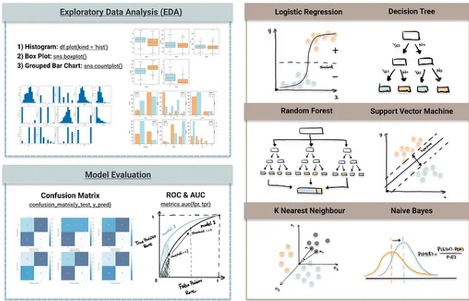
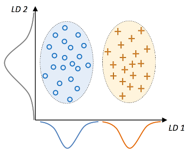
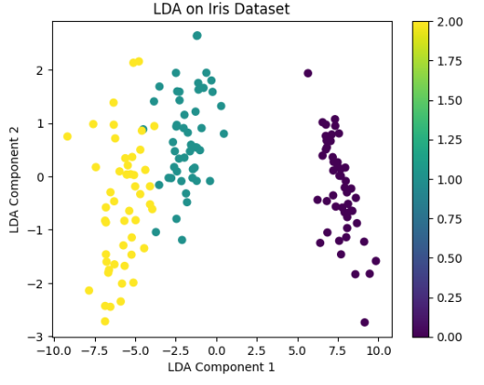
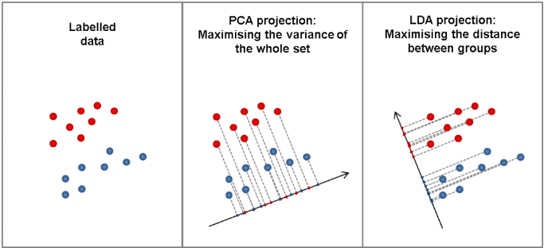

#  10 : 지도 학습 (Supervised Learning, SL) : 분류 (classification)

---

	[1] 회귀 기반
		[1-1] 로지스틱 회귀 (Logistic Regression)
		[1-2] 베이즈 로지스틱 회귀 (Bayesian Logistic Regression)
		[1-3] 프로빗 회귀 (Probit Regression)
		[1-4] 소프트맥스 회귀 (Softmax Regression)

	[2] 통계·확률 기반
		[2-1] 베이즈 네트워크 분류 (Bayesian Network Classification)
		[2-2] 나이브 베이즈 분류 (Naive Bayes Classification)
		[2-3] 혼합모형 기반 분류 (GMM + EM Classification)

	[3] 거리 기반
		[3-1] 최근접 중심 분류 (Nearest Centroid Classification)
		[3-2] 마할라노비스 거리 분류 (Mahalanobis Distance Classification)
		
---

 출처 : https://towardsdatascience.com/top-machine-learning-algorithms-for-classification-2197870ff501

 

# [1-1] 로지스틱 회귀 (Logistic Regression)

▣ 정의 : 입력 변수의 선형 결합을 시그모이드(Sigmoid) 함수에 통과시켜 0~1 사이의 확률로 변환하는 이진 분류 모델 
데이터가 어떤 범주에 속할 확률을 0에서 1 사이의 값으로 예측하고 그 확률에 따라 가능성이 더 높은 범주에 속하는 것으로 분류하는 지도 학습 알고리즘 
이름에 Regression이 들어가지만 Sigmoid 함수를 활용한 이진분류에 해당하며, 
선형 회귀는 특정 예측 값을 반환하지만 sigmoid 함수를 활용하면 특정 값을 기점으로 0 또는 1 값을 반환하는 분류 모델 
선형회귀분석과 비슷한데 Y값이 확률로 되어 있기 때문에 하한, 상한이 [0, 1] 사이로 정해져 있으며, 
특정 임계치(threshold)를 기준으로 삼아서 예측된 확률 값이 임계치 이상인 것과 미만인 것으로 분류 
▣ 목적 : 주어진 데이터가 특정 클래스(예: 1)에 속할 확률을 예측 
=\frac{1}{1+e^{-(\beta_0+\beta_1x_1+\cdots+\beta_kx_k)}})  
▣ 장점 : 계산이 간단하고 빠르며 해석이 용이, 확률 기반 예측으로 의사결정에 활용 가능, 정규화 적용 시 과적합 방지 가능 
▣ 단점 : 비선형 관계 데이터에는 부적합, 이상치(outlier)에 민감  
▣ 적용분야 : 의료진단(질병 유무), 고객이탈 예측, 신용평가, 스팸메일 탐지 등 
 - 제조 : 로지스틱 회귀 분석을 사용하여 기계류의 부품 고장 확률을 추정한 다음 이 추정치를 기반으로 유지 보수 일정을 계획하여 향후 고장 발생을 최소화 
 - 의료 : 의학 연구원들은 환자의 질병 발생 가능성을 예측하여 예방 진료와 치료를 계획하는데 이때 가족력이나 유전자가 질병에 미치는 영향을 비교하는 데 로지스틱 회귀 모델을 사용  
 - 금융 : 금융 거래에서 사기 행위를 분석하고 대출 신청 및 보험 신청 건의 위험도를 평가해야 하는데 이러한 문제에는 고위험이거나 저위험이거나, 사기이거나 사기가 아닌 것과 같은 명확한 결과가 있기 때문에 로지스틱 회귀 모델에 적합   
 - 마케팅 : 온라인 광고 도구는 로지스틱 회귀 모델을 사용하여 사용자가 광고를 클릭할지 여부를 예측한 결과를 활용하여 마케터는 다양한 단어와 이미지에 대한 사용자의 반응을 분석하고 고객이 관심을 가질 만한 효과적인 광고 제작
 
▣ Scikit-learn 클래스 : `sklearn.linear_model.LogisticRegression` 
▣ 가이드 : https://scikit-learn.org/stable/modules/linear_model.html#logistic-regression 
▣ API : https://scikit-learn.org/stable/modules/generated/sklearn.linear_model.LogisticRegression.html  

▣ 유형
 - **이항 로지스틱 회귀(Binary Logistic Regression) :** 이항 로지스틱 회귀 분석은 가능한 결과가 두 개뿐인 바이너리 분류 문제에 적합하다. 종속 변수는 예, 아니요 또는 0과 1과 같은 두 개의 값만 가질 수 있다. 로지스틱 함수가 0과 1 사이의 값 범위로 계산되더라도 이항 회귀 모델에서는 답을 가장 가까운 값으로 반올림/반내림한다. 일반적으로 0.5 미만의 답은 0으로 반내림되고 0.5보다 큰 답은 1로 반올림되므로 로지스틱 함수는 이항 결과를 반환하게 된다.
 - **다항 로지스틱 회귀(Multinomial Logistic Regression) :** 다항 회귀 분석은 결과의 수가 유한하다는 전제 하에, 3개 이상의 결과를 가질 수 있는 문제를 분석할 수 있다. 예컨대 인구 데이터를 기반으로 주택 가격이 25%, 50%, 75% 또는 100% 중 어떤 비율로 상승할지 예측할 수 있지만, 주택의 정확한 가격을 예측할 수는 없다. 다항 로지스틱 회귀 분석은 결과 값을 0과 1 사이의 다른 값에 매핑하는 방식으로 작동한다. 로지스틱 함수는 0.1, 0.11, 0.12 등 연속된 데이터의 범위를 반환할 수 있으므로, 다항 회귀 분석에서는 출력값을 가능한 가장 가까운 값으로 그룹화한다.
 - **서수 로지스틱 회귀(Ordinal Logistic Regression) :** 서수 로지스틱 회귀 분석 또는 순서형 로짓 모델은 숫자가 실제 값이 아닌 순위를 나타내는 문제를 풀기 위한 특수한 유형의 다항 회귀 분석이다. 예를 들어 서수 회귀 분석을 사용하여 고객이 1년 동안 구매한 품목 수 등의 숫자 값을 기준으로, 서비스를 나쁨, 양호, 좋음 또는 우수 등급으로 평가하도록 요청하는 설문 조사 질문의 답을 예측할 수 있다.

▣ 회귀식 
Linear Regression : $\hat{y} = \hat{\beta}_0 + \hat{\beta}_1x_1 + \hat{\beta}_2x_2 + ...+\hat{\beta}_dx_d$

$0 ≤ P(y=1 | X) = p(성공확률) ≤ 1$ 

$0 ≤ Odds(승산) = 성공확률/실패확률​ = p/(1−p​) ≤ ∞$ 

$−∞ ≤ log(Odds) = log(p/(1−p​)) ≤ ∞$ 

$log(Odds) = log(p/(1−p​)) = \hat{\beta}_0 + \hat{\beta}_1x_1 + \hat{\beta}_2x_2 + ...+\hat{\beta}_dx_d$ 

<!--
$\frac{p}{1-p} =$ $e^{\hat{\beta}_0 + \hat{\beta}_1x_1 + \hat{\beta}_2x_2 + ...+\hat{\beta}_dx_d}$ 
$p = \frac{1}{1+e^{-(\hat{\beta}_0 + \hat{\beta}_1x_1 + \hat{\beta}_2x_2 + ...+\hat{\beta}_dx_d)}} =\sigma(x|\beta)$
-->

▣ 최대우도추정법(Maximum Likelihood Estimation, MLE) 

 

<!--
P(X_i,y_i|\beta) = \left\{\begin{matrix}
\sigma(X_i|\beta), y_i=1\\
1-\sigma(X_i|\beta), y_i=0
\end{matrix}\right.
-->

$P(X_i,y_i|\beta) = \sigma(X_i|\beta)^{y_i}(1-\sigma(X_i|\beta))^{1-y_i}$ 

$L(X,y|\beta) = \prod_{i=1}^{N}P(X_i,y_i|\beta)=\prod_{i=1}^{N}\sigma(X_i|\beta)^{y_i}(1-\sigma (X_i|\beta))^{1-y_i}$ 

$logL(X,y|\beta) = \sum_{i=1}^{N}y_ilog(\sigma (X_i|\beta))+(1-y_i)log(1-\sigma (X_i|\beta))$ 

 

▣ 경사하강법(Gradient Descent Algorithm) 

$f(\omega +\Delta\omega)=f(\omega)+\frac{f'(\omega)}{1!}\Delta\omega+\frac{f''(\omega)}{2!}(\Delta\omega)^2+...$ 
 
$\omega_{new}=\omega_{old}-\alpha f'(\omega), 0<\alpha<1$ 

$f(\omega_{new})=f(\omega_{old}-\alpha f'(\omega_{old}))\cong f(\omega_{old})-\alpha\left|f'(\omega)\right|^2<f(\omega_{old})$

	import pandas as pd
	from sklearn.datasets import load_iris
	from sklearn.linear_model import LogisticRegression

	# Iris 데이터 로드
	iris = load_iris()
	X, y = iris.data, iris.target

	# Feature 데이터와 Target 데이터를 DataFrame으로 변환
 	# 0: setosa, 1: versicolor, 2: virginica
	df = pd.DataFrame(data=X, columns=iris.feature_names)
	df['target'] = y	
	print(df)

	# Logistic Regression 모델 반복 훈련
	clf = LogisticRegression(random_state=0, max_iter=200).fit(X, y)

	# 예측
	predictions = clf.predict(X[:2, :])
	probabilities = clf.predict_proba(X[:2, :])
	score = clf.score(X, y)

	# 예측 결과 출력
	print("Predictions: ", predictions)
	print("Probabilities: ", probabilities)
	print("Model Score: ", score)

| 분야         | 대표 연구사례          | 연구 목적 / 문제 정의             | **독립변수 (X)**               | **종속변수 (y)**               | 주요 결과 또는 의의              |
| :--------- | :--------------- | :------------------------ | :------------------------- | :------------------------- | :----------------------- |
| **의료·보건**  | **당뇨병 발병 예측**    | 건강지표를 이용해 환자의 당뇨 발병 확률 예측 | 혈당, BMI, 연령, 혈압, 가족력 등     | 당뇨 발병 여부 (1: 발병, 0: 정상)    | 주요 위험요인 도출, 조기진단 가능성 제시  |
|            | **심혈관질환 위험도 평가** | 생체정보를 기반으로 심근경색 발생 가능성 예측 | 연령, 흡연여부, 혈압, 콜레스테롤, 운동량 등 | 심근경색 발생 여부 (1: 발생, 0: 미발생) | 흡연·비만 등 유의요인 도출, 예방정책 설계 |
| **금융·경제**  | **신용카드 부도 예측**   | 고객특성으로 부도 확률 예측           | 소득, 신용점수, 직업, 부채비율, 거래이력 등 | 부도 여부 (1: 부도, 0: 정상)       | 신용평가의 표준모델, 변수 중요도 명확    |
|            | **대출 리스크 평가**    | 대출신청자 상환능력 판단             | 나이, 소득, 부양가족수, 대출금액, 신용등급  | 상환 여부 (1: 연체/부도, 0: 정상상환)  | 리스크 등급화 및 자동심사 모델 구축     |
| **사회·심리**  | **소비자 구매의사 분석**  | 마케팅 요인이 구매에 미치는 영향 분석     | 가격, 브랜드인지도, 광고노출, 리뷰점수     | 구매 여부 (1: 구매, 0: 미구매)      | 가격민감도·브랜드충성도 정량화         |
|            | **투표참여 요인 분석**   | 사회경제적 요인이 투표참여에 미치는 영향 규명 | 연령, 소득, 교육수준, 정치성향, 관심도    | 투표참여 여부 (1: 참여, 0: 불참)     | 참여 확률 모델링, 사회정책 효과 분석    |
| **산업·공학**  | **품질불량 예측**      | 공정데이터로 불량품 발생 확률 예측       | 온도, 압력, 속도, 습도, 장비모델 등     | 불량 발생 여부 (1: 불량, 0: 정상)    | 불량률 예측, 생산공정 최적화         |
|            | **안전사고 확률 예측**   | 근로환경에 따른 사고발생 위험 평가       | 근무시간, 근속연수, 보호장비 착용, 환경지수  | 사고 발생 여부 (1: 발생, 0: 무사)    | 안전등급화, 예방조치 우선순위 도출      |
| **IT·데이터** | **스팸메일 분류**      | 이메일 특징으로 스팸 여부 분류         | 단어빈도, 발신자, 첨부파일, 제목 길이     | 스팸 여부 (1: 스팸, 0: 정상)       | 고속 학습 및 실시간 분류 가능        |
|            | **사용자 이탈 예측**    | 서비스 이용패턴으로 고객 이탈확률 예측     | 접속빈도, 이용기간, 불만건수, 결제액, 나이  | 이탈 여부 (1: 해지, 0: 유지)       | 마케팅 타깃 선정 및 고객 유지율 향상    |

 

# [1-2] 베이즈 로지스틱 회귀 (Bayesian Logistic Regression)

▣ 정의 : 로지스틱 회귀의 계수를 확률변수로 보고, 사전분포(prior)와 사후분포(posterior)를 이용해 불확실성을 반영하는 베이즈 확률 모델 
▣ 목적 : 모델 파라미터의 불확실성을 고려하여 보다 안정적이고 신뢰도 있는 확률 예측을 수행 
$P(\beta|D)\propto P(D|\beta)P(\beta))$  
▣ 장점 : 불확실성 정량화 가능, 과적합 방지 효과, 작은 데이터셋에서도 안정적 성능 
▣ 단점 : 계산 복잡도 높음 (MCMC, VI 등 필요), 수렴 속도 느림 
▣ 적용분야 : 의료 리스크 분석, 자율주행 의사결정, 금융 리스크 모델링 
▣ Scikit-learn 클래스 : 직접 구현 없음 → PyMC / scikit-bayes (`sklearn_bayes.LogisticRegression`) 활용 

| 분야         | 대표 연구사례          | 연구 목적 / 문제 정의                 | **독립변수 (X)**                      | **종속변수 (y)**             | 주요 결과 또는 의의                   |
| :--------- | :--------------- | :---------------------------- | :-------------------------------- | :----------------------- | :---------------------------- |
| **의료·보건**  | **질병 위험도 예측**    | 소규모 의료데이터에서 질병 발병 확률과 불확실성 추정 | 혈압, 체질량지수(BMI), 유전자표지, 흡연여부, 연령 등 | 질병 발병 여부 (1: 발병, 0: 정상)  | 데이터 희소 상황에서도 신뢰도 높은 확률 추정 가능  |
|            | **신경계 질환 진단**    | MRI, 뇌파 등에서 알츠하이머 등 신경질환 판별   | 뇌영상 지표, 인지점수, 유전자 정보              | 질환 여부 (1: 진단, 0: 정상)     | 계수의 사후분포로 변수 불확실성까지 해석 가능     |
| **금융·경제**  | **신용 리스크 평가**    | 불확실한 경기 상황에서 고객 부도확률 추정       | 소득, 대출금액, 부채비율, 직업유형, 거래이력        | 부도 여부 (1: 부도, 0: 정상)     | 사전정보(Prior)를 반영하여 안정적인 확률 추정  |
|            | **시장 이상거래 탐지**   | 소수의 이상패턴으로 시장 위험 탐지           | 거래빈도, 거래금액, 자산유형, 변동성 지수          | 이상거래 여부 (1: 이상, 0: 정상)   | False Positive 감소, 탐지 정확도 향상  |
| **사회·심리**  | **정책 수용도 분석**    | 표본이 적은 사회조사에서 정책 찬반 확률 추정     | 연령, 교육수준, 정치성향, 관심도, 정보노출량        | 찬성 여부 (1: 찬성, 0: 반대)     | 불균형 표본에서도 신뢰 가능한 예측 결과 도출     |
|            | **심리적 위험요인 평가**  | 심리 상태(스트레스, 우울 등) 분류          | 스트레스 지수, 근무시간, 수면시간, 사회적 지원       | 심리위험 상태 (1: 위험, 0: 정상)   | 개별 요인의 확률적 영향도 해석 가능          |
| **산업·공학**  | **예방정비 고장예측**    | 희귀한 설비고장 데이터를 기반으로 확률적 예측     | 온도, 진동, 압력, 가동시간, 장비연령            | 고장 여부 (1: 고장, 0: 정상)     | 사전분포를 반영해 희귀 이벤트 예측 안정성 향상    |
|            | **작업안전사고 확률 예측** | 불확실한 환경요소 기반 안전사고 위험 추정       | 근무형태, 작업시간, 보호장비 착용, 환경지수         | 사고 여부 (1: 발생, 0: 무사)     | 사후확률 기반 실시간 위험지수 산출 가능        |
| **IT·데이터** | **스팸메일 분류**      | 불균형 데이터에서 스팸 탐지 확률 추정         | 단어빈도, 제목 길이, 발신자 도메인, 첨부파일        | 스팸 여부 (1: 스팸, 0: 정상)     | 사전확률로 클래스 불균형 문제 완화           |
|            | **사용자 행동 예측**    | 개인화된 사용자 행동 확률 모델링            | 접속빈도, 클릭수, 체류시간, 관심카테고리           | 행동 발생 여부 (1: 발생, 0: 미발생) | 개인 단위 불확실성 예측, 맞춤형 추천모델 적용 가능 |

 

# [1-3] 프로빗 회귀 (Probit Regression)

▣ 정의 : 시그모이드 대신 정규분포의 누적분포함수(CDF)를 사용하여 확률을 계산하는 회귀 기반 이진 분류모델 
▣ 목적 : 잠재적인 연속 확률변수를 기준으로 이진 결과를 확률적으로 예측 
=\Phi(\beta_0+\beta_1x_1+\cdots+\beta_kx_k))  
▣ 장점 : 정규분포 기반으로 통계적 엄밀성 높음,  이상치에 덜 민감 
▣ 단점 : 계산 복잡하고 직관성 낮음 , 로지스틱 회귀보다 구현 복잡 
▣ 적용분야 : 경제·금융 분야의 선택모형, 행동경제학, 구매의사 예측 
▣ Scikit-learn 클래스 : 직접 지원 없음 → `statsmodels.discrete.discrete_model.Probit` 사용 

 

# [1-4] 소프트맥스 회귀 (Softmax Regression)

▣ 정의 : 로지스틱 회귀를 다중 클래스 분류로 확장한 모델로 각 클래스에 속할 확률을 동시에 계산 
▣ 목적 : 3개 이상의 클래스 중 어느 하나에 속할 확률을 추정 
=\frac{e^{\beta_i^Tx}}{\sum_{j=1}^Ke^{\beta_j^Tx}})  
▣ 장점 : 다중 클래스 문제 해결 가능, 각 클래스 확률을 해석적으로 제공 
▣ 단점 : 클래스가 많을수록 계산량 증가, 데이터 불균형에 민감 
▣ 적용분야 : 문서 분류, 감정 분석, 이미지 라벨링, 음성인식 
▣ Scikit-learn 클래스 : `sklearn.linear_model.LogisticRegression(multi_class='multinomial', solver='lbfgs')` 

 

# [2-1] 베이즈 네트워크 분류 (Bayesian Network Classification)

▣ 정의 : 변수 간 조건부 의존관계를 방향성 비순환 그래프(DAG) 형태로 표현한 확률 그래픽 모델 기반 분류 
▣ 목적 : 인과 관계와 확률적 의존성을 명시적으로 표현하여 분류와 추론을 동시에 수행 
=\prod_iP(X_i|Pa(X_i)))  
▣ 장점 : 변수 간 인과관계 해석 가능, 결측치 처리에 강함, 확률적 추론 및 구조 해석 가능 
▣ 단점 : 구조 학습 복잡도 매우 높음, 고차원 데이터에서는 비효율적 
▣ 적용분야 : 의료진단(질병–증상 관계), 리스크 분석, 인과 추론, 추천 시스템 
▣ Scikit-learn 클래스 : 없음 → `pgmpy.models.BayesianNetwork` 활용 가능 

 

# [2-2] 나이브 베이즈 분류 (Naive Bayes Classification)

▣ 정의 : 입력 변수들이 서로 독립이라고 가정한 확률모형으로, 베이즈 정리를 이용해 각 클래스의 사후확률을 계산하는 단순하고 빠른 분류 
 - 베이즈 정리 : 사건의 확률과 추가정보를 고려했을때 확률의 변화 
 - 나이브 베이지안 알고리즘 : 사전확률을 통해 특징값이 제공하는 증거를 기반으로 사후확률을 예측(순진하고 때로는 잘못된 가정에도 불구하고 우수한 성능을 보임) 
▣ 목적 : 주어진 입력이 특정 클래스에 속할 확률을 간단하고 빠르게 계산 
=\frac{P(X|C)P(C)}{P(X)}) 
▣ 장점 : 계산속도 빠르고 메모리 효율 높음, 소량의 데이터에서도 높은 성능, 텍스트 데이터에 특히 강함 
▣ 단점 : 독립성 가정이 비현실적, 연속형 변수 처리에 추가 전처리 필요 
feature 간의 독립성(feature간에 서로 상관관계 無)이어야 하므로 실생활에서 바로 적용하기는 곤란 
▣ 적용분야 : 스팸 필터링, 감정 분석, 뉴스/문서 분류, 텍스트 마이닝 
▣ Scikit-learn 클래스 : `sklearn.naive_bayes.GaussianNB`, `MultinomialNB`, `BernoulliNB` 
▣ 가이드 : https://scikit-learn.org/stable/modules/naive_bayes.html 

 

 

p(스팸|광고) = P(광고|스팸)P(스팸)/P(광고) = (4/20*20/100)/(5/100) = 0.8

▣ 베이지안 최적화(Bayesian Optimization) 단계 : 미지의 함수가 반환하는 값의 최소 또는 최대값을 만드는 최적의 해를 짧은 반복을 통해 찾아내는 최적화 방식  
 
(1단계) 최초에는 랜덤하게 하이퍼파라미터들을 샘플링하여 성능결과를 관측

 
 
(2단계) 관측된 값을 기반으로 대체모델의 최적함수를 추정

 
(3단계) 획득함수에서 다음으로 관측할 하이퍼파라미터를 추출

 
 
(4단계) 해당 하이퍼파라미터로 관측된 값을 기반으로 다시 대체모델의 최적함수 추정

  

▣ 활용분야 
 - 스팸메일이나 감정분석 등 필터와 같은 텍스트 분류 
 - 고객의 구매 기록과 같은 이산적인 범주형 데이터 분류 
 - 컴퓨터 네트워크에서 침입이나 비정상행위 탐지 
 - 일련의 관찰된 증상을 통한 의학적 질병의 진단 

▣ 회귀식 : 독립변수의 조건부 확률에 조건부 독립가정을 추가한 베이즈 분류기가 나이브 베이즈 분류기 

 

▣ 유형 

 - **가우시안 나이브 베이즈(Gaussian Naive Bayes, GaussianNB) :** 연속적인 값을 지닌 데이터를 처리 할때, 전형적으로 각 클래스의 연속적인 값들이 가우스 분포를 따른다고 가정한다. 
 - API : https://scikit-learn.org/stable/modules/generated/sklearn.naive_bayes.GaussianNB.html#sklearn.naive_bayes.GaussianNB 
 - 회귀식 : $P(x_i \mid y) = \frac{1}{\sqrt{2\pi\sigma^2_y}} \exp\left(-\frac{(x_i - \mu_y)^2}{2\sigma^2_y}\right)$ 

 

	from sklearn.datasets import load_iris
	from sklearn.model_selection import train_test_split
	from sklearn.naive_bayes import GaussianNB
	
	#Iris 데이터셋 로드
	X, y = load_iris(return_X_y=True)
	
	#원 데이터셋의 크기 출력
	print(f"Total number of data points in the dataset: {X.shape[0]}")
	
	#학습용 데이터와 테스트용 데이터로 나누기
	X_train, X_test, y_train, y_test = train_test_split(X, y, test_size=0.5, random_state=0)
	
	#Gaussian Naive Bayes 모델 생성 및 학습
	gnb = GaussianNB()
	y_pred = gnb.fit(X_train, y_train).predict(X_test)
	
	#오분류된 데이터의 개수 출력
	mislabeled_points = (y_test != y_pred).sum()
	print("Number of mislabeled points out of a total %d points: %d" 
	      % (X_test.shape[0], mislabeled_points))
	
	#정확도 계산 및 출력
	accuracy = (X_test.shape[0] - mislabeled_points) / X_test.shape[0]
	print(f"Accuracy: {accuracy:.4f}")

 

 - **다항 나이브 베이즈(Multinomial Naive Bayes, MultinomialNB) :** 하나의 문서에서 단어의 출현을 나타내는 이벤트를 가지고 문서 분류를 하는데 사용되는 이벤트 모델이다. 
 - API : https://scikit-learn.org/stable/modules/generated/sklearn.naive_bayes.MultinomialNB.html#sklearn.naive_bayes.MultinomialNB 
  <!-- $\hat{\theta}_{yi} = \frac{N_{yi} + \alpha}{N_y + \alpha n}$  -->
 - 회귀식 :   
 

	import numpy as np
	from sklearn.naive_bayes import MultinomialNB

	#난수 생성을 위한 RandomState 객체 생성 (시드 값 50)
	rng = np.random.RandomState(50)

	#데이터 샘플의 개수 설정
	num_data = 50

	#각 샘플이 가질 특징(feature)의 개수 설정
	num_feature = 10

	#0부터 4까지의 정수로 구성된 (50, 10) 크기의 데이터 행렬 X 생성
	X = rng.randint(5, size=(num_data, num_feature))

	#0부터 5까지의 정수로 구성된 50개의 레이블 벡터 y 생성
	y = np.random.randint(6, size=num_data)

	#MultinomialNB 모델을 alpha=0.8로 설정하여 학습
	#alpha 매개변수는 라플라스/리지 정규화 (Laplace Smoothing) 계수로 0인 확률을 방지하기 위해 사용
	#alpha=1.0이 기본값이지만, 여기서는 alpha=0.8으로 설정하여 약간의 정규화를 적용
	#값이 클수록 더 많은 평활화가 적용되며, 값이 작을수록 모델이 데이터에 더 민감하게 반응 
	clf = MultinomialNB(alpha=0.8).fit(X, y)

	#학습된 모델을 사용해 X 데이터에 대해 처음 3개의 예측값 출력
	print(clf.predict(X)[:3])

	#MultinomialNB 모델의 파라미터 정보 출력
	print(clf.get_params())  # MultinomialNB 클래스 인자 설정 정보

	#학습 데이터(X, y)에 대한 정확도 출력 (모델의 성능 평가)
	print('정확도 : ', clf.score(X, y))  # 성능 평가 점수 (Accuracy)

 - **베르누이 나이브 베이즈(Bernoulli Naive Bayes, Bernoulli NB) :** 다변량 베르누이 분포에 따라 분포된 데이터에 대한 나이브 베이즈 학습 및 분류 알고리즘으로, 특성들은 입력들을 설명하는 독립적인 부울 값(이진 변수)이다. 
 - API : https://scikit-learn.org/stable/modules/generated/sklearn.naive_bayes.BernoulliNB.html#sklearn.naive_bayes.BernoulliNB 
 - 회귀식 : $P(x_i \mid y) = P(x_i = 1 \mid y) x_i + (1 - P(x_i = 1 \mid y)) (1 - x_i)$ 

 

 - **보완 나이브 베이즈(Complement Naive Bayes, CNB) :** 불균형 데이터 세트에 특히 적합한 표준 다항 나이브 베이즈(MNB) 알고리즘의 변형 
 - API : https://scikit-learn.org/stable/modules/generated/sklearn.naive_bayes.ComplementNB.html#sklearn.naive_bayes.ComplementNB 

 

 - **범주형 나이브 베이즈(Categorical Naive Bayes, CategoricalNB) :** 범주적으로 분포된 데이터에 대한 범주적 나이브 베이즈 알고리즘을 구현하고, 인덱스로 설명되는 각 기능이 고유한 범주형 분포를 갖는다.(결측치에서도 동작) 
 - API : https://scikit-learn.org/stable/modules/generated/sklearn.naive_bayes.CategoricalNB.html#sklearn.naive_bayes.CategoricalNB 

  

	import numpy as np
	from sklearn.naive_bayes import CategoricalNB

	#난수 생성을 위한 RandomState 객체 생성 (시드 값 100)
	rng = np.random.RandomState(100)

	#데이터 샘플의 개수 설정
	num_data = 50

	#각 샘플이 가질 특징(feature)의 개수 설정
	num_feature = 10

	#0부터 4까지의 정수로 구성된 (50, 10) 크기의 데이터 행렬 X 생성
	X = rng.randint(5, size=(num_data, num_feature))

	#0부터 5까지의 정수로 구성된 50개의 레이블 벡터 y 생성
	y = np.random.randint(6, size=num_data)

	#CategoricalNB 모델을 alpha=0.8로 설정하여 학습	
	clf = CategoricalNB(alpha=0.8).fit(X, y)

	#예측
	print(clf.predict(X)[:3]) 
	print(clf.get_params()) ## CategoricalNB 클래스 인자 설정 정보
	print('정확도 : ', clf.score(X,y)) ## 성능 평가 점수(Accuracy)

 

# [2-3] 혼합모형 기반 분류 (GMM + EM Classification)

▣ 정의 : 각 클래스가 다변량 가우시안 혼합분포(GMM)를 따른다고 가정하고, 
EM(Expectation–Maximization) 알고리즘을 이용해 파라미터를 추정하는 확률적 분류 
▣ 목적 : 비선형적이고 복잡한 분포 구조를 확률적으로 모델링하여 소프트 분류 수행 
=\sum_{k=1}^K\pi_k\mathcal{N}(x|\mu_k,\Sigma_k)) 
▣ 장점 : 복잡한 분포 구조 모델링 가능, 각 클래스에 대한 사후확률 계산 가능 
▣ 단점 : 초기값에 따라 수렴이 불안정, 지역 최적해에 빠질 수 있음, 계산량 많음 
▣ 적용분야 : 음성인식, 이미지 세분화, 이상치 탐지, 고객 세분화 
▣ Scikit-learn 클래스 : `sklearn.mixture.GaussianMixture` 

 

# [3-1] 최근접 중심 분류 (Nearest Centroid Classification)

▣ 정의 : 각 클래스의 평균 벡터(centroid)를 계산하고, 새로운 데이터가 가장 가까운 중심에 속하는 클래스로 분류 
▣ 목적 : 클래스 중심과의 거리 최소화를 통해 빠르고 단순한 분류 수행. 
  
▣ 장점 : 계산이 단순하고 빠른 예측, 메모리 효율적, 고차원에서도 적용 가능 
▣ 단점 : 클래스 분산이 다른 경우 오분류 가능, 비선형 데이터에는 부적합 
▣ 적용분야 : 문서 분류, 얼굴 인식, 클러스터 레이블링 
▣ Scikit-learn 클래스 : `sklearn.neighbors.NearestCentroid` 

 

# [3-2] 마할라노비스 거리 분류 (Mahalanobis Distance Classification)

▣ 정의 : 공분산을 고려한 거리 척도를 기반으로, 데이터 간 상관관계를 반영해 분류를 수행하는 거리 기반 모델 
▣ 목적 : 특성 간 상관관계를 고려한 정규화된 거리 계산을 통해 분류 정확도를 향상 
=\sqrt{(x-\mu)^T\Sigma^{-1}(x-\mu)})  
▣ 장점 : 변수 간 상관관계 반영, 스케일 조정 불필요, 이상치 탐지에 효과적 
▣ 단점 : 공분산 추정이 어려움, 고차원 데이터에서는 계산량 증가 
▣ 적용분야 : 패턴인식, 이상탐지, 품질관리, 금융리스크 평가 
▣ Scikit-learn 클래스 : `sklearn.covariance.EmpiricalCovariance` (직접 Mahalanobis 거리 계산: `scipy.spatial.distance.mahalanobis`) 

 

**지도학습 분류 알고리즘 비교**

| 알고리즘                                                         | 주요 적용 데이터 유형      | 대표 적용 분야                    | 특징적 활용 사례                         | 비고 (장점 / 한계)            |
| :----------------------------------------------------------- | :---------------- | :-------------------------- | :-------------------------------- | :---------------------- |
| **[1-1] 로지스틱 회귀 (Logistic Regression)**                      | 수치형 + 범주형 (이진/다항) | 금융, 의료, 마케팅                 | 신용카드 부도 예측, 환자 질병 여부 분류, 고객 이탈 예측 | 단순·해석 용이 / 비선형 분류 한계    |
| **[1-2] 베이즈 로지스틱 회귀 (Bayesian Logistic Regression)**         | 수치형 + 범주형 (이진)    | 의료 통계, 위험 분석, 베이즈 추론 기반 시스템 | 임상시험 데이터의 환자 생존 예측, 리스크 분석        | 불확실성 반영 / 계산 복잡도↑       |
| **[1-3] 프로빗 회귀 (Probit Regression)**                         | 수치형 + 범주형 (이진)    | 사회과학, 경제, 신용평가              | 선택행동 모델링(예: 구매 여부), 신용등급 판정       | 누적정규분포(CDF) 기반 / 해석 복잡  |
| **[1-4] 소프트맥스 회귀 (Softmax Regression)**                      | 다범주 (Multiclass)  | 이미지·텍스트 분류, 음성인식            | 손글씨 숫자 인식(MNIST), 뉴스 기사 카테고리 분류   | 다중클래스 대응 / 고차원 시 과적합 위험 |
| **[2-1] 베이즈 네트워크 분류 (Bayesian Network Classification)**      | 범주형 + 조건부 확률 관계   | 의학, 생명정보, 이상탐지              | 유전자 발현 기반 질병 예측, 시스템 고장 진단        | 변수간 인과관계 모델링 / 구조학습 어려움 |
| **[2-2] 나이브 베이즈 분류 (Naive Bayes Classification)**            | 텍스트, 문서, 이메일, 로그  | 자연어처리(NLP), 스팸 필터링          | 스팸메일 탐지, 감성분석, 뉴스 분류              | 빠르고 안정적 / 독립가정 제약       |
| **[2-3] 혼합모형 기반 분류 (GMM + EM Classification)**               | 연속형 데이터, 비선형 분포   | 음성·영상 인식, 이상탐지              | 화자 식별, 이미지 분할, 이상거래 탐지            | 확률적 군집+분류 / 초기값 민감      |
| **[3-1] 최근접 중심 분류 (Nearest Centroid Classification)**        | 저차원 수치형           | 문서 분류, 간단한 패턴 인식            | 문서 TF-IDF 벡터 기반 카테고리 분류           | 계산 간단 / 복잡 데이터 분류력 낮음   |
| **[3-2] 마할라노비스 거리 분류 (Mahalanobis Distance Classification)** | 다변량 정규형 데이터       | 패턴인식, 영상·음성 인식              | 얼굴 인식, 품질검사(결함 탐지)                | 공분산 반영 정확 / 고차원시 불안정    |

 

# [3-1] 선형판별 분석 : LDA(Linear Discriminant Analysis)

 
▣ 정의: 클래스 간 분산을 최대화하고 클래스 내 분산을 최소화하는 선형 차원 축소 기법으로 주로 지도 학습에서 사용 
▣ 필요성: 클래스 간 분리를 극대화하면서 데이터를 저차원으로 투영하여 분류 문제의 성능을 향상시키기 위해 필요 
▣ 장점: 클래스 분리를 극대화하여 분류 성능을 개선할 수 있으며, 선형 변환을 통해 효율적으로 차원을 축소 
▣ 단점: 데이터가 선형적으로 구분되지 않는 경우 성능이 저하될 수 있으며, 클래스 간 분포가 정규 분포를 따를 때 더 효과적 
▣ 응용분야: 얼굴 인식, 이미지 분류, 텍스트 분류 등 
▣ 모델식: 두 클래스 간의 분산 비율을 최대화하는 방향으로 데이터를 투영 

    from sklearn.discriminant_analysis import LinearDiscriminantAnalysis
    import matplotlib.pyplot as plt
    from sklearn.datasets import load_iris

    # 데이터 로드
    data = load_iris()
    X = data.data
    y = data.target

    # LDA 적용
    lda = LinearDiscriminantAnalysis(n_components=2)
    X_lda = lda.fit_transform(X, y)

    # 결과 시각화
    plt.scatter(X_lda[:, 0], X_lda[:, 1], c=y)
    plt.xlabel("LDA Component 1")
    plt.ylabel("LDA Component 2")
    plt.title("LDA on Iris Dataset")
    plt.colorbar()
    plt.show()

  

 
https://nirpyresearch.com/classification-nir-spectra-linear-discriminant-analysis-python/
 

<!--
│ ├── [1] 판별 분석 (Discriminant Analysis)
│ │ ├─ [1-1] LDA (Linear Discriminant Analysis)
│ │ ├─ [1-2] QDA (Quadratic Discriminant Analysis)
│ │ ├─ [1-3] CCA (Canonical Correlation Analysis)
│ │ └─ [1-4] Supervised PCA
│
│ ├── [2] 차원축소 (Dimensionality Reduction)
│ │ ├─ [2-1] PCR (Principal Component Regression) (회귀 전용)
│ │ ├─ [2-2] PLS (Partial Least Squares)
│ │ ├─ [2-3] PLS-DA (Partial Least Squares Discriminant Analysis)
│ │ ├─ [2-4] LDA / QDA (Regression + Classification) (재참조)
│ │ └─ [2-5] Supervised PCA
│
│ ├── [3] 트리 기반 (Tree-based)
│ │ ├─ [3-1] 결정 트리 (Decision Tree)
│ │ ├─ [3-2] 랜덤 포레스트 (Random Forest)
│ │ └─ [3-3] 극단 트리 (Extra Trees)
│
│ └── [4] 거리 기반 (Distance-based)
│ ├─ [4-1] k-최근접 이웃 (k-Nearest Neighbor, k-NN)
│ ├─ [4-2] 서포트 벡터 머신 (SVM, Support Vector Machine)
│ ├─ [4-3] One-Class SVM (Outlier / Novelty Detection)
│ ├─ [4-4] 선형 SVM (Linear SVM)
│ └─ [4-5] 커널 SVM (Polynomial / RBF / Sigmoid)

[Ⅳ] 신경망 (Neural Networks)

│ ├─ [4-1] MLP (Multilayer Perceptron)
│ ├─ [4-2] CNN (Convolutional Neural Network)
│ ├─ [4-3] RNN (Recurrent Neural Network)
│ ├─ [4-4] LSTM (Long Short-Term Memory)
│ └─ [4-5] Transformer (BERT, ViT 등)

[Ⅴ] 앙상블 (Ensemble Methods)

│ ├─ [5-1] 배깅 (Bagging)
│ │ ├─ [5-1-1] 랜덤 포레스트 (Random Forest)
│ │ └─ [5-1-2] 극단 트리 (Extra Trees)
│ │
│ ├─ [5-2] 부스팅 (Boosting)
│ │ ├─ [5-2-1] AdaBoost
│ │ ├─ [5-2-2] Gradient Boosting (GBT)
│ │ ├─ [5-2-3] XGBoost
│ │ ├─ [5-2-4] LightGBM
│ │ └─ [5-2-5] CatBoost
│ │
│ ├─ [5-3] 스태킹 (Stacking)
│ │ ├─ [5-3-1] 블렌딩 (Blending)
│ │ ├─ [5-3-2] 메타 러너 (Meta-Learner)
│ │ └─ [5-3-3] 크로스 밸리데이션 기반 스태킹 (CV-Stacking)
│ │
│ └─ [5-4] 보팅 (Voting)
│ ├─ [5-4-1] 하드 보팅 (Hard Voting)
│ └─ [5-4-2] 소프트 보팅 (Soft Voting)

[Ⅵ] 부록: 학습방법 (Optimization & Estimation Methods)

│
│ ├── [1] 해석적 해법 (Analytical / Closed-form Solutions)
│ │ ├─ [1-1] 최소제곱법 (Ordinary Least Squares, OLS)
│ │ ├─ [1-2] 정규방정식 (Normal Equation)
│ │ └─ [1-3] 선형대수 기반 해법 (SVD, QR, Eigen Decomposition)
│
│ ├── [2] 최적화 기반 학습 (Optimization-based Learning)
│ │ ├─ [2-1] 경사하강법 (Gradient Descent, GD)
│ │ ├─ [2-2] 확률적 경사하강법 (Stochastic Gradient Descent, SGD)
│ │ ├─ [2-3] 모멘텀·적응형 경사 알고리즘
│ │ │ ├─ [2-3-1] Momentum / Nesterov Accelerated Gradient
│ │ │ ├─ [2-3-2] AdaGrad
│ │ │ ├─ [2-3-3] RMSProp
│ │ │ └─ [2-3-4] Adam / AdamW
│ │ ├─ [2-4] 뉴턴 / 준-뉴턴법 (Newton & Quasi-Newton Methods)
│ │ │ ├─ [2-4-1] Newton–Raphson
│ │ │ ├─ [2-4-2] BFGS / L-BFGS
│ │ │ └─ [2-4-3] Gauss–Newton (비선형 최소제곱용)
│ │ ├─ [2-5] 좌표하강법 (Coordinate Descent)
│ │ └─ [2-6] 근사 2차법 (Levenberg–Marquardt)
│
│ ├── [3] 확률적 추정 (Probabilistic / Bayesian Estimation)
│ │ ├─ [3-1] 최대우도추정 (Maximum Likelihood Estimation, MLE)
│ │ ├─ [3-2] 최대사후확률추정 (Maximum A Posteriori, MAP)
│ │ ├─ [3-3] 베이즈 추정 (Bayesian Estimation)
│ │ │ # 사전분포(prior)·사후분포(posterior)·예측분포(predictive)를 포함
│ │ │ # 불확실성 정량화(Uncertainty Quantification) 개념 내포
│ │ ├─ [3-4] 베이즈 회귀 프레임워크 (Bayesian Regression Framework)
│ │ │ ├─ [3-4-1] 베이즈 선형 회귀 (Bayesian Linear Regression)
│ │ │ ├─ [3-4-2] 베이즈 비선형 회귀 (Bayesian Nonlinear Regression)
│ │ │ ├─ [3-4-3] 가우시안 프로세스 회귀 (Gaussian Process Regression, GPR)
│ │ │ ├─ [3-4-4] 베이즈 신경망 회귀 (Bayesian Neural Network, BNN)
│ │ │ └─ [3-4-5] 희소 베이즈 회귀 (Relevance Vector Machine, RVM)
│ │ └─ [3-5] 베이즈 분류 프레임워크 (Bayesian Classification Framework)
│ │ ├─ [3-5-1] 베이즈 로지스틱 회귀 (Bayesian Logistic Regression)
│ │ ├─ [3-5-2] 베이즈 네트워크 분류 (Bayesian Network Classification)
│ │ ├─ [3-5-3] 나이브 베이즈 분류 (Naive Bayes Classification)
│ │ └─ [3-5-4] 혼합모형 기반 분류 (GMM + EM Classification)
│
│ ├── [4] 반복적 기대최대화 (Iterative Expectation–Maximization)
│ │ ├─ [4-1] EM 알고리즘 (Expectation–Maximization Algorithm)
│ │ ├─ [4-2] 변분추론 (Variational Inference, VI)
│ │ └─ [4-3] MCMC (Markov Chain Monte Carlo)
│ │ ├─ [4-3-1] Metropolis–Hastings
│ │ ├─ [4-3-2] Gibbs Sampling
│ │ └─ [4-3-3] Hamiltonian Monte Carlo
│
│   ├── [5] 조합·탐색 기반 최적화 (Combinatorial / Metaheuristic Optimization)
│   │     ├─ [5-1] 유전자 알고리즘 (Genetic Algorithm, GA)
│   │     ├─ [5-2] 입자군집 최적화 (Particle Swarm Optimization, PSO)
│   │     ├─ [5-3] 개미군집 최적화 (Ant Colony Optimization, ACO)
│   │     └─ [5-4] 시뮬레이티드 어닐링 (Simulated Annealing, SA)
│
│   └── [6] 혼합·하이브리드 추정 (Hybrid / Ensemble Estimation)
│         ├─ [6-1] EM + GD 혼합 (예: GMM–EM with Gradient Updates)
│         ├─ [6-2] Bayesian + Neural Hybrid (BNN, VI + GD)
│         └─ [6-3] Reinforced Optimization (Meta-Learning Optimizer)

-->

