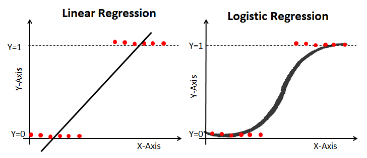
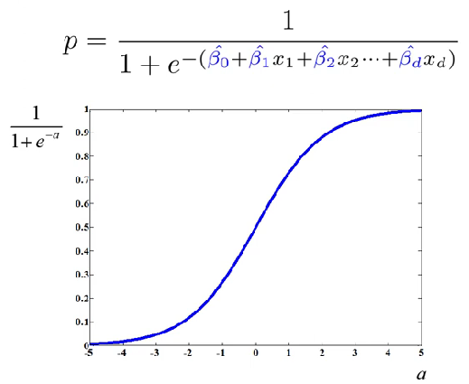
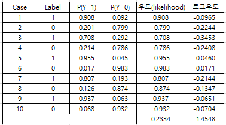
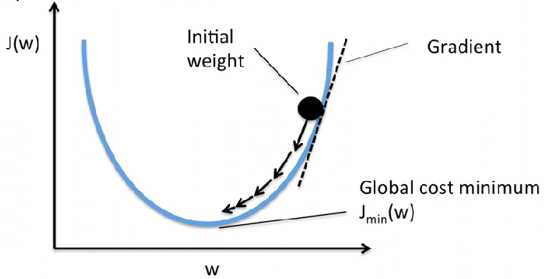
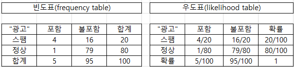
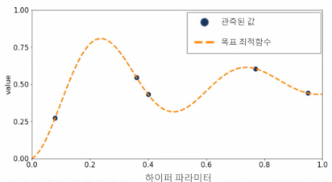
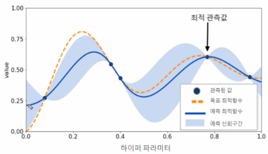
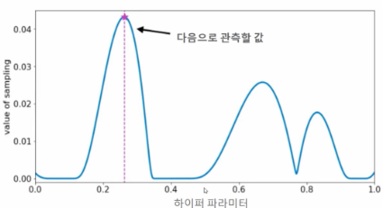
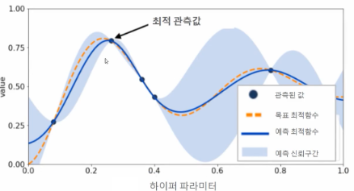
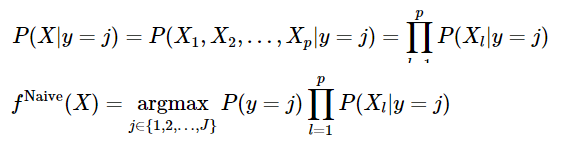

#  10 : 지도 학습 (Supervised Learning, SL) : 분류 (classification)

---

	[1] 회귀 기반
		[1-1] 로지스틱 회귀 (Logistic Regression)
		[1-2] 베이즈 로지스틱 회귀 (Bayesian Logistic Regression)
		[1-3] 프로빗 회귀 (Probit Regression)
		[1-4] 소프트맥스 회귀 (Softmax Regression)

	[2] 통계·확률 기반
		[2-1] 베이즈 네트워크 분류 (Bayesian Network Classification)
		[2-2] 나이브 베이즈 분류 (Naive Bayes Classification)
		[2-3] 혼합모형 기반 분류 (GMM + EM Classification)

	[3] 거리 기반
		[3-1] 최근접 중심 분류 (Nearest Centroid Classification)
		[3-2] 마할라노비스 거리 분류 (Mahalanobis Distance Classification)
		
---

# [1-1] 로지스틱 회귀 (Logistic Regression)

▣ 정의 : 입력 변수의 선형 결합을 시그모이드(Sigmoid) 함수에 통과시켜 0~1 사이의 확률로 변환하는 이진 분류 모델 
데이터가 어떤 범주에 속할 확률을 0에서 1 사이의 값으로 예측하고 그 확률에 따라 가능성이 더 높은 범주에 속하는 것으로 분류하는 지도 학습 알고리즘 
이름에 Regression이 들어가지만 Sigmoid 함수를 활용한 이진분류에 해당하며, 
선형 회귀는 특정 예측 값을 반환하지만 sigmoid 함수를 활용하면 특정 값을 기점으로 0 또는 1 값을 반환하는 분류 모델 
선형회귀분석과 비슷한데 Y값이 확률로 되어 있기 때문에 하한, 상한이 [0, 1] 사이로 정해져 있으며, 
특정 임계치(threshold)를 기준으로 삼아서 예측된 확률 값이 임계치 이상인 것과 미만인 것으로 분류 
▣ 목적 : 주어진 데이터가 특정 클래스(예: 1)에 속할 확률을 예측 
▣ 유형 :  
   **이항 로지스틱 회귀(Binary Logistic Regression) :** 이항 로지스틱 회귀 분석은 가능한 결과가 두 개뿐인 바이너리 분류 문제에 적합하다. 종속 변수는 예, 아니요 또는 0과 1과 같은 두 개의 값만 가질 수 있다. 로지스틱 함수가 0과 1 사이의 값 범위로 계산되더라도 이항 회귀 모델에서는 답을 가장 가까운 값으로 반올림/반내림한다. 일반적으로 0.5 미만의 답은 0으로 반내림되고 0.5보다 큰 답은 1로 반올림되므로 로지스틱 함수는 이항 결과를 반환하게 된다. 
   **다항 로지스틱 회귀(Multinomial Logistic Regression) :** 다항 회귀 분석은 결과의 수가 유한하다는 전제 하에, 3개 이상의 결과를 가질 수 있는 문제를 분석할 수 있다. 예컨대 인구 데이터를 기반으로 주택 가격이 25%, 50%, 75% 또는 100% 중 어떤 비율로 상승할지 예측할 수 있지만, 주택의 정확한 가격을 예측할 수는 없다. 다항 로지스틱 회귀 분석은 결과 값을 0과 1 사이의 다른 값에 매핑하는 방식으로 작동한다. 로지스틱 함수는 0.1, 0.11, 0.12 등 연속된 데이터의 범위를 반환할 수 있으므로, 다항 회귀 분석에서는 출력값을 가능한 가장 가까운 값으로 그룹화한다. 
   **서수 로지스틱 회귀(Ordinal Logistic Regression) :** 서수 로지스틱 회귀 분석 또는 순서형 로짓 모델은 숫자가 실제 값이 아닌 순위를 나타내는 문제를 풀기 위한 특수한 유형의 다항 회귀 분석이다. 예를 들어 서수 회귀 분석을 사용하여 고객이 1년 동안 구매한 품목 수 등의 숫자 값을 기준으로, 서비스를 나쁨, 양호, 좋음 또는 우수 등급으로 평가하도록 요청하는 설문 조사 질문의 답을 예측할 수 있다. 
▣ 장점 : 계산이 간단하고 빠르며 해석이 용이, 확률 기반 예측으로 의사결정에 활용 가능, 정규화 적용 시 과적합 방지 가능 
▣ 단점 : 비선형 관계 데이터에는 부적합, 이상치(outlier)에 민감  
▣ Scikit-learn 클래스 : `sklearn.linear_model.LogisticRegression` 
▣ 가이드 : https://scikit-learn.org/stable/modules/linear_model.html#logistic-regression 
▣ API : https://scikit-learn.org/stable/modules/generated/sklearn.linear_model.LogisticRegression.html  

▣ 회귀식 :   =\frac{1}{1+e^{-(\beta_0+\beta_1x_1+\cdots+\beta_kx_k)}})   
Linear Regression : $\hat{y} = \hat{\beta}_0 + \hat{\beta}_1x_1 + \hat{\beta}_2x_2 + ...+\hat{\beta}_dx_d$

$0 ≤ P(y=1 | X) = p(성공확률) ≤ 1$ 

$0 ≤ Odds(승산) = 성공확률/실패확률​ = p/(1−p​) ≤ ∞$ 

$−∞ ≤ log(Odds) = log(p/(1−p​)) ≤ ∞$ 

$log(Odds) = log(p/(1−p​)) = \hat{\beta}_0 + \hat{\beta}_1x_1 + \hat{\beta}_2x_2 + ...+\hat{\beta}_dx_d$ 

<!--
$\frac{p}{1-p} =$ $e^{\hat{\beta}_0 + \hat{\beta}_1x_1 + \hat{\beta}_2x_2 + ...+\hat{\beta}_dx_d}$ 
$p = \frac{1}{1+e^{-(\hat{\beta}_0 + \hat{\beta}_1x_1 + \hat{\beta}_2x_2 + ...+\hat{\beta}_dx_d)}} =\sigma(x|\beta)$
-->

**(1-1 로지스틱 회귀 예제 소스)**

	# ============================================================
	# Logistic Regression (Iris dataset) 결과 저장 + 평가 출력
	# - CSV / XLSX 모두 소수 10자리 고정
	# - proba_2 지수표기 완전 차단
	# ============================================================
	
	import sys
	import subprocess
	import pandas as pd
	import numpy as np
	from pathlib import Path
	from datetime import datetime
	from sklearn.datasets import load_iris
	from sklearn.linear_model import LogisticRegression
	from sklearn.metrics import accuracy_score, confusion_matrix, classification_report
	
	# ===== (1) 필요한 패키지 확인 및 설치 =====
	try:
	    import xlsxwriter
	except ModuleNotFoundError:
	    print("xlsxwriter 미설치 → 설치를 진행합니다...")
	    subprocess.check_call([sys.executable, "-m", "pip", "install", "xlsxwriter"])
	    import xlsxwriter
	
	# ===== (2) 출력 경로 설정 =====
	out_dir = Path(r"C:\Temp")
	out_dir.mkdir(parents=True, exist_ok=True)
	csv_name = "iris_logreg_results_fixed.csv"
	xlsx_name = "iris_logreg_results_fixed.xlsx"
	
	# ===== (3) 데이터/모델 =====
	iris = load_iris()
	X, y = iris.data, iris.target
	feature_names = iris.feature_names
	class_names = iris.target_names
	
	clf = LogisticRegression(random_state=0, max_iter=200).fit(X, y)
	pred = clf.predict(X)
	proba = clf.predict_proba(X)
	z = clf.decision_function(X)
	exp_neg_z = np.exp(-z)
	
	# ===== (4) 기본 DataFrame =====
	df_base = pd.DataFrame(X, columns=feature_names)
	df_base["target"] = y
	df_base["pred"] = pred
	df_base["correct"] = (y == pred)
	
	# ===== (5) 열 이름 정의 =====
	proba_cols = [f"proba_{i}" for i in range(proba.shape[1])]
	z_cols     = [f"z_{i}" for i in range(z.shape[1])]
	exp_cols   = [f"exp_neg_z_{i}" for i in range(exp_neg_z.shape[1])]
	
	# 숫자 버전 (계산용)
	df_num = pd.concat([
	    pd.DataFrame(proba, columns=proba_cols),
	    pd.DataFrame(z, columns=z_cols),
	    pd.DataFrame(exp_neg_z, columns=exp_cols)
	], axis=1)
	
	# 텍스트 버전 (고정 소수점 10자리)
	def fmt10(x): return f"{x:.10f}"
	df_txt = pd.concat([
	    pd.DataFrame([[fmt10(v) for v in row] for row in proba], columns=[c + "_str" for c in proba_cols]),
	    pd.DataFrame([[fmt10(v) for v in row] for row in z],     columns=[c + "_str" for c in z_cols]),
	    pd.DataFrame([[fmt10(v) for v in row] for row in exp_neg_z], columns=[c + "_str" for c in exp_cols]),
	], axis=1)
	
	# CSV용: ' 접두사로 지수표기 완전 차단
	df_txt_prefixed = df_txt.apply(lambda col: col.map(lambda s: "'" + s))
	df_csv_out  = pd.concat([df_base, df_num, df_txt_prefixed], axis=1)
	df_xlsx_out = pd.concat([df_base, df_num, df_txt], axis=1)
	
	# ===== (6) 안전 저장 함수 =====
	def safe_save_csv(df: pd.DataFrame, directory: Path, filename: str) -> Path:
	    ts = datetime.now().strftime("%Y%m%d_%H%M%S")
	    path1 = directory / filename
	    path2 = directory / f"{path1.stem}_{ts}{path1.suffix}"
	    fallback = Path.home() / "Downloads" / f"{path1.stem}_{ts}{path1.suffix}"
	    for path in [path1, path2, fallback]:
	        try:
	            df.to_csv(path, index=False, encoding="utf-8")
	            return path
	        except PermissionError:
	            continue
	    raise PermissionError("CSV 저장 실패: 파일이 열려 있거나 권한이 없습니다.")
	
	def safe_save_xlsx(df: pd.DataFrame, directory: Path, filename: str) -> Path:
	    ts = datetime.now().strftime("%Y%m%d_%H%M%S")
	    path1 = directory / filename
	    path2 = directory / f"{path1.stem}_{ts}{path1.suffix}"
	    fallback = Path.home() / "Downloads" / f"{path1.stem}_{ts}{path1.suffix}"
	    for path in [path1, path2, fallback]:
	        try:
	            with pd.ExcelWriter(path, engine="xlsxwriter") as writer:
	                df.to_excel(writer, index=False, sheet_name="results")
	                wb = writer.book
	                ws = writer.sheets["results"]
	                numfmt_10 = wb.add_format({"num_format": "0.0000000000"})
	                txtfmt = wb.add_format({"num_format": "@", "align": "left"})
	                headers = list(df.columns)
	                ws.set_column(0, len(headers)-1, 18)
	                for col_idx, col_name in enumerate(headers):
	                    if col_name.startswith(("proba_", "z_", "exp_neg_z_")) and not col_name.endswith("_str"):
	                        ws.set_column(col_idx, col_idx, 18, numfmt_10)
	                    if col_name.endswith("_str"):
	                        ws.set_column(col_idx, col_idx, 22, txtfmt)
	            return path
	        except PermissionError:
	            continue
	    raise PermissionError("XLSX 저장 실패: 파일이 열려 있거나 권한이 없습니다.")
	
	# ===== (7) 실제 저장 =====
	csv_saved = safe_save_csv(df_csv_out, out_dir, csv_name)
	xlsx_saved = safe_save_xlsx(df_xlsx_out, out_dir, xlsx_name)
	
	print(f"[CSV 저장 완료] → {csv_saved}")
	print(f"[XLSX 저장 완료] → {xlsx_saved}")
	
	# ===== (8) 모델 평가 결과 출력 =====
	print("\n" + "="*70)
	print("Logistic Regression (Iris) 모델 평가 결과")
	print("="*70)
	
	# ① 정확도
	acc = accuracy_score(y, pred)
	print(f"정확도(Accuracy): {acc:.4f} ({acc*100:.2f}%)")
	
	# ② 혼동행렬
	cm = confusion_matrix(y, pred)
	cm_df = pd.DataFrame(cm, index=class_names, columns=class_names)
	print("\n혼동행렬(Confusion Matrix):")
	print(cm_df)
	
	# ③ 클래스별 Precision/Recall/F1
	report = classification_report(y, pred, target_names=class_names, digits=4)
	print("\n클래스별 Precision / Recall / F1-score:")
	print(report)
	
	# ④ 회귀계수 및 절편
	coef_df = pd.DataFrame(clf.coef_, columns=feature_names, index=class_names)
	intercept_df = pd.DataFrame(clf.intercept_, columns=["intercept"], index=class_names)
	print("\n모델 계수 (Weights):")
	print(coef_df)
	print("\n모델 절편 (Intercepts):")
	print(intercept_df)
		

**(1-1 로지스틱 회귀 실행 결과)**

	[CSV 저장 완료] → C:\Temp\iris_logreg_results_fixed_20251104_145623.csv
	[XLSX 저장 완료] → C:\Temp\iris_logreg_results_fixed.xlsx	
	======================================================================
	Logistic Regression (Iris) 모델 평가 결과
	======================================================================
	정확도(Accuracy): 0.9733 (97.33%)
	
	혼동행렬(Confusion Matrix):
	            setosa  versicolor  virginica
	setosa          50           0          0
	versicolor       0          47          3
	virginica        0           1         49
	
	클래스별 Precision / Recall / F1-score:
	              precision    recall  f1-score   support
	
	      setosa     1.0000    1.0000    1.0000        50
	  versicolor     0.9792    0.9400    0.9592        50
	   virginica     0.9423    0.9800    0.9608        50
	
	    accuracy                         0.9733       150
	   macro avg     0.9738    0.9733    0.9733       150
	weighted avg     0.9738    0.9733    0.9733       150
	
	모델 계수 (Weights): sepal length (cm)  sepal width (cm)  petal length (cm)  petal width (cm)
	setosa              -0.419747          0.966869          -2.519351       -1.084506
	versicolor           0.531170         -0.315023          -0.202462       -0.944073 
	virginica           -0.111423         -0.651847           2.721813        2.028579
	
	모델 절편 (Intercepts):	            
	setosa       9.839462
	versicolor   2.222906
	virginica  -12.062367

**(1-1 로지스틱 회귀 실행 결과 분석)**

	======================================================================
	Logistic Regression (Iris) 모델 평가 결과
	======================================================================
	정확도(Accuracy): 0.9733 (97.33%) ← (TP+TN)/전체샘플수 = 146/150
	
	혼동행렬(Confusion Matrix):
	            setosa  versicolor  virginica
	setosa          50           0          0   → setosa는 모두 완벽하게 예측
	versicolor       0          47          3   → virginica로 3건 오분류
	virginica        0           1         49   → versicolor로 1건 오분류
	
	클래스별 Precision / Recall / F1-score:					→ precision = TP/(TP+FP)
	              precision    recall  f1-score   support   → recall = TP/(TP+FN)
				 (정밀도)      (재현율) (조화평균)  (샘플수)	→ F1 = 2* (precision * recall)/(precision + recall)
	      setosa     1.0000    1.0000    1.0000        50
	  versicolor     0.9792    0.9400    0.9592        50
	   virginica     0.9423    0.9800    0.9608        50
	
	    accuracy                         0.9733       150
	   macro avg     0.9738    0.9733    0.9733       150  → 세 클래스 각각의 평균 (가중치 X)
	weighted avg     0.9738    0.9733    0.9733       150  → 각 클래스의 support(샘플 수)를 고려한 평균
	
	모델 계수 (Weights): sepal length (cm)  sepal width (cm)  petal length (cm)  petal width (cm)
	setosa              -0.419747          0.966869          -2.519351       -1.084506
	versicolor           0.531170         -0.315023          -0.202462       -0.944073 
	virginica           -0.111423         -0.651847           2.721813        2.028579
	setosa : petal length, petal width → 음(-) 꽃잎이 짧고 좁을수록 setosa일 확률 증가
   			 sepal width →	양(+) 꽃받침이 넓을수록 setosa 확률 증가
	versicolor : sepal length → 양(+) 꽃받침이 길수록 versicolor 가능성 증가
    			 petal width → 음(-) 꽃잎이 넓을수록 virginica로 갈 가능성 증가
	virginica : petal length, petal width → 양(+) 꽃잎이 길고 넓을수록 virginica 가능성 증가
		
	모델 절편 (Intercepts): → setosa 쪽이 +9.8로 매우 높고, virginica가 -12로 매우 낮음
	→ 전체적으로 모델이 초기에 setosa를 “기본값”으로 두고 시작하지만 
	  입력 특징(특히 꽃잎 길이/너비)에 따라 가중치로 클래스가 달라짐
	setosa       9.839462 → 매우 큰 양수로 초기 확률이 매우 높음
	versicolor   2.222906 → 중간 수준
	virginica  -12.062367 → 매우 큰 음수 → 기본 확률이 낮음
	======================================================================	
	정확도 : 97.33% (매우 우수한 분류 성능)
    혼동영역 : versicolor ↔ virginica 사이 일부 (4건)
    핵심 특성 : petal length, petal width (꽃잎 변수)
    보조 특성 : sepal length, sepal width (꽃받침 변수)
    계수 해석 : setosa: 음의 petal 계수 / virginica: 양의 petal 계수
    결론 :  Logistic Regression이 Iris 데이터를 거의 완벽히 분리, softmax 확률 일관성도 매우 양호
	======================================================================	

## ▣ 최대우도추정법(Maximum Likelihood Estimation, MLE)
관측된 데이터가 주어졌을 때, 그 데이터를 가장 그럴듯하게(우도, likelihood가 최대가 되도록) 만들어내는 모수(parameter)를 추정하는 통계적 방법 
최소제곱법(OLS)은 회귀식에서 오차 제곱합을 최소화하지만, 로지스틱 회귀의 출력은 0~1의 확률값으로 잔차 개념이 없으므로 
관측된 레이블 Y가 주어진 X 하에서 나올 확률의 최대화를 위하여 최대우도추정법(MLE)을 사용하여 <ins>로그우도를 최대화하는 β 탐색</ins> 

 

<!--
P(X_i,y_i|\beta) = \left\{\begin{matrix}
\sigma(X_i|\beta), y_i=1\\
1-\sigma(X_i|\beta), y_i=0
\end{matrix}\right.
-->

$P(X_i,y_i|\beta) = \sigma(X_i|\beta)^{y_i}(1-\sigma(X_i|\beta))^{1-y_i}$ 

$L(X,y|\beta) = \prod_{i=1}^{N}P(X_i,y_i|\beta)=\prod_{i=1}^{N}\sigma(X_i|\beta)^{y_i}(1-\sigma (X_i|\beta))^{1-y_i}$ 

$logL(X,y|\beta) = \sum_{i=1}^{N}y_ilog(\sigma (X_i|\beta))+(1-y_i)log(1-\sigma (X_i|\beta))$ 

 

## ▣ 경사하강법(Gradient Descent Algorithm, GDA)

$f(\omega +\Delta\omega)=f(\omega)+\frac{f'(\omega)}{1!}\Delta\omega+\frac{f''(\omega)}{2!}(\Delta\omega)^2+...$ 
 
$\omega_{new}=\omega_{old}-\alpha f'(\omega), 0<\alpha<1$ 

$f(\omega_{new})=f(\omega_{old}-\alpha f'(\omega_{old}))\cong f(\omega_{old})-\alpha\left|f'(\omega)\right|^2<f(\omega_{old})$

**(MLE, GDA 추가 예제 소스)**

	# -*- coding: utf-8 -*-
	import numpy as np
	from sklearn.datasets import make_classification
	from sklearn.model_selection import train_test_split
	from sklearn.preprocessing import StandardScaler
	from sklearn.metrics import (
	    accuracy_score, roc_auc_score, average_precision_score,
	    log_loss, brier_score_loss
	)
	from sklearn.linear_model import LogisticRegression
	
	# -----------------------------
	# 유틸 함수들
	# -----------------------------
	def sigmoid(z):
	    # 수치 안정화(overflow 방지)
	    z = np.clip(z, -40, 40)
	    return 1.0 / (1.0 + np.exp(-z))
	
	def add_bias(X):
	    return np.hstack([np.ones((X.shape[0], 1)), X])
	
	def predict_proba_beta(Xb, beta):
	    return sigmoid(Xb @ beta)
	
	def predict_label_from_proba(p, thr=0.5):
	    return (p >= thr).astype(int)
	
	def metrics_report(y_true, p):
	    """확률 기반 평가 지표 계산"""
	    y_pred = predict_label_from_proba(p)
	    return {
	        "Accuracy": accuracy_score(y_true, y_pred),
	        "ROC-AUC": roc_auc_score(y_true, p),
	        "PR-AUC": average_precision_score(y_true, p),
	        "LogLoss": log_loss(y_true, p),      # sklearn이 내부적으로 clipping 처리
	        "Brier": brier_score_loss(y_true, p)
	    }
	
	def print_report(name, rep):
	    print(f"{name:<30} | "
	          f"Acc: {rep['Accuracy']:.3f}  "
	          f"ROC-AUC: {rep['ROC-AUC']:.3f}  "
	          f"PR-AUC: {rep['PR-AUC']:.3f}  "
	          f"LogLoss: {rep['LogLoss']:.3f}  "
	          f"Brier: {rep['Brier']:.3f}")
	
	# -----------------------------
	# 경사 기반 최적화 루틴
	# -----------------------------
	def fit_mle_ascent(Xb, y, beta_init, lr=0.05, epochs=3000, l2=0.0):
	    """
	    (2) LR+MLE용: 로그우도 최대화(=Cross-Entropy의 음수 최대화)
	    gradient ascent: beta += lr * grad
	    grad = X^T (y - p) - l2 * [0, w1, ..., wd]  (bias는 L2 제외)
	    """
	    beta = beta_init.copy()
	    n = Xb.shape[0]
	    for t in range(epochs):
	        p = predict_proba_beta(Xb, beta)
	        grad = Xb.T @ (y - p) - l2 * np.r_[0, beta[1:]]
	        beta += lr * grad / n
	    return beta
	
	def fit_sse_descent(Xb, y, beta_init, lr=0.05, epochs=3000, l2=0.0):
	    """
	    (3) LR+GDA용: SSE(제곱오차) 최소화 (의도적으로 로지스틱에 비권장)
	    gradient descent: beta -= lr * grad
	    간단 근사 grad ≈ X^T (p - y) + l2 * [0, w1, ..., wd]
	    """
	    beta = beta_init.copy()
	    n = Xb.shape[0]
	    for t in range(epochs):
	        p = predict_proba_beta(Xb, beta)
	        grad = Xb.T @ (p - y) + l2 * np.r_[0, beta[1:]]
	        beta -= lr * grad / n
	    return beta
	
	def fit_ce_descent(Xb, y, beta_init, lr=0.05, epochs=3000, l2=0.0):
	    """
	    (4) LR+MLE+GDA용: Cross-Entropy(= -log-likelihood) 최소화
	    gradient descent: beta -= lr * grad
	    grad = X^T (p - y) + l2 * [0, w1, ..., wd]
	    """
	    beta = beta_init.copy()
	    n = Xb.shape[0]
	    for t in range(epochs):
	        p = predict_proba_beta(Xb, beta)
	        grad = Xb.T @ (p - y) + l2 * np.r_[0, beta[1:]]
	        beta -= lr * grad / n
	    return beta
	
	# -----------------------------
	# 데이터 생성: 불균형 + 노이즈
	# -----------------------------
	RSEED = 123
	X, y = make_classification(
	    n_samples=3000, n_features=12, n_informative=5, n_redundant=3,
	    n_clusters_per_class=2, weights=[0.88, 0.12], flip_y=0.06,
	    class_sep=0.7, random_state=RSEED
	)
	
	Xtr, Xte, ytr, yte = train_test_split(
	    X, y, test_size=0.35, stratify=y, random_state=RSEED
	)
	
	# 스케일링(수치 안정성에 매우 중요)
	scaler = StandardScaler().fit(Xtr)
	Xtr_s = scaler.transform(Xtr)
	Xte_s = scaler.transform(Xte)
	
	# 편향항 추가
	Xtr_b = add_bias(Xtr_s)
	Xte_b = add_bias(Xte_s)
	
	# -----------------------------
	# (1) LR: scikit-learn 기본 학습
	# -----------------------------
	lr_clf = LogisticRegression(solver='lbfgs', max_iter=2000, random_state=RSEED)
	lr_clf.fit(Xtr_s, ytr)
	
	p1_tr = lr_clf.predict_proba(Xtr_s)[:, 1]
	p1_te = lr_clf.predict_proba(Xte_s)[:, 1]
	rep1_tr = metrics_report(ytr, p1_tr)
	rep1_te = metrics_report(yte, p1_te)
	print_report("(1) LR [train]", rep1_tr)
	print_report("(1) LR [test ]", rep1_te)
	print()
	
	# sklearn 파라미터를 beta로 변환(초기값)
	beta_lr = np.r_[lr_clf.intercept_[0], lr_clf.coef_.ravel()]
	
	# -----------------------------
	# (2) LR+MLE: LR 결과를 초기값으로, 로그우도 최대화(상승법)
	# -----------------------------
	beta_mle = fit_mle_ascent(
	    Xtr_b, ytr, beta_init=beta_lr, lr=0.05, epochs=4000, l2=0.0
	)
	p2_tr = predict_proba_beta(Xtr_b, beta_mle)
	p2_te = predict_proba_beta(Xte_b, beta_mle)
	rep2_tr = metrics_report(ytr, p2_tr)
	rep2_te = metrics_report(yte, p2_te)
	print_report("(2) LR+MLE (ascent) [train]", rep2_tr)
	print_report("(2) LR+MLE (ascent) [test ]", rep2_te)
	print()
	
	# -----------------------------
	# (3) LR+GDA: LR 결과를 초기값으로, SSE를 GD로 추가 학습(비권장)
	# -----------------------------
	beta_sse = fit_sse_descent(
	    Xtr_b, ytr, beta_init=beta_lr, lr=0.03, epochs=4000, l2=0.0
	)
	p3_tr = predict_proba_beta(Xtr_b, beta_sse)
	p3_te = predict_proba_beta(Xte_b, beta_sse)
	rep3_tr = metrics_report(ytr, p3_tr)
	rep3_te = metrics_report(yte, p3_te)
	print_report("(3) LR+GDA (SSE) [train]", rep3_tr)
	print_report("(3) LR+GDA (SSE) [test ]", rep3_te)
	print()
	
	# -----------------------------
	# (4) LR+MLE+GDA: LR 결과를 초기값으로, CE를 GD로 추가 학습(권장)
	# -----------------------------
	beta_ce = fit_ce_descent(
	    Xtr_b, ytr, beta_init=beta_lr, lr=0.05, epochs=4000, l2=1.0  # L2로 일반화 향상
	)
	p4_tr = predict_proba_beta(Xtr_b, beta_ce)
	p4_te = predict_proba_beta(Xte_b, beta_ce)
	rep4_tr = metrics_report(ytr, p4_tr)
	rep4_te = metrics_report(yte, p4_te)
	print_report("(4) LR+MLE+GDA (CE) [train]", rep4_tr)
	print_report("(4) LR+MLE+GDA (CE) [test ]", rep4_te)
	
	# 참고로 파라미터 변화량(노름)도 확인 가능
	def l2_norm(v): return np.linalg.norm(v)
	print("\n‣ ||beta(LR)||     =", f"{l2_norm(beta_lr):.4f}")
	print("‣ ||beta(LR+MLE)|| =", f"{l2_norm(beta_mle):.4f}")
	print("‣ ||beta(LR+GDA)|| =", f"{l2_norm(beta_sse):.4f}")
	print("‣ ||beta(LR+MLE+GDA)|| =", f"{l2_norm(beta_ce):.4f}")

**(MLE, GDA 추가 실행 결과)**

	(1) LR [train]                 | Acc: 0.915  ROC-AUC: 0.871  PR-AUC: 0.699  LogLoss: 0.257  Brier: 0.070
	(1) LR [test ]                 | Acc: 0.909  ROC-AUC: 0.878  PR-AUC: 0.705  LogLoss: 0.256  Brier: 0.071
	(2) LR+MLE (ascent) [train]    | Acc: 0.914  ROC-AUC: 0.871  PR-AUC: 0.699  LogLoss: 0.257  Brier: 0.070
	(2) LR+MLE (ascent) [test ]    | Acc: 0.909  ROC-AUC: 0.878  PR-AUC: 0.705  LogLoss: 0.256  Brier: 0.071
	(3) LR+GDA (SSE) [train]       | Acc: 0.914  ROC-AUC: 0.871  PR-AUC: 0.700  LogLoss: 0.257  Brier: 0.070
	(3) LR+GDA (SSE) [test ]       | Acc: 0.909  ROC-AUC: 0.878  PR-AUC: 0.705  LogLoss: 0.256  Brier: 0.071
	(4) LR+MLE+GDA (CE) [train]    | Acc: 0.915  ROC-AUC: 0.872  PR-AUC: 0.699  LogLoss: 0.257  Brier: 0.070
	(4) LR+MLE+GDA (CE) [test ]    | Acc: 0.909  ROC-AUC: 0.878  PR-AUC: 0.705  LogLoss: 0.256  Brier: 0.071

	‣ ||beta(LR)||     = 3.6955
	‣ ||beta(LR+MLE)|| = 3.7504
	‣ ||beta(LR+GDA)|| = 3.7450
	‣ ||beta(LR+MLE+GDA)|| = 3.6957

**(MLE, GDA 추가 실행 결과 분석)**

	| 구분      | 평가대상                  | 값의 범위|    평가결과  | 주요 용도           |
	| ----------| ------------------------ | ------- | ------------ | ------------------ |
	| Accuracy  | 전체 분류 정확도 결과      | 0 ~ 1   | 높을수록 좋음 | 일반적인 성능 척도  |
	| ROC-AUC   | 분류 경계 구분능력         | 0.5 ~ 1 | 높을수록 좋음 | 전반적 분류력 평가  |
	| PR-AUC    | 불균형 데이터의 양성 탐지력 | 0 ~ 1   | 높을수록 좋음 | 희귀 클래스 평가    |
	| LogLoss   | 확률 예측의 품질           | 0 ~ ∞   | 낮을수록 좋음 | 확률형 모델 평가    |
	| Brier     | 확률 예측의 신뢰도         | 0 ~ 1   | 낮을수록 좋음 | 확률 보정 평가      |
	
	확률 품질(LogLoss, Brier) 동일이면 더 안정적인 최적화 방식을 선택
	모델 복잡도↓(과도한 확신/과적합 위험이 낮음) : → ‖β‖ 최소값

	

| 분야         | 대표 연구사례          | 연구 목적 / 문제 정의             | **독립변수 (X)**               | **종속변수 (y)**               | 주요 결과 또는 의의              |
| :--------- | :--------------- | :------------------------ | :------------------------- | :------------------------- | :----------------------- |
| **의료·보건**  | **당뇨병 발병 예측**    | 건강지표를 이용해 환자의 당뇨 발병 확률 예측 | 혈당, BMI, 연령, 혈압, 가족력 등     | 당뇨 발병 여부 (1: 발병, 0: 정상)    | 주요 위험요인 도출, 조기진단 가능성 제시  |
|            | **심혈관질환 위험도 평가** | 생체정보를 기반으로 심근경색 발생 가능성 예측 | 연령, 흡연여부, 혈압, 콜레스테롤, 운동량 등 | 심근경색 발생 여부 (1: 발생, 0: 미발생) | 흡연·비만 등 유의요인 도출, 예방정책 설계 |
| **금융·경제**  | **신용카드 부도 예측**   | 고객특성으로 부도 확률 예측           | 소득, 신용점수, 직업, 부채비율, 거래이력 등 | 부도 여부 (1: 부도, 0: 정상)       | 신용평가의 표준모델, 변수 중요도 명확    |
|            | **대출 리스크 평가**    | 대출신청자 상환능력 판단             | 나이, 소득, 부양가족수, 대출금액, 신용등급  | 상환 여부 (1: 연체/부도, 0: 정상상환)  | 리스크 등급화 및 자동심사 모델 구축     |
| **사회·심리**  | **소비자 구매의사 분석**  | 마케팅 요인이 구매에 미치는 영향 분석     | 가격, 브랜드인지도, 광고노출, 리뷰점수     | 구매 여부 (1: 구매, 0: 미구매)      | 가격민감도·브랜드충성도 정량화         |
|            | **투표참여 요인 분석**   | 사회경제적 요인이 투표참여에 미치는 영향 규명 | 연령, 소득, 교육수준, 정치성향, 관심도    | 투표참여 여부 (1: 참여, 0: 불참)     | 참여 확률 모델링, 사회정책 효과 분석    |
| **산업·공학**  | **품질불량 예측**      | 공정데이터로 불량품 발생 확률 예측       | 온도, 압력, 속도, 습도, 장비모델 등     | 불량 발생 여부 (1: 불량, 0: 정상)    | 불량률 예측, 생산공정 최적화         |
|            | **안전사고 확률 예측**   | 근로환경에 따른 사고발생 위험 평가       | 근무시간, 근속연수, 보호장비 착용, 환경지수  | 사고 발생 여부 (1: 발생, 0: 무사)    | 안전등급화, 예방조치 우선순위 도출      |
| **IT·데이터** | **스팸메일 분류**      | 이메일 특징으로 스팸 여부 분류         | 단어빈도, 발신자, 첨부파일, 제목 길이     | 스팸 여부 (1: 스팸, 0: 정상)       | 고속 학습 및 실시간 분류 가능        |
|            | **사용자 이탈 예측**    | 서비스 이용패턴으로 고객 이탈확률 예측     | 접속빈도, 이용기간, 불만건수, 결제액, 나이  | 이탈 여부 (1: 해지, 0: 유지)       | 마케팅 타깃 선정 및 고객 유지율 향상    |

 

# [1-2] 베이즈 로지스틱 회귀 (Bayesian Logistic Regression)

▣ 정의 : 로지스틱 회귀의 계수를 확률변수로 보고, 사전분포(prior)와 사후분포(posterior)를 이용해 불확실성을 반영하는 베이즈 확률 모델 
▣ 목적 : 모델 파라미터의 불확실성을 고려하여 보다 안정적이고 신뢰도 있는 확률 예측을 수행 
▣ 장점 : 불확실성 정량화 가능, 과적합 방지 효과, 작은 데이터셋에서도 안정적 성능 
▣ 단점 : 계산 복잡도 높음 (MCMC, VI 등 필요), 수렴 속도 느림 
▣ Scikit-learn 클래스 : 직접 구현 없음 → PyMC / scikit-bayes (`sklearn_bayes.LogisticRegression`) 활용 
▣ 회귀식 : $P(\beta|D)\propto P(D|\beta)P(\beta))$  

| 분야         | 대표 연구사례          | 연구 목적 / 문제 정의                 | **독립변수 (X)**                      | **종속변수 (y)**             | 주요 결과 또는 의의                   |
| :--------- | :--------------- | :---------------------------- | :-------------------------------- | :----------------------- | :---------------------------- |
| **의료·보건**  | **질병 위험도 예측**    | 소규모 의료데이터에서 질병 발병 확률과 불확실성 추정 | 혈압, 체질량지수(BMI), 유전자표지, 흡연여부, 연령 등 | 질병 발병 여부 (1: 발병, 0: 정상)  | 데이터 희소 상황에서도 신뢰도 높은 확률 추정 가능  |
|            | **신경계 질환 진단**    | MRI, 뇌파 등에서 알츠하이머 등 신경질환 판별   | 뇌영상 지표, 인지점수, 유전자 정보              | 질환 여부 (1: 진단, 0: 정상)     | 계수의 사후분포로 변수 불확실성까지 해석 가능     |
| **금융·경제**  | **신용 리스크 평가**    | 불확실한 경기 상황에서 고객 부도확률 추정       | 소득, 대출금액, 부채비율, 직업유형, 거래이력        | 부도 여부 (1: 부도, 0: 정상)     | 사전정보(Prior)를 반영하여 안정적인 확률 추정  |
|            | **시장 이상거래 탐지**   | 소수의 이상패턴으로 시장 위험 탐지           | 거래빈도, 거래금액, 자산유형, 변동성 지수          | 이상거래 여부 (1: 이상, 0: 정상)   | False Positive 감소, 탐지 정확도 향상  |
| **사회·심리**  | **정책 수용도 분석**    | 표본이 적은 사회조사에서 정책 찬반 확률 추정     | 연령, 교육수준, 정치성향, 관심도, 정보노출량        | 찬성 여부 (1: 찬성, 0: 반대)     | 불균형 표본에서도 신뢰 가능한 예측 결과 도출     |
|            | **심리적 위험요인 평가**  | 심리 상태(스트레스, 우울 등) 분류          | 스트레스 지수, 근무시간, 수면시간, 사회적 지원       | 심리위험 상태 (1: 위험, 0: 정상)   | 개별 요인의 확률적 영향도 해석 가능          |
| **산업·공학**  | **예방정비 고장예측**    | 희귀한 설비고장 데이터를 기반으로 확률적 예측     | 온도, 진동, 압력, 가동시간, 장비연령            | 고장 여부 (1: 고장, 0: 정상)     | 사전분포를 반영해 희귀 이벤트 예측 안정성 향상    |
|            | **작업안전사고 확률 예측** | 불확실한 환경요소 기반 안전사고 위험 추정       | 근무형태, 작업시간, 보호장비 착용, 환경지수         | 사고 여부 (1: 발생, 0: 무사)     | 사후확률 기반 실시간 위험지수 산출 가능        |
| **IT·데이터** | **스팸메일 분류**      | 불균형 데이터에서 스팸 탐지 확률 추정         | 단어빈도, 제목 길이, 발신자 도메인, 첨부파일        | 스팸 여부 (1: 스팸, 0: 정상)     | 사전확률로 클래스 불균형 문제 완화           |
|            | **사용자 행동 예측**    | 개인화된 사용자 행동 확률 모델링            | 접속빈도, 클릭수, 체류시간, 관심카테고리           | 행동 발생 여부 (1: 발생, 0: 미발생) | 개인 단위 불확실성 예측, 맞춤형 추천모델 적용 가능 |

## (전통 로지스틱 회귀와 베이즈 로지스틱 회귀의 차이)

| 분야         | 전통 로지스틱 회귀 주요 사례                          | 베이즈 로지스틱 회귀 주요 사례                        |
| :--------- | :---------------------------------------- | :--------------------------------------- |
| **의료·보건**  | 대규모 건강검진 데이터를 이용한 질병발병 예측 | 환자 수가 적은 희귀질환, 임상시험, 유전자 데이터의 확률적 위험도 추정 (소규모 데이터, 불확실성) | 
| **금융·경제**  | 신용카드 부도, 대출 리스크, 고객 등급화                   | 경기변동, 극단적 리스크, 신용불량 소표본 예측 (불확실 리스크 모델링)               | 
| **사회·심리**  | 대규모 설문·행동 데이터 기반 구매/투표 예측                 | 응답자 수가 적거나 표본이 편향된 설문 연구 (소표본/편향 보정)                 | 
| **산업·공학**  | 대규모 제조공정 데이터의 불량품 분류                      | 드물게 발생하는 설비고장, 안전사고 확률 예측 (희귀 이벤트)                | 
| **IT·데이터** | 스팸메일, 고객이탈, 클릭 예측 등 대용량 데이터 분류            | 클래스 불균형이 심한 데이터, 개인화 확률 모델링 (클래스 불균형 보정)       | 

 

# [1-3] 프로빗 회귀 (Probit Regression)

▣ 정의 : 시그모이드 대신 정규분포의 누적분포함수(CDF)를 사용하여 확률을 계산하는 회귀 기반 이진 분류모델 
▣ 목적 : 잠재적인 연속 확률변수를 기준으로 이진 결과를 확률적으로 예측 
▣ 장점 : 정규분포 기반으로 통계적 엄밀성 높음,  이상치에 덜 민감 
▣ 단점 : 계산 복잡하고 직관성 낮음 , 로지스틱 회귀보다 구현 복잡 
▣ Scikit-learn 클래스 : 직접 지원 없음 → `statsmodels.discrete.discrete_model.Probit` 사용 
▣ 회귀식 :  =\Phi(\beta_0+\beta_1x_1+\cdots+\beta_kx_k))  

| 분야         | 대표 연구사례                | 연구 목적 / 문제 정의                         | **독립변수 (X)**                   | **종속변수 (y)**               | 주요 결과 또는 의의                            |
| :--------- | :--------------------- | :------------------------------------ | :----------------------------- | :------------------------- | :------------------------------------- |
| **의료·보건**  | **약물 복용 순응도 분석**       | 환자의 개인 특성이 약 복용 순응(순응/비순응)에 미치는 영향 분석 | 연령, 약효 인식도, 복용횟수, 부작용 경험, 소득수준 | 복용 순응 여부 (1: 순응, 0: 비순응)   | 확률적 선택모델로 개인 간 순응 확률 정밀 추정             |
|            | **건강검진 결과 기반 질병위험 예측** | 검사 지표로 질병 발병 확률 추정                    | 혈압, BMI, 혈당, 흡연여부, 운동량         | 질병 발병 여부 (1: 발병, 0: 정상)    | 비선형 효과를 정규분포 기반으로 추정 가능                |
| **금융·경제**  | **소비자 대출 승인 의사결정 모델링** | 고객 특성이 대출 승인 여부에 미치는 영향 분석            | 소득, 신용등급, 대출금액, 부채비율           | 승인 여부 (1: 승인, 0: 거절)       | 의사결정 임계점(Threshold) 확률적 추정 가능          |
|            | **투자상품 선택요인 분석**       | 투자자의 위험선호가 상품 선택에 미치는 영향 파악           | 연령, 소득, 위험성향, 투자경험             | 투자 선택 여부 (1: 선택, 0: 비선택)   | 잠재변수 기반 확률모형으로 의사결정 해석 용이              |
| **사회·심리**  | **노동시장 참여 결정요인 분석**    | 사회적·경제적 요인이 고용참여에 미치는 영향 규명           | 성별, 연령, 교육수준, 자녀수, 근무경력        | 노동시장 참여 여부 (1: 참여, 0: 비참여) | 잠재효용모형(latent utility model)로 참여 확률 예측 |
|            | **정책 수용의사 결정요인 분석**    | 개인의 가치관과 정책 태도 간 관계 분석                | 소득, 정치성향, 환경의식, 지역             | 정책 수용 여부 (1: 수용, 0: 반대)    | 선택행동 분석(Choice Modeling)에 적합           |
| **산업·공학**  | **제품 구매의사 결정모형**       | 가격과 품질이 구매확률에 미치는 영향 분석               | 가격, 품질평가, 브랜드인지도, 광고노출         | 구매 여부 (1: 구매, 0: 미구매)      | 로짓모형보다 정규분포 기반 추정으로 안정적                |
|            | **안전장비 사용 여부 분석**      | 근로자 특성이 보호구 착용 여부에 미치는 영향 분석          | 근속연수, 직무유형, 안전교육, 위험인식         | 보호구 착용 여부 (1: 착용, 0: 미착용)  | 잠재적 안전의식(비관측 변수) 반영 가능                 |
| **IT·데이터** | **온라인 광고 클릭 확률 예측**    | 광고 노출특성이 클릭 확률에 미치는 영향 분석             | 노출위치, 이미지유형, 클릭이력, 사용자나이       | 클릭 여부 (1: 클릭, 0: 미클릭)      | 사용자 선택 확률을 정규누적함수 기반으로 예측              |
|            | **모바일 앱 설치 결정요인 분석**   | 사용자 특성이 앱 설치 여부에 미치는 영향 분석            | 이용시간, 리뷰평점, 다운로드수, 요금유무        | 설치 여부 (1: 설치, 0: 미설치)      | 선택행동(install vs skip) 분석에 적합           |

 

# [1-4] 소프트맥스 회귀 (Softmax Regression)

▣ 정의 : 로지스틱 회귀를 다중 클래스 분류로 확장한 모델로 각 클래스에 속할 확률을 동시에 계산 
▣ 목적 : 3개 이상의 클래스 중 어느 하나에 속할 확률을 추정 
▣ 장점 : 다중 클래스 문제 해결 가능, 각 클래스 확률을 해석적으로 제공 
▣ 단점 : 클래스가 많을수록 계산량 증가, 데이터 불균형에 민감 
▣ Scikit-learn 클래스 : `sklearn.linear_model.LogisticRegression(multi_class='multinomial', solver='lbfgs')` 
▣ 회귀식 :  =\frac{e^{\beta_i^Tx}}{\sum_{j=1}^Ke^{\beta_j^Tx}})  

| 분야         | 대표 연구사례          | 연구 목적 / 문제 정의                   | **독립변수 (X)**                   | **종속변수 (y)**                  | 주요 결과 또는 의의                       |
| :--------- | :--------------- | :------------------------------ | :----------------------------- | :---------------------------- | :-------------------------------- |
| **의료·보건**  | **질병 유형 분류**     | 다종 질환 데이터를 이용해 환자의 질병 유형 예측     | 혈압, 혈당, BMI, 흡연여부, 연령, 유전자표지 등 | 질병 유형 (예: 정상, 당뇨, 고혈압, 심혈관질환) | 다범주 예측에 적합, 병렬적 질병 분류 가능          |
|            | **환자 상태 단계별 분류** | 중환자실 환자의 상태를 단계(안정, 주의, 위험)로 분류 | 맥박, 산소포화도, 체온, 혈압 등 생체지표       | 상태 등급 (3단계 이상)                | 상태단계별 치료 우선순위 결정에 활용              |
| **금융·경제**  | **신용등급 분류**      | 고객 속성을 기반으로 다단계 신용등급 예측         | 소득, 자산, 부채, 거래빈도, 신용점수         | 신용등급 (A, B, C, D, E)          | 다중등급 평가에 적합, 등급간 확률 분포 제공         |
|            | **소비자 세그먼트 분류**  | 소비자 행동 데이터를 이용한 고객군 분류          | 연령, 구매빈도, 구매액, 브랜드수, 방문채널      | 고객군 (고가형, 중간형, 저가형 등)         | 마케팅 타깃 세분화, 세그먼트 확률 분석 가능         |
| **사회·심리**  | **정치 성향 분류**     | 사회경제적 요인으로 개인의 정치성향 다범주 예측      | 연령, 소득, 교육, 지역, 직업             | 성향 (보수, 중도, 진보)               | 명시적 확률모델로 정치·사회 예측 연구에 활용         |
|            | **직업 선택 행동 분석**  | 청년층의 직업 선택 요인을 기반으로 직종 선택 확률 예측 | 전공, 연령, 기대연봉, 근무지역, 근무시간       | 직종 (공공, 민간, 스타트업 등)           | 다항 선택모델로 행동경제학적 해석 가능             |
| **산업·공학**  | **제품 결함 유형 분류**  | 제조공정에서 발생한 불량을 유형별로 분류          | 압력, 온도, 속도, 습도, 장비모델           | 결함 유형 (예: 기계오류, 조립오류, 재료결함 등) | 다중 불량 유형별 원인 분석에 활용               |
|            | **생산설비 작동상태 분류** | 센서데이터로 설비 상태를 다중단계로 분류          | 진동, 소음, 전류, 온도 등               | 상태 (정상, 경고, 이상, 정지)           | 다범주 경보체계 구축에 활용 가능                |
| **IT·데이터** | **이미지 분류**       | 픽셀값·특징벡터로 객체를 다범주 분류            | 이미지 픽셀값, 색상, 모양 특징 등           | 클래스 (예: 고양이, 개, 자동차, 비행기 등)   | CNN의 출력층에 Softmax 사용, 대표적 다중분류 모델 |
|            | **문서 주제 분류**     | 문서의 단어벡터를 이용해 주제 자동분류           | TF-IDF, 단어빈도, 문장길이, 키워드빈도      | 주제 (정치, 경제, 문화, 과학 등)         | NLP 분류의 기본기준 모델로 활용               |

 

# [2-1] 베이즈 네트워크 분류 (Bayesian Network Classification)

▣ 정의 : 변수 간 조건부 의존관계를 방향성 비순환 그래프(DAG) 형태로 표현한 확률 그래픽 모델 기반 분류 
▣ 목적 : 인과 관계와 확률적 의존성을 명시적으로 표현하여 분류와 추론을 동시에 수행 
▣ 장점 : 변수 간 인과관계 해석 가능, 결측치 처리에 강함, 확률적 추론 및 구조 해석 가능 
▣ 단점 : 구조 학습 복잡도 매우 높음, 고차원 데이터에서는 비효율적 
▣ Scikit-learn 클래스 : 없음 → `pgmpy.models.BayesianNetwork` 활용 가능 
▣ 회귀식 :  =\prod_iP(X_i|Pa(X_i)))  

| 분야         | 대표 연구사례           | 연구 목적 / 문제 정의                          | **독립변수 (X)**                 | **종속변수 (y)**              | 주요 결과 또는 의의                 |
| :--------- | :---------------- | :------------------------------------- | :--------------------------- | :------------------------ | :-------------------------- |
| **의료·보건**  | **질병 진단 인과모델 구축** | 환자 증상과 검사결과 간의 인과관계를 반영하여 질병 진단        | 증상(발열, 기침, 통증), 검사수치, 연령, 성별 | 질병 종류 (예: 독감, 폐렴, 기관지염 등) | 변수 간 조건부 확률 구조로 진단 정확도 향상   |
|            | **암 재발 위험도 예측**   | 임상요소 간의 관계를 그래프로 모델링하여 재발 확률 추정        | 종양크기, 유전자표현, 치료유형, 나이        | 재발 여부 (1: 재발, 0: 무재발)     | 인과구조 기반 위험인자 규명, 해석력 우수     |
| **금융·경제**  | **사기거래 탐지 모델**    | 거래변수 간 상관관계(금액, 시간, 지역 등)를 반영한 사기확률 계산 | 거래금액, 거래시간, 위치, 계좌유형, 패턴     | 사기 여부 (1: 사기, 0: 정상)      | 확률적 네트워크로 이상탐지 민감도 향상       |
|            | **신용평가 인과모형**     | 고객특성 간의 인과관계를 반영한 신용등급 산정              | 소득, 직업, 대출내역, 신용점수, 연체이력     | 신용등급 (A~E)                | 변수 의존관계 반영으로 등급 예측 신뢰도 상승   |
| **사회·심리**  | **청소년 비행행동 예측**   | 가정환경, 학교생활, 또래관계 등 인과적 요인을 모델링         | 가정소득, 부모감독, 또래영향, 학업성적       | 비행행동 여부 (1: 있음, 0: 없음)    | 인과적 네트워크를 통한 행동요인 분석 가능     |
|            | **정책수용도 영향요인 분석** | 정책에 대한 태도·가치·정보노출 간 관계모델 구축            | 가치관, 정치성향, 정보접근, 사회신뢰도       | 정책수용 여부 (1: 찬성, 0: 반대)    | 사회적 요인 간의 상호작용 구조 규명        |
| **산업·공학**  | **설비고장 원인분석**     | 센서 변수 간 인과적 상호작용을 반영해 고장원인 추적          | 온도, 압력, 진동, 습도, 장비모델         | 고장유형 (전기, 기계, 재료결함 등)     | 고장요인간 인과분석으로 진단정확도 향상       |
|            | **품질관리 인과모델링**    | 생산공정 변수 간 영향관계 기반 품질 불량 예측             | 공정온도, 속도, 작업자, 자재로트          | 불량 발생 여부 (1: 불량, 0: 정상)   | 공정변수 간 상호의존성 반영, 설명력 향상     |
| **IT·데이터** | **침입탐지 시스템(IDS)** | 네트워크 트래픽 변수 간 관계를 반영한 공격 탐지            | 패킷길이, 포트번호, 연결횟수, IP유형       | 공격 여부 (1: 공격, 0: 정상)      | 복잡한 상호작용을 확률그래프로 표현 가능      |
|            | **추천시스템 사용자모델링**  | 사용자 특성과 아이템 속성 간 인과관계 기반 추천            | 연령, 관심사, 평점이력, 시간대           | 선택 아이템 (다항형)              | 개인화된 확률적 추천, 설명 가능한 추천모델 구현 |

 

# [2-2] 나이브 베이즈 분류 (Naive Bayes Classification)

▣ 정의 : 입력 변수들이 서로 독립이라고 가정한 확률모형으로, 베이즈 정리를 이용해 각 클래스의 사후확률을 계산하는 단순하고 빠른 분류 
베이즈 정리 : 사건의 확률과 추가정보를 고려했을때 확률의 변화 
나이브 베이지안 알고리즘 : 사전확률을 통해 특징값이 제공하는 증거를 기반으로 사후확률을 예측(순진하고 때로는 잘못된 가정에도 불구하고 우수한 성능을 보임) 
▣ 목적 : 주어진 입력이 특정 클래스에 속할 확률을 간단하고 빠르게 계산 
▣ 장점 : 계산속도 빠르고 메모리 효율 높음, 소량의 데이터에서도 높은 성능, 텍스트 데이터에 특히 강함 
▣ 단점 : 독립성 가정이 비현실적, 연속형 변수 처리에 추가 전처리 필요 
feature 간의 독립성(feature간에 서로 상관관계 無)이어야 하므로 실생활에서 바로 적용하기는 곤란 
▣ Scikit-learn 클래스 : `sklearn.naive_bayes.GaussianNB`, `MultinomialNB`, `BernoulliNB` 
▣ 가이드 : https://scikit-learn.org/stable/modules/naive_bayes.html 
▣ 회귀식 :  =\frac{P(X|C)P(C)}{P(X)}) 

 

 

p(스팸|광고) = P(광고|스팸)P(스팸)/P(광고) = (4/20*20/100)/(5/100) = 0.8

▣ 베이지안 최적화(Bayesian Optimization) 단계 : 미지의 함수가 반환하는 값의 최소 또는 최대값을 만드는 최적의 해를 짧은 반복을 통해 찾아내는 최적화 방식  
 
(1단계) 최초에는 랜덤하게 하이퍼파라미터들을 샘플링하여 성능결과를 관측

 
 
(2단계) 관측된 값을 기반으로 대체모델의 최적함수를 추정

 
(3단계) 획득함수에서 다음으로 관측할 하이퍼파라미터를 추출

 
 
(4단계) 해당 하이퍼파라미터로 관측된 값을 기반으로 다시 대체모델의 최적함수 추정

  

▣ 회귀식 : 독립변수의 조건부 확률에 조건부 독립가정을 추가한 베이즈 분류기가 나이브 베이즈 분류기 

 

▣ 유형 

 - **가우시안 나이브 베이즈(Gaussian Naive Bayes, GaussianNB) :** 연속적인 값을 지닌 데이터를 처리 할때, 전형적으로 각 클래스의 연속적인 값들이 가우스 분포를 따른다고 가정한다. 
 - API : https://scikit-learn.org/stable/modules/generated/sklearn.naive_bayes.GaussianNB.html#sklearn.naive_bayes.GaussianNB 
 - 회귀식 : $P(x_i \mid y) = \frac{1}{\sqrt{2\pi\sigma^2_y}} \exp\left(-\frac{(x_i - \mu_y)^2}{2\sigma^2_y}\right)$ 

 

	from sklearn.datasets import load_iris
	from sklearn.model_selection import train_test_split
	from sklearn.naive_bayes import GaussianNB
	
	#Iris 데이터셋 로드
	X, y = load_iris(return_X_y=True)
	
	#원 데이터셋의 크기 출력
	print(f"Total number of data points in the dataset: {X.shape[0]}")
	
	#학습용 데이터와 테스트용 데이터로 나누기
	X_train, X_test, y_train, y_test = train_test_split(X, y, test_size=0.5, random_state=0)
	
	#Gaussian Naive Bayes 모델 생성 및 학습
	gnb = GaussianNB()
	y_pred = gnb.fit(X_train, y_train).predict(X_test)
	
	#오분류된 데이터의 개수 출력
	mislabeled_points = (y_test != y_pred).sum()
	print("Number of mislabeled points out of a total %d points: %d" 
	      % (X_test.shape[0], mislabeled_points))
	
	#정확도 계산 및 출력
	accuracy = (X_test.shape[0] - mislabeled_points) / X_test.shape[0]
	print(f"Accuracy: {accuracy:.4f}")

 

 - **다항 나이브 베이즈(Multinomial Naive Bayes, MultinomialNB) :** 하나의 문서에서 단어의 출현을 나타내는 이벤트를 가지고 문서 분류를 하는데 사용되는 이벤트 모델이다. 
 - API : https://scikit-learn.org/stable/modules/generated/sklearn.naive_bayes.MultinomialNB.html#sklearn.naive_bayes.MultinomialNB 
  <!-- $\hat{\theta}_{yi} = \frac{N_{yi} + \alpha}{N_y + \alpha n}$  -->
 - 회귀식 :   
 

	import numpy as np
	from sklearn.naive_bayes import MultinomialNB

	#난수 생성을 위한 RandomState 객체 생성 (시드 값 50)
	rng = np.random.RandomState(50)

	#데이터 샘플의 개수 설정
	num_data = 50

	#각 샘플이 가질 특징(feature)의 개수 설정
	num_feature = 10

	#0부터 4까지의 정수로 구성된 (50, 10) 크기의 데이터 행렬 X 생성
	X = rng.randint(5, size=(num_data, num_feature))

	#0부터 5까지의 정수로 구성된 50개의 레이블 벡터 y 생성
	y = np.random.randint(6, size=num_data)

	#MultinomialNB 모델을 alpha=0.8로 설정하여 학습
	#alpha 매개변수는 라플라스/리지 정규화 (Laplace Smoothing) 계수로 0인 확률을 방지하기 위해 사용
	#alpha=1.0이 기본값이지만, 여기서는 alpha=0.8으로 설정하여 약간의 정규화를 적용
	#값이 클수록 더 많은 평활화가 적용되며, 값이 작을수록 모델이 데이터에 더 민감하게 반응 
	clf = MultinomialNB(alpha=0.8).fit(X, y)

	#학습된 모델을 사용해 X 데이터에 대해 처음 3개의 예측값 출력
	print(clf.predict(X)[:3])

	#MultinomialNB 모델의 파라미터 정보 출력
	print(clf.get_params())  # MultinomialNB 클래스 인자 설정 정보

	#학습 데이터(X, y)에 대한 정확도 출력 (모델의 성능 평가)
	print('정확도 : ', clf.score(X, y))  # 성능 평가 점수 (Accuracy)

 - **베르누이 나이브 베이즈(Bernoulli Naive Bayes, Bernoulli NB) :** 다변량 베르누이 분포에 따라 분포된 데이터에 대한 나이브 베이즈 학습 및 분류 알고리즘으로, 특성들은 입력들을 설명하는 독립적인 부울 값(이진 변수)이다. 
 - API : https://scikit-learn.org/stable/modules/generated/sklearn.naive_bayes.BernoulliNB.html#sklearn.naive_bayes.BernoulliNB 
 - 회귀식 : $P(x_i \mid y) = P(x_i = 1 \mid y) x_i + (1 - P(x_i = 1 \mid y)) (1 - x_i)$ 

 

 - **보완 나이브 베이즈(Complement Naive Bayes, CNB) :** 불균형 데이터 세트에 특히 적합한 표준 다항 나이브 베이즈(MNB) 알고리즘의 변형 
 - API : https://scikit-learn.org/stable/modules/generated/sklearn.naive_bayes.ComplementNB.html#sklearn.naive_bayes.ComplementNB 

 

 - **범주형 나이브 베이즈(Categorical Naive Bayes, CategoricalNB) :** 범주적으로 분포된 데이터에 대한 범주적 나이브 베이즈 알고리즘을 구현하고, 인덱스로 설명되는 각 기능이 고유한 범주형 분포를 갖는다.(결측치에서도 동작) 
 - API : https://scikit-learn.org/stable/modules/generated/sklearn.naive_bayes.CategoricalNB.html#sklearn.naive_bayes.CategoricalNB 

  

	import numpy as np
	from sklearn.naive_bayes import CategoricalNB

	#난수 생성을 위한 RandomState 객체 생성 (시드 값 100)
	rng = np.random.RandomState(100)

	#데이터 샘플의 개수 설정
	num_data = 50

	#각 샘플이 가질 특징(feature)의 개수 설정
	num_feature = 10

	#0부터 4까지의 정수로 구성된 (50, 10) 크기의 데이터 행렬 X 생성
	X = rng.randint(5, size=(num_data, num_feature))

	#0부터 5까지의 정수로 구성된 50개의 레이블 벡터 y 생성
	y = np.random.randint(6, size=num_data)

	#CategoricalNB 모델을 alpha=0.8로 설정하여 학습	
	clf = CategoricalNB(alpha=0.8).fit(X, y)

	#예측
	print(clf.predict(X)[:3]) 
	print(clf.get_params()) ## CategoricalNB 클래스 인자 설정 정보
	print('정확도 : ', clf.score(X,y)) ## 성능 평가 점수(Accuracy)

| 분야         | 대표 연구사례            | 연구 목적 / 문제 정의               | **독립변수 (X)**                     | **종속변수 (y)**             | 주요 결과 또는 의의               |
| :--------- | :----------------- | :-------------------------- | :------------------------------- | :----------------------- | :------------------------ |
| **의료·보건**  | **질병 예측 및 진단 자동화** | 환자의 기본검사 데이터로 질병 여부 예측      | 연령, 체온, 혈압, 증상, 혈액검사 결과          | 질병 여부 (1: 있음, 0: 없음)     | 단순한 확률모델로도 높은 진단 정확도 확보   |
|            | **의료문서 분류 시스템**    | 전자의무기록(EMR)을 자동으로 질병별로 분류   | 문서의 단어빈도(TF-IDF), 키워드, 의학용어 출현빈도 | 진료과 또는 질병분류 코드           | 텍스트 기반 의료정보 자동 분류에 효과적    |
| **금융·경제**  | **사기 거래 탐지**       | 거래 패턴을 학습하여 사기 거래 여부 예측     | 거래금액, 시간, 지역, 결제유형, 계좌상태         | 사기 여부 (1: 사기, 0: 정상)     | 빠른 탐지 속도와 낮은 오탐률 달성       |
|            | **고객 이탈 예측**       | 고객 특성 및 이용패턴으로 서비스 해지 확률 예측 | 이용기간, 결제이력, 접속빈도, 불만건수           | 이탈 여부 (1: 해지, 0: 유지)     | 독립가정 기반 모델로 빠르고 안정적 예측 가능 |
| **사회·심리**  | **감정·의견 분류**       | 설문 텍스트에서 긍정·부정 감정 자동분류      | 단어빈도, 감정어 사전 점수, 문장길이            | 감정 상태 (긍정, 부정, 중립)       | 텍스트 감성 분석의 대표적 기본모델       |
|            | **정책 여론 분류**       | 정책 관련 SNS 데이터에서 찬반 의견 자동 분류 | 단어, 해시태그, 문장구조, 키워드 빈도           | 여론 태도 (찬성, 반대, 중립)       | 대규모 SNS 텍스트에 대한 실시간 분류 가능 |
| **산업·공학**  | **제품 결함 자동 분류**    | 공정 로그 데이터 기반 결함 유형 예측       | 센서데이터(온도, 압력, 속도, 습도 등)          | 결함 유형 (전기, 기계, 재료, 조립 등) | 계산량 적고 빠른 결함 분류 가능        |
|            | **고장경보 메시지 분류**    | 장비 경보 로그를 유형별로 분류하여 대응자동화   | 알람코드, 발생시각, 심각도, 장비종류            | 경보 유형 (주의, 경고, 치명적)      | 실시간 유지보수 시스템에 적합          |
| **IT·데이터** | **스팸메일 필터링**       | 이메일 내용으로 스팸 여부 분류           | 단어빈도, 발신자, 제목길이, 첨부파일 유무         | 스팸 여부 (1: 스팸, 0: 정상)     | 학습·예측 속도 빠르고 높은 정밀도 확보    |
|            | **문서·뉴스 분류**       | 텍스트 데이터의 주제 자동 분류           | 단어빈도(TF-IDF), 문장길이, 문서형태         | 주제 (정치, 경제, 사회, 과학 등)    | NLP 기본 모델로 분류 효율 우수       |

 

# [2-3] 혼합모형 기반 분류 (GMM + EM Classification)

▣ 정의 : 각 클래스가 다변량 가우시안 혼합분포(GMM)를 따른다고 가정하고, 
EM(Expectation–Maximization) 알고리즘을 이용해 파라미터를 추정하는 확률적 분류 
▣ 목적 : 비선형적이고 복잡한 분포 구조를 확률적으로 모델링하여 소프트 분류 수행 
=\sum_{k=1}^K\pi_k\mathcal{N}(x|\mu_k,\Sigma_k)) 
▣ 장점 : 복잡한 분포 구조 모델링 가능, 각 클래스에 대한 사후확률 계산 가능 
▣ 단점 : 초기값에 따라 수렴이 불안정, 지역 최적해에 빠질 수 있음, 계산량 많음 
▣ Scikit-learn 클래스 : `sklearn.mixture.GaussianMixture` 

| 분야         | 대표 연구사례                               | 연구 목적 / 문제 정의                | **독립변수 (X)**                | **종속변수 (y)**                     | 주요 결과 또는 의의                    |
| :--------- | :------------------------------------ | :--------------------------- | :-------------------------- | :------------------------------- | :----------------------------- |
| **의료·보건**  | **질병 아형(Subtype) 분류**                 | 환자 데이터에서 동일 질병 내 잠재적 아형을 식별  | 생체지표, 유전자발현량, 혈액검사 수치, 임상정보 | 질병 아형 (예: Type1, Type2, Type3 등) | 명시적 라벨 없이 아형 자동 분류, 맞춤형 치료에 기여 |
|            | **뇌영상 패턴 기반 인지장애 분류**                 | MRI·PET 영상의 패턴을 확률적으로 분류     | 뇌영역별 픽셀값, 구조적 특징, 인지점수      | 인지상태 (정상, 경도장애, 알츠하이머 등)         | 복잡한 비선형 분포 구조를 유연하게 모형화        |
| **금융·경제**  | **고객군 세분화 및 위험등급 분류**                 | 고객특성의 잠재분포를 통해 위험집단 자동 식별    | 연령, 소득, 거래금액, 투자성향, 부채비율    | 고객군 (저위험, 중위험, 고위험)              | 비선형적 고객군 구조 탐색, 리스크관리 고도화      |
|            | **시장 이상거래 패턴 분류**                     | 거래 데이터에서 정상·이상 패턴을 혼합분포로 모델링 | 거래금액, 시간, 지역, 계좌유형, 거래빈도    | 거래 유형 (정상, 비정상)                  | 지도 없는 확률모델 기반 이상탐지 가능          |
| **사회·심리**  | **소비자 행동유형 분류**                       | 응답 데이터에서 잠재적 소비자 유형 자동 분류    | 연령, 구매빈도, 가격민감도, 브랜드충성도     | 소비자 유형 (합리형, 충동형, 보수형 등)         | 잠재성향 탐색, 심리적 분류모델로 활용          |
|            | **사회집단 군집 및 태도분석**                    | 설문 응답자들의 태도 분포를 혼합분포로 분류     | 소득, 교육, 가치관, 여론태도           | 집단 유형 (진보, 중도, 보수 등)             | 명시적 라벨 없는 집단 구분 가능             |
| **산업·공학**  | **설비 이상상태 분류**                        | 센서데이터의 다중 상태를 확률적으로 구분       | 온도, 압력, 진동, 전류, 부하율         | 설비 상태 (정상, 경고, 고장 등)             | EM 기반 확률적 고장탐지, 이상상태 조기경보      |
|            | **품질 이상 패턴 분류**                       | 공정데이터의 다중 분포를 모델링하여 불량유형 분류  | 생산속도, 습도, 재료특성, 공정시간        | 불량 유형 (형상불량, 조립불량, 표면결함 등)       | 불량패턴 자동 구분, 공정최적화에 활용          |
| **IT·데이터** | **음성 화자 분류 (Speaker Classification)** | 음성 신호 특성으로 화자 자동 분류          | 음성스펙트럼, 포먼트, MFCC 계수 등      | 화자 클래스 (화자 A, B, C...)           | 음성인식 초기 단계의 확률모델로 활용           |
|            | **이미지 객체 분류**                         | 이미지의 픽셀분포를 혼합가우시안으로 표현       | 색상, 질감, 에지, 위치좌표            | 객체 유형 (사람, 동물, 사물 등)             | 비선형 분포 구조 모델링으로 분류 성능 향상       |

 

# [3-1] 최근접 중심 분류 (Nearest Centroid Classification)

▣ 정의 : 각 클래스의 평균 벡터(centroid)를 계산하고, 새로운 데이터가 가장 가까운 중심에 속하는 클래스로 분류 
▣ 목적 : 클래스 중심과의 거리 최소화를 통해 빠르고 단순한 분류 수행. 
  
▣ 장점 : 계산이 단순하고 빠른 예측, 메모리 효율적, 고차원에서도 적용 가능 
▣ 단점 : 클래스 분산이 다른 경우 오분류 가능, 비선형 데이터에는 부적합 
▣ Scikit-learn 클래스 : `sklearn.neighbors.NearestCentroid` 

| 분야         | 대표 연구사례                  | 연구 목적 / 문제 정의           | **독립변수 (X)**          | **종속변수 (y)**           | 주요 결과 또는 의의                     |
| :--------- | :----------------------- | :---------------------- | :-------------------- | :--------------------- | :------------------------------ |
| **의료·보건**  | **유방암 종양 분류**            | 종양 특성값을 이용해 악성/양성 여부 분류 | 세포직경, 질감, 밀도, 세포핵크기 등 | 종양 종류 (악성, 양성)         | 중심 간 거리 기반 단순 분류로도 높은 정확도 달성    |
|            | **유전자 발현 패턴 기반 암 유형 분류** | 유전자 발현값으로 암의 세부 유형 분류   | 유전자 발현량, 환자 임상지표      | 암 유형 (유방암, 폐암, 간암 등)   | 고차원 데이터에서도 평균벡터 기반 효율적 분류       |
| **금융·경제**  | **고객 신용등급 분류**           | 거래정보를 이용해 고객의 신용등급 분류   | 소득, 부채비율, 거래빈도, 연체이력  | 신용등급 (A, B, C, D 등)    | 단순 모델로 실시간 등급화 가능               |
|            | **소비자 세그먼트 분류**          | 고객 특성에 따라 소비유형 자동 분류    | 연령, 구매빈도, 구매액, 브랜드수   | 소비자 유형 (고가형, 중간형, 저가형) | 각 세그먼트의 중심 기반 빠른 분류 가능          |
| **사회·심리**  | **응답자 성향 그룹 분류**         | 설문 응답자 특성에 따른 성향 자동 분류  | 소득, 교육수준, 정치성향, 가치관   | 그룹 (보수, 중도, 진보)        | 평균 응답벡터 기반 단순 모델로 행동군 분석        |
|            | **학습자 성취 유형 분류**         | 학생 특성에 따른 학업 성취유형 예측    | 시험점수, 출석률, 과제점수       | 성취유형 (상, 중, 하)         | 단순 거리기반 모델로 학습패턴 예측 가능          |
| **산업·공학**  | **기계 상태 분류**             | 센서 데이터로 설비 상태 판별        | 온도, 압력, 진동, 속도        | 상태 (정상, 경고, 이상)        | 각 상태 중심을 기준으로 실시간 상태 진단         |
|            | **공정 품질 등급 분류**          | 공정변수로 생산품 품질 등급 분류      | 습도, 속도, 자재특성, 공정온도    | 품질등급 (우수, 보통, 불량)      | 간단한 모델로 온라인 품질 판정에 활용           |
| **IT·데이터** | **문서 주제 분류**             | 문서 벡터(TF-IDF) 기반 주제 분류  | 단어빈도, 문서길이, 키워드 비율    | 주제 (정치, 경제, 사회, 과학 등)  | 고속 문서분류에 효과적, Naive Bayes 대비 단순 |
|            | **이미지 특징 기반 객체 분류**      | 영상 특징벡터로 객체 카테고리 분류     | 색상평균, 형태벡터, 질감지표      | 객체 유형 (사람, 동물, 사물 등)   | 각 클래스 중심으로 빠른 근사 분류 수행          |

 

# [3-2] 마할라노비스 거리 분류 (Mahalanobis Distance Classification)

▣ 정의 : 공분산을 고려한 거리 척도를 기반으로, 데이터 간 상관관계를 반영해 분류를 수행하는 거리 기반 모델 
▣ 목적 : 특성 간 상관관계를 고려한 정규화된 거리 계산을 통해 분류 정확도를 향상 
=\sqrt{(x-\mu)^T\Sigma^{-1}(x-\mu)})  
▣ 장점 : 변수 간 상관관계 반영, 스케일 조정 불필요, 이상치 탐지에 효과적 
▣ 단점 : 공분산 추정이 어려움, 고차원 데이터에서는 계산량 증가 
▣ Scikit-learn 클래스 : `sklearn.covariance.EmpiricalCovariance` (직접 Mahalanobis 거리 계산: `scipy.spatial.distance.mahalanobis`) 

| 분야         | 대표 연구사례               | 연구 목적 / 문제 정의               | **독립변수 (X)**                 | **종속변수 (y)**          | 주요 결과 또는 의의                   |
| :--------- | :-------------------- | :-------------------------- | :--------------------------- | :-------------------- | :---------------------------- |
| **의료·보건**  | **심전도(ECG) 이상 패턴 분류** | ECG 신호의 통계적 패턴 차이를 이용한 이상탐지 | 심전도 파형 특성(진폭, 주기, 주파수 성분 등)  | 상태 (정상, 부정맥, 허혈 등)    | 공분산 반영 거리로 정상·이상 신호 분리 정확도 향상 |
|            | **암 조직 영상 분류**        | 조직영상의 통계적 질감특징 기반 암세포 분류    | 영상 픽셀통계(평균, 분산, 텍스처, 경계특징)   | 조직 유형 (양성, 악성, 기타)    | 픽셀 간 상관구조 고려로 영상기반 분류성능 개선    |
| **금융·경제**  | **신용위험 고객 판별**        | 고객 특성 간 상관관계를 반영한 위험 고객 분류  | 소득, 자산, 부채, 거래빈도, 연체이력       | 고객군 (저위험, 중위험, 고위험)   | 변수 상관구조를 고려해 오분류율 감소          |
|            | **시장 이상행동 탐지**        | 시장 변수 간 공분산을 반영한 이상 패턴 검출   | 주가수익률, 거래량, 변동성, 상관계수        | 거래 유형 (정상, 이상)        | 단순 거리기반 모델 대비 이상탐지 민감도 향상     |
| **사회·심리**  | **응답자 태도유형 판별**       | 다차원 심리척도 간 상관관계를 이용한 유형 분류  | 태도척도(리커트 점수), 가치관, 신념        | 태도 유형 (보수, 중도, 진보 등)  | 응답항목 간 상관관계 반영으로 분류 신뢰도 향상    |
|            | **학습자 성향 분석**         | 학습행동 간 통계적 유사도를 이용한 유형 구분   | 출석률, 학습시간, 과제점수, 피드백응답       | 학습유형 (집중형, 꾸준형, 불규칙형) | 개별 학습 패턴 간 분포 유사도 기반 정확한 군집   |
| **산업·공학**  | **공정 이상상태 탐지**        | 센서데이터의 다변량 분포로 공정 이상 검출     | 온도, 압력, 진동, 속도, 습도 등         | 상태 (정상, 이상)           | 다변량 통계적 거리 기반 이상탐지 모델로 활용     |
|            | **품질결함 유형 분류**        | 제품검사데이터의 공분산구조를 이용한 결함 판별   | 치수, 중량, 색상, 표면조도             | 결함 유형 (형상, 표면, 조립 등)  | 변수 상관 반영으로 오탐률 최소화            |
| **IT·데이터** | **얼굴인식 시스템**          | 얼굴 특징 벡터 간 통계적 거리 계산을 통한 인식 | 얼굴 특징벡터(Eigenface, PCA 계수 등) | 인물 클래스 (사람 A, B, C 등) | 얼굴 간 변동성(공분산) 고려로 인식 정확도 향상   |
|            | **음성 화자 식별**          | 화자별 음성 특징 간 통계적 거리 기반 분류    | MFCC, 포먼트, 피치, 에너지 등         | 화자 ID (화자 1, 2, 3 등)  | 화자 간 분산 차이를 반영해 식별성 강화        |

 

## (지도학습 분류 알고리즘 비교)

| 알고리즘                                                         | 주요 적용 데이터 유형      | 대표 적용 분야                    | 특징적 활용 사례                         | 비고 (장점 / 한계)            |
| :----------------------------------------------------------- | :---------------- | :-------------------------- | :-------------------------------- | :---------------------- |
| **[1-1] 로지스틱 회귀 (Logistic Regression)**                      | 수치형 + 범주형 (이진/다항) | 금융, 의료, 마케팅                 | 신용카드 부도 예측, 환자 질병 여부 분류, 고객 이탈 예측 | 단순·해석 용이 / 비선형 분류 한계    |
| **[1-2] 베이즈 로지스틱 회귀 (Bayesian Logistic Regression)**         | 수치형 + 범주형 (이진)    | 의료 통계, 위험 분석, 베이즈 추론 기반 시스템 | 임상시험 데이터의 환자 생존 예측, 리스크 분석        | 불확실성 반영 / 계산 복잡도↑       |
| **[1-3] 프로빗 회귀 (Probit Regression)**                         | 수치형 + 범주형 (이진)    | 사회과학, 경제, 신용평가              | 선택행동 모델링(예: 구매 여부), 신용등급 판정       | 누적정규분포(CDF) 기반 / 해석 복잡  |
| **[1-4] 소프트맥스 회귀 (Softmax Regression)**                      | 다범주 (Multiclass)  | 이미지·텍스트 분류, 음성인식            | 손글씨 숫자 인식(MNIST), 뉴스 기사 카테고리 분류   | 다중클래스 대응 / 고차원 시 과적합 위험 |
| **[2-1] 베이즈 네트워크 분류 (Bayesian Network Classification)**      | 범주형 + 조건부 확률 관계   | 의학, 생명정보, 이상탐지              | 유전자 발현 기반 질병 예측, 시스템 고장 진단        | 변수간 인과관계 모델링 / 구조학습 어려움 |
| **[2-2] 나이브 베이즈 분류 (Naive Bayes Classification)**            | 텍스트, 문서, 이메일, 로그  | 자연어처리(NLP), 스팸 필터링          | 스팸메일 탐지, 감성분석, 뉴스 분류              | 빠르고 안정적 / 독립가정 제약       |
| **[2-3] 혼합모형 기반 분류 (GMM + EM Classification)**               | 연속형 데이터, 비선형 분포   | 음성·영상 인식, 이상탐지              | 화자 식별, 이미지 분할, 이상거래 탐지            | 확률적 군집+분류 / 초기값 민감      |
| **[3-1] 최근접 중심 분류 (Nearest Centroid Classification)**        | 저차원 수치형           | 문서 분류, 간단한 패턴 인식            | 문서 TF-IDF 벡터 기반 카테고리 분류           | 계산 간단 / 복잡 데이터 분류력 낮음   |
| **[3-2] 마할라노비스 거리 분류 (Mahalanobis Distance Classification)** | 다변량 정규형 데이터       | 패턴인식, 영상·음성 인식              | 얼굴 인식, 품질검사(결함 탐지)                | 공분산 반영 정확 / 고차원시 불안정    |

## (지도학습 분류 알고리즘 선택 기준)

| 알고리즘                          | 데이터 규모/형태          | 불확실성 처리 | 해석 용이성 | 적용 데이터 특성            | 대표 연구/적용 분야          |
| :---------------------------- | :----------------- | :------ | :----- | :------------------- | :------------------- |
| **[1-1] 로지스틱 회귀**             | 소·중규모 / 수치·범주형     | 낮음      | 매우 높음  | 변수 간 독립성 높고 선형 관계    | 의료, 금융, 사회과학         |
| **[1-2] 베이즈 로지스틱 회귀**         | 소규모 / 불균형·불확실 데이터  | 높음      | 높음     | 확률적 불확실성, 사전정보 존재    | 의료(임상), 리스크 분석, 사회심리 |
| **[1-3] 프로빗 회귀**              | 중규모 / 연속·정규형       | 중간      | 높음     | 누적정규분포 기반 잠재효용모형     | 행동경제, 사회과학, 신용평가     |
| **[1-4] 소프트맥스 회귀**            | 중~대규모 / 다범주형       | 낮음      | 중간     | 다중 클래스(3개 이상), 선형 경계 | NLP, 이미지, 마케팅 세분화    |
| **[2-1] 베이즈 네트워크 분류**         | 소·중규모 / 범주형+연속형 혼합 | 매우 높음   | 중간~높음  | 변수 간 인과관계 명확         | 의료진단, 정책평가, 이상탐지     |
| **[2-2] 나이브 베이즈 분류**          | 대규모 / 고차원 희소데이터    | 중간      | 중간     | 독립가정, 범주형·텍스트형       | 스팸필터, 감성분석, 문서분류     |
| **[2-3] 혼합모형 기반 분류 (GMM+EM)** | 중규모 / 연속형, 다봉형 분포  | 중간~높음   | 낮음     | 비선형 분포, 라벨 불확실       | 음성인식, 이상탐지, 뇌영상      |
| **[3-1] 최근접 중심 분류**           | 중규모 / 수치형          | 낮음      | 높음     | 클래스 간 명확한 중심 존재      | 품질분류, 문서분류, 고객세그먼트   |
| **[3-2] 마할라노비스 거리 분류**        | 중규모 / 다변량 정규형      | 중간      | 중간     | 변수 간 상관성 강함          | 얼굴인식, 산업제어, 센서데이터    |

 

**(참고) 거리계산**

| 거리 유형  | 수식 | 특성 요약 | 장점 | 단점 | 주요 활용 분야 |
|-----------|------|-------------|-------|-------|----------------|
| **1.유클리드 거리 (Euclidean)** | $\sqrt{\sum_i (x_i - y_i)^2}$ | 가장 일반적인 “직선거리” | 계산 간단, 직관적 | 스케일 차이·상관관계 고려 X | KNN, K-means, 기본 거리 |
| **2.맨해튼 거리 (Manhattan / L1)** | $\sum_i \lvert x_i - y_i \rvert$ | 축을 따라 이동하는 거리 (택시 거리) | 이상치에 강함, 계산 단순 | 방향 변화에 민감 | Lasso, Sparse 모델, Cityblock |
| **3.민코프스키 거리 (Minkowski)** | $\left(\sum_i \lvert x_i - y_i \rvert^p \right)^{1/p}$ | 유클리드(p=2), 맨해튼(p=1)의 일반화 | 다양한 거리 표현 가능 | p 선택 필요 | 범용 거리 표현 |
| **4.체비셰프 거리 (Chebyshev)** | $\max_i \lvert x_i - y_i \rvert$ | 가장 큰 축 차이만 반영 | 빠름, 단순 | 전체 모양 반영 부족 | 바둑판 거리, 게임 AI |
| **5.코사인 거리 (Cosine)** | $1 - \dfrac{\mathbf{x} \cdot \mathbf{y}}{\|\mathbf{x}\|\|\mathbf{y}\|}$ | 두 벡터의 방향 차이(각도 기반) | 크기 무시, 방향 비교 | 크기 정보 손실 | 텍스트, 문서, NLP, 추천 |
| **6.자카드 거리 (Jaccard)** | $1 - \dfrac{\lvert A \cap B \rvert}{\lvert A \cup B \rvert}$ | 집합 간 공통 비율 기반 | 범주형·이진 데이터 적합 | 수치형엔 부적합 | 이진 벡터, 추천, 클러스터링 |
| **7.해밍 거리 (Hamming)** | $\sum_i [x_i \neq y_i]$ | 각 위치의 불일치 개수 | 문자열, 이진 비교 | 연속형엔 부적합 | 문자열 비교, 해시, 유전자 |
| **8.마할라노비스 거리 (Mahalanobis)** | $\sqrt{(\mathbf{x} - \boldsymbol{\mu})^\top \Sigma^{-1} (\mathbf{x} - \boldsymbol{\mu})}$ | 공분산·상관관계 반영 거리 | 스케일·상관관계 보정 | 공분산 추정 필요, 느림 | 이상치 탐지, QDA, 통계 |
| **9.카이제곱 거리 (Chi-square)** | $\sum_i \dfrac{(x_i - y_i)^2}{x_i + y_i}$ | 빈도·분포 간 차이 비교 | 빈도 데이터 적합 | 값 0에 민감 | 이미지 히스토그램, 분포 비교 |
| **10.KL 발산 (Kullback–Leibler Divergence)** | $\sum_i p_i \log\dfrac{p_i}{q_i}$ | 두 확률분포 간 차이(비대칭) | 분포 기반 비교 | 대칭 아님, 로그 문제 | 정보이론, 확률모델 |
| **11.Wasserstein 거리 (지구 이동 거리, EMD)** | $\inf_{\gamma \in \Pi(p,q)} \mathbb{E}_{(x,y)\sim \gamma} [\|x - y\|]$ | 확률분포 간 “이동량” 최소화 | 분포 비교 직관적 | 계산 복잡 | GAN, 분포 비교, 이미지 |
| **12.DTW (Dynamic Time Warping)** | $\displaystyle \min_{\pi} \sum_{(i,j)\in\pi} d(x_i, y_j)$ | 시계열의 비선형 정렬 기반 거리 | 시간 왜곡 허용 | 계산량 많음 | 음성, ECG, 시계열 패턴 |
| **13.Canberra 거리** | $\sum_i \dfrac{\lvert x_i - y_i \rvert}{\lvert x_i \rvert + \lvert y_i \rvert}$ | 상대적 비율 중심 거리 | 스케일 차이 완화 | 0 근처 불안정 | 생물정보학, 생화학 데이터 |

<!--
│ ├── [1] 판별 분석 (Discriminant Analysis)
│ │ ├─ [1-1] LDA (Linear Discriminant Analysis)
│ │ ├─ [1-2] QDA (Quadratic Discriminant Analysis)
│ │ ├─ [1-3] CCA (Canonical Correlation Analysis)
│ │ └─ [1-4] Supervised PCA
│
│ ├── [2] 차원축소 (Dimensionality Reduction)
│ │ ├─ [2-1] PCR (Principal Component Regression) (회귀 전용)
│ │ ├─ [2-2] PLS (Partial Least Squares)
│ │ ├─ [2-3] PLS-DA (Partial Least Squares Discriminant Analysis)
│ │ ├─ [2-4] LDA / QDA (Regression + Classification) (재참조)
│ │ └─ [2-5] Supervised PCA
│
│ ├── [3] 트리 기반 (Tree-based)
│ │ ├─ [3-1] 결정 트리 (Decision Tree)
│ │ ├─ [3-2] 랜덤 포레스트 (Random Forest)
│ │ └─ [3-3] 극단 트리 (Extra Trees)
│
│ └── [4] 거리 기반 (Distance-based)
│ ├─ [4-1] k-최근접 이웃 (k-Nearest Neighbor, k-NN)
│ ├─ [4-2] 서포트 벡터 머신 (SVM, Support Vector Machine)
│ ├─ [4-3] One-Class SVM (Outlier / Novelty Detection)
│ ├─ [4-4] 선형 SVM (Linear SVM)
│ └─ [4-5] 커널 SVM (Polynomial / RBF / Sigmoid)

[Ⅳ] 신경망 (Neural Networks)

│ ├─ [4-1] MLP (Multilayer Perceptron)
│ ├─ [4-2] CNN (Convolutional Neural Network)
│ ├─ [4-3] RNN (Recurrent Neural Network)
│ ├─ [4-4] LSTM (Long Short-Term Memory)
│ └─ [4-5] Transformer (BERT, ViT 등)

[Ⅴ] 앙상블 (Ensemble Methods)

│ ├─ [5-1] 배깅 (Bagging)
│ │ ├─ [5-1-1] 랜덤 포레스트 (Random Forest)
│ │ └─ [5-1-2] 극단 트리 (Extra Trees)
│ │
│ ├─ [5-2] 부스팅 (Boosting)
│ │ ├─ [5-2-1] AdaBoost
│ │ ├─ [5-2-2] Gradient Boosting (GBT)
│ │ ├─ [5-2-3] XGBoost
│ │ ├─ [5-2-4] LightGBM
│ │ └─ [5-2-5] CatBoost
│ │
│ ├─ [5-3] 스태킹 (Stacking)
│ │ ├─ [5-3-1] 블렌딩 (Blending)
│ │ ├─ [5-3-2] 메타 러너 (Meta-Learner)
│ │ └─ [5-3-3] 크로스 밸리데이션 기반 스태킹 (CV-Stacking)
│ │
│ └─ [5-4] 보팅 (Voting)
│ ├─ [5-4-1] 하드 보팅 (Hard Voting)
│ └─ [5-4-2] 소프트 보팅 (Soft Voting)

[Ⅵ] 부록: 학습방법 (Optimization & Estimation Methods)

│
│ ├── [1] 해석적 해법 (Analytical / Closed-form Solutions)
│ │ ├─ [1-1] 최소제곱법 (Ordinary Least Squares, OLS)
│ │ ├─ [1-2] 정규방정식 (Normal Equation)
│ │ └─ [1-3] 선형대수 기반 해법 (SVD, QR, Eigen Decomposition)
│
│ ├── [2] 최적화 기반 학습 (Optimization-based Learning)
│ │ ├─ [2-1] 경사하강법 (Gradient Descent, GD)
│ │ ├─ [2-2] 확률적 경사하강법 (Stochastic Gradient Descent, SGD)
│ │ ├─ [2-3] 모멘텀·적응형 경사 알고리즘
│ │ │ ├─ [2-3-1] Momentum / Nesterov Accelerated Gradient
│ │ │ ├─ [2-3-2] AdaGrad
│ │ │ ├─ [2-3-3] RMSProp
│ │ │ └─ [2-3-4] Adam / AdamW
│ │ ├─ [2-4] 뉴턴 / 준-뉴턴법 (Newton & Quasi-Newton Methods)
│ │ │ ├─ [2-4-1] Newton–Raphson
│ │ │ ├─ [2-4-2] BFGS / L-BFGS
│ │ │ └─ [2-4-3] Gauss–Newton (비선형 최소제곱용)
│ │ ├─ [2-5] 좌표하강법 (Coordinate Descent)
│ │ └─ [2-6] 근사 2차법 (Levenberg–Marquardt)
│
│ ├── [3] 확률적 추정 (Probabilistic / Bayesian Estimation)
│ │ ├─ [3-1] 최대우도추정 (Maximum Likelihood Estimation, MLE)
│ │ ├─ [3-2] 최대사후확률추정 (Maximum A Posteriori, MAP)
│ │ ├─ [3-3] 베이즈 추정 (Bayesian Estimation)
│ │ │ # 사전분포(prior)·사후분포(posterior)·예측분포(predictive)를 포함
│ │ │ # 불확실성 정량화(Uncertainty Quantification) 개념 내포
│ │ ├─ [3-4] 베이즈 회귀 프레임워크 (Bayesian Regression Framework)
│ │ │ ├─ [3-4-1] 베이즈 선형 회귀 (Bayesian Linear Regression)
│ │ │ ├─ [3-4-2] 베이즈 비선형 회귀 (Bayesian Nonlinear Regression)
│ │ │ ├─ [3-4-3] 가우시안 프로세스 회귀 (Gaussian Process Regression, GPR)
│ │ │ ├─ [3-4-4] 베이즈 신경망 회귀 (Bayesian Neural Network, BNN)
│ │ │ └─ [3-4-5] 희소 베이즈 회귀 (Relevance Vector Machine, RVM)
│ │ └─ [3-5] 베이즈 분류 프레임워크 (Bayesian Classification Framework)
│ │ ├─ [3-5-1] 베이즈 로지스틱 회귀 (Bayesian Logistic Regression)
│ │ ├─ [3-5-2] 베이즈 네트워크 분류 (Bayesian Network Classification)
│ │ ├─ [3-5-3] 나이브 베이즈 분류 (Naive Bayes Classification)
│ │ └─ [3-5-4] 혼합모형 기반 분류 (GMM + EM Classification)
│
│ ├── [4] 반복적 기대최대화 (Iterative Expectation–Maximization)
│ │ ├─ [4-1] EM 알고리즘 (Expectation–Maximization Algorithm)
│ │ ├─ [4-2] 변분추론 (Variational Inference, VI)
│ │ └─ [4-3] MCMC (Markov Chain Monte Carlo)
│ │ ├─ [4-3-1] Metropolis–Hastings
│ │ ├─ [4-3-2] Gibbs Sampling
│ │ └─ [4-3-3] Hamiltonian Monte Carlo
│
│   ├── [5] 조합·탐색 기반 최적화 (Combinatorial / Metaheuristic Optimization)
│   │     ├─ [5-1] 유전자 알고리즘 (Genetic Algorithm, GA)
│   │     ├─ [5-2] 입자군집 최적화 (Particle Swarm Optimization, PSO)
│   │     ├─ [5-3] 개미군집 최적화 (Ant Colony Optimization, ACO)
│   │     └─ [5-4] 시뮬레이티드 어닐링 (Simulated Annealing, SA)
│
│   └── [6] 혼합·하이브리드 추정 (Hybrid / Ensemble Estimation)
│         ├─ [6-1] EM + GD 혼합 (예: GMM–EM with Gradient Updates)
│         ├─ [6-2] Bayesian + Neural Hybrid (BNN, VI + GD)
│         └─ [6-3] Reinforced Optimization (Meta-Learning Optimizer)

-->

