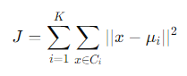
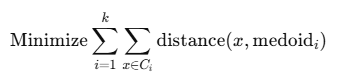
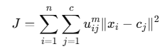
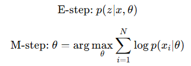
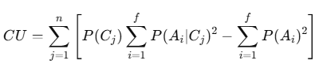
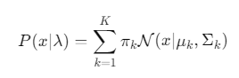
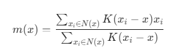
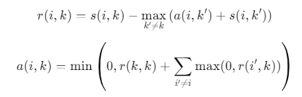
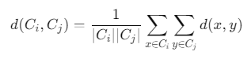

#  10 : 비지도 학습(Unsupervised Learning, UL) : 군집화

---

	[1] Partitioning-Based Clustering
	[1-1] K-means
	[1-2] K-medoids
	[1-3] K-modes
	[1-4] PAM(Partitioning Around Medoids)
	[1-5] CLARANS(Clustering Large Applications based on RANdomized Search)
	[1-6] CLARA(Clustering LARge Applications)
	[1-7] FCM(Fuzzy C-means)

	[2] Hierarchical-Based Clustering
	[2-1] BIRCH(Balanced Iterative Reducing and Clustering using Hierarchies)
	[2-2] CURE(Clustering Using Representatives)
	[2-3] ROCK(Robust Clustering using Links)
	[2-4] Chameleon
	[2-5] Echidna

	[3] Density-Based Clustering
	[3-1] DBSCAN(Density-Based Spatial Clustering of Applications with Noise)	
	[3-2] OPTICS(Ordering Points To Identify the Clustering Structure)
	[3-3] DBCLASD(Distribution Based Clustering of Large Spatial Databases)
	[3-4] DENCLUE(DENsity-based CLUstEring)

 	[4] Grid-Based Clustering
	[4-1] Wave-Cluster
	[4-2] STING(Statistical Information Grid-based method)
	[4-3] CLIQUE(CLustering In QUEst)
	[4-4] OptiGrid

	[5] Model-Based Clustering
	[5-1] EM(Expectation-Maximization)
	[5-2] COBWEB
	[5-3] CLASSIT
	[5-4] SOMs(Self-Organizing Maps)

	[1] 비계층적 클러스터링(Non-Hierarchical Clustering)
	[1-1] k-평균 클러스터링(k-Means Clustering)
	[1-2] 밀도기반 군집화(Density-Based Spatial Clustering of Applications with Noise, DBSCAN)
	[1-3] 가우시안 혼합 모델(Gaussian Mixture Model, GMM)
	[1-4] 평균이동 군집화(Mean-Shift Clustering)
	[1-5] 스펙트럼 군집화(Spectral Clustering)
	[1-6] 군집구조 식별을 위한 점 순서화(Ordering Points To Identify the Clustering Structure, OPTICS)
	[1-7] 친화도 전파(Affinity Propagation)
	[2] 계층적 클러스터링(Hierarchical Clustering)
   
---  

### 클러스터링(k-Means Clustering)이란?
데이터 포인트들을 별개의 군집으로 그룹화하는 것 
유사성이 높은 데이터들을 동일한 그룹으로 분류하고 서로다른 군집들이 상이성을 가지도록 그룹화 
군집화 활용분야 : 고객, 시장, 상품, 경제 및 사회활동 등의 세분화(Segmentation) → 이미지 식별, 이상검출 등 

 

# [1-1] k-평균 클러스터링(k-Means Clustering)
▣ 정의 : 데이터를 K개의 군집으로 나누고 각 군집의 중심점(centroid)을 기준으로 데이터를 반복적으로 할당하는 군집화 알고리즘 

	최초의 군집중심점(centroid) 선정방법

	① Random Initialization : 데이터 포인트 중에서 k개의 점을 무작위로 선택하여 초기 중심점으로 사용
	(간단하지만 결과가 일관되지 않을 가능성)
	② k-means++ 초기화 : 첫 번째 중심점을 무작위로 선택 후, 나머지 중심점은 현재 선택된 중심점에서의 거리가 가장 먼 점을 선택
 	(군집의 분산을 줄이고 수렴 속도를 개선)
	③ 특정 기준에 따라 선택 : 데이터의 분포나 도메인 지식을 바탕으로 특정 기준을 사용하여 초기 중심점을 선정
 
▣ 필요성 : 데이터를 그룹화하여 숨겨진 패턴을 발견하는 데 유용 
▣ 장점 : 구현이 쉽고 간단하고 계산속도가 빠르며, 대규모 데이터셋에 적합(일반적인 군집하에서 가장많이 활용) 
▣ 단점 : 군집의 개수(K)를 사전에 정의해야 하며, 구형 군집이 아니거나 이상치(outliers)가 있을 경우 성능 저하(거리ㄱ기반 알고리즘으로 속성의 수가 많을 경우 군집의 정확도가 떨어지는 단점을 보완하기 위해 PCA로 차원축소 필요) 
▣ 응용분야 : 고객 세분화, 이미지 분할, 추천 시스템 
▣ 모델식 : 𝐾는 군집의 개수, $𝐶_𝑖$는 i번째 군집, $𝜇_𝑖$는 i번째 군집의 중심, 𝑥는 데이터 포인트 

 출처 : https://www.saedsayad.com/clustering_kmeans.htm 

	from sklearn.cluster import KMeans
	from sklearn.datasets import load_iris
	import matplotlib.pyplot as plt

	iris = load_iris()
	X = iris.data

	kmeans = KMeans(n_clusters=3, random_state=0) #n_cluster : 군집화할 개수
	kmeans.fit(X)
	labels = kmeans.labels_ 

	plt.scatter(X[:, 0], X[:, 1], c=labels, cmap='viridis')
	plt.title("K-Means Clustering on Iris Dataset")
	plt.xlabel("Feature 1")
	plt.ylabel("Feature 2")
	plt.show()

 

# [1-2] K-medoids
▣ 정의: K-medoids는 K-means와 유사하지만, 각 군집의 중심을 실제 데이터 포인트(medoid)로 설정함으로써 이상치(outlier)에 더 강하다. 
▣ 필요성: 이상치가 많은 데이터나 노이즈가 있는 데이터에서 K-means의 단점을 보완하여 안정적인 군집화를 제공 
▣ 장점: K-means에 비해 이상치에 덜 민감하고, 군집 중심이 실제 데이터 포인트이기 때문에 해석이 용이 
▣ 단점: 계산이 더 복잡하고 느리며, 비구형 군집을 잘 분류하지 못함 
▣ 응용분야: 의료 데이터 분석, 범주형 데이터가 포함된 고객 세분화 
▣ 모델식: K-medoids는 각 군집의 중심으로 가장 대표적인 포인트(medoid)를 선택하여 군집 내 데이터와의 총 비유사도를 최소화 

	from sklearn.datasets import load_iris
	from sklearn_extra.cluster import KMedoids
	import matplotlib.pyplot as plt
	import seaborn as sns
	import pandas as pd

	# Iris 데이터셋 로드
	iris = load_iris()
	data = iris.data  # 데이터 추출

	# K-medoids 클러스터링 적용 (군집 수: 3)
	kmedoids = KMedoids(n_clusters=3, random_state=0)
	kmedoids_labels = kmedoids.fit_predict(data)  # 데이터에 맞춰 군집화 수행

	# 데이터 프레임으로 변환하여 시각화 준비
	df = pd.DataFrame(data, columns=iris.feature_names)
	df['Cluster'] = kmedoids_labels  # 군집화 결과 추가

	# 시각화
	plt.figure(figsize=(10, 5))
	sns.scatterplot(x=df.iloc[:, 0], y=df.iloc[:, 1], hue='Cluster', data=df, palette='viridis')
	plt.title("K-medoids Clustering on Iris Dataset")
	plt.xlabel(iris.feature_names[0])  # X축: 첫 번째 특징
	plt.ylabel(iris.feature_names[1])  # Y축: 두 번째 특징
	plt.legend(title='Cluster')
	plt.show()

 

# [1-3] K-modes
▣ 정의: K-modes는 범주형 데이터를 클러스터링하기 위해 설계된 알고리즘으로, 각 군집의 중심은 최빈값(mode)으로 결정 
▣ 필요성: 범주형 데이터를 군집화하는 데 유용하며, 일반적인 K-means와는 다른 접근 방식이 필요 
▣ 장점: 범주형 데이터에 특화되어 있으며, K-means와 유사하게 빠르게 계산 
▣ 단점: 범주형이 아닌 수치형 데이터에는 부적합하며, K 값을 사전에 설정해야 함 
▣ 응용분야: 설문 데이터 분석, 고객 세분화에서 범주형 특성을 포함한 군집화 
▣ 모델식: K-modes는 범주형 데이터의 유사도를 측정하기 위해 헴밍 거리(Hamming distance)를 사용합니다. 군집의 중심은 각 속성의 최빈값으로 설정

	from kmodes.kmodes import KModes
	from sklearn.datasets import load_iris
	import pandas as pd

	# Iris 데이터셋 로드 및 범주형 변환
	iris = load_iris()
	data = pd.DataFrame(iris.data, columns=iris.feature_names)

	# 연속형 데이터를 범주형 데이터로 변환 (범위별로 나누어 범주형으로 변경)
	data = data.apply(lambda x: pd.cut(x, bins=3, labels=["Low", "Medium", "High"]))

	# K-modes 모델 생성 (군집 수: 3)
	kmodes = KModes(n_clusters=3, init="Huang", n_init=5, verbose=1)

	# K-modes 군집화 수행
	clusters = kmodes.fit_predict(data)

	# 군집 결과를 데이터 프레임에 추가
	data["Cluster"] = clusters

	# 결과 출력
	print(data.head())

 

# [1-4] PAM(Partitioning Around Medoids)
▣ 정의: K-medoids 알고리즘의 일종으로 각 군집의 중심으로 medoid를 선택. 이상치에 강한 특성을 가지고 있으며, 군집 중심을 실제 데이터 포인트로 설정 
▣ 필요성: 이상치가 많은 데이터셋에서도 안정적인 군집화를 수행할 수 있음 
▣ 장점: K-means에 비해 이상치에 덜 민감합니다. 다양한 거리 측정 방법을 사용할 수 있음 
▣ 단점: 대규모 데이터에서 계산 비용이 높습니다. 군집 수(K)를 사전에 지정해야 함 
▣ 응용분야: 범주형 데이터를 포함한 고객 세분화, 의료 데이터 분석 
▣ 모델식: PAM은 각 군집의 중심으로 가장 대표적인 medoid를 선택하여 군집 내 비유사도를 최소화 

 

# [1-5] CLARANS(Clustering Large Applications based on RANdomized Search)
▣ 정의: PAM(PAM과 K-medoids)의 확장판으로, 대규모 데이터셋에 효율적인 군집화를 제공하기 위해 랜덤화된 탐색 방식을 사용하는 알고리즘. PAM의 전체 데이터셋 탐색 방식 대신 샘플링과 랜덤 선택을 통해 최적의 medoid를 찾는다 
▣ 필요성: PAM의 느린 성능을 보완하여 대규모 데이터에서도 빠르게 클러스터링을 수행할 수 있도록 설계 
▣ 장점: 대규모 데이터셋에 적용할 수 있으며, PAM보다 훨씬 효율적이며, 랜덤 탐색 방식을 통해 최적의 medoid를 빠르게 검색 
▣ 단점: 랜덤화된 탐색을 사용하기 때문에 실행 결과가 매번 다를 수 있으며, PAM과 동일하게 군집 수(K)를 사전에 지정해야 함 
▣ 응용분야: 대규모 고객 세분화, 금융 데이터 분석, 대규모 이미지 및 문서 분류 
▣ 모델식: 전체 데이터셋에서 일부를 랜덤하게 샘플링하여 최적의 medoid를 찾는 방식으로, 기존 PAM의 개념을 대규모 데이터셋에 맞게 확장. 이를 통해 데이터 탐색 과정을 줄이고 효율성을 강화 

 

# [1-6] CLARA(Clustering LARge Applications)
▣ 정의: PAM을 대규모 데이터에 적용할 수 있도록 확장한 알고리즘으로, 데이터의 일부 샘플을 사용하여 군집화를 수행하는 방식. CLARA는 여러 번의 샘플링을 통해 가장 안정적인 medoid를 선택 
▣ 필요성: PAM의 높은 계산 비용을 줄이고자 개발되어 대규모 데이터셋에서도 빠르게 군집화를 수행 
▣ 장점: PAM보다 계산이 효율적이며, 대규모 데이터셋에 적합하며, 표본 기반 접근 방식을 통해 메모리와 시간 효율적 
▣ 단점: 샘플링을 통해 결과의 신뢰도가 낮아질 수 있으며, 전체 데이터셋을 반영하지 못할 가능성. 군집 수(K)를 사전에 지정해야 함 
▣ 응용분야: 대규모 고객 데이터의 군집화, 생물학적 데이터 분석, 시장 조사 데이터의 분석 및 군집화 
▣ 모델식: 데이터셋에서 일부 샘플을 선택하여 PAM을 적용하고, 여러 번 반복 수행하여 최적의 medoid를 찾는다 

 

# [1-7] FCM(Fuzzy C-means) 
▣ 정의: 소프트 군집화 방법으로 각 데이터 포인트가 여러 군집에 속할 수 있으며, 군집 소속 확률을 계산하여 군집을 형성. 데이터가 명확하게 구분되지 않을 때 유용 
▣ 필요성: 데이터가 명확히 구분되지 않는 경우, 각 데이터가 여러 군집에 소속될 수 있도록 허용하여 더욱 유연한 군집화를 제공 
▣ 장점: 데이터를 여러 군집에 걸쳐 소속시킬 수 있어 유연한 군집화가 가능하며 군집 경계가 모호한 데이터에 적합 
▣ 단점: 이상치에 민감하고 초기 중심 설정에 따라 결과가 달라질 수 있으며, 군집 개수와 퍼지 지수(m)를 미리 설정해야 함 
▣ 응용분야: 이미지 분할 및 패턴 인식, 생물학에서 유전자 데이터 군집화, 고객 세분화와 같은 마케팅 분야 
▣ 모델식: 각 데이터 포인트가 군집에 속할 확률(소속도, membership value)을 계산하여 군집화함. 이때 각 군집의 중심과 데이터 포인트 사이의 거리의 역수에 따라 소속도가 결정되며, 목적 함수를 최소화 함. 여기서 $𝑢_{𝑖𝑗}$는 데이터 포인트 $𝑥_𝑖$가 군집 $𝑐_𝑗$에 속할 확률이며, 𝑚은 퍼지 지수로, 군집의 경계를 조정하는 역할을 수행 

	# `fcmeans` 라이브러리가 필요합니다: !pip install fcmeans
	from fcmeans import FCM
	from sklearn.datasets import load_iris
	import matplotlib.pyplot as plt
	import pandas as pd
	import seaborn as sns

	# Iris 데이터셋 로드
	iris = load_iris()
	data = iris.data  # Iris 데이터 추출

	# FCM 클러스터링 적용 (군집 수: 3)
	fcm = FCM(n_clusters=3)  # Fuzzy C-means 인스턴스 생성
	fcm.fit(data)  # 데이터에 맞춰 군집화 수행
	fcm_labels = fcm.predict(data)  # 예측된 군집 레이블

	# 데이터 프레임으로 변환하여 시각화 준비
	df = pd.DataFrame(data, columns=iris.feature_names)
	df['Cluster'] = fcm_labels  # FCM 클러스터 결과 추가

	# 시각화
	plt.figure(figsize=(10, 5))
	sns.scatterplot(x=df.iloc[:, 0], y=df.iloc[:, 1], hue='Cluster', data=df, palette='viridis')
	plt.title("Fuzzy C-means Clustering on Iris Dataset")
	plt.xlabel(iris.feature_names[0])  # X축: 첫 번째 특징
	plt.ylabel(iris.feature_names[1])  # Y축: 두 번째 특징
	plt.legend(title='Cluster')
	plt.show()

 

# [2-1] BIRCH(Balanced Iterative Reducing and Clustering using Hierarchies)
▣ 정의: 대규모 데이터를 효율적으로 군집화할 수 있는 계층적 클러스터링 알고리즘으로, 메모리 사용량을 줄이기 위해 데이터를 압축하는 방식으로 클러스터링을 수행. BIRCH는 데이터를 클러스터링 피처(Clustering Feature, CF) 트리 구조로 유지하여 효율적으로 군집을 형성 
▣ 필요성: 대규모 데이터에서 효율적으로 군집화할 수 있으며, 메모리를 절약하면서도 효과적인 계층적 군집화가 필요할 때 유용 
▣ 장점: 메모리를 절약하면서 대규모 데이터를 처리할 수 있으며 다른 계층적 알고리즘보다 속도가 빠르며, 데이터를 압축하여 군집화 과정을 단순화할 수 있음 
▣ 단점: 군집의 밀도가 고르게 분포된 경우에 더 잘 작동하며, 밀도가 불균일한 경우 성능이 저하될 수 있으며, 초기 매개변수 설정에 따라 성능이 크게 영향을 받을 수 있음 
▣ 응용분야: 대규모 이미지 데이터 군집화, 소셜 네트워크 데이터 분석, 데이터 스트리밍 환경에서 실시간 군집화 
▣ 모델식: 클러스터링 피처(CF)를 사용하여 데이터를 압축하고 계층적으로 군집화(여기서  𝑁은 클러스터의 데이터 포인트 개수, 𝐿𝑆는 각 데이터 포인트의 합계, 𝑆𝑆는 각 데이터 포인트의 제곱 합계이며, 이를 통해 각 클러스터의 중심과 분산을 효율적으로 계산) 
𝐶𝐹 = (𝑁,𝐿𝑆,𝑆𝑆)

	from sklearn.datasets import load_iris
	from sklearn.cluster import Birch
	import matplotlib.pyplot as plt
	import seaborn as sns
	import pandas as pd

	# Iris 데이터셋 로드
	iris = load_iris()
	data = iris.data  # 특징 추출

	# BIRCH 클러스터링 적용 (임의의 임계값 및 군집 수 설정)
	birch = Birch(threshold=0.5, n_clusters=3)  # BIRCH 인스턴스 생성
	birch_labels = birch.fit_predict(data)  # 데이터에 맞춰 군집화 수행

	# 데이터 프레임으로 변환하여 시각화 준비
	df = pd.DataFrame(data, columns=iris.feature_names)
	df['Cluster'] = birch_labels  # BIRCH 클러스터링 결과 추가

	# 시각화
	plt.figure(figsize=(10, 5))
	sns.scatterplot(x=df.iloc[:, 0], y=df.iloc[:, 1], hue='Cluster', data=df, palette='viridis')
	plt.title("BIRCH Clustering on Iris Dataset")
	plt.xlabel(iris.feature_names[0])  # X축: 첫 번째 특징
	plt.ylabel(iris.feature_names[1])  # Y축: 두 번째 특징
	plt.legend(title='Cluster')
	plt.show()

 

# [2-2] CURE(Clustering Using Representatives)
▣ 정의: CURE는 군집을 형성할 때 각 군집의 대표 포인트를 사용하여, 다양한 모양과 크기의 군집을 잘 처리할 수 있도록 설계된 계층적 군집화 알고리즘입니다. 군집의 대표 포인트들은 군집 내에서 멀리 떨어진 여러 위치에 배치되어 전체 군집의 분포를 나타냅니다.
▣ 필요성: 군집의 형태나 크기가 다양한 데이터에서 군집을 보다 정확하게 구분할 수 있도록 돕습니다.
▣ 장점: 다양한 형태와 크기의 군집을 효과적으로 탐지할 수 있습니다. 노이즈에 강하고, 이상치의 영향을 적게 받습니다.
▣ 단점: 대규모 데이터에서는 계산 비용이 높습니다. 군집 내 대표 포인트의 개수와 축소 비율 등의 매개변수 설정이 필요합니다.
▣ 응용분야: 지리적 데이터 분석. 대규모 네트워크 데이터에서 커뮤니티 탐색. 유전자 데이터의 군집화.
▣ 모델식: CURE는 각 군집의 대표 포인트를 지정하고, 이를 기반으로 다른 군집과의 거리를 계산하여 군집을 형성합니다. 군집 내의 대표 포인트들은 군집 중심에서 일정 비율로 축소되며, 여러 개의 대표 포인트를 통해 군집의 분포를 표현합니다.

 

# [2-3] ROCK(Robust Clustering using Links)
▣ 정의: ROCK은 범주형 데이터에서 유사한 항목을 군집화하는 데 최적화된 계층적 군집화 알고리즘입니다. 각 데이터 포인트 간의 연결(link)을 기반으로 군집의 밀도를 측정하여 군집을 형성합니다.
▣ 필요성: 범주형 데이터와 같이 명확한 거리 계산이 어려운 경우, 데이터 간의 연결 수를 기반으로 군집화를 수행하는 데 유용합니다.
▣ 장점: 범주형 데이터에 특화되어 있어, 범주형 특성을 잘 반영한 군집화를 수행할 수 있습니다. 밀도가 높은 군집을 잘 탐지할 수 있습니다.
▣ 단점: 계산 비용이 높아 대규모 데이터셋에는 적합하지 않습니다. 거리 계산보다 연결 기반 군집화가 복잡할 수 있습니다.
▣ 응용분야: 추천 시스템. 문서 분류 및 텍스트 마이닝. 범주형 속성이 많은 데이터의 군집화.
▣ 모델식: ROCK은 데이터 포인트 간의 연결을 기반으로 군집을 형성하며, 연결의 개수를 기반으로 군집 간의 유사성을 측정하여 군집화합니다.

 

# [2-4] Chameleon
▣ 정의: Chameleon은 데이터의 지역적 밀도와 모양을 고려하여 유사성을 계산하여 군집을 형성하는 계층적 군집화 알고리즘입니다. 이 알고리즘은 군집을 나누는 두 단계로 나뉩니다: 초기 분할과 동적 병합 단계입니다.
▣ 필요성: 다양한 모양과 밀도의 군집이 있는 데이터에서 군집화를 수행할 때 유용합니다.
▣ 장점: 군집의 밀도와 모양을 고려하여 다양한 군집 구조를 잘 탐지할 수 있습니다. 다른 계층적 군집화보다 유연한 군집화를 제공합니다.
▣ 단점: 계산 비용이 매우 높으며, 대규모 데이터셋에서는 실행이 어려울 수 있습니다. 초기 클러스터링과 병합 기준을 설정하는 것이 어렵습니다.
▣ 응용분야: 소셜 네트워크에서 커뮤니티 탐색. 비정형 데이터 분석. 웹 문서 분류.
▣ 모델식: Chameleon은 두 단계로 군집을 형성합니다. 첫째, 데이터를 작은 초기 군집으로 나누고, 둘째, 유사한 군집을 동적으로 병합하여 최종 군집을 형성합니다.

 

# [2-5] Echidna
▣ 정의: Echidna는 다차원 공간에서 밀도의 변화를 기반으로 다양한 특성을 가진 데이터셋의 지역적 군집을 탐색하는 계층적 군집화 알고리즘입니다. 이 알고리즘은 밀도가 고르게 분포되지 않는 데이터를 군집화하는 데 적합합니다.
▣ 필요성: 밀도가 불균일한 데이터에서 지역적 밀도 차이를 반영하여 군집을 탐색하고자 할 때 유용합니다. 특히 데이터셋이 다양한 밀도와 크기의 군집을 포함할 때 효과적입니다.
▣ 장점: 다양한 밀도와 크기의 군집을 탐색할 수 있는 유연한 군집화가 가능합니다. 밀도 변화에 적응할 수 있어, 밀도가 불균일한 데이터를 잘 처리합니다.
▣ 단점: 계산이 복잡하여 대규모 데이터셋에서는 속도가 느립니다. 초기 밀도 기준과 군집 형성 기준을 설정하기가 어렵습니다.
▣ 응용분야: 환경 모니터링 센서 데이터 분석. 지리적 데이터에서 지역 군집 탐색. 비정형 데이터의 군집화, 예를 들어 분자 구조의 군집화.
▣ 모델식: Echidna는 각 데이터 포인트의 밀도를 기반으로 군집을 형성합니다. 군집화 과정에서 지역 밀도 변화와 포인트 간의 거리 정보를 결합하여 유사성을 측정합니다. 구체적인 수식은 이론마다 다를 수 있으며, 밀도 기반 지역 군집을 탐색하기 위해 다양한 거리와 밀도 척도를 조합하여 사용합니다.

 

# [3-1] DBSCAN(Density-Based Spatial Clustering of Applications with Noise)
▣ 정의 : 밀도가 높은 영역을 군집으로 묶고, 밀도가 낮은 점들은 노이즈로 간주하는 밀도 기반 군집화 알고리즘 
▣ 필요성 : 다양한 밀도의 데이터 군집화 및 이상치 탐지에 유용 
▣ 장점 : 군집의 개수를 사전 설정할 필요 없으며, 이상치(outliers)를 자연스럽게 처리 가능 
▣ 단점 : 적절한 파라미터(ε, MinPts) 설정이 필요하며, 밀도가 균일하지 않은 데이터에 부적합 
▣ 응용분야 : 이상 탐지, 지리적 데이터 분석 
▣ 모델식: 각 점에서 반경 𝜖 내에 있는 점들이 미리 정의된 MinPts 보다 많으면 그 점을 중심으로 군집을 형성 

	from sklearn.cluster import DBSCAN
	from sklearn.datasets import load_iris
	import matplotlib.pyplot as plt

	iris = load_iris()
	X = iris.data

	dbscan = DBSCAN(eps=0.5, min_samples=5)
	labels = dbscan.fit_predict(X)

	plt.scatter(X[:, 0], X[:, 1], c=labels, cmap='plasma')
	plt.title("DBSCAN Clustering on Iris Dataset")
	plt.xlabel("Feature 1")
	plt.ylabel("Feature 2")
	plt.show()

 

# [3-2] OPTICS(Ordering Points To Identify the Clustering Structure)
▣ 정의 : 밀도 기반 군집화(DBSCAN)의 확장으로, 여러 밀도 수준에서 데이터의 군집 구조를 식별할 수 있는 알고리즘 
▣ 필요성 : 다양한 밀도를 가진 데이터에서 군집을 찾아내고 이상치(outliers)를 처리할 때 유용 
▣ 장점 : DBSCAN과 유사하게 이상치를 감지할 수 있으며, 여러 밀도 수준에서 군집을 식별 가능 
▣ 단점 : 계산 시간이 오래 걸릴 수 있으며, 적절한 매개변수 설정이 어려울 수 있음 
▣ 응용분야 : 지리적 데이터 분석, 이상치 탐지 
▣ 모델식 : DBSCAN과 유사하게 밀도 기반 접근을 따르며, 각 데이터 포인트의 reachability-distance와 core-distance를 기반으로 군집구조 형성 

	from sklearn.cluster import OPTICS
	from sklearn.datasets import load_iris
	import matplotlib.pyplot as plt

	iris = load_iris()
	X = iris.data

	optics = OPTICS(min_samples=5)
	labels = optics.fit_predict(X)

	plt.scatter(X[:, 0], X[:, 1], c=labels, cmap='plasma')
	plt.title("OPTICS Clustering on Iris Dataset")
	plt.xlabel("Feature 1")
	plt.ylabel("Feature 2")
	plt.show()

 

# [3-3] DBCLASD(Distribution Based Clustering of Large Spatial Databases)
▣ 정의: DBCLASD는 확률 밀도를 기반으로 클러스터를 찾는 밀도 기반 알고리즘입니다. DBCLASD는 데이터를 다양한 확률 분포로 모델링하고, 공간 데이터베이스에서 높은 밀도를 가진 데이터 군집을 찾습니다.
▣ 필요성: 대규모 공간 데이터베이스에서 밀도에 기반한 군집을 찾고자 할 때 유용하며, 데이터의 확률 분포를 활용해 정확한 군집을 탐색할 수 있습니다.
▣ 장점: 공간 데이터에서 군집화를 효과적으로 수행할 수 있습니다. 노이즈가 포함된 데이터에서 강건한 군집화가 가능합니다.
▣ 단점: 설정된 확률 분포가 데이터와 일치하지 않으면 군집화가 부정확할 수 있습니다. 대규모 데이터셋에서는 계산 비용이 높습니다.
▣ 응용분야: 지리적 데이터베이스 분석. 공간 데이터에서 밀도 기반 군집화. 이상 탐지 및 밀도 기반 패턴 탐색.
▣ 모델식: DBCLASD는 각 데이터 포인트의 확률 밀도를 기반으로 군집을 형성하며, 확률 밀도는 주어진 확률 분포 모델을 사용해 계산됩니다.

 

# [3-4] DENCLUE(DENsity-based CLUstEring)
▣ 정의: DENCLUE는 확률 밀도 함수를 기반으로 데이터의 밀도 분포를 모델링하여 군집을 형성하는 밀도 기반 클러스터링 알고리즘입니다. 핵심 아이디어는 데이터 포인트가 모여서 형성하는 밀도 함수에서 밀도가 높은 영역을 군집으로 형성하는 것입니다.
▣ 필요성: 데이터의 밀도 구조를 기반으로 군집화하고, 노이즈나 이상치를 효과적으로 구분할 필요가 있을 때 유용합니다.
▣ 장점: 명확하게 정의된 군집을 생성하고, 밀도가 낮은 지역을 노이즈로 구분할 수 있습니다. 데이터 분포에 따라 다양한 밀도의 군집을 잘 탐지할 수 있습니다.
▣ 단점: 밀도 함수를 설정하는 데 필요한 매개변수가 많습니다. 계산이 복잡하여 대규모 데이터에서는 성능이 저하될 수 있습니다.
▣ 응용분야: 패턴 인식 및 이미지 처리. 데이터 마이닝에서 밀도 기반 패턴 탐색. 환경 모니터링 데이터 분석.
▣ 모델식: DENCLUE는 각 데이터 포인트의 밀도 기여를 가우시안 커널 등으로 모델링하여 밀도 함수를 계산합니다. 군집은 밀도 함수의 극대점에서 시작하여 군집화됩니다.

 

# [4-1] Wave-Cluster
▣ 정의: Wave-Cluster는 웨이블릿 변환을 이용한 클러스터링 알고리즘으로, 데이터를 격자 형태로 나눈 후 웨이블릿 변환을 사용해 밀도가 높은 영역을 군집으로 탐지합니다.
▣ 필요성: 대규모 데이터에서 효율적으로 군집화가 가능하며, 다차원 공간에서 다양한 밀도의 군집을 식별하는 데 유용합니다.
▣ 장점: 다차원 데이터에서 다양한 모양의 군집을 효과적으로 탐지할 수 있습니다. 노이즈와 이상치를 효과적으로 제거할 수 있습니다.
▣ 단점: 적절한 웨이블릿 변환 파라미터를 설정하기 어렵습니다. 데이터의 해상도와 격자 크기에 따라 군집 결과가 달라질 수 있습니다.
▣ 응용분야: 이미지 분석. 영상 처리 및 패턴 인식. 대규모 지리 데이터 분석.
▣ 모델식: Wave-Cluster는 각 격자에서 웨이블릿 변환을 수행하여 밀도가 높은 클러스터 영역을 식별합니다. 웨이블릿 변환을 통해 고주파와 저주파 성분을 분리하여 노이즈와 이상치를 제거하고, 밀도가 높은 영역을 군집으로 형성합니다.

 

# [4-2] STING(Statistical Information Grid-based method)
▣ 정의: STING은 데이터 공간을 격자 형태로 나누고, 각 격자의 통계 정보를 사용하여 계층적으로 군집을 형성하는 알고리즘입니다. 격자는 여러 계층으로 나뉘며, 상위 계층에서 하위 계층으로 내려가며 데이터의 밀도를 분석합니다.
▣ 필요성: 대규모 데이터셋을 효율적으로 군집화할 수 있으며, 특히 데이터의 밀도 분포를 고려하여 계층적 클러스터링을 수행할 수 있습니다.
▣ 장점: 대규모 데이터에서 빠르게 군집화할 수 있습니다. 각 격자의 통계 정보를 기반으로 하여 효율적인 군집화가 가능합니다.
▣ 단점: 격자 해상도가 낮을 경우, 세부적인 군집을 탐지하기 어려울 수 있습니다. 밀도가 낮은 데이터에서는 효과가 떨어질 수 있습니다.
▣ 응용분야: 위성 이미지 분석. 지리 데이터와 환경 데이터의 군집화. 데이터 마이닝에서 대규모 데이터 분석.
▣ 모델식: STING은 격자를 계층적으로 나누고, 각 격자의 통계 정보(평균, 분산 등)를 기반으로 군집을 형성합니다. 격자의 통계 정보는 상위 계층에서 하위 계층으로 전파되며, 밀도 기반 군집화를 수행합니다.

 

# [4-3] CLIQUE(CLustering In QUEst)
▣ 정의: CLIQUE는 데이터 공간을 격자로 나누고, 각 격자 내에서 데이터의 밀도에 따라 군집을 형성하는 알고리즘입니다. CLIQUE는 고차원 데이터에서 군집을 식별하기 위해 밀도가 높은 부분 공간(subspace)을 찾아 군집을 형성합니다.
▣ 필요성: 고차원 데이터에서 밀도 기반 군집화를 수행하며, 데이터의 다양한 부분 공간에서 군집을 탐색할 필요가 있을 때 유용합니다.
▣ 장점: 고차원 데이터에서 부분 공간을 기반으로 군집을 탐색할 수 있습니다. 데이터의 밀도를 기준으로 군집을 식별할 수 있습니다.
▣ 단점: 격자 크기와 밀도 임계값 설정이 어렵습니다. 결과가 설정된 파라미터에 민감하게 반응합니다.
▣ 응용분야: 생물학에서 유전자 데이터 군집화. 고차원 금융 데이터 분석. 이미지 분할 및 텍스트 데이터 분석.
▣ 모델식: CLIQUE는 데이터를 격자로 나눈 후, 밀도가 높은 부분 공간을 탐색하여 군집을 형성합니다. 군집은 각 부분 공간에서 밀도가 임계값 이상인 격자들로 구성됩

 

# [4-4] OptiGrid
▣ 정의: OptiGrid는 데이터 공간을 최적화된 격자 형태로 분할하여 밀도 기반 군집화를 수행하는 알고리즘입니다. OptiGrid는 각 차원에서 최적의 격자 분할을 탐색하여, 밀도가 높은 지역을 군집으로 형성합니다.
▣ 필요성: 데이터 분포에 따라 최적의 격자 분할을 통해 군집을 탐색하며, 특히 데이터의 밀도가 불균일한 경우에 유용합니다.
▣ 장점: 데이터 밀도에 따라 유연하게 격자를 조정하여 군집을 형성합니다. 불균일한 데이터에서도 적응적 군집화를 수행할 수 있습니다.
▣ 단점: 최적의 격자 분할을 찾는 과정에서 계산 비용이 높습니다. 파라미터 설정이 복잡하고, 데이터 분포에 민감할 수 있습니다.
▣ 응용분야: 의료 데이터의 군집화. 데이터 마이닝에서 불균일한 데이터 탐색. 지리적 데이터에서 지역적 군집 탐색.
▣ 모델식: OptiGrid는 각 차원에서 최적의 격자 분할을 탐색하여 군집을 형성합니다. 격자 내 밀도를 기준으로 최적의 분할 위치를 찾아내고, 밀도가 높은 격자들을 군집으로 형성합니다.

 

# [5-1] EM(Expectation-Maximization)
▣ 정의: EM(Expectation-Maximization) 알고리즘은 데이터가 여러 개의 잠재 확률 분포(보통 가우시안)에서 생성되었다고 가정하여, 데이터를 여러 분포로 모델링하는 방법입니다. EM은 각 데이터 포인트가 여러 군집에 속할 확률을 계산해 소프트 군집화를 제공합니다.
▣ 필요성: 데이터가 다양한 확률 분포로 구성되어 있을 때, 군집의 경계를 유연하게 설정할 수 있어 더욱 정확한 군집화가 가능합니다.
▣ 장점: 소프트 군집화가 가능하여 데이터가 여러 군집에 속할 확률을 제공합니다. 군집의 크기와 모양이 다른 경우에도 적합합니다.
▣ 단점: 초기 매개변수 설정에 따라 결과가 크게 달라질 수 있습니다. 고차원 데이터에서는 계산 비용이 높아집니다.
▣ 응용분야: 음성 및 영상 인식. 이미지 처리. 금융 및 마케팅에서의 사용자 세분화.
▣ 모델식: EM 알고리즘은 E 단계와 M 단계를 반복하여 수렴할 때까지 최적의 매개변수를 찾아갑니다.
E 단계: 각 데이터 포인트가 특정 군집에 속할 확률을 계산합니다.
M 단계: 이 확률을 사용하여 각 군집의 매개변수를 업데이트합니다.

	from sklearn.datasets import load_iris
	from sklearn.mixture import GaussianMixture
	import matplotlib.pyplot as plt
	import seaborn as sns
	import pandas as pd

	# Iris 데이터셋 로드
	iris = load_iris()
	data = iris.data  # Iris 데이터의 특징 추출

	# Gaussian Mixture Model(GMM) 적용
	gmm = GaussianMixture(n_components=3, random_state=0)  # GMM 인스턴스 생성
	gmm_labels = gmm.fit_predict(data)  # 데이터에 맞춰 군집화 수행

	# 데이터 프레임으로 변환하여 시각화 준비
	df = pd.DataFrame(data, columns=iris.feature_names)
	df['Cluster'] = gmm_labels  # GMM 군집화 결과 추가

	# 시각화
	plt.figure(figsize=(10, 5))
	sns.scatterplot(x=df.iloc[:, 0], y=df.iloc[:, 1], hue='Cluster', data=df, palette='viridis')
	plt.title("Gaussian Mixture Model Clustering on Iris Dataset")
	plt.xlabel(iris.feature_names[0])  # X축: 첫 번째 특징
	plt.ylabel(iris.feature_names[1])  # Y축: 두 번째 특징
	plt.legend(title='Cluster')
	plt.show()

 

# [5-2] COBWEB
▣ 정의: COBWEB은 개념 형성을 기반으로 하는 계층적 군집화 알고리즘으로, 각각의 노드가 개념을 나타내는 분류 트리를 생성하여 새로운 데이터를 점진적으로 학습합니다. 범주형 데이터에 특히 적합한 알고리즘입니다.
▣ 필요성: 점진적으로 데이터를 학습하고 분류해야 하는 경우에 유용하며, 계층 구조로 데이터를 군집화하여 개념 형성을 수행할 수 있습니다.
▣ 장점: 범주형 데이터 및 혼합형 데이터에 적합합니다. 점진적으로 학습하며, 새로운 데이터가 들어올 때마다 즉시 업데이트 가능합니다.
▣ 단점: 데이터 입력 순서에 따라 결과가 달라질 수 있습니다. 대규모 데이터에서는 성능이 떨어질 수 있으며, 노이즈에 민감합니다.
▣ 응용분야: 문서 분류. 개념 형성을 통한 인공지능 학습. 시장 세분화에서의 고객 분류.
▣ 모델식: COBWEB은 각 노드의 범주 유틸리티(Category Utility, CU)를 기반으로 데이터를 분류하며, CU는 다음과 같이 계산됩니다.

 

# [5-3] CLASSIT
▣ 정의: CLASSIT은 COBWEB을 확장하여 수치형 데이터를 지원하는 계층적 군집화 알고리즘입니다. CLASSIT은 점진적으로 데이터를 군집화하여 계층적인 구조를 형성합니다.
▣ 필요성: 데이터의 속성이 주기적으로 업데이트되는 환경에서 실시간 군집화를 수행할 수 있습니다.
▣ 장점: 수치형 데이터와 범주형 데이터 모두 처리할 수 있습니다. 점진적 학습이 가능하여 실시간 데이터에 적합합니다.
▣ 단점: 데이터 입력 순서에 따라 결과가 달라질 수 있습니다. 대규모 데이터에서는 성능이 떨어질 수 있으며, 매개변수 설정이 어렵습니다.
▣ 응용분야: 실시간 데이터 분석. 유전자 및 생물학적 데이터 분석. 시계열 데이터 분석.
▣ 모델식: CLASSIT은 COBWEB의 Category Utility를 변형하여 수치형 데이터를 처리할 수 있도록 설계되었습니다. 평균 및 분산을 기반으로 군집의 경계를 정의하여 데이터를 그룹화합니다.

 

# [5-4] SOMs(Self-Organizing Maps)
▣ 정의: SOM은 고차원 데이터를 저차원(주로 2D) 공간에 매핑하여 시각화하는 신경망 기반의 군집화 알고리즘입니다. SOM은 입력 데이터 간의 관계를 보존하며, 비지도 학습으로 데이터의 구조를 학습합니다.
▣ 필요성: 고차원 데이터의 시각화가 필요할 때 유용하며, 데이터의 분포 및 구조를 이해하는 데 사용됩니다.
▣ 장점: 고차원 데이터를 저차원으로 변환하여 시각화할 수 있습니다. 데이터의 구조를 보존하여 패턴을 인식하기에 유리합니다.
▣ 단점: 학습률, 이웃 크기 등의 매개변수를 조정하기가 어렵습니다. 명확한 군집화보다는 데이터 맵을 생성하여 군집의 경계가 모호할 수 있습니다.
▣ 응용분야: 데이터 시각화 및 차원 축소. 이미지 및 패턴 인식. 시장 분석 및 소비자 행동 분석.
▣ 모델식: SOM은 데이터 포인트를 반복적으로 매핑하여 입력 벡터에 가장 가까운 노드(위너)를 찾고, 그 주변 노드들의 가중치를 갱신하는 방식으로 학습합니다.

	# `MiniSom` 라이브러리가 필요합니다: !pip install MiniSom
	from minisom import MiniSom
	from sklearn.datasets import load_iris
	import matplotlib.pyplot as plt
	import pandas as pd

	# Iris 데이터셋 로드
	iris = load_iris()
	data = iris.data  # Iris 데이터 추출

	# SOM 초기화 및 학습
	som = MiniSom(x=10, y=10, input_len=4, sigma=1.0, learning_rate=0.5)  # SOM 인스턴스 생성
	som.random_weights_init(data)  # 가중치 초기화
	som.train_random(data, 100)  # 100번 반복하여 학습 수행

	# 시각화 준비
	plt.figure(figsize=(10, 10))
	for i, x in enumerate(data):  # 데이터 포인트 반복
    	w = som.winner(x)  # 최적의 노드(위너) 찾기
    	plt.text(w[0], w[1], str(iris.target[i]), color=plt.cm.tab10(iris.target[i] / 2))  # 클러스터 레이블 추가
	plt.title("Self-Organizing Map for Iris Dataset")

 

# [1-3] 가우시안 혼합 모델(Gaussian Mixture Model, GMM)
▣ 정의 : 여러 가우시안 분포(Gaussian Distribution)를 사용해 데이터를 모델링하고, 각 데이터 포인트가 각 분포에 속할 확률을 계산하는 군집화 방법 
▣ 필요성 : 복잡한 데이터 분포를 유연하게 모델링하여 군집 경계를 확률적으로 표현할 수 있음 
▣ 장점 : 데이터가 여러 분포를 따를 때 적합하며, 군집 간의 경계가 확률적으로 처리 
▣ 단점 : 초기화에 민감하고 계산 비용이 높음 
▣ 응용분야 : 패턴 인식, 이미지 세분화 
▣ 모델식 : $π_k$는 가우시안의 가중치, $𝜇_𝑘$, $Σ_𝑘$는 각각 평균과 공분산 

	from sklearn.mixture import GaussianMixture
	from sklearn.datasets import load_iris
	import matplotlib.pyplot as plt

	iris = load_iris()
	X = iris.data

	gmm = GaussianMixture(n_components=3)
	gmm.fit(X)
	labels = gmm.predict(X)

	plt.scatter(X[:, 0], X[:, 1], c=labels, cmap='rainbow')
	plt.title("GMM Clustering on Iris Dataset")
	plt.xlabel("Feature 1")
	plt.ylabel("Feature 2")
	plt.show()

 

# [1-4] 평균이동 군집화(Mean-Shift Clustering)
▣ 정의 : 데이터의 밀도가 높은 방향으로 이동하며 군집의 중심을 찾는 비모수 군집화 방법 
▣ 필요성 : 군집의 개수를 사전 설정할 필요 없이 자연스러운 군집을 찾을 때 유용 
▣ 장점 : 군집 개수 사전 설정 불필요하며, 비선형적 분포에도 적합 
▣ 단점 : 계산 비용이 크고 고차원 데이터에 적합하지 않음 
▣ 응용분야 : 이미지 세그멘테이션, 객체 추적 
▣ 모델식 : 𝐾는 커널 함수, 𝑥는 이동할 점, 𝑁(𝑥)는 반경 내 이웃 점 

	from sklearn.cluster import MeanShift
	from sklearn.datasets import load_iris
	import matplotlib.pyplot as plt

	iris = load_iris()
	X = iris.data

	mean_shift = MeanShift()
	labels = mean_shift.fit_predict(X)

	plt.scatter(X[:, 0], X[:, 1], c=labels, cmap='cool')
	plt.title("Mean-Shift Clustering on Iris Dataset")
	plt.xlabel("Feature 1")
	plt.ylabel("Feature 2")
	plt.show()

 

# [1-5] 스펙트럼 군집화(Spectral Clustering)
▣ 정의 : 그래프 이론을 기반으로 데이터의 유사도 행렬(Similarity Matrix)을 사용해 저차원 공간에서 군집을 찾는 알고리즘 
▣ 필요성 : 복잡한 구조를 가진 데이터에서 비선형적인 경계를 정의할 수 있는 군집화 방법이 필요할 때 유용 
▣ 장점 : 비선형적인 데이터에도 유용하며, 전통적인 군집화 알고리즘보다 복잡한 데이터 구조 처리 가능 
▣ 단점 : 유사도 행렬을 계산해야 하므로 메모리 사용량이 크고, 대규모 데이터에 비효율적 
▣ 응용분야 : 이미지 분할, 네트워크 분석 
▣ 모델식 : 𝐿은 라플라시안 행렬, 𝐷는 대각 행렬(각 노드의 차수), 𝐴는 인접 행렬(이 라플라시안 행렬의 고유벡터를 사용해 데이터를 군집화) 
$𝐿=𝐷−𝐴$ 

	from sklearn.cluster import SpectralClustering
	from sklearn.datasets import load_iris
	import matplotlib.pyplot as plt

	iris = load_iris()
	X = iris.data

	spectral = SpectralClustering(n_clusters=3, affinity='nearest_neighbors', random_state=0)
	labels = spectral.fit_predict(X)

	plt.scatter(X[:, 0], X[:, 1], c=labels, cmap='coolwarm')
	plt.title("Spectral Clustering on Iris Dataset")
	plt.xlabel("Feature 1")
	plt.ylabel("Feature 2")
	plt.show()

 

# [1-7] 친화도 전파(Affinity Propagation)
▣ 정의 : 데이터 간의 유사도(similarity) 행렬을 사용해 가장 적합한 중심(exemplar)을 선택하여 군집을 형성하는 알고리즘 
▣ 필요성 : 군집의 개수를 미리 정할 필요 없이 데이터의 유사도에 기반해 자연스럽게 군집을 찾을 수 있음 
▣ 장점 : 군집 개수를 사전에 정의할 필요 없으며, 유사도에 기반한 군집화로 군집 경계가 더 명확할 수 있음 
▣ 단점 : 계산 비용이 크고 큰 데이터셋에서는 느릴 수 있음 
▣ 응용분야 : 이미지 분할, 문서 분류 
▣ 모델식: 각 데이터 포인트 간의 유사도 𝑠(𝑖,𝑘)와 책임 𝑟(𝑖,𝑘), 가용도 𝑎(𝑖,𝑘)를 반복적으로 계산해 중심점을 결정 

	from sklearn.cluster import AffinityPropagation
	from sklearn.datasets import load_iris
	import matplotlib.pyplot as plt

	iris = load_iris()
	X = iris.data

	affinity_propagation = AffinityPropagation(random_state=0)
	labels = affinity_propagation.fit_predict(X)

	plt.scatter(X[:, 0], X[:, 1], c=labels, cmap='rainbow')
	plt.title("Affinity Propagation Clustering on Iris Dataset")
	plt.xlabel("Feature 1")
	plt.ylabel("Feature 2")
	plt.show()

 

# [2] 계층적 클러스터링(Hierarchical Clustering)
▣ 정의 : 데이터를 병합(bottom-up)하거나 분할(top-down)하여 계층적인 군집 구조를 만드는 방법 
▣ 필요성 : 군집의 개수를 사전에 정할 필요 없이 계층적 관계를 파악할 때 사용 
▣ 장점 : 군집 수를 미리 정할 필요 없으며, 덴드로그램(dendrogram)을 통한 군집 분석 가능 
▣ 단점 : 계산 복잡도가 높으며, 초기 병합 또는 분할 결정이 최종 결과에 영향을 줄 수 있음 
▣ 응용분야 : 계통수 분석, 텍스트 및 문서 분류  
▣ 모델식 : $𝐶_𝑖$와 $𝐶_𝑗$는 각각 두 군집이고, 𝑑(𝑥,𝑦)는 두 데이터 포인트 𝑥와 𝑦 간의 거리 

	from scipy.cluster.hierarchy import dendrogram, linkage
	import matplotlib.pyplot as plt
	from sklearn.datasets import load_iris

	iris = load_iris()
	X = iris.data

	Z = linkage(X, 'ward')  # ward: 최소분산 기준 병합

	plt.figure(figsize=(10, 5))
	dendrogram(Z)
	plt.title("Hierarchical Clustering Dendrogram")
	plt.xlabel("Sample Index")
	plt.ylabel("Distance")
	plt.show()

▣ 덴드로그램(dendrogram) : 나무(tree) 모양의 도식으로, 계층적 군집화의 결과를 시각화하는 데 사용된다. 이 그래프는 각 데이터 포인트가 병합되거나 분할되는 과정을 계층 구조로 표현하며, 군집 간의 관계를 직관적으로 이해할 수 있도록 도와준다. 덴드로그램의 구조는 다음과 같다: 
(1) 각 데이터 포인트는 맨 아래에서 개별 노드로 시작 : 덴드로그램에서 각 데이터 포인트는 맨 아래에 위치한 개별 노드로 시작합니다. 이 단계에서는 각각의 데이터가 하나의 군집을 이루고 있다. 
(2) 데이터 포인트들이 병합 : 계층적 군집화의 과정에서 유사한 데이터 포인트끼리 순차적으로 병합되며, 병합되는 과정이 덴드로그램에서 상위로 올라가면서 두 노드가 연결되는 형태로 시각화 된다. 
(3) 병합된 군집이 다시 다른 군집과 병합 : 유사한 군집끼리 계속 병합되며 점점 더 큰 군집을 형성하게 된다. 덴드로그램의 상단으로 갈수록 더 큰 군집이 병합된 결과를 나타내며, 결국 모든 데이터가 하나의 군집으로 병합된다. 
(4) 군집 간의 거리 정보: 덴드로그램에서 두 군집이 병합된 높이(수직 축)는 그 두 군집 사이의 유사도 또는 거리를 나타낸다. 즉, 병합된 높이가 클수록 두 군집 간의 거리가 더 멀었다는 것을 의미합니다. 이는 데이터를 나누거나 군집을 형성하는 데 있어 중요한 기준이 된다. 
덴드로그램의 장점은 다음과 같다: 
(1) 군집의 개수 선택이 유연 : 덴드로그램을 통해 데이터가 어떻게 군집화되었는지 시각적으로 확인한 후, 임의의 높이에서 선을 그어 군집의 개수를 선택할 수 있다. 특정 높이에서 덴드로그램을 자르면 그 높이 기준으로 몇 개의 군집이 형성되는지를 알 수 있으며 이로 인해 군집의 개수를 미리 결정하지 않고도 군집을 형성할 수 있다. 예를 들어, 덴드로그램에서 각 군집 간의 유사도가 높지 않다고 판단되는 지점에서 잘라내면 다수의 작은 군집이 만들어질 수 있고, 반대로 유사도가 높다고 판단되는 지점에서 자르면 소수의 큰 군집이 형성될 수 있다. 
(2) 군집 간의 유사도 및 계층 구조 파악 : 덴드로그램은 단순히 군집을 나누는 것 이상으로 군집 간의 유사도와 계층적 관계를 직관적으로 보여준다. 이를 통해 두 군집이 병합되는 시점과 그 군집들이 다른 군집들과 얼마나 유사한지를 파악하고 이 정보를 바탕으로 군집화 결과를 더욱 상세하게 해석할 수 있다. 
(3) 다양한 수준에서 군집 분석 가능 : 덴드로그램을 활용하면 데이터셋을 다양한 수준에서 분석할 수 있다. 특정 높이에서 군집을 잘라내면 더 큰 군집을 형성할 수 있고, 더 낮은 높이에서는 세부적인 군집을 식별함으로써 다단계 군집 분석을 가능하게 한다. 
(4) 군집의 구조적 관계 시각화 : 덴드로그램을 통해 데이터를 계층적으로 군집화한 결과를 시각적으로 확인함으로써 데이터가 점진적으로 어떻게 병합되는지, 그리고 군집화가 특정 기준에 따라 어떻게 변하는지를 쉽게 이해할 수 있다. 

	from scipy.cluster.hierarchy import dendrogram, linkage
	from sklearn.datasets import load_iris
	import matplotlib.pyplot as plt

	# 데이터 로드
	iris = load_iris()
	X = iris.data

	# 계층적 군집화 수행
	Z = linkage(X, 'ward')  # ward: 최소분산 기준 병합

	# 덴드로그램 시각화
	plt.figure(figsize=(10, 5))
	dendrogram(Z)
	plt.title("Hierarchical Clustering Dendrogram")
	plt.xlabel("Sample Index")
	plt.ylabel("Distance")
	plt.show()

 
 
