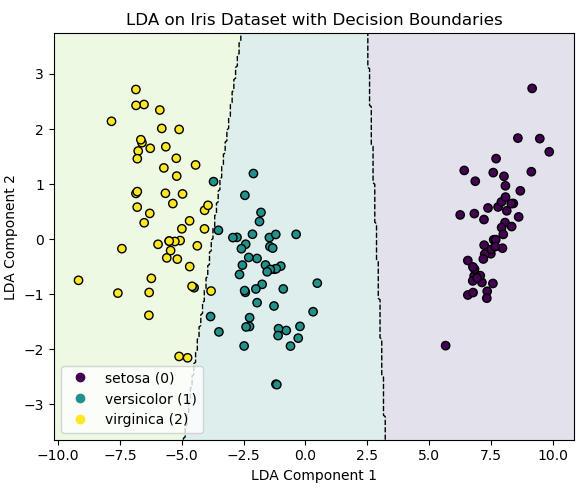

#  11 : 지도 학습(Supervised Learning, SL) : 회귀(regression) + 분류(classification)

---

	[1] 판별 분석 (Discriminant Analysis)
		[1-1] LDA (Linear Discriminant Analysis)
		[1-2] QDA (Quadratic Discriminant Analysis)
		
	[2] 트리 기반 (Tree-based)
		[2-1] 결정 트리 (Decision Tree)
		[2-2] 랜덤 포레스트 (Random Forest)
		
	[3] 거리 기반 (Distance-based)
		[3-1] k-최근접 이웃 (k-Nearest Neighbors, K-NN)
		[3-2] 서포트 벡터 머신 (Support Vector Machine, SVM)
		
	신경망 기반
		MLP, CNN, RNN, LSTM, GRU, Attention Mechanism, Transformer, Autoencoder, VAE, GAN, GCN ...
		
	[4] 차원 축소 (Dimensionality Reduction)
		[4-1] PCR (Principal Component Regression) : PCA(비지도학습의 차원축소) + 회귀
		[4-2] PLS (Partial Least Squares)
		[4-3] PLS-DA (Partial Least Squares Discriminant Analysis)
		[4-4] Supervised PCA

---  

# [1-1] LDA (Linear Discriminant Analysis)
▣ 정의: 데이터를 직선(또는 평면) 하나로 깔끔하게 나누는 방법으로 
데이터가 여러 그룹으로 나뉘어 있을 때, 그룹 사이의 차이는 최대화하면서 같은 그룹 안의 차이는 최소화하도록 데이터를 잘 구분해주는 선(혹은 초평면)을 탐색(가정 : 모든 클래스의 공분산이 같다. 모양이 같은 1차식 곡선) 
▣ 필요성: 클래스 간 분리를 극대화하면서 데이터를 저차원으로 투영하여 분류 문제의 성능을 향상시키기 위해 필요 
▣ 장점: 클래스 분리를 극대화하여 분류 성능을 개선할 수 있으며, 선형 변환을 통해 효율적으로 차원을 축소 
▣ 단점: 데이터가 선형적으로 구분되지 않는 경우 성능이 저하될 수 있으며, 클래스 간 분포가 정규 분포를 따를 때 더 효과적 
▣ Scikit-learn 클래스명 : sklearn.discriminant_analysis.LinearDiscriminantAnalysis  
▣ 가이드 : https://scikit-learn.org/stable/modules/lda_qda.html 
▣ API : https://scikit-learn.org/stable/modules/generated/sklearn.discriminant_analysis.LinearDiscriminantAnalysis.html 

 

**([1-1] LDA 예제 소스)**

	# ============================================
	# Iris 데이터셋에 LDA 적용
	#  - 원래 4차원 특징을 LDA로 2차원으로 차원축소
	#  - LDA 공간(2차원)에서 다시 LDA 분류기를 학습
	#  - 그 결과로 얻은 결정경계(선형 판별선)를 함께 시각화
	#  - 각 LDA 성분의 설명 분산 비율과 원변수 가중치 출력
	# ============================================
	
	from sklearn.discriminant_analysis import LinearDiscriminantAnalysis
	from sklearn.datasets import load_iris
	import matplotlib.pyplot as plt
	import numpy as np
	
	# --------------------------------------------------
	# 1. 데이터 로드
	# --------------------------------------------------
	# load_iris() 함수는 붓꽃(Iris) 데이터셋을 반환한다.
	# 데이터 구조:
	#   data.data   : (150, 4) 배열, 4개의 입력 특성
	#   data.target : (150,) 배열, 3개 클래스(0, 1, 2)
	data = load_iris()
	
	# X : 입력 특성 행렬 (150행, 4열)
	#     [sepal length, sepal width, petal length, petal width]
	X = data.data
	
	# y : 정답 레이블 벡터 (150개 샘플에 대한 클래스 번호)
	#     0 = setosa, 1 = versicolor, 2 = virginica
	y = data.target
	
	# --------------------------------------------------
	# 2. LDA 모델 생성 및 학습 (4차원 -> 2차원 투영)
	# --------------------------------------------------
	# n_components=2
	#   - LDA가 찾을 축(선형 판별축)의 개수
	#   - 클래스가 C개라면 최대 C-1 차원까지 가능
	#   - 여기서는 클래스가 3개이므로 최대 2차원까지 축소 가능
	lda = LinearDiscriminantAnalysis(n_components=2)
	
	# fit_transform(X, y)
	#   1) 주어진 X, y로 LDA 모델을 학습(fit)
	#   2) 학습된 선형 판별축으로 X를 투영하여 새로운 좌표로 변환(transform)
	# X_lda의 크기 : (150, 2)  -> 2차원 LDA 공간의 좌표
	X_lda = lda.fit_transform(X, y)
	
	# --------------------------------------------------
	# 2-1. LDA 성분 정보 출력
	# --------------------------------------------------
	# 각 LDA 성분이 클래스 분리를 얼마나 설명하는지 비율
	print("Explained variance ratio:", lda.explained_variance_ratio_)
	
	# 각 원변수(4개)가 LDA 축에 기여하는 가중치(선형결합 계수)
	# 행: 원변수(sepal length, sepal width, petal length, petal width)
	# 열: LDA Component 1, LDA Component 2
	print("Scalings (coefficients for original features):")
	print(lda.scalings_)
	
	# --------------------------------------------------
	# 3. LDA 2차원 공간에서 다시 분류기 학습
	#    (이 모델의 결정경계를 2차원 평면에 그림)
	# --------------------------------------------------
	# 여기서는 X_lda(2차원 좌표)와 y(클래스)를 사용하여
	# 다시 한 번 LDA 분류기를 학습한다.
	# 이렇게 학습된 lda_2d의 결정경계를 2차원 평면에 그릴 수 있다.
	lda_2d = LinearDiscriminantAnalysis()
	lda_2d.fit(X_lda, y)
	
	# --------------------------------------------------
	# 4. 결정경계를 그리기 위한 그리드 생성
	# --------------------------------------------------
	# 산점도 범위를 기준으로 x, y 범위를 약간 확장하여
	# 그리드 상의 점들을 촘촘하게 생성한다.
	x_min, x_max = X_lda[:, 0].min() - 1.0, X_lda[:, 0].max() + 1.0
	y_min, y_max = X_lda[:, 1].min() - 1.0, X_lda[:, 1].max() + 1.0
	
	# np.meshgrid:
	#   - x축 방향으로 300개, y축 방향으로 300개의 점을 만들고
	#   - 이를 통해 전체 평면을 덮는 격자 좌표(xx, yy)를 생성
	xx, yy = np.meshgrid(
	    np.linspace(x_min, x_max, 300),
	    np.linspace(y_min, y_max, 300)
	)
	
	# 그리드 위의 모든 점을 하나의 (N, 2) 배열로 합친다.
	# 각 행은 [x좌표, y좌표] 한 점을 의미한다.
	grid_points = np.c_[xx.ravel(), yy.ravel()]
	
	# lda_2d.predict(grid_points):
	#   - 그리드 상의 각 점이 어떤 클래스(0, 1, 2)에 속하는지를 예측
	# Z의 크기 : (300*300,) 의 1차원 배열
	Z = lda_2d.predict(grid_points)
	
	# contour, contourf에서 사용하기 위해
	# Z를 xx, yy와 같은 2차원 형태로 다시 변형한다.
	Z = Z.reshape(xx.shape)
	
	# --------------------------------------------------
	# 5. 결과 시각화 (산점도 + 결정경계)
	# --------------------------------------------------
	plt.figure(figsize=(6, 5))
	
	# (1) 배경 영역을 채우는 부분
	# contourf:
	#   - Z 값(클래스 번호)을 바탕으로 평면을 3개의 영역으로 색칠
	#   - alpha=0.15 로 투명도를 줘서 배경만 옅게 표시
	# levels:
	#   - 클래스 0,1,2 사이의 경계를 구분하기 위해
	#     [-0.5, 0.5, 1.5, 2.5] 4개의 경계값 사용
	plt.contourf(xx, yy, Z, alpha=0.15, levels=[-0.5, 0.5, 1.5, 2.5])
	
	# (2) 결정 경계선 그리기
	# contour:
	#   - levels=[0.5, 1.5] 는
	#       0과 1 사이의 경계, 1과 2 사이의 경계를 의미
	#   - colors="k"  : 검은색 선
	#   - linestyles="--" : 점선 스타일
	#   - linewidths=1.0  : 선 두께
	plt.contour(
	    xx, yy, Z,
	    levels=[0.5, 1.5],
	    colors="k",
	    linestyles="--",
	    linewidths=1.0
	)
	
	# (3) 실제 LDA 변환 데이터 산점도
	# c=y 로 클래스에 따라 색을 다르게 표시
	scatter = plt.scatter(
	    X_lda[:, 0],    # x축: LDA Component 1
	    X_lda[:, 1],    # y축: LDA Component 2
	    c=y,            # 색상: 클래스 레이블
	    edgecolor="k"   # 점 테두리를 검은색으로 설정
	)
	
	# 축 이름과 제목 설정
	plt.xlabel("LDA Component 1")
	plt.ylabel("LDA Component 2")
	plt.title("LDA on Iris Dataset with Decision Boundaries")
	
	# (4) 범례 생성
	# legend_elements() 는 산점도에서 자동으로 범례용 핸들/라벨을 추출
	handles, _ = scatter.legend_elements()
	
	# 범례에 각 클래스 이름을 명시적으로 달아준다.
	plt.legend(
	    handles,
	    ["setosa (0)", "versicolor (1)", "virginica (2)"],
	    loc="best"
	)
	
	# 레이아웃을 약간 정리하여 여백 조정
	plt.tight_layout()
	
	# 최종 그래프 출력
	plt.show()

**([1-1] LDA 예제 소스 실행 결과)**

	Explained variance ratio: [0.9912126 0.0087874]
	Scalings (coefficients for original features):
	[[ 0.82937764  0.02410215]
 	[ 1.53447307  2.16452123]
 	[-2.20121166 -0.93192121]
 	[-2.81046031  2.83918785]]
 

 

**([1-1] LDA 예제 소스 실행 결과 분석)**

	# --------------------------------------------------
	# [그래프 해석]
	# --------------------------------------------------
	# 세 가지 품종(색상별로 구분)이 LDA 공간에서 서로 잘 분리되어 나타남
	# LDA Component 1: 클래스 간 차이를 가장 잘 구분하는 주축 (주로 setosa vs 나머지)
	# LDA Component 2: 두 번째로 중요한 구분 축 (versicolor vs virginica 구분 보조)
	# 원래 4차원 데이터(꽃받침·꽃잎 길이/너비)가 2차원 선형결합(축소공간)으로 투영되었음에도 세 품종의 경계가 명확히 드러남
	# --------------------------------------------------

	Explained variance ratio: [0.9912126 0.0087874]
		→ LDA1: 99.12% 사실상 이 축 하나로 3개 품종 구분 가능
		→ LDA2: 0.88% → 미세한 차이만 설명
	Scalings (coefficients for original features): 특성별 기여도(부호랑 무관하게 절대값으로 판단)
					LDA1			LDA2
	sepal length	[[ 0.82937764  0.02410215]
 	sepal width		 [ 1.53447307  2.16452123]
 	petal length	 [-2.20121166 -0.93192121]
 	petal width		 [-2.81046031  2.83918785]]
 

 
https://nirpyresearch.com/classification-nir-spectra-linear-discriminant-analysis-python/

**(PCA vs LDA 예제 소스)**

	"""
	Bream(도미) vs Smelt(빙어) 실데이터(원격 로드 실패 시 내장 표본)로 PCA vs LDA 비교
	- 사용 특성: Length2(중간길이), Height
	"""
	
	import io
	import textwrap
	import numpy as np
	import pandas as pd
	import matplotlib.pyplot as plt
	from sklearn.preprocessing import StandardScaler
	from sklearn.decomposition import PCA
	from sklearn.discriminant_analysis import LinearDiscriminantAnalysis as LDA
	
	# -------------------- 1) 원격 로드 + 오프라인 폴백 --------------------
	URLS = [
	    "https://raw.githubusercontent.com/selva86/datasets/master/Fish.csv",
	    "https://raw.githubusercontent.com/holtzy/D3-graph-gallery/master/DATA/Fish.csv",  # 예비
	]
	
	# 공개 Fish Market에서 Bream/Smelt 행 일부만 발췌(Length2, Height 중심)
	FALLBACK_CSV = textwrap.dedent("""\
	Species,Length2,Height
	Bream,23.2,11.52
	Bream,24.0,12.48
	Bream,23.9,12.37
	Bream,26.3,12.73
	Bream,26.5,14.18
	Bream,29.0,14.73
	Bream,29.7,14.88
	Bream,29.9,17.78
	Bream,31.0,16.24
	Bream,31.5,16.64
	Bream,32.0,15.05
	Bream,33.0,15.58
	Bream,33.5,18.26
	Bream,35.0,18.49
	Bream,36.5,18.18
	Bream,36.0,18.67
	Bream,39.0,19.99
	Bream,41.0,21.06
	Smelt,12.9,3.52
	Smelt,14.5,3.52
	Smelt,13.2,4.30
	Smelt,14.3,4.23
	Smelt,15.0,5.14
	Smelt,16.2,5.58
	Smelt,17.4,5.52
	Smelt,17.4,5.22
	Smelt,19.0,5.20
	Smelt,19.0,5.58
	Smelt,20.0,5.69
	Smelt,20.5,5.92
	Smelt,21.0,6.11
	Smelt,22.0,6.63
	""")
	
	def load_fish_df():
	    last_err = None
	    for url in URLS:
	        try:
	            df = pd.read_csv(url)
	            # 셀바86 데이터셋 스키마 확인
	            if {"Species","Length2","Height"}.issubset(df.columns):
	                return df
	        except Exception as e:
	            last_err = e
	            continue
	    # 폴백: 내장 표본 사용
	    df = pd.read_csv(io.StringIO(FALLBACK_CSV))
	    return df
	
	df = load_fish_df()
	df = df[df["Species"].isin(["Bream","Smelt"])].copy()
	
	# -------------------- 2) 특징 선택/표준화 --------------------
	features = ["Length2","Height"]
	X = df[features].to_numpy().astype(float)
	y = (df["Species"]=="Bream").astype(int).to_numpy()  # Bream=1, Smelt=0
	
	scaler = StandardScaler()
	Xz = scaler.fit_transform(X)
	
	# -------------------- 3) PCA/LDA 축 계산 --------------------
	pca = PCA(n_components=1).fit(Xz)
	w_pca = pca.components_[0]  # (2,)
	
	lda = LDA(n_components=1).fit(Xz, y)
	w_lda = lda.scalings_.ravel()
	w_lda = w_lda / np.linalg.norm(w_lda)
	
	def project_perp(P, w):
	    w = w / np.linalg.norm(w)
	    t = P @ w
	    return np.outer(t, w)
	
	def endpoints(w, span=5.5):
	    w = w/np.linalg.norm(w)
	    return np.vstack([-span*w, span*w])
	
	def plot_panel(ax, X, y, w, title, subtitle):
	    P = X
	    Pr = project_perp(P, w)
	
	    ax.scatter(P[y==1,0], P[y==1,1], c="crimson", s=36, label="Bream")
	    ax.scatter(P[y==0,0], P[y==0,1], c="royalblue", s=36, label="Smelt")
	
	    ab = endpoints(w, 5.5)
	    ax.plot(ab[:,0], ab[:,1], "k-", lw=2)
	    ax.arrow(0,0, w[0]*2.2, w[1]*2.2, head_width=0.15, head_length=0.22, fc="k", ec="k")
	
	    # 수직투영(회색 점선)
	    for p, q in zip(P, Pr):
	        ax.plot([p[0], q[0]], [p[1], q[1]], ls="--", c="gray", lw=1, alpha=0.9)
	
	    ax.scatter(Pr[y==1,0], Pr[y==1,1], c="crimson", s=16)
	    ax.scatter(Pr[y==0,0], Pr[y==0,1], c="royalblue", s=16)
	
	    ax.set_aspect("equal","box")
	    ax.set_xlabel(f"{features[0]} (z-score)")
	    ax.set_ylabel(f"{features[1]} (z-score)")
	    ax.set_title(f"{title}\n{subtitle}", fontsize=11)
	    ax.grid(False)
	    ax.legend(fontsize=9, loc="upper left")
	    ax.set_xlim(-3.5, 3.5); ax.set_ylim(-3.5, 3.5)
	
	# -------------------- 4) 플롯 --------------------
	fig, axes = plt.subplots(1,2, figsize=(10,6))
	plot_panel(axes[0], Xz, y, w_pca,
	           "PCA projection:", "Maximising the variance of the whole set")
	plot_panel(axes[1], Xz, y, w_lda,
	           "LDA projection:", "Maximising the distance between groups")
	plt.tight_layout(); plt.show()
	
	# -------------------- 5) 분리도 수치 비교 --------------------
	def fisher_score_1d(z, y):
	    m1, m0 = z[y==1].mean(), z[y==0].mean()
	    s1, s0 = z[y==1].var(ddof=1), z[y==0].var(ddof=1)
	    return (m1 - m0)**2 / (s1 + s0)
	
	z_pca = Xz @ (w_pca/np.linalg.norm(w_pca))
	z_lda = Xz @ (w_lda/np.linalg.norm(w_lda))
	print("[Fisher 분리 점수] (값 ↑ = 분리 ↑)")
	print(f"PCA 축 : {fisher_score_1d(z_pca, y):.3f}")
	print(f"LDA 축 : {fisher_score_1d(z_lda, y):.3f}")

**(PCA vs LDA 예제 소스 실행 결과)**

	[Fisher 분리 점수] (값 ↑ = 분리 ↑)
	PCA 축 : 8.604
	LDA 축 : 21.683

**(PCA vs LDA 예제 소스 실행 결과 분석)**

	[Fisher 분리점수] (값 ↑ = 분리 ↑) : 두 클래스의 중심이 멀리 떨어져 있고, 각 클래스 내부의 분산이 작을수록 값이 커진다.(전처리에 사용)
	PCA 축 : 8.604    → (비지도) PCA는 분산 최대가 되는 축 : 전체분산 최대화
	                     빨강/파랑을 구분하지 않고, 가장 퍼져 보이는 방향(화살표)을 찾은 뒤 그 축 위로 직선 투영
	LDA 축 : 21.683   → (지도) LDA는 집단 분리가 최대가 되는 축 : 집단간분산/집단내분산 최대화
	                     각 집단이 축 위에서 멀어지도록 하면서, 같은 집단 내부는 모이도록(퍼짐 최소) 하는 방향 찾기

 

# [1-2] QDA (Quadratic Discriminant Analysis)
▣ 정의 : 새로운 데이터가 어느 클래스(집단)에 속할지 예측하는 분류 알고리즘으로 
데이터가 여러 그룹으로 나뉘어 있을 때, 각 그룹의 확률 분포(특히 평균과 공분산)를 이용해서 “이 점은 어떤 그룹에서 나올 가능성이 가장 높을까?”를 계산 
(가정 : 각 클래스의 공분산이 다를 수 있다. 모양이 다른 2차식 곡선) 
▣ 목적 : 클래스 간의 구조가 더 복잡하고 선형 경계로는 충분히 분리되지 않을 때, 좀 더 유연한 분리 경계를 제공 
▣ 장점 : 공분산이 클래스마다 다를 경우 LDA보다 유연하게 분류 성능이 향상, 비선형(곡선) 경계도 허용하므로 복잡한 데이터 구조에 대응 가능 
▣ 단점 : 클래스별 공분산을 추정해야 하므로 샘플 수가 충분치 않거나 고차원 특성일 경우 과적합 및 수치불안정 문제가 발생 
▣ Scikit-learn 클래스명 : sklearn.discriminant_analysis.QuadraticDiscriminantAnalysis  
▣ 가이드 : https://scikit-learn.org/stable/modules/lda_qda.html 
▣ API : https://scikit-learn.org/stable/modules/generated/sklearn.discriminant_analysis.QuadraticDiscriminantAnalysis.html 

**(LDA와 QDA 응용분야 비교)**
| 구분            | **LDA (선형판별분석)**                                                                                                                 | **QDA (이차판별분석)**                                                                                                                      |
| ------------- | -------------------------------------------------------------------------------------------------------------------------------- | ------------------------------------------------------------------------------------------------------------------------------------- |
| **적용 데이터 형태** | 각 클래스가 비슷한 분포(타원 모양), 경계가 직선으로 나뉨                                                                                                | 클래스마다 분포 모양이 다르고, 경계가 곡선형                                                                                                             |
| **데이터 특성**    | 단순하고, 클래스 간 경계가 ‘직선적’                                                                                                            | 복잡하고, 경계가 ‘비선형적’                                                                                                                      |
| **필요한 데이터량**  | 적은 데이터에도 안정적 (공분산을 하나만 추정)                                                                                                       | 데이터가 많아야 함 (클래스별 공분산을 따로 추정)                                                                                                          |
| **계산 복잡도**    | 낮음 (모수 적음)                                                                                                                       | 높음 (모수 많음)                                                                                                                            |
| **대표 응용 분야**  | • 얼굴인식 (초기형 Face Recognition)   • 텍스트 분류 (Spam vs Ham)  • 의료 데이터 진단 (정상/비정상 구분)  • 품질관리, 결함탐지  • 마케팅 고객 세분화(단순군집 기반) | • 음성 인식 (성별, 감정 분류 등)  • 생물정보학(유전자 발현 데이터)  • 복잡한 이미지 분류(비선형 경계)  • 비정상 탐지(Anomaly Detection)  • 금융 리스크 예측 (클래스 분산이 다를 때) |
| **모델 형태**     | 선형 경계 (직선·평면)                                                                                                                    | 곡선형 경계 (포물선·타원형)                                                                                                                      |
| **적합한 상황**    | 변수 간 관계가 선형, 공분산 구조가 유사                                                                                                          | 클래스 간 공분산 구조가 다름, 비선형 구조                                                                                                              |
| **예시 데이터**    | Iris 데이터(두 클래스 구분 선형 가능)                                                                                                         | 복잡한 패턴의 음성·영상 데이터                                                                                                                     |
| **장점**        | 빠르고 단순, 해석 용이                                                                                                                    | 유연하고 복잡한 경계 표현 가능                                                                                                                     |
| **단점**        | 비선형 데이터에 부적합                                                                                                                     | 과적합 위험, 계산량 큼                                                                                                                         |

 

 
 

# [2-1] 결정 트리 (Decision Tree)
▣ 정의 : 독립변수 공간을 반복적으로 분할(split)하여 리프 노드(leaf)에서 예측값을 출력하는 트리구조의 지도학습 모델  
▣ 목적 : 입력 변수의 분할 기준을 찾아 복잡한 비선형 관계를 모델링하고, 직관적인 규칙 기반 예측모델을 제공 
▣ 장점 : 해석이 쉽고 트리 시각화 등을 통해 설명 가능, 변수 변환이나 스케일링이 크게 필요 없으며, 비선형 관계나 변수 상호작용을 자연스럽게 반영 
▣ 단점 : 과적합 위험이 크고, 세세하게 튜닝하지 않으면 일반화 성능 저하 가능성, 트리가 너무 깊거나 분할 기준이 복잡해지면 해석이 어려워질 가능성 
▣ Scikit-learn 클래스명 : 분류용 sklearn.tree.DecisionTreeClassifier, 회귀용 sklearn.tree.DecisionTreeRegressor  
▣ 가이드 : https://scikit-learn.org/stable/modules/tree.html 
▣ API : https://scikit-learn.org/stable/auto_examples/tree/index.html 

| 장점                             | 단점                                              |
|----------------------------------|---------------------------------------------------|
| 시각화를 통한 해석의 용이성(나무 구조로 표현되어 이해가 쉬움, 새로운 개체 분류를 위해 루트 노드부터 끝 노트까지 따라가면 되므로 분석 용이) | 휴리스틱에 근거한 실용적 알고리즘으로 학습용 자료에 의존하기에 전역 최적화를 얻지 못할 수도 있음(검증용 데이터를 활용한 교차 타당성 평가를 진행하는 과정이 필요) |
| 데이터 전처리, 가공작업이 불필요 | 자료에 따라 불안정함(적은 수의 자료나 클래스 수에 비교하여 학습 데이터가 적으면 높은 분류에러 발생) | 
| 수치형, 범주형 데이터 모두 적용 가능 | 각 변수의 고유한 영향력을 해석하기 어려움 | 
| 비모수적인 방법으로 선형성, 정규성 등의 가정이 필요없고 이상값에 민감하지 않음 | 자료가 복잡하면 실행시간이 급격하게 증가함 | 
| 대량의 데이터 처리에도 적합하고 모형 분류 정확도가 높음 | 연속형 변수를 비연속적 값으로 취급하여 분리 경계점에서는 예측오류가 매우 커지는 현상 발생 | 

 

## 결정 트리 회귀(Decision Tree Regression)
▣ 정의 : 데이터에 내재되어 있는 패턴을 비슷한 수치의 관측치 변수의 조합으로 예측 모델을 나무 형태로 만든다. 
▣ 가이드 : https://scikit-learn.org/stable/modules/tree.html#regression 
▣ API : https://scikit-learn.org/stable/modules/generated/sklearn.tree.DecisionTreeRegressor.html 
▣ 예제 : https://scikit-learn.org/stable/auto_examples/tree/plot_tree_regression.html 
▣ 모델식 : https://scikit-learn.org/stable/modules/tree.html#mathematical-formulation 

**(Decision Tree Regression 예제 소스)**

	# ============================================
	# 결정트리 회귀(DecisionTreeRegressor) 예제 (완전 실행형)
	# 데이터: sklearn 내장 당뇨(회귀용) 데이터셋
	# 절차: 데이터 로드 → 학습/테스트 분할 → 모델 학습 → 예측 → 평가
	# 핵심 포인트: 트리계열은 스케일링이 필수는 아님(분할 기준이 순위/임계값 기반) max_depth 등 하이퍼파라미터로 과적합 제어
	# ============================================
	from sklearn.datasets import load_diabetes
	from sklearn.model_selection import train_test_split
	from sklearn.tree import DecisionTreeRegressor
	from sklearn.metrics import mean_squared_error, r2_score, mean_absolute_error
	import numpy as np

	# --------------------------------------------------
	# 1) 데이터 로드 (회귀용: 연속형 타깃 y)
	# --------------------------------------------------
	diabetes = load_diabetes()
	X = diabetes.data        # shape (442, 10) — 10개의 수치형 특징
	y = diabetes.target      # shape (442,)     — 질병 진행 정도(연속값)

	# --------------------------------------------------
	# 2) 학습/테스트 분할
	#    - random_state 고정: 재현성 보장
	#    - test_size=0.2: 20%를 테스트로 사용
	# --------------------------------------------------
	X_train, X_test, y_train, y_test = train_test_split(X, y, test_size=0.20, random_state=42)

	# --------------------------------------------------
	# 3) 모델 생성 및 학습
	#    - max_depth=5: 트리 최대 깊이 제한(과적합 방지용)
	#    - random_state=42: 분할/동작의 재현성
	# --------------------------------------------------
	tree_reg = DecisionTreeRegressor(max_depth=5, random_state=42)
	tree_reg.fit(X_train, y_train)

	# --------------------------------------------------
	# 4) 예측
	# --------------------------------------------------
	y_pred = tree_reg.predict(X_test)

	# --------------------------------------------------
	# 5) 성능 평가
	#    - MSE: 평균 제곱 오차 (작을수록 좋음)
	#    - RMSE: 제곱근(해석 편의, y 단위와 동일)
	#    - MAE: 평균 절대 오차 (이상치에 덜 민감)
	#    - R2 : 결정계수 (1에 가까울수록 설명력 높음)
	# --------------------------------------------------
	mse = mean_squared_error(y_test, y_pred)
	rmse = np.sqrt(mse)
	mae = mean_absolute_error(y_test, y_pred)
	r2 = r2_score(y_test, y_pred)

	print(f"Mean Squared Error (MSE): {mse:.3f}")
	print(f"Root MSE (RMSE)        : {rmse:.3f}")
	print(f"Mean Absolute Error    : {mae:.3f}")
	print(f"R^2 Score              : {r2:.3f}")

	# --------------------------------------------------
	# (선택) 특징 중요도 확인: 어떤 변수로 분할을 많이 했는지
	# --------------------------------------------------
	importances = tree_reg.feature_importances_
	# 중요도가 0이 아닌 상위 특징만 보기
	top_idx = np.argsort(importances)[::-1]
	print("\n[Feature Importances]")
	for i in top_idx:
    	if importances[i] > 0:
	        print(f"- {diabetes.feature_names[i]:>6s}: {importances[i]:.3f}")

**(Decision Tree Regression 예제 소스 실행 결과)**

	Mean Squared Error (MSE): 3526.016
	Root MSE (RMSE)        : 59.380
	Mean Absolute Error    : 45.937
	R^2 Score              : 0.334

	[Feature Importances]
	-    bmi: 0.555
	-     s5: 0.189
	-     s1: 0.062
	-     s6: 0.059
	-     s4: 0.040
	-    age: 0.032
	-     s3: 0.023
	-     bp: 0.022
	-     s2: 0.017
	-    sex: 0.002

**(Decision Tree Regression 예제 소스 실행 결과 분석)**

	Mean Squared Error(MSE) : 3526.016 → 예측값과 실제값의 평균 제곱 오차로 모델 오차가 다소 큰 편
	Root MSE(RMSE)          : 59.380 → 예측 오차의 평균 크기가 약 ±59 단위 정도(당뇨 진행 지수는 0~300 정도이므로 오차가 중간 수준)
	Mean Absolute Error(MAE): 45.937 → 평균적으로 약 45.9 정도 차이(MAE < 30 우수, 30 ≤ MAE ≤ 50 중간, MAE > 70 부정확)
	R^2 Score(결정계수)       : 0.334 → 전체 분산의 약 33.4%만 설명(예측력이 제한적) 과적합없이 기본트리 모델로는 중간수준의 성능

	[Feature Importances]
	-    bmi: 0.555  → 가장 높은 중요도를 가짐. 비만도가 높을수록 인슐린 저항성과 혈당 수치가 증가하므로 당뇨 진행 정도 예측에 절대적 영향을 미침. 트리의 루트 분할(첫 기준)로 사용되었을 가능성
	-     s5: 0.189  → 혈중 지질(특히 중성지방) 대사를 나타내며, 지질대사 이상과 인슐린 저항성 간의 연관성 반영. 혈지질 수치가 높을수록 당뇨 악화 위험 증가
	-     s1: 0.062  → 총콜레스테롤 수치로, 고지혈증·혈관계 문제와 관련. 혈중 콜레스테롤이 높을수록 당뇨 합병증 위험 상승
	-     s6: 0.059  → 혈당과 직접 관련된 변수. 실제 혈당 농도 변화가 당뇨 진행에 직접적으로 반영됨. s5와 함께 대사성 특징을 설명
	-     s4: 0.040  → 혈청 인슐린 반응성을 나타내며, 인슐린 분비 기능 저하 여부를 반영. 당대사 불균형이 심한 환자에서 값이 크게 작용
	-    age: 0.032  → 고령일수록 당뇨 발생 및 진행 위험이 커짐. 다만 다른 생리적 요인(BMI, 지질 수치 등)에 비해 직접적인 영향은 상대적으로 작음
	-     s3: 0.023  → 좋은 콜레스테롤로 낮을수록 심혈관 질환 및 당뇨 합병증 위험이 증가. 모델에서는 보조적 지표로 사용
	-     bp: 0.022  → 혈압은 인슐린 저항성과 연관. 고혈압·대사증후군 환자에서 당뇨 진행 속도 가속화. 모델에서 보조 설명변수로 작용
	-     s2: 0.017  → 나쁜 콜레스테롤로 높을수록 혈관손상 및 당뇨합병증 유발 가능성 높음. 영향도는 크지 않지만 지질대사 요인의 일부로 반영
	-    sex: 0.002  → 남녀 간 평균적 대사차는 있지만, 이 데이터셋에서는 큰 영향 없음. 모델에서 거의 사용되지 않음
	
 

## 결정 트리 분류(Decision Tree Classification)
▣ 정의 : 데이터에 내재되어 있는 패턴을 비슷한 범주의 관측치 변수의 조합으로 분류 모델을 나무 형태로 만든다. 
▣ 가이드 : https://scikit-learn.org/stable/modules/tree.html#classification 
▣ API : https://scikit-learn.org/stable/modules/generated/sklearn.tree.DecisionTreeClassifier.html 
▣ 예제 : https://scikit-learn.org/stable/auto_examples/tree/plot_iris_dtc.html 
▣ 모델식 : https://scikit-learn.org/stable/modules/tree.html#mathematical-formulation 

**(Decision Tree Classification 예제 소스)**

	# ============================================
	# 결정트리 분류(DecisionTreeClassifier) 예제 (완전 실행형)
	# 데이터: sklearn 내장 유방암(분류용, binary) 데이터셋
	# 절차: 데이터 로드 → 학습/테스트 분할 → 모델 학습 → 예측 → 평가
	# 핵심 포인트: 트리 계열은 스케일링이 필수 아님(임계값 기반 분할). 
	#             max_depth, min_samples_leaf 등 하이퍼파라미터로 과적합 제어.
	# ============================================
	from sklearn.datasets import load_breast_cancer
	from sklearn.model_selection import train_test_split
	from sklearn.tree import DecisionTreeClassifier, plot_tree
	from sklearn.metrics import (
    	accuracy_score, precision_score, recall_score, f1_score,
    	roc_auc_score, confusion_matrix, classification_report)
	import numpy as np
	import matplotlib.pyplot as plt

	# --------------------------------------------------
	# 1) 데이터 로드 (분류용: 이진 타깃 y ∈ {0,1})
	# --------------------------------------------------
	data = load_breast_cancer()
	X = data.data                # shape (569, 30) — 30개의 수치형 특징
	y = data.target              # shape (569,)     — 0(악성), 1(양성)

	# --------------------------------------------------
	# 2) 학습/테스트 분할
	#    - stratify=y: 클래스 비율 유지(분류에서 권장)
	#    - random_state 고정: 재현성 보장
	# --------------------------------------------------
	X_train, X_test, y_train, y_test = train_test_split(
    	X, y, test_size=0.20, random_state=42, stratify=y)

	# --------------------------------------------------
	# 3) 모델 생성 및 학습
	#    - max_depth=5: 트리 최대 깊이 제한(과적합 방지용)
	#    - random_state=42: 재현성
	#    - (선택) class_weight="balanced": 클래스 불균형 시 가중치 자동 보정
	# --------------------------------------------------
	tree_clf = DecisionTreeClassifier(
    	max_depth=5,
    	random_state=42,
    	# class_weight="balanced")
	tree_clf.fit(X_train, y_train)

	# --------------------------------------------------
	# 4) 예측
	# --------------------------------------------------
	y_pred = tree_clf.predict(X_test)
	y_proba = tree_clf.predict_proba(X_test)[:, 1]  # 양성(1) 확률

	# --------------------------------------------------
	# 5) 성능 평가
	#    - Accuracy : 전체 정확도
	#    - Precision: 양성으로 예측한 것 중 실제 양성 비율
	#    - Recall   : 실제 양성 중 모델이 양성으로 잡은 비율(민감도)
	#    - F1-score : Precision/Recall 조화평균
	#    - ROC-AUC  : 임계값 전 범위에서의 분류 성능(1에 가까울수록 좋음)
	# --------------------------------------------------
	acc  = accuracy_score(y_test, y_pred)
	prec = precision_score(y_test, y_pred, zero_division=0)
	rec  = recall_score(y_test, y_pred, zero_division=0)
	f1   = f1_score(y_test, y_pred, zero_division=0)
	auc  = roc_auc_score(y_test, y_proba)

	print(f"Accuracy     : {acc:.3f}")
	print(f"Precision    : {prec:.3f}")
	print(f"Recall       : {rec:.3f}")
	print(f"F1-score     : {f1:.3f}")
	print(f"ROC-AUC      : {auc:.3f}")

	# 혼동행렬 & 상세 리포트
	cm = confusion_matrix(y_test, y_pred)
	print("\n[Confusion Matrix]")
	print(cm)
	print("\n[Classification Report]")
	print(classification_report(y_test, y_pred, target_names=data.target_names))

	# --------------------------------------------------
	# (선택) 특징 중요도: 어떤 변수로 분할을 많이 했는지
	# --------------------------------------------------
	importances = tree_clf.feature_importances_
	top_idx = np.argsort(importances)[::-1]
	print("\n[Feature Importances] (Top-10)")
	for i in top_idx[:10]:
    	print(f"- {data.feature_names[i]:<30s}: {importances[i]:.3f}")

	# --------------------------------------------------
	# (선택) 트리 구조 시각화 (작은 깊이일 때 가독성 좋음)
	# --------------------------------------------------
	plt.figure(figsize=(14, 8))
	plot_tree(
    	tree_clf,
    	feature_names=data.feature_names,
    	class_names=data.target_names,
    	filled=True,
    	rounded=True,
    	fontsize=8)
	plt.title("Decision Tree (max_depth=5)")
	plt.tight_layout()
	plt.show()

**(Decision Tree Classification 예제 소스 실행 결과)**

	Accuracy     : 0.921
	Precision    : 0.957
	Recall       : 0.917
	F1-score     : 0.936
	ROC-AUC      : 0.916

	[Confusion Matrix]
	[[39  3]
	 [ 6 66]]

	[Classification Report]
				precision    recall  f1-score   support
	malignant    0.87      0.93      0.90        42
	benign       0.96      0.92      0.94        72
	accuracy                            0.92       114
	macro avg       0.91      0.92      0.92       114
	weighted avg    0.92      0.92      0.92       114

	[Feature Importances] (Top-10)
	- worst radius                  : 0.714
	- worst concave points          : 0.119
	- texture error                 : 0.054
	- worst texture                 : 0.031
	- worst concavity               : 0.017
	- worst smoothness              : 0.013
	- area error                    : 0.012
	- mean texture                  : 0.012
	- worst symmetry                : 0.011
	- worst area                    : 0.009

**(Decision Tree Classification 예제 소스 실행 결과 분석)**

	Accuracy     : 0.921  → 전체 114건 중 105건(=39+66)을 맞춤
	Precision    : 0.957  → 모델이 benign이라 예측한 69건(=66+3) 중 66건이 실제 benign(오탐 3건)
	Recall       : 0.917  → 실제 benign 72건 중 66건을 맞춤(benign을 놓친 경우(FN)는 6건)
	F1-score     : 0.936  → Precision(0.957)과 Recall(0.917)의 조화 평균
	ROC-AUC      : 0.916  → 임계값 전 범위를 통틀어 양성과 음성을 잘 구분하는 분리력. 0.5(무작위) 대비 확실히 우수

	[Confusion Matrix] → benign(양성종양, 1), Malignant(악성종양, 0)
	                         Malignant예측   Benign예측           
	[[39  3]  →  Malignant   TN=39          FP=3
	 [ 6 66]] →  Benign      FN=6           TP=66

	[Classification Report]
				precision  recall  f1-score   support
	malignant    0.87      0.93      0.90        42
	benign       0.96      0.92      0.94        72
	accuracy                         0.92       114
	macro avg       0.91   0.92      0.92       114   → macro avg(클래스 크기 무시)
	weighted avg    0.92   0.92      0.92       114   → weighted avg(표본수 가중평균)

	[Feature Importances] (Top-10)
	- worst radius (최악의 반경) : 0.714
	- worst concave points (최악의 오목점) : 0.119
	- texture error (질감 오차) : 0.054
	- worst texture (최악의 질감) : 0.031
	- worst concavity (최악의 오목도) : 0.017
	- worst smoothness (최악의 매끄러움) : 0.013
	- area error (면적 오차) : 0.012
	- mean texture (평균 질감) : 0.012
	- worst symmetry (최악의 대칭도) : 0.011
	- worst area (최악의 면적) : 0.009

<!--
▣ 비용함수(불순도 측정) : 불순도(Impurity)가 높을수록 다양한 클래스들이 섞여 있고, 불순도가 낮을수록 특정 클래스에 속한 데이터가 명확 
(1) 오분류율(Misclassification rate, Error rate) : 분류 모델이 잘못 분류한 샘플의 비율로, 전체 샘플 중에서 실제 값과 예측 값이 일치하지 않는 샘플의 비율을 나타낸다.(0에서 100 사이의 값, 0%: 모델이 모든 샘플을 완벽하게 예측, 100%: 모델이 모든 샘플을 잘못 예측)  
$\frac{FP+FN}{TP+TN+FP+FN}$ 
###### FP(False Positive) : 실제 값이 Negative인데 Positive로 예측, FN(False Negative) : 실제 값이 Positive인데 Negative로 예측, TP(True Positive) : 실제 값이 Positive이고 Positive로 올바르게 예측, TN(True Negative) : 실제 값이 Negative이고 Negative로 올바르게 예측 
(2) 지니계수(Gini Coefficient) : 데이터셋이 얼마나 혼합되어 있는지를 나타내는 불순도의 측정치(0에서 0.5 사이의 값, 0: 데이터가 완벽하게 한 클래스에 속해 있음을 의미하며, 불순도가 전혀 없는 상태, 0.5: 두 개의 클래스가 완벽하게 섞여 있는 상태) 
$Gini(p)=1-\sum_{i=1}^{n}p_i^2$  
(3) 엔트로피(Entropy) : 확률 이론에서 온 개념으로 불확실성 또는 정보의 무질서를 측정하는 또 다른 방식으로, 데이터가 얼마나 혼란스럽고 예측하기 어려운지를 측정(0에서 1 사이의 값, 0 : 데이터가 완벽하게 한 클래스에 속해 있으며, 불확실성이 없는 상태, 1 : 데이터가 완전히 섞여 있고, 가장 큰 불확실성을 가지고 있다. 
$Entropy(p) = -\sum_{i=1}^{n}p_ilog_2p_i$  

▣ 유형 :  ID3, CART
 - ID3 : 모든 독립변수가 범주형 데이터인 경우에만 분류가 가능하다. 정보획득량(Infomation Gain)이 높은 특징부터 분기해나가는데 정보획득량은 분기전 엔트로피와 분기후 엔트로피의 차이를 말한다.(엔트로피 사용)  
$IG(S, A) = E(S) - E(S|A)$ 
 - CART : Classification and Regression Tree의 약자로, 이름 그대로 분류와 회귀가 모두 가능한 결정트리 알고리즘으로 yes 또는 no 두 가지로 분기한다.(지니계수 사용)   
$f(k,t_k) = \frac{m_{left}}{m}G_{left}+\frac{m_{right}}{m}G_{right}$ 

 

	from sklearn.tree import DecisionTreeClassifier
	from sklearn.metrics import accuracy_score, classification_report, confusion_matrix

 	#결정 트리 분류 모델 생성 (최대 깊이 3으로 설정)
	clf = DecisionTreeClassifier(max_depth=3, random_state=42)
	clf.fit(X_train, y_train)  # 학습 데이터를 이용해 모델 학습

	#테스트 데이터에 대한 예측
	y_pred = clf.predict(X_test)

	#정확도 출력
	accuracy = accuracy_score(y_test, y_pred)  # 정확도 계산
	print(f"Accuracy: {accuracy * 100:.2f}%")  # 정확도 출력
-->

 

	(개별 트리 모델의 단점)	
 	계층적 구조로 인해 중간에 에러가 발생하면 다음 단계로 에러가 계속 전파
  	학습 데이터의 미세한 변동에도 최종결과에 큰 영향
   	적은 개수의 노이즈에도 큰 영향
	나무의 최종 노드 개수를 늘리면 과적합 위함(Low Bias, Large Variance)

	(해결방안) 랜덤 포레스트(Random forest)

 

# [2-2] 랜덤 포레스트 (Random Forest)
▣ 정의 : 많은 트리를 무작위로 만들어 다수결로 예측하는 방법 
여러 개의 Decision Tree를 배깅(Bagging, Bootstrap Aggregating) 방식으로 학습하여, 
그 예측값을 평균(회귀) 또는 다수결(분류)로 통합하는 앙상블(Ensemble) 학습 알고리즘 
각 트리는 서로 다른 부트스트랩 표본과 일부 특성(feature subset)을 사용하여 모델 간 상관을 줄이고, 과적합(overfitting)을 완화 
▣ 목적 : 단일 결정 트리의 불안정성(variance 높음)을 보완하고, 예측의 안정성(stability)과 정확도(accuracy)를 높이기 
▣ 장점 : 트리 여러 개를 평균/투표함으로써 분산(variance)을 낮춰서 과적합 방지, 변수 중요도(Feature Importance) 자동 산출, 비선형 관계 및 변수 간 상호작용을 자연스럽게 포착, 데이터 스케일 조정 불필요, 결측값에도 비교적 강건, 분류와 회귀 모두 사용 가능하며, 이상치(outlier)에 민감하지 않음 
▣ 단점 : 개별 트리 수가 많아 모델 해석이 어렵고, 많은 트리 수로 훈련과 예측시간이 길어짐(메모리 및 연산량 증가), 트리 간 상관성 완전 제거 불가 
▣ Scikit-learn 클래스명 : 분류용 sklearn.ensemble.RandomForestClassifier 회귀용 sklearn.ensemble.RandomForestRegressor 
▣ 가이드 : https://scikit-learn.org/stable/modules/ensemble.html#random-forests 
▣ 모델식 : $\widehat{y}=\frac{1}{N}\sum_{i=1}^{N}T_i(X)$ ($N$ : 결정트리의 수, $T_i(X)$ : 각 결정트리 $i$가 입력값 $X$에 대해 예측한 값)

 
출처: https://www.researchgate.net/figure/Schematic-of-the-RF-algorithm-based-on-the-Bagging-Bootstrap-Aggregating-method_fig1_309031320 

## 랜덤 포레스트 회귀(Random Forest Regression)  
▣ 정의 : 각 트리가 예측한 값들의 평균을 통해 최종 예측값을 도출하는 모델로, 다수결 대신 트리에서 얻은 예측값의 평균을 사용하여 연속값 예측 
▣ 가이드 : https://scikit-learn.org/stable/modules/ensemble.html#forest 
▣ API : https://scikit-learn.org/stable/modules/generated/sklearn.ensemble.RandomForestRegressor.html 
▣ 예제 : https://scikit-learn.org/stable/auto_examples/ensemble/plot_forest_importances.html 
▣ 모델식 : https://scikit-learn.org/stable/modules/ensemble.html#random-forests 

	from sklearn.ensemble import RandomForestRegressor
 
 	# 트리 개수를 변화시키며 모델 학습 및 평가
	for iTrees in nTreeList:
    		depth = None  # 트리 깊이 제한 없음
    		maxFeat = 4  # 사용할 최대 특징 수
    		# 랜덤 포레스트 회귀 모델 생성 및 학습
    		wineRFModel = ensemble.RandomForestRegressor(n_estimators=iTrees,
			max_depth=depth, max_features=maxFeat,
			oob_score=False, random_state=531)
    		wineRFModel.fit(xTrain, yTrain)  # 모델 학습
    		# 테스트 데이터에 대한 예측값 계산
    		prediction = wineRFModel.predict(xTest)
    		# MSE 계산 및 누적
    		mseOos.append(mean_squared_error(yTest, prediction))
     
	# MSE 출력
	print("MSE")
	print(mseOos)

 

## 랜덤 포레스트 분류(Random Forest Classification)    	  	
▣ 정의 : 다수의 Decision Trees를 기반으로 한 앙상블 모델로, 각 나무는 독립적으로 클래스를 예측한 후 다수결 투표를 통해 최종 클래스를 결정 
▣ 가이드 : https://scikit-learn.org/stable/modules/ensemble.html#forest 
▣ API : https://scikit-learn.org/stable/modules/generated/sklearn.ensemble.RandomForestClassifier.html 
▣ 예제 : https://scikit-learn.org/stable/auto_examples/ensemble/plot_forest_importances.html 
▣ 모델식 : https://scikit-learn.org/stable/modules/ensemble.html#random-forests 

	from sklearn.ensemble import RandomForestClassifier
	from sklearn.model_selection import train_test_split
	from sklearn.metrics import accuracy_score
	from sklearn import datasets

	# 붓꽃 데이터셋 로드
	iris = datasets.load_iris()

	# 독립 변수와 종속 변수 분리
	X = iris.data
	y = iris.target

	# 학습용 데이터와 테스트용 데이터 분리
	X_train, X_test, y_train, y_test = train_test_split(X, y, test_size=0.2, random_state=42)

	# 랜덤 포레스트 모델 초기화
	model = RandomForestClassifier()

	# 모델 학습
	model.fit(X_train, y_train)

	# 테스트 데이터 예측
	y_pred = model.predict(X_test)

	# 정확도 계산
	accuracy = accuracy_score(y_test, y_pred)
	print("Accuracy:", accuracy)
 

 

| 구분                        | 랜덤 포레스트 **회귀 (Random Forest Regression)**                                                 | 랜덤 포레스트 **분류 (Random Forest Classification)**                                              |
| :------------------------ | :---------------------------------------------------------------------------------------- | :----------------------------------------------------------------------------------------- |
| **정의**                    | 여러 개의 회귀 트리(Regression Tree)를 학습시켜 예측값을 **평균**하여 연속형 값을 예측하는 앙상블 회귀 모델                    | 여러 개의 분류 트리(Classification Tree)를 학습시켜 각 트리의 **투표(Voting)** 결과를 종합해 최종 클래스를 예측하는 앙상블 분류 모델 |
| **출력값 형태**                | 실수형(연속형) 예측값 (예: 가격, 온도, 매출 등)                                                            | 범주형(이산형) 클래스 라벨 (예: 생존/사망, 스팸/정상메일 등)                                                      |
| **결과 계산 방식**              | 각 트리의 예측값을 **평균(mean)** 하여 최종 예측                                                          | 각 트리의 예측 클래스 중 **가장 많이 등장한 클래스(다수결)** 선택                                                   |
| **손실 함수 (Loss Function)** | 일반적으로 **MSE(Mean Squared Error)** 또는 **MAE(Mean Absolute Error)**                         | 일반적으로 **Gini 불순도(Gini Impurity)** 또는 **엔트로피(Entropy)**                                     |
| **모델 평가 지표**              | RMSE, MAE, R² 등 회귀 지표 사용                                                                  | 정확도(Accuracy), 정밀도(Precision), 재현율(Recall), F1-score 등 분류 지표 사용                            |
| **특성 (차이점)**              | - 출력값이 연속형이라 평균 기반 앙상블 사용 - 이상치(outlier)에 민감할 수 있음 - 예측 결과를 시각적으로 해석하기 쉬움(예: 예측 곡선) | - 클래스별 확률 예측 가능 - 불균형 데이터에서 성능 저하 가능 - 다중 클래스 문제에도 확장 가능                             |
| **주 적용 분야**               | 주택 가격 예측, 매출/수익 예측, 기온/수요 예측, 보험금 산출, 부동산 가치 평가 등                                         | 타이타닉 생존자 예측, 스팸메일 분류, 신용카드 부정거래 탐지, 고객 이탈 예측, 질병 진단 등                                      |
| **출력 예시**                 | 예: `예측 주택가격 = 354,000달러`                                                                  | 예: `예측 클래스 = 생존(1)`                                                                        |

 

# [3-1] k-최근접 이웃(k-Nearest Neighbors, K-NN)
▣ 정의 : 머신러닝에서 데이터를 가장 가까운 유사속성에 따라 분류하여 데이터를 거리기반으로 분류분석하는 기법으로, 
비지도학습인 군집화(Clustering)과 유사한 개념이나 기존 관측치의 y 값이 존재한다는 점에서 지도학습에 해당 
새로운 입력 샘플에 대해 학습데이터 중 가장 가까운 𝑘개의 이웃을 찾아, 이들의 레이블(분류)이나 평균(회귀)을 이용해 예측하는 비모수 기반의 지도학습 모델  
▣ 목적 : 단순하면서도 학습된 모델 구조가 거의 없으므로 빠르게 적용 가능하고, 데이터의 형태가 복잡하거나 비선형일 때 유연하게 대응하고자 할 때 사용 
▣ 장점 : 학습 단계가 거의 없고, 구현이 매우 간단, 비선형 경계나 복잡한 데이터 구조를 자연스럽게 모델링 가능 
▣ 단점 : test 비용이 상대적으로 크며, 고차원 특성공간에서는 거리 측정왜곡(차원의 저주)으로 성능저하, 적절한 𝑘와 거리 메트릭 선택이 중요하며, 이상치나 노이즈 민감성 
▣ Scikit-learn 클래스명 : 분류용 sklearn.neighbors.KNeighborsClassifier 회귀용 sklearn.neighbors.KNeighborsRegressor 
▣ 가이드 : https://scikit-learn.org/stable/modules/neighbors.html 
▣ API : https://scikit-learn.org/stable/modules/generated/sklearn.neighbors.KNeighborsClassifier.html 

데이터로부터 거리가 가까운 'K'개의 다른 데이터의 레이블을 참조하여 분류할때 거리측정은 유클리디안 거리 계산법을 사용 

K-NN 모델은 각 변수들의 범위를 재조정(표준화, 정규화)하여 거리함수의 영향을 줄여야 한다. 
(1) 최소-최대 정규화(min-max normalization) : 변수 X의 범위를 0(0%)에서 1(100%)사이로 나타냄  
$X_{new} = \frac{X-min(X)}{max(X)-min(X)}$ 

(2) z-점수 표준화(z-score standardization) : 변수 X의 범위를 평균의 위또는 아래로 표준편차만큼 떨어져 있는 지점으로 확대 또는 축소(데이터를 평균 0, 표준편차 1로 변환)하는 방식으로, 데이터의 중심을 0으로 맞추고, 데이터를 단위 표준 편차로 나누어 값을 재조정  
$X_{new} = \frac{X-\mu}{\sigma}= \frac{X-min(X)}{StdDev(X)}$

 

## k-최근접 이웃 회귀(k-Nearest Neighbors Regression)
▣ 정의 : 새로운 입력값이 주어졌을 때, 가장 가까운 k개의 이웃 데이터의 타깃값 평균(또는 가중평균) 으로 예측하는 비모수적 회귀 알고리즘 
즉, 입력 공간에서 가까운 데이터들이 비슷한 출력값을 가진다는 가정에 기반 
▣ 가이드 :
https://scikit-learn.org/stable/modules/neighbors.html#regression 
▣ API :
https://scikit-learn.org/stable/modules/generated/sklearn.neighbors.KNeighborsRegressor.html 
▣ 예제 :
https://scikit-learn.org/stable/auto_examples/neighbors/plot_regression.html 
▣ 모델식 :
https://scikit-learn.org/stable/modules/neighbors.html#id6 

	class sklearn.neighbors.KNeighborsRegressor(n_neighbors=5, *, weights='uniform', algorithm='auto', 
	leaf_size=30, p=2, metric='minkowski', metric_params=None, n_jobs=None)
	 
	# n_neighbors : int
	# 이웃의 수인 K를 결정한다. default는 5다. 
	 
  	# weights : {'uniform', 'distance'} or callable
	# 예측에 사용되는 가중 방법을 결정한다. default는 uniform이다. 
	# 'uniform' : 각각의 이웃이 모두 동일한 가중치를 갖는다. 
	# 'distance' : 거리가 가까울수록 더 높은 가중치를 가져 더 큰 영향을 미치게 된다.
	# callable : 사용자가 정의한 함수(거리가 저장된 배열을 입력받고 가중치가 저장된 배열을 반환)
 	
	# algorithm : {'auto', 'ball_tree', 'kd_tree', 'brute'} 
	# 가장 가까운 이웃들을 계산하는 데 사용하는 알고리즘을 결정한다. default는 auto이다. 
	# 'auto' : 입력된 훈련 데이터에 기반하여 가장 적절한 알고리즘을 사용한다. 
	# 'ball_tree' : Ball-Tree 구조를 사용한다.(https://nobilitycat.tistory.com/entry/ball-tree)
	# 'kd_tree' : KD-Tree 구조를 사용한다.
	# 'brute' : Brute-Force 탐색을 사용한다.  	
 	
	# leaf_size : int
	# Ball-Tree나 KD-Tree의 leaf size를 결정한다. default값은 30이다.
	# 트리를 저장하기 위한 메모리뿐만 아니라, 트리의 구성과 쿼리 처리의 속도에도 영향을 미친다. 
 	
	# p : int
	# 민코프스키 미터법(Minkowski)의 차수를 결정한다. 
	# p = 1이면 맨해튼 거리(Manhatten distance)
	# p = 2이면 유클리드 거리(Euclidean distance)이다. 

 

## k-최근접 이웃 분류(k-Nearest Neighbors Classification)
▣ 정의 : 새로운 샘플이 주어졌을 때, 가장 가까운 k개의 이웃 중 다수결 투표로 클래스 라벨을 결정하는 거리 기반 비모수적 분류 알고리즘 
즉, 근접한 데이터들이 같은 클래스로 분류될 가능성이 높다는 가정에 따름 
▣ 가이드 :
https://scikit-learn.org/stable/modules/neighbors.html#classification 
▣ API :
https://scikit-learn.org/stable/modules/generated/sklearn.neighbors.KNeighborsClassifier.html 
▣ 예제 :
https://scikit-learn.org/stable/auto_examples/neighbors/plot_classification.html 
▣ 모델식 :
https://scikit-learn.org/stable/modules/neighbors.html#nearest-neighbors-classification 

	from sklearn.neighbors import KNeighborsClassifier
	kn = KNeighborsClassifier()

	#훈련
	kn.fit(train_input, train_target)
	#평가
	print(kn.score(test_input, test_target))

 

 

# [3-2] 서포트 벡터 머신(Support Vector Machine, SVM)
▣ 정의 : 클래스 간 마진(여유폭)을 최대화하는 초평면(hyperplane)을 찾아 분류 혹은 회귀하는 지도학습 기법  
N차원 공간을 (N-1)차원으로 나눌 수 있는 초평면을 찾는 분류 기법으로 2개의 클래스를 분류할 수 있는 최적의 경계를 탐색 
▣ 목적 : 특히 경계가 선형이 아니거나, 고차원 공간에서 마진이 중요한 문제에 대해 강건한 분류/회귀 모델을 구축 
▣ 장점 : 마진 최대화라는 견고한 이론 기반, 커널을 사용해 비선형 데이터도 효과적으로 처리, 고차원 특성 공간에서 비교적 잘 작동 
▣ 단점 : 훈련 및 예측 시간이 샘플 수 및 특성 수에 따라 급격히 증가, 커널 선정·하이퍼파라미터 튜닝과 결과 해석이 까다롭다 
▣ Scikit-learn 클래스명 : 분류용 sklearn.svm.SVC 회귀용 sklearn.svm.SVR 
▣ 가이드 : https://scikit-learn.org/stable/modules/svm.html 
▣ API : https://scikit-learn.org/stable/auto_examples/svm/index.html 

**최적의 경계 :** 각 클래스의 말단에 위치한 데이터들 사이의 거리를 최대화 할 수 있는 경계 
**초평면(hyper plane) :** 고차원(N차원)에서 데이터를 두 분류로 나누는 결정 경계 
**Support Vector :** 데이터들 중에서 결정 경계에 가장 가까운 데이터들 
**마진(Margin) :** 결정 경계와 support vector사이의 거리 
**비용(Cost) :** 마진(Margin) 크기의 반비례 
**감마(Gamma) :** train data 하나 당 결정 경계에 영향을 끼치는 범위를 조절하는 변수(크면 오버피팅, 작으면 언더피팅) 

| 장점                             | 단점                                              |
|----------------------------------|---------------------------------------------------|
| 과적합을 피할 수 있다 | 커널함수 선택이 명확하지 않다 |
| 분류 성능이 좋다 | 파라미터 조절을 적절히 수행해야만 최적의 모델을 찾을 수 있다 |
| 저차원, 고차원 공간의 적은 데이터에 대해서 일반화 능력이 우수 | 계산량 부담이 있다 |
| 잡음에 강하다 | 데이터 특성의 스케일링에 민감하다|
| 데이터 특성이 적어도 좋은 성능 | | 

▣ 유형 : 선형SVM(하드마진, 소프트마진), 비선형SVM 
- 하드마진 : 두 클래스를 분류할 수 있는 최대마진의 초평면을 찾는 방법으로, 모든 훈련데이터는 마진의 바깥족에 위치하게 선형으로 구분해서 하나의 오차도 허용하면 안된다. 모든 데이터를 선형으로 오차없이 나눌 수 있는 결정경계를 찾는 것은 사실상 어렵다.  
$\displaystyle \min_{w}\frac{1}{2}\left\|\left\|w\right\|\right\|^2$     제약 조건은 모든 i에 대해 $𝑦_𝑖(𝑤⋅𝑥_𝑖+𝑏)≥1$  

- 소프트마진 :  하드마진이 가진 한계를 개선하고자 나온 개념으로, 완벽하게 분류하는 초평면을 찾는 것이 아니라 어느 정도의 오분류를 허용하는 방식이다. 소프트마진에서는 오분류를 허용하고 이를 고려하기 위해 slack variable을 사용하여 해당 결정경계로부터 잘못 분류된 데이터의 거리를 측정한다.  
$\displaystyle \min_{w}\frac{1}{2}\left\|\left\|w\right\|\right\|^2 + C\sum_{i=1}^{n}\xi_i$

- 비선형분류 : 선형분리가 불가능한 입력공간을 선형분리가 가능한 고차원 특성공간으로 보내 선형분리를 진행하고 그 후 다시 기존의 입력공간으로 변환하면 비선형 분리를 하게 된다.  

 

	from sklearn.datasets import make_moons
	from sklearn.pipeline import Pipeline
	from sklearn.preprocessing import PolynomialFeatures

	polynomial_svm_clf = 
	Pipeline([("poly_features", PolynomialFeatures(degree=3)),("scaler", StandardScaler()),
			("svm_clf", LinearSVC(C=10, loss="hinge", max_iter=2000, random_state=42))])
	polynomial_svm_clf.fit(X, y)

 

입력공간을 특성공간으로 변환하기 위해서 mapping function을 사용한다 
$\Phi(x) = Ax$  
고차원의 특성공간으로 변환하고 목적함수에 대한 문제를 푸는 것이 간단한 차원에서는 가능하나 그 차수가 커질수록 계산량의 증가하는 것을 다시 해결하고자 나오는 개념이 커널트릭(Kernel trick) : 비선형 분류를 하기 위해 차원을 높여줄 때마다 필요한 엄청난 계산량을 줄이기 위해 사용하는 커널 트릭은 실제로는 데이터의 특성을 확장하지 않으면서 특성을 확장한 것과 동일한 효과를 가져오는 기법 
$k(x_i, x_j) =\Phi(x_i)^T\Phi(x_j)$  
확장된 특성공간의 두 벡터의 내적만을 계산하여 고차원의 복잡한 계산 없이 커널 함수를 사용하여 연산량을 간단하게 해결할 수 있다. 가장 성능이 좋고 많이 사용되는 것이 가우시안 RBF(Radial basis function)으로 두 데이터 포인트 사이의 거리를 비선형 방식으로 변환하여 고차원 특징 공간에서 분류 문제를 해결하는 데 사용.  
$k(x,y) = e^{-\frac{-\left\|x_i-x_j\right\|^2}{2\sigma^2}}$  
직접 차수를 정하는 방식(Polynomial) : $k(x,y) = (1+x^Ty)^p$ 
신경망 학습(Signomail) : $k(x,y) = tanh(kx_ix_j-\delta)$ 

   

## 서포트 벡터 회귀(Support Vector Regression, SVR)
▣ 정의 : 데이터 포인트들을 초평면 근처에 배치하면서, 허용 오차 $ϵ$ 내에서 예측 오차를 최소화하는 것. 
▣ 가이드 : https://scikit-learn.org/stable/modules/svm.html#regression 
▣ API : https://scikit-learn.org/stable/modules/generated/sklearn.svm.SVR.html 
▣ 예제 : https://scikit-learn.org/stable/auto_examples/svm/plot_svm_regression.html 
▣ 모델식 : https://scikit-learn.org/stable/modules/svm.html#svr 

	from sklearn.svm import SVR
 
 	svr = SVR(kernel='rbf', gamma='auto')
	svr.fit(xtrain, ytrain)

	score = svr.score(xtest, ytest)
	print("R-squared: ", score)

  

## 서포트 벡터 분류(Support Vector Classification, SVC)
▣ 정의 : 두 클래스(또는 다수의 클래스)를 분류하기 위해 최대 마진을 가지는 초평면을 찾는 것. 
▣ 가이드 : https://scikit-learn.org/stable/modules/svm.html#classification 
▣ API : https://scikit-learn.org/stable/modules/generated/sklearn.svm.SVC.html#sklearn.svm.SVC 
▣ 예제 : https://scikit-learn.org/stable/auto_examples/svm/plot_iris_svc.html 
▣ 모델식 : https://scikit-learn.org/stable/modules/svm.html#svc 

	import sklearn.svm as svm

 	# 선형일 경우
	svm_clf =svm.SVC(kernel = 'linear')
 	# 비선형일 경우
 	svm_clf =svm.SVC(kernel = 'rbf')

	# 교차검증
	scores = cross_val_score(svm_clf, X, y, cv = 5)
 	scores.mean()

 

| 모델                                                         | 수식                                                                                                                                                                                                                                                      | 주요 적용 분야                           |
| :------------------------------------------------------------- | :--------------------------------------------------------------------------------------------------------------------------------------------------------------------------------------------------------------------------------------------------------- | :--------------------------------- |
| **[1-1] LDA (Linear Discriminant Analysis)**                   |                                                                      | 다중 클래스 분류, 얼굴 인식, 문서 분류, 의료 데이터(당뇨환자의 혈액데이터 분류)    |
| **[1-2] QDA (Quadratic Discriminant Analysis)**                |                                                    | 공분산이 클래스별로 다른 분류, 생물정보, 금융 리스크(신용카드 부정거래 탐지)     |
| **[2-1] 결정 트리 (Decision Tree)**                                |                                                                                                                                                          | 분류·회귀, 변수 중요도 분석(고객 이탈 예측)            |
| **[2-2] 랜덤 포레스트 (Random Forest)**                              |                                                                                                                                             | 대규모 분류·회귀, 변수 중요도, 이상 탐지(신용 평가, 센서 데이터 이상탐지)           |
| **[3-1] K-NN (k-Nearest Neighbors)**                           | 분류:    회귀:  | 패턴 인식, 추천 시스템, 비모수 근접 예측(사용자 취향기반 영화 추천)           |
| **[3-2] SVM (Support Vector Machine)**                         |                                                                                            | 이진/다중 분류, 고차원 텍스트/이미지, 생체 신호(얼굴 감정 인식)      |

---

**지도 학습에서 차원축소를 하는 이유**

	(1) 다중공선성(Multicollinearity) 제거
	X의 특성들이 서로 강하게 상관되어 있으면 회귀 계수(베타)가 불안정해짐
	MSE가 높아지고, 계수의 부호가 뒤집히거나 분산이 큰 값이 됨
	PCA와 PLS를 통해 서로 직교하는 새로운 축을 만듦으로써 공선성 제거
	그 결과 회귀 계수가 안정적이고 예측 성능이 향상

	(2) 차원의 저주(Curse of Dimensionality) 해결
	특히 K-NN, SVM 등 거리 기반 모델에서 중요
	고차원에서는 거리와 밀도 개념이 무너져 모델 성능이 급격히 저하됨
	차원축소를 통해 의미 있는 거리 공간을 다시 구성하면 성능과 속도가 개선됨
	군집 분석에서 t-SNE, UMAP이 같은 문제를 해결하는 방식과 동일한 원리

	(3) 과적합(Overfitting) 방지
	고차원일수록훈련 데이터에 과도하게 적합되는 경향이 있음
	특히 표본 수보다 변수 수가 많은 경우(n < p)에는 회귀가 불안정하거나 계산조차 되지 않음
	차원축소는 정보를 유지하면서 잡음(Noise)축을 제거하여 일반화 성능을 올려 줌
	PLS, LDA, Supervised PCA 등은 잡음 제거와 동시에 예측에 도움이 되는 축을 강조하는 방식

	(4) 모델 성능 향상
	단순히 변수를 줄이는 것이 목적이 아님
	y(라벨)를 가장 잘 예측하도록 도와주는 새로운 축을 찾는 과정
	LDA는 클래스 간 분산을 최대화하고 클래스 내 분산을 최소화하는 축을 찾음
	PLS-DA는 y와 공분산이 가장 큰 축을 찾음
	Supervised PCA는 분류 또는 회귀 성능에 도움되는 성분만 선택함

	(5) 계산량 감소
	고차원 데이터일수록 학습 시간이 기하급수적으로 증가
	특히 SVM은 계산 복잡도가 매우 높아 고차원 데이터에서는 학습이 매우 느림
	PCA, PLS 등을 통해 차원을 줄임으로써 학습 속도 개선

	(6) 시각화 및 해석 가능성 향상
	n차원 데이터를 2차원 또는 3차원으로 표현으로 바꿈으로써 용이한 데이터 구조 파악
	분류 경계나 군집 구조, 이상치 등을 시각적으로 이해하기 쉽도록 새건
	특히 LDA, PLS-DA는 클래스 간 구조가 명확하게 드러나는 장점
	연구, 보고서, 프레젠테이션에서 매우 유용하게 사용

	

# [4-1] PCR (Principal Component Regression)
 
▣ 정의 : 먼저 독립변수 𝑋에 대해 Principal Component Analysis(PCA)를 적용하여 비지도학습의 차원축소(주성분)를 수행하고,  
그 다음 주성분을 독립변수로 하여 선형회귀(OLS 등)를 수행하는 이중 단계 방식의 회귀기법  
▣ 목적 : 다중공선성(multicollinearity) 문제가 크거나, 변수차원이 매우 큰 경우에 차원을 축소함으로써 회귀 안정성을 확보하고 과적합을 완화  
▣ 장점 : 공선성이 심한 데이터나 변수수가 매우 많은 상황에서 유용, 차원축소→회귀 단계를 통해 모델 단순화 및 해석 가능성 제고 
▣ 단점 : 주성분 선택 시 ‘변동성(variance)’ 큰 주성분이 반드시 예측력(종속변수 설명력)이 높은 것은 아니라는 점에서, 중요한 정보가 사라질 가능성  
비지도 방식의 PCA를 먼저 수행하므로, 종속변수 𝑦정보가 주성분 선정에 반영되지 않아 예측력이 떨어질 가능성 
▣ Scikit-learn 클래스명 : (파이프라인) sklearn.decomposition.PCA + sklearn.linear_model.LinearRegression  
▣ 가이드 : https://scikit-learn.org/stable/auto_examples/cross_decomposition/plot_pcr_vs_pls.html 
▣ API : https://scikit-learn.org/stable/modules/generated/sklearn.decomposition.PCA.html 
 
 

# [4-2] PLS (Partial Least Squares)

▣ 정의 : 독립변수 𝑋와 종속변수 y 양쪽을 고려하여 새로운 잠재변수(성분)를 추출하고, 이 변수를 기반으로 회귀모형을 적합하는 차원축소 회귀기법  
▣ 목적 : 독립변수가 많고 다중공선성이 심하거나, 관측치<변수인 고차원 상황에서 𝑋와 y 간의 공변량 구조를 최대한 반영하면서 회귀모형을 구축  
▣ 장점 : 𝑋와 y 간의 상관/공변량을 고려하므로, PCR보다 종속변수 설명력이 높고, 차원축소와 회귀를 동시에 수행하여 고차원/공선성 데이터에서 안정적 
▣ 단점 : 해석이 다소 복잡하고, 잠재변수 구성 방식이 덜 직관적일 가능성, 구성 성분 수(n_components)가 과다하게 선택하면 과적합 위험도 존재 
▣ Scikit-learn 클래스명 : sklearn.cross_decomposition.PLSRegression  
▣ 가이드 : https://scikit-learn.org/stable/modules/cross_decomposition.html 
▣ API : https://scikit-learn.org/stable/modules/generated/sklearn.cross_decomposition.PLSRegression.html 
 
 

# [4-3] PLS‑DA (Partial Least Squares Discriminant Analysis)
▣ 정의 : PLS 기법을 변형하여 **종속변수가 범주형(y가 클래스 레이블)**인 경우에 적용하는 판별분석 형태의 기법  
▣ 목적 : PLS의 잠재변수 추출 방식과 판별분석 배치를 결합해, 고차원/공선성 있는 데이터에서 분류모델을 구축 
▣ 장점 : 전통적인 판별모델(LDA/QDA)보다 변수 수가 많거나 특성 간 상관이 높을 때 유리 
▣ 단점 : scikit-learn에서 공식적으로 독립된 “PLS-DA” 클래스가 제공되지 않음. 잠재변수 해석이 어렵고, 튜닝이 복잡할 가능성 
▣ Scikit-learn 클래스명 : 공식 클래스 없음 → 일반적으로 PLSRegression + 범주형 y → 후처리 판별분석 형태로 구현 
▣ 가이드 : https://scikit-learn.org/stable/modules/cross_decomposition.html 
▣ API : https://scikit-learn.org/stable/modules/generated/sklearn.cross_decomposition.PLSRegression.html 

 

# [4-4] Supervised PCA
▣ 정의 : 일반 PCA가 독립변수 𝑋만을 고려해 주성분을 추출하는 데 반해, 종속변수 𝑦 정보까지 이용해 차원축소를 수행하는 방식(즉, 지도형 차원축소) 
▣ 목적 : 차원축소하면서도 𝑦와의 관계(예측력)를 보존하려는 목적 
▣ 장점 : 단순 PCA보다 예측모델 성능을 향상, 변수 수가 많고 예측변수→종속변수 간 관계가 복잡할 때 유리 
▣ 단점 : scikit-learn에서 하나의 표준 클래스명으로 제공되지는 않아 구현에 유연성이 필요, 해석이 다소 어렵고, 과적합 가능성 
▣ Scikit-learn 클래스명 : 공식 제공 없음 
▣ 가이드 : https://scikit-learn.org/stable/modules/decomposition.html 
▣ API : https://scikit-learn.org/stable/modules/generated/sklearn.decomposition.PCA.html 

| 모델                                                         | 수식                                                                                                                                                                                                                                                      | 주요 적용 분야                           |
| :------------------------------------------------------------- | :--------------------------------------------------------------------------------------------------------------------------------------------------------------------------------------------------------------------------------------------------------- | :--------------------------------- |
| **[4-1] PCR (Principal Component Regression)**                 |                                                                                                                                                             | 다중공선성 완화 회귀, 스펙트럼 분석, 공정 데이터 예측(반도체 공정 결함 예측)    |
| **[4-2] PLS (Partial Least Squares)**                          |                                                                                                                 | X–Y 상관이 높은 예측, 화학계량학, 공정 모니터링(생산라인 품질관리)      |
| **[4-3] PLS-DA (Partial Least Squares Discriminant Analysis)** |                                                                                                                    | 다중 클래스 분류, 오믹스 분석, 품질 검사, 바이오마커 탐색(암 단백질체 데이터 분석) |
| **[4-4] Supervised PCA**                                       |                                                                                                                                 | 라벨 정보 활용 차원축소, 이미지/텍스트 분류 전처리(감정 분류, 뉴스기사 주제 분류)      |

 

| 알고리즘                                                           | 분류/회귀 | 적용 분야                                                                      |
| -------------------------------------------------------------- | ----- | -------------------------------------------------------------------------- |
| **[1-1] LDA (Linear Discriminant Analysis)**                   | 분류    | 얼굴 인식, 질병 분류, 텍스트 분류(문서/스팸 이메일 탐지), 음성 인식 및 패턴 인식                          |
| **[1-2] QDA (Quadratic Discriminant Analysis)**                | 분류    | 얼굴 인식, 의학적 질병 예측(LDA보다 비선형 데이터에 적합), 재무 리스크 평가                             |
| **[2-1] 결정 트리 (Decision Tree)**                                | 분류/회귀 | 고객 이탈 예측, 마케팅 분석, 의사결정 지원 시스템, 의료 진단 및 예측, 금융 및 투자 분석(사기 탐지 등)             |
| **[2-2] 랜덤 포레스트 (Random Forest)**                              | 분류/회귀 | 이미지 분석(객체 인식, 얼굴 인식), 유전자 데이터 분석, 금융 분야(리스크 분석, 주식 예측), 대규모 데이터 예측(과적합 방지) |
| **[3-1] k-최근접 이웃 (k-Nearest Neighbors, K-NN)**                 | 분류/회귀 | 추천 시스템(콘텐츠/상품 추천), 질병 예측 및 진단, 이미지 분류 및 영상 처리, 음성 인식                       |
| **[3-2] 서포트 벡터 머신 (Support Vector Machine, SVM)**              | 분류/회귀 | 텍스트 분류(문서/스팸 탐지), 얼굴 인식, 음성 인식, 이미지 분류 및 물체 인식, 의료 데이터 분석(질병 예측, 유전자 분석)   |
| **[4-1] PCR (Principal Component Regression)**                 | 회귀    | 경제학 및 재무 데이터 분석(상관관계가 큰 경우), 화학적 분석(고차원 데이터), 기후 예측 및 환경 데이터 분석            |
| **[4-2] PLS (Partial Least Squares)**                          | 회귀    | 화학 및 생물학적 데이터 분석(스펙트럼, 유전자 데이터), 고객 행동 분석(구매 예측), 경제학 및 환경 모델링             |
| **[4-3] PLS-DA (Partial Least Squares Discriminant Analysis)** | 분류    | 유전자 데이터 분석, 분자 생물학 연구, 화학 분석, 약물 반응 예측, 마케팅 분석(고객 세분화 및 타깃 마케팅)            |
| **[4-4] Supervised PCA**                                       | 회귀/분류 | 데이터 차원 축소 후 회귀 및 분류 예측(고차원 데이터 성능 향상), 이미지·음성 데이터 분석, 금융·의료 데이터 차원 축소 분석   |

 

| 알고리즘                                                      | 캐글 사례                                    | 특징                                                                |
| :------------------------------------------------------------- | :--------------------------------------------- | :--------------------------------------------------------------------- |
| **[1-1] LDA (Linear Discriminant Analysis)**                   | 손글씨 숫자 인식, 와인 품질 분류, 질병 진단(예: 당뇨병 유무)          | 클래스 간 분산 대비 클래스 내 분산 최소화로 선형 분리 수행, 차원 축소와 분류를 동시에 수행, 저차원 데이터에 적합     |
| **[1-2] QDA (Quadratic Discriminant Analysis)**                | 신용카드 부정 거래 탐지, 생물 종 분류, 고객 이탈 예측               | 클래스별 공분산을 다르게 가정하여 비선형 경계 가능, 소규모 데이터에 유리, 과적합 위험 존재                   |
| **[2-1] 결정 트리 (Decision Tree)**                                | 타이타닉 생존자 예측, 주택 가격 예측, 고객 세분화                  | 해석 용이하고 시각화 가능, 비선형 관계도 학습 가능, 과적합 위험 높음                               |
| **[2-2] 랜덤 포레스트 (Random Forest)**                              | 타이타닉 생존자 예측, 신용점수 예측, 부동산 가격 예측, 범죄 발생 예측      | 여러 결정트리를 배깅으로 결합한 앙상블 모델, 변수 중요도 해석 가능, 캐글에서 가장 널리 사용되는 모델 중 하나        |
| **[3-1] k-최근접 이웃 (k-NN)**                                      | 이미지 유사도 기반 분류, 주택 가격 예측, 고객 행동 예측              | 단순하면서도 비선형 분류 가능, 데이터 정규화 필요, 대규모 데이터에서는 계산량 부담 큼                      |
| **[3-2] 서포트 벡터 머신 (SVM)**                                      | 스팸메일 분류, 얼굴 인식, 텍스트 감성 분석, 재고 수요 예측            | 고차원 공간에서 최적 초평면을 찾는 분류기, 커널 트릭으로 비선형 문제 해결, 데이터가 적을 때 강력하지만 대용량에는 비효율적 |
| **[4-1] PCR (Principal Component Regression)**                 | 화학 분석(스펙트럼 데이터), 생물학 실험 데이터(유전자 발현), 제조 공정 데이터 | PCA로 차원 축소 후 회귀 수행, 독립변수 간 다중공선성 문제 해결, 예측력은 데이터 특성에 따라 달라짐            |
| **[4-2] PLS (Partial Least Squares)**                          | 화학 공정 데이터, 와인 품질 예측, 공정 최적화                    | 입력(X)과 출력(Y) 모두를 고려하여 축을 구성, PCR보다 예측력 높음, 고차원 공정 데이터에 유용              |
| **[4-3] PLS-DA (Partial Least Squares Discriminant Analysis)** | 생물학(유전자·대사체 분석), 식품 품질 분류, 질병 진단               | PLS를 분류 문제에 확장한 모델, 샘플 수 적은 생물학적 데이터에 적합, 변수 선택 기능 제공                  |
| **[4-4] Supervised PCA**                                       | 이미지 분류, 텍스트 분류, 유전자 데이터 분석                     | 레이블 정보를 활용한 차원 축소, 노이즈 많은 데이터에서 유용, 해석력과 일반화 성능 모두 우수                  |

 

**(분류 알고리즘 분석 절차 사용예시)**
 

 출처 : https://towardsdatascience.com/top-machine-learning-algorithms-for-classification-2197870ff501
