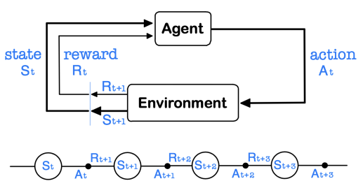
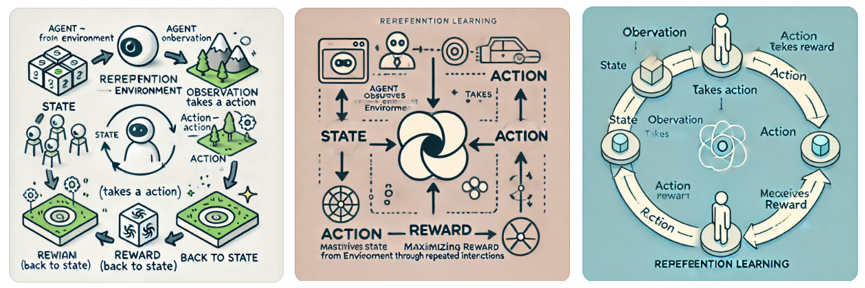
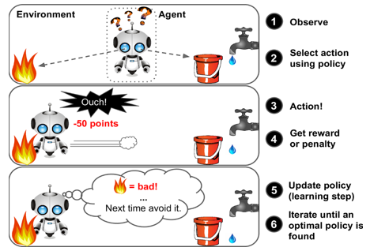
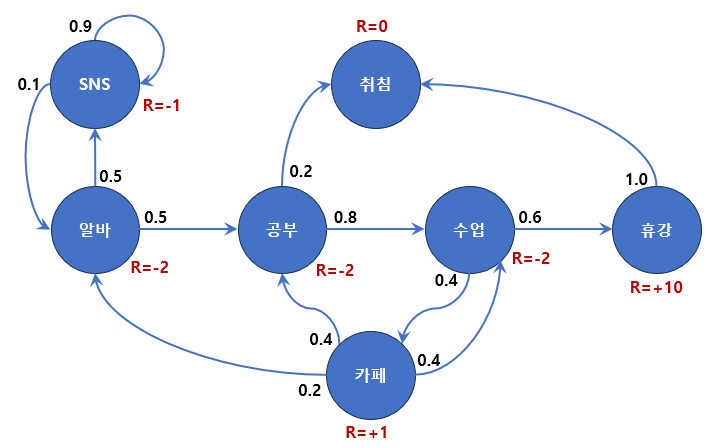
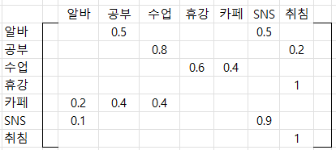
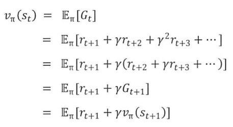
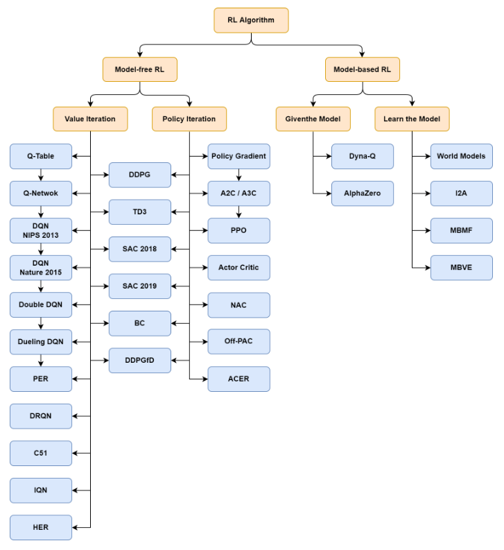
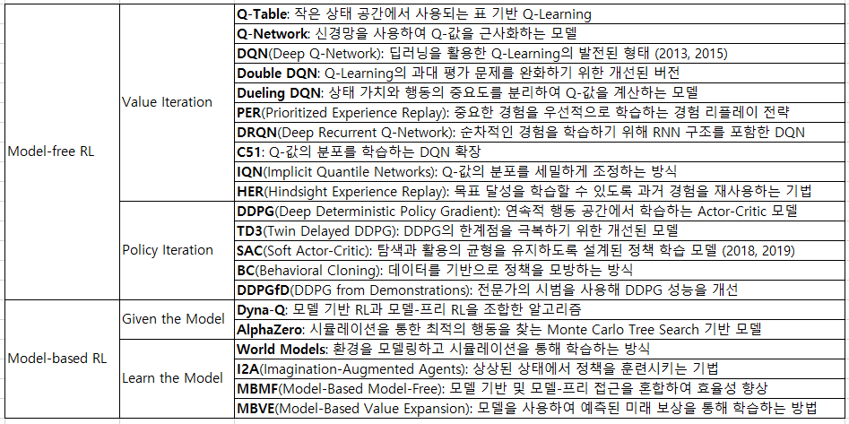
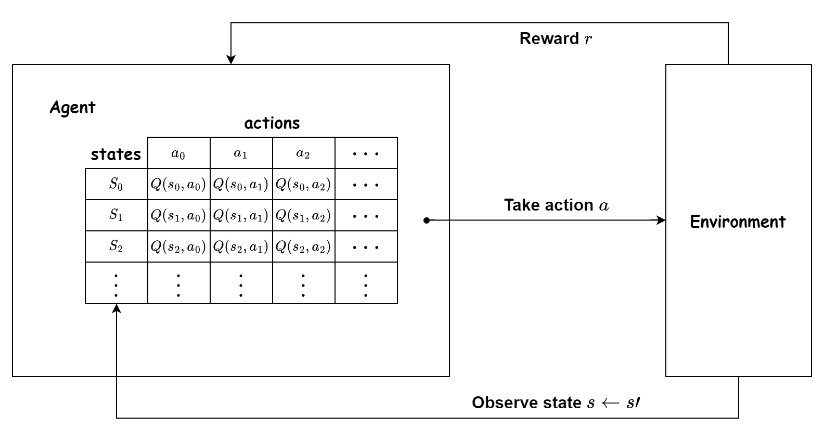

#  12 : 비지도 학습(Unsupervised Learning, UL) : 강화학습, 앙상블학습

---

## 강화 학습(Reinforcement Learning, RL)
 

    [1] Q-learning
    [2] DQN(Deep Q-Network)
    [3] SARSA(State-Action-Reward-State-Action)
    [4] GA(Genetic Algorithm)
    [5] A3C(Asynchronous Advantage Actor-Critic)
  

## 앙상블 학습(Ensemble Learning, EL)
 

    [6] 스태킹(Stacking)
    [7] 배깅(Bagging)
    [8] 부스팅(Boosting)

---  
# 강화 학습(Reinforcement Learning, RL)
시행착오(Trial and Error)를 통하여 실수와 보상을 통해 학습을 하여 목표를 찾아가는 알고리즘.  
기존의 알고리즘이 라벨(정답)이 있는 데이터를 통해서 가중치와 편향을 학습하는 것과 비슷하게  
보상(Reward)이라는 개념을 사용하여 가중치와 편향을 학습하는 것으로 목적은 최적의 행동양식 또는 정책을 학습하는 것 
학습 중에 사람을 포함한 환경으로부터 피드백 지도를 받기 때문에 지도학습으로 분류되기도 하나,  
강화학습이 가지는 최적의 의사결정 프로세스가 정해진 레이블과 비교 판별식을 구하는 방식과는 구별되는 학습모델로 독립적으로 분류 

 (출처) Deep Learning Bible(https://wikidocs.net/169311)
  
Agent 기계는 환경(Environment)으로부터 상태(state)를 관측(observation)하고 이에 다른 적절한 행동(action)을 하면 
이 행동을 기준으로 환경으로부터 보상(reward)을 받는 상호작용(관측→행동→보상)을 반복하면서 보상을 최대화하는 것이 목표  
[Chat GPT가 그린 그림] 

 
[Chat GPT가 찾은 그림] 

 

 

강화학습에 영향을 끼친 학문분야는 인공지능 외에도 행동심리학, 신경과학, 제어이론, 운용과학 등이 있으며,  
이 중 가장 근간이 되는 학문이 **행동심리학(Behavioral Psychology)**  
미국의 심리학자 에드워드 손다이크(Edward Thorndike)는 1911년 동물이 어떤 행동을 선택할 때는 강화된 사건(reinforced event)에 영향을 받는 시행착오(Trial and Error)의 효과의 법칙(Law of Effect)을 발표했고, 프린스턴대학의 마빈 민스키(Marvin Minsky)가 1954년에 아날로그 컴퓨터인 SNARC(Stochastic Neural Analog Reinforcement Calculator)을 설계하여 쥐의 미로찾기 시뮬레이션을 개발함으로써 행동심리학 이론을 처음으로 컴퓨터공학에 적용 

    마빈 민스키(Marvin Minsky)의 1960년 논문 "Steps Toward Artificial Intelligence"
    초기 인공지능(AI) 연구에 큰 영향을 미친 중요한 문헌으로, AI가 해결해야 할 문제와 이를 위해 필요한 접근 방식에 대한 체계적인 개요를 제시.
    인공지능 연구가 다루어야 할 주요 문제들을 분류하고, 각 문제를 해결하기 위한 방법론을 제안

    (1) 지능의 구성 요소: 지능이 다양한 기능과 능력의 집합이라고 보고, 인공지능을 실현하기 위해 문제 해결, 학습, 패턴 인식, 언어 처리 등의 하위 기능으로 분류
    (2) 문제해결 및 탐색: AI가 문제를 해결하는 데 있어 필요한 효과적인 탐색(search) 전략을 위해 다양한 탐색 알고리즘과 휴리스틱(heuristics)을 제안
    (3) 패턴 인식: 인간의 지능은 많은 부분 패턴 인식 능력에 의존하는데, 컴퓨터가 유사한 방식으로 이미지, 소리, 형태 등의 패턴을 인식하도록 학습시키는 방법으로 확률과 통계적 기법이 유용
    (4) 학습: 인공지능이 환경에 적응하고 스스로 개선할 수 있는 중요한 요소로 기계 학습이 필요하며 강화 학습, 지도 학습과 같은 개념을 언급
    (5) 추론 및 의미: 단순히 기호를 조작하는 것 이상의 기호적 추론과 의미론적 이해의 중요성을 설명
    (6) 미래 전망: AI 연구가 나아가야 할 방향과 그 가능성을 제시하면서, AI가 다양한 분야에서 응용될 수 있을 것이라고 예측

(출처) https://github.com/YangGuiBee/ML/blob/main/TextBook-12/STAI.pdf
   

## [강화학습의 응용분야]  

 (출처) Richard S. Sutton의 "Deconstructing Reinforcement Learning"(2009년 국제기계학습학회(ICML)에서 발표) 

### (1) 프로세스 제어 (24%)
강화학습이 제조 및 공정 산업에서 시스템의 상태를 최적화 및 자동화함으로써 복잡한 변수를 실시간으로 제어하여 안정적이고 효율적인 작업  
**화학 공정 최적화:** MIT와 BASF는 강화학습을 사용해 화학반응 공정을 최적화하여 온도와 압력을 조정해 불순물 제거 효과를 극대화  
**발전소 운영 최적화:** 일본의 발전소에서는 강화학습을 통해 온도와 연료 혼합 비율을 실시간으로 조정하여 효율을 개선  
**산업용 보일러 제어:** 중국의 한 석유화학 공장에서는 강화학습 기반 제어 시스템을 도입해 보일러의 연료소비를 최적화  

### (2) 네트워크 관리 (21%)
트래픽 최적화, 자원 배분 등을 통해 네트워크 성능을 높이고 응답 시간을 줄이는 데 사용  
**클라우드 리소스 최적화:** Microsoft Azure는 강화학습을 사용하여 클라우드 리소스를 자동으로 할당하고 트래픽 패턴에 따라 서버를 확장  
**네트워크 트래픽 관리:** 중국의 Huawei는 강화학습을 사용해 5G 네트워크에서 실시간 트래픽 경로를 최적화  
**데이터센터 냉각 최적화:** 구글 데이터센터에서는 강화학습을 통해 냉각 시스템을 자동으로 제어하여 냉각 비용을 절감  

### (3) 자산 관리 (18%)
투자 포트폴리오 최적화와 리스크 관리를 통해 수익을 극대화하고 위험을 최소화  
**포트폴리오 최적화:** BlackRock은 강화학습을 사용해 자산 배분 전략을 자동화하여 수익증가를 이루고 시장 상황에 맞춰 빠르게 포트폴리오 조정  
**고빈도 트레이딩:** JPMorgan은 강화학습 기반 알고리즘을 통해 매수 및 매도 시점을 실시간으로 분석하여 고빈도 거래에서 성과 향상  
**보험 리스크 평가:** Progressive 보험사는 강화학습을 사용해 고객 리스크를 평가하여 손해율을 줄임으로써 고객에게 더 적합한 보험 상품을 제안  

### (4) 로보틱스 (13%)
로봇이 복잡한 환경에서 자율적으로 작업을 수행할 수 있도록 학습  
**로봇 팔 최적화:** KUKA Robotics는 강화학습을 통해 로봇 팔이 특정 작업을 정확하게 수행할 수 있도록 학습시켜 작업 시간과 오차율을 감소  
**자율 이동 로봇:** Amazon Robotics는 물류창고에서 자율이동 로봇의 경로 최적화를 달성해서 주문을 빠르게 처리  
**산업용 드론 제어:** Skydio는 드론이 강화학습을 통해 장애물을 회피하고 안전하게 이동할 수 있도록 개발  

### (5) 교통 (6%)
교통 흐름을 최적화하고, 자율 주행 차량의 경로를 조정하여 효율적인 교통 시스템을 구축하는 데 기여  
**교통 신호 최적화:** 도쿄는 강화학습을 사용해 주요 교차로의 교통 신호를 최적화하여 혼잡 시간을 단축  
**자율주행 차량 경로 계획:** Tesla는 강화학습을 통해 자율주행 차량이 복잡한 도로 환경에서 최적의 경로를 찾도록 학습시켜 주행 안전성을 향상  
**물류 경로 최적화:** FedEx는 배송 경로를 강화학습을 통해 최적화하여 운송 비용을 줄임으로써 운송 시간 단축과 연료 비용 절감에 크게 기여  

### (6) 자동 제어 (6%)
공장 자동화, 드론 제어 등의 분야에서 강화학습을 통해 복잡한 시스템을 자율적으로 제어  
**공장 자동화:** Siemens는 강화학습을 통해 공장 자동화 시스템을 최적화하여 생산성을 향상시키고, 에너지 소비를 절감  
**드론 내비게이션:** Parrot Drones는 강화학습을 통해 드론이 장애물을 회피하고 목표지점까지 안전하게 이동시켜서 드론의 충돌 위험을 감소  
**발전소 제어:** 한전(KEPCO)에서는 발전소에서 전력 공급을 강화학습을 통해 실시간 제어하여 전력 공급의 안정성을 높이고 비용을 절감  

### (7) 금융 (4%)
시장 예측, 거래 전략, 리스크 관리 등에서 성능을 높이는 데 강화학습이 중요한 역할  
**알고리즘 트레이딩:** Goldman Sachs는 강화학습을 이용해 고빈도 거래에서 수익률을 개선  
**신용 리스크 평가:** 강화학습을 통해 고객의 신용 점수를 예측하여, 대출 승인율을 높이면서 부실 채권 비율을 줄이는 성과  
**외환 거래 전략:** Citibank는 강화학습을 통해 외환 거래에서 최적의 매수/매도 타이밍을 학습하여 수익률 향상을 달성 

### (8) 기타(8%)
**스포츠 전략 및 선수 훈련:** 축구, 농구, 미식축구 등의 스포츠에서 선수의 최적의 움직임이나 팀 전략 분석에 사용  
DeepMind의 축구 AI: Google DeepMind는 축구 선수들의 최적의 움직임과 전략을 학습하여 경기에서 다양한 전략을 실시간으로 테스트  
농구 슛 트레이닝: 강화학습을 이용해 농구 선수의 슛 성공률을 높이기 위한 최적의 각도, 속도 등을 학습시키는 연구  
**교육 기술 (EdTech):** 학생의 학습 속도, 이해도 등에 따라 적절한 학습 경로를 제공하여 효과적인 학습 환경을 조성  
개인화 학습 경로 제공: EdTech는 학생이 문제에서 반복적으로 오답을 낼 경우, 해당 개념과 관련된 기초 문제를 더 제공하여 학습  
퀴즈 최적화: Duolingo와 같은 교육 플랫폼에서는 사용자 학습을 추적하고, 강화학습으로 최적의 퀴즈를 추천해 학습자에게 맞춘 학습 경험 제공  
**스마트 시티 (Smart City):** 교통 신호 제어, 에너지 관리, 공공 서비스 배치 등을 최적화하여 시민들에게 더 나은 환경을 제공  
교통 혼잡 완화: 싱가포르에서는 교차로에서 차량의 흐름을 분석하여 신호주기 조정을 통해 교통신호를 최적화하여 교통흐름 개선  
에너지 관리: 스마트 그리드에서 강화학습을 통해 전력 수요를 예측하고 에너지 소비를 최적화하는 방안을 연구 중  
**재난 대응 및 구조:** 위험 지역에 들어가기 전에 최적의 경로를 미리 학습하거나 로봇을 활용한 구조 활동에 활용  
로봇 구조 임무: 재난 상황에서 로봇이 피해자에게 빠르게 접근할 수 있도록 강화학습을 이용해 장애물을 피하고 최단 경로를 탐색  
드론을 통한 감시 및 탐색: 강화학습을 통해 드론이 재난 지역을 감시하고 구조 가능한 위치를 탐색하는 데 필요한 비행 경로를 학습  
**스마트 농업:** 작물 관리, 관개 시스템 조절, 병충해 방제 등 농업 생산성을 향상시키는 다양한 기술  
작물 성장 최적화: 강화학습을 통해 온도, 습도, 조명 등을 자동제어로 조절해 최적의 작물 성장 조건을 유지하는 기술 개발  
농기계 경로 최적화: 자율주행 농기계가 강화학습을 통해 농지 내에서 최적의 경로를 학습하여 연료 소비와 시간을 절감  

## [강화학습의 프레임워크, MDP(Markov Decision Process)]
마코프 특성(Markov Property)을 기반으로 하는 의사결정 프로세스 
$P[S_{t+1} | S_t] = P[S_{t+1} | S_1, ..., S_t]$ 
$S_t$는 시간 t에서의 상태, 과거 상태 $[S_1, ..., S_t]$ 모두를 고려했을 때, 상태 $S_{t+1}$가 나타날 확률과 상태 $S_t$만을 고려했을때 상태 $S_{t+1}$가 발생할 확률은 동일하다는 의미 
일련의 시간적 사건이 있을 때, 현재 단계의 상태에서 다음 단계의 상태는 과거의 사건과 무관하며 지금 취할 행동에 영향을 주는 것은 과거의 사건이 아니라 미래의 상태와 그에 따른 보상(memoryless process) 

 
(상태변이확률 행렬) 

 

시나리오1 : 알바→공부→수업→휴강→취침 
시나리오2 : 알바→SNS→SNS→알바→공부→취침 
시나리오3 : 알바→공부→수업→카페→공부→수업→휴강→취침 
시나리오4 : 알바→SNS→SNS→알바→공부→수업→카페→알바→SNS→SNS→알바→공부→수업→카페→공부→취침 

시나리오1 : -2 –2×0.5 –2×0.52 + 10×0.53 = -2.25 
시나리오2 : -2 –1×0.5 –1×0.52 –2×0.53 –2×0.54 = -3.125 
시나리오3 : -2 –2×0.5 –2×0.52 +1×0.53 –2×0.54 –2×0.55 +10×0.56 = -3.406 
시나리오4 : -2 –1×0.5 –1×0.52 –2×0.53 –2×0.54 –2×0.55 +1×0.56 -2×0.57 –1×0.58 –1×0.59 –2×0.510 –2×0.511 –2×0.512 +1×0.513 –2×0.514 = -3.197 

(상태가치함수 계산의 일반화: 벨만방식) 

 

 
(출처) Deep Learning Bible(https://wikidocs.net/169311)

 
**Model-Based Algorithm**
환경(Environment)에 대한 모든 설명(Description)을 알고 문제를 푸는 방법 
직접 행동을 하지 않고, 최적의 솔루션을 탐색 
모델은 상태(State)와 행동(Action)을 받아서 다음 상태와 보상을 예측 
모델은 Planning에 사용되며, 경험 전에 가능한 미래 상황을 고려하여 행동을 예측 
모델과 Planning을 사용하여 해결하는 방식 

**Model-Free Algorithm**
Model-Based와 달리 환경(Environment)을 모르는 상태에서 직접 수행 
에이전트(Agent)가 행동을 통해 보상 합의 기대값을 최대로 하는 Policy Function을 탐색 
환경에 대해 알지 못하고, 다음의 상태와 보상을 수동적으로 행동하여 취득 
환경 파악을 위해서 탐사(Exploration) 
탐사는 시행착오(Trial and Error)를 통해서 Policy Function을 점차적으로 학습 

 

# [1] Q-learning

 (출처) Deep Learning Bible(https://wikidocs.net/169311)

▣ 정의 : 값 기반 강화 학습의 대표적인 알고리즘으로, 상태-행동 쌍에 대한 Q값을 학습해 최적의 정책을 찾는 방법. 상태에서 어떤 행동을 선택할지 결정하는 Q함수를 학습하며, 최적 정책을 따르기 위해 Q값을 최대화하는 방향으로 행동 
▣ 필요성 : 모델에 대한 사전 지식 없이 환경 내에서 에이전트가 스스로 학습할 수 있는 능력을 제공하며, 상태 공간이 클 때도 적합하게 사용할 수 있다. 
▣ 장점 : 모델 프리 방식이라 환경의 동작을 미리 알 필요가 없으며, 수렴할 경우 최적의 정책을 보장한다. 
▣ 단점 : 상태 공간이 매우 크거나 연속적인 경우, Q-table이 메모리와 시간 측면에서 비효율적일 수 있으며, 학습 속도가 느리고, 보상이 주기적으로만 주어지는 경우 최적의 정책을 찾기 어려울 수 있다. 
▣ 응용분야 : 게임 플레이, 로봇 제어, 자율 주행, 네트워크 트래픽 제어 등 
▣ 모델식 : Q-learning 업데이트식으로 Q(s,a)는 상태 𝑠에서 행동 𝑎를 선택할 때의 Q값, α는 학습률, 𝛾는 할인 계수,𝑟은 현재 보상, max_𝑎′𝑄(𝑠′,𝑎′)는 다음 상태 𝑠′ 에서 가능한 최대 Q값. 

    import numpy as np

    # 환경 설정 (간단한 그리드 월드 환경 가정)
    n_states = 5
    n_actions = 2
    Q = np.zeros((n_states, n_actions))

    alpha = 0.1  # 학습률
    gamma = 0.9  # 할인 계수
    epsilon = 0.1  # 탐험 확률

    def choose_action(state):
        if np.random.uniform(0, 1) < epsilon:
           return np.random.choice(n_actions)
        else:
           return np.argmax(Q[state, :])

    def update_q(state, action, reward, next_state):
        predict = Q[state, action]
        target = reward + gamma * np.max(Q[next_state, :])
        Q[state, action] = predict + alpha * (target - predict)

    # 예시 학습 반복
    for episode in range(100):
        state = np.random.randint(0, n_states)
        while state != 4:  # 종료 상태 가정
          action = choose_action(state)
          next_state = np.random.randint(0, n_states)
          reward = 1 if next_state == 4 else 0
          update_q(state, action, reward, next_state)
          state = next_state
    print(Q)
    
 

# [2] DQN(Deep Q-Network)
▣ 정의 : Q-learning을 딥러닝에 결합한 알고리즘으로, Q-table 대신 심층 신경망을 사용해 Q값을 근사하며, 주로 상태 공간이 매우 크거나 연속적인 문제에서 사용 
▣ 필요성 : Q-table을 사용할 수 없는 고차원 환경에서 Q-learning을 효과적으로 적용하기 위해 신경망을 사용하여 Q값을 근사 
▣ 장점 : 고차원 연속 상태 공간에서 사용 가능하며, 경험 재플레이(experience replay)와 타깃 네트워크로 학습 안정성을 높일 수 있다. 
▣ 단점 : 신경망 학습으로 인해 높은 계산 비용이 필요하며, 과적합 위험이 있으며, 잘못 설정된 하이퍼파라미터로 인해 학습이 불안정 
▣ 응용분야 : 비디오 게임(예: Atari 게임), 로봇 제어, 자율 주행 등 
▣ 모델식 : DQN에서 신경망을 사용한 Q-learning 업데이트 θ는 현재 신경망의 가중치,𝜃′ 는 타깃 신경망의 가중치 

    import numpy as np
    import tensorflow as tf
    from collections import deque

    n_states = 5
    n_actions = 2

    # 신경망 모델 정의
    model = tf.keras.models.Sequential([
    tf.keras.layers.Dense(24, input_dim=n_states, activation='relu'),
    tf.keras.layers.Dense(24, activation='relu'),
    tf.keras.layers.Dense(n_actions, activation='linear')])
    model.compile(optimizer='adam', loss='mse')

    # Q-learning 파라미터 설정
    gamma = 0.95
    epsilon = 1.0
    epsilon_min = 0.01
    epsilon_decay = 0.995
    batch_size = 32
    memory = deque(maxlen=2000)

    def choose_action(state):
    if np.random.rand() <= epsilon:
        return np.random.choice(n_actions)
    state = np.reshape(state, [1, n_states])
    return np.argmax(model.predict(state))

    def replay():
        global epsilon
        if len(memory) < batch_size: return
        minibatch = np.random.choice(len(memory), batch_size)
        for state, action, reward, next_state, done in minibatch:
            target = reward
            if not done: target = reward + gamma * np.amax(model.predict(next_state))
            target_f = model.predict(state)
            target_f[0][action] = target
            model.fit(state, target_f, epochs=1, verbose=0)
        if epsilon > epsilon_min: epsilon *= epsilon_decay

    # 학습 반복 (예시)
    for episode in range(1000):
        state = np.random.rand(n_states)
        done = False
        while not done:
            action = choose_action(state)
            next_state = np.random.rand(n_states)
            reward = 1 if np.random.rand() > 0.5 else 0
            done = True if reward == 1 else False
            memory.append((state, action, reward, next_state, done))
            replay()
    print("학습 완료")

 

# [3] SARSA(State-Action-Reward-State-Action)
▣ 정의 : 상태-행동-보상-다음 상태-다음 행동(State-Action-Reward-State-Action)의 연속적인 관계에서 학습하는 방법. Q-learning과 달리 SARSA는 에이전트가 선택한 행동을 기반으로 학습하며 에이전트가 현재 행동과 다음 행동을 통해 학습하는 on-policy 방법 
▣ 필요성 : 정책을 미리 고정한 상태에서 Q-learning처럼 탐험과 학습을 분리하지 않고, 정책을 유지하며 학습할 때 유리. SARSA는 실제로 에이전트가 수행하는 행동을 기반으로 학습하므로, 정책에 따른 일관성을 유지. 특히 탐험(exploration) 중에도 안정적으로 학습이 가능 
▣ 장점 : 에이전트의 실제 정책을 기반으로 학습하므로 정책의 일관성을 유지할 수 있으며, Q-learning보다 안정적인 성능 
▣ 단점 : Q-learning보다 수렴 속도가 느릴 수 있으며, 잘못된 정책을 사용할 경우 학습 성능이 떨어질 수 있다. 
▣ 응용분야 : 게임, 로봇 제어, 자율 시스템, 물류 최적화 
▣ 모델식 : SARSA 업데이트 식, Q(s,a)는 상태 𝑠에서 행동 𝑎를 선택할 때의 Q값, 𝑎′ 는 다음 상태에서 선택 

    import numpy as np

    # SARSA 알고리즘을 위한 환경 설정
    n_states = 5
    n_actions = 2
    Q = np.zeros((n_states, n_actions))
    alpha = 0.1  # 학습률
    gamma = 0.9  # 할인 계수
    epsilon = 0.1  # 탐험 확률

    def choose_action(state):
    if np.random.uniform(0, 1) < epsilon: return np.random.choice(n_actions)
    else: return np.argmax(Q[state, :])

    def update_q(state, action, reward, next_state, next_action):
        predict = Q[state, action]
        target = reward + gamma * Q[next_state, next_action]
        Q[state, action] = predict + alpha (target - predict)

    # 예시 학습 반복
    for episode in range(100):
        state = np.random.randint(0, n_states)
        action = choose_action(state)
        while state != 4:  # 종료 상태 가정
            next_state = np.random.randint(0, n_states)
            reward = 1 if next_state == 4 else 0
            next_action = choose_action(next_state)
            update_q(state, action, reward, next_state, next_action)
            state, action = next_state, next_action
    print(Q)

 

# [4] GA(Genetic Algorithm)
▣ 정의 : 유전 알고리즘은 자연 선택과 유전학의 원리에 기반한 최적화 알고리즘으로, 개체군(population) 내에서 개체들이 적응도(fitness)에 따라 선택되고, 교차(crossover)와 돌연변이(mutation)를 통해 새로운 세대를 형성하여 최적 해를 찾아가는 과정 
▣ 필요성 : 해 공간이 매우 크거나 복잡한 문제에서 전통적인 탐색 방법으로는 최적해를 찾기 어렵기 때문에, 진화 과정을 모방한 유전 알고리즘을 사용해 빠르고 효율적으로 최적화 
▣ 장점 : 다양한 해를 동시에 탐색하므로 전역 최적해에 도달할 가능성이 높으며, 문제의 구조에 대한 구체적인 지식 없이도 적용할 수 있고, 비선형 문제나 다목적 최적화 문제에도 적합 
▣ 단점 : 계산 비용이 많이 들 수 있으며, 특정 문제에서는 수렴이 느릴 수 있으며, 너무 빠르게 수렴하면 지역 최적해에 갇힐 가능성 
▣ 응용분야 : 최적화 문제, 로봇 공학, 머신 러닝에서의 하이퍼파라미터 튜닝, 경로 계획, 게임 디자인, 재무 최적화 등 
▣ 모델식 : 적응도(fitness): 해의 품질을 측정. 선택(selection): 높은 적응도를 가진 개체를 우선적으로 선택. 교차(crossover): 두 부모로부터 자손을 생성. 돌연변이(mutation): 자손의 일부 유전자를 무작위로 변형. 

    import numpy as np

    def fitness(x):
        return np.sum(x)  # 최대화할 함수 (예시)

    def selection(pop, scores, k=3):
        selected_idx = np.random.choice(len(pop), k, replace=False)
        return pop[selected_idx[np.argmax(scores[selected_idx])]]

    def crossover(p1, p2, r_cross):
        if np.random.rand() < r_cross:
            pt = np.random.randint(1, len(p1))
            return np.hstack((p1[:pt], p2[pt:]))
        return p1

    def mutation(bitstring, r_mut):
        for i in range(len(bitstring)):
            if np.random.rand() < r_mut:
                bitstring[i] = 1 - bitstring[i]

    # 초기화
    n_bits = 10
    n_pop = 20
    r_cross = 0.9
    r_mut = 1.0 / n_bits
    n_iter = 100
    pop = np.random.randint(0, 2, (n_pop, n_bits))

    for gen in range(n_iter):
        scores = np.array([fitness(c) for c in pop])
        best = pop[np.argmax(scores)]
        print(f"Generation {gen}, Best: {best}, Fitness: {np.max(scores)}")
    
        new_pop = []
        for _ in range(n_pop // 2):
            p1, p2 = selection(pop, scores), selection(pop, scores)
            child1, child2 = crossover(p1, p2, r_cross), crossover(p2, p1, r_cross)
            mutation(child1, r_mut)
            mutation(child2, r_mut)
            new_pop += [child1, child2]
        pop = np.array(new_pop)
        
 

# [5] A3C(Asynchronous Advantage Actor-Critic)
▣ 정의 : 병렬 환경에서 여러 에이전트가 동시에 학습하는 강화 학습 기법으로 액터-크리틱(Actor-Critic) 구조를 기반으로 하고 있으며, 에이전트들은 독립적으로 환경과 상호작용하면서 각각 정책과 가치 함수(critic)를 학습하고, 이를 전역 네트워크로 반영한다. A3C는 탐색(exploration)과 정책 수렴을 효과적으로 조절할 수 있어 강화 학습의 성능을 향상 
▣ 필요성 : 기존 강화 학습 알고리즘은 계산 속도가 느리거나 수렴이 불안정할 수 있는데, A3C는 병렬 학습을 통해 이러한 문제를 해결하며, 병렬적으로 에이전트들이 학습하므로 다양한 상태와 행동을 더 빠르게 탐색하고, 학습 속도를 개선할 수 있다. 
▣ 장점 : 병렬 학습으로 더 빠른 학습 속도를 제공하고, 다중 에이전트를 통해 더 다양한 경험을 수집하고, 수렴의 안정성을 높일 수 있으며, 정책 그라디언트와 가치 기반 방법의 장점을 결합해 효율적인 학습이 가능하다. 
▣ 단점 : 병렬 환경을 구현하기 위한 추가적인 컴퓨팅 자원이 필요하며, 복잡한 알고리즘 구조로 인해 이해하고 구현하는 데 어려움이 있을 수 있고, 하이퍼파라미터 조정이 까다롭고, 자원 소모가 클 수 있다. 
▣ 응용분야 : 비디오 게임 AI 학습 (Atari 게임, StarCraft II 등), 로봇 제어, 자율 주행, 금융 분야의 자동 매매 

    import threading
    import gym
    import numpy as np
    import tensorflow as tf

    # A3C 클래스 정의
    class A3C_Agent:
        def __init__(self, state_size, action_size):
            self.state_size = state_size
            self.action_size = action_size
            self.gamma = 0.99  # 할인 계수
            self.actor, self.critic = self.build_model()

        def build_model(self):
            # 액터 모델
            inputs = tf.keras.layers.Input(shape=(self.state_size,))
            hidden = tf.keras.layers.Dense(24, activation='relu')(inputs)
            policy = tf.keras.layers.Dense(self.action_size, activation='softmax')(hidden)
        
        # 크리틱 모델
        value = tf.keras.layers.Dense(1, activation='linear')(hidden)

        actor = tf.keras.models.Model(inputs=inputs, outputs=policy)
        critic = tf.keras.models.Model(inputs=inputs, outputs=value)

        actor.compile(optimizer=tf.keras.optimizers.Adam(learning_rate=0.001), loss='categorical_crossentropy')
        critic.compile(optimizer=tf.keras.optimizers.Adam(learning_rate=0.001), loss='mse')

        return actor

 

---

# 앙상블 학습(Ensemble Learning, EL)
▣ API : https://scikit-learn.org/stable/api/sklearn.ensemble.html 
▣ 정의 : 앙상블 학습이란 다수의 기초 알고리즘(base algorithm)을 결합하여 더 나은 성능의 예측 모델을 형성하는 것을 말하며, 사용 목적에 따라 배깅(Bagging), 부스팅(Boosting), 스택킹(Stacking)으로 분류 

# [6] 스태킹(Stacking)
▣ 정의 : 서로 다른 종류의 기반 모델(base model) 여러 개를 학습한 후, 이들의 예측 결과를 결합하는 방식이다. 개별 모델의 예측 결과를 다시 하나의 메타 모델(meta-model)로 학습시켜 최종 예측을 수행 
▣ 필요성 : 단일 모델의 약점을 보완하기 위해 서로 다른 유형의 모델을 조합함으로써 더 나은 성능을 도출할 수 있다. 예를 들어, 결정 트리, 서포트벡터머신(SVM), 신경망 등 다양한 모델을 결합 
▣ 장점 : 서로 다른 모델의 장점을 결합하여 더욱 강력한 예측 성능을 낼 수 있으며, 다양한 모델의 편향과 분산을 보완 
▣ 단점 : 모델 조합이 복잡해질수록 계산 비용이 커지고, 메타 모델을 학습하는 데 추가적인 시간이 소요되며 과적합(overfitting)의 위험 
▣ 응용분야 : 여러 모델의 특성이 유용할 때 사용한다. 예를 들어, 금융 예측, 이미지 분류 등 다양한 문제에서 활용 
▣ 모델식 : $𝑓_1$ 은 각각의 개별 모델, $𝑓_2$ 는 메타 모델, $\widehat{y}=f_2(f_1(x_1),f_1(x_2),...f_1(x_n))$ 

    from sklearn.ensemble import StackingClassifier
    from sklearn.linear_model import LogisticRegression
    from sklearn.svm import SVC
    from sklearn.tree import DecisionTreeClassifier
    from sklearn.datasets import load_iris
    from sklearn.model_selection import train_test_split

    # 데이터 로드 및 분할
    X, y = load_iris(return_X_y=True)
    X_train, X_test, y_train, y_test = train_test_split(X, y, test_size=0.2, random_state=42)

    # 개별 모델 정의
    estimators = [('svc', SVC(probability=True)),('tree', DecisionTreeClassifier())]

    # 스태킹 모델 정의
    stacking_clf = StackingClassifier(estimators=estimators, final_estimator=LogisticRegression())
    stacking_clf.fit(X_train, y_train)

    # 성능 평가
    print(stacking_clf.score(X_test, y_test))
    
 

# [7] 배깅(Bagging)
▣ 정의 : 동일한 모델을 여러 번 학습하되, 각 학습마다 다른 데이터 샘플을 사용 주로 부트스트랩(bootstrap) 방법으로 샘플링된 데이터로 모델을 학습하며, 최종 예측은 개별 모델의 예측 결과를 평균 또는 투표로 결합. 대표적인 알고리즘은 랜덤 포레스트(Random Forest) 
▣ 필요성 : 단일 모델이 데이터의 특정 부분에 과적합하는 것을 방지하고, 예측의 안정성을 높이기 위해 사용 
▣ 장점 : 분산을 줄여 예측 성능을 향상시키며, 과적합(overfitting)을 방지하는 데 도움 
▣ 단점 : 편향을 줄이는 데는 효과적이지 않을 수 있으며, 많은 모델을 학습하므로 계산 자원이 많이 필요 
▣ 응용분야 : 랜덤 포레스트처럼 결정 트리 기반 모델에서 이미지 분류, 텍스트 분류, 금융 예측 등에 널리 사용 
▣ 모델식 :  $𝑓_1$ 은 각각의 개별 모델, $\widehat{y}=\frac{1}{N}\sum_{i=1}^{N}f_i(x)$ 

    from sklearn.ensemble import BaggingClassifier
    from sklearn.tree import DecisionTreeClassifier
    from sklearn.datasets import load_iris
    from sklearn.model_selection import train_test_split

    # 데이터 로드 및 분할
    X, y = load_iris(return_X_y=True)
    X_train, X_test, y_train, y_test = train_test_split(X, y, test_size=0.2, random_state=42)

    # 배깅 모델 정의
    bagging_clf = BaggingClassifier(base_estimator=DecisionTreeClassifier(), n_estimators=10, random_state=42)
    bagging_clf.fit(X_train, y_train)

    # 성능 평가
    print(bagging_clf.score(X_test, y_test))

 

# [8] 부스팅(Boosting)
▣ 정의 : 약한 학습기(weak learner)를 연속적으로 학습시키며, 이전 학습에서 잘못 예측한 데이터에 가중치를 부여하여 다음 모델이 이를 더 잘 학습할 수 있도록 한다. 대표적인 알고리즘으로는 AdaBoost, Gradient Boosting, XGBoost 등이 있다. 
▣ 필요성 : 약한 학습기를 여러 번 반복하여 강력한 학습기를 만들 수 있으며, 특히 잘못된 예측에 집중하여 성능을 점진적으로 개선한다. 
▣ 장점 : 모델이 연속적으로 개선되기 때문에 높은 예측 성능을 보일 수 있으며, 오류를 줄이는 데 매우 효과적이다. 
▣ 단점 : 연속적인 학습 과정에서 모델이 과적합할 위험이 있으며, 학습 속도가 느릴 수 있다. 
▣ 응용분야 : 금융 예측, 분류 문제, 회귀 분석 등에서 많이 사용되며, 특히 XGBoost는 대회에서 많이 사용된다. 
▣ 모델식 : $f_i$ 는 약한 학습기, $𝛼_𝑖$ 는 각 학습기의 가중치, $\widehat{y}=\sum_{i=1}^{N}\alpha_i f_i(x)$ 

    from sklearn.ensemble import AdaBoostClassifier
    from sklearn.tree import DecisionTreeClassifier
    from sklearn.datasets import load_iris
    from sklearn.model_selection import train_test_split

    # 데이터 로드 및 분할
    X, y = load_iris(return_X_y=True)
    X_train, X_test, y_train, y_test = train_test_split(X, y, test_size=0.2, random_state=42)

    # 부스팅 모델 정의
    boosting_clf = AdaBoostClassifier(base_estimator=DecisionTreeClassifier(), n_estimators=50, random_state=42)
    boosting_clf.fit(X_train, y_train)

    # 성능 평가
    print(boosting_clf.score(X_test, y_test))

 

