#  12-1 : 회귀 평가 지표

---

	[1] 평균 오차 (Mean Error, ME)
 	[2] 평균 절대 오차 (Mean Absolute Error, MAE)
	[3] 평균 제곱 오차 (Mean Squared Error, MSE)
	[4] 평균 제곱 오차(로그적용) (Mean Squared Log Error, MSLE)
	[5] 평균 제곱근 오차 (Root Mean Squared Error, RMSE)
	[6] 평균 제곱근 오차(로그적용) (Root Mean Squared Log Error, RMSLE)
 	[7] 평균 비율 오차 (Mean Percentage Error, MPE)
	[8] 평균 절대 비율 오차 (Mean Absolute Percentage Error, MAPE)
	[9] 평균 절대 규모 오차 (Mean Absolute Scaled Error, MASE)
	[10] R2 score
	  
---

# [1] 평균 오차 (Mean Error, ME)

 
▣ 정의: 실제값과 예측값의 차이를 평균낸 값으로, 오차의 방향성을 포함한 예측오차의 산술평균을 의미 
▣ 필요성: 오차가 양수인지 음수인지, 평균적으로 과대평가 또는 과소평가되는지를 파악 
▣ 장점: 오차의 방향성을 반영하여 모델의 편향(bias)을 분석 
▣ 단점: 양수와 음수가 상쇄되므로, 실제 오차의 크기를 판단하기 어렵다 

	def ME(y_true, y_pred):
		return (y_true - y_pred).mean(axis=None)

 

# [2] 평균 절대 오차 (Mean Absolute Error, MAE)

 
▣ 정의: 실제 정답 값과 예측 값의 차이를 절댓값으로 변환한 뒤 합산하여 평균을 구한다. 
▣ 필요성: 모델의 평균적인 예측 오차 크기를 직관적으로 파악, 특이값이 많은 경우에 주로 사용 
▣ 장점: 직관적이고 정답 및 예측 값과 같은 단위를 가지고, MSE, RMSE에 비해 극단값(outlier)에 덜 민감 
▣ 단점: 절댓값을 취하므로 underestimates/overestimates인지에 대한 판단을 할 수 없으며, 스케일 의존적(scal dependency)으로 모델마다 에러 크기가 동일해도 에러율은 동일하지 않고, 오차의 방향성을 알 수 없다 

	def MAE(y_true, y_pred):
    	return (abs(y_true - y_pred)).mean(axis=None)

 

	from sklearn.metrics import mean_absolute_error
	
	mae = mean_absolute_error(y_true, y_pred)
   
 

# [3] 평균 제곱 오차 (Mean Squared Error, MSE)

 
▣ 정의: 실제 정답 값과 예측 값의 차이를 제곱(예측값과 실제값 차이의 면적)한 뒤 평균을 구한다. 
▣ 필요성: 오차의 크기를 강조해 큰 오차에 민감하게 반응 
▣ 장점: 직관적이며, 모델의 큰 오차를 더 잘 식별 가능 
▣ 단점: 예측 변수와 단위가 다르며, 오차를 제곱하기 때문에 이상치에 민감(제곱하기 때문에 1미만의 에러는 작아지고 그 이상의 에러는 커짐), 제곱을 씌우게 되어 underestimates/overestimates인지 파악하기 힘들며, 스케일 의존적(scal dependency)이라 모델마다 에러러 크기가 동일해도 에러율은 동일하지 않은 단점. 오차제곱합(SSE)와 유사하지만 오차제곱합으로는 실제 오차가 커서 값이 커지는 것인지 데이터의 양이 많아서 값이 커지는 것인지를 구분할 수 없게 된다. 

	def MSE(y_true, y_pred):
    	return ((y_true - y_pred)**2).mean(axis=None)

 

	from sklearn.metrics import mean_squared_error
	
	mse = mean_squared_error(y_true, y_pred)

 

# [4] 평균 제곱 오차(로그적용) (Mean Squared Log Error, MSLE)

 
▣ 정의: 예측값과 실제값 간의 로그 차이에 대한 제곱 평균으로 MSE에 로그를 적용  
▣ 필요성: 작은 값의 상대적인 차이를 강조하며 큰 값의 차이를 완화 
▣ 장점: 작은 값에 집중하여 예측하는 모델에 적합(결정 값이 클수록 오류값도 커지기 때문에 일부 큰 오류값들로 인해 전체 오류값이 커지는 것을 막아준다) 
▣ 단점: 로그 연산으로 인해 음수 값은 처리 불가능 

	def MSLE(y_true, y_pred):
		return np.log((y_true - y_pred)**2).mean(axis=None)

 

	from sklearn.metrics import mean_squared_log_error

	msle = mean_squared_log_error(y_true, y_pred)

 

# [5] 평균 제곱근 오차 (Root Mean Squared Error, RMSE)

 
▣ 정의: MSE의 제곱근으로, 실제값과 예측값 간의 평균적 차이를 원 단위로 환산 
▣ 필요성: 단위를 실제 데이터와 동일하게 조정 
▣ 장점: 해석이 쉬우며, 큰 오차를 강조(MSE에 루트는 씌워서 에러를 제곱해서 생기는 값의 왜곡이 줄어든다) 
▣ 단점: 극단값에 민감하고, 제곱 후 루트를 씌우기 때문에 MAE처럼 실제 값에 대해 underestimates/overestimates인지 파악하기 힘들고, 스케일 의존적(scal dependency)으로 모델마다 에러 크기가 동일해도 에러율은 동일하지 않은 단점 

	def RMSE(y_true, y_pred):
		return np.sqrt(((y_true - y_pred) ** 2).mean(axis=None))

 

# [6] 평균 제곱근 오차(로그적용) (Root Mean Squared Log Error, RMSLE)

 
▣ 정의: MSLE의 제곱근 값으로, 로그 차이를 원 단위로 환산한 값으로 RMSE값에 로그를 취한 값 
▣ 필요성: 작은 값의 상대적 차이를 평가 
▣ 장점: 상대적 오차에 강점(결정 값이 클 수록 오류 값도 커지기 때문에 일부 큰 오류 값들로인해 전체 오류값이 커지는 것을 막아준다) 
▣ 단점: 음수 값 불가 

	def RMSLE(y_true, y_pred):
		return np.log(np.sqrt(((y_true - y_pred) ** 2).mean(axis=None)))

 

# [7] 평균 비율 오차 (Mean Percentage Error, MPE)

 
▣ 정의: 오차를 실제값에 대한 백분율로 계산해 평균 
▣ 필요성: 예측 오차의 방향성과 백분율 크기를 파악, 절대적인 의미의 예측오차뿐 아니라 상대적인 의미의 예측오차가 필요할 경우에 계산 
▣ 장점: 상대적 크기 비교 가능(음수면 overperformance, 양수면 underperformance으로 판단), 모델이 underestimates/overestimates인지 판단할 수 있다는 장점 
▣ 단점: 실제값이 0일 때 계산 불가 

	def MPE(y_true, y_pred):
		return (((y_true - y_pred)/y_true)*100).mean(axis=None)

 

# [8] 평균 절대 비율 오차 (Mean Absolute Percentage Error, MAPE)

 
▣ 정의: 절대 오차를 백분율로 계산해 평균(MAE를 비율, 퍼센트로 표현하여 스케인 의존적 에러의 문제점을 개선) 
▣ 필요성: 오차를 상대적으로 평가 
▣ 장점 : 직관적이고, 다른 모델과 에러율 비교가 쉬운 장점 
▣ 단점: 0값 문제와 극단값에 민감(실제 정답보다 낮게 예측했는지, 높게 했는지를 파악하기 힘들고 실제 정답이 1보다작을 경우,무한대의 값으로 수렴) 

	def MAPE(y_true, y_pred):
		return ((abs((y_true - y_pred)/y_true))*100).mean(axis=None)

 
	
	from sklearn.metrics import mean_absolute_percentage_error
	
	mape = mean_absolute_percentage_error(y_true, y_pred)

 

# [9] 평균 절대 규모 오차 (Mean Absolute Scaled Error, MASE)
<!--   -->
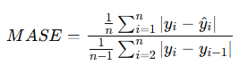
 
▣ 정의: 예측값의 오차를 기준 시점의 오차와 비교하여 비율화(데이터를 척도화하여 이를 기준으로 예측오차의 절대값에 대한 평균) 
▣ 필요성: 데이터에 따라 유연한 평가 가능 
▣ 장점: 스케일에 대한 의존성이 낮아서 안정적으로 비교 가능 
▣ 단점: 해석이 상대적으로 어렵다 

	def MASE(y_true, y_pred):
    	mae = np.mean(np.abs(y_true - y_pred))
    	naive_mae = np.mean(np.abs(y_true[1:] - y_true[:-1]))
    	return mae / naive_mae

	mase = MASE(y_true, y_pred)

 

# [10] R2 score
▣ 정의: 모델의 설명력을 나타내는 지표로 **SST(Total Sum of Squares)** 관측값에서 관측값의 평균(혹은 추정치의 평균)을 뺀 결과의 총합인 총 제곱합 
▣ 필요성: 전체(Total)에 대한 변동성을 나타냄으로써 모델이 데이터를 얼마나 잘 설명하는지 파악 
▣ 장점: 직관적 
▣ 단점: 모델이 최소한의 기준도 만족하지 못하는 경우는 음수가 될 수 있음 
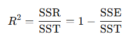
 
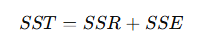
 

	from sklearn.metrics import r2_score

	r2 = r2_score(y_true, y_pred)

**(회귀 평가지표 10개 정리 예제 소스)**

	# ============================================
	# Iris 데이터 기반 회귀 평가지표 10개 + 해석표 출력 코드
	#  - 타깃: sepal length (첫 번째 컬럼)
	#  - 특징: 나머지 3개(sepal width, petal length, petal width)
	# ============================================
	import numpy as np	
	from sklearn.metrics import (
	    mean_absolute_error,
	    mean_squared_error,
	    mean_squared_log_error,
	    mean_absolute_percentage_error,
	    r2_score)
	from sklearn.linear_model import LinearRegression
	from sklearn.model_selection import train_test_split
	from sklearn.datasets import load_iris
		
	# ------------------------------------------------------------------
	# 1. 사용자 정의 평가지표 함수들
	# ------------------------------------------------------------------
	# [1] 평균 오차 (ME, Mean Error)
	def mean_error(y_true, y_pred):	    
	    y_true = np.asarray(y_true)
	    y_pred = np.asarray(y_pred)
	    return np.mean(y_true - y_pred)
	
	# [5] 평균 제곱근 오차 (RMSE)
	def rmse(y_true, y_pred):	    
	    return np.sqrt(mean_squared_error(y_true, y_pred))

	# [6] 평균 제곱근 오차(로그적용) (RMSLE)	
	def rmsle(y_true, y_pred):
	    return np.sqrt(mean_squared_log_error(y_true, y_pred))
	
	# [7] 평균 비율 오차 (MPE, Mean Percentage Error)
	def mean_percentage_error(y_true, y_pred):
	    y_true = np.asarray(y_true)
	    y_pred = np.asarray(y_pred)
	    return np.mean((y_true - y_pred) / y_true)
	
	# [9] 평균 절대 규모 오차 (MASE, Mean Absolute Scaled Error)
	#     본래는 시계열(time series)에서 많이 사용
	#     여기서는 예시를 위해 샘플 순서를 기준으로 naive forecast 사용
	def mase(y_true, y_pred):
	    y_true = np.asarray(y_true)
	    y_pred = np.asarray(y_pred)
	    mae = np.mean(np.abs(y_true - y_pred))
	    # naive forecast: 한 시점 전 값(y_{t-1})을 예측으로 사용
	    naive_mae = np.mean(np.abs(y_true[1:] - y_true[:-1]))
	    return mae / naive_mae
	
	# ------------------------------------------------------------------
	# 2. 해석 함수들 (좋음 / 보통 / 나쁨) + 기준 문자열
	# ------------------------------------------------------------------
	CRITERIA_ERROR_RELATIVE = "ratio<0.25:좋음, 0.25≤ratio<0.5:보통, ratio≥0.5:나쁨"
	CRITERIA_MSLE_RMSLE     = "RMSLE<0.1:좋음, 0.1≤RMSLE<0.2:보통, RMSLE≥0.2:나쁨"
	CRITERIA_PERCENTAGE     = "|오차|<10%:좋음, 10~20%:보통, 20% 초과:나쁨"
	CRITERIA_MASE           = "MASE<1:좋음, 1≤MASE<2:보통, MASE≥2:나쁨"
	CRITERIA_R2             = "R2≥0.8:좋음, 0.5≤R2<0.8:보통, R2<0.5:나쁨"
		
	def interpret_error_relative(value, scale):
	    if scale == 0: return "평가불가"
	
	    ratio = abs(value) / scale  # 상대오차 비율	
	    if ratio < 0.25: return "좋음"
	    elif ratio < 0.5: return "보통"
	    else: return "나쁨"
		
	def interpret_msle_rmsle(rmsle_value):
	    if rmsle_value < 0.1: return "좋음"
	    elif rmsle_value < 0.2: return "보통"
	    else: return "나쁨"
		
	def interpret_percentage_metric(perc_value):
	    perc = abs(perc_value) * 100  # %	
	    if perc < 10: return "좋음"
	    elif perc < 20: return "보통"
	    else: return "나쁨"
		
	def interpret_mase(mase_value):
	    if mase_value < 1: return "좋음"
	    elif mase_value < 2: return "보통"
	    else: return "나쁨"
		
	def interpret_r2(r2_value):	
	    if r2_value >= 0.8: return "좋음"
	    elif r2_value >= 0.5: return "보통"
	    else: return "나쁨"
	
	# ------------------------------------------------------------------
	# 3. Iris 데이터 로드 및 회귀 문제로 구성
	# ------------------------------------------------------------------	
	iris = load_iris()
	X_all = iris.data  # shape: (150, 4) -> [sepal length, sepal width, petal length, petal width]
	
	# 타깃: sepal length (0번째 컬럼)
	y = X_all[:, 0]
	
	# 특징: 나머지 3개 (sepal width, petal length, petal width)
	X = X_all[:, 1:]   # shape: (150, 3)
	
	# train / test 분할
	X_train, X_test, y_train, y_test = train_test_split(X, y, test_size=0.3, random_state=42)
	
	# 선형회귀 모델 학습
	model = LinearRegression()
	model.fit(X_train, y_train)
	
	# 예측값
	y_pred = model.predict(X_test)
	
	# 타깃 스케일(표준편차) 계산 (오차 계열 해석 기준으로 사용)
	y_std = np.std(y_test)
		
	# ------------------------------------------------------------------
	# 4. 10개 평가지표 계산
	# ------------------------------------------------------------------
	# [1] ME
	ME = mean_error(y_test, y_pred)
	# [2] MAE
	MAE = mean_absolute_error(y_test, y_pred)
	# [3] MSE
	MSE = mean_squared_error(y_test, y_pred)
	# [4] MSLE
	MSLE = mean_squared_log_error(y_test, y_pred)
	# [5] RMSE
	RMSE = rmse(y_test, y_pred)
	# [6] RMSLE
	RMSLE = rmsle(y_test, y_pred)
	# [7] MPE
	MPE = mean_percentage_error(y_test, y_pred)
	# [8] MAPE
	MAPE = mean_absolute_percentage_error(y_test, y_pred)
	# [9] MASE
	MASE = mase(y_test, y_pred)
	# [10] R2 score
	R2 = r2_score(y_test, y_pred)
		
	# ------------------------------------------------------------------
	# 5. 해석 테이블 구성 (지표명, 값, 해석, 기준)
	# ------------------------------------------------------------------
	rows = []	
	rows.append(("[1] ME",ME,interpret_error_relative(ME, y_std), CRITERIA_ERROR_RELATIVE))
	rows.append(("[2] MAE",MAE,interpret_error_relative(MAE, y_std),CRITERIA_ERROR_RELATIVE))
	# MSE는 제곱 단위이므로 해석은 RMSE 기준 사용
	rows.append(("[3] MSE",MSE,interpret_error_relative(np.sqrt(MSE), y_std), CRITERIA_ERROR_RELATIVE + " (RMSE 기준)"))
	rows.append(("[4] MSLE",MSLE,interpret_msle_rmsle(np.sqrt(MSLE)), CRITERIA_MSLE_RMSLE))
	rows.append(("[5] RMSE",RMSE,interpret_error_relative(RMSE, y_std), CRITERIA_ERROR_RELATIVE))
	rows.append(("[6] RMSLE",RMSLE,interpret_msle_rmsle(RMSLE), CRITERIA_MSLE_RMSLE))
	rows.append(("[7] MPE",MPE,interpret_percentage_metric(MPE), CRITERIA_PERCENTAGE))
	rows.append(("[8] MAPE",MAPE,interpret_percentage_metric(MAPE), CRITERIA_PERCENTAGE))
	rows.append(("[9] MASE",MASE,interpret_mase(MASE), CRITERIA_MASE))
	rows.append(("[10] R2",R2,interpret_r2(R2), CRITERIA_R2))
		
	# ------------------------------------------------------------------
	# 6. 결과 출력
	# ------------------------------------------------------------------	
	print("=== Regression Metrics on Iris (Target: Sepal Length) ===\n")
	# 세부 값 먼저 출력
	print(">> Raw Metric Values")
	print(f"[1]  Mean Error (ME)                     : {ME:.4f}")
	print(f"[2]  Mean Absolute Error (MAE)           : {MAE:.4f}")
	print(f"[3]  Mean Squared Error (MSE)            : {MSE:.4f}")
	print(f"[4]  Mean Squared Log Error (MSLE)       : {MSLE:.4f}")
	print(f"[5]  Root Mean Squared Error (RMSE)      : {RMSE:.4f}")
	print(f"[6]  Root Mean Squared Log Error (RMSLE) : {RMSLE:.4f}")
	print(f"[7]  Mean Percentage Error (MPE)         : {MPE:.4f}")
	print(f"[8]  Mean Abs Percentage Error (MAPE)    : {MAPE:.4f}")
	print(f"[9]  Mean Abs Scaled Error (MASE)        : {MASE:.4f}")
	print(f"[10] R2 Score                             : {R2:.4f}")
	print()

	# 해석 표 출력
	print(">> 해석 테이블 (휴리스틱 기준, 데이터 스케일에 따라 조정 가능)")
	print("-" * 110)
	print(f"{'지표':<10}{'값':>12}{'해석(좋음/보통/나쁨)':>16}{'기준':>70}")
	print("-" * 110)
	for name, value, interp, crit in rows:
    # 기준 문자열이 길어서 그대로 뒤에 붙여줌
    	print(f"{name:<10}{value:>12.4f}{interp:>16}  {crit}")
	print("-" * 110)

 

**(회귀 평가지표 10개 정리 예제 소스 실행 결과)**
	
	=== Regression Metrics on Iris (Target: Sepal Length) ===
	>> Raw Metric Values
	[1]  Mean Error (ME)                     : 0.0892
	[2]  Mean Absolute Error (MAE)           : 0.2469
	[3]  Mean Squared Error (MSE)            : 0.0981
	[4]  Mean Squared Log Error (MSLE)       : 0.0021
	[5]  Root Mean Squared Error (RMSE)      : 0.3132
	[6]  Root Mean Squared Log Error (RMSLE) : 0.0454
	[7]  Mean Percentage Error (MPE)         : 0.0123
	[8]  Mean Abs Percentage Error (MAPE)    : 0.0419
	[9]  Mean Abs Scaled Error (MASE)        : 0.2912
	[10] R2 Score                             : 0.8526

	>> 해석 테이블 (휴리스틱 기준, 데이터 스케일에 따라 조정 가능)
	--------------------------------------------------------------------------------------------------------------
	지표            값    해석(좋음/보통/나쁨)  기준
	--------------------------------------------------------------------------------------------------------------
	[1] ME          0.0892              좋음  ratio<0.25:좋음, 0.25≤ratio<0.5:보통, ratio≥0.5:나쁨
	[2] MAE         0.2469              보통  ratio<0.25:좋음, 0.25≤ratio<0.5:보통, ratio≥0.5:나쁨
	[3] MSE         0.0981              보통  ratio<0.25:좋음, 0.25≤ratio<0.5:보통, ratio≥0.5:나쁨 (RMSE 기준)
	[4] MSLE        0.0021              좋음  RMSLE<0.1:좋음, 0.1≤RMSLE<0.2:보통, RMSLE≥0.2:나쁨
	[5] RMSE        0.3132              보통  ratio<0.25:좋음, 0.25≤ratio<0.5:보통, ratio≥0.5:나쁨
	[6] RMSLE       0.0454              좋음  RMSLE<0.1:좋음, 0.1≤RMSLE<0.2:보통, RMSLE≥0.2:나쁨
	[7] MPE         0.0123              좋음  |오차|<10%:좋음, 10~20%:보통, 20% 초과:나쁨
	[8] MAPE        0.0419              좋음  |오차|<10%:좋음, 10~20%:보통, 20% 초과:나쁨
	[9] MASE        0.2912              좋음  MASE<1:좋음, 1≤MASE<2:보통, MASE≥2:나쁨
	[10] R2         0.8526              좋음  R2≥0.8:좋음, 0.5≤R2<0.8:보통, R2<0.5:나쁨
	--------------------------------------------------------------------------------------------------------------

 

|  평가지표           | 좋음                             | 보통                          | 나쁨     |
|--------------------|----------------------------------|-------------------------------|----------|
| **[1] ME** 평균 오차           | &#124;ME&#124; / σ(y) < 0.25       | 0.25 ≤ &#124;ME&#124;/σ < 0.5     | ≥ 0.5    |
| **[2] MAE** 평균 절대 오차     | MAE / σ(y) < 0.25                 | 0.25 ≤ MAE/σ < 0.5            | ≥ 0.5    |
| **[3] MSE** 평균 제곱 오차     | √MSE / σ(y) < 0.25                | 0.25 ≤ √MSE/σ < 0.5           | ≥ 0.5    |
| **[4] MSLE** 평균 제곱 오차(로그) | RMSLE < 0.10                      | 0.10 ~ 0.20                    | ≥ 0.20   |
| **[5] RMSE** 평균 제곱근 오차  | RMSE / σ(y) < 0.25                | 0.25 ≤ RMSE/σ < 0.5           | ≥ 0.5    |
| **[6] RMSLE** 평균 제곱근 오차(로그) | RMSLE < 0.10                      | 0.10 ~ 0.20                    | ≥ 0.20   |
| **[7] MPE** 평균 비율 오차     | &#124;MPE&#124; < 10%              | 10% ~ 20%                      | ≥ 20%    |
| **[8] MAPE** 평균 절대 비율 오차 | MAPE < 10%                         | 10% ~ 20%                      | > 20%    |
| **[9] MASE** 평균 절대 규모 오차 | MASE < 1                           | 1 ~ 2                          | ≥ 2      |
| **[10] R²** 결정계수            | R² ≥ 0.80                          | 0.50 ≤ R² < 0.80              | < 0.50   |

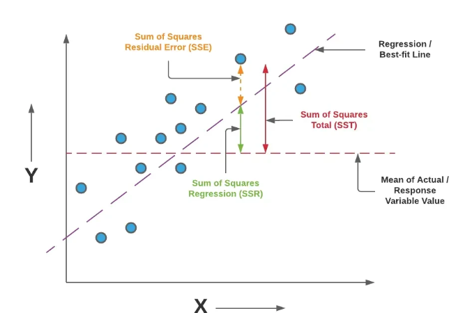
 
출처 : https://medium.com/coders-mojo/data-science-and-machine-learning-projects-mega-compilation-part-5-e50baa2faa85 

## SST(Total Sum of Squares) : 총 변동
▣ 정의 : 데이터의 총 변동량을 측정하는 지표로, 실제값($𝑦_𝑖$)과 평균값($\overline{y}$) 간의 차이를 제곱하여 합한 값으로 데이터가 얼마나 분산되어 있는지를 나타냄 
▣ 필요성 : 회귀 모델의 설명력을 평가하기 위한 기준선이 되고, 모델 없이도 데이터의 자연스러운 변동성을 계산 
▣ 장점 : 데이터의 전체 변동량을 명확히 계산하여 모델 평가의 기본 척도가 되며, 모델의 성능을 SSR, SSE와 함께 종합적으로 판단 
▣ 단점 : 실제값의 변동량만 측정할 뿐, 모델의 성능과는 직접적으로 관련이 없으며, 데이터의 스케일이나 단위에 민감하여 크기가 크게 변할 수 있음 
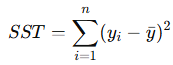
 

## SSR(Sum of Squares due to Regression) : 회귀에 의한 변동
▣ 정의 : 예측값(𝑦^𝑖)과 평균값($\overline{y}$)의 차이를 제곱하여 합한 값으로 모델이 실제 데이터의 변동 중에서 설명한 변동량을 나타냄 
▣ 필요성 : 모델이 얼마나 데이터를 설명했는지 판단하는 척도로, R² Score 계산에서 핵심 역할을 하며, 모델의 설명력을 직관적으로 보여줌 
▣ 장점 : 모델이 데이터 패턴을 얼마나 잘 파악했는지 명확히 나타내며, 𝑆𝑆𝑅이 클수록 모델의 성능이 우수함을 의미 
▣ 단점 : 단독으로 사용하면 모델의 과적합 여부를 평가하기 어렵고, 데이터에 잡음(noise)이 많을 경우 잘못된 설명력을 측정 
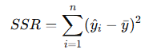
 

## SSE(Sum of Squares Residual of Error) : 잔차 제곱합
▣ 정의 : 실제값($𝑦_𝑖$)과 예측값($\widehat{y_i}$)의 차이를 제곱하여 합한 값으로 모델이 설명하지 못한 데이터의 변동량(잔차)을 나타냄 
▣ 필요성 : 모델의 예측 오차를 평가하기 위해 사용되며, 잔차 분석을 통해 모델 개선 방향을 제시 
▣ 장점 : 모델의 한계를 정량적으로 평가할 수 있으며, SSE가 작을수록 모델의 성능이 좋음을 의미 
▣ 단점 : SSE의 크기가 데이터의 크기와 단위에 따라 크게 변하며, 극단값(outliers)에 민감하여 모델 성능이 왜곡될 수 있음 
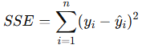
 

---

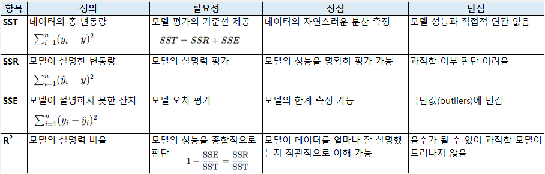
 

---

**(데이터구조)** 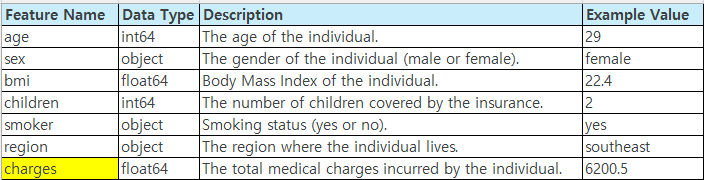
 
**(데이터셋)** https://github.com/YangGuiBee/ML/blob/main/TextBook-12/insurance.csv
 

	################################################################################
	# 데이터 시각화
	################################################################################
	
	import pandas as pd
	import seaborn as sns
	import matplotlib.pyplot as plt
	
	# Load dataset from URL
	data_url = "https://raw.githubusercontent.com/YangGuiBee/ML/main/TextBook-12/insurance.csv"
	df = pd.read_csv(data_url)
	
	# Ensure categorical columns are treated as categories
	df['sex'] = df['sex'].astype('category')
	df['smoker'] = df['smoker'].astype('category')
	df['region'] = df['region'].astype('category')
	
	# Basic information about the dataset
	print("Dataset Information:")
	print(df.info())
	print("\nBasic Statistics:")
	print(df.describe())
	
	# Visualizations
	plt.figure(figsize=(14, 10))
	
	# Distribution of Charges
	plt.subplot(3, 2, 1)
	sns.histplot(df['charges'], kde=True, bins=30, color='blue')
	plt.title('Distribution of Charges')
	plt.xlabel('Charges')
	plt.ylabel('Frequency')
	
	# Age Distribution
	plt.subplot(3, 2, 2)
	sns.histplot(df['age'], kde=True, bins=20, color='green')
	plt.title('Age Distribution')
	plt.xlabel('Age')
	plt.ylabel('Frequency')
	
	# BMI vs Charges
	plt.subplot(3, 2, 3)
	sns.scatterplot(x='bmi', y='charges', data=df, hue='smoker', palette='Set1', alpha=0.7)
	plt.title('BMI vs Charges')
	plt.xlabel('BMI')
	plt.ylabel('Charges')
	
	# Region Counts
	plt.subplot(3, 2, 4)
	sns.countplot(x='region', data=df, palette='Set2')
	plt.title('Region Counts')
	plt.xlabel('Region')
	plt.ylabel('Count')
	
	# Charges by Smoker
	plt.subplot(3, 2, 5)
	sns.boxplot(x='smoker', y='charges', data=df, palette='Set1')
	plt.title('Charges by Smoker')
	plt.xlabel('Smoker')
	plt.ylabel('Charges')
	
	# Children Distribution
	plt.subplot(3, 2, 6)
	sns.countplot(x='children', data=df, palette='Set3')
	plt.title('Children Distribution')
	plt.xlabel('Number of Children')
	plt.ylabel('Count')
	
	plt.tight_layout()
	plt.show()
	
	# Correlation Heatmap (Numerical Columns Only)
	plt.figure(figsize=(10, 8))
	numerical_columns = df.select_dtypes(include=['float64', 'int64']).columns
	sns.heatmap(df[numerical_columns].corr(), annot=True, cmap='coolwarm', fmt='.2f', linewidths=0.5)
	plt.title('Correlation Heatmap')
	plt.show()

 

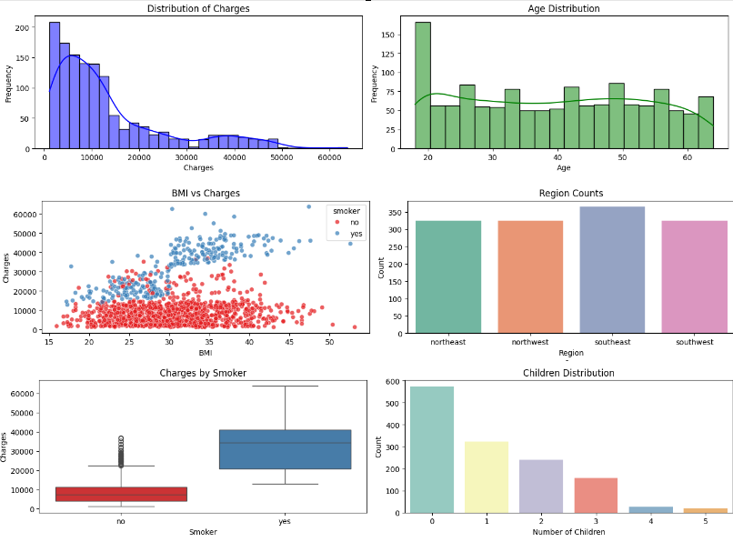
 

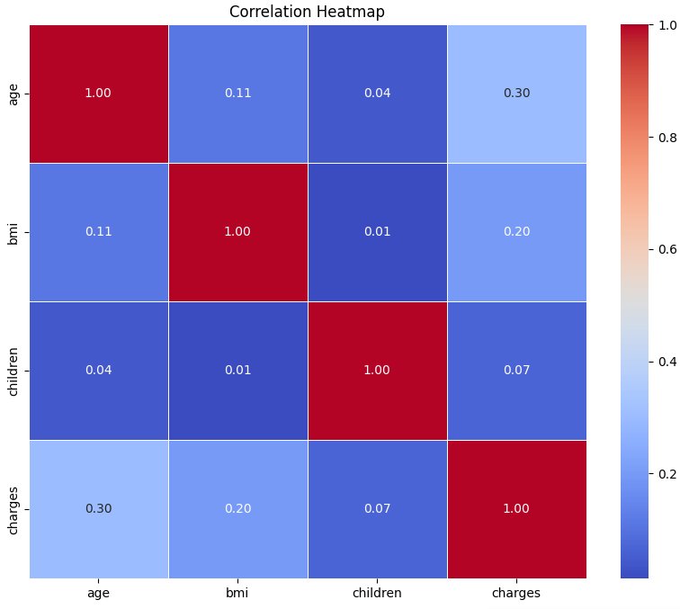
 

	################################################################################
	# Multiple Linear Regression 
	# Decision Tree Regression
	################################################################################
	
	# Check and install necessary packages
	import subprocess
	import sys
	
	def install(package):
	    try:
	        __import__(package)
	    except ImportError:
	        print(f"Installing {package}...")
	        subprocess.check_call([sys.executable, "-m", "pip", "install", package])
	
	# List of required packages
	required_packages = ['pandas', 'scikit-learn', 'xgboost', 'lightgbm', 'numpy']
	for package in required_packages:
	    install(package)
	
	# Import libraries
	import pandas as pd
	import numpy as np
	from sklearn.model_selection import train_test_split
	from sklearn.preprocessing import OneHotEncoder
	from sklearn.linear_model import LinearRegression
	from sklearn.tree import DecisionTreeRegressor
	from sklearn.metrics import mean_absolute_error, mean_squared_error, r2_score, mean_absolute_percentage_error
	
	# Load dataset from URL
	data_url = "https://raw.githubusercontent.com/YangGuiBee/ML/main/TextBook-12/insurance.csv"
	df = pd.read_csv(data_url)
	
	# Check and handle missing values
	print("Checking for missing values...")
	print(df.isnull().sum())  # Display the count of NaN values per column
	
	# Ensure no missing values
	assert not df.isnull().values.any(), "Data contains missing values!"
	
	# Preprocessing
	X = df.drop("charges", axis=1)
	y = df["charges"]
	categorical_features = ["sex", "smoker", "region"]
	numerical_features = ["age", "bmi", "children"]
	
	# Updated sparse_output instead of sparse
	encoder = OneHotEncoder(sparse_output=False, drop="first")
	X_encoded = encoder.fit_transform(X[categorical_features])
	X_numerical = X[numerical_features]
	
	X_preprocessed = pd.DataFrame(
	    np.hstack([X_numerical, X_encoded]),
	    columns=numerical_features + encoder.get_feature_names_out().tolist()
	)
	
	# Train-test split
	X_train, X_test, y_train, y_test = train_test_split(X_preprocessed, y, test_size=0.2, random_state=42)
	
	# Evaluation metrics
	def evaluate_model(y_true, y_pred):
	    me = np.mean(y_pred - y_true)  # 평균 오차 (예측값 - 실제값)
	    mae = mean_absolute_error(y_true, y_pred)  # 평균 절대 오차
	    mse = mean_squared_error(y_true, y_pred)  # 평균 제곱 오차
	    rmse = np.sqrt(mse)  # 평균 제곱근 오차
	
	    # Conditional MSLE calculation
	    if (y_true > 0).all() and (y_pred > 0).all():
	        msle = mean_squared_error(np.log1p(y_true), np.log1p(y_pred))  # 평균 제곱 오차 (로그 적용)
	        rmsle = np.sqrt(msle)  # 평균 제곱근 오차 (로그 적용)
	    else:
	        msle = np.nan
	        rmsle = np.nan
	
	    mpe = np.mean((y_pred - y_true) / y_true) * 100  # 평균 비율 오차
	    mape = mean_absolute_percentage_error(y_true, y_pred) * 100  # 평균 절대 비율 오차
	    r2 = r2_score(y_true, y_pred)  # R2 점수
	
	    return {
	        "ME": me,
	        "MAE": mae,
	        "MSE": mse,
	        "MSLE": msle,
	        "RMSE": rmse,
	        "RMSLE": rmsle,
	        "MPE": mpe,
	        "MAPE": mape,
	        "R2": r2,
	    }
	
	# Initialize models
	models = {
	    "Multiple Linear Regression": LinearRegression(),
	    "Decision Tree Regression": DecisionTreeRegressor(),
	}
	
	# Train and evaluate models
	results = {}
	for name, model in models.items():
	    model.fit(X_train, y_train)
	    y_pred = model.predict(X_test)
	
	    # Check for invalid prediction values
	    if (y_pred < 0).any():
	        print(f"Warning: Model {name} produced negative predictions. Adjusting values to zero.")
	        y_pred = np.maximum(y_pred, 0)  # Replace negative predictions with 0
	
	    results[name] = evaluate_model(y_test, y_pred)
	
	# Format evaluation results for consistent decimal places
	evaluation_results = pd.DataFrame(results)
	evaluation_results = evaluation_results.applymap(lambda x: f"{x:.6f}" if pd.notnull(x) else "NaN")
	
	# Display formatted results
	print("\nModel Evaluation Results:")
	print(evaluation_results)
	
	# Add explanations for each metric in Korean
	metric_explanations = {
	    "ME": "평균 오차 (Mean Error): 예측값과 실제값의 평균 차이. 0에 가까울수록 좋음.",
	    "MAE": "평균 절대 오차 (Mean Absolute Error): 예측값과 실제값의 절대적 차이의 평균. 낮을수록 좋음.",
	    "MSE": "평균 제곱 오차 (Mean Squared Error): 예측값과 실제값의 제곱 차이 평균. 낮을수록 좋음.",
	    "MSLE": "평균 제곱 오차 (로그 적용, Mean Squared Log Error): 로그 스케일에서의 평균 제곱 오차. 낮을수록 좋음.",
	    "RMSE": "평균 제곱근 오차 (Root Mean Squared Error): 평균 제곱 오차의 제곱근. 낮을수록 좋음.",
	    "RMSLE": "평균 제곱근 오차 (로그 적용, Root Mean Squared Log Error): 로그 스케일에서의 제곱근 오차. 낮을수록 좋음.",
	    "MPE": "평균 비율 오차 (Mean Percentage Error): 예측값과 실제값의 비율 오차 평균. 0에 가까울수록 좋음.",
	    "MAPE": "평균 절대 비율 오차 (Mean Absolute Percentage Error): 절대 비율 오차의 평균. 낮을수록 좋음.",
	    "R2": "R2 점수 (Coefficient of Determination): 모델의 설명력을 나타냄. 1에 가까울수록 좋음.",
	}
	
	# Append explanations to results
	print("\nModel Evaluation Results with Explanations:")
	for metric, explanation in metric_explanations.items():
	    print(f"{metric}: {explanation}")
	    print(evaluation_results.loc[metric])
	    print()
	
	# Prediction
	test_input = pd.DataFrame(
	    [[55, 21, 2, "female", "no", "northeast"]],
	    columns=["age", "bmi", "children", "sex", "smoker", "region"]
	)
	
	# Encode and predict
	test_encoded = encoder.transform(test_input[categorical_features])
	test_numerical = test_input[numerical_features]
	test_preprocessed = pd.DataFrame(
	    np.hstack([test_numerical, test_encoded]),
	    columns=numerical_features + encoder.get_feature_names_out().tolist()
	)
	
	# Predictions for test input
	predictions = {}
	for name, model in models.items():
	    predictions[name] = model.predict(test_preprocessed)[0]
	
	# Format predictions for consistent decimal places
	predictions_df = pd.DataFrame(predictions, index=["Predicted Charges"]).applymap(lambda x: f"{x:.6f}")
	
	# Display predictions
	print("\nPredicted Charges for Input:")
	print(predictions_df)
	
 

	################################################################################
	# Ridge Regression
	# Lasso Regression
	# Elastic Net Regression
	# Random Forest Regression
	# XGBoost
	# LightGBM
	################################################################################
	
	# Check and install necessary packages
	import subprocess
	import sys
	
	def install(package):
	    try:
	        __import__(package)
	    except ImportError:
	        print(f"Installing {package}...")
	        subprocess.check_call([sys.executable, "-m", "pip", "install", package])
	
	# List of required packages
	required_packages = ['pandas', 'scikit-learn', 'xgboost', 'lightgbm', 'numpy']
	for package in required_packages:
	    install(package)
	
	# Import libraries
	import pandas as pd
	import numpy as np
	from sklearn.model_selection import train_test_split
	from sklearn.preprocessing import OneHotEncoder
	from sklearn.linear_model import Ridge, Lasso, ElasticNet
	from sklearn.ensemble import RandomForestRegressor
	from xgboost import XGBRegressor
	from lightgbm import LGBMRegressor
	from sklearn.metrics import mean_absolute_error, mean_squared_error, r2_score, mean_absolute_percentage_error
	
	# Load dataset from URL
	data_url = "https://raw.githubusercontent.com/YangGuiBee/ML/main/TextBook-12/insurance.csv"
	df = pd.read_csv(data_url)
	
	# Check and handle missing values
	print("Checking for missing values...")
	print(df.isnull().sum())  # Display the count of NaN values per column
	
	# Ensure no missing values
	assert not df.isnull().values.any(), "Data contains missing values!"
	
	# Preprocessing
	X = df.drop("charges", axis=1)
	y = df["charges"]
	categorical_features = ["sex", "smoker", "region"]
	numerical_features = ["age", "bmi", "children"]
	
	# Updated sparse_output instead of sparse
	encoder = OneHotEncoder(sparse_output=False, drop="first")
	X_encoded = encoder.fit_transform(X[categorical_features])
	X_numerical = X[numerical_features]
	
	X_preprocessed = pd.DataFrame(
	    np.hstack([X_numerical, X_encoded]),
	    columns=numerical_features + encoder.get_feature_names_out().tolist()
	)
	
	# Train-test split
	X_train, X_test, y_train, y_test = train_test_split(X_preprocessed, y, test_size=0.2, random_state=42)
	
	# Evaluation metrics
	def evaluate_model(y_true, y_pred):
	    me = np.mean(y_pred - y_true)  # 평균 오차 (예측값 - 실제값)
	    mae = mean_absolute_error(y_true, y_pred)  # 평균 절대 오차
	    mse = mean_squared_error(y_true, y_pred)  # 평균 제곱 오차
	    rmse = np.sqrt(mse)  # 평균 제곱근 오차
	
	    # Conditional MSLE calculation
	    if (y_true > 0).all() and (y_pred > 0).all():
	        msle = mean_squared_error(np.log1p(y_true), np.log1p(y_pred))  # 평균 제곱 오차 (로그 적용)
	        rmsle = np.sqrt(msle)  # 평균 제곱근 오차 (로그 적용)
	    else:
	        msle = np.nan
	        rmsle = np.nan
	
	    mpe = np.mean((y_pred - y_true) / y_true) * 100  # 평균 비율 오차
	    mape = mean_absolute_percentage_error(y_true, y_pred) * 100  # 평균 절대 비율 오차
	    r2 = r2_score(y_true, y_pred)  # R2 점수
	
	    return {
	        "ME": me,
	        "MAE": mae,
	        "MSE": mse,
	        "MSLE": msle,
	        "RMSE": rmse,
	        "RMSLE": rmsle,
	        "MPE": mpe,
	        "MAPE": mape,
	        "R2": r2,
	    }
	
	# Initialize models
	models = {
	    "Ridge Regression": Ridge(),
	    "Lasso Regression": Lasso(),
	    "Elastic Net Regression": ElasticNet(),
	    "Random Forest Regression": RandomForestRegressor(random_state=42),
	    "XGBoost": XGBRegressor(random_state=42),
	    "LightGBM": LGBMRegressor(random_state=42),
	}
	
	# Train and evaluate models
	results = {}
	for name, model in models.items():
	    model.fit(X_train, y_train)
	    y_pred = model.predict(X_test)
	
	    # Check for invalid prediction values
	    if (y_pred < 0).any():
	        print(f"Warning: Model {name} produced negative predictions. Adjusting values to zero.")
	        y_pred = np.maximum(y_pred, 0)  # Replace negative predictions with 0
	
	    results[name] = evaluate_model(y_test, y_pred)
	
	# Format evaluation results for consistent decimal places
	evaluation_results = pd.DataFrame(results)
	evaluation_results = evaluation_results.applymap(lambda x: f"{x:.6f}" if pd.notnull(x) else "NaN")
	
	# Display formatted results
	print("\nModel Evaluation Results:")
	print(evaluation_results)
	
	# Prediction
	test_input = pd.DataFrame(
	    [[55, 21, 2, "female", "no", "northeast"]],
	    columns=["age", "bmi", "children", "sex", "smoker", "region"]
	)
	
	# Encode and predict
	test_encoded = encoder.transform(test_input[categorical_features])
	test_numerical = test_input[numerical_features]
	test_preprocessed = pd.DataFrame(
	    np.hstack([test_numerical, test_encoded]),
	    columns=numerical_features + encoder.get_feature_names_out().tolist()
	)
	
	# Predictions for test input
	predictions = {}
	for name, model in models.items():
	    predictions[name] = model.predict(test_preprocessed)[0]
	
	# Format predictions for consistent decimal places
	predictions_df = pd.DataFrame(predictions, index=["Predicted Charges"]).applymap(lambda x: f"{x:.6f}")
	
	# Display predictions
	print("\nPredicted Charges for Input:")
	print(predictions_df)

---

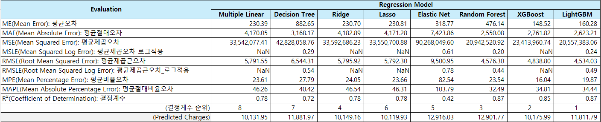
 

---
#  12-2 : 분류 평가 지표
---
	
 	[1] 오차행렬, 혼동행렬 (Confusion Matrix)
  	[2] 정확도 (Accurancy)
	[3] 정밀도 (Precision), PPV (Positive Predictive Value)
	[4] 재현율 (Recall), 민감도 (Sensitivity), TPR (True Positive Rate)
	[5] F1 score
 	[6] 오분류율 (Error Rate)
  	[7] 특이도 (Specificity), TNR(True Negative Rate)
   	[8] 위양성률 (Fall Out), FPR(False Positive Rate)
	[9] ROC curve
	[10]AUC score
	  
---

# [1] 오차행렬, 혼동행렬 (Confusion Matrix)

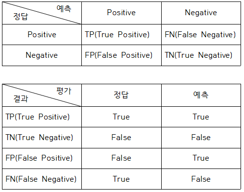 
▣ 정의: 실제 값과 예측 값 간의 분류 결과를 행렬 형태로 표현 
▣ 필요성: 분류 모델의 다양한 평가 지표 계산의 기초 
▣ 장점: 예측의 전체적인 분포를 한눈에 파악 
▣ 단점: 이진 분류에 적합하며 다중 클래스에 적용 시 복잡도가 증가 
▣ 예제: https://scikit-learn.org/stable/auto_examples/model_selection/plot_confusion_matrix.html 

TP(True Positive): 모델이 positive라고 예측했는데 실제로 정답이 positive (정답) 
TN(True Negative): 모델이 negative라고 예측했는데 실제로 정답이 negative (정답) 
FP(False Positive): 모델이 positive라고 예측했는데 실제로 정답이 negative (오답) 
FN(False Negative): 모델이 negative라고 예측했는데 실제로 정답이 positive (오답) 
 
**scikit-learn의 confusion_matrix 기반**
 
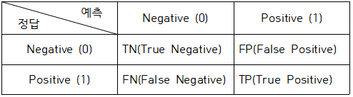

 

	from sklearn.metrics import confusion_matrix

	cm = confusion_matrix(y_true, y_pred)

 

# [2] 정확도 (Accurancy)

$Accuracy = \frac{TP + TN}{TP + TN + FP + FN}$  
▣ 정의: 전체 데이터 중 올바르게 예측된 비율(데이터가 불균형할 때(positive:negative=9:1)는 Accuracy만으로 제대로 분류했는지는 알 수 없기 때문에 Recall과 Precision을 사용) 
▣ 필요성: 모델이 얼마나 잘 작동하는지 전반적인 성능을 평가 
▣ 장점: 단순하고 이해가 용이 
▣ 단점: 불균형 데이터에서는 성능을 잘못 평가할 가능성 
▣ 예제: https://scikit-learn.org/stable/modules/generated/sklearn.metrics.accuracy_score.html 

 

	from sklearn.metrics import accuracy_score

	acc = accuracy_score(y_true, y_pred)

 

# [3] 정밀도 (Precision), PPV(Positive Predictive Value)

$Precision = \frac{TP}{TP + FP}$  
▣ 정의: 모델이 예측한 긍정(positive) 클래스 중 실제로 긍정(positive) 클래스인 비율로, 실제 정답이 negative인 데이터를 positive라고 잘못 예측하면 안 되는 경우에 중요한 지표가 될 수 있으며 Precision을 높이기 위해선 FP(모델이 positive라고 예측했는데 정답은 negative인 경우)를 낮추는 것이 중요 
▣ 필요성: 잘못된 긍정 예측(FP)을 줄이는 데 중요한 지표 
▣ 장점: 정확한 예측을 강조 
▣ 단점: FN은 고려하지 않아 재현율과 함께 사용 필요 
▣ 예제: https://scikit-learn.org/stable/modules/generated/sklearn.metrics.precision_score.html 

 

	from sklearn.metrics import precision_score
	
	precision = precision_score(y_true, y_pred)

 

# [4] 재현율 (Recall), 민감도 (Sensitivity), TPR (True Positive Rate)

$Recall = \frac{TP}{TP + FN}$  
▣ 정의: 실제로 정답이 긍정(positive)인 것들 중에서 모델이 긍정(positive)이라고 예측한 비율로, 실제 정답이 positive인 데이터를 negative라고 잘못 예측하면 안 되는 경우에 중요한 지표가 될 수 있으며, Recall를 높이기 위해선 FN(모델이 negative라고 예측했는데 정답이 positive인 경우)을 낮추는 것이 중요 
▣ 필요성: 놓친 긍정 예측(FN)을 줄이는 데 중요 
▣ 장점: 실제 긍정 클래스에 대한 모델의 민감성을 나타냄 
▣ 단점: FP는 고려하지 않아 Precision과 함께 사용 필요 
▣ 예제: https://scikit-learn.org/stable/auto_examples/model_selection/plot_precision_recall.html 

 

	from sklearn.metrics import recall_score
	
	recall = recall_score(y_true, y_pred)

 

# [5] F1 score

$F1 = \frac{2 \times Precision \times Recall}{Precision + Recall}$  
▣ 정의: Precision과 Recall의 조화 평균으로 두 값의 균형을 평가. Recall과 Precision은 상호 보완적인 평가 지표이기 때문에 F1 score를 사용하며, Precision과 Recall이 한쪽으로 치우쳐지지 않고 모두 클 때 큰 값 
▣ 필요성: 불균형 데이터에서 Precision과 Recall 간의 균형을 평가 
▣ 장점: 두 지표 간의 트레이드오프를 반영 
▣ 단점: 개별적인 성능을 평가하기 어려울 수 있음 
▣ 예제:https://scikit-learn.org/stable/modules/generated/sklearn.metrics.f1_score.html 

 

	from sklearn.metrics import f1_score

	f1 = f1_score(y_true, y_pred)

 

# [6] 오분류율 (Error Rate)

$Accuracy = \frac{FP + FN}{TP + TN + FP + FN}$  
▣ 정의: 전체 데이터 중 잘못 예측된 비율 
▣ 필요성: 모델의 부정확도를 나타냄 
▣ 장점: 정확도의 보완 지표로 활용 가능 
▣ 단점: 불균형 데이터에서는 유의미하지 않을 가능성 
▣ 예제 : https://scikit-learn.org/stable/auto_examples/model_selection/plot_train_error_vs_test_error.html 

 

	error_rate = 1 - accuracy_score(y_true, y_pred)

 

# [7] 특이도 (Specificity), TNR(True Negative Rate)

$Specificity = \frac{TN}{TN + FP}$  
▣ 정의: 실제 부정 데이터 중에서 올바르게 부정으로 예측한 비율 
▣ 필요성: 부정 클래스를 정확히 예측하는 능력을 평가 
▣ 장점: Negative class에 초점을 맞춘 분석이 가능 
▣ 단점: Positive class의 성능은 고려하지 않음 

 

	tn, fp, fn, tp = confusion_matrix(y_true, y_pred).ravel()
	
	specificity = tn / (tn + fp)

 

# [8] 위양성률 (Fall Out), FPR(False Positive Rate)

$Fall Out = 1 - Specificity = 1 - \frac{TN}{TN + FP} = \frac{FP}{FP + TN}$  
▣ 정의: 실제 부정(negative) 데이터 중에서 긍정(positive)으로 잘못 예측한 비율 
▣ 필요성: 모델이 잘못된 긍정을 얼마나 생성하는지 평가 
▣ 장점: 특이도의 보완 지표로 사용 
▣ 단점: 긍정 클래스의 성능은 평가하지 못함 

 

	tn, fp, fn, tp = confusion_matrix(y_true, y_pred).ravel()
	
	fpr = fp / (fp + tn)

 

# [9] ROC curve
▣ 정의: TPR(재현율) Y축과 FPR(위양성률) X축의 관계를 나타낸 곡선으로 다양한 임계값에서 Recall-Fallout의 변화를 시각화한 것(Fallout은 실제 False인 data 중에서 모델이 True로 분류항 비율을, Recall은 실제 True인 data 중에서 모델이 True로 분류한 비율을 나타냄) 
▣ 필요성: 분류 모델의 성능을 시각적으로 평가 
▣ 장점: Threshold에 따른 성능 변화 확인이 가능 
▣ 단점: 곡선이 단일 숫자로 요약되지 않아 비교가 어려울 가능성 
▣ 예제: https://scikit-learn.org/stable/auto_examples/model_selection/plot_roc.html 

 

	from sklearn.metrics import roc_curve

	y_score = model.predict_proba(X_test)[:, 1]
	fpr, tpr, thresholds = roc_curve(y_true, y_score)

 	

# [10] AUC (Area Under Curve) score
▣ 정의: ROC Curve의 아래 면적으로, 0에서 1 사이의 값을 가짐 
▣ 필요성: 모델의 분류 성능을 숫자로 간단히 나타냄 
▣ 장점: Threshold에 관계없이 모델 성능을 평가 
▣ 단점: 데이터 불균형이 심한 경우 왜곡될 가능성 
▣ 예제: https://scikit-learn.org/stable/modules/generated/sklearn.metrics.roc_auc_score.html 

 

	from sklearn.metrics import roc_auc_score

	auc = roc_auc_score(y_true, y_score)

 

1.0 ~ 0.9 : 아주 좋음 
0.9 ~ 0.8 : 좋음 
0.8 ~ 0.7 : 괜찮은 모델 
0.7 ~ 0.6 : 의미는 있으나 좋은 모델은 아님 
0.6 ~ 0.5 : 좋지 않은 모델 

 

**(분류 평가지표 10개 정리 예제 소스)**

	# ============================================
	# Iris 기반 이진분류 + 평가지표 10개 & 해석표
	#  - 레이블: setosa(1) vs not-setosa(0)
	# ============================================
	import numpy as np
	
	from sklearn.datasets import load_iris
	from sklearn.model_selection import train_test_split
	from sklearn.linear_model import LogisticRegression
	from sklearn.metrics import (
	    confusion_matrix,
	    accuracy_score,
	    precision_score,
	    recall_score,
	    f1_score,
	    roc_curve,
	    roc_auc_score,
	)
	
	# ---------------------------------------------------------
	# 1. 해석 기준 문자열 정의
	# ---------------------------------------------------------
	CRIT_HIGH_09 = "값 ≥ 0.90:좋음, 0.70 ≤ 값 < 0.90:보통, 값 < 0.70:나쁨"
	CRIT_LOW_01  = "값 ≤ 0.10:좋음, 0.10 < 값 ≤ 0.30:보통, 값 > 0.30:나쁨"
	CRIT_AUC     = "AUC ≥ 0.90:좋음, 0.80 ≤ AUC < 0.90:보통, AUC < 0.80:나쁨"
	CRIT_ROC     = "곡선이 좌상단에 가까울수록 좋음 (AUC 기준: " + CRIT_AUC + ")"
	
	# ---------------------------------------------------------
	# 2. 해석 함수들
	# ---------------------------------------------------------
	# 값이 클수록 좋은 지표(Acc, Precision, Recall, F1, TPR, TNR 등)
	def interpret_high_good(v):
	    if v >= 0.90: return "좋음"
	    elif v >= 0.70: return "보통"
	    else: return "나쁨"
	
	# 값이 작을수록 좋은 지표(Error Rate, FPR 등)
	def interpret_low_good(v):
	    if v <= 0.10: return "좋음"
	    elif v <= 0.30: return "보통"
	    else: return "나쁨"
	
	# AUC 및 ROC 해석용
	def interpret_auc(v):
	    if v >= 0.90: return "좋음"
	    elif v >= 0.80: return "보통"
	    else: return "나쁨"
	
	# ---------------------------------------------------------
	# 3. 데이터 로드 & 이진 분류 문제 구성
	# ---------------------------------------------------------
	iris = load_iris()
	X = iris.data               # (150, 4)
	y_multi = iris.target       # 0:setosa, 1:versicolor, 2:virginica
	
	# 이진 분류: setosa(1) vs 나머지(0)
	y = (y_multi == 0).astype(int)
	
	X_train, X_test, y_train, y_test = train_test_split(X, y, test_size=0.3, random_state=42, stratify=y)
	
	# 간단한 로지스틱 회귀 분류기
	clf = LogisticRegression(solver="liblinear")
	clf.fit(X_train, y_train)
	
	# 예측 (레이블, 확률)
	y_pred = clf.predict(X_test)
	y_score = clf.predict_proba(X_test)[:, 1]   # 양성(1)일 확률
	
	# ---------------------------------------------------------
	# 4. 분류 평가지표 10개 계산
	# ---------------------------------------------------------
	# [1] Confusion Matrix
	cm = confusion_matrix(y_test, y_pred)
	tn, fp, fn, tp = cm.ravel()
	
	# [2] Accuracy
	acc = accuracy_score(y_test, y_pred)
	
	# [3] Precision (PPV)
	precision = precision_score(y_test, y_pred)
	
	# [4] Recall / Sensitivity / TPR
	recall = recall_score(y_test, y_pred)  # TPR
	
	# [5] F1 score
	f1 = f1_score(y_test, y_pred)
	
	# [6] Error Rate
	error_rate = 1 - acc
	
	# [7] Specificity / TNR
	specificity = tn / (tn + fp)
	
	# [8] FPR (Fall-out)
	fpr_value = fp / (fp + tn)
	
	# [9] ROC curve
	fpr, tpr, thresholds = roc_curve(y_test, y_score)  # 곡선용 좌표
	
	# [10] AUC score
	auc = roc_auc_score(y_test, y_score)
	
	# ---------------------------------------------------------
	# 5. Raw 값 출력
	# ---------------------------------------------------------
	print("=== Classification Metrics on Iris (setosa vs others) ===\n")	
	print(">> Raw Metric Values")
	print(f"[1] Confusion Matrix:\n{cm}")
	print(f"[2] Accuracy                : {acc:.4f}")
	print(f"[3] Precision (PPV)         : {precision:.4f}")
	print(f"[4] Recall (Sensitivity/TPR): {recall:.4f}")
	print(f"[5] F1-score                : {f1:.4f}")
	print(f"[6] Error Rate              : {error_rate:.4f}")
	print(f"[7] Specificity (TNR)       : {specificity:.4f}")
	print(f"[8] FPR (Fall-out)          : {fpr_value:.4f}")
	print(f"[9] ROC curve points        : fpr.shape={fpr.shape}, tpr.shape={tpr.shape}")
	print(f"[10] AUC score              : {auc:.4f}\n")
	
	# ---------------------------------------------------------
	# 6. 해석용 테이블 구성 (지표명, 값, 해석, 기준)
	# ---------------------------------------------------------
	rows = []
	
	# [1] Confusion Matrix → 정확도를 기준으로 해석
	rows.append((
	    "[1] Confusion Matrix", f"TN={tn}, FP={fp}, FN={fn}, TP={tp}",
	    interpret_high_good(acc), "대각합 비율(Accuracy) 기준: " + CRIT_HIGH_09))
	
	rows.append((
	    "[2] Accuracy", f"{acc:.4f}", interpret_high_good(acc), CRIT_HIGH_09))
	
	rows.append((
	    "[3] Precision (PPV)", f"{precision:.4f}", interpret_high_good(precision), CRIT_HIGH_09	))
	
	rows.append((
	    "[4] Recall (Sensitivity/TPR)",f"{recall:.4f}", interpret_high_good(recall), CRIT_HIGH_09))
	
	rows.append((
	    "[5] F1-score",f"{f1:.4f}", interpret_high_good(f1), CRIT_HIGH_09))
	
	rows.append((
	    "[6] Error Rate", f"{error_rate:.4f}", interpret_low_good(error_rate), CRIT_LOW_01))
	
	rows.append((
	    "[7] Specificity (TNR)", f"{specificity:.4f}", interpret_high_good(specificity), CRIT_HIGH_09))
	
	rows.append((
	    "[8] FPR (Fall-out)", f"{fpr_value:.4f}", interpret_low_good(fpr_value), CRIT_LOW_01))
	
	rows.append((
	    "[9] ROC curve", f"points={len(fpr)}개", interpret_auc(auc), CRIT_ROC))
	
	rows.append((
	    "[10] AUC score", f"{auc:.4f}", interpret_auc(auc), CRIT_AUC))
	
	# ---------------------------------------------------------
	# 7. 해석 테이블 출력
	# ---------------------------------------------------------
	print(">> 해석 테이블 (휴리스틱 기준, 데이터/도메인에 따라 조정 권장)")
	print("-" * 120)
	print(f"{'지표':<28}{'값':<24}{'해석':<10}{'기준'}")
	print("-" * 120)
	
	for name, value, interp, crit in rows:
	    print(f"{name:<28}{value:<24}{interp:<10}{crit}")
	
	print("-" * 120)
	print("\n※ 위 구간값들은 실무·연구에서 자주 쓰는 휴리스틱 기준이며, 문제 난이도와 도메인에 따라 조정해서 사용하세요.")

**(분류 평가지표 10개 정리 예제 소스 실행 결과)**

 

---

**(데이터 출처)** https://www.kaggle.com/datasets/redwankarimsony/heart-disease-data/data
 
**(데이터구조)** 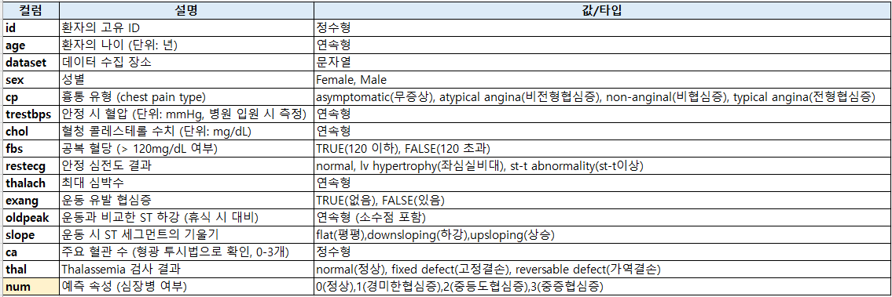
 
**(데이터셋)** https://github.com/YangGuiBee/ML/blob/main/TextBook-14/heart_disease_uci.csv

	import pandas as pd
	import numpy as np
	from sklearn.model_selection import train_test_split
	from sklearn.preprocessing import StandardScaler, LabelEncoder
	from sklearn.linear_model import LogisticRegression
	from sklearn.naive_bayes import GaussianNB
	from sklearn.neighbors import KNeighborsClassifier
	from sklearn.svm import SVC
	from sklearn.tree import DecisionTreeClassifier
	from sklearn.ensemble import RandomForestClassifier
	from sklearn.metrics import (confusion_matrix, accuracy_score, precision_score, recall_score, 
	                             f1_score, roc_auc_score, roc_curve)
	import matplotlib.pyplot as plt
	
	# 1. 데이터셋 불러오기
	data_url = "https://raw.githubusercontent.com/YangGuiBee/ML/main/TextBook-12/heart_disease_uci.csv"
	df = pd.read_csv(data_url)
	
	# 2. 결측값 확인 및 처리
	print("Missing values in dataset before processing:\n", df.isnull().sum())  # 결측값 확인
	
	# 결측값 처리
	for col in df.columns:
	    if df[col].dtype == 'object':  # 범주형 데이터
	        df[col].fillna(df[col].mode()[0], inplace=True)  # 최빈값으로 대체
	    else:  # 수치형 데이터
	        df[col].fillna(df[col].mean(), inplace=True)  # 평균값으로 대체
	
	print("Missing values in dataset after processing:\n", df.isnull().sum())  # 결측값 확인
	
	# 3. 컬럼 이름 정리
	if 'num' in df.columns:
	    df.rename(columns={"num": "target"}, inplace=True)  # 'num' 열을 'target'으로 변경
	else:
	    raise ValueError("The dataset does not contain a 'num' column.")
	
	# 4. 타겟 변수 확인
	assert 'target' in df.columns, "The dataset does not contain a 'target' column."
	df['target'] = df['target'].astype(int)  # 보장: 타겟 변수는 정수
	
	# 독립 변수와 종속 변수 분리
	X = df.drop(["target", "id", "dataset"], axis=1)  # 불필요한 열 제거
	y = df["target"]
	
	# Train-Test Split 후 결측값 확인
	X_train, X_test, y_train, y_test = train_test_split(X, y, test_size=0.2, random_state=42, stratify=y)
	
	# 최종적으로 결측값 확인
	assert not X_train.isnull().values.any(), "X_train contains NaN values!"
	assert not X_test.isnull().values.any(), "X_test contains NaN values!"
	
	# 범주형 변수 처리
	label_encoders = {}
	categorical_columns = ['sex', 'cp', 'restecg', 'slope', 'thal']  # 범주형 컬럼
	for col in categorical_columns:
	    le = LabelEncoder()
	    X_train[col] = le.fit_transform(X_train[col])  # 범주형 변수를 수치형으로 변환
	    X_test[col] = le.transform(X_test[col])  # 동일한 변환 적용
	    label_encoders[col] = le
	
	# 데이터 스케일링 (k-NN, SVM에서 필요)
	scaler = StandardScaler()
	X_train_scaled = scaler.fit_transform(X_train)
	X_test_scaled = scaler.transform(X_test)
	
	# 분류 알고리즘 초기화
	models = {
	    "Logistic Regression": LogisticRegression(),
	    "Naive Bayes": GaussianNB(),
	    "k-Nearest Neighbors": KNeighborsClassifier(n_neighbors=5),
	    "Support Vector Classifier": SVC(probability=True),
	    "Decision Tree": DecisionTreeClassifier(),
	    "Random Forest": RandomForestClassifier(n_estimators=100, random_state=42)
	}
	
	# 결과 저장용
	results = {}
	
	# 모델 학습 및 평가
	for name, model in models.items():
	    if name in ["k-Nearest Neighbors", "Support Vector Classifier"]:
	        model.fit(X_train_scaled, y_train)  # 스케일링된 데이터 사용
	        y_pred = model.predict(X_test_scaled)
	        y_prob = model.predict_proba(X_test_scaled)
	    else:
	        model.fit(X_train, y_train)
	        y_pred = model.predict(X_test)
	        y_prob = model.predict_proba(X_test)
	    
	    # 평가
	    cm = confusion_matrix(y_test, y_pred)
	    acc = accuracy_score(y_test, y_pred)
	    prec = precision_score(y_test, y_pred, average='macro')  # 다중 클래스 처리
	    rec = recall_score(y_test, y_pred, average='macro')      # 다중 클래스 처리
	    f1 = f1_score(y_test, y_pred, average='macro')           # 다중 클래스 처리
	    error_rate = 1 - acc
	    auc = roc_auc_score(y_test, y_prob, multi_class='ovr')   # 다중 클래스 AUC
	
	    # 오차행렬에서 TP, FP, TN, FN 계산
	    tp = np.diag(cm).sum()  # True Positives
	    fp = cm.sum(axis=0) - np.diag(cm)  # False Positives
	    fn = cm.sum(axis=1) - np.diag(cm)  # False Negatives
	    tn = cm.sum() - (fp + fn + tp)  # True Negatives
	
	    # 클래스별 지표 평균 계산
	    specificity = tn / (tn + fp)
	    fall_out = fp / (fp + tn)
	    recall = tp / (tp + fn)
	
	    # 결과 저장
	    results[name] = {
	        "Confusion Matrix (Numeric Values)": cm.tolist(),
	        "Accuracy": acc,
	        "Precision": prec,
	        "Recall (TPR)": recall.mean(),
	        "F1 Score": f1,
	        "Error Rate": error_rate,
	        "AUC": auc,
	        "Specificity (TNR)": specificity.mean(),
	        "Fall Out (FPR)": fall_out.mean(),
	    }
	
	# 결과 출력
	for name, metrics in results.items():
	    print(f"\n{name} Results:")
	    for metric, value in metrics.items():
	        if metric == "Confusion Matrix (Numeric Values)":
	            print(f"{metric}:\n{value}")
	        else:
	            print(f"{metric}: {value:.4f}")
	
	# ROC Curve 시각화
	plt.figure(figsize=(10, 6))
	for name, model in models.items():
	    if name in ["k-Nearest Neighbors", "Support Vector Classifier"]:
	        y_prob = model.predict_proba(X_test_scaled)
	    else:
	        y_prob = model.predict_proba(X_test)
	    fpr = {}
	    tpr = {}
	    for i in range(len(np.unique(y_test))):  # 각 클래스별로 처리
	        fpr[i], tpr[i], _ = roc_curve(y_test, y_prob[:, i], pos_label=i)
	        plt.plot(fpr[i], tpr[i], label=f"{name} (Class {i})")
	
	plt.plot([0, 1], [0, 1], "k--", label="Random Guess")
	plt.xlabel("False Positive Rate")
	plt.ylabel("True Positive Rate")
	plt.title("ROC Curve")
	plt.legend()
	plt.show()
	
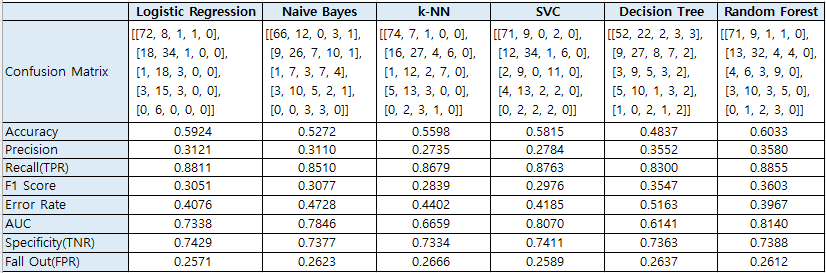
  

Random Forest는 Accuracy, Error Rate, AUC 측면에서 전반적으로 우수하며, 최고의 모델로 평가 
SVC는 높은 AUC와 낮은 FPR로 신뢰할 수 있는 두 번째 모델로 평가 

---

**데이터 전처리**  
**num = 0 → target = 0 (심장병 없음)**  
**num = 1, 2, 3, 4 → target = 1 (심장병 있음)**  

	import pandas as pd
	import numpy as np
	from sklearn.model_selection import train_test_split
	from sklearn.preprocessing import StandardScaler, LabelEncoder
	from sklearn.linear_model import LogisticRegression
	from sklearn.naive_bayes import GaussianNB
	from sklearn.neighbors import KNeighborsClassifier
	from sklearn.svm import SVC
	from sklearn.tree import DecisionTreeClassifier
	from sklearn.ensemble import RandomForestClassifier
	from sklearn.metrics import (confusion_matrix, accuracy_score, precision_score, recall_score, 
	                             f1_score, roc_auc_score, roc_curve)
	import matplotlib.pyplot as plt
	
	# 1. 데이터셋 불러오기
	data_url = "https://raw.githubusercontent.com/YangGuiBee/ML/main/TextBook-12/heart_disease_uci.csv"
	df = pd.read_csv(data_url)
	
	# 2. 결측값 확인 및 처리
	print("Missing values in dataset before processing:\n", df.isnull().sum())  # 결측값 확인
	
	# 결측값 처리
	for col in df.columns:
	    if df[col].dtype == 'object':  # 범주형 데이터
	        df[col].fillna(df[col].mode()[0], inplace=True)  # 최빈값으로 대체
	    else:  # 수치형 데이터
	        df[col].fillna(df[col].mean(), inplace=True)  # 평균값으로 대체
	
	print("Missing values in dataset after processing:\n", df.isnull().sum())  # 결측값 확인
	
	# 3. 타겟 변수 확인 및 이진 분류로 변환
	if 'target' not in df.columns:
	    df.rename(columns={"num": "target"}, inplace=True)  # 'num' 열을 'target'으로 변경
	assert 'target' in df.columns, "The dataset does not contain a 'target' column."
	
	if df['target'].nunique() > 2:
	    print("Warning: Detected multiclass target. Converting to binary classification (0/1).")
	    df['target'] = (df['target'] > 0).astype(int)  # 0: 심장병 없음, 1: 심장병 있음
	
	# 독립 변수와 종속 변수 분리
	X = df.drop(["target"], axis=1)  # 타겟 열 제거
	y = df["target"]
	
	# 범주형 열 확인 및 고유값 확인
	print("\nUnique values in categorical columns before encoding:")
	for col in X.columns:
	    if X[col].dtype == 'object':
	        print(f"{col}: {X[col].unique()}")
	
	# 4. 범주형 변수 처리
	label_encoders = {}
	categorical_columns = [col for col in X.columns if X[col].dtype == 'object']  # 문자열 컬럼 자동 탐지
	for col in categorical_columns:
	    le = LabelEncoder()
	    X[col] = le.fit_transform(X[col])  # 범주형 변수를 수치형으로 변환
	    label_encoders[col] = le
	
	# 범주형 처리 후 확인
	print("\nUnique values in categorical columns after encoding:")
	for col in categorical_columns:
	    print(f"{col}: {X[col].unique()}")
	
	# 5. Train-Test Split
	X_train, X_test, y_train, y_test = train_test_split(X, y, test_size=0.2, random_state=42, stratify=y)
	
	# 6. 데이터 스케일링 (k-NN, SVM에서 필요)
	scaler = StandardScaler()
	X_train_scaled = scaler.fit_transform(X_train)
	X_test_scaled = scaler.transform(X_test)
	
	# 7. 분류 알고리즘 초기화
	models = {
	    "Logistic Regression": LogisticRegression(),
	    "Naive Bayes": GaussianNB(),
	    "k-Nearest Neighbors": KNeighborsClassifier(n_neighbors=5),
	    "Support Vector Classifier": SVC(probability=True),
	    "Decision Tree": DecisionTreeClassifier(),
	    "Random Forest": RandomForestClassifier(n_estimators=100, random_state=42)
	}
	
	# 결과 저장용
	results = {}
	
	# 8. 모델 학습 및 평가
	for name, model in models.items():
	    if name in ["k-Nearest Neighbors", "Support Vector Classifier"]:
	        model.fit(X_train_scaled, y_train)  # 스케일링된 데이터 사용
	        y_pred = model.predict(X_test_scaled)
	        y_prob = model.predict_proba(X_test_scaled)[:, 1]
	    else:
	        model.fit(X_train, y_train)
	        y_pred = model.predict(X_test)
	        y_prob = model.predict_proba(X_test)[:, 1]
	    
	    # 평가
	    cm = confusion_matrix(y_test, y_pred)
	    acc = accuracy_score(y_test, y_pred)
	    prec = precision_score(y_test, y_pred)
	    rec = recall_score(y_test, y_pred)
	    f1 = f1_score(y_test, y_pred)
	    error_rate = 1 - acc
	    auc = roc_auc_score(y_test, y_prob)
	
	    # 결과 저장
	    results[name] = {
	        "Confusion Matrix": cm.tolist(),
	        "Accuracy": acc,
	        "Precision": prec,
	        "Recall (TPR)": rec,
	        "F1 Score": f1,
	        "Error Rate": error_rate,
	        "AUC": auc
	    }
	
	# 결과 출력
	for name, metrics in results.items():
	    print(f"\n{name} Results:")
	    for metric, value in metrics.items():
	        if metric == "Confusion Matrix":
	            print(f"{metric}:\n{value}")
	        else:
	            print(f"{metric}: {value:.4f}")
	
	# 9. ROC Curve 시각화
	plt.figure(figsize=(10, 6))
	for name, model in models.items():
	    if name in ["k-Nearest Neighbors", "Support Vector Classifier"]:
	        y_prob = model.predict_proba(X_test_scaled)[:, 1]
	    else:
	        y_prob = model.predict_proba(X_test)[:, 1]
	    fpr, tpr, _ = roc_curve(y_test, y_prob)
	    plt.plot(fpr, tpr, label=f"{name} (AUC: {roc_auc_score(y_test, y_prob):.2f})")
	
	plt.plot([0, 1], [0, 1], "k--", label="Random Guess")
	plt.xlabel("False Positive Rate")
	plt.ylabel("True Positive Rate")
	plt.title("ROC Curve")
	plt.legend()
	plt.show()

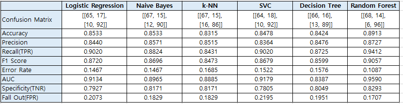
   

[1] 오차행렬, 혼동행렬(Confusion Matrix) : 각 모델이 클래스 간 데이터를 어떻게 분류했는지를 나타냄 
[2] 정확도(Accurancy) : 가장 간단한 기준으로, 전체 데이터 중 올바르게 예측한 비율 
[3] 정밀도(Precision), PPV(Positive Predictive Value) : 모델이 양성으로 예측한 데이터 중 실제로 양성인 비율 
[4] 재현율(Recall), 민감도(Sensitivity), TPR(True Positive Rate) : 실제 양성 데이터를 얼마나 잘 탐지했는지 나타냄 
[5] F1 score : Precision과 Recall의 조화 평균으로, 두 지표의 균형을 평가 
[6] 오분류율(Error Rate) : 정확도의 보완 지표로, 전체 데이터 중 모델이 잘못 예측한 비율 
[7] 특이도(Specificity), TNR(True Negative Rate) : 실제 음성 데이터를 얼마나 잘 탐지했는지 나타냄 
[8] 위양성률(Fall Out), FPR(False Positive Rate) : 음성 데이터를 양성 데이터로 잘못 분류한 비율 
[9] ROC curve : 모든 임계값(threshold)에 대해 TPR(민감도, Recall)와 FPR(위양성률)의 관계 시각화 
[10]AUC score : 모델이 클래스 분류에서 얼마나 잘 분리할 수 있는지 나타내는 지표 

---

