 
 

 
 

 
 

 
 

 
 

 
 

#  12-1 : 회귀 평가 지표

---

	[1] 평균 오차 (Mean Error, ME) : 예측 오차의 부호를 유지한 평균
	[2] 평균 절대 오차 (Mean Absolute Error, MAE) : 오차의 절댓값 평균
	[3] 평균 제곱 오차 (Mean Squared Error, MSE) : 오차 제곱의 평균
	[4] 평균 제곱 오차(로그적용) (Mean Squared Log Error, MSLE) : 로그 변환 후 MSE
	[5] 평균 제곱근 오차 (Root Mean Squared Error, RMSE) : MSE의 제곱근
	[6] 평균 제곱근 오차(로그적용) (Root Mean Squared Log Error, RMSLE) : 로그 기반 RMSE
	[7] 평균 비율 오차 (Mean Percentage Error, MPE) : 오차를 실제값으로 나눈 평균
	[8] 평균 절대 비율 오차 (Mean Absolute Percentage Error, MAPE) : 비율 기반 직관적 지표
	[9] 평균 절대 규모 오차 (Mean Absolute Scaled Error, MASE) : 기준 예측(naive forecast) 대비 오차
	[10] 결정계수 (R2 score) : 분산 설명력

	  
---

# [1] 평균 오차 (Mean Error, ME)

 
▣ 정의: 실제값과 예측값의 차이를 평균낸 값으로, 오차의 방향성을 포함한 예측오차의 산술평균을 의미 
▣ 필요성: 오차가 양수인지 음수인지, 평균적으로 과대평가 또는 과소평가되는지를 파악 
▣ 장점: 오차의 방향성을 반영하여 모델의 편향(bias)을 분석 
▣ 단점: 양수와 음수가 상쇄되므로, 실제 오차의 크기를 판단하기 어렵다 
▣ 가이드 : https://scikit-learn.org/stable/modules/model_evaluation.html#regression-metrics 
▣ API : 직접 구현 필요 
▣ 예제 : https://scikit-learn.org/stable/modules/model_evaluation.html#custom-scorers 

	def ME(y_true, y_pred):
		return (y_true - y_pred).mean(axis=None)

 

# [2] 평균 절대 오차 (Mean Absolute Error, MAE)

 
▣ 정의: 실제 정답 값과 예측 값의 차이를 절댓값으로 변환한 뒤 합산하여 평균을 구한다. 
▣ 필요성: 모델의 평균적인 예측 오차 크기를 직관적으로 파악, 특이값이 많은 경우에 주로 사용 
▣ 장점: 직관적이고 정답 및 예측 값과 같은 단위를 가지고, MSE, RMSE에 비해 극단값(outlier)에 덜 민감 
▣ 단점: 절댓값을 취하므로 underestimates/overestimates인지에 대한 판단을 할 수 없으며, 스케일 의존적(scal dependency)으로 모델마다 에러 크기가 동일해도 에러율은 동일하지 않고, 오차의 방향성을 알 수 없다 
▣ 가이드 : https://scikit-learn.org/stable/modules/model_evaluation.html#mean-absolute-error 
▣ API : https://scikit-learn.org/stable/modules/generated/sklearn.metrics.mean_absolute_error.html 
▣ 예제 : https://scikit-learn.org/stable/modules/model_evaluation.html#mean-absolute-error 

	def MAE(y_true, y_pred):
    	return (abs(y_true - y_pred)).mean(axis=None)

 

	from sklearn.metrics import mean_absolute_error
	
	mae = mean_absolute_error(y_true, y_pred)
   
 

# [3] 평균 제곱 오차 (Mean Squared Error, MSE)

 
▣ 정의: 실제 정답 값과 예측 값의 차이를 제곱(예측값과 실제값 차이의 면적)한 뒤 평균을 구한다. 
▣ 필요성: 오차의 크기를 강조해 큰 오차에 민감하게 반응 
▣ 장점: 직관적이며, 모델의 큰 오차를 더 잘 식별 가능 
▣ 단점: 예측 변수와 단위가 다르며, 오차를 제곱하기 때문에 이상치에 민감(제곱하기 때문에 1미만의 에러는 작아지고 그 이상의 에러는 커짐), 제곱을 씌우게 되어 underestimates/overestimates인지 파악하기 힘들며, 스케일 의존적(scal dependency)이라 모델마다 에러러 크기가 동일해도 에러율은 동일하지 않은 단점. 오차제곱합(SSE)와 유사하지만 오차제곱합으로는 실제 오차가 커서 값이 커지는 것인지 데이터의 양이 많아서 값이 커지는 것인지를 구분할 수 없게 된다. 
▣ 가이드 : https://scikit-learn.org/stable/modules/model_evaluation.html#mean-squared-error 
▣ API : https://scikit-learn.org/stable/modules/generated/sklearn.metrics.mean_squared_error.html 
▣ 예제 : https://scikit-learn.org/stable/modules/model_evaluation.html#mean-squared-error 

	def MSE(y_true, y_pred):
    	return ((y_true - y_pred)**2).mean(axis=None)

 

	from sklearn.metrics import mean_squared_error
	
	mse = mean_squared_error(y_true, y_pred)

 

# [4] 평균 제곱 오차(로그적용) (Mean Squared Log Error, MSLE)

 
▣ 정의: 예측값과 실제값 간의 로그 차이에 대한 제곱 평균으로 MSE에 로그를 적용  
▣ 필요성: 작은 값의 상대적인 차이를 강조하며 큰 값의 차이를 완화 
▣ 장점: 작은 값에 집중하여 예측하는 모델에 적합(결정 값이 클수록 오류값도 커지기 때문에 일부 큰 오류값들로 인해 전체 오류값이 커지는 것을 막아준다) 
▣ 단점: 로그 연산으로 인해 음수 값은 처리 불가능 
▣ 가이드 : https://scikit-learn.org/stable/modules/model_evaluation.html#mean-squared-log-error 
▣ API : https://scikit-learn.org/stable/modules/generated/sklearn.metrics.mean_squared_log_error.html 
▣ 예제 : https://scikit-learn.org/stable/modules/model_evaluation.html#mean-squared-log-error 

	def MSLE(y_true, y_pred):
		return np.log((y_true - y_pred)**2).mean(axis=None)

 

	from sklearn.metrics import mean_squared_log_error

	msle = mean_squared_log_error(y_true, y_pred)

 

# [5] 평균 제곱근 오차 (Root Mean Squared Error, RMSE)

 
▣ 정의: MSE의 제곱근으로, 실제값과 예측값 간의 평균적 차이를 원 단위로 환산 
▣ 필요성: 단위를 실제 데이터와 동일하게 조정 
▣ 장점: 해석이 쉬우며, 큰 오차를 강조(MSE에 루트는 씌워서 에러를 제곱해서 생기는 값의 왜곡이 줄어든다) 
▣ 단점: 극단값에 민감하고, 제곱 후 루트를 씌우기 때문에 MAE처럼 실제 값에 대해 underestimates/overestimates인지 파악하기 힘들고, 스케일 의존적(scal dependency)으로 모델마다 에러 크기가 동일해도 에러율은 동일하지 않은 단점 
▣ 가이드 : https://scikit-learn.org/stable/modules/model_evaluation.html#mean-squared-error 
▣ API : https://scikit-learn.org/stable/modules/generated/sklearn.metrics.mean_squared_error.html 
▣ 예제 : https://scikit-learn.org/stable/modules/model_evaluation.html#mean-squared-error 

 

	def RMSE(y_true, y_pred):
		return np.sqrt(((y_true - y_pred) ** 2).mean(axis=None))

 

# [6] 평균 제곱근 오차(로그적용) (Root Mean Squared Log Error, RMSLE)

 
▣ 정의: MSLE의 제곱근 값으로, 로그 차이를 원 단위로 환산한 값으로 RMSE값에 로그를 취한 값 
▣ 필요성: 작은 값의 상대적 차이를 평가 
▣ 장점: 상대적 오차에 강점(결정 값이 클 수록 오류 값도 커지기 때문에 일부 큰 오류 값들로인해 전체 오류값이 커지는 것을 막아준다) 
▣ 단점: 음수 값 불가 
▣ 가이드 : https://scikit-learn.org/stable/modules/model_evaluation.html#mean-squared-log-error 
▣ API : https://scikit-learn.org/stable/modules/generated/sklearn.metrics.mean_squared_log_error.html 
▣ 예제 : https://scikit-learn.org/stable/modules/model_evaluation.html#mean-squared-log-error 

	def RMSLE(y_true, y_pred):
		return np.log(np.sqrt(((y_true - y_pred) ** 2).mean(axis=None)))

 

# [7] 평균 비율 오차 (Mean Percentage Error, MPE)

 
▣ 정의: 오차를 실제값에 대한 백분율로 계산해 평균 
▣ 필요성: 예측 오차의 방향성과 백분율 크기를 파악, 절대적인 의미의 예측오차뿐 아니라 상대적인 의미의 예측오차가 필요할 경우에 계산 
▣ 장점: 상대적 크기 비교 가능(음수면 overperformance, 양수면 underperformance으로 판단), 모델이 underestimates/overestimates인지 판단할 수 있다는 장점 
▣ 단점: 실제값이 0일 때 계산 불가 
▣ 가이드 : https://scikit-learn.org/stable/modules/model_evaluation.html#custom-scorers 
▣ API : 직접 구현 
▣ 예제 : https://scikit-learn.org/stable/modules/model_evaluation.html#defining-your-scoring-strategy 

	def MPE(y_true, y_pred):
		return (((y_true - y_pred)/y_true)*100).mean(axis=None)

 

# [8] 평균 절대 비율 오차 (Mean Absolute Percentage Error, MAPE)

 
▣ 정의: 절대 오차를 백분율로 계산해 평균(MAE를 비율, 퍼센트로 표현하여 스케인 의존적 에러의 문제점을 개선) 
▣ 필요성: 오차를 상대적으로 평가 
▣ 장점 : 직관적이고, 다른 모델과 에러율 비교가 쉬운 장점 
▣ 단점: 0값 문제와 극단값에 민감(실제 정답보다 낮게 예측했는지, 높게 했는지를 파악하기 힘들고 실제 정답이 1보다작을 경우,무한대의 값으로 수렴) 
▣ 가이드 : https://scikit-learn.org/stable/modules/model_evaluation.html#mean-absolute-percentage-error 
▣ API : https://scikit-learn.org/stable/modules/generated/sklearn.metrics.mean_absolute_percentage_error.html 
▣ 예제 : https://scikit-learn.org/stable/modules/model_evaluation.html#mean-absolute-percentage-error 

	def MAPE(y_true, y_pred):
		return ((abs((y_true - y_pred)/y_true))*100).mean(axis=None)

 
	
	from sklearn.metrics import mean_absolute_percentage_error
	
	mape = mean_absolute_percentage_error(y_true, y_pred)

 

# [9] 평균 절대 규모 오차 (Mean Absolute Scaled Error, MASE)
<!--   -->
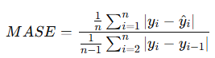
 
▣ 정의: 예측값의 오차를 기준 시점의 오차와 비교하여 비율화(데이터를 척도화하여 이를 기준으로 예측오차의 절대값에 대한 평균) 
▣ 필요성: 데이터에 따라 유연한 평가 가능 
▣ 장점: 스케일에 대한 의존성이 낮아서 안정적으로 비교 가능 
▣ 단점: 해석이 상대적으로 어렵다 
▣ 가이드 : https://scikit-learn.org/stable/modules/model_evaluation.html 
▣ API : 직접 구현 
▣ 예제 : https://scikit-learn.org/stable/modules/model_evaluation.html#custom-scorers 

	def MASE(y_true, y_pred):
    	mae = np.mean(np.abs(y_true - y_pred))
    	naive_mae = np.mean(np.abs(y_true[1:] - y_true[:-1]))
    	return mae / naive_mae

	mase = MASE(y_true, y_pred)

 

# [10] R2 score
▣ 정의: 모델의 설명력을 나타내는 지표로 **SST(Total Sum of Squares)** 관측값에서 관측값의 평균(혹은 추정치의 평균)을 뺀 결과의 총합인 총 제곱합 
▣ 필요성: 전체(Total)에 대한 변동성을 나타냄으로써 모델이 데이터를 얼마나 잘 설명하는지 파악 
▣ 장점: 직관적 
▣ 단점: 모델이 최소한의 기준도 만족하지 못하는 경우는 음수가 될 수 있음 
▣ 가이드 : https://scikit-learn.org/stable/modules/model_evaluation.html#r2-score 
▣ API : https://scikit-learn.org/stable/modules/generated/sklearn.metrics.r2_score.html 
▣ 예제 : https://scikit-learn.org/stable/modules/model_evaluation.html#r2-score 

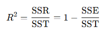
 
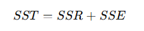
 

	from sklearn.metrics import r2_score

	r2 = r2_score(y_true, y_pred)

 

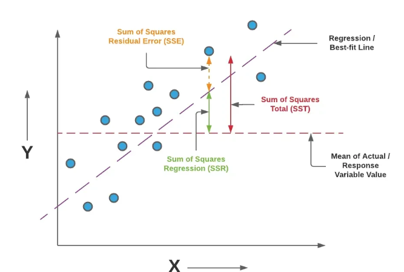
 
출처 : https://medium.com/coders-mojo/data-science-and-machine-learning-projects-mega-compilation-part-5-e50baa2faa85 

## SST(Total Sum of Squares) : 총 변동
▣ 정의 : 데이터의 총 변동량을 측정하는 지표로, 실제값($𝑦_𝑖$)과 평균값($\overline{y}$) 간의 차이를 제곱하여 합한 값으로 데이터가 얼마나 분산되어 있는지를 나타냄 
▣ 필요성 : 회귀 모델의 설명력을 평가하기 위한 기준선이 되고, 모델 없이도 데이터의 자연스러운 변동성을 계산 
▣ 장점 : 데이터의 전체 변동량을 명확히 계산하여 모델 평가의 기본 척도가 되며, 모델의 성능을 SSR, SSE와 함께 종합적으로 판단 
▣ 단점 : 실제값의 변동량만 측정할 뿐, 모델의 성능과는 직접적으로 관련이 없으며, 데이터의 스케일이나 단위에 민감하여 크기가 크게 변할 수 있음 
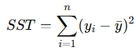
 

## SSR(Sum of Squares due to Regression) : 회귀에 의한 변동
▣ 정의 : 예측값(𝑦^𝑖)과 평균값($\overline{y}$)의 차이를 제곱하여 합한 값으로 모델이 실제 데이터의 변동 중에서 설명한 변동량을 나타냄 
▣ 필요성 : 모델이 얼마나 데이터를 설명했는지 판단하는 척도로, R² Score 계산에서 핵심 역할을 하며, 모델의 설명력을 직관적으로 보여줌 
▣ 장점 : 모델이 데이터 패턴을 얼마나 잘 파악했는지 명확히 나타내며, 𝑆𝑆𝑅이 클수록 모델의 성능이 우수함을 의미 
▣ 단점 : 단독으로 사용하면 모델의 과적합 여부를 평가하기 어렵고, 데이터에 잡음(noise)이 많을 경우 잘못된 설명력을 측정 
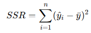
 

## SSE(Sum of Squares Residual of Error) : 잔차 제곱합
▣ 정의 : 실제값($𝑦_𝑖$)과 예측값($\widehat{y_i}$)의 차이를 제곱하여 합한 값으로 모델이 설명하지 못한 데이터의 변동량(잔차)을 나타냄 
▣ 필요성 : 모델의 예측 오차를 평가하기 위해 사용되며, 잔차 분석을 통해 모델 개선 방향을 제시 
▣ 장점 : 모델의 한계를 정량적으로 평가할 수 있으며, SSE가 작을수록 모델의 성능이 좋음을 의미 
▣ 단점 : SSE의 크기가 데이터의 크기와 단위에 따라 크게 변하며, 극단값(outliers)에 민감하여 모델 성능이 왜곡될 수 있음 
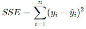
 

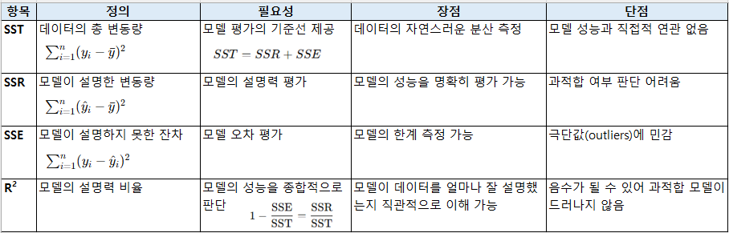
 

---

**(회귀 평가지표 10개 정리 예제 소스)**

	# ============================================
	# Iris 데이터 기반 회귀 평가지표 10개 + 해석표 출력 코드
	#  - 타깃: sepal length (첫 번째 컬럼)
	#  - 특징: 나머지 3개(sepal width, petal length, petal width)
	# ============================================
	import numpy as np	
	from sklearn.metrics import (
	    mean_absolute_error,
	    mean_squared_error,
	    mean_squared_log_error,
	    mean_absolute_percentage_error,
	    r2_score)
	from sklearn.linear_model import LinearRegression
	from sklearn.model_selection import train_test_split
	from sklearn.datasets import load_iris
		
	# ------------------------------------------------------------------
	# 1. 사용자 정의 평가지표 함수들
	# ------------------------------------------------------------------
	# [1] 평균 오차 (ME, Mean Error)
	def mean_error(y_true, y_pred):	    
	    y_true = np.asarray(y_true)
	    y_pred = np.asarray(y_pred)
	    return np.mean(y_true - y_pred)
	
	# [5] 평균 제곱근 오차 (RMSE)
	def rmse(y_true, y_pred):	    
	    return np.sqrt(mean_squared_error(y_true, y_pred))

	# [6] 평균 제곱근 오차(로그적용) (RMSLE)	
	def rmsle(y_true, y_pred):
	    return np.sqrt(mean_squared_log_error(y_true, y_pred))
	
	# [7] 평균 비율 오차 (MPE, Mean Percentage Error)
	def mean_percentage_error(y_true, y_pred):
	    y_true = np.asarray(y_true)
	    y_pred = np.asarray(y_pred)
	    return np.mean((y_true - y_pred) / y_true)
	
	# [9] 평균 절대 규모 오차 (MASE, Mean Absolute Scaled Error)
	#     본래는 시계열(time series)에서 많이 사용
	#     여기서는 예시를 위해 샘플 순서를 기준으로 naive forecast 사용
	def mase(y_true, y_pred):
	    y_true = np.asarray(y_true)
	    y_pred = np.asarray(y_pred)
	    mae = np.mean(np.abs(y_true - y_pred))
	    # naive forecast: 한 시점 전 값(y_{t-1})을 예측으로 사용
	    naive_mae = np.mean(np.abs(y_true[1:] - y_true[:-1]))
	    return mae / naive_mae
	
	# ------------------------------------------------------------------
	# 2. 해석 함수들 (좋음 / 보통 / 나쁨) + 기준 문자열
	# ------------------------------------------------------------------
	CRITERIA_ERROR_RELATIVE = "ratio<0.25:좋음, 0.25≤ratio<0.5:보통, ratio≥0.5:나쁨"
	CRITERIA_MSLE_RMSLE     = "RMSLE<0.1:좋음, 0.1≤RMSLE<0.2:보통, RMSLE≥0.2:나쁨"
	CRITERIA_PERCENTAGE     = "|오차|<10%:좋음, 10~20%:보통, 20% 초과:나쁨"
	CRITERIA_MASE           = "MASE<1:좋음, 1≤MASE<2:보통, MASE≥2:나쁨"
	CRITERIA_R2             = "R2≥0.8:좋음, 0.5≤R2<0.8:보통, R2<0.5:나쁨"
		
	def interpret_error_relative(value, scale):
	    if scale == 0: return "평가불가"
	
	    ratio = abs(value) / scale  # 상대오차 비율	
	    if ratio < 0.25: return "좋음"
	    elif ratio < 0.5: return "보통"
	    else: return "나쁨"
		
	def interpret_msle_rmsle(rmsle_value):
	    if rmsle_value < 0.1: return "좋음"
	    elif rmsle_value < 0.2: return "보통"
	    else: return "나쁨"
		
	def interpret_percentage_metric(perc_value):
	    perc = abs(perc_value) * 100  # %	
	    if perc < 10: return "좋음"
	    elif perc < 20: return "보통"
	    else: return "나쁨"
		
	def interpret_mase(mase_value):
	    if mase_value < 1: return "좋음"
	    elif mase_value < 2: return "보통"
	    else: return "나쁨"
		
	def interpret_r2(r2_value):	
	    if r2_value >= 0.8: return "좋음"
	    elif r2_value >= 0.5: return "보통"
	    else: return "나쁨"
	
	# ------------------------------------------------------------------
	# 3. Iris 데이터 로드 및 회귀 문제로 구성
	# ------------------------------------------------------------------	
	iris = load_iris()
	X_all = iris.data  # shape: (150, 4) -> [sepal length, sepal width, petal length, petal width]
	
	# 타깃: sepal length (0번째 컬럼)
	y = X_all[:, 0]
	
	# 특징: 나머지 3개 (sepal width, petal length, petal width)
	X = X_all[:, 1:]   # shape: (150, 3)
	
	# train / test 분할
	X_train, X_test, y_train, y_test = train_test_split(X, y, test_size=0.3, random_state=42)
	
	# 선형회귀 모델 학습
	model = LinearRegression()
	model.fit(X_train, y_train)
	
	# 예측값
	y_pred = model.predict(X_test)
	
	# 타깃 스케일(표준편차) 계산 (오차 계열 해석 기준으로 사용)
	y_std = np.std(y_test)
		
	# ------------------------------------------------------------------
	# 4. 10개 평가지표 계산
	# ------------------------------------------------------------------
	# [1] ME
	ME = mean_error(y_test, y_pred)
	# [2] MAE
	MAE = mean_absolute_error(y_test, y_pred)
	# [3] MSE
	MSE = mean_squared_error(y_test, y_pred)
	# [4] MSLE
	MSLE = mean_squared_log_error(y_test, y_pred)
	# [5] RMSE
	RMSE = rmse(y_test, y_pred)
	# [6] RMSLE
	RMSLE = rmsle(y_test, y_pred)
	# [7] MPE
	MPE = mean_percentage_error(y_test, y_pred)
	# [8] MAPE
	MAPE = mean_absolute_percentage_error(y_test, y_pred)
	# [9] MASE
	MASE = mase(y_test, y_pred)
	# [10] R2 score
	R2 = r2_score(y_test, y_pred)
		
	# ------------------------------------------------------------------
	# 5. 해석 테이블 구성 (지표명, 값, 해석, 기준)
	# ------------------------------------------------------------------
	rows = []	
	rows.append(("[1] ME",ME,interpret_error_relative(ME, y_std), CRITERIA_ERROR_RELATIVE))
	rows.append(("[2] MAE",MAE,interpret_error_relative(MAE, y_std),CRITERIA_ERROR_RELATIVE))
	# MSE는 제곱 단위이므로 해석은 RMSE 기준 사용
	rows.append(("[3] MSE",MSE,interpret_error_relative(np.sqrt(MSE), y_std), CRITERIA_ERROR_RELATIVE + " (RMSE 기준)"))
	rows.append(("[4] MSLE",MSLE,interpret_msle_rmsle(np.sqrt(MSLE)), CRITERIA_MSLE_RMSLE))
	rows.append(("[5] RMSE",RMSE,interpret_error_relative(RMSE, y_std), CRITERIA_ERROR_RELATIVE))
	rows.append(("[6] RMSLE",RMSLE,interpret_msle_rmsle(RMSLE), CRITERIA_MSLE_RMSLE))
	rows.append(("[7] MPE",MPE,interpret_percentage_metric(MPE), CRITERIA_PERCENTAGE))
	rows.append(("[8] MAPE",MAPE,interpret_percentage_metric(MAPE), CRITERIA_PERCENTAGE))
	rows.append(("[9] MASE",MASE,interpret_mase(MASE), CRITERIA_MASE))
	rows.append(("[10] R2",R2,interpret_r2(R2), CRITERIA_R2))
		
	# ------------------------------------------------------------------
	# 6. 결과 출력
	# ------------------------------------------------------------------	
	print("=== Regression Metrics on Iris (Target: Sepal Length) ===\n")
	# 세부 값 먼저 출력
	print(">> Raw Metric Values")
	print(f"[1]  Mean Error (ME)                     : {ME:.4f}")
	print(f"[2]  Mean Absolute Error (MAE)           : {MAE:.4f}")
	print(f"[3]  Mean Squared Error (MSE)            : {MSE:.4f}")
	print(f"[4]  Mean Squared Log Error (MSLE)       : {MSLE:.4f}")
	print(f"[5]  Root Mean Squared Error (RMSE)      : {RMSE:.4f}")
	print(f"[6]  Root Mean Squared Log Error (RMSLE) : {RMSLE:.4f}")
	print(f"[7]  Mean Percentage Error (MPE)         : {MPE:.4f}")
	print(f"[8]  Mean Abs Percentage Error (MAPE)    : {MAPE:.4f}")
	print(f"[9]  Mean Abs Scaled Error (MASE)        : {MASE:.4f}")
	print(f"[10] R2 Score                             : {R2:.4f}")
	print()

	# 해석 표 출력
	print(">> 해석 테이블 (휴리스틱 기준, 데이터 스케일에 따라 조정 가능)")
	print("-" * 110)
	print(f"{'지표':<10}{'값':>12}{'해석(좋음/보통/나쁨)':>16}{'기준':>70}")
	print("-" * 110)
	for name, value, interp, crit in rows:
    # 기준 문자열이 길어서 그대로 뒤에 붙여줌
    	print(f"{name:<10}{value:>12.4f}{interp:>16}  {crit}")
	print("-" * 110)

 

**(회귀 평가지표 10개 정리 예제 소스 실행 결과)**
	
	=== Regression Metrics on Iris (Target: Sepal Length) ===
	>> Raw Metric Values
	[1]  Mean Error (ME)                     : 0.0892
	[2]  Mean Absolute Error (MAE)           : 0.2469
	[3]  Mean Squared Error (MSE)            : 0.0981
	[4]  Mean Squared Log Error (MSLE)       : 0.0021
	[5]  Root Mean Squared Error (RMSE)      : 0.3132
	[6]  Root Mean Squared Log Error (RMSLE) : 0.0454
	[7]  Mean Percentage Error (MPE)         : 0.0123
	[8]  Mean Abs Percentage Error (MAPE)    : 0.0419
	[9]  Mean Abs Scaled Error (MASE)        : 0.2912
	[10] R2 Score                             : 0.8526

	>> 해석 테이블 (휴리스틱 기준, 데이터 스케일에 따라 조정 가능)
	--------------------------------------------------------------------------------------------------------------
	지표            값    해석(좋음/보통/나쁨)  기준
	--------------------------------------------------------------------------------------------------------------
	[1] ME          0.0892              좋음  ratio<0.25:좋음, 0.25≤ratio<0.5:보통, ratio≥0.5:나쁨
	[2] MAE         0.2469              보통  ratio<0.25:좋음, 0.25≤ratio<0.5:보통, ratio≥0.5:나쁨
	[3] MSE         0.0981              보통  ratio<0.25:좋음, 0.25≤ratio<0.5:보통, ratio≥0.5:나쁨 (RMSE 기준)
	[4] MSLE        0.0021              좋음  RMSLE<0.1:좋음, 0.1≤RMSLE<0.2:보통, RMSLE≥0.2:나쁨
	[5] RMSE        0.3132              보통  ratio<0.25:좋음, 0.25≤ratio<0.5:보통, ratio≥0.5:나쁨
	[6] RMSLE       0.0454              좋음  RMSLE<0.1:좋음, 0.1≤RMSLE<0.2:보통, RMSLE≥0.2:나쁨
	[7] MPE         0.0123              좋음  |오차|<10%:좋음, 10~20%:보통, 20% 초과:나쁨
	[8] MAPE        0.0419              좋음  |오차|<10%:좋음, 10~20%:보통, 20% 초과:나쁨
	[9] MASE        0.2912              좋음  MASE<1:좋음, 1≤MASE<2:보통, MASE≥2:나쁨
	[10] R2         0.8526              좋음  R2≥0.8:좋음, 0.5≤R2<0.8:보통, R2<0.5:나쁨
	--------------------------------------------------------------------------------------------------------------

 

**(회귀 평가지표 평가기준)**

|  평가지표           | 좋음                             | 보통                          | 나쁨     |
|--------------------|----------------------------------|-------------------------------|----------|
| **[1] ME** 평균 오차           | &#124;ME&#124; / σ(y) < 0.25       | 0.25 ≤ &#124;ME&#124;/σ < 0.5     | ≥ 0.5    |
| **[2] MAE** 평균 절대 오차     | MAE / σ(y) < 0.25                 | 0.25 ≤ MAE/σ < 0.5            | ≥ 0.5    |
| **[3] MSE** 평균 제곱 오차     | √MSE / σ(y) < 0.25                | 0.25 ≤ √MSE/σ < 0.5           | ≥ 0.5    |
| **[4] MSLE** 평균 제곱 오차(로그) | RMSLE < 0.10                      | 0.10 ~ 0.20                    | ≥ 0.20   |
| **[5] RMSE** 평균 제곱근 오차  | RMSE / σ(y) < 0.25                | 0.25 ≤ RMSE/σ < 0.5           | ≥ 0.5    |
| **[6] RMSLE** 평균 제곱근 오차(로그) | RMSLE < 0.10                      | 0.10 ~ 0.20                    | ≥ 0.20   |
| **[7] MPE** 평균 비율 오차     | &#124;MPE&#124; < 10%              | 10% ~ 20%                      | ≥ 20%    |
| **[8] MAPE** 평균 절대 비율 오차 | MAPE < 10%                         | 10% ~ 20%                      | > 20%    |
| **[9] MASE** 평균 절대 규모 오차 | MASE < 1                           | 1 ~ 2                          | ≥ 2      |
| **[10] R²** 결정계수            | R² ≥ 0.80                          | 0.50 ≤ R² < 0.80              | < 0.50   |

---

**(데이터구조)** 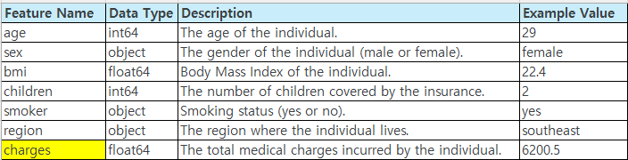
 
**(데이터셋)** https://github.com/YangGuiBee/ML/blob/main/TextBook-12/insurance.csv
 

	################################################################################
	# 데이터 시각화
	################################################################################
	
	import pandas as pd
	import seaborn as sns
	import matplotlib.pyplot as plt
	
	# Load dataset from URL
	data_url = "https://raw.githubusercontent.com/YangGuiBee/ML/main/TextBook-12/insurance.csv"
	df = pd.read_csv(data_url)
	
	# Ensure categorical columns are treated as categories
	df['sex'] = df['sex'].astype('category')
	df['smoker'] = df['smoker'].astype('category')
	df['region'] = df['region'].astype('category')
	
	# Basic information about the dataset
	print("Dataset Information:")
	print(df.info())
	print("\nBasic Statistics:")
	print(df.describe())
	
	# Visualizations
	plt.figure(figsize=(14, 10))
	
	# Distribution of Charges
	plt.subplot(3, 2, 1)
	sns.histplot(df['charges'], kde=True, bins=30, color='blue')
	plt.title('Distribution of Charges')
	plt.xlabel('Charges')
	plt.ylabel('Frequency')
	
	# Age Distribution
	plt.subplot(3, 2, 2)
	sns.histplot(df['age'], kde=True, bins=20, color='green')
	plt.title('Age Distribution')
	plt.xlabel('Age')
	plt.ylabel('Frequency')
	
	# BMI vs Charges
	plt.subplot(3, 2, 3)
	sns.scatterplot(x='bmi', y='charges', data=df, hue='smoker', palette='Set1', alpha=0.7)
	plt.title('BMI vs Charges')
	plt.xlabel('BMI')
	plt.ylabel('Charges')
	
	# Region Counts
	plt.subplot(3, 2, 4)
	sns.countplot(x='region', data=df, palette='Set2')
	plt.title('Region Counts')
	plt.xlabel('Region')
	plt.ylabel('Count')
	
	# Charges by Smoker
	plt.subplot(3, 2, 5)
	sns.boxplot(x='smoker', y='charges', data=df, palette='Set1')
	plt.title('Charges by Smoker')
	plt.xlabel('Smoker')
	plt.ylabel('Charges')
	
	# Children Distribution
	plt.subplot(3, 2, 6)
	sns.countplot(x='children', data=df, palette='Set3')
	plt.title('Children Distribution')
	plt.xlabel('Number of Children')
	plt.ylabel('Count')
	
	plt.tight_layout()
	plt.show()
	
	# Correlation Heatmap (Numerical Columns Only)
	plt.figure(figsize=(10, 8))
	numerical_columns = df.select_dtypes(include=['float64', 'int64']).columns
	sns.heatmap(df[numerical_columns].corr(), annot=True, cmap='coolwarm', fmt='.2f', linewidths=0.5)
	plt.title('Correlation Heatmap')
	plt.show()

 

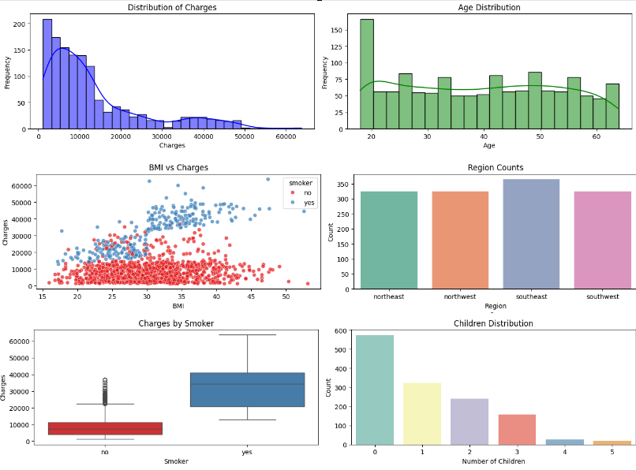
 

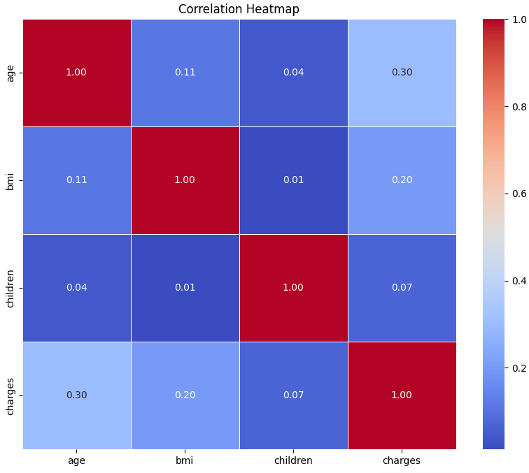
 

	################################################################################
	# 보험료(Charges)를 예측하기 위한 다중선형회귀+결정트리 회귀모델 비교 실습
	################################################################################
	# 필요한 패키지가 설치되어 있는지 확인하고, 없으면 pip로 설치하기 위한 모듈 임포트
	import subprocess  # 파이썬에서 다른 프로세스(pip 명령 등)를 실행하기 위해 사용
	import sys         # 현재 파이썬 실행 파일 경로(sys.executable) 등을 얻기 위해 사용
	
	# 패키지 설치를 담당하는 함수 정의
	def install(package):
	    try:
	        __import__(package)      # 패키지를 임포트해보고
	    except ImportError:          # 임포트가 실패하면 (패키지가 없으면)
	        print(f"Installing {package}...")
	        # 현재 파이썬 실행 파일로 pip 모듈을 호출해 해당 패키지 설치
	        subprocess.check_call([sys.executable, "-m", "pip", "install", package])
	
	# 필요한 패키지 리스트 정의
	required_packages = ['pandas', 'scikit-learn', 'xgboost', 'lightgbm', 'numpy']
	
	# 필요한 패키지들이 모두 설치되어 있는지 확인하고, 없으면 install() 실행
	for package in required_packages:
	    install(package)
	
	# ------------------------------------------------------------------------------
	# 라이브러리 임포트
	# ------------------------------------------------------------------------------
	import pandas as pd  # 데이터프레임 기반 데이터 처리
	import numpy as np   # 수치 계산 및 배열 처리
	from sklearn.model_selection import train_test_split  # 학습/테스트 데이터 분할
	from sklearn.preprocessing import OneHotEncoder       # 범주형 변수 인코딩
	from sklearn.linear_model import LinearRegression     # 다중 선형 회귀 모델
	from sklearn.tree import DecisionTreeRegressor        # 결정 트리 회귀 모델
	from sklearn.metrics import (                         # 회귀 평가 지표들
	    mean_absolute_error,
	    mean_squared_error,
	    r2_score,
	    mean_absolute_percentage_error)
	
	# ------------------------------------------------------------------------------
	# 1. 데이터 로딩
	# ------------------------------------------------------------------------------
	# GitHub에 올라가 있는 보험 데이터셋(csv)의 URL
	data_url = "https://raw.githubusercontent.com/YangGuiBee/ML/main/TextBook-12/insurance.csv"
	
	# URL에서 csv 파일을 읽어와 DataFrame으로 로딩
	df = pd.read_csv(data_url)
	
	# ------------------------------------------------------------------------------
	# 2. 결측치 확인
	# ------------------------------------------------------------------------------
	print("Checking for missing values...")
	# 각 컬럼별 결측치(NaN)의 개수를 출력
	print(df.isnull().sum())
	
	# 전체 데이터에 결측치가 하나라도 있으면 AssertionError 발생
	assert not df.isnull().values.any(), "Data contains missing values!"
	
	# ------------------------------------------------------------------------------
	# 3. 입력(X) / 타깃(y) 분리 및 전처리
	# ------------------------------------------------------------------------------
	# 예측 대상인 'charges' 컬럼을 제외한 나머지 컬럼들을 설명 변수 X로 사용
	X = df.drop("charges", axis=1)
	
	# 'charges' 컬럼을 타깃 y로 사용
	y = df["charges"]
	
	# 범주형 변수 목록 (문자열로 표현된 카테고리 변수)
	categorical_features = ["sex", "smoker", "region"]	
	# 수치형 변수 목록
	numerical_features = ["age", "bmi", "children"]
	
	# OneHotEncoder 설정
	# - sparse_output=False : 희소 행렬이 아닌 일반 배열 반환
	# - drop="first"        : 각 범주형 변수에서 첫 번째 범주를 기준으로 제거(더미 변수 함정 방지)
	encoder = OneHotEncoder(sparse_output=False, drop="first")
	
	# 범주형 변수에 대해 One-Hot 인코딩 수행 (fit + transform)
	X_encoded = encoder.fit_transform(X[categorical_features])
	
	# 수치형 변수는 그대로 사용
	X_numerical = X[numerical_features]
	
	# 수치형 + 인코딩된 범주형을 하나의 배열로 수평 결합
	X_merged = np.hstack([X_numerical, X_encoded])
	
	# 결합 결과를 DataFrame으로 변환하고, 컬럼 이름 지정
	X_preprocessed = pd.DataFrame(
	    X_merged, columns=numerical_features + encoder.get_feature_names_out().tolist()	)
	
	# ------------------------------------------------------------------------------
	# 4. 학습용 / 테스트용 데이터 분할
	# ------------------------------------------------------------------------------
	# train_test_split을 사용해 학습(80%) / 테스트(20%) 데이터로 분할
	# random_state=42 : 매번 동일한 방식으로 분할되도록 시드 고정
	X_train, X_test, y_train, y_test = train_test_split(X_preprocessed, y, test_size=0.2, random_state=42)
	
	# ------------------------------------------------------------------------------
	# 5. 회귀 평가 지표 함수 정의
    # y_true : 실제 값 (정답)
	# y_pred : 모델이 예측한 값
	# 10개의 회귀 평가 지표를 계산하여 딕셔너리 형태로 반환
	# [1] ME, [2] MAE, [3] MSE, [4] MSLE, [5] RMSE, [6] RMSLE, [7] MPE, [8] MAPE, [9] MASE, [10] R2
	# ------------------------------------------------------------------------------	
	def evaluate_model(y_true, y_pred):
	    # 평균 오차 (Mean Error) : 실제값 - 예측값의 평균
	    me = np.mean(y_true - y_pred )
	
	    # 평균 절대 오차 (MAE)
	    mae = mean_absolute_error(y_true, y_pred)
	
	    # 평균 제곱 오차 (MSE)
	    mse = mean_squared_error(y_true, y_pred)
	
	    # 평균 제곱근 오차 (RMSE) = MSE의 제곱근
	    rmse = np.sqrt(mse)
	
	    # -------------------- 로그 기반 지표 (MSLE, RMSLE) --------------------
	    # 모든 실제값과 예측값이 양수일 때만 로그를 적용할 수 있으므로 조건 검사
	    if (y_true > 0).all() and (y_pred > 0).all():
	        # log1p(x) = log(1 + x), 0 근처에서도 안정적으로 로그 사용 가능
	        msle = mean_squared_error(np.log1p(y_true), np.log1p(y_pred))
	        rmsle = np.sqrt(msle)
	    else:
	        # 하나라도 0 이하 값이 있으면 계산하지 않고 NaN으로 처리
	        msle = np.nan
	        rmsle = np.nan
	
	    # 평균 비율 오차 (MPE, %) : (실제 - 예측) / 실제 의 평균에 100을 곱해 %
	    mpe = np.mean((y_true - y_pred) / y_true) * 100
	
	    # 평균 절대 비율 오차 (MAPE, %) : 절대값 기준 비율 오차 평균
	    mape = mean_absolute_percentage_error(y_true, y_pred) * 100
	
	    # -------------------- 평균 절대 규모 오차 (MASE) --------------------
	    # 스케일링 기준(scale)은 y_true의 연속 차이 |y_t - y_{t-1}|의 평균으로 정의
	    #  -> 시계열에서 "나이브 예측(y_{t-1})"의 MAE와 동일한 역할
	    if len(y_true) > 1:
	        scale = np.mean(np.abs(np.diff(y_true)))  # 연속 차이의 절대값 평균
	        if scale == 0:
	            mase = np.nan                         # 스케일이 0이면 정의 불가 → NaN
	        else:
	            mase = mae / scale                    # MASE = MAE / scale
	    else:
	        mase = np.nan                             # 데이터가 1개 이하면 계산 불가
	
	    # 결정계수 R2 : 모델이 데이터를 얼마나 잘 설명하는지 (1에 가까울수록 좋음)
	    r2 = r2_score(y_true, y_pred)
	
	    # 계산한 모든 지표를 딕셔너리로 묶어서 반환
	    return {
	        "ME": me,
	        "MAE": mae,
	        "MSE": mse,
	        "MSLE": msle,
	        "RMSE": rmse,
	        "RMSLE": rmsle,
	        "MPE": mpe,
	        "MAPE": mape,
	        "MASE": mase,
	        "R2": r2  }
	
	# ------------------------------------------------------------------------------
	# 6. 사용할 회귀 모델 정의 (다중 선형회귀 / 결정트리 회귀)
	# ------------------------------------------------------------------------------	
	models = {
	    "Multiple Linear Regression": LinearRegression(),
	    "Decision Tree Regression": DecisionTreeRegressor()	}
	
	# ------------------------------------------------------------------------------
	# 7. 각 모델 학습 및 평가
	# ------------------------------------------------------------------------------	
	# 결과를 저장할 딕셔너리 (모델 이름별 평가 지표)
	results = {}
	
	# 딕셔너리에 들어있는 각 모델에 대해 반복
	for name, model in models.items():
	    # 학습용 데이터로 모델 훈련
	    model.fit(X_train, y_train)
	
	    # 테스트 데이터에 대한 예측 수행
	    y_pred = model.predict(X_test)
	
	    # 예측 결과 중 음수 값이 있는 경우 경고 출력 후 0으로 보정
	    if (y_pred < 0).any():
	        print(f"Warning: Model {name} produced negative predictions. Adjusting values to zero.")
	        # 음수인 예측값을 0으로 대체 (보험료는 음수가 될 수 없기 때문)
	        y_pred = np.maximum(y_pred, 0)
	
	    # 위에서 정의한 evaluate_model() 함수로 각종 평가 지표 계산
	    results[name] = evaluate_model(y_test, y_pred)
	
	# ------------------------------------------------------------------------------
	# 8. 평가 결과를 표 형태로 정리 및 출력
	# ------------------------------------------------------------------------------	
	# results 딕셔너리를 DataFrame으로 변환 (행: 지표, 열: 모델명)
	evaluation_results = pd.DataFrame(results)
	
	# 모든 값을 소수점 6자리까지 문자열로 포맷 (NaN은 그대로 'NaN')
	evaluation_results = evaluation_results.applymap(lambda x: f"{x:.6f}" if pd.notnull(x) else "NaN")
	
	# 모델별 평가 결과 출력
	print("\nModel Evaluation Results:")
	print(evaluation_results)
	
	# ------------------------------------------------------------------------------
	# 9. 각 지표에 대한 한글 설명 사전 준비
	# ------------------------------------------------------------------------------	
	metric_explanations = {
	    "ME":   "평균 오차 (Mean Error, ME): 예측값과 실제값의 평균 차이. 0에 가까울수록 좋음.",
	    "MAE":  "평균 절대 오차 (Mean Absolute Error, MAE): 예측값과 실제값의 절대적 차이의 평균. 낮을수록 좋음.",
	    "MSE":  "평균 제곱 오차 (Mean Squared Error, MSE): 예측값과 실제값의 제곱 차이 평균. 낮을수록 좋음.",
	    "MSLE": "평균 제곱 오차 (로그 적용, Mean Squared Log Error, MSLE): 로그 스케일에서의 평균 제곱 오차. 낮을수록 좋음.",
	    "RMSE": "평균 제곱근 오차 (Root Mean Squared Error, RMSE): 평균 제곱 오차의 제곱근. 낮을수록 좋음.",
	    "RMSLE":"평균 제곱근 오차 (로그 적용, Root Mean Squared Log Error, RMSLE): 로그 스케일에서의 제곱근 오차. 낮을수록 좋음.",
	    "MPE":  "평균 비율 오차 (Mean Percentage Error, MPE): 예측값과 실제값의 비율 오차 평균. 0에 가까울수록 좋음.",
	    "MAPE": "평균 절대 비율 오차 (Mean Absolute Percentage Error, MAPE): 절대 비율 오차의 평균. 낮을수록 좋음.",
	    "MASE": "평균 절대 규모 오차 (Mean Absolute Scaled Error, MASE): 나이브 예측 대비 상대적인 MAE. 1보다 작으면 나이브보다 우수.",
	    "R2":   "R2 점수 (Coefficient of Determination, R2): 모델의 설명력을 나타냄. 1에 가까울수록 좋음.",
	}
	
	# ------------------------------------------------------------------------------
	# 10. 지표 설명 + 모델별 값 함께 출력
	# ------------------------------------------------------------------------------	
	print("\nModel Evaluation Results with Explanations:")
	
	# metric_explanations 사전을 순회하면서
	for metric, explanation in metric_explanations.items():
	    # 먼저 지표 설명 출력
	    print(f"{metric}: {explanation}")
	    # 이어서 해당 지표에 대한 각 모델의 값(행) 출력
	    print(evaluation_results.loc[metric])
	    print()  # 보기 좋게 빈 줄
	
	# ------------------------------------------------------------------------------
	# 11. 새로운 한 명의 고객 데이터에 대한 보험료 예측
	# ------------------------------------------------------------------------------	
	# 예측에 사용할 테스트 입력 한 건 생성
	# [나이, BMI, 자녀 수, 성별, 흡연 여부, 지역]
	test_input = pd.DataFrame( [[55, 21, 2, "female", "no", "northeast"]],
	    columns=["age", "bmi", "children", "sex", "smoker", "region"]	)
	
	# test_input에서 범주형 컬럼만 뽑아 기존 인코더로 변환 (fit 아님, transform만 수행)
	test_encoded = encoder.transform(test_input[categorical_features])
	
	# test_input에서 수치형 컬럼만 별도로 추출
	test_numerical = test_input[numerical_features]
	
	# 수치형 + 인코딩된 범주형을 수평 결합하여 최종 입력 특징행렬 생성
	test_preprocessed = pd.DataFrame(
	    np.hstack([test_numerical, test_encoded]),
	    columns=numerical_features + encoder.get_feature_names_out().tolist()	)
	
	# ------------------------------------------------------------------------------
	# 12. 각 모델로부터 예측값 얻기
	# ------------------------------------------------------------------------------	
	# 예측 결과를 저장할 딕셔너리 (모델명: 예측값)
	predictions = {}
	
	# 앞서 정의한 models 딕셔너리의 각 모델에 대해
	for name, model in models.items():
	    # 하나의 샘플에 대한 예측값은 배열 형태로 나오므로 [0]으로 스칼라 추출
	    predictions[name] = model.predict(test_preprocessed)[0]
	
	# 예측값 딕셔너리를 DataFrame으로 만들어 보기 좋게 포맷
	predictions_df = pd.DataFrame(predictions, index=["Predicted Charges"]).applymap(
	    lambda x: f"{x:.6f}")
	
	# 최종 예측 결과 출력
	print("\nPredicted Charges for Input:")
	print(predictions_df)

 

	Installing scikit-learn...
	Checking for missing values...
	age         0
	sex         0
	bmi         0
	children    0
	smoker      0
	region      0
	charges     0
	dtype: int64
	Warning: Model Multiple Linear Regression produced negative predictions. Adjusting values to zero.
	
	Model Evaluation Results:
	      Multiple Linear Regression Decision Tree Regression
	ME                    230.390130               954.400887
	MAE                  4170.045013              3194.668083
	MSE              33542077.406786          43411840.706491
	MSLE                         NaN                 0.321182
	RMSE                 5791.552245              6588.766251
	RMSLE                        NaN                 0.566729
	MPE                    23.612385                32.447466
	MAPE                   46.264515                45.261403
	MASE                    0.337699                 0.258711
	R2                      0.783946                 0.720372
	
	Model Evaluation Results with Explanations:
	ME: 평균 오차 (Mean Error, ME): 예측값과 실제값의 평균 차이. 0에 가까울수록 좋음.
	Multiple Linear Regression    230.390130
	Decision Tree Regression      954.400887
	Name: ME, dtype: object
	
	MAE: 평균 절대 오차 (Mean Absolute Error, MAE): 예측값과 실제값의 절대적 차이의 평균. 낮을수록 좋음.
	Multiple Linear Regression    4170.045013
	Decision Tree Regression      3194.668083
	Name: MAE, dtype: object
	
	MSE: 평균 제곱 오차 (Mean Squared Error, MSE): 예측값과 실제값의 제곱 차이 평균. 낮을수록 좋음.
	Multiple Linear Regression    33542077.406786
	Decision Tree Regression      43411840.706491
	Name: MSE, dtype: object
	
	MSLE: 평균 제곱 오차 (로그 적용, Mean Squared Log Error, MSLE): 로그 스케일에서의 평균 제곱 오차. 낮을수록 좋음.
	Multiple Linear Regression         NaN
	Decision Tree Regression      0.321182
	Name: MSLE, dtype: object
	
	RMSE: 평균 제곱근 오차 (Root Mean Squared Error, RMSE): 평균 제곱 오차의 제곱근. 낮을수록 좋음.
	Multiple Linear Regression    5791.552245
	Decision Tree Regression      6588.766251
	Name: RMSE, dtype: object
	
	RMSLE: 평균 제곱근 오차 (로그 적용, Root Mean Squared Log Error, RMSLE): 로그 스케일에서의 제곱근 오차. 낮을수록 좋음.
	Multiple Linear Regression         NaN
	Decision Tree Regression      0.566729
	Name: RMSLE, dtype: object
	
	MPE: 평균 비율 오차 (Mean Percentage Error, MPE): 예측값과 실제값의 비율 오차 평균. 0에 가까울수록 좋음.
	Multiple Linear Regression    23.612385
	Decision Tree Regression      32.447466
	Name: MPE, dtype: object
	
	MAPE: 평균 절대 비율 오차 (Mean Absolute Percentage Error, MAPE): 절대 비율 오차의 평균. 낮을수록 좋음.
	Multiple Linear Regression    46.264515
	Decision Tree Regression      45.261403
	Name: MAPE, dtype: object
	
	MASE: 평균 절대 규모 오차 (Mean Absolute Scaled Error, MASE): 나이브 예측 대비 상대적인 MAE. 1보다 작으면 나이브보다 우수.
	Multiple Linear Regression    0.337699
	Decision Tree Regression      0.258711
	Name: MASE, dtype: object
	
	R2: R2 점수 (Coefficient of Determination, R2): 모델의 설명력을 나타냄. 1에 가까울수록 좋음.
	Multiple Linear Regression    0.783946
	Decision Tree Regression      0.720372
	Name: R2, dtype: object
	
	
	Predicted Charges for Input:
	                  Multiple Linear Regression Decision Tree Regression
	Predicted Charges               10131.945928             11881.969600
	
 

	################################################################################
	# 보험료(charges)를 예측하기 위해 6개의 회귀모델을 학습·평가·예측하는 전체 코드
	# Ridge / Lasso / ElasticNet Regression / Random Forest Regression / XGBoost / LightGBM
	################################################################################
	# ------------------------------ 패키지 설치 부분 ------------------------------
	import subprocess   # pip install 등 외부 명령 호출
	import sys          # python 실행 파일 위치 확인
	
	def install(package):
	    try:
	        __import__(package)  # Import 시도
	    except ImportError:
	        print(f"Installing {package}...")
	        subprocess.check_call([sys.executable, "-m", "pip", "install", package])
	
	required_packages = ['pandas', 'scikit-learn', 'xgboost', 'lightgbm', 'numpy']	
	for pkg in required_packages:
	    install(pkg)
	
	import pandas as pd
	import numpy as np
	from sklearn.model_selection import train_test_split
	from sklearn.preprocessing import OneHotEncoder	
	from sklearn.linear_model import Ridge, Lasso, ElasticNet	# 선형 기반 회귀	
	from sklearn.ensemble import RandomForestRegressor			# 앙상블 기반 회귀	
	from xgboost import XGBRegressor							# 부스팅 기반 회귀
	from lightgbm import LGBMRegressor							# 부스팅 기반 회귀	
	# 회귀 평가지표
	from sklearn.metrics import (
	    mean_absolute_error,
	    mean_squared_error,
	    r2_score,
	    mean_absolute_percentage_error	)
		
	# ------------------------------ 1. 데이터 로딩 ------------------------------
	# GitHub의 보험료 데이터(csv) URL
	data_url = "https://raw.githubusercontent.com/YangGuiBee/ML/main/TextBook-12/insurance.csv"
	# CSV 파일을 DataFrame으로 로드
	df = pd.read_csv(data_url)
	
	# ------------------------------ 2. 결측치 검사 ------------------------------
	print("Checking for missing values...")
	print(df.isnull().sum())        # 각 컬럼별 결측치 개수
	assert not df.isnull().values.any(), "데이터에 결측치가 있습니다!"
		
	# ------------------------------ 3. 전처리: 독립변수/타깃 분리 ------------------------------
	# charges(보험료) = 타깃 y, 나머지 = X
	X = df.drop("charges", axis=1)
	y = df["charges"]
	
	# 범주형 변수 목록 (문자열 → 원핫)
	categorical_features = ["sex", "smoker", "region"]	
	# 수치형 변수 목록
	numerical_features = ["age", "bmi", "children"]	
	
	# ------------------------------ 4. 원-핫 인코딩 ------------------------------
	# sparse_output=False : 희소행렬 대신 dense array 반환
	# drop="first" : 각 범주의 첫 번째 카테고리를 제거 → 다중공선성 방지
	encoder = OneHotEncoder(sparse_output=False, drop="first")
	
	# 범주형 변수 인코딩
	X_encoded = encoder.fit_transform(X[categorical_features])	
	# 수치형 변수 그대로 가져오기
	X_numerical = X[numerical_features]
	
	# 최종 입력데이터(X) 구성
	X_preprocessed = pd.DataFrame(
	    np.hstack([X_numerical, X_encoded]),
	    columns=numerical_features + encoder.get_feature_names_out().tolist()	)
		
	# ------------------------------ 5. 학습/테스트 분할 ------------------------------
	X_train, X_test, y_train, y_test = train_test_split(X_preprocessed, y, test_size=0.2, random_state=42)
		
	# ------------------------------ 6. 회귀 평가지표 함수 ------------------------------
	#    10개 회귀 평가지표를 계산하여 딕셔너리로 반환한다.
	#    [1] ME, [2] MAE, [3] MSE, [4] MSLE, [5] RMSE, [6] RMSLE, [7] MPE, [8] MAPE, [9] MASE, [10] R2
	def evaluate_model(y_true, y_pred):
	
	    # 1) Mean Error (편향 측정: 실제-예측)
	    me = np.mean(y_true - y_pred)
	
	    # 2) Mean Absolute Error (절대 오차)
	    mae = mean_absolute_error(y_true, y_pred)
	
	    # 3) Mean Squared Error (제곱 오차)
	    mse = mean_squared_error(y_true, y_pred)
	
	    # 5) Root Mean Squared Error
	    rmse = np.sqrt(mse)
	
	    # 4 & 6) 로그 기반 오차 (0 이상일 때 가능)
	    if (y_true >= 0).all() and (y_pred >= 0).all():
	        msle = mean_squared_error(np.log1p(y_true), np.log1p(y_pred))
	        rmsle = np.sqrt(msle)
	    else:
	        msle = np.nan
	        rmsle = np.nan
	
	    # 7) Mean Percentage Error (%)
	    mpe = np.mean((y_true - y_pred) / y_true) * 100
	
	    # 8) Mean Absolute Percentage Error (%)
	    mape = mean_absolute_percentage_error(y_true, y_pred) * 100
	
	    # 9) Mean Absolute Scaled Error (MASE)
	    #    스케일 = 실제값의 연속 차이(|y_t - y_(t-1)|) 평균
	    if len(y_true) > 1:
	        scale = np.mean(np.abs(np.diff(y_true)))
	        if scale == 0:
	            mase = np.nan
	        else:
	            mase = mae / scale
	    else:
	        mase = np.nan
	
	    # 10) R²
	    r2 = r2_score(y_true, y_pred)
	
	    return {
	        "ME": me,
	        "MAE": mae,
	        "MSE": mse,
	        "MSLE": msle,
	        "RMSE": rmse,
	        "RMSLE": rmsle,
	        "MPE": mpe,
	        "MAPE": mape,
	        "MASE": mase,
	        "R2": r2    }
		
	# ------------------------------ 7. 모델 정의 ------------------------------
	models = {
	    "Ridge Regression": Ridge(),
	    "Lasso Regression": Lasso(),
	    "Elastic Net Regression": ElasticNet(),
	
	    # n_jobs=1 → joblib의 physical core detection 경고 제거
	    "Random Forest Regression": RandomForestRegressor( random_state=42, n_jobs=1 ),
	
	    # eval_metric="rmse" → XGB 경고 감소
	    "XGBoost": XGBRegressor(random_state=42,eval_metric="rmse" ),
	
	    "LightGBM": LGBMRegressor( random_state=42)	}
		
	# ------------------------------ 8. 모델 학습 & 평가 ------------------------------
	results = {}   # 각 모델의 지표 저장	
	for name, model in models.items():
	
	    # 1) 모델 학습
	    model.fit(X_train, y_train)
	
	    # 2) 테스트 예측
	    y_pred = model.predict(X_test)
	
	    # 3) 예측값 중 음수 제거 (보험료는 음수가 불가능)
	    if (y_pred < 0).any():
	        print(f"Warning: Model {name} produced negative predictions. Adjusting to zero.")
	        y_pred = np.maximum(y_pred, 0)
	
	    # 4) 평가
	    results[name] = evaluate_model(y_test, y_pred)
		
	# ------------------------------ 9. 평가 결과 DataFrame 변환 ------------------------------
	evaluation_results = pd.DataFrame(results)
	
	# pandas 3.0+ : applymap 대신 map 사용
	evaluation_results = evaluation_results.map(lambda x: f"{x:.6f}" if pd.notnull(x) else "NaN")
	
	print("\nModel Evaluation Results:")
	print(evaluation_results)
		
	# ------------------------------ 10. 새로운 입력 1건에 대한 예측 ------------------------------
	test_input = pd.DataFrame( [[55, 21, 2, "female", "no", "northeast"]],
	    columns=["age", "bmi", "children", "sex", "smoker", "region"])
	
	# 범주형 원핫 인코딩
	test_encoded = encoder.transform(test_input[categorical_features])
	test_numerical = test_input[numerical_features]
	
	test_preprocessed = pd.DataFrame(
	    np.hstack([test_numerical, test_encoded]),
	    columns=numerical_features + encoder.get_feature_names_out().tolist()	)
	
	# 모델별 예측 수행
	predictions = {}
	for name, model in models.items():
	    predictions[name] = model.predict(test_preprocessed)[0]
	
	# DataFrame 변환 + 포맷팅
	predictions_df = pd.DataFrame(
	    predictions, index=["Predicted Charges"]
	).map(lambda x: f"{x:.6f}")
	
	print("\nPredicted Charges for Input:")
	print(predictions_df)

 

	Installing scikit-learn...
	Checking for missing values...
	age         0
	sex         0
	bmi         0
	children    0
	smoker      0
	region      0
	charges     0
	dtype: int64
	Warning: Model Ridge Regression produced negative predictions. Adjusting to zero.
	Warning: Model Lasso Regression produced negative predictions. Adjusting to zero.
	Warning: Model XGBoost produced negative predictions. Adjusting to zero.
	[LightGBM] [Info] Auto-choosing col-wise multi-threading, the overhead of testing was 0.000141 seconds.
	You can set `force_col_wise=true` to remove the overhead.
	[LightGBM] [Info] Total Bins 319
	[LightGBM] [Info] Number of data points in the train set: 1070, number of used features: 8
	[LightGBM] [Info] Start training from score 13346.089733
	
	Model Evaluation Results:
	      Ridge Regression Lasso Regression Elastic Net Regression  \
	ME          230.704197       230.811984             318.771925   
	MAE        4182.886840      4171.281194            7423.855423   
	MSE    33592686.228366  33550700.878862        90268049.602763   
	MSLE          1.138902         1.141031               0.609497   
	RMSE       5795.919791      5792.296684            9500.949932   
	RMSLE         1.067194         1.068191               0.780703   
	MPE          24.045376        23.659480              82.541930   
	MAPE         46.542872        46.308404             103.785761   
	MASE          0.338739         0.337799               0.601199   
	R2            0.783620         0.783891               0.418559   
	
	      Random Forest Regression          XGBoost         LightGBM  
	ME                  476.141596       148.515254       160.277564  
	MAE                2550.078471      2761.822751      2623.205455  
	MSE            20942520.922620  23413960.743659  20557383.062015  
	MSLE                  0.195473         0.475891         0.243531  
	RMSE               4576.299916      4838.797448      4534.025040  
	RMSLE                 0.442123         0.689848         0.493489  
	MPE                  23.540036        16.037576        19.873116  
	MAPE                 32.492433        34.807561        34.442284  
	MASE                  0.206510         0.223658         0.212432  
	R2                    0.865103         0.849184         0.867584  
	
	Predicted Charges for Input:
	                  Ridge Regression Lasso Regression Elastic Net Regression  \
	Predicted Charges     10149.160698     10119.933271           12916.033857   
	
	                  Random Forest Regression       XGBoost      LightGBM  
	Predicted Charges             12901.765317  10175.989258  11811.794421  

---

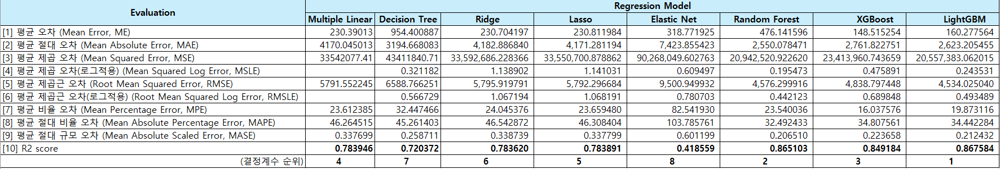
 

---
#  12-2 : 지도학습(분류) 평가 지표
---
	
 	[1] 혼동행렬 (Confusion Matrix) : TP, FP, FN, TN의 분포
	[2] 정확도 (Accuracy) : 전체 데이터 중 올바르게 예측한 비율
	[3] 정밀도 (Precision), PPV (Positive Predictive Value) : 양성 예측의 신뢰도
	[4] 재현율 (Recall), 민감도 (Sensitivity), TPR (True Positive Rate) : 실제 양성 탐지율
	[5] F1 score : 정밀도와 재현율의 조화 평균
	[6] 오분류율 (Error Rate) : 1 - 정확도
	[7] 특이도 (Specificity), TNR(True Negative Rate) : 실제 음성 탐지율
	[8] 위양성률 (Fall Out), FPR(False Positive Rate) : 음성을 양성으로 오분류 비율
	[9] ROC curve : 모든 임계값에 대한 TPR과 FPR의 관계 시각화
	[10]AUC score : ROC 곡선 아래 면적
	  
---

# [1] 오차행렬, 혼동행렬 (Confusion Matrix)

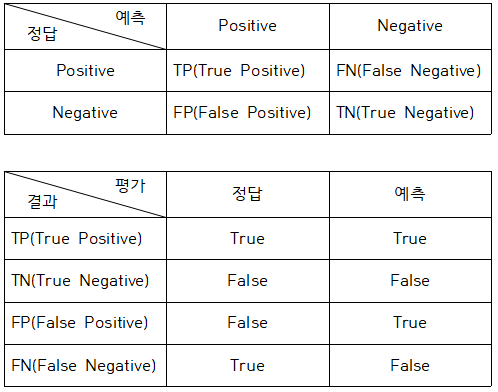 
▣ 정의: 실제 값과 예측 값 간의 분류 결과를 행렬 형태로 표현 
▣ 필요성: 분류 모델의 다양한 평가 지표 계산의 기초 
▣ 장점: 예측의 전체적인 분포를 한눈에 파악 
▣ 단점: 이진 분류에 적합하며 다중 클래스에 적용 시 복잡도가 증가 
▣ 예제: https://scikit-learn.org/stable/auto_examples/model_selection/plot_confusion_matrix.html 

TP(True Positive): 모델이 positive라고 예측했는데 실제로 정답이 positive (정답) 
TN(True Negative): 모델이 negative라고 예측했는데 실제로 정답이 negative (정답) 
FP(False Positive): 모델이 positive라고 예측했는데 실제로 정답이 negative (오답) 
FN(False Negative): 모델이 negative라고 예측했는데 실제로 정답이 positive (오답) 
 
**scikit-learn의 confusion_matrix 기반**
 
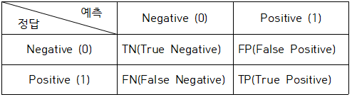

 

	from sklearn.metrics import confusion_matrix

	cm = confusion_matrix(y_true, y_pred)

 

# [2] 정확도 (Accuracy)

$Accuracy = \frac{TP + TN}{TP + TN + FP + FN}$  
▣ 정의: 전체 데이터 중 올바르게 예측된 비율(데이터가 불균형할 때(positive:negative=9:1)는 Accuracy만으로 제대로 분류했는지는 알 수 없기 때문에 Recall과 Precision을 사용) 
▣ 필요성: 모델이 얼마나 잘 작동하는지 전반적인 성능을 평가 
▣ 장점: 단순하고 이해가 용이 
▣ 단점: 불균형 데이터에서는 성능을 잘못 평가할 가능성 
▣ 예제: https://scikit-learn.org/stable/modules/generated/sklearn.metrics.accuracy_score.html 

 

	from sklearn.metrics import accuracy_score

	acc = accuracy_score(y_true, y_pred)

 

# [3] 정밀도 (Precision), PPV(Positive Predictive Value)

$Precision = \frac{TP}{TP + FP}$  
▣ 정의: 모델이 예측한 긍정(positive) 클래스 중 실제로 긍정(positive) 클래스인 비율로, 실제 정답이 negative인 데이터를 positive라고 잘못 예측하면 안 되는 경우에 중요한 지표가 될 수 있으며 Precision을 높이기 위해선 FP(모델이 positive라고 예측했는데 정답은 negative인 경우)를 낮추는 것이 중요 
▣ 필요성: 잘못된 긍정 예측(FP)을 줄이는 데 중요한 지표 
▣ 장점: 정확한 예측을 강조 
▣ 단점: FN은 고려하지 않아 재현율과 함께 사용 필요 
▣ 예제: https://scikit-learn.org/stable/modules/generated/sklearn.metrics.precision_score.html 

 

	from sklearn.metrics import precision_score
	
	precision = precision_score(y_true, y_pred)

 

# [4] 재현율 (Recall), 민감도 (Sensitivity), TPR (True Positive Rate)

$Recall = \frac{TP}{TP + FN}$  
▣ 정의: 실제로 정답이 긍정(positive)인 것들 중에서 모델이 긍정(positive)이라고 예측한 비율로, 실제 정답이 positive인 데이터를 negative라고 잘못 예측하면 안 되는 경우에 중요한 지표가 될 수 있으며, Recall를 높이기 위해선 FN(모델이 negative라고 예측했는데 정답이 positive인 경우)을 낮추는 것이 중요 
▣ 필요성: 놓친 긍정 예측(FN)을 줄이는 데 중요 
▣ 장점: 실제 긍정 클래스에 대한 모델의 민감성을 나타냄 
▣ 단점: FP는 고려하지 않아 Precision과 함께 사용 필요 
▣ 예제: https://scikit-learn.org/stable/auto_examples/model_selection/plot_precision_recall.html 

 

	from sklearn.metrics import recall_score
	
	recall = recall_score(y_true, y_pred)

 

# [5] F1 score

$F1 = \frac{2 \times Precision \times Recall}{Precision + Recall}$  
▣ 정의: Precision과 Recall의 조화 평균으로 두 값의 균형을 평가. Recall과 Precision은 상호 보완적인 평가 지표이기 때문에 F1 score를 사용하며, Precision과 Recall이 한쪽으로 치우쳐지지 않고 모두 클 때 큰 값 
▣ 필요성: 불균형 데이터에서 Precision과 Recall 간의 균형을 평가 
▣ 장점: 두 지표 간의 트레이드오프를 반영 
▣ 단점: 개별적인 성능을 평가하기 어려울 수 있음 
▣ 예제:https://scikit-learn.org/stable/modules/generated/sklearn.metrics.f1_score.html 

 

	from sklearn.metrics import f1_score

	f1 = f1_score(y_true, y_pred)

 

# [6] 오분류율 (Error Rate)

$Error Rate = \frac{FP + FN}{TP + TN + FP + FN}$  
▣ 정의: 전체 데이터 중 잘못 예측된 비율 
▣ 필요성: 모델의 부정확도를 나타냄 
▣ 장점: 정확도의 보완 지표로 활용 가능 
▣ 단점: 불균형 데이터에서는 유의미하지 않을 가능성 
▣ 예제 : https://scikit-learn.org/stable/auto_examples/model_selection/plot_train_error_vs_test_error.html 

 

	error_rate = 1 - accuracy_score(y_true, y_pred)

 

# [7] 특이도 (Specificity), TNR(True Negative Rate)

$Specificity = \frac{TN}{TN + FP}$  
▣ 정의: 실제 부정 데이터 중에서 올바르게 부정으로 예측한 비율 
▣ 필요성: 부정 클래스를 정확히 예측하는 능력을 평가 
▣ 장점: Negative class에 초점을 맞춘 분석이 가능 
▣ 단점: Positive class의 성능은 고려하지 않음 
▣ 예제: https://scikit-learn.org/stable/auto_examples/model_selection/plot_confusion_matrix.html 

 

	tn, fp, fn, tp = confusion_matrix(y_true, y_pred).ravel()
	
	specificity = tn / (tn + fp)

 

# [8] 위양성률 (Fall Out), FPR(False Positive Rate)

$Fall Out = 1 - Specificity = 1 - \frac{TN}{TN + FP} = \frac{FP}{FP + TN}$  
▣ 정의: 실제 부정(negative) 데이터 중에서 긍정(positive)으로 잘못 예측한 비율 
▣ 필요성: 모델이 잘못된 긍정을 얼마나 생성하는지 평가 
▣ 장점: 특이도의 보완 지표로 사용 
▣ 단점: 긍정 클래스의 성능은 평가하지 못함 
▣ 예제1 (FPR 제공되는 ROC 커브 API):https://scikit-learn.org/stable/modules/generated/sklearn.metrics.roc_curve.html 
▣ 예제2 (ROC 곡선 = FPR vs TPR):https://scikit-learn.org/stable/auto_examples/model_selection/plot_roc.html 

 

	tn, fp, fn, tp = confusion_matrix(y_true, y_pred).ravel()
	
	fpr = fp / (fp + tn)

 

# [9] ROC curve
▣ 정의: TPR(재현율) Y축과 FPR(위양성률) X축의 관계를 나타낸 곡선으로 다양한 임계값에서 Recall-Fallout의 변화를 시각화한 것(Fallout은 실제 False인 data 중에서 모델이 True로 분류항 비율을, Recall은 실제 True인 data 중에서 모델이 True로 분류한 비율을 나타냄) 
▣ 필요성: 분류 모델의 성능을 시각적으로 평가 
▣ 장점: Threshold에 따른 성능 변화 확인이 가능 
▣ 단점: 곡선이 단일 숫자로 요약되지 않아 비교가 어려울 가능성 
▣ 예제: https://scikit-learn.org/stable/auto_examples/model_selection/plot_roc.html 

 

	from sklearn.metrics import roc_curve

	y_score = model.predict_proba(X_test)[:, 1]
	fpr, tpr, thresholds = roc_curve(y_true, y_score)

 	

# [10] AUC (Area Under Curve) score
▣ 정의: ROC Curve의 아래 면적으로, 0에서 1 사이의 값을 가짐 
▣ 필요성: 모델의 분류 성능을 숫자로 간단히 나타냄 
▣ 장점: Threshold에 관계없이 모델 성능을 평가 
▣ 단점: 데이터 불균형이 심한 경우 왜곡될 가능성 
▣ 예제: https://scikit-learn.org/stable/modules/generated/sklearn.metrics.roc_auc_score.html 

 

	from sklearn.metrics import roc_auc_score

	auc = roc_auc_score(y_true, y_score)

 

**(분류 평가지표 10개 정리 예제 소스)**

	# ============================================
	# Iris 기반 이진분류 + 평가지표 10개 & 해석표
	#  - 레이블: setosa(1) vs not-setosa(0)
	# ============================================
	import numpy as np
	
	from sklearn.datasets import load_iris
	from sklearn.model_selection import train_test_split
	from sklearn.linear_model import LogisticRegression
	from sklearn.metrics import (
	    confusion_matrix,
	    accuracy_score,
	    precision_score,
	    recall_score,
	    f1_score,
	    roc_curve,
	    roc_auc_score,
	)
	
	# ---------------------------------------------------------
	# 1. 해석 기준 문자열 정의
	# ---------------------------------------------------------
	CRIT_HIGH_09 = "값 ≥ 0.90:좋음, 0.70 ≤ 값 < 0.90:보통, 값 < 0.70:나쁨"
	CRIT_LOW_01  = "값 ≤ 0.10:좋음, 0.10 < 값 ≤ 0.30:보통, 값 > 0.30:나쁨"
	CRIT_AUC     = "AUC ≥ 0.90:좋음, 0.80 ≤ AUC < 0.90:보통, AUC < 0.80:나쁨"
	CRIT_ROC     = "곡선이 좌상단에 가까울수록 좋음 (AUC 기준: " + CRIT_AUC + ")"
	
	# ---------------------------------------------------------
	# 2. 해석 함수들
	# ---------------------------------------------------------
	# 값이 클수록 좋은 지표(Acc, Precision, Recall, F1, TPR, TNR 등)
	def interpret_high_good(v):
	    if v >= 0.90: return "좋음"
	    elif v >= 0.70: return "보통"
	    else: return "나쁨"
	
	# 값이 작을수록 좋은 지표(Error Rate, FPR 등)
	def interpret_low_good(v):
	    if v <= 0.10: return "좋음"
	    elif v <= 0.30: return "보통"
	    else: return "나쁨"
	
	# AUC 및 ROC 해석용
	def interpret_auc(v):
	    if v >= 0.90: return "좋음"
	    elif v >= 0.80: return "보통"
	    else: return "나쁨"
	
	# ---------------------------------------------------------
	# 3. 데이터 로드 & 이진 분류 문제 구성
	# ---------------------------------------------------------
	iris = load_iris()
	X = iris.data               # (150, 4)
	y_multi = iris.target       # 0:setosa, 1:versicolor, 2:virginica
	
	# 이진 분류: setosa(1) vs 나머지(0)
	y = (y_multi == 0).astype(int)
	
	X_train, X_test, y_train, y_test = train_test_split(X, y, test_size=0.3, random_state=42, stratify=y)
	
	# 간단한 로지스틱 회귀 분류기
	clf = LogisticRegression(solver="liblinear")
	clf.fit(X_train, y_train)
	
	# 예측 (레이블, 확률)
	y_pred = clf.predict(X_test)
	y_score = clf.predict_proba(X_test)[:, 1]   # 양성(1)일 확률
	
	# ---------------------------------------------------------
	# 4. 분류 평가지표 10개 계산
	# ---------------------------------------------------------
	# [1] Confusion Matrix
	cm = confusion_matrix(y_test, y_pred)
	tn, fp, fn, tp = cm.ravel()
	
	# [2] Accuracy
	acc = accuracy_score(y_test, y_pred)
	
	# [3] Precision (PPV)
	precision = precision_score(y_test, y_pred)
	
	# [4] Recall / Sensitivity / TPR
	recall = recall_score(y_test, y_pred)  # TPR
	
	# [5] F1 score
	f1 = f1_score(y_test, y_pred)
	
	# [6] Error Rate
	error_rate = 1 - acc
	
	# [7] Specificity / TNR
	specificity = tn / (tn + fp)
	
	# [8] FPR (Fall-out)
	fpr_value = fp / (fp + tn)
	
	# [9] ROC curve
	fpr, tpr, thresholds = roc_curve(y_test, y_score)  # 곡선용 좌표
	
	# [10] AUC score
	auc = roc_auc_score(y_test, y_score)
	
	# ---------------------------------------------------------
	# 5. Raw 값 출력
	# ---------------------------------------------------------
	print("=== Classification Metrics on Iris (setosa vs others) ===\n")	
	print(">> Raw Metric Values")
	print(f"[1] Confusion Matrix:\n{cm}")
	print(f"[2] Accuracy                : {acc:.4f}")
	print(f"[3] Precision (PPV)         : {precision:.4f}")
	print(f"[4] Recall (Sensitivity/TPR): {recall:.4f}")
	print(f"[5] F1-score                : {f1:.4f}")
	print(f"[6] Error Rate              : {error_rate:.4f}")
	print(f"[7] Specificity (TNR)       : {specificity:.4f}")
	print(f"[8] FPR (Fall-out)          : {fpr_value:.4f}")
	print(f"[9] ROC curve points        : fpr.shape={fpr.shape}, tpr.shape={tpr.shape}")
	print(f"[10] AUC score              : {auc:.4f}\n")
	
	# ---------------------------------------------------------
	# 6. 해석용 테이블 구성 (지표명, 값, 해석, 기준)
	# ---------------------------------------------------------
	rows = []
	
	# [1] Confusion Matrix → 정확도를 기준으로 해석
	rows.append(("[1] Confusion Matrix", f"TN={tn}, FP={fp}, FN={fn}, TP={tp}",
	    interpret_high_good(acc), "대각합 비율(Accuracy) 기준: " + CRIT_HIGH_09))	
	rows.append(("[2] Accuracy", f"{acc:.4f}", interpret_high_good(acc), CRIT_HIGH_09))	
	rows.append(("[3] Precision (PPV)", f"{precision:.4f}", interpret_high_good(precision), CRIT_HIGH_09))	
	rows.append(("[4] Recall (Sensitivity/TPR)",f"{recall:.4f}", interpret_high_good(recall), CRIT_HIGH_09))	
	rows.append(("[5] F1-score",f"{f1:.4f}", interpret_high_good(f1), CRIT_HIGH_09))	
	rows.append(("[6] Error Rate", f"{error_rate:.4f}", interpret_low_good(error_rate), CRIT_LOW_01))	
	rows.append(("[7] Specificity (TNR)", f"{specificity:.4f}", interpret_high_good(specificity), CRIT_HIGH_09))	
	rows.append(("[8] FPR (Fall-out)", f"{fpr_value:.4f}", interpret_low_good(fpr_value), CRIT_LOW_01))	
	rows.append(("[9] ROC curve", f"points={len(fpr)}개", interpret_auc(auc), CRIT_ROC))
	rows.append(("[10] AUC score", f"{auc:.4f}", interpret_auc(auc), CRIT_AUC))
	
	# ---------------------------------------------------------
	# 7. 해석 테이블 출력
	# ---------------------------------------------------------
	print(">> 해석 테이블 (휴리스틱 기준, 데이터/도메인에 따라 조정 권장)")
	print("-" * 120)
	print(f"{'지표':<28}{'값':<24}{'해석':<10}{'기준'}")
	print("-" * 120)
	
	for name, value, interp, crit in rows:
	    print(f"{name:<28}{value:<24}{interp:<10}{crit}")	
	print("-" * 120)
	

**(분류 평가지표 10개 정리 예제 소스 실행 결과)**

	=== Classification Metrics on Iris (setosa vs others) ===
	>> Raw Metric Values
	[1] Confusion Matrix:
	[[30  0]
 	 [ 0 15]]
	[2] Accuracy                : 1.0000
	[3] Precision (PPV)         : 1.0000
	[4] Recall (Sensitivity/TPR): 1.0000
	[5] F1-score                : 1.0000
	[6] Error Rate              : 0.0000
	[7] Specificity (TNR)       : 1.0000
	[8] FPR (Fall-out)          : 0.0000
	[9] ROC curve points        : fpr.shape=(6,), tpr.shape=(6,)
	[10] AUC score              : 1.0000

	>> 해석 테이블 (휴리스틱 기준, 데이터/도메인에 따라 조정 권장)
	------------------------------------------------------------------------------------------------------------------------
	지표                         값                      해석        기준
	------------------------------------------------------------------------------------------------------------------------
	[1] Confusion Matrix        TN=30, FP=0, FN=0, TP=15좋음        대각합 비율(Accuracy) 기준: 값 ≥ 0.90:좋음, 0.70 ≤ 값 < 0.90:보통, 값 < 0.70:나쁨
	[2] Accuracy                1.0000                  좋음        값 ≥ 0.90:좋음, 0.70 ≤ 값 < 0.90:보통, 값 < 0.70:나쁨
	[3] Precision (PPV)         1.0000                  좋음        값 ≥ 0.90:좋음, 0.70 ≤ 값 < 0.90:보통, 값 < 0.70:나쁨
	[4] Recall (Sensitivity/TPR)1.0000                  좋음        값 ≥ 0.90:좋음, 0.70 ≤ 값 < 0.90:보통, 값 < 0.70:나쁨
	[5] F1-score                1.0000                  좋음        값 ≥ 0.90:좋음, 0.70 ≤ 값 < 0.90:보통, 값 < 0.70:나쁨
	[6] Error Rate              0.0000                  좋음        값 ≤ 0.10:좋음, 0.10 < 값 ≤ 0.30:보통, 값 > 0.30:나쁨
	[7] Specificity (TNR)       1.0000                  좋음        값 ≥ 0.90:좋음, 0.70 ≤ 값 < 0.90:보통, 값 < 0.70:나쁨
	[8] FPR (Fall-out)          0.0000                  좋음        값 ≤ 0.10:좋음, 0.10 < 값 ≤ 0.30:보통, 값 > 0.30:나쁨
	[9] ROC curve               points=6개               좋음        곡선이 좌상단에 가까울수록 좋음 (AUC 기준: AUC ≥ 0.90:좋음, 0.80 ≤ AUC < 0.90:보통, AUC < 0.80:나쁨)
	[10] AUC score              1.0000                  좋음        AUC ≥ 0.90:좋음, 0.80 ≤ AUC < 0.90:보통, AUC < 0.80:나쁨
	------------------------------------------------------------------------------------------------------------------------

 

**(분류 평가지표 평가기준)**

| 평가지표 | 좋음 | 보통 | 나쁨 |
|----------|------|------|------|
| [1] 오차행렬 (Confusion Matrix) | TP, TN 비율이 매우 높고 FP, FN이 거의 없음 | TP, TN이 적당히 높고 FP, FN이 어느 정도 존재 | FP, FN이 많고 TP, TN이 낮음 (대각성분보다 비대각 성분이 크거나 비슷) |
| [2] 정확도 (Accuracy) | Accuracy ≥ 0.90 | 0.70 ≤ Accuracy < 0.90 | Accuracy < 0.70 |
| [3] 정밀도 (Precision, PPV) | Precision ≥ 0.90 | 0.70 ≤ Precision < 0.90 | Precision < 0.70 |
| [4] 재현율 (Recall, Sensitivity, TPR) | Recall ≥ 0.90 | 0.70 ≤ Recall < 0.90 | Recall < 0.70 |
| [5] F1 score | F1 ≥ 0.90 | 0.70 ≤ F1 < 0.90 | F1 < 0.70 |
| [6] 오분류율 (Error Rate) | Error Rate ≤ 0.10 | 0.10 < Error Rate ≤ 0.30 | Error Rate > 0.30 |
| [7] 특이도 (Specificity, TNR) | TNR ≥ 0.90 | 0.70 ≤ TNR < 0.90 | TNR < 0.70 |
| [8] 위양성률 (Fall-out, FPR) | FPR ≤ 0.10 | 0.10 < FPR ≤ 0.30 | FPR > 0.30 |
| [9] ROC curve | 대부분 구간에서 TPR이 높고 FPR이 낮아 곡선이 좌상단에 밀집 (대각선에서 충분히 위쪽) | 곡선이 대각선보다 약간 위, 일부 구간만 뚜렷한 구분 | 곡선이 대각선에 거의 붙거나 아래에 위치 (무작위 분류와 비슷/열등) |
| [10] AUC score | AUC ≥ 0.90 | 0.80 ≤ AUC < 0.90 | AUC < 0.80 |

---

**(데이터 출처)** https://www.kaggle.com/datasets/redwankarimsony/heart-disease-data/data
 
**(데이터구조)** 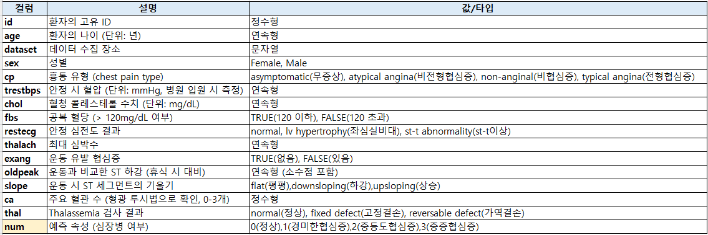
 
**(데이터셋)** https://github.com/YangGuiBee/ML/blob/main/TextBook-12/heart_disease_uci.csv

	import pandas as pd
	import numpy as np
	from sklearn.model_selection import train_test_split
	from sklearn.preprocessing import StandardScaler, LabelEncoder
	from sklearn.linear_model import LogisticRegression
	from sklearn.naive_bayes import GaussianNB
	from sklearn.neighbors import KNeighborsClassifier
	from sklearn.svm import SVC
	from sklearn.tree import DecisionTreeClassifier
	from sklearn.ensemble import RandomForestClassifier
	from sklearn.metrics import (
	    confusion_matrix, accuracy_score, precision_score, recall_score,
	    f1_score, roc_auc_score, roc_curve
	)
	import matplotlib.pyplot as plt
	
	# -----------------------------
	# 1. 데이터셋 불러오기
	# Class 0 → 심장질환 없음(No heart disease)
	# Class 1 → 경도 심장질환(Mild heart disease)
	# Class 2 → 중간 심장질환(Moderate)
	# Class 3 → 심함(Severe)
	# Class 4 → 매우 심함(Very severe)
	# -----------------------------
	data_url = "https://raw.githubusercontent.com/YangGuiBee/ML/main/TextBook-12/heart_disease_uci.csv"
	df = pd.read_csv(data_url)
	
	# -----------------------------
	# 2. 결측값 처리
	# -----------------------------
	for col in df.columns:
	    if df[col].dtype == 'object':
	        df[col].fillna(df[col].mode()[0], inplace=True)
	    else:
	        df[col].fillna(df[col].mean(), inplace=True)
	
	# -----------------------------
	# 3. 컬럼 정리
	# -----------------------------
	df.rename(columns={"num": "target"}, inplace=True)
	df["target"] = df["target"].astype(int)
	
	# -----------------------------
	# 4. Train/Test Split
	# -----------------------------
	X = df.drop(["target", "id", "dataset"], axis=1)
	y = df["target"]
	
	X_train, X_test, y_train, y_test = train_test_split(
	    X, y, test_size=0.2, random_state=42, stratify=y
	)
	
	# -----------------------------
	# 5. Label Encoding
	# -----------------------------
	categorical_columns = ['sex', 'cp', 'restecg', 'slope', 'thal']
	for col in categorical_columns:
	    le = LabelEncoder()
	    X_train[col] = le.fit_transform(X_train[col])
	    X_test[col] = le.transform(X_test[col])
	
	# -----------------------------
	# 6. 스케일링
	# -----------------------------
	scaler = StandardScaler()
	X_train_scaled = scaler.fit_transform(X_train)
	X_test_scaled = scaler.transform(X_test)
	
	# -----------------------------
	# 7. 모델 정의
	# -----------------------------
	models = {
	    "Logistic Regression": LogisticRegression(max_iter=1000),
	    "Naive Bayes": GaussianNB(),
	    "k-Nearest Neighbors": KNeighborsClassifier(n_neighbors=5),
	    "Support Vector Classifier": SVC(probability=True),
	    "Decision Tree": DecisionTreeClassifier(),
	    "Random Forest": RandomForestClassifier(n_estimators=100, random_state=42)
	}
	
	# -----------------------------
	# 8. 모델 학습 + 평가지표 계산
	# -----------------------------
	results = {}
	n_classes = len(np.unique(y_test))
	
	for name, model in models.items():
	
	    # 스케일링 적용 모델
	    if name in ["k-Nearest Neighbors", "Support Vector Classifier"]:
	        model.fit(X_train_scaled, y_train)
	        y_pred = model.predict(X_test_scaled)
	        y_prob = model.predict_proba(X_test_scaled)
	    else:
	        model.fit(X_train, y_train)
	        y_pred = model.predict(X_test)
	        y_prob = model.predict_proba(X_test)
	
	    # 혼동행렬
	    cm = confusion_matrix(y_test, y_pred)
	
	    # Accuracy, Precision, Recall, F1
	    accuracy = accuracy_score(y_test, y_pred)
	    precision = precision_score(y_test, y_pred, average="macro")
	    recall_macro = recall_score(y_test, y_pred, average="macro")
	    f1 = f1_score(y_test, y_pred, average="macro")
	    error_rate = 1 - accuracy
	    auc_score = roc_auc_score(y_test, y_prob, multi_class="ovr")
	
	    # TP/FP/FN/TN (One-vs-Rest)
	    TP = np.zeros(n_classes)
	    FP = np.zeros(n_classes)
	    FN = np.zeros(n_classes)
	    TN = np.zeros(n_classes)
	
	    for i in range(n_classes):
	        TP[i] = cm[i, i]
	        FP[i] = cm[:, i].sum() - TP[i]
	        FN[i] = cm[i, :].sum() - TP[i]
	        TN[i] = cm.sum() - (TP[i] + FP[i] + FN[i])
	
	    # Specificity (TNR), Fall-Out (FPR)
	    specificity = (TN / (TN + FP)).mean()
	    fall_out = (FP / (FP + TN)).mean()
	
	    results[name] = {
	        "Confusion Matrix": cm.tolist(),
	        "Accuracy": accuracy,
	        "Precision (PPV)": precision,
	        "Recall (TPR)": recall_macro,
	        "F1 Score": f1,
	        "Error Rate": error_rate,
	        "Specificity (TNR)": specificity,
	        "Fall-Out (FPR)": fall_out,
	        "AUC Score": auc_score,
	    }
	
	# -----------------------------
	# 9. 평가지표 출력
	# -----------------------------
	for name, metrics in results.items():
	    print(f"\n{name} Evaluation Results:")
	    for metric, value in metrics.items():
	        if metric == "Confusion Matrix":
	            print(f"{metric}:\n{value}")
	        else:
	            print(f"{metric}: {value:.4f}")
	
	# -----------------------------
	# 10. ROC Curve (모델 동일색 + 클래스별 선스타일)
	# -----------------------------
	plt.figure(figsize=(12, 8))
	
	model_colors = {
	    "Logistic Regression": "blue",
	    "Naive Bayes": "orange",
	    "k-Nearest Neighbors": "green",
	    "Support Vector Classifier": "red",
	    "Decision Tree": "purple",
	    "Random Forest": "brown"
	}
	
	linestyles = ['-', '--', '-.', ':', (0, (3, 1, 1, 1))]
	
	for name, model in models.items():
	    # 확률값 계산
	    if name in ["k-Nearest Neighbors", "Support Vector Classifier"]:
	        y_prob = model.predict_proba(X_test_scaled)
	    else:
	        y_prob = model.predict_proba(X_test)
	
	    model_color = model_colors[name]
	
	    for i in range(n_classes):
	        fpr, tpr, _ = roc_curve(y_test, y_prob[:, i], pos_label=i)
	        plt.plot(
	            fpr, tpr,
	            color=model_color,
	            linestyle=linestyles[i % len(linestyles)],
	            linewidth=1.7,
	            label=f"{name} (Class {i})"
	        )
	
	plt.plot([0, 1], [0, 1], "k--", label="Random Guess")
	
	plt.xlabel("False Positive Rate")
	plt.ylabel("True Positive Rate")
	plt.title("ROC Curve (Model-colors unified)")
	plt.legend(loc="center left", bbox_to_anchor=(1, 0.5))
	plt.tight_layout()
	plt.show()

 

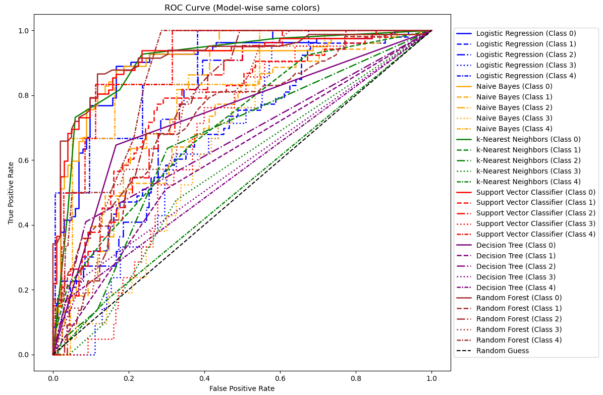

 
	
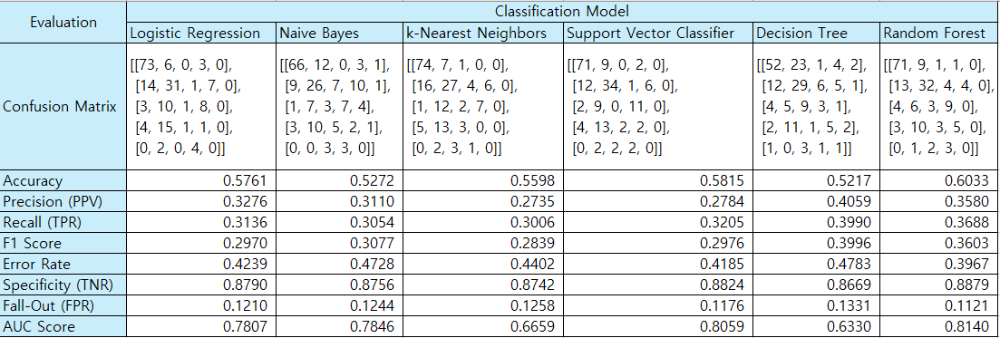
 

**(Confusion Matrix)**

 

ROC로만 평가 했을때 분류모델의 평가순위 
(1위) Logistic Regression 
(2위) Support Vector Classifier 
(3위) Random Forest 
(4위) kNN 
(5위) Naive Bayes 
(6위) Decision Tree 

나머지 전체 평가지표의 분류모델의 평가순위 
(1위)	Random Forest :	AUC·Accuracy·Specificity 모두 상위권, 안정적 
(2위)	SVC :	AUC 최고, Accuracy 높음 
(3위)	Logistic Regression : 단순하지만 성능 안정적 
(4위)	Naive Bayes : AUC 높으나 Accuracy/F1 낮음 
(5위)	kNN : AUC 낮고 데이터 스케일 민감 
(6위)	Decision Tree : AUC/Accuracy 최하위, 과적합 

=> 종합 판단 결과 : Random Forest가 1위 

---

**데이터 전처리**  
**num = 0 → target = 0 (심장병 없음)**  
**num = 1, 2, 3, 4 → target = 1 (심장병 있음)**  

	import pandas as pd
	import numpy as np
	from sklearn.model_selection import train_test_split
	from sklearn.preprocessing import StandardScaler, LabelEncoder
	from sklearn.linear_model import LogisticRegression
	from sklearn.naive_bayes import GaussianNB
	from sklearn.neighbors import KNeighborsClassifier
	from sklearn.svm import SVC
	from sklearn.tree import DecisionTreeClassifier
	from sklearn.ensemble import RandomForestClassifier
	from sklearn.metrics import (confusion_matrix, accuracy_score, precision_score, recall_score, 
	                             f1_score, roc_auc_score, roc_curve)
	import matplotlib.pyplot as plt
	
	# 1. 데이터셋 불러오기
	data_url = "https://raw.githubusercontent.com/YangGuiBee/ML/main/TextBook-12/heart_disease_uci.csv"
	df = pd.read_csv(data_url)
	
	# 2. 결측값 확인 및 처리
	print("Missing values in dataset before processing:\n", df.isnull().sum())  # 결측값 확인
	
	# 결측값 처리
	for col in df.columns:
	    if df[col].dtype == 'object':  # 범주형 데이터
	        df[col].fillna(df[col].mode()[0], inplace=True)  # 최빈값으로 대체
	    else:  # 수치형 데이터
	        df[col].fillna(df[col].mean(), inplace=True)  # 평균값으로 대체
	
	print("Missing values in dataset after processing:\n", df.isnull().sum())  # 결측값 확인
	
	# 3. 타겟 변수 확인 및 이진 분류로 변환
	if 'target' not in df.columns:
	    df.rename(columns={"num": "target"}, inplace=True)  # 'num' 열을 'target'으로 변경
	assert 'target' in df.columns, "The dataset does not contain a 'target' column."
	
	if df['target'].nunique() > 2:
	    print("Warning: Detected multiclass target. Converting to binary classification (0/1).")
	    df['target'] = (df['target'] > 0).astype(int)  # 0: 심장병 없음, 1: 심장병 있음
	
	# 독립 변수와 종속 변수 분리
	X = df.drop(["target"], axis=1)  # 타겟 열 제거
	y = df["target"]
	
	# 범주형 열 확인 및 고유값 확인
	print("\nUnique values in categorical columns before encoding:")
	for col in X.columns:
	    if X[col].dtype == 'object':
	        print(f"{col}: {X[col].unique()}")
	
	# 4. 범주형 변수 처리
	label_encoders = {}
	categorical_columns = [col for col in X.columns if X[col].dtype == 'object']  # 문자열 컬럼 자동 탐지
	for col in categorical_columns:
	    le = LabelEncoder()
	    X[col] = le.fit_transform(X[col])  # 범주형 변수를 수치형으로 변환
	    label_encoders[col] = le
	
	# 범주형 처리 후 확인
	print("\nUnique values in categorical columns after encoding:")
	for col in categorical_columns:
	    print(f"{col}: {X[col].unique()}")
	
	# 5. Train-Test Split
	X_train, X_test, y_train, y_test = train_test_split(X, y, test_size=0.2, random_state=42, stratify=y)
	
	# 6. 데이터 스케일링 (k-NN, SVM에서 필요)
	scaler = StandardScaler()
	X_train_scaled = scaler.fit_transform(X_train)
	X_test_scaled = scaler.transform(X_test)
	
	# 7. 분류 알고리즘 초기화
	models = {
	    "Logistic Regression": LogisticRegression(),
	    "Naive Bayes": GaussianNB(),
	    "k-Nearest Neighbors": KNeighborsClassifier(n_neighbors=5),
	    "Support Vector Classifier": SVC(probability=True),
	    "Decision Tree": DecisionTreeClassifier(),
	    "Random Forest": RandomForestClassifier(n_estimators=100, random_state=42)
	}
	
	# 결과 저장용
	results = {}
	
	# 8. 모델 학습 및 평가
	for name, model in models.items():
	    if name in ["k-Nearest Neighbors", "Support Vector Classifier"]:
	        model.fit(X_train_scaled, y_train)  # 스케일링된 데이터 사용
	        y_pred = model.predict(X_test_scaled)
	        y_prob = model.predict_proba(X_test_scaled)[:, 1]
	    else:
	        model.fit(X_train, y_train)
	        y_pred = model.predict(X_test)
	        y_prob = model.predict_proba(X_test)[:, 1]
	    
	    # 평가
	    cm = confusion_matrix(y_test, y_pred)
	    acc = accuracy_score(y_test, y_pred)
	    prec = precision_score(y_test, y_pred)
	    rec = recall_score(y_test, y_pred)
	    f1 = f1_score(y_test, y_pred)
	    error_rate = 1 - acc
	    auc = roc_auc_score(y_test, y_prob)
	
	    # 결과 저장
	    results[name] = {
	        "Confusion Matrix": cm.tolist(),
	        "Accuracy": acc,
	        "Precision": prec,
	        "Recall (TPR)": rec,
	        "F1 Score": f1,
	        "Error Rate": error_rate,
	        "AUC": auc
	    }
	
	# 결과 출력
	for name, metrics in results.items():
	    print(f"\n{name} Results:")
	    for metric, value in metrics.items():
	        if metric == "Confusion Matrix":
	            print(f"{metric}:\n{value}")
	        else:
	            print(f"{metric}: {value:.4f}")
	
	# 9. ROC Curve 시각화
	plt.figure(figsize=(10, 6))
	for name, model in models.items():
	    if name in ["k-Nearest Neighbors", "Support Vector Classifier"]:
	        y_prob = model.predict_proba(X_test_scaled)[:, 1]
	    else:
	        y_prob = model.predict_proba(X_test)[:, 1]
	    fpr, tpr, _ = roc_curve(y_test, y_prob)
	    plt.plot(fpr, tpr, label=f"{name} (AUC: {roc_auc_score(y_test, y_prob):.2f})")
	
	plt.plot([0, 1], [0, 1], "k--", label="Random Guess")
	plt.xlabel("False Positive Rate")
	plt.ylabel("True Positive Rate")
	plt.title("ROC Curve")
	plt.legend()
	plt.show()

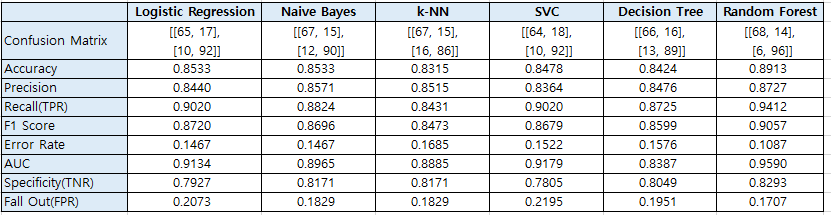
   

---

