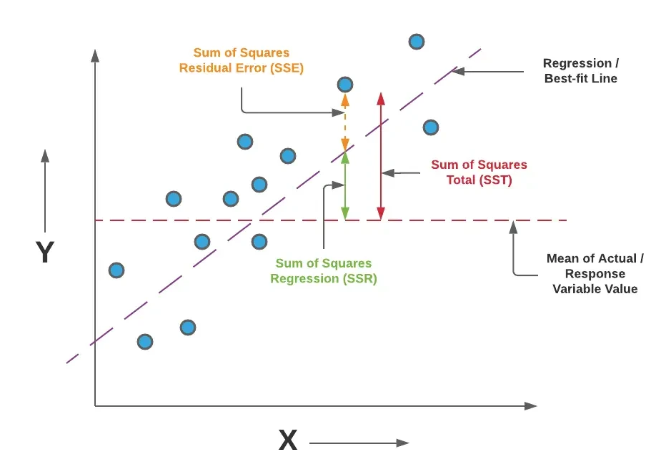

#  13 : 회귀 평가 지표

---

	[1] 평균 오차 (Mean Error, ME)
 	[2] 평균 절대 오차 (Mean Absolute Error, MAE)
	[3] 평균 제곱 오차 (Mean Squared Error, MSE)
	[4] 평균 제곱 오차(로그적용) (Mean Squared Log Error, MSLE)
	[5] 평균 제곱근 오차 (Root Mean Squared Error, RMSE)
	[6] 평균 제곱근 오차(로그적용) (Root Mean Squared Log Error, RMSLE)
 	[7] 평균 비율 오차 (Mean Percentage Error, MPE)
	[8] 평균 절대 비율 오차 (Mean Absolute Percentage Error, MAPE)
	[9] 평균 절대 규모 오차 (MASE(Mean Absolute Scaled Error)
	[10] R2 score
	  
---

# [1] 평균 오차 (Mean Error, ME)

 
예측오차의 산술평균을 의미 

	def ME(y, t):
		return (y-t).mean(axis=None)

 

# [2] 평균 절대 오차 (Mean Absolute Error, MAE)

 
실제 정답 값과 예측 값의 차이를 절댓값으로 변환한 뒤 합산하여 평균을 구한다. 
특이값이 많은 경우에 주로 사용된다. 
값이 낮을수록 좋다. 
직관적이고 정답 및 예측 값과 같은 단위를 가지고, MSE, RMSE에 비해, 오차값이 outlier의 영향을 상대적으로 적게 받는 장점 
절댓값을 취하므로 underestimates/overestimates인지에 대한 판단을 할 수 없으며, 스케일 의존적(scal dependency)으로 모델마다 에러 크기가 동일해도 에러율은 동일하지 않은 단점 

	def MAE(y, t):
    	return (abs(y - t)).mean(axis=None)
   
 

# [3] 평균 제곱 오차 (Mean Squared Error, MSE)

 
실제 정답 값과 예측 값의 차이를 제곱(예측값과 실제값 차이의 면적)한 뒤 평균을 구한다. 
값이 낮을수록 좋다. 
직관적인 장점 
예측 변수와 단위가 다르며, 오차를 제곱하기 때문에 이상치에 민감(제곱하기 때문에 1미만의 에러는 작아지고 그 이상의 에러는 커짐), 제곱을 씌우게 되어 underestimates/overestimates인지 파악하기 힘들며, 스케일 의존적(scal dependency)이라 모델마다 에러러 크기가 동일해도 에러율은 동일하지 않은 단점 
CF : 오차제곱합(SSE)와 유사하지만 오차제곱합으로는 실제 오차가 커서 값이 커지는 것인지 데이터의 양이 많아서 값이 커지는 것인지를 구분할 수 없게 된다. 

	def MSE(y, t):
    	return ((y-t)**2).mean(axis=None)

	def SSE(y, t):
    	return 0.5*np.sum((y-t)**2)

 

# [4] 평균 제곱 오차(로그적용) (Mean Squared Log Error, MSLE)

 
MSE에 로그를 적용한 것이다.  
결정 값이 클수록 오류값도 커지기 때문에 일부 큰 오류값들로 인해 전체 오류값이 커지는 것을 막아준다. 

	def MSLE(y, t):
		return np.log((y-t)**2).mean(axis=None)

 

# [5] 평균 제곱근 오차 (Root Mean Squared Error, RMSE)

 
MSE에 루트는 씌워서 에러를 제곱해서 생기는 값의 왜곡이 줄어든다. 
값이 낮을수록 좋다. 
직관적인 장점 
제곱 후 루트를 씌우기 때문에 MAE처럼 실제 값에 대해 underestimates/overestimates인지 파악하기 힘들고, 스케일 의존적(scal dependency)으로 모델마다 에러 크기가 동일해도 에러율은 동일하지 않은 단점 

	def RMSE(y, t):
		return np.sqrt(((y - t) ** 2).mean(axis=None))

 

# [6] 평균 제곱근 오차(로그적용) (Root Mean Squared Log Error, RMSLE)

 
RMSE값에 로그를 취한 값이다. 
결정 값이 클 수록 오류 값도 커지기 때문에 일부 큰 오류 값들로인해 전체 오류값이 커지는 것을 막아준다. 

	def RMSLE(y, t):
		return np.log(np.sqrt(((y - t) ** 2).mean(axis=None)))

 

# [7] 평균 비율 오차 (Mean Percentage Error, MPE)

 
절대적인 의미의 예측오차뿐 아니라 상대적인 의미의 예측오차가 필요할 경우에 계산한다. 
음수면 overperformance, 양수면 underperformance으로 판단 
모델이 underestimates/overestimates인지 판단할 수 있다는 장점 

	def MPE(y, t):
		return (((y-t)/y)*100).mean(axis=None)

 

# [8] 평균 절대 비율 오차 (Mean Absolute Percentage Error, MAPE)

 
MAE를 비율, 퍼센트로 표현하여 스케인 의존적 에러의 문제점을 개선한다. 
값이 낮을수록 좋다. 
직관적이고, 다른 모델과 에러율 비교가 쉬운 장점 
실제 정답보다 낮게 예측했는지, 높게 했는지를 파악하기 힘들고 실제 정답이 1보다작을 경우,무한대의 값으로 수렴할 수 있는 단점 

	def MAPE(y, t):
		return ((abs((y-t)/y))*100).mean(axis=None)

 

# [9] 평균 절대 규모 오차 (MASE(Mean Absolute Scaled Error)
 
 
데이터를 척도화하여 이를 기준으로 예측오차의 절대값에 대한 평균을 낸 값 
스케일에 대한 의존성이 낮다는 장점 

	def MASE(y, t):
		n = len(y)
		d = np.abs(np.diff(y)).sum() / (n - 1)
		errors = abs(y-t)
		return errors.mean(axis=None)/d

 

# [10] R2 score
**SST(Total Sum of Squares) :** 관측값에서 관측값의 평균(혹은 추정치의 평균)을 뺀 결과의 총합인 총 제곱합 
전체(Total)에 대한 변동성을 나타내며 SST는 SSR과 SSE의 합 

 

**SSR(Sum of Squares due to Regression) :** 회귀식 추정 값과 관측값의 평균 간 차이인 회귀 제곱합 
회귀식으로 부터 나온 예측값에서 관측값(y)의 평균(혹은 추정치의 평균)을 뺀 결과의 총합 
ESS(Explained Sum of Squares)로 분석을 통해 설명 가능한 수치로 직선(Regression)에 대한 변동성을 나타낸다. 

 

**SSE(Sum of Squares Residual of Error) :** 실제 관측값(y)과 예측값 사이의 차인 잔차(Residual)의 총합 
예측값과 실제 관측값의 차이가 있을 수 있으며 이는 회귀식으로는 설명할 수 없는 설명 불가능한 수치이다.  
SSE값은 오차(Error)에 대한 변동성을 나타내는데, 이 값이 작을수록 좋은 모델이라 볼 수 있다. 자주 사용되는 MSE(Mean Squared Error)는 SSE를 표준화한 개념이다. 

 

위의 수식에 따라 결국 SST=SSR+SSE이며, SSR과 SSE는 반비례 관계라는 것을 알 수 있다. 
총 변동 중 설명 가능한 변동의 비율을 뜻하는 결정계수(R2)는 아래와 같은 식이 성립한다. 

$SST = SSR + SSE$  

 
다른 지표(MAE, MSE, RMSE)들은 모델마다 값이 다르기 때문에 절대 값만 보고 선능을 판단하기 어려운 반면, $R^2$ score는 상대적인 성능을 나타내기 비교가 쉽다. 
실제 값의 분산 대비 예측값의 분산 비율을 의미한다. 
0에서 1 사이의 값을 가지며, 1에 가까울 수록 좋다. 

  

 
출처 : https://medium.com/coders-mojo/data-science-and-machine-learning-projects-mega-compilation-part-5-e50baa2faa85

	import numpy as np
	import matplotlib.pyplot as plt
	from sklearn.linear_model import LinearRegression

	#해당 구문이 사용된 파이썬 파일을 직접 실행했을 때만 아래 코드를 실행
	if __name__ == '__main__':
    
	    # 테스트용 데이터 생성
	    x = np.random.rand(1000)*100
	    y = 0.8*x+np.random.randn(1000)*30

	    # Linear Regrssion model 생성
	    model = LinearRegression() 
    
	    # Linear Regression model 학습
	    model.fit(x.reshape(-1,1), y) 
    
	    # Prediction
	    y_new = model.predict(np.array([6]).reshape((-1, 1))) 
	    print("Data Prediction: ", y_new)
    
	    # Linear Regression model 평가
	    r_sq = model.score(x.reshape(-1,1), y)  
	    print("결정 계수: ", r_sq)
    
	    # Linear Model 식 
	    b0,b1 = model.intercept_, model.coef_[0]   
	    print("기울기", model.coef_[0])
	    print("절편", model.intercept_)

	    # 시각화
	    plt.scatter(x, y, s=5)
	    plt.plot(x, model.predict(x.reshape(-1,1)), color='red', linewidth=2)
	    plt.annotate('y = '+str(round(b1,2))+'x '+str(round(b0,2)), xy=(100, 100), xytext=(80, 80))
	    plt.show()

