#  13 : 강화학습, 앙상블학습

| 구분  | 비지도학습 (Unsupervised Learning) | 지도학습 (Supervised Learning) | 강화학습 (Reinforcement Learning)    |
| ---- | --------------------------------- | ------------------------------------- | -------------------------------- |
| 핵심특징 | 탐색적 분석 | 예측 | 의사결정 최적화 |
| 목적  | 데이터의 숨겨진 패턴/구조 발견, 군집·차원축소| 입력(X) → 정답(y)의 매핑 함수 학습, 예측/분류/회귀 | 환경과 상호작용을 통해 최대 보상 행동 전략(policy) 학습                             |
| 정답 | 없음 | 있음 | 없음(보상 있음) |
| 데이터 제공방식 | 레이블(y) 없음  | 레이블(y) 제공 | 데이터가 아니라 환경(Environment) 제공 → 상태(State), 행동(Action), 보상(Reward) |
| 피드백 유형   | 없음(No explicit feedback)          | 정답과 비교하여 오차 기반 피드백 제공             | 행동 후 보상(Reward)이라는 지연된 피드백 제공                                   |
| 피드백 형태 | 없음 | 즉각 | 지연 보상 |
| 학습과정    | 데이터 간 유사성·구조를 스스로 찾음              | 손실 함수(Loss)를 최소화하도록 매개변수를 조정          | 탐험(Explore)과 활용(Exploit) 균형을 잡으며 보상 극대화                             |
| 학습대상 | 데이터 구조 | 입력 → 정답 | 행동 → 보상 |
| 학습방식 | 정적분석 | 손실최소 | 정책/가치 반복개선 |
| 출력 | 클러스터, 잠재 feature, 밀도 구조 | 예측값(회귀), 클래스(분류 확률), ŷ  | 최적 정책 π*(s), Q값, 행동 전략     |
| 적용분야 | 군집(K-means), 차원축소(PCA), 이상치 탐지    | 이미지 분류, 음성/자연어 처리, 수요 예측, 금융 리스크 모델   | 로봇 제어, 게임 AI, 자율주행, 광고 전략, 추천 시스템 최적화                               |

 

---

## 강화 학습(Reinforcement Learning, RL)

	[1] Model-free RL : Value Iteration
	테이블 기반
		(1-1) Q-Learning: 작은 상태 공간에서 사용되는 표(Q-Table) 기반
		(1-2) SARSA(State Action Reward State Action)
	심층 기반
		(1-3) Q-Network: 신경망을 사용하여 Q-값을 근사화하는 모델
		(1-4) DQN(Deep Q-Network): 딥러닝을 활용한 Q-Learning의 발전된 형태 (2013, 2015)
		(1-5) Double DQN: Q-Learning의 과대 평가 문제를 완화하기 위한 개선된 버전
		(1-6) Dueling DQN: 상태 가치와 행동의 중요도를 분리하여 Q-값을 계산하는 모델
		(1-7) DRQN(Deep Recurrent Q-Network): 순차적인 경험을 학습하기 위해 RNN 구조를 포함한 DQN
	분포 기반
		(1-8) C51(Categorical DQN 51): Q-값의 분포를 학습하는 DQN 확장
		(1-9) IQN(Implicit Quantile Networks): Q-값의 분포를 세밀하게 조정하는 방식
		(1-10) Rainbow: 여러 DQN 확장(PER, Double DQN, C51 등)을 결합한 통합 알고리즘 (DeepMind, 2017)
	소프트 기반
		(1-11) SQL(Soft Q-Learning): 엔트로피를 추가하여 Q값 학습을 안정화하는 방식
	리플레이/탐색 기반
		(1-12) PER(Prioritized Experience Replay): 중요한 경험을 우선적으로 학습하는 경험 리플레이 전략
		(1-13) HER(Hindsight Experience Replay): 목표 달성을 학습할 수 있도록 과거 경험을 재사용하는 기법
		(1-14) NoisyNet: 신경망 가중치에 노이즈를 추가해 탐색 효율성을 높이는 방식

	[2] Model-free RL : Policy Iteration 
 	기본 Policy Gradient 및 Actor-Critic 계열
		(2-1) Policy Gradient: 기본적인 정책 직접 학습 알고리즘
		(2-2) Actor-Critic: 기본적인 Actor-Critic 구조, Policy Gradient와 Critic의 Q값 평가 결합
		(2-3) NAC(Natural Actor-Critic): Natural Gradient를 적용해 정책의 효율적 업데이트를 수행
		(2-4) REINFORCE: 정책 경사법의 기본 형태
	Advantage Actor-Critic 및 분산 학습 계열
 		(2-5) A2C/A3C(Advantage Actor-Critic): 분산형 Actor-Critic 모델
		(2-6) ACER(Actor-Critic with Experience Replay): 경험 리플레이를 추가한 Actor-Critic 방법
		(2-7) IMPALA(Importance Weighted Actor-Learner Architecture): 분산 학습에 최적화된 구조
		(2-8) Off-PAC(Off-Policy Actor-Critic): 오프폴리시 데이터를 활용하는 Actor-Critic 기법
	신뢰 구간 기반 정책 최적화 계열
		(2-9) PPO(Proximal Policy Optimization): 신뢰 구간을 사용해 안정적으로 정책을 업데이트
		(2-10) TRPO(Trust Region Policy Optimization): 정책 급변을 방지하는 최적화 기법
	연속 행동 공간 최적화 계열 
		(2-11) DDPG(Deep Deterministic Policy Gradient): 연속적 행동 공간에서 학습하는 Actor-Critic 모델
		(2-12) TD3(Twin Delayed DDPG): DDPG의 한계점을 극복하기 위한 개선된 모델
		(2-13) SAC(Soft Actor-Critic): 탐색과 활용의 균형을 유지하도록 설계된 정책 학습 모델(2018, 2019) 
	전문가 시범 데이터 활용 계열 
		(2-14) BC(Behavioral Cloning): 데이터를 기반으로 정책을 모방하는 방식
		(2-15) DDPGfD(DDPG from Demonstrations): 전문가의 시범을 사용해 DDPG 성능을 개선

	[3] Model-based RL : Given the Model
	(3-1) Dyna-Q: 모델 기반 RL과 모델-프리 RL을 조합한 알고리즘
	(3-2) AlphaZero: 시뮬레이션을 통한 최적의 행동을 찾는 Monte Carlo Tree Search 기반 모델
	
 	[4] Model-based RL : Learn the Model
	(4-1) World Models: 환경을 모델링하고 시뮬레이션을 통해 학습하는 방식
	(4-2) I2A(Imagination-Augmented Agents): 상상된 상태에서 정책을 훈련시키는 기법
	(4-3) MBMF(Model-Based Model-Free): 모델기반 접근과 모델-프리 접근을 혼합한 기법으로, 모델을 사용하지만 모델-프리의 장점도 살리는 방식
	(4-4) MBVE(Model-Based Value Expansion): 모델은 학습 보조 수단으로 활용되며, 에이전트가 환경에서 수집한 데이터로 학습
	(4-5) Dreamer: 사전에 환경 모델이 제공되지 않은 상태에서, 에이전트가 환경 데이터를 수집해 세계 모델을 학습하고 이를 활용해 정책과 가치 함수를 학습 (DeepMind, 2020)
	(4-6) PlaNet: Dreamer의 전신인 모델 기반 강화 학습 알고리즘
	(4-7) PETs(Probabilistic Ensembles with Trajectory Sampling): 확률적 모델 앙상블을 활용하는 강화학습 기법
	(4-8) MuZero: 알파고(AlphaGo) 시리즈의 발전된 형태로, 명시적 환경 모델 없이도 정책과 가치를 학습 (DeepMind, 2019)

---  
 
## 앙상블 학습(Ensemble Learning, EL)
 

    [1] 스태킹(Stacking)
    [2] 배깅(Bagging)
    [3] 부스팅(Boosting) : AdaBoost, Gradient Boosting, XGBoost 

---  

# 강화 학습(Reinforcement Learning, RL)

 
(출처) https://github.com/YangGuiBee/ML/blob/main/TextBook-12/01_IntroductiontoReinforcementLearning.pdf 
 
시행착오(Trial and Error)를 통하여 실수와 보상을 통해 학습을 하여 목표를 찾아가는 알고리즘으로,  
어떤 환경 안에서 정의된 에이전트가 현재의 상태를 인식하여, 선택가능한 행동들 중 보상을 최대화하는 행동 혹은 행동순서를 선택하는 방법. 
기존의 알고리즘이 라벨(정답)이 있는 데이터를 통해서 가중치와 편향을 학습하는 것과 비슷하게  
보상(Reward)이라는 개념을 사용하여 가중치와 편향을 학습하는 것으로 목적은 최적의 행동양식 또는 정책을 학습. 
학습 중에 사람을 포함한 환경으로부터 피드백 지도를 받기 때문에 지도학습으로 분류되기도 하나,  
입출력 쌍으로 이루어진 훈련 집합이 제시되지 않으며, 잘못된 행동에 대해서도 명시적으로 정정이 일어나지 않는 등 
강화학습이 가지는 최적의 의사결정 프로세스가 정해진 레이블과 비교 판별식을 구하는 방식과는 구별되는 학습모델로 독립적으로 분류. 

 (출처) Deep Learning Bible(https://wikidocs.net/169311)
  
Agent 기계는 환경(Environment)으로부터 상태(state)를 관측(observation)하고 이에 다른 적절한 행동(action)을 하면 
이 행동을 기준으로 환경으로부터 보상(reward)을 받는 상호작용(관측→행동→보상)을 반복하면서 보상을 최대화하는 것이 목표  
[Chat GPT가 그린 그림] 

 
[Chat GPT가 찾은 그림] 

 

## [강화학습의 응용분야]  
**<ins>Richard S. Sutton, "Deconstructing Reinforcement Learning"(2009년 국제기계학습학회(ICML)에서 발표)</ins>** 

	(1위) 프로세스 제어 (24%) 
	(2위) 네트워크 관리 (21%) 
	(3위) 자산 관리 (18%) 
	(4위) 로보틱스 (13%) 
	(5위) 교통 (6%) 
	(6위) 자동 제어 (6%) 
	(7위) 금융 (4%) 
	(8위) 기타(8%) 

### (1) 프로세스 제어 (24%)
강화학습이 제조 및 공정 산업에서 시스템의 상태를 최적화 및 자동화함으로써 복잡한 변수를 실시간으로 제어하여 안정적이고 효율적인 작업  
**화학 공정 최적화:** MIT와 BASF는 강화학습을 사용해 화학반응 공정을 최적화하여 온도와 압력을 조정해 불순물 제거 효과를 극대화  
**발전소 운영 최적화:** 일본의 발전소에서는 강화학습을 통해 온도와 연료 혼합 비율을 실시간으로 조정하여 효율을 개선  
**산업용 보일러 제어:** 중국의 한 석유화학 공장에서는 강화학습 기반 제어 시스템을 도입해 보일러의 연료소비를 최적화  

### (2) 네트워크 관리 (21%)
트래픽 최적화, 자원 배분 등을 통해 네트워크 성능을 높이고 응답 시간을 줄이는 데 사용  
**클라우드 리소스 최적화:** Microsoft Azure는 강화학습을 사용하여 클라우드 리소스를 자동으로 할당하고 트래픽 패턴에 따라 서버를 확장  
**네트워크 트래픽 관리:** 중국의 Huawei는 강화학습을 사용해 5G 네트워크에서 실시간 트래픽 경로를 최적화  
**데이터센터 냉각 최적화:** 구글 데이터센터에서는 강화학습을 통해 냉각 시스템을 자동으로 제어하여 냉각 비용을 절감  

### (3) 자산 관리 (18%)
투자 포트폴리오 최적화와 리스크 관리를 통해 수익을 극대화하고 위험을 최소화  
**포트폴리오 최적화:** BlackRock은 강화학습을 사용해 자산 배분 전략을 자동화하여 수익증가를 이루고 시장 상황에 맞춰 빠르게 포트폴리오 조정  
**고빈도 트레이딩:** JPMorgan은 강화학습 기반 알고리즘을 통해 매수 및 매도 시점을 실시간으로 분석하여 고빈도 거래에서 성과 향상  
**보험 리스크 평가:** Progressive 보험사는 강화학습을 사용해 고객 리스크를 평가하여 손해율을 줄임으로써 고객에게 더 적합한 보험 상품을 제안  

### (4) 로보틱스 (13%)
로봇이 복잡한 환경에서 자율적으로 작업을 수행할 수 있도록 학습  
**로봇 팔 최적화:** KUKA Robotics는 강화학습을 통해 로봇 팔이 특정 작업을 정확하게 수행할 수 있도록 학습시켜 작업 시간과 오차율을 감소  
**자율 이동 로봇:** Amazon Robotics는 물류창고에서 자율이동 로봇의 경로 최적화를 달성해서 주문을 빠르게 처리  
**산업용 드론 제어:** Skydio는 드론이 강화학습을 통해 장애물을 회피하고 안전하게 이동할 수 있도록 개발  

### (5) 교통 (6%)
교통 흐름을 최적화하고, 자율 주행 차량의 경로를 조정하여 효율적인 교통 시스템을 구축하는 데 기여  
**교통 신호 최적화:** 도쿄는 강화학습을 사용해 주요 교차로의 교통 신호를 최적화하여 혼잡 시간을 단축  
**자율주행 차량 경로 계획:** Tesla는 강화학습을 통해 자율주행 차량이 복잡한 도로 환경에서 최적의 경로를 찾도록 학습시켜 주행 안전성을 향상  
**물류 경로 최적화:** FedEx는 배송 경로를 강화학습을 통해 최적화하여 운송 비용을 줄임으로써 운송 시간 단축과 연료 비용 절감에 크게 기여  

### (6) 자동 제어 (6%)
공장 자동화, 드론 제어 등의 분야에서 강화학습을 통해 복잡한 시스템을 자율적으로 제어  
**공장 자동화:** Siemens는 강화학습을 통해 공장 자동화 시스템을 최적화하여 생산성을 향상시키고, 에너지 소비를 절감  
**드론 내비게이션:** Parrot Drones는 강화학습을 통해 드론이 장애물을 회피하고 목표지점까지 안전하게 이동시켜서 드론의 충돌 위험을 감소  
**발전소 제어:** 한전(KEPCO)에서는 발전소에서 전력 공급을 강화학습을 통해 실시간 제어하여 전력 공급의 안정성을 높이고 비용을 절감  

### (7) 금융 (4%)
시장 예측, 거래 전략, 리스크 관리 등에서 성능을 높이는 데 강화학습이 중요한 역할  
**알고리즘 트레이딩:** Goldman Sachs는 강화학습을 이용해 고빈도 거래에서 수익률을 개선  
**신용 리스크 평가:** 강화학습을 통해 고객의 신용 점수를 예측하여, 대출 승인율을 높이면서 부실 채권 비율을 줄이는 성과  
**외환 거래 전략:** Citibank는 강화학습을 통해 외환 거래에서 최적의 매수/매도 타이밍을 학습하여 수익률 향상을 달성 

### (8) 기타(8%)
**스포츠 전략 및 선수 훈련:** 축구, 농구, 미식축구 등의 스포츠에서 선수의 최적의 움직임이나 팀 전략 분석에 사용  
DeepMind의 축구 AI: Google DeepMind는 축구 선수들의 최적의 움직임과 전략을 학습하여 경기에서 다양한 전략을 실시간으로 테스트  
농구 슛 트레이닝: 강화학습을 이용해 농구 선수의 슛 성공률을 높이기 위한 최적의 각도, 속도 등을 학습시키는 연구  
**교육 기술 (EdTech):** 학생의 학습 속도, 이해도 등에 따라 적절한 학습 경로를 제공하여 효과적인 학습 환경을 조성  
개인화 학습 경로 제공: EdTech는 학생이 문제에서 반복적으로 오답을 낼 경우, 해당 개념과 관련된 기초 문제를 더 제공하여 학습  
퀴즈 최적화: Duolingo와 같은 교육 플랫폼에서는 사용자 학습을 추적하고, 강화학습으로 최적의 퀴즈를 추천해 학습자에게 맞춘 학습 경험 제공  
**스마트 시티 (Smart City):** 교통 신호 제어, 에너지 관리, 공공 서비스 배치 등을 최적화하여 시민들에게 더 나은 환경을 제공  
교통 혼잡 완화: 싱가포르에서는 교차로에서 차량의 흐름을 분석하여 신호주기 조정을 통해 교통신호를 최적화하여 교통흐름 개선  
에너지 관리: 스마트 그리드에서 강화학습을 통해 전력 수요를 예측하고 에너지 소비를 최적화하는 방안을 연구 중  
**재난 대응 및 구조:** 위험 지역에 들어가기 전에 최적의 경로를 미리 학습하거나 로봇을 활용한 구조 활동에 활용  
로봇 구조 임무: 재난 상황에서 로봇이 피해자에게 빠르게 접근할 수 있도록 강화학습을 이용해 장애물을 피하고 최단 경로를 탐색  
드론을 통한 감시 및 탐색: 강화학습을 통해 드론이 재난 지역을 감시하고 구조 가능한 위치를 탐색하는 데 필요한 비행 경로를 학습  
**스마트 농업:** 작물 관리, 관개 시스템 조절, 병충해 방제 등 농업 생산성을 향상시키는 다양한 기술  
작물 성장 최적화: 강화학습을 통해 온도, 습도, 조명 등을 자동제어로 조절해 최적의 작물 성장 조건을 유지하는 기술 개발  
농기계 경로 최적화: 자율주행 농기계가 강화학습을 통해 농지 내에서 최적의 경로를 학습하여 연료 소비와 시간을 절감  

**<ins>D. Zhang 외, "A survey on applications of reinforcement learning in spatial resource allocation"(2024)</ins>** 

	(1위) 로보틱스 / 자율제어 / 자율주행 (25-30%) 
	(2위) 산업 시스템 제어 / 제조 프로세스 최적화 (25-30%) 
	(3위) 네트워크・통신・클라우드 관리 (10-15%) 
	(4위) 교통 / 스마트 인프라 관리 (8-12%) 
	(5위) 금융・자산 관리 / 알고리즘 트레이딩 (8-10%) 
	(6위) 추천 시스템・소프트웨어 엔지니어링 / 기타 IT 분야 (8-10%) 
	(7위) 헬스케어・의료영상・제약 (5-8%) 

## [강화학습의 연구]  

강화학습에 영향을 끼친 학문분야는 인공지능 외에도 행동심리학, 신경과학, 제어이론, 운용과학 등이 있으며,  
이 중 가장 근간이 되는 학문이 **행동심리학(Behavioral Psychology)**
 미국의 심리학자 에드워드 손다이크(Edward Thorndike): 1911년 동물이 어떤 행동을 선택할 때는 강화된 사건(reinforced event)에 영향을 받는 시행착오(Trial and Error)의 효과의 법칙(Law of Effect) 발표 프린스턴대학의 마빈 민스키(Marvin Minsky): 1954년 아날로그 컴퓨터인 SNARC(Stochastic Neural Analog Reinforcement Calculator)을 설계하여 쥐의 미로찾기 시뮬레이션을 개발함으로써 행동심리학 이론을 처음으로 컴퓨터공학에 적용 

    마빈 민스키(Marvin Minsky)의 1960년 논문 "Steps Toward Artificial Intelligence"
    초기 인공지능(AI) 연구에 큰 영향을 미친 중요한 문헌으로, AI가 해결해야 할 문제와 이를 위해 필요한 접근 방식에 대한 체계적인 개요를 제시.
    인공지능 연구가 다루어야 할 주요 문제들을 분류하고, 각 문제를 해결하기 위한 방법론을 제안

    (1) 지능의 구성 요소: 지능이 다양한 기능과 능력의 집합이라고 보고, 인공지능을 실현하기 위해 문제 해결, 학습, 패턴 인식, 언어 처리 등의 하위 기능으로 분류
    (2) 문제해결 및 탐색: AI가 문제를 해결하는 데 있어 필요한 효과적인 탐색(search) 전략을 위해 다양한 탐색 알고리즘과 휴리스틱(heuristics)을 제안
    (3) 패턴 인식: 인간의 지능은 많은 부분 패턴 인식 능력에 의존하는데, 컴퓨터가 유사한 방식으로 이미지, 소리, 형태 등의 패턴을 인식하도록 학습시키는 방법으로 확률과 통계적 기법이 유용
    (4) 학습: 인공지능이 환경에 적응하고 스스로 개선할 수 있는 중요한 요소로 기계 학습이 필요하며 강화 학습, 지도 학습과 같은 개념을 언급
    (5) 추론 및 의미: 단순히 기호를 조작하는 것 이상의 기호적 추론과 의미론적 이해의 중요성을 설명
    (6) 미래 전망: AI 연구가 나아가야 할 방향과 그 가능성을 제시하면서, AI가 다양한 분야에서 응용될 수 있을 것이라고 예측

(출처) https://github.com/YangGuiBee/ML/blob/main/TextBook-12/STAI.pdf
 

강화학습의 초점은 학습 과정에서의(on-line) 성능이며, 이는 탐험(exploration)과 활용(exploitation)의 균형을 맞춤으로써 제고 
**탐험(exploration):** 에이전트가 새로운 행동을 시도하거나 덜 알려진 상태-행동 공간을 탐험하는 과정으로,  
       환경의 미지의 정보를 수집하여 학습 데이터를 풍부하게 하고 더 나은 장기적인 정책을 학습 
**활용(exploitation):** 에이전트가 현재까지 학습한 정보를 활용하여 최대 보상을 얻는 행동을 선택하는 과정으로, 
       현재 정책을 최대한 활용해 즉각적인 보상을 극대화 

	제임스 마치(James G. March)의 정의("Exploration and Exploitation in Organizational Learning", 1991) 
	탐험(exploration): 탐색(search), 다양화(variation), 위험감수(risk taking), 실험(experimentation),  
						놀이(play), 유연성(flexibility), 새로운 발견(discovery), 혁신(innovation) 등의 의미 
	활용(exploitation): 기억(memory), 정교화(refinement), 선택(selection, choice), 생산(production),  
						효율(efficiency), 구현(implementation), 실행(execution) 등의 의미 
  
미국의 수학자 리처드 벨만(Richard Bellman)은 불연속적인 시간문제에 대해 **MDP(Markov Decision Process)**를 기반으로  
동적시스템(dynamic system)에서 시간의 흐름에 따라 각 과정별 최적의 의사결정을 수행하는 최적제어(optimal control) 이론을 도입 
1980년대말까지는 리처드 벨만이 제안한 최적가치함수(optimal value function) 기반의 동적 프로그래밍(dynamic programming)과  
확률적인 시뮬레이션을 통해 의사결정을 내리는 몬테카를로 방법(Monte Carlo method)이 주류를 구성 
1988년 리차드 서튼(Richard Sutton)이 발표한 시간차 방법 TD(Temporal Difference learning method)이 이 두가지를 결합하면서 지금까지 가장 많이 인용되는 알고리즘으로 자리매김함 

## [강화학습의 프레임워크, MDP(Markov Decision Process)]
마코프 특성(Markov Property)을 기반으로 하는 의사결정 프로세스 
$P[S_{t+1} | S_t] = P[S_{t+1} | S_1, ..., S_t]$ 
$S_t$는 시간 t에서의 상태, 과거 상태 $[S_1, ..., S_t]$ 모두를 고려했을 때, 상태 $S_{t+1}$의 확률과 상태 $S_t$만을 고려했을때 상태 $S_{t+1}$의 확률은 동일 
다음 상태는 과거의 사건과 무관하며 지금 취할 행동에 영향을 주는 것은 과거가 아니라 미래의 상태와 그에 따른 보상(memoryless process) 

 
(상태변이확률 행렬) 

 

시나리오1 : 알바→공부→수업→휴강→취침 
시나리오2 : 알바→SNS→SNS→알바→공부→취침 
시나리오3 : 알바→공부→수업→카페→공부→수업→휴강→취침 
시나리오4 : 알바→SNS→SNS→알바→공부→수업→카페→알바→SNS→SNS→알바→공부→수업→카페→공부→취침 

시나리오1 : $-2 –2×0.5 –2×0.5^2 + 10×0.5^3 = -2.25$ 
시나리오2 : $-2 –1×0.5 –1×0.5^2 –2×0.5^3 –2×0.5^4 = -3.125$ 
시나리오3 : $-2 –2×0.5 –2×0.5^2 +1×0.5^3 –2×0.5^4 –2×0.5^5 +10×0.5^6 = -3.406$ 
시나리오4 : $-2 –1×0.5 –1×0.5^2 –2×0.5^3 –2×0.5^4 –2×0.5^5 +1×0.5^6$  
            $-2×0.5^7 –1×0.5^8 –1×0.5^9 –2×0.5^{10} –2×0.5^{11} –2×0.5^{12} +1×0.5^{13} –2×0.5^{14} = -3.197$ 

(상태가치함수 계산의 일반화: 벨만방정식) 

 

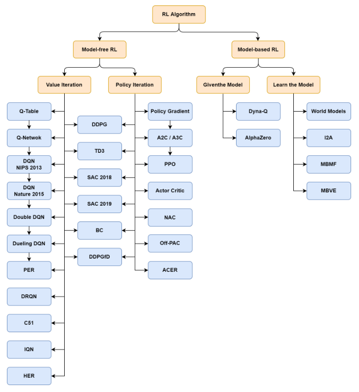
 
(출처) Deep Learning Bible(https://wikidocs.net/169311)

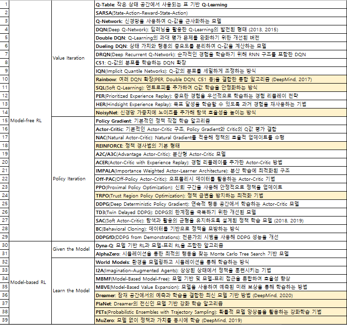
 
**Model-Free Algorithm**
Model-Based와 달리 환경(Environment)을 모르는 상태에서 직접 수행 
에이전트(Agent)가 행동을 통해 보상 합의 기대값을 최대로 하는 Policy Function을 탐색 
환경에 대해 알지 못하고, 다음의 상태와 보상을 수동적으로 행동하여 취득 
환경 파악을 위해서 탐사(Exploration) 
탐사는 시행착오(Trial and Error)를 통해서 Policy Function을 점차적으로 학습 

**Model-Based Algorithm**
환경(Environment)에 대한 모든 설명(Description)을 알고 문제를 푸는 방법 
직접 행동을 하지 않고, 최적의 솔루션을 탐색 
모델은 상태(State)와 행동(Action)을 받아서 다음 상태와 보상을 예측 
모델은 Planning에 사용되며, 경험 전에 가능한 미래 상황을 고려하여 행동을 예측 
모델과 Planning을 사용하여 해결하는 방식 

 

**DavidSilver의 Reinforcement Learning 강의교재** 

	Lecture 1: Introduction to Reinforcement Learning
	Lecture 2: Markov Decision Processes
	Lecture 3: Planning by Dynamic Programming
	Lecture 4: Model-Free Prediction
	Lecture 5: Model-Free Control
	Lecture 6: Value Function Approximation
	Lecture 7: Policy Gradient Methods
	Lecture 8: Integrating Learning and Planning
	Lecture 9: Exploration and Exploitation
	Lecture 10: Case Study: RL in Classic Games

(교안) https://github.com/YangGuiBee/ML/blob/main/TextBook-12/ 
(출처) https://www.davidsilver.uk/teaching/ 

	▣ 항목 설명
	Agent : 행동을 실행하고 관측을 받아서 스칼라 보상 받기
	Environment : 행동을 입력 받아서 관측을 출력하고 스칼라 보상을 출력
	𝑡는 환경 단계가 진행될 때 증가
	히스토리(history) : 관측, 행동, 보상의 시퀀스
	상태(state) : 이후에 발생할 일을 결정하는 데 사용되는 정보
	정책(Policy): 에이전트의 행동 함수
	가치 함수(Value function): 각 상태 또는 행동이 얼마나 좋은지 평가
	모델(Model): 환경에 대한 에이전트의 표현

 	▣ 강화학습(Reinforcement Learning)의 특징 
	감독자(Supervisor)가 없고, 오직 보상 신호만 존재
	피드백이 즉각적이지 않고 지연
	시간이 중요(순차적이며, 비독립적이고 비동일 분포(i.i.d) 데이터)
	에이전트의 행동이 이후에 받는 데이터에 영향

	▣ 강화학습(Reinforcement Learning)의 예제
	헬리콥터로 묘기 비행을 수행하기 : 원하는 경로를 따라가는 경우 긍정적 보상(+), 추락하는 경우 부정적 보상(-)
	Backgammon에서 세계 챔피언을 이기기 : 게임에서 승리하면 긍정적 보상(+), 게임에서 패배하면 부정적 보상(-)
	투자 포트폴리오 관리하기 : 은행 계좌에 돈이 증가하면 긍정적 보상(+)
	발전소 제어하기 : 전력을 생산하면 긍정적 보상(+), 안전 기준을 초과하면 부정적 보상(-)
	인간형 로봇을 걷게 만들기 : 앞으로 이동하면 긍정적 보상(+), 넘어지면 부정적 보상(-)
	다양한 아타리(Atari) 게임을 인간보다 더 잘 플레이하기 : 점수가 증가하면 긍정적 보상(+), 점수가 감소하면 부정적 보상(-)

	▣ 강화학습(Reinforcement Learning)의 보상(reward) 
	$𝑅_𝑡$는 스칼라 형태의 피드백 신호
	이는 에이전트가 𝑡 단계에서 얼마나 잘하고 있는지를 나타냄
	에이전트의 목표는 누적 보상을 최대화하는 것
	보상 가설(Reward Hypothesis) : 모든 목표는 기대 누적 보상의 극대화로 설명
	다만, 보상은 지연될 수 있다
	
---

 

# [1-1] Model-free RL : Value Iteration

	테이블 기반
		(1-1) Q-Learning: 작은 상태 공간에서 사용되는 표(Q-Table) 기반
		(1-2) SARSA(State Action Reward State Action)
	심층 기반
		(1-3) Q-Network: 신경망을 사용하여 Q-값을 근사화하는 모델
		(1-4) DQN(Deep Q-Network): 딥러닝을 활용한 Q-Learning의 발전된 형태 (2013, 2015)
		(1-5) Double DQN: Q-Learning의 과대 평가 문제를 완화하기 위한 개선된 버전
		(1-6) Dueling DQN: 상태 가치와 행동의 중요도를 분리하여 Q-값을 계산하는 모델
		(1-7) DRQN(Deep Recurrent Q-Network): 순차적인 경험을 학습하기 위해 RNN 구조를 포함한 DQN
	분포 기반
		(1-8) C51(Categorical DQN 51): Q-값의 분포를 학습하는 DQN 확장
		(1-9) IQN(Implicit Quantile Networks): Q-값의 분포를 세밀하게 조정하는 방식
		(1-10) Rainbow: 여러 DQN 확장(PER, Double DQN, C51 등)을 결합한 통합 알고리즘 (DeepMind, 2017)
	소프트 기반
		(1-11) SQL(Soft Q-Learning): 엔트로피를 추가하여 Q값 학습을 안정화하는 방식
	리플레이/탐색 기반
		(1-12) PER(Prioritized Experience Replay): 중요한 경험을 우선적으로 학습하는 경험 리플레이 전략
		(1-13) HER(Hindsight Experience Replay): 목표 달성을 학습할 수 있도록 과거 경험을 재사용하는 기법
		(1-14) NoisyNet: 신경망 가중치에 노이즈를 추가해 탐색 효율성을 높이는 방식
		

## (1-1) Q-Learning : 작은 상태 공간에서 사용되는 표(Q-Table) 기반

 (출처) Deep Learning Bible(https://wikidocs.net/169311)

▣ 정의 : 값 기반 강화 학습의 대표적인 알고리즘으로, 상태-행동 쌍에 대한 Q값을 학습해 최적의 정책을 찾는 방법.  
상태에서 어떤 행동을 선택할지 결정하는 Q함수를 학습하며, 최적 정책을 따르기 위해 Q값을 최대화하는 방향으로 행동 
▣ 필요성 : 모델에 대한 사전 지식 없이 환경 내에서 에이전트가 스스로 학습할 수 있는 능력을 제공하며, 상태 공간이 클 때도 적합하게 사용 
▣ 장점 : 모델 프리 방식이라 환경의 동작을 미리 알 필요가 없으며, 수렴할 경우 최적의 정책을 보장 
▣ 단점 : 상태 공간이 매우 크거나 연속적인 경우, Q-table이 메모리와 시간 측면에서 비효율적일 수 있으며, 
학습 속도가 느리고, 보상이 주기적으로만 주어지는 경우 최적의 정책을 찾기 어려울 수 있다. 
▣ 모델식 : Q-learning 업데이트식으로 Q(s,a)는 상태 𝑠에서 행동 𝑎를 선택할 때의 Q값,  
α는 학습률, 𝛾는 할인 계수,𝑟은 현재 보상, max_𝑎′𝑄(𝑠′,𝑎′)는 다음 상태 𝑠′ 에서 가능한 최대 Q값. 

 
▣ 응용분야 : 게임 플레이, 로봇 제어, 자율 주행, 네트워크 트래픽 제어 등 
▣ 예제 : https://www.gymlibrary.dev/tutorials/rl_basics/q_learning/ 
▣ 캐글사례 : https://www.kaggle.com/code/kanncaa1/q-learning-tutorial-with-frozen-lake 
제목: Q-Learning Frozen Lake Tutorial 
특징: Q-테이블 기반 정책 학습, ε-greedy 탐색 사용 
독립변수(X): 상태(state, 0~15) 
종속변수(y): 행동에 대한 Q값(action-value), 최적 행동정책 

 

	import numpy as np
	
	# ======================================
	# 0. 난수 시드 고정 (항상 동일한 결과 보장)
	# ======================================
	np.random.seed(42)
	
	# ======================================
	# 1. 환경 설정 (1차원 선형 월드)
	# ======================================
	n_states = 5     # 상태(State) 개수: 0,1,2,3,4 (4가 목표 상태)
	n_actions = 2    # 행동(Action) 개수: 0=왼쪽, 1=오른쪽
	
	# 상태 전이 및 보상 함수
	def step(state, action):
	    # 행동이 0이면 왼쪽으로 이동, 1이면 오른쪽으로 이동
	    if action == 0:
	        next_state = max(0, state - 1)              # 왼쪽 끝(0) 이하로 내려가지 않게 처리
	    else:
	        next_state = min(n_states - 1, state + 1)   # 오른쪽 끝(4) 이상으로 올라가지 않게 처리
	
	    # 목표 상태(4)에 도달한 경우 보상 +1, 그 외에는 -0.01 패널티
	    if next_state == n_states - 1:
	        reward = 1.0
	        done = True                                 # 목표 도달 → 에피소드 종료
	    else:
	        reward = -0.01                              # 빨리 도달하도록 작은 음수 보상
	        done = False
	
	    return next_state, reward, done                 # 다음 상태, 보상, 종료 여부 반환
		
	# 초기 상태 반환 함수
	def reset():
	    return 0                                        # 항상 state 0에서 에피소드 시작
	
	
	# ======================================
	# 2. Q-Learning 하이퍼파라미터 설정
	# ======================================
	alpha = 0.1         # 학습률 (Learning Rate)
	gamma = 0.9         # 할인율 (Discount Factor)
	epsilon = 1.0       # 초기 탐험 확률 (ε-greedy에서 ε)
	epsilon_min = 0.05  # 탐험 최소값
	epsilon_decay = 0.995  # 에피소드마다 ε 감소율
	
	n_episodes = 500    # 총 학습 반복(에피소드) 횟수
	max_steps = 20      # 한 에피소드에서 최대 step (무한 루프 방지용)
	
	# Q-테이블 초기화: 모든 상태-행동 쌍을 0으로 시작
	Q = np.zeros((n_states, n_actions))
	
	
	# ======================================
	# 3. ε-greedy 행동 선택 함수
	# ======================================
	def choose_action(state, epsilon):
	    # 일정 확률 ε로 탐험(랜덤 행동 선택)
	    if np.random.rand() < epsilon:
	        return np.random.randint(n_actions)
	    # 나머지 확률로 현재 Q값이 가장 큰 행동 선택 (exploitation)
	    return np.argmax(Q[state])
	
	
	# ======================================
	# 4. Q-Learning 학습 루프
	# ======================================
	reward_history = []     # 에피소드별 총 보상을 저장할 리스트
	
	print("=== 1차원 선형 월드에서의 Q-Learning 학습 시작 ===")
	
	# 전체 에피소드 반복
	for episode in range(1, n_episodes + 1):
	
	    state = reset()     # 매 에피소드마다 초기 상태로 리셋
	    total_reward = 0.0  # 에피소드 누적 보상 초기화
	
	    # 한 에피소드 안에서 반복
	    for step_idx in range(max_steps):
	
	        # 1) ε-greedy 정책으로 행동 선택
	        action = choose_action(state, epsilon)
	
	        # 2) 환경에 행동 적용 → 다음 상태, 보상, 종료 여부 반환
	        next_state, reward, done = step(state, action)
	
	        # 3) Q(s,a) 업데이트
	        #    TD Target = r + γ * max(Q(s', a'))
	        best_next_Q = np.max(Q[next_state])                 # 다음 상태에서의 최대 Q
	        td_target = reward + gamma * best_next_Q            # TD Target 계산
	        td_error = td_target - Q[state, action]             # TD Error 계산
	        Q[state, action] += alpha * td_error                # 학습률 α 반영하여 업데이트
	
	        # 4) 보상 누적
	        total_reward += reward
	
	        # 5) 상태 업데이트
	        state = next_state
	
	        # 종료 상태이면 반복 중단
	        if done:
	            break
	
	    # ε 감소 (탐험 → 이용 비중 증가)
	    epsilon = max(epsilon_min, epsilon * epsilon_decay)
	
	    reward_history.append(total_reward)
	
	    # 50에피소드마다 최근 50개 평균 보상 출력
	    if episode % 50 == 0:
	        avg_reward = np.mean(reward_history[-50:])
	        print(f"[Episode {episode:4d}] 최근 50 에피소드 평균 리워드 = {avg_reward:.3f},  epsilon = {epsilon:.3f}")
	
	print("\n=== 학습 종료 ===\n")
	
	
	# ======================================
	# 5. 학습된 Q테이블 출력
	# ======================================
	print("▶ 최종 Q-테이블 (행: 상태, 열: 행동[왼쪽, 오른쪽])")
	for s in range(n_states):
	    print(f"상태 {s}: {Q[s]}")
	
	
	# ======================================
	# 6. 학습된 최적 정책 출력
	# ======================================
	action_symbols = {0: "←", 1: "→"}    # 행동을 화살표로 표시
	
	print("\n▶ 학습된 정책(Policy)")
	
	policy_str = ""
	for s in range(n_states):
	    if s == n_states - 1:            # 마지막 상태는 Goal
	        policy_str += " G "
	    else:
	        best_a = np.argmax(Q[s])     # 각 상태에서 Q값이 가장 큰 행동 선택
	        policy_str += f" {action_symbols[best_a]} "
	
	print("상태 0  1  2  3  4")
	print("     " + policy_str)
	
	
	# ======================================
	# 7. 학습 결과 테스트 실행 (탐험 없이 greedy만)
	# ======================================
	print("\n▶ 학습된 정책으로 1회 에피소드 실행 예시")
	
	state = reset()               # 초기 상태
	trajectory = [state]          # 방문한 상태 기록
	
	for step_idx in range(max_steps):
	    action = np.argmax(Q[state])               # 탐험 없이 항상 최적 행동
	    next_state, reward, done = step(state, action)
	    trajectory.append(next_state)
	    state = next_state
	    if done:
	        break
	
	print("방문한 상태들:", trajectory)
	print("스텝 수:", len(trajectory)-1)
	print("마지막 상태가 목표(4)면 학습 성공!")

 

	=== 1차원 선형 월드에서의 Q-Learning 학습 시작 === 
	[Episode   50] 최근 50 에피소드 평균 리워드 = 0.601,  epsilon = 0.778
	[Episode  100] 최근 50 에피소드 평균 리워드 = 0.860,  epsilon = 0.606
	[Episode  150] 최근 50 에피소드 평균 리워드 = 0.918,  epsilon = 0.471
	[Episode  200] 최근 50 에피소드 평균 리워드 = 0.946,  epsilon = 0.367
	[Episode  250] 최근 50 에피소드 평균 리워드 = 0.953,  epsilon = 0.286
	[Episode  300] 최근 50 에피소드 평균 리워드 = 0.956,  epsilon = 0.222
	[Episode  350] 최근 50 에피소드 평균 리워드 = 0.961,  epsilon = 0.173
	[Episode  400] 최근 50 에피소드 평균 리워드 = 0.965,  epsilon = 0.135
	[Episode  450] 최근 50 에피소드 평균 리워드 = 0.964,  epsilon = 0.105
	[Episode  500] 최근 50 에피소드 평균 리워드 = 0.965,  epsilon = 0.082
	
	=== 학습 종료 ===
	
	▶ 최종 Q-테이블 (행: 상태, 열: 행동[왼쪽, 오른쪽])
	상태 0: [0.62170412 0.7019    ]
	상태 1: [0.62170963 0.791     ]
	상태 2: [0.70189422 0.89      ]
	상태 3: [0.79099209 1.        ]
	상태 4: [0. 0.]
	
	▶ 학습된 정책(Policy)
	상태 0  1  2  3  4
	      →  →  →  →  G 
	
	▶ 학습된 정책으로 1회 에피소드 실행 예시
	방문한 상태들: [0, 1, 2, 3, 4]
	스텝 수: 4
	마지막 상태가 목표(4)면 학습 성공!

 

	에피소드 진행에 따라 평균 리워드가 증가하고 있다 → 학습이 잘 되고 있다
	ε(epsilon)이 감소할수록 탐험이 줄고 최적 행동을 더 많이 선택
	평균 리워드가 0.96 정도로 수렴 → 96% 이상 에피소드에서 목표 도달 성공
	Q-테이블의 상태값 : 왼쪽이동과 오른쪽이동의 보상값비교
	탐험 없이 greedy 방식으로도 완벽히 성공
	Q-Learning이 완전히 성공적으로 수렴

 

## (1-2) SARSA(State-Action-Reward-State-Action)
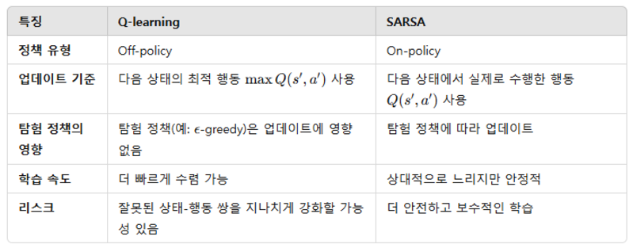
 

| 항목        | Q-Learning        | SARSA           |
| --------- | ----------------- | --------------- |
| 학습 방식     | Off-policy        | On-policy       |
| TD Target | r + γ max Q(s′,·) | r + γ Q(s′, a′) |
| Q값        | 더 큼 (낙관적)         | 더 작음 (보수적)      |
| 수렴 속도     | 빠른 경향             | 조금 느림           |
| 위험 행동     | 과감하게 선택           | 안정적인 경로 선택      |
| 정책        | 동일하게 최적 정책 도달     | 동일              |
| 테스트 결과    | 동일                | 동일              |
| 평균 리워드    | 거의 동일             | 거의 동일           |

▣ 정의 : 상태-행동-보상-다음 상태-다음 행동(State-Action-Reward-State-Action)의 연속적인 관계에서 학습하는 방법. 
Q-learning과 달리 SARSA는 에이전트가 선택한 행동을 기반으로 학습하며 에이전트가 현재 행동과 다음 행동을 통해 학습하는 on-policy 방법 
▣ 필요성 : 정책을 미리 고정한 상태에서 Q-learning처럼 탐험과 학습을 분리하지 않고, 정책을 유지하며 학습할 때 유리. 
실제로 에이전트가 수행하는 행동을 기반으로 학습하므로, 정책에 따른 일관성을 유지. 특히 탐험(exploration) 중에도 안정적으로 학습 
▣ 장점 : 에이전트의 실제 정책을 기반으로 학습하므로 정책의 일관성을 유지할 수 있으며, Q-learning보다 안정적인 성능 
▣ 단점 : Q-learning보다 수렴 속도가 느릴 수 있으며, 잘못된 정책을 사용할 경우 학습 성능이 떨어질 수 있다. 
▣ 모델식 : SARSA 업데이트 식, Q(s,a)는 상태 𝑠에서 행동 𝑎를 선택할 때의 Q값, 𝑎′ 는 다음 상태에서 선택 
.PNG)
 
▣ 응용분야 : 게임, 로봇 제어, 자율 시스템, 물류 최적화 
▣ 예제 : https://www.gymlibrary.dev/tutorials/rl_basics/sarsa/ 
▣ 캐글사례 : https://www.kaggle.com/code/faressayah/sarsa-vs-q-learning 
제목: SARSA와 Q-learning 정책 비교 
특징: 온정책(SARSA) vs 오프정책(Q-learning) 성능 비교 
독립변수(X): 상태 
종속변수(y): SARSA의 Q(s,a) 업데이트 값 

 

	import numpy as np
	
	# 난수 시드 고정 (결과 재현성 보장)
	np.random.seed(42)
	
	# ======================================
	# 1. 환경 설정 (1차원 선형 월드)
	# ======================================
	n_states = 5     # 상태: 0,1,2,3,4 (4가 목표 상태)
	n_actions = 2    # 행동: 0=왼쪽, 1=오른쪽
	
	def step(state, action):
	    # 행동이 0이면 왼쪽으로 이동
	    if action == 0:
	        next_state = max(0, state - 1)              # 왼쪽 끝 이하로 못 가게 처리
	    # 행동이 1이면 오른쪽으로 이동
	    else:
	        next_state = min(n_states - 1, state + 1)   # 오른쪽 끝 이상으로 못 가게 처리
	    
	    # 목표 상태에 도달하면 보상 +1
	    if next_state == n_states - 1:
	        reward = 1.0
	        done = True                                 # 목표 도달 → 종료
	    # 그 외에는 작은 패널티
	    else:
	        reward = -0.01
	        done = False
	
	    return next_state, reward, done
	
	def reset():
	    # 매 에피소드 시작 상태는 항상 0
	    return 0
	
	
	# ======================================
	# 2. SARSA 하이퍼파라미터 설정
	# ======================================
	alpha = 0.1         # 학습률
	gamma = 0.9         # 할인율
	epsilon = 1.0       # 탐험 비율 시작값 (ε-greedy)
	epsilon_min = 0.05  # 최소 탐험값
	epsilon_decay = 0.995  # 탐험 감소 비율
	
	n_episodes = 500    # 학습 에피소드 수
	max_steps = 20      # 한 에피소드에서 최대 스텝 수
	
	# Q 테이블 초기화 (상태 × 행동)
	Q = np.zeros((n_states, n_actions))
	
	
	# ======================================
	# 3. ε-greedy 행동 선택 함수
	# ======================================
	def choose_action(state, epsilon):
	    # ε 확률로 탐험
	    if np.random.rand() < epsilon:
	        return np.random.randint(n_actions)
	    # 1-ε 확률로 현재 Q가 가장 큰 행동 선택
	    return np.argmax(Q[state])
	
	
	# ======================================
	# 4. SARSA 학습 루프
	#    (On-policy: TD Target에 실제 다음 행동 a' 를 사용)
	# ======================================
	reward_history = []
	
	print("=== 1차원 선형 월드에서의 SARSA 학습 시작 ===")
	
	for episode in range(1, n_episodes + 1):
	
	    # (1) 에피소드 시작: 상태 초기화
	    state = reset()
	    total_reward = 0.0
	
	    # (2) 초기 상태에서 첫 행동 선택 (SARSA는 s,a 쌍으로 시작)
	    action = choose_action(state, epsilon)
	
	    for step_idx in range(max_steps):
	        
	        # (3) 현재 상태 s 에서 행동 a 수행
	        next_state, reward, done = step(state, action)
	        
	        # (4) 다음 상태 s' 에서 다음 행동 a' 선택 (ε-greedy)
	        #     SARSA의 핵심: 여기서도 같은 정책(ε-greedy)을 사용
	        if not done:
	            next_action = choose_action(next_state, epsilon)
	        else:
	            next_action = None  # 종료 상태에서는 의미 없음
	        
	        # (5) SARSA TD Target 계산
	        #     - done 이면 다음 상태의 Q는 0
	        #     - 아니면 Q(s', a') 사용
	        if done:
	            td_target = reward                         # 마지막 상태 → 미래 보상 없음
	        else:
	            td_target = reward + gamma * Q[next_state, next_action]
	        
	        # (6) TD Error 및 Q 업데이트
	        td_error = td_target - Q[state, action]
	        Q[state, action] += alpha * td_error
	        
	        # (7) 보상 누적
	        total_reward += reward
	        
	        # (8) 상태와 행동을 다음 시점으로 이동
	        state = next_state
	        action = next_action if not done else action  # done이면 action은 더 안 쓰지만 형식상 유지
	        
	        # (9) 종료 상태면 에피소드 정리
	        if done:
	            break
	
	    # (10) 에피소드 종료 후 ε 감소
	    epsilon = max(epsilon_min, epsilon * epsilon_decay)
	
	    reward_history.append(total_reward)
	
	    # 50 에피소드마다 로그 출력
	    if episode % 50 == 0:
	        avg_reward = np.mean(reward_history[-50:])
	        print(f"[Episode {episode:4d}] 최근 50 에피소드 평균 리워드 = {avg_reward:.3f}, epsilon = {epsilon:.3f}")
	
	print("\n=== 학습 종료 ===\n")
	
	
	# ======================================
	# 5. 학습된 Q-테이블 출력
	# ======================================
	print("▶ 최종 Q-테이블 (행: 상태, 열: 행동[←,→])")
	for s in range(n_states):
	    print(f"상태 {s}: {Q[s]}")
	
	
	# ======================================
	# 6. 학습된 정책 출력
	# ======================================
	action_symbols = {0: "←", 1: "→"}
	
	print("\n▶ 학습된 정책(Policy)")
	
	policy_str = ""
	for s in range(n_states):
	    if s == n_states - 1:
	        policy_str += " G "
	    else:
	        best_a = np.argmax(Q[s])
	        policy_str += f" {action_symbols[best_a]} "
	
	print("상태 0  1  2  3  4")
	print("     " + policy_str)
	
	
	# ======================================
	# 7. 학습된 정책으로 1회 테스트 실행 (탐험 없이 greedy만)
	# ======================================
	print("\n▶ 학습된 정책으로 1회 에피소드 실행 예시")
	
	state = reset()
	trajectory = [state]
	
	for step_idx in range(max_steps):
	
	    # 테스트에서는 탐험 없이 항상 greedy 정책 사용
	    action = np.argmax(Q[state])
	    next_state, reward, done = step(state, action)
	    
	    trajectory.append(next_state)
	    state = next_state
	    
	    if done:
	        break
	
	print("방문한 상태들:", trajectory)
	print("스텝 수:", len(trajectory)-1)
	print("마지막 상태가 목표(4)면 학습 성공!")
	
 

	=== 1차원 선형 월드에서의 SARSA 학습 시작 ===
	[Episode   50] 최근 50 에피소드 평균 리워드 = 0.518, epsilon = 0.778
	[Episode  100] 최근 50 에피소드 평균 리워드 = 0.884, epsilon = 0.606
	[Episode  150] 최근 50 에피소드 평균 리워드 = 0.913, epsilon = 0.471
	[Episode  200] 최근 50 에피소드 평균 리워드 = 0.949, epsilon = 0.367
	[Episode  250] 최근 50 에피소드 평균 리워드 = 0.953, epsilon = 0.286
	[Episode  300] 최근 50 에피소드 평균 리워드 = 0.958, epsilon = 0.222
	[Episode  350] 최근 50 에피소드 평균 리워드 = 0.961, epsilon = 0.173
	[Episode  400] 최근 50 에피소드 평균 리워드 = 0.965, epsilon = 0.135
	[Episode  450] 최근 50 에피소드 평균 리워드 = 0.965, epsilon = 0.105
	[Episode  500] 최근 50 에피소드 평균 리워드 = 0.964, epsilon = 0.082
	
	=== 학습 종료 ===
	
	▶ 최종 Q-테이블 (행: 상태, 열: 행동[←,→])
	상태 0: [0.56804536 0.67414501]
	상태 1: [0.55285797 0.77460095]
	상태 2: [0.61751656 0.88120465]
	상태 3: [0.7167551 1.       ]
	상태 4: [0. 0.]
	
	▶ 학습된 정책(Policy)
	상태 0  1  2  3  4
	      →  →  →  →  G 
	
	▶ 학습된 정책으로 1회 에피소드 실행 예시
	방문한 상태들: [0, 1, 2, 3, 4]
	스텝 수: 4
	마지막 상태가 목표(4)면 학습 성공!

 

## (1-3) Q-Network : 신경망을 사용하여 Q-값을 근사화하는 모델
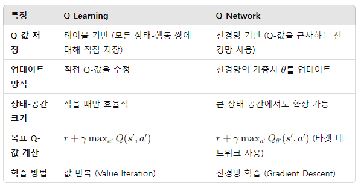
 
▣ 정의 : 𝑄(𝑠,𝑎) 테이블을 신경망으로 대체하여 행동-가치 함수를 근사함으로써 큰 상태-행동 공간에서도 학습이 가능 
▣ 필요성 : 전통적인 Q-learning은 상태-행동 쌍에 대한 Q-값을 테이블 형태로 저장하지만, 상태 공간이 커지면 이러한 접근은 비효율적 
Q-Network는 신경망을 통해 복잡한 상태 공간에서도 효율적으로 Q-값을 추정 
▣ 장점 : 큰 상태 공간이나 연속적인 상태 공간에 확장 가능하며, 상태와 행동 간의 복잡한 관계를 학습 
▣ 단점 : 높은 계산 자원이 필요하며, 학습이 불안정하거나 발산할 수 있음 

 
▣ 응용분야 : 고차원 제어 작업, 자율 주행 차량 
▣ 예제 : https://pytorch.org/tutorials/intermediate/reinforcement_q_learning.html 
▣ 캐글사례 : https://www.kaggle.com/code/sanikamal/deep-q-learning-with-keras 
제목: 카트폴(CartPole) 환경에서 신경망 기반 Q-Network 구현 
특징: NN으로 Q함수 근사, Q-Table 제거 
독립변수(X): 상태(카트 위치, 속도, 막대 각도 등 4개 변수) 
종속변수(y): 행동의 Q값(왼쪽/오른쪽) 

 

## (1-4) DQN(Deep Q-Network) : 딥러닝을 활용한 Q-Learning의 발전된 형태 (2013, 2015)
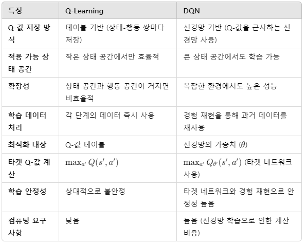
 
▣ 정의 : Q-learning을 딥러닝에 결합한 알고리즘. Q-table 대신 심층 신경망을 사용해 Q값을 근사하며 주로 상태 공간이 매우 크거나 연속적인 문제에서 사용 
▣ 필요성 : Q-table을 사용할 수 없는 고차원 환경에서 Q-learning을 효과적으로 적용하기 위해 신경망을 사용하여 Q값을 근사 
▣ 장점 : 고차원 연속 상태 공간에서 사용 가능하며, 경험 재플레이(experience replay)와 타깃 네트워크로 학습 안정성을 높일 수 있음 
▣ 단점 : 신경망 학습으로 인해 높은 계산 비용이 필요하며, 과적합 위험이 있으며, 잘못 설정된 하이퍼파라미터로 인해 학습이 불안정 
▣ 모델식 : DQN에서 신경망을 사용한 Q-learning 업데이트 θ는 현재 신경망의 가중치,𝜃′ 는 타깃 신경망의 가중치 

 
▣ 응용분야 : 비디오 게임(예: Atari 게임), 로봇 제어, 자율 주행 등 
▣ 예제 : https://pytorch.org/tutorials/intermediate/reinforcement_q_learning.html 
https://stable-baselines3.readthedocs.io/en/master/modules/dqn.html 
▣ 캐글사례 : https://www.kaggle.com/code/sanikamal/cartpole-with-deep-q-learning 
제목: DQN을 이용한 카트폴 균형잡기 
특징: 타겟 네트워크 + 경험 리플레이 
독립변수(X): 상태(4개 연속값) 
종속변수(y): 각 행동의 Q(s,a) 

 

	import numpy as np
	import tensorflow as tf
	from collections import deque
	
	# 상태 및 행동 정의
	n_states = 5  # 상태 공간 크기
	n_actions = 2  # 행동 공간 크기
	
	# 신경망 모델 정의
	model = tf.keras.models.Sequential([
	    tf.keras.layers.Dense(16, input_dim=n_states, activation='relu'),
	    tf.keras.layers.Dense(16, activation='relu'),
	    tf.keras.layers.Dense(n_actions, activation='linear')
	])
	model.compile(optimizer='adam', loss='mse')
	
	# Q-learning 파라미터 설정
	gamma = 0.95  # 할인율
	epsilon = 0.5  # 초기 탐험 확률
	epsilon_min = 0.01  # 최소 탐험 확률
	epsilon_decay = 0.995  # 탐험 확률 감소율
	batch_size = 32  # 배치 크기
	memory = deque(maxlen=2000)  # 경험 재플레이 버퍼
	
	# 행동 선택 함수 (ε-greedy)
	def choose_action(state):
	    global epsilon
	    if np.random.rand() <= epsilon:  # 탐험
	        return np.random.choice(n_actions)
	    state = np.reshape(state, [1, n_states])  # 상태를 신경망 입력 크기로 변환
	    return np.argmax(model.predict(state, verbose=0))  # Q-값이 최대인 행동 선택
	
	# 경험 재플레이 함수 (배치 학습)
	def replay():
	    global epsilon
	    if len(memory) < batch_size:
	        return  # 메모리가 충분하지 않으면 학습하지 않음
	    
	    # 배치 샘플링
	    minibatch = np.random.choice(len(memory), batch_size, replace=False)
	    states, actions, rewards, next_states, dones = [], [], [], [], []
	    for i in minibatch:
	        state, action, reward, next_state, done = memory[i]
	        states.append(state)
	        actions.append(action)
	        rewards.append(reward)
	        next_states.append(next_state)
	        dones.append(done)
	    
	    # 배열 변환
	    states = np.array(states, dtype=np.float32)
	    next_states = np.array(next_states, dtype=np.float32)
	    rewards = np.array(rewards, dtype=np.float32)
	    dones = np.array(dones, dtype=np.float32)
	    
	    # Q-값 업데이트
	    target_q_values = model.predict(next_states, verbose=0)
	    max_target_q_values = np.amax(target_q_values, axis=1)
	    targets = model.predict(states, verbose=0)
	    
	    for i in range(batch_size):
	        targets[i, actions[i]] = rewards[i] + (1 - dones[i]) * gamma * max_target_q_values[i]
	    
	    # 배치 학습
	    model.fit(states, targets, epochs=1, verbose=0)
	    
	    # 탐험 확률 감소
	    if epsilon > epsilon_min:
	        epsilon *= epsilon_decay
	
	# 학습 반복 (에피소드 수 감소)
	for episode in range(100):  # 에피소드 수 감소
	    state = np.random.rand(n_states)  # 초기 상태를 임의로 설정
	    done = False
	    total_reward = 0
	    step_count = 0
	    while not done:
	        action = choose_action(state)  # 행동 선택
	        next_state = np.random.rand(n_states)  # 다음 상태 임의 생성
	        reward = 1 if np.random.rand() > 0.5 else 0  # 보상 설정
	        done = True if reward == 1 else False  # 보상이 1이면 종료
	        memory.append((state, action, reward, next_state, done))  # 경험 저장
	        state = next_state  # 상태 업데이트
	        total_reward += reward
	        step_count += 1
	        replay()  # 경험 재플레이로 학습
	    
	    # 에피소드 결과 출력
	    print(f"Episode {episode + 1}: Total Reward = {total_reward}, Steps = {step_count}, Epsilon = {epsilon:.4f}")
	
	print("학습 완료")
	
	# 최종 Q-값 확인 (랜덤 샘플)
	test_state = np.random.rand(n_states)
	test_q_values = model.predict(test_state[np.newaxis], verbose=0)
	print(f"Test State: {test_state}")
	print(f"Predicted Q-Values: {test_q_values}")

 

	(결과)
	Episode 1: Total Reward = 1, Steps = 1, Epsilon = 0.5000
  	...
	Episode 100: Total Reward = 1, Steps = 1, Epsilon = 0.2080
	학습 완료
	Test State: [0.25960352 0.06952445 0.82368307 0.0228719  0.90104538]
	Predicted Q-Values: [[1.0298501 0.8123386]]

 

## (1-5) Double DQN : Q-Learning의 과대 평가 문제를 완화하기 위한 개선된 버전
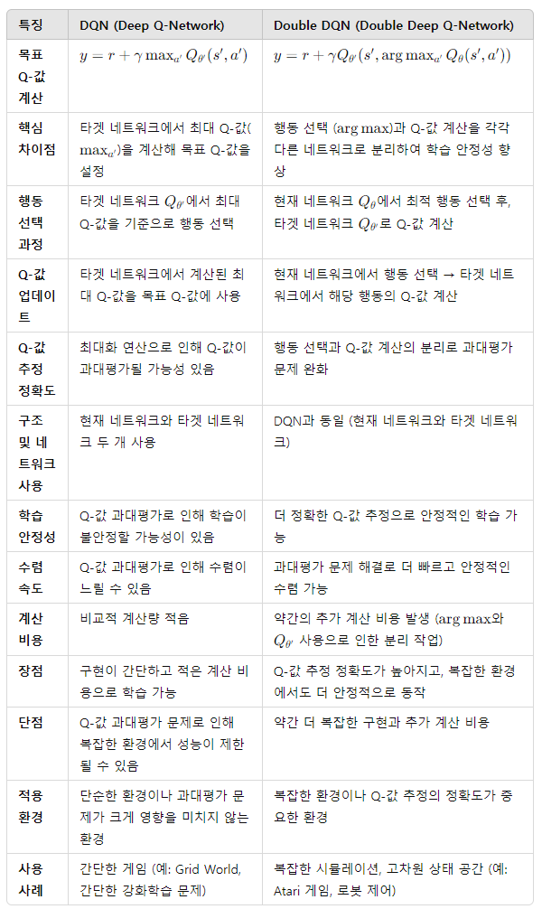
 
▣ 정의 : 행동 선택과 행동 평가를 분리하여 DQN의 과대 추정 편향 문제를 해결(행동 선택과 Q-값 계산을 분리하여 Q-값의 과대평가 문제를 완화) 
▣ 장점 : 과대 추정을 줄이고, 정책의 안정성을 향상 
▣ 단점 : 계산 부담이 증가하고, 하이퍼파라미터 튜닝이 필요 

 
▣ 응용분야 : 복잡한 의사결정 작업 
▣ 예제 : https://stable-baselines3.readthedocs.io/en/master/guide/algos.html#double-dqn 
▣ 캐글사례 : https://www.kaggle.com/code/marcelotissot/double-dqn-cartpole 
제목: 카트폴 문제의 Double DQN 
특징: online/target 네트워크 동시 활용 
독립변수(X): 4차원 상태 
종속변수(y): Q(s,a) 

 

## (1-6) Dueling DQN : 상태 가치와 행동의 중요도를 분리하여 Q-값을 계산하는 모델
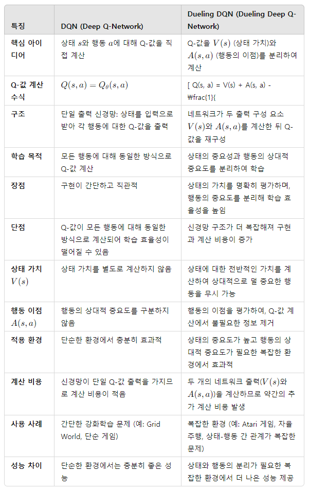
 
▣ 정의 : 𝑄 값을 상태-가치 𝑉(𝑠)와 이점 𝐴(𝑠,𝑎)로 분리하여 학습 
▣ 장점 : 학습 효율성을 향상시키고 의사결정에 중요한 상태에 집중 
▣ 단점 : 네트워크 복잡도가 증가하며 모든 환경에서 이점이 있는 것은 아님 
.PNG)
 
▣ 응용분야 : 희소 보상 환경 
▣ 예제 : https://stable-baselines3.readthedocs.io/en/master/modules/dqn.html#dueling-network-architecture 
▣ 캐글사례 : https://www.kaggle.com/code/vikramtiwari/dueling-dqn-cartpole 
제목: 카트폴에서의 Dueling DQN 
특징: 가치함수와 이점함수 분리 
독립변수(X): 상태 4개 
종속변수(y): Q값 

 
 
## (1-7) DRQN(Deep Recurrent Q-Network) : 순차적인 경험을 학습하기 위해 RNN 구조를 포함한 DQN
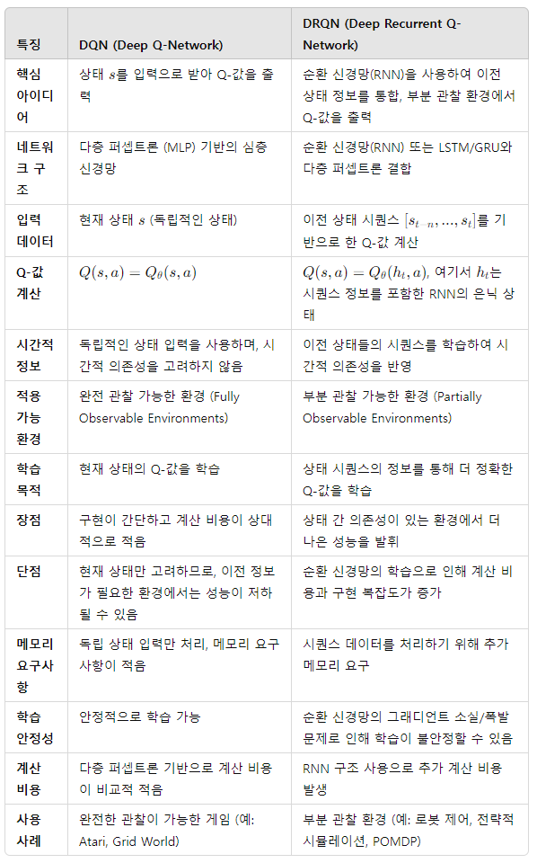
 
▣ 정의 : DQN에 순환 신경망(RNN)을 추가하여 부분 관찰 가능 환경에서 학습 
▣ 장점 : 순차적 데이터 또는 부분 관찰 데이터를 처리할 수 있으며, 비마르코프 설정에서도 정책을 개선 
▣ 단점 : 학습 시간이 증가하고 학습이 더 어려워질 수 있음 
.PNG)
 
▣ 응용분야 : 주식 거래, 텍스트 기반 게임 
▣ 예제 : https://github.com/Kaixhin/Atari-DRQN 
▣ 캐글사례 : https://www.kaggle.com/code/srhabib/drqn-cartpole 
제목: CartPole에서 DRQN 구현 
특징: RNN 기반 시간의존성 처리 
독립변수(X): 상태 시계열 
종속변수(y): Q(s,a) 

 

## (1-8) C51(Categorical DQN 51) : Q-값의 분포를 학습하는 DQN 확장
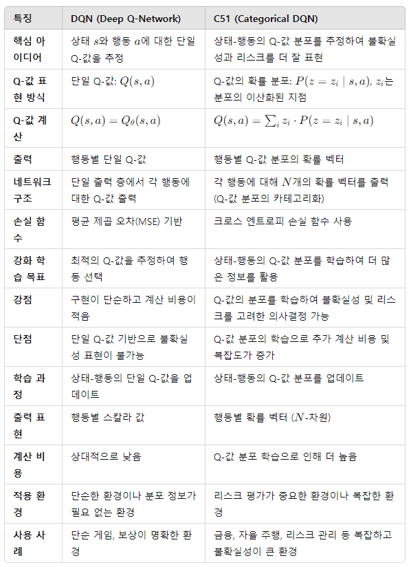
 
▣ 정의 : 단일 기대값 대신 보상의 범주형 분포를 추정하는 알고리즘으로, Q-값의 예측을 단일 값이 아닌 확률 분포로 모델링하며 상태-행동 값(Q-값)에 대한 불확실성을 학습하도록 설계되었으며, 분포적 강화학습(Distributional Reinforcement Learning)의 초기 모델 중 하나. 상태-행동 값의 분포를 51개의 균일하게 나뉜 원자(atomic support)를 사용하여 근사 
▣ 장점 : 보상의 불확실성을 모델링할 수 있으며, 더 풍부한 표현을 제공 
▣ 단점 : 분포를 관리해야 하므로 복잡도가 증가하며 계산 비용이 큼 
.PNG)
 
▣ 응용분야 : 위험 민감 의사결정 
▣ 예제 : https://github.com/google/dopamine/blob/master/dopamine/agents/c51/c51_agent.py 
▣ 캐글사례 : https://www.kaggle.com/code/itsmesunil/c51-categorical-dqn 
제목: C51 분포적 DQN 구현 
특징: Q값을 51개 원자(distribution)로 모델링 
독립변수(X): 상태 
종속변수(y): 확률 분포 형태의 Q값 

 

## (1-9) IQN(Implicit Quantile Networks) : Q-값의 분포를 세밀하게 조정하는 방식
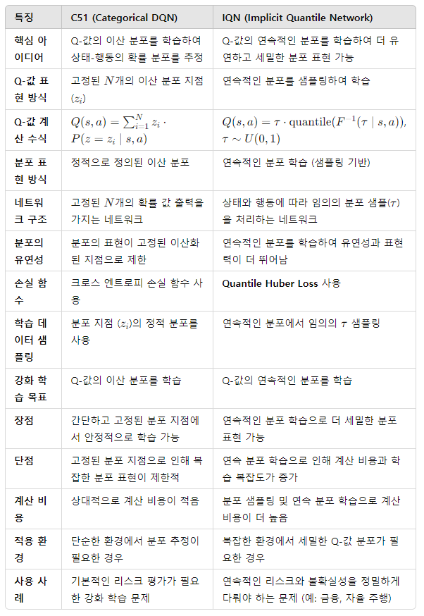
 
▣ 정의 : 분포적 강화학습(Distributional Reinforcement Learning)의 한 기법으로, 상태-행동 값𝑄(𝑠,𝑎)의 분포를 명시적 분포 모델링 대신, 암묵적으로 보상 분포의 분위수(quantile 함수)를 예측하여 학습하는 방식을 채택함으로써 이를 통해 분포적 학습의 유연성과 계산 효율성을 모두 확보 
▣ 장점 : 쿼타일 함수로 Q-값의 분포를 학습하므로, C51처럼 고정된 원자 기반의 분포 모델링보다 유연 
▣ 단점 : 많은 계산 자원이 필요함에 따라 학습이 복잡 
.PNG)
 
▣ 응용분야 : 위험 인지 AI, 전략적 계획 
▣ 예제 : https://github.com/google/dopamine/tree/master/dopamine/agents/implicit_quantile 
▣ 캐글사례 : https://www.kaggle.com/code/simranjitsingh/implicit-quantile-networks 
제목: Atari 게임용 IQN 
특징: Quantile regression 기반 분포적 Q함수 
독립변수(X): 시각 프레임 
종속변수(y): 각 quantile별 Q값 분포 

 

## (1-10) Rainbow : 여러 DQN 확장(PER, Double DQN, C51 등)을 결합한 통합 알고리즘 (DeepMind, 2017)
▣ 정의 : DQN, Double DQN, PER, Dueling DQN, C51 등을 결합한 포괄적인 RL 알고리즘 
▣ 장점 : 최신 기술을 종합한 최고의 성능이 가능하고, 기존 알고리즘들의 장점을 모두 활용 
▣ 단점 : 구현이 복잡함에 따라 계산 비용이 높다 
▣ 응용분야 : 범용 강화 학습 작업 
▣ 예제 : https://github.com/google/dopamine/tree/master/dopamine/agents/rainbow 
▣ 캐글사례 : https://www.kaggle.com/code/simranjitsingh/rainbow-dqn-atari 
제목: Rainbow DQN 전체 구현 
특징: Double+Dueling+PER+NoisyNet+N-step+C51 결합 
독립변수(X): 이미지 프레임 
종속변수(y): 통합 Q값 

 

## (1-11) SQL(Soft Q-Learning): 엔트로피를 추가하여 Q값 학습을 안정화하는 방식
▣ 정의 : SQL은 정책의 엔트로피 정규화(Objective Regularization)를 통해 강화학습의 안정성을 높이고, 탐색(exploration)의 유연성을 제공하는 알고리즘으로 SAC(Soft Actor-Critic)와 같은 현대적 강화학습 알고리즘의 기초를 제공 
▣ 장점 : 최적의 보상 뿐만 아니라 최적의 정책 다양성을 고려하여 학습함으로써 다양한 행동 선택을 장려하고 조기 수렴을 방지 
▣ 단점 : 결정론적 정책에는 비효율적 
_1.PNG)
 
▣ 응용분야 : 로봇 공학, 탐색이 중요한 작업 
▣ 예제 : https://github.com/haarnoja/softqlearning 
▣ 캐글사례 : https://www.kaggle.com/code/khojandn/sac-soft-actor-critic 
제목: Soft-Q 기반 Soft Actor-Critic 
특징: 엔트로피 정규화로 안정적 학습 
독립변수(X): 상태(연속) 
종속변수(y): Soft-Q 값 

 

## (1-12) PER(Prioritized Experience Replay) : 중요한 경험을 우선적으로 학습하는 경험 리플레이 전략
▣ 정의 : 샘플링 효율성을 높이고 학습 속도를 개선하기 위한 목적에서 경험 재생(experience replay) 기법을 개선하여 중요한 경험에 더 높은 확률을 부여하여 재생 빈도를 조정하는 기법으로 에이전트가 환경과 상호작용하며 수집한 경험들을 재사용하여 학습 효율을 높이는 과정에서, 중요한 경험(transition)에 우선순위 큐나 Sum-tree와 같은 자료 구조를 사용하여 우선순위를 부여해 더 자주 샘플링하도록 하는 방법 
▣ 장점 : 더 빠른 수렴하고 학습 효율성 향상 
▣ 단점 : 추가 계산 비용이 필요 
_1.png)
 
▣ 응용분야 : 게임, 로봇 공학 
▣ 예제 : https://github.com/rlcode/per 
▣ 캐글사례 : https://www.kaggle.com/code/itsmesunil/per-dqn 
제목: 우선순위 경험 리플레이 기반 DQN 
특징: TD오차 기반 샘플 우선순위 
독립변수(X): 상태 
종속변수(y): Q(s,a) 

 

## (1-13) HER(Hindsight Experience Replay) : 목표 달성을 학습할 수 있도록 과거 경험을 재사용하는 기법
▣ 정의 : 경험 재생(Experience Replay) 기법을 개선하여 목표 지향(goal-oriented) 환경에서 학습 효율성을 극대화하는 방법으로 실패한 경험을 재해석하여 학습 데이터로 활용함으로써 목표 달성이 어려운 환경에서도 효과적으로 학습 
▣ 장점 : 희소 보상 환경에서 샘플 효율성을 크게 향상시키고 목표 중심 환경에서 성능이 우수하며 기존 경험을 효과적으로 활용 
▣ 단점 : 목표가 명확히 정의된 환경에서만 사용할 수 있으며, 구현이 복잡 
_1.PNG)
 
▣ 응용분야 : 로봇 공학(물체 조작 및 경로 계획) 등 목표 지향적 학습 환경 
▣ 예제 : https://stable-baselines3.readthedocs.io/en/master/modules/her.html 
▣ 캐글사례 : https://www.kaggle.com/code/farid07/her-ddpg 
제목: FetchReach 로봇팔 문제에서 HER 적용 
특징: 실패한 경험을 “목표가 달성된 경험”으로 리레이블 
독립변수(X): (상태, 목표) 
종속변수(y): Q값 또는 policy gradient 

 

## (1-14) NoisyNet : 신경망 가중치에 노이즈를 추가해 탐색 효율성을 높이는 방식
▣ 정의 : 신경망 가중치에 학습 가능한 노이즈를 추가하여 탐색(exploration)을 자동화하는 알고리즘. 기존의 𝜖-탐욕적 정책 대신 학습 과정에서 노이즈를 조절하여 더 나은 탐색과 학습 균형을 제공 
▣ 장점 : 탐색-활용(trade-off) 문제를 자동으로 해결. 𝜖-탐욕적 정책에 대한 추가 튜닝이 필요하지 않으며, 학습 과정에서 더 효과적인 탐색 
▣ 단점 : 추가 학습 가능한 노이즈 매개변수를 관리해야 하므로 학습 시간이 증가하며, 환경에 따라 노이즈 설정이 비효율적 
_1.PNG)
 
▣ 응용분야 : 연속적인 행동 공간을 가진 환경, 다양한 보상을 가진 게임 환경 
▣ 예제 : https://github.com/deepmind/noisynet 
▣ 캐글사례 : https://www.kaggle.com/code/itsmesunil/noisy-network-dqn 
제목: 가중치 노이즈 기반 탐색(탐험 강화) 
특징: 매 학습 단계에서 가중치를 확률적으로 샘플링 
독립변수(X): 상태 
종속변수(y): Q값 

 

---

 

# [2] Model-free RL : Policy Iteration

	기본 Policy Gradient 및 Actor-Critic 계열
	(2-1) Policy Gradient: 기본적인 정책 직접 학습 알고리즘
	(2-2) Actor-Critic: 기본적인 Actor-Critic 구조, Policy Gradient와 Critic의 Q값 평가 결합
	(2-3) NAC(Natural Actor-Critic): Natural Gradient를 적용해 정책의 효율적 업데이트를 수행
	(2-4) REINFORCE: 정책 경사법의 기본 형태

	Advantage Actor-Critic 및 분산 학습 계열
 	(2-5) A2C/A3C(Advantage Actor-Critic): 분산형 Actor-Critic 모델
	(2-6) ACER(Actor-Critic with Experience Replay): 경험 리플레이를 추가한 Actor-Critic 방법
	(2-7) IMPALA(Importance Weighted Actor-Learner Architecture): 분산 학습에 최적화된 구조
	(2-8) Off-PAC(Off-Policy Actor-Critic): 오프폴리시 데이터를 활용하는 Actor-Critic 기법

	신뢰 구간 기반 정책 최적화 계열
	(2-9) PPO(Proximal Policy Optimization): 신뢰 구간을 사용해 안정적으로 정책을 업데이트
	(2-10) TRPO(Trust Region Policy Optimization): 정책 급변을 방지하는 최적화 기법

	연속 행동 공간 최적화 계열 
	(2-11) DDPG(Deep Deterministic Policy Gradient): 연속적 행동 공간에서 학습하는 Actor-Critic 모델
	(2-12) TD3(Twin Delayed DDPG): DDPG의 한계점을 극복하기 위한 개선된 모델
	(2-13) SAC(Soft Actor-Critic): 탐색과 활용의 균형을 유지하도록 설계된 정책 학습 모델 (2018, 2019)
 
	전문가 시범 데이터 활용 계열 
	(2-14) BC(Behavioral Cloning): 데이터를 기반으로 정책을 모방하는 방식
	(2-15) DDPGfD(DDPG from Demonstrations): 전문가의 시범을 사용해 DDPG 성능을 개선

## (2-1) Policy Gradient : 기본적인 정책 직접 학습 알고리즘
▣ 정의 : 정책(Policy) 자체를 직접 학습하는 강화 학습 알고리즘으로, 행동-가치 함수 𝑄(𝑠,𝑎)를 통해 정책의 성능을 측정하고 정책을 업데이트. 목표는 파라미터화된 정책 𝜋𝜃(𝑎∣𝑠)를 최대화하는 것 
▣ 장점 : 연속적인 행동 공간을 처리할 수 있으며, 확률적 정책을 통해 다양한 행동 선택 가능하고, 탐색 문제를 효과적으로 해결 
▣ 단점 : 수렴 속도가 느리고, 높은 분산(Variance)으로 인해 불안정할 수 있으며, 충분한 샘플 데이터가 필요 
▣ 적용 분야 : 로봇 제어, 연속적인 제어 문제, 자율 주행 
▣ 예제 :  
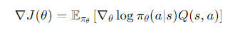

 

## (2-2) Actor-Critic: 기본적인 Actor-Critic 구조, Policy Gradient와 Critic의 Q값 평가 결합
▣ 정의 : 정책(Actor)과 가치 함수(Critic)를 동시에 학습하는 구조로, Actor는 정책을 학습하고 Critic은 가치 함수로 피드백을 제공 
▣ 장점 : 빠른 학습 속도, 연속적 행동 공간에서 효과적 
▣ 단점 : Actor와 Critic 간 균형 조정이 어렵고, 불안정한 학습 가능성 
▣ 적용 분야 : 로봇 제어, 고차원 학습 환경 
▣ 예제 :  

 

## (2-3) NAC(Natural Actor-Critic) : Natural Gradient를 적용해 정책의 효율적 업데이트를 수행
▣ 정의 : 기존 그라디언트보다 빠르게 수렴하며 정책 변화의 효과를 극대화하는 자연 그라디언트(Natural Gradient)를 사용하여 정책 업데이트를 안정화함 
▣ 장점 : 더 빠른 수렴, 정책 안정성 보장 
▣ 단점 : 계산 비용 증가, 구현 복잡도 
▣ 적용 분야 : 복잡한 연속 제어 문제 
▣ 예제 :  

 

## (2-4) REINFORCE : 정책 경사법의 기본 형태
▣ 정의 : Policy Gradient의 기본 형태로, 매번 에피소드가 끝난 후 정책의 파라미터를 업데이트. 에피소드별로 누적 보상을 기반으로 정책을 학습. 여기서 𝐺𝑡는 시간 𝑡에서의 누적 보상 
▣ 장점 : 단순하고 구현이 용이, 정책 학습의 직관적 접근 방식을 제공 
▣ 단점 : 높은 분산(Variance)으로 인해 학습이 불안정, 샘플 효율성이 낮다 
▣ 적용 분야 : 간단한 제어 환경, 정책 탐색 문제 
▣ 예제 :  

 

## (2-5) A2C/A3C(Advantage Actor-Critic): 분산형 Actor-Critic 모델
▣ 정의 : Actor-Critic 구조 기반으로, Actor는 정책을 업데이트하고 Critic은  𝑄-값 또는 𝑉-값을 평가. A3C는 비동기적(Asynchronous)으로 여러 에이전트가 동시에 학습하며, A2C는 동기적(Synchronous)으로 학습 
▣ 장점 : 학습 속도 향상(A3C), 정책과 가치 함수 학습을 분리하여 안정성 제공하고 멀티 쓰레드로 효율적인 샘플 수집 가능 
▣ 단점 : 비동기 학습으로 인해 복잡도가 증가(A3C), A2C는 샘플 효율성이 낮음 
▣ 적용 분야 : 멀티 에이전트 환경, 연속적인 제어 문제 
▣ 예제 :  
_1.PNG)

 

## (2-6) ACER(Actor-Critic with Experience Replay): 경험 리플레이를 추가한 Actor-Critic 방법
▣ 정의 : Actor-Critic에 경험 재생(Experience Replay)을 추가하여 샘플 효율성을 높인 알고리즘. PPO의 클리핑 방식과 유사하게 정책 업데이트를 안정화하는 기법도 포함 
▣ 장점 : 샘플 효율성 향상, Actor-Critic 구조의 안정성과 효율성을 제공 
▣ 단점 : 구현이 복잡, 추가적인 메모리와 계산 비용이 요구 
▣ 적용 분야 : 복잡한 연속 제어 환경, 로봇 공학 
▣ 예제 :  

 

## (2-7) IMPALA(Importance Weighted Actor-Learner Architecture): 분산 학습에 최적화된 구조
▣ 정의 : 분산 학습 환경에서 효과적인 Actor-Critic 알고리즘으로, 여러 Actor가 데이터를 수집하고 Learner가 이 데이터를 학습. 중요도 가중치(Importance Weighting)를 사용해 Actor와 Learner 간의 시간차를 보상 
▣ 장점 : 분산 환경에서 효율적, 데이터 수집과 학습 병렬화 가능, 샘플 효율성 우수 
▣ 단점 : 높은 계산 비용, 복잡한 구현 
▣ 적용 분야 : 대규모 학습 환경, 분산 강화 학습 
▣ 예제 :  

 

## (2-8) Off-PAC(Off-Policy Actor-Critic): 오프폴리시 데이터를 활용하는 Actor-Critic 기법
▣ 정의 : Off-Policy 데이터(정책 외부의 데이터)를 활용하여 Actor-Critic 학습을 수행하는 알고리즘. 행동 정책(Behavior Policy)과 학습 정책(Target Policy)을 분리하여 샘플 효율성을 개선 
▣ 장점 : 샘플 효율성이 높고 다양한 데이터 소스를 활용 가능 
▣ 단점 : 중요도 샘플링에 의존하여 학습이 불안정, 구현이 복잡 
▣ 적용 분야 : 대규모 데이터 기반 학습, 샘플 수집 비용이 높은 환경 
▣ 예제 :  

 

## (2-9) PPO(Proximal Policy Optimization): 신뢰 구간을 사용해 안정적으로 정책을 업데이트
▣ 정의 : Policy Gradient를 안정적으로 학습하기 위해 손실 함수에 클리핑을 도입한 알고리즘. 기존 정책과 새로운 정책 간의 차이를 제한하여 학습 안정성을 확보 
▣ 장점 : 구현이 간단하고 안정적이며, Hyperparameter에 덜 민감하고 높은 성능 
▣ 단점 : 일부 환경에서 클리핑이 비효율적, 계산 비용이 높다 
▣ 적용 분야 : 게임 AI, 로봇 공학, 자율적 제어 시스템 
▣ 예제 :  

 

## (2-10) TRPO(Trust Region Policy Optimization): 정책 급변을 방지하는 최적화 기법
▣ 정의 : 정책 업데이트 시 큰 변화를 방지하기 위해 신뢰 영역(Trust Region)을 유지하며 학습. Kullback-Leibler (KL) 발산을 사용하여 정책 간 차이를 제한 
▣ 장점 : 안정적인 정책 업데이트, 수렴이 빠르고 신뢰성이 높음
▣ 단점 : 계산 비용이 매우 높고, 구현이 복잡 
▣ 적용 분야 : 연속적인 제어 문제, 복잡한 로봇 학습 
▣ 예제 :  

 

## (2-11) DDPG(Deep Deterministic Policy Gradient) : 연속적 행동 공간에서 학습하는 Actor-Critic 모델
▣ 정의: Actor-Critic 기반으로, 연속적인 행동 공간에서 작동하도록 설계된 모델. Actor는 행동을 생성하고, Critic은 행동의 𝑄-값을 평가 
▣ 장점 : 연속적인 행동 공간에서 효율적, 고차원 작업에 적합 
▣ 단점 : 샘플 효율성이 낮고 탐색 문제에 취약 
▣ 적용 분야 : 로봇 학습, 자율 시스템 제어 
▣ 예제 :  

 

## (2-12) TD3(Twin Delayed DDPG) : DDPG의 한계점을 극복하기 위한 개선된 모델
▣ 정의 : DDPG의 개선된 버전으로, 행동 가치 평가의 과대 추정을 방지하기 위해 두 개의 Critic 네트워크를 사용하고 행동 업데이트를 지연시켜 안정성을 강화 
▣ 장점 : 과대 추정을 줄이고, 안정적인 학습 성능 
▣ 단점 : 구현이 복잡, 추가 계산 비용 
▣ 적용 분야 : 연속 제어 문제, 로봇 공학 
▣ 예제 :  

 

## (2-13) SAC(Soft Actor-Critic): 탐색과 활용의 균형을 유지하도록 설계된 정책 학습 모델 (2018, 2019)
▣ 정의 : 정책 엔트로피를 최대화하여 탐색 성능을 높이고 안정성을 강화한 Actor-Critic 알고리즘 
▣ 장점 : 안정적이고 강력한 성능, 샘플 효율성 우수 
▣ 단점 : 계산 비용이 높고 복잡한 튜닝 필요 
▣ 적용 분야 : 로봇 동작 학습, 복잡한 환경 학습 
▣ 예제 :  

 

## (2-14) BCBC(Behavioral Cloning) : 데이터를 기반으로 정책을 모방하는 방식
▣ 정의 : 주어진 행동 데이터를 사용해 정책을 모방 학습(Imitation Learning)하며 지도 학습 접근법으로 주로 사용 
▣ 장점 : 간단하고 구현이 용이하고 지도 학습 알고리즘을 활용 가능 
▣ 단점 : 일반화가 어렵고 충분한 데이터가 없으면 성능이 저하 
▣ 적용 분야 : 자율 주행 학습, 인간 행동 모방 
▣ 예제 :  

 

## (2-15) DDPGfD(DDPG from Demonstrations) : 전문가의 시범을 사용해 DDPG 성능을 개선
▣ 정의 : DDPG(Deep Deterministic Policy Gradient)에 전문가 시연 데이터를 추가로 활용하여 초기 학습을 강화하는 알고리즘. 시연 데이터를 우선적으로 활용하여 학습 효율성을 높이는 경험 재생(Experience Replay) 기법을 포함 
▣ 장점 : 학습 초기 성능이 향상, 샘플 효율성을 개선, 희소 보상 환경에서도 학습이 용이 
▣ 단점 : 전문가 시연 데이터가 필수적, 추가 메모리 및 계산 비용이 필요 
▣ 적용 분야 : 로봇 공학(시연 데이터를 활용한 로봇 작업), 자율 주행 및 복잡한 제어 작업 
▣ 예제 :  

 

---

 

# [3] Model-based RL : Given the Model

	(3-1) Dyna-Q: 모델 기반 RL과 모델-프리 RL을 조합한 알고리즘
	(3-2) AlphaZero: 시뮬레이션을 통한 최적의 행동을 찾는 Monte Carlo Tree Search 기반 모델

아래 비교표에서 맨우측의 MuZero는 Given the Model 방식이 아니라, Learn the Model 방식으로 구분이 필요하여, (3-3)에서 (4-8)로 이동필요 
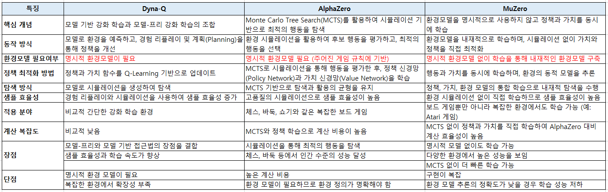
 

## (3-1) Dyna-Q : 모델 기반 RL과 모델-프리 RL을 조합한 알고리즘
▣ 정의 : 강화학습에서 모델기반 접근법과 모델프리 접근법을 결합한 알고리즘. 환경모델을 학습하고 이 모델을 활용해 샘플데이터를 생성한 뒤 Q-Learning과 같은 알고리즘을 통해 학습. 실제환경과 가상의 환경 모두를 활용하여 효율적인 학습을 수행 
▣ 장점 : 환경모델을 활용해 가상 샘플데이터를 생성하므로 학습데이터의 양을 늘릴 수 있으며, 가상의 경험을 통해 Q-값을 더욱 빠르게 갱신하고 환경이 불확실한 경우에도 모델을 통해 추정 가능 
▣ 단점 : 환경모델이 부정확하면 학습 성능이 저하되고, 실제샘플과 가상샘플 모두 처리해야 하므로 계산비용이 증가 
▣ 적용 분야 : 로봇 경로 계획 및 최적화, 시뮬레이션이 가능한 환경(환경 모델이 존재하거나 쉽게 추정 가능한 작업) 
▣ 예제 :  

 

## (3-2) AlphaZero : 시뮬레이션을 통한 최적의 행동을 찾는 Monte Carlo Tree Search 기반 모델
▣ 정의 : 강화학습 및 심층신경망을 사용해 체스, 바둑, 장기와 같은 게임에서 스스로 학습하는 알고리즘. MCTS(Monte Carlo Tree Search)를 사용하여 탐색하고 Neural Network를 통해 정책 및 가치 함수를 근사하며, 환경모델은 게임규칙에 기반하여 제공 
▣ 장점 : 다양한 규칙 기반 게임에 적용 가능하고, MCTS와 Neural Network를 결합해 효과적인 탐색, 체스나 바둑 등에서 인간 전문가를 능가하는 성능 
▣ 단점 : MCTS와 Neural Network의 결합으로 대규모 연산이 필요하며, 게임의 정확한 규칙이 모델로 제공되어야 함 
▣ 적용 분야 : 규칙 기반 게임(체스, 바둑, 장기), 규칙 기반의 시뮬레이션 환경 
▣ 예제 :  

 

---

# [4] Model-based RL : Learn the Model

	(4-1) World Models: 환경을 모델링하고 시뮬레이션을 통해 학습하는 방식
	(4-2) I2A(Imagination-Augmented Agents): 상상된 상태에서 정책을 훈련시키는 기법
	(4-3) MBMF(Model-Based Model-Free): 모델 기반 및 모델-프리 접근을 혼합하여 효율성 향상
	(4-4) MBVE(Model-Based Value Expansion): 모델을 사용하여 예측된 미래 보상을 통해 학습하는 방법
	(4-5) Dreamer: 잠재 공간에서의 예측과 학습을 결합한 최신 모델 기반 방법 (DeepMind, 2020)
	(4-6) PlaNet: Dreamer의 전신인 모델 기반 강화 학습 알고리즘
	(4-7) PETs(Probabilistic Ensembles with Trajectory Sampling): 확률적 모델 앙상블을 활용하는 강화학습 기법
 	(4-8) MuZero: 알파고(AlphaGo) 시리즈의 발전된 형태로, 명시적 환경 모델 없이도 정책과 가치를 학습 (DeepMind, 2019)

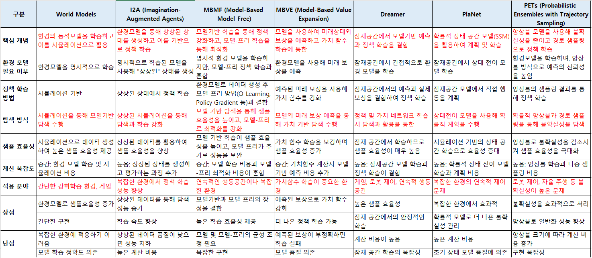
 

## (4-1) World Models : 환경을 모델링하고 시뮬레이션을 통해 학습하는 방식
▣ 정의 : 환경의 동작을 모델링하기 위해 신경망을 사용하여 시뮬레이션 환경을 학습하는 강화 학습 알고리즘. 환경 모델은 세 가지 구성 요소로 나뉨 : (1) VAE(Variational 
Autoencoder): 관측 데이터를 잠재 공간으로 압축, (2)RNN (Recurrent Neural Network): 상태 전이를 모델링, (3)Controller: 잠재 공간에서 행동을 선택 
▣ 장점 : 환경 모델이 학습되면 실제 환경과 상호작용하지 않고도 학습 가능하고 데이터 효율성이 높아짐. 환경의 복잡한 동작을 압축 표현으로 학습 
▣ 단점 : 복잡한 환경에서는 모델 학습이 어렵고 부정확, 환경 모델이 불완전하면 성능이 저하 
▣ 적용분야 : 게임과 같은 시뮬레이션 환경, 로봇 제어, 데이터가 제한된 환경에서 강화 학습 
▣ 예제 :  

 

## (4-2) I2A(Imagination-Augmented Agents) : 상상된 상태에서 정책을 훈련시키는 기법
▣ 정의 : 상상 기반 학습을 도입한 알고리즘으로, 환경 모델을 학습하고 이를 사용해 행동의 결과를 상상(imagine). 행동의 상상된 결과를 정책 학습에 활용하여 샘플 효율성을 강화 
▣ 장점 : 실제 상호작용 없이 상상된 데이터를 사용해 학습 가능하고 모델 기반 접근법과 모델 프리 접근법의 장점을 결합 
▣ 단점 : 상상 모델의 품질에 따라 성능이 크게 달라지며, 계산 비용이 증가 
▣ 적용분야 : 게임 환경, 복잡한 의사결정 문제, 희소 보상 환경 
▣ 예제 :  

 

## (4-3) MBMF(Model-Based Model-Free) : 모델기반 접근과 모델-프리 접근을 혼합한 기법으로, 모델을 사용하지만 모델-프리의 장점도 살리는 방식
▣ 정의 : 환경 모델(Model-Based)과 모델 프리 학습(Model-Free)을 결합하여 보완적인 방식으로 작동하는 알고리즘. 환경 모델을 통해 빠르게 초기 정책을 학습하고, 이후 모델 프리 방식으로 정책을 미세 조정 
▣ 장점 : 샘플 효율성을 높이며, 안정적인 정책 학습 가능, 초기 학습 속도가 빠름 
▣ 단점 : 환경 모델의 품질에 따라 초기 성능이 영향을 받으며, 모델 기반 및 모델 프리 학습 모두 구현해야 하므로 복잡도 증가 
▣ 적용분야 : 로봇 제어. 대규모 시뮬레이션 환경 
▣ 예제 :  

 

## (4-4) MBVE(Model-Based Value Expansion) : 모델은 학습 보조 수단으로 활용되며, 에이전트가 환경에서 수집한 데이터로 학습
▣ 정의 : 환경 모델을 사용하여 짧은 시간 동안 예측된 전이(Transition)를 통해 가치 함수(Value Function)를 계산(이 예측된 값은 정책 학습에 사용) 
▣ 장점 : 샘플 효율성이 높으며, 가치 함수의 품질이 개선. 단기 예측을 통해 모델 학습의 불확실성을 감소 
▣ 단점 : 환경 모델의 품질에 따라 성능이 좌우. 단기 예측에만 적합하며, 장기적 의사결정에는 한계 
▣ 적용분야 : 게임 AI, 가치 함수 학습이 중요한 환경 
▣ 예제 :  

 

## (4-5) Dreamer : 사전에 환경 모델이 제공되지 않은 상태에서, 에이전트가 환경 데이터를 수집해 세계 모델을 학습하고 이를 활용해 정책과 가치 함수를 학습 (DeepMind, 2020)
▣ 정의 : 환경 모델을 학습하여 잠재 공간에서 정책을 최적화하는 알고리즘. PlaNet의 확장 버전으로, 단기 및 장기 보상을 고려하여 정책을 학습 
▣ 장점 : 잠재 공간에서 학습하여 데이터 효율성을 극대화, 샘플 효율성이 높으며 복잡한 환경에서도 잘 작동 
▣ 단점 : 환경 모델 학습의 복잡도가 높고 모델 학습에 필요한 계산 자원이 큼 
▣ 적용분야 : 시뮬레이션 및 물리 기반 환경, 연속적인 제어 문제 
▣ 예제 :  

 

## (4-6) PlaNet : Dreamer의 전신인 모델 기반 강화 학습 알고리즘
▣ 정의 : 잠재 공간 계획(Latent Space Planning)을 수행하는 강화 학습 알고리즘. 관측 데이터를 잠재 공간으로 변환하고 이 공간에서 환경 모델을 학습하여 행동을 계획 
▣ 장점 : 환경 모델을 잠재 공간에서 학습하여 계산 효율성이 높고 장기 계획이 가능한 정책 학습 
▣ 단점 : 복잡한 환경에서는 잠재 공간 모델링이 어렵고 부정확할 수 있으며, 계산 자원 요구가 큼 
▣ 적용분야 : 로봇 제어, 물리 시뮬레이션 
▣ 예제 :  

 

## (4-7) PETs(Probabilistic Ensembles with Trajectory Sampling) : 확률적 모델 앙상블을 활용하는 강화학습 기법
▣ 정의 : 여러 환경 모델의 앙상블을 사용하여 샘플링 기반 예측을 수행하는 알고리즘. 모델 불확실성을 감소시키기 위해 앙상블 접근법을 사용하며, 예측 결과를 정책 학습에 활용 
▣ 장점 : 모델 불확실성을 효과적으로 처리하고 샘플 효율성과 안정성이 높음. 
▣ 단점 : 여러 모델을 학습해야 하므로 계산 비용이 크고 모델 앙상블 관리가 복잡. 
▣ 적용분야 : 로봇 공학, 희소 보상 환경. 
▣ 예제 :  

 

## (4-8)  MuZero: 알파고(AlphaGo) 시리즈의 발전된 형태로, 명시적 환경 모델 없이도 정책과 가치를 학습 (DeepMind, 2019)
▣ 정의 : AlphaZero의 확장 버전으로, 환경 모델을 사전에 제공받는 대신 학습 과정에서 환경 모델을 스스로 학습하는 알고리즘. 모델 기반 학습과 모델 프리 학습을 결합해 환경 모델이 없는 경우에도 높은 성능을 발휘 
▣ 장점 : AlphaZero와 달리 환경 모델이 없어도 동작 가능, 규칙 기반 게임뿐 아니라 다양한 환경에 적용 가능, 모델 기반 예측을 통해 데이터 효율성을 극대화 
▣ 단점 : 복잡한 구현: 환경 모델 학습과 RL을 결합해야 하므로 구현이 어렵고, 높은 계산 비용: 모델 학습 및 MCTS 사용으로 인해 연산 자원이 많이 요구 
▣ 적용 분야 : 체스, 바둑, 장기 등 규칙 기반 게임. 비디오 게임과 같은 복잡한 환경 
▣ 예제 :  

 

---

# 앙상블 학습(Ensemble Learning, EL)
▣ API : https://scikit-learn.org/stable/api/sklearn.ensemble.html 
▣ 정의 : 앙상블 학습이란 다수의 기초 알고리즘(base algorithm)을 결합하여 더 나은 성능의 예측 모델을 형성하는 것을 말하며, 사용 목적에 따라 스태킹(Stacking), 배깅(Bagging), 부스팅(Boosting)으로 분류 

 

# [1] 스태킹(Stacking)
▣ 정의 : 서로 다른 종류의 기반 모델(base model) 여러 개를 학습한 후, 이들의 예측 결과를 결합하는 방식. 개별 모델의 예측 결과를 다시 하나의 메타 모델(meta-model)로 학습시켜 최종 예측을 수행 
▣ 필요성 : 단일 모델의 약점을 보완하기 위해 서로 다른 유형의 모델을 조합함으로써 더 나은 성능을 도출. 예를 들어, knn, logistic regression, randomforest, xgboost 모델을 이용해서 4종류의 예측값을 구한 후, 이 예측값을 하나의 데이터 프레임으로 만들어 최종모델인 lightgbm의 학습데이터로 사용 
▣ 장점 : 서로 다른 모델의 장점을 결합하여 더욱 강력한 예측 성능을 낼 수 있으며, 다양한 모델의 편향과 분산을 보완 
▣ 단점 : 모델 조합이 복잡해질수록 계산 비용이 커지고, 메타 모델을 학습하는 데 추가적인 시간이 소요되며 과적합(overfitting)의 위험 
▣ 응용분야 : 여러 모델의 특성이 유용할 때 사용한다. 예를 들어, 금융 예측, 이미지 분류 등 다양한 문제에서 활용 
▣ 모델식 : $𝑓_1$ 은 각각의 개별 모델, $𝑓_2$ 는 메타 모델, $\widehat{y}=f_2(f_1(x_1),f_1(x_2),...f_1(x_n))$ 

	#!pip install lightgbm
	import pandas as pd
	from sklearn.model_selection import train_test_split
	from sklearn.metrics import accuracy_score
	from sklearn.neighbors import KNeighborsClassifier
	from sklearn.linear_model import LogisticRegression
	from sklearn.ensemble import RandomForestClassifier
	import xgboost as xgb
	import lightgbm as lgb
	from sklearn.datasets import load_iris
	from sklearn.preprocessing import StandardScaler
	
	# 1. 데이터 로드
	iris = load_iris()
	X, y = iris.data, iris.target
	
	# 데이터 분할 (Train, Test)
	X_train, X_test, y_train, y_test = train_test_split(X, y, test_size=0.3, random_state=42, stratify=y)
	
	# 2. Base Models 정의
	knn = KNeighborsClassifier(n_neighbors=5)  # KNN 하이퍼파라미터 튜닝
	logistic = LogisticRegression(max_iter=300)  # Logistic Regression 개선
	rf = RandomForestClassifier(n_estimators=200, max_depth=10, random_state=42)  # Random Forest 개선
	xgboost = xgb.XGBClassifier(n_estimators=200, learning_rate=0.1, eval_metric='mlogloss', random_state=42)  # XGBoost 개선
	
	# 3. Base Models 학습 및 예측
	# KNN
	knn.fit(X_train, y_train)
	knn_pred_train = knn.predict_proba(X_train)
	knn_pred_test = knn.predict_proba(X_test)
	knn_accuracy = accuracy_score(y_test, knn.predict(X_test))  # 정확도 계산
	
	# Logistic Regression
	logistic.fit(X_train, y_train)
	logistic_pred_train = logistic.predict_proba(X_train)
	logistic_pred_test = logistic.predict_proba(X_test)
	logistic_accuracy = accuracy_score(y_test, logistic.predict(X_test))  # 정확도 계산
	
	# Random Forest
	rf.fit(X_train, y_train)
	rf_pred_train = rf.predict_proba(X_train)
	rf_pred_test = rf.predict_proba(X_test)
	rf_accuracy = accuracy_score(y_test, rf.predict(X_test))  # 정확도 계산
	
	# XGBoost
	xgboost.fit(X_train, y_train)
	xgb_pred_train = xgboost.predict_proba(X_train)
	xgb_pred_test = xgboost.predict_proba(X_test)
	xgb_accuracy = accuracy_score(y_test, xgboost.predict(X_test))  # 정확도 계산
	
	# 4. Base Models 예측값을 하나의 데이터프레임으로 합침
	# 학습 데이터
	stacked_train = pd.DataFrame({
	    "knn_0": knn_pred_train[:, 0], "knn_1": knn_pred_train[:, 1], "knn_2": knn_pred_train[:, 2],
	    "logistic_0": logistic_pred_train[:, 0], "logistic_1": logistic_pred_train[:, 1], "logistic_2": logistic_pred_train[:, 2],
	    "rf_0": rf_pred_train[:, 0], "rf_1": rf_pred_train[:, 1], "rf_2": rf_pred_train[:, 2],
	    "xgb_0": xgb_pred_train[:, 0], "xgb_1": xgb_pred_train[:, 1], "xgb_2": xgb_pred_train[:, 2],
	})
	
	# 테스트 데이터
	stacked_test = pd.DataFrame({
	    "knn_0": knn_pred_test[:, 0], "knn_1": knn_pred_test[:, 1], "knn_2": knn_pred_test[:, 2],
	    "logistic_0": logistic_pred_test[:, 0], "logistic_1": logistic_pred_test[:, 1], "logistic_2": logistic_pred_test[:, 2],
	    "rf_0": rf_pred_test[:, 0], "rf_1": rf_pred_test[:, 1], "rf_2": rf_pred_test[:, 2],
	    "xgb_0": xgb_pred_test[:, 0], "xgb_1": xgb_pred_test[:, 1], "xgb_2": xgb_pred_test[:, 2],
	})
	
	# 데이터 정규화 (스케일링)
	scaler = StandardScaler()
	stacked_train_scaled = scaler.fit_transform(stacked_train)
	stacked_test_scaled = scaler.transform(stacked_test)
	
	# 5. Final Model (LightGBM) 학습 및 예측
	lgb_model = lgb.LGBMClassifier(
	    random_state=42,
	    min_data_in_leaf=30,        # 리프 노드 최소 데이터 수를 낮춤
	    min_gain_to_split=0.1,      # 분할 수행 최소 정보 이득을 낮춤
	    max_depth=7,                # 트리 최대 깊이를 늘림
	    num_leaves=31,              # 리프 노드 개수를 늘림
	    feature_fraction=0.9,       # 학습에 사용할 피처 비율 증가
	    bagging_fraction=0.9        # 학습에 사용할 데이터 비율 증가
	)
	
	# 모델 학습
	lgb_model.fit(stacked_train_scaled, y_train)
	
	# 예측
	lgb_pred = lgb_model.predict(stacked_test_scaled)
	
	# 최종 모델 정확도
	lgb_accuracy = accuracy_score(y_test, lgb_pred)
	
	# 6. Base Model 및 최종 모델 정확도 출력
	print(f"KNN Accuracy: {knn_accuracy:.4f}")
	print(f"Logistic Regression Accuracy: {logistic_accuracy:.4f}")
	print(f"Random Forest Accuracy: {rf_accuracy:.4f}")
	print(f"XGBoost Accuracy: {xgb_accuracy:.4f}")
	print(f"Final Model (LightGBM) Accuracy: {lgb_accuracy:.4f}")

<be>
	
	(결과)
	KNN Accuracy: 0.9778
	Logistic Regression Accuracy: 0.9333
	Random Forest Accuracy: 0.9111
	XGBoost Accuracy: 0.9333
	Final Model (LightGBM) Accuracy: 0.9333

 

	(시사점)
 	스태킹은 반드시 성능을 향상시키는 보장이 없으며, Base Models의 조합이 서로 보완적이고 충분히 학습되었을 때 효과적이다.  
	(1) Base Models 다양화: 완전히 다른 특성을 가진 모델(예: SVM, GradientBoosting)을 추가하여 스태킹의 다양성을 개선
	(2) LightGBM 하이퍼파라미터 최적화: LightGBM의 하이퍼파라미터를 더욱 최적화하여 성능을 개선(optuna와 같은 하이퍼파라미터 튜닝 라이브러리를 사용)
	(3) Cross-Validation 기반 평가: 데이터를 분할하는 방식에 따른 성능 변화를 확인

 

# [2] 배깅(Bagging)
▣ 정의 : 동일한 모델을 여러 번 학습하되, 각 학습마다 다른 데이터 샘플을 사용 주로 부트스트랩(bootstrap) 방법으로 샘플링된 데이터로 모델을 학습하며, 최종 예측은 개별 모델의 예측 결과를 평균 또는 투표로 결합. 대표적인 알고리즘은 랜덤 포레스트(Random Forest) 
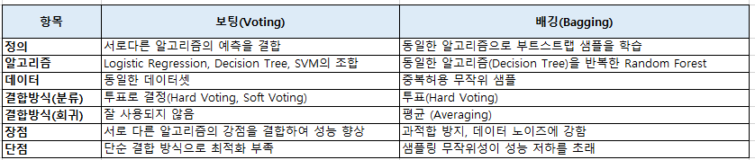
 
▣ 필요성 : 단일 모델이 데이터의 특정 부분에 과적합하는 것을 방지하고, 예측의 안정성을 높이기 위해 사용 
▣ 장점 : 분산을 줄여 예측 성능을 향상시키며, 과적합(overfitting)을 방지하는 데 도움 
▣ 단점 : 편향을 줄이는 데는 효과적이지 않을 수 있으며, 많은 모델을 학습하므로 계산 자원이 많이 필요 
▣ 응용분야 : 랜덤 포레스트처럼 결정 트리 기반 모델에서 이미지 분류, 텍스트 분류, 금융 예측 등에 널리 사용 
▣ 모델식 :  $𝑓_1$ 은 각각의 개별 모델, $\widehat{y}=\frac{1}{N}\sum_{i=1}^{N}f_i(x)$ 

	from sklearn.ensemble import BaggingClassifier
	from sklearn.tree import DecisionTreeClassifier
	from sklearn.model_selection import train_test_split, cross_val_score
	from sklearn.metrics import accuracy_score
	from sklearn.datasets import load_iris
	
	# 1. 데이터 로드
	iris = load_iris()
	X, y = iris.data, iris.target
	
	# 데이터 분할 (Train, Test)
	X_train, X_test, y_train, y_test = train_test_split(X, y, test_size=0.3, random_state=42, stratify=y)
	
	# 2. Base Estimator 설정
	base_estimator = DecisionTreeClassifier(max_depth=5, random_state=42)
	
	# 3. Bagging Classifier 설정
	bagging_clf = BaggingClassifier(
	    estimator=base_estimator,
	    n_estimators=50,  # 기본 모델 개수 증가
	    max_samples=1.0,  # 전체 데이터를 사용
	    max_features=1.0,  # 모든 피처를 사용
	    bootstrap=True,
	    random_state=42
	)
	
	# 배깅 모델 학습 및 평가
	bagging_clf.fit(X_train, y_train)
	bagging_pred = bagging_clf.predict(X_test)
	bagging_accuracy = accuracy_score(y_test, bagging_pred)
	print(f"Bagging Classifier Accuracy: {bagging_accuracy:.4f}")
	
	# 교차 검증 (배깅)
	bagging_cv_scores = cross_val_score(bagging_clf, X, y, cv=5)
	print(f"Bagging Cross-Validation Accuracy: {bagging_cv_scores.mean():.4f}")
	
	# 4. 단일 DecisionTreeClassifier 학습 및 평가
	single_tree = DecisionTreeClassifier(max_depth=5, random_state=42)
	single_tree.fit(X_train, y_train)
	single_tree_pred = single_tree.predict(X_test)
	single_tree_accuracy = accuracy_score(y_test, single_tree_pred)
	print(f"Single Decision Tree Accuracy: {single_tree_accuracy:.4f}")
	
	# 교차 검증 (단일 Decision Tree)
	single_tree_cv_scores = cross_val_score(single_tree, X, y, cv=5)
	print(f"Single Decision Tree Cross-Validation Accuracy: {single_tree_cv_scores.mean():.4f}")
	
 

	(결과)
	Bagging Classifier Accuracy: 0.9333
	Bagging Cross-Validation Accuracy: 0.9667
	Single Decision Tree Accuracy: 0.9333
	Single Decision Tree Cross-Validation Accuracy: 0.9533

 

# [3] 부스팅(Boosting)
▣ 정의 : 약한 학습기(weak learner)를 연속적으로 학습시키며, 이전 학습에서 잘못 예측한 데이터에 가중치를 부여하여 다음 모델이 이를 더 잘 학습할 수 있도록 한다. 대표적인 알고리즘으로는 AdaBoost, Gradient Boosting, XGBoost 등이 있다. 
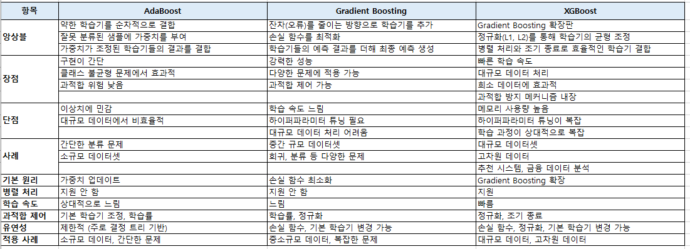
▣ 필요성 : 약한 학습기를 여러 번 반복하여 강력한 학습기를 만들 수 있으며, 특히 잘못된 예측에 집중하여 성능을 점진적으로 개선한다. 
▣ 장점 : 모델이 연속적으로 개선되기 때문에 높은 예측 성능을 보일 수 있으며, 오류를 줄이는 데 매우 효과적이다. 
▣ 단점 : 연속적인 학습 과정에서 모델이 과적합할 위험이 있으며, 학습 속도가 느릴 수 있다. 
▣ 응용분야 : 금융 예측, 분류 문제, 회귀 분석 등에서 많이 사용되며, 특히 XGBoost는 대회에서 많이 사용된다. 
▣ 모델식 : $f_i$ 는 약한 학습기, $𝛼_𝑖$ 는 각 학습기의 가중치, $\widehat{y}=\sum_{i=1}^{N}\alpha_i f_i(x)$ 

	from sklearn.ensemble import AdaBoostClassifier
	from sklearn.tree import DecisionTreeClassifier
	from sklearn.model_selection import train_test_split, cross_val_score
	from sklearn.metrics import accuracy_score
	from sklearn.datasets import load_iris
	
	# 1. 데이터 로드
	iris = load_iris()
	X, y = iris.data, iris.target
	
	# 데이터 분할 (Train, Test)
	X_train, X_test, y_train, y_test = train_test_split(X, y, test_size=0.3, random_state=42, stratify=y)
	
	# 2. AdaBoost Classifier 설정 (하이퍼파라미터 조정)
	ada_clf = AdaBoostClassifier(
	    estimator=DecisionTreeClassifier(max_depth=5),  # 기본 학습기로 결정 트리 사용
	    n_estimators=200,      # 부스팅 단계 수 증가
	    learning_rate=0.05,    # 학습률 감소
	    random_state=42
	)
	
	# 3. 모델 학습
	ada_clf.fit(X_train, y_train)
	
	# 4. 예측
	y_pred = ada_clf.predict(X_test)
	
	# 5. 평가
	accuracy = accuracy_score(y_test, y_pred)
	print(f"AdaBoost Classifier Accuracy: {accuracy:.4f}")
	
	# 6. 교차 검증 (추가적인 평가)
	cv_scores = cross_val_score(ada_clf, X, y, cv=5)
	print(f"Cross-Validation Accuracy: {cv_scores.mean():.4f}")

  

 	(결과)
	AdaBoost Classifier Accuracy: 0.9111
	Cross-Validation Accuracy: 0.9533  

  

	from sklearn.ensemble import GradientBoostingClassifier
	from sklearn.model_selection import train_test_split, cross_val_score
	from sklearn.metrics import accuracy_score
	from sklearn.datasets import load_iris
	
	# 1. 데이터 로드
	iris = load_iris()
	X, y = iris.data, iris.target
	
	# 데이터 분할 (Train, Test)
	X_train, X_test, y_train, y_test = train_test_split(X, y, test_size=0.3, random_state=42, stratify=y)
	
	# 2. Gradient Boosting Classifier 설정 (하이퍼파라미터 조정)
	gb_clf = GradientBoostingClassifier(
	    n_estimators=200,      # 부스팅 스테이지 개수 증가
	    learning_rate=0.05,    # 학습률 감소
	    max_depth=5,           # 개별 트리의 최대 깊이 증가
	    random_state=42
	)
	
	# 3. 모델 학습
	gb_clf.fit(X_train, y_train)
	
	# 4. 예측
	y_pred = gb_clf.predict(X_test)
	
	# 5. 평가
	accuracy = accuracy_score(y_test, y_pred)
	print(f"Gradient Boosting Classifier Accuracy: {accuracy:.4f}")
	
	# 6. 교차 검증 (추가적인 평가)
	cv_scores = cross_val_score(gb_clf, X, y, cv=5)
	print(f"Cross-Validation Accuracy: {cv_scores.mean():.4f}")

 

	(결과)
	Gradient Boosting Classifier Accuracy: 0.9333
	Cross-Validation Accuracy: 0.9600
  
 

	import xgboost as xgb
	from sklearn.model_selection import train_test_split, cross_val_score
	from sklearn.metrics import accuracy_score
	from sklearn.datasets import load_iris
	from sklearn.preprocessing import StandardScaler
	
	# 1. 데이터 로드 및 분할
	iris = load_iris()
	X, y = iris.data, iris.target
	X_train, X_test, y_train, y_test = train_test_split(X, y, test_size=0.3, random_state=42, stratify=y)
	
	# 스케일링 (선택 사항)
	scaler = StandardScaler()
	X_train_scaled = scaler.fit_transform(X_train)
	X_test_scaled = scaler.transform(X_test)
	
	# 2. XGBoost 설정 (최적화된 설정 유지)
	xgb_clf = xgb.XGBClassifier(
	    n_estimators=300,         # 부스팅 스테이지 증가
	    learning_rate=0.1,        # 기본 학습률 사용
	    max_depth=5,              # 적당한 깊이로 조정
	    min_child_weight=3,       # 분할의 최소 조건 강화
	    subsample=0.8,            # 샘플링 비율
	    colsample_bytree=0.8,     # 피처 샘플링 비율
	    random_state=42,
	    use_label_encoder=False,  # 경고 제거
	    eval_metric="mlogloss"    # 다중 클래스 손실 함수
	)
	
	# 3. 모델 학습
	xgb_clf.fit(X_train_scaled, y_train)
	
	# 4. 예측
	y_pred = xgb_clf.predict(X_test_scaled)
	
	# 5. 평가
	accuracy = accuracy_score(y_test, y_pred)
	print(f"Tuned XGBoost Classifier Accuracy: {accuracy:.4f}")
	
	# 6. 교차 검증
	cv_scores = cross_val_score(xgb_clf, X, y, cv=5)
	print(f"Tuned XGBoost Cross-Validation Accuracy: {cv_scores.mean():.4f}")

  

	Tuned XGBoost Classifier Accuracy: 0.9333
	Tuned XGBoost Cross-Validation Accuracy: 0.9467
 
 

