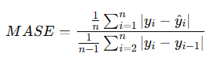
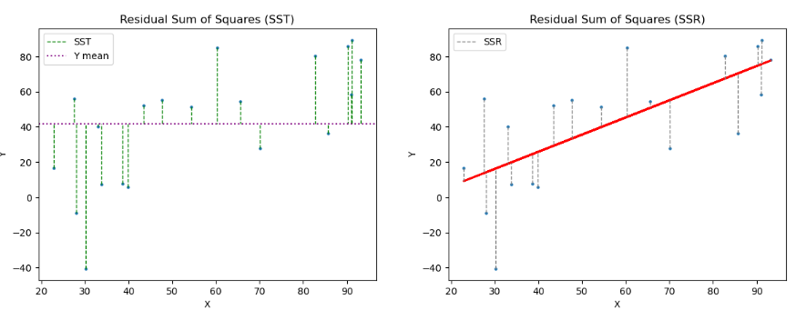
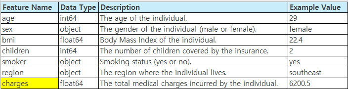
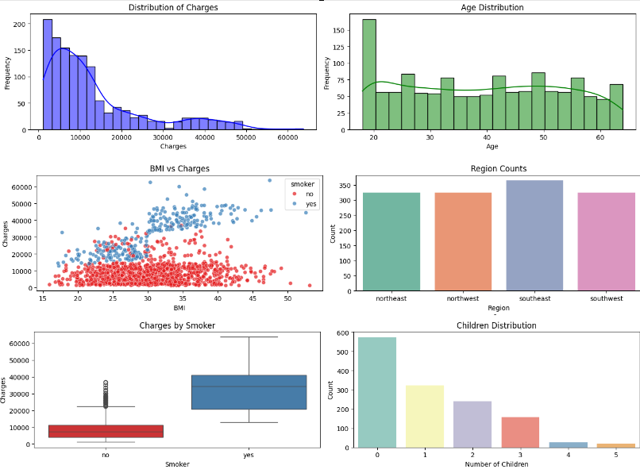
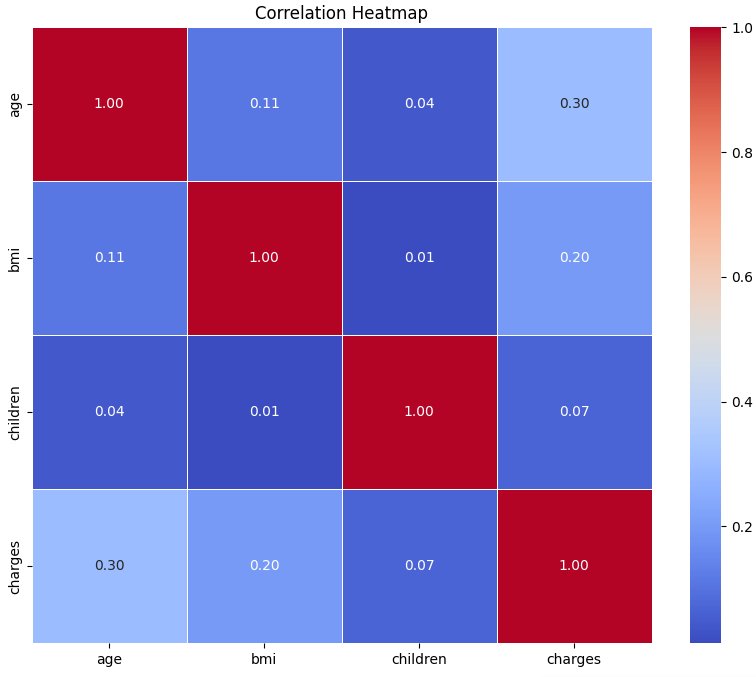
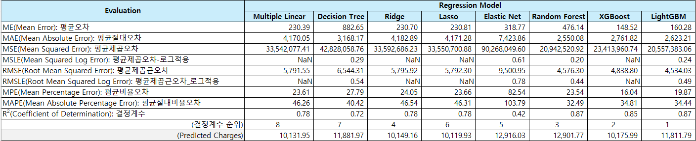

#  13 : 회귀 평가 지표

---

	[1] 평균 오차 (Mean Error, ME)
 	[2] 평균 절대 오차 (Mean Absolute Error, MAE)
	[3] 평균 제곱 오차 (Mean Squared Error, MSE)
	[4] 평균 제곱 오차(로그적용) (Mean Squared Log Error, MSLE)
	[5] 평균 제곱근 오차 (Root Mean Squared Error, RMSE)
	[6] 평균 제곱근 오차(로그적용) (Root Mean Squared Log Error, RMSLE)
 	[7] 평균 비율 오차 (Mean Percentage Error, MPE)
	[8] 평균 절대 비율 오차 (Mean Absolute Percentage Error, MAPE)
	[9] 평균 절대 규모 오차 (MASE(Mean Absolute Scaled Error)
	[10] R2 score
	  
---

# [1] 평균 오차 (Mean Error, ME)

 
▣ 정의: 예측값과 실제값의 차이를 평균낸 값으로, 오차의 방향성을 포함한 예측오차의 산술평균을 의미 
▣ 필요성: 오차가 양수인지 음수인지, 평균적으로 과대평가 또는 과소평가되는지를 파악 
▣ 장점: 오차의 방향성을 반영하여 모델의 편향(bias)을 분석 
▣ 단점: 양수와 음수가 상쇄되므로, 실제 오차의 크기를 판단하기 어렵다 

	def ME(y, t):
		return (y-t).mean(axis=None)

 

# [2] 평균 절대 오차 (Mean Absolute Error, MAE)

 
▣ 정의: 실제 정답 값과 예측 값의 차이를 절댓값으로 변환한 뒤 합산하여 평균을 구한다. 
▣ 필요성: 모델의 평균적인 예측 오차 크기를 직관적으로 파악, 특이값이 많은 경우에 주로 사용 
▣ 장점: 직관적이고 정답 및 예측 값과 같은 단위를 가지고, MSE, RMSE에 비해 극단값(outlier)에 덜 민감 
▣ 단점: 절댓값을 취하므로 underestimates/overestimates인지에 대한 판단을 할 수 없으며, 스케일 의존적(scal dependency)으로 모델마다 에러 크기가 동일해도 에러율은 동일하지 않고, 오차의 방향성을 알 수 없다 

	def MAE(y, t):
    	return (abs(y - t)).mean(axis=None)
   
 

# [3] 평균 제곱 오차 (Mean Squared Error, MSE)

 
▣ 정의: 실제 정답 값과 예측 값의 차이를 제곱(예측값과 실제값 차이의 면적)한 뒤 평균을 구한다. 
▣ 필요성: 오차의 크기를 강조해 큰 오차에 민감하게 반응 
▣ 장점: 직관적이며, 모델의 큰 오차를 더 잘 식별 가능 
▣ 단점: 예측 변수와 단위가 다르며, 오차를 제곱하기 때문에 이상치에 민감(제곱하기 때문에 1미만의 에러는 작아지고 그 이상의 에러는 커짐), 제곱을 씌우게 되어 underestimates/overestimates인지 파악하기 힘들며, 스케일 의존적(scal dependency)이라 모델마다 에러러 크기가 동일해도 에러율은 동일하지 않은 단점. 오차제곱합(SSE)와 유사하지만 오차제곱합으로는 실제 오차가 커서 값이 커지는 것인지 데이터의 양이 많아서 값이 커지는 것인지를 구분할 수 없게 된다. 

	def MSE(y, t):
    	return ((y-t)**2).mean(axis=None)

	def SSE(y, t):
    	return 0.5*np.sum((y-t)**2)

 

# [4] 평균 제곱 오차(로그적용) (Mean Squared Log Error, MSLE)

 
▣ 정의: 예측값과 실제값 간의 로그 차이에 대한 제곱 평균으로 MSE에 로그를 적용  
▣ 필요성: 작은 값의 상대적인 차이를 강조하며 큰 값의 차이를 완화 
▣ 장점: 작은 값에 집중하여 예측하는 모델에 적합(결정 값이 클수록 오류값도 커지기 때문에 일부 큰 오류값들로 인해 전체 오류값이 커지는 것을 막아준다) 
▣ 단점: 로그 연산으로 인해 음수 값은 처리 불가능 

	def MSLE(y, t):
		return np.log((y-t)**2).mean(axis=None)

 

# [5] 평균 제곱근 오차 (Root Mean Squared Error, RMSE)

 
▣ 정의: MSE의 제곱근으로, 실제값과 예측값 간의 평균적 차이를 원 단위로 환산 
▣ 필요성: 단위를 실제 데이터와 동일하게 조정 
▣ 장점: 해석이 쉬우며, 큰 오차를 강조(MSE에 루트는 씌워서 에러를 제곱해서 생기는 값의 왜곡이 줄어든다) 
▣ 단점: 극단값에 민감하고, 제곱 후 루트를 씌우기 때문에 MAE처럼 실제 값에 대해 underestimates/overestimates인지 파악하기 힘들고, 스케일 의존적(scal dependency)으로 모델마다 에러 크기가 동일해도 에러율은 동일하지 않은 단점 

	def RMSE(y, t):
		return np.sqrt(((y - t) ** 2).mean(axis=None))

 

# [6] 평균 제곱근 오차(로그적용) (Root Mean Squared Log Error, RMSLE)

 
▣ 정의: MSLE의 제곱근 값으로, 로그 차이를 원 단위로 환산한 값으로 RMSE값에 로그를 취한 값 
▣ 필요성: 작은 값의 상대적 차이를 평가 
▣ 장점: 상대적 오차에 강점(결정 값이 클 수록 오류 값도 커지기 때문에 일부 큰 오류 값들로인해 전체 오류값이 커지는 것을 막아준다) 
▣ 단점: 음수 값 불가 

	def RMSLE(y, t):
		return np.log(np.sqrt(((y - t) ** 2).mean(axis=None)))

 

# [7] 평균 비율 오차 (Mean Percentage Error, MPE)

 
▣ 정의: 오차를 실제값에 대한 백분율로 계산해 평균 
▣ 필요성: 예측 오차의 방향성과 백분율 크기를 파악, 절대적인 의미의 예측오차뿐 아니라 상대적인 의미의 예측오차가 필요할 경우에 계산 
▣ 장점: 상대적 크기 비교 가능(음수면 overperformance, 양수면 underperformance으로 판단), 모델이 underestimates/overestimates인지 판단할 수 있다는 장점 
▣ 단점: 실제값이 0일 때 계산 불가 

	def MPE(y, t):
		return (((y-t)/y)*100).mean(axis=None)

 

# [8] 평균 절대 비율 오차 (Mean Absolute Percentage Error, MAPE)

 
▣ 정의: 절대 오차를 백분율로 계산해 평균(MAE를 비율, 퍼센트로 표현하여 스케인 의존적 에러의 문제점을 개선) 
▣ 필요성: 오차를 상대적으로 평가 
▣ 장점 : 직관적이고, 다른 모델과 에러율 비교가 쉬운 장점 
▣ 단점: 0값 문제와 극단값에 민감(실제 정답보다 낮게 예측했는지, 높게 했는지를 파악하기 힘들고 실제 정답이 1보다작을 경우,무한대의 값으로 수렴) 

	def MAPE(y, t):
		return ((abs((y-t)/y))*100).mean(axis=None)

 

# [9] 평균 절대 규모 오차 (MASE(Mean Absolute Scaled Error)
<!--   -->

 
▣ 정의: 예측값의 오차를 기준 시점의 오차와 비교하여 비율화(데이터를 척도화하여 이를 기준으로 예측오차의 절대값에 대한 평균) 
▣ 필요성: 데이터에 따라 유연한 평가 가능 
▣ 장점: 스케일에 대한 의존성이 낮아서 안정적으로 비교 가능 
▣ 단점: 해석이 상대적으로 어렵다 

	def MASE(y, t):
		n = len(y)
		d = np.abs(np.diff(y)).sum() / (n - 1)
		errors = abs(y-t)
		return errors.mean(axis=None)/d

 

# [10] R2 score
▣ 정의: 모델의 설명력을 나타내는 지표로 **SST(Total Sum of Squares)** 관측값에서 관측값의 평균(혹은 추정치의 평균)을 뺀 결과의 총합인 총 제곱합 
▣ 필요성: 전체(Total)에 대한 변동성을 나타냄으로써 모델이 데이터를 얼마나 잘 설명하는지 파악 
▣ 장점: 직관적 
▣ 단점: 모델이 최소한의 기준도 만족하지 못하는 경우는 음수가 될 수 있음 

 

**SSR(Sum of Squares due to Regression) :** 회귀식 추정 값과 관측값의 평균 간 차이인 회귀 제곱합 
회귀식으로 부터 나온 예측값에서 관측값(y)의 평균(혹은 추정치의 평균)을 뺀 결과의 총합 
ESS(Explained Sum of Squares)로 분석을 통해 설명 가능한 수치로 직선(Regression)에 대한 변동성을 나타낸다. 

 

 
출처 : https://devhwi.tistory.com/13

**SSE(Sum of Squares Residual of Error) :** 실제 관측값(y)과 예측값 사이의 차인 잔차(Residual)의 총합 
예측값과 실제 관측값의 차이가 있을 수 있으며 이는 회귀식으로는 설명할 수 없는 설명 불가능한 수치이다.  
SSE값은 오차(Error)에 대한 변동성을 나타내는데, 이 값이 작을수록 좋은 모델이라 볼 수 있다. 자주 사용되는 MSE(Mean Squared Error)는 SSE를 표준화한 개념이다. 

 

위의 수식에 따라 결국 SST=SSR+SSE이며, SSR과 SSE는 반비례 관계라는 것을 알 수 있다. 
총 변동 중 설명 가능한 변동의 비율을 뜻하는 결정계수(R2)는 아래와 같은 식이 성립한다. 

 
다른 지표(MAE, MSE, RMSE)들은 모델마다 값이 다르기 때문에 절대 값만 보고 선능을 판단하기 어려운 반면, $R^2$ score는 상대적인 성능을 나타내기 비교가 쉽다. 
실제 값의 분산 대비 예측값의 분산 비율을 의미한다. 
0에서 1 사이의 값을 가지며, 1에 가까울 수록 좋다. 

  

 
출처 : https://medium.com/coders-mojo/data-science-and-machine-learning-projects-mega-compilation-part-5-e50baa2faa85

	import numpy as np
	import matplotlib.pyplot as plt
	from sklearn.linear_model import LinearRegression
 	from sklearn.metrics import r2_score

	#해당 구문이 사용된 파이썬 파일을 직접 실행했을 때만 아래 코드를 실행
	if __name__ == '__main__':
    
	    # 테스트용 데이터 생성
	    x = np.random.rand(1000)*100
	    y = 0.8*x+np.random.randn(1000)*30

	    # Linear Regrssion model 생성
	    model = LinearRegression() 
    
	    # Linear Regression model 학습
	    model.fit(x.reshape(-1,1), y) 
    
	    # Prediction
	    y_new = model.predict(np.array([6]).reshape((-1, 1))) 
	    print("Data Prediction: ", y_new)
    
	    # Linear Regression model 평가
	    r_sq = model.score(x.reshape(-1,1), y)  
    	    print("결정 계수 (model.score): ", r_sq)
    	    r2 = r2_score(y, model.predict(x.reshape(-1,1)))  
    	    print("결정 계수 (r2_score): ", r2)
    
	    # Linear Model 식 
	    b0,b1 = model.intercept_, model.coef_[0]   
	    print("기울기", model.coef_[0])
	    print("절편", model.intercept_)

	    # 시각화
	    plt.scatter(x, y, s=5)
	    plt.plot(x, model.predict(x.reshape(-1,1)), color='red', linewidth=2)
	    plt.annotate(f'y = {b1:.2f}x + {b0:.2f}', xy=(0.7*max(x), 0.8*max(y)))
	    plt.show()

# 경사하강법(Gradient Descent)을 활용한 회귀모델 최적화 기법

**(1) LinearRegression :**  solver 매개변수에서 sag(Stochastic Average Gradient), lsqr 변형 사용 

	from sklearn.linear_model import LinearRegression

	model = LinearRegression(solver='sag')  # 경사하강법 기반 해법
	model.fit(X_train, y_train)
	predictions = model.predict(X_test)

**(2) SGDRegressor (Stochastic Gradient Descent Regressor) :** 대규모 데이터에 적합, 정규화를 위한 L2, L1 및 ElasticNet 규제를 지원 

 	from sklearn.linear_model import SGDRegressor

	model = SGDRegressor()
	model.fit(X_train, y_train)
	predictions = model.predict(X_test)

**(3) Ridge, Lasso, ElasticNet :** 대규모 데이터셋에서 solver 매개변수에서 sag(Stochastic Average Gradient) 선택 

	from sklearn.linear_model import Ridge

	model = Ridge(solver='saga')  # 경사하강법 기반 해법
	model.fit(X_train, y_train)
	predictions = model.predict(X_test)

   **(4) PassiveAggressiveRegressor :** 대규모 데이터셋에서 빠르게 학습하기 위해 경사하강법의 변형 중 하나인 수동 공격적 학습(passive-aggressive learning)을 사용 
   
	from sklearn.linear_model import PassiveAggressiveRegressor

	model = PassiveAggressiveRegressor()
	model.fit(X_train, y_train)
	predictions = model.predict(X_test)

---

(데이터구조) 
 
(데이터셋) https://github.com/YangGuiBee/ML/blob/main/TextBook-13/insurance.csv
 

	################################################################################
	# 데이터 시각화
	################################################################################
	
	import pandas as pd
	import seaborn as sns
	import matplotlib.pyplot as plt
	
	# Load dataset from URL
	data_url = "https://raw.githubusercontent.com/YangGuiBee/ML/main/TextBook-13/insurance.csv"
	df = pd.read_csv(data_url)
	
	# Ensure categorical columns are treated as categories
	df['sex'] = df['sex'].astype('category')
	df['smoker'] = df['smoker'].astype('category')
	df['region'] = df['region'].astype('category')
	
	# Basic information about the dataset
	print("Dataset Information:")
	print(df.info())
	print("\nBasic Statistics:")
	print(df.describe())
	
	# Visualizations
	plt.figure(figsize=(14, 10))
	
	# Distribution of Charges
	plt.subplot(3, 2, 1)
	sns.histplot(df['charges'], kde=True, bins=30, color='blue')
	plt.title('Distribution of Charges')
	plt.xlabel('Charges')
	plt.ylabel('Frequency')
	
	# Age Distribution
	plt.subplot(3, 2, 2)
	sns.histplot(df['age'], kde=True, bins=20, color='green')
	plt.title('Age Distribution')
	plt.xlabel('Age')
	plt.ylabel('Frequency')
	
	# BMI vs Charges
	plt.subplot(3, 2, 3)
	sns.scatterplot(x='bmi', y='charges', data=df, hue='smoker', palette='Set1', alpha=0.7)
	plt.title('BMI vs Charges')
	plt.xlabel('BMI')
	plt.ylabel('Charges')
	
	# Region Counts
	plt.subplot(3, 2, 4)
	sns.countplot(x='region', data=df, palette='Set2')
	plt.title('Region Counts')
	plt.xlabel('Region')
	plt.ylabel('Count')
	
	# Charges by Smoker
	plt.subplot(3, 2, 5)
	sns.boxplot(x='smoker', y='charges', data=df, palette='Set1')
	plt.title('Charges by Smoker')
	plt.xlabel('Smoker')
	plt.ylabel('Charges')
	
	# Children Distribution
	plt.subplot(3, 2, 6)
	sns.countplot(x='children', data=df, palette='Set3')
	plt.title('Children Distribution')
	plt.xlabel('Number of Children')
	plt.ylabel('Count')
	
	plt.tight_layout()
	plt.show()
	
	# Correlation Heatmap (Numerical Columns Only)
	plt.figure(figsize=(10, 8))
	numerical_columns = df.select_dtypes(include=['float64', 'int64']).columns
	sns.heatmap(df[numerical_columns].corr(), annot=True, cmap='coolwarm', fmt='.2f', linewidths=0.5)
	plt.title('Correlation Heatmap')
	plt.show()

 

 

 

	################################################################################
	# Multiple Linear Regression 
	# Decision Tree Regression
	################################################################################
	
	# Check and install necessary packages
	import subprocess
	import sys
	
	def install(package):
	    try:
	        __import__(package)
	    except ImportError:
	        print(f"Installing {package}...")
	        subprocess.check_call([sys.executable, "-m", "pip", "install", package])
	
	# List of required packages
	required_packages = ['pandas', 'scikit-learn', 'xgboost', 'lightgbm', 'numpy']
	for package in required_packages:
	    install(package)
	
	# Import libraries
	import pandas as pd
	import numpy as np
	from sklearn.model_selection import train_test_split
	from sklearn.preprocessing import OneHotEncoder
	from sklearn.linear_model import LinearRegression
	from sklearn.tree import DecisionTreeRegressor
	from sklearn.metrics import mean_absolute_error, mean_squared_error, r2_score, mean_absolute_percentage_error
	
	# Load dataset from URL
	data_url = "https://raw.githubusercontent.com/YangGuiBee/ML/main/TextBook-13/insurance.csv"
	df = pd.read_csv(data_url)
	
	# Check and handle missing values
	print("Checking for missing values...")
	print(df.isnull().sum())  # Display the count of NaN values per column
	
	# Ensure no missing values
	assert not df.isnull().values.any(), "Data contains missing values!"
	
	# Preprocessing
	X = df.drop("charges", axis=1)
	y = df["charges"]
	categorical_features = ["sex", "smoker", "region"]
	numerical_features = ["age", "bmi", "children"]
	
	# Updated sparse_output instead of sparse
	encoder = OneHotEncoder(sparse_output=False, drop="first")
	X_encoded = encoder.fit_transform(X[categorical_features])
	X_numerical = X[numerical_features]
	
	X_preprocessed = pd.DataFrame(
	    np.hstack([X_numerical, X_encoded]),
	    columns=numerical_features + encoder.get_feature_names_out().tolist()
	)
	
	# Train-test split
	X_train, X_test, y_train, y_test = train_test_split(X_preprocessed, y, test_size=0.2, random_state=42)
	
	# Evaluation metrics
	def evaluate_model(y_true, y_pred):
	    me = np.mean(y_pred - y_true)  # 평균 오차 (예측값 - 실제값)
	    mae = mean_absolute_error(y_true, y_pred)  # 평균 절대 오차
	    mse = mean_squared_error(y_true, y_pred)  # 평균 제곱 오차
	    rmse = np.sqrt(mse)  # 평균 제곱근 오차
	
	    # Conditional MSLE calculation
	    if (y_true > 0).all() and (y_pred > 0).all():
	        msle = mean_squared_error(np.log1p(y_true), np.log1p(y_pred))  # 평균 제곱 오차 (로그 적용)
	        rmsle = np.sqrt(msle)  # 평균 제곱근 오차 (로그 적용)
	    else:
	        msle = np.nan
	        rmsle = np.nan
	
	    mpe = np.mean((y_pred - y_true) / y_true) * 100  # 평균 비율 오차
	    mape = mean_absolute_percentage_error(y_true, y_pred) * 100  # 평균 절대 비율 오차
	    r2 = r2_score(y_true, y_pred)  # R2 점수
	
	    return {
	        "ME": me,
	        "MAE": mae,
	        "MSE": mse,
	        "MSLE": msle,
	        "RMSE": rmse,
	        "RMSLE": rmsle,
	        "MPE": mpe,
	        "MAPE": mape,
	        "R2": r2,
	    }
	
	# Initialize models
	models = {
	    "Multiple Linear Regression": LinearRegression(),
	    "Decision Tree Regression": DecisionTreeRegressor(),
	}
	
	# Train and evaluate models
	results = {}
	for name, model in models.items():
	    model.fit(X_train, y_train)
	    y_pred = model.predict(X_test)
	
	    # Check for invalid prediction values
	    if (y_pred < 0).any():
	        print(f"Warning: Model {name} produced negative predictions. Adjusting values to zero.")
	        y_pred = np.maximum(y_pred, 0)  # Replace negative predictions with 0
	
	    results[name] = evaluate_model(y_test, y_pred)
	
	# Format evaluation results for consistent decimal places
	evaluation_results = pd.DataFrame(results)
	evaluation_results = evaluation_results.applymap(lambda x: f"{x:.6f}" if pd.notnull(x) else "NaN")
	
	# Display formatted results
	print("\nModel Evaluation Results:")
	print(evaluation_results)
	
	# Add explanations for each metric in Korean
	metric_explanations = {
	    "ME": "평균 오차 (Mean Error): 예측값과 실제값의 평균 차이. 0에 가까울수록 좋음.",
	    "MAE": "평균 절대 오차 (Mean Absolute Error): 예측값과 실제값의 절대적 차이의 평균. 낮을수록 좋음.",
	    "MSE": "평균 제곱 오차 (Mean Squared Error): 예측값과 실제값의 제곱 차이 평균. 낮을수록 좋음.",
	    "MSLE": "평균 제곱 오차 (로그 적용, Mean Squared Log Error): 로그 스케일에서의 평균 제곱 오차. 낮을수록 좋음.",
	    "RMSE": "평균 제곱근 오차 (Root Mean Squared Error): 평균 제곱 오차의 제곱근. 낮을수록 좋음.",
	    "RMSLE": "평균 제곱근 오차 (로그 적용, Root Mean Squared Log Error): 로그 스케일에서의 제곱근 오차. 낮을수록 좋음.",
	    "MPE": "평균 비율 오차 (Mean Percentage Error): 예측값과 실제값의 비율 오차 평균. 0에 가까울수록 좋음.",
	    "MAPE": "평균 절대 비율 오차 (Mean Absolute Percentage Error): 절대 비율 오차의 평균. 낮을수록 좋음.",
	    "R2": "R2 점수 (Coefficient of Determination): 모델의 설명력을 나타냄. 1에 가까울수록 좋음.",
	}
	
	# Append explanations to results
	print("\nModel Evaluation Results with Explanations:")
	for metric, explanation in metric_explanations.items():
	    print(f"{metric}: {explanation}")
	    print(evaluation_results.loc[metric])
	    print()
	
	# Prediction
	test_input = pd.DataFrame(
	    [[55, 21, 2, "female", "no", "northeast"]],
	    columns=["age", "bmi", "children", "sex", "smoker", "region"]
	)
	
	# Encode and predict
	test_encoded = encoder.transform(test_input[categorical_features])
	test_numerical = test_input[numerical_features]
	test_preprocessed = pd.DataFrame(
	    np.hstack([test_numerical, test_encoded]),
	    columns=numerical_features + encoder.get_feature_names_out().tolist()
	)
	
	# Predictions for test input
	predictions = {}
	for name, model in models.items():
	    predictions[name] = model.predict(test_preprocessed)[0]
	
	# Format predictions for consistent decimal places
	predictions_df = pd.DataFrame(predictions, index=["Predicted Charges"]).applymap(lambda x: f"{x:.6f}")
	
	# Display predictions
	print("\nPredicted Charges for Input:")
	print(predictions_df)
	
 

	################################################################################
	# Ridge Regression
	# Lasso Regression
	# Elastic Net Regression
	# Random Forest Regression
	# XGBoost
	# LightGBM
	################################################################################
	
	# Check and install necessary packages
	import subprocess
	import sys
	
	def install(package):
	    try:
	        __import__(package)
	    except ImportError:
	        print(f"Installing {package}...")
	        subprocess.check_call([sys.executable, "-m", "pip", "install", package])
	
	# List of required packages
	required_packages = ['pandas', 'scikit-learn', 'xgboost', 'lightgbm', 'numpy']
	for package in required_packages:
	    install(package)
	
	# Import libraries
	import pandas as pd
	import numpy as np
	from sklearn.model_selection import train_test_split
	from sklearn.preprocessing import OneHotEncoder
	from sklearn.linear_model import Ridge, Lasso, ElasticNet
	from sklearn.ensemble import RandomForestRegressor
	from xgboost import XGBRegressor
	from lightgbm import LGBMRegressor
	from sklearn.metrics import mean_absolute_error, mean_squared_error, r2_score, mean_absolute_percentage_error
	
	# Load dataset from URL
	data_url = "https://raw.githubusercontent.com/YangGuiBee/ML/main/TextBook-13/insurance.csv"
	df = pd.read_csv(data_url)
	
	# Check and handle missing values
	print("Checking for missing values...")
	print(df.isnull().sum())  # Display the count of NaN values per column
	
	# Ensure no missing values
	assert not df.isnull().values.any(), "Data contains missing values!"
	
	# Preprocessing
	X = df.drop("charges", axis=1)
	y = df["charges"]
	categorical_features = ["sex", "smoker", "region"]
	numerical_features = ["age", "bmi", "children"]
	
	# Updated sparse_output instead of sparse
	encoder = OneHotEncoder(sparse_output=False, drop="first")
	X_encoded = encoder.fit_transform(X[categorical_features])
	X_numerical = X[numerical_features]
	
	X_preprocessed = pd.DataFrame(
	    np.hstack([X_numerical, X_encoded]),
	    columns=numerical_features + encoder.get_feature_names_out().tolist()
	)
	
	# Train-test split
	X_train, X_test, y_train, y_test = train_test_split(X_preprocessed, y, test_size=0.2, random_state=42)
	
	# Evaluation metrics
	def evaluate_model(y_true, y_pred):
	    me = np.mean(y_pred - y_true)  # 평균 오차 (예측값 - 실제값)
	    mae = mean_absolute_error(y_true, y_pred)  # 평균 절대 오차
	    mse = mean_squared_error(y_true, y_pred)  # 평균 제곱 오차
	    rmse = np.sqrt(mse)  # 평균 제곱근 오차
	
	    # Conditional MSLE calculation
	    if (y_true > 0).all() and (y_pred > 0).all():
	        msle = mean_squared_error(np.log1p(y_true), np.log1p(y_pred))  # 평균 제곱 오차 (로그 적용)
	        rmsle = np.sqrt(msle)  # 평균 제곱근 오차 (로그 적용)
	    else:
	        msle = np.nan
	        rmsle = np.nan
	
	    mpe = np.mean((y_pred - y_true) / y_true) * 100  # 평균 비율 오차
	    mape = mean_absolute_percentage_error(y_true, y_pred) * 100  # 평균 절대 비율 오차
	    r2 = r2_score(y_true, y_pred)  # R2 점수
	
	    return {
	        "ME": me,
	        "MAE": mae,
	        "MSE": mse,
	        "MSLE": msle,
	        "RMSE": rmse,
	        "RMSLE": rmsle,
	        "MPE": mpe,
	        "MAPE": mape,
	        "R2": r2,
	    }
	
	# Initialize models
	models = {
	    "Ridge Regression": Ridge(),
	    "Lasso Regression": Lasso(),
	    "Elastic Net Regression": ElasticNet(),
	    "Random Forest Regression": RandomForestRegressor(random_state=42),
	    "XGBoost": XGBRegressor(random_state=42),
	    "LightGBM": LGBMRegressor(random_state=42),
	}
	
	# Train and evaluate models
	results = {}
	for name, model in models.items():
	    model.fit(X_train, y_train)
	    y_pred = model.predict(X_test)
	
	    # Check for invalid prediction values
	    if (y_pred < 0).any():
	        print(f"Warning: Model {name} produced negative predictions. Adjusting values to zero.")
	        y_pred = np.maximum(y_pred, 0)  # Replace negative predictions with 0
	
	    results[name] = evaluate_model(y_test, y_pred)
	
	# Format evaluation results for consistent decimal places
	evaluation_results = pd.DataFrame(results)
	evaluation_results = evaluation_results.applymap(lambda x: f"{x:.6f}" if pd.notnull(x) else "NaN")
	
	# Display formatted results
	print("\nModel Evaluation Results:")
	print(evaluation_results)
	
	# Prediction
	test_input = pd.DataFrame(
	    [[55, 21, 2, "female", "no", "northeast"]],
	    columns=["age", "bmi", "children", "sex", "smoker", "region"]
	)
	
	# Encode and predict
	test_encoded = encoder.transform(test_input[categorical_features])
	test_numerical = test_input[numerical_features]
	test_preprocessed = pd.DataFrame(
	    np.hstack([test_numerical, test_encoded]),
	    columns=numerical_features + encoder.get_feature_names_out().tolist()
	)
	
	# Predictions for test input
	predictions = {}
	for name, model in models.items():
	    predictions[name] = model.predict(test_preprocessed)[0]
	
	# Format predictions for consistent decimal places
	predictions_df = pd.DataFrame(predictions, index=["Predicted Charges"]).applymap(lambda x: f"{x:.6f}")
	
	# Display predictions
	print("\nPredicted Charges for Input:")
	print(predictions_df)

---

 

