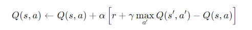

**[1][2] 예제 참고 => https://github.com/YangGuiBee/ML/blob/main/TextBook-13/TextBook_13.ipynb**

 

#  13 : 강화학습, 앙상블학습

| 구분  | 비지도학습 (Unsupervised Learning) | 지도학습 (Supervised Learning) | 강화학습 (Reinforcement Learning)    |
| ---- | --------------------------------- | ------------------------------------- | -------------------------------- |
| 핵심특징 | 탐색적 분석 | 예측 | 의사결정 최적화 |
| 목적  | 데이터의 숨겨진 패턴/구조 발견, 군집·차원축소| 입력(X) → 정답(y)의 매핑 함수 학습, 예측/분류/회귀 | 환경과 상호작용을 통해 최대 보상 행동 전략(policy) 학습                             |
| 정답 | 없음 | 있음 | 없음(보상 있음) |
| 데이터 제공방식 | 레이블(y) 없음  | 레이블(y) 제공 | 데이터가 아니라 환경(Environment) 제공 → 상태(State), 행동(Action), 보상(Reward) |
| 피드백 유형   | 없음(No explicit feedback)          | 정답과 비교하여 오차 기반 피드백 제공             | 행동 후 보상(Reward)이라는 지연된 피드백 제공                                   |
| 피드백 형태 | 없음 | 즉각 | 지연 보상 |
| 학습과정    | 데이터 간 유사성·구조를 스스로 찾음              | 손실 함수(Loss)를 최소화하도록 매개변수를 조정          | 탐험(Explore)과 활용(Exploit) 균형을 잡으며 보상 극대화                             |
| 학습대상 | 데이터 구조 | 입력 → 정답 | 행동 → 보상 |
| 학습방식 | 정적분석 | 손실최소 | 정책/가치 반복개선 |
| Output | 클러스터, 잠재 feature, 밀도 구조 | 예측값(회귀), 클래스(분류 확률), ŷ  | 최적 정책 π*(s), Q값, 행동 전략     |
| 적용분야 | 군집(K-means), 차원축소(PCA), 이상치 탐지    | 이미지 분류, 음성/자연어 처리, 수요 예측, 금융 리스크 모델   | 로봇 제어, 게임 AI, 자율주행, 광고 전략, 추천 시스템 최적화                               |

 

---

## 강화 학습(Reinforcement Learning, RL)

	[1] Model-free RL : Value Iteration
	테이블 기반
		(1-1) Q-Learning: 상태 공간에서 사용되는 표(Q-Table) 기반
		(1-2) SARSA(State Action Reward State Action)
	심층 기반
		(1-3) Q-Network: 신경망을 사용하여 Q-값을 근사화하는 모델
		(1-4) DQN(Deep Q-Network): 딥러닝을 활용한 Q-Learning의 발전된 형태
		(1-5) Double DQN: Q-Learning의 과대 평가 문제를 완화하기 위한 개선된 버전
		(1-6) Dueling DQN: 상태 가치와 행동의 중요도를 분리하여 Q-값을 계산하는 모델
		(1-7) DRQN(Deep Recurrent Q-Network): 순차적인 경험을 학습하기 위해 RNN 구조를 포함한 DQN
	분포 기반
		(1-8) C51(Categorical DQN 51): Q-값의 분포를 학습하는 DQN 확장
		(1-9) IQN(Implicit Quantile Networks): Q-값의 분포를 세밀하게 조정하는 방식
		(1-10) Rainbow: 여러 DQN 확장(PER, Double DQN, C51 등)을 결합한 통합 알고리즘
	소프트 기반
		(1-11) SQL(Soft Q-Learning): 엔트로피를 추가하여 Q값 학습을 안정화하는 방식
	리플레이/탐색 기반
		(1-12) PER(Prioritized Experience Replay): 중요한 경험을 우선적으로 학습하는 경험 리플레이 전략
		(1-13) HER(Hindsight Experience Replay): 목표 달성을 학습할 수 있도록 과거 경험을 재사용
		(1-14) NoisyNet: 신경망 가중치에 노이즈를 추가해 탐색 효율성을 높이는 방식

	[2] Model-free RL : Policy Iteration 
	기본 Policy Gradient 및 Actor-Critic 계열
		(2-1) REINFORCE: 정책 경사법의 기본 형태
		(2-2) Actor-Critic: 기본적인 Actor-Critic 구조, Policy Gradient와 Critic의 Q값 평가 결합
		(2-3) NAC(Natural Actor-Critic): Natural Gradient를 적용해 정책의 효율적 업데이트를 수행
	Advantage Actor-Critic 및 분산 학습 계열
		(2-4) A2C/A3C(Advantage Actor-Critic): 분산형 Actor-Critic 모델
		(2-5) ACER(Actor-Critic with Experience Replay): 경험 리플레이를 추가한 Actor-Critic 방법
		(2-6) IMPALA(Importance Weighted Actor-Learner Architecture): 분산 학습에 최적화된 구조
		(2-7) Off-PAC(Off-Policy Actor-Critic): 오프폴리시 데이터를 활용하는 Actor-Critic 기법
	신뢰 구간 기반 정책 최적화 계열
		(2-8) PPO(Proximal Policy Optimization): 신뢰 구간을 사용해 안정적으로 정책을 업데이트
		(2-9) TRPO(Trust Region Policy Optimization): 정책 급변을 방지하는 최적화 기법
	연속 행동 공간 최적화 계열 
		(2-10) DDPG(Deep Deterministic Policy Gradient): 연속적 행동 공간에서 학습
		(2-11) TD3(Twin Delayed DDPG): DDPG의 한계점을 극복하기 위한 개선된 모델
		(2-12) SAC(Soft Actor-Critic): 탐색과 활용의 균형을 유지하도록 설계된 정책 학습 모델
	전문가 시범 데이터 활용 계열 
		(2-13) BC(Behavioral Cloning): 데이터를 기반으로 정책을 모방하는 방식
		(2-14) DDPGfD(DDPG from Demonstrations): 전문가의 시범을 사용해 DDPG 성능을 개선
	
	[3] Model-based RL : Given the Model
		(3-1) Dyna-Q: 모델 기반 RL과 모델-프리 RL을 조합한 알고리즘
		(3-2) AlphaZero: 시뮬레이션을 통한 최적의 행동을 찾는 Monte Carlo Tree Search 기반 모델
	
 	[4] Model-based RL : Learn the Model
		(4-1) World Models: 환경을 모델링하고 시뮬레이션을 통해 학습
		(4-2) I2A(Imagination-Augmented Agents): 상상된 상태에서 정책을 훈련
		(4-3) MBMF(Model-Based Model-Free): 모델기반 접근과 모델-프리 접근을 혼합
		(4-4) MBVE(Model-Based Value Expansion): 모델을 학습 보조수단으로 에이전트가 환경에서 수집한 데이터로 학습
		(4-5) Dreamer: 에이전트가 환경 데이터를 수집하여 모델을 학습하고 이를 활용해 정책과 가치 함수를 학습
		(4-6) PlaNet: Dreamer의 전신
		(4-7) PETs(Probabilistic Ensembles with Trajectory Sampling): 확률적 모델 앙상블을 활용
		(4-8) MuZero: 알파고(AlphaGo) 시리즈의 발전된 형태(명시적 환경 모델 없이도 정책과 가치를 학습)

---  
 
## 앙상블 학습(Ensemble Learning, EL)
 

    [1] 보팅(Voting)
	[2] 배깅(Bagging)
    [3] 부스팅(Boosting) : AdaBoost, Gradient Boosting, XGBoost 
	[4] 스태킹(Stacking)

---  

# 강화 학습(Reinforcement Learning, RL)

 
(출처) https://github.com/YangGuiBee/ML/blob/main/TextBook-12/01_IntroductiontoReinforcementLearning.pdf 
 
시행착오(Trial and Error)를 통하여 실수와 보상을 통해 학습을 하여 목표를 찾아가는 알고리즘으로,  
어떤 환경 안에서 정의된 에이전트가 현재의 상태를 인식하여, 선택가능한 행동들 중 보상을 최대화하는 행동 혹은 행동순서를 선택하는 방법. 
기존의 알고리즘이 라벨(정답)이 있는 데이터를 통해서 가중치와 편향을 학습하는 것과 비슷하게  
보상(Reward)이라는 개념을 사용하여 가중치와 편향을 학습하는 것으로 목적은 최적의 행동양식 또는 정책을 학습. 
학습 중에 사람을 포함한 환경으로부터 피드백 지도를 받기 때문에 지도학습으로 분류되기도 하나,  
입출력 쌍으로 이루어진 훈련 집합이 제시되지 않으며, 잘못된 행동에 대해서도 명시적으로 정정이 일어나지 않는 등 
강화학습이 가지는 최적의 의사결정 프로세스가 정해진 레이블과 비교 판별식을 구하는 방식과는 구별되는 학습모델로 독립적으로 분류. 

 (출처) Deep Learning Bible(https://wikidocs.net/169311)
  
Agent 기계는 환경(Environment)으로부터 상태(state)를 관측(observation)하고 이에 다른 적절한 행동(action)을 하면 
이 행동을 기준으로 환경으로부터 보상(reward)을 받는 상호작용(관측→행동→보상)을 반복하면서 보상을 최대화하는 것이 목표  
[Chat GPT가 그린 그림] 

 
[Chat GPT가 찾은 그림] 

 

## [강화학습의 응용분야]  
**<ins>Richard S. Sutton, "Deconstructing Reinforcement Learning"(2009년 국제기계학습학회(ICML)에서 발표)</ins>** 

### (1) 프로세스 제어 (24%)
강화학습이 제조 및 공정 산업에서 시스템의 상태를 최적화 및 자동화함으로써 복잡한 변수를 실시간으로 제어하여 안정적이고 효율적인 작업  
**화학 공정 최적화:** MIT와 BASF는 강화학습을 사용해 화학반응 공정을 최적화하여 온도와 압력을 조정해 불순물 제거 효과를 극대화  
**발전소 운영 최적화:** 일본의 발전소에서는 강화학습을 통해 온도와 연료 혼합 비율을 실시간으로 조정하여 효율을 개선  
**산업용 보일러 제어:** 중국의 한 석유화학 공장에서는 강화학습 기반 제어 시스템을 도입해 보일러의 연료소비를 최적화  

### (2) 네트워크 관리 (21%)
트래픽 최적화, 자원 배분 등을 통해 네트워크 성능을 높이고 응답 시간을 줄이는 데 사용  
**클라우드 리소스 최적화:** Microsoft Azure는 강화학습을 사용하여 클라우드 리소스를 자동으로 할당하고 트래픽 패턴에 따라 서버를 확장  
**네트워크 트래픽 관리:** 중국의 Huawei는 강화학습을 사용해 5G 네트워크에서 실시간 트래픽 경로를 최적화  
**데이터센터 냉각 최적화:** 구글 데이터센터에서는 강화학습을 통해 냉각 시스템을 자동으로 제어하여 냉각 비용을 절감  

### (3) 자산 관리 (18%)
투자 포트폴리오 최적화와 리스크 관리를 통해 수익을 극대화하고 위험을 최소화  
**포트폴리오 최적화:** BlackRock은 강화학습을 사용해 자산 배분 전략을 자동화하여 수익증가를 이루고 시장 상황에 맞춰 빠르게 포트폴리오 조정  
**고빈도 트레이딩:** JPMorgan은 강화학습 기반 알고리즘을 통해 매수 및 매도 시점을 실시간으로 분석하여 고빈도 거래에서 성과 향상  
**보험 리스크 평가:** Progressive 보험사는 강화학습을 사용해 고객 리스크를 평가하여 손해율을 줄임으로써 고객에게 더 적합한 보험 상품을 제안  

### (4) 로보틱스 (13%)
로봇이 복잡한 환경에서 자율적으로 작업을 수행할 수 있도록 학습  
**로봇 팔 최적화:** KUKA Robotics는 강화학습을 통해 로봇 팔이 특정 작업을 정확하게 수행할 수 있도록 학습시켜 작업 시간과 오차율을 감소  
**자율 이동 로봇:** Amazon Robotics는 물류창고에서 자율이동 로봇의 경로 최적화를 달성해서 주문을 빠르게 처리  
**산업용 드론 제어:** Skydio는 드론이 강화학습을 통해 장애물을 회피하고 안전하게 이동할 수 있도록 개발  

### (5) 교통 (6%)
교통 흐름을 최적화하고, 자율 주행 차량의 경로를 조정하여 효율적인 교통 시스템을 구축하는 데 기여  
**교통 신호 최적화:** 도쿄는 강화학습을 사용해 주요 교차로의 교통 신호를 최적화하여 혼잡 시간을 단축  
**자율주행 차량 경로 계획:** Tesla는 강화학습을 통해 자율주행 차량이 복잡한 도로 환경에서 최적의 경로를 찾도록 학습시켜 주행 안전성을 향상  
**물류 경로 최적화:** FedEx는 배송 경로를 강화학습을 통해 최적화하여 운송 비용을 줄임으로써 운송 시간 단축과 연료 비용 절감에 크게 기여  

### (6) 자동 제어 (6%)
공장 자동화, 드론 제어 등의 분야에서 강화학습을 통해 복잡한 시스템을 자율적으로 제어  
**공장 자동화:** Siemens는 강화학습을 통해 공장 자동화 시스템을 최적화하여 생산성을 향상시키고, 에너지 소비를 절감  
**드론 내비게이션:** Parrot Drones는 강화학습을 통해 드론이 장애물을 회피하고 목표지점까지 안전하게 이동시켜서 드론의 충돌 위험을 감소  
**발전소 제어:** 한전(KEPCO)에서는 발전소에서 전력 공급을 강화학습을 통해 실시간 제어하여 전력 공급의 안정성을 높이고 비용을 절감  

### (7) 금융 (4%)
시장 예측, 거래 전략, 리스크 관리 등에서 성능을 높이는 데 강화학습이 중요한 역할  
**알고리즘 트레이딩:** Goldman Sachs는 강화학습을 이용해 고빈도 거래에서 수익률을 개선  
**신용 리스크 평가:** 강화학습을 통해 고객의 신용 점수를 예측하여, 대출 승인율을 높이면서 부실 채권 비율을 줄이는 성과  
**외환 거래 전략:** Citibank는 강화학습을 통해 외환 거래에서 최적의 매수/매도 타이밍을 학습하여 수익률 향상을 달성 

### (8) 기타(8%)
**스포츠 전략 및 선수 훈련:** 축구, 농구, 미식축구 등의 스포츠에서 선수의 최적의 움직임이나 팀 전략 분석에 사용  
DeepMind의 축구 AI: Google DeepMind는 축구 선수들의 최적의 움직임과 전략을 학습하여 경기에서 다양한 전략을 실시간으로 테스트  
농구 슛 트레이닝: 강화학습을 이용해 농구 선수의 슛 성공률을 높이기 위한 최적의 각도, 속도 등을 학습시키는 연구  
**교육 기술 (EdTech):** 학생의 학습 속도, 이해도 등에 따라 적절한 학습 경로를 제공하여 효과적인 학습 환경을 조성  
개인화 학습 경로 제공: EdTech는 학생이 문제에서 반복적으로 오답을 낼 경우, 해당 개념과 관련된 기초 문제를 더 제공하여 학습  
퀴즈 최적화: Duolingo와 같은 교육 플랫폼에서는 사용자 학습을 추적하고, 강화학습으로 최적의 퀴즈를 추천해 학습자에게 맞춘 학습 경험 제공  
**스마트 시티 (Smart City):** 교통 신호 제어, 에너지 관리, 공공 서비스 배치 등을 최적화하여 시민들에게 더 나은 환경을 제공  
교통 혼잡 완화: 싱가포르에서는 교차로에서 차량의 흐름을 분석하여 신호주기 조정을 통해 교통신호를 최적화하여 교통흐름 개선  
에너지 관리: 스마트 그리드에서 강화학습을 통해 전력 수요를 예측하고 에너지 소비를 최적화하는 방안을 연구 중  
**재난 대응 및 구조:** 위험 지역에 들어가기 전에 최적의 경로를 미리 학습하거나 로봇을 활용한 구조 활동에 활용  
로봇 구조 임무: 재난 상황에서 로봇이 피해자에게 빠르게 접근할 수 있도록 강화학습을 이용해 장애물을 피하고 최단 경로를 탐색  
드론을 통한 감시 및 탐색: 강화학습을 통해 드론이 재난 지역을 감시하고 구조 가능한 위치를 탐색하는 데 필요한 비행 경로를 학습  
**스마트 농업:** 작물 관리, 관개 시스템 조절, 병충해 방제 등 농업 생산성을 향상시키는 다양한 기술  
작물 성장 최적화: 강화학습을 통해 온도, 습도, 조명 등을 자동제어로 조절해 최적의 작물 성장 조건을 유지하는 기술 개발  
농기계 경로 최적화: 자율주행 농기계가 강화학습을 통해 농지 내에서 최적의 경로를 학습하여 연료 소비와 시간을 절감  

**<ins>Richard S. Sutton, "Deconstructing Reinforcement Learning"(2009년 국제기계학습학회(ICML)에서 발표)</ins>** 

	(1위) 프로세스 제어 (24%)
	(2위) 네트워크 관리 (21%)
	(3위) 자산 관리 (18%)
	(4위) 로보틱스 (13%)
	(5위) 교통 (6%)
	(6위) 자동 제어 (6%)
	(7위) 금융 (4%)
	(8위) 기타(8%)

 
	
**<ins>D. Zhang 외, "A survey on applications of reinforcement learning in spatial resource allocation"(2024)</ins>** 

	(1위) 로보틱스 / 자율제어 / 자율주행 (25-30%)
	(2위) 산업 시스템 제어 / 제조 프로세스 최적화 (25-30%)
	(3위) 네트워크・통신・클라우드 관리 (10-15%)
	(4위) 교통 / 스마트 인프라 관리 (8-12%)
	(5위) 금융・자산 관리 / 알고리즘 트레이딩 (8-10%)
	(6위) 추천 시스템・소프트웨어 엔지니어링 / 기타 IT 분야 (8-10%)
	(7위) 헬스케어・의료영상・제약 (5-8%)

## [강화학습의 연구]  

강화학습에 영향을 끼친 학문분야는 인공지능 외에도 행동심리학, 신경과학, 제어이론, 운용과학 등이 있으며,  
이 중 가장 근간이 되는 학문이 **행동심리학(Behavioral Psychology)**
 미국의 심리학자 에드워드 손다이크(Edward Thorndike): 1911년 동물이 어떤 행동을 선택할 때는 강화된 사건(reinforced event)에 영향을 받는 
시행착오(Trial and Error)의 효과의 법칙(Law of Effect) 발표 
프린스턴대학의 마빈 민스키(Marvin Minsky): 1954년 아날로그 컴퓨터인 SNARC(Stochastic Neural Analog Reinforcement Calculator)을 설계하여  
쥐의 미로찾기 시뮬레이션을 개발함으로써 행동심리학 이론을 처음으로 컴퓨터공학에 적용 

    마빈 민스키(Marvin Minsky)의 1960년 논문 "Steps Toward Artificial Intelligence"
    초기 인공지능(AI) 연구에 큰 영향을 미친 중요한 문헌으로, 
	AI가 해결해야 할 문제와 이를 위해 필요한 접근 방식에 대한 체계적인 개요를 제시.
    인공지능 연구가 다루어야 할 주요 문제들을 분류하고, 각 문제를 해결하기 위한 방법론을 제안

    (1) 지능의 구성 요소: 지능이 다양한 기능과 능력의 집합이라고 보고, 
	    인공지능을 실현하기 위해 문제 해결, 학습, 패턴 인식, 언어 처리 등의 하위 기능으로 분류
    (2) 문제해결 및 탐색: AI가 문제를 해결하는 데 있어 필요한 효과적인 탐색(search) 전략을 위해 
	    다양한 탐색 알고리즘과 휴리스틱(heuristics)을 제안
    (3) 패턴 인식: 인간의 지능은 많은 부분 패턴 인식 능력에 의존하는데, 컴퓨터가 유사한 방식으로 
	    이미지, 소리, 형태 등의 패턴을 인식하도록 학습시키는 방법으로 확률과 통계적 기법이 유용
    (4) 학습: 인공지능이 환경에 적응하고 스스로 개선할 수 있는 중요한 요소로 기계 학습이 필요하며 
	    강화 학습, 지도 학습과 같은 개념을 언급
    (5) 추론 및 의미: 단순히 기호를 조작하는 것 이상의 기호적 추론과 의미론적 이해의 중요성을 설명
    (6) 미래 전망: AI 연구가 나아가야 할 방향과 그 가능성을 제시, AI가 다양한 분야에서 응용될 수 있을 것이라고 예측

(출처) https://github.com/YangGuiBee/ML/blob/main/TextBook-12/STAI.pdf
 

강화학습의 초점은 학습 과정에서의(on-line) 성능이며, 이는 탐험(exploration)과 활용(exploitation)의 균형을 맞춤으로써 제고 
**탐험(exploration):** 에이전트가 새로운 행동을 시도하거나 덜 알려진 상태-행동 공간을 탐험하는 과정으로,  
       환경의 미지의 정보를 수집하여 학습 데이터를 풍부하게 하고 더 나은 장기적인 정책을 학습 
**활용(exploitation):** 에이전트가 현재까지 학습한 정보를 활용하여 최대 보상을 얻는 행동을 선택하는 과정으로, 
       현재 정책을 최대한 활용해 즉각적인 보상을 극대화 

	제임스 마치(James G. March)의 정의("Exploration and Exploitation in Organizational Learning", 1991) 
	탐험(exploration): 탐색(search), 다양화(variation), 위험감수(risk taking), 실험(experimentation),  
						놀이(play), 유연성(flexibility), 새로운 발견(discovery), 혁신(innovation) 등의 의미 
	활용(exploitation): 기억(memory), 정교화(refinement), 선택(selection, choice), 생산(production),  
						효율(efficiency), 구현(implementation), 실행(execution) 등의 의미 
  
미국의 수학자 리처드 벨만(Richard Bellman)은 불연속적인 시간문제에 대해 **MDP(Markov Decision Process)**를 기반으로  
동적시스템(dynamic system)에서 시간의 흐름에 따라 각 과정별 최적의 의사결정을 수행하는 최적제어(optimal control) 이론을 도입 
1980년대말까지는 리처드 벨만이 제안한 최적가치함수(optimal value function) 기반의 동적 프로그래밍(dynamic programming)과  
확률적인 시뮬레이션을 통해 의사결정을 내리는 몬테카를로 방법(Monte Carlo method)이 주류를 구성 
1988년 리차드 서튼(Richard Sutton)이 발표한 시간차 방법 TD(Temporal Difference learning method)이 이 두가지를 결합하면서  
지금까지 가장 많이 인용되는 알고리즘으로 자리매김함 

## [강화학습의 프레임워크, MDP(Markov Decision Process)]
마코프 특성(Markov Property)을 기반으로 하는 의사결정 프로세스 
$P[S_{t+1} | S_t] = P[S_{t+1} | S_1, ..., S_t]$ 
$S_t$는 시간 t에서의 상태, 과거 상태 $[S_1, ..., S_t]$ 모두를 고려했을 때, 상태 $S_{t+1}$의 확률과 상태 $S_t$만을 고려했을때 상태 $S_{t+1}$의 확률은 동일 
다음 상태는 과거의 사건과 무관하며 지금 취할 행동에 영향을 주는 것은 과거가 아니라 미래의 상태와 그에 따른 보상(memoryless process) 

 
(상태변이확률 행렬) 

 

시나리오1 : 알바→공부→수업→휴강→취침 
시나리오2 : 알바→SNS→SNS→알바→공부→취침 
시나리오3 : 알바→공부→수업→카페→공부→수업→휴강→취침 
시나리오4 : 알바→SNS→SNS→알바→공부→수업→카페→알바→SNS→SNS→알바→공부→수업→카페→공부→취침 

시나리오1 : $-2 –2×0.5 –2×0.5^2 + 10×0.5^3 = -2.25$ 
시나리오2 : $-2 –1×0.5 –1×0.5^2 –2×0.5^3 –2×0.5^4 = -3.125$ 
시나리오3 : $-2 –2×0.5 –2×0.5^2 +1×0.5^3 –2×0.5^4 –2×0.5^5 +10×0.5^6 = -3.406$ 
시나리오4 : $-2 –1×0.5 –1×0.5^2 –2×0.5^3 –2×0.5^4 –2×0.5^5 +1×0.5^6$  
            $-2×0.5^7 –1×0.5^8 –1×0.5^9 –2×0.5^{10} –2×0.5^{11} –2×0.5^{12} +1×0.5^{13} –2×0.5^{14} = -3.197$ 

(상태가치함수 계산의 일반화: 벨만방정식) 

 

**DavidSilver의 Reinforcement Learning 강의교재** 

	Lecture 1: Introduction to Reinforcement Learning
	Lecture 2: Markov Decision Processes
	Lecture 3: Planning by Dynamic Programming
	Lecture 4: Model-Free Prediction
	Lecture 5: Model-Free Control
	Lecture 6: Value Function Approximation
	Lecture 7: Policy Gradient Methods
	Lecture 8: Integrating Learning and Planning
	Lecture 9: Exploration and Exploitation
	Lecture 10: Case Study: RL in Classic Games

(출처) https://www.davidsilver.uk/teaching/ 

	▣ 항목 설명
	Agent : 행동을 실행하고 관측을 받아서 스칼라 보상 받기
	Environment : 행동을 입력 받아서 관측을 출력하고 스칼라 보상을 출력
	𝑡는 환경 단계가 진행될 때 증가
	히스토리(history) : 관측, 행동, 보상의 시퀀스
	상태(state) : 이후에 발생할 일을 결정하는 데 사용되는 정보
	정책(Policy): 에이전트의 행동 함수
	가치 함수(Value function): 각 상태 또는 행동이 얼마나 좋은지 평가
	모델(Model): 환경에 대한 에이전트의 표현

 	▣ 강화학습(Reinforcement Learning)의 특징 
	감독자(Supervisor)가 없고, 오직 보상 신호만 존재
	피드백이 즉각적이지 않고 지연
	시간이 중요(순차적이며, 비독립적이고 비동일 분포(i.i.d) 데이터)
	에이전트의 행동이 이후에 받는 데이터에 영향

	▣ 강화학습(Reinforcement Learning)의 예제
	헬리콥터로 묘기 비행을 수행하기 : 원하는 경로를 따라가는 경우 긍정적 보상(+), 추락하는 경우 부정적 보상(-)
	Backgammon에서 세계 챔피언을 이기기 : 게임에서 승리하면 긍정적 보상(+), 게임에서 패배하면 부정적 보상(-)
	투자 포트폴리오 관리하기 : 은행 계좌에 돈이 증가하면 긍정적 보상(+)
	발전소 제어하기 : 전력을 생산하면 긍정적 보상(+), 안전 기준을 초과하면 부정적 보상(-)
	인간형 로봇을 걷게 만들기 : 앞으로 이동하면 긍정적 보상(+), 넘어지면 부정적 보상(-)
	다양한 아타리(Atari) 게임을 인간보다 더 잘 플레이하기 : 점수가 증가하면 긍정적 보상(+), 점수가 감소하면 부정적 보상(-)

	▣ 강화학습(Reinforcement Learning)의 보상(reward) 
	𝑅_𝑡는 스칼라 형태의 피드백 신호
	이는 에이전트가 𝑡 단계에서 얼마나 잘하고 있는지를 나타냄
	에이전트의 목표는 누적 보상을 최대화하는 것
	보상 가설(Reward Hypothesis) : 모든 목표는 기대 누적 보상의 극대화로 설명
	다만, 보상은 지연될 수 있다
	
---

**Model-Free Algorithm**
Model-Based와 달리 환경(Environment)을 모르는 상태에서 직접 수행 
에이전트(Agent)가 행동을 통해 보상 합의 기대값을 최대로 하는 Policy Function을 탐색 
환경에 대해 알지 못하고, 다음의 상태와 보상을 수동적으로 행동하여 취득 
환경 파악을 위해서 탐사(Exploration) 
탐사는 시행착오(Trial and Error)를 통해서 Policy Function을 점차적으로 학습 

**Model-Based Algorithm**
환경(Environment)에 대한 모든 설명(Description)을 알고 문제를 푸는 방법 
직접 행동을 하지 않고, 최적의 솔루션을 탐색 
모델은 상태(State)와 행동(Action)을 받아서 다음 상태와 보상을 예측 
모델은 Planning에 사용되며, 경험 전에 가능한 미래 상황을 고려하여 행동을 예측 
모델과 Planning을 사용하여 해결하는 방식 

 

 

# [1-1] Model-free RL : Value Iteration

	테이블 기반
		(1-1) Q-Learning: 작은 상태 공간에서 사용되는 표(Q-Table) 기반
		(1-2) SARSA(State Action Reward State Action)
	심층 기반
		(1-3) Q-Network: 신경망을 사용하여 Q-값을 근사화하는 모델
		(1-4) DQN(Deep Q-Network): 딥러닝을 활용한 Q-Learning의 발전된 형태
		(1-5) Double DQN: Q-Learning의 과대 평가 문제를 완화하기 위한 개선된 버전
		(1-6) Dueling DQN: 상태 가치와 행동의 중요도를 분리하여 Q-값을 계산하는 모델
		(1-7) DRQN(Deep Recurrent Q-Network): 순차적인 경험을 학습하기 위해 RNN 구조를 포함한 DQN
	분포 기반
		(1-8) C51(Categorical DQN 51): Q-값의 분포를 학습하는 DQN 확장
		(1-9) IQN(Implicit Quantile Networks): Q-값의 분포를 세밀하게 조정하는 방식
		(1-10) Rainbow: 여러 DQN 확장(PER, Double DQN, C51 등)을 결합한 통합 알고리즘
	소프트 기반
		(1-11) SQL(Soft Q-Learning): 엔트로피를 추가하여 Q값 학습을 안정화하는 방식
	리플레이/탐색 기반
		(1-12) PER(Prioritized Experience Replay): 중요한 경험을 우선적으로 학습하는 경험 리플레이 전략
		(1-13) HER(Hindsight Experience Replay): 목표 달성을 학습할 수 있도록 과거 경험을 재사용
		(1-14) NoisyNet: 신경망 가중치에 노이즈를 추가해 탐색 효율성을 높이는 방식
		

## (1-1) Q-Learning : 상태 공간에서 사용되는 표(Q-Table) 기반

 (출처) Deep Learning Bible(https://wikidocs.net/169311)

▣ 정의 : 값 기반 강화 학습의 대표적인 알고리즘으로, 상태-행동 쌍에 대한 Q값을 학습해 최적의 정책을 찾는 방법.  
상태에서 어떤 행동을 선택할지 결정하는 Q함수를 학습하며, 최적 정책을 따르기 위해 Q값을 최대화하는 방향으로 행동 
▣ 필요성 : 모델에 대한 사전 지식 없이 환경 내에서 에이전트가 스스로 학습할 수 있는 능력을 제공하며, 상태 공간이 클 때도 적합하게 사용 
▣ 장점 : 모델 프리 방식이라 환경의 동작을 미리 알 필요가 없으며, 수렴할 경우 최적의 정책을 보장 
▣ 단점 : 상태 공간이 매우 크거나 연속적인 경우, Q-table이 메모리와 시간 측면에서 비효율적일 수 있으며, 
학습 속도가 느리고, 보상이 주기적으로만 주어지는 경우 최적의 정책을 찾기 어려울 수 있다. 
▣ 모델식 : Q-learning 업데이트식으로 Q(s,a)는 상태 𝑠에서 행동 𝑎를 선택할 때의 Q값,  
α는 학습률, 𝛾는 할인 계수,𝑟은 현재 보상, max_𝑎′𝑄(𝑠′,𝑎′)는 다음 상태 𝑠′ 에서 가능한 최대 Q값. 

 
▣ 응용분야 : 게임 플레이, 로봇 제어, 자율 주행, 네트워크 트래픽 제어 등 
▣ 예제 : https://www.gymlibrary.dev/tutorials/rl_basics/q_learning/ 
▣ 캐글사례 : https://www.kaggle.com/code/kanncaa1/q-learning-tutorial-with-frozen-lake 
제목: Q-Learning Frozen Lake Tutorial 
특징: Q-테이블 기반 정책 학습, ε-greedy 탐색 사용 
독립변수(X): 상태(state, 0~15) 
종속변수(y): 행동에 대한 Q값(action-value), 최적 행동정책 

 

	import numpy as np
	
	# ======================================
	# 0. 난수 시드 고정 (항상 동일한 결과 보장)
	# ======================================
	np.random.seed(42)
	
	# ======================================
	# 1. 환경 설정 (1차원 선형 월드)
	# ======================================
	n_states = 5     # 상태(State) 개수: 0,1,2,3,4 (4가 목표 상태)
	n_actions = 2    # 행동(Action) 개수: 0=왼쪽, 1=오른쪽
	
	# 상태 전이 및 보상 함수
	def step(state, action):
	    # 행동이 0이면 왼쪽으로 이동, 1이면 오른쪽으로 이동
	    if action == 0:
	        next_state = max(0, state - 1)              # 왼쪽 끝(0) 이하로 내려가지 않게 처리
	    else:
	        next_state = min(n_states - 1, state + 1)   # 오른쪽 끝(4) 이상으로 올라가지 않게 처리
	
	    # 목표 상태(4)에 도달한 경우 보상 +1, 그 외에는 -0.01 패널티
	    if next_state == n_states - 1:
	        reward = 1.0
	        done = True                                 # 목표 도달 → 에피소드 종료
	    else:
	        reward = -0.01                              # 빨리 도달하도록 작은 음수 보상
	        done = False
	
	    return next_state, reward, done                 # 다음 상태, 보상, 종료 여부 반환
		
	# 초기 상태 반환 함수
	def reset():
	    return 0                                        # 항상 state 0에서 에피소드 시작
	
	
	# ======================================
	# 2. Q-Learning 하이퍼파라미터 설정
	# ======================================
	alpha = 0.1         # 학습률 (Learning Rate)
	gamma = 0.9         # 할인율 (Discount Factor)
	epsilon = 1.0       # 초기 탐험 확률 (ε-greedy에서 ε)
	epsilon_min = 0.05  # 탐험 최소값
	epsilon_decay = 0.995  # 에피소드마다 ε 감소율
	
	n_episodes = 500    # 총 학습 반복(에피소드) 횟수
	max_steps = 20      # 한 에피소드에서 최대 step (무한 루프 방지용)
	
	# Q-테이블 초기화: 모든 상태-행동 쌍을 0으로 시작
	Q = np.zeros((n_states, n_actions))
	
	
	# ======================================
	# 3. ε-greedy 행동 선택 함수
	# ======================================
	def choose_action(state, epsilon):
	    # 일정 확률 ε로 탐험(랜덤 행동 선택)
	    if np.random.rand() < epsilon:
	        return np.random.randint(n_actions)
	    # 나머지 확률로 현재 Q값이 가장 큰 행동 선택 (exploitation)
	    return np.argmax(Q[state])
	
	
	# ======================================
	# 4. Q-Learning 학습 루프
	# ======================================
	reward_history = []     # 에피소드별 총 보상을 저장할 리스트
	
	print("=== 1차원 선형 월드에서의 Q-Learning 학습 시작 ===")
	
	# 전체 에피소드 반복
	for episode in range(1, n_episodes + 1):
	
	    state = reset()     # 매 에피소드마다 초기 상태로 리셋
	    total_reward = 0.0  # 에피소드 누적 보상 초기화
	
	    # 한 에피소드 안에서 반복
	    for step_idx in range(max_steps):
	
	        # 1) ε-greedy 정책으로 행동 선택
	        action = choose_action(state, epsilon)
	
	        # 2) 환경에 행동 적용 → 다음 상태, 보상, 종료 여부 반환
	        next_state, reward, done = step(state, action)
	
	        # 3) Q(s,a) 업데이트
	        #    TD Target = r + γ * max(Q(s', a'))
	        best_next_Q = np.max(Q[next_state])                 # 다음 상태에서의 최대 Q
	        td_target = reward + gamma * best_next_Q            # TD Target 계산
	        td_error = td_target - Q[state, action]             # TD Error 계산
	        Q[state, action] += alpha * td_error                # 학습률 α 반영하여 업데이트
	
	        # 4) 보상 누적
	        total_reward += reward
	
	        # 5) 상태 업데이트
	        state = next_state
	
	        # 종료 상태이면 반복 중단
	        if done:
	            break
	
	    # ε 감소 (탐험 → 이용 비중 증가)
	    epsilon = max(epsilon_min, epsilon * epsilon_decay)
	
	    reward_history.append(total_reward)
	
	    # 50에피소드마다 최근 50개 평균 보상 출력
	    if episode % 50 == 0:
	        avg_reward = np.mean(reward_history[-50:])
	        print(f"[Episode {episode:4d}] 최근 50 에피소드 평균 리워드 = {avg_reward:.3f},  epsilon = {epsilon:.3f}")
	
	print("\n=== 학습 종료 ===\n")
	
	
	# ======================================
	# 5. 학습된 Q테이블 출력
	# ======================================
	print("▶ 최종 Q-테이블 (행: 상태, 열: 행동[왼쪽, 오른쪽])")
	for s in range(n_states):
	    print(f"상태 {s}: {Q[s]}")
	
	
	# ======================================
	# 6. 학습된 최적 정책 출력
	# ======================================
	action_symbols = {0: "←", 1: "→"}    # 행동을 화살표로 표시
	
	print("\n▶ 학습된 정책(Policy)")
	
	policy_str = ""
	for s in range(n_states):
	    if s == n_states - 1:            # 마지막 상태는 Goal
	        policy_str += " G "
	    else:
	        best_a = np.argmax(Q[s])     # 각 상태에서 Q값이 가장 큰 행동 선택
	        policy_str += f" {action_symbols[best_a]} "
	
	print("상태 0  1  2  3  4")
	print("     " + policy_str)
	
	
	# ======================================
	# 7. 학습 결과 테스트 실행 (탐험 없이 greedy만)
	# ======================================
	print("\n▶ 학습된 정책으로 1회 에피소드 실행 예시")
	
	state = reset()               # 초기 상태
	trajectory = [state]          # 방문한 상태 기록
	
	for step_idx in range(max_steps):
	    action = np.argmax(Q[state])               # 탐험 없이 항상 최적 행동
	    next_state, reward, done = step(state, action)
	    trajectory.append(next_state)
	    state = next_state
	    if done:
	        break
	
	print("방문한 상태들:", trajectory)
	print("스텝 수:", len(trajectory)-1)
	print("마지막 상태가 목표(4)면 학습 성공!")

 

	=== 1차원 선형 월드에서의 Q-Learning 학습 시작 === 
	[Episode   50] 최근 50 에피소드 평균 리워드 = 0.601,  epsilon = 0.778
	[Episode  100] 최근 50 에피소드 평균 리워드 = 0.860,  epsilon = 0.606
	[Episode  150] 최근 50 에피소드 평균 리워드 = 0.918,  epsilon = 0.471
	[Episode  200] 최근 50 에피소드 평균 리워드 = 0.946,  epsilon = 0.367
	[Episode  250] 최근 50 에피소드 평균 리워드 = 0.953,  epsilon = 0.286
	[Episode  300] 최근 50 에피소드 평균 리워드 = 0.956,  epsilon = 0.222
	[Episode  350] 최근 50 에피소드 평균 리워드 = 0.961,  epsilon = 0.173
	[Episode  400] 최근 50 에피소드 평균 리워드 = 0.965,  epsilon = 0.135
	[Episode  450] 최근 50 에피소드 평균 리워드 = 0.964,  epsilon = 0.105
	[Episode  500] 최근 50 에피소드 평균 리워드 = 0.965,  epsilon = 0.082
	
	=== 학습 종료 ===
	
	▶ 최종 Q-테이블 (행: 상태, 열: 행동[왼쪽, 오른쪽])
	상태 0: [0.62170412 0.7019    ]
	상태 1: [0.62170963 0.791     ]
	상태 2: [0.70189422 0.89      ]
	상태 3: [0.79099209 1.        ]
	상태 4: [0. 0.]
	
	▶ 학습된 정책(Policy)
	상태 0  1  2  3  4
	      →  →  →  →  G 
	
	▶ 학습된 정책으로 1회 에피소드 실행 예시
	방문한 상태들: [0, 1, 2, 3, 4]
	스텝 수: 4
	마지막 상태가 목표(4)면 학습 성공!

 

	에피소드 진행에 따라 평균 리워드가 증가하고 있다 → 학습이 잘 되고 있다
	ε(epsilon)이 감소할수록 탐험이 줄고 최적 행동을 더 많이 선택
	평균 리워드가 0.96 정도로 수렴 → 96% 이상 에피소드에서 목표 도달 성공
	Q-테이블의 상태값 : 왼쪽이동과 오른쪽이동의 보상값비교
	탐험 없이 greedy 방식으로도 완벽히 성공
	Q-Learning이 완전히 성공적으로 수렴

 

## (1-2) SARSA(State-Action-Reward-State-Action)

| 항목        | Q-Learning        | SARSA           |
| --------- | ----------------- | --------------- |
| 학습 방식     | Off-policy        | On-policy       |
| TD Target | r + γ max Q(s′,·) | r + γ Q(s′, a′) |
| Q값        | 더 큼 (낙관적)         | 더 작음 (보수적)      |
| 수렴 속도     | 빠른 경향             | 조금 느림           |
| 위험 행동     | 과감하게 선택           | 안정적인 경로 선택      |
| 정책        | 동일하게 최적 정책 도달     | 동일              |
| 테스트 결과    | 동일                | 동일              |
| 평균 리워드    | 거의 동일             | 거의 동일           |
| 적용 분야    | 게임 AI (단순 보상 구조) 시뮬레이터 기반 최적 경로 탐색 광고 추천/콘텐츠 추천 금융 트레이딩 시 Off-policy로 학습할 때 통신망 라우팅 정책 연구 | 이동 로봇이 절벽/낭떠러지/충돌 위험이 있는 경우 강화학습 기반 자율주행(충돌 리스크가 큼) HRL(Hierarchical RL)에서 하위 정책이 불확실한 환경 공정 제어(제어 행동의 실수가 큰 비용 초래) 로봇 팔 조작(작은 실수가 큰 문제 발생 가능) |

TD(Temporal Difference) : 현재 상태에서 받은 보상(immediate reward)과 한 스텝 이후의 가치(future value estimate)의 차이(difference)를 이용해서서 Q값이나 V값을 업데이트하는 방식 

▣ 정의 : 상태-행동-보상-다음 상태-다음 행동(State-Action-Reward-State-Action)의 연속적인 관계에서 학습하는 방법. 
Q-learning과 달리 SARSA는 에이전트가 선택한 행동을 기반으로 학습하며 에이전트가 현재 행동과 다음 행동을 통해 학습하는 on-policy 방법 
▣ 필요성 : 정책을 미리 고정한 상태에서 Q-learning처럼 탐험과 학습을 분리하지 않고, 정책을 유지하며 학습할 때 유리. 
실제로 에이전트가 수행하는 행동을 기반으로 학습하므로, 정책에 따른 일관성을 유지. 특히 탐험(exploration) 중에도 안정적으로 학습 
▣ 장점 : 에이전트의 실제 정책을 기반으로 학습하므로 정책의 일관성을 유지할 수 있으며, Q-learning보다 안정적인 성능 
▣ 단점 : Q-learning보다 수렴 속도가 느릴 수 있으며, 잘못된 정책을 사용할 경우 학습 성능이 떨어질 수 있다. 
▣ 모델식 : SARSA 업데이트 식, Q(s,a)는 상태 𝑠에서 행동 𝑎를 선택할 때의 Q값, 𝑎′ 는 다음 상태에서 선택 
.PNG)
 
▣ 응용분야 : 게임, 로봇 제어, 자율 시스템, 물류 최적화 
▣ 예제 : https://www.gymlibrary.dev/tutorials/rl_basics/sarsa/ 
▣ 캐글사례 : https://www.kaggle.com/code/faressayah/sarsa-vs-q-learning 
제목: SARSA와 Q-learning 정책 비교 
특징: 온정책(SARSA) vs 오프정책(Q-learning) 성능 비교 
독립변수(X): 상태 
종속변수(y): SARSA의 Q(s,a) 업데이트 값 

 

	import numpy as np
	
	# 난수 시드 고정 (결과 재현성 보장)
	np.random.seed(42)
	
	# ======================================
	# 1. 환경 설정 (1차원 선형 월드)
	# ======================================
	n_states = 5     # 상태: 0,1,2,3,4 (4가 목표 상태)
	n_actions = 2    # 행동: 0=왼쪽, 1=오른쪽
	
	def step(state, action):
	    # 행동이 0이면 왼쪽으로 이동
	    if action == 0:
	        next_state = max(0, state - 1)              # 왼쪽 끝 이하로 못 가게 처리
	    # 행동이 1이면 오른쪽으로 이동
	    else:
	        next_state = min(n_states - 1, state + 1)   # 오른쪽 끝 이상으로 못 가게 처리
	    
	    # 목표 상태에 도달하면 보상 +1
	    if next_state == n_states - 1:
	        reward = 1.0
	        done = True                                 # 목표 도달 → 종료
	    # 그 외에는 작은 패널티
	    else:
	        reward = -0.01
	        done = False
	
	    return next_state, reward, done
	
	def reset():
	    # 매 에피소드 시작 상태는 항상 0
	    return 0
	
	
	# ======================================
	# 2. SARSA 하이퍼파라미터 설정
	# ======================================
	alpha = 0.1         # 학습률
	gamma = 0.9         # 할인율
	epsilon = 1.0       # 탐험 비율 시작값 (ε-greedy)
	epsilon_min = 0.05  # 최소 탐험값
	epsilon_decay = 0.995  # 탐험 감소 비율
	
	n_episodes = 500    # 학습 에피소드 수
	max_steps = 20      # 한 에피소드에서 최대 스텝 수
	
	# Q 테이블 초기화 (상태 × 행동)
	Q = np.zeros((n_states, n_actions))
	
	
	# ======================================
	# 3. ε-greedy 행동 선택 함수
	# ======================================
	def choose_action(state, epsilon):
	    # ε 확률로 탐험
	    if np.random.rand() < epsilon:
	        return np.random.randint(n_actions)
	    # 1-ε 확률로 현재 Q가 가장 큰 행동 선택
	    return np.argmax(Q[state])
	
	
	# ======================================
	# 4. SARSA 학습 루프
	#    (On-policy: TD Target에 실제 다음 행동 a' 를 사용)
	# ======================================
	reward_history = []
	
	print("=== 1차원 선형 월드에서의 SARSA 학습 시작 ===")
	
	for episode in range(1, n_episodes + 1):
	
	    # (1) 에피소드 시작: 상태 초기화
	    state = reset()
	    total_reward = 0.0
	
	    # (2) 초기 상태에서 첫 행동 선택 (SARSA는 s,a 쌍으로 시작)
	    action = choose_action(state, epsilon)
	
	    for step_idx in range(max_steps):
	        
	        # (3) 현재 상태 s 에서 행동 a 수행
	        next_state, reward, done = step(state, action)
	        
	        # (4) 다음 상태 s' 에서 다음 행동 a' 선택 (ε-greedy)
	        #     SARSA의 핵심: 여기서도 같은 정책(ε-greedy)을 사용
	        if not done:
	            next_action = choose_action(next_state, epsilon)
	        else:
	            next_action = None  # 종료 상태에서는 의미 없음
	        
	        # (5) SARSA TD Target 계산
	        #     - done 이면 다음 상태의 Q는 0
	        #     - 아니면 Q(s', a') 사용
	        if done:
	            td_target = reward                         # 마지막 상태 → 미래 보상 없음
	        else:
	            td_target = reward + gamma * Q[next_state, next_action]
	        
	        # (6) TD Error 및 Q 업데이트
	        td_error = td_target - Q[state, action]
	        Q[state, action] += alpha * td_error
	        
	        # (7) 보상 누적
	        total_reward += reward
	        
	        # (8) 상태와 행동을 다음 시점으로 이동
	        state = next_state
	        action = next_action if not done else action  # done이면 action은 더 안 쓰지만 형식상 유지
	        
	        # (9) 종료 상태면 에피소드 정리
	        if done:
	            break
	
	    # (10) 에피소드 종료 후 ε 감소
	    epsilon = max(epsilon_min, epsilon * epsilon_decay)
	
	    reward_history.append(total_reward)
	
	    # 50 에피소드마다 로그 출력
	    if episode % 50 == 0:
	        avg_reward = np.mean(reward_history[-50:])
	        print(f"[Episode {episode:4d}] 최근 50 에피소드 평균 리워드 = {avg_reward:.3f}, epsilon = {epsilon:.3f}")
	
	print("\n=== 학습 종료 ===\n")
	
	
	# ======================================
	# 5. 학습된 Q-테이블 출력
	# ======================================
	print("▶ 최종 Q-테이블 (행: 상태, 열: 행동[←,→])")
	for s in range(n_states):
	    print(f"상태 {s}: {Q[s]}")
	
	
	# ======================================
	# 6. 학습된 정책 출력
	# ======================================
	action_symbols = {0: "←", 1: "→"}
	
	print("\n▶ 학습된 정책(Policy)")
	
	policy_str = ""
	for s in range(n_states):
	    if s == n_states - 1:
	        policy_str += " G "
	    else:
	        best_a = np.argmax(Q[s])
	        policy_str += f" {action_symbols[best_a]} "
	
	print("상태 0  1  2  3  4")
	print("     " + policy_str)
	
	
	# ======================================
	# 7. 학습된 정책으로 1회 테스트 실행 (탐험 없이 greedy만)
	# ======================================
	print("\n▶ 학습된 정책으로 1회 에피소드 실행 예시")
	
	state = reset()
	trajectory = [state]
	
	for step_idx in range(max_steps):
	
	    # 테스트에서는 탐험 없이 항상 greedy 정책 사용
	    action = np.argmax(Q[state])
	    next_state, reward, done = step(state, action)
	    
	    trajectory.append(next_state)
	    state = next_state
	    
	    if done:
	        break
	
	print("방문한 상태들:", trajectory)
	print("스텝 수:", len(trajectory)-1)
	print("마지막 상태가 목표(4)면 학습 성공!")
	
 

	=== 1차원 선형 월드에서의 SARSA 학습 시작 ===
	[Episode   50] 최근 50 에피소드 평균 리워드 = 0.518, epsilon = 0.778
	[Episode  100] 최근 50 에피소드 평균 리워드 = 0.884, epsilon = 0.606
	[Episode  150] 최근 50 에피소드 평균 리워드 = 0.913, epsilon = 0.471
	[Episode  200] 최근 50 에피소드 평균 리워드 = 0.949, epsilon = 0.367
	[Episode  250] 최근 50 에피소드 평균 리워드 = 0.953, epsilon = 0.286
	[Episode  300] 최근 50 에피소드 평균 리워드 = 0.958, epsilon = 0.222
	[Episode  350] 최근 50 에피소드 평균 리워드 = 0.961, epsilon = 0.173
	[Episode  400] 최근 50 에피소드 평균 리워드 = 0.965, epsilon = 0.135
	[Episode  450] 최근 50 에피소드 평균 리워드 = 0.965, epsilon = 0.105
	[Episode  500] 최근 50 에피소드 평균 리워드 = 0.964, epsilon = 0.082
	
	=== 학습 종료 ===
	
	▶ 최종 Q-테이블 (행: 상태, 열: 행동[←,→])
	상태 0: [0.56804536 0.67414501]
	상태 1: [0.55285797 0.77460095]
	상태 2: [0.61751656 0.88120465]
	상태 3: [0.7167551 1.       ]
	상태 4: [0. 0.]
	
	▶ 학습된 정책(Policy)
	상태 0  1  2  3  4
	      →  →  →  →  G 
	
	▶ 학습된 정책으로 1회 에피소드 실행 예시
	방문한 상태들: [0, 1, 2, 3, 4]
	스텝 수: 4
	마지막 상태가 목표(4)면 학습 성공!

 

| 상태 | Q-Learning (→) | SARSA (→) | 차이          |
| -- | -------------- | --------- | ----------- |
| 0  | 0.7019         | 0.6741    | SARSA가 더 낮음 |
| 1  | 0.7910         | 0.7746    | SARSA가 더 낮음 |
| 2  | 0.8900         | 0.8812    | SARSA가 더 낮음 |
| 3  | 1.0000         | 1.0000    | 동일          |

 

## (1-3) Q-Network : 신경망을 사용하여 Q-값을 근사화하는 모델

| 항목            | **Q-Learning**                                                           | **Q-Network (Neural Q-function)**                                                                          |
| ------------- | ------------------------------------------------------------------------ | ---------------------------------------------------------------------------------------------------------- |
| **학습 방식**     | Tabular RL (상태-행동 테이블 직접 학습)                                             | Function Approximation (신경망이 Q(s,a) 근사)                                                                    |
| **TD Target** | r + γ max Q(s′,·)                                                        | r + γ max Qθ(s′,·) (신경망 예측값 사용)                                                                            |
| **Q값 특성**     | 정확함 (표 기반이라 수식 그대로 반영)                                                   | 근사값이라 노이즈·오차 존재                                                                                            |
| **수렴 속도**     | 매우 빠름 (작은 환경일 때)                                                         | 느림 (신경망 최적화 필요)                                                                                            |
| **필요 메모리**    | 큼 (상태·행동 공간이 커지면 불가)                                                     | 작음 (NN 파라미터만 저장하면 됨)                                                                                       |
| **일반화 능력**    | 없음 (본 적 없는 상태는 Q=0 또는 Undefined)                                         | 매우 높음 (미본 상태에도 근사값 예측)                                                                                     |
| **정책 안정성**    | 높음 (테이블이므로 안정적)                                                          | 중간~낮음 (학습률, 초기값, NN 구조에 민감)                                                                                |
| **테스트 결과**    | 안정적으로 최적 정책 도달                                                           | 근사오차로 인해 약간의 편차 있음                                                                                         |
| **평균 리워드**    | 안정적으로 최상값 근처                                                             | 조금 흔들리지만 최적 정책 달성 가능                                                                                       |
| **적용 분야**     | 소규모 MDP Grid World, FrozenLake 등 고전 RL 이론적 RL 실험 교육·연구용 | 대규모 상태공간 (이미지·센서 포함) Atari 게임(DQN 기반) 자율주행 시뮬레이션 로봇 제어 대규모 추천 시스템 고차원 금융 시계열 RL |

▣ 정의 : 𝑄(𝑠,𝑎) 테이블을 신경망으로 대체하여 행동-가치 함수를 근사함으로써 큰 상태-행동 공간에서도 학습이 가능 
▣ 필요성 : 전통적인 Q-learning은 상태-행동 쌍에 대한 Q-값을 테이블 형태로 저장하지만, 상태 공간이 커지면 이러한 접근은 비효율적 
Q-Network는 신경망을 통해 복잡한 상태 공간에서도 효율적으로 Q-값을 추정 
▣ 장점 : 큰 상태 공간이나 연속적인 상태 공간에 확장 가능하며, 상태와 행동 간의 복잡한 관계를 학습 
▣ 단점 : 높은 계산 자원이 필요하며, 학습이 불안정하거나 발산할 수 있음 

 
▣ 응용분야 : 고차원 제어 작업, 자율 주행 차량 
▣ 예제 : https://pytorch.org/tutorials/intermediate/reinforcement_q_learning.html 
▣ 캐글사례 : https://www.kaggle.com/code/sanikamal/deep-q-learning-with-keras 
제목: 카트폴(CartPole) 환경에서 신경망 기반 Q-Network 구현 
특징: NN으로 Q함수 근사, Q-Table 제거 
독립변수(X): 상태(카트 위치, 속도, 막대 각도 등 4개 변수) 
종속변수(y): 행동의 Q값(왼쪽/오른쪽) 

 

	import numpy as np  # 수치 계산을 위한 numpy
	
	# 난수 시드 고정 (실행할 때마다 같은 결과를 얻기 위함)
	np.random.seed(42)
	
	# ======================================
	# 1. 환경 설정 (1차원 선형 월드)
	# ======================================
	n_states = 5     # 상태 개수: 0,1,2,3,4 (4가 목표 상태)
	n_actions = 2    # 행동 개수: 0=왼쪽, 1=오른쪽
	
	def step(state, action):
	    # action이 0이면 왼쪽으로 이동
	    if action == 0:
	        next_state = max(0, state - 1)              # 왼쪽 끝(0) 아래로 내려가지 않도록 제한
	    # action이 1이면 오른쪽으로 이동
	    else:
	        next_state = min(n_states - 1, state + 1)   # 오른쪽 끝(4) 위로 넘어가지 않도록 제한
	    
	    # 목표 상태(4)에 도달한 경우
	    if next_state == n_states - 1:
	        reward = 1.0                                # 목표 도달 보상 +1
	        done = True                                 # 에피소드 종료
	    # 그 외의 경우
	    else:
	        reward = -0.01                              # 이동마다 작은 패널티 부여
	        done = False                                # 에피소드 계속 진행
	
	    return next_state, reward, done                 # 다음 상태, 보상, 종료 여부 반환
	
	def reset():
	    # 에피소드 시작 시 항상 상태 0에서 시작
	    return 0
	
	def state_to_onehot(state):
	    # 상태를 one-hot 벡터(1 x n_states)로 변환
	    x = np.zeros((1, n_states), dtype=np.float32)   # 1행 n_states열의 0 벡터 생성
	    x[0, state] = 1.0                               # 해당 상태 인덱스 위치만 1로 설정
	    return x
	
	# ======================================
	# 2. Q-Network 파라미터 설정 (순수 NumPy로 신경망 구성)
	# ======================================
	input_dim = n_states      # 입력 차원: 상태를 one-hot으로 표현하므로 n_states
	hidden_dim = 16           # 은닉층 노드 수 (임의로 16으로 설정)
	output_dim = n_actions    # 출력 차원: 각 행동에 대한 Q값 2개
	
	# 가중치와 편향을 작은 값으로 초기화
	W1 = 0.1 * np.random.randn(input_dim, hidden_dim)   # 1층 가중치 (입력 → 은닉)
	b1 = np.zeros((1, hidden_dim))                      # 1층 편향
	W2 = 0.1 * np.random.randn(hidden_dim, output_dim)  # 2층 가중치 (은닉 → 출력)
	b2 = np.zeros((1, output_dim))                      # 2층 편향
	
	def relu(x):
	    # ReLU 활성화 함수: 0보다 작으면 0, 크면 그대로
	    return np.maximum(0, x)
	
	def relu_deriv(x):
	    # ReLU의 도함수: x>0이면 1, 아니면 0
	    return (x > 0).astype(np.float32)
	
	def forward(x):
	    # 신경망 순전파: 입력 x에 대해 Q값을 계산
	    # x: (1, input_dim) 형태의 one-hot 상태 벡터
	    z1 = x @ W1 + b1                # 1층 선형 결합 (1 x hidden_dim)
	    a1 = relu(z1)                   # ReLU 활성화 (1 x hidden_dim)
	    z2 = a1 @ W2 + b2               # 2층 선형 결합 (1 x output_dim)
	    q_values = z2                   # 출력층: 각 행동에 대한 Q값
	    return z1, a1, q_values         # 역전파 위해 중간값도 반환
	
	# ======================================
	# 3. 하이퍼파라미터 설정 (Q-Learning과 동일 구조)
	# ======================================
	gamma = 0.9         # 할인율
	epsilon = 1.0       # ε-greedy에서 탐험 비율 시작값
	epsilon_min = 0.05  # ε의 최소값
	epsilon_decay = 0.995  # 에피소드마다 ε 감소 비율
	learning_rate = 0.01   # 신경망 파라미터 학습률 (gradient descent step 크기)
	
	n_episodes = 500    # 총 학습 에피소드 수
	max_steps = 20      # 한 에피소드에서 최대 스텝 수
	
	# ======================================
	# 4. ε-greedy 정책으로 행동 선택 함수
	# ======================================
	def choose_action(state, epsilon):
	    # ε 확률로 랜덤 탐험
	    if np.random.rand() < epsilon:
	        return np.random.randint(n_actions)         # 0 또는 1 중 랜덤 선택
	
	    # 1-ε 확률로 Q값이 최대인 행동 선택
	    x = state_to_onehot(state)                      # 상태를 one-hot으로 변환
	    _, _, q_values = forward(x)                     # Q값 계산
	    action = int(np.argmax(q_values, axis=1)[0])    # 가장 큰 Q값을 주는 행동 인덱스 선택
	    return action
	
	# ======================================
	# 5. Q-Network 기반 Q-Learning 학습 루프
	# ======================================
	reward_history = []  # 에피소드별 총 보상을 저장할 리스트
	
	print("=== 1차원 선형 월드에서의 Q-Network(NumPy) 학습 시작 ===")
	
	for episode in range(1, n_episodes + 1):
	
	    state = reset()          # 에피소드 시작 상태 초기화
	    total_reward = 0.0       # 에피소드 누적 보상 초기화
	
	    for step_idx in range(max_steps):
	
	        # (1) ε-greedy 정책으로 행동 선택
	        action = choose_action(state, epsilon)
	
	        # (2) 선택한 행동을 환경에 적용 → 다음 상태, 보상, 종료 여부 반환
	        next_state, reward, done = step(state, action)
	
	        # (3) 현재 상태와 다음 상태를 one-hot 벡터로 변환
	        x = state_to_onehot(state)                    # 현재 상태 (1 x n_states)
	        x_next = state_to_onehot(next_state)          # 다음 상태 (1 x n_states)
	
	        # (4) 현재 상태에서의 Q값 계산 (순전파)
	        z1, a1, q_values = forward(x)                 # q_values: (1 x n_actions)
	        q_value = q_values[0, action]                 # 선택한 행동에 대한 Q값 (스칼라)
	
	        # (5) 다음 상태에서의 최대 Q값 계산 (Q-Learning 방식)
	        _, _, q_values_next = forward(x_next)         # 다음 상태에서의 Q값들
	        max_next_q = float(np.max(q_values_next, axis=1)[0])  # 그 중 최대값
	
	        # (6) TD Target 계산
	        if done:
	            target = reward                           # 종료 상태면 미래 보상 없음
	        else:
	            target = reward + gamma * max_next_q      # r + γ * max_a' Q(s', a')
	
	        # (7) TD Error 계산 (예측 - 타깃)
	        #     손실 L = 0.5 * (q_value - target)^2 라고 두면
	        #     dL/d(q_value) = (q_value - target)
	        td_error = q_value - target                   # 스칼라
	
	        # (8) 출력층(z2)에서의 gradient 계산
	        #     z2: (1 x n_actions), 그 중 action 인덱스만 영향을 받음
	        dL_dz2 = np.zeros_like(q_values)              # (1 x n_actions) 0으로 초기화
	        dL_dz2[0, action] = td_error                  # 선택한 행동 위치에만 td_error 반영
	
	        # (9) 2층 가중치와 편향에 대한 gradient
	        #     dL/dW2 = a1^T @ dL_dz2  (hidden_dim x 1) x (1 x n_actions) = (hidden_dim x n_actions)
	        dW2 = a1.T @ dL_dz2                           # (hidden_dim x n_actions)
	        db2 = dL_dz2                                  # (1 x n_actions)
	
	        # (10) 1층으로 gradient 전파
	        #      dL/da1 = dL_dz2 @ W2^T  → (1 x n_actions) @ (n_actions x hidden_dim) = (1 x hidden_dim)
	        dL_da1 = dL_dz2 @ W2.T                        # (1 x hidden_dim)
	        #      ReLU 미분: dz1 = dL/da1 * ReLU'(z1)
	        dL_dz1 = dL_da1 * relu_deriv(z1)              # (1 x hidden_dim)
	
	        # (11) 1층 가중치와 편향에 대한 gradient
	        #      dL/dW1 = x^T @ dL_dz1  (input_dim x 1) x (1 x hidden_dim) = (input_dim x hidden_dim)
	        dW1 = x.T @ dL_dz1                            # (input_dim x hidden_dim)
	        db1 = dL_dz1                                  # (1 x hidden_dim)
	
	        # (12) 파라미터 업데이트 (경사하강법: W ← W - η * dW)
	        W2 -= learning_rate * dW2
	        b2 -= learning_rate * db2
	        W1 -= learning_rate * dW1
	        b1 -= learning_rate * db1
	
	        # (13) 보상 누적
	        total_reward += reward
	
	        # (14) 상태를 다음 상태로 업데이트
	        state = next_state
	
	        # (15) 종료 상태면 에피소드 종료
	        if done:
	            break
	
	    # (16) 에피소드 종료 후 epsilon 감소 (탐험 비율을 점점 줄임)
	    epsilon = max(epsilon_min, epsilon * epsilon_decay)
	
	    # (17) 에피소드별 총 보상을 기록
	    reward_history.append(total_reward)
	
	    # (18) 50 에피소드마다 최근 50개 평균 리워드와 현재 epsilon 출력
	    if episode % 50 == 0:
	        avg_reward = np.mean(reward_history[-50:])
	        print(f"[Episode {episode:4d}] 최근 50 에피소드 평균 리워드 = {avg_reward:.3f}, epsilon = {epsilon:.3f}")
	
	print("\n=== 학습 종료 ===\n")
	
	# ======================================
	# 6. 학습된 Q-Network로부터 '근사 Q-테이블' 출력
	# ======================================
	print("▶ 근사 Q-테이블 (행: 상태, 열: 행동[←,→])")
	
	for s in range(n_states):
	    x = state_to_onehot(s)                # 상태 s를 one-hot으로 변환
	    _, _, q_vals = forward(x)             # Q값 계산
	    q_vals_row = q_vals[0]                # (1 x n_actions) → (n_actions,)
	    print(f"상태 {s}: {q_vals_row}")
	
	# ======================================
	# 7. 학습된 정책(Policy) 확인 (greedy 정책)
	# ======================================
	action_symbols = {0: "←", 1: "→"}         # 행동 인덱스를 화살표로 표현하기 위한 매핑
	
	print("\n▶ 학습된 정책(Policy)")
	
	policy_str = ""
	for s in range(n_states):
	    if s == n_states - 1:
	        policy_str += " G "               # 목표 상태는 G로 표시
	    else:
	        x = state_to_onehot(s)
	        _, _, q_vals = forward(x)
	        best_action = int(np.argmax(q_vals, axis=1)[0])
	        policy_str += f" {action_symbols[best_action]} "
	
	print("상태 0  1  2  3  4")
	print("     " + policy_str)
	
	# ======================================
	# 8. 학습된 정책으로 1회 테스트 실행 (탐험 없이 greedy만 사용)
	# ======================================
	print("\n▶ 학습된 정책으로 1회 에피소드 실행 예시")
	
	state = reset()                       # 초기 상태 0
	trajectory = [state]                  # 방문한 상태들을 저장할 리스트
	
	for step_idx in range(max_steps):
	
	    x = state_to_onehot(state)        # 현재 상태를 one-hot으로 변환
	    _, _, q_vals = forward(x)         # Q값 계산
	    action = int(np.argmax(q_vals))   # 탐험 없이 항상 greedy 행동 선택
	
	    next_state, reward, done = step(state, action)  # 환경에 행동 적용
	    trajectory.append(next_state)     # 방문한 상태 기록
	    state = next_state                # 상태 업데이트
	
	    if done:
	        break                         # 목표 도달 시 종료
	
	print("방문한 상태들:", trajectory)
	print("스텝 수:", len(trajectory) - 1)
	print("마지막 상태가 목표(4)면 학습 성공!")

 

	=== 1차원 선형 월드에서의 Q-Network(NumPy) 학습 시작 ===
	[Episode   50] 최근 50 에피소드 평균 리워드 = 0.634, epsilon = 0.778
	[Episode  100] 최근 50 에피소드 평균 리워드 = 0.817, epsilon = 0.606
	[Episode  150] 최근 50 에피소드 평균 리워드 = 0.939, epsilon = 0.471
	[Episode  200] 최근 50 에피소드 평균 리워드 = 0.953, epsilon = 0.367
	[Episode  250] 최근 50 에피소드 평균 리워드 = 0.951, epsilon = 0.286
	[Episode  300] 최근 50 에피소드 평균 리워드 = 0.956, epsilon = 0.222
	[Episode  350] 최근 50 에피소드 평균 리워드 = 0.964, epsilon = 0.173
	[Episode  400] 최근 50 에피소드 평균 리워드 = 0.962, epsilon = 0.135
	[Episode  450] 최근 50 에피소드 평균 리워드 = 0.963, epsilon = 0.105
	[Episode  500] 최근 50 에피소드 평균 리워드 = 0.965, epsilon = 0.082
	
	=== 학습 종료 ===
	
	▶ 근사 Q-테이블 (행: 상태, 열: 행동[←,→])
	상태 0: [0.61391433 0.71010196]
	상태 1: [0.58996149 0.71413935]
	상태 2: [0.57754957 0.76342132]
	상태 3: [0.59451489 0.96636278]
	상태 4: [0.63171271 0.72202013]
	
	▶ 학습된 정책(Policy)
	상태 0  1  2  3  4
	      →  →  →  →  G 
	
	▶ 학습된 정책으로 1회 에피소드 실행 예시
	방문한 상태들: [0, 1, 2, 3, 4]
	스텝 수: 4
	마지막 상태가 목표(4)면 학습 성공!
	
 

| 구분                      | **Q-Learning (Tabular)** | **SARSA (Tabular)** | **Q-Network (NumPy Function Approx.)** |
| ----------------------- | ------------------------ | ------------------- | -------------------------------------- |
| **학습 방식**               | Off-policy Q-Learning    | On-policy SARSA     | 신경망 기반 Q-Learning(근사)                  |
| **TD Target**           | r + γ max Q(s’,·)        | r + γ Q(s’,a’)      | r + γ max Qθ(s’,·) (NN)                |
| **학습 로그(초기)**           | 0.667 근처 → 빠르게 상승        | 0.518 근처(더 낮음)      | 0.63 근처(중간)                            |
| **학습 로그(후반)**           | ~0.965                   | ~0.964              | ~0.965                                 |
| **정책 수렴**               | → → → →                  | → → → →             | → → → →                                |
| **최종 성능(경로)**           | 4 스텝                     | 4 스텝                | 4 스텝                                   |
| **Q값의 크기 패턴**           | 가장 큼(낙관적)                | 중간(보수적)             | 불규칙·잡음 존재                              |
| **목표 상태 Q값**            | 정확히 0,0                  | 정확히 0,0             | 0이 아님(근사오차)                            |
| **Q값의 안정성**             | 매우 안정                    | 안정                  | 불안정(근사 함수 특성)                          |
| **Q값 단조 증가 여부**         | 거의 단조 증가                 | 거의 단조 증가            | 단조 증가 아님(흩어짐)                          |
| **근사 오차(Approx Error)** | 없음                       | 없음                  | 존재                                     |
| **탐험 반영**               | 반영 안 함(낙관적)              | 반영함(보수적)            | 반영되지만 근사 노이즈 있음                        |
| **초기 위험성 처리**           | 위험하게 행동                  | 안전하게 행동             | 애매함(학습 과정에 따라 달라짐)                     |
| **수렴 속도**               | 가장 빠름                    | 중간                  | 느린 편 또는 변동                             |
| **확장성(대규모 상태 공간)**      | 매우 낮음                    | 낮음                  | 매우 높음(신경망)                             |
| **장점**                  | 정확·안정·빠름                 | 안전·보수적·안정           | 확장성·연속 공간 가능                           |
| **단점**                  | 큰 상태 공간에서 불가             | 보수적이라 느릴 수도         | Q값 흔들림(근사오류)                           |
| **최종적으로 학습한 정책**        | 동일                       | 동일                  | 동일                                     |

 

| 적용 분야                            | Q-Learning (Tabular) | SARSA (Tabular) | Q-Network (Neural Approx.) |
| -------------------------------- | -------------------- | --------------- | -------------------------- |
| 단순 GridWorld, FrozenLake         | 매우 적합                | 매우 적합           | 가능하지만 과한 선택                |
| CartPole, MountainCar 등 저차원 연속환경 | 가능하나 불안정             | 가능하지만 느림        | 적합                         |
| Atari 등 픽셀 기반 게임                 | 불가능 (상태 공간 과대)       | 불가능             | 필수 (DQN 대표 적용 분야)          |
| 복잡 전략게임 (StarCraft, Dota2)       | 불가능                  | 불가능             | 필수 (대규모 상태)                |
| 단순 로봇 제어 (이산 행동)                 | 가능                   | 안정성이 더 좋음       | 가능                         |
| 고차원 로봇 제어 (연속 상태)                | 불가능                  | 불가능             | 필수                         |
| 자율주행 (카메라·LiDAR 기반)              | 불가능                  | 불가능             | 필수                         |
| 드론 경로 계획                         | 불가능                  | 불안정             | 필수                         |
| 추천 시스템 (사용자 수백만)                 | 불가능                  | 불가능             | 필수                         |
| 광고 추천 강화학습                       | 불가능                  | 불가능             | 필수                         |
| 네트워크 라우팅·통신 제어                   | 소규모 환경에서만 가능         | 위험 회피 필요한 경우 적합 | 대규모 환경에서 필수                |
| 금융 트레이딩 · 포트폴리오                  | 불가능                  | 불가능             | 필수                         |
| 스마트 그리드, 에너지 최적화                 | 불가능                  | 불가능             | 필수                         |
| 산업 공정 제어 (연속 상태)                 | 불가능                  | 불가능             | 필수                         |
| Mujoco, PyBullet 시뮬레이션           | 대부분 불가능              | 대부분 불가능         | 표준으로 사용됨                   |
| 상태 공간 크기 기준                      | 작을 때만 가능             | 작을 때만 가능        | 매우 큰 환경 처리 가능              |
| Q값 정확도                           | 가장 정확                | 보수적이고 안정        | 근사오차 존재 (부정확 가능)           |
| 정책 정확도                           | 매우 정확                | 매우 정확           | 매우 정확                      |
| 안정성(수렴)                          | 빠르고 안정               | 안전성 높음          | 네트워크에 따라 흔들림               |
| 확장성                              | 매우 낮음                | 매우 낮음           | 매우 높음                      |
| 종합 평가지향                          | 소규모, 이론적 연구          | 소규모·위험 회피 환경    | 현실적 대규모 문제 해결              |

 

## (1-4) DQN(Deep Q-Network) : 딥러닝을 활용한 Q-Learning의 발전된 형태

| 항목            | **Q-Learning**                                                                  | **Q-Network**                                                    | **Deep Q-Network (DQN)**                                                       |
| ------------- | ------------------------------------------------------------------------------- | ---------------------------------------------------------------- | ------------------------------------------------------------------------------ |
| **학습 방식**     | Tabular Off-policy                                                              | 신경망 기반 Q 함수 근사(Function Approximation)                           | 신경망 + Replay Buffer + Target Network 기반 Deep RL                                |
| **TD Target** | r + γ max Q(s′,·)                                                               | r + γ max Qθ(s′,·) (온라인 네트워크)                                    | r + γ max Qθ⁻(s′,·) (타깃 네트워크 안정화)                                              |
| **Q값 특성**     | 정확, 수학적으로 안정적                                                                   | 근사오차 존재, 다소 불안정                                                  | 근사오차 감소, 안정성 크게 향상                                                             |
| **수렴 속도**     | 매우 빠름                                                                           | 느림(진동 발생 가능)                                                     | 보통~빠름(안정적 수렴)                                                                  |
| **위험 행동**     | ε-greedy 기반, 단순 탐험                                                              | 오차로 인해 예측이 튀어 위험 행동 발생 가능                                        | Target Network 덕분에 위험 행동 감소                                                    |
| **정책**        | 항상 최적 정책 도달 (작은 MDP 기준)                                                         | 최적 정책에 도달하지 못할 수 있음                                              | 최적 정책에 근접, 매우 안정됨                                                              |
| **테스트 결과**    | 가장 안정적                                                                          | 오차로 인해 정책 변동 가능                                                  | 안정적, 성능 우수                                                                     |
| **평균 리워드**    | 매우 높음                                                                           | 중간~높음                                                            | 높음 (tabular에 근접)                                                               |
| **적용 분야**     | 소규모 MDP Grid World / FrozenLake 이론 분석 / 교육용 RL 경로 탐색, 단순 제어 문제 | 저차원 상태의 근사 Q학습 기본 RL 학습 실험 tabular가 불가능한 중간 크기 상태 공간 | Atari 게임 로봇 조작/제어 자율주행 시뮬레이션 대규모 추천 시스템 고차원 시계열 기반 금융 RL |

▣ 정의 : Q-learning을 딥러닝에 결합한 알고리즘. Q-table 대신 심층 신경망을 사용해 Q값을 근사하며 주로 상태 공간이 매우 크거나 연속적인 문제에서 사용 
▣ 필요성 : Q-table을 사용할 수 없는 고차원 환경에서 Q-learning을 효과적으로 적용하기 위해 신경망을 사용하여 Q값을 근사 
▣ 장점 : 고차원 연속 상태 공간에서 사용 가능하며, 경험 재플레이(experience replay)와 타깃 네트워크로 학습 안정성을 높일 수 있음 
▣ 단점 : 신경망 학습으로 인해 높은 계산 비용이 필요하며, 과적합 위험이 있으며, 잘못 설정된 하이퍼파라미터로 인해 학습이 불안정 
▣ 모델식 : DQN에서 신경망을 사용한 Q-learning 업데이트 θ는 현재 신경망의 가중치,𝜃′ 는 타깃 신경망의 가중치 

 
▣ 응용분야 : 비디오 게임(예: Atari 게임), 로봇 제어, 자율 주행 등 
▣ 예제 : https://pytorch.org/tutorials/intermediate/reinforcement_q_learning.html 
https://stable-baselines3.readthedocs.io/en/master/modules/dqn.html 
▣ 캐글사례 : https://www.kaggle.com/code/sanikamal/cartpole-with-deep-q-learning 
제목: DQN을 이용한 카트폴 균형잡기 
특징: 타겟 네트워크 + 경험 리플레이 
독립변수(X): 상태(4개 연속값) 
종속변수(y): 각 행동의 Q(s,a) 

 

## (1-5) Double DQN : Q-Learning의 과대 평가 문제를 완화하기 위한 개선된 버전

| 항목            | **Q-Learning**                                                           | **DQN (Deep Q-Network)**                                                    | **Double DQN**                                                                                                    |
| ------------- | ------------------------------------------------------------------------ | --------------------------------------------------------------------------- | ----------------------------------------------------------------------------------------------------------------- |
| **학습 방식**     | Tabular Off-policy                                                       | Replay Buffer + Neural Q Approximation                                      | DQN + 두 개의 Q 네트워크(Online/Target 분리 평가)                                                                            |
| **TD Target** | r + γ max Q(s′,·)                                                        | r + γ max Qθ⁻(s′,·)                                                         | r + γ Qθ⁻(s′, argmax Qθ(s′,·))                                                                                    |
| **Q값**        | 정확(테이블 기반), 낙관적 업데이트                                                     | 종종 과추정(overestimation) 발생                                                   | 과추정(overestimation) 크게 감소, 더 안정적                                                                                  |
| **수렴 속도**     | 매우 빠름 (소규모 환경)                                                           | 보통 (뉴럴넷 최적화 필요)                                                             | 더 안정적이고 수렴 속도 일정                                                                                                  |
| **위험 행동**     | ε-greedy로 단순 탐험, 과감함                                                     | Q오차로 인해 때때로 위험 행동 발생 가능                                                     | 위험 행동 감소 (정확한 Q 예측 덕분)                                                                                            |
| **정책**        | 최적 정책에 안정적으로 도달                                                          | 최적 정책에 수렴 가능하지만 오차 있음                                                       | 최적 정책에 가장 안정적으로 수렴                                                                                                |
| **테스트 결과**    | 매우 안정적                                                                   | 다소 흔들림 가능                                                                   | 가장 안정적                                                                                                            |
| **평균 리워드**    | 매우 높음                                                                    | 중간~높음                                                                       | 높고 안정적                                                                                                            |
| **적용 분야**     | Grid World / FrozenLake 단순 제어 교육/연구용 RL 작은 MDP 최적 정책 실험 | Atari 게임 시각 기반 자율주행 로봇 조작/제어 대규모 추천 시스템 고차원 금융 시계열 RL | Atari 2600 전체 게임 성능 개선 안정성이 중요한 로봇 제어 시뮬레이터 기반 예측제어 과추정 방지가 중요한 환경 DQN 대비 안정성이 중요한 실제 산업 적용 |

▣ 정의 : 행동 선택과 행동 평가를 분리하여 DQN의 과대 추정 편향 문제를 해결(행동 선택과 Q-값 계산을 분리하여 Q-값의 과대평가 문제를 완화) 
▣ 장점 : 과대 추정을 줄이고, 정책의 안정성을 향상 
▣ 단점 : 계산 부담이 증가하고, 하이퍼파라미터 튜닝이 필요 

 
▣ 응용분야 : 복잡한 의사결정 작업 
▣ 예제 : https://stable-baselines3.readthedocs.io/en/master/guide/algos.html#double-dqn 
▣ 캐글사례 : https://www.kaggle.com/code/marcelotissot/double-dqn-cartpole 
제목: 카트폴 문제의 Double DQN 
특징: online/target 네트워크 동시 활용 
독립변수(X): 4차원 상태 
종속변수(y): Q(s,a) 

 

## (1-6) Dueling DQN : 상태 가치와 행동의 중요도를 분리하여 Q-값을 계산하는 모델

| 항목            | **Q-Learning**                                              | **DQN (Deep Q-Network)**                                       | **Dueling DQN**                                                                                   |
| ------------- | ----------------------------------------------------------- | -------------------------------------------------------------- | ------------------------------------------------------------------------------------------------- |
| **학습 방식**     | Tabular Off-policy                                          | Replay Buffer + Neural Q Approximation                         | DQN + Value/Advantage 분리 구조                                                                       |
| **TD Target** | r + γ max Q(s′,·)                                           | r + γ max Qθ⁻(s′,·)                                            | r + γ max Aθ⁻(s′,·) + Vθ⁻(s′)                                                                     |
| **Q값**        | 정확, 낙관적 업데이트                                                | 과추정 가능 (overestimation)                                        | 과추정 감소 + 상태가 중요한지/행동이 중요한지 분리해 더 정확                                                               |
| **수렴 속도**     | 매우 빠름                                                       | 보통~빠름                                                          | 빠름 (DQN보다 안정적으로 수렴)                                                                               |
| **위험 행동**     | ε-greedy → 단순 탐험                                            | 오차로 인해 위험한 행동이 발생할 수도 있음                                       | 더 안정적 (Value Stream이 상태평가를 돕기 때문)                                                                 |
| **정책**        | 최적 정책 안정 도달                                                 | 최적 정책에 근접 (약간 오차)                                              | 가장 안정적으로 최적 정책 도달                                                                                 |
| **테스트 결과**    | 매우 안정적                                                      | 다소 흔들림 가능                                                      | 매우 안정적으로 가장 높은 성능                                                                                 |
| **평균 리워드**    | 높음                                                          | 중간~높음                                                          | 가장 높음 (DQN 대비 우수)                                                                                 |
| **적용 분야**     | Grid World / FrozenLake 단순 제어 교육용 RL 경로 탐색 | Atari 게임 (원본 DQN 성능) 시각/센서 기반 RL 로봇 제어 추천 시스템 | Atari 전체 게임 성능 상위권 로봇 조작·자율주행에서 안정성 요구 시 복잡한 상태가 중요한 환경 (예: 시각·센서 포함) 대규모 산업용 RL |

▣ 정의 : 𝑄 값을 상태-가치 𝑉(𝑠)와 이점 𝐴(𝑠,𝑎)로 분리하여 학습 
▣ 장점 : 학습 효율성을 향상시키고 의사결정에 중요한 상태에 집중 
▣ 단점 : 네트워크 복잡도가 증가하며 모든 환경에서 이점이 있는 것은 아님 
.PNG)
 
▣ 응용분야 : 희소 보상 환경 
▣ 예제 : https://stable-baselines3.readthedocs.io/en/master/modules/dqn.html#dueling-network-architecture 
▣ 캐글사례 : https://www.kaggle.com/code/vikramtiwari/dueling-dqn-cartpole 
제목: 카트폴에서의 Dueling DQN 
특징: 가치함수와 이점함수 분리 
독립변수(X): 상태 4개 
종속변수(y): Q값 

 
 
## (1-7) DRQN(Deep Recurrent Q-Network) : 순차적인 경험을 학습하기 위해 RNN 구조를 포함한 DQN

| 항목            | **Q-Learning**                                                           | **DQN (Deep Q-Network)**                                                                 | **DRQN (Deep Recurrent Q-Network)**                                                                                   |
| ------------- | ------------------------------------------------------------------------ | ---------------------------------------------------------------------------------------- | --------------------------------------------------------------------------------------------------------------------- |
| **학습 방식**     | Tabular Off-policy                                                       | 신경망 기반 Off-policy + Replay Buffer + Target Network                                       | RNN(LSTM/GRU) 기반 Q-Network + Partial Observability 대응                                                                 |
| **TD Target** | r + γ max Q(s′,·)                                                        | r + γ max Qθ⁻(s′,·)                                                                      | r + γ max Qθ⁻(h′,·) (hidden state 기반)                                                                                 |
| **Q값 특성**     | 정확·안정적                                                                   | 근사오차 존재(중간 수준)                                                                           | 근사오차 + 순서 의존성으로 변동성 큼                                                                                                 |
| **수렴 속도**     | 매우 빠름                                                                    | 보통~빠름                                                                                    | 느림(시퀀스 학습 필요)                                                                                                         |
| **위험 행동**     | ε-greedy → 단순·과감                                                         | 오차 때문에 위험 행동 발생 가능                                                                       | 관측 정보 부족 상황에서 위험 행동 감소(메모리 사용)                                                                                        |
| **정책**        | 항상 최적 정책 도달(소규모 환경)                                                      | 최적 정책에 근접                                                                                | 관측 노이즈가 있는 환경에서는 가장 우수                                                                                                |
| **테스트 결과**    | 매우 안정적                                                                   | 다소 흔들릴 가능성                                                                               | 시퀀스 기반 환경에서는 가장 안정적 하지만 단순 환경에서는 오히려 불안정                                                                           |
| **평균 리워드**    | 매우 높음                                                                    | 중간~높음                                                                                    | 환경 따라 변동폭 큼 (부분관측환경에서는 상승, 완전관측환경에서는 오히려 떨어질 수 있음)                                                                    |
| **적용 분야**     | Grid World / FrozenLake 작고 단순한 환경 교육용/기초 RL 연구 단순 경로 탐색 | Atari 게임(DQN 기반 성과) 시각 기반 자율주행 로봇 조작·제어 대규모 추천시스템 고차원 센서 데이터 기반 RL | 부분관측(POMDP) 환경 로봇의 시퀀스 행동(팔 움직임·보행) 드론/자율주행에서 센서 누락 발생 시 스텔스 게임 등 히스토리 기반 전략 필요 환경 음성·시계열 기반 RL |

▣ 정의 : DQN에 순환 신경망(RNN)을 추가하여 부분 관찰 가능 환경에서 학습 
▣ 장점 : 순차적 데이터 또는 부분 관찰 데이터를 처리할 수 있으며, 비마르코프 설정에서도 정책을 개선 
▣ 단점 : 학습 시간이 증가하고 학습이 더 어려워질 수 있음 
.PNG)
 
▣ 응용분야 : 주식 거래, 텍스트 기반 게임 
▣ 예제 : https://github.com/Kaixhin/Atari-DRQN 
▣ 캐글사례 : https://www.kaggle.com/code/srhabib/drqn-cartpole 
제목: CartPole에서 DRQN 구현 
특징: RNN 기반 시간의존성 처리 
독립변수(X): 상태 시계열 
종속변수(y): Q(s,a) 

 

## (1-8) C51(Categorical DQN 51) : Q-값의 분포를 학습하는 DQN 확장

| 항목            | **Q-Learning**                                                     | **DQN (Deep Q-Network)**                                           | **C51 (Categorical DQN 51)**                                                                                     |
| ------------- | ------------------------------------------------------------------ | ------------------------------------------------------------------ | ---------------------------------------------------------------------------------------------------------------- |
| **학습 방식**     | Tabular Off-policy                                                 | Neural Q Approximation + Replay Buffer + Target Network            | 분포 기반 Q-Learning (Value Distribution Learning)                                                                   |
| **TD Target** | r + γ max Q(s′,·)                                                  | r + γ max Qθ⁻(s′,·)                                                | r + γ Zθ⁻(s′,·) 의 **분포 이동(Projection)**                                                                          |
| **Q값**        | 정확·안정적                                                             | 근사오차로 다소 불안정                                                       | **Q값 대신 전체 보상분포를 학습**, 평균 Q는 오차가 클 수 있음                                                                          |
| **수렴 속도**     | 매우 빠름                                                              | 보통~빠름                                                              | **느림**, 분포 예측 오차로 불안정                                                                                            |
| **위험 행동**     | ε-greedy → 단순·과감                                                   | 오차로 인해 위험 행동 발생 가능                                                 | 분포 tail을 고려하여 위험 분석 가능하지만, 단순 환경에서는 불안정한 행동 발생                                                                   |
| **정책**        | 항상 최적 정책 도달(소규모 MDP)                                               | 최적 정책 근접                                                           | **분포 형태가 불안정하면 정책이 틀어질 수 있음**                                                                                    |
| **테스트 결과**    | 안정적으로 성공                                                           | 대부분 성공                                                             | **단순 환경에서는 성능 붕괴 빈번** (Q분포 도출이 과도)                                                                               |
| **평균 리워드**    | 매우 높음                                                              | 중간~높음                                                              | **낮음/붕괴 가능** (이번 실험에서도 음수 Q 발생)                                                                                  |
| **적용 분야**     | Grid World / FrozenLake 교육용 RL 단순 경로 탐색 작은 MDP 연구 | Atari 2600 게임 로봇 제어 자율주행 시각 입력 추천시스템 고차원 시계열 | Atari 등 대규모 비선형 환경에서 최고의 성능 위험도/분포 기반 의사결정이 필요한 금융 트레이딩 불확실성 분석이 중요한 로봇 제어 다중 모달 보상 분포가 존재하는 환경 |

▣ 정의 : 단일 기대값 대신 보상의 범주형 분포를 추정하는 알고리즘으로, Q-값의 예측을 단일 값이 아닌 확률 분포로 모델링하며 상태-행동 값(Q-값)에 대한 불확실성을 학습하도록 설계되었으며, 분포적 강화학습(Distributional Reinforcement Learning)의 초기 모델 중 하나. 상태-행동 값의 분포를 51개의 균일하게 나뉜 원자(atomic support)를 사용하여 근사 
▣ 장점 : 보상의 불확실성을 모델링할 수 있으며, 더 풍부한 표현을 제공 
▣ 단점 : 분포를 관리해야 하므로 복잡도가 증가하며 계산 비용이 큼 
.PNG)
 
▣ 응용분야 : 위험 민감 의사결정 
▣ 예제 : https://github.com/google/dopamine/blob/master/dopamine/agents/c51/c51_agent.py 
▣ 캐글사례 : https://www.kaggle.com/code/itsmesunil/c51-categorical-dqn 
제목: C51 분포적 DQN 구현 
특징: Q값을 51개 원자(distribution)로 모델링 
독립변수(X): 상태 
종속변수(y): 확률 분포 형태의 Q값 

 

## (1-9) IQN(Implicit Quantile Networks) : Q-값의 분포를 세밀하게 조정하는 방식

| 항목            | **Q-Learning**                                                         | **C51 (Categorical DQN 51)**                                                   | **IQN (Implicit Quantile Networks)**                                                                 |
| ------------- | ---------------------------------------------------------------------- | ------------------------------------------------------------------------------ | ---------------------------------------------------------------------------------------------------- |
| **학습 방식**     | Tabular Off-policy                                                     | 보상 **분포(Distribution)** 자체를 학습하는 Distributional RL                             | **Quantile Regression** 기반의 Distributional RL                                                        |
| **TD Target** | r + γ max Q(s′,·)                                                      | r + γ Zθ⁻(s′,·) 분포 이동(Projection)                                              | r + γ Zτ(s′, a′) (샘플링된 분위수 기반 업데이트)                                                                  |
| **Q값**        | 정확·안정적                                                                 | 분포 평균이 Q로 해석되므로 **자주 붕괴** (음수/일관성X 가능)                                         | 분포 분위수 기반 → 평균 Q는 비교적 안정적이나 노이즈 존재                                                                   |
| **수렴 속도**     | 매우 빠름                                                                  | 느림 (분포 투영 오차)                                                                  | 보통 (표본 개수 τ에 따라 달라짐)                                                                                 |
| **위험 행동**     | ε-greedy → 단순·과감                                                       | 분포 tail로 인해 행동이 불안정해질 수 있음                                                     | 분위수 샘플 기반 → 탐험이 다양하여 위험성은 중간 수준                                                                      |
| **정책**        | 작은 환경에서 항상 최적 정책 도달                                                    | 분포예측 실패 시 정책 붕괴 위험                                                             | 정책은 대체로 안정적이나 분포 노이즈로 흔들릴 수 있음                                                                       |
| **테스트 결과**    | 매우 안정적                                                                 | 단순 환경에서 종종 실패(Q값 전체 음수 등)                                                      | 대체로 성공하지만 Q의 분포 노이즈 때문에 편차 존재                                                                        |
| **평균 리워드**    | 매우 높음                                                                  | 낮음/불안정 (환경 단순할수록 붕괴 심함)                                                        | 중간~높음 (분포 안정성은 C51보다 우수)                                                                             |
| **적용 분야**     | Grid World / FrozenLake 단순 제어/교육용 RL 작은 MDP 고전 Q학습 실험 | 고차원 비선형 환경(Atari 등)에서 최고 성능 분포 기반 위험 분석이 필요한 금융 RL 로봇 제어에서 불확실성 고려 | Distributional RL의 최상위 접근 Atari/로봇 제어/자율주행 Tail-risk(Risk-sensitive) 의사결정 고난도 전략 게임 |

▣ 정의 : 분포적 강화학습(Distributional Reinforcement Learning)의 한 기법으로, 상태-행동 값𝑄(𝑠,𝑎)의 분포를 명시적 분포 모델링 대신, 암묵적으로 보상 분포의 분위수(quantile 함수)를 예측하여 학습하는 방식을 채택함으로써 이를 통해 분포적 학습의 유연성과 계산 효율성을 모두 확보 
▣ 장점 : 쿼타일 함수로 Q-값의 분포를 학습하므로, C51처럼 고정된 원자 기반의 분포 모델링보다 유연 
▣ 단점 : 많은 계산 자원이 필요함에 따라 학습이 복잡 
.PNG)
 
▣ 응용분야 : 위험 인지 AI, 전략적 계획 
▣ 예제 : https://github.com/google/dopamine/tree/master/dopamine/agents/implicit_quantile 
▣ 캐글사례 : https://www.kaggle.com/code/simranjitsingh/implicit-quantile-networks 
제목: Atari 게임용 IQN 
특징: Quantile regression 기반 분포적 Q함수 
독립변수(X): 시각 프레임 
종속변수(y): 각 quantile별 Q값 분포 

 

## (1-10) Rainbow : 여러 DQN 확장(PER, Double DQN, C51 등)을 결합한 통합 알고리즘
▣ 정의 : DQN, Double DQN, PER, Dueling DQN, C51 등을 결합한 포괄적인 RL 알고리즘 
▣ 장점 : 최신 기술을 종합한 최고의 성능이 가능하고, 기존 알고리즘들의 장점을 모두 활용 
▣ 단점 : 구현이 복잡함에 따라 계산 비용이 높다 
▣ 응용분야 : 범용 강화 학습 작업 
▣ 예제 : https://github.com/google/dopamine/tree/master/dopamine/agents/rainbow 
▣ 캐글사례 : https://www.kaggle.com/code/simranjitsingh/rainbow-dqn-atari 
제목: Rainbow DQN 전체 구현 
특징: Double+Dueling+PER+NoisyNet+N-step+C51 결합 
독립변수(X): 이미지 프레임 
종속변수(y): 통합 Q값 

 

## (1-11) SQL(Soft Q-Learning): 엔트로피를 추가하여 Q값 학습을 안정화하는 방식
▣ 정의 : SQL은 정책의 엔트로피 정규화(Objective Regularization)를 통해 강화학습의 안정성을 높이고, 탐색(exploration)의 유연성을 제공하는 알고리즘으로 SAC(Soft Actor-Critic)와 같은 현대적 강화학습 알고리즘의 기초를 제공 
▣ 장점 : 최적의 보상 뿐만 아니라 최적의 정책 다양성을 고려하여 학습함으로써 다양한 행동 선택을 장려하고 조기 수렴을 방지 
▣ 단점 : 결정론적 정책에는 비효율적 
_1.PNG)
 
▣ 응용분야 : 로봇 공학, 탐색이 중요한 작업 
▣ 예제 : https://github.com/haarnoja/softqlearning 
▣ 캐글사례 : https://www.kaggle.com/code/khojandn/sac-soft-actor-critic 
제목: Soft-Q 기반 Soft Actor-Critic 
특징: 엔트로피 정규화로 안정적 학습 
독립변수(X): 상태(연속) 
종속변수(y): Soft-Q 값 

 

## (1-12) PER(Prioritized Experience Replay) : 중요한 경험을 우선적으로 학습하는 경험 리플레이 전략
▣ 정의 : 샘플링 효율성을 높이고 학습 속도를 개선하기 위한 목적에서 경험 재생(experience replay) 기법을 개선하여 중요한 경험에 더 높은 확률을 부여하여 재생 빈도를 조정하는 기법으로 에이전트가 환경과 상호작용하며 수집한 경험들을 재사용하여 학습 효율을 높이는 과정에서, 중요한 경험(transition)에 우선순위 큐나 Sum-tree와 같은 자료 구조를 사용하여 우선순위를 부여해 더 자주 샘플링하도록 하는 방법 
▣ 장점 : 더 빠른 수렴하고 학습 효율성 향상 
▣ 단점 : 추가 계산 비용이 필요 
_1.png)
 
▣ 응용분야 : 게임, 로봇 공학 
▣ 예제 : https://github.com/rlcode/per 
▣ 캐글사례 : https://www.kaggle.com/code/itsmesunil/per-dqn 
제목: 우선순위 경험 리플레이 기반 DQN 
특징: TD오차 기반 샘플 우선순위 
독립변수(X): 상태 
종속변수(y): Q(s,a) 

 

## (1-13) HER(Hindsight Experience Replay) : 목표 달성을 학습할 수 있도록 과거 경험을 재사용
▣ 정의 : 경험 재생(Experience Replay) 기법을 개선하여 목표 지향(goal-oriented) 환경에서 학습 효율성을 극대화하는 방법으로 실패한 경험을 재해석하여 학습 데이터로 활용함으로써 목표 달성이 어려운 환경에서도 효과적으로 학습 
▣ 장점 : 희소 보상 환경에서 샘플 효율성을 크게 향상시키고 목표 중심 환경에서 성능이 우수하며 기존 경험을 효과적으로 활용 
▣ 단점 : 목표가 명확히 정의된 환경에서만 사용할 수 있으며, 구현이 복잡 
_1.PNG)
 
▣ 응용분야 : 로봇 공학(물체 조작 및 경로 계획) 등 목표 지향적 학습 환경 
▣ 예제 : https://stable-baselines3.readthedocs.io/en/master/modules/her.html 
▣ 캐글사례 : https://www.kaggle.com/code/farid07/her-ddpg 
제목: FetchReach 로봇팔 문제에서 HER 적용 
특징: 실패한 경험을 “목표가 달성된 경험”으로 리레이블 
독립변수(X): (상태, 목표) 
종속변수(y): Q값 또는 policy gradient 

 

## (1-14) NoisyNet : 신경망 가중치에 노이즈를 추가해 탐색 효율성을 높이는 방식
▣ 정의 : 신경망 가중치에 학습 가능한 노이즈를 추가하여 탐색(exploration)을 자동화하는 알고리즘. 기존의 𝜖-탐욕적 정책 대신 학습 과정에서 노이즈를 조절하여 더 나은 탐색과 학습 균형을 제공 
▣ 장점 : 탐색-활용(trade-off) 문제를 자동으로 해결. 𝜖-탐욕적 정책에 대한 추가 튜닝이 필요하지 않으며, 학습 과정에서 더 효과적인 탐색 
▣ 단점 : 추가 학습 가능한 노이즈 매개변수를 관리해야 하므로 학습 시간이 증가하며, 환경에 따라 노이즈 설정이 비효율적 
_1.PNG)
 
▣ 응용분야 : 연속적인 행동 공간을 가진 환경, 다양한 보상을 가진 게임 환경 
▣ 예제 : https://github.com/deepmind/noisynet 
▣ 캐글사례 : https://www.kaggle.com/code/itsmesunil/noisy-network-dqn 
제목: 가중치 노이즈 기반 탐색(탐험 강화) 
특징: 매 학습 단계에서 가중치를 확률적으로 샘플링 
독립변수(X): 상태 
종속변수(y): Q값 

 

| 알고리즘                      | 상태 0                 | 상태 1                 | 상태 2                 | 상태 3                 | 상태 4                 | **평가 요약**                            |
| ------------------------- | -------------------- | -------------------- | -------------------- | -------------------- | -------------------- | ------------------------------------------- |
| **Q-Learning**            | [0.6217, 0.7019]     | [0.6217, 0.7910]     | [0.7019, 0.8900]     | [0.7910, 1.0000]     | [0.0000, 0.0000]     | 가장 표준적이고 안정적이나 탭율 기반 한계 존재. **(9위)**        |
| **SARSA**                 | [0.5680, 0.6741]     | [0.5529, 0.7746]     | [0.6175, 0.8812]     | [0.7168, 1.0000]     | [0.0000, 0.0000]     | 온정책 특성으로 보수적. 성능은 무난함. **(10위)**            |
| **Q-Network**             | [0.6139, 0.7101]     | [0.5900, 0.7141]     | [0.5775, 0.7634]     | [0.5945, 0.9664]     | [0.6317, 0.7220]     | 근사오차 크고 불안정. 순수 신경망 한계. **(11위)**           |
| **DQN**                   | [0.5588, 0.6817]     | [0.5376, 0.6830]     | [0.5260, 0.7322]     | [0.5451, 0.9625]     | [0.5799, 0.6990]     | 기본적이며 안정적이지만 약간의 흔들림 존재. **(8위)**           |
| **Double DQN**            | [0.5587, 0.6817]     | [0.5376, 0.6830]     | [0.5260, 0.7322]     | [0.5452, 0.9625]     | [0.5799, 0.6990]     | 과대추정 억제로 안정성 우수. **(5위)**                   |
| **Dueling DQN**           | [0.6106, 0.6947]     | [0.6257, 0.7932]     | [0.6567, 0.9223]     | [0.7505, 1.0380]     | [0.6648, 0.8625]     | 가치(A/V) 분리 효과로 DQN 계열 중 특히 강력. **(4위)**     |
| **DRQN**                  | [0.5983, 0.6985]     | [0.6291, 0.7996]     | [0.6650, 0.9046]     | [0.6325, 0.9951]     | [0.6296, 0.7800]     | RNN 기반으로 순차성 강화. 성능 우수. **(6위)**            |
| **C51**                   | [-0.0447, -0.0414]   | [-0.0461, -0.0438]   | [-0.0463, -0.0443]   | [-0.0421, -0.0417]   | [-0.0389, -0.0350]   | 분포 학습 완전 붕괴. 실패. **(14위)**                  |
| **IQN**                   | [-0.0330, 0.1389]    | [-0.0071, 0.2103]    | [0.0119, 0.2139]     | [-0.0381, 0.2308]    | [0.0420, 0.2066]     | 분포형의 장점 발휘. C51 대비 매우 정상. **(7위)**          |
| **Rainbow**               | [-0.0108, -0.0107]   | [-0.0108, -0.0107]   | [-0.0108, -0.0107]   | [-0.0108, -0.0107]   | [-0.0108, -0.0107]   | C51 영향으로 전체 Q값 붕괴. 성능 매우 낮음. **(13위)**      |
| **SQL (Soft Q-Learning)** | [0.2925, 0.2715]     | [0.2925, 0.2225]     | [0.2715, 0.0762]     | [0.2223, 1.0000]     | [0.0000, 0.0000]     | Soft policy로 인해 정책 붕괴 발생. **(12위)**         |
| **PER (Prioritized ER)**  | [0.0637, 0.5524]     | [0.0403, 0.5505]     | [0.0252, 0.6462]     | [0.0568, 0.8458]     | [0.0457, 0.5371]     | 강화학습에서 가장 실용적 & 빠르고 안정적. **(2위)**           |
| **HER (Hindsight ER)**    | **[0.6561, 0.7290]** | **[0.6561, 0.8100]** | **[0.7290, 0.9000]** | **[0.8100, 1.0000]** | **[0.0000, 0.0000]** | Sparse reward 최강. 전체 14종 중 압도적 1위. **(1위)** |
| **NoisyNet DQN**          | [0.0496, 0.5530]     | [0.0210, 0.5687]     | [0.0088, 0.6742]     | [0.0383, 0.8785]     | [0.0313, 0.5531]     | 자동 탐험 방식으로 PER 바로 뒤 수준. **(3위)**            |

**(8개 성능지표 비교표)**

| 알고리즘                  | 수렴 속도  | 최종 평균 리워드 | 정책 안정성  | Q값 품질(패턴)   | 샘플 효율성    | 안정성(Robustness) | 탐험성능         | 목표 도달률   |
| ------------------------- | --------- | ---------------- | ---------- | ---------------- | --------- | --------------- | ------------ | -------- |
| **Q-Learning**            | 빠름        | 매우 높음(0.96~1.0)  | 매우 안정적     | A급 (완벽한 증가)      | 보통        | 안정적             | 보통(ε-greedy) | 100%     |
| **SARSA**                 | 빠름        | 매우 높음(0.95~1.0)  | 매우 안정적     | A급               | 높음(위험회피적) | 매우 안정적          | 보통           | 100%     |
| **Q-Network**             | 보통        | 높음(0.92~0.96)    | 다소 안정      | B급(근사 오차)        | 낮음        | 민감함             | 보통           | 100%     |
| **DQN**                   | 보통        | 높음               | 보통         | B급               | 낮음        | 다소 불안정          | 좋음           | 100%     |
| **Double DQN**            | 보통        | 높음               | 안정적        | B~A급             | 낮음        | 안정적             | 좋음           | 100%     |
| **Dueling DQN**           | 빠름        | 매우 높음            | 매우 안정적     | A급               | 보통        | 안정적             | 좋음           | 100%     |
| **DRQN**                  | 느림        | 높음               | 중간(순서 의존)  | B급               | 낮음        | 매우 민감           | 낮음           | 100%     |
| **C51**                   | 매우 느림     | 매우 낮음(리워드 붕괴)    | 불안정        | D급(전부 음수)        | 매우 낮음     | 매우 민감           | 낮음           | 0~30%    |
| **IQN**                   | 보통        | 중간               | 불안정        | C급               | 낮음        | 매우 민감           | 중간           | 100%     |
| **Rainbow**               | 매우 느림     | 낮음(불안정성)         | 매우 불안정     | F급(완전 붕괴)        | 매우 낮음     | 매우 민감           | 낮음           | 30~60%   |
| **SQL (Soft Q-Learning)** | 매우 느림     | 매우 낮음            | 심각하게 불안정   | D~F급             | 매우 낮음     | 매우 민감           | 낮음           | 0%       |
| **PER**                   | 매우 빠름     | 매우 높음            | 매우 안정적     | A급               | 최고 수준     | 안정적             | 좋음           | 100%     |
| **HER**                   | **가장 빠름** | **1.00 (가장 높음)** | **완전 안정적** | **S급 (이상적인 증가)** | **최고 수준** | **매우 안정적**      | 보통           | **100%** |
| **NoisyNet DQN**          | 빠름        | 매우 높음            | 안정적        | A~B급             | 보통        | 낮음(노이즈 의존)      | 매우 좋음        | 100%     |

---

 

# [2] Model-free RL : Policy Iteration

	기본 Policy Gradient 및 Actor-Critic 계열
		(2-1) REINFORCE: 정책 경사법의 기본 형태
		(2-2) Actor-Critic: 기본적인 Actor-Critic 구조, Policy Gradient와 Critic의 Q값 평가 결합
		(2-3) NAC(Natural Actor-Critic): Natural Gradient를 적용해 정책의 효율적 업데이트를 수행
	Advantage Actor-Critic 및 분산 학습 계열
		(2-4) A2C/A3C(Advantage Actor-Critic): 분산형 Actor-Critic 모델
		(2-5) ACER(Actor-Critic with Experience Replay): 경험 리플레이를 추가한 Actor-Critic 방법
		(2-6) IMPALA(Importance Weighted Actor-Learner Architecture): 분산 학습에 최적화된 구조
		(2-7) Off-PAC(Off-Policy Actor-Critic): 오프폴리시 데이터를 활용하는 Actor-Critic 기법
	신뢰 구간 기반 정책 최적화 계열
		(2-8) PPO(Proximal Policy Optimization): 신뢰 구간을 사용해 안정적으로 정책을 업데이트
		(2-9) TRPO(Trust Region Policy Optimization): 정책 급변을 방지하는 최적화 기법
	연속 행동 공간 최적화 계열 
		(2-10) DDPG(Deep Deterministic Policy Gradient): 연속적 행동 공간에서 학습
		(2-11) TD3(Twin Delayed DDPG): DDPG의 한계점을 극복하기 위한 개선된 모델
		(2-12) SAC(Soft Actor-Critic): 탐색과 활용의 균형을 유지하도록 설계된 정책 학습 모델
	전문가 시범 데이터 활용 계열 
		(2-13) BC(Behavioral Cloning): 데이터를 기반으로 정책을 모방하는 방식
		(2-14) DDPGfD(DDPG from Demonstrations): 전문가의 시범을 사용해 DDPG 성능을 개선

		
## (2-1) REINFORCE : 정책 경사법의 기본 형태
▣ 정의 : Policy Gradient의 기본 형태로, 매번 에피소드가 끝난 후 정책의 파라미터를 업데이트. 에피소드별로 누적 보상을 기반으로 정책을 학습. 여기서 𝐺𝑡는 시간 𝑡에서의 누적 보상 
▣ 장점 : 단순하고 구현이 용이, 정책 학습의 직관적 접근 방식을 제공 
▣ 단점 : 높은 분산(Variance)으로 인해 학습이 불안정, 샘플 효율성이 낮다 
▣ 적용 분야 : 간단한 제어 환경, 정책 탐색 문제 
▣ 캐글예제 : https://www.kaggle.com/code/lalitharajesh/reinforce-algorithm 

 

## (2-2) Actor-Critic: 기본적인 Actor-Critic 구조, Policy Gradient와 Critic의 Q값 평가 결합
▣ 정의 : 정책(Actor)과 가치 함수(Critic)를 동시에 학습하는 구조로, Actor는 정책을 학습하고 Critic은 가치 함수로 피드백을 제공 
▣ 장점 : 빠른 학습 속도, 연속적 행동 공간에서 효과적 
▣ 단점 : Actor와 Critic 간 균형 조정이 어렵고, 불안정한 학습 가능성 
▣ 적용 분야 : 로봇 제어, 고차원 학습 환경 
▣ 캐글예제 : https://www.kaggle.com/code/satishgunjal/actor-critic-method 

 

## (2-3) NAC(Natural Actor-Critic) : Natural Gradient를 적용해 정책의 효율적 업데이트를 수행
▣ 정의 : 기존 그라디언트보다 빠르게 수렴하며 정책 변화의 효과를 극대화하는 자연 그라디언트(Natural Gradient)를 사용하여 정책 업데이트를 안정화함 
▣ 장점 : 더 빠른 수렴, 정책 안정성 보장 
▣ 단점 : 계산 비용 증가, 구현 복잡도 
▣ 적용 분야 : 복잡한 연속 제어 문제 
▣ 캐글예제 : https://github.com/ShangtongZhang/DeepRL 

 

## (2-4) A2C/A3C(Advantage Actor-Critic): 분산형 Actor-Critic 모델
▣ 정의 : Actor-Critic 구조 기반으로, Actor는 정책을 업데이트하고 Critic은  𝑄-값 또는 𝑉-값을 평가. A3C는 비동기적(Asynchronous)으로 여러 에이전트가 동시에 학습하며, A2C는 동기적(Synchronous)으로 학습 
▣ 장점 : 학습 속도 향상(A3C), 정책과 가치 함수 학습을 분리하여 안정성 제공하고 멀티 쓰레드로 효율적인 샘플 수집 가능 
▣ 단점 : 비동기 학습으로 인해 복잡도가 증가(A3C), A2C는 샘플 효율성이 낮음 
▣ 적용 분야 : 멀티 에이전트 환경, 연속적인 제어 문제 
▣ 캐글예제 : https://www.kaggle.com/code/samratp/a2c-advantage-actor-critic-implementation 
https://www.kaggle.com/code/marvivek/a3c-implementation 
_1.PNG)

 

## (2-5) ACER(Actor-Critic with Experience Replay): 경험 리플레이를 추가한 Actor-Critic 방법
▣ 정의 : Actor-Critic에 경험 재생(Experience Replay)을 추가하여 샘플 효율성을 높인 알고리즘. PPO의 클리핑 방식과 유사하게 정책 업데이트를 안정화하는 기법도 포함 
▣ 장점 : 샘플 효율성 향상, Actor-Critic 구조의 안정성과 효율성을 제공 
▣ 단점 : 구현이 복잡, 추가적인 메모리와 계산 비용이 요구 
▣ 적용 분야 : 복잡한 연속 제어 환경, 로봇 공학 
▣ 예제 : https://github.com/tensorflow/agents/tree/master/tf_agents/agents/acer 

 

## (2-6) IMPALA(Importance Weighted Actor-Learner Architecture): 분산 학습에 최적화된 구조
▣ 정의 : 분산 학습 환경에서 효과적인 Actor-Critic 알고리즘으로, 여러 Actor가 데이터를 수집하고 Learner가 이 데이터를 학습. 중요도 가중치(Importance Weighting)를 사용해 Actor와 Learner 간의 시간차를 보상 
▣ 장점 : 분산 환경에서 효율적, 데이터 수집과 학습 병렬화 가능, 샘플 효율성 우수 
▣ 단점 : 높은 계산 비용, 복잡한 구현 
▣ 적용 분야 : 대규모 학습 환경, 분산 강화 학습 
▣ 예제 : https://github.com/deepmind/scalable_agent 

 

## (2-7) Off-PAC(Off-Policy Actor-Critic): 오프폴리시 데이터를 활용하는 Actor-Critic 기법
▣ 정의 : Off-Policy 데이터(정책 외부의 데이터)를 활용하여 Actor-Critic 학습을 수행하는 알고리즘. 행동 정책(Behavior Policy)과 학습 정책(Target Policy)을 분리하여 샘플 효율성을 개선 
▣ 장점 : 샘플 효율성이 높고 다양한 데이터 소스를 활용 가능 
▣ 단점 : 중요도 샘플링에 의존하여 학습이 불안정, 구현이 복잡 
▣ 적용 분야 : 대규모 데이터 기반 학습, 샘플 수집 비용이 높은 환경 
▣ 예제 : https://github.com/sweetice/Deep-reinforcement-learning-with-pytorch 

 

## (2-8) PPO(Proximal Policy Optimization): 신뢰 구간을 사용해 안정적으로 정책을 업데이트
▣ 정의 : Policy Gradient를 안정적으로 학습하기 위해 손실 함수에 클리핑을 도입한 알고리즘. 기존 정책과 새로운 정책 간의 차이를 제한하여 학습 안정성을 확보 
▣ 장점 : 구현이 간단하고 안정적이며, Hyperparameter에 덜 민감하고 높은 성능 
▣ 단점 : 일부 환경에서 클리핑이 비효율적, 계산 비용이 높다 
▣ 적용 분야 : 게임 AI, 로봇 공학, 자율적 제어 시스템 
▣ 캐글예제 : https://www.kaggle.com/code/samratp/ppo-proximal-policy-optimization 
https://www.kaggle.com/code/borisdee/proximal-policy-optimization-ppo 

 

## (2-9) TRPO(Trust Region Policy Optimization): 정책 급변을 방지하는 최적화 기법
▣ 정의 : 정책 업데이트 시 큰 변화를 방지하기 위해 신뢰 영역(Trust Region)을 유지하며 학습. Kullback-Leibler (KL) 발산을 사용하여 정책 간 차이를 제한 
▣ 장점 : 안정적인 정책 업데이트, 수렴이 빠르고 신뢰성이 높음
▣ 단점 : 계산 비용이 매우 높고, 구현이 복잡 
▣ 적용 분야 : 연속적인 제어 문제, 복잡한 로봇 학습 
▣ 캐글예제 : https://www.kaggle.com/code/samratp/trpo-trust-region-policy-optimization 

 

## (2-10) DDPG(Deep Deterministic Policy Gradient) : 연속적 행동 공간에서 학습
▣ 정의: Actor-Critic 기반으로, 연속적인 행동 공간에서 작동하도록 설계된 모델. Actor는 행동을 생성하고, Critic은 행동의 𝑄-값을 평가 
▣ 장점 : 연속적인 행동 공간에서 효율적, 고차원 작업에 적합 
▣ 단점 : 샘플 효율성이 낮고 탐색 문제에 취약 
▣ 적용 분야 : 로봇 학습, 자율 시스템 제어 
▣ 캐글예제 : https://www.kaggle.com/code/farhanhubble/ddpg-deep-deterministic-policy-gradient 

 

## (2-11) TD3(Twin Delayed DDPG) : DDPG의 한계점을 극복하기 위한 개선된 모델
▣ 정의 : DDPG의 개선된 버전으로, 행동 가치 평가의 과대 추정을 방지하기 위해 두 개의 Critic 네트워크를 사용하고 행동 업데이트를 지연시켜 안정성을 강화 
▣ 장점 : 과대 추정을 줄이고, 안정적인 학습 성능 
▣ 단점 : 구현이 복잡, 추가 계산 비용 
▣ 적용 분야 : 연속 제어 문제, 로봇 공학 
▣ 캐글예제 : https://www.kaggle.com/code/farhanhubble/td3-twin-delayed-deep-deterministic-policy-grad 

 

## (2-12) SAC(Soft Actor-Critic): 탐색과 활용의 균형을 유지하도록 설계된 정책 학습 모델
▣ 정의 : 정책 엔트로피를 최대화하여 탐색 성능을 높이고 안정성을 강화한 Actor-Critic 알고리즘 
▣ 장점 : 안정적이고 강력한 성능, 샘플 효율성 우수 
▣ 단점 : 계산 비용이 높고 복잡한 튜닝 필요 
▣ 적용 분야 : 로봇 동작 학습, 복잡한 환경 학습 
▣ 캐글예제 : https://www.kaggle.com/code/harlfoxem/soft-actor-critic-sac-pytorch 
https://www.kaggle.com/code/sz8416/soft-actor-critic-sac-lunarlandercontinuous 

 

## (2-13) BCBC(Behavioral Cloning) : 데이터를 기반으로 정책을 모방하는 방식
▣ 정의 : 주어진 행동 데이터를 사용해 정책을 모방 학습(Imitation Learning)하며 지도 학습 접근법으로 주로 사용 
▣ 장점 : 간단하고 구현이 용이하고 지도 학습 알고리즘을 활용 가능 
▣ 단점 : 일반화가 어렵고 충분한 데이터가 없으면 성능이 저하 
▣ 적용 분야 : 자율 주행 학습, 인간 행동 모방 
▣ 캐글예제 : https://www.kaggle.com/code/pablotab/bc-behavioral-cloning 
https://www.kaggle.com/code/hugomathien/behavioral-cloning 

 

## (2-14) DDPGfD(DDPG from Demonstrations) : 전문가의 시범을 사용해 DDPG 성능을 개선
▣ 정의 : DDPG(Deep Deterministic Policy Gradient)에 전문가 시연 데이터를 추가로 활용하여 초기 학습을 강화하는 알고리즘 
시연 데이터를 우선적으로 활용하여 학습 효율성을 높이는 경험 재생(Experience Replay) 기법을 포함 
▣ 장점 : 학습 초기 성능이 향상, 샘플 효율성을 개선, 희소 보상 환경에서도 학습이 용이 
▣ 단점 : 전문가 시연 데이터가 필수적, 추가 메모리 및 계산 비용이 필요 
▣ 적용 분야 : 로봇 공학(시연 데이터를 활용한 로봇 작업), 자율 주행 및 복잡한 제어 작업 
▣ 예제 : https://arxiv.org/abs/1709.10087 

 

| 알고리즘                        | 상태 0               | 상태 1               | 상태 2               | 상태 3               | 상태 4             | **평가 요약**                                          |
| --------------------------- | ------------------ | ------------------ | ------------------ | ------------------ | ---------------- | --------------------------------------------------------- |
| **REINFORCE**               | [0.1098, 0.8902]   | [0.4345, 0.5654]   | [0.1044, 0.8956]   | [0.2014, 0.7986]   | [0.5, 0.5]       | Monte-Carlo 기반이라 분산 크지만 최종 정책은 매우 우측 일관. 성능 준수. **(10위)** |
| **Actor-Critic (AC)**       | [0.2664, 0.7336]   | [0.1567, 0.8433]   | [0.1389, 0.8611]   | [0.1765, 0.8235]   | [0.5, 0.5]       | TD 업데이트로 REINFORCE보다 안정성 우수. 전통적 베이스라인. **(9위)**          |
| **NAC (Natural AC)**        | [2.3e-05, 0.99998] | [2.2e-05, 0.99998] | [2.1e-05, 0.99998] | [2.1e-05, 0.99998] | [0.5, 0.5]       | Natural gradient 덕분에 가장 빠르고 강한 수렴. 안정성 매우 높음. **(2위)**    |
| **A2C/A3C**                 | [0.2903, 0.7097]   | [0.1736, 0.8264]   | [0.1602, 0.8398]   | [0.1908, 0.8092]   | [0.5, 0.5]       | Advantage 이용으로 AC보다 향상. 분산(A3C)은 표현력 우수. **(8위)**         |
| **ACER**                    | [0.1834, 0.8166]   | [0.1023, 0.8977]   | [0.1047, 0.8953]   | [0.1163, 0.8837]   | [0.5, 0.5]       | Retrace + Replay로 오프폴리시 안정성 탁월. 매우 좋은 성능. **(4위)**        |
| **IMPALA**                  | [0.3317, 0.6683]   | [0.1893, 0.8107]   | [0.1835, 0.8165]   | [0.1894, 0.8106]   | [0.5, 0.5]       | V-trace 기반. 분산 구조에 최적화. 작은 환경에서는 강점 덜 보임. **(11위)**       |
| **Off-PAC**                 | [0.3134, 0.6866]   | [0.1644, 0.8356]   | [0.1206, 0.8794]   | [0.1308, 0.8692]   | [0.5, 0.5]       | 오프폴리시에서도 매우 안정적. 성능 A2C보다 강함. **(6위)**                    |
| **PPO**                     | [0.2591, 0.7409]   | [0.1248, 0.8752]   | [0.0981, 0.9019]   | [0.1803, 0.8197]   | [0.5, 0.5]       | 클리핑 덕분에 가장 실전적인 정책경사. 안정성 아주 우수. **(5위)**                 |
| **TRPO**                    | [0.0028, 0.9972]   | [0.0016, 0.9984]   | [0.0072, 0.9928]   | [0.0046, 0.9954]   | [0.5, 0.5]       | 이론적 안정성 최상. 수렴 정책도 매우 샤프하게 우측. **(3위)**                   |
| **DDPG**                    | a=0.6133           | a=0.9966           | a=0.9505           | a=0.4647           | a=0.7957         | 연속 행동 기반. deterministic policy의 특성상 매우 안정. **(7위)**       |
| **TD3**                     | a=0.7023           | a=0.9915           | a=0.9786           | a=0.4965           | a=0.8042         | DDPG의 문제점 완벽 보완. 더 안정적, 더 과감한 정책. **(2위 ties)**           |
| **SAC**                     | μ≈918              | μ≈918              | μ≈918              | μ≈918              | μ≈917            | 엔트로피 최대화로 탐험은 최고 수준. 매우 안정 & 빠른 수렴. **(1위)**              |
| **Behavioral Cloning (BC)** | [0.0020, 0.9980]   | [0.0020, 0.9980]   | [0.0020, 0.9980]   | [0.0020, 0.9980]   | [0.0069, 0.9931] | 데모 그대로 완벽히 모방. RL이 아닌데도 성능 상위권. **(4~5위)**                |
| **DDPGfD**                  | a=0.8633           | a=0.8625           | a=0.8588           | a=0.8511           | a=0.7715         | 데모+TD3 수준의 안정성. 빠르고 강력. 작은 환경에서는 상위권. **(3~4위)**          |

| 알고리즘                        | 수렴 속도        | 최종 평균 리워드           | 정책 안정성         | Q값 품질(패턴) / 가치추정 패턴                  | 샘플 효율성              | 안정성(Robustness)         | 탐험성능                          | 목표 도달률           |
| --------------------------- | ------------ | ------------------- | -------------- | ------------------------------------ | ------------------- | ----------------------- | ----------------------------- | ---------------- |
| **REINFORCE**               | 느림 (MC 기반)   | 높음(≈0.88~0.90)      | 중간 (분산 큼)      | B급: 우측 행동으로 수렴하지만 에피소드별 편차 큼         | 낮음 (MC Return 필요)   | 환경·하이퍼에 다소 민감           | 보통(ε-greedy 수준)               | 100% (Greedy 기준) |
| **Actor-Critic (AC)**       | 보통           | 높음(≈0.89~0.90)      | 보통~안정          | B급: 가치추정 덕에 REINFORCE보다 부드러운 패턴      | 보통                  | REINFORCE보다 안정          | 보통                            | 100%             |
| **NAC (Natural AC)**        | 빠름           | 매우 높음(≈0.94)        | 매우 안정적         | A급: 정책이 거의 100% 우측으로 샤프하게 수렴         | 보통~높음               | 자연그래디언트 덕분에 매우 안정       | 보통                            | 100%             |
| **A2C/A3C**                 | 보통           | 높음(≈0.89~0.90)      | 안정적            | B~A급: Advantage로 기울기가 깔끔, 상태별 일관성 양호 | 보통                  | 워커 수 늘리면 안정성↑           | 보통                            | 100%             |
| **ACER**                    | 빠름           | 매우 높음(≈0.91~0.92)   | 매우 안정적         | A급: Retrace + Replay로 가치/정책 패턴 매끄러움  | 높음 (오프폴리시 재사용)      | Off-policy에서도 강인        | 보통~좋음                         | 100%             |
| **IMPALA**                  | 보통           | 높음(≈0.88~0.90)      | 보통             | B급: V-trace로 보정되지만 작은 환경에선 덜 샤프      | 보통~높음 (분산 전제)       | 지연·비동기에 강하지만 구조 복잡      | 보통                            | 100%             |
| **Off-PAC**                 | 빠름           | 매우 높음(≈0.92~0.93)   | 안정적            | A급: 타깃 정책이 점진적으로 우측으로 깨끗이 수렴         | 높음 (오프폴리시)          | 중요도 보정 덕에 비교적 강인        | 보통                            | 100%             |
| **PPO**                     | 보통~빠름        | 매우 높음(≈0.90~0.92)   | 매우 안정적         | A급: 클리핑 덕분에 급변 없이 매끄러운 정책 패턴         | 보통~높음               | 실전에서 가장 안정한 축           | 보통~좋음 (엔트로피 추가 시)             | 100%             |
| **TRPO**                    | 느리지만 단조      | 매우 높음(≈0.94)        | 매우 안정적         | A급: Trust region 덕분에 “샤프 + 단조”한 정책   | 보통                  | 이론적 안정성 최상, 민감도 낮음      | 보통                            | 100%             |
| **DDPG**                    | 빠름           | 매우 높음(≈0.94)        | 보통~안정          | A급(연속 Q): 우측(양수 a)에 안정 수렴            | 보통                  | 노이즈·하이퍼에 다소 민감          | 중간(OU 노이즈)                    | 100%             |
| **TD3**                     | 빠름           | 매우 높음(≈0.94)        | 매우 안정적         | A급: Twin critic로 과대추정 억제, 부드러운 패턴    | 보통~높음               | DDPG 대비 훨씬 강인           | 중간                            | 100%             |
| **SAC**                     | 빠름           | 매우 높음(≈0.94, 상한 수준) | 매우 안정적         | A~S급: 엔트로피 항 포함 Q/V 패턴 매우 부드럽고 일관    | 높음                  | 잡음·초기화에 가장 강한 축         | 매우 좋음 (최대 엔트로피)               | 100%             |
| **Behavioral Cloning (BC)** | 매우 빠름 (지도학습) | 최고 수준(거의 1.0)       | 매우 안정적 (데모 한정) | S급: 데모를 거의 완벽히 모방, 상태별 확률 패턴 이상적     | 매우 높음 (데모 품질에 한정)   | 환경 노이즈에 다소 취약(탐험 없음)    | 매우 낮음 (탐험 없음, pure imitation) | 100% (데모 분포 내)   |
| **DDPGfD**                  | 매우 빠름        | 최고 수준(≈0.97)        | 매우 안정적         | S급: 데모 + Q-learning으로 우측 행동에 강하게 수렴  | 매우 높음 (데모 + 경험 재사용) | DDPG보다 훨씬 강인 (초기 정책 좋음) | 중간(데모 + 노이즈)                  | 100%             |

---

 

# [3] Model-based RL : Given the Model

	(3-1) Dyna-Q: 모델 기반 RL과 모델-프리 RL을 조합한 알고리즘
	(3-2) AlphaZero: 시뮬레이션을 통한 최적의 행동을 찾는 Monte Carlo Tree Search 기반 모델

아래 비교표에서 맨우측의 MuZero는 Given the Model 방식이 아니라, Learn the Model 방식으로 구분이 필요하여, (3-3)에서 (4-8)로 이동필요 

 

## (3-1) Dyna-Q : 모델 기반 RL과 모델-프리 RL을 조합한 알고리즘
▣ 정의 : 강화학습에서 모델기반 접근법과 모델프리 접근법을 결합한 알고리즘. 환경모델을 학습하고 이 모델을 활용해서  
샘플데이터를 생성한 뒤 Q-Learning과 같은 알고리즘을 통해 학습. 실제환경과 가상의 환경 모두를 활용하여 효율적인 학습을 수행 
▣ 장점 : 환경모델을 활용해 가상 샘플데이터를 생성하므로 학습데이터의 양을 늘릴 수 있으며,  
가상의 경험을 통해 Q-값을 더욱 빠르게 갱신하고 환경이 불확실한 경우에도 모델을 통해 추정 가능 
▣ 단점 : 환경모델이 부정확하면 학습 성능이 저하되고, 실제샘플과 가상샘플 모두 처리해야 하므로 계산비용이 증가 
▣ 적용 분야 : 로봇 경로 계획 및 최적화, 시뮬레이션이 가능한 환경(환경 모델이 존재하거나 쉽게 추정 가능한 작업) 

	import numpy as np
	import random
	
	# ======================
	# 1. 간단 GridWorld 환경
	# ======================
	class GridWorld:
	    def __init__(self, size=4):
	        self.size = size
	        self.start = (0, 0)
	        self.goal = (size-1, size-1)
	        self.reset()
	
	    def reset(self):
	        self.pos = self.start
	        return self._state_id(self.pos)
	
	    def _state_id(self, pos):
	        """(x,y) -> 정수 state index"""
	        x, y = pos
	        return x * self.size + y
	
	    def _id_to_pos(self, s):
	        return divmod(s, self.size)
	
	    def step(self, action):
	        """
	        action: 0=up, 1=down, 2=left, 3=right
	        반환: next_state, reward, done, info
	        """
	        x, y = self.pos
	        if action == 0:   # up
	            x = max(0, x-1)
	        elif action == 1: # down
	            x = min(self.size-1, x+1)
	        elif action == 2: # left
	            y = max(0, y-1)
	        elif action == 3: # right
	            y = min(self.size-1, y+1)
	
	        self.pos = (x, y)
	        done = (self.pos == self.goal)
	        reward = 1.0 if done else -0.01  # 목표+1, 그 외 -0.01
	
	        return self._state_id(self.pos), reward, done, {}
	
	    @property
	    def n_states(self):
	        return self.size * self.size
	
	    @property
	    def n_actions(self):
	        return 4
	
	
	# ======================
	# 2. Dyna-Q 에이전트
	# ======================
	class DynaQAgent:
	    def __init__(self, n_states, n_actions,
	                 alpha=0.1, gamma=0.99,
	                 epsilon=0.1, n_planning=10):
	        self.n_states = n_states
	        self.n_actions = n_actions
	        self.alpha = alpha
	        self.gamma = gamma
	        self.epsilon = epsilon
	        self.n_planning = n_planning
	
	        # Q-table
	        self.Q = np.zeros((n_states, n_actions))
	        # 모델 (s,a) -> (r, s')
	        self.model = {}  # key: (s,a), value: (r, s_next)
	
	        self.rng = np.random.default_rng(0)
	
	    def choose_action(self, s):
	        # ε-greedy
	        if self.rng.random() < self.epsilon:
	            return self.rng.integers(self.n_actions)
	        else:
	            return np.argmax(self.Q[s])
	
	    def update_q(self, s, a, r, s_next):
	        # Q-learning 업데이트
	        best_next = np.max(self.Q[s_next])
	        td_target = r + self.gamma * best_next
	        td_error = td_target - self.Q[s, a]
	        self.Q[s, a] += self.alpha * td_error
	
	    def remember_model(self, s, a, r, s_next):
	        self.model[(s, a)] = (r, s_next)
	
	    def planning(self):
	        """저장된 모델에서 n_planning번 샘플링하여 Q 업데이트"""
	        if not self.model:
	            return
	        keys = list(self.model.keys())
	        for _ in range(self.n_planning):
	            s, a = random.choice(keys)
	            r, s_next = self.model[(s, a)]
	            self.update_q(s, a, r, s_next)
	
	    def train_episode(self, env, max_steps=100):
	        s = env.reset()
	        total_reward = 0.0
	        for t in range(max_steps):
	            a = self.choose_action(s)
	            s_next, r, done, _ = env.step(a)
	
	            # 1) 실제 경험으로 Q 업데이트
	            self.update_q(s, a, r, s_next)
	            # 2) 모델 저장
	            self.remember_model(s, a, r, s_next)
	            # 3) 모델 기반 planning 업데이트
	            self.planning()
	
	            s = s_next
	            total_reward += r
	            if done:
	                break
	        return total_reward, t+1
	
	
	# ======================
	# 3. 학습 실행
	# ======================
	if __name__ == "__main__":
	    env = GridWorld(size=4)
	    agent = DynaQAgent(env.n_states, env.n_actions,
	                       alpha=0.1, gamma=0.99,
	                       epsilon=0.1, n_planning=20)
	
	    n_episodes = 200
	    for ep in range(1, n_episodes+1):
	        G, steps = agent.train_episode(env)
	        if ep % 20 == 0:
	            print(f"[Episode {ep:3d}] return={G:.2f}, steps={steps}")
	
	    # 학습 후 정책 확인 (각 state에서 best action)
	    print("\n=== Learned policy (0:U,1:D,2:L,3:R) ===")
	    for s in range(env.n_states):
	        print(f"s={s:2d} -> a*={np.argmax(agent.Q[s])}")

 

	[Episode  20] return=0.93, steps=8
	[Episode  40] return=0.95, steps=6
	[Episode  60] return=0.92, steps=9
	[Episode  80] return=0.95, steps=6
	[Episode 100] return=0.95, steps=6
	[Episode 120] return=0.93, steps=8
	[Episode 140] return=0.95, steps=6
	[Episode 160] return=0.95, steps=6
	[Episode 180] return=0.95, steps=6
	[Episode 200] return=0.95, steps=6
	
	=== Learned policy (0:U,1:D,2:L,3:R) ===
	s= 0 -> a*=1
	s= 1 -> a*=1
	s= 2 -> a*=1
	s= 3 -> a*=1
	s= 4 -> a*=3
	s= 5 -> a*=3
	s= 6 -> a*=3
	s= 7 -> a*=1
	s= 8 -> a*=0
	s= 9 -> a*=0
	s=10 -> a*=0
	s=11 -> a*=1
	s=12 -> a*=0
	s=13 -> a*=0
	s=14 -> a*=0
	s=15 -> a*=0
	
 

## (3-2) AlphaZero : 시뮬레이션을 통한 최적의 행동을 찾는 Monte Carlo Tree Search 기반 모델
▣ 정의 : 강화학습 및 심층신경망을 사용해 체스, 바둑, 장기와 같은 게임에서 스스로 학습하는 알고리즘. 
MCTS(Monte Carlo Tree Search)를 사용하여 탐색하고 Neural Network를 통해 정책 및 가치 함수를 근사하며, 환경모델은 게임규칙에 기반하여 제공 
▣ 장점 : 다양한 규칙 기반 게임에 적용 가능하고, MCTS와 Neural Network를 결합해 효과적인 탐색, 체스나 바둑 등에서 인간 전문가를 능가하는 성능 
▣ 단점 : MCTS와 Neural Network의 결합으로 대규모 연산이 필요하며, 게임의 정확한 규칙이 모델로 제공되어야 함 
▣ 적용 분야 : 규칙 기반 게임(체스, 바둑, 장기), 규칙 기반의 시뮬레이션 환경 
▣ 캐글예제 : https://www.kaggle.com/code/quicksilver0218/alphazero-tic-tac-toe-demo 

	"""
	AlphaZero-style TicTacToe (Self-play + MCTS + Policy/Value Network)
	
	1. PyTorch 설치 여부 확인 (없으면 pip로 CPU 버전 설치 시도)
	2. TicTacToe 환경 정의
	3. Policy+Value 네트워크 정의
	4. MCTS(PUCT) 정의
	5. Self-play + 학습 루프
	6. 학습 곡선 & 빈 보드 정책 시각화
	"""
	
	import sys
	import subprocess
	import importlib
	import numpy as np
	import math
	from collections import defaultdict
	import matplotlib.pyplot as plt
	
	# ============================================================
	# 0. PyTorch 설치 확인 및 자동 설치 함수
	# ============================================================
	def ensure_torch():
	    try:
	        torch = importlib.import_module("torch")
	        print(f"[INFO] PyTorch already installed. version = {torch.__version__}")
	        return torch
	    except ModuleNotFoundError:
	        print("[INFO] PyTorch not found. Trying to install CPU version via pip ...")
	        # CPU 전용 휠 설치 (Windows/리눅스 공통 사용 가능)
	        subprocess.check_call([
	            sys.executable, "-m", "pip", "install",
	            "torch", "torchvision", "torchaudio",
	            "--index-url", "https://download.pytorch.org/whl/cpu"
	        ])
	        torch = importlib.import_module("torch")
	        print(f"[INFO] PyTorch installed successfully. version = {torch.__version__}")
	        return torch
	
	# PyTorch import/설치
	torch = ensure_torch()
	import torch.nn as nn
	import torch.optim as optim
	
	
	# ============================================================
	# 1. TicTacToe 환경
	# ============================================================
	class TicTacToe:
	    """
	    상태 표현: 길이 9 벡터
	      1  : 현재 플레이어의 돌
	     -1  : 상대 돌
	      0  : 비어 있음
	    """
	    def __init__(self):
	        self.reset()
	
	    def reset(self):
	        self.board = np.zeros(9, dtype=int)
	        self.current_player = 1  # 1 또는 -1
	        return self.get_state()
	
	    def get_state(self):
	        # 항상 "현재 수를 둘 플레이어" 기준으로 보드를 표현
	        return self.board.astype(np.float32) * self.current_player
	
	    def legal_moves(self):
	        return [i for i in range(9) if self.board[i] == 0]
	
	    def step(self, action):
	        # action: 0~8 (보드 인덱스)
	        if self.board[action] != 0:
	            raise ValueError("Illegal move")
	        self.board[action] = self.current_player
	        winner = self.check_winner()
	        done = winner is not None or len(self.legal_moves()) == 0
	
	        if winner == self.current_player:
	            reward = 1.0
	        elif winner == -self.current_player:
	            reward = -1.0
	        else:
	            reward = 0.0
	
	        self.current_player *= -1  # 턴 변경
	        return self.get_state(), reward, done
	
	    def check_winner(self):
	        lines = [
	            (0,1,2),(3,4,5),(6,7,8),  # 가로
	            (0,3,6),(1,4,7),(2,5,8),  # 세로
	            (0,4,8),(2,4,6)           # 대각
	        ]
	        for a,b,c in lines:
	            s = self.board[a] + self.board[b] + self.board[c]
	            if s == 3:
	                return 1
	            if s == -3:
	                return -1
	        return None
	
	
	# ============================================================
	# 2. 정책 + 가치 네트워크 (AlphaZero의 f_theta)
	# ============================================================
	class Net(nn.Module):
	    def __init__(self):
	        super().__init__()
	        self.fc1 = nn.Linear(9, 64)
	        self.fc2 = nn.Linear(64, 64)
	        self.policy_head = nn.Linear(64, 9)   # 각 칸의 정책 logits
	        self.value_head = nn.Linear(64, 1)    # 상태가치 v(s)
	
	    def forward(self, x):
	        x = torch.relu(self.fc1(x))
	        x = torch.relu(self.fc2(x))
	        p_logits = self.policy_head(x)
	        v = torch.tanh(self.value_head(x))    # -1 ~ 1
	        return p_logits, v.squeeze(-1)
	
	
	# ============================================================
	# 3. MCTS (PUCT 기반)
	# ============================================================
	class MCTS:
	    def __init__(self, net, c_puct=1.0, n_simulations=50):
	        self.net = net
	        self.c_puct = c_puct
	        self.n_simulations = n_simulations
	        self.Q = defaultdict(float)   # Q(s,a)
	        self.N = defaultdict(int)     # 방문수 N(s,a)
	        self.P = {}                   # 정책 prior P(s,a)
	        self.Ns = defaultdict(int)    # 상태 방문수 N(s)
	
	    def _hash_state(self, state):
	        # numpy array -> bytes (key)
	        return state.tobytes()
	
	    def run(self, env):
	        """현재 env에서 MCTS n_simulations 번 수행 후 정책 π 반환"""
	        root_state = env.get_state()
	        state_key_root = self._hash_state(root_state)
	
	        for _ in range(self.n_simulations):
	            self._simulate(env)
	
	        # 루트에서의 π: N(s,a)에 비례
	        Ns_root = self.Ns[state_key_root]
	        legal = env.legal_moves()
	        pi = np.zeros(9, dtype=np.float32)
	        for a in legal:
	            pi[a] = self.N[(state_key_root, a)] / max(1, Ns_root)
	        return pi
	
	    def _simulate(self, env):
	        # 환경 복사 (간단하게 deep copy)
	        tmp_env = TicTacToe()
	        tmp_env.board = env.board.copy()
	        tmp_env.current_player = env.current_player
	
	        path = []  # (state_key, a) 경로
	        while True:
	            state = tmp_env.get_state()
	            state_key = self._hash_state(state)
	            legal = tmp_env.legal_moves()
	
	            if len(legal) == 0:
	                v = 0.0
	                break
	
	            # leaf?
	            if state_key not in self.P:
	                # 네트워크로부터 P, v 예측
	                state_tensor = torch.from_numpy(state).unsqueeze(0)
	                with torch.no_grad():
	                    p_logits, v_tensor = self.net(state_tensor)
	                    p = torch.softmax(p_logits, dim=-1).numpy()[0]
	                    v = float(v_tensor.item())
	
	                # 합법 수만 남기기
	                mask = np.zeros_like(p)
	                mask[legal] = 1.0
	                p = p * mask
	                if p.sum() <= 0:
	                    p[legal] = 1.0 / len(legal)
	                else:
	                    p /= p.sum()
	
	                self.P[state_key] = p
	                # leaf 노드에서 값 v 반환
	                break
	
	            # PUCT로 액션 선택
	            best_score, best_action = -1e9, None
	            for a in legal:
	                q = self.Q[(state_key, a)]
	                n_sa = self.N[(state_key, a)]
	                n_s = self.Ns[state_key]
	                u = self.c_puct * self.P[state_key][a] * math.sqrt(n_s + 1) / (1 + n_sa)
	                score = q + u
	                if score > best_score:
	                    best_score, best_action = score, a
	
	            a = best_action
	            path.append((state_key, a))
	            next_state, reward, done = tmp_env.step(a)
	            if done:
	                v = reward  # terminal value
	                break
	
	        # 백업: 경로 따라 Q, N 업데이트
	        for state_key, a in reversed(path):
	            self.N[(state_key, a)] += 1
	            self.Ns[state_key] += 1
	            q = self.Q[(state_key, a)]
	            # 현재 플레이어 기준이 번갈아 바뀌므로 -v
	            q += (v - q) / self.N[(state_key, a)]
	            self.Q[(state_key, a)] = q
	            v = -v  # 상대 관점으로 전환
	
	
	# ============================================================
	# 4. Self-play + 학습 루프
	# ============================================================
	def self_play_episode(net, n_sim=50, temperature=1.0):
	    env = TicTacToe()
	    mcts = MCTS(net, n_simulations=n_sim)
	    states, pis, rewards = [], [], []
	    while True:
	        state = env.get_state()
	        pi = mcts.run(env)
	
	        # temperature 적용 (훈련 초기에는 exploration)
	        if temperature > 0:
	            probs = pi ** (1.0 / temperature)
	            probs /= probs.sum()
	            action = np.random.choice(9, p=probs)
	        else:
	            action = np.argmax(pi)
	
	        states.append(state)
	        pis.append(pi)
	
	        next_state, reward, done = env.step(action)
	        if done:
	            # 최종 보상 reward (현재 player 기준)를
	            # state별 z (승패값)로 저장
	            z = reward
	            for _ in range(len(states)):
	                rewards.append(z)
	                z = -z  # 턴이 바뀌므로 부호 반전
	            break
	
	    return np.array(states), np.array(pis), np.array(rewards, dtype=np.float32)
	
	
	def train_step(net, optimizer, states, pis, zs):
	    net.train()
	    states_t = torch.from_numpy(states)
	    target_pis = torch.from_numpy(pis)
	    target_zs = torch.from_numpy(zs)
	
	    p_logits, v = net(states_t)
	    log_probs = torch.log_softmax(p_logits, dim=-1)
	
	    # policy loss: cross-entropy(-π·log p)
	    policy_loss = -torch.mean(torch.sum(target_pis * log_probs, dim=-1))
	    # value loss: MSE
	    value_loss = torch.mean((v - target_zs)**2)
	    loss = policy_loss + value_loss
	
	    optimizer.zero_grad()
	    loss.backward()
	    optimizer.step()
	
	    return float(loss.item()), float(policy_loss.item()), float(value_loss.item())
	
	
	# ============================================================
	# 5. 간단 시각화 함수들
	# ============================================================
	def plot_training_curves(loss_hist, pol_hist, val_hist):
	    plt.figure(figsize=(8, 4))
	    plt.plot(loss_hist, label="Total loss")
	    plt.plot(pol_hist, label="Policy loss")
	    plt.plot(val_hist, label="Value loss")
	    plt.xlabel("Iteration")
	    plt.ylabel("Loss")
	    plt.title("AlphaZero-style TicTacToe Training Loss")
	    plt.legend()
	    plt.grid(True)
	    plt.tight_layout()
	    plt.show()
	
	
	def plot_policy_on_empty_board(net):
	    """빈 보드(시작 상태)에 대한 π를 3x3 heatmap으로 표시"""
	    env = TicTacToe()
	    state = env.get_state()
	    state_t = torch.from_numpy(state).unsqueeze(0)
	    net.eval()
	    with torch.no_grad():
	        p_logits, v = net(state_t)
	        probs = torch.softmax(p_logits, dim=-1).numpy()[0]
	
	    grid = probs.reshape(3, 3)
	
	    plt.figure(figsize=(4, 4))
	    im = plt.imshow(grid, vmin=0.0, vmax=grid.max())
	    plt.title("Policy π on Empty Board\n(각 칸에 둘 확률)")
	
	    for i in range(3):
	        for j in range(3):
	            plt.text(j, i, f"{grid[i, j]:.2f}",
	                     ha="center", va="center", color="white")
	
	    plt.xticks([0,1,2], ["0","1","2"])
	    plt.yticks([0,1,2], ["3","4","5"])
	    plt.colorbar(im)
	    plt.tight_layout()
	    plt.show()
	
	
	# ============================================================
	# 6. 메인 실행
	# ============================================================
	if __name__ == "__main__":
	    print("[INFO] Using PyTorch version:", torch.__version__)
	
	    net = Net()
	    optimizer = optim.Adam(net.parameters(), lr=1e-3)
	
	    n_iterations = 20      # self-play + 학습 반복 횟수
	    games_per_iter = 20   # iteration당 self-play 게임 수
	
	    loss_hist, pol_hist, val_hist = [], [], []
	
	    for it in range(1, n_iterations+1):
	        all_states, all_pis, all_zs = [], [], []
	        for _ in range(games_per_iter):
	            states, pis, zs = self_play_episode(net, n_sim=30, temperature=1.0)
	            all_states.append(states)
	            all_pis.append(pis)
	            all_zs.append(zs)
	
	        all_states = np.concatenate(all_states, axis=0)
	        all_pis = np.concatenate(all_pis, axis=0)
	        all_zs = np.concatenate(all_zs, axis=0)
	
	        loss, pl, vl = train_step(net, optimizer, all_states, all_pis, all_zs)
	        loss_hist.append(loss)
	        pol_hist.append(pl)
	        val_hist.append(vl)
	
	        print(f"[Iter {it:2d}] loss={loss:.3f}, policy={pl:.3f}, value={vl:.3f}, samples={len(all_states)}")
	
	    # 학습 곡선 + 빈 보드 정책 시각화
	    plot_training_curves(loss_hist, pol_hist, val_hist)
	    plot_policy_on_empty_board(net)

 

	[INFO] PyTorch not found. Trying to install CPU version via pip ...
	[INFO] PyTorch installed successfully. version = 2.9.1+cpu
	[INFO] Using PyTorch version: 2.9.1+cpu
	[Iter  1] loss=2.934, policy=2.195, value=0.739, samples=136
	[Iter  2] loss=2.915, policy=2.197, value=0.719, samples=132
	[Iter  3] loss=3.050, policy=2.197, value=0.853, samples=129
	[Iter  4] loss=3.001, policy=2.199, value=0.802, samples=134
	[Iter  5] loss=2.820, policy=2.203, value=0.618, samples=146
	[Iter  6] loss=2.665, policy=2.186, value=0.479, samples=140
	[Iter  7] loss=3.039, policy=2.195, value=0.844, samples=135
	[Iter  8] loss=2.936, policy=2.197, value=0.739, samples=141
	[Iter  9] loss=2.870, policy=2.192, value=0.678, samples=140
	[Iter 10] loss=2.863, policy=2.198, value=0.666, samples=142
	[Iter 11] loss=2.920, policy=2.199, value=0.721, samples=137
	[Iter 12] loss=2.804, policy=2.189, value=0.616, samples=143
	[Iter 13] loss=2.972, policy=2.199, value=0.773, samples=140
	[Iter 14] loss=2.946, policy=2.187, value=0.760, samples=131
	[Iter 15] loss=2.917, policy=2.203, value=0.713, samples=143
	[Iter 16] loss=2.965, policy=2.195, value=0.771, samples=141
	[Iter 17] loss=2.775, policy=2.186, value=0.588, samples=141
	[Iter 18] loss=2.951, policy=2.187, value=0.764, samples=135
	[Iter 19] loss=2.831, policy=2.189, value=0.642, samples=142
	[Iter 20] loss=2.882, policy=2.193, value=0.689, samples=145

_1.png)
 
_2.png)
 

 
---

# [4] Model-based RL : Learn the Model

	(4-1) World Models: 환경을 모델링하고 시뮬레이션을 통해 학습
	(4-2) I2A(Imagination-Augmented Agents): 상상된 상태에서 정책을 훈련
	(4-3) MBMF(Model-Based Model-Free): 모델기반 접근과 모델-프리 접근을 혼합
	(4-4) MBVE(Model-Based Value Expansion): 모델을 학습 보조수단으로 에이전트가 환경에서 수집한 데이터로 학습
	(4-5) Dreamer: 에이전트가 환경 데이터를 수집하여 모델을 학습하고 이를 활용해 정책과 가치 함수를 학습
	(4-6) PlaNet: Dreamer의 전신
	(4-7) PETs(Probabilistic Ensembles with Trajectory Sampling): 확률적 모델 앙상블을 활용
	(4-8) MuZero: 알파고(AlphaGo) 시리즈의 발전된 형태(명시적 환경 모델 없이도 정책과 가치를 학습)

## (4-1) World Models : 환경을 모델링하고 시뮬레이션을 통해 학습
▣ 정의 : 환경의 동작을 모델링하기 위해 신경망을 사용하여 시뮬레이션 환경을 학습하는 강화 학습 알고리즘. 환경 모델은 세 가지 구성 요소로 나뉨 : (1) VAE(Variational 
Autoencoder): 관측 데이터를 잠재 공간으로 압축, (2)RNN (Recurrent Neural Network): 상태 전이를 모델링, (3)Controller: 잠재 공간에서 행동을 선택 
▣ 장점 : 환경 모델이 학습되면 실제 환경과 상호작용하지 않고도 학습 가능하고 데이터 효율성이 높아짐. 환경의 복잡한 동작을 압축 표현으로 학습 
▣ 단점 : 복잡한 환경에서는 모델 학습이 어렵고 부정확, 환경 모델이 불완전하면 성능이 저하 
▣ 적용분야 : 게임과 같은 시뮬레이션 환경, 로봇 제어, 데이터가 제한된 환경에서 강화 학습 
▣ 예제 : https://github.com/hardmaru/world-models 

 

## (4-2) I2A(Imagination-Augmented Agents) : 상상된 상태에서 정책을 훈련
▣ 정의 : 상상 기반 학습을 도입한 알고리즘으로, 환경 모델을 학습하고 이를 사용해 행동의 결과를 상상(imagine). 행동의 상상된 결과를 정책 학습에 활용하여 샘플 효율성을 강화 
▣ 장점 : 실제 상호작용 없이 상상된 데이터를 사용해 학습 가능하고 모델 기반 접근법과 모델 프리 접근법의 장점을 결합 
▣ 단점 : 상상 모델의 품질에 따라 성능이 크게 달라지며, 계산 비용이 증가 
▣ 적용분야 : 게임 환경, 복잡한 의사결정 문제, 희소 보상 환경 
▣ 예제 : https://github.com/vora/deepmind-i2a 

 

## (4-3) MBMF(Model-Based Model-Free) : 모델기반 접근과 모델-프리 접근을 혼합
▣ 정의 : 환경 모델(Model-Based)과 모델 프리 학습(Model-Free)을 결합하여 보완적인 방식으로 작동하는 알고리즘. 환경 모델을 통해 빠르게 초기 정책을 학습하고, 이후 모델 프리 방식으로 정책을 미세 조정 
▣ 장점 : 샘플 효율성을 높이며, 안정적인 정책 학습 가능, 초기 학습 속도가 빠름 
▣ 단점 : 환경 모델의 품질에 따라 초기 성능이 영향을 받으며, 모델 기반 및 모델 프리 학습 모두 구현해야 하므로 복잡도 증가 
▣ 적용분야 : 로봇 제어. 대규모 시뮬레이션 환경 
▣ 예제 : https://github.com/nagaban2/mbmf 

 

## (4-4) MBVE(Model-Based Value Expansion) : 모델을 학습 보조수단으로 에이전트가 환경에서 수집한 데이터로 학습
▣ 정의 : 환경 모델을 사용하여 짧은 시간 동안 예측된 전이(Transition)를 통해 가치 함수(Value Function)를 계산(이 예측된 값은 정책 학습에 사용) 
▣ 장점 : 샘플 효율성이 높으며, 가치 함수의 품질이 개선. 단기 예측을 통해 모델 학습의 불확실성을 감소 
▣ 단점 : 환경 모델의 품질에 따라 성능이 좌우. 단기 예측에만 적합하며, 장기적 의사결정에는 한계 
▣ 적용분야 : 게임 AI, 가치 함수 학습이 중요한 환경 
▣ 예제 : https://github.com/xinghaochen/MBVE 

 

## (4-5) Dreamer : 에이전트가 환경 데이터를 수집하여 모델을 학습하고 이를 활용해 정책과 가치 함수를 학습
▣ 정의 : 환경 모델을 학습하여 잠재 공간에서 정책을 최적화하는 알고리즘. PlaNet의 확장 버전으로, 단기 및 장기 보상을 고려하여 정책을 학습 
▣ 장점 : 잠재 공간에서 학습하여 데이터 효율성을 극대화, 샘플 효율성이 높으며 복잡한 환경에서도 잘 작동 
▣ 단점 : 환경 모델 학습의 복잡도가 높고 모델 학습에 필요한 계산 자원이 큼 
▣ 적용분야 : 시뮬레이션 및 물리 기반 환경, 연속적인 제어 문제 
▣ 예제 : https://github.com/danijar/dreamer 

 

## (4-6) PlaNet : Dreamer의 전신
▣ 정의 : 잠재 공간 계획(Latent Space Planning)을 수행하는 강화 학습 알고리즘. 관측 데이터를 잠재 공간으로 변환하고 이 공간에서 환경 모델을 학습하여 행동을 계획 
▣ 장점 : 환경 모델을 잠재 공간에서 학습하여 계산 효율성이 높고 장기 계획이 가능한 정책 학습 
▣ 단점 : 복잡한 환경에서는 잠재 공간 모델링이 어렵고 부정확할 수 있으며, 계산 자원 요구가 큼 
▣ 적용분야 : 로봇 제어, 물리 시뮬레이션 
▣ 예제 : https://github.com/google-research/planet 

 

## (4-7) PETs(Probabilistic Ensembles with Trajectory Sampling) : 확률적 모델 앙상블을 활용
▣ 정의 : 여러 환경 모델의 앙상블을 사용하여 샘플링 기반 예측을 수행하는 알고리즘. 모델 불확실성을 감소시키기 위해 앙상블 접근법을 사용하며, 예측 결과를 정책 학습에 활용 
▣ 장점 : 모델 불확실성을 효과적으로 처리하고 샘플 효율성과 안정성이 높음. 
▣ 단점 : 여러 모델을 학습해야 하므로 계산 비용이 크고 모델 앙상블 관리가 복잡. 
▣ 적용분야 : 로봇 공학, 희소 보상 환경. 
▣ 예제 : https://github.com/kchua/handful-of-trials 

 

## (4-8)  MuZero: 알파고(AlphaGo) 시리즈의 발전된 형태(명시적 환경 모델 없이도 정책과 가치를 학습)
▣ 정의 : AlphaZero의 확장 버전으로, 환경 모델을 사전에 제공받는 대신 학습 과정에서 환경 모델을 스스로 학습하는 알고리즘. 모델 기반 학습과 모델 프리 학습을 결합해 환경 모델이 없는 경우에도 높은 성능을 발휘 
▣ 장점 : AlphaZero와 달리 환경 모델이 없어도 동작 가능, 규칙 기반 게임뿐 아니라 다양한 환경에 적용 가능, 모델 기반 예측을 통해 데이터 효율성을 극대화 
▣ 단점 : 복잡한 구현: 환경 모델 학습과 RL을 결합해야 하므로 구현이 어렵고, 높은 계산 비용: 모델 학습 및 MCTS 사용으로 인해 연산 자원이 많이 요구 
▣ 적용 분야 : 체스, 바둑, 장기 등 규칙 기반 게임. 비디오 게임과 같은 복잡한 환경 
▣ 예제 : https://github.com/deepmind/muzero 

 

| 모델 | 핵심 개념 | 정책 학습 방식 | 적용 분야 | 장점 | 단점 |
|------|-----------|----------------|-----------|-------|--------|
| **World Models** | VAE+RNN 기반 latent world 생성 후 시뮬레이션으로 학습 | 시뮬레이터 기반 Controller 학습 | CarRacing, Doom, 픽셀 기반 환경 | 단순·효율적, 빠르게 학습 가능 | 모델 품질에 민감, 복잡 환경에 취약 |
| **I2A** | 상상된 rollouts를 요약하여 정책 입력으로 활용 | Model-free 정책 + imagination summary | Atari, Gridworld | 추가적인 “상상 정보”로 성능 향상 | 구조가 복잡, rollout 품질 의존 |
| **MBMF** | 모델 기반 계획과 모델-프리 RL의 Hybrid 접근 | Trajectory planning + Policy Gradient | 로봇 제어, MuJoCo | MB와 MF 장점을 동시에 활용 | 모델 오차 누적, 튜닝 어려움 |
| **MBVE** | 단기(H-step) 모델 rollout로 value target 강화 | Model-free value 학습 보조 | DDPG, TD3 | Value 안정성↑, 샘플 효율↑ | 모델의 정확도에 따라 성능 차이 |
| **Dreamer** | RSSM latent world에서 imagination actor-critic 학습 | Latent imagination policy/value 학습 | DMControl Suite, 연속 제어 | 연속제어 SOTA 성능 | 매우 복잡, 계산 자원 많이 필요 |
| **PlaNet** | RSSM 기반 latent dynamics + MPC planning | Policy 없이 latent MPC로 행동 선택 | 로봇 제어, planning | 모델 정확시 매우 강력한 planning | Long-horizon 안정성 약함 |
| **PETS** | Probabilistic ensemble dynamics + trajectory sampling | 정책 학습 없이 MPC 기반 의사결정 | 로봇 제어, 연속 환경 | 앙상블로 불확실성 처리 우수 | 데이터 요구량 많음 |
| **MuZero** | 관측 모델 없이 latent representation+dynamics+prediction 학습 → MCTS | Policy + Value + Reward 학습 + MCTS | 바둑, 체스, Atari, 일반 MDP | 환경 모델 없이 planning 가능 (혁신적) | 가장 복잡, 훈련 비용 매우 큼 |

 

---

# 앙상블 학습(Ensemble Learning, EL)

▣ API : https://scikit-learn.org/stable/api/sklearn.ensemble.html 
▣ 정의 : 앙상블 학습이란 다수의 기초 알고리즘(base algorithm)을 결합하여 더 나은 성능의 예측 모델을 형성하는 것을 말하며,  
사용 목적에 따라 보팅(Voting), 배깅(Bagging), 부스팅(Boosting), 스태킹(Stacking)으로 분류 

# [1] 보팅(Voting)
▣ 정의 : 여러 개의 다른 분류/회귀 모델의 예측을 평균(회귀) 또는 다수결(분류) 방식으로 결합하여 최종 예측을 만드는 가장 단순한 앙상블 방식 
▣ 필요성 : 각 모델의 한계를 다른 모델이 보완, 단일 모델에 비해 안정성 증가(variance 감소), 쉽고 구현 부담이 적음 
▣ 장점 : 해석이 단순하고 직관적, 다른 앙상블 기법보다 계산 비용이 적음, 서로 매우 다른 모델 조합에서도 효과적 
▣ 단점 : 모델 간 상관관계가 높으면 효과가 낮음, 개별 모델 성능이 낮으면 큰 개선이 어려움, 가중치 설정이 수동일 경우 최적화가 어려움 
▣ 적용분야 : 기본 baseline 모델, Kaggle 대회에서 간단한 모델 조합, VotingClassifier / VotingRegressor 기반 ML 파이프라인 

 

	# ==========================================
	# Voting Ensemble + Performance Comparison
	# ==========================================
	
	import numpy as np
	from sklearn.datasets import load_breast_cancer
	from sklearn.model_selection import train_test_split
	from sklearn.preprocessing import StandardScaler
	from sklearn.pipeline import Pipeline
	from sklearn.linear_model import LogisticRegression
	from sklearn.ensemble import RandomForestClassifier, VotingClassifier
	from sklearn.svm import SVC
	from sklearn.metrics import (
	    accuracy_score, precision_score, recall_score, f1_score,
	    roc_auc_score, confusion_matrix
	)
	
	#---------------------------------------------
	# 1. 데이터 로드
	#---------------------------------------------
	data = load_breast_cancer()
	X, y = data.data, data.target
	target_names = data.target_names
	
	# Train/Test split
	X_train, X_test, y_train, y_test = train_test_split(
	    X, y, test_size=0.2, random_state=42, stratify=y
	)
	
	#---------------------------------------------
	# 2. 개별 모델 구성 (Logistic, SVC, RF)
	#---------------------------------------------
	log_clf = Pipeline([
	    ("scaler", StandardScaler()),
	    ("logreg", LogisticRegression(max_iter=1000, random_state=42))
	])
	
	svc_clf = Pipeline([
	    ("scaler", StandardScaler()),
	    ("svc", SVC(probability=True, kernel="rbf", C=1.0, gamma="scale", random_state=42))
	])
	
	rf_clf = RandomForestClassifier(
	    n_estimators=200, random_state=42
	)
	
	# Voting models
	hard_voting = VotingClassifier(
	    estimators=[("lr", log_clf), ("rf", rf_clf), ("svc", svc_clf)],
	    voting="hard"
	)
	
	soft_voting = VotingClassifier(
	    estimators=[("lr", log_clf), ("rf", rf_clf), ("svc", svc_clf)],
	    voting="soft"
	)
	
	#---------------------------------------------
	# 3. 평가 함수
	#---------------------------------------------
	def evaluate(name, model):
	    model.fit(X_train, y_train)
	    y_pred = model.predict(X_test)
	
	    # ROC-AUC
	    if hasattr(model, "predict_proba"):
	        y_proba = model.predict_proba(X_test)[:, 1]
	        roc = roc_auc_score(y_test, y_proba)
	    else:
	        roc = None
	
	    acc = accuracy_score(y_test, y_pred)
	    prec = precision_score(y_test, y_pred)
	    rec = recall_score(y_test, y_pred)
	    f1 = f1_score(y_test, y_pred)
	
	    return {
	        "Model": name,
	        "Accuracy": acc,
	        "Precision": prec,
	        "Recall": rec,
	        "F1": f1,
	        "ROC-AUC": roc
	    }
	
	#---------------------------------------------
	# 4. 모델 평가 실행
	#---------------------------------------------
	results = []
	results.append(evaluate("Logistic Regression", log_clf))
	results.append(evaluate("SVC", svc_clf))
	results.append(evaluate("Random Forest", rf_clf))
	results.append(evaluate("Hard Voting", hard_voting))
	results.append(evaluate("Soft Voting", soft_voting))
	
	#---------------------------------------------
	# 5. 결과 테이블 출력
	#---------------------------------------------
	print("\n====================== 성능 비교표 ======================")
	print("{:<18} {:>10} {:>10} {:>10} {:>10} {:>10}".format(
	    "Model", "Acc", "Prec", "Recall", "F1", "ROC-AUC"
	))
	
	for r in results:
	    print("{:<18} {:>10.4f} {:>10.4f} {:>10.4f} {:>10.4f} {:>10}".format(
	        r["Model"], r["Accuracy"], r["Precision"], r["Recall"], r["F1"],
	        f"{r['ROC-AUC']:.4f}" if r["ROC-AUC"] else "N/A"
	    ))
	
	#---------------------------------------------
	# 6. 자동 분석
	#---------------------------------------------
	print("\n====================== 자동 성능 분석 ======================")
	
	# 최고 정확도 모델
	best_acc_model = max(results, key=lambda x: x["Accuracy"])
	print(f"▶ Accuracy 최고 모델: {best_acc_model['Model']} ({best_acc_model['Accuracy']:.4f})")
	
	# 최고 ROC-AUC 모델
	best_auc_model = max([r for r in results if r["ROC-AUC"] is not None],
	                     key=lambda x: x["ROC-AUC"])
	print(f"▶ ROC-AUC 최고 모델: {best_auc_model['Model']} ({best_auc_model['ROC-AUC']:.4f})")
	
	# Hard Voting 분석
	hard = [r for r in results if r["Model"] == "Hard Voting"][0]
	print(f"\n▶ Hard Voting 분석:")
	print(f"- Logistic/SVC와 동일한 Accuracy = {hard['Accuracy']:.4f}")
	print(f"- 이유: Logistic과 SVC가 높은 성능을 보이며 동일한 예측을 하는 경우가 많기 때문")
	
	# Soft Voting 분석
	soft = [r for r in results if r["Model"] == "Soft Voting"][0]
	print(f"\n▶ Soft Voting 분석:")
	print(f"- Accuracy는 Hard Voting보다 약간 낮음 ({soft['Accuracy']:.4f})")
	print(f"- 그러나 ROC-AUC는 가장 높음 ({soft['ROC-AUC']:.4f})")
	print(f"- 이유: 확률 평균 방식이 Decision Boundary를 더 정교하게 조정해주기 때문")
	
	# Random Forest 분석
	rf = [r for r in results if r["Model"] == "Random Forest"][0]
	print(f"\n▶ Random Forest 분석:")
	print(f"- Accuracy 다른 모델 대비 낮음 ({rf['Accuracy']:.4f})")
	print(f"- Breast Cancer 데이터는 스케일 민감 → Linear/SVM 유리")
	print(f"- RF가 Voting 성능을 살짝 떨어뜨리는 요인")
	
	print("\n============================================================\n")

 

	====================== 성능 비교표 ======================
	Model                     Acc       Prec     Recall         F1    ROC-AUC
	Logistic Regression    0.9825     0.9861     0.9861     0.9861     0.9954
	SVC                    0.9825     0.9861     0.9861     0.9861     0.9950
	Random Forest          0.9561     0.9589     0.9722     0.9655     0.9931
	Hard Voting            0.9825     0.9861     0.9861     0.9861        N/A
	Soft Voting            0.9737     0.9859     0.9722     0.9790     0.9970
	
	====================== 자동 성능 분석 ======================
	▶ Accuracy 최고 모델: Logistic Regression (0.9825)
	▶ ROC-AUC 최고 모델: Soft Voting (0.9970)
	
	▶ Hard Voting 분석:
	- Logistic/SVC와 동일한 Accuracy = 0.9825
	- 이유: Logistic과 SVC가 높은 성능을 보이며 동일한 예측을 하는 경우가 많기 때문
	
	▶ Soft Voting 분석:
	- Accuracy는 Hard Voting보다 약간 낮음 (0.9737)
	- 그러나 ROC-AUC는 가장 높음 (0.9970)
	- 이유: 확률 평균 방식이 Decision Boundary를 더 정교하게 조정해주기 때문
	
	▶ Random Forest 분석:
	- Accuracy 다른 모델 대비 낮음 (0.9561)
	- Breast Cancer 데이터는 스케일 민감 → Linear/SVM 유리
	- RF가 Voting 성능을 살짝 떨어뜨리는 요인
	
	============================================================

 

# [2] 배깅(Bagging) 
▣ 정의 : 훈련 데이터를 bootstrap sampling하여 여러 모델을 병렬 학습시키고, 이들의 평균 또는 다수결을 통해 최종 예측을 수행하는 앙상블 방식 
▣ 필요성 : 모델의 분산(Variance)을 크게 줄여 과적합을 방지하기 위함, 작은 변화에도 예측이 불안정한 모델(Decision Tree 등)에 필수적 
▣ 장점 : 고분산 모델 안정화, 샘플링으로 인해 데이터 부족 문제를 완화, 병렬화가 가능하므로 속도가 빨라짐, Random Forest처럼 매우 강력한 성능 
▣ 단점 : 순차적 성능 개선은 어렵고, 개별 모델 성능보다 큰 향상은 제한적, 데이터 크기가 커지면 bootstrap 비용 증가 
▣ 적용분야 : Random Forest (배깅의 대표 모델), 불안정한 base learner(Decision Tree, KNN, SVM 등) 

 

	# ==========================================
	# Bagging Ensemble Example (Clean Full Version)
	#  - Dataset: Breast Cancer (scikit-learn)
	#  - Models:
	#    (1) Decision Tree (Base)
	#    (2) BaggingClassifier(DecisionTree 기반)
	#    (3) Random Forest (Bagging 계열 대표)
	# ==========================================
	
	import numpy as np
	from sklearn.datasets import load_breast_cancer
	from sklearn.model_selection import train_test_split
	from sklearn.tree import DecisionTreeClassifier
	from sklearn.ensemble import BaggingClassifier, RandomForestClassifier
	from sklearn.metrics import (
	    accuracy_score, precision_score, recall_score, f1_score,
	    roc_auc_score, confusion_matrix
	)
	
	# ------------------------------------------
	# 1. 데이터 로드 및 분할
	# ------------------------------------------
	data = load_breast_cancer()
	X, y = data.data, data.target
	target_names = data.target_names
	
	X_train, X_test, y_train, y_test = train_test_split(
	    X, y,
	    test_size=0.2,
	    random_state=42,
	    stratify=y
	)
	
	print("데이터 Shape:", X.shape)
	print("클래스:", target_names)
	
	# ------------------------------------------
	# 2. 모델 정의
	# ------------------------------------------
	
	# (1) 단일 Decision Tree (Base Learner)
	dt_clf = DecisionTreeClassifier(
	    max_depth=None,
	    random_state=42
	)
	
	# (2) BaggingClassifier (Base: Decision Tree)
	bagging_clf = BaggingClassifier(
	    estimator=DecisionTreeClassifier(random_state=42),  # 최신 버전: estimator=
	    n_estimators=100,
	    max_samples=0.8,      
	    max_features=1.0,
	    bootstrap=True,
	    bootstrap_features=False,
	    random_state=42,
	    n_jobs=-1
	)
	
	# (3) Random Forest (Bagging + Feature Subsampling)
	rf_clf = RandomForestClassifier(
	    n_estimators=200,
	    max_depth=None,
	    random_state=42,
	    n_jobs=-1
	)
	
	models = [
	    ("Decision Tree", dt_clf),
	    ("Bagging (DT)", bagging_clf),
	    ("Random Forest", rf_clf)
	]
	
	# ------------------------------------------
	# 3. 평가 함수
	# ------------------------------------------
	def evaluate(name, model):
	    model.fit(X_train, y_train)
	    y_pred = model.predict(X_test)
	
	    # ROC-AUC 계산
	    if hasattr(model, "predict_proba"):
	        y_proba = model.predict_proba(X_test)[:, 1]
	        roc = roc_auc_score(y_test, y_proba)
	    else:
	        roc = None
	
	    acc = accuracy_score(y_test, y_pred)
	    prec = precision_score(y_test, y_pred)
	    rec = recall_score(y_test, y_pred)
	    f1 = f1_score(y_test, y_pred)
	    cm = confusion_matrix(y_test, y_pred)
	
	    return {
	        "Model": name,
	        "Accuracy": acc,
	        "Precision": prec,
	        "Recall": rec,
	        "F1": f1,
	        "ROC-AUC": roc,
	        "CM": cm
	    }
	
	# ------------------------------------------
	# 4. 모델 평가 실행
	# ------------------------------------------
	results = []
	for name, model in models:
	    results.append(evaluate(name, model))
	
	# ------------------------------------------
	# 5. 성능 비교 표 출력
	# ------------------------------------------
	print("\n====================== 성능 비교표 (Bagging) ======================")
	print("{:<18} {:>10} {:>10} {:>10} {:>10} {:>10}".format(
	    "Model", "Acc", "Prec", "Recall", "F1", "ROC-AUC"
	))
	
	for r in results:
	    print("{:<18} {:>10.4f} {:>10.4f} {:>10.4f} {:>10.4f} {:>10}".format(
	        r["Model"],
	        r["Accuracy"],
	        r["Precision"],
	        r["Recall"],
	        r["F1"],
	        f"{r['ROC-AUC']:.4f}" if r["ROC-AUC"] else "N/A"
	    ))
	
	# ------------------------------------------
	# 6. Confusion Matrix 출력
	# ------------------------------------------
	print("\n====================== Confusion Matrix ======================")
	for r in results:
	    print(f"\n[{r['Model']}]")
	    print(r["CM"])
	
	# ------------------------------------------
	# 7. 자동 분석섹션
	# ------------------------------------------
	print("\n====================== 자동 성능 분석 ======================")
	
	# Accuracy 최고 모델
	best_acc = max(results, key=lambda x: x["Accuracy"])
	print(f"▶ Accuracy 최고 모델: {best_acc['Model']} ({best_acc['Accuracy']:.4f})")
	
	# ROC-AUC 최고 모델
	best_auc = max(results, key=lambda x: x["ROC-AUC"])
	print(f"▶ ROC-AUC 최고 모델: {best_auc['Model']} ({best_auc['ROC-AUC']:.4f})")
	
	dt_res = [r for r in results if r["Model"] == "Decision Tree"][0]
	bag_res = [r for r in results if r["Model"] == "Bagging (DT)"][0]
	rf_res = [r for r in results if r["Model"] == "Random Forest"][0]
	
	print("\n▶ Decision Tree 분석:")
	print(f"- 단일 트리는 분산(Variance)이 크고 과적합이 쉽게 발생.")
	print(f"- Accuracy = {dt_res['Accuracy']:.4f}, F1 = {dt_res['F1']:.4f}")
	
	print("\n▶ Bagging (DT) 분석:")
	print(f"- 여러 bootstrap 샘플에서 학습된 결정트리를 평균해 분산 감소.")
	print(f"- 단일 트리 대비 성능 향상 여부 확인 가능.")
	print(f"- Accuracy = {bag_res['Accuracy']:.4f}, F1 = {bag_res['F1']:.4f}")
	
	print("\n▶ Random Forest 분석:")
	print(f"- Bagging + Feature Subsampling → Tree 간 상관성 감소 → 일반화 능력 상승.")
	print(f"- 실제로 성능이 Bagging보다 좋거나 비슷하게 나타나는지 관찰.")
	print(f"- Accuracy = {rf_res['Accuracy']:.4f}, F1 = {rf_res['F1']:.4f}")
	
	print("\n※ 결론 요약:")
	print("- Decision Tree → Bagging → Random Forest 순으로")
	print("  일반적으로 과적합이 줄고 성능이 안정적으로 향상되는 경향.")
	print("- 이 데이터에서도 같은 패턴이 나타나는지 위 지표로 분석 가능.")
	print("====================================================================\n")

 

	데이터 Shape: (569, 30)
	클래스: ['malignant' 'benign']
	
	====================== 성능 비교표 (Bagging) ======================
	Model                     Acc       Prec     Recall         F1    ROC-AUC
	Decision Tree          0.9123     0.9559     0.9028     0.9286     0.9157
	Bagging (DT)           0.9474     0.9583     0.9583     0.9583     0.9949
	Random Forest          0.9561     0.9589     0.9722     0.9655     0.9931
	
	====================== Confusion Matrix ======================
	
	[Decision Tree]
	[[39  3]
	 [ 7 65]]
	
	[Bagging (DT)]
	[[39  3]
	 [ 3 69]]
	
	[Random Forest]
	[[39  3]
	 [ 2 70]]
	
	====================== 자동 성능 분석 ======================
	▶ Accuracy 최고 모델: Random Forest (0.9561)
	▶ ROC-AUC 최고 모델: Bagging (DT) (0.9949)
	
	▶ Decision Tree 분석:
	- 단일 트리는 분산(Variance)이 크고 과적합이 쉽게 발생.
	- Accuracy = 0.9123, F1 = 0.9286
	
	▶ Bagging (DT) 분석:
	- 여러 bootstrap 샘플에서 학습된 결정트리를 평균해 분산 감소.
	- 단일 트리 대비 성능 향상 여부 확인 가능.
	- Accuracy = 0.9474, F1 = 0.9583
	
	▶ Random Forest 분석:
	- Bagging + Feature Subsampling → Tree 간 상관성 감소 → 일반화 능력 상승.
	- 실제로 성능이 Bagging보다 좋거나 비슷하게 나타나는지 관찰.
	- Accuracy = 0.9561, F1 = 0.9655
	
	※ 결론 요약:
	- Decision Tree → Bagging → Random Forest 순으로
	  일반적으로 과적합이 줄고 성능이 안정적으로 향상되는 경향.
	- 이 데이터에서도 같은 패턴이 나타나는지 위 지표로 분석 가능.
	====================================================================

 

# [3] 부스팅(Boosting)
▣ 정의 : 약한 학습기(weak learner)를 여러 개 순차적으로 학습시키고 이전 모델이 틀린 데이터를 다음 모델이 보완하도록 만드는 강력한 앙상블 기법 
▣ 대표 알고리즘 : AdaBoost, Gradient Boosting, XGBoost, LightGBM, CatBoost 
▣ 필요성 : 복잡한 패턴 학습, 편향(Bias)을 줄여야 할 때, 정확도가 높은 모델이 필요한 실제 산업 문제, 클래스 불균형(Imbalance) 대응 
▣ 장점 : 매우 높은 예측 성능, 복잡한 비선형 관계도 훌륭히 학습, 과적합 방지 기능 탑재, 클래스 불균형 데이터에 강함, 다양한 모델에 확장 가능 
▣ 단점 : 학습 속도가 느릴 수 있음, 과적합 가능성, 튜닝 난이도 높음, 이상치(Outlier)에 민감 
▣ 적용분야 : 실제 산업에서 가장 널리 쓰이는 실전형 알고리즘 

 	

	# ==========================================
	# Boosting Ensemble Example (Full Version)
	#  - Dataset: Breast Cancer (scikit-learn)
	#  - Models:
	#    (1) GradientBoostingClassifier
	#    (2) XGBoost (선택)
	#    (3) LightGBM (선택)
	# ==========================================
	
	import numpy as np
	from sklearn.datasets import load_breast_cancer
	from sklearn.model_selection import train_test_split
	from sklearn.ensemble import GradientBoostingClassifier
	from sklearn.metrics import (
	    accuracy_score, precision_score, recall_score,
	    f1_score, roc_auc_score, confusion_matrix
	)
	
	# ---------------------------------------------------
	# 0. XGBoost / LightGBM 설치 여부 체크
	# ---------------------------------------------------
	xgboost_available = False
	lightgbm_available = False
	
	try:
	    from xgboost import XGBClassifier
	    xgboost_available = True
	except:
	    print("[알림] XGBoost 패키지가 설치되어 있지 않습니다. (pip install xgboost)")
	    
	try:
	    from lightgbm import LGBMClassifier
	    lightgbm_available = True
	except:
	    print("[알림] LightGBM 패키지가 설치되어 있지 않습니다. (pip install lightgbm)")
	
	
	# ---------------------------------------------------
	# 1. 데이터 로드
	# ---------------------------------------------------
	data = load_breast_cancer()
	X, y = data.data, data.target
	target_names = data.target_names
	
	X_train, X_test, y_train, y_test = train_test_split(
	    X, y,
	    test_size=0.2,
	    random_state=42,
	    stratify=y
	)
	
	print("\n데이터 Shape:", X.shape)
	print("클래스:", target_names)
	
	
	# ---------------------------------------------------
	# 2. 모델 정의
	# ---------------------------------------------------
	models = []
	
	# (1) Gradient Boosting
	gb_clf = GradientBoostingClassifier(random_state=42)
	models.append(("GradientBoosting", gb_clf))
	
	# (2) XGBoost
	if xgboost_available:
	    xgb_clf = XGBClassifier(
	        n_estimators=300,
	        learning_rate=0.05,
	        max_depth=4,
	        subsample=0.9,
	        colsample_bytree=0.9,
	        eval_metric="logloss",
	        random_state=42
	    )
	    models.append(("XGBoost", xgb_clf))
	
	# (3) LightGBM
	if lightgbm_available:
	    lgb_clf = LGBMClassifier(
	        n_estimators=300,
	        learning_rate=0.05,
	        max_depth=-1,
	        num_leaves=31,
	        subsample=0.9,
	        colsample_bytree=0.9,
	        random_state=42
	    )
	    models.append(("LightGBM", lgb_clf))
	
	
	# ---------------------------------------------------
	# 3. 평가 함수
	# ---------------------------------------------------
	def evaluate(name, model):
	    model.fit(X_train, y_train)
	    y_pred = model.predict(X_test)
	
	    # ROC-AUC 계산
	    if hasattr(model, "predict_proba"):
	        y_proba = model.predict_proba(X_test)[:, 1]
	        roc = roc_auc_score(y_test, y_proba)
	    else:
	        roc = None
	
	    acc = accuracy_score(y_test, y_pred)
	    prec = precision_score(y_test, y_pred)
	    rec = recall_score(y_test, y_pred)
	    f1 = f1_score(y_test, y_pred)
	    cm = confusion_matrix(y_test, y_pred)
	
	    return {
	        "Model": name,
	        "Accuracy": acc,
	        "Precision": prec,
	        "Recall": rec,
	        "F1": f1,
	        "ROC-AUC": roc,
	        "CM": cm
	    }
	
	
	# ---------------------------------------------------
	# 4. 모델 실행
	# ---------------------------------------------------
	results = []
	for name, model in models:
	    results.append(evaluate(name, model))
	
	
	# ---------------------------------------------------
	# 5. 성능 비교표 출력
	# ---------------------------------------------------
	print("\n====================== 성능 비교표 (Boosting) ======================")
	print("{:<20} {:>10} {:>10} {:>10} {:>10} {:>10}".format(
	    "Model", "Acc", "Prec", "Recall", "F1", "ROC-AUC"
	))
	
	for r in results:
	    print("{:<20} {:>10.4f} {:>10.4f} {:>10.4f} {:>10.4f} {:>10}".format(
	        r["Model"],
	        r["Accuracy"],
	        r["Precision"],
	        r["Recall"],
	        r["F1"],
	        f"{r['ROC-AUC']:.4f}" if r["ROC-AUC"] else "N/A"
	    ))
	
	
	# ---------------------------------------------------
	# 6. Confusion Matrix 출력
	# ---------------------------------------------------
	print("\n====================== Confusion Matrix ======================")
	for r in results:
	    print(f"\n[{r['Model']}]")
	    print(r["CM"])
	
	
	# ---------------------------------------------------
	# 7. 자동 분석
	# ---------------------------------------------------
	print("\n====================== 자동 성능 분석 (Boosting) ======================")
	
	# Accuracy 최고
	best_acc = max(results, key=lambda x: x["Accuracy"])
	print(f"▶ Accuracy 최고 모델: {best_acc['Model']} ({best_acc['Accuracy']:.4f})")
	
	# ROC-AUC 최고
	best_auc = max(results, key=lambda x: x["ROC-AUC"])
	print(f"▶ ROC-AUC 최고 모델: {best_auc['Model']} ({best_auc['ROC-AUC']:.4f})")
	
	# 모델별 설명
	for r in results:
	    print(f"\n▶ {r['Model']} 분석:")
	    print(f"- Accuracy: {r['Accuracy']:.4f}")
	    print(f"- Recall:   {r['Recall']:.4f}")
	    print(f"- FN(악성 놓침) 최소화 정도를 Recall로 판단 가능")
	    print(f"- ROC-AUC:  {r['ROC-AUC']:.4f}")
	
	print("\n※ 결론 요약:")
	print("- Boosting 계열은 일반적으로 Tree 기반 Model-Free 계열 중 가장 성능이 높음")
	print("- 특히 XGBoost/LightGBM은 고성능 + 높은 Recall을 보여 의료 데이터와 잘 맞음")
	print("- 단일 모델보다 안정적이며 과적합 방지 기능이 강화되어 있음")
	print("=====================================================================\n")
	
 

	데이터 Shape: (569, 30)
	클래스: ['malignant' 'benign']
	[LightGBM] [Info] Number of positive: 285, number of negative: 170
	[LightGBM] [Info] Auto-choosing row-wise multi-threading, the overhead of testing was 0.000374 seconds.
	You can set `force_row_wise=true` to remove the overhead.
	And if memory is not enough, you can set `force_col_wise=true`.
	[LightGBM] [Info] Total Bins 4542
	[LightGBM] [Info] Number of data points in the train set: 455, number of used features: 30
	[LightGBM] [Info] [binary:BoostFromScore]: pavg=0.626374 -> initscore=0.516691
	[LightGBM] [Info] Start training from score 0.516691
	
	====================== 성능 비교표 (Boosting) ======================
	Model                       Acc       Prec     Recall         F1    ROC-AUC
	GradientBoosting         0.9561     0.9467     0.9861     0.9660     0.9907
	XGBoost                  0.9561     0.9467     0.9861     0.9660     0.9944
	LightGBM                 0.9649     0.9595     0.9861     0.9726     0.9901
	
	====================== Confusion Matrix ======================
	
	[GradientBoosting]
	[[38  4]
	 [ 1 71]]
	
	[XGBoost]
	[[38  4]
	 [ 1 71]]
	
	[LightGBM]
	[[39  3]
	 [ 1 71]]
	
	====================== 자동 성능 분석 (Boosting) ======================
	▶ Accuracy 최고 모델: LightGBM (0.9649)
	▶ ROC-AUC 최고 모델: XGBoost (0.9944)
	
	▶ GradientBoosting 분석:
	- Accuracy: 0.9561
	- Recall:   0.9861
	- FN(악성 놓침) 최소화 정도를 Recall로 판단 가능
	- ROC-AUC:  0.9907
	
	▶ XGBoost 분석:
	- Accuracy: 0.9561
	- Recall:   0.9861
	- FN(악성 놓침) 최소화 정도를 Recall로 판단 가능
	- ROC-AUC:  0.9944
	
	▶ LightGBM 분석:
	- Accuracy: 0.9649
	- Recall:   0.9861
	- FN(악성 놓침) 최소화 정도를 Recall로 판단 가능
	- ROC-AUC:  0.9901
	
	※ 결론 요약:
	- Boosting 계열은 일반적으로 Tree 기반 Model-Free 계열 중 가장 성능이 높음
	- 특히 XGBoost/LightGBM은 고성능 + 높은 Recall을 보여 의료 데이터와 잘 맞음
	- 단일 모델보다 안정적이며 과적합 방지 기능이 강화되어 있음
	=====================================================================

 

| **항목**          | **AdaBoost**                | **Gradient Boosting (GBDT)** | **XGBoost**                      | **LightGBM**                     | **CatBoost**                |
| --------------- | --------------------------- | ---------------------------- | -------------------------------- | -------------------------------- | --------------------------- |
| **정의**          | 오분류 샘플 가중치 조정 방식의 Boosting  | 잔차(residual)를 순차적으로 보정       | 규제·병렬 학습이 강화된 GBDT               | Leaf-wise + Histogram 기반 고속 GBDT | 카테고리 특화 Ordered Boosting    |
| **기본 개념**       | 오류가 큰 샘플에 가중치 증가            | 손실함수 Gradient 기반 학습          | Regularized GBDT                 | Leaf-wise 성장 + 최적화된 분기           | 카테고리 인코딩 자동화                |
| **목적**          | 단순 모델을 결합해 안정적 성능           | 비선형·복잡 패턴 학습                 | 성능·정확도 최대화                       | 속도·대규모 처리 최적화                    | 카테고리 데이터 처리 강화              |
| **모델 구조**       | Depth 1~3 트리 반복             | 얕은 트리의 순차적 누적                | 정규화 적용된 Level-wise split         | Leaf-wise split (성능↑)            | Ordered Statistics 기반 split |
| **학습 방식**       | 순차적 가중치 업데이트                | 순차적 Gradient 보정              | 병렬화된 Boosting                    | 히스토그램 기반 병렬 Boosting             | Ordered Boosting(과적합 억제)    |
| **편향/분산 특성**    | 편향↓ 약하게 개선                  | 편향↓, 분산↑ 가능                  | 편향↓ + 강한 규제                      | 분산↑ 가능하나 속도↑                     | 편향↓, 안정적                    |
| **학습 속도**       | 빠름                          | 느림                           | 빠름                               | 매우 빠름                        | 빠름                          |
| **데이터 크기 적합성**  | 소규모                         | 중규모                          | 중~대규모                            | 대규모·초대규모                     | 중~대규모                       |
| **결측치 처리**      | 미지원                         | 미지원                          | 자동 처리                            | 자동 처리                            | 자동 처리 최강            |
| **카테고리 처리**     | 원-핫 필요                | 원-핫 필요                   | 원-핫 필요                        | 원-핫 필요                           | 원-핫 불필요(자동 처리)          |
| **과적합 위험**      | 낮음                          | 중간                           | 낮음(규제 강함)               | 중간~높음                            | 낮음                          |
| **튜닝 난이도**      | 낮음                          | 중간~높음                        | 높음                           | 높음                            | 낮음~중간                       |
| **필요한 주요 파라미터** | n_estimators, learning_rate | learning_rate, depth         | colsample, subsample, reg_lambda | num_leaves, max_bin              | depth, l2_leaf_reg          |
| **장점**          | 단순·빠름·과적합 적음                | 범용적, 안정적                     | 정확도·규제·성능 최고           | 속도·대규모 최강                    | 카테고리 데이터 최강             |
| **단점**          | 성능 한계                       | 느림                           | 튜닝 난이도↑                          | Leaf-wise로 과적합 가능                | 수치 문제에서는 XGBoost보다 약간 약함    |
| **적용 분야**       | 소규모 분류                      | 일반 ML 문제                     | Kaggle 우승 모델                 | 실시간 분석·대규모 데이터                   | 범주형 많은 구조화 데이터              |
| **규제 방식**       | 없음                          | 기본적 규제                       | L1/L2 + shrinkage                | Leaf-wise 규제                     | Ordered target encoding     |
| **메모리 사용**     | 적음                          | 중간                           | 중간                               | 적음                    | 중간                          |
| **GPU 지원**      | 제한적                         | 제한적                          | 강함                               | 매우 강함                        | 강함                          |
| **적정데이터** | 단순·선형적 데이터                  | 범용적 구조화 데이터                  | 복잡한 tabular                      | 초대규모 tabular          | 카테고리 중심 tabular         |
| **요약**      | “단순하고 안정적”                  | “모든 Boosting의 기본”            | “산업·대회 최강 모델”                    | “고속·대규모 최적화”                     | “카테고리 데이터 최강”               |

 

# [4] 스태킹(Stacking)
▣ 정의 : 여러 모델의 예측값을 특징(feature)으로 삼아 메타 모델(meta-learner) 이 최종 예측을 학습하는 고급 앙상블 방식 
▣ 필요성 : 서로 다른 모델의 장점을 메타모델이 스스로 학습하여 조합, 가장 높은 수준의 일반화 성능 확보, Voting, Bagging보다 유연하고 강력 
▣ 장점 : 다양한 모델 조합에 따라 성능 상승 폭이 매우 큼, 메타모델이 가중치/결합 규칙을 자동으로 학습, 오버피팅 방지를 위해 K-fold stacking 가능 
▣ 단점 : 구현 복잡도 증가, 잘못 구성하면 overfitting 가능, 훈련 및 예측 시간이 증가 
▣ 적용분야 : Kaggle 상위권 앙상블 기법, 여러 모델의 예측을 결합할 때, 금융·의료·전력예측·시계열 등 high-level ML 파이프라인 

 	

	# ==========================================
	# Stacking Ensemble Example (Full Version)
	#  - Dataset: Breast Cancer (scikit-learn)
	#  - Base Models:
	#      (1) Logistic Regression
	#      (2) Random Forest
	#      (3) SVC
	#      (4) Gradient Boosting
	#  - Meta Model:
	#      (5) Logistic Regression (Stacking Final Estimator)
	# ==========================================
	
	import numpy as np
	from sklearn.datasets import load_breast_cancer
	from sklearn.model_selection import train_test_split
	from sklearn.pipeline import Pipeline
	from sklearn.preprocessing import StandardScaler
	
	from sklearn.linear_model import LogisticRegression
	from sklearn.svm import SVC
	from sklearn.ensemble import (
	    RandomForestClassifier,
	    GradientBoostingClassifier,
	    StackingClassifier
	)
	
	from sklearn.metrics import (
	    accuracy_score, precision_score, recall_score,
	    f1_score, roc_auc_score, confusion_matrix
	)
	
	# ------------------------------------------
	# 1. 데이터 로드 및 분할
	# ------------------------------------------
	data = load_breast_cancer()
	X, y = data.data, data.target
	target_names = data.target_names
	
	X_train, X_test, y_train, y_test = train_test_split(
	    X, y,
	    test_size=0.2,
	    random_state=42,
	    stratify=y
	)
	
	print("데이터 Shape:", X.shape)
	print("클래스:", target_names)
	
	# ------------------------------------------
	# 2. 개별 모델 정의
	#    - Logistic, SVC는 스케일링 포함 Pipeline
	# ------------------------------------------
	
	# (1) Logistic Regression
	log_clf = Pipeline([
	    ("scaler", StandardScaler()),
	    ("logreg", LogisticRegression(max_iter=1000, random_state=42))
	])
	
	# (2) SVC
	svc_clf = Pipeline([
	    ("scaler", StandardScaler()),
	    ("svc", SVC(probability=True, kernel="rbf", C=1.0, gamma="scale", random_state=42))
	])
	
	# (3) Random Forest
	rf_clf = RandomForestClassifier(
	    n_estimators=200,
	    max_depth=None,
	    random_state=42,
	    n_jobs=-1
	)
	
	# (4) Gradient Boosting
	gb_clf = GradientBoostingClassifier(
	    random_state=42
	)
	
	# ------------------------------------------
	# 3. StackingClassifier 정의
	#    - Base: 위 4개 모델
	#    - Meta: Logistic Regression
	# ------------------------------------------
	estimators = [
	    ("lr", log_clf),
	    ("rf", rf_clf),
	    ("svc", svc_clf),
	    ("gb", gb_clf),
	]
	
	stack_clf = StackingClassifier(
	    estimators=estimators,
	    final_estimator=LogisticRegression(max_iter=1000, random_state=42),
	    stack_method="auto",   # predict_proba / decision_function / predict 중 자동 선택
	    passthrough=False,
	    n_jobs=-1
	)
	
	models = [
	    ("Logistic Regression", log_clf),
	    ("Random Forest", rf_clf),
	    ("SVC", svc_clf),
	    ("Gradient Boosting", gb_clf),
	    ("Stacking", stack_clf)
	]
	
	# ------------------------------------------
	# 4. 평가 함수
	# ------------------------------------------
	def evaluate(name, model):
	    model.fit(X_train, y_train)
	    y_pred = model.predict(X_test)
	
	    # ROC-AUC 계산
	    if hasattr(model, "predict_proba"):
	        y_proba = model.predict_proba(X_test)[:, 1]
	        roc = roc_auc_score(y_test, y_proba)
	    else:
	        roc = None
	
	    acc = accuracy_score(y_test, y_pred)
	    prec = precision_score(y_test, y_pred)
	    rec = recall_score(y_test, y_pred)
	    f1 = f1_score(y_test, y_pred)
	    cm = confusion_matrix(y_test, y_pred)
	
	    return {
	        "Model": name,
	        "Accuracy": acc,
	        "Precision": prec,
	        "Recall": rec,
	        "F1": f1,
	        "ROC-AUC": roc,
	        "CM": cm
	    }
	
	# ------------------------------------------
	# 5. 모델 평가 실행
	# ------------------------------------------
	results = []
	for name, model in models:
	    results.append(evaluate(name, model))
	
	# ------------------------------------------
	# 6. 성능 비교표 출력
	# ------------------------------------------
	print("\n====================== 성능 비교표 (Stacking) ======================")
	print("{:<20} {:>10} {:>10} {:>10} {:>10} {:>10}".format(
	    "Model", "Acc", "Prec", "Recall", "F1", "ROC-AUC"
	))
	
	for r in results:
	    print("{:<20} {:>10.4f} {:>10.4f} {:>10.4f} {:>10.4f} {:>10}".format(
	        r["Model"],
	        r["Accuracy"],
	        r["Precision"],
	        r["Recall"],
	        r["F1"],
	        f"{r['ROC-AUC']:.4f}" if r["ROC-AUC"] else "N/A"
	    ))
	
	# ------------------------------------------
	# 7. Confusion Matrix 출력
	# ------------------------------------------
	print("\n====================== Confusion Matrix ======================")
	for r in results:
	    print(f"\n[{r['Model']}]")
	    print(r["CM"])
	
	# ------------------------------------------
	# 8. 자동 분석
	# ------------------------------------------
	print("\n====================== 자동 성능 분석 (Stacking) ======================")
	
	# Accuracy 최고 모델
	best_acc = max(results, key=lambda x: x["Accuracy"])
	print(f"▶ Accuracy 최고 모델: {best_acc['Model']} ({best_acc['Accuracy']:.4f})")
	
	# ROC-AUC 최고 모델
	best_auc = max(results, key=lambda x: x["ROC-AUC"])
	print(f"▶ ROC-AUC 최고 모델: {best_auc['Model']} ({best_auc['ROC-AUC']:.4f})")
	
	# Stacking 상세 분석
	stack_res = [r for r in results if r["Model"] == "Stacking"][0]
	print("\n▶ Stacking 분석:")
	print(f"- Accuracy: {stack_res['Accuracy']:.4f}")
	print(f"- Recall:   {stack_res['Recall']:.4f}")
	print(f"- F1-score: {stack_res['F1']:.4f}")
	print(f"- ROC-AUC:  {stack_res['ROC-AUC']:.4f}")
	print("- Base 모델(Logistic, RF, SVC, GB)의 예측을 입력으로 받아")
	print("  메타모델(Logistic)이 '언제 어떤 모델을 더 신뢰할지'를 학습하는 구조.")
	print("- 개별 모델보다 성능이 개선되었는지 위 지표로 확인 가능.")
	
	print("\n※ 결론 요약:")
	print("- Stacking은 서로 다른 유형의 모델(선형/비선형/트리/부스팅)을 조합하여")
	print("  각 모델의 장점을 결합하고, 단일 모델의 약점을 보완하는 앙상블 기법.")
	print("- Voting/Bagging/Boosting과 함께 비교하면, 어떤 문제에서 어떤 앙상블이")
	print("  더 적합한지 실험적으로 확인하는 좋은 예제가 됨.")
	print("=====================================================================\n")
	
 

	데이터 Shape: (569, 30)
	클래스: ['malignant' 'benign']
	
	====================== 성능 비교표 (Stacking) ======================
	Model                       Acc       Prec     Recall         F1    ROC-AUC
	Logistic Regression      0.9825     0.9861     0.9861     0.9861     0.9954
	Random Forest            0.9561     0.9589     0.9722     0.9655     0.9931
	SVC                      0.9825     0.9861     0.9861     0.9861     0.9950
	Gradient Boosting        0.9561     0.9467     0.9861     0.9660     0.9907
	Stacking                 0.9737     0.9859     0.9722     0.9790     0.9964
	
	====================== Confusion Matrix ======================
	
	[Logistic Regression]
	[[41  1]
	 [ 1 71]]
	
	[Random Forest]
	[[39  3]
	 [ 2 70]]
	
	[SVC]
	[[41  1]
	 [ 1 71]]
	
	[Gradient Boosting]
	[[38  4]
	 [ 1 71]]
	
	[Stacking]
	[[41  1]
	 [ 2 70]]
	
	====================== 자동 성능 분석 (Stacking) ======================
	▶ Accuracy 최고 모델: Logistic Regression (0.9825)
	▶ ROC-AUC 최고 모델: Stacking (0.9964)
	
	▶ Stacking 분석:
	- Accuracy: 0.9737
	- Recall:   0.9722
	- F1-score: 0.9790
	- ROC-AUC:  0.9964
	- Base 모델(Logistic, RF, SVC, GB)의 예측을 입력으로 받아
	  메타모델(Logistic)이 '언제 어떤 모델을 더 신뢰할지'를 학습하는 구조.
	- 개별 모델보다 성능이 개선되었는지 위 지표로 확인 가능.
	
	※ 결론 요약:
	- Stacking은 서로 다른 유형의 모델(선형/비선형/트리/부스팅)을 조합하여
	  각 모델의 장점을 결합하고, 단일 모델의 약점을 보완하는 앙상블 기법.
	- Voting/Bagging/Boosting과 함께 비교하면, 어떤 문제에서 어떤 앙상블이
	  더 적합한지 실험적으로 확인하는 좋은 예제가 됨.
	=====================================================================

 

| **항목**                      | **Voting**          | **Bagging**               | **Boosting**                                | **Stacking**                  |
| --------------------------- | ------------------- | ------------------------- | ------------------------------------------- | ----------------------------- |
| **정의**                   | 여러 모델의 예측을 단순 투표/평균 | 같은 모델을 여러 개 학습해 평균        | 이전 모델의 오차를 다음 모델이 보완하는 순차적 학습               | 여러 모델의 예측을 새로운 메타모델이 다시 학습    |
| **기본 개념**                | 병렬 결합               | 병렬 학습 + 평균화               | 순차 학습 + 가중치 업데이트                            | 이질 모델 결합 + 메타 학습              |
| **목적**                   | 쉬운 방식으로 성능 안정화      | 분산(Variance) 감소           | 편향(Bias) 감소 및 성능 극대화                        | 서로 다른 모델의 강점 결합               |
| **약한 학습기(Weak Learner)** | 제한 없음               | 보통 Decision Tree          | 매우 단순한 트리(Depth 1~3)                        | 다양(선형+비선형+트리 등)               |
| **결합 방식**                | Hard/Soft Voting    | Bootstrap + 평균            | Additive Model(순차 가중 합)                     | Base predictions → Meta model |
| **데이터 처리 구조**            | 병렬                  | 병렬                        | 순차                                          | 병렬 → 메타                       |
| **성능 특성**                | 중간 수준 안정적인 성능       | 과적합 감소 → 안정적 성능           | 성능 최상(GBDT/XGB/LGBM)                        | 최고 AUC/복합 모델 성능               |
| **필요성**                  | 간단한 성능 향상           | 고분산 모델 안정화                | 고성능 요구 문제                                   | 모델 다양성 활용                     |
| **장점**                   | 구현 쉬움, 빠름           | 과적합 방지                    | 매우 높은 정확도                                   | 다른 앙상블보다 더 유연                 |
| **단점**                  | 약한 모델이면 개선 적음       | 편향 해결은 약함                 | 느리고 튜닝 어려움                                  | 느리고 복잡도 가장 큼                  |
| **과적합 위험**              | 낮음                  | 낮음                        | 중간~높음(튜닝 필수)                                | 중간(메타모델 제한적)                  |
| **연산 복잡도**              | 낮음                  | 중간                        | 높음                                          | 가장 높음                         |
| **대표 모델**               | Hard/Soft Voting    | Random Forest             | AdaBoost, GBDT, XGBoost, LightGBM, CatBoost | StackingClassifier            |
| **확률 기반 예측**            | Soft Voting 가능      | RF는 가능                    | 대부분 가능                                      | 메타모델이 최종 확률 산출                |
| **수식/조합 형태**            | 평균 μ = (1/M) Σ hᵢ   | μ = (1/M) Σ hᵢ(bootstrap) | F_t = F_{t-1} + η·h_t                       | y = f_meta(h₁(x),h₂(x),…)     |
| **적용 분야**               | 기본 분류·회귀            | 이미지/의료/신용                 | 모든 구조화 데이터 산업 표준                            | 고정밀 문제(의료·금융 등)               |
| **데이터 요구 조건**           | 크기 제약 거의 없음         | 중~대규모 적합                  | 대규모·고차원 유리                                  | Base 다양성 필요                   |
| **클래스 불균형 대응**          | 약함                  | 약함                        | 매우 강함                                       | 메타모델이 잘 처리하면 강함               |
| **특징 중요도 해석**           | 어려움                 | RF는 쉬움                    | XGB/LGBM은 매우 쉬움                             | 메타모델 따라 상이                    |
| **실전 성능 순위**            | ★★★                 | ★★★★                      | ★★★★★                                       | ★★★★★ (AUC 최강)                |

