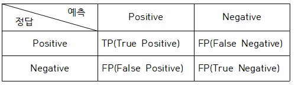
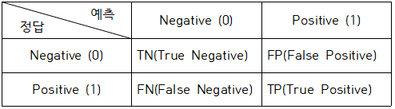
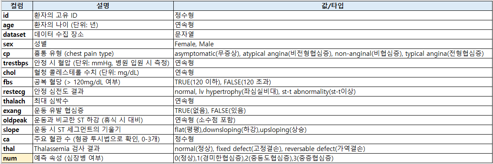
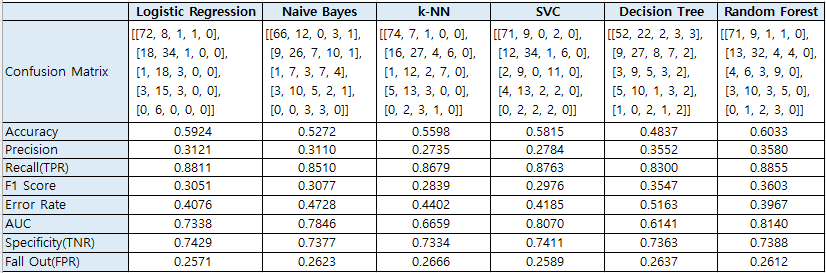

#  14 : 분류 평가 지표

---
	
 	[1] 오차행렬, 혼동행렬 (Confusion Matrix)
  	[2] 정확도 (Accurancy)
	[3] 정밀도 (Precision), PPV (Positive Predictive Value)
	[4] 재현율 (Recall), 민감도 (Sensitivity), TPR (True Positive Rate)
	[5] F1 score
 	[6] 오분류율 (Error Rate)
  	[7] 특이도 (Specificity), TNR(True Negative Rate)
   	[8] 위양성률 (Fall Out), FPR(False Positive Rate)
	[9] ROC curve
	[10]AUC score
	  
---

## [1] 오차행렬, 혼동행렬 (Confusion Matrix)
▣ 예제 : https://scikit-learn.org/stable/auto_examples/model_selection/plot_confusion_matrix.html 
▣ 정의: 실제 값과 예측 값 간의 분류 결과를 행렬 형태로 표현 
▣ 필요성: 분류 모델의 다양한 평가 지표 계산의 기초 
▣ 장점: 예측의 전체적인 분포를 한눈에 파악 
▣ 단점: 이진 분류에 적합하며 다중 클래스에 적용 시 복잡도가 증가 

 
TP(True Positive): 모델이 positive라고 예측했는데 실제로 정답이 positive (정답) 
TN(True Negative): 모델이 negative라고 예측했는데 실제로 정답이 negative (정답) 
FP(False Positive): 모델이 positive라고 예측했는데 실제로 정답이 negative (오답) 
FN(False Negative): 모델이 negative라고 예측했는데 실제로 정답이 positive (오답) 
 
**scikit-learn의 confusion_matrix 기반**
 

 

## [2] 정확도 (Accurancy)
▣ 정의: 전체 데이터 중 올바르게 예측된 비율 
▣ 필요성: 모델이 얼마나 잘 작동하는지 전반적인 성능을 평가 
▣ 장점: 단순하고 이해가 용이 
▣ 단점: 불균형 데이터에서는 성능을 잘못 평가할 가능성 
$Accuracy = \frac{TP + TN}{TP + TN + FP + FN}$ 
 
모델이 전체 문제 중에서 정답을 맞춘 비율 
0 ~ 1 사이의 값을 가지며, 1에 가까울수록 좋다. 
데이터가 불균형할 때(positive:negative=9:1)는 Accuracy만으로 제대로 분류했는지는 알 수 없기 때문에 Recall과 Precision을 사용 

	from sklearn.metrics import accuracy_score
	accuracy_score(정답,  모델예측값)  # label과 predict

 

## [3] 정밀도 (Precision), PPV(Positive Predictive Value)
▣ 정의: 모델이 예측한 긍정 클래스 중 실제로 긍정 클래스인 비율 
▣ 필요성: 잘못된 긍정 예측(FP)을 줄이는 데 중요한 지표 
▣ 장점: 정확한 예측을 강조 
▣ 단점: FN은 고려하지 않아 재현율과 함께 사용 필요 
$Precision = \frac{TP}{TP + FP}$ 
 
모델이 positive라고 예측한 것들 중에서 실제로 정답이 positive인 비율 
0 ~ 1 사이의 값을 가지며, 1에 가까울수록 좋다. 
실제 정답이 negative인 데이터를 positive라고 잘못 예측하면 안 되는 경우에 중요한 지표가 될 수 있다. 
Precision을 높이기 위해선 FP(모델이 positive라고 예측했는데 정답은 negative인 경우)를 낮추는 것이 중요하다. 

	from sklearn.metrics import precision_score
	precision_score(실제값, 예측값)

 

# [4] 재현율 (Recall), 민감도 (Sensitivity), TPR (True Positive Rate)
▣ 예제 : https://scikit-learn.org/stable/auto_examples/model_selection/plot_precision_recall.html 
▣ 정의: 실제 긍정 데이터 중에서 올바르게 예측한 비율 
▣ 필요성: 놓친 긍정 예측(FN)을 줄이는 데 중요 
▣ 장점: 실제 긍정 클래스에 대한 모델의 민감성을 나타냄 
▣ 단점: FP는 고려하지 않아 Precision과 함께 사용 필요 
$Recall = \frac{TP}{TP + FN}$ 
 
실제로 정답이 positive인 것들 중에서 모델이 positive라고 예측한 비율 
0 ~ 1 사이의 값을 가지며, 1에 가까울수록 좋다. 
실제 정답이 positive인 데이터를 negative라고 잘못 예측하면 안 되는 경우에 중요한 지표가 될 수 있다. 
Recall를 높이기 위해선 FN(모델이 negative라고 예측했는데 정답이 positive인 경우)을 낮추는 것이 중요하다. 

	from sklearn.metrics import recall_score
	recall_score(실제값, 예측값)

 

	from sklearn.metrics import *

	y_true = [ 0, 0, 0, 0, 0, 1, 1, 1, 1, 1 ]
	y_pred = [ 0, 1, 1, 1, 1, 0, 0, 0, 1, 1 ]
	cm =confusion_matrix(y_true, y_pred)
	print(cm)

	acc = accuracy_score(y_true, y_pred)
	print('accuracy_score : ',acc)

	pre = precision_score(y_true, y_pred)
	print('precision_score : ', pre)

	recall = recall_score(y_true, y_pred)
	print('recall_score: ', recall)

 	print(classification_report(y_true, y_pred))

	# 3개 클래스 사례
	y_true_m = [ 0, 0, 0, 1, 1, 1, 2, 2, 2 ]
	y_pred_m = [ 0, 1, 1, 1, 1, 2, 2, 2, 2 ]

	print(confusion_matrix(y_true_m, y_pred_m),'\n')

	print('average=None : ', precision_score(y_true_m, y_pred_m, average=None))
	print('average=\'macro\' : ', precision_score(y_true_m, y_pred_m, average='macro'))
	print('average=\'micro\' : ', precision_score(y_true_m, y_pred_m, average='micro'))
	print('average=\'weighted\' : ', precision_score(y_true_m, y_pred_m, average='weighted'))
	print('\n')

	print(classification_report(y_true_m, y_pred_m))

 

# [5] F1 score
▣ 정의: Precision과 Recall의 조화 평균으로, 두 값의 균형을 평가 
▣ 필요성: 불균형 데이터에서 Precision과 Recall 간의 균형을 평가 
▣ 장점: 두 지표 간의 트레이드오프를 반영 
▣ 단점: 개별적인 성능을 평가하기 어려울 수 있음 
$F1 = \frac{2 \times Precision \times Recall}{Precision + Recall}$ 
 
Recall과 Precision의 조화평균 
0 ~ 1 사이의 값을 가지며, 1에 가까울수록 좋다. 
Recall과 Precision은 상호 보완적인 평가 지표이기 때문에 F1 score를 사용한다. 
Precision과 Recall이 한쪽으로 치우쳐지지 않고 모두 클 때 큰 값을 가진다. 

	from sklearn.metrics import f1_score
	f1_score(실제값, 예측값)

 

# [6] 오분류율 (Error Rate)
▣ 정의: 전체 데이터 중 잘못 예측된 비율 
▣ 필요성: 모델의 부정확도를 나타냄 
▣ 장점: 정확도의 보완 지표로 활용 가능 
▣ 단점: 불균형 데이터에서는 유의미하지 않을 가능성 
▣ 예제 : https://scikit-learn.org/stable/auto_examples/model_selection/plot_train_error_vs_test_error.html 
$Accuracy = \frac{FP + FN}{TP + TN + FP + FN}$ 
 

 

# [7] 특이도 (Specificity), TNR(True Negative Rate)
▣ 정의: 실제 부정 데이터 중에서 올바르게 부정으로 예측한 비율 
▣ 필요성: 부정 클래스를 정확히 예측하는 능력을 평가 
▣ 장점: Negative class에 초점을 맞춘 분석이 가능 
▣ 단점: Positive class의 성능은 고려하지 않음 
$Specificity = \frac{TN}{TN + FP}$ 
 

 

# [8] 위양성률 (Fall Out), FPR(False Positive Rate)
▣ 정의: 실제 부정 데이터 중에서 긍정으로 잘못 예측한 비율 
▣ 필요성: 모델이 잘못된 긍정을 얼마나 생성하는지 평가 
▣ 장점: 특이도의 보완 지표로 사용 
▣ 단점: 긍정 클래스의 성능은 평가하지 못함 

$Fall Out = 1 - Specificity = 1 - \frac{TN}{TN + FP} = \frac{FP}{FP + TN}$ 
 
실제 정답이 negative인 것들 중에서 모델이 positive라고 예측한 비율 
 

# [9] ROC curve
▣ 정의: TPR(재현율)과 FPR(위양성률)의 관계를 나타낸 곡선으로 다양한 임계값에서 모델 성능을 시각화 
▣ 필요성: 분류 모델의 성능을 시각적으로 평가 
▣ 장점: Threshold에 따른 성능 변화 확인이 가능 
▣ 단점: 곡선이 단일 숫자로 요약되지 않아 비교가 어려울 가능성 

▣ 예제 : https://scikit-learn.org/stable/auto_examples/model_selection/plot_roc.html 
FPR을 X축, TPR을 Y축으로 놓고 임계값을 변경해서 FPR이 변할 때 TPR이 어떻게 변하는지 나타내는 곡선 
여러 임계값들을 기준으로 Recall-Fallout의 변화를 시각화한 것 
Fallout은 실제 False인 data 중에서 모델이 True로 분류항 비율을 
Recall은 실제 True인 data 중에서 모델이 True로 분류한 비율을 나타낸 지표로써,  
이 두 지표를 각각 x, y의 축으로 놓고 그려지는 그래프를 해석 

 

# [10] AUC (Area Under Curve) score
▣ 정의: ROC Curve의 아래 면적으로, 0에서 1 사이의 값을 가짐 
▣ 필요성: 모델의 분류 성능을 숫자로 간단히 나타냄 
▣ 장점: Threshold에 관계없이 모델 성능을 평가 
▣ 단점: 데이터 불균형이 심한 경우 왜곡될 가능성 
1.0 ~ 0.9 : 아주 좋음 
0.9 ~ 0.8 : 좋음 
0.8 ~ 0.7 : 괜찮은 모델 
0.7 ~ 0.6 : 의미는 있으나 좋은 모델은 아님 
0.6 ~ 0.5 : 좋지 않은 모델 

 

# 경사하강법(Gradient Descent)을 활용한 분류모델 최적화 기법

 **(1) LogisticRegression :** solver 옵션에서 sag, saga와 같은 경사하강법 변형을 선택 

 	from sklearn.linear_model import LogisticRegression

	model = LogisticRegression(solver='saga')  # 경사하강법 기반 해법
	model.fit(X_train, y_train)
	predictions = model.predict(X_test)

 **(2) SGDClassifier (Stochastic Gradient Descent Classifier) :**  

	from sklearn.linear_model import SGDClassifier

	model = SGDClassifier()
	model.fit(X_train, y_train)
	predictions = model.predict(X_test)

 **(3) Perceptron :** 이진분류 문제를 위한 단일 층 퍼셉트론 모델로, 기본적으로 경사하강법을 사용 

	from sklearn.linear_model import Perceptron

	model = Perceptron()
	model.fit(X_train, y_train)
	predictions = model.predict(X_test)

**(4) PassiveAggressiveClassifier :** 대규모 데이터셋에서 빠르게 학습하기 위해 경사하강법의 변형 중 하나인 수동 공격적 학습(passive-aggressive learning)을 사용 

	from sklearn.linear_model import PassiveAggressiveClassifier

	model = PassiveAggressiveClassifier()
	model.fit(X_train, y_train)
	predictions = model.predict(X_test)

---
**(데이터 출처)** https://www.kaggle.com/datasets/redwankarimsony/heart-disease-data/data
 
**(데이터구조)** 
 
**(데이터셋)** https://github.com/YangGuiBee/ML/blob/main/TextBook-14/heart_disease_uci.csv

	import pandas as pd
	import numpy as np
	from sklearn.model_selection import train_test_split
	from sklearn.preprocessing import StandardScaler, LabelEncoder
	from sklearn.linear_model import LogisticRegression
	from sklearn.naive_bayes import GaussianNB
	from sklearn.neighbors import KNeighborsClassifier
	from sklearn.svm import SVC
	from sklearn.tree import DecisionTreeClassifier
	from sklearn.ensemble import RandomForestClassifier
	from sklearn.metrics import (confusion_matrix, accuracy_score, precision_score, recall_score, 
	                             f1_score, roc_auc_score, roc_curve)
	import matplotlib.pyplot as plt
	
	# 1. 데이터셋 불러오기
	data_url = "https://raw.githubusercontent.com/YangGuiBee/ML/main/TextBook-14/heart_disease_uci.csv"
	df = pd.read_csv(data_url)
	
	# 2. 결측값 확인 및 처리
	print("Missing values in dataset before processing:\n", df.isnull().sum())  # 결측값 확인
	
	# 결측값 처리
	for col in df.columns:
	    if df[col].dtype == 'object':  # 범주형 데이터
	        df[col].fillna(df[col].mode()[0], inplace=True)  # 최빈값으로 대체
	    else:  # 수치형 데이터
	        df[col].fillna(df[col].mean(), inplace=True)  # 평균값으로 대체
	
	print("Missing values in dataset after processing:\n", df.isnull().sum())  # 결측값 확인
	
	# 3. 컬럼 이름 정리
	if 'num' in df.columns:
	    df.rename(columns={"num": "target"}, inplace=True)  # 'num' 열을 'target'으로 변경
	else:
	    raise ValueError("The dataset does not contain a 'num' column.")
	
	# 4. 타겟 변수 확인
	assert 'target' in df.columns, "The dataset does not contain a 'target' column."
	df['target'] = df['target'].astype(int)  # 보장: 타겟 변수는 정수
	
	# 독립 변수와 종속 변수 분리
	X = df.drop(["target", "id", "dataset"], axis=1)  # 불필요한 열 제거
	y = df["target"]
	
	# Train-Test Split 후 결측값 확인
	X_train, X_test, y_train, y_test = train_test_split(X, y, test_size=0.2, random_state=42, stratify=y)
	
	# 최종적으로 결측값 확인
	assert not X_train.isnull().values.any(), "X_train contains NaN values!"
	assert not X_test.isnull().values.any(), "X_test contains NaN values!"
	
	# 범주형 변수 처리
	label_encoders = {}
	categorical_columns = ['sex', 'cp', 'restecg', 'slope', 'thal']  # 범주형 컬럼
	for col in categorical_columns:
	    le = LabelEncoder()
	    X_train[col] = le.fit_transform(X_train[col])  # 범주형 변수를 수치형으로 변환
	    X_test[col] = le.transform(X_test[col])  # 동일한 변환 적용
	    label_encoders[col] = le
	
	# 데이터 스케일링 (k-NN, SVM에서 필요)
	scaler = StandardScaler()
	X_train_scaled = scaler.fit_transform(X_train)
	X_test_scaled = scaler.transform(X_test)
	
	# 분류 알고리즘 초기화
	models = {
	    "Logistic Regression": LogisticRegression(),
	    "Naive Bayes": GaussianNB(),
	    "k-Nearest Neighbors": KNeighborsClassifier(n_neighbors=5),
	    "Support Vector Classifier": SVC(probability=True),
	    "Decision Tree": DecisionTreeClassifier(),
	    "Random Forest": RandomForestClassifier(n_estimators=100, random_state=42)
	}
	
	# 결과 저장용
	results = {}
	
	# 모델 학습 및 평가
	for name, model in models.items():
	    if name in ["k-Nearest Neighbors", "Support Vector Classifier"]:
	        model.fit(X_train_scaled, y_train)  # 스케일링된 데이터 사용
	        y_pred = model.predict(X_test_scaled)
	        y_prob = model.predict_proba(X_test_scaled)
	    else:
	        model.fit(X_train, y_train)
	        y_pred = model.predict(X_test)
	        y_prob = model.predict_proba(X_test)
	    
	    # 평가
	    cm = confusion_matrix(y_test, y_pred)
	    acc = accuracy_score(y_test, y_pred)
	    prec = precision_score(y_test, y_pred, average='macro')  # 다중 클래스 처리
	    rec = recall_score(y_test, y_pred, average='macro')      # 다중 클래스 처리
	    f1 = f1_score(y_test, y_pred, average='macro')           # 다중 클래스 처리
	    error_rate = 1 - acc
	    auc = roc_auc_score(y_test, y_prob, multi_class='ovr')   # 다중 클래스 AUC
	
	    # 오차행렬에서 TP, FP, TN, FN 계산
	    tp = np.diag(cm).sum()  # True Positives
	    fp = cm.sum(axis=0) - np.diag(cm)  # False Positives
	    fn = cm.sum(axis=1) - np.diag(cm)  # False Negatives
	    tn = cm.sum() - (fp + fn + tp)  # True Negatives
	
	    # 클래스별 지표 평균 계산
	    specificity = tn / (tn + fp)
	    fall_out = fp / (fp + tn)
	    recall = tp / (tp + fn)
	
	    # 결과 저장
	    results[name] = {
	        "Confusion Matrix (Numeric Values)": cm.tolist(),
	        "Accuracy": acc,
	        "Precision": prec,
	        "Recall (TPR)": recall.mean(),
	        "F1 Score": f1,
	        "Error Rate": error_rate,
	        "AUC": auc,
	        "Specificity (TNR)": specificity.mean(),
	        "Fall Out (FPR)": fall_out.mean(),
	    }
	
	# 결과 출력
	for name, metrics in results.items():
	    print(f"\n{name} Results:")
	    for metric, value in metrics.items():
	        if metric == "Confusion Matrix (Numeric Values)":
	            print(f"{metric}:\n{value}")
	        else:
	            print(f"{metric}: {value:.4f}")
	
	# ROC Curve 시각화
	plt.figure(figsize=(10, 6))
	for name, model in models.items():
	    if name in ["k-Nearest Neighbors", "Support Vector Classifier"]:
	        y_prob = model.predict_proba(X_test_scaled)
	    else:
	        y_prob = model.predict_proba(X_test)
	    fpr = {}
	    tpr = {}
	    for i in range(len(np.unique(y_test))):  # 각 클래스별로 처리
	        fpr[i], tpr[i], _ = roc_curve(y_test, y_prob[:, i], pos_label=i)
	        plt.plot(fpr[i], tpr[i], label=f"{name} (Class {i})")
	
	plt.plot([0, 1], [0, 1], "k--", label="Random Guess")
	plt.xlabel("False Positive Rate")
	plt.ylabel("True Positive Rate")
	plt.title("ROC Curve")
	plt.legend()
	plt.show()
	

---
