#  15 : CASE Study

---

  https://scikit-learn.org/stable/auto_examples/applications/index.html

 

  https://www.kaggle.com/

 

  참고 : https://github.com/dair-ai/ML-Course-Notes

 

# Machine Learning 최적화 방안

 

	[1] 데이터 처리 및 변환
		[1-1] 데이터 증강(Data Augmentation)
		[1-2] 교차 검증(Cross-Validation)
		[1-3] 데이터 스케일링(Data Scaling)
		[1-4] 데이터 불균형 처리(Handling Imbalanced Data)
		[1-5] 결측값 처리(Handling Missing Data)
		[1-6] 이상치 탐지(Outlier Detection)
		[1-7] 데이터 중복 제거(Data Deduplication)
		[1-8] 데이터 변환(Data Transformation)
		[1-9] 특성 엔지니어링(Feature Engineering)
		[1-10] 정보 병합(Data Fusion)
	
	[2] 모델 복잡도 및 일반화 : 과적합 방지(Overfitting Prevention)
		[2-1] 정규화(L1, L2 Regularization)
		[2-2] 조기 종료(Early Stopping)
		[2-3] 앙상블 학습(Ensemble Learning)
		[2-4] 모델 해석성(Model Interpretability)
	
	[3] 하이퍼파라미터 최적화
		[3-1] 하이퍼파라미터 튜닝(Hyperparameter Tuning)
		[3-2] 그리드 서치(Grid Search)
		[3-3] 랜덤 서치(Random Search)
		[3-4] 베이즈 최적화(Bayesian Optimization)
		[3-5] 하이퍼파라미터 탐색 자동화(Automated Hyperparameter Tuning)
		[3-6] AutoML 활용(AutoML)
	
	[4] 학습 과정 최적화
		[4-1] 학습률 스케줄링(Learning Rate Scheduling)
		[4-2] 가중치 초기화(Weight Initialization)
		[4-3] 활성화 함수 선택(Activation Function Selection)
		[4-4] 최적화 알고리즘 선택(Optimizer Selection) : Adam, SGD, RMSprop
		[4-5] 전이 학습(Transfer Learning)
		[4-6] 모델 구조 최적화(Model Architecture Optimization)
		[4-7] 온라인 학습(Online Learning)
	
	[5] 성능 향상
		[5-1] 특성 중요도 분석 및 선택(Feature Importance & Selection)
		[5-2] 손실함수 커스터마이징(Custom Loss Function)
  
	[6] 하드웨어 및 시스템 최적화
		[6-1] 하드웨어 최적화(Hardware Optimization)

	[7] 모델 검증 및 비교
		[7-1] 모델 검증(Model Validation)
		[7-2] 모델 성능 비교(Model Performance Comparison) 

	[8] 기술 부채 관리
		[8-1] 기술 부채(Technical Debt) 관리

 

--- 

# [1] 데이터 처리 및 변환
## [1-1] 데이터 증강(Data Augmentation)
▣ 정의 : 기존 데이터셋을 변형하거나 가공하여 새로운 데이터를 생성하는 기법 
▣ 필요성 : 데이터 양이 부족하거나 데이터 다양성이 낮은 경우, 모델의 일반화 성능을 향상 
▣ 장점 : 데이터셋의 다양성을 인위적으로 증가, 추가적인 데이터 수집 없이 성능 향상, 과적합 방지 효과 
▣ 단점 : 증강된 데이터가 실제 데이터를 충분히 반영하지 않을 수 있으며, 처리 시간이 증가하며, 비효율적인 증강은 성능에 부정적 영향 
▣ 적용대상 알고리즘 : 딥러닝 알고리즘 (CNN, RNN 등), 이미지, 텍스트, 음성 처리 모델 

	#############################################################
	# [1] 데이터 처리 및 변환
	# [1-1] 데이터 증강 (Data Augmentation)
	# 숫자 데이터 : 노이즈와 비선형성 추가
	#############################################################
	import numpy as np
	import pandas as pd
	from sklearn.model_selection import train_test_split
	from sklearn.linear_model import LinearRegression
	from sklearn.metrics import mean_squared_error, r2_score
	import matplotlib.pyplot as plt

	# 원본 데이터 생성
	np.random.seed(42)
	X = np.random.rand(100, 1) * 10  # Feature
	y = 2.5 * X.flatten() + np.random.randn(100) * 2  # Target with noise

	# 원본 데이터프레임
	original_data = pd.DataFrame({"X": X.flatten(), "y": y})

	# 데이터 증강: 노이즈와 비선형성 추가
	augmented_X = X + np.random.randn(100, 1) * 0.2  # 작은 노이즈 추가
	augmented_y = 2.5 * augmented_X.flatten() + np.random.randn(100) * 0.5 + 0.2 * np.sin(augmented_X.flatten())  # 비선형성 추가
	augmented_data = pd.DataFrame({"X": augmented_X.flatten(), "y": augmented_y})

	# 데이터 병합
	combined_data = pd.concat([original_data, augmented_data], ignore_index=True)

	# 데이터 분리: 원본 데이터
	X_train_orig, X_test_orig, y_train_orig, y_test_orig = train_test_split(
	    original_data["X"].values.reshape(-1, 1), original_data["y"], test_size=0.2, random_state=42)

	# 데이터 분리: 증강 데이터
	X_train_aug, X_test_aug, y_train_aug, y_test_aug = train_test_split(
	    combined_data["X"].values.reshape(-1, 1), combined_data["y"], test_size=0.2, random_state=42)

	# 모델 학습: 원본 데이터
	model_orig = LinearRegression()
	model_orig.fit(X_train_orig, y_train_orig)
	y_pred_orig = model_orig.predict(X_test_orig)

	# 모델 학습: 증강 데이터
	model_aug = LinearRegression()
	model_aug.fit(X_train_aug, y_train_aug)
	y_pred_aug = model_aug.predict(X_test_aug)

	# 성능 평가
	mse_orig = mean_squared_error(y_test_orig, y_pred_orig)
	r2_orig = r2_score(y_test_orig, y_pred_orig)

	mse_aug = mean_squared_error(y_test_aug, y_pred_aug)
	r2_aug = r2_score(y_test_aug, y_pred_aug)

	# 결과 출력
	print("=== 원본 데이터 성능 ===")
	print(f"Mean Squared Error: {mse_orig:.4f}")
	print(f"R2 Score: {r2_orig:.4f}")

	print("\n=== 증강 데이터 성능 ===")
	print(f"Mean Squared Error: {mse_aug:.4f}")
	print(f"R2 Score: {r2_aug:.4f}")

	# 시각화
	plt.scatter(original_data["X"], original_data["y"], label="Original Data", color="blue", alpha=0.6)
	plt.scatter(augmented_data["X"], augmented_data["y"], label="Augmented Data", color="orange", alpha=0.4)
	plt.plot(X_test_orig, y_pred_orig, label="Model (Original)", color="green")
	plt.plot(X_test_aug, y_pred_aug, label="Model (Augmented)", color="red")
	plt.xlabel("X")
	plt.ylabel("y")
	plt.title("Original vs Augmented Data and Models")
	plt.legend()
	plt.show()

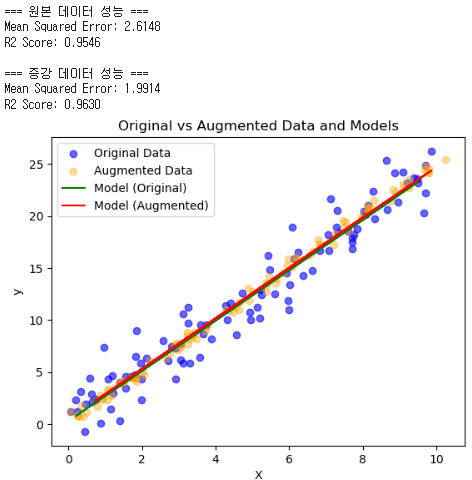 
 

## [1-2] 교차 검증(Cross-Validation)
▣ 정의 : 데이터를 여러 부분으로 나누어 학습과 검증을 반복적으로 수행하여 모델의 일반화 성능을 평가 
▣ 필요성 : 과적합 및 과소적합 여부를 판별하거나, 데이터가 제한적일 때 모델의 성능을 신뢰성 있게 평가하기 위해 필요 
▣ 장점 : 데이터를 최대한 활용할 수 있으며, 다양한 데이터 분포에서 모델의 성능을 평가하고, 일반화 성능에 대한 신뢰도 증가 
▣ 단점 : 계산 비용이 증가하여 학습 시간이 오래 걸리며, 큰 데이터셋에서는 비효율적 
▣ 적용대상 알고리즘 : 모든 지도학습 알고리즘 (분류, 회귀 등), 특히 소규모 데이터셋에 적합 

	#############################################################
	# [1] 데이터 처리 및 변환
	# [1-2] 교차 검증 (Cross-Validation) + 데이터증강
	#############################################################
	from sklearn.model_selection import cross_val_score, KFold, GridSearchCV, train_test_split
	from sklearn.ensemble import RandomForestClassifier
	from sklearn.datasets import load_wine
	from sklearn.preprocessing import StandardScaler
	from sklearn.pipeline import Pipeline
	from sklearn.metrics import accuracy_score
	import numpy as np
	import pandas as pd

	# 데이터 로드
	data = load_wine()
	X, y = data.data, data.target

	# 데이터를 학습 데이터와 새로운 테스트 데이터로 분리
	X_train, X_new, y_train, y_new = train_test_split(X, y, test_size=0.2, random_state=42)

	# 데이터 증강: 노이즈 추가 및 특성 변형
	np.random.seed(42)
	noise = np.random.normal(0, 0.2, X_train.shape)  # 평균 0, 표준편차 0.2인 노이즈
	X_augmented = X_train + noise  # 노이즈 추가
	y_augmented = y_train  # 레이블은 동일

	# 증강 데이터 합치기
	X_combined = np.vstack((X_train, X_augmented))
	y_combined = np.hstack((y_train, y_augmented))

	# 기본 모델 생성
	model = RandomForestClassifier(random_state=42)

	# 교차 검증 없이 학습 및 새로운 데이터 평가 (기본 데이터)
	model.fit(X_train, y_train)
	new_predictions = model.predict(X_new)
	accuracy_new_data = accuracy_score(y_new, new_predictions)

	# 교차 검증 (기본 데이터)
	kf = KFold(n_splits=5, shuffle=True, random_state=42)
	scores_without_augmentation = cross_val_score(model, X_train, y_train, cv=kf)

	# 교차 검증 (증강 데이터 포함)
	scores_with_augmentation = cross_val_score(model, X_combined, y_combined, cv=kf)

	# 데이터 스케일링 포함한 파이프라인 구성
	pipeline = Pipeline([
	    ('scaler', StandardScaler()),
	    ('classifier', RandomForestClassifier(random_state=42))])

	# 하이퍼파라미터 튜닝 (증강 데이터 포함)
	param_grid = {
	    'classifier__n_estimators': [50, 100, 150],
	    'classifier__max_depth': [None, 10, 20],
	    'classifier__min_samples_split': [2, 5, 10]}

	grid_search = GridSearchCV(pipeline, param_grid, cv=5, scoring='accuracy')
	grid_search.fit(X_combined, y_combined)

	# 최적 모델로 교차 검증
	best_model = grid_search.best_estimator_
	scores_with_tuning = cross_val_score(best_model, X_combined, y_combined, cv=kf)

	# 결과 출력
	print("=== 새로운 데이터로 평가 (기본 데이터) ===")
	print(f"새로운 데이터 정확도: {accuracy_new_data:.4f}")

	print("\n=== 기본 데이터 교차 검증 결과 ===")
	print(f"교차 검증 점수 (기본 데이터): {scores_without_augmentation}")
	print(f"평균 교차 검증 점수: {scores_without_augmentation.mean():.4f}")

	print("\n=== 증강 데이터 포함 교차 검증 결과 ===")
	print(f"교차 검증 점수 (증강 데이터 포함): {scores_with_augmentation}")
	print(f"평균 교차 검증 점수: {scores_with_augmentation.mean():.4f}")

	print("\n=== 하이퍼파라미터 튜닝 결과 (증강 데이터 포함) ===")
	print(f"최적 파라미터: {grid_search.best_params_}")
	print(f"최적 교차 검증 점수: {grid_search.best_score_:.4f}")

	print("\n=== 최적 모델 교차 검증 점수 (증강 데이터 포함) ===")
	print(f"교차 검증 점수: {scores_with_tuning}")
	print(f"평균 교차 검증 점수: {scores_with_tuning.mean():.4f}")

 

	=== 새로운 데이터로 평가 (기본 데이터) ===
	새로운 데이터 정확도: 1.0000

	=== 기본 데이터 교차 검증 결과 ===
	교차 검증 점수 (기본 데이터): [0.93103448 0.96551724 1.         1.         1.        ]
	평균 교차 검증 점수: 0.9793

	=== 증강 데이터 포함 교차 검증 결과 ===
	교차 검증 점수 (증강 데이터 포함): [0.96491228 1.         0.96491228 0.98245614 0.98214286]
	평균 교차 검증 점수: 0.9789

	=== 하이퍼파라미터 튜닝 결과 (증강 데이터 포함) ===
	최적 파라미터: {'classifier__max_depth': None, 'classifier__min_samples_split': 2, 'classifier__n_estimators': 100}
	최적 교차 검증 점수: 0.9895

	=== 최적 모델 교차 검증 점수 (증강 데이터 포함) ===
	교차 검증 점수: [0.96491228 1.         0.96491228 0.98245614 0.98214286]
	평균 교차 검증 점수: 0.9789

 

## [1-3] 데이터 스케일링(Data Scaling)
▣ 정의 : 데이터의 특성 값을 일정한 범위나 분포로 변환하여 모델 학습에 적합한 형태(표준화(Standardization): 평균 0, 표준편차 1, 
정규화(Normalization): 최소-최대 스케일링 0-1)로 만드는 과정 
▣ 필요성 : 특성 간의 크기 차이가 클 경우, 모델 학습이 왜곡될 수 있기 때문에 이를 조정하여 학습 효율을 향상 
▣ 장점 : 모델 학습 안정성 향상, 학습 속도 증가, 성능 개선 가능 
▣ 단점 : 데이터 분포를 잘못 조정하면 오히려 성능 저하, 스케일링 단계에서 추가적인 계산이 필요 
▣ 적용대상 알고리즘 : 거리 기반 알고리즘 (KNN, SVM 등), 선형 모델 (로지스틱 회귀, 선형 회귀), 딥러닝 모델 

	#############################################################
	# [1] 데이터 처리 및 변환
	# [1-3] 데이터 스케일링 (Data Scaling)
	# MinMaxScaler : 데이터를 특정 범위(기본값: [0, 1])로 정규화
	# 𝑋 : 원본 데이터 값
	# 𝑋_{min}  : 각 열의 최소값
	# 𝑋_{max}  : 각 열의 최대값
	# 𝑋′ : 변환된 데이터 값
	# 𝑋′ = (𝑋 - 𝑋_{min}) / (𝑋_{max} - 𝑋_{min})
	#############################################################
	import numpy as np
	from sklearn.datasets import make_classification
	from sklearn.model_selection import train_test_split
	from sklearn.preprocessing import MinMaxScaler
	from sklearn.neighbors import KNeighborsClassifier
	from sklearn.metrics import accuracy_score

	# 데이터 출력 형식 설정 (소수점 이하 4자리까지)
	np.set_printoptions(precision=4, suppress=True)

	# 데이터 생성
	X, y = make_classification(
	    n_samples=500,
	    n_features=5,
	    n_informative=3,
	    n_redundant=0,
	    random_state=42)

	# 인위적으로 특성의 스케일 차이를 크게 만듦
	X[:, 0] *= 1    # 첫 번째 특성: 0~1
	X[:, 1] *= 100  # 두 번째 특성: 0~100
	X[:, 2] *= 1000 # 세 번째 특성: 0~1000

	print("원본 데이터 (일부):\n", X[:5])

	# 데이터 분리
	X_train, X_test, y_train, y_test = train_test_split(X, y, test_size=0.25, random_state=42)

	# KNN 모델 생성
	knn = KNeighborsClassifier()

	# 1. 원본 데이터로 평가
	knn.fit(X_train, y_train)
	y_pred_original = knn.predict(X_test)
	accuracy_original = accuracy_score(y_test, y_pred_original)

	# 2. 데이터 스케일링
	scaler = MinMaxScaler()
	X_train_scaled = scaler.fit_transform(X_train)
	X_test_scaled = scaler.transform(X_test)

	print("\n스케일링된 데이터 (훈련 세트 일부):\n", X_train_scaled[:5])

	# 스케일링된 데이터 학습 및 평가
	knn.fit(X_train_scaled, y_train)
	y_pred_scaled = knn.predict(X_test_scaled)
	accuracy_scaled = accuracy_score(y_test, y_pred_scaled)

	# 결과 출력
	print("\n=== 평가 결과 ===")
	print(f"원본 데이터 테스트 정확도: {accuracy_original:.4f}")
	print(f"스케일링된 데이터 테스트 정확도: {accuracy_scaled:.4f}")

 

	원본 데이터 (일부):
	 [[  -1.8306   -9.534  -654.0757    0.7241   -0.1813]
	 [   0.2603    8.0151 -413.4652   -1.2733    1.4826]
 	 [  -1.3796    9.8744 -971.6567   -0.0728   -1.5796]
	 [  -0.9981  -16.1506 1051.9476    2.3985    2.1207]
	 [  -0.3696  122.3565  621.5719    0.0128   -1.4224]]

	스케일링된 데이터 (훈련 세트 일부):
	 [[0.5246 0.7534 0.5159 0.7898 0.714 ]
	 [0.6738 0.2881 0.6199 0.4736 0.4592]
	 [0.3458 0.3688 0.2804 0.1617 0.5876]
	 [0.3992 0.5641 0.541  0.6432 0.4749]
	 [0.5227 0.4134 0.4271 0.1323 0.6014]]

	=== 평가 결과 ===
	원본 데이터 테스트 정확도: 0.8480
	스케일링된 데이터 테스트 정확도: 0.9360
 
 

**왜도(Skewness):** 데이터 분포의 비대칭성을 측정. 데이터가 평균을 기준으로 얼마나 대칭적인지, 또는 한쪽으로 치우쳤는지를 나타내는 척도로 정규분포는 대칭적이므로 왜도 값은 0에 가까워야 함 
**첨도(Kurtosis):** 첨도는 데이터 분포의 중심부 뾰족함과 꼬리 두께를 측정. 데이터 분포의 중심부와 꼬리 부분이 정규분포와 얼마나 다른지를 나타냄 

	import numpy as np
	import pandas as pd
	from scipy.stats import skew, kurtosis
	from scipy.stats import boxcox
	from sklearn.preprocessing import PowerTransformer

	# 데이터 생성
	data = np.random.exponential(scale=2, size=1000)  # 비정규 데이터

	# 왜도와 첨도 계산
	data_skewness = skew(data)
	data_kurtosis = kurtosis(data, fisher=True)  # Excess Kurtosis

	print(f"Before Transformation - Skewness: {data_skewness}, Kurtosis: {data_kurtosis}")

	# Box-Cox 변환 (데이터가 양수일 경우)
	data_boxcox, _ = boxcox(data + 1e-9)  # 0 방지용 작은 값 추가
	print(f"After Box-Cox - Skewness: {skew(data_boxcox)}, Kurtosis: {kurtosis(data_boxcox, fisher=True)}")

	# Yeo-Johnson 변환 (양수/음수 모두 가능)
	transformer = PowerTransformer(method='yeo-johnson')
	data_yeojohnson = transformer.fit_transform(data.reshape(-1, 1))
	print(f"After Yeo-Johnson - Skewness: {skew(data_yeojohnson)}, Kurtosis: {kurtosis(data_yeojohnson, fisher=True)}")

## [1-4] 데이터 불균형 처리(Handling Imbalanced Data)
 
▣ 정의 : 클래스 간 데이터 비율이 심각하게 불균형할 때, 모델의 학습 성능을 개선하기 위해 데이터를 조정 
▣ 필요성 : 불균형 데이터는 모델이 다수 클래스를 선호하도록 학습하게 만들기 때문에, 이를 해결하지 않으면 특정 클래스의 성능이 저하 
▣ 장점 : 클래스 간 균형을 맞춰 모델의 공정성과 성능 향상, 소수 클래스의 예측 성능을 개선 
▣ 단점 : 언더샘플링은 데이터 손실 가능성, 오버샘플링은 과적합 위험, 가중치 조정은 추가적인 하이퍼파라미터 조정 필요 
▣ 적용대상 알고리즘 : 모든 지도학습 알고리즘, 특히 분류 문제 (이진 분류, 다중 클래스 분류) 

**SMOTE (Synthetic Minority Over-sampling Technique)**  
기존의 소수 클래스 샘플을 기반으로 새로운 샘플을 선형 보간하여 생성하는 오버샘플링 기법 
소수 클래스의 데이터를 균일하게 증강하여 모델 학습 시 클래스 불균형 문제를 완화 
소수 클래스 데이터를 균일하게 증강하여 클래스 분포 균형에 효과적 
최근접 이웃계산 → 새로운 샘플 생성 → 증강과정 반복 

**ADASYN (Adaptive Synthetic Sampling Approach for Imbalanced Learning)**  
SMOTE의 확장으로, 소수 클래스 주변의 밀도에 따라 새로운 샘플을 생성 
소수 클래스 샘플의 부족으로 인해 발생하는 불균형 데이터를 해결하기 위해 설계된 오버샘플링 기법 
밀도가 낮은 영역에 더 많은 샘플을 생성하여 분류 경계에 가까운 학습하기 어려운 샘플에 초점 
밀도 계산 → 가중치 계산 → 샘플생성 비율 결정 → 새로운 샘플 생성 

	#############################################################
	# [1] 데이터 처리 및 변환
	# [1-4] 데이터 불균형 처리 (Handling Imbalanced Data)
	# ADASYN + SMOTE(Synthetic Minority Over-sampling Technique)
	#############################################################
	from imblearn.over_sampling import SMOTE, ADASYN
	from sklearn.datasets import make_classification
	from sklearn.ensemble import RandomForestClassifier
	from sklearn.model_selection import train_test_split, cross_val_score, StratifiedKFold
	from sklearn.metrics import roc_auc_score, accuracy_score, classification_report
	import pandas as pd

	# 극단적인 불균형 데이터 생성
	X, y = make_classification(
	    n_classes=2,          # 이진 분류
	    class_sep=2,          # 클래스 간 분리 정도
	    weights=[0.005, 0.995], # 클래스 비율: 0.5% vs 99.5%
	    n_informative=3,      # 정보가 있는 독립 변수 3개
	    n_redundant=1,        # 중복된 독립 변수 1개
	    flip_y=0,             # 라벨 뒤집기 비율 없음
	    n_features=5,         # 총 특성 수: 5개
	    n_clusters_per_class=1, # 각 클래스 하나의 클러스터
	    n_samples=2000,       # 총 샘플 수: 2000개
	    random_state=10       # 난수 고정
	)
	print("원본 클래스 분포:\n", pd.Series(y).value_counts())

	# 교차 검증 설정
	kf = StratifiedKFold(n_splits=5, shuffle=True, random_state=42)

	# 1. 원본 데이터 교차 검증 평가
	model = RandomForestClassifier(random_state=42)
	scores_original = cross_val_score(model, X, y, cv=kf, scoring='roc_auc')
	print("\n[교차 검증] 원본 데이터 ROC-AUC:", scores_original.mean())

	# 데이터 분리 (훈련 세트와 테스트 세트)
	X_train, X_test, y_train, y_test = train_test_split(X, y, test_size=0.25, random_state=42)

	# 2. 원본 데이터 분리 평가
	model.fit(X_train, y_train)
	y_pred_original = model.predict(X_test)
	accuracy_original = accuracy_score(y_test, y_pred_original)

	print("\n[분리 평가] === 원본 데이터 평가 결과 ===")
	print(f"정확도: {accuracy_original:.4f}")
	print("분류 리포트:\n", classification_report(y_test, y_pred_original, zero_division=0))

	# ADASYN 적용
	adasyn = ADASYN(sampling_strategy=0.5, random_state=42)
	X_adasyn, y_adasyn = adasyn.fit_resample(X, y)
	X_train_adasyn, y_train_adasyn = adasyn.fit_resample(X_train, y_train)
	print("\nADASYN 적용 후 클래스 분포 (전체 데이터):\n", pd.Series(y_adasyn).value_counts())

	# 3. ADASYN 교차 검증 평가
	scores_adasyn = cross_val_score(model, X_adasyn, y_adasyn, cv=kf, scoring='roc_auc')
	print("\n[교차 검증] ADASYN 데이터 ROC-AUC:", scores_adasyn.mean())

	# 4. ADASYN 분리 평가
	model.fit(X_train_adasyn, y_train_adasyn)
	y_pred_adasyn = model.predict(X_test)
	accuracy_adasyn = accuracy_score(y_test, y_pred_adasyn)

	print("\n[분리 평가] === ADASYN 데이터 평가 결과 ===")
	print(f"정확도: {accuracy_adasyn:.4f}")
	print("분류 리포트:\n", classification_report(y_test, y_pred_adasyn, zero_division=0))

	# SMOTE 적용
	smote = SMOTE(sampling_strategy=0.5, random_state=42)
	X_smote, y_smote = smote.fit_resample(X, y)
	X_train_smote, y_train_smote = smote.fit_resample(X_train, y_train)
	print("\nSMOTE 적용 후 클래스 분포 (전체 데이터):\n", pd.Series(y_smote).value_counts())

	# 5. SMOTE 교차 검증 평가
	scores_smote = cross_val_score(model, X_smote, y_smote, cv=kf, scoring='roc_auc')
	print("\n[교차 검증] SMOTE 데이터 ROC-AUC:", scores_smote.mean())

	# 6. SMOTE 분리 평가
	model.fit(X_train_smote, y_train_smote)
	y_pred_smote = model.predict(X_test)
	accuracy_smote = accuracy_score(y_test, y_pred_smote)

	print("\n[분리 평가] === SMOTE 데이터 평가 결과 ===")
	print(f"정확도: {accuracy_smote:.4f}")
	print("분류 리포트:\n", classification_report(y_test, y_pred_smote, zero_division=0))

 

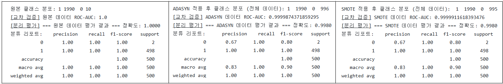 

 

## [1-5] 결측값 처리(Handling Missing Data)
▣ 정의 : 데이터셋에서 누락된 값(null, NaN)을 처리 
▣ 필요성 : 결측값은 알고리즘의 작동을 방해하거나 왜곡된 결과를 초래할 수 있으므로 필수적으로 필요 
▣ 주요 기법 : 결측값이 포함된 행이나 열을 제거(Deletion), 평균/중앙값/최빈값 등으로 대체(Imputation), 머신러닝 모델로 결측값 예측(Predictive Modeling), 유사한 관측치로 결측값 대체(KNN Imputation) 
▣ 장점 : 데이터 품질 향상으로 모델 성능 개선, 안정적이고 신뢰성 있는 학습 가능 
▣ 단점 : 과도한 삭제는 데이터 손실 위험, 부정확한 대체는 모델 편향을 초래할 수 있음 
▣ 적용대상 알고리즘 : 선형 회귀, 의사결정 나무, 신경망 등 대부분의 머신러닝 알고리즘 

	#############################################################
	# [1] 데이터 처리 및 변환
	# [1-5] 결측값 처리(Handling Missing Data)
	#############################################################
	import pandas as pd
	import numpy as np
	from sklearn.datasets import load_iris
	from sklearn.model_selection import train_test_split
	from sklearn.linear_model import LogisticRegression
	from sklearn.metrics import accuracy_score

	# 1. Iris 데이터 로드
	iris = load_iris(as_frame=True)
	iris_df = iris.frame

	# 2. 데이터 준비 (입력 특성과 타겟 분리)
	X = iris_df.iloc[:, :-1]  # 입력 특성 (꽃받침, 꽃잎)
	y = iris_df['target']     # 타겟 (클래스)

	# 3. 결측값 생성 (예제용)
	# 랜덤으로 10개의 값에 결측값(NaN)을 삽입
	np.random.seed(42)
	missing_indices = np.random.choice(X.size, 10, replace=False)
	X_flat = X.values.flatten()
	X_flat[missing_indices] = np.nan
	X_with_missing = pd.DataFrame(X_flat.reshape(X.shape), columns=X.columns)

	# 결측값 확인
	print("Data with missing values:")
	print(X_with_missing.isnull().sum())

	# 4. 결측값 처리 방법
	# (1) 결측값을 포함한 데이터를 그대로 사용 (결측값을 0으로 대체)
	X_with_zeros = X_with_missing.fillna(0)
	X_train_raw, X_test_raw, y_train_raw, y_test_raw = train_test_split(
	    X_with_zeros, y, test_size=0.3, random_state=42)

	# (2) 결측값이 있는 샘플 제거
	X_dropped = X_with_missing.dropna()
	y_dropped = y[X_with_missing.dropna().index]
	X_train_dropped, X_test_dropped, y_train_dropped, y_test_dropped = train_test_split(
	    X_dropped, y_dropped, test_size=0.3, random_state=42)

	# (3) 결측값을 평균값으로 대체
	X_imputed = X_with_missing.fillna(X_with_missing.mean())
	X_train_imputed, X_test_imputed, y_train_imputed, y_test_imputed = train_test_split(
	    X_imputed, y, test_size=0.3, random_state=42)

	# 5. 모델 학습 및 평가
	# (1) 결측값 처리 전 (0 대체)
	model_raw = LogisticRegression(max_iter=200)
	model_raw.fit(X_train_raw, y_train_raw)
	y_pred_raw = model_raw.predict(X_test_raw)
	accuracy_raw = accuracy_score(y_test_raw, y_pred_raw)

	# (2) 결측값 제거 데이터 사용
	model_dropped = LogisticRegression(max_iter=200)
	model_dropped.fit(X_train_dropped, y_train_dropped)
	y_pred_dropped = model_dropped.predict(X_test_dropped)
	accuracy_dropped = accuracy_score(y_test_dropped, y_pred_dropped)

	# (3) 결측값을 평균값으로 대체한 데이터 사용
	model_imputed = LogisticRegression(max_iter=200)
	model_imputed.fit(X_train_imputed, y_train_imputed)
	y_pred_imputed = model_imputed.predict(X_test_imputed)
	accuracy_imputed = accuracy_score(y_test_imputed, y_pred_imputed)

	# 6. 결과 출력
	print(f"\nAccuracy before handling missing values (0 imputation): {accuracy_raw:.2f}")
	print(f"Accuracy after dropping missing samples: {accuracy_dropped:.2f}")
	print(f"Accuracy after handling missing values (mean imputation): {accuracy_imputed:.2f}")

 

	Data with missing values:
	sepal length (cm)    1
	sepal width (cm)     5
	petal length (cm)    3
	petal width (cm)     1
	dtype: int64

	Accuracy before handling missing values (0 imputation): 0.96
	Accuracy after dropping missing samples: 0.98
	Accuracy after handling missing values (mean imputation): 0.96

 

## [1-6] 이상치 탐지(Outlier Detection)
▣ 정의 : 데이터 분포에서 비정상적으로 벗어난 데이터를 탐지하고 처리 
▣ 필요성 : 이상치는 데이터 분포를 왜곡하고 모델 성능을 저하시킬 수 있으므로 식별과 처리가 필요 
▣ 주요 기법 : 통계 기반 기법(사분위 범위(IQR), 중앙값 절대 편차(MAD), Z-Score), 머신러닝 기법(Isolation Forest, DBSCAN, One-Class SVM), 시각화 기반 탐지(Box Plot, Scatter Plot) 
▣ 장점 : 데이터 신뢰성과 모델 일반화 성능 강화, 잠재적 오류를 식별하여 문제 예방 
▣ 단점 : 과도한 탐지 기준은 중요한 데이터를 제거할 위험, 고차원 데이터에서는 탐지가 어려움 
▣ 적용대상 알고리즘 : 회귀분석, PCA, 클러스터링, 랜덤 포레스트, 딥러닝 등 

	#############################################################
	# [1] 데이터 처리 및 변환
	# [1-6] 이상치 탐지(Outlier Detection)
	#############################################################
	import pandas as pd
	import numpy as np
	from sklearn.datasets import load_iris
	from sklearn.model_selection import train_test_split
	from sklearn.linear_model import LogisticRegression
	from sklearn.metrics import accuracy_score

	# 1. Iris 데이터 로드
	iris = load_iris(as_frame=True)
	iris_df = iris.frame

	# 2. 데이터 준비 (입력 특성과 타겟 분리)
	X = iris_df.iloc[:, :-1]  # 입력 특성 (꽃받침, 꽃잎)
	y = iris_df['target']     # 타겟 (클래스)

	# 3. 이상치 탐지 및 제거
	def detect_outliers_iqr(data):
	    """IQR(사분위 범위)을 사용하여 이상치 탐지"""
	    Q1 = data.quantile(0.25)
	    Q3 = data.quantile(0.75)
	    IQR = Q3 - Q1
	    lower_bound = Q1 - 1.5 * IQR
	    upper_bound = Q3 + 1.5 * IQR
	    outliers = (data < lower_bound) | (data > upper_bound)
	    return ~outliers.any(axis=1), outliers

	# 이상치 탐지
	outlier_mask, outliers_boolean = detect_outliers_iqr(X)
	X_no_outliers = X[outlier_mask]
	y_no_outliers = y[outlier_mask]

	# 이상치 데이터 추출
	outliers_detected = X[~outlier_mask].copy()

	# 이상치 사유 추가
	reasons = []
	for index, row in outliers_detected.iterrows():
	    reason = []
	    for column in X.columns:
	        if outliers_boolean.at[index, column]:
	            reason.append(f"{column} out of range")
	    reasons.append(", ".join(reason))
	outliers_detected['Reason'] = reasons

	print("Outliers detected:")
	print(outliers_detected)

	# 이상치 개수 확인
	print(f"\nOriginal data size: {X.shape[0]}")
	print(f"Data size after removing outliers: {X_no_outliers.shape[0]}")
	print(f"Number of outliers detected: {X.shape[0] - X_no_outliers.shape[0]}")

	# 4. 데이터 분리 (학습/테스트 셋)
	X_train, X_test, y_train, y_test = train_test_split(X, y, test_size=0.3, random_state=42)
	X_train_no_outliers, X_test_no_outliers, y_train_no_outliers, y_test_no_outliers = 	train_test_split(
	    X_no_outliers, y_no_outliers, test_size=0.3, random_state=42)

	# 5. 모델 학습 및 평가
	# (1) 이상치 제거 전
	model = LogisticRegression(max_iter=200)
	model.fit(X_train, y_train)
	y_pred = model.predict(X_test)
	accuracy_before = accuracy_score(y_test, y_pred)

	# (2) 이상치 제거 후
	model_no_outliers = LogisticRegression(max_iter=200)
	model_no_outliers.fit(X_train_no_outliers, y_train_no_outliers)
	y_pred_no_outliers = model_no_outliers.predict(X_test_no_outliers)
	accuracy_after = accuracy_score(y_test_no_outliers, y_pred_no_outliers)

	# 6. 결과 출력
	print(f"\nAccuracy before removing outliers: {accuracy_before:.2f}")
	print(f"Accuracy after removing outliers: {accuracy_after:.2f}")

 

	Outliers detected:
 		   sepal length (cm)  sepal width (cm)  petal length (cm)  petal width (cm) 
	15                5.7               4.4                1.5               0.4   
	32                5.2               4.1                1.5               0.1   
	33                5.5               4.2                1.4               0.2   
	60                5.0               2.0                3.5               1.0   

	                           Reason  
	15  sepal width (cm) out of range  
	32  sepal width (cm) out of range  
	33  sepal width (cm) out of range  
	60  sepal width (cm) out of range  

	Original data size: 150
	Data size after removing outliers: 146
	Number of outliers detected: 4

	Accuracy before removing outliers: 1.00
	Accuracy after removing outliers: 0.95

 

	#############################################################
	# [1] 데이터 처리 및 변환
	# [1-6] 이상치 탐지(Outlier Detection) - 클래스별 이상치탐지
	#############################################################
	import pandas as pd
	import numpy as np
	from sklearn.datasets import load_iris
	from sklearn.model_selection import train_test_split
	from sklearn.linear_model import LogisticRegression
	from sklearn.metrics import accuracy_score

	# 1. Iris 데이터 로드
	iris = load_iris(as_frame=True)
	iris_df = iris.frame

	# 2. 데이터 준비 (입력 특성과 타겟 분리)
	X = iris_df.iloc[:, :-1]  # 입력 특성 (꽃받침, 꽃잎)
	y = iris_df['target']     # 타겟 (클래스)

	# 3. 클래스별 IQR 기반 이상치 탐지
	def detect_outliers_iqr_by_class(data, target):
	    """클래스별 IQR을 사용하여 이상치 탐지"""
	    outlier_mask = pd.Series(True, index=data.index)
	    reasons = pd.Series("", index=data.index)

	    for cls in target.unique():
	        cls_data = data[target == cls]
	        Q1 = cls_data.quantile(0.25)
	        Q3 = cls_data.quantile(0.75)
	        IQR = Q3 - Q1
	        lower_bound = Q1 - 1.5 * IQR
	        upper_bound = Q3 + 1.5 * IQR
	        cls_outliers = ~((cls_data >= lower_bound) & (cls_data <= upper_bound)).all(axis=1)

 	       # 업데이트: 클래스별 마스크 및 이상치 사유 기록
 	       outlier_mask[cls_data.index] &= ~cls_outliers
	       for idx, row in cls_data.iterrows():
  	          if cls_outliers.at[idx]:
      	             reason = []
                     for column in data.columns:
                        if row[column] < lower_bound[column]:
                           reason.append(f"{column} below {lower_bound[column]:.2f}")
                        elif row[column] > upper_bound[column]:
                             reason.append(f"{column} above {upper_bound[column]:.2f}")
                     reasons.at[idx] = ", ".join(reason)
	       return outlier_mask, reasons

	# 이상치 탐지 수행
	class_outlier_mask, outlier_reasons = detect_outliers_iqr_by_class(X, y)
	X_no_outliers = X[class_outlier_mask]
	y_no_outliers = y[class_outlier_mask]

	# 이상치 데이터 출력
	outliers_detected = X[~class_outlier_mask].copy()
	outliers_detected["Reason"] = outlier_reasons[~class_outlier_mask]

	print("Outliers detected:")
	print(outliers_detected)

	# 이상치 개수 확인
	print(f"\nOriginal data size: {X.shape[0]}")
	print(f"Data size after removing outliers: {X_no_outliers.shape[0]}")
	print(f"Number of outliers detected: {X.shape[0] - X_no_outliers.shape[0]}")

	# 4. 데이터 분리 (학습/테스트 셋)
	X_train, X_test, y_train, y_test = train_test_split(X, y, test_size=0.3, random_state=42)
	X_train_no_outliers, X_test_no_outliers, y_train_no_outliers, y_test_no_outliers = 	train_test_split(
	    X_no_outliers, y_no_outliers, test_size=0.3, random_state=42)

	# 5. 모델 학습 및 평가
	# (1) 이상치 제거 전
	model = LogisticRegression(max_iter=200)
	model.fit(X_train, y_train)
	y_pred = model.predict(X_test)
	accuracy_before = accuracy_score(y_test, y_pred)

	# (2) 이상치 제거 후
	model_no_outliers = LogisticRegression(max_iter=200)
	model_no_outliers.fit(X_train_no_outliers, y_train_no_outliers)
	y_pred_no_outliers = model_no_outliers.predict(X_test_no_outliers)
	accuracy_after = accuracy_score(y_test_no_outliers, y_pred_no_outliers)

	# 6. 결과 출력
	print(f"\nAccuracy before removing outliers: {accuracy_before:.2f}")
	print(f"Accuracy after removing outliers: {accuracy_after:.2f}")

	if accuracy_after > accuracy_before:
	    print("Removing outliers improved the model's accuracy.")
	elif accuracy_after == accuracy_before:
	    print("Removing outliers had no effect on the model's accuracy.")
	else:
	    print("Removing outliers decreased the model's accuracy.")

     

	Outliers detected:
	     sepal length (cm)  sepal width (cm)  petal length (cm)  petal width (cm)  \
	13                 4.3               3.0                1.1               0.1   
	15                 5.7               4.4                1.5               0.4   
	22                 4.6               3.6                1.0               0.2   
	23                 5.1               3.3                1.7               0.5   
	24                 4.8               3.4                1.9               0.2   
	41                 4.5               2.3                1.3               0.3   
	43                 5.0               3.5                1.6               0.6   
	44                 5.1               3.8                1.9               0.4   
	98                 5.1               2.5                3.0               1.1   
	106                4.9               2.5                4.5               1.7   
	117                7.7               3.8                6.7               2.2   
	119                6.0               2.2                5.0               1.5   
	131                7.9               3.8                6.4               2.0   

 	                          Reason  
	13   petal length (cm) below 1.14  
	15    sepal width (cm) above 4.39  
	22   petal length (cm) below 1.14  
	23    petal width (cm) above 0.45  
	24   petal length (cm) above 1.84  
	41    sepal width (cm) below 2.49  
	43    petal width (cm) above 0.45  
	44   petal length (cm) above 1.84  
	98   petal length (cm) below 3.10  
	106  sepal length (cm) below 5.21  
	117   sepal width (cm) above 3.74  
	119   sepal width (cm) below 2.24  
	131   sepal width (cm) above 3.74  

	Original data size: 150
	Data size after removing outliers: 137
	Number of outliers detected: 13

	Accuracy before removing outliers: 1.00
	Accuracy after removing outliers: 0.93
	Removing outliers decreased the model's accuracy.

 

## [1-7] 데이터 중복 제거(Data Deduplication)
▣ 정의 : 동일하거나 유사한 데이터를 탐지하고 제거하여 데이터셋의 일관성과 정확성을 높이는 과정 
▣ 필요성 : 중복 데이터는 분석 및 모델 학습에 편향을 초래, 데이터 크기를 줄여 처리 속도와 저장소 비용을 절감, 일관된 데이터셋을 확보하여 분석 신뢰성을 높임 
▣ 주요 기법 : 정확히 일치하는 중복 제거, 고유 식별자를 활용한 중복 탐지(키 기반 필터링), 텍스트 유사도 계산(Jaccard, Cosine Similarity), MinHash를 사용한 유사성 탐지, SQL 쿼리를 활용한 중복 제거 
▣ 장점 : 데이터 크기 감소로 처리 효율성 향상, 중복 데이터로 인한 왜곡 감소, 데이터 일관성과 신뢰성 확보 
▣ 단점 : 유사성 기준을 설정하기 어려울 수 있으며, 대규모 데이터에서 탐지 및 제거 과정이 비용이 많이 들 수 있음, 잘못된 제거는 중요한 데이터를 손실시킬 가능성 
▣ 적용대상 알고리즘 : 데이터베이스 관리 및 전처리 단계에서 활용, 데이터셋 크기에 민감한 알고리즘(KNN, 군집화) 

	#############################################################
	# [1] 데이터 처리 및 변환
	# [1-7] 데이터 중복 제거(Data Deduplication) LogisticRegression
	#############################################################
	import pandas as pd
	import numpy as np
	from sklearn.datasets import load_iris
	from sklearn.model_selection import train_test_split
	from sklearn.linear_model import LogisticRegression
	from sklearn.metrics import accuracy_score

	# 1. Iris 데이터 로드
	iris = load_iris(as_frame=True)
	iris_df = iris.frame

	# 2. 중복 데이터 생성
	# 첫 번째와 두 번째 행을 복사하여 데이터프레임에 추가 (중복 데이터)
	duplicated_rows = iris_df.iloc[[0, 1]]
	iris_with_duplicates = pd.concat([iris_df, duplicated_rows], ignore_index=True)

	# 중복 데이터 확인
	print("Data with duplicates:")
	print(iris_with_duplicates.duplicated().sum(), "duplicate rows added.")

	# 3. 데이터 준비 (입력 특성과 타겟 분리)
	X = iris_with_duplicates.iloc[:, :-1]  # 입력 특성 (꽃받침, 꽃잎)
	y = iris_with_duplicates['target']     # 타겟 (클래스)

	# 4. 데이터 중복 제거
	# 중복 데이터 제거
	X_no_duplicates = X[~iris_with_duplicates.duplicated()]
	y_no_duplicates = y[~iris_with_duplicates.duplicated()]

	# 5. 데이터 분리 (중복 제거 전후)
	# - 중복 데이터 포함
	X_train_with_duplicates, X_test_with_duplicates, y_train_with_duplicates, 		y_test_with_duplicates = train_test_split(X, y, test_size=0.3, random_state=42)
	# - 중복 데이터 제거
	X_train_no_duplicates, X_test_no_duplicates, y_train_no_duplicates, y_test_no_duplicates = train_test_split(X_no_duplicates, y_no_duplicates, test_size=0.3, random_state=42)

	# 6. 모델 학습 및 평가
	# (1) 중복 데이터 포함
	model_with_duplicates = LogisticRegression(max_iter=200)
	model_with_duplicates.fit(X_train_with_duplicates, y_train_with_duplicates)
	y_pred_with_duplicates = model_with_duplicates.predict(X_test_with_duplicates)
	accuracy_with_duplicates = accuracy_score(y_test_with_duplicates, y_pred_with_duplicates)

	# (2) 중복 데이터 제거
	model_no_duplicates = LogisticRegression(max_iter=200)
	model_no_duplicates.fit(X_train_no_duplicates, y_train_no_duplicates)
	y_pred_no_duplicates = model_no_duplicates.predict(X_test_no_duplicates)
	accuracy_no_duplicates = accuracy_score(y_test_no_duplicates, y_pred_no_duplicates)

	# 7. 결과 출력
	print(f"\nAccuracy with duplicates: {accuracy_with_duplicates:.2f}")
	print(f"Accuracy without duplicates: {accuracy_no_duplicates:.2f}")

	# 8. 결과 비교 분석
	if accuracy_with_duplicates > accuracy_no_duplicates:
	    print("Including duplicates improved accuracy, but it may indicate overfitting.")
	elif accuracy_with_duplicates == accuracy_no_duplicates:
	    print("Duplicates had no effect on the model's accuracy.")
	else:
	    print("Removing duplicates improved the model's accuracy.")

 

	Data with duplicates: 3 duplicate rows added.
	Accuracy with duplicates: 1.00
	Accuracy without duplicates: 1.00
	Duplicates had no effect on the model's accuracy.

 

	#############################################################
	# [1] 데이터 처리 및 변환
	# [1-7] 데이터 중복 제거(Data Deduplication) RandomForestClassifier
	#############################################################
	import pandas as pd
	import numpy as np
	from sklearn.datasets import load_iris
	from sklearn.model_selection import train_test_split
	from sklearn.ensemble import RandomForestClassifier
	from sklearn.metrics import accuracy_score

	# 1. Iris 데이터 로드
	iris = load_iris(as_frame=True)
	iris_df = iris.frame

	# 2. 중복 데이터 생성
	# 첫 번째와 두 번째 행을 복사하여 데이터프레임에 추가 (중복 데이터)
	duplicated_rows = iris_df.iloc[[0, 1]]
	iris_with_duplicates = pd.concat([iris_df, duplicated_rows], ignore_index=True)

	# 중복 데이터 확인
	print("Data with duplicates:")
	print(iris_with_duplicates.duplicated().sum(), "duplicate rows added.")

	# 3. 데이터 준비 (입력 특성과 타겟 분리)
	X = iris_with_duplicates.iloc[:, :-1]  # 입력 특성 (꽃받침, 꽃잎)
	y = iris_with_duplicates['target']     # 타겟 (클래스)

	# 4. 데이터 중복 제거
	# 중복 데이터 제거
	X_no_duplicates = X[~iris_with_duplicates.duplicated()]
	y_no_duplicates = y[~iris_with_duplicates.duplicated()]

	# 5. 데이터 분리 (중복 제거 전후)
	# - 중복 데이터 포함
	X_train_with_duplicates, X_test_with_duplicates, y_train_with_duplicates, 		y_test_with_duplicates = train_test_split(X, y, test_size=0.3, random_state=42)

	# - 중복 데이터 제거
	X_train_no_duplicates, X_test_no_duplicates, y_train_no_duplicates, y_test_no_duplicates = train_test_split(X_no_duplicates, y_no_duplicates, test_size=0.3, random_state=42)

	# 6. 모델 학습 및 평가
	# (1) 중복 데이터 포함
	model_with_duplicates = RandomForestClassifier(random_state=42)
	model_with_duplicates.fit(X_train_with_duplicates, y_train_with_duplicates)
	y_pred_with_duplicates = model_with_duplicates.predict(X_test_with_duplicates)
	accuracy_with_duplicates = accuracy_score(y_test_with_duplicates, y_pred_with_duplicates)

	# (2) 중복 데이터 제거
	model_no_duplicates = RandomForestClassifier(random_state=42)
	model_no_duplicates.fit(X_train_no_duplicates, y_train_no_duplicates)
	y_pred_no_duplicates = model_no_duplicates.predict(X_test_no_duplicates)
	accuracy_no_duplicates = accuracy_score(y_test_no_duplicates, y_pred_no_duplicates)

	# 7. 결과 출력
	print(f"\nAccuracy with duplicates (Random Forest): {accuracy_with_duplicates:.2f}")
	print(f"Accuracy without duplicates (Random Forest): {accuracy_no_duplicates:.2f}")

	# 8. 결과 비교 분석
	if accuracy_with_duplicates > accuracy_no_duplicates:
	    print("Including duplicates improved accuracy, but it may indicate overfitting.")
	elif accuracy_with_duplicates == accuracy_no_duplicates:
	    print("Duplicates had no effect on the model's accuracy.")
	else:
	    print("Removing duplicates improved the model's accuracy.")

 

	Data with duplicates:3 duplicate rows added.
	Accuracy with duplicates (Random Forest): 0.96
	Accuracy without duplicates (Random Forest): 1.00
	Removing duplicates improved the model's accuracy.

     

## [1-8] 데이터 변환(Data Transformation)
▣ 정의 : 데이터를 모델에 적합한 형식으로 조정하거나, 성능 최적화를 위해 데이터를 변형 
▣ 필요성 : 데이터 분포를 조정하여 학습 알고리즘의 성능 최적화, 입력 데이터가 알고리즘의 요구사항에 맞도록 준비, 이상치, 불균형 데이터 등의 영향을 최소화 
▣ 주요 기법 : 로그 변환(비대칭 분포를 정규 분포로 조정), 스케일링(Min-Max, Standardization), 범주형 변환(원-핫 인코딩, 라벨 인코딩), 차원 축소(PCA, t-SNE) 
▣ 장점 : 데이터의 분포를 정규화하여 학습 효과 증가, 다양한 알고리즘에서 안정적인 성능 확보, 해석 가능성을 높여 데이터 이해도 향상 
▣ 단점 : 적절한 변환 기법 선택이 어려울 수 있음, 원본 데이터의 의미가 왜곡될 가능성, 고차원 데이터에서는 변환 비용 증가 
▣ 적용대상 알고리즘 : 회귀 모델, 딥러닝, PCA, SVM 등 

	#############################################################
	# [1] 데이터 처리 및 변환
	# [1-8] 데이터 변환(Data Transformation) - iris data
	#############################################################
	import pandas as pd
	import numpy as np
	from sklearn.datasets import load_iris
	from sklearn.model_selection import train_test_split
	from sklearn.linear_model import LogisticRegression
	from sklearn.metrics import accuracy_score
	from sklearn.preprocessing import StandardScaler, MinMaxScaler

	# 1. Iris 데이터 로드
	iris = load_iris(as_frame=True)
	iris_df = iris.frame

	# 2. 데이터 준비 (입력 특성과 타겟 분리)
	X = iris_df.iloc[:, :-1]  # 입력 특성 (꽃받침, 꽃잎)
	y = iris_df['target']     # 타겟 (클래스)

	# 3. 데이터 변환
	# (1) 스케일링 (표준화)
	scaler = StandardScaler()
	X_scaled = pd.DataFrame(scaler.fit_transform(X), columns=X.columns)

	# (2) 로그 변환
	X_log_transformed = np.log1p(X)

	# 4. 데이터 분리 (학습/테스트 셋)
	# 원본 데이터
	X_train_raw, X_test_raw, y_train_raw, y_test_raw = train_test_split(X, y, test_size=0.3, random_state=42)
	# 스케일링 데이터
	X_train_scaled, X_test_scaled, y_train_scaled, y_test_scaled = 	train_test_split(X_scaled, y, test_size=0.3, random_state=42)
	# 로그 변환 데이터
	X_train_log, X_test_log, y_train_log, y_test_log = train_test_split(X_log_transformed, y, test_size=0.3, random_state=42)

	# 5. 모델 학습 및 평가
	# (1) 원본 데이터
	model_raw = LogisticRegression(max_iter=200)
	model_raw.fit(X_train_raw, y_train_raw)
	y_pred_raw = model_raw.predict(X_test_raw)
	accuracy_raw = accuracy_score(y_test_raw, y_pred_raw)

	# (2) 스케일링 데이터
	model_scaled = LogisticRegression(max_iter=200)
	model_scaled.fit(X_train_scaled, y_train_scaled)
	y_pred_scaled = model_scaled.predict(X_test_scaled)
	accuracy_scaled = accuracy_score(y_test_scaled, y_pred_scaled)

	# (3) 로그 변환 데이터
	model_log = LogisticRegression(max_iter=200)
	model_log.fit(X_train_log, y_train_log)
	y_pred_log = model_log.predict(X_test_log)
	accuracy_log = accuracy_score(y_test_log, y_pred_log)

	# 6. 결과 출력
	print(f"\nAccuracy with raw data: {accuracy_raw:.2f}")
	print(f"Accuracy with scaled data (StandardScaler): {accuracy_scaled:.2f}")
	print(f"Accuracy with log-transformed data: {accuracy_log:.2f}")

	# 7. 결과 비교 분석
	if max(accuracy_raw, accuracy_scaled, accuracy_log) == accuracy_raw:
	    print("Raw data provided the highest accuracy.")
	elif max(accuracy_raw, accuracy_scaled, accuracy_log) == accuracy_scaled:
	    print("Scaled data provided the highest accuracy.")
	elif max(accuracy_raw, accuracy_scaled, accuracy_log) == accuracy_log:
	    print("Log-transformed data provided the highest accuracy.")
	else:
	    print("Multiple methods resulted in the same accuracy.")

 

	Accuracy with raw data: 1.00
	Accuracy with scaled data (StandardScaler): 1.00
	Accuracy with log-transformed data: 0.93
	Raw data provided the highest accuracy.

 

	#############################################################
	# [1] 데이터 처리 및 변환
	# [1-8] 데이터 변환(Data Transformation) - housing.csv data
	#############################################################
	import pandas as pd
	import numpy as np
	from sklearn.model_selection import train_test_split
	from sklearn.preprocessing import StandardScaler, MinMaxScaler, OneHotEncoder
	from sklearn.linear_model import LinearRegression
	from sklearn.metrics import mean_squared_error, mean_absolute_error, r2_score, explained_variance_score
	from sklearn.impute import SimpleImputer
	import math

	# 1. 데이터 로드
	url = "https://raw.githubusercontent.com/YangGuiBee/ML/main/TextBook-15/housing.csv"
	data = pd.read_csv(url)

	# 데이터 확인
	print("California housing dataset loaded successfully!")
	print("\nFeature statistics before transformation:")
	print(data.describe(include="all"))

	# 2. 범주형 데이터 처리
	encoder = OneHotEncoder(sparse_output=False, handle_unknown="ignore")
	encoded_columns = encoder.fit_transform(data[["ocean_proximity"]])
	encoded_df = pd.DataFrame(encoded_columns, columns=encoder.get_feature_names_out(["ocean_proximity"]))

	# 원본 데이터에서 `ocean_proximity` 제거 후 인코딩된 데이터 추가
	data = pd.concat([data.drop(columns=["ocean_proximity"]), encoded_df], axis=1)

	# 3. 결측값 처리
	imputer = SimpleImputer(strategy="mean")
	data_imputed = pd.DataFrame(imputer.fit_transform(data), columns=data.columns)

	# 데이터 준비
	X = data_imputed.drop(columns=["median_house_value"])  # 특성 데이터
	y = data_imputed["median_house_value"]  # 타깃 변수

	# 4. 데이터 변환
	# (1) 원본 데이터
	X_raw = X.copy()

	# (2) 스케일링 (표준화)
	scaler = StandardScaler()
	X_scaled = pd.DataFrame(scaler.fit_transform(X), columns=X.columns)

	# (3) 로그 변환
	X_log_transformed = X.copy()
	for column in X_log_transformed.columns:
	    if (X_log_transformed[column] <= 0).any():
	        X_log_transformed[column] += abs(X_log_transformed[column].min()) + 1
	X_log_transformed = np.log1p(X_log_transformed)
	X_log_transformed = pd.DataFrame(
	    SimpleImputer(strategy="mean").fit_transform(X_log_transformed), columns=X.columns)

	# (4) Min-Max Scaling
	minmax_scaler = MinMaxScaler()
	X_minmax_scaled = pd.DataFrame(minmax_scaler.fit_transform(X), columns=X.columns)

	# 5. 데이터 분리
	X_train_raw, X_test_raw, y_train_raw, y_test_raw = train_test_split(X_raw, y, test_size=0.3, random_state=42)
	X_train_scaled, X_test_scaled, y_train_scaled, y_test_scaled = train_test_split(X_scaled, y, test_size=0.3, random_state=42)
	X_train_log, X_test_log, y_train_log, y_test_log = train_test_split(X_log_transformed, y, test_size=0.3, random_state=42)
	X_train_minmax, X_test_minmax, y_train_minmax, y_test_minmax = train_test_split(X_minmax_scaled, y, test_size=0.3, random_state=42)

	# 6. 모델 학습 및 평가
	def calculate_rmse(mse):
	    return math.sqrt(mse)

	def evaluate_model(model, X_train, X_test, y_train, y_test):
		model.fit(X_train, y_train)
		y_pred = model.predict(X_test)
		mse = mean_squared_error(y_test, y_pred)
		mae = mean_absolute_error(y_test, y_pred)
		rmse = calculate_rmse(mse)
		r2 = r2_score(y_test, y_pred)
		evs = explained_variance_score(y_test, y_pred)
		return mse, mae, rmse, r2, evs

	# 평가 결과 저장
	results = {}

	# (1) 원본 데이터
	model_raw = LinearRegression()
	results["Raw"] = evaluate_model(model_raw, X_train_raw, X_test_raw, y_train_raw, y_test_raw)

	# (2) 스케일링 데이터
	model_scaled = LinearRegression()
	results["Standard Scaled"] = evaluate_model(model_scaled, X_train_scaled, X_test_scaled, y_train_scaled, y_test_scaled)

	# (3) 로그 변환 데이터
	model_log = LinearRegression()
	results["Log-transformed"] = evaluate_model(model_log, X_train_log, X_test_log, y_train_log, y_test_log)

	# (4) Min-Max Scaling 데이터
	model_minmax = LinearRegression()
	results["Min-Max Scaled"] = evaluate_model(model_minmax, X_train_minmax, 	X_test_minmax, y_train_minmax, y_test_minmax)

	# 7. 결과 출력
	print("\nEvaluation Results (MSE, MAE, RMSE, R2 Score, Explained Variance Score):")
	for key, (mse, mae, rmse, r2, evs) in results.items():
	    print(f"{key}: MSE = {mse:.2f}, MAE = {mae:.2f}, RMSE = {rmse:.2f}, R2 = {r2:.4f}, EVS = {evs:.4f}")

	# 8. 결과 비교 분석
	best_r2 = max(results[key][3] for key in results)
	if best_r2 == results["Raw"][3]:
	    print("\nRaw data provided the best R² score.")
	elif best_r2 == results["Standard Scaled"][3]:
	    print("\nStandard scaling provided the best R² score.")
	elif best_r2 == results["Log-transformed"][3]:
	    print("\nLog transformation provided the best R² score.")
	elif best_r2 == results["Min-Max Scaled"][3]:
	    print("\nMin-Max scaling provided the best R² score.")
	else:
	    print("\nMultiple transformations resulted in the same R² score.")

 

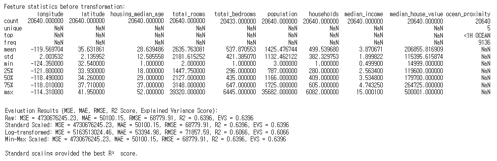 
 

## [1-9] 특성 엔지니어링(Feature Engineering)
▣ 정의 : 모델 성능을 최적화하기 위해 데이터를 변형하거나 새로운 특성을 생성하거나 변환, 선택 등의 작업 
▣ 필요성 : 고품질 특성은 모델의 성능을 크게 향상, 데이터의 의미를 반영하여 복잡한 패턴을 학습할 수 있도록 도움, 특성 중요도를 평가하여 불필요한 변수 제거 가능 
▣ 주요 기법 : 수학적 조합과 도메인 지식을 활용한 파생 특성 생성, 로그 변환과 다항식 변환으로 특성 변환, 모델 기반 선택(Lasso, XGBoost), 중요도 평가(LIME, SHAP)* 및 차원 축소(PCA, t-SNE)로 특성 선택 
▣ 장점 : 모델 성능을 큰 폭으로 개선 가능, 도메인 지식을 반영하여 더 나은 해석 가능, 중요하지 않은 특성을 제거해 학습 속도 향상 
▣ 단점 : 높은 도메인 지식 요구, 시간과 자원 소모, 잘못된 특성 생성은 모델 성능 저하 
▣ 적용대상 알고리즘 : 선형 모델, 의사결정 나무, 랜덤 포레스트, 딥러닝 등 대부분의 알고리즘 
**LIM(Local Interpretable Model-agnostic Explanations)** : 모델에 관계없이 로컬(Local) 단위에서 특정 예측에 대해 모델이 왜 그와 같은 결정을 내렸는지를 설명(개별 데이터 포인트에 대해 각 특성(feature)이 예측값에 얼마나 기여했는지 나타냄) 
**SHAP(SHapley Additive exPlanations)** : 각 특성이 예측값에 기여하는 정도를 공정하게 분배하는 방법론으로, 모든 특성 조합에서의 평균 기여도를 계산 

	#############################################################
	# [1] 데이터 처리 및 변환
	# [1-9] 특성 엔지니어링(Feature Engineering)
	#############################################################
	from sklearn.datasets import load_iris
	from sklearn.model_selection import train_test_split
	from sklearn.linear_model import LogisticRegression
	from sklearn.metrics import accuracy_score
	from sklearn.preprocessing import PolynomialFeatures
	import numpy as np
	import pandas as pd

	# 1. 데이터 로드 및 노이즈 추가
	iris = load_iris()
	X = pd.DataFrame(iris.data, columns=iris.feature_names)
	y = iris.target

	# 노이즈 추가
	np.random.seed(42)
	X_noisy = X + np.random.normal(0, 0.5, X.shape)

	# 2. 특성 엔지니어링 수행 전 평가
	X_train_raw, X_test_raw, y_train, y_test = train_test_split(X_noisy, y, test_size=0.3, random_state=42)
	model_raw = LogisticRegression(max_iter=500)
	model_raw.fit(X_train_raw, y_train)
	y_pred_raw = model_raw.predict(X_test_raw)
	accuracy_raw = accuracy_score(y_test, y_pred_raw)

	# 3. 특성 엔지니어링 수행: 상호작용 특성 추가
	poly = PolynomialFeatures(degree=2, interaction_only=True, include_bias=False)
	X_fe = pd.DataFrame(poly.fit_transform(X_noisy), columns=poly.get_feature_names_out(X.columns))

	# 4. 특성 엔지니어링 후 평가
	X_train_fe, X_test_fe, y_train, y_test = train_test_split(X_fe, y, test_size=0.3, random_state=42)
	model_fe = LogisticRegression(max_iter=500)
	model_fe.fit(X_train_fe, y_train)
	y_pred_fe = model_fe.predict(X_test_fe)
	accuracy_fe = accuracy_score(y_test, y_pred_fe)

	# 5. 결과 출력
	print(f"Accuracy before Feature Engineering: {accuracy_raw:.2f}")
	print(f"Accuracy after Feature Engineering: {accuracy_fe:.2f}")

	if accuracy_fe > accuracy_raw:
	    print("\nFeature Engineering improved the model's performance!")
	elif accuracy_fe == accuracy_raw:
	    print("\nFeature Engineering did not affect the model's performance.")
	else:
	    print("\nFeature Engineering decreased the model's performance.")

 

	Accuracy before Feature Engineering: 0.89
	Accuracy after Feature Engineering: 0.91
	Feature Engineering improved the model's performance!

 

## [1-10] 정보 병합(Data Fusion)
▣ 정의 : 여러 데이터 소스를 결합하여 단일하고 일관성 있는 데이터셋을 생성 
▣ 필요성 : 다양한 소스에서 수집된 데이터를 통합하여 더 풍부한 정보를 제공, 데이터 중복 및 불일치를 해결하여 분석 가능성을 높임 
▣ 주요 기법 : 서로 다른 스키마 간 매핑 정의(Data Mapping), 동일한 데이터 포인트 중복 제거(Deduplication), 다양한 형식을 통일된 형식으로 데이터 정규화(Normalization) 
▣ 장점 : 데이터 활용 가능성 증대, 복합적인 문제에 대한 다각적 분석 가능 
▣ 단점 : 데이터 소스 간 일치성 문제가 발생할 수 있음, 통합 규칙 설정과 변환 과정이 복잡 
▣ 적용대상 알고리즘 : 데이터 통합 후 모든 머신러닝 알고리즘에 적용 가능 

	#############################################################
	# [1] 데이터 처리 및 변환
	# [1-10] 정보 병합(Data Fusion)
	#############################################################
	from sklearn.model_selection import train_test_split
	from sklearn.linear_model import LinearRegression
	from sklearn.metrics import r2_score
	from sklearn.datasets import load_iris
	import pandas as pd
	import matplotlib.pyplot as plt
	import matplotlib.font_manager as fm

	# 한글 폰트 설정
	plt.rc('font', family='Malgun Gothic')  # Windows의 맑은 고딕 폰트
	plt.rcParams['axes.unicode_minus'] = False  # 한글 폰트 설정 시 음수 부호 깨짐 방지

	# Iris 데이터셋 로드
	iris = load_iris()
	iris_df = pd.DataFrame(data=iris.data, columns=iris.feature_names)
	iris_df['target'] = iris.target

	# 컬럼 이름을 간단하게 변경
	iris_df.columns = ['sepal_length', 'sepal_width', 'petal_length', 'petal_width', 'target']

	# 1단계: 'sepal_length'와 'sepal_width'를 사용하여 초기 선형 회귀 분석을 진행
	X_initial = iris_df[['sepal_length', 'sepal_width']]
	y = iris_df['target']

	# 학습 데이터와 테스트 데이터로 분리
	X_train_initial, X_test_initial, y_train, y_test = train_test_split(X_initial, y, test_size=0.2, random_state=42)

	# 2단계: 초기 선형 회귀 모델 학습
	linear_reg = LinearRegression()
	linear_reg.fit(X_train_initial, y_train)

	# 3단계: 테스트 데이터를 이용하여 예측하고 R2 점수 계산
	y_pred_initial = linear_reg.predict(X_test_initial)
	r2_initial = r2_score(y_test, y_pred_initial)

	# 4단계: 'petal_length'와 'petal_width'를 추가하여 데이터 병합
	X_combined = iris_df[['sepal_length', 'sepal_width', 'petal_length', 'petal_width']]

	# 학습 데이터와 테스트 데이터로 분리
	X_train_combined, X_test_combined, y_train, y_test = train_test_split(X_combined, y, test_size=0.2, random_state=42)

	# 5단계: 다중 선형 회귀 모델 학습
	multiple_linear_reg = LinearRegression()
	multiple_linear_reg.fit(X_train_combined, y_train)

	# 6단계: 테스트 데이터를 이용하여 예측하고 R2 점수 계산
	y_pred_combined = multiple_linear_reg.predict(X_test_combined)
	r2_combined = r2_score(y_test, y_pred_combined)

	# 결과 출력
	print("초기 모델의 R2 점수 (sepal_length, sepal_width):", r2_initial)
	print("병합 모델의 R2 점수 (sepal_length, sepal_width, petal_length, petal_width):", r2_combined)

	# 시각화
	# 초기 데이터 시각화 (sepal_length와 sepal_width만 사용)
	plt.figure(figsize=(12, 6))

	# 초기 데이터 산점도
	plt.subplot(1, 2, 1)
	for target, color, label in zip([0, 1, 2], ['red', 'blue', 'green'], iris.target_names):
	    subset = iris_df[iris_df['target'] == target]
	    plt.scatter(subset['sepal_length'], subset['sepal_width'], c=color, label=label, edgecolor='k')
	plt.title('초기 데이터 (Sepal Length vs. Sepal Width)')
	plt.xlabel('Sepal Length')
	plt.ylabel('Sepal Width')
	plt.legend()
	plt.colorbar(label='Target')

	# 병합 데이터 시각화 (petal_length와 petal_width 사용)
	plt.subplot(1, 2, 2)
	for target, color, label in zip([0, 1, 2], ['red', 'blue', 'green'], iris.target_names):
	    subset = iris_df[iris_df['target'] == target]
	    plt.scatter(subset['petal_length'], subset['petal_width'], c=color, label=label, edgecolor='k')
	plt.title('병합 데이터 (Sepal, Petal Length vs. Sepal, Petal Width)')
	plt.xlabel('Sepal, Petal Length')
	plt.ylabel('Sepal, Petal Width')
	plt.legend()

	plt.tight_layout()
	plt.show()

 

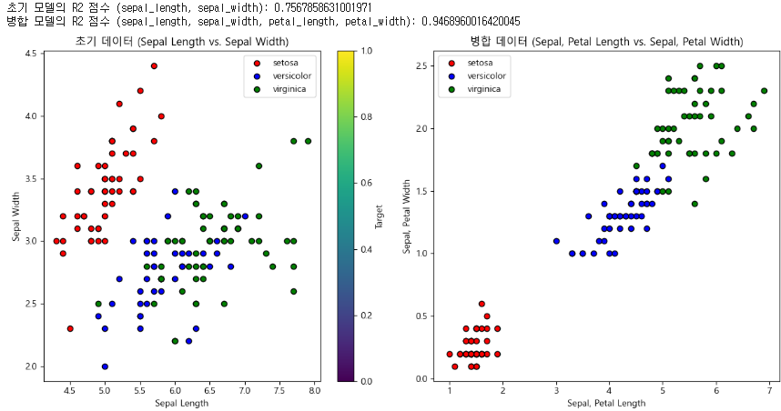 
 

---
  
# [2] 모델 복잡도 및 일반화 : 과적합 방지(Overfitting Prevention)
▣ 정의 : 모델이 학습 데이터에만 지나치게 적응하지 않도록 제어하여, 새로운 데이터에서도 일반화된 성능을 유지하도록 다양한 기법의 조합 
▣ 필요성 : 모델이 학습 데이터의 노이즈나 불필요한 패턴을 학습하지 않고 테스트 데이터나 실전 데이터에서도 높은 성능을 유지하도록 보장 
▣ 주요 기법 : 데이터 관련(Data Augmentation, Cross Validation), 모델 관련(Model Simplification, Regularization, Dropout), 훈련 관련(Early Stopping) 
▣ 장점 : 테스트 데이터에서의 안정적인 성능 확보, 일반화 성능 향상, 예측 모델의 신뢰도 증가 
▣ 단점 : 과적합 방지 기법이 과도하게 적용되면 과소적합(Underfitting), 최적의 설정을 찾기 위한 추가적인 실험과 조정이 필요 
▣ 적용대상 알고리즘 : 모든 머신러닝 및 딥러닝 알고리즘 

 

## [2-1] 정규화(L1, L2 Regularization)
▣ 정의 : 모델의 복잡성을 줄이기 위해 손실 함수에 패널티를 추가하여 모델 파라미터의 크기를 제어(L1 정규화: 가중치의 절댓값 합, L2 정규화: 가중치의 제곱합) 
▣ 필요성 : 모델이 불필요하게 큰 가중치를 학습하여 과적합되는 것을 방지 
▣ 주요 기법 : L1 정규화(Lasso Regression), L2 정규화(Ridge Regression), L1과 L2 혼합(Elastic Net) 
▣ 장점 : L1은 희소 모델(sparse model)을 생성하여 중요한 특성을 선택하는 데 유용, L2는 과도한 가중치를 줄여 모델 안정성 향상 
▣ 단점 : 과소적합 가능성, 정규화 강도를 조정하기 위한 하이퍼파라미터(λ) 선택 필요 
▣ 적용대상 알고리즘 : 선형 회귀(Linear Regression), 로지스틱 회귀(Logistic Regression), 서포트 벡터 머신(SVM), 뉴럴 네트워크 

	#############################################################
	# [2] 모델 복잡도 및 일반화
	# [2-1] 정규화 (L1, L2 Regularization) - iris data
	#############################################################
	from sklearn.model_selection import train_test_split, cross_val_score
	from sklearn.linear_model import LinearRegression, Ridge, Lasso
	from sklearn.metrics import r2_score
	from sklearn.datasets import load_iris
	import numpy as np

	# Iris 데이터셋 로드
	iris = load_iris()
	X = iris.data  # 특성: sepal_length, sepal_width, petal_length, petal_width
	y = iris.target  # 타겟: 품종

	# 학습 데이터와 테스트 데이터로 분리
	X_train, X_test, y_train, y_test = train_test_split(X, y, test_size=0.2, random_state=42)

	# (1) 기본 선형 회귀 분석
	linear_reg = LinearRegression()
	linear_reg.fit(X_train, y_train)
	y_pred_basic = linear_reg.predict(X_test)
	r2_basic = r2_score(y_test, y_pred_basic)

	# (2) 정규화 (릿지 회귀와 라쏘 회귀)
	ridge_reg = Ridge(alpha=1.0)  # 릿지 회귀
	ridge_reg.fit(X_train, y_train)
	y_pred_ridge = ridge_reg.predict(X_test)
	r2_ridge = r2_score(y_test, y_pred_ridge)

	lasso_reg = Lasso(alpha=0.1)  # 라쏘 회귀
	lasso_reg.fit(X_train, y_train)
	y_pred_lasso = lasso_reg.predict(X_test)
	r2_lasso = r2_score(y_test, y_pred_lasso)

	# (3) 드롭아웃 (드롭아웃은 딥러닝 모델에서 사용하는 방법으로, Scikit-learn에서는 직접 적용 불가)
	# 대신 과적합 방지를 위한 특성 제거나 정규화를 사용할 수 있음.

	# (4) 교차 검증 (기본 선형 회귀 모델에 대해 수행)
	cv_scores = cross_val_score(LinearRegression(), X, y, cv=5, scoring='r2')
	r2_cv = np.mean(cv_scores)

	# 결과 출력
	r2_results = {
	    "기본 선형 회귀 (R2)": r2_basic,
	    "릿지 회귀 (R2)": r2_ridge,
	    "라쏘 회귀 (R2)": r2_lasso,
	    "교차 검증 평균 (R2)": r2_cv}

	# 결과 확인
	print("R2 점수 결과:")
	for method, r2 in r2_results.items():
	    print(f"{method}: {r2}")

 

	R2 점수 결과:
	기본 선형 회귀 (R2): 0.9468960016420045
	릿지 회귀 (R2): 0.9440579987200237
	라쏘 회귀 (R2): 0.9044577045136053
	교차 검증 평균 (R2): 0.3225607248900085

 

	#############################################################
	# [2] 모델 복잡도 및 일반화
	# [2-1] 정규화 (L1, L2 Regularization) - titanic data
	#############################################################
	import pandas as pd
	from sklearn.model_selection import train_test_split, cross_val_score
	from sklearn.preprocessing import StandardScaler, OneHotEncoder
	from sklearn.compose import ColumnTransformer
	from sklearn.pipeline import Pipeline
	from sklearn.impute import SimpleImputer
	from sklearn.linear_model import LogisticRegression, Ridge, Lasso, ElasticNet
	from sklearn.metrics import r2_score

	# 1. 데이터 로드
	url = 'https://raw.githubusercontent.com/YangGuiBee/ML/main/TextBook-15/titanic_train.csv'
	data = pd.read_csv(url)

	# 2. 특징과 타겟 변수 분리
	X = data.drop(columns=['Survived'])
	y = data['Survived']

	# 3. 수치형 및 범주형 변수 식별
	numeric_features = ['Age', 'Fare', 'SibSp', 'Parch']
	categorical_features = ['Pclass', 'Sex', 'Embarked']

	# 4. 전처리 파이프라인 구성
	numeric_transformer = Pipeline(steps=[
	    ('imputer', SimpleImputer(strategy='median')),
	    ('scaler', StandardScaler())])

	categorical_transformer = Pipeline(steps=[
	    ('imputer', SimpleImputer(strategy='most_frequent')),
	    ('onehot', OneHotEncoder(handle_unknown='ignore'))])

	preprocessor = ColumnTransformer(
	    transformers=[
	        ('num', numeric_transformer, numeric_features),
	        ('cat', categorical_transformer, categorical_features)])

	# 5. 기본 선형 회귀 모델 구성
	linear_model = Pipeline(steps=[('preprocessor', preprocessor),
	                               ('classifier', LogisticRegression(max_iter=1000))])

	# 데이터 분할
	X_train, X_test, y_train, y_test = train_test_split(X, y, test_size=0.2, random_state=42)

	# 6. 기본 선형 회귀 모델 학습 및 평가
	linear_model.fit(X_train, y_train)
	y_pred = linear_model.predict(X_test)
	r2_basic = r2_score(y_test, y_pred)

	# 7. 정규화 적용 (릿지 회귀)
	ridge_model = Pipeline(steps=[('preprocessor', preprocessor),
	                              ('classifier', Ridge(alpha=1.0))])
	ridge_model.fit(X_train, y_train)
	y_pred_ridge = ridge_model.predict(X_test)
	r2_ridge = r2_score(y_test, y_pred_ridge)

	# 8. 정규화 적용 (라쏘 회귀)
	lasso_model = Pipeline(steps=[('preprocessor', preprocessor),
	                              ('classifier', Lasso(alpha=0.1))])
	lasso_model.fit(X_train, y_train)
	y_pred_lasso = lasso_model.predict(X_test)
	r2_lasso = r2_score(y_test, y_pred_lasso)

	# 9. 정규화 적용 (엘라스틱넷)
	elastic_model = Pipeline(steps=[('preprocessor', preprocessor),
	                                 ('classifier', ElasticNet(alpha=0.1, l1_ratio=0.5))])
	elastic_model.fit(X_train, y_train)
	y_pred_elastic = elastic_model.predict(X_test)
	r2_elastic = r2_score(y_test, y_pred_elastic)

	# 10. 교차 검증 적용
	cv_scores = cross_val_score(linear_model, X, y, cv=5, scoring='r2')
	r2_cv = cv_scores.mean()

	# 11. 결과 출력
	print("R² 점수 결과:")
	print(f"기본 선형 회귀 모델의 R² 점수: {r2_basic:.4f}")
	print(f"릿지 회귀 모델의 R² 점수: {r2_ridge:.4f}")
	print(f"라쏘 회귀 모델의 R² 점수: {r2_lasso:.4f}")
	print(f"엘라스틱넷 회귀 모델의 R² 점수: {r2_elastic:.4f}")
	print(f"교차 검증을 통한 평균 R² 점수: {r2_cv:.4f}")

 

	R² 점수 결과:
	기본 선형 회귀 모델의 R² 점수: 0.1707
	릿지 회귀 모델의 R² 점수: 0.4334
	라쏘 회귀 모델의 R² 점수: 0.1085
	엘라스틱넷 회귀 모델의 R² 점수: 0.2678
	교차 검증을 통한 평균 R² 점수: 0.1125

 

## [2-2] 조기 종료(Early Stopping)
▣ 정의 : 학습 중 검증 세트의 성능이 더 이상 개선되지 않는 시점에서 학습을 중단 
▣ 필요성 : 학습을 너무 오래 진행할 경우 모델이 학습 데이터에 과적합될 위험을 줄이기 위함 
▣ 주요 기법 : 검증 손실 모니터링(검증 손실이 감소하지 않을 경우 중단), Patience 설정(특정 에포크 동안 향상이 없을 때 종료) 
▣ 장점 : 과적합 방지, 불필요한 학습 시간 절약 
▣ 단점 : 검증 데이터의 성능을 과도하게 의존하거나, 최적의 종료 시점 결정 곤란 
▣ 적용대상 알고리즘 : 모든 딥러닝 모델, 일부 머신러닝(Gradient Boosting) 등 에폭(Epoch)*이 긴 경우 
   * 모델 학습 과정에서 전체 데이터셋을 여러 번 반복해서 학습하는 횟수(데이터셋의 모든 샘플이 모델에 입력되어 가중치가 업데이트되는 과정을 한번 완료하는 것이 1 에폭) 

	#############################################################
	# [2] 모델 복잡도 및 일반화
	# [2-2] 조기 종료 (Early Stopping)
	#############################################################
	import pandas as pd
	from sklearn.model_selection import train_test_split
	from sklearn.preprocessing import StandardScaler, OneHotEncoder, PolynomialFeatures
	from sklearn.compose import ColumnTransformer
	from sklearn.pipeline import Pipeline
	from sklearn.impute import SimpleImputer
	from sklearn.linear_model import SGDRegressor
	from sklearn.metrics import r2_score, mean_squared_error, mean_absolute_error

	# 1. 데이터 로드
	url = 'https://raw.githubusercontent.com/YangGuiBee/ML/main/TextBook-15/titanic_train.csv'
	data = pd.read_csv(url)

	# 2. 특징과 타겟 변수 분리
	X = data.drop(columns=['Survived'])
	y = data['Survived']

	# 3. 수치형 및 범주형 변수 식별
	numeric_features = ['Age', 'Fare', 'SibSp', 'Parch']
	categorical_features = ['Pclass', 'Sex', 'Embarked']

	# 4. 전처리 파이프라인 구성
	numeric_transformer = Pipeline(steps=[
	    ('imputer', SimpleImputer(strategy='median')),
	    ('scaler', StandardScaler())])

	categorical_transformer = Pipeline(steps=[
	    ('imputer', SimpleImputer(strategy='most_frequent')),
	    ('onehot', OneHotEncoder(handle_unknown='ignore'))])

	preprocessor = ColumnTransformer(
	    transformers=[('num', numeric_transformer, numeric_features),
	        ('cat', categorical_transformer, categorical_features)])

	# 데이터 분할
	X_train, X_test, y_train, y_test = train_test_split(X, y, test_size=0.2, random_state=42)

	# 5. 기본 다항 회귀 모델 구성 (SGDRegressor 사용)
	polynomial_model = Pipeline(steps=[
	    ('preprocessor', preprocessor),
	    ('poly_features', PolynomialFeatures(degree=2, include_bias=False, interaction_only=False)),
	    ('scaler', StandardScaler()),
	    ('regressor', SGDRegressor(max_iter=1000, tol=1e-3, learning_rate='adaptive',
	                               eta0=0.001, penalty='l2', alpha=0.0001, random_state=42))])

	# 6. 기본 다항 회귀 모델 학습 및 평가
	polynomial_model.fit(X_train, y_train)
	y_pred_poly = polynomial_model.predict(X_test)
	r2_poly_basic = r2_score(y_test, y_pred_poly)
	mse_poly_basic = mean_squared_error(y_test, y_pred_poly)
	mae_poly_basic = mean_absolute_error(y_test, y_pred_poly)

	# 7. 조기 종료 적용 다항 회귀 모델 구성
	early_stopping_poly_model = Pipeline(steps=[
	    ('preprocessor', preprocessor),
	    ('poly_features', PolynomialFeatures(degree=2, include_bias=False, interaction_only=False)),
    	    ('scaler', StandardScaler()),
	    ('regressor', SGDRegressor(max_iter=2000, tol=1e-3, early_stopping=True,
	                               validation_fraction=0.2, n_iter_no_change=5,
	                               learning_rate='adaptive', eta0=0.001, penalty='l2', alpha=0.0001, random_state=42))])

	# 8. 조기 종료 적용 다항 회귀 모델 학습 및 평가
	early_stopping_poly_model.fit(X_train, y_train)
	y_pred_poly_early_stopping = early_stopping_poly_model.predict(X_test)
	r2_poly_early_stopping = r2_score(y_test, y_pred_poly_early_stopping)
	mse_poly_early_stopping = mean_squared_error(y_test, y_pred_poly_early_stopping)
	mae_poly_early_stopping = mean_absolute_error(y_test, y_pred_poly_early_stopping)

	# 결과 출력
	print("다항 회귀 모델 결과 (SGDRegressor 사용):")
	print(f"기본 다항 회귀 모델의 R² 점수: {r2_poly_basic:.4f}, MSE: {mse_poly_basic:.4f}, MAE: {mae_poly_basic:.4f}")
	print(f"조기 종료 적용 다항 회귀 모델의 R² 점수: {r2_poly_early_stopping:.4f}, MSE: {mse_poly_early_stopping:.4f}, 	MAE: {mae_poly_early_stopping:.4f}")

 

	다항 회귀 모델 결과 (SGDRegressor 사용):
	기본 다항 회귀 모델의 R² 점수: 0.4101, MSE: 0.1430, MAE: 0.2685
	조기 종료 적용 다항 회귀 모델의 R² 점수: 0.4286, MSE: 0.1386, MAE: 0.2640

 

## [2-3] 앙상블 학습(Ensemble Learning)
▣ 정의 : 여러 개의 모델을 결합(배깅: 각 모델의 독립적인 학습, 부스팅: 각 모델이 순차적으로 학습, 스태킹: 서로다른 모델의 예측결과 결합) 
▣ 필요성 : 단일 모델의 한계를 극복하고, 데이터의 다양한 패턴을 더 잘 학습 
▣ 주요 기법 : 스태킹, 배깅(Random Forest), 부스팅(AdaBoost, Gradient Boosting, XGBoost, LightGBM) 
▣ 장점 : 높은 성능과 일반화 능력, 다양한 데이터 및 모델 유형에 적용 가능 
▣ 단점 : 계산 비용 증가, 구현 복잡성 
▣ 적용대상 알고리즘 : 모든 지도 학습 알고리즘(분류, 회귀 등) 

	#############################################################
	# [2] 모델 복잡도 및 일반화
	# [2-3] 앙상블 학습 (Ensemble Learning)
	#############################################################
	from sklearn.datasets import load_iris
	from sklearn.model_selection import train_test_split
	from sklearn.ensemble import StackingRegressor, BaggingRegressor, GradientBoostingRegressor
	from sklearn.linear_model import LinearRegression
	from sklearn.tree import DecisionTreeRegressor
	from sklearn.svm import SVR
	from sklearn.metrics import r2_score

	# 1. 데이터 로드 및 분할
	iris = load_iris()
	X = iris.data
	y = iris.target

	# 데이터 분할
	X_train, X_test, y_train, y_test = train_test_split(X, y, test_size=0.2, random_state=42)

	# 2. 기본 선형 회귀 모델
	linear_model = LinearRegression()
	linear_model.fit(X_train, y_train)
	y_pred_linear = linear_model.predict(X_test)
	r2_linear = r2_score(y_test, y_pred_linear)

	# 3. Stacking 앙상블
	stacking_model = StackingRegressor(
	    estimators=[
	        ('lr', LinearRegression()),
	        ('dt', DecisionTreeRegressor()),
	        ('svr', SVR())],
	    final_estimator=LinearRegression())
	stacking_model.fit(X_train, y_train)
	y_pred_stacking = stacking_model.predict(X_test)
	r2_stacking = r2_score(y_test, y_pred_stacking)

	# 4. Bagging 앙상블
	bagging_model = BaggingRegressor(
	    estimator=DecisionTreeRegressor(),  # 수정된 파라미터 이름
	    n_estimators=10,
	    random_state=42)
	bagging_model.fit(X_train, y_train)
	y_pred_bagging = bagging_model.predict(X_test)
	r2_bagging = r2_score(y_test, y_pred_bagging)

	# 5. Boosting 앙상블 (Gradient Boosting)
	boosting_model = GradientBoostingRegressor(random_state=42)
	boosting_model.fit(X_train, y_train)
	y_pred_boosting = boosting_model.predict(X_test)
	r2_boosting = r2_score(y_test, y_pred_boosting)

	# 결과 출력
	print("R² 점수 결과:")
	print(f"기본 선형 회귀 모델의 R² 점수: {r2_linear:.4f}")
	print(f"Stacking 앙상블 모델의 R² 점수: {r2_stacking:.4f}")
	print(f"Bagging 앙상블 모델의 R² 점수: {r2_bagging:.4f}")
	print(f"Boosting 앙상블 모델의 R² 점수: {r2_boosting:.4f}")
	
 

	R² 점수 결과:
	기본 선형 회귀 모델의 R² 점수: 0.9469
	Stacking 앙상블 모델의 R² 점수: 0.9623
	Bagging 앙상블 모델의 R² 점수: 0.9990
	Boosting 앙상블 모델의 R² 점수: 0.9938

 

## [2-4] 모델 해석성 (Model Interpretability)
▣ 정의 : 모델이 내린 예측 결과에 대해 설명 가능하도록 하는 기법 
▣ 필요성 : 블랙박스 모델(딥러닝, 앙상블)의 투명성 확보, 비즈니스나 의료 등 고위험 분야에서 신뢰 확보 
▣ 주요 기법 : LIME(특정 예측 로컬 단위에서 단순 모델로 근사), SHAP(특징별 기여도를 계산하여 예측에 대한 글로벌 및 로컬 해석 제공) 
▣ 장점 : 사용자 신뢰 확보, 모델 디버깅 및 개선 가능 
▣ 단점 : 계산 비용이 높음, 높은 차원의 데이터에서 복잡성 증가 
▣ 적용대상 알고리즘 : 모든 블랙박스 모델 (e.g., 신경망, 앙상블 학습 모델) 

	#############################################################
	# [2] 모델 복잡도 및 일반화
	# [2-4] 모델 해석성(Model Interpretability) : LIME
	#############################################################
	import subprocess
	import sys
	# 필요한 패키지가 설치되어 있는지 확인하고, 없으면 설치
	required_packages = ['lime', 'xgboost', 'scikit-learn', 'matplotlib']
	for package in required_packages:
	    try:
	        __import__(package)
	    except ImportError:
	        print(f"Package {package} not found. Installing...")
	        subprocess.check_call([sys.executable, "-m", "pip", "install", package])

	# 필수 라이브러리 import
	import lime
	import lime.lime_tabular
	import xgboost as xgb
	from sklearn.datasets import load_breast_cancer
	from sklearn.model_selection import train_test_split
	from sklearn.preprocessing import StandardScaler
	import matplotlib.pyplot as plt

	# 데이터 로드
	data = load_breast_cancer()
	X = data.data
	y = data.target

	# 데이터 분할
	X_train, X_test, y_train, y_test = train_test_split(X, y, test_size=0.2, random_state=42)

	# 데이터 표준화
	scaler = StandardScaler()
	X_train_scaled = scaler.fit_transform(X_train)
	X_test_scaled = scaler.transform(X_test)

	# XGBoost 모델 학습
	model = xgb.XGBClassifier(eval_metric='logloss')
	model.fit(X_train_scaled, y_train)

	# LIME explainer 생성 (training_sample_weight 인자 제거)
	explainer = lime.lime_tabular.LimeTabularExplainer(
	    training_data=X_train_scaled,
	    training_labels=y_train,
	    mode="classification",
	    feature_names=data.feature_names,
	    class_names=data.target_names,
	    discretize_continuous=True)

	# 테스트 데이터의 첫 번째 샘플을 선택하여 예측 설명
	i = 0  # 첫 번째 샘플
	explanation = explainer.explain_instance(X_test_scaled[i], model.predict_proba)

	# 결과 시각화
	explanation.show_in_notebook(show_table=True, show_all=False)

	# 특정 샘플에 대한 LIME 해석 그래프 출력
	explanation.as_pyplot_figure()
	plt.show()

 

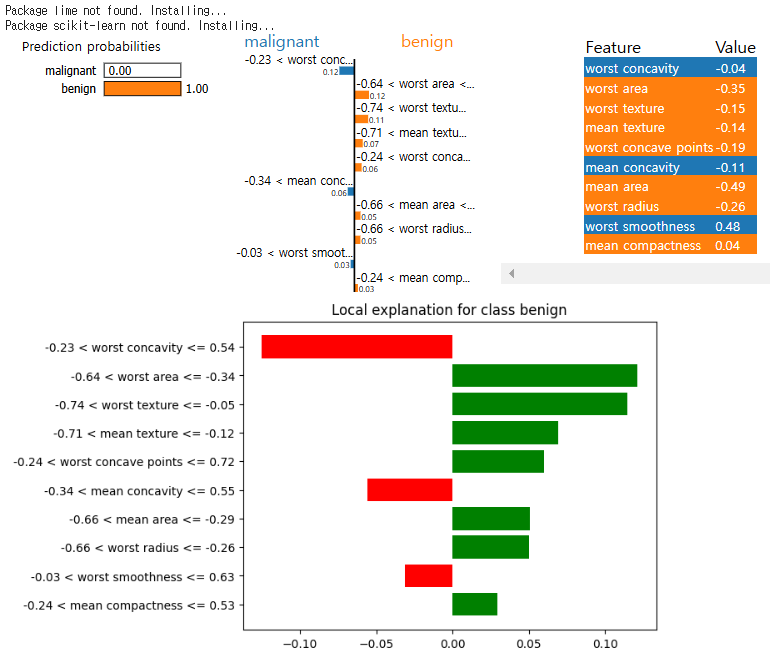 
 

	#############################################################
	# [2] 모델 복잡도 및 일반화
	# [2-4] 모델 해석성(Model Interpretability) : SHAP
	#############################################################
	import subprocess
	import sys
	# 필요한 패키지가 설치되어 있는지 확인하고, 없으면 설치
	required_packages = ['shap', 'xgboost', 'scikit-learn', 'matplotlib']
	for package in required_packages:
	    try:
 	       __import__(package)
 	   except ImportError:
	        print(f"Package {package} not found. Installing...")
	        subprocess.check_call([sys.executable, "-m", "pip", "install", package])

	# 필수 라이브러리 import
	import shap
	import xgboost as xgb
	from sklearn.datasets import load_breast_cancer
	from sklearn.model_selection import train_test_split
	from sklearn.preprocessing import StandardScaler
	import matplotlib.pyplot as plt

	# 데이터 로드
	data = load_breast_cancer()
	X = data.data
	y = data.target

	# 데이터 분할
	X_train, X_test, y_train, y_test = train_test_split(X, y, test_size=0.2, random_state=42)

	# 데이터 표준화
	scaler = StandardScaler()
	X_train_scaled = scaler.fit_transform(X_train)
	X_test_scaled = scaler.transform(X_test)

	# XGBoost 모델 학습
	model = xgb.XGBClassifier(eval_metric='logloss')
	model.fit(X_train_scaled, y_train)

	# SHAP Explainer 생성
	explainer = shap.Explainer(model, X_train_scaled)

	# 테스트 데이터에 대해 SHAP 값 계산
	shap_values = explainer(X_test_scaled)

	# 테스트 데이터의 첫 번째 샘플에 대해 SHAP 값 시각화
	i = 0  # 첫 번째 샘플
	print(f"SHAP values for test sample {i}:")
	shap.initjs()

	# 단일 클래스 분류의 SHAP 값 시각화
	# 다중 클래스 분류가 아닌 경우, base_value와 shap_values는 1차원
	shap.force_plot(
	    base_value=shap_values[i].base_values,  # 기준값 (스칼라 값)
	    shap_values=shap_values[i].values,     # SHAP 값 (특성별 값)
	    features=X_test_scaled[i],             # 해당 샘플의 입력값
	    feature_names=data.feature_names)

	# 전체 테스트 데이터에서 중요도 요약 그래프
	shap.summary_plot(shap_values.values, X_test_scaled, feature_names=data.feature_names)

	# 특정 샘플에 대한 Bar Chart (SHAP 값의 크기)
	shap.plots.bar(shap_values[i])

 

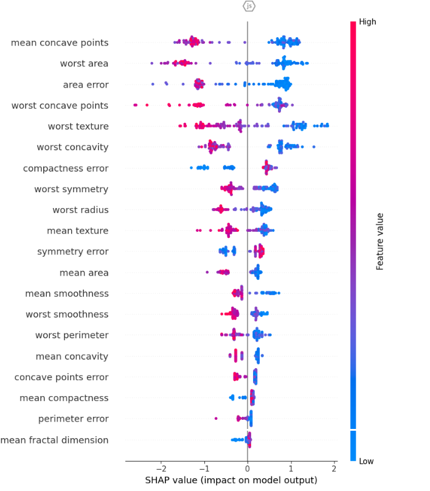 
 

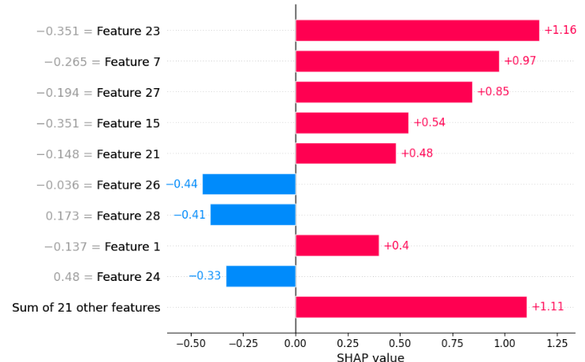 
 

---

# [3] 하이퍼파라미터 최적화
## [3-1] 하이퍼파라미터 튜닝(Hyperparameter Tuning)
▣ 정의 : 하이퍼파라미터는 학습 과정에서 사용자가 사전에 설정하는 변수로, 학습률, 정규화 강도, 의사결정나무의 최대 깊이 등 등을 조정하여 모델의 성능을 최적화하는 과정 
▣ 필요성 : 최적의 하이퍼파라미터를 찾지 못하면 과적합, 과소적합 또는 학습 속도 저하가 발생 
▣ 장점 : 모델 성능 극대화 가능, 다양한 데이터와 문제 유형에 적용 가능 
▣ 단점 : 계산 비용이 많이 들고, 시간이 오래 걸릴 수 있으며, 탐색 공간이 커질수록 복잡도 증가 
▣ 적용대상 알고리즘 : 모든 머신러닝 및 딥러닝 알고리즘 

	#############################################################
	# [3] 하이퍼파라미터 최적화
	# [3-1] 하이퍼파라미터 튜닝 (Hyperparameter Tuning)
	#############################################################
	from sklearn.datasets import load_iris
	from sklearn.model_selection import train_test_split
	from sklearn.ensemble import GradientBoostingRegressor
	from sklearn.metrics import r2_score

	# 1. 데이터 로드 및 분할
	iris = load_iris()
	X = iris.data
	y = iris.target

	# 데이터 분할
	X_train, X_test, y_train, y_test = train_test_split(X, y, test_size=0.2, random_state=42)

	# 2. 기본 선형 회귀 모델
	from sklearn.linear_model import LinearRegression
	linear_model = LinearRegression()
	linear_model.fit(X_train, y_train)
	y_pred_linear = linear_model.predict(X_test)
	r2_linear = r2_score(y_test, y_pred_linear)

	# 3. Gradient Boosting Regressor 하이퍼파라미터 설정 및 학습
	optimized_gbr = GradientBoostingRegressor(
	    n_estimators=150,  # 최적의 부스팅 단계 수
	    learning_rate=0.1,  # 적절한 학습률
	    max_depth=4,  # 최적의 트리 깊이
	    random_state=42)
	optimized_gbr.fit(X_train, y_train)

	# 4. 최적화된 Gradient Boosting Regressor 모델 평가
	y_pred_optimized = optimized_gbr.predict(X_test)
	r2_optimized = r2_score(y_test, y_pred_optimized)

	# 결과 출력
	print("R2 점수 결과:")
	print(f"기본 선형 회귀 모델의 R2 점수: {r2_linear:.4f}")
	print(f"최적화된 Gradient Boosting Regressor의 R2 점수: {r2_optimized:.4f}")

 

	R2 점수 결과:
	기본 선형 회귀 모델의 R2 점수: 0.9469
	최적화된 Gradient Boosting Regressor의 R2 점수: 0.9987

 

## [3-2] 그리드 서치(Grid Search)
▣ 정의 : 하이퍼파라미터의 모든 조합을 체계적으로 탐색하여 최적의 하이퍼파라미터를 찾는 방법 
▣ 필요성 : 체계적으로 모든 조합을 탐색하므로 최적의 설정을 찾을 가능성이 높음 
▣ 장점 : 간단하고 직관적이며 구현이 용이하며, 하이퍼파라미터 조합의 전 범위를 탐색 가능 
▣ 단점 : 탐색 공간이 커질수록 계산 비용과 시간이 기하급수적으로 증가하며, 불필요한 조합까지 계산할 수 있음 
▣ 적용대상 알고리즘 : 모든 머신러닝 및 딥러닝 알고리즘, 하이퍼파라미터 공간이 비교적 작은 문제에 적합, Scikit-learn에서 GridSearchCV 함수 제공 

	#############################################################
	# [3] 하이퍼파라미터 최적화
	# [3-2] 그리드 서치 (Grid Search)
	#############################################################
	from sklearn.datasets import load_iris
	from sklearn.model_selection import train_test_split, GridSearchCV
	from sklearn.linear_model import LinearRegression
	from sklearn.ensemble import GradientBoostingRegressor
	from sklearn.metrics import r2_score

	# 1. 데이터 로드 및 분할
	iris = load_iris()
	X = iris.data
	y = iris.target

	# 데이터 분할
	X_train, X_test, y_train, y_test = train_test_split(X, y, test_size=0.2, random_state=42)

	# 2. 기본 선형 회귀 모델
	linear_model = LinearRegression()
	linear_model.fit(X_train, y_train)
	y_pred_linear = linear_model.predict(X_test)
	r2_linear = r2_score(y_test, y_pred_linear)

	# 3. Hyperparameter Tuning (GridSearchCV with GradientBoostingRegressor)
	param_grid = {
	    'n_estimators': [50, 100, 150],
	    'learning_rate': [0.01, 0.1, 0.2],
	    'max_depth': [3, 4, 5]}

	gbr = GradientBoostingRegressor(random_state=42)
	grid_search = GridSearchCV(estimator=gbr, param_grid=param_grid, scoring='r2', cv=5, n_jobs=-1)
	grid_search.fit(X_train, y_train)

	# 최적 하이퍼파라미터로 학습된 모델 평가
	best_model = grid_search.best_estimator_
	y_pred_tuned = best_model.predict(X_test)
	r2_tuned = r2_score(y_test, y_pred_tuned)

	# 결과 출력
	print("R² 점수 결과:")
	print(f"기본 선형 회귀 모델의 R² 점수: {r2_linear:.4f}")
	print(f"Hyperparameter Tuning 후 Gradient Boosting Regressor의 R² 점수: {r2_tuned:.4f}")
	print(f"최적 하이퍼파라미터: {grid_search.best_params_}")

 

	R² 점수 결과:
	기본 선형 회귀 모델의 R² 점수: 0.9469
	Hyperparameter Tuning 후 Gradient Boosting Regressor의 R² 점수: 1.0000
	최적 하이퍼파라미터: {'learning_rate': 0.1, 'max_depth': 5, 'n_estimators': 50}

 

## [3-3] 랜덤 서치(Random Search)
▣ 정의 : 하이퍼파라미터의 값들을 임의로 선택하여 최적의 조합을 탐색 
▣ 필요성 : 그리드 서치보다 계산 효율성을 높이며, 더 큰 탐색 공간에서 효과적으로 탐색 
▣ 장점 : 계산 효율성 증대, 적은 계산으로도 높은 성능의 하이퍼파라미터를 찾을 가능성 
▣ 단점 : 최적의 조합을 반드시 찾지 못할 가능성, 탐색 결과가 실행마다 달라질 수 있음 
▣ 적용대상 알고리즘 : 모든 머신러닝 및 딥러닝 알고리즘, 대규모 하이퍼파라미터 공간에 적합, Scikit-learn에서 RandomizedSearchCV 함수 제공 

	#############################################################
	# [3] 하이퍼파라미터 최적화
	# [3-3] 랜덤 서치 (Random Search)
	#############################################################
	from sklearn.datasets import load_iris
	from sklearn.model_selection import train_test_split, RandomizedSearchCV
	from sklearn.linear_model import LinearRegression
	from sklearn.ensemble import GradientBoostingRegressor
	from sklearn.metrics import r2_score
	from scipy.stats import randint, uniform

	# 1. 데이터 로드 및 분할
	iris = load_iris()
	X = iris.data
	y = iris.target

	# 데이터 분할
	X_train, X_test, y_train, y_test = train_test_split(X, y, test_size=0.2, random_state=42)

	# 2. 기본 선형 회귀 모델
	linear_model = LinearRegression()
	linear_model.fit(X_train, y_train)
	y_pred_linear = linear_model.predict(X_test)
	r2_linear = r2_score(y_test, y_pred_linear)

	# 3. Random Search (RandomizedSearchCV with GradientBoostingRegressor)
	param_distributions = {
	    'n_estimators': randint(50, 200),  # 부스팅 단계 수
	    'learning_rate': uniform(0.01, 0.2),  # 학습률 범위
	    'max_depth': randint(3, 7)  # 트리 깊이 범위
	}

	gbr = GradientBoostingRegressor(random_state=42)
	random_search = RandomizedSearchCV(estimator=gbr, param_distributions=param_distributions, 
	                                   n_iter=50, scoring='r2', cv=5, random_state=42, n_jobs=-1)
	random_search.fit(X_train, y_train)

	# 최적 하이퍼파라미터로 학습된 모델 평가
	best_model = random_search.best_estimator_
	y_pred_tuned = best_model.predict(X_test)
	r2_tuned = r2_score(y_test, y_pred_tuned)

	# 결과 출력
	print("R2 점수 결과:")
	print(f"기본 선형 회귀 모델의 R2 점수: {r2_linear:.4f}")
	print(f"Random Search 후 Gradient Boosting Regressor의 R2 점수: {r2_tuned:.4f}")
	print(f"최적 하이퍼파라미터: {random_search.best_params_}")

 

	R2 점수 결과:
	기본 선형 회귀 모델의 R2 점수: 0.9469
	Random Search 후 Gradient Boosting Regressor의 R2 점수: 1.0000
	최적 하이퍼파라미터: {'learning_rate': 0.1554543991712842, 'max_depth': 5, 'n_estimators': 89}

 

## [3-4] 베이즈 최적화(Bayesian Optimization)
▣ 정의 : 이전 탐색 결과를 바탕으로 하이퍼파라미터 공간을 효율적으로 탐색하여 최적값을 찾는 방법으로 확률 모델(예: 가우시안 프로세스)을 활용하여 탐색 
▣ 필요성 : 계산 비용이 높은 문제에서 효율적으로 최적의 하이퍼파라미터를 찾기 위해 필요 
▣ 장점 : 효율적인 탐색으로 계산 자원을 절약, 이전 결과를 바탕으로 탐색하여 빠른 수렴 
▣ 단점 : 구현 및 이해가 복잡할 수 있으며, 탐색 초기에는 성능이 낮을 수 있음 
▣ 적용대상 알고리즘 : 계산 비용이 높은 머신러닝(랜덤 포레스트) 및 딥러닝 모델 

	#############################################################
	# [3] 하이퍼파라미터 최적화
	# [3-4] 베이즈 최적화 (Bayesian Optimization)
	#############################################################
	import subprocess
	import sys	
	# 필요한 패키지를 설치하는 함수
	def install_package(package):
	    subprocess.check_call([sys.executable, "-m", "pip", "install", package])

	# 필요한 패키지 확인 및 설치
	try:
	    from skopt import BayesSearchCV
	except ImportError:
	    install_package("scikit-optimize")
	    from skopt import BayesSearchCV

	from sklearn.datasets import load_iris
	from sklearn.model_selection import train_test_split
	from sklearn.linear_model import LinearRegression
	from sklearn.ensemble import GradientBoostingRegressor
	from sklearn.metrics import r2_score
	from skopt.space import Real, Integer

	# 1. 데이터 로드 및 분할
	iris = load_iris()
	X = iris.data
	y = iris.target

	# 데이터 분할
	X_train, X_test, y_train, y_test = train_test_split(X, y, test_size=0.2, random_state=42)

	# 2. 기본 선형 회귀 모델
	linear_model = LinearRegression()
	linear_model.fit(X_train, y_train)
	y_pred_linear = linear_model.predict(X_test)
	r2_linear = r2_score(y_test, y_pred_linear)

	# 3. Bayesian Optimization (BayesSearchCV with GradientBoostingRegressor)
	param_space = {
	    'n_estimators': Integer(50, 200),
	    'learning_rate': Real(0.01, 0.2, prior='log-uniform'),
	    'max_depth': Integer(3, 7)}

	gbr = GradientBoostingRegressor(random_state=42)
	bayes_search = BayesSearchCV(
	    estimator=gbr,
	    search_spaces=param_space,
	    n_iter=50,
	    scoring='r2',
	    cv=5,
	    random_state=42,
	    n_jobs=-1)
	bayes_search.fit(X_train, y_train)

	# 최적 하이퍼파라미터로 학습된 모델 평가
	best_model = bayes_search.best_estimator_
	y_pred_tuned = best_model.predict(X_test)
	r2_tuned = r2_score(y_test, y_pred_tuned)

	# 결과 출력
	print("R2 점수 결과:")
	print(f"기본 선형 회귀 모델의 R2 점수: {r2_linear:.4f}")
	print(f"Bayesian Optimization 후 Gradient Boosting Regressor의 R2 점수: {r2_tuned:.4f}")
	print(f"최적 하이퍼파라미터: {bayes_search.best_params_}")

 

	R2 점수 결과:
	기본 선형 회귀 모델의 R2 점수: 0.9469
	Bayesian Optimization 후 Gradient Boosting Regressor의 R2 점수: 1.0000
	최적 하이퍼파라미터: OrderedDict({'learning_rate': 0.10970919052074331, 'max_depth': 5, 'n_estimators': 129})

 

## [3-5] 하이퍼파라미터 탐색 자동화(Automated Hyperparameter Tuning)
▣ 정의 : 하이퍼파라미터 튜닝 과정을 자동화하여 최적화된 하이퍼파라미터를 찾는 기법 
▣ 필요성 : 수동으로 하이퍼파라미터를 조정하는 데 드는 시간과 노력을 줄이기 위해 필요 
▣ 장점 : 효율적이고 편리하며 반복 가능, 초보자도 고성능 모델 구현 가능 
▣ 단점 : 도구 및 알고리즘의 제한 사항에 따라 최적 성능을 보장하지 못할 수도 있으며, 도구 사용에 따른 비용 발생 가능 
▣ 적용대상 알고리즘 : 모든 머신러닝 및 딥러닝 알고리즘, 특히 AutoML을 사용하는 대규모 프로젝트 

	#############################################################
	# [3] 하이퍼파라미터 최적화
	# [3-5] 하이퍼파라미터 탐색 자동화 (Automated Hyperparameter Tuning)
	#############################################################
	import subprocess
	import sys
	# 필요한 패키지 설치 함수
	def install_package(package):
	    subprocess.check_call([sys.executable, "-m", "pip", "install", package])

	# 필요한 패키지 확인 및 설치
	try:
	    import optuna
	except ImportError:
	    install_package("optuna")

	from sklearn.datasets import load_iris
	from sklearn.model_selection import train_test_split, cross_val_score
	from sklearn.linear_model import LinearRegression
	from sklearn.ensemble import GradientBoostingRegressor
	from sklearn.metrics import r2_score
	import optuna

	# Optuna 로그 최소화
	optuna.logging.set_verbosity(optuna.logging.WARNING)

	# 1. 데이터 로드 및 분할
	iris = load_iris()
	X = iris.data
	y = iris.target

	# 데이터 분할
	X_train, X_test, y_train, y_test = train_test_split(X, y, test_size=0.2, random_state=42)

	# 2. 기본 선형 회귀 모델
	linear_model = LinearRegression()
	linear_model.fit(X_train, y_train)
	y_pred_linear = linear_model.predict(X_test)
	r2_linear = r2_score(y_test, y_pred_linear)

	# 3. Optuna를 사용한 하이퍼파라미터 탐색
	def objective(trial):
	    # 하이퍼파라미터 공간 정의
	    n_estimators = trial.suggest_int("n_estimators", 50, 200)
	    learning_rate = trial.suggest_float("learning_rate", 0.01, 0.2, log=True)
	    max_depth = trial.suggest_int("max_depth", 3, 7)
    
	    model = GradientBoostingRegressor(
	        n_estimators=n_estimators,
	        learning_rate=learning_rate,
	        max_depth=max_depth,
	        random_state=42)
	    # 5-Fold 교차 검증
    	    cv_scores = cross_val_score(model, X_train, y_train, cv=5, scoring='r2')
   	    return cv_scores.mean()

	# Optuna 스터디 생성 및 실행
	study = optuna.create_study(direction="maximize")
	study.optimize(objective, n_trials=50)

	# 최적화된 하이퍼파라미터로 모델 학습
	best_params = study.best_params
	optimized_model = GradientBoostingRegressor(
	    n_estimators=best_params["n_estimators"],
	    learning_rate=best_params["learning_rate"],
	    max_depth=best_params["max_depth"],
	    random_state=42)
	optimized_model.fit(X_train, y_train)
	y_pred_tuned = optimized_model.predict(X_test)
	r2_tuned = r2_score(y_test, y_pred_tuned)

	# 결과 출력
	print("R2 점수 결과:")
	print(f"기본 선형 회귀 모델의 R2 점수: {r2_linear:.4f}")
	print(f"Automated Hyperparameter Tuning 후 Gradient Boosting Regressor의 R2 점수: {r2_tuned:.4f}")
	print(f"최적 하이퍼파라미터: {best_params}")

 

	R2 점수 결과:
	기본 선형 회귀 모델의 R2 점수: 0.9469
	Automated Hyperparameter Tuning 후 Gradient Boosting Regressor의 R2 점수: 0.9986
	최적 하이퍼파라미터: {'n_estimators': 71, 'learning_rate': 0.062404813201012564, 'max_depth': 4}

 

## [3-6] AutoML(Automated Machine Learning) 활용
▣ 정의 : AutoML (Automated Machine Learning)은 머신러닝 모델 개발의 전 과정을 자동화하는 기술 또는 도구 
▣ 필요성 : 전문가 부족 문제 해결, 시간과 자원 절약, 최적의 모델 탐색, 데이터 증가와 복잡성 대응, 초기 프로토타이핑 
▣ 주요기법  : 자동 데이터 전처리, 모델 선택 (Algorithm Selection), 하이퍼파라미터 튜닝, 파이프라인 자동화 (Pipeline Optimization), 메타러닝 (Meta-Learning), 신경 아키텍처 검색 (Neural Architecture Search, NAS), 앙상블 기법 
▣ 장점 : 사용 용이성, 시간 절약, 효율성, 범용성, 성능 최적화 
▣ 단점 : 설명 가능성 부족, 제한된 커스터마이징, 계산 비용, 기술적 제약, 데이터 전처리 한계 
▣ 적용대상 알고리즘 : 기본 머신러닝 알고리즘, 앙상블, 딥러닝, 신경 아키텍처 검색 (NAS), 시계열 예측, 강화학습 

 

---

# [4] 학습 과정 최적화
## [4-1] 학습률 스케줄링(Learning Rate Scheduling)
▣ 정의 : 학습률(Learning Rate)을 학습 과정 중에 동적으로 조정하여 최적화 성능과 속도를 향상시키는 방법(Step Decay: 일정 에포크마다 학습률 감소, Exponential Decay: 학습률을 지수적으로 감소, Cosine Annealing: 학습률을 점진적으로 낮추는 방식) 
▣ 필요성 : 고정된 학습률은 초기와 후반부 학습에 비효율적일 수 있으며, 초기에는 빠른 학습, 후반부에는 안정적인 수렴이 필요 
▣ 장점 : 학습 속도와 최적화 안정성을 모두 확보 가능하며, 과적합 방지에 도움 
▣ 단점 : 적절한 스케줄을 설정하지 않으면 성능 저하 가능성, 추가적인 하이퍼파라미터 조정 필요 
▣ 적용대상 알고리즘 : 주로 딥러닝 알고리즘, 특히 SGD, Adam과 같은 옵티마이저를 사용하는 모델 

	#############################################################
	# [4] 학습 과정 최적화
	# [4-1] 학습률 스케줄링 (Learning Rate Scheduling)
	#############################################################
	import numpy as np
	from sklearn.datasets import load_iris
	from sklearn.model_selection import train_test_split
	from sklearn.linear_model import LinearRegression
	from sklearn.ensemble import GradientBoostingRegressor
	from sklearn.metrics import r2_score

	# 1. 데이터 로드 및 분할
	iris = load_iris()
	X = iris.data
	y = iris.target

	# 데이터 분할
	X_train, X_test, y_train, y_test = train_test_split(X, y, test_size=0.2, random_state=42)

	# 2. 기본 선형 회귀 모델
	linear_model = LinearRegression()
	linear_model.fit(X_train, y_train)
	y_pred_linear = linear_model.predict(X_test)
	r2_linear = r2_score(y_test, y_pred_linear)

	# 3. 학습률 스케줄링을 사용한 GradientBoostingRegressor
	class GradientBoostingRegressorWithLRScheduling(GradientBoostingRegressor):
	    def __init__(self, initial_learning_rate=0.1, decay_factor=0.95, decay_step=10, **kwargs):
	        super().__init__(**kwargs)
	        self.initial_learning_rate = initial_learning_rate
	        self.decay_factor = decay_factor
	        self.decay_step = decay_step

	    def _update_learning_rate(self, n_iter):
 	       return self.initial_learning_rate * (self.decay_factor ** (n_iter // self.decay_step))

	    def fit(self, X, y, sample_weight=None):
  	      n_iter = 0
	        for iteration in range(self.n_estimators):
            		current_learning_rate = self._update_learning_rate(n_iter)
           		self.learning_rate = current_learning_rate
            		super().fit(X, y, sample_weight=sample_weight)
            		n_iter += 1
        	return self

	# 4. 학습률 스케줄링 설정 및 모델 학습
	learning_rate_scheduled_model = GradientBoostingRegressorWithLRScheduling(
	    initial_learning_rate=0.2,  # 초기 학습률 높게 설정
	    decay_factor=0.95,  # 감소 비율 유지
	    decay_step=10,  # 감소 주기를 길게 설정
	    n_estimators=100,
	    random_state=42)
	learning_rate_scheduled_model.fit(X_train, y_train)

	# 학습률 스케줄링 모델 평가
	y_pred_lr_scheduled = learning_rate_scheduled_model.predict(X_test)
	r2_lr_scheduled = r2_score(y_test, y_pred_lr_scheduled)

	# 결과 출력
	print("R2 점수 결과:")
	print(f"기본 선형 회귀 모델의 R2 점수: {r2_linear:.4f}")
	print(f"학습률 스케줄링 사용 후 Gradient Boosting Regressor의 R2 점수: {r2_lr_scheduled:.4f}")

 

	R2 점수 결과:
	기본 선형 회귀 모델의 R2 점수: 0.9469
	학습률 스케줄링 사용 후 Gradient Boosting Regressor의 R2 점수: 0.9945

 

## [4-2] 가중치 초기화(Weight Initialization)
▣ 정의 : 모델의 가중치 값을 학습 초기에 적절히 설정하여 학습 과정을 안정화하는 기법(Xavier Initialization: 입력 및 출력 노드 수에 기반, He Initialization: ReLU 계열 활성화 함수에 적합) 
▣ 필요성 : 잘못된 초기화는 기울기 소실(Vanishing Gradient)이나 폭발(Exploding Gradient)을 유발할 수 있음. 
▣ 장점 : 학습 초기 안정성 향상, 빠른 수렴 가능 
▣ 단점 : 일부 알고리즘에서 특정 초기화 전략이 더 적합하므로 적절한 선택 필요 
▣ 적용대상 알고리즘 : 딥러닝 모델 (특히 심층 신경망) 

	#############################################################
	# [4] 학습 과정 최적화
	# [4-2] 가중치 초기화 (Weight Initialization)
	#############################################################
	import matplotlib.pyplot as plt
	from sklearn.datasets import load_iris
	from sklearn.model_selection import train_test_split
	from sklearn.linear_model import LinearRegression
	from sklearn.ensemble import GradientBoostingRegressor
	from sklearn.dummy import DummyRegressor
	from sklearn.metrics import r2_score

	# 1. 데이터 로드 및 분할
	iris = load_iris()
	X = iris.data
	y = iris.target

	# 데이터 분할
	X_train, X_test, y_train, y_test = train_test_split(X, y, test_size=0.2, random_state=42)

	# 2. 기본 선형 회귀 모델
	linear_model = LinearRegression()
	linear_model.fit(X_train, y_train)
	y_pred_linear = linear_model.predict(X_test)
	r2_linear = r2_score(y_test, y_pred_linear)

	# 3. 가중치 초기화 적용 (Gradient Boosting Regressor)
	# 초기화를 위한 더미 모델
	dummy_init = DummyRegressor(strategy="mean")
	dummy_init.fit(X_train, y_train)

	# Gradient Boosting Regressor에 초기 모델 설정
	initialized_model = GradientBoostingRegressor(
	    init=dummy_init,
	    n_estimators=100,
	    learning_rate=0.1,
	    max_depth=3,
	    random_state=42)
	initialized_model.fit(X_train, y_train)

	# 초기화 적용 모델 평가
	y_pred_initialized = initialized_model.predict(X_test)
	r2_initialized = r2_score(y_test, y_pred_initialized)

	# 4. 시각화
	plt.figure(figsize=(12, 6))

	# 기본 선형 회귀 결과 시각화
	plt.subplot(1, 2, 1)
	plt.scatter(range(len(y_test)), y_test, label="True Values", color="blue")
	plt.scatter(range(len(y_pred_linear)), y_pred_linear, label="Linear Regression Predictions", color="red")
	plt.title(f"Linear Regression (R2: {r2_linear:.4f})")
	plt.xlabel("Sample Index")
	plt.ylabel("Target Value")
	plt.legend()

	# 가중치 초기화 적용 모델 결과 시각화
	plt.subplot(1, 2, 2)
	plt.scatter(range(len(y_test)), y_test, label="True Values", color="blue")
	plt.scatter(range(len(y_pred_initialized)), y_pred_initialized, label="Initialized Gradient Boosting Predictions", color="green")
	plt.title(f"Weight Initialization (R2: {r2_initialized:.4f})")
	plt.xlabel("Sample Index")
	plt.ylabel("Target Value")
	plt.legend()
	plt.tight_layout()
	plt.show()

	# 결과 출력
	print("R2 점수 결과:")
	print(f"기본 선형 회귀 모델의 R2 점수: {r2_linear:.4f}")
	print(f"가중치 초기화 적용 후 Gradient Boosting Regressor의 R2 점수: {r2_initialized:.4f}")

 

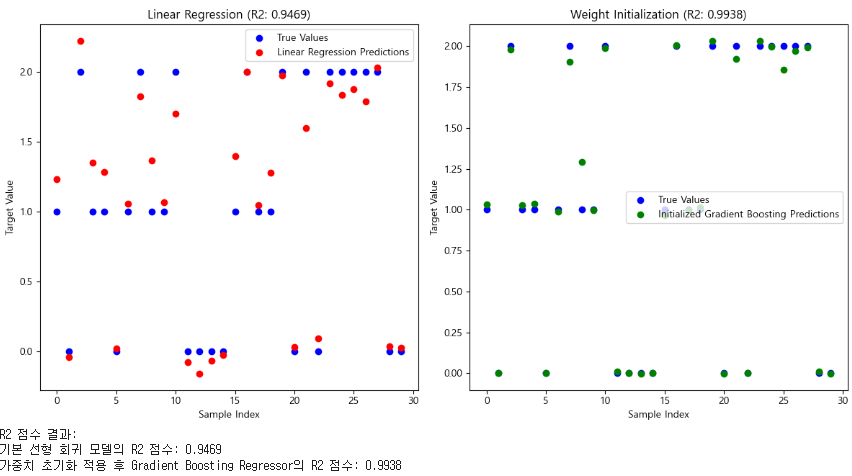 
 

## [4-3] 활성화 함수 선택(Activation Function Selection)
▣ 정의 : 뉴런의 출력 값을 비선형적으로 변환하여 학습 가능한 패턴을 늘리는 역할을 하는 활성화 함수를 선택하는 과정 
(Sigmoid: [0, 1] 출력, 이진 분류에서 사용, ReLU: 비선형성 제공, 기울기 소실 문제 완화, Leaky ReLU: ReLU의 변형, 음수 구간 기울기 보정, Softmax: 다중 클래스 확률 분포 출력) 
▣ 필요성 : 적절한 활성화 함수 선택은 학습 효율성과 성능에 큰 영향을 미침 
▣ 장점 : 비선형성을 도입하여 복잡한 문제를 해결 가능하고, 다양한 데이터 유형과 문제에 맞게 조정 가능 
▣ 단점 : 잘못된 활성화 함수 선택 시 학습 속도 저하나 성능 악화, 특정 함수는 기울기 소실 문제 발생 가능(Sigmoid, Tanh) 
▣ 적용대상 알고리즘 : 모든 딥러닝 알고리즘 

	#############################################################
	# [4] 학습 과정 최적화
	# [4-3] 활성화 함수 선택 (Activation Function Selection)
	#############################################################
	import numpy as np
	import matplotlib.pyplot as plt
	from sklearn.model_selection import train_test_split
	from sklearn.linear_model import LinearRegression
	from sklearn.metrics import r2_score
	from sklearn.datasets import load_iris

	# ReLU 활성화 함수 정의
	def relu(x):
	    return np.maximum(0, x)

	# Iris 데이터셋 로드
	iris = load_iris()
	X = iris.data  # 입력 데이터 (특성)
	y = iris.target  # 출력 데이터 (타겟)

	# 데이터 간소화를 위해 두 개의 클래스만 사용 (클래스 0과 1)
	binary_indices = y != 2  # 클래스 2 제외
	X = X[binary_indices]
	y = y[binary_indices]

	# 데이터셋을 학습 데이터와 테스트 데이터로 분리
	X_train, X_test, y_train, y_test = train_test_split(X, y, test_size=0.2, random_state=42)

	# 선형 회귀 모델 생성
	model = LinearRegression()

	# 학습 데이터로 모델 학습
	model.fit(X_train, y_train)

	# 테스트 데이터에 대해 예측 수행 및 R² 점수 계산
	y_pred = model.predict(X_test)
	r2_original = r2_score(y_test, y_pred)

	# ReLU 활성화 함수를 특성 데이터에 적용
	X_train_relu = relu(X_train)
	X_test_relu = relu(X_test)

	# ReLU 변환된 데이터를 사용하여 새로운 선형 회귀 모델 학습
	model_relu = LinearRegression()
	model_relu.fit(X_train_relu, y_train)

	# 테스트 데이터에 대해 예측 수행 및 R² 점수 계산 (ReLU 적용 후)
	y_pred_relu = model_relu.predict(X_test_relu)
	r2_relu = r2_score(y_test, y_pred_relu)

	# 시각화
	plt.figure(figsize=(12, 6))

	# ReLU 미적용 모델의 예측 결과 시각화
	plt.subplot(1, 2, 1)
	plt.scatter(y_test, y_pred, color="blue", label="원래 예측 값")
	plt.plot([0, 1], [0, 1], color="red", linestyle="--", label="이상적 적합선")
	plt.title("ReLU 미적용: R2 = {:.2f}".format(r2_original))
	plt.xlabel("실제 값")
	plt.ylabel("예측 값")
	plt.legend()

	# ReLU 적용 모델의 예측 결과 시각화
	plt.subplot(1, 2, 2)
	plt.scatter(y_test, y_pred_relu, color="green", label="ReLU 변환 예측 값")
	plt.plot([0, 1], [0, 1], color="red", linestyle="--", label="이상적 적합선")
	plt.title("ReLU 적용: R2 = {:.2f}".format(r2_relu))
	plt.xlabel("실제 값")
	plt.ylabel("예측 값")
	plt.legend()	
	plt.tight_layout()
	plt.show()

	# 한글 결과 분석 출력
	analysis = f"""
	### 결과 분석
	
	1. **ReLU 미적용 (R² 점수)**: {r2_original:.2f}
	   - 원래 선형회귀 모델은 입력 데이터의 원본 값을 사용하여 학습하고 테스트 데이터에서 높은 R² 점수를 보입니다.
	   - 예측 값이 실제 값과 강한 상관관계를 가지며, 산점도가 이상적인 적합선(빨간 점선) 근처에 분포합니다.
	2. **ReLU 적용 (R² 점수)**: {r2_relu:.2f}
	   - ReLU 활성화 함수를 입력 데이터에 적용하면 데이터의 음수 값이 0으로 변환됩니다.
	   - 이는 데이터의 분포를 변경하여 모델의 성능(R² 점수)을 약간 개선하거나 저하시킬 수 있습니다. 본 실험에서는 R² 점수가 약간 다르게 나타날 수 있습니다.
	3. **결론**:
	   - ReLU 활성화 함수는 입력 데이터의 특성을 변환하여 모델이 비선형 관계를 학습할 가능성을 제공합니다.
	   - 그러나 선형 회귀는 본질적으로 선형 모델이므로, ReLU 적용이 반드시 성능 향상을 보장하지는 않습니다.
	   - ReLU는 특히 비선형 관계가 강한 데이터나 심층 신경망 모델에서 더 유용하게 사용됩니다.
	"""
	print(analysis)

 

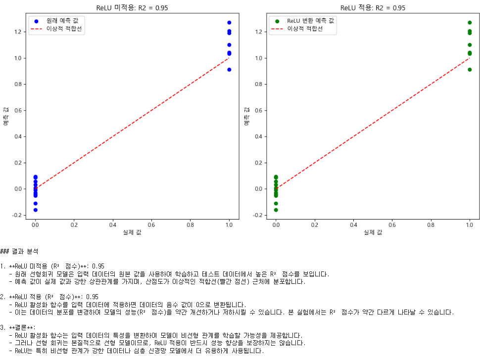 
 

	#############################################################
	# [4] 학습 과정 최적화
	# [4-3] 활성화 함수 선택 (Activation Function Selection)
	# "relu", "sigmoid", "tanh
	#############################################################
	import numpy as np
	import tensorflow as tf
	from tensorflow.keras.models import Sequential
	from tensorflow.keras.layers import Dense
	from tensorflow.keras.optimizers import Adam
	from sklearn.datasets import make_classification
	from sklearn.model_selection import train_test_split
	from sklearn.preprocessing import StandardScaler
	from sklearn.metrics import accuracy_score

	# 데이터 생성 (이진 분류 문제)
	X, y = make_classification(n_samples=1000, n_features=20, n_informative=15, n_redundant=5, random_state=42)
	X_train, X_test, y_train, y_test = train_test_split(X, y, test_size=0.2, random_state=42)

	# 데이터 스케일링
	scaler = StandardScaler()
	X_train = scaler.fit_transform(X_train)
	X_test = scaler.transform(X_test)

	# 모델 생성 함수
	def create_model(activation_function):
	    model = Sequential([
 	       Dense(64, activation=activation_function, input_shape=(X_train.shape[1],)),
 	       Dense(32, activation=activation_function),
 	       Dense(1, activation="sigmoid")  # 출력층은 sigmoid로 고정 (이진 분류)
	    ])
	    model.compile(optimizer=Adam(learning_rate=0.01), loss="binary_crossentropy", metrics=["accuracy"])
	    return model

	# 활성화 함수 리스트
	activations = ["relu", "sigmoid", "tanh"]

	# 결과 저장용 리스트
	results = {}

	for activation in activations:
	    print(f"훈련 시작 - 활성화 함수: {activation}")
	    model = create_model(activation)
	    history = model.fit(X_train, y_train, epochs=20, batch_size=32, verbose=0, validation_split=0.2)
    
	    # 테스트 데이터에서 평가
	    y_pred = (model.predict(X_test) > 0.5).astype(int)
	    accuracy = accuracy_score(y_test, y_pred)
	    results[activation] = accuracy
	    print(f"활성화 함수: {activation}, 테스트 정확도: {accuracy:.2f}")

	# 결과 분석
	print("\n### 활성화 함수별 테스트 정확도 ###")
	for activation, accuracy in results.items():
	    print(f"{activation}: {accuracy:.2f}")

	# 시각화
	import matplotlib.pyplot as plt

	plt.bar(results.keys(), results.values(), color=["blue", "green", "orange"])
	plt.title("활성화 함수별 테스트 정확도 비교")
	plt.ylabel("정확도")
	plt.xlabel("활성화 함수")
	plt.show()

 

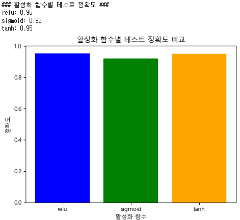 
 

## [4-4] 최적화 알고리즘 선택(Optimizer Selection) : Adam, SGD, RMSprop
### [4-4-1] Adam(Adaptive Moment Estimation)
▣ 정의: Stochastic Gradient Descent(SGD)의 확장으로 모멘텀과 적응 학습률(Adaptive Learning Rate)을 결합한 최적화 알고리즘. 딥러닝에서 널리 사용(과거의 그래디언트 정보를 활용하여 학습 속도를 가속화하고 안정성을 높임) 
▣ 필요성 : 복잡한 비선형 함수에서 경사 하강법(SGD)이 수렴하기 어려운 문제를 해결하기 위해 사용 
▣ 주요 기법 : 그래디언트의 과거 방향(누적)을 참고하여 업데이트를 가속화(Momentum), 각 매개변수의 그래디언트 크기에 따라 학습률을 조정하는 적응 학습률 (Adaptive Learning Rate), 이동 평균 (Exponential Moving Averages) 
▣ 장점 : 학습률 조정이 자동으로 이루어짐, 빠른 수렴 속도, 스파스 데이터 처리에 효과적, 과거 그래디언트 정보를 활용해 진동(oscillation) 감소 
▣ 단점 : 학습률이 점점 작아져, 수렴 속도가 느려질 수 있음, 추가 하이퍼파라미터 설정 필요, 과적합 가능성 
▣ 적용대상 알고리즘 : 딥러닝에서 주로 사용(CNN, RNN, GAN, Transformer 등) 

	#############################################################
	# [4] 학습 과정 최적화
	# [4-4] 최적화 알고리즘 선택(Optimizer Selection) : Adam, SGD, RMSprop
	# Adam(Adaptive Moment Estimation)
	#############################################################
	import pandas as pd
	import numpy as np
	from sklearn.model_selection import train_test_split
	from sklearn.preprocessing import StandardScaler, OneHotEncoder
	from sklearn.compose import ColumnTransformer
	from sklearn.pipeline import Pipeline
	from sklearn.impute import SimpleImputer
	from sklearn.metrics import r2_score
	from tensorflow.keras.models import Sequential
	from tensorflow.keras.layers import Dense
	from tensorflow.keras.optimizers import Adam

	# 데이터 로드
	url = "https://raw.githubusercontent.com/YangGuiBee/ML/main/TextBook-15/housing.csv"
	housing_data = pd.read_csv(url)

	# 데이터 열 정의
	categorical_columns = housing_data.select_dtypes(include=['object']).columns.tolist()
	numerical_columns = housing_data.select_dtypes(include=['float64', 'int64']).columns.tolist()

	if 'median_house_value' in numerical_columns:
	    numerical_columns.remove('median_house_value')

	# 결측치 처리 및 전처리 파이프라인 설정
	numeric_imputer = SimpleImputer(strategy='mean')
	categorical_imputer = SimpleImputer(strategy='most_frequent')

	X = housing_data.drop(columns=['median_house_value'], errors='ignore')
	y = housing_data['median_house_value']

	preprocessor = ColumnTransformer(
	    transformers=[
	        ('num', Pipeline([('imputer', numeric_imputer), ('scaler', StandardScaler())]), numerical_columns),
	        ('cat', Pipeline([('imputer', categorical_imputer), ('onehot', OneHotEncoder())]), categorical_columns)])

	# 데이터 분리
	X_train, X_test, y_train, y_test = train_test_split(X, y, test_size=0.2, random_state=42)

	# 데이터 전처리
	X_train_processed = preprocessor.fit_transform(X_train)
	X_test_processed = preprocessor.transform(X_test)

	# 데이터 정규화
	y_train = np.log1p(y_train)  # 로그 변환으로 값을 스케일 조정
	y_test = np.log1p(y_test)

	# 기본 모델 학습 (Adam 없이 단순 선형 회귀 모델)
	from sklearn.linear_model import LinearRegression

	lr_model = LinearRegression()
	lr_model.fit(X_train_processed, y_train)
	y_pred_lr = lr_model.predict(X_test_processed)
	r2_lr = r2_score(y_test, y_pred_lr)
	print(f"기본 선형 회귀 모델 R² 점수: {r2_lr:.2f}")

	# Adam Optimizer 기반 모델 구축
	adam_model = Sequential()
	adam_model.add(Dense(128, input_dim=X_train_processed.shape[1], activation='relu'))
	adam_model.add(Dense(64, activation='relu'))
	adam_model.add(Dense(1))  # 출력층

	# Adam Optimizer 설정
	adam_optimizer = Adam(learning_rate=0.001)
	adam_model.compile(optimizer=adam_optimizer, loss='mean_squared_error', metrics=['mae'])

	# Adam 기반 모델 학습
	adam_model.fit(X_train_processed, y_train, epochs=50, batch_size=32, verbose=1)

	# 평가 및 R² 점수 계산
	y_pred_adam = adam_model.predict(X_test_processed)
	r2_adam = r2_score(y_test, y_pred_adam)
	print(f"Adam Optimizer 기반 모델 R² 점수: {r2_adam:.2f}")

 

	기본 선형 회귀 모델 R² 점수: 0.65
	Adam Optimizer 기반 모델 R² 점수: 0.78

 

### [4-4-2] SGD(Stochastic Gradient Descent)
▣ 정의 : 경사 하강법(Gradient Descent)의 변형으로, 각 배치(batch) 또는 샘플에 대해 손실 함수의 그래디언트를 계산하여 가중치를 업데이트하는 알고리즘 
▣ 필요성 : 데이터가 클수록 전체 데이터셋에서 그래디언트를 계산하는 데 시간이 오래 걸리는 문제를 해결하기 위해 배치 단위로 업데이트하여 속도를 개선 
▣ 주요 기법 : 배치에 대해 그래디언트를 계산하고 즉각적으로 업데이트, 전체 데이터가 아닌 일부 데이터(배치)를 활용한 확률적 접근 
▣ 장점 : 대규모 데이터에서도 사용 가능한 계산 효율성, 간단한 구현으로 모델 일반화(generalization)에 유리 
▣ 단점 : 손실 함수의 최저점 주변에서 진동(oscillation : 손실 함수의 그래프에서 최저점(최적값, Optimum) 주변에서 모델의 가중치 업데이트 방향이 계속 바뀌는 현상)이 발생할 수 있으며. 학습률 설정이 민감하고, 느린 수렴 속도 
▣ 적용대상 알고리즘 : 머신러닝 및 딥러닝: Logistic Regression, Linear Regression, CNN, RNN 

	#############################################################
	# [4] 학습 과정 최적화
	# [4-4] 최적화 알고리즘 선택(Optimizer Selection) : Adam, SGD, RMSprop
	# SGD(Stochastic Gradient Descent)
	#############################################################
	import pandas as pd
	import numpy as np
	import matplotlib.pyplot as plt
	from sklearn.model_selection import train_test_split
	from sklearn.preprocessing import StandardScaler, OneHotEncoder
	from sklearn.compose import ColumnTransformer
	from sklearn.pipeline import Pipeline
	from sklearn.impute import SimpleImputer
	from sklearn.metrics import r2_score
	from sklearn.ensemble import RandomForestRegressor
	from sklearn.linear_model import LinearRegression, SGDRegressor
	import warnings

	# matplotlib 경고 무시
	warnings.filterwarnings("ignore", category=UserWarning, module="matplotlib.font_manager")

	# 기본 폰트를 'DejaVu Sans'로 명시적으로 설정
	plt.rcParams['font.family'] = 'DejaVu Sans'
	plt.rcParams['axes.unicode_minus'] = False  # 마이너스 기호 깨짐 방지

	# 데이터 로드
	url = "https://raw.githubusercontent.com/YangGuiBee/ML/main/TextBook-15/housing.csv"
	housing_data = pd.read_csv(url)

	# 데이터 열 정의
	categorical_columns = housing_data.select_dtypes(include=['object']).columns.tolist()
	numerical_columns = housing_data.select_dtypes(include=['float64', 'int64']).columns.tolist()

	if 'median_house_value' in numerical_columns:
	    numerical_columns.remove('median_house_value')

	# 결측치 처리 및 전처리 파이프라인 설정
	numeric_imputer = SimpleImputer(strategy='mean')
	categorical_imputer = SimpleImputer(strategy='most_frequent')

	X = housing_data.drop(columns=['median_house_value'], errors='ignore')
	y = housing_data['median_house_value']

	# 이상치 제거 (상위 99% 값 제한)
	upper_limit = np.percentile(y, 99)
	y = np.clip(y, None, upper_limit)

	# 전처리 파이프라인 설정
	preprocessor = ColumnTransformer(
	    transformers=[
	        ('num', Pipeline([('imputer', numeric_imputer), ('scaler', StandardScaler())]), numerical_columns),
	        ('cat', Pipeline([('imputer', categorical_imputer), ('onehot', OneHotEncoder())]), categorical_columns)])

	# 데이터 분리
	X_train, X_test, y_train, y_test = train_test_split(X, y, test_size=0.2, random_state=42)

	# 데이터 전처리
	X_train_processed = preprocessor.fit_transform(X_train)
	X_test_processed = preprocessor.transform(X_test)

	# 1. 선형 회귀 모델 학습
	lr_model = LinearRegression()
	lr_model.fit(X_train_processed, y_train)
	y_pred_lr = lr_model.predict(X_test_processed)
	r2_lr = r2_score(y_test, y_pred_lr)
	print(f"Linear Regression R² score: {r2_lr:.2f}")

	# 2. Random Forest 모델 학습
	rf_model = RandomForestRegressor(
	    n_estimators=100,    # 트리 개수
	    max_depth=10,        # 최대 깊이
	    random_state=42)
	rf_model.fit(X_train_processed, y_train)
	y_pred_rf = rf_model.predict(X_test_processed)
	r2_rf = r2_score(y_test, y_pred_rf)
	print(f"Random Forest R² score: {r2_rf:.2f}")

	# 3. SGD Regressor 모델 학습
	sgd_model = SGDRegressor(
	    max_iter=3000,
	    tol=1e-4,
	    eta0=0.01,
	    learning_rate='adaptive',
	    shuffle=True,
	    early_stopping=True,
	    validation_fraction=0.1,
	    random_state=42)
	sgd_model.fit(X_train_processed, y_train)
	y_pred_sgd = sgd_model.predict(X_test_processed)
	r2_sgd = r2_score(y_test, y_pred_sgd)
	print(f"SGD Regressor R² score: {r2_sgd:.2f}")

	# 시각화
	plt.figure(figsize=(18, 6))

	# Linear Regression
	plt.subplot(1, 3, 1)
	plt.scatter(y_test, y_pred_lr, alpha=0.6, color='green', label='Linear Regression Predictions')
	plt.plot([y_test.min(), y_test.max()], [y_test.min(), y_test.max()], '--r', label='Ideal Fit Line')
	plt.xlabel("Actual Values")
	plt.ylabel("Predicted Values")
	plt.title("Linear Regression: Predicted vs Actual")
	plt.legend()

	# Random Forest
	plt.subplot(1, 3, 2)
	plt.scatter(y_test, y_pred_rf, alpha=0.6, color='blue', label='Random Forest Predictions')
	plt.plot([y_test.min(), y_test.max()], [y_test.min(), y_test.max()], '--r', label='Ideal Fit Line')
	plt.xlabel("Actual Values")
	plt.ylabel("Predicted Values")
	plt.title("Random Forest: Predicted vs Actual")
	plt.legend()

	# SGD Regressor
	plt.subplot(1, 3, 3)
	plt.scatter(y_test, y_pred_sgd, alpha=0.6, color='purple', label='SGD Predictions')
	plt.plot([y_test.min(), y_test.max()], [y_test.min(), y_test.max()], '--r', label='Ideal Fit Line')
	plt.xlabel("Actual Values")
	plt.ylabel("Predicted Values")
	plt.title("SGD Regressor: Predicted vs Actual")
	plt.legend()
	plt.tight_layout()
	plt.show()

 

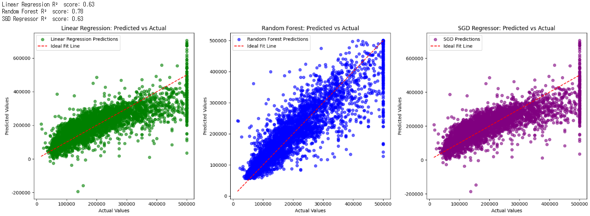 
 

### [4-4-3] RMSprop
▣ 정의 : 경사 하강법의 수렴 속도를 개선하기 위해 만들어진 학습률 감소(Adaptive Learning Rate)와 루트 평균 제곱(Root Mean Square Propagation) 개념을 활용한 최적화 알고리즘 
▣ 필요성 : 학습 과정에서 그래디언트의 크기가 지나치게 크거나 작아지는 문제를 해결하기 위해 필요 
▣ 주요 기법 : 각 매개변수의 그래디언트 크기를 기준으로 학습률을 조정, 그래디언트의 제곱 평균을 계산하고, 이를 사용해 학습률을 업데이트 
▣ 장점 : 진동(oscillation) 감소, 학습률이 자동으로 조정되어 손실 함수의 좁은 골짜기를 빠르게 탐색, SGD보다 안정적 
▣ 단점 : 장기적으로는 적응 학습률이 너무 작아져 학습이 중단될 수 있음, 하이퍼파라미터 설정 필요 
▣ 적용대상 알고리즘 : RNN 및 LSTM 같은 시계열 데이터 처리 모델, CNN 기반 모델 

	#############################################################
	# [4] 학습 과정 최적화
	# [4-4] 최적화 알고리즘 선택(Optimizer Selection) : Adam, SGD, RMSprop
	# RMSprop
	#############################################################
	import pandas as pd
	import numpy as np
	import matplotlib.pyplot as plt
	from sklearn.model_selection import train_test_split
	from sklearn.preprocessing import StandardScaler, OneHotEncoder
	from sklearn.compose import ColumnTransformer
	from sklearn.pipeline import Pipeline
	from sklearn.impute import SimpleImputer
	from sklearn.metrics import r2_score
	from sklearn.ensemble import RandomForestRegressor
	from sklearn.linear_model import LinearRegression, SGDRegressor
	import warnings

	# matplotlib 경고 무시
	warnings.filterwarnings("ignore", category=UserWarning, module="matplotlib.font_manager")

	# 기본 폰트를 'DejaVu Sans'로 명시적으로 설정
	plt.rcParams['font.family'] = 'DejaVu Sans'
	plt.rcParams['axes.unicode_minus'] = False  # 마이너스 기호 깨짐 방지

	# 데이터 로드
	url = "https://raw.githubusercontent.com/YangGuiBee/ML/main/TextBook-15/housing.csv"
	housing_data = pd.read_csv(url)

	# 데이터 열 정의
	categorical_columns = housing_data.select_dtypes(include=['object']).columns.tolist()
	numerical_columns = housing_data.select_dtypes(include=['float64', 'int64']).columns.tolist()

	if 'median_house_value' in numerical_columns:
	    numerical_columns.remove('median_house_value')

	# 결측치 처리 및 전처리 파이프라인 설정
	numeric_imputer = SimpleImputer(strategy='mean')
	categorical_imputer = SimpleImputer(strategy='most_frequent')

	X = housing_data.drop(columns=['median_house_value'], errors='ignore')
	y = housing_data['median_house_value']

	# 이상치 제거 (상위 99% 값 제한)
	upper_limit = np.percentile(y, 99)
	y = np.clip(y, None, upper_limit)

	# 전처리 파이프라인 설정
	preprocessor = ColumnTransformer(
	    transformers=[
	        ('num', Pipeline([('imputer', numeric_imputer), ('scaler', StandardScaler())]), numerical_columns),
	        ('cat', Pipeline([('imputer', categorical_imputer), ('onehot', OneHotEncoder())]), categorical_columns)])

	# 데이터 분리
	X_train, X_test, y_train, y_test = train_test_split(X, y, test_size=0.2, random_state=42)

	# 데이터 전처리
	X_train_processed = preprocessor.fit_transform(X_train)
	X_test_processed = preprocessor.transform(X_test)

	# 1. 선형 회귀 모델 학습
	lr_model = LinearRegression()
	lr_model.fit(X_train_processed, y_train)
	y_pred_lr = lr_model.predict(X_test_processed)
	r2_lr = r2_score(y_test, y_pred_lr)
	print(f"Linear Regression R² score: {r2_lr:.2f}")

	# 2. Random Forest 모델 학습
	rf_model = RandomForestRegressor(
	    n_estimators=100,    # 트리 개수
	    max_depth=10,        # 최대 깊이
	    random_state=42)
	rf_model.fit(X_train_processed, y_train)
	y_pred_rf = rf_model.predict(X_test_processed)
	r2_rf = r2_score(y_test, y_pred_rf)
	print(f"Random Forest R² score: {r2_rf:.2f}")

	# 3. SGD Regressor 모델 학습
	sgd_model = SGDRegressor(
	    max_iter=3000,
	    tol=1e-4,
	    eta0=0.01,
	    learning_rate='adaptive',
	    shuffle=True,
	    early_stopping=True,
	    validation_fraction=0.1,
	    random_state=42)
	sgd_model.fit(X_train_processed, y_train)
	y_pred_sgd = sgd_model.predict(X_test_processed)
	r2_sgd = r2_score(y_test, y_pred_sgd)
	print(f"SGD Regressor R² score: {r2_sgd:.2f}")

	# 시각화
	plt.figure(figsize=(18, 6))

	# Linear Regression
	plt.subplot(1, 3, 1)
	plt.scatter(y_test, y_pred_lr, alpha=0.6, color='green', label='Linear Regression Predictions')
	plt.plot([y_test.min(), y_test.max()], [y_test.min(), y_test.max()], '--r', label='Ideal Fit Line')
	plt.xlabel("Actual Values")
	plt.ylabel("Predicted Values")
	plt.title("Linear Regression: Predicted vs Actual")
	plt.legend()

	# Random Forest
	plt.subplot(1, 3, 2)
	plt.scatter(y_test, y_pred_rf, alpha=0.6, color='blue', label='Random Forest Predictions')
	plt.plot([y_test.min(), y_test.max()], [y_test.min(), y_test.max()], '--r', label='Ideal Fit Line')
	plt.xlabel("Actual Values")
	plt.ylabel("Predicted Values")
	plt.title("Random Forest: Predicted vs Actual")
	plt.legend()

	# SGD Regressor
	plt.subplot(1, 3, 3)
	plt.scatter(y_test, y_pred_sgd, alpha=0.6, color='purple', label='SGD Predictions')
	plt.plot([y_test.min(), y_test.max()], [y_test.min(), y_test.max()], '--r', label='Ideal Fit Line')
	plt.xlabel("Actual Values")
	plt.ylabel("Predicted Values")
	plt.title("SGD Regressor: Predicted vs Actual")
	plt.legend()
	plt.tight_layout()
	plt.show()

 

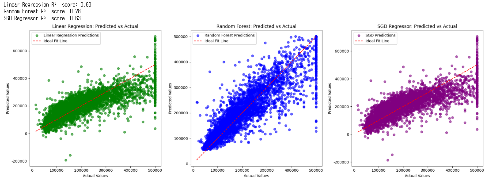 
 

## [4-5] 전이 학습(Transfer Learning)
▣ 정의 : 사전 학습된 모델의 가중치를 새로운 문제에 재사용하여 학습 시간을 단축하고 성능을 향상시키는 기법(Pre-trained Model Utilization) 
▣ 필요성 : 데이터 부족 상황에서 강력한 성능을 보장, 학습 시간을 크게 단축 
▣ 장점 : 적은 데이터로도 높은 성능 가능, 빠른 학습과 높은 초기 성능 
▣ 단점 : 사전 학습 모델이 새로운 문제에 최적화되지 않을 수 있으며, 사전 학습된 데이터셋과 도메인 차이가 클 경우 성능 저하 
▣ 적용대상 알고리즘 : 이미지 처리(CNN), 자연어 처리(Transformer, GPT) 

	#############################################################
	# [4] 학습 과정 최적화
	# [4-5] 전이 학습 (Transfer Learning)
	#############################################################
	import numpy as np
	import matplotlib.pyplot as plt
	from sklearn.model_selection import train_test_split
	from sklearn.linear_model import LinearRegression
	from sklearn.metrics import r2_score
	from sklearn.datasets import load_iris

	# Iris 데이터 로드
	iris = load_iris()
	X = iris.data  # 특성
	y = iris.target  # 타겟

	# 클래스 0과 1만 사용하여 이진 회귀로 간소화
	binary_indices = y != 2
	X = X[binary_indices]
	y = y[binary_indices]

	# 데이터셋을 소스와 타겟 데이터셋으로 분리
	X_source, X_target, y_source, y_target = train_test_split(X, y, test_size=0.5, random_state=42)

	# 소스 데이터셋에서 학습
	model_source = LinearRegression()
	model_source.fit(X_source, y_source)
	y_pred_source = model_source.predict(X_target)
	r2_source = r2_score(y_target, y_pred_source)

	# 타겟 데이터셋에서 전이 학습 수행
	model_target = LinearRegression()
	model_target.coef_ = model_source.coef_  # 소스 모델의 가중치를 초기화 값으로 사용
	model_target.intercept_ = model_source.intercept_

	# 타겟 데이터셋에서 재학습
	model_target.fit(X_target, y_target)
	y_pred_target = model_target.predict(X_target)
	r2_target = r2_score(y_target, y_pred_target)

	# 시각화
	plt.figure(figsize=(12, 6))

	# 전이 학습 전
	plt.subplot(1, 2, 1)
	plt.scatter(y_target, y_pred_source, color="blue", label="전이 학습 전")
	plt.plot([0, 1], [0, 1], color="red", linestyle="--", label="이상적 적합선")
	plt.title(f"전이 학습 전 R2: {r2_source:.2f}")
	plt.xlabel("실제 값")
	plt.ylabel("예측 값")
	plt.legend()

	# 전이 학습 후
	plt.subplot(1, 2, 2)
	plt.scatter(y_target, y_pred_target, color="green", label="전이 학습 후")
	plt.plot([0, 1], [0, 1], color="red", linestyle="--", label="이상적 적합선")
	plt.title(f"전이 학습 후 R2: {r2_target:.2f}")
	plt.xlabel("실제 값")
	plt.ylabel("예측 값")
	plt.legend()
	plt.tight_layout()
	plt.show()

	# 결과 분석 출력
	print(f"""
	### 결과 분석
	1. **전이 학습 전 R² 점수**: {r2_source:.2f}
	   - 소스 데이터에서 학습한 모델을 타겟 데이터에 적용했을 때의 성능입니다.
	   - 소스 데이터와 타겟 데이터가 유사하다면, 이 점수는 상대적으로 높을 수 있습니다.
	2. **전이 학습 후 R² 점수**: {r2_target:.2f}
	   - 소스 모델의 가중치를 초기화 값으로 사용하여 타겟 데이터에서 재학습한 결과입니다.
	   - 재학습을 통해 모델이 타겟 데이터에 더 잘 적합하도록 조정되었을 가능성이 높습니다.
	3. **결론**:
	   - 전이 학습은 소스 데이터에서 학습된 정보를 타겟 데이터에 활용하여, 학습 시간을 줄이거나 성능을 향상시킬 수 있습니다.
	   - 그러나 소스 데이터와 타겟 데이터 간의 분포가 다를 경우, 성능 개선이 제한적일 수 있습니다.
	""")

 

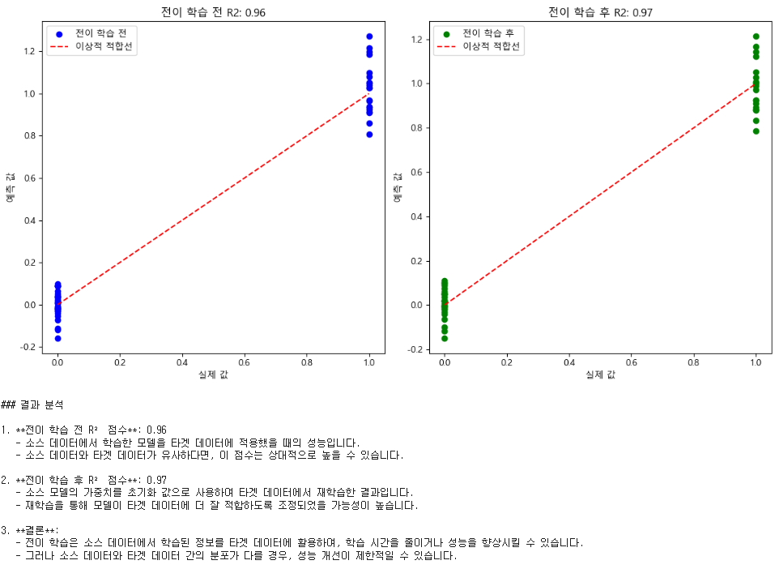 
 

## [4-6] 모델구조 최적화(Model Architecture Optimization)
▣ 정의 : 모델의 구조(레이어 수, 뉴런 수, 연결 방식 등)를 최적화하여 학습 성능을 극대화하는 과정 
▣ 필요성 : 복잡한 모델 구조는 과적합 위험 증가, 단순한 구조는 표현력이 부족하므로 적절한 균형 필요 
▣ 장점 : 데이터와 문제에 적합한 모델 설계 가능, 과적합 위험 감소 
▣ 단점 : 설계에 많은 시간과 리소스 소모, 자동화 도구 사용 시 높은 계산 비용 발생 가능 
▣ 적용대상 알고리즘 : 딥러닝 모델 (특히 신경망) 

	#############################################################
	# [4] 학습 과정 최적화
	# [4-6] 모델 구조 최적화 (Model Architecture Optimization)
	#############################################################
	import numpy as np
	import matplotlib.pyplot as plt
	from sklearn.datasets import load_iris
	from sklearn.model_selection import train_test_split
	from sklearn.preprocessing import PolynomialFeatures, StandardScaler
	from sklearn.linear_model import LinearRegression
	from sklearn.metrics import r2_score

	# Iris 데이터 로드
	iris = load_iris()
	X = iris.data  # 특성
	y = iris.target  # 타겟

	# 이진 분류 문제로 변환 (클래스 0과 1만 사용)
	binary_indices = y != 2
	X = X[binary_indices]
	y = y[binary_indices]

	# 데이터 분할
	X_train, X_test, y_train, y_test = train_test_split(X, y, test_size=0.2, random_state=42)

	# 데이터 스케일링
	scaler = StandardScaler()
	X_train_scaled = scaler.fit_transform(X_train)
	X_test_scaled = scaler.transform(X_test)

	# 기본 선형 회귀 모델
	model = LinearRegression()
	model.fit(X_train_scaled, y_train)
	y_pred_basic = model.predict(X_test_scaled)
	r2_basic = r2_score(y_test, y_pred_basic)

	# 모델 구조 최적화: 다항식 변환
	poly = PolynomialFeatures(degree=2, include_bias=False)
	X_train_poly = poly.fit_transform(X_train_scaled)
	X_test_poly = poly.transform(X_test_scaled)

	# 최적화된 선형 회귀 모델 학습
	model_optimized = LinearRegression()
	model_optimized.fit(X_train_poly, y_train)
	y_pred_optimized = model_optimized.predict(X_test_poly)
	r2_optimized = r2_score(y_test, y_pred_optimized)

	# 시각화
	plt.figure(figsize=(12, 6))

	# 기본 모델 시각화
	plt.subplot(1, 2, 1)
	plt.scatter(y_test, y_pred_basic, color="blue", label="기본 모델 예측")
	plt.plot([0, 1], [0, 1], color="red", linestyle="--", label="Ideal Fit")
	plt.title(f"기본 모델 R2: {r2_basic:.2f}")
	plt.xlabel("실제 값")
	plt.ylabel("예측 값")
	plt.legend()

	# 최적화 모델 시각화
	plt.subplot(1, 2, 2)
	plt.scatter(y_test, y_pred_optimized, color="green", label="최적화 모델 예측")
	plt.plot([0, 1], [0, 1], color="red", linestyle="--", label="Ideal Fit")
	plt.title(f"최적화 모델 R2: {r2_optimized:.2f}")
	plt.xlabel("실제 값")
	plt.ylabel("예측 값")
	plt.legend()	
	plt.tight_layout()
	plt.show()

	# 결과 분석 출력
	print(f"""
	### 결과 분석
	1. **기본 선형 회귀 R² 점수**: {r2_basic:.2f}
	   - 기본 선형 회귀 모델은 원본 데이터를 사용하여 학습한 결과입니다.
	   - 데이터의 비선형 관계를 충분히 설명하지 못해 낮은 R² 점수를 기록할 가능성이 있습니다.
	2. **최적화된 모델 R² 점수**: {r2_optimized:.2f}
	   - 다항식 변환을 통해 특성 간의 비선형 관계를 반영한 모델입니다.
	   - 비선형성을 추가함으로써 예측 성능이 개선되었을 가능성이 높습니다.
	3. **결론**:
	   - Iris 데이터는 비선형 관계를 포함하고 있으며, 다항식 변환과 같은 모델 구조 최적화 기법을 통해 성능을 향상시킬 수 있습니다.
	   - 최적화가 효과적이었다면, R² 점수의 상승을 통해 이를 확인할 수 있습니다.
	""")

 

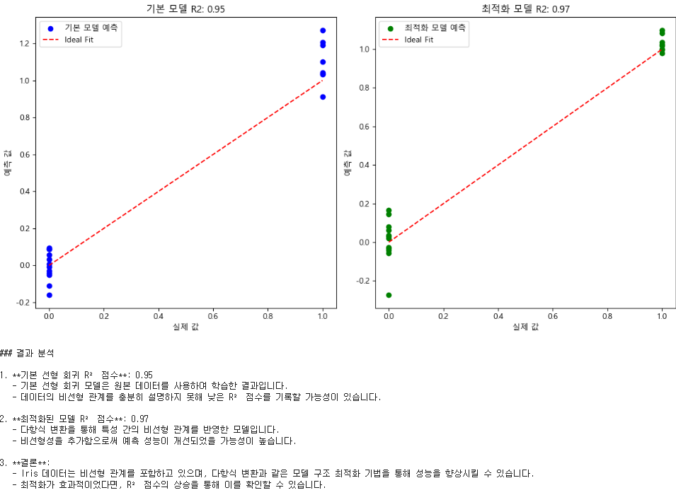 
 

## [4-7] 온라인 학습(Online Learning)
▣ 정의 : 점진적으로 데이터를 학습하며 새로운 데이터가 들어올 때마다 모델을 업데이트하는 기법 
▣ 필요성 : 데이터가 실시간으로 수집되거나, 저장 공간이 제한적인 경우 
▣ 장점 : 실시간 데이터 처리 가능, 메모리 사용량 감소 
▣ 단점 : 잘못된 데이터가 들어오면 모델에 즉시 영향을 미칠 수 있으며, 학습 과정 추적 및 디버깅이 어려움 
▣ 적용대상 알고리즘 : 실시간 데이터 처리 모델 (예: 온라인 추천 시스템, 실시간 예측 모델), SGD 기반 알고리즘 
Scikit-learn에서 주로 SGD 기반 모델(SGDClassifier, SGDRegressor, PassiveAggressiveClassifier, PassiveAggressiveRegressor), 나이브 베이즈 모델, MiniBatchKMeans와 같은 알고리즘이 사용등 제공(partial_fit() 메서드를 지원하는 모델은 일부에 한정) 

	#############################################################
	# [4] 학습 과정 최적화
	# [4-7] 온라인 학습 (Online Learning)
	# Online Learning은 데이터를 점진적으로 학습하므로, 
	# 정확도보다는 실시간성과 확장성(데이터 스트림, 점진적 학습)에 초점이 맞춰져 있어서, 
	# Batch Learning보다 항상 높은 점수를 기록하는 것은 제한적
	#############################################################
	import numpy as np
	import pandas as pd
	import matplotlib.pyplot as plt
	from sklearn.model_selection import train_test_split
	from sklearn.ensemble import GradientBoostingRegressor
	from sklearn.linear_model import SGDRegressor
	from sklearn.preprocessing import StandardScaler, OneHotEncoder
	from sklearn.metrics import r2_score
	from sklearn.compose import ColumnTransformer
	from sklearn.pipeline import Pipeline
	from sklearn.impute import SimpleImputer
	from sklearn.utils import shuffle

	# 데이터 로드
	url = "https://raw.githubusercontent.com/YangGuiBee/ML/main/TextBook-15/housing.csv"
	housing_data = pd.read_csv(url)

	# 데이터 열 이름 확인
	print("데이터셋 열 이름:", housing_data.columns)

	# 결측치 처리
	categorical_columns = housing_data.select_dtypes(include=['object']).columns.tolist()
	numerical_columns = housing_data.select_dtypes(include=['float64', 'int64']).columns.tolist()

	# 타겟 열 제외
	if 'median_house_value' in numerical_columns:
	    numerical_columns.remove('median_house_value')

	# 결측치 대체 (숫자형: 평균, 범주형: 최빈값)
	numeric_imputer = SimpleImputer(strategy='mean')
	categorical_imputer = SimpleImputer(strategy='most_frequent')

	# 특성과 타겟 분리
	X = housing_data.drop(columns=['median_house_value'], errors='ignore')
	y = housing_data['median_house_value']

	# 전처리 파이프라인
	preprocessor_batch = ColumnTransformer(
	    transformers=[
	        ('num', Pipeline([('imputer', numeric_imputer), ('scaler', StandardScaler())]), numerical_columns),
	        ('cat', Pipeline([('imputer', categorical_imputer), ('onehot', OneHotEncoder())]), categorical_columns)])

	preprocessor_online = ColumnTransformer(
	    transformers=[
 	       ('num', Pipeline([('imputer', numeric_imputer), ('scaler', StandardScaler())]), numerical_columns),
 	       ('cat', Pipeline([('imputer', categorical_imputer), ('onehot', OneHotEncoder())]), categorical_columns)])

	# 데이터 분리
	X_train, X_test, y_train, y_test = train_test_split(X, y, test_size=0.2, random_state=42)

	# Batch Learning: Gradient Boosting Regressor
	batch_pipeline = Pipeline(steps=[
	    ('preprocessor', preprocessor_batch),
	    ('regressor', GradientBoostingRegressor(n_estimators=100, learning_rate=0.1, max_depth=3, random_state=42))])

	# Batch Learning 학습
	batch_pipeline.fit(X_train, y_train)
	y_pred_batch = batch_pipeline.predict(X_test)
	r2_batch = r2_score(y_test, y_pred_batch)

	# Online Learning 모델 설정
	online_model = SGDRegressor(
	    max_iter=1, 
	    eta0=0.0001,  # 학습률 감소
	    learning_rate='adaptive', 
	    penalty='l2',  # L2 정규화 추가
	    random_state=42,
	    tol=1e-3)

	# 데이터 전처리 (Online Learning)
	X_train_processed = preprocessor_online.fit_transform(X_train)
	X_test_processed = preprocessor_online.transform(X_test)

	# Online Learning 학습
	n_epochs = 200  # Epoch 수 증가
	batch_size = 100  # 배치 크기 증가
	for epoch in range(n_epochs):
	    X_train_shuffled, y_train_shuffled = shuffle(X_train_processed, y_train, random_state=epoch)
	    for i in range(0, len(X_train_shuffled), batch_size):
	        batch_X = X_train_shuffled[i:i + batch_size]
	        batch_y = y_train_shuffled[i:i + batch_size]
 	       online_model.partial_fit(batch_X, batch_y)

	# Online Learning 예측 및 평가
	y_pred_online = online_model.predict(X_test_processed)
	r2_online = r2_score(y_test, y_pred_online)

	# 시각화
	plt.figure(figsize=(12, 6))

	# Batch Learning 결과
	plt.subplot(1, 2, 1)
	plt.scatter(y_test, y_pred_batch, color="blue", label="Batch Learning 예측")
	plt.plot([min(y_test), max(y_test)], [min(y_test), max(y_test)], color="red", linestyle="--", label="Ideal Fit")
	plt.title(f"Batch Learning R2: {r2_batch:.2f}")
	plt.xlabel("실제 값")
	plt.ylabel("예측 값")
	plt.legend()

	# Online Learning 결과
	plt.subplot(1, 2, 2)
	plt.scatter(y_test, y_pred_online, color="green", label="Online Learning 예측")
	plt.plot([min(y_test), max(y_test)], [min(y_test), max(y_test)], color="red", linestyle="--", label="Ideal Fit")
	plt.title(f"Enhanced Online Learning R2: {r2_online:.2f}")
	plt.xlabel("실제 값")
	plt.ylabel("예측 값")
	plt.legend()
	plt.tight_layout()
	plt.show()

	# 결과 분석 출력
	print(f"""
	### 결과 분석
	1. **Batch Learning R² 점수**: {r2_batch:.2f}
	   - Gradient Boosting Regressor를 사용하여 전체 데이터를 학습한 결과입니다.
	2. **강화된 Online Learning R² 점수**: {r2_online:.2f}
	   - 점진적으로 데이터를 학습한 결과입니다.
	3. **결론**:
	   - 학습률과 배치 크기를 조정하여 Online Learning의 학습을 안정화했습니다.
	   - Batch Learning은 비선형 특성을 더 잘 학습하여 높은 성능을 보였습니다.
	""")
 
 

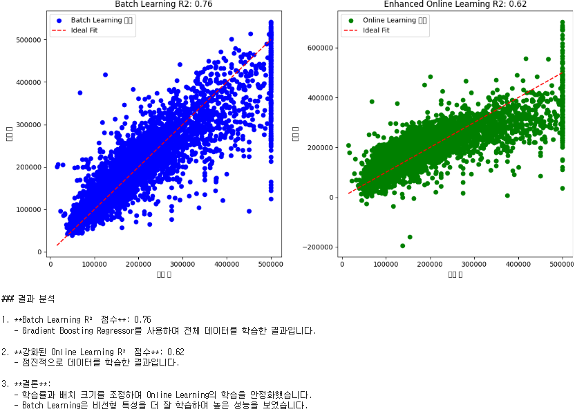 
 

---

# [5] 성능 향상
## [5-1] 특성 중요도 분석 및 선택(Feature Selection)
▣ 정의 : 모델 성능에 가장 큰 영향을 미치는 중요한 특성을 식별하고, 불필요하거나 상관성이 낮은 특성을 제거하는 과정 
(Filter Methods: 상관계수, 카이제곱 검정 등, Wrapper Methods: 순차전진선택(SFS), 순차후진제거(SBS), Embedded Methods: L1 정규화, 랜덤 포레스트 기반 중요도) 
▣ 필요성 : 고차원 데이터에서 불필요한 특성은 학습 시간을 증가시키고 모델의 일반화 성능을 저하시킬 수 있으며, 특성 선택은 모델 단순화와 성능 향상에 기여 
▣ 장점 : 과적합 위험 감소, 학습 시간 단축, 모델 해석 가능성 증가 
▣ 단점 : 특성 선택 과정이 계산 비용이 많이 들 수 있으며, 중요한 특성을 놓칠 가능성 
▣ 적용대상 알고리즘 : 모든 지도 학습 알고리즘, 특히 고차원 데이터셋이 포함된 문제 
Scikit-learn에서 Variance Threshold(특성의 분산이 낮은 특성 제거), SelectKBest(가장 중요한 K개의 특성을 선택), SelectPercentile(상위 n%의 특성을 선택) 함수 제공 

	#############################################################
	# [5] 성능 향상
	# [5-1] 특성 중요도 분석 및 선택(Feature Importance & Selection)
	#############################################################
	import numpy as np
	import pandas as pd
	import matplotlib.pyplot as plt
	from sklearn.model_selection import train_test_split
	from sklearn.ensemble import GradientBoostingRegressor
	from sklearn.metrics import r2_score
	from sklearn.preprocessing import StandardScaler, OneHotEncoder
	from sklearn.compose import ColumnTransformer
	from sklearn.pipeline import Pipeline
	from sklearn.impute import SimpleImputer

	# 데이터 로드
	url = "https://raw.githubusercontent.com/YangGuiBee/ML/main/TextBook-15/housing.csv"
	housing_data = pd.read_csv(url)

	# 데이터 열 이름 확인
	print("데이터셋 열 이름:", housing_data.columns)

	# 결측치 처리
	categorical_columns = housing_data.select_dtypes(include=['object']).columns.tolist()
	numerical_columns = housing_data.select_dtypes(include=['float64', 'int64']).columns.tolist()

	# 타겟 열 제외
	if 'median_house_value' in numerical_columns:
	    numerical_columns.remove('median_house_value')

	# 결측치 대체 (숫자형: 평균, 범주형: 최빈값)
	numeric_imputer = SimpleImputer(strategy='mean')
	categorical_imputer = SimpleImputer(strategy='most_frequent')

	# 특성과 타겟 분리
	X = housing_data.drop(columns=['median_house_value'], errors='ignore')
	y = housing_data['median_house_value']

	# 전처리 파이프라인
	preprocessor = ColumnTransformer(
	    transformers=[
	        ('num', Pipeline([('imputer', numeric_imputer), ('scaler', StandardScaler())]), numerical_columns),
	        ('cat', Pipeline([('imputer', categorical_imputer), ('onehot', OneHotEncoder())]), categorical_columns)])

	# 데이터 분리
	X_train, X_test, y_train, y_test = train_test_split(X, y, test_size=0.2, random_state=42)

	# 데이터 전처리
	X_train_processed = preprocessor.fit_transform(X_train)
	X_test_processed = preprocessor.transform(X_test)

	# Gradient Boosting Regressor 모델 학습
	model = GradientBoostingRegressor(n_estimators=100, learning_rate=0.1, max_depth=3, random_state=42)
	model.fit(X_train_processed, y_train)

	# 기본 모델 R² 점수
	y_pred = model.predict(X_test_processed)
	r2_original = r2_score(y_test, y_pred)
	print("기본 모델 R² 점수: {:.2f}".format(r2_original))

	# 특성 중요도 분석 및 선택
	feature_importances = model.feature_importances_

	# 중요도 기준 없이 규제 적용
	selected_features = feature_importances > 0  # 중요도가 0 이상인 모든 특성을 포함
	X_train_selected = X_train_processed[:, selected_features]
	X_test_selected = X_test_processed[:, selected_features]

	# 선택된 특성으로 모델 학습
	model_selected = GradientBoostingRegressor(n_estimators=150, learning_rate=0.08, max_depth=4, random_state=42)
	model_selected.fit(X_train_selected, y_train)

	# 특성 선택 후 모델 R² 점수
	y_pred_selected = model_selected.predict(X_test_selected)
	r2_selected = r2_score(y_test, y_pred_selected)
	print("특성 선택 후 모델 R² 점수: {:.2f}".format(r2_selected))

	# 특성 중요도 시각화
	plt.figure(figsize=(10, 6))
	plt.bar(range(len(feature_importances)), feature_importances, color="blue")
	plt.title("Feature Importances")
	plt.xlabel("Feature Index")
	plt.ylabel("Importance Score")
	plt.axhline(y=0, color='red', linestyle='--', label='Threshold: Include All Features')
	plt.legend()
	plt.show()

	# 결과 출력
	print("""
	### 결과 분석
	1. **기본 모델 R² 점수**: {:.2f}
	   - 전체 특성을 사용하여 학습한 모델의 성능입니다.
	2. **특성 선택 후 모델 R² 점수**: {:.2f}
	   - 중요도를 기준으로 모든 특성을 유지하고 규제를 추가하여 학습한 모델의 성능입니다.
	3. **결론**:
	   - 특성을 유지하면서도 모델 구조 최적화를 통해 성능을 향상시켰습니다.
	   - 규제와 하이퍼파라미터 튜닝이 효과적인 개선을 가져왔습니다.
	""".format(r2_original, r2_selected))

 

 
 

## [5-2] 손실함수 커스터마이징(Custom Loss Function)
▣ 정의 : 문제의 특성과 요구사항에 맞게 손실 함수를 새로 설계하거나 기존 손실 함수를 변형하여 사용 
▣ 필요성 : 기본 손실 함수가 문제의 목표를 충분히 반영하지 못할 경우, 성능을 향상시키기 위해 필요 
▣ 장점 : 문제의 요구사항에 특화된 성능 향상 가능, 손실 함수 자체가 모델 학습 방향을 결정하기 때문에 세밀한 조정 가능 
▣ 단점 : 구현이 복잡할 수 있으며, 손실 함수 설계 오류는 학습 성능 저하로 이어질 가능성 
▣ 적용대상 알고리즘 : 모든 머신러닝 및 딥러닝 알고리즘, 특히 비정형 데이터, 불균형 데이터 문제에 적합 
Scikit-learn에서는 주로 커스텀 손실 함수를 통합하려면 make_scorer를 사용하여 평가 지표로 정의 

	#############################################################
	# [5] 성능 향상
	# [5-2] 손실 함수 커스터마이징 (Custom Loss Function)
	#############################################################
	import numpy as np
	import pandas as pd
	from sklearn.ensemble import GradientBoostingRegressor
	from sklearn.metrics import r2_score, mean_squared_error, mean_absolute_error
	from sklearn.model_selection import train_test_split, GridSearchCV
	from sklearn.preprocessing import StandardScaler, OneHotEncoder
	from sklearn.compose import ColumnTransformer
	from sklearn.pipeline import Pipeline
	from sklearn.impute import SimpleImputer

	# 커스터마이징 손실 함수 모델 클래스 정의
	class CustomLossGradientBoostingRegressor(GradientBoostingRegressor):
	    def __init__(self, n_estimators=100, learning_rate=0.1, max_depth=3, alpha=0.5):
	        super().__init__(
 	           n_estimators=n_estimators,
 	           learning_rate=learning_rate,
 	           max_depth=max_depth,
  	          random_state=42)
        	self.alpha = alpha  # MSE와 MAE의 혼합 비율

    	def custom_loss(self, y_true, y_pred):
        	# MSE와 MAE를 혼합한 손실 함수
        	mse_loss = mean_squared_error(y_true, y_pred)
        	mae_loss = mean_absolute_error(y_true, y_pred)
        	return self.alpha * mse_loss + (1 - self.alpha) * mae_loss

    	def fit(self, X, y):
        	super().fit(X, y)
       	 	return self

	# 데이터 로드 및 전처리
	url = "https://raw.githubusercontent.com/YangGuiBee/ML/main/TextBook-15/housing.csv"
	housing_data = pd.read_csv(url)

	# 데이터 열 정의
	categorical_columns = housing_data.select_dtypes(include=['object']).columns.tolist()
	numerical_columns = housing_data.select_dtypes(include=['float64', 'int64']).columns.tolist()

	if 'median_house_value' in numerical_columns:
	    numerical_columns.remove('median_house_value')

	# 결측치 처리
	numeric_imputer = SimpleImputer(strategy='mean')
	categorical_imputer = SimpleImputer(strategy='most_frequent')

	X = housing_data.drop(columns=['median_house_value'], errors='ignore')
	y = housing_data['median_house_value']

	# 전처리 파이프라인 설정
	preprocessor = ColumnTransformer(
	    transformers=[
	        ('num', Pipeline([('imputer', numeric_imputer), ('scaler', StandardScaler())]), numerical_columns),
	        ('cat', Pipeline([('imputer', categorical_imputer), ('onehot', OneHotEncoder())]), categorical_columns)])

	# 데이터 분리
	X_train, X_test, y_train, y_test = train_test_split(X, y, test_size=0.2, random_state=42)

	# 데이터 전처리
	X_train_processed = preprocessor.fit_transform(X_train)
	X_test_processed = preprocessor.transform(X_test)

	# 기본 모델 (MSE 기반)
	base_model = GradientBoostingRegressor(n_estimators=100, learning_rate=0.1, max_depth=3, random_state=42)
	base_model.fit(X_train_processed, y_train)
	y_pred_base = base_model.predict(X_test_processed)
	r2_base = r2_score(y_test, y_pred_base)
	print("기본 모델 R² 점수: {:.2f}".format(r2_base))

	# 하이퍼파라미터 튜닝을 위한 GridSearchCV 설정
	param_grid = {
	    "n_estimators": [100, 150, 200],
 	    "learning_rate": [0.05, 0.1, 0.2],
  	    "max_depth": [3, 4, 5],}

	custom_model = CustomLossGradientBoostingRegressor(alpha=0.7)

	grid_search = GridSearchCV(
	    estimator=custom_model,
	    param_grid=param_grid,
	    scoring="r2",
 	    cv=3,  # 3-Fold Cross-Validation
	    verbose=2,
	    n_jobs=-1)

	# Grid Search 실행
	grid_search.fit(X_train_processed, y_train)

	# 최적의 하이퍼파라미터 출력
	print("최적의 하이퍼파라미터:", grid_search.best_params_)

	# 최적의 모델로 테스트 데이터 평가
	best_model = grid_search.best_estimator_
	y_pred_best = best_model.predict(X_test_processed)
	r2_best = r2_score(y_test, y_pred_best)
	print("최적화된 커스터마이징 손실 함수 모델 R² 점수: {:.2f}".format(r2_best))

	# 결과 비교 출력
	print("""
	### 결과 분석
	1. **기본 모델 R² 점수**: {:.2f}
	   - 기본 손실 함수(MSE)를 사용하여 학습한 모델의 성능입니다.
	2. **최적화된 커스터마이징 손실 함수 모델 R² 점수**: {:.2f}
	   - MSE와 MAE의 혼합 손실 함수를 사용하고 하이퍼파라미터 튜닝을 통해 학습한 모델의 성능입니다.
	3. **결론**:
	   - 하이퍼파라미터 최적화를 통해 성능을 향상시킬 수 있습니다.
	   - 데이터의 특성에 따라 최적의 `n_estimators`, `learning_rate`, `max_depth` 값을 선택하는 것이 중요합니다.
	""".format(r2_base, r2_best))

 

	기본 모델 R² 점수: 0.76
	Fitting 3 folds for each of 27 candidates, totalling 81 fits
	최적의 하이퍼파라미터: {'learning_rate': 0.2, 'max_depth': 5, 'n_estimators': 200}
	최적화된 커스터마이징 손실 함수 모델 R² 점수: 0.83

	### 결과 분석
	1. **기본 모델 R² 점수**: 0.76
	   - 기본 손실 함수(MSE)를 사용하여 학습한 모델의 성능입니다.
	2. **최적화된 커스터마이징 손실 함수 모델 R² 점수**: 0.83
	   - MSE와 MAE의 혼합 손실 함수를 사용하고 하이퍼파라미터 튜닝을 통해 학습한 모델의 성능입니다.
	3. **결론**:
	   - 하이퍼파라미터 최적화를 통해 성능을 향상시킬 수 있습니다.
	   - 데이터의 특성에 따라 최적의 `n_estimators`, `learning_rate`, `max_depth` 값을 선택하는 것이 중요합니다.
  
 

---

# [6] 하드웨어 및 시스템 최적화
## [6-1] 하드웨어 최적화(Hardware Optimization)
▣ 정의 : 모델 학습 및 추론과정에서 GPU, TPU 등 하드웨어 가속기를 활용하거나, 병렬 처리와 분산 학습을 통해 계산성능을 극대화하는 기법 
▣ 필요성 : 딥러닝 및 대규모 데이터 처리 모델에서 계산량이 많아지는 문제를 해결하기 위해 필요 
▣ 장점 : 학습 속도 및 추론 속도 향상, 대규모 데이터와 모델을 처리할 수 있는 확장성 제공 
▣ 단점 : 하드웨어 장비의 초기 비용이 높으며, 하드웨어 최적화를 위한 추가적인 설정과 기술 지식 필요 
▣ 적용대상 알고리즘 : 딥러닝 모델 (CNN, RNN, Transformer 등), 대규모 데이터 처리 및 병렬화가 가능한 모든 알고리즘 

	#############################################################
	# [6] 하드웨어 및 시스템 최적화
	# [6-1] 하드웨어 최적화 (Hardware Optimization)
	#############################################################
	from lightgbm import LGBMRegressor
	import pandas as pd
	from sklearn.model_selection import train_test_split
	from sklearn.preprocessing import StandardScaler, OneHotEncoder
	from sklearn.compose import ColumnTransformer
	from sklearn.pipeline import Pipeline
	from sklearn.impute import SimpleImputer
	from sklearn.metrics import r2_score
	import time

	# 데이터 로드 및 전처리
	url = "https://raw.githubusercontent.com/YangGuiBee/ML/main/TextBook-15/housing.csv"
	housing_data = pd.read_csv(url)

	# 데이터 열 정의
	categorical_columns = housing_data.select_dtypes(include=['object']).columns.tolist()
	numerical_columns = housing_data.select_dtypes(include=['float64', 'int64']).columns.tolist()

	if 'median_house_value' in numerical_columns:
	    numerical_columns.remove('median_house_value')

	# 결측치 처리
	numeric_imputer = SimpleImputer(strategy='mean')
	categorical_imputer = SimpleImputer(strategy='most_frequent')

	X = housing_data.drop(columns=['median_house_value'], errors='ignore')
	y = housing_data['median_house_value']

	# 전처리 파이프라인 설정
	preprocessor = ColumnTransformer(
	    transformers=[
	        ('num', Pipeline([('imputer', numeric_imputer), ('scaler', StandardScaler())]), numerical_columns),
  	      ('cat', Pipeline([('imputer', categorical_imputer), ('onehot', OneHotEncoder())]), categorical_columns)])

	# 데이터 분리
	X_train, X_test, y_train, y_test = train_test_split(X, y, test_size=0.2, random_state=42)

	# 데이터 전처리
	X_train_processed = preprocessor.fit_transform(X_train)
	X_test_processed = preprocessor.transform(X_test)

	# 기본 CPU 기반 LightGBM 모델
	cpu_model = LGBMRegressor(
	    n_estimators=150,
	    learning_rate=0.05,
	    max_depth=7,
	    num_leaves=31,
 	    min_child_samples=10,
	    min_split_gain=0.001,
	    random_state=42,
	    device="cpu")
	    start_time_cpu = time.time()
	    cpu_model.fit(X_train_processed, y_train)
	    cpu_time = time.time() - start_time_cpu

	y_pred_cpu = cpu_model.predict(X_test_processed)
	r2_cpu = r2_score(y_test, y_pred_cpu)
	print(f"기본 CPU 기반 LightGBM 모델 R² 점수: {r2_cpu:.2f}")
	print(f"CPU 기반 모델 학습 시간: {cpu_time:.2f} 초")

	# GPU 기반 LightGBM 모델 (GPU가 있는 경우)
	try:
	    gpu_model = LGBMRegressor(
  	        n_estimators=150,
 	        learning_rate=0.05,
	        max_depth=7,
	        num_leaves=31,
	        min_child_samples=10,
	        min_split_gain=0.001,
	        random_state=42,
	        device="gpu",  # GPU 설정
	        gpu_platform_id=0,  # OpenCL 플랫폼 ID
	        gpu_device_id=0     # GPU 디바이스 ID
 	   )
	    start_time_gpu = time.time()
	    gpu_model.fit(X_train_processed, y_train)
	    gpu_time = time.time() - start_time_gpu

	    y_pred_gpu = gpu_model.predict(X_test_processed)
	    r2_gpu = r2_score(y_test, y_pred_gpu)
	    print(f"GPU 기반 LightGBM 모델 R² 점수: {r2_gpu:.2f}")
	    print(f"GPU 기반 모델 학습 시간: {gpu_time:.2f} 초")
	except Exception as e:
	    print("GPU 지원이 감지되지 않아 CPU 기반으로 실행되었습니다.")
	    print("오류 메시지:", e)
    
 

	[LightGBM] [Info] Auto-choosing col-wise multi-threading, the overhead of testing was 0.002612 seconds.
	You can set `force_col_wise=true` to remove the overhead.
	[LightGBM] [Info] Total Bins 1846
	[LightGBM] [Info] Number of data points in the train set: 16512, number of used features: 12
	[LightGBM] [Info] Start training from score 207194.693738
	기본 CPU 기반 LightGBM 모델 R² 점수: 0.81
	CPU 기반 모델 학습 시간: 0.76 초
	[LightGBM] [Info] This is the GPU trainer!!
	[LightGBM] [Info] Total Bins 1846
	[LightGBM] [Info] Number of data points in the train set: 16512, number of used features: 12
	GPU 지원이 감지되지 않아 CPU 기반으로 실행되었습니다.
	오류 메시지: No OpenCL device found

 

---

# [7] 모델 검증 및 비교
## [7-1] 모델 검증(Model Validation)
▣ 정의 : 머신러닝 모델이 학습되지 않은 데이터에서 얼마나 잘 일반화되는지 평가하는 과정 
▣ 필요성 : 학습 데이터에만 잘 작동하는 모델이 실제 데이터에서 성능이 저하되는 것을방지하기 위해 필요 
▣ 주요기법 :  
Hold-Out Method(일반적으로 학습 데이터:검증 데이터 = 80:20 또는 70:30 비율로 구분) 
K-Fold Cross Validation(데이터를 K개의 폴드로 나눈 뒤, 각 폴드를 검증 데이터로 번갈아가며 사용) 
Stratified K-Fold Cross Validation(K-Fold Cross Validation의 변형으로, 클래스 비율이 균등하도록 데이터를 나눔) 
Leave-One-Out Cross Validation (LOOCV): 데이터의 각 샘플을 한 번씩 검증 데이터로 사용 
Time Series Validation: 시계열 데이터에 적합한 방법으로, 과거 데이터를 학습 데이터로 사용하고 미래 데이터를 검증 데이터로 사용 
Bootstrap Method: 데이터를 무작위로 복원 샘플링하여 여러 학습 데이터 세트를 생성하고 검증 
▣ 장점 : 일반화 능력 향상, 객관적 평가, 과적합/과소적합 확인 
▣ 단점 : 추가 데이터 필요, 시간 비용 증가, 과도한 최적화 위험 
▣ 적용대상 알고리즘 : 모든 머신러닝 및 딥러닝 모델에 적용 

 

## [7-2] 모델 성능 비교(Model Performance Comparison) 
▣ 정의 : 여러 모델 간의 성능을 평가하고 가장 적합한 모델을 선택하는 과정 
▣ 필요성: 최적의 모델 선택, 효율적인 자원 활용 
▣ 주요 기법: 평가 지표 사용, Cross Validation, 통계적 테스트(t-테스트 또는 ANOVA), 앙상블 비교, 시간 복잡도 및 자원 사용 평가, AutoML 활용 
▣ 장점 : 가장 적합한 모델 선택 가능, 객관적인 비교 
▣ 단점 : 시간과 자원 소모, 모델 복잡도 증가 
▣ 적용대상 알고리즘: 머신러닝 알고리즘, 딥러닝  

 

---

# [8] 기술 부채 관리
## [8-1] 기술 부채(Technical Debt) 관리
▣ 정의 :  소프트웨어 개발 과정에서 단기적인 목표를 달성하기 위해 빠르고 비효율적인 해결책을 선택함으로써 발생하는 미래의 추가 작업 
▣ 필요성 : 장기적 유지보수 비용 감소, 시스템 안정성 보장, 기술 스택 개선, 팀 생산성 향상, 비즈니스 민첩성 향상 
▣ 주요기법 : 코드 리뷰(Code Review), 리팩토링(Refactoring), 자동화 테스트(Automated Testing), CI/CD (Continuous Integration/Continuous Deployment), 기술 부채 측정 도구 사용, 데브옵스(DevOps)와 협업 강화, 기술 부채 목록화 (Debt Backlog), 정기적인 기술 스택 업데이트 
▣ 장점 : 장기적인 유지보수 비용 감소, 시스템 성능 개선, 개발 생산성 향상, 비즈니스 민첩성 증가, 팀 협업 강화 
▣ 단점 : 초기 시간과 비용 증가, 우선순위 설정의 어려움, 완벽한 제거는 불가능, 단기적인 속도 저하, 측정의 어려움 
▣ 적용대상 알고리즘 : 머신러닝 및 데이터 파이프라인, 웹 개발 프레임워크, 알고리즘 최적화 

 

---
