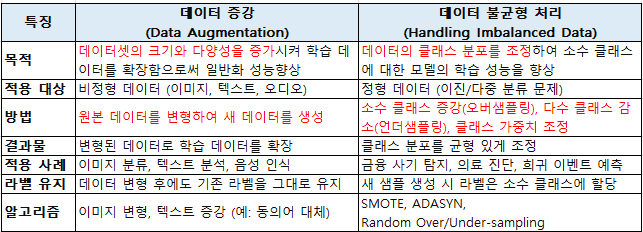

#  15 : CASE Study

---

  https://scikit-learn.org/stable/auto_examples/applications/index.html

 

  https://www.kaggle.com/

 

  참고 : https://github.com/dair-ai/ML-Course-Notes

 

# 최적화 방안

 

	[1] 데이터 처리 및 변환
		[1-1] 데이터 증강(Data Augmentation)
		[1-2] 교차 검증(Cross-Validation)
		[1-3] 데이터 스케일링(Data Scaling)
		[1-4] 데이터 불균형 처리(Handling Imbalanced Data)
		[1-5] 결측값 처리(Handling Missing Data)
		[1-6] 이상치 탐지(Outlier Detection)
		[1-7] 데이터 중복 제거(Data Deduplication)
		[1-8] 데이터 변환(Data Transformation)
		[1-9] 특성 엔지니어링(Feature Engineering)
		[1-10] 정보 병합(Data Fusion)
	
	[2] 모델 복잡도 및 일반화
		[2-1] 과적합 방지(Overfitting Prevention)
		[2-2] 정규화(L1, L2 Regularization)
		[2-3] 드롭아웃(Dropout)
		[2-4] 조기 종료(Early Stopping)
		[2-5] 앙상블 학습(Ensemble Learning)
		[2-6] 모델 해석성(Model Interpretability)
	
	[3] 하이퍼파라미터 최적화
		[3-1] 하이퍼파라미터 튜닝(Hyperparameter Tuning)
		[3-2] 그리드 서치(Grid Search)
		[3-3] 랜덤 서치(Random Search)
		[3-4] 베이즈 최적화(Bayesian Optimization)
		[3-5] 하이퍼파라미터 탐색 자동화(Automated Hyperparameter Tuning)
		[3-6] AutoML 활용(AutoML)
	
	[4] 학습 과정 최적화
		[4-1] 학습률 스케줄링(Learning Rate Scheduling)
		[4-2] 가중치 초기화(Weight Initialization)
		[4-3] 활성화 함수 선택(Activation Function Selection)
		[4-4] 최적화 알고리즘 선택(Optimizer Selection) : Adam, SGD, RMSprop
		[4-5] 전이 학습(Transfer Learning)
		[4-6] 모델 구조 최적화(Model Architecture Optimization)
		[4-7] 온라인 학습(Online Learning)
	
	[5] 성능 향상
		[5-1] 특성 중요도 분석 및 선택(Feature Importance & Selection)
		[5-2] 손실함수 커스터마이징(Custom Loss Function)
  
	[6] 하드웨어 및 시스템 최적화
		[6-1] 하드웨어 최적화(Hardware Optimization)

	[7] 모델 검증 및 비교
		[7-1] 모델 검증(Model Validation)
		[7-2] 모델 성능 비교(Model Performance Comparison) 

	[8] 기술 부채 관리
		[8-1] 기술 부채(Technical Debt) 관리

 

--- 

# [1] 데이터 처리 및 변환
## [1-1] 데이터 증강(Data Augmentation)
▣ 정의 : 기존 데이터셋을 변형하거나 가공하여 새로운 데이터를 생성하는 기법 
▣ 필요성 : 데이터 양이 부족하거나 데이터 다양성이 낮은 경우, 모델의 일반화 성능을 향상 
▣ 장점 : 데이터셋의 다양성을 인위적으로 증가, 추가적인 데이터 수집 없이 성능 향상, 과적합 방지 효과 
▣ 단점 : 증강된 데이터가 실제 데이터를 충분히 반영하지 않을 수 있으며, 처리 시간이 증가하며, 비효율적인 증강은 성능에 부정적 영향 
▣ 적용대상 알고리즘 : 딥러닝 알고리즘 (CNN, RNN 등), 이미지, 텍스트, 음성 처리 모델 

 

## [1-2] 교차 검증(Cross-Validation)
▣ 정의 : 데이터를 여러 부분으로 나누어 학습과 검증을 반복적으로 수행하여 모델의 일반화 성능을 평가 
▣ 필요성 : 과적합 및 과소적합 여부를 판별하거나, 데이터가 제한적일 때 모델의 성능을 신뢰성 있게 평가하기 위해 필요 
▣ 장점 : 데이터를 최대한 활용할 수 있으며, 다양한 데이터 분포에서 모델의 성능을 평가하고, 일반화 성능에 대한 신뢰도 증가 
▣ 단점 : 계산 비용이 증가하여 학습 시간이 오래 걸리며, 큰 데이터셋에서는 비효율적 
▣ 적용대상 알고리즘 : 모든 지도학습 알고리즘 (분류, 회귀 등), 특히 소규모 데이터셋에 적합 

 

## [1-3] 데이터 스케일링(Data Scaling)
▣ 정의 : 데이터의 특성 값을 일정한 범위나 분포로 변환하여 모델 학습에 적합한 형태(표준화(Standardization): 평균 0, 표준편차 1, 
정규화(Normalization): 최소-최대 스케일링 0-1)로 만드는 과정 
▣ 필요성 : 특성 간의 크기 차이가 클 경우, 모델 학습이 왜곡될 수 있기 때문에 이를 조정하여 학습 효율을 향상 
▣ 장점 : 모델 학습 안정성 향상, 학습 속도 증가, 성능 개선 가능 
▣ 단점 : 데이터 분포를 잘못 조정하면 오히려 성능 저하, 스케일링 단계에서 추가적인 계산이 필요 
▣ 적용대상 알고리즘 : 거리 기반 알고리즘 (KNN, SVM 등), 선형 모델 (로지스틱 회귀, 선형 회귀), 딥러닝 모델 

 

## [1-4] 데이터 불균형 처리(Handling Imbalanced Data)
 
▣ 정의 : 클래스 간 데이터 비율이 심각하게 불균형할 때, 모델의 학습 성능을 개선하기 위해 데이터를 조정 
▣ 필요성 : 불균형 데이터는 모델이 다수 클래스를 선호하도록 학습하게 만들기 때문에, 이를 해결하지 않으면 특정 클래스의 성능이 저하 
▣ 장점 : 클래스 간 균형을 맞춰 모델의 공정성과 성능 향상, 소수 클래스의 예측 성능을 개선 
▣ 단점 : 언더샘플링은 데이터 손실 가능성, 오버샘플링은 과적합 위험, 가중치 조정은 추가적인 하이퍼파라미터 조정 필요 
▣ 적용대상 알고리즘 : 모든 지도학습 알고리즘, 특히 분류 문제 (이진 분류, 다중 클래스 분류) 

**SMOTE (Synthetic Minority Over-sampling Technique)**  
기존의 소수 클래스 샘플을 기반으로 새로운 샘플을 선형 보간하여 생성하는 오버샘플링 기법 
소수 클래스의 데이터를 균일하게 증강하여 모델 학습 시 클래스 불균형 문제를 완화 
소수 클래스 데이터를 균일하게 증강하여 클래스 분포 균형에 효과적 
최근접 이웃계산 → 새로운 샘플 생성 → 증강과정 반복 

**ADASYN (Adaptive Synthetic Sampling Approach for Imbalanced Learning)**  
SMOTE의 확장으로, 소수 클래스 주변의 밀도에 따라 새로운 샘플을 생성 
소수 클래스 샘플의 부족으로 인해 발생하는 불균형 데이터를 해결하기 위해 설계된 오버샘플링 기법 
밀도가 낮은 영역에 더 많은 샘플을 생성하여 분류 경계에 가까운 학습하기 어려운 샘플에 초점 
밀도 계산 → 가중치 계산 → 샘플생성 비율 결정 → 새로운 샘플 생성 

 

## [1-5] 결측값 처리(Handling Missing Data)
▣ 정의 : 데이터셋에서 누락된 값(null, NaN)을 처리 
▣ 필요성 : 결측값은 알고리즘의 작동을 방해하거나 왜곡된 결과를 초래할 수 있으므로 필수적으로 필요 
▣ 주요 기법 : 결측값이 포함된 행이나 열을 제거(Deletion), 평균/중앙값/최빈값 등으로 대체(Imputation), 머신러닝 모델로 결측값 예측(Predictive Modeling), 유사한 관측치로 결측값 대체(KNN Imputation) 
▣ 장점 : 데이터 품질 향상으로 모델 성능 개선, 안정적이고 신뢰성 있는 학습 가능 
▣ 단점 : 과도한 삭제는 데이터 손실 위험, 부정확한 대체는 모델 편향을 초래할 수 있음 
▣ 적용대상 알고리즘 : 선형 회귀, 의사결정 나무, 신경망 등 대부분의 머신러닝 알고리즘 

 

## [1-6] 이상치 탐지(Outlier Detection)
▣ 정의 : 데이터 분포에서 비정상적으로 벗어난 데이터를 탐지하고 처리 
▣ 필요성 : 이상치는 데이터 분포를 왜곡하고 모델 성능을 저하시킬 수 있으므로 식별과 처리가 필요 
▣ 주요 기법 : 통계 기반 기법(사분위 범위(IQR), 중앙값 절대 편차(MAD), Z-Score), 머신러닝 기법(Isolation Forest, DBSCAN, One-Class SVM), 시각화 기반 탐지(Box Plot, Scatter Plot) 
▣ 장점 : 데이터 신뢰성과 모델 일반화 성능 강화, 잠재적 오류를 식별하여 문제 예방 
▣ 단점 : 과도한 탐지 기준은 중요한 데이터를 제거할 위험, 고차원 데이터에서는 탐지가 어려움 
▣ 적용대상 알고리즘 : 회귀분석, PCA, 클러스터링, 랜덤 포레스트, 딥러닝 등 

 

## [1-7] 데이터 중복 제거(Data Deduplication)
▣ 정의 : 동일하거나 유사한 데이터를 탐지하고 제거하여 데이터셋의 일관성과 정확성을 높이는 과정 
▣ 필요성 : 중복 데이터는 분석 및 모델 학습에 편향을 초래, 데이터 크기를 줄여 처리 속도와 저장소 비용을 절감, 일관된 데이터셋을 확보하여 분석 신뢰성을 높임 
▣ 주요 기법 : 정확히 일치하는 중복 제거, 고유 식별자를 활용한 중복 탐지(키 기반 필터링), 텍스트 유사도 계산(Jaccard, Cosine Similarity), MinHash를 사용한 유사성 탐지, SQL 쿼리를 활용한 중복 제거 
▣ 장점 : 데이터 크기 감소로 처리 효율성 향상, 중복 데이터로 인한 왜곡 감소, 데이터 일관성과 신뢰성 확보 
▣ 단점 : 유사성 기준을 설정하기 어려울 수 있으며, 대규모 데이터에서 탐지 및 제거 과정이 비용이 많이 들 수 있음, 잘못된 제거는 중요한 데이터를 손실시킬 가능성 
▣ 적용대상 알고리즘 : 데이터베이스 관리 및 전처리 단계에서 활용, 데이터셋 크기에 민감한 알고리즘(KNN, 군집화) 

 

## [1-8] 데이터 변환(Data Transformation)
▣ 정의 : 데이터를 모델에 적합한 형식으로 조정하거나, 성능 최적화를 위해 데이터를 변형 
▣ 필요성 : 데이터 분포를 조정하여 학습 알고리즘의 성능 최적화, 입력 데이터가 알고리즘의 요구사항에 맞도록 준비, 이상치, 불균형 데이터 등의 영향을 최소화 
▣ 주요 기법 : 로그 변환(비대칭 분포를 정규 분포로 조정), 스케일링(Min-Max, Standardization), 범주형 변환(원-핫 인코딩, 라벨 인코딩), 차원 축소(PCA, t-SNE) 
▣ 장점 : 데이터의 분포를 정규화하여 학습 효과 증가, 다양한 알고리즘에서 안정적인 성능 확보, 해석 가능성을 높여 데이터 이해도 향상 
▣ 단점 : 적절한 변환 기법 선택이 어려울 수 있음, 원본 데이터의 의미가 왜곡될 가능성, 고차원 데이터에서는 변환 비용 증가 
▣ 적용대상 알고리즘 : 회귀 모델, 딥러닝, PCA, SVM 등 

 

## [1-9] 특성 엔지니어링(Feature Engineering)
▣ 정의 : 모델 성능을 최적화하기 위해 데이터를 변형하거나 새로운 특성을 생성하거나 변환, 선택 등의 작업 
▣ 필요성 : 고품질 특성은 모델의 성능을 크게 향상, 데이터의 의미를 반영하여 복잡한 패턴을 학습할 수 있도록 도움, 특성 중요도를 평가하여 불필요한 변수 제거 가능 
▣ 주요 기법 : 수학적 조합과 도메인 지식을 활용한 파생 특성 생성, 로그 변환과 다항식 변환으로 특성 변환, 모델 기반 선택(Lasso, XGBoost), 중요도 평가(LIME, SHAP)* 및 차원 축소(PCA, t-SNE)로 특성 선택 
▣ 장점 : 모델 성능을 큰 폭으로 개선 가능, 도메인 지식을 반영하여 더 나은 해석 가능, 중요하지 않은 특성을 제거해 학습 속도 향상 
▣ 단점 : 높은 도메인 지식 요구, 시간과 자원 소모, 잘못된 특성 생성은 모델 성능 저하 
▣ 적용대상 알고리즘 : 선형 모델, 의사결정 나무, 랜덤 포레스트, 딥러닝 등 대부분의 알고리즘 
**LIM(Local Interpretable Model-agnostic Explanations)** : 모델에 관계없이 로컬(Local) 단위에서 특정 예측에 대해 모델이 왜 그와 같은 결정을 내렸는지를 설명(개별 데이터 포인트에 대해 각 특성(feature)이 예측값에 얼마나 기여했는지 나타냄) 
**SHAP(SHapley Additive exPlanations)** : 각 특성이 예측값에 기여하는 정도를 공정하게 분배하는 방법론으로, 모든 특성 조합에서의 평균 기여도를 계산 
 

## [1-10] 정보 병합(Data Fusion)
▣ 정의 : 여러 데이터 소스를 결합하여 단일하고 일관성 있는 데이터셋을 생성 
▣ 필요성 : 다양한 소스에서 수집된 데이터를 통합하여 더 풍부한 정보를 제공, 데이터 중복 및 불일치를 해결하여 분석 가능성을 높임 
▣ 주요 기법 : 서로 다른 스키마 간 매핑 정의(Data Mapping), 동일한 데이터 포인트 중복 제거(Deduplication), 다양한 형식을 통일된 형식으로 데이터 정규화(Normalization) 
▣ 장점 : 데이터 활용 가능성 증대, 복합적인 문제에 대한 다각적 분석 가능 
▣ 단점 : 데이터 소스 간 일치성 문제가 발생할 수 있음, 통합 규칙 설정과 변환 과정이 복잡 
▣ 적용대상 알고리즘 : 데이터 통합 후 모든 머신러닝 알고리즘에 적용 가능 

 

---

# [2] 모델 복잡도 및 일반화
## [2-1] 과적합 방지(Overfitting Prevention)
▣ 정의 : 모델이 학습 데이터에만 지나치게 적응하지 않도록 제어하여, 새로운 데이터에서도 일반화된 성능을 유지하도록 다양한 기법의 조합 
▣ 필요성 : 모델이 학습 데이터의 노이즈나 불필요한 패턴을 학습하지 않고 테스트 데이터나 실전 데이터에서도 높은 성능을 유지하도록 보장 
▣ 주요 기법 : 데이터 관련(Data Augmentation, Cross Validation), 모델 관련(Model Simplification, Regularization, Dropout), 훈련 관련(Early Stopping) 
▣ 장점 : 테스트 데이터에서의 안정적인 성능 확보, 일반화 성능 향상, 예측 모델의 신뢰도 증가 
▣ 단점 : 과적합 방지 기법이 과도하게 적용되면 과소적합(Underfitting), 최적의 설정을 찾기 위한 추가적인 실험과 조정이 필요 
▣ 적용대상 알고리즘 : 모든 머신러닝 및 딥러닝 알고리즘 

 

## [2-2] 정규화(L1, L2 Regularization)
▣ 정의 : 모델의 복잡성을 줄이기 위해 손실 함수에 패널티를 추가하여 모델 파라미터의 크기를 제어(L1 정규화: 가중치의 절댓값 합, L2 정규화: 가중치의 제곱합) 
▣ 필요성 : 모델이 불필요하게 큰 가중치를 학습하여 과적합되는 것을 방지 
▣ 주요 기법 : L1 정규화(Lasso Regression), L2 정규화(Ridge Regression), L1과 L2 혼합(Elastic Net) 
▣ 장점 : L1은 희소 모델(sparse model)을 생성하여 중요한 특성을 선택하는 데 유용, L2는 과도한 가중치를 줄여 모델 안정성 향상 
▣ 단점 : 과소적합 가능성, 정규화 강도를 조정하기 위한 하이퍼파라미터(λ) 선택 필요 
▣ 적용대상 알고리즘 : 선형 회귀(Linear Regression), 로지스틱 회귀(Logistic Regression), 서포트 벡터 머신(SVM), 뉴럴 네트워크 

 

## [2-3] 드롭아웃(Dropout)
▣ 정의 : 학습 과정에서 뉴런의 일부를 랜덤하게 비활성화하여(=0으로 설정) 네트워크가 특정 뉴런에 의존하지 않도록 하는 기법 
▣ 필요성 : 신경망에서의 과적합 문제를 완화하여 더 일반화된 성능을 도모 
▣ 주요 기법 : 표준 드롭아웃(훈련 중 무작위로 노드 비활성화), Spatial Dropout(CNN에서 특정 필터를 비활성화), DropConnect(가중치를 무작위로 제거) 
▣ 장점 : 과적합 방지, 네트워크 구조에 레이어별 다양성을 부여 
▣ 단점 : 학습 시간이 늘어날 수 있으며, 테스트 시 드롭아웃을 적용하지 않기 때문에 추가적인 처리 단계가 필요 
▣ 적용대상 알고리즘 : 신경망 기반 모델(CNN, RNN, Transformer 등) 

 

## [2-4] 조기 종료(Early Stopping)
▣ 정의 : 학습 중 검증 세트의 성능이 더 이상 개선되지 않는 시점에서 학습을 중단 
▣ 필요성 : 학습을 너무 오래 진행할 경우 모델이 학습 데이터에 과적합될 위험을 줄이기 위함 
▣ 주요 기법 : 검증 손실 모니터링(검증 손실이 감소하지 않을 경우 중단), Patience 설정(특정 에포크 동안 향상이 없을 때 종료) 
▣ 장점 : 과적합 방지, 불필요한 학습 시간 절약 
▣ 단점 : 검증 데이터의 성능을 과도하게 의존하거나, 최적의 종료 시점 결정 곤란 
▣ 적용대상 알고리즘 : 모든 딥러닝 모델, 일부 머신러닝(Gradient Boosting) 등 에폭(Epoch)*이 긴 경우 
   * 모델 학습 과정에서 전체 데이터셋을 여러 번 반복해서 학습하는 횟수(데이터셋의 모든 샘플이 모델에 입력되어 가중치가 업데이트되는 과정을 한번 완료하는 것이 1 에폭) 

 

## [2-5] 앙상블 학습(Ensemble Learning)
▣ 정의 : 여러 개의 모델을 결합(배깅: 각 모델의 독립적인 학습, 부스팅: 각 모델이 순차적으로 학습, 스태킹: 서로다른 모델의 예측결과 결합) 
▣ 필요성 : 단일 모델의 한계를 극복하고, 데이터의 다양한 패턴을 더 잘 학습 
▣ 주요 기법 : 스태킹, 배깅(Random Forest), 부스팅(AdaBoost, Gradient Boosting, XGBoost, LightGBM) 
▣ 장점 : 높은 성능과 일반화 능력, 다양한 데이터 및 모델 유형에 적용 가능 
▣ 단점 : 계산 비용 증가, 구현 복잡성 
▣ 적용대상 알고리즘 : 모든 지도 학습 알고리즘(분류, 회귀 등) 

 

## [2-6] 모델 해석성 (Model Interpretability)
▣ 정의 : 모델이 내린 예측 결과에 대해 설명 가능하도록 하는 기법 
▣ 필요성 : 블랙박스 모델(딥러닝, 앙상블)의 투명성 확보, 비즈니스나 의료 등 고위험 분야에서 신뢰 확보 
▣ 주요 기법 : LIME(특정 예측 로컬 단위에서 단순 모델로 근사), SHAP(특징별 기여도를 계산하여 예측에 대한 글로벌 및 로컬 해석 제공) 
▣ 장점 : 사용자 신뢰 확보, 모델 디버깅 및 개선 가능 
▣ 단점 : 계산 비용이 높음, 높은 차원의 데이터에서 복잡성 증가 
▣ 적용대상 알고리즘 : 모든 블랙박스 모델 (e.g., 신경망, 앙상블 학습 모델) 

 

---

# [3] 하이퍼파라미터 최적화
## [3-1] 하이퍼파라미터 튜닝(Hyperparameter Tuning)
▣ 정의 : 하이퍼파라미터는 학습 과정에서 사용자가 사전에 설정하는 변수로, 학습률, 정규화 강도, 의사결정나무의 최대 깊이 등 등을 조정하여 모델의 성능을 최적화하는 과정 
▣ 필요성 : 최적의 하이퍼파라미터를 찾지 못하면 과적합, 과소적합 또는 학습 속도 저하가 발생 
▣ 장점 : 모델 성능 극대화 가능, 다양한 데이터와 문제 유형에 적용 가능 
▣ 단점 : 계산 비용이 많이 들고, 시간이 오래 걸릴 수 있으며, 탐색 공간이 커질수록 복잡도 증가 
▣ 적용대상 알고리즘 : 모든 머신러닝 및 딥러닝 알고리즘 

 

## [3-2] 그리드 서치(Grid Search)
▣ 정의 : 하이퍼파라미터의 모든 조합을 체계적으로 탐색하여 최적의 하이퍼파라미터를 찾는 방법 
▣ 필요성 : 체계적으로 모든 조합을 탐색하므로 최적의 설정을 찾을 가능성이 높음 
▣ 장점 : 간단하고 직관적이며 구현이 용이하며, 하이퍼파라미터 조합의 전 범위를 탐색 가능 
▣ 단점 : 탐색 공간이 커질수록 계산 비용과 시간이 기하급수적으로 증가하며, 불필요한 조합까지 계산할 수 있음 
▣ 적용대상 알고리즘 : 모든 머신러닝 및 딥러닝 알고리즘, 하이퍼파라미터 공간이 비교적 작은 문제에 적합 

 

## [3-3] 랜덤 서치(Random Search)
▣ 정의 : 하이퍼파라미터의 값들을 임의로 선택하여 최적의 조합을 탐색 
▣ 필요성 : 그리드 서치보다 계산 효율성을 높이며, 더 큰 탐색 공간에서 효과적으로 탐색 
▣ 장점 : 계산 효율성 증대, 적은 계산으로도 높은 성능의 하이퍼파라미터를 찾을 가능성 
▣ 단점 : 최적의 조합을 반드시 찾지 못할 가능성, 탐색 결과가 실행마다 달라질 수 있음 
▣ 적용대상 알고리즘 : 모든 머신러닝 및 딥러닝 알고리즘, 대규모 하이퍼파라미터 공간에 적합 

 

## [3-4] 베이즈 최적화(Bayesian Optimization)
▣ 정의 : 이전 탐색 결과를 바탕으로 하이퍼파라미터 공간을 효율적으로 탐색하여 최적값을 찾는 방법으로 확률 모델(예: 가우시안 프로세스)을 활용하여 탐색 
▣ 필요성 : 계산 비용이 높은 문제에서 효율적으로 최적의 하이퍼파라미터를 찾기 위해 필요 
▣ 장점 : 효율적인 탐색으로 계산 자원을 절약, 이전 결과를 바탕으로 탐색하여 빠른 수렴 
▣ 단점 : 구현 및 이해가 복잡할 수 있으며, 탐색 초기에는 성능이 낮을 수 있음 
▣ 적용대상 알고리즘 : 계산 비용이 높은 머신러닝(랜덤 포레스트) 및 딥러닝 모델 

 

## [3-5] 하이퍼파라미터 탐색 자동화(Automated Hyperparameter Tuning)
▣ 정의 : 하이퍼파라미터 튜닝 과정을 자동화하여 최적화된 하이퍼파라미터를 찾는 기법 
▣ 필요성 : 수동으로 하이퍼파라미터를 조정하는 데 드는 시간과 노력을 줄이기 위해 필요 
▣ 장점 : 효율적이고 편리하며 반복 가능, 초보자도 고성능 모델 구현 가능 
▣ 단점 : 도구 및 알고리즘의 제한 사항에 따라 최적 성능을 보장하지 못할 수도 있으며, 도구 사용에 따른 비용 발생 가능 
▣ 적용대상 알고리즘 : 모든 머신러닝 및 딥러닝 알고리즘, 특히 AutoML을 사용하는 대규모 프로젝트 

 

## [3-6] AutoML(Automated Machine Learning) 활용
▣ 정의 : AutoML (Automated Machine Learning)은 머신러닝 모델 개발의 전 과정을 자동화하는 기술 또는 도구 
▣ 필요성 : 전문가 부족 문제 해결, 시간과 자원 절약, 최적의 모델 탐색, 데이터 증가와 복잡성 대응, 초기 프로토타이핑 
▣ 주요기법  : 자동 데이터 전처리, 모델 선택 (Algorithm Selection), 하이퍼파라미터 튜닝, 파이프라인 자동화 (Pipeline Optimization), 메타러닝 (Meta-Learning), 신경 아키텍처 검색 (Neural Architecture Search, NAS), 앙상블 기법 
▣ 장점 : 사용 용이성, 시간 절약, 효율성, 범용성, 성능 최적화 
▣ 단점 : 설명 가능성 부족, 제한된 커스터마이징, 계산 비용, 기술적 제약, 데이터 전처리 한계 
▣ 적용대상 알고리즘 : 기본 머신러닝 알고리즘, 앙상블, 딥러닝, 신경 아키텍처 검색 (NAS), 시계열 예측, 강화학습 

 

---

# [4] 학습 과정 최적화
## [4-1] 학습률 스케줄링(Learning Rate Scheduling)
▣ 정의 : 학습률(Learning Rate)을 학습 과정 중에 동적으로 조정하여 최적화 성능과 속도를 향상시키는 방법(Step Decay: 일정 에포크마다 학습률 감소, Exponential Decay: 학습률을 지수적으로 감소, Cosine Annealing: 학습률을 점진적으로 낮추는 방식) 
▣ 필요성 : 고정된 학습률은 초기와 후반부 학습에 비효율적일 수 있으며, 초기에는 빠른 학습, 후반부에는 안정적인 수렴이 필요 
▣ 장점 : 학습 속도와 최적화 안정성을 모두 확보 가능하며, 과적합 방지에 도움 
▣ 단점 : 적절한 스케줄을 설정하지 않으면 성능 저하 가능성, 추가적인 하이퍼파라미터 조정 필요 
▣ 적용대상 알고리즘 : 주로 딥러닝 알고리즘, 특히 SGD, Adam과 같은 옵티마이저를 사용하는 모델 

 

## [4-2] 가중치 초기화(Weight Initialization)
▣ 정의 : 모델의 가중치 값을 학습 초기에 적절히 설정하여 학습 과정을 안정화하는 기법(Xavier Initialization: 입력 및 출력 노드 수에 기반, He Initialization: ReLU 계열 활성화 함수에 적합) 
▣ 필요성 : 잘못된 초기화는 기울기 소실(Vanishing Gradient)이나 폭발(Exploding Gradient)을 유발할 수 있음. 
▣ 장점 : 학습 초기 안정성 향상, 빠른 수렴 가능 
▣ 단점 : 일부 알고리즘에서 특정 초기화 전략이 더 적합하므로 적절한 선택 필요 
▣ 적용대상 알고리즘 : 딥러닝 모델 (특히 심층 신경망) 

 

## [4-3] 활성화 함수 선택(Activation Function Selection)
▣ 정의 : 뉴런의 출력 값을 비선형적으로 변환하여 학습 가능한 패턴을 늘리는 역할을 하는 활성화 함수를 선택하는 과정 
(Sigmoid: [0, 1] 출력, 이진 분류에서 사용, ReLU: 비선형성 제공, 기울기 소실 문제 완화, Leaky ReLU: ReLU의 변형, 음수 구간 기울기 보정, Softmax: 다중 클래스 확률 분포 출력) 
▣ 필요성 : 적절한 활성화 함수 선택은 학습 효율성과 성능에 큰 영향을 미침 
▣ 장점 : 비선형성을 도입하여 복잡한 문제를 해결 가능하고, 다양한 데이터 유형과 문제에 맞게 조정 가능 
▣ 단점 : 잘못된 활성화 함수 선택 시 학습 속도 저하나 성능 악화, 특정 함수는 기울기 소실 문제 발생 가능(Sigmoid, Tanh) 
▣ 적용대상 알고리즘 : 모든 딥러닝 알고리즘 

 

## [4-4] 최적화 알고리즘 선택(Optimizer Selection) : Adam, SGD, RMSprop
### [4-4-1] Adam (Adaptive Moment Estimation)
▣ 정의: Stochastic Gradient Descent(SGD)의 확장으로 모멘텀과 적응 학습률(Adaptive Learning Rate)을 결합한 최적화 알고리즘. 딥러닝에서 널리 사용(과거의 그래디언트 정보를 활용하여 학습 속도를 가속화하고 안정성을 높임) 
▣ 필요성 : 복잡한 비선형 함수에서 경사 하강법(SGD)이 수렴하기 어려운 문제를 해결하기 위해 사용 
▣ 주요 기법 : 그래디언트의 과거 방향(누적)을 참고하여 업데이트를 가속화(Momentum), 각 매개변수의 그래디언트 크기에 따라 학습률을 조정하는 적응 학습률 (Adaptive Learning Rate), 이동 평균 (Exponential Moving Averages) 
▣ 장점 : 학습률 조정이 자동으로 이루어짐, 빠른 수렴 속도, 스파스 데이터 처리에 효과적, 과거 그래디언트 정보를 활용해 진동(oscillation) 감소 
▣ 단점 : 학습률이 점점 작아져, 수렴 속도가 느려질 수 있음, 추가 하이퍼파라미터 설정 필요, 과적합 가능성 
▣ 적용대상 알고리즘 : 딥러닝에서 주로 사용(CNN, RNN, GAN, Transformer 등) 

### [4-4-2] SGD(Stochastic Gradient Descent)
▣ 정의 : 경사 하강법(Gradient Descent)의 변형으로, 각 배치(batch) 또는 샘플에 대해 손실 함수의 그래디언트를 계산하여 가중치를 업데이트하는 알고리즘 
▣ 필요성 : 데이터가 클수록 전체 데이터셋에서 그래디언트를 계산하는 데 시간이 오래 걸리는 문제를 해결하기 위해 배치 단위로 업데이트하여 속도를 개선 
▣ 주요 기법 : 배치에 대해 그래디언트를 계산하고 즉각적으로 업데이트, 전체 데이터가 아닌 일부 데이터(배치)를 활용한 확률적 접근 
▣ 장점 : 대규모 데이터에서도 사용 가능한 계산 효율성, 간단한 구현으로 모델 일반화(generalization)에 유리 
▣ 단점 : 손실 함수의 최저점 주변에서 진동(oscillation : 손실 함수의 그래프에서 최저점(최적값, Optimum) 주변에서 모델의 가중치 업데이트 방향이 계속 바뀌는 현상)이 발생할 수 있으며. 학습률 설정이 민감하고, 느린 수렴 속도 
▣ 적용대상 알고리즘 : 머신러닝 및 딥러닝: Logistic Regression, Linear Regression, CNN, RNN 

### [4-4-3] RMSprop
▣ 정의 : 경사 하강법의 수렴 속도를 개선하기 위해 만들어진 학습률 감소(Adaptive Learning Rate)와 루트 평균 제곱(Root Mean Square Propagation) 개념을 활용한 최적화 알고리즘 
▣ 필요성 : 학습 과정에서 그래디언트의 크기가 지나치게 크거나 작아지는 문제를 해결하기 위해 필요 
▣ 주요 기법 : 각 매개변수의 그래디언트 크기를 기준으로 학습률을 조정, 그래디언트의 제곱 평균을 계산하고, 이를 사용해 학습률을 업데이트 
▣ 장점 : 진동(oscillation) 감소, 학습률이 자동으로 조정되어 손실 함수의 좁은 골짜기를 빠르게 탐색, SGD보다 안정적 
▣ 단점 : 장기적으로는 적응 학습률이 너무 작아져 학습이 중단될 수 있음, 하이퍼파라미터 설정 필요 
▣ 적용대상 알고리즘 : RNN 및 LSTM 같은 시계열 데이터 처리 모델, CNN 기반 모델 

 

## [4-5] 전이 학습(Transfer Learning)
▣ 정의 : 사전 학습된 모델의 가중치를 새로운 문제에 재사용하여 학습 시간을 단축하고 성능을 향상시키는 기법(Pre-trained Model Utilization) 
▣ 필요성 : 데이터 부족 상황에서 강력한 성능을 보장, 학습 시간을 크게 단축 
▣ 장점 : 적은 데이터로도 높은 성능 가능, 빠른 학습과 높은 초기 성능 
▣ 단점 : 사전 학습 모델이 새로운 문제에 최적화되지 않을 수 있으며, 사전 학습된 데이터셋과 도메인 차이가 클 경우 성능 저하 
▣ 적용대상 알고리즘 : 이미지 처리(CNN), 자연어 처리(Transformer, GPT) 

 

## [4-6] 모델구조 최적화(Model Architecture Optimization)
▣ 정의 : 모델의 구조(레이어 수, 뉴런 수, 연결 방식 등)를 최적화하여 학습 성능을 극대화하는 과정 
▣ 필요성 : 복잡한 모델 구조는 과적합 위험 증가, 단순한 구조는 표현력이 부족하므로 적절한 균형 필요 
▣ 장점 : 데이터와 문제에 적합한 모델 설계 가능, 과적합 위험 감소 
▣ 단점 : 설계에 많은 시간과 리소스 소모, 자동화 도구 사용 시 높은 계산 비용 발생 가능 
▣ 적용대상 알고리즘 : 딥러닝 모델 (특히 신경망) 

 

## [4-7] 온라인 학습(Online Learning)
▣ 정의 : 점진적으로 데이터를 학습하며 새로운 데이터가 들어올 때마다 모델을 업데이트하는 기법 
▣ 필요성 : 데이터가 실시간으로 수집되거나, 저장 공간이 제한적인 경우 
▣ 장점 : 실시간 데이터 처리 가능, 메모리 사용량 감소 
▣ 단점 : 잘못된 데이터가 들어오면 모델에 즉시 영향을 미칠 수 있으며, 학습 과정 추적 및 디버깅이 어려움 
▣ 적용대상 알고리즘 : 실시간 데이터 처리 모델 (예: 온라인 추천 시스템, 실시간 예측 모델), SGD 기반 알고리즘 
Scikit-learn에서 SGDClassifier, SGDRegressor, PassiveAggressiveClassifier, PassiveAggressiveRegressor 등 제공(partial_fit() 메서드를 지원하는 모델은 일부에 한정) 

 

---

# [5] 성능 향상
## [5-1] 특성 중요도 분석 및 선택(Feature Selection)
▣ 정의 : 모델 성능에 가장 큰 영향을 미치는 중요한 특성을 식별하고, 불필요하거나 상관성이 낮은 특성을 제거하는 과정 
(Filter Methods: 상관계수, 카이제곱 검정 등, Wrapper Methods: 순차전진선택(SFS), 순차후진제거(SBS), Embedded Methods: L1 정규화, 랜덤 포레스트 기반 중요도) 
▣ 필요성 : 고차원 데이터에서 불필요한 특성은 학습 시간을 증가시키고 모델의 일반화 성능을 저하시킬 수 있으며, 특성 선택은 모델 단순화와 성능 향상에 기여 
▣ 장점 : 과적합 위험 감소, 학습 시간 단축, 모델 해석 가능성 증가 
▣ 단점 : 특성 선택 과정이 계산 비용이 많이 들 수 있으며, 중요한 특성을 놓칠 가능성 
▣ 적용대상 알고리즘 : 모든 지도 학습 알고리즘, 특히 고차원 데이터셋이 포함된 문제 
Scikit-learn에서 Variance Threshold(특성의 분산이 낮은 특성 제거), SelectKBest(가장 중요한 K개의 특성을 선택), SelectPercentile(상위 n%의 특성을 선택) 함수 제공 

 

## [5-2] 손실함수 커스터마이징(Custom Loss Function)
▣ 정의 : 문제의 특성과 요구사항에 맞게 손실 함수를 새로 설계하거나 기존 손실 함수를 변형하여 사용 
▣ 필요성 : 기본 손실 함수가 문제의 목표를 충분히 반영하지 못할 경우, 성능을 향상시키기 위해 필요 
▣ 장점 : 문제의 요구사항에 특화된 성능 향상 가능, 손실 함수 자체가 모델 학습 방향을 결정하기 때문에 세밀한 조정 가능 
▣ 단점 : 구현이 복잡할 수 있으며, 손실 함수 설계 오류는 학습 성능 저하로 이어질 가능성 
▣ 적용대상 알고리즘 : 모든 머신러닝 및 딥러닝 알고리즘, 특히 비정형 데이터, 불균형 데이터 문제에 적합 
Scikit-learn에서는 주로 커스텀 손실 함수를 통합하려면 make_scorer를 사용하여 평가 지표로 정의 

 

---

# [6] 하드웨어 및 시스템 최적화
## [6-1] 하드웨어 최적화(Hardware Optimization)
▣ 정의 : 모델 학습 및 추론과정에서 GPU, TPU 등 하드웨어 가속기를 활용하거나, 병렬 처리와 분산 학습을 통해 계산성능을 극대화하는 기법 
▣ 필요성 : 딥러닝 및 대규모 데이터 처리 모델에서 계산량이 많아지는 문제를 해결하기 위해 필요 
▣ 장점 : 학습 속도 및 추론 속도 향상, 대규모 데이터와 모델을 처리할 수 있는 확장성 제공 
▣ 단점 : 하드웨어 장비의 초기 비용이 높으며, 하드웨어 최적화를 위한 추가적인 설정과 기술 지식 필요 
▣ 적용대상 알고리즘 : 딥러닝 모델 (CNN, RNN, Transformer 등), 대규모 데이터 처리 및 병렬화가 가능한 모든 알고리즘 

 

---

# [7] 모델 검증 및 비교
## [7-1] 모델 검증(Model Validation)
▣ 정의 : 머신러닝 모델이 학습되지 않은 데이터에서 얼마나 잘 일반화되는지 평가하는 과정 
▣ 필요성 : 학습 데이터에만 잘 작동하는 모델이 실제 데이터에서 성능이 저하되는 것을방지하기 위해 필요 
▣ 주요기법 :  
Hold-Out Method(일반적으로 학습 데이터:검증 데이터 = 80:20 또는 70:30 비율로 구분) 
K-Fold Cross Validation(데이터를 K개의 폴드로 나눈 뒤, 각 폴드를 검증 데이터로 번갈아가며 사용) 
Stratified K-Fold Cross Validation(K-Fold Cross Validation의 변형으로, 클래스 비율이 균등하도록 데이터를 나눔) 
Leave-One-Out Cross Validation (LOOCV): 데이터의 각 샘플을 한 번씩 검증 데이터로 사용 
Time Series Validation: 시계열 데이터에 적합한 방법으로, 과거 데이터를 학습 데이터로 사용하고 미래 데이터를 검증 데이터로 사용 
Bootstrap Method: 데이터를 무작위로 복원 샘플링하여 여러 학습 데이터 세트를 생성하고 검증 
▣ 장점 : 일반화 능력 향상, 객관적 평가, 과적합/과소적합 확인 
▣ 단점 : 추가 데이터 필요, 시간 비용 증가, 과도한 최적화 위험 
▣ 적용대상 알고리즘 : 모든 머신러닝 및 딥러닝 모델에 적용 

## [7-2] 모델 성능 비교(Model Performance Comparison) 
▣ 정의 : 여러 모델 간의 성능을 평가하고 가장 적합한 모델을 선택하는 과정 
▣ 필요성: 최적의 모델 선택, 효율적인 자원 활용 
▣ 주요 기법: 평가 지표 사용, Cross Validation, 통계적 테스트(t-테스트 또는 ANOVA), 앙상블 비교, 시간 복잡도 및 자원 사용 평가, AutoML 활용 
▣ 장점 : 가장 적합한 모델 선택 가능, 객관적인 비교 
▣ 단점 : 시간과 자원 소모, 모델 복잡도 증가 
▣ 적용대상 알고리즘: 머신러닝 알고리즘, 딥러닝  

 

---

# [8] 기술 부채 관리
## [8-1] 기술 부채(Technical Debt) 관리
▣ 정의 :  소프트웨어 개발 과정에서 단기적인 목표를 달성하기 위해 빠르고 비효율적인 해결책을 선택함으로써 발생하는 미래의 추가 작업 
▣ 필요성 : 장기적 유지보수 비용 감소, 시스템 안정성 보장, 기술 스택 개선, 팀 생산성 향상, 비즈니스 민첩성 향상 
▣ 주요기법 : 코드 리뷰(Code Review), 리팩토링(Refactoring), 자동화 테스트(Automated Testing), CI/CD (Continuous Integration/Continuous Deployment), 기술 부채 측정 도구 사용, 데브옵스(DevOps)와 협업 강화, 기술 부채 목록화 (Debt Backlog), 정기적인 기술 스택 업데이트 
▣ 장점 : 장기적인 유지보수 비용 감소, 시스템 성능 개선, 개발 생산성 향상, 비즈니스 민첩성 증가, 팀 협업 강화 
▣ 단점 : 초기 시간과 비용 증가, 우선순위 설정의 어려움, 완벽한 제거는 불가능, 단기적인 속도 저하, 측정의 어려움 
▣ 적용대상 알고리즘 : 머신러닝 및 데이터 파이프라인, 웹 개발 프레임워크, 알고리즘 최적화 

 

---
